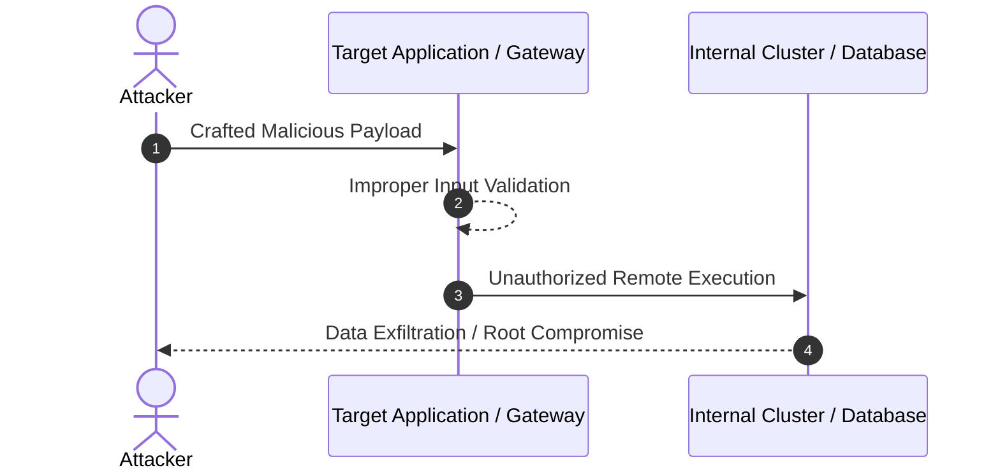

# Emergency Incident & CVE Analysis Runbook (CCG Fast-Track)

Use this skill when urgent security incidents, zero-day vulnerabilities, or critical CVEs (CVSS >= 8.0) need rapid, high-accuracy analysis and post publication.

```
┌────────────────────────────────────────────────────────────────────────┐
│                   Emergency Incident Trigger                           │
│        (e.g., CVE-2026-XXXX, Cloud Outage, Critical Patch)            │
└───────────────────────────────────┬────────────────────────────────────┘
                                    │
                                    ▼
┌────────────────────────────────────────────────────────────────────────┐
│  Phase 1: Gemini Rapid Reconnaissance (1M Context)                     │
│  - Query NVD / Vendor Advisories / Mitre / Upstream GitHub advisories │
│  - Extract Attack Vector, CVSS Score, Affected Components & Versions   │
└───────────────────────────────────┬────────────────────────────────────┘
                                    │
                                    ▼
┌────────────────────────────────────────────────────────────────────────┐
│  Phase 2: Codex Mitigation Policy & Detection Generation               │
│  - Generate detection rule: Falco rule / Sigma rule / Rego policy /    │
│    Kubernetes Admission Controller Webhook / AWS WAF rule              │
│  - Verify syntax and safety                                            │
└───────────────────────────────────┬────────────────────────────────────┘
                                    │
                                    ▼
┌────────────────────────────────────────────────────────────────────────┐
│  Phase 3: Claude Content Synthesis & Post Architecture                 │
│  - Structure: Incident Timeline -> RCA -> Impact -> Mitigation -> Runbook│
│  - Generate Mermaid Attack Flow & Mitigation Diagram                   │
│  - Front Matter: category: incident or security, HH >= 09:00           │
└───────────────────────────────────┬────────────────────────────────────┘
                                    │
                                    ▼
┌────────────────────────────────────────────────────────────────────────┐
│  Phase 4: AGY Verification Gate & Publish                              │
│  - python3 scripts/generate_post_images.py assets/images/YYYY-MM-DD-*.svg│
│  - python3 scripts/check_posts.py                                      │
│  - python3 scripts/fix_links_unified.py --fix                          │
└────────────────────────────────────────────────────────────────────────┘
```

## Post Template for Incident / CVE Analysis

```markdown
---
layout: post
title: "[CVE-YYYY-XXXX] Title: Vulnerability Analysis & Mitigation Guide"
date: YYYY-MM-DD 09:00:00 +0900
category: incident
categories: [security, incident]
tags: [cve-yyyy-xxxx, kubernetes, zero-day, remediation]
excerpt: "취약점 핵심 요약 및 긴급 조치 가이드 (150~200자)"
image: /assets/images/YYYY-MM-DD-English_Title.svg
---

## 1. 개요 및 취약점 정보 (Overview & CVE Details)

| 항목 | 상세 정보 |
|---|---|
| **CVE ID** | CVE-YYYY-XXXX |
| **CVSS v3/v4 Score** | 9.8 (Critical) |
| **영향 범위** | Version X.Y.Z ~ A.B.C |
| **공격 벡터** | Network / Unauthenticated Remote Code Execution |
| **패치 상태** | Hotfix Released / Workaround Available |

## 2. 공격 메커니즘 및 아키텍처 흐름 (Attack Flow & Architecture)



## 3. 침해 지표 및 탐지 방안 (IoC & Detection Rules)

### Falco / Sigma / Rego Rule Example
```yaml
# Actionable detection rule
apiVersion: v1
...
```

## 4. 긴급 완화 및 대응 체크리스트 (Actionable Remediation Checklist)

- [ ] 영향 받는 버전 식별 및 격리 (`kubectl get pods ...`)
- [ ] 임시 방화벽/WAF 차단 룰 적용
- [ ] 최신 보안 패치 적용 버전으로 롤링 업데이트
- [ ] 침해 지표(IoC) 로그 역추적 및 무결성 검증

## 5. 결론 및 향후 예방 조치 (Post-Mortem & Hardening)
```

## Verification & Execution Commands
```bash
# 1. Generate English SVG cover
python3 scripts/generate_post_images.py --post _posts/YYYY-MM-DD-English_Title.md

# 2. Check structure
python3 scripts/check_posts.py

# 3. Check links
python3 scripts/fix_links_unified.py --fix
```
