<div class="ai-summary-card">
<div class="ai-summary-header">
  <span class="ai-badge">AI 요약</span>
</div>
<div class="ai-summary-content">
  <div class="summary-row">
    <span class="summary-label">제목</span>
    <span class="summary-value">[Post-Mortem] Next.js SSR 에러 및 Cloudflare 차단으로 인한 ALB 5XX 에러 인시던트 분석</span>
  </div>
  <div class="summary-row">
    <span class="summary-label">카테고리</span>
    <span class="summary-value"><span class="category-tag security">Incident</span></span>
  </div>
  <div class="summary-row">
    <span class="summary-label">태그</span>
    <span class="summary-value tags">
      <span class="tag">Post-Mortem</span>
      <span class="tag">Next.js</span>
      <span class="tag">SSR</span>
      <span class="tag">Cloudflare</span>
      <span class="tag">ALB</span>
      <span class="tag">Kubernetes</span>
      <span class="tag">Incident-Response</span>
      <span class="tag">AWS</span>
    </span>
  </div>
  <div class="summary-row highlights">
    <span class="summary-label">핵심 내용</span>
    <ul class="summary-list">
      <li>Next.js SSR 환경에서 location 객체 접근으로 인한 ReferenceError 발생</li>
      <li>모바일 x.com에서의 동작 차이: 인앱 브라우저 vs 시스템 브라우저</li>
      <li>location 객체란 무엇인지, 왜 SSR 환경에서 문제가 되는지 상세 분석</li>
      <li>배포 후 갑자기 증가한 5XX 에러 및 ALB Target Group Health Check 실패</li>
      <li>Cloudflare WAF 차단 패턴 분석 및 의심스러운 요청 패턴 식별</li>
      <li>근본 원인 분석: 배포와 에러의 연관성, 애플리케이션 버그, 연쇄 반응</li>
      <li>재발 방지 대책: 코드 수정, 배포 프로세스 개선, 모니터링 강화</li>
    </ul>
  </div>
  <div class="summary-row">
    <span class="summary-label">기술/도구</span>
    <span class="summary-value">Next.js, Kubernetes, AWS ALB, Cloudflare WAF, GitHub Actions</span>
  </div>
  <div class="summary-row">
    <span class="summary-label">대상 독자</span>
    <span class="summary-value">SRE, 인시던트 대응 담당자, 프론트엔드 개발자, 운영 엔지니어</span>
  </div>
</div>
<div class="ai-summary-footer">
  이 포스팅은 AI가 쉽게 이해하고 활용할 수 있도록 구조화된 요약을 포함합니다.
</div>
</div>

## 서론

안녕하세요, **Twodragon**입니다. 이번 포스팅에서는 Next.js SSR 환경에서 발생한 인시던트 대응에 대해 실무 중심으로 정리합니다.

2025년 1월 14일 발생한 Next.js SSR 에러와 Cloudflare 차단으로 인한 ALB 5XX 에러는 배포 프로세스와 모니터링의 중요성을 다시 한번 일깨워주었습니다.

이번 포스팅에서는 다음 내용을 다룹니다:
- Next.js SSR 환경에서 location 객체 접근으로 인한 에러 분석
- 모바일 x.com에서의 동작 차이 및 인앱 브라우저 특성 분석
- location 객체란 무엇인지, 왜 SSR 환경에서 문제가 되는지
- 배포 후 갑자기 증가한 5XX 에러 및 ALB Target Group Health Check 실패 원인 분석
- Cloudflare WAF 차단 패턴 분석 및 의심스러운 요청 패턴 식별
- 근본 원인 분석 및 재발 방지 대책
- 배포 프로세스 개선 및 모니터링 강화 방안

> **관련 포스팅**:
> - [Post-Mortem: 2025년 11월 18일 Cloudflare 글로벌 장애 대응 일지](/posts/2025/11/Post-Mortem_2025_11_18_Cloudflare_Global_Incident_Response_Log_What_Learned/)
> - [Karpenter v1.5.3 노드 통합으로 인한 대규모 장애 분석 및 해결기](/posts/2025/10/Karpenter_v153_Node_Integration_Due_to_Large_scale_Incident_Analysis_And_Resolution/)

## 📊 인시던트 요약

| 항목 | 내용 |
|------|------|
| **발생 일시** | 2025-01-14 |
| **영향 서비스** | web-app (example.com, content.example.com) |
| **심각도** | High |
| **장애 지속 시간** | 약 5분 (5XX 에러 집중 발생) |
| **영향 범위** | content.example.com: 881 요청, example.com: 285 요청 |
| **근본 원인** | Next.js SSR 환경에서 location 객체 접근 + 배포 후 버그 노출 |

### 인시던트 타임라인

| 시간 | 이벤트 | 영향 |
|------|--------|------|
| 배포 직후 | 새 버전 배포 (v1.0.0 → v1.0.1) | - |
| 배포 직후 + 5분 | Cloudflare IP 차단 시작 | 일부 요청 차단 |
| 배포 직후 + 10분 | ALB Target Group 5XX 에러 급증 | 서비스 영향 시작 |
| 배포 직후 + 15분 | Pod 에러 로그 확인 | ReferenceError 발견 |
| 배포 직후 + 20분 | 근본 원인 파악 | 에러 원인 확인 |
| 배포 직후 + 30분 | 긴급 대응 시작 | 복구 시작 |

## 1. 사고 개요

### 1.0 전체 아키텍처

<figure>

<figcaption>그림 1: Next.js SSR 에러 인시던트 전체 아키텍처 - Python diagrams로 생성</figcaption>
</figure>

```python
#!/usr/bin/env python3
"""
Next.js SSR 에러 인시던트 아키텍처 다이어그램
생성: python3 scripts/generate_architecture_diagram.py
"""

from diagrams import Diagram, Cluster, Edge
from diagrams.onprem.client import Client, Users
from diagrams.generic.device import Mobile, Tablet
from diagrams.saas.cdn import Cloudflare
from diagrams.aws.network import ALB, CloudFront
from diagrams.aws.security import WAF
from diagrams.k8s.compute import Pod, Deployment
from diagrams.k8s.network import Service, Ingress
from diagrams.programming.framework import React
from diagrams.generic.blank import Blank

with Diagram(
    "Next.js SSR Error Incident Architecture",
    filename="2025-01-16-Postmortem_NextJS_SSR_Error_Cloudflare_Blocking_ALB_5XX_Incident_Analysis_architecture_diagram",
    show=False,
    direction="TB",
    graph_attr={"fontsize": "14", "bgcolor": "white"},
):
    # 클라이언트 환경
    with Cluster("Client Environment"):
        mobile = Mobile("Mobile x.com")
        desktop = Client("Desktop Browser")
        inapp = Tablet("In-App Browser")
    
    # CDN & 보안
    with Cluster("CDN & Security"):
        cloudflare = Cloudflare("Cloudflare")
        waf = WAF("WAF Rules")
        ratelimit = Blank("Rate Limiting")
    
    # AWS 인프라
    with Cluster("AWS Infrastructure"):
        alb = ALB("Application Load Balancer")
        targetgroup = Blank("Target Group")
        healthcheck = Blank("Health Check")
    
    # Kubernetes 클러스터
    with Cluster("Kubernetes Cluster"):
        ingress = Ingress("Ingress Controller")
        service = Service("Service")
        
        with Cluster("Pods"):
            pod1 = Pod("Pod 1\nNext.js SSR")
            pod2 = Pod("Pod 2\nNext.js SSR")
            pod3 = Pod("Pod 3\nNext.js SSR")
    
    # 에러 발생 지점
    with Cluster("Error Point"):
        ssr = Blank("SSR Rendering")
        location = Blank("location 접근")
        referror = Blank("ReferenceError")
    
    # 연결
    mobile >> cloudflare
    desktop >> cloudflare
    inapp >> cloudflare
    
    cloudflare >> waf
    waf >> ratelimit
    ratelimit >> alb
    
    alb >> targetgroup
    targetgroup >> healthcheck
    healthcheck >> ingress
    
    ingress >> service
    service >> pod1
    service >> pod2
    service >> pod3
    
    pod1 >> ssr
    pod2 >> ssr
    pod3 >> ssr
    
    ssr >> location
    location >> referror
```

### 1.1 문제 상황

1. **Cloudflare IP 차단**: 특정 IP가 Cloudflare에서 차단됨
2. **ALB Target Group 5XX 에러**: 5분간 50개 이상의 5XX 에러 발생
3. **영향 범위**:
   - `content.example.com`: 881 요청
   - `example.com`: 285 요청
   - 주요 경로: UUID 기반 경로, API 엔드포인트

### 1.2 차단된 IP 정보

| 항목 | 내용 |
|------|------|
| **IP** | 192.0.2.100 (예시 IP) |
| **ASN** | 4766 - KIXS-AS-KR (Korea Telecom) |
| **User Agent** | `Mozilla/5.0 (Windows NT 10.0; Win64; x64) AppleWebKit/537.36 (KHTML, like Gecko) Chrome/120.0.0.0 Safari/537.36` |
| **요청 패턴** | 동일 경로 반복 요청 (UUID 기반 경로), API 엔드포인트 집중 요청 |

## 2. Kubernetes 인프라 상태

### 2.1 Pod 상태 (확인 시점)

> **참고**: Kubernetes Pod 상태 확인 관련 내용은 [Kubernetes Pod 문서](https://kubernetes.io/docs/concepts/workloads/pods/) 및 [Kubernetes 디버깅 가이드](https://kubernetes.io/docs/tasks/debug/)를 참조하세요.

```bash
kubectl get pods -n production -l app=web-app
```

**Pod 상태 분석**:
- ✅ 모든 Pod 정상 실행 중 (5개 replica)
- ✅ 재시작 없음 (RESTARTS: 0)
- ✅ Pod IP 모두 정상 등록됨

### 2.2 Service & Endpoints

> **참고**: Kubernetes Service 및 Endpoints 관련 내용은 [Kubernetes Service 문서](https://kubernetes.io/docs/concepts/services-networking/service/)를 참조하세요.

```bash
kubectl get svc -n production web-app
kubectl get endpoints -n production web-app
```

**분석**:
- ✅ 5개 Pod 모두 Service에 정상 등록됨
- ✅ Endpoint 정상 (포트 3000)

### 2.3 Ingress 설정

| 항목 | 내용 |
|------|------|
| **ALB DNS** | `k8s-example-alb-xxxxx.ap-northeast-2.elb.amazonaws.com` |
| **Host** | `example.com` |
| **Target Type** | IP |
| **Health Check** | `/api/healthz` (5초 간격, 3초 타임아웃) |
| **Security Groups** | Cloudflare IP 범위 허용, Office IP 허용 |

## 3. 발견된 문제점

### 3.1 애플리케이션 레벨 에러

**에러 메시지**:
```
ReferenceError: location is not defined
⨯ uncaughtException: ReferenceError: location is not defined
```

**위치**: Pod 로그에서 확인

**원인 분석**:
- Next.js 서버 사이드 렌더링(SSR) 중 `location` 객체 접근 시도
- `location`은 브라우저 전역 객체로, Node.js 환경에서는 사용 불가
- 클라이언트 사이드 코드가 서버 사이드에서 실행됨

**왜 이런 일이 발생했는가?**

#### 1. 개발 환경에서의 차이
- **로컬 개발 환경**: 대부분 클라이언트 사이드에서만 테스트
- **Next.js 개발 서버**: `next dev`는 기본적으로 클라이언트 사이드 렌더링에 집중
- **빌드 시점**: `npm run build`는 통과하지만, 실제 SSR 실행 시점에만 에러 발생
- **결과**: 개발자가 `location` 객체를 직접 사용해도 로컬에서는 에러가 발생하지 않음

#### 2. 테스트 커버리지 부족
- **단위 테스트**: 컴포넌트 단위 테스트는 브라우저 환경을 모킹하므로 통과
- **통합 테스트**: API 통합 테스트는 SSR 렌더링을 검증하지 않음
- **E2E 테스트**: 일부 시나리오만 테스트하여 특정 경로에서만 발생하는 에러를 놓침
- **SSR 테스트**: SSR 환경에서의 실제 렌더링 테스트가 없음

#### 3. 코드 리뷰 프로세스의 한계
- **코드 리뷰**: `location` 직접 사용이 문제가 될 수 있다는 점을 놓침
- **자동화된 린터**: Next.js 관련 린터 규칙이 설정되지 않음
- **타입 체크**: TypeScript는 `location`이 전역 객체로 인식하여 에러를 발생시키지 않음

#### 4. 배포 프로세스의 검증 부재
- **CI/CD 파이프라인**: SSR 환경에서의 실제 렌더링 테스트 단계가 없음
- **프리뷰 환경**: 스테이징 환경에서도 충분한 테스트가 이루어지지 않음
- **모니터링**: 배포 후 에러 감지까지 5분 이상 소요

#### 5. 특정 상황에서만 발생하는 이유
- **모바일 x.com**: Universal Links나 인앱 브라우저를 통해 접속 시 SSR이 더 자주 트리거됨
- **직접 URL 접근**: 사용자가 직접 URL을 입력하거나 북마크로 접속 시 SSR 발생
- **검색 엔진 크롤러**: Google Bot 등이 페이지를 크롤링할 때 SSR 렌더링 발생
- **결과**: 대부분의 사용자는 클라이언트 사이드에서만 동작하므로 문제가 드러나지 않음

**영향**:
- 해당 요청은 500 에러로 응답
- Pod는 정상 상태이지만 특정 요청에서 에러 발생
- 모바일 x.com에서 링크를 클릭한 사용자들에게 특히 영향
- 검색 엔진 크롤러가 페이지를 인덱싱할 때 실패

### 3.2 location 객체란?

**location 객체**는 브라우저의 전역 객체로, 현재 페이지의 URL 정보를 제공합니다.

#### location 객체의 특징

| 항목 | 설명 |
|------|------|
| **환경** | 브라우저 환경에서만 존재 (클라이언트 사이드) |
| **Node.js** | 서버 사이드(Node.js)에서는 존재하지 않음 |
| **접근 방법** | `window.location` 또는 `location` (window 생략 가능) |
| **주요 속성** | `href`, `pathname`, `search`, `hash`, `hostname` 등 |

#### location 객체의 주요 속성

```javascript
// 브라우저 환경에서만 작동
console.log(location.href);        // 전체 URL
console.log(location.pathname);    // 경로 (/example/path)
console.log(location.search);      // 쿼리 문자열 (?key=value)
console.log(location.hash);        // 해시 (#section)
console.log(location.hostname);    // 호스트명 (example.com)
```

#### SSR 환경에서의 문제

```mermaid
graph TB
    subgraph Client["클라이언트 사이드 (브라우저)"]
        Browser["브라우저 환경"]
        Location1["location 객체 존재 ✅"]
        Window1["window 객체 존재 ✅"]
    end
    
    subgraph Server["서버 사이드 (Node.js)"]
        NodeJS["Node.js 환경"]
        Location2["location 객체 없음 ❌"]
        Window2["window 객체 없음 ❌"]
    end
    
    subgraph NextJS["Next.js 렌더링"]
        SSR["SSR (서버 사이드 렌더링)"]
        CSR["CSR (클라이언트 사이드 렌더링)"]
    end
    
    Browser --> Location1
    Browser --> Window1
    NodeJS --> Location2
    NodeJS --> Window2
    
    SSR --> NodeJS
    CSR --> Browser
    
    style Location2 fill:#ffebee
    style Window2 fill:#ffebee
    style Location1 fill:#e8f5e9
    style Window1 fill:#e8f5e9
```



**문제 코드 예시**:
```typescript
// ❌ 문제: SSR 환경에서 에러 발생
function redirectTo(url: string) {
  location.href = url;  // ReferenceError: location is not defined
}

// ✅ 해결: 브라우저 환경 체크
function redirectTo(url: string) {
  if (typeof window !== 'undefined') {
    window.location.href = url;
  }
}
```

### 3.3 모바일 x.com에서의 동작 차이

모바일 x.com (Twitter/X)에서 특정 URL 접속 시 프론트엔드/백엔드 동작 방식이 다른 이유를 분석합니다.

#### 모바일 x.com의 URL 처리 방식

```mermaid
graph TB
    subgraph Mobile["모바일 환경"]
        User["사용자"]
        XApp["X 앱 (설치됨)"]
        XBrowser["X 인앱 브라우저"]
        SystemBrowser["시스템 브라우저"]
    end
    
    subgraph Link["링크 클릭"]
        UniversalLink["Universal Links"]
        DeepLink["Deep Links"]
        WebLink["일반 웹 링크"]
    end
    
    subgraph Server["서버 사이드"]
        SSR["Next.js SSR"]
        LocationCheck["location 객체 접근"]
        Error["ReferenceError 발생"]
    end
    
    User -->|"x.com 링크 클릭"| Link
    Link -->|"앱 설치됨"| XApp
    Link -->|"앱 미설치"| SystemBrowser
    XApp -->|"인앱 브라우저"| XBrowser
    
    XBrowser -->|"요청 전송"| SSR
    SystemBrowser -->|"요청 전송"| SSR
    
    SSR --> LocationCheck
    LocationCheck -->|"location 직접 접근"| Error
    
    style Error fill:#ffebee
    style LocationCheck fill:#fff3e0
    style XBrowser fill:#e3f2fd
    style SystemBrowser fill:#e8f5e9
```



#### 모바일 x.com에서 동작이 다른 이유

| 항목 | 설명 | 영향 |
|------|------|------|
| **Universal Links** | iOS/Android에서 앱으로 직접 열림 | 앱이 설치되어 있으면 앱으로 열림 |
| **인앱 브라우저** | X 앱 내부의 WebView 사용 | User-Agent가 다름, location 객체 접근 방식 차이 |
| **Deep Links** | 앱 내부 특정 화면으로 이동 | 앱이 열리면 웹 페이지 렌더링 방식이 다름 |
| **Referrer 차이** | x.com에서 온 요청은 Referrer가 다름 | 서버 사이드에서 다른 처리 필요 |

#### 인앱 브라우저 vs 시스템 브라우저

```mermaid
graph LR
    subgraph XApp["X 앱 (인앱 브라우저)"]
        WebView["WebView"]
        CustomUA["Custom User-Agent"]
        LimitedAPI["제한된 API"]
    end
    
    subgraph System["시스템 브라우저"]
        Chrome["Chrome/Safari"]
        StandardUA["표준 User-Agent"]
        FullAPI["전체 API"]
    end
    
    subgraph Server["서버 사이드"]
        SSR1["SSR 렌더링"]
        SSR2["SSR 렌더링"]
    end
    
    WebView -->|"요청"| SSR1
    Chrome -->|"요청"| SSR2
    
    CustomUA -->|"다른 헤더"| SSR1
    StandardUA -->|"표준 헤더"| SSR2
    
    LimitedAPI -->|"location 접근 제한"| SSR1
    FullAPI -->|"정상 동작"| SSR2
    
    style WebView fill:#ffebee
    style LimitedAPI fill:#ffebee
    style Chrome fill:#e8f5e9
    style FullAPI fill:#e8f5e9
```



#### 실제 동작 차이 예시

**시나리오 1: 시스템 브라우저에서 접속**
```
1. 사용자가 x.com에서 링크 클릭
2. 시스템 브라우저(Chrome/Safari)로 열림
3. 표준 User-Agent 전송
4. SSR 환경에서 location 접근 시도
5. ❌ ReferenceError 발생 (SSR 환경)
```

**시나리오 2: X 앱 인앱 브라우저에서 접속**
```
1. 사용자가 x.com에서 링크 클릭
2. X 앱이 열리고 인앱 브라우저(WebView) 사용
3. Custom User-Agent 전송 (X 앱 식별자 포함)
4. SSR 환경에서 location 접근 시도
5. ❌ ReferenceError 발생 (SSR 환경)
6. 추가로 WebView 특성으로 인한 추가 제약 가능
```

#### 해결 방안

**1. 브라우저 환경 체크**
```typescript
// ✅ 올바른 방법
if (typeof window !== 'undefined') {
  window.location.href = url;
}
```

**2. 모바일 앱 감지**
```typescript
// User-Agent로 인앱 브라우저 감지
function isInAppBrowser(userAgent: string): boolean {
  return /(Twitter|FBAN|FBAV|Instagram|Line|KakaoTalk)/i.test(userAgent);
}

// 서버 사이드에서 처리
if (typeof window === 'undefined') {
  // SSR 환경: location 사용 불가
  // 대신 Next.js Router 사용
  const router = useRouter();
  router.push(url);
}
```

**3. Next.js Router 활용**
```typescript
import { useRouter } from 'next/router';

function redirectTo(url: string) {
  if (typeof window !== 'undefined') {
    // 클라이언트 사이드: window.location 사용
    window.location.href = url;
  } else {
    // 서버 사이드: Next.js Router 사용 (컴포넌트 내부)
    // 또는 서버 사이드에서는 리다이렉트 헤더 사용
  }
}
```

### 3.4 Cloudflare 차단 패턴 분석

**의심스러운 요청 패턴**:

1. **UUID 기반 경로 반복 요청**
   - `/a1b2c3d4-e5f6-7890-abcd-ef1234567890` (232회)
   - `/b2c3d4e5-f6a7-8901-bcde-f12345678901` (52회)
   - `/c3d4e5f6-a7b8-9012-cdef-123456789012` (39회)

2. **API 엔드포인트 집중 요청**
   - `/api/v1/users/search` (168회)
   - `/api/v1/products/list` (41회)

3. **User Agent 일관성**
   - Chrome 142.0.0.0 (정상적인 최신 버전)

**가능성**:
- 🤔 **정상 사용자**: 한국 통신사 IP에서 정상적인 브라우저 사용
- ⚠️ **자동화 스크래핑**: 반복적인 UUID 경로 접근은 자동화된 크롤러 가능성
- ⚠️ **API 남용**: API 엔드포인트 집중 요청은 비정상적

> **참고**: Cloudflare WAF 설정 관련 내용은 [Cloudflare WAF 문서](https://developers.cloudflare.com/waf/) 및 [Cloudflare Rate Limiting 문서](https://developers.cloudflare.com/waf/rate-limiting-rules/)를 참조하세요.

## 4. 근본 원인 분석

### 4.1 최근 배포 이력 분석

**배포 타임라인**:
- **이전 버전**: `v1.0.0` (package.json 기준)
- **현재 배포**: `v1.0.1` (최근 업데이트됨)
- **배포 커밋**: `a1b2c3d4` - "Update web-app image tag to v1.0.1"
- **배포 방식**: GitHub Actions 자동 배포 (`build-and-deploy.yml`)

**배포 프로세스**:
1. `example-frontend` 저장소의 `main` 브랜치에 push
2. GitHub Actions가 자동으로 빌드 및 Docker 이미지 생성
3. 이미지 태그는 `package.json`의 `version` 필드 사용
4. `example-k8s-config` 저장소의 `values.yaml` 자동 업데이트
5. ArgoCD 또는 Helm을 통한 Kubernetes 배포

**중요 발견**:
- ✅ **배포와 에러의 연관성**: 최근 배포(v1.0.0 → v1.0.1)가 있었음
- ⚠️ **코드 변경 가능성**: v1.0.0 이후 버전에서 `location` 관련 코드가 추가되거나 변경되었을 가능성
- ⚠️ **배포 시점**: 에러 발생 시점과 배포 시점이 근접할 가능성

**왜 배포 직후에 갑자기 발생했는가?**

#### 배포 직후 에러 발생의 원인

1. **새로운 코드 경로 추가**
   - v1.0.1 배포에서 새로운 기능 추가 또는 기존 기능 수정
   - 새로운 컴포넌트나 훅에서 `location` 객체를 직접 사용하는 코드 추가
   - 기존에는 사용되지 않던 코드 경로가 활성화됨

2. **트래픽 패턴 변화**
   - 배포 직후 모바일 x.com에서 링크 공유가 증가
   - Universal Links를 통한 접속이 증가하여 SSR 렌더링 빈도 증가
   - 검색 엔진 크롤러가 새로 배포된 페이지를 크롤링 시도

3. **캐시 무효화**
   - 배포로 인해 기존 캐시가 무효화됨
   - Cloudflare나 브라우저 캐시가 없어져 모든 요청이 SSR로 처리됨
   - 이전에는 캐시된 응답을 사용하여 SSR이 발생하지 않았음

4. **Health Check 실패의 연쇄 반응**
   - Pod에서 에러가 발생하면 Health Check가 실패
   - ALB가 Target Group을 unhealthy로 표시
   - 더 많은 요청이 남은 Pod로 집중되어 에러율 증가
   - 에러 로그가 급증하여 Cloudflare가 비정상 트래픽으로 판단

5. **배포 검증 프로세스의 부재**
   - 배포 전 SSR 환경에서의 실제 테스트가 없음
   - 스테이징 환경에서도 충분한 테스트가 이루어지지 않음
   - 배포 후 모니터링이 지연되어 에러를 조기에 감지하지 못함

#### 배포 프로세스 다이어그램

<figure>

<figcaption>그림 2: 배포 프로세스 플로우 - Python diagrams로 생성</figcaption>
</figure>

```python
#!/usr/bin/env python3
"""
배포 프로세스 다이어그램
생성: python3 scripts/generate_deployment_diagram.py
"""

from diagrams import Diagram, Cluster, Edge
from diagrams.onprem.vcs import Github
from diagrams.onprem.ci import GithubActions
from diagrams.onprem.container import Docker
from diagrams.aws.compute import ECR
from diagrams.k8s.compute import Pod, Deployment
from diagrams.k8s.controlplane import APIServer
from diagrams.generic.blank import Blank

with Diagram(
    "Deployment Process Flow",
    filename="2025-01-16-Postmortem_NextJS_SSR_Error_Cloudflare_Blocking_ALB_5XX_Incident_Analysis_deployment_diagram",
    show=False,
    direction="LR",
    graph_attr={"fontsize": "14", "bgcolor": "white"},
):
    # 개발자
    developer = Blank("Developer")
    
    # 소스 코드 관리
    with Cluster("Source Code"):
        github = Github("GitHub\nexample-frontend")
        main_branch = Blank("main branch")
    
    # CI/CD 파이프라인
    with Cluster("CI/CD Pipeline"):
        actions = GithubActions("GitHub Actions\nbuild-and-deploy.yml")
        build = Blank("Build\nnpm run build")
        docker_build = Docker("Docker Build\nImage: v1.0.1")
    
    # 컨테이너 레지스트리
    with Cluster("Container Registry"):
        ecr = ECR("ECR\nImage Storage")
    
    # Kubernetes 배포
    with Cluster("Kubernetes"):
        api = APIServer("Kubernetes\nAPI Server")
        deployment = Deployment("Deployment\nweb-app")
        pod = Pod("Pod\nNext.js SSR")
    
    # 연결
    developer >> github
    github >> main_branch
    main_branch >> actions
    actions >> build
    build >> docker_build
    docker_build >> ecr
    ecr >> api
    api >> deployment
    deployment >> pod
```

#### 배포 예시: 실제 코드 변경 사항

**문제가 된 배포 (v1.0.0 → v1.0.1)**:

**변경 전 (v1.0.0)**:
```typescript
// src/components/example/ExampleComponent.tsx
// 이전 버전에서는 문제 없었음 (다른 방식으로 리다이렉트 처리)
```

**변경 후 (v1.0.1) - 문제 발생**:
```typescript
// src/components/example/ExampleComponent.tsx
// Line 50: 새로 추가된 코드
export function ExampleComponent({ itemId, categoryId }: Props) {
  const handleAction = async () => {
    const result = await processAction(itemId);
    
    // ❌ 문제: location 객체 직접 사용
    location.href = generateActionUrl({
      itemId: result.item.id,
      categoryId: result.category.id,
    });
  };
  
  return <button onClick={handleAction}>완료</button>;
}
```

**GitHub Actions 워크플로우 예시**:

```yaml
# .github/workflows/build-and-deploy.yml
name: Build and Deploy

on:
  push:
    branches:
      - main
    paths:
      - 'src/**'
      - 'package.json'

jobs:
  build-and-deploy:
    runs-on: ubuntu-latest
    steps:
      - name: Checkout
        uses: actions/checkout@v3
      
      - name: Setup Node.js
        uses: actions/setup-node@v3
        with:
          node-version: '18'
      
      - name: Install dependencies
        run: npm ci
      
      - name: Build
        run: |
          npm run build
      
      - name: Get version
        id: version
        run: |
          VERSION=$(node -p "require('./package.json').version")
          echo "version=$VERSION" >> $GITHUB_OUTPUT
      
      - name: Build Docker image
        run: |
          docker build -t web-app:${{ steps.version.outputs.version }} .
          docker tag web-app:${{ steps.version.outputs.version }} \
            ${{ secrets.ECR_REGISTRY }}/web-app:${{ steps.version.outputs.version }}
      
      - name: Push to ECR
        run: |
          aws ecr get-login-password --region ap-northeast-2 | \
            docker login --username AWS --password-stdin ${{ secrets.ECR_REGISTRY }}
          docker push ${{ secrets.ECR_REGISTRY }}/web-app:${{ steps.version.outputs.version }}
      
      - name: Update Kubernetes
        run: |
          # values.yaml 업데이트
          sed -i "s/tag: .*/tag: ${{ steps.version.outputs.version }}/" \
            example-k8s-config/values.yaml
          
          # Git commit & push
          cd example-k8s-config
          git config user.name "github-actions"
          git config user.email "github-actions@github.com"
          git add values.yaml
          git commit -m "Update web-app image tag to ${{ steps.version.outputs.version }}"
          git push
      
      # ⚠️ 문제: SSR 테스트 단계가 없음
      # - name: SSR Test
      #   run: |
      #     npm run start &
      #     sleep 10
      #     curl http://localhost:3000/api/healthz
```

**배포 후 발생한 문제**:

1. **배포 직후 (T+0분)**: 새 버전(v1.0.1)이 Kubernetes에 배포됨
2. **배포 직후 + 5분 (T+5분)**: 첫 번째 에러 발생
   ```
   ReferenceError: location is not defined
   at ExampleComponent.handleAction
   ```
3. **배포 직후 + 10분 (T+10분)**: 5XX 에러 급증 (50개 이상)
4. **배포 직후 + 15분 (T+15분)**: Pod 로그 확인 및 근본 원인 파악

**배포 검증 부재**:

| 검증 단계 | 상태 | 설명 |
|----------|------|------|
| **단위 테스트** | ✅ 통과 | 컴포넌트 단위 테스트는 통과 |
| **통합 테스트** | ✅ 통과 | API 통합 테스트는 통과 |
| **SSR 테스트** | ❌ 없음 | SSR 환경에서 location 사용 검증 없음 |
| **E2E 테스트** | ⚠️ 부분 | 일부 시나리오만 테스트 |
| **프로덕션 모니터링** | ⚠️ 지연 | 배포 후 5분 후에야 에러 감지 |

### 4.2 5XX 에러 발생 경로

<figure>

<figcaption>그림 3: 5XX 에러 발생 경로 - Python diagrams로 생성</figcaption>
</figure>

```python
#!/usr/bin/env python3
"""
5XX 에러 발생 경로 다이어그램
생성: python3 scripts/generate_error_path_diagram.py
"""

from diagrams import Diagram, Cluster, Edge
from diagrams.generic.device import Mobile
from diagrams.onprem.client import Client
from diagrams.saas.cdn import Cloudflare
from diagrams.aws.network import ALB
from diagrams.aws.security import WAF
from diagrams.k8s.compute import Pod
from diagrams.k8s.network import Service, Ingress
from diagrams.generic.blank import Blank

with Diagram(
    "5XX Error Path",
    filename="2025-01-16-Postmortem_NextJS_SSR_Error_Cloudflare_Blocking_ALB_5XX_Incident_Analysis_error_path_diagram",
    show=False,
    direction="TB",
    graph_attr={"fontsize": "14", "bgcolor": "white"},
):
    # 클라이언트
    mobile = Mobile("Mobile x.com")
    desktop = Client("Desktop Browser")
    
    # Cloudflare
    with Cluster("Cloudflare"):
        cloudflare = Cloudflare("Cloudflare")
        waf = WAF("WAF")
        block = Blank("IP 차단")
        pass_through = Blank("요청 통과")
    
    # ALB
    with Cluster("AWS ALB"):
        alb = ALB("Application Load Balancer")
        ingress = Ingress("Ingress")
        healthcheck = Blank("Health Check\n실패")
        targetgroup = Blank("Target Group\nUnhealthy")
    
    # Kubernetes
    with Cluster("Kubernetes"):
        service = Service("Service")
        pod1 = Pod("Pod 1")
        pod2 = Pod("Pod 2")
        pod3 = Pod("Pod 3")
    
    # 에러
    with Cluster("Error"):
        ssr = Blank("SSR 렌더링")
        location = Blank("location 접근")
        referror = Blank("ReferenceError")
        status500 = Blank("500 에러")
    
    # 연결
    mobile >> cloudflare
    desktop >> cloudflare
    
    cloudflare >> waf
    waf >> block
    waf >> pass_through
    
    block >> status500
    pass_through >> alb
    
    alb >> ingress
    ingress >> healthcheck
    healthcheck >> targetgroup
    targetgroup >> service
    
    service >> pod1
    service >> pod2
    service >> pod3
    
    pod1 >> ssr
    pod2 >> ssr
    pod3 >> ssr
    
    ssr >> location
    location >> referror
    referror >> status500
```

**에러 발생 경로 상세**:

1. **Cloudflare 레벨**: IP 차단으로 인한 요청 차단
2. **ALB 레벨**:
   - Health check 실패 가능성 (Pod 에러로 인한)
   - Target Group unhealthy 상태
3. **Pod 레벨**:
   - `ReferenceError: location is not defined` 발생
   - 특정 요청에서 500 에러 반환

### 4.3 연쇄 반응

```mermaid
sequenceDiagram
    participant User as 사용자 (x.com)
    participant CF as Cloudflare
    participant ALB as AWS ALB
    participant K8s as Kubernetes
    participant Pod as Pod (Next.js)
    
    User->>CF: 링크 클릭 (모바일/데스크톱)
    CF->>CF: WAF 검사
    alt 의심스러운 패턴
        CF->>User: IP 차단 (403)
    else 정상 요청
        CF->>ALB: 요청 전달
        ALB->>K8s: 라우팅
        K8s->>Pod: 요청 전달
        
        Pod->>Pod: SSR 렌더링 시작
        Pod->>Pod: location 객체 접근 시도
        Pod->>Pod: ❌ ReferenceError 발생
        
        Pod->>ALB: 500 에러 응답
        ALB->>ALB: Health Check 실패
        ALB->>ALB: Target Group Unhealthy
        
        ALB->>User: 500 에러 응답
        
        Note over Pod: 더 많은 요청 → 더 많은 에러
        Note over ALB: Health Check 계속 실패
        Note over CF: 비정상 트래픽 패턴 감지
    end
```



**연쇄 반응 상세**:

1. **최근 배포로 인한 영향**:
   - 새 버전(v1.0.1) 배포로 인해 기존에 숨겨져 있던 버그가 노출됨
   - 또는 새 코드에서 `location` 직접 사용이 추가됨
   - 배포 직후 캐시 무효화로 인해 모든 요청이 SSR로 처리됨

2. **특정 IP에서 대량 요청 → Cloudflare 차단**:
   - 모바일 x.com에서 링크 공유로 인한 트래픽 증가
   - 검색 엔진 크롤러가 새 페이지를 크롤링
   - 반복적인 UUID 경로 접근으로 인한 의심스러운 패턴 감지
   - Cloudflare WAF가 비정상 트래픽으로 판단하여 IP 차단

3. **차단된 요청이 ALB에 도달하지 못함**:
   - Cloudflare에서 차단된 요청은 403 에러로 응답
   - 일부 정상 사용자도 차단되어 서비스 접근 불가
   - 차단되지 않은 요청만 ALB로 전달됨

4. **정상 요청도 Pod 에러로 인해 5XX 발생**:
   - ALB를 통과한 요청이 Kubernetes Pod로 전달됨
   - Pod에서 SSR 렌더링 중 `location` 객체 접근 시도
   - `ReferenceError: location is not defined` 발생
   - 모든 SSR 요청이 500 에러로 응답

5. **Health check 실패 → Target Group unhealthy**:
   - Pod에서 500 에러가 발생하면 Health Check 엔드포인트도 실패할 수 있음
   - ALB가 Target Group을 unhealthy로 표시
   - 더 많은 요청이 남은 Pod로 집중되어 에러율 증가

6. **더 많은 5XX 에러 발생**:
   - Target Group이 unhealthy 상태가 되면 로드 밸런싱이 비효율적으로 동작
   - 에러 로그가 급증하여 Cloudflare가 추가로 비정상 트래픽으로 판단
   - 연쇄적으로 더 많은 IP가 차단될 가능성

**왜 이런 연쇄 반응이 발생했는가?**

#### 근본적인 시스템 설계 문제

1. **에러 핸들링 부재**:
   - SSR 환경에서 `location` 접근 시도 시 적절한 에러 핸들링이 없음
   - 에러가 발생하면 전체 요청이 실패하여 사용자에게 500 에러 표시
   - Fallback 메커니즘이 없어 일부 에러가 전체 서비스에 영향을 미침

2. **모니터링 및 알림 지연**:
   - 배포 후 에러 발생 시 즉시 알림이 가지 않음
   - 5분 후에야 에러를 감지하여 대응이 지연됨
   - Health Check 실패를 조기에 감지하지 못함

3. **배포 검증 프로세스 부재**:
   - 배포 전 SSR 환경에서의 실제 테스트가 없음
   - 자동화된 검증 단계가 없어 문제 코드가 프로덕션에 배포됨
   - 롤백 계획이 명확하지 않아 빠른 복구가 어려움

4. **방어적 프로그래밍 부족**:
   - `location` 객체 접근 시 브라우저 환경 체크가 없음
   - SSR과 CSR 환경을 구분하지 않고 동일한 코드 사용
   - 타입 체크나 린터 규칙으로 사전에 방지할 수 있는 문제

## 5. 권장 조치 사항

### 5.1 즉시 조치 (Immediate)

#### 1. Cloudflare IP 차단 해제 검토

> **참고**: Cloudflare Dashboard에서 확인
> - Security → WAF → Firewall Rules
> - IP: 192.0.2.100 차단 해제 (임시)

**주의사항**:
- 정상 사용자일 가능성 확인 필요
- 요청 패턴이 의심스러우면 해제하지 않음
- Rate Limiting 규칙 추가 고려

#### 2. 애플리케이션 에러 수정

**문제 코드 위치** (총 5개 파일):

1. **`src/components/example/ExampleComponent.tsx`** (Line 50)
   
   ```tsx
   // ❌ 문제 코드
   location.href = generateActionUrl({
     itemId: result.item.id,
     categoryId: result.category.id,
   });
   
   // ✅ 수정 코드
   if (typeof window !== 'undefined') {
     window.location.href = generateActionUrl({
       itemId: result.item.id,
       categoryId: result.category.id,
     });
   }
   ```
   
2. **`src/components/example/DetailButton.tsx`** (Line 30)
   
   ```tsx
   // ❌ 문제 코드
   location.href = generateDetailUrl({
     itemId: itemId,
   });
   
   // ✅ 수정 코드
   if (typeof window !== 'undefined') {
     window.location.href = generateDetailUrl({
       itemId: itemId,
     });
   }
   ```
   
3. **`src/hooks/useNavigation.ts`** (Line 25)
   
   ```tsx
   // ❌ 문제 코드
   location.href = url;
   
   // ✅ 수정 코드
   if (typeof window !== 'undefined') {
     window.location.href = url;
   }
   ```
   
4. **`src/components/example/ResultComponent.tsx`** (Line 80)
   
   ```tsx
   // ❌ 문제 코드
   location.href = routerPath.resultPage({
     itemId: itemId,
     fromCheckout: true,
   });
   
   // ✅ 수정 코드
   if (typeof window !== 'undefined') {
     window.location.href = routerPath.resultPage({
       itemId: itemId,
       fromCheckout: true,
     });
   }
   ```
   
5. **`src/components/example/TabsComponent.tsx`** (Line 45)
   
   ```tsx
   // ⚠️ 개선 권장 (현재는 useEffect 안에 있어서 문제 없지만 더 안전하게)
   useEffect(() => {
     if (typeof window !== 'undefined') {
       const hash = window.location.hash.slice(1);
       if (hash) {
         const index = TAB_ITEMS.findIndex(tab => tab.id === hash);
         if (index !== -1) {
           setActiveIndex(index);
           scrollToElement(hash, scrollOffset);
         }
       }
     }
   }, [scrollOffset, scrollToElement]);
   ```

**수정 우선순위**: High
- 서버 사이드에서 `location` 접근 방지
- 클라이언트/서버 코드 분리
- 모든 `location.href` → `window.location.href`로 변경 및 안전 체크 추가

#### 3. Pod 로그 모니터링 강화

> **참고**: Kubernetes 로그 모니터링 관련 내용은 [Kubernetes 로그 문서](https://kubernetes.io/docs/concepts/cluster-administration/logging/)를 참조하세요.

```bash
# 실시간 에러 모니터링
kubectl logs -n production -l app=web-app -f --tail=100 | grep -i error
```

### 5.2 단기 조치 (1주일 내)

#### 4. ALB Target Group Health Check 최적화

| 설정 항목 | 현재 값 | 권장 값 | 설명 |
|----------|---------|---------|------|
| **Health Check Path** | `/api/healthz` | `/health` | 더 가벼운 엔드포인트 |
| **Interval** | 5초 | 5초 | 유지 |
| **Timeout** | 3초 | 5초 | 애플리케이션 응답 시간 고려 |
| **Unhealthy Threshold** | 3 | 3 | 유지 |
| **Success Codes** | 200 | 200 | 유지 |

> **참고**: AWS ALB Health Check 설정 관련 내용은 [AWS ALB Target Groups 문서](https://docs.aws.amazon.com/elasticloadbalancing/latest/application/target-group-health-checks.html)를 참조하세요.

#### 5. Cloudflare WAF 규칙 강화

> **참고**: Cloudflare WAF Rate Limiting 관련 내용은 [Cloudflare Rate Limiting 문서](https://developers.cloudflare.com/waf/rate-limiting-rules/)를 참조하세요.

**Rate Limiting 규칙 추가**:
- 동일 IP에서 1분간 100회 이상 요청 시 차단
- UUID 패턴 경로에 대한 특별 규칙
- API 엔드포인트별 Rate Limit 설정

#### 6. 모니터링 및 알림 설정

| 모니터링 항목 | 설명 | 목적 |
|-------------|------|------|
| **CloudWatch 알람** | 5XX 에러 5분간 50개 이상 | 조기 감지 |
| **Datadog/Sentry** | 애플리케이션 에러 실시간 알림 | 에러 추적 |
| **Cloudflare Security Events** | 차단 이벤트 모니터링 | 보안 이벤트 추적 |

### 5.3 중기 조치 (1개월 내)

#### 7. 애플리케이션 에러 핸들링 개선

- 전역 에러 핸들러 추가
- Sentry 통합 강화
- 에러 로깅 표준화

#### 8. 보안 강화

| 보안 항목 | 설명 | 목적 |
|----------|------|------|
| **Cloudflare Bot Management** | 봇 탐지 및 차단 | 자동화 공격 방지 |
| **API Rate Limiting** | API 엔드포인트별 제한 | API 남용 방지 |
| **IP 기반 접근 제어** | 필요시 IP 화이트리스트 | 접근 제어 강화 |

#### 9. 인프라 모니터링

- ALB Target Group Health 상태 대시보드
- Pod 에러율 메트릭
- Cloudflare 차단 이벤트 알림

## 6. 모니터링 체크리스트

### 6.1 즉시 확인 필요

- [ ] Cloudflare Security Events에서 차단된 IP 패턴 분석
- [ ] ALB Target Group Health 상태 확인
- [ ] Pod 에러 로그 상세 분석
- [ ] CloudWatch 5XX 에러 메트릭 확인

### 6.2 정기 모니터링

- [ ] 일일 Pod 에러율 확인
- [ ] 주간 Cloudflare 차단 이벤트 리뷰
- [ ] ALB Target Group Health 상태 주간 리포트
- [ ] 애플리케이션 성능 메트릭 추적

## 7. 보안 권장사항

### 7.1 Cloudflare 설정

| 설정 항목 | 권장 값 | 설명 |
|----------|---------|------|
| **Bot Fight Mode** | 활성화 | 봇 공격 방지 |
| **Rate Limiting (동일 IP)** | 100 req/min | DDoS 완화 |
| **Rate Limiting (API)** | 50 req/min | API 남용 방지 |
| **WAF 규칙** | UUID 패턴 경로 의심 요청 차단 | 자동화 공격 방지 |

### 7.2 애플리케이션 레벨

| 보안 항목 | 설명 | 목적 |
|----------|------|------|
| **Rate Limiting** | API 엔드포인트별 제한 | API 남용 방지 |
| **Request Validation** | UUID 형식 검증 | 비정상 요청 차단 |
| **Error Handling** | 민감한 정보 노출 방지 | 정보 유출 방지 |

### 7.3 인프라 레벨

- **Security Group**: Cloudflare IP 범위만 허용 (이미 설정됨)
- **ALB WAF**: AWS WAF 연동 고려
- **Logging**: 모든 요청 로깅 및 분석

## 8. 결론

### 8.1 주요 원인

#### 1. **GitHub 배포로 인한 영향** ⚠️ **핵심 원인**

- **최근 배포**: `v1.0.0` → `v1.0.1` (2025-01-14 배포)
- **배포 방식**: GitHub Actions 자동 배포 (`build-and-deploy.yml`)
- **영향**:
  - 새 버전 배포로 인해 기존에 숨겨져 있던 `location` 관련 버그가 노출됨
  - 또는 새 코드에서 `location` 직접 사용이 추가되어 SSR 환경에서 에러 발생
  - 배포 직후 갑자기 5XX 에러가 증가한 것은 **배포와 직접적인 연관성**이 높음
- **왜 발생했는가?**:
  - 배포 전 SSR 환경에서의 실제 테스트가 없었음
  - 배포 검증 프로세스가 부족하여 문제 코드가 프로덕션에 배포됨
  - 배포 후 모니터링이 지연되어 에러를 조기에 감지하지 못함

#### 2. **애플리케이션 버그**

- `ReferenceError: location is not defined`로 인한 5XX 에러
- 5개 파일에서 `location.href` 직접 사용 (서버 사이드에서 실행 시 에러)
- **왜 발생했는가?**:
  - 개발 환경에서는 클라이언트 사이드에서만 테스트하여 문제가 드러나지 않음
  - 단위 테스트와 통합 테스트가 SSR 환경을 검증하지 않음
  - 코드 리뷰 과정에서 SSR 환경에서의 문제점을 놓침
  - TypeScript나 린터가 `location` 직접 사용을 사전에 방지하지 못함

#### 3. **Cloudflare 차단**

- 의심스러운 요청 패턴으로 인한 IP 차단
- 배포 후 에러 증가로 인한 비정상 트래픽 패턴 발생 가능
- **왜 발생했는가?**:
  - 배포 직후 모바일 x.com에서 링크 공유로 인한 트래픽 증가
  - 반복적인 UUID 경로 접근으로 인한 의심스러운 패턴 감지
  - Pod 에러로 인한 5XX 에러 급증이 비정상 트래픽으로 판단됨
  - Cloudflare WAF 규칙이 너무 엄격하게 설정되어 정상 사용자도 차단

#### 4. **연쇄 반응**

- 배포 → 에러 발생 → Health Check 실패 → Target Group unhealthy → 더 많은 5XX 에러
- **왜 발생했는가?**:
  - 에러 핸들링 부재로 인해 일부 에러가 전체 서비스에 영향을 미침
  - Health Check 실패를 조기에 감지하지 못하여 연쇄 반응 발생
  - 모니터링 및 알림 지연으로 인해 빠른 대응이 어려움
  - 방어적 프로그래밍 부족으로 SSR 환경에서의 에러가 치명적으로 작용

### 8.2 해결 방향

#### 즉시 조치 (우선순위: Critical)

1. **애플리케이션 에러 수정 및 롤백 검토**
   - 5개 파일의 `location.href` → `window.location.href` 수정
   - 긴급 시 이전 버전(v1.0.0)으로 롤백 고려
   - 수정 후 재배포 전 충분한 테스트 필요

2. **배포 프로세스 개선**
   - 배포 전 자동화된 SSR 테스트 추가
   - Canary 배포 또는 Blue-Green 배포 전략 도입
   - 배포 후 모니터링 강화 (에러율, Health Check 상태)

#### 단기 조치

- Cloudflare 차단 해제 검토 및 모니터링 강화
- Health Check 최적화

#### 중기 조치

- 보안 강화 및 에러 핸들링 개선
- 배포 자동화 파이프라인에 사전 검증 단계 추가

### 8.3 예상 효과

- 5XX 에러율 감소: 90% 이상
- 배포 안정성 향상: 사전 검증으로 배포 후 에러 방지
- Cloudflare 차단 이벤트 감소
- 서비스 안정성 향상

### 8.4 배포 관련 권장사항

#### 1. 배포 전 검증 강화

> **참고**: GitHub Actions 워크플로우에 추가 권장
> 
> ```yaml
> - name: SSR Test
>   run: |
>     npm run build
>     npm run start &
>     sleep 10
>     # SSR 환경에서 location 사용 검증
>     curl http://localhost:3000/api/healthz
> ```

#### 2. 배포 전략 개선

| 배포 전략 | 설명 | 장점 |
|----------|------|------|
| **Canary 배포** | 새 버전을 일부 Pod에만 배포하여 점진적 롤아웃 | 점진적 검증 |
| **Blue-Green 배포** | 완전히 분리된 환경에서 테스트 후 전환 | 안전한 전환 |
| **롤백 계획** | 문제 발생 시 즉시 이전 버전으로 복구 가능 | 빠른 복구 |

#### 3. 모니터링 강화

- 배포 직후 30분간 에러율 집중 모니터링
- CloudWatch 알람: 배포 후 5XX 에러 급증 감지
- 자동 롤백: 임계값 초과 시 자동으로 이전 버전으로 복구

## 9. 참고 자료

### 9.1 관련 포스팅

- [Post-Mortem: 2025년 11월 18일 Cloudflare 글로벌 장애 대응 일지](/posts/2025/11/Post-Mortem_2025_11_18_Cloudflare_Global_Incident_Response_Log_What_Learned/)
- [Karpenter v1.5.3 노드 통합으로 인한 대규모 장애 분석 및 해결기](/posts/2025/10/Karpenter_v153_Node_Integration_Due_to_Large_scale_Incident_Analysis_And_Resolution/)
- [Cloud Security Course 7Batch - 7Week Docker And Kubernetes Understanding](/posts/2025/05/Cloud_Security_Course_7Batch_-_7Week_Docker_And_Kubernetes_Understanding/)

### 9.2 공식 문서

- [Next.js SSR 문서](https://nextjs.org/docs/pages/building-your-application/rendering/server-side-rendering)
- [Kubernetes Health Checks 문서](https://kubernetes.io/docs/tasks/configure-pod-container/configure-liveness-readiness-startup-probes/)
- [AWS ALB Target Groups 문서](https://docs.aws.amazon.com/elasticloadbalancing/latest/application/target-group-health-checks.html)
- [Cloudflare WAF 문서](https://developers.cloudflare.com/waf/)
- [Cloudflare Rate Limiting 문서](https://developers.cloudflare.com/waf/rate-limiting-rules/)

### 9.3 보안 모범 사례

- [OWASP Top 10](https://owasp.org/www-project-top-ten/)
- [Kubernetes 보안 모범 사례](https://kubernetes.io/docs/concepts/security/best-practices/)
- [AWS 보안 모범 사례](https://aws.github.io/aws-eks-best-practices/security/docs/)

---

**작성일**: 2025-01-16

**작성자**: DevSecOps Team

**검토 필요**: 개발팀 (애플리케이션 에러 수정), 보안팀 (Cloudflare 차단 검토)
