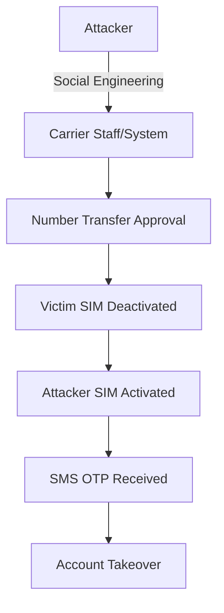

  AI 요약

  

    제목
    SKT 보안 이슈 완벽 대응 가이드: IMEI 확인, USIM/eSIM 교체, 그리고 MFA의 중요성
  

  

    카테고리
    Security
  

  

    태그
    
      SKT
      MFA
      USIM
      Security-Incident
    
  

  

    핵심 내용
    <ul class="summary-list">
      <li><strong>SK텔레콤 USIM 정보 유출 사태 대응</strong>: 즉시 조치(USIM/eSIM 교체, IMEI 확인, MFA 활성화), 통신사 보안 서비스 가입(USIM 보호 서비스, 번호 도용 차단), 금융 보안 강화(계좌 이체 한도 조정, 생체 인증 설정, 이상 거래 알림)</li>
      <li><strong>SIM 스와핑/복제 위험성</strong>: 공격 메커니즘(통신사 직원 사칭, 사회공학적 기법, 내부자 협조), 피해 사례(계좌 이체, 금융 앱 접근, 2FA 우회), OTP/MFA의 중요성(SMS OTP 취약점, TOTP 앱 권장, 하드웨어 보안 키)</li>
      <li><strong>IMEI 확인 및 USIM/eSIM 교체</strong>: IMEI 확인 방법(아이폰 *#06#, 안드로이드 설정→휴대전화 정보), 안전한 USIM/eSIM 교체 절차(통신사 방문, 본인 확인 강화, 즉시 활성화), eSIM 전환 장점(물리적 복제 불가, 원격 관리 가능)</li>
      <li><strong>2025년 업데이트</strong>: 통신사 보안 강화 조치(무료 USIM 보호 서비스, eSIM 전환 촉진, 이중 인증 강화, 실시간 이상 탐지 시스템, IMEI 변경 알림), 개인 보안 강화 권고사항(MFA 전면 적용, 통신사 보안 서비스 가입, 정기 IMEI 확인)</li>
      <li><strong>기업 보안 시사점</strong>: 공급망 보안(외부 파트너 보안 수준 점검), Zero Trust 아키텍처 적용, 보안 사고 대응 계획 수립, AI 기반 피싱 공격 대응 전략</li>
    </ul>
  

  

    기술/도구
    MFA, OTP, USIM, eSIM
  

  

    대상 독자
    기업 보안 담당자, 보안 엔지니어, CISO
  

  이 포스팅은 AI가 쉽게 이해하고 활용할 수 있도록 구조화된 요약을 포함합니다.

## 서론

안녕하세요! 여러분의 IT 라이프를 위한 꿀팁을 전하는 블로거입니다. 최근 SK텔레콤 USIM 정보 유출 사태로 아이폰과 안드로이드 스마트폰 사용자 여러분 모두 불안감이 크실 텐데요, 특히 이번 사태의 핵심 위협인 SIM 스와핑/복제의 위험성과 이를 효과적으로 방어할 수 있는 OTP/MFA의 중요성에 대해 확실히 짚고 넘어가야 할 필요가 있습니다. 오늘은 IMEI 확인, 안전한 USIM/eSIM 교체..

이 글에서는 SKT 보안 이슈 완벽 대응 가이드: IMEI 확인, USIM/eSIM 교체, 그리고 MFA의 중요성에 대해 실무 중심으로 상세히 다룹니다.

## 1. SIM 스와핑 공격 이해

### 1.1 SIM 스와핑이란?

SIM 스와핑(SIM Swapping)은 공격자가 피해자의 전화번호를 자신이 제어하는 SIM 카드로 이전시키는 공격입니다.

### 1.2 공격 벡터 분석

| 공격 방식 | 설명 | 난이도 | 대응 방안 |
|----------|------|--------|----------|
| **사회공학** | 통신사 직원 사칭/속임 | 중간 | 강화된 본인 인증 |
| **내부자 협조** | 통신사 직원 매수 | 높음 | 내부 통제 강화 |
| **정보 유출 활용** | 유출된 개인정보 이용 | 낮음 | 정보 노출 최소화 |
| **물리적 SIM 복제** | USIM 정보로 복제 | 중간 | eSIM 전환 |

### 1.3 즉시 대응 체크리스트

SKT 보안 사태 발생 시 즉시 확인해야 할 사항:

**긴급 조치 (24시간 내):**
- [ ] 통신사 보안 서비스 가입 (USIM 보호, 번호 도용 차단)
- [ ] 주요 금융 서비스 SMS OTP → TOTP 앱 전환
- [ ] 계좌 이체 한도 일시적 축소
- [ ] IMEI 확인 및 기록

**IMEI 확인 방법:**
- **iPhone/Android 공통**: 전화 앱에서 `*#06#` 입력
- **Android 추가**: 설정 → 휴대전화 정보 → IMEI
- **iPhone 추가**: 설정 → 일반 → 정보 → IMEI

## 2. SKT 보안 사태 이후 업계 동향 (2025년 업데이트)

### 2.1 통신사 보안 강화 조치

SKT 보안 사태 이후 국내 통신사들은 다음과 같은 보안 강화 조치를 시행하고 있습니다:

#### USIM 보호 서비스 강화
- **무료 USIM 보호 서비스**: SKT를 포함한 모든 통신사에서 무료 USIM 보호 서비스 제공
- **eSIM 전환 촉진**: 물리적 SIM 복제 위험을 줄이기 위한 eSIM 전환 권장
- **이중 인증 강화**: 번호 이동 및 기기 변경 시 추가 본인 확인 절차 도입

#### 통신사 보안 인프라 개선
- **실시간 이상 탐지 시스템**: AI 기반 SIM 스와핑 시도 탐지
- **IMEI 변경 알림 서비스**: 등록된 기기 외 접속 시 즉시 알림
- **24시간 보안 모니터링 센터**: 보안 사고 신속 대응 체계 구축

### 2.2 개인 보안 강화 권고사항

#### 필수 보안 조치
1. **MFA/OTP 전면 적용**: 모든 금융 및 중요 서비스에 SMS 외 인증 방식 적용
   - Google Authenticator, Microsoft Authenticator 등 TOTP 앱 사용
   - 하드웨어 보안 키(YubiKey 등) 도입 고려
2. **통신사 보안 서비스 가입**: USIM 보호 서비스, 번호 도용 차단 서비스 등
3. **정기적인 IMEI 및 접속 기록 확인**: 비정상적인 기기 접속 모니터링

#### 금융 보안 강화
- **계좌 이체 한도 조정**: 일일 이체 한도를 필요한 최소한으로 설정
- **금융앱 보안 설정**: 생체 인증 및 별도 보안 비밀번호 설정
- **이상 거래 알림**: 모든 거래에 대한 실시간 알림 설정

### 2.3 기업 보안 시사점

이번 사태는 기업 보안에도 중요한 시사점을 제공합니다:

- **공급망 보안**: 통신사 등 외부 파트너의 보안 수준 점검 필요
- **제로 트러스트 아키텍처**: 내부 네트워크도 신뢰하지 않는 보안 모델 적용
- **사고 대응 계획**: 보안 사고 발생 시 신속한 대응을 위한 계획 수립

## 결론

SKT 보안 이슈 완벽 대응 가이드: IMEI 확인, USIM/eSIM 교체, 그리고 MFA의 중요성에 대해 다루었습니다. 이번 사태를 계기로 개인과 기업 모두 보안 의식을 높이고, SMS 기반 인증에서 벗어나 더 안전한 MFA 방식을 적극적으로 도입해야 합니다. 올바른 설정과 지속적인 모니터링을 통해 안전하고 효율적인 환경을 구축할 수 있습니다.