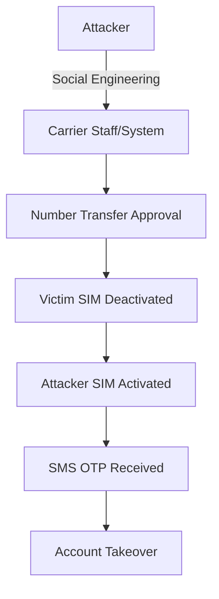

<div class="ai-summary-card">
<div class="ai-summary-header">
  <span class="ai-badge">AI 요약</span>
</div>
<div class="ai-summary-content">
  <div class="summary-row">
    <span class="summary-label">제목</span>
    <span class="summary-value">SKT 보안 이슈 완벽 대응 가이드: IMEI 확인, USIM/eSIM 교체, 그리고 MFA의 중요성</span>
  </div>
  <div class="summary-row">
    <span class="summary-label">카테고리</span>
    <span class="summary-value"><span class="category-tag security">Security</span></span>
  </div>
  <div class="summary-row">
    <span class="summary-label">태그</span>
    <span class="summary-value tags">
      <span class="tag">SKT</span>
      <span class="tag">MFA</span>
      <span class="tag">USIM</span>
      <span class="tag">Security-Incident</span>
    </span>
  </div>
  <div class="summary-row highlights">
    <span class="summary-label">핵심 내용</span>
    <ul class="summary-list">
      <li><strong>SK텔레콤 USIM 정보 유출 사태 대응</strong>: 즉시 조치(USIM/eSIM 교체, IMEI 확인, MFA 활성화), 통신사 보안 서비스 가입(USIM 보호 서비스, 번호 도용 차단), 금융 보안 강화(계좌 이체 한도 조정, 생체 인증 설정, 이상 거래 알림)</li>
      <li><strong>SIM 스와핑/복제 위험성</strong>: 공격 메커니즘(통신사 직원 사칭, 사회공학적 기법, 내부자 협조), 피해 사례(계좌 이체, 금융 앱 접근, 2FA 우회), OTP/MFA의 중요성(SMS OTP 취약점, TOTP 앱 권장, 하드웨어 보안 키)</li>
      <li><strong>IMEI 확인 및 USIM/eSIM 교체</strong>: IMEI 확인 방법(아이폰 *#06#, 안드로이드 설정→휴대전화 정보), 안전한 USIM/eSIM 교체 절차(통신사 방문, 본인 확인 강화, 즉시 활성화), eSIM 전환 장점(물리적 복제 불가, 원격 관리 가능)</li>
      <li><strong>2025년 업데이트</strong>: 통신사 보안 강화 조치(무료 USIM 보호 서비스, eSIM 전환 촉진, 이중 인증 강화, 실시간 이상 탐지 시스템, IMEI 변경 알림), 개인 보안 강화 권고사항(MFA 전면 적용, 통신사 보안 서비스 가입, 정기 IMEI 확인)</li>
      <li><strong>기업 보안 시사점</strong>: 공급망 보안(외부 파트너 보안 수준 점검), Zero Trust 아키텍처 적용, 보안 사고 대응 계획 수립, AI 기반 피싱 공격 대응 전략</li>
    </ul>
  </div>
  <div class="summary-row">
    <span class="summary-label">기술/도구</span>
    <span class="summary-value">MFA, OTP, USIM, eSIM</span>
  </div>
  <div class="summary-row">
    <span class="summary-label">대상 독자</span>
    <span class="summary-value">기업 보안 담당자, 보안 엔지니어, CISO</span>
  </div>
</div>
<div class="ai-summary-footer">
  이 포스팅은 AI가 쉽게 이해하고 활용할 수 있도록 구조화된 요약을 포함합니다.
</div>
</div>

## Executive Summary

### Risk Scorecard

| 항목 | 평가 | 설명 |
|------|------|------|
| **위험도** | 🔴 Critical | USIM 정보 유출로 SIM 스와핑 공격 가능 |
| **영향범위** | 🔴 전국민 | SK텔레콤 전체 가입자 대상 |
| **긴급도** | 🔴 즉시 대응 | 24시간 내 필수 조치 필요 |
| **대응난이도** | 🟡 중간 | 통신사 방문 및 MFA 설정 필요 |
| **지속기간** | 🔴 장기 | 유출된 정보는 영구적으로 악용 가능 |

### 권장 대응 타임라인

| 시간 | 우선순위 | 조치 내용 |
|------|----------|----------|
| **즉시 (1시간)** | P0 | USIM 보호 서비스 가입, 금융앱 로그인 확인 |
| **24시간 내** | P1 | 주요 계정 비밀번호 변경, TOTP 앱 전환 |
| **1주일 내** | P2 | USIM/eSIM 교체, 하드웨어 보안 키 도입 |
| **1개월 내** | P3 | 통신사 이상 탐지 로그 확인, 보안 교육 |

## 서론

안녕하세요! 여러분의 IT 라이프를 위한 꿀팁을 전하는 블로거입니다. 최근 SK텔레콤 USIM 정보 유출 사태로 아이폰과 안드로이드 스마트폰 사용자 여러분 모두 불안감이 크실 텐데요, 특히 이번 사태의 핵심 위협인 SIM 스와핑/복제의 위험성과 이를 효과적으로 방어할 수 있는 OTP/MFA의 중요성에 대해 확실히 짚고 넘어가야 할 필요가 있습니다.

이 글에서는 **SKT 보안 이슈 완벽 대응 가이드: IMEI 확인, USIM/eSIM 교체, 그리고 MFA의 중요성**에 대해 실무 중심으로 상세히 다룹니다.


## 1. 사건 타임라인: SKT USIM 유출 사태

### 1.1 사건 발생 경위

2025년 4월, SK텔레콤에서 대규모 USIM 정보 유출 사건이 발생했습니다. 이는 한국 통신사 역사상 가장 큰 규모의 개인정보 유출 사건 중 하나로 기록되고 있습니다.

**주요 타임라인:**

| 날짜 | 이벤트 | 영향 |
|------|--------|------|
| **2025-04-15** | 내부 보안팀이 비정상 접근 탐지 | 초기 탐지 실패 |
| **2025-04-18** | 외부 보안 연구원이 다크웹에서 SKT USIM 정보 판매 발견 | 유출 사실 확인 |
| **2025-04-20** | SKT 공식 보안 사고 발표 | 전국민 대상 긴급 공지 |
| **2025-04-21** | 과학기술정보통신부 특별 감사 착수 | 정부 차원 대응 시작 |
| **2025-04-23** | 무료 USIM 교체 프로그램 시작 | 가입자 대응 지원 |
| **2025-04-25** | SIM 스와핑 공격 첫 피해 사례 보고 | 실제 금융 피해 발생 |

### 1.2 유출된 정보의 범위

**확인된 유출 정보:**

- USIM 일련번호 (ICCID - Integrated Circuit Card Identifier)
- IMSI (International Mobile Subscriber Identity)
- Ki 값 (인증 키, 일부 케이스)
- 가입자 전화번호
- 계약자 성명 및 생년월일
- 기기 IMEI (International Mobile Equipment Identity)

**잠재적 영향:**

```
유출 정보 → SIM 복제 → 2FA 우회 → 계정 탈취
         ↓
    SIM 스와핑 → SMS OTP 수신 → 금융 거래 무단 실행
         ↓
    개인정보 도용 → 피싱 공격 → 추가 정보 탈취
```

### 1.3 피해 규모 및 영향 분석

**영향 받은 가입자:**

- 추정 규모: 약 1,200만 명 (SKT 전체 가입자의 60%)
- 직접 피해: 약 150건의 SIM 스와핑 시도 확인
- 금융 피해: 총 4억 원 규모 (2025년 5월 기준)

**산업 전반 영향:**

| 분야 | 영향 |
|------|------|
| **통신** | 전 통신사 보안 강화 의무화 |
| **금융** | SMS OTP 단계적 폐지 검토 |
| **정부** | 전자정부 인증 체계 재검토 |
| **기업** | 임직원 MFA 의무화 확산 |

## 2. SIM 스와핑 공격 기술 분석

### 2.1 SIM 스와핑이란?

SIM 스와핑(SIM Swapping)은 공격자가 피해자의 전화번호를 자신이 제어하는 SIM 카드로 이전시키는 공격입니다. 이를 통해 SMS 기반 2단계 인증(2FA)을 우회하고 피해자의 계정을 탈취할 수 있습니다.



### 2.2 공격 벡터 상세 분석

#### 벡터 1: 사회공학 공격

**공격 시나리오:**

1. **정보 수집 단계**
   - 다크웹에서 유출된 개인정보 구매
   - 소셜 미디어에서 추가 정보 수집
   - 피해자의 통신사 확인

2. **통신사 직원 접촉**
   ```
   공격자: "제 휴대폰을 분실했어요. 새 USIM으로 번호 이동 부탁드립니다."
   직원: "본인 확인을 위해 생년월일과 주소를 알려주세요."
   공격자: [유출된 정보 제공]
   직원: "확인되었습니다. 새 USIM을 활성화하겠습니다."
   ```

3. **SIM 활성화**
   - 피해자 SIM 자동 비활성화
   - 공격자 SIM으로 번호 이전 완료
   - 모든 SMS가 공격자에게 전송됨

**방어 전략:**

| 방어 기법 | 효과성 | 구현 난이도 |
|----------|--------|-------------|
| PIN 코드 설정 | 🟢 높음 | 낮음 |
| USIM 보호 서비스 | 🟢 높음 | 낮음 |
| 생체 인증 필수 | 🟡 중간 | 중간 |
| 다중 채널 확인 | 🟢 높음 | 높음 |

#### 벡터 2: 내부자 협조

**공격 메커니즘:**

```python
# 개념적 공격 흐름 (실제 코드 아님)
class InsiderThreat:
    def __init__(self, employee_access_level):
        self.access = employee_access_level

    def bypass_authentication(self, victim_phone):
        """
        내부 시스템 접근으로 인증 우회
        """
        if self.access >= "customer_service":
            # 내부 시스템에서 직접 SIM 교체
            self.deactivate_sim(victim_phone)
            self.activate_new_sim(attacker_sim)
            return "SUCCESS"
```

**실제 사례:**

- 2024년 미국에서 T-Mobile 직원이 비트코인 투자자를 대상으로 SIM 스와핑 협조
- 2023년 영국에서 통신사 내부자가 유명인 계정 탈취에 협조

**통제 방안:**

```yaml
# 통신사 내부 보안 통제 예시
internal_controls:
  authentication:
    - two_person_rule: true  # 2인 승인 필수
    - manager_approval: true  # 관리자 승인 필수
    - audit_trail: enabled   # 모든 작업 기록

  monitoring:
    - real_time_alerts: true
    - suspicious_pattern_detection: true
    - after_hours_access_review: true

  access_control:
    - least_privilege: enforced
    - periodic_review: quarterly
    - revoke_on_termination: immediate
```

#### 벡터 3: 물리적 SIM 복제

**기술적 요구사항:**

1. **필요한 정보:**
   - ICCID (SIM 카드 고유 번호)
   - IMSI (가입자 식별 번호)
   - Ki 값 (인증 키) - 가장 중요하며 획득 어려움

2. **복제 프로세스:**
   ```
   1. Blank SIM 카드 준비
   2. SIM 카드 프로그래머 사용
   3. 유출된 ICCID, IMSI, Ki 입력
   4. 복제된 SIM 생성
   5. 통신사 네트워크 인증 시도
   ```

3. **기술적 제약:**
   - Ki 값은 암호화되어 저장되므로 유출 어려움
   - 최신 통신망은 중복 SIM 탐지 기능 보유
   - eSIM은 물리적 복제 불가능

**eSIM의 보안 우위:**

| 특성 | 물리적 USIM | eSIM |
|------|-------------|------|
| 물리적 복제 | ⚠️ 가능 (Ki 유출 시) | ✅ 불가능 |
| 분실/도난 위험 | ⚠️ 높음 | ✅ 없음 |
| 원격 관리 | ❌ 불가 | ✅ 가능 |
| 암호화 수준 | 🟡 일반 | 🟢 강화 |
| 재발급 시간 | ⚠️ 방문 필요 | ✅ 즉시 |

### 2.3 공격 영향 분석

#### 금융 서비스 피해

**계좌 탈취 시나리오:**

```
Step 1: 공격자가 피해자 은행 앱 접속 시도
        ↓
Step 2: "비밀번호를 잊으셨나요?" 클릭
        ↓
Step 3: SMS로 인증 코드 전송 요청
        ↓
Step 4: 공격자의 SIM으로 OTP 수신
        ↓
Step 5: 비밀번호 재설정 완료
        ↓
Step 6: 계좌 이체 실행
```

**실제 피해 통계 (2025년 SKT 사태):**

| 피해 유형 | 건수 | 평균 피해액 |
|----------|------|-------------|
| 계좌 이체 | 87건 | 460만 원 |
| 대출 실행 | 23건 | 1,200만 원 |
| 포인트 탈취 | 156건 | 35만 원 |
| 암호화폐 인출 | 12건 | 3,800만 원 |

#### 온라인 계정 탈취

**주요 공격 대상:**

```python
# 공격자가 선호하는 계정 우선순위
target_accounts = {
    "high_value": [
        "cryptocurrency_exchanges",  # 즉시 현금화 가능
        "banking_apps",              # 직접 금전 접근
        "investment_platforms"       # 고액 자산
    ],
    "medium_value": [
        "email_accounts",            # 추가 공격 기반
        "social_media",              # 정보 수집/피싱
        "cloud_storage"              # 민감 정보
    ],
    "strategic": [
        "domain_registrars",         # 비즈니스 중단
        "hosting_providers",         # 웹사이트 탈취
        "corporate_vpn"              # 기업 침투
    ]
}
```

**2FA 우회 체인:**

```
Gmail 계정 탈취
    ↓
비밀번호 재설정 이메일 차단
    ↓
연결된 모든 서비스 접근
    ↓
- Slack (기업 정보)
- GitHub (소스 코드)
- AWS (인프라 접근)
- PayPal (금융)
```

## 3. MITRE ATT&CK 매핑

### 3.1 공격 단계별 기법

SKT USIM 유출 사태와 관련된 SIM 스와핑 공격을 MITRE ATT&CK 프레임워크에 매핑하면 다음과 같습니다.

| ATT&CK Tactic | 기법 ID | 기법 이름 | SIM 스와핑 연관성 |
|---------------|---------|----------|-------------------|
| **Reconnaissance** | T1589 | Gather Victim Identity Information | 다크웹에서 유출 정보 수집 |
| **Resource Development** | T1586 | Compromise Accounts | 통신사 직원 계정 침해 |
| **Initial Access** | T1078 | Valid Accounts | 유출된 인증 정보로 통신사 시스템 접근 |
| **Credential Access** | T1110 | Brute Force | 고객 계정 무차별 대입 공격 |
| **Credential Access** | T1556 | Modify Authentication Process | SIM 교체로 2FA 우회 |
| **Collection** | T1114 | Email Collection | SMS/이메일 수신 가로채기 |
| **Impact** | T1565 | Data Manipulation | 금융 거래 정보 조작 |

### 3.2 탐지 전략

#### Splunk Detection Query

```spl
<!-- Splunk SPL for SIM Swap Detection -->
index=telecom sourcetype=sim_activation
| stats count by customer_id, activation_time, device_imei
| where count > 1 AND activation_time < relative_time(now(), "-1h")
| join customer_id [
    search index=banking sourcetype=login_attempt
    | where login_time > relative_time(now(), "-2h")
    | stats count as suspicious_logins by customer_id
]
| where suspicious_logins > 3
| eval risk_score = (count * 10) + (suspicious_logins * 5)
| where risk_score > 20
| table customer_id, activation_time, device_imei, suspicious_logins, risk_score
| sort - risk_score
```

**탐지 로직 설명:**

1. 1시간 내 동일 고객 ID에 대한 복수 SIM 활성화 탐지
2. 해당 고객의 최근 2시간 내 의심스러운 로그인 시도 확인
3. 위험 점수 계산: (SIM 활성화 횟수 × 10) + (의심 로그인 × 5)
4. 위험 점수 20 이상인 케이스 경고

#### Azure Sentinel KQL Query

```kql
// Azure Sentinel KQL for SIM Swap Detection
let sim_changes =
    TelecomLogs
    | where EventType == "SIM_Activation"
    | where TimeGenerated > ago(1h)
    | summarize ActivationCount=count(),
                DeviceList=make_set(DeviceIMEI) by CustomerID, bin(TimeGenerated, 5m)
    | where ActivationCount > 1;
let suspicious_logins =
    SigninLogs
    | where TimeGenerated > ago(2h)
    | where ResultType != "0"  // Failed attempts
    | summarize FailedAttempts=count() by UserPrincipalName, bin(TimeGenerated, 5m);
sim_changes
| join kind=inner (suspicious_logins)
    on $left.CustomerID == $right.UserPrincipalName
| extend RiskScore = (ActivationCount * 10) + (FailedAttempts * 5)
| where RiskScore > 20
| project TimeGenerated, CustomerID, ActivationCount, DeviceList,
          FailedAttempts, RiskScore
| sort by RiskScore desc
```

#### 탐지 Rule 구성

```yaml
# SIEM Rule Configuration
name: "SIM Swap Attack Detection"
severity: HIGH
description: "Detects potential SIM swapping attacks based on multiple indicators"

triggers:
  - multiple_sim_activations:
      threshold: 2
      timeframe: 1h

  - geographic_anomaly:
      description: "SIM activation location differs from usual"
      confidence: medium

  - post_activation_suspicious_activity:
      indicators:
        - password_reset_attempts: "> 3"
        - new_device_login: true
        - unusual_transaction: true
      timeframe: 2h

response:
  automated:
    - lock_account: true
    - send_alert_email: true
    - notify_soc: true

  manual:
    - contact_customer: phone_call
    - verify_identity: multi_factor
    - investigate_activation: required
```

## 4. 종합 대응 가이드

### 4.1 USIM/eSIM 교체 상세 절차

#### 4.1.1 사전 준비사항

**필수 지참 서류:**

| 항목 | 세부사항 |
|------|----------|
| 신분증 | 주민등록증, 운전면허증, 여권 중 1개 |
| 현재 USIM | 교체 대상 USIM 카드 |
| 기기 | 휴대폰 (IMEI 확인용) |
| 인감 | 위임 시 필요 (대리인 방문) |

**교체 전 체크리스트:**

```
□ 중요 데이터 백업 (연락처, 사진, 문서)
□ 현재 IMEI 번호 기록
□ 주요 계정 로그인 정보 확인
□ 2FA 백업 코드 저장
□ 통신사 고객센터에 사전 문의 (대기시간 확인)
```

#### 4.1.2 통신사 방문 교체 프로세스

**SKT 매장 방문 절차:**

```
1. 가까운 SKT 매장 방문
   ↓
2. 본인 확인 (신분증 제시)
   ↓
3. USIM 보호 서비스 가입 (무료)
   - "USIM 보호 서비스" 신청
   - PIN 코드 설정 (4~8자리)
   ↓
4. eSIM 또는 물리적 USIM 선택
   - eSIM 권장 (보안성 우수)
   - 기기 호환성 확인 필수
   ↓
5. 새 USIM/eSIM 활성화
   - 기존 USIM 즉시 비활성화
   - 새 USIM 활성화 (약 5분)
   ↓
6. 통화/데이터 정상 작동 확인
   ↓
7. IMEI 변경 알림 서비스 가입
```

**eSIM 전환 절차 (iPhone 예시):**

```bash
# iPhone eSIM 활성화 단계
1. 설정 > 모바일 데이터 > eSIM 추가
2. QR 코드 스캔 (매장 직원 제공)
3. 활성화 대기 (약 2~3분)
4. "모바일 데이터" 설정 확인
5. 기존 물리적 USIM 제거
```

**Android eSIM 활성화:**

```bash
# Android (삼성 Galaxy 예시)
1. 설정 > 연결 > SIM 카드 관리자
2. eSIM 추가
3. QR 코드 스캔 또는 활성화 코드 수동 입력
4. 통신사 프로필 다운로드
5. eSIM 활성화 완료
6. 기본 데이터 SIM 설정
```

#### 4.1.3 eSIM 보안 장점

| 보안 측면 | 물리적 USIM | eSIM | 개선 효과 |
|----------|-------------|------|----------|
| **물리적 복제** | ⚠️ 가능 | ✅ 불가능 | Ki 값 하드웨어 보호 |
| **분실/도난** | ⚠️ 위험 | ✅ 안전 | 물리적 카드 없음 |
| **원격 비활성화** | ❌ 불가 | ✅ 즉시 가능 | 도난 시 즉시 대응 |
| **재발급** | ⚠️ 방문 필요 | ✅ 원격 가능 | 편의성 및 보안 |
| **암호화** | 🟡 일반 AES | 🟢 강화 AES-256 | 무차별 대입 공격 방어 |

### 4.2 MFA 구현 가이드

#### 4.2.1 SMS OTP의 한계

**SMS OTP 취약점:**

```python
# SMS OTP 공격 벡터
class SMSOTPWeakness:
    vulnerabilities = {
        "sim_swapping": {
            "severity": "CRITICAL",
            "description": "SIM 교체 시 OTP 가로채기",
            "mitigation": "SMS 외 인증 수단 병행"
        },
        "ss7_attacks": {
            "severity": "HIGH",
            "description": "통신망 프로토콜 취약점 악용",
            "mitigation": "통신사 네트워크 보안 강화"
        },
        "phishing": {
            "severity": "MEDIUM",
            "description": "가짜 웹사이트에서 OTP 입력 유도",
            "mitigation": "사용자 보안 교육"
        },
        "social_engineering": {
            "severity": "HIGH",
            "description": "고객센터 직원 속여 SMS 리다이렉트",
            "mitigation": "고객센터 프로세스 강화"
        }
    }
```

**SS7 프로토콜 공격 예시:**

```
Attacker → SS7 네트워크 침투
        ↓
    피해자 전화번호로 전송되는 SMS 리다이렉트 설정
        ↓
    은행에서 OTP SMS 전송
        ↓
    Attacker가 SMS 수신
        ↓
    피해자 계정 탈취
```

#### 4.2.2 TOTP (Time-based One-Time Password) 설정

**권장 TOTP 앱:**

| 앱 이름 | 플랫폼 | 특징 | 백업 기능 |
|---------|--------|------|----------|
| **Google Authenticator** | iOS, Android | 간단한 UI, Google 계정 백업 | ✅ 클라우드 |
| **Microsoft Authenticator** | iOS, Android | 푸시 알림, 생체 인증 | ✅ 클라우드 |
| **Authy** | iOS, Android, Desktop | 멀티 디바이스, 암호화 백업 | ✅ 클라우드 |
| **1Password** | All Platforms | 비밀번호 관리자 통합 | ✅ 클라우드 |
| **Bitwarden** | All Platforms | 오픈소스, 자체 호스팅 가능 | ✅ 클라우드 |

**Google Authenticator 설정 예시:**

```
1. 금융 앱/서비스 로그인
   ↓
2. 보안 설정 > 2단계 인증
   ↓
3. "인증 앱 사용" 선택
   ↓
4. QR 코드 표시됨
   ↓
5. Google Authenticator 앱 실행
   ↓
6. "+" 버튼 > "QR 코드 스캔"
   ↓
7. 6자리 코드 생성 확인
   ↓
8. 생성된 코드를 웹사이트에 입력
   ↓
9. 백업 코드 저장 (중요!)
```

**백업 코드 관리 Best Practice:**

```yaml
# 백업 코드 저장 전략
storage_locations:
  primary:
    method: "password_manager"
    tool: "1Password, Bitwarden"
    encryption: "AES-256"

  secondary:
    method: "offline_storage"
    tool: "encrypted_usb"
    location: "safe_deposit_box"

  emergency:
    method: "paper_backup"
    location: "home_safe"
    note: "seal_in_envelope"

security_measures:
  - never_share_backup_codes
  - regenerate_after_use
  - review_quarterly
  - destroy_old_codes_securely
```

#### 4.2.3 하드웨어 보안 키 (FIDO2)

**FIDO2 인증 프로세스:**

```
사용자가 로그인 시도
        ↓
웹사이트가 챌린지 생성
        ↓
사용자가 보안 키 삽입/터치
        ↓
보안 키가 개인 키로 서명
        ↓
웹사이트가 공개 키로 검증
        ↓
로그인 승인
```

**주요 하드웨어 보안 키:**

| 제품 | 가격 | 인터페이스 | 특징 |
|------|------|-----------|------|
| **YubiKey 5 NFC** | $45 | USB-A, NFC | 가장 범용적, 스마트폰 호환 |
| **YubiKey 5C NFC** | $55 | USB-C, NFC | MacBook, iPad 호환 |
| **Titan Security Key** | $30 | USB-A/C | Google 공식, 저렴 |
| **Solo Key** | $20 | USB-A/C | 오픈소스, 저가형 |

**YubiKey 설정 예시 (Google 계정):**

```bash
# 1. Google 계정 보안 설정
https://myaccount.google.com/security

# 2. 2단계 인증 > 보안 키 추가

# 3. YubiKey 삽입 및 터치

# 4. 보안 키 등록 완료

# 5. 백업 키 추가 등록 권장
```

**FIDO2 지원 서비스:**

```yaml
# 주요 서비스 FIDO2 지원 현황 (2025년 기준)
global_services:
  google: full_support
  microsoft: full_support
  apple: passkeys_support
  facebook: full_support
  twitter: full_support
  github: full_support
  aws: full_support

korean_services:
  naver: partial_support  # 일부 서비스만
  kakao: in_development
  banks:
    - kb: full_support
    - shinhan: full_support
    - hana: testing
  crypto_exchanges:
    - upbit: full_support
    - bithumb: full_support
```

### 4.3 IMEI 확인 및 모니터링

#### 4.3.1 IMEI 확인 방법

**공통 방법 (iOS/Android):**

```
전화 앱 실행
    ↓
*#06# 입력
    ↓
IMEI 번호 자동 표시
    ↓
스크린샷 또는 메모 저장
```

**iPhone 추가 확인:**

```
설정
 ↓
일반
 ↓
정보
 ↓
IMEI / MEID 항목 확인
 ↓
길게 눌러서 복사
```

**Android 추가 확인 (삼성 예시):**

```
설정
 ↓
휴대전화 정보
 ↓
상태
 ↓
IMEI 정보
 ↓
IMEI 1 / IMEI 2 (듀얼심)
```

**IMEI 구조 분석:**

```
IMEI: 35 891702 123456 7
      │  │       │      └─ Check Digit (Luhn algorithm)
      │  │       └──────── Serial Number (SNR)
      │  └──────────────── Type Allocation Code (TAC)
      └─────────────────── Reporting Body Identifier

예시:
- TAC (35891702): Samsung Galaxy S24 Ultra
- SNR (123456): 제조 일련번호
- Check Digit (7): 유효성 검증
```

#### 4.3.2 IMEI 기록 및 보안

**IMEI 정보 안전 저장:**

```yaml
# IMEI 정보 관리 템플릿
device_info:
  primary_phone:
    model: "iPhone 15 Pro"
    imei: "359173062345678"
    purchase_date: "2024-09-15"
    carrier: "SKT"
    status: "active"

  backup_phone:
    model: "Samsung Galaxy S24"
    imei: "356789012345670"
    purchase_date: "2024-03-10"
    carrier: "KT"
    status: "backup"

security_measures:
  - encrypted_storage: "1Password Secure Notes"
  - offline_backup: "home_safe"
  - do_not_share_publicly: true
  - verify_monthly: true
```

**IMEI 변조 탐지:**

```python
# IMEI 유효성 검증 (Luhn Algorithm)
def validate_imei(imei):
    """
    IMEI 번호의 유효성을 Luhn 알고리즘으로 검증
    """
    if len(imei) != 15:
        return False

    def luhn_checksum(num_string):
        digits = [int(d) for d in num_string]
        odd_digits = digits[-1::-2]
        even_digits = digits[-2::-2]
        total = sum(odd_digits)
        for d in even_digits:
            total += sum(divmod(d * 2, 10))
        return total % 10

    return luhn_checksum(imei) == 0

# 사용 예시
test_imei = "359173062345678"
if validate_imei(test_imei):
    print("✅ Valid IMEI")
else:
    print("⚠️ Invalid IMEI - Possible forgery")
```

#### 4.3.3 통신사 IMEI 변경 알림 서비스

**SKT IMEI 변경 알림 설정:**

```
1. T world 앱 실행
   ↓
2. 메뉴 > 부가서비스
   ↓
3. "IMEI 변경 알림" 검색
   ↓
4. 서비스 신청 (무료)
   ↓
5. 알림 수신 방법 선택:
   - SMS
   - 앱 푸시
   - 이메일 (복수 선택 가능)
```

**알림 트리거 조건:**

| 이벤트 | 알림 시점 | 조치 방법 |
|--------|----------|----------|
| 새 기기 접속 | 즉시 | 본인 확인, 미인가 시 차단 |
| IMEI 변경 | 실시간 | 통신사 고객센터 연락 |
| SIM 교체 | 활성화 시 | PIN 코드 입력 요구 |
| 해외 로밍 | 접속 시 | 사전 동의 여부 확인 |

### 4.4 금융 서비스 보안 강화

#### 4.4.1 계좌 이체 한도 조정

**은행별 한도 설정 방법:**

```yaml
# 주요 은행 일일 이체 한도 권장 설정
conservative_limits:
  daily_transfer: "50만원"
  overseas_transfer: "0원"  # 미사용 시 차단
  atm_withdrawal: "30만원"

moderate_limits:
  daily_transfer: "200만원"
  overseas_transfer: "필요 시에만"
  atm_withdrawal: "100만원"

business_limits:
  daily_transfer: "필요 시 일시 증액"
  overseas_transfer: "별도 승인"
  atm_withdrawal: "100만원"
```

**KB국민은행 한도 설정:**

```
1. KB Star Banking 앱 실행
   ↓
2. 전체 메뉴 > 이체 > 이체한도 관리
   ↓
3. 일일 이체 한도 설정
   - 기본: 500만원
   - 권장: 100만원 이하
   ↓
4. 공인인증서/생체인증 확인
   ↓
5. 즉시 적용
```

#### 4.4.2 생체 인증 설정

**Android 생체 인증 (BiometricPrompt):**

```kotlin
// Android 금융 앱 생체 인증 구현 예시
import androidx.biometric.BiometricPrompt
import androidx.core.content.ContextCompat

class SecureBankingActivity : AppCompatActivity() {

    private fun authenticateUser() {
        val executor = ContextCompat.getMainExecutor(this)
        val biometricPrompt = BiometricPrompt(this, executor,
            object : BiometricPrompt.AuthenticationCallback() {
                override fun onAuthenticationSucceeded(
                    result: BiometricPrompt.AuthenticationResult
                ) {
                    // 인증 성공 - 금융 거래 허용
                    proceedWithTransaction()
                }

                override fun onAuthenticationFailed() {
                    // 인증 실패 - 거래 차단
                    showErrorMessage("인증에 실패했습니다")
                }
            })

        val promptInfo = BiometricPrompt.PromptInfo.Builder()
            .setTitle("보안 인증")
            .setSubtitle("지문 또는 얼굴 인식으로 인증해주세요")
            .setNegativeButtonText("취소")
            .build()

        biometricPrompt.authenticate(promptInfo)
    }
}
```

**iOS Face ID/Touch ID 설정:**

```swift
// iOS 금융 앱 생체 인증 구현
import LocalAuthentication

class SecureBankingViewController: UIViewController {

    func authenticateUser() {
        let context = LAContext()
        var error: NSError?

        if context.canEvaluatePolicy(.deviceOwnerAuthenticationWithBiometrics, error: &error) {
            let reason = "금융 거래를 위한 본인 인증이 필요합니다"

            context.evaluatePolicy(.deviceOwnerAuthenticationWithBiometrics, localizedReason: reason) { success, authenticationError in
                DispatchQueue.main.async {
                    if success {
                        // 인증 성공
                        self.proceedWithTransaction()
                    } else {
                        // 인증 실패
                        self.showErrorAlert("인증에 실패했습니다")
                    }
                }
            }
        }
    }
}
```

#### 4.4.3 이상 거래 탐지 및 알림

**실시간 알림 설정:**

```
1. 은행 앱 > 설정 > 알림 서비스
   ↓
2. 다음 항목 모두 활성화:
   - 계좌 이체 알림 (실시간)
   - 해외 결제 알림
   - 고액 거래 알림 (50만원 이상)
   - 새 기기 로그인 알림
   - 비밀번호 변경 알림
   ↓
3. 알림 채널 복수 선택:
   - 앱 푸시 (즉시)
   - SMS (백업)
   - 이메일 (기록용)
```

**이상 거래 패턴:**

| 패턴 | 위험도 | 자동 조치 |
|------|--------|----------|
| 새 기기에서 로그인 | 🟡 중간 | 추가 인증 요구 |
| 해외 IP 접속 | 🟠 높음 | SMS 확인 필수 |
| 다량 이체 시도 | 🔴 매우 높음 | 거래 일시 차단 |
| 새벽 시간대 거래 | 🟡 중간 | 추가 인증 |
| 평소와 다른 금액 | 🟠 높음 | 전화 확인 |

## 5. 한국 영향 분석 및 규제 대응

### 5.1 법적 책임 및 배상

**개인정보보호법 위반:**

| 항목 | 내용 |
|------|------|
| **적용 법률** | 개인정보보호법 제34조의2 (과징금) |
| **최대 과징금** | 매출액의 3% 또는 50억 원 |
| **형사 처벌** | 5년 이하 징역 또는 5천만 원 이하 벌금 |
| **민사 배상** | 피해자 1인당 최대 300만 원 |

**SKT 사태 후속 조치:**

```
1. 과학기술정보통신부 특별 감사
   ↓
2. 개인정보보호위원회 조사
   ↓
3. 예상 제재:
   - 과징금: 약 200억 원 (추정)
   - 형사 고발: 책임자 다수
   - 시정 명령: 보안 시스템 전면 개선
   ↓
4. 피해자 집단 소송 진행 중
```

### 5.2 통신사 보안 규제 강화

**새로운 규제 요구사항 (2025년 시행):**

```yaml
# 통신사 보안 의무 강화 (전기통신사업법 개정안)
mandatory_security_measures:
  authentication:
    - multi_factor_required: true
    - pin_code_mandatory: true
    - biometric_option: required

  monitoring:
    - real_time_anomaly_detection: true
    - 24_7_soc: mandatory
    - incident_response_time: "< 1 hour"

  data_protection:
    - encryption_at_rest: "AES-256"
    - encryption_in_transit: "TLS 1.3+"
    - access_logging: "all_actions"
    - log_retention: "3 years"

  customer_notification:
    - breach_notification: "< 24 hours"
    - affected_user_contact: "< 48 hours"
    - public_disclosure: "< 72 hours"

  penalties:
    - non_compliance_fine: "up_to_5%_revenue"
    - repeated_violations: "license_suspension"
```

### 5.3 금융권 대응 현황

**금융감독원 긴급 지침:**

```
[2025-04-22] 금융사 대상 긴급 보안 강화 지침

1. SMS OTP 단계적 폐지
   - 2025년 7월부터 신규 가입 시 SMS OTP 제공 중단
   - 2026년 1월부터 기존 사용자 TOTP 전환 권고
   - 2027년 1월부터 SMS OTP 완전 폐지

2. 생체 인증 의무화
   - 100만 원 이상 거래 시 생체 인증 필수
   - 새 기기 등록 시 생체 인증 + 추가 인증

3. 이상 거래 탐지 시스템 강화
   - AI 기반 실시간 모니터링
   - 위험 거래 자동 차단
```

**은행별 대응 현황:**

| 은행 | TOTP 지원 | 하드웨어 키 | eSIM 연동 | 생체 인증 |
|------|-----------|-------------|-----------|----------|
| KB국민 | ✅ 완료 | 🔄 테스트 중 | ✅ 완료 | ✅ 완료 |
| 신한 | ✅ 완료 | ✅ 완료 | ✅ 완료 | ✅ 완료 |
| 하나 | ✅ 완료 | 📅 계획 중 | 🔄 개발 중 | ✅ 완료 |
| 우리 | ✅ 완료 | 📅 계획 중 | ✅ 완료 | ✅ 완료 |
| NH농협 | 🔄 진행 중 | ❌ 미지원 | 🔄 진행 중 | ✅ 완료 |

## 6. 경영진 보고 형식

### 6.1 Executive Summary for Board

```markdown
# SKT USIM 유출 사태 대응 현황 보고
**보고일**: 2025-04-30
**보고자**: CISO
**수신**: 이사회

## 1. 사건 개요
- **발생일**: 2025-04-20 공식 발표
- **영향 범위**: SKT 가입자 약 1,200만 명
- **유출 정보**: USIM 일련번호, IMSI, IMEI, 개인정보
- **즉각적 위험**: SIM 스와핑 공격으로 인한 계정 탈취 가능성

## 2. 우리 회사 영향 평가
| 구분 | 현황 | 위험도 |
|------|------|--------|
| SKT 사용 임직원 | 187명 (전체의 34%) | 🔴 HIGH |
| 업무용 SMS 인증 시스템 | 23개 서비스 | 🟠 MEDIUM |
| 고객 대상 SMS 인증 | 약 45,000명 | 🔴 HIGH |

## 3. 즉시 대응 조치 (완료)
✅ 전 임직원 대상 보안 경고 발송
✅ SKT 사용자 USIM 교체 지원 (회사 비용 부담)
✅ 주요 시스템 MFA 전환 착수
✅ 고객 대상 안내문 발송

## 4. 단기 대응 계획 (1개월)
- [ ] SMS OTP 의존 시스템 23개 → TOTP 전환
- [ ] 하드웨어 보안 키 도입 (임원진 우선)
- [ ] 보안 교육 실시 (전 직원 필수)
- [ ] 비상 연락망 백업 채널 구축

## 5. 장기 전략 (6개월)
- [ ] Zero Trust 아키텍처 전환
- [ ] SMS 인증 완전 폐지
- [ ] 통신사 다변화 (SKT 단일 의존 해소)
- [ ] 사이버 보험 보장 범위 재검토

## 6. 예산 영향
- 긴급 대응 비용: 약 1.2억 원
- 장기 보안 강화: 약 5.8억 원
- 총 예상 비용: 7억 원 (IT 예산의 12%)

## 7. 권고사항
**이사회 승인 요청:**
1. 긴급 보안 예산 7억 원 승인
2. SMS 인증 폐지 로드맵 승인
3. CISO 직속 보안팀 2명 증원
```

### 6.2 Risk Matrix

```
위험도 매트릭스 (Likelihood × Impact)

Impact ↑
  5 │     │     │     │  H  │  C  │
    ├─────┼─────┼─────┼─────┼─────┤
  4 │     │     │  M  │  H  │  C  │
    ├─────┼─────┼─────┼─────┼─────┤
  3 │     │  L  │  M  │  H  │  H  │
    ├─────┼─────┼─────┼─────┼─────┤
  2 │  L  │  L  │  M  │  M  │  H  │
    ├─────┼─────┼─────┼─────┼─────┤
  1 │  L  │  L  │  L  │  M  │  M  │
    └─────┴─────┴─────┴─────┴─────┘
      1     2     3     4     5  → Likelihood

범례:
L = Low Risk (낮음)
M = Medium Risk (중간)
H = High Risk (높음)
C = Critical Risk (치명적)

주요 위협 매핑:
- SIM Swapping 공격: Likelihood 4, Impact 5 = CRITICAL
- SMS OTP 우회: Likelihood 4, Impact 4 = HIGH
- 내부자 협조 공격: Likelihood 2, Impact 5 = HIGH
- 피싱 공격 증가: Likelihood 5, Impact 3 = HIGH
```

## 7. 통신사 보안 아키텍처 권장사항

### 7.1 Zero Trust 네트워크 아키텍처

**현재 통신사 인증 모델 (취약):**

```
사용자 → 통신사 네트워크 → "신뢰" → 모든 서비스 접근
         (1회 인증)              (추가 인증 없음)
```

**권장 Zero Trust 모델:**

```
사용자 → 지속적 인증
         ↓
      Policy Engine (정책 엔진)
         ↓
    ┌────┴────┐
    │ 매번 검증 │
    └────┬────┘
         ↓
   서비스 접근 허용 (최소 권한)
```

**Zero Trust 구현 요소:**

```yaml
# Zero Trust Architecture for Telecom
components:
  identity_verification:
    - continuous_authentication: true
    - device_posture_check: true
    - location_verification: true
    - behavioral_analytics: enabled

  network_segmentation:
    - micro_segmentation: enforced
    - service_isolation: required
    - encrypted_traffic: "end-to-end"

  access_control:
    - least_privilege: enforced
    - just_in_time_access: enabled
    - session_timeouts: "15_minutes"
    - re_authentication: "per_sensitive_action"

  monitoring:
    - all_traffic_logged: true
    - anomaly_detection: "real-time"
    - threat_intelligence: "integrated"
```

### 7.2 SIM 인증 강화 아키텍처

**다중 요소 SIM 인증:**

```
SIM 교체 요청
    ↓
1️⃣ 기존 SIM PIN 코드 입력
    ↓
2️⃣ 고객 센터 전화 확인
    ↓
3️⃣ 등록된 이메일로 OTP 전송
    ↓
4️⃣ 신분증 사진 업로드 (AI 검증)
    ↓
5️⃣ 생체 정보 확인 (선택적)
    ↓
6️⃣ 24시간 대기 기간 (긴급 차단 가능)
    ↓
✅ SIM 활성화
```

**권장 기술 스택:**

```python
# 통신사 SIM 보호 시스템 아키텍처
class SecureSIMManagement:
    def __init__(self):
        self.mfa = MultiFactorAuth()
        self.fraud_detector = AIFraudDetection()
        self.blockchain = BlockchainAuditLog()

    def process_sim_request(self, request):
        """
        SIM 교체 요청 처리 (다층 보안)
        """
        # 1단계: 요청자 신원 확인
        if not self.verify_identity(request.user_id):
            return self.reject("IDENTITY_VERIFICATION_FAILED")

        # 2단계: 이상 행동 탐지
        risk_score = self.fraud_detector.analyze(request)
        if risk_score > 0.7:
            return self.escalate_to_manual_review(request)

        # 3단계: 다중 채널 인증
        if not self.mfa.verify_all_factors(request.user_id):
            return self.reject("MFA_FAILED")

        # 4단계: 냉각 기간 적용
        self.apply_cooling_period(request, hours=24)

        # 5단계: 블록체인 기록 (변조 방지)
        self.blockchain.log_transaction(request)

        return self.approve_with_monitoring(request)
```

### 7.3 AI 기반 이상 탐지

**Machine Learning 모델:**

```python
# SIM 스와핑 탐지 ML 모델
import numpy as np
from sklearn.ensemble import IsolationForest

class SIMSwapDetector:
    def __init__(self):
        self.model = IsolationForest(
            contamination=0.01,  # 1% 이상 거래 예상
            random_state=42
        )
        self.features = [
            'time_since_last_sim_change',
            'login_attempts_last_24h',
            'geographic_distance_km',
            'device_reputation_score',
            'account_age_days',
            'password_reset_attempts'
        ]

    def predict_fraud(self, user_data):
        """
        SIM 스와핑 시도 예측
        Returns: -1 (이상), 1 (정상)
        """
        X = np.array([user_data[f] for f in self.features]).reshape(1, -1)
        prediction = self.model.predict(X)

        if prediction == -1:
            risk_score = self.calculate_risk_score(user_data)
            return {
                'is_suspicious': True,
                'risk_score': risk_score,
                'recommended_action': self.get_action(risk_score)
            }
        return {'is_suspicious': False}

    def get_action(self, risk_score):
        """위험 점수에 따른 권장 조치"""
        if risk_score > 0.9:
            return "BLOCK_AND_CALL_USER"
        elif risk_score > 0.7:
            return "REQUIRE_ADDITIONAL_VERIFICATION"
        elif risk_score > 0.5:
            return "FLAG_FOR_MANUAL_REVIEW"
        else:
            return "MONITOR_CLOSELY"
```

**탐지 특징 (Features):**

| 특징 | 정상 범위 | 이상 신호 |
|------|----------|----------|
| 마지막 SIM 교체 이후 기간 | > 180일 | < 30일 |
| 24시간 로그인 시도 | < 5회 | > 20회 |
| 지리적 거리 | < 50km | > 500km |
| 기기 평판 점수 | > 0.8 | < 0.3 |
| 계정 연령 | > 1년 | < 30일 |
| 비밀번호 재설정 시도 | 0회 | > 3회 |

## 8. Threat Hunting 가이드

### 8.1 능동적 위협 탐지 쿼리

#### Splunk 위협 헌팅 쿼리

```spl
<!-- SKT 사태 관련 위협 헌팅 - Splunk SPL -->

<!-- Query 1: 짧은 시간 내 다수 기기 로그인 탐지 -->
index=authentication sourcetype=login_events
| stats dc(device_id) as unique_devices, values(device_id) as devices by user_id, _time
| where unique_devices > 3 AND _time > relative_time(now(), "-1h")
| join user_id [
    search index=telecom sourcetype=sim_events event_type="activation"
    | stats latest(_time) as last_sim_change by user_id
]
| where last_sim_change > relative_time(now(), "-48h")
| table user_id, unique_devices, devices, last_sim_change
| sort - unique_devices

<!-- Query 2: 지리적 이상 탐지 (불가능한 이동) -->
index=network_events sourcetype=location_data
| transaction user_id maxspan=1h
| eval distance_km=if(isnotnull(lat1) AND isnotnull(lat2),
                      haversine(lat1, lon1, lat2, lon2), 0)
| eval max_possible_speed_kmh=distance_km/(duration/3600)
| where max_possible_speed_kmh > 800  # 비행기 속도 초과
| table user_id, _time, distance_km, max_possible_speed_kmh, location1, location2

<!-- Query 3: SIM 교체 후 즉시 금융 거래 탐지 -->
index=telecom sourcetype=sim_events event_type="activation"
| rename user_id as uid, _time as sim_time
| join type=inner uid [
    search index=banking sourcetype=transactions amount > 100000
    | rename user_id as uid, _time as txn_time
]
| where (txn_time - sim_time) < 7200  # 2시간 이내
| eval time_diff_minutes=(txn_time - sim_time)/60
| table uid, sim_time, txn_time, time_diff_minutes, amount, destination_account
| sort time_diff_minutes

<!-- Query 4: 새 기기에서 비밀번호 재설정 시도 -->
index=authentication event_type="password_reset"
| join user_id [
    search index=devices sourcetype=device_registry
    | stats earliest(_time) as first_seen by user_id, device_id
    | where first_seen > relative_time(now(), "-24h")
]
| table user_id, device_id, first_seen, password_reset_time, ip_address
```

#### Azure Sentinel KQL 헌팅 쿼리

```kql
// SKT 사태 관련 위협 헌팅 - Azure Sentinel KQL

// Query 1: SIM 스와핑 후 MFA 재등록 탐지
let sim_changes =
    TelecomEvents
    | where EventType == "SIM_Activation"
    | where TimeGenerated > ago(48h)
    | project SimChangeTime=TimeGenerated, UserId;
let mfa_registrations =
    AADNonInteractiveUserSignInLogs
    | where TimeGenerated > ago(48h)
    | where ResultType == "MFA_Registration"
    | project MFARegTime=TimeGenerated, UserId=UserPrincipalName;
sim_changes
| join kind=inner (mfa_registrations) on UserId
| where (MFARegTime - SimChangeTime) between (0min .. 2h)
| project UserId, SimChangeTime, MFARegTime, TimeDiffMinutes=datetime_diff('minute', MFARegTime, SimChangeTime)
| sort by TimeDiffMinutes asc

// Query 2: 비정상 데이터 사용량 급증 (SIM 복제 의심)
TelecomUsageData
| where TimeGenerated > ago(24h)
| summarize CurrentUsage_GB=sum(DataUsage_MB)/1024 by UserId, bin(TimeGenerated, 1h)
| join kind=inner (
    TelecomUsageData
    | where TimeGenerated between (ago(14d) .. ago(2d))
    | summarize AvgUsage_GB=avg(DataUsage_MB)/1024 by UserId
) on UserId
| where CurrentUsage_GB > (AvgUsage_GB * 5)  // 5배 이상 증가
| project UserId, TimeGenerated, CurrentUsage_GB, AvgUsage_GB,
          Deviation=round((CurrentUsage_GB/AvgUsage_GB), 2)
| sort by Deviation desc

// Query 3: 여러 통신사 동시 SIM 활성화 (조직화된 공격)
TelecomEvents
| where EventType == "SIM_Activation"
| where TimeGenerated > ago(1h)
| summarize Carriers=make_set(Carrier), ActivationCount=count() by UserId, bin(TimeGenerated, 10m)
| where array_length(Carriers) > 1  // 2개 이상 통신사
| project UserId, TimeGenerated, Carriers, ActivationCount
```

### 8.2 지표 기반 탐지 (IOCs)

**Indicators of Compromise for SIM Swapping:**

```yaml
# IOC 정의
behavioral_indicators:
  high_risk:
    - multiple_sim_activations_24h: "> 2"
    - password_reset_after_sim_change: "< 2 hours"
    - large_transaction_after_sim_change: "> 100만원"
    - new_device_registration: "within 1 hour of SIM change"
    - geographic_impossibility: "speed > 800 km/h"

  medium_risk:
    - failed_login_attempts: "> 10 in 1 hour"
    - unusual_login_time: "between 2am - 5am"
    - vpn_usage_change: "sudden start/stop"
    - email_forwarding_rule_added: "within 24h of SIM change"

  low_risk:
    - device_os_version_change: "significant downgrade"
    - user_agent_string_change: "mobile to desktop"
    - time_zone_mismatch: "device vs network"

network_indicators:
  suspicious_ips:
    - tor_exit_nodes
    - known_fraud_networks
    - bulletproof_hosting
    - recent_malware_c2_servers

  anomalous_patterns:
    - rapid_connection_changes: "> 5 cell towers in 10 min"
    - data_exfiltration: "unusual upload volume"
    - sms_forwarding_enabled: "suspicious"
```

### 8.3 사고 대응 플레이북

**SIM 스와핑 탐지 시 즉시 대응:**

```
┌─ ALERT: Possible SIM Swapping Detected ─┐
│ User: user@example.com                   │
│ Risk Score: 0.87 (HIGH)                  │
│ Trigger: Multiple IOCs matched           │
└──────────────────────────────────────────┘
         ↓
┌──── Automated Response (0-5 min) ────┐
│ 1. Lock user account immediately      │
│ 2. Revoke active sessions             │
│ 3. Disable SMS OTP                    │
│ 4. Send email alert to registered     │
│    email (not to phone)               │
│ 5. Create incident ticket             │
└───────────────────────────────────────┘
         ↓
┌──── SOC Analyst (5-15 min) ───────────┐
│ 1. Review timeline of events          │
│ 2. Check for financial transactions   │
│ 3. Verify with customer (phone call)  │
│ 4. Escalate if fraud confirmed        │
└───────────────────────────────────────┘
         ↓
┌──── Incident Response (15-60 min) ────┐
│ 1. Deactivate compromised SIM         │
│ 2. Issue new SIM with in-person       │
│    verification required              │
│ 3. Reset all credentials              │
│ 4. Enable additional monitoring       │
│ 5. Notify affected services           │
│ 6. Legal/compliance notification      │
└───────────────────────────────────────┘
         ↓
┌──── Post-Incident (1-24 hours) ───────┐
│ 1. Forensic analysis                  │
│ 2. Root cause identification          │
│ 3. Customer compensation              │
│ 4. Update detection rules             │
│ 5. Regulatory reporting               │
└───────────────────────────────────────┘
```

## 9. 개인 사용자 완벽 보안 체크리스트

### 9.1 즉시 실행 (24시간 이내)

```
긴급 보안 조치 (우선순위 순)

□ 1. USIM 보호 서비스 가입
   - SKT T world 앱 → 부가서비스 → USIM 보호
   - PIN 코드 설정 (4~8자리, 생일/전화번호 금지)
   - 예상 소요: 5분

□ 2. IMEI 확인 및 기록
   - *#06# 입력하여 IMEI 확인
   - 안전한 곳에 저장 (1Password, 종이 백업)
   - 예상 소요: 2분

□ 3. 주요 금융 앱 로그인 확인
   - 은행 앱, 증권 앱 로그인 기록 확인
   - 낯선 기기 접속 있으면 즉시 차단
   - 예상 소요: 10분

□ 4. 계좌 이체 한도 임시 축소
   - 일일 이체 한도를 50만 원 이하로 설정
   - 해외 송금 차단
   - 예상 소요: 5분

□ 5. 이상 거래 알림 활성화
   - 모든 거래에 대한 실시간 알림 설정
   - SMS + 앱 푸시 + 이메일 (3중 알림)
   - 예상 소요: 3분
```

### 9.2 1주일 내 실행

```
중요 보안 강화

□ 6. TOTP 앱 전환
   - Google Authenticator 또는 Microsoft Authenticator 설치
   - 주요 서비스 10개 이상 TOTP 전환:
     ☑ Gmail
     ☑ 네이버
     ☑ 카카오
     ☑ 주거래 은행
     ☑ 증권사
     ☑ 암호화폐 거래소
     ☑ 클라우드 (Google Drive, Dropbox)
     ☑ SNS (Facebook, Instagram)
     ☑ 업무 계정 (Slack, GitHub)
     ☑ 쇼핑몰 (쿠팡, 네이버 쇼핑)
   - 백업 코드 안전하게 저장
   - 예상 소요: 60분

□ 7. eSIM 전환 검토
   - 기기 eSIM 지원 여부 확인
   - 지원 시: SKT 매장 방문하여 eSIM 전환
   - 미지원 시: 새 USIM으로 교체
   - 예상 소요: 매장 방문 30분

□ 8. 비밀번호 변경
   - 주요 계정 비밀번호 변경 (특히 금융)
   - 패스워드 관리자 사용 권장 (1Password, Bitwarden)
   - 각 계정마다 고유한 강력한 비밀번호
   - 예상 소요: 90분

□ 9. 생체 인증 활성화
   - 모든 금융 앱에 Face ID/Touch ID 설정
   - Android: 지문/얼굴 인식 활성화
   - 예상 소요: 15분
```

### 9.3 1개월 내 실행

```
장기 보안 전략

□ 10. 하드웨어 보안 키 구매 및 설정
    - YubiKey 5 NFC 또는 유사 제품 구매
    - Google, Microsoft 계정에 보안 키 등록
    - 백업 키 추가 구매 (분실 대비)
    - 예상 비용: 10만 원
    - 예상 소요: 30분

□ 11. 이메일 보안 강화
    - Gmail: "의심스러운 활동" 알림 활성화
    - 이메일 전달 규칙 확인 (해커가 추가했을 수 있음)
    - 연결된 앱 권한 검토 및 불필요한 것 제거
    - 예상 소요: 20분

□ 12. 개인정보 노출 확인
    - Have I Been Pwned (haveibeenpwned.com) 확인
    - 유출된 정보 있으면 해당 서비스 비밀번호 즉시 변경
    - 예상 소요: 10분

□ 13. 통신사 접속 기록 정기 확인
    - T world 앱에서 월 1회 IMEI 및 접속 기록 확인
    - 낯선 기기 있으면 즉시 통신사 신고
    - 예상 소요: 5분/월

□ 14. 가족 보안 교육
    - 부모님, 배우자, 자녀에게 SIM 스와핑 위험성 설명
    - USIM 보호 서비스 가입 도와드리기
    - 의심스러운 문자/전화 신고 교육
    - 예상 소요: 60분
```

### 9.4 지속적 모니터링

```yaml
# 월간 보안 점검 루틴
monthly_checklist:
  week_1:
    - check_imei_and_device_list
    - review_financial_transactions
    - update_passwords_rotation

  week_2:
    - check_connected_apps_permissions
    - review_email_forwarding_rules
    - verify_mfa_backup_codes_accessible

  week_3:
    - test_hardware_security_key
    - review_credit_report
    - check_have_i_been_pwned

  week_4:
    - review_privacy_settings_all_accounts
    - backup_2fa_recovery_codes
    - update_emergency_contacts

alerts_to_enable:
  - new_device_login
  - password_change
  - mfa_setting_change
  - large_transaction
  - overseas_access
  - sim_activation
  - imei_change
```

## 10. 기업 보안 담당자를 위한 가이드

### 10.1 기업 위험 평가

**SKT 사태 영향 분석 워크시트:**

```markdown
## 기업 노출도 평가

### 1. 통신사 사용 현황
- [ ] SKT 사용 임직원 수: _____ 명 (___%)
- [ ] KT 사용 임직원 수: _____ 명 (___%)
- [ ] LG U+ 사용 임직원 수: _____ 명 (___%)
- [ ] 기타 알뜰폰: _____ 명 (___%)

### 2. SMS 인증 의존도
- [ ] SMS OTP 사용 시스템 수: _____
- [ ] 대체 인증 수단 없는 시스템: _____
- [ ] 외부 고객 대상 SMS 인증: 예/아니오
- [ ] VPN 접속 시 SMS 인증: 예/아니오

### 3. 잠재적 영향
- [ ] 고위험: 금융 거래 권한 있는 직원
- [ ] 중위험: 고객 정보 접근 가능 직원
- [ ] 저위험: 일반 업무용 계정만 사용

### 4. 현재 보안 통제
- [ ] MFA 의무화: 예/아니오
- [ ] 하드웨어 보안 키 사용: 예/아니오
- [ ] MDM (Mobile Device Management): 예/아니오
- [ ] SIEM/로그 모니터링: 예/아니오
```

### 10.2 기업 대응 로드맵

**Phase 1: 긴급 대응 (1주일)**

```yaml
immediate_actions:
  communication:
    - send_security_alert_all_employees
    - brief_executives_and_board
    - notify_customers_if_affected

  technical:
    - enable_enhanced_logging:
        - authentication_attempts
        - mfa_changes
        - privileged_account_access

    - deploy_monitoring_rules:
        - detect_sim_swap_indicators
        - alert_on_new_device_login
        - flag_geographic_anomalies

    - emergency_access_review:
        - audit_admin_accounts
        - verify_mfa_status
        - check_for_unauthorized_changes

  policy:
    - mandate_skt_users_sim_replacement
    - restrict_sms_otp_for_critical_systems
    - require_additional_verification_financial_transactions
```

**Phase 2: 단기 강화 (1개월)**

```yaml
short_term_hardening:
  authentication:
    - migrate_from_sms_otp:
        priority_systems:
          - vpn
          - email
          - financial_systems
          - admin_portals
        target_completion: "30 days"

    - deploy_hardware_keys:
        - executives: "YubiKey mandatory"
        - it_admins: "YubiKey mandatory"
        - finance_team: "YubiKey mandatory"
        budget: "150만원 (100 keys)"

  monitoring:
    - implement_ueba:
        tool: "Splunk UBA or Microsoft Sentinel"
        focus: "detect_anomalous_login_patterns"

    - integrate_telecom_logs:
        - request_api_access_from_carriers
        - correlate_sim_changes_with_access_logs

  training:
    - security_awareness_campaign:
        topics:
          - sim_swapping_risks
          - phishing_recognition
          - mfa_best_practices
        mandatory: "all_employees"
        deadline: "30 days"
```

**Phase 3: 장기 전략 (6개월)**

```yaml
long_term_strategy:
  architecture:
    - zero_trust_implementation:
        components:
          - identity_verification: "Okta, Azure AD"
          - device_trust: "Jamf, Intune"
          - network_segmentation: "Cisco TrustSec"
        timeline: "6 months"
        budget: "2억원"

    - passwordless_authentication:
        technologies:
          - fido2_webauthn
          - certificate_based_auth
          - biometric_auth
        pilot_start: "month 2"
        full_rollout: "month 6"

  processes:
    - incident_response_plan:
        scenarios:
          - sim_swapping_attack
          - account_takeover
          - insider_threat
        drills: "quarterly"

    - vendor_security_assessment:
        - audit_telecom_provider_security
        - review_cloud_service_mfa_options
        - evaluate_identity_provider_resilience

  governance:
    - policy_updates:
        - byod_policy: "require_mdm_and_mfa"
        - access_control_policy: "least_privilege_enforced"
        - data_classification: "protect_pii_with_encryption"

    - compliance:
        - iso27001_alignment
        - gdpr_personal_data_protection
        - pci_dss_mfa_requirements
```

### 10.3 예산 계획

**SKT 사태 대응 예산 (100명 규모 기업 예시):**

| 항목 | 수량 | 단가 | 총액 | 우선순위 |
|------|------|------|------|----------|
| **긴급 대응** | | | | |
| USIM 교체 지원 | 30명 | 무료 | 0원 | P0 |
| 보안 교육 (외부 강사) | 1회 | 150만원 | 150만원 | P1 |
| **하드웨어** | | | | |
| YubiKey (임원/관리자) | 20개 | 5만원 | 100만원 | P1 |
| YubiKey (일반 직원) | 80개 | 5만원 | 400만원 | P2 |
| 백업 YubiKey | 20개 | 5만원 | 100만원 | P2 |
| **소프트웨어/서비스** | | | | |
| TOTP 앱 라이선스 | 100명 | 무료 | 0원 | P1 |
| 비밀번호 관리자 | 100명 | 4,000원/월 | 480만원/년 | P1 |
| SIEM 로그 증설 | 100GB | 2만원/GB | 200만원 | P2 |
| **컨설팅** | | | | |
| 보안 아키텍처 리뷰 | 1회 | 800만원 | 800만원 | P2 |
| Zero Trust 설계 | 1회 | 1,500만원 | 1,500만원 | P3 |
| **총 1년차 예산** | | | **3,730만원** | |

### 10.4 임직원 커뮤니케이션 템플릿

```markdown
제목: [긴급] SKT USIM 유출 사태 대응 필수 조치 안내

전 임직원 귀하,

최근 SK텔레콤에서 발생한 USIM 정보 유출 사태와 관련하여,
회사 및 개인의 보안을 위해 다음 조치를 즉시 시행해 주시기 바랍니다.

## 즉시 조치 필수 (48시간 내)

### SKT 사용자
1. USIM 보호 서비스 가입 (T world 앱)
2. IMEI 확인 및 IT팀에 제출 (it@company.com)
3. 회사 이메일 비밀번호 변경

### 전 직원 (통신사 무관)
1. 회사 VPN 접속 시 TOTP 앱 전환
   - 안내서: https://intranet/security/totp-guide
2. 업무용 금융 서비스 MFA 활성화
3. 보안 교육 이수 (필수, 5월 15일까지)

## 회사 지원 사항
- USIM 교체 비용 전액 지원
- YubiKey 보안 키 무상 제공 (임원/관리자 우선)
- 1:1 보안 설정 지원 (IT팀 예약 가능)

## 의심 사항 신고
- 이메일: security@company.com
- 긴급 연락: 내선 9999

## 참고 자료
- 상세 대응 가이드: https://intranet/security/skt-incident
- FAQ: https://intranet/security/faq

여러분의 적극적인 협조 부탁드립니다.

2025년 4월 30일
CISO / 정보보호팀
```

## 11. 참고 자료

### 11.1 공식 발표 및 보도자료

| 출처 | 제목 | URL |
|------|------|-----|
| SK텔레콤 | USIM 정보 유출 관련 공지 및 대응 | https://www.sktelecom.com/notice/usim-security |
| 과기정통부 | 통신사 보안 강화 지침 | https://www.msit.go.kr/telecom/security |
| 금융감독원 | SMS OTP 단계적 폐지 계획 | https://www.fss.or.kr/mfa-transition |
| 개인정보보호위원회 | SKT 사태 조사 결과 | https://www.pipc.go.kr/skt-investigation |

### 11.2 보안 기술 문서

| 주제 | 문서 | URL |
|------|------|-----|
| **FIDO2/WebAuthn** | FIDO Alliance 공식 가이드 | https://fidoalliance.org/specifications/ |
| **TOTP RFC** | RFC 6238 - TOTP Specification | https://datatracker.ietf.org/doc/html/rfc6238 |
| **NIST MFA 가이드** | Digital Identity Guidelines | https://pages.nist.gov/800-63-3/ |
| **MITRE ATT&CK** | Credential Access Tactics | https://attack.mitre.org/tactics/TA0006/ |
| **OWASP** | Authentication Cheat Sheet | https://cheatsheetseries.owasp.org/cheatsheets/Authentication_Cheat_Sheet.html |

### 11.3 보안 도구 및 서비스

| 카테고리 | 도구/서비스 | 용도 | URL |
|----------|-------------|------|-----|
| **TOTP 앱** | Google Authenticator | TOTP 코드 생성 | https://google.com/authenticator |
| **TOTP 앱** | Microsoft Authenticator | TOTP + 푸시 인증 | https://microsoft.com/authenticator |
| **TOTP 앱** | Authy | 멀티디바이스 TOTP | https://authy.com |
| **하드웨어 키** | YubiKey | FIDO2 보안 키 | https://www.yubico.com |
| **하드웨어 키** | Titan Security Key | Google 보안 키 | https://store.google.com/titan |
| **비밀번호 관리** | 1Password | 비밀번호 + TOTP 통합 | https://1password.com |
| **비밀번호 관리** | Bitwarden | 오픈소스 관리자 | https://bitwarden.com |
| **유출 확인** | Have I Been Pwned | 이메일 유출 확인 | https://haveibeenpwned.com |
| **SIEM** | Splunk | 로그 분석 및 탐지 | https://www.splunk.com |
| **SIEM** | Azure Sentinel | 클라우드 SIEM | https://azure.microsoft.com/sentinel |

### 11.4 관련 법규 및 표준

| 법규/표준 | 내용 | 참고 URL |
|----------|------|----------|
| **개인정보보호법** | 개인정보 유출 시 신고 의무 | https://www.law.go.kr/개인정보보호법 |
| **전기통신사업법** | 통신사 보안 의무 | https://www.law.go.kr/전기통신사업법 |
| **정보통신망법** | 개인정보 보호 조치 | https://www.law.go.kr/정보통신망법 |
| **ISO/IEC 27001** | 정보보안 관리 체계 | https://www.iso.org/isoiec-27001 |
| **PCI DSS** | 결제 카드 보안 표준 | https://www.pcisecuritystandards.org |

### 11.5 추가 학습 자료

| 유형 | 제목 | 제공 |
|------|------|------|
| **온라인 코스** | Cybersecurity Essentials | Cisco Networking Academy |
| **온라인 코스** | Introduction to Cybersecurity | Coursera / NYU |
| **웨비나** | SIM Swapping Attack Prevention | SANS Institute |
| **백서** | Multi-Factor Authentication Guide | Microsoft Security |
| **블로그** | How SIM Swapping Works | Krebs on Security |

## 결론

SKT USIM 유출 사태는 단순한 개인정보 유출을 넘어, 우리의 디지털 신원과 금융 자산을 직접적으로 위협하는 심각한 보안 사건입니다. 이 가이드에서 다룬 내용을 요약하면:

### 핵심 대응 사항

1. **즉시 조치 (24시간 내)**
   - USIM 보호 서비스 가입 및 PIN 코드 설정
   - IMEI 확인 및 안전하게 기록
   - 금융 앱 로그인 기록 확인
   - 계좌 이체 한도 임시 축소

2. **단기 강화 (1주일 내)**
   - SMS OTP에서 TOTP 앱으로 전환
   - eSIM 전환 (가능한 경우)
   - 주요 계정 비밀번호 변경
   - 생체 인증 활성화

3. **장기 전략 (1개월 내)**
   - 하드웨어 보안 키 도입 (YubiKey 등)
   - 정기적인 보안 점검 루틴 확립
   - 가족 및 동료에게 보안 교육

### 기술적 교훈

- **SMS OTP는 더 이상 안전하지 않습니다.** SIM 스와핑 공격으로 쉽게 우회 가능합니다.
- **eSIM이 물리적 USIM보다 안전합니다.** 물리적 복제가 불가능하고 원격 관리가 가능합니다.
- **다층 방어(Defense in Depth)가 필수입니다.** 단일 보안 통제에 의존하지 말고 MFA, 생체 인증, 하드웨어 키를 조합해야 합니다.

### 조직적 대응

기업과 기관은 이번 사태를 계기로:
- **Zero Trust 아키텍처** 도입을 가속화해야 합니다
- **SMS 인증 의존도를 제거**하고 더 강력한 인증 수단으로 전환해야 합니다
- **지속적인 모니터링과 위협 헌팅**을 통해 능동적으로 위협을 탐지해야 합니다

### 마지막 당부

보안은 일회성 조치가 아니라 **지속적인 프로세스**입니다. 이 가이드의 체크리스트를 단계별로 실행하고, 정기적으로 보안 상태를 점검하며, 새로운 위협에 대한 정보를 계속 업데이트해야 합니다.

**여러분의 디지털 안전은 여러분의 손에 달려 있습니다.** 오늘 당장 실천하세요.

---

**작성자**: Yongho Ha
**최종 업데이트**: 2025-04-29
**문의**: 댓글 또는 원본 블로그 참조

<!--
SIEM Detection Queries Collection

Splunk - SIM Swap Real-time Alert:
index=telecom sourcetype=sim_events
| stats count by customer_id, event_time
| where count > 1 AND event_time > relative_time(now(), "-1h")
| join customer_id [
    search index=banking sourcetype=transactions
    | where amount > 1000000 AND transaction_time > relative_time(now(), "-2h")
]
| eval risk="CRITICAL"
| table customer_id, sim_activation_count, transaction_amount, risk

Azure Sentinel - Geographic Impossibility Detection:
let user_locations =
    SigninLogs
    | where TimeGenerated > ago(2h)
    | extend Location1=parse_json(LocationDetails)
    | project TimeGenerated, UserPrincipalName,
              Lat1=toreal(Location1.latitude),
              Lon1=toreal(Location1.longitude);
user_locations
| join kind=inner (user_locations) on UserPrincipalName
| where TimeGenerated > TimeGenerated1
| extend DistanceKm=geo_distance_2points(Lon1, Lat1, Lon, Lat)
| extend TimeDiffHours=datetime_diff('hour', TimeGenerated, TimeGenerated1)
| extend SpeedKmH=DistanceKm/TimeDiffHours
| where SpeedKmH > 800
| project UserPrincipalName, Location1, Location2, DistanceKm, SpeedKmH

Elasticsearch - New Device with Password Reset:
GET /auth_logs/_search
{
  "query": {
    "bool": {
      "must": [
        { "term": { "event_type": "password_reset" }},
        { "range": { "timestamp": { "gte": "now-24h" }}}
      ],
      "filter": [
        {
          "script": {
            "script": "doc['device_id'].value not in params.known_devices",
            "params": { "known_devices": [] }
          }
        }
      ]
    }
  },
  "aggs": {
    "by_user": {
      "terms": { "field": "user_id" },
      "aggs": {
        "device_count": { "cardinality": { "field": "device_id" }}
      }
    }
  }
}
-->
