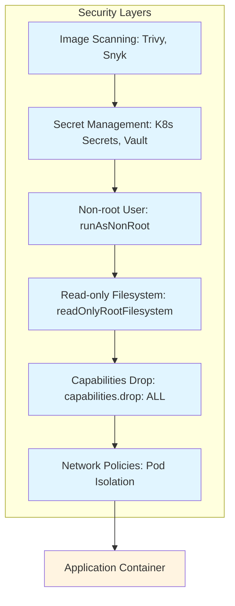

<div class="ai-summary-card">
<div class="ai-summary-header">
  <span class="ai-badge">AI 요약</span>
</div>
<div class="ai-summary-content">
  <div class="summary-row">
    <span class="summary-label">제목</span>
    <span class="summary-value">공용 PC에서도 안전하게! 패스키, OTP, 강력한 암호 관리 활용법</span>
  </div>
  <div class="summary-row">
    <span class="summary-label">카테고리</span>
    <span class="summary-value"><span class="category-tag security">Security</span></span>
  </div>
  <div class="summary-row">
    <span class="summary-label">태그</span>
    <span class="summary-value tags">
      <span class="tag">Passkey</span>
      <span class="tag">OTP</span>
      <span class="tag">Password-Manager</span>
      <span class="tag">Authentication</span>
    </span>
  </div>
  <div class="summary-row highlights">
    <span class="summary-label">핵심 내용</span>
    <ul class="summary-list">
      <li><strong>패스키(Passkey) 활용</strong>: WebAuthn 기반 비밀번호 없는 인증, 피싱 방지(도메인 바인딩), 편의성(생체 인증, 빠른 로그인), 크로스 플랫폼 동기화(iOS/Android/Windows/macOS), 2025년 주요 빅테크 기본 지원(Google/Apple/Microsoft)</li>
      <li><strong>OTP(One-Time Password) 2FA 강화</strong>: TOTP 앱(Google Authenticator, Microsoft Authenticator), SMS OTP 취약점 및 대안, 하드웨어 보안 키(YubiKey, Google Titan), FIDO2/WebAuthn 피싱 방지 MFA 표준화</li>
      <li><strong>암호 관리자(Password Manager)</strong>: 안전한 비밀번호 생성 및 저장, 공용 PC에서의 안전한 사용법, 클라우드 동기화 보안, 브라우저 확장 프로그램 활용</li>
      <li><strong>공용 PC 보안 모범 사례</strong>: 로그아웃 및 브라우저 캐시 관리, 시크릿 모드 활용, 개인정보 입력 최소화, 공용 PC 전용 계정 사용, 세션 타임아웃 설정</li>
      <li><strong>2025년 인증 보안 트렌드</strong>: Passkey 채택 확대, Phishing-Resistant MFA 표준화(FIDO2/WebAuthn), AI 기반 피싱 공격 증가 대응(개인화된 피싱, 딥페이크, 정교한 도메인 스푸핑), 제로 트러스트 원칙 적용</li>
    </ul>
  </div>
  <div class="summary-row">
    <span class="summary-label">기술/도구</span>
    <span class="summary-value">Passkey, OTP, Password Manager</span>
  </div>
  <div class="summary-row">
    <span class="summary-label">대상 독자</span>
    <span class="summary-value">기업 보안 담당자, 보안 엔지니어, CISO</span>
  </div>
</div>
<div class="ai-summary-footer">
  이 포스팅은 AI가 쉽게 이해하고 활용할 수 있도록 구조화된 요약을 포함합니다.
</div>
</div>


## 서론

안녕하세요! 여러분의 IT 라이프를 위한 꿀팁을 전하는 블로거입니다. 카페, 도서관 등 공용 PC를 사용해야 할 때 개인 정보나 계정 보안 때문에 찜찜했던 경험, 다들 있으시죠? 비밀번호 입력도 조심스럽고, 로그아웃은 제대로 했는지 불안하기도 하고요. 오늘은 이러한 걱정을 덜어줄 강력한 인증 및 암호 관리 방법들을 종합적으로 알아보고, 공용 PC에서도 개인 정보를 안전하게 지키는 방법을 소개해 드리려고 합니다! ..

이 글에서는 공용 PC에서도 안전하게!  패스키, OTP, 강력한 암호 관리 활용법에 대해 실무 중심으로 상세히 다룹니다.


컨테이너 보안은 DevSecOps 사이클을 통해 코드로 관리됩니다:

```mermaid
graph LR
    subgraph Dev["Dev Phase"]
        Code["Code: Secure Dockerfile"]
        Build["Build: Image Scanning"]
    end
    
    subgraph Sec["Sec Phase"]
        Scan["Security Scan: Trivy, Snyk"]
        Policy["Policy Check: K8s YAML Validation"]
    end
    
    subgraph Ops["Ops Phase"]
        Deploy["Deploy: Secure Deployment"]
        Monitor["Monitor: Runtime Security"]
    end
    
    Code --> Build
    Build --> Scan
    Scan --> Policy
    Policy --> Deploy
    Deploy --> Monitor
    Monitor --> Code
    
    style Code fill:#e1f5ff
    style Build fill:#fff4e1
    style Scan fill:#ffebee
    style Policy fill:#fff4e1
    style Deploy fill:#e8f5e9
    style Monitor fill:#f3e5f5
```## 1. 개요

### 1.1 배경 및 필요성

안녕하세요! 여러분의 IT 라이프를 위한 꿀팁을 전하는 블로거입니다. 카페, 도서관 등 공용 PC를 사용해야 할 때 개인 정보나 계정 보안 때문에 찜찜했던 경험, 다들 있으시죠? 비밀번호 입력도 조심스럽고, 로그아웃은 제대로 했는지 불안하기도 하고요. 오늘은 이러한 걱정을 덜어줄 강력한 인증 및 암호 관리 방법들을 종합적으로 알아보고, 공용 PC에서도 개인 정보를 안전하게 지키는 방법을 소개해 드리려고 합니다! .....

## 2. 핵심 내용

### 2.1 기본 설정

기본 설정을 시작하기 전에 다음 사항을 확인해야 합니다:

1. **요구사항 분석**: 필요한 기능 및 성능 요구사항 파악
2. **환경 준비**: 필요한 도구 및 리소스 준비
3. **보안 정책**: 보안 정책 및 규정 준수 사항 확인

### 2.2 단계별 구현

#### 단계 1: 초기 설정

초기 설정 단계에서는 기본 구성을 수행합니다.

```bash
# 예시 명령어
# 실제 설정에 맞게 수정 필요
```

#### 단계 2: 보안 구성


컨테이너 보안은 여러 레이어로 구성된 Defense in Depth 전략을 통해 강화됩니다:




보안 설정을 구성합니다:

- 접근 제어 설정
- 암호화 구성
- 모니터링 활성화

## 2. 2025년 인증 보안 트렌드

### 2.1 Passkey 채택 확대

2025년 현재, **Google, Apple, Microsoft** 등 주요 빅테크 기업들이 패스키(Passkey)를 기본 인증 방식으로 지원하고 있습니다. 패스키는 생체 인증이나 디바이스 PIN을 활용하여 비밀번호 없이 안전하게 로그인할 수 있는 차세대 인증 기술입니다.

**패스키의 주요 장점:**
- **피싱 방지**: 패스키는 도메인에 바인딩되어 피싱 사이트에서 사용 불가
- **편의성**: 비밀번호 입력 없이 생체 인증으로 빠른 로그인
- **크로스 플랫폼**: iOS, Android, Windows, macOS 간 동기화 지원

### 2.2 Phishing-Resistant MFA의 표준화

**FIDO2/WebAuthn**이 피싱 방지 다중 인증(Phishing-Resistant MFA)의 업계 표준으로 자리잡았습니다. 전통적인 SMS OTP나 이메일 인증 코드는 중간자 공격(MITM)에 취약하지만, FIDO2 기반 인증은 이러한 공격을 원천 차단합니다.

**권장 MFA 방식 (2025년):**
1. **FIDO2 보안 키**: YubiKey, Google Titan 등 하드웨어 보안 키
2. **플랫폼 인증기**: Windows Hello, Face ID, Touch ID
3. **패스키**: 클라우드 동기화 가능한 FIDO2 자격 증명

### 2.3 AI 기반 피싱 공격 증가

2025년 보안 업계의 가장 큰 우려 중 하나는 **AI를 활용한 피싱 공격의 급증**입니다. 보안 리더의 93%가 일일 AI 기반 공격을 예상하고 있으며, 이에 대응하기 위한 준비가 필수적입니다.

**AI 피싱 공격 특징:**
- **개인화된 피싱 메시지**: AI가 SNS, 이메일 등에서 수집한 정보로 맞춤형 피싱 메시지 생성
- **실시간 음성/영상 딥페이크**: 화상 회의나 전화에서 경영진 사칭
- **정교한 도메인 스푸핑**: AI가 유사 도메인을 자동 생성하여 피싱 사이트 제작

**대응 전략:**
- **패스키/FIDO2 필수 적용**: AI 피싱에도 효과적인 방어
- **보안 인식 교육 강화**: AI 생성 콘텐츠 식별 교육
- **제로 트러스트 원칙 적용**: 모든 접근에 대한 검증 강화

## 결론

공용 PC에서도 안전하게!  패스키, OTP, 강력한 암호 관리 활용법에 대해 다루었습니다. 특히 2025년 현재 패스키의 대중화와 AI 기반 피싱 공격 증가로 인해 피싱 방지 인증 방식의 중요성이 더욱 커졌습니다. 올바른 설정과 지속적인 모니터링을 통해 안전하고 효율적인 환경을 구축할 수 있습니다.