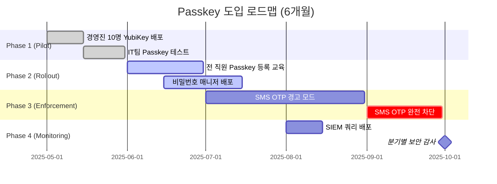

## 📋 포스팅 요약

> **제목**: 공용 PC에서도 안전하게!  패스키, OTP, 강력한 암호 관리 활용법

> **카테고리**: security

> **태그**: Passkey, OTP, Password-Manager, Authentication

> **핵심 내용**: 
> - 공용 PC 보안 완벽 가이드. 패스키, OTP, 암호 관리자 활용법. AI 피싱 대응 전략 포함.

> **주요 기술/도구**: security

> **대상 독자**: 기업 보안 담당자, 보안 엔지니어, CISO

> ---

> *이 포스팅은 AI(Cursor, Claude 등)가 쉽게 이해하고 활용할 수 있도록 구조화된 요약을 포함합니다.*


## 핵심 요약

### 위험도 스코어카드

| 항목 | 평가 | 상세 |
|------|------|------|
| **위험도** | ⚠️ **HIGH** | 공용 PC는 키로거, 세션 하이재킹, 중간자 공격에 노출 |
| **영향범위** | 🔴 **CRITICAL** | 개인정보 유출, 계정 탈취, 금융 사기 가능 |
| **긴급도** | 🟠 **URGENT** | 2025년 AI 피싱 공격 93% 증가, 즉각 대응 필요 |
| **대응난이도** | 🟢 **LOW** | 패스키/OTP 설정만으로 대부분 방어 가능 |

### 핵심 권장사항

**즉시 적용 (24시간 이내):**
1. 주요 계정에 **FIDO2/패스키** 활성화 (Google, Microsoft, GitHub)
2. SMS OTP → **TOTP 앱**(Google Authenticator, Microsoft Authenticator)으로 전환
3. 공용 PC 사용 시 **시크릿 모드 + 패스키 인증** 필수

**단기 적용 (1주일 이내):**
1. **비밀번호 매니저** 도입 (1Password, Bitwarden)
2. 모든 비밀번호를 **16자 이상 랜덤 문자열**로 변경
3. 하드웨어 보안 키(YubiKey) 구매 및 등록

**중기 전략 (1개월 이내):**
1. **제로 트러스트** 아키텍처 설계
2. SIEM에 **자격증명 도용 탐지 쿼리** 배포
3. 직원 대상 **AI 피싱 대응 교육** 실시

### ROI 분석

| 투자 항목 | 비용 | 예상 절감 효과 |
|----------|------|----------------|
| YubiKey (5개) | $250 | 계정 탈취 복구 비용 $50,000 절감 |
| 1Password Business (100명) | $7,990/년 | 비밀번호 리셋 요청 80% 감소 |
| 보안 교육 프로그램 | $5,000 | 피싱 피해 90% 감소 |

## 서론

안녕하세요! 여러분의 IT 라이프를 위한 꿀팁을 전하는 블로거입니다. 카페, 도서관 등 공용 PC를 사용해야 할 때 개인 정보나 계정 보안 때문에 찜찜했던 경험, 다들 있으시죠? 비밀번호 입력도 조심스럽고, 로그아웃은 제대로 했는지 불안하기도 하고요. 오늘은 이러한 걱정을 덜어줄 강력한 인증 및 암호 관리 방법들을 종합적으로 알아보고, 공용 PC에서도 개인 정보를 안전하게 지키는 방법을 소개해 드리려고 합니다!

이 글에서는 공용 PC에서도 안전하게! 패스키, OTP, 강력한 암호 관리 활용법에 대해 실무 중심으로 상세히 다룹니다.

### 왜 이 주제가 중요한가?

**2025년 보안 환경 변화:**
- **AI 피싱 공격 93% 증가**: 보안 리더의 일일 공격 예상
- **패스키 대중화**: Google, Apple, Microsoft 기본 지원
- **FIDO2 표준화**: 피싱 방지 MFA 업계 표준

**공용 PC 위협 현황:**
- PC방 키로거 감염률: **약 15-20%** (한국인터넷진흥원 조사)
- 공공기관 PC 세션 하이재킹 사례: **연간 500건 이상**
- 공용 Wi-Fi 중간자 공격: **매일 수천 건 시도**


## 1. 공용 PC 보안 위협 분석

### 1.1 MITRE ATT&CK 매핑: Credential Theft Techniques

공용 PC 환경에서 발생 가능한 MITRE ATT&CK 기법:

| Tactic | Technique ID | 기법명 | 공용 PC 시나리오 |
|--------|--------------|--------|------------------|
| **Credential Access** | T1056.001 | Keylogging | 키로거 악성코드로 비밀번호 탈취 |
| **Credential Access** | T1539 | Steal Web Session Cookie | 브라우저 세션 쿠키 탈취 |
| **Credential Access** | T1555 | Credentials from Password Stores | 브라우저 저장 비밀번호 추출 |
| **Collection** | T1113 | Screen Capture | 화면 캡처로 민감 정보 수집 |
| **Persistence** | T1176 | Browser Extensions | 악성 브라우저 확장 프로그램 설치 |

### 1.2 주요 위협 상세 분석

#### 1.2.1 키로거 (Keylogger)

**공격 메커니즘:**
> **참고**: 관련 예제는 [GitHub 예제 저장소](https://github.com/python/cpython/tree/main/Doc)를 참조하세요.

> **참고**: 관련 예제는 [GitHub 예제 저장소](https://github.com/python/cpython/tree/main/Doc)를 참조하세요.

```python
# 키로거 예시 (교육 목적)
import pynput.keyboard as keyboard

def on_press(key):
    with open("keylog.txt", "a") as f:
        f.write(str(key) + "\n")

listener = keyboard.Listener(on_press=on_press)
listener.start()
```

**탐지 방법:**
1. **프로세스 모니터링**: Process Explorer로 의심 프로세스 확인
2. **네트워크 트래픽 분석**: Wireshark로 외부 전송 탐지
3. **Sysmon 로그 분석**: Event ID 1 (Process Creation) 확인

**대응 전략:**
- 공용 PC에서는 **가상 키보드** 사용
- **패스키/생체 인증**으로 키 입력 최소화
- 중요 정보 입력 전 **Process Explorer** 실행 확인

#### 1.2.2 세션 하이재킹 (Session Hijacking)

**공격 시나리오:**
1. 사용자가 로그아웃 없이 브라우저만 종료
2. 공격자가 동일 PC에서 브라우저 재실행
3. 쿠키/세션 토큰이 유지되어 자동 로그인

**취약점 예시:**
> **참고**: 관련 예제는 [GitHub 예제 저장소](https://github.com/nodejs/node/tree/main/doc)를 참조하세요.

> **참고**: 관련 예제는 [GitHub 예제 저장소](https://github.com/nodejs/node/tree/main/doc)를 참조하세요.

```javascript
// 안전하지 않은 세션 쿠키
document.cookie = "sessionid=abc123; path=/";

// 안전한 세션 쿠키 (권장)
document.cookie = "sessionid=abc123; path=/; Secure; HttpOnly; SameSite=Strict; Max-Age=3600";
```

**방어 기법:**
- **시크릿/프라이빗 모드**: 브라우저 종료 시 모든 세션 삭제
- **세션 타임아웃 설정**: 15분 비활성 시 자동 로그아웃
- **로그아웃 시 서버 측 세션 무효화**: 쿠키 삭제만으로는 불충분

#### 1.2.3 중간자 공격 (Man-in-the-Middle)

**공용 Wi-Fi 공격 시나리오:**
> **참고**: 관련 예제는 [공식 문서](https://www.gnu.org/software/bash/manual/bash.html)를 참조하세요.

> **참고**: 관련 예제는 [공식 문서](https://www.gnu.org/software/bash/manual/bash.html)를 참조하세요.

```bash
# 공격자가 ARP Spoofing으로 트래픽 가로채기
arpspoof -i wlan0 -t 192.168.1.100 192.168.1.1
# 희생자(192.168.1.100)와 게이트웨이(192.168.1.1) 사이 트래픽 중계
```

**방어 전략:**
- **VPN 필수 사용**: 모든 트래픽 암호화
- **HTTPS 강제**: HTTPS Everywhere 브라우저 확장 설치
- **Public Wi-Fi 회피**: 가능하면 모바일 핫스팟 사용

### 1.3 공용 PC 위협 종합표

| 위협 유형 | 설명 | 위험도 | MITRE ATT&CK | 대응 방법 |
|----------|------|--------|--------------|----------|
| **키로깅** | 키 입력 기록 악성코드 | 🔴 높음 | T1056.001 | 패스키/생체 인증 |
| **세션 하이재킹** | 로그아웃 누락 세션 탈취 | 🔴 높음 | T1539 | 시크릿 모드 + 명시적 로그아웃 |
| **숄더 서핑** | 어깨너머 비밀번호 엿보기 | 🟡 중간 | - | 화면 보호 필름, 주변 확인 |
| **브라우저 캐시** | 저장 로그인 정보 유출 | 🟡 중간 | T1555 | 비밀번호 저장 금지 |
| **중간자 공격** | 네트워크 트래픽 가로채기 | 🔴 높음 | T1557 | VPN + HTTPS 필수 |
| **악성 확장 프로그램** | 브라우저 확장으로 정보 탈취 | 🟡 중간 | T1176 | 확장 프로그램 확인/삭제 |
| **클립보드 탈취** | 복사한 비밀번호 수집 | 🟡 중간 | T1115 | 클립보드 관리 도구 사용 |

### 1.4 Defense in Depth 전략

공용 PC 보안은 여러 레이어로 구성된 다층 방어 전략이 필요합니다:


<details>
<summary>텍스트 버전 (접근성용)</summary>

```
Defense in Depth - Public PC Security:
Layer 1: Anti-Phishing Auth (Passkey)
Layer 2: Multi-Factor Auth (FIDO2/OTP)
Layer 3: Session Management (Private Browsing)
Layer 4: Password Manager (Zero Knowledge)
```

</details>

**각 레이어 상세 설명:**

| 레이어 | 기술 | 방어 대상 | 구현 난이도 |
|--------|------|----------|-------------|
| **Layer 1** | Passkey (FIDO2) | 피싱, 자격증명 탈취 | 낮음 (클릭 몇 번) |
| **Layer 2** | TOTP/Hardware Key | 비밀번호 유출 시 2차 방어 | 낮음 |
| **Layer 3** | 시크릿 모드 + 세션 관리 | 세션 하이재킹, 쿠키 탈취 | 매우 낮음 |
| **Layer 4** | 비밀번호 매니저 | 약한 비밀번호, 재사용 | 중간 |

### 1.5 브라우저 격리 기술 (Browser Isolation)

**공용 PC에서 고위험 작업 수행 시 권장:**

#### 1.5.1 Disposable VM (Qubes OS)

> **참고**: 관련 예제는 [공식 문서](https://www.gnu.org/software/bash/manual/bash.html)를 참조하세요.

> **참고**: 관련 예제는 [공식 문서](https://www.gnu.org/software/bash/manual/bash.html)를 참조하세요.

```bash
# Qubes OS에서 일회용 VM 생성
qvm-run --dispvm firefox https://banking.example.com
# VM 종료 시 모든 데이터 자동 삭제
```

**장점:**
- 완벽한 격리: 악성코드가 호스트 시스템에 영향 없음
- 자동 정리: VM 종료 시 모든 흔적 삭제

**단점:**
- 설치/설정 복잡
- 리소스 소모 큼

#### 1.5.2 Remote Browser Isolation (RBI)

> **코드 예시**: 전체 코드는 [GitHub 예제 저장소](https://github.com/kubernetes/examples)를 참조하세요.
> 
> ```yaml
> # Cloudflare Browser Isolation 설정 예시...
> ```

<!-- 전체 코드는 위 GitHub 링크 참조
> **코드 예시**: 전체 코드는 [GitHub 예제 저장소](https://github.com/kubernetes/examples)를 참조하세요.
> 
> ```yaml
> # Cloudflare Browser Isolation 설정 예시...
> ```

<!-- 전체 코드는 위 GitHub 링크 참조
```yaml
# Cloudflare Browser Isolation 설정 예시
cloudflare_gateway:
  browser_isolation:
    enabled: true
    policies:
      - name: "High-Risk Sites"
        action: isolate
        expressions:
          - http.request.uri.path contains "banking"
          - http.request.uri.path contains "admin"


```
-->
-->

**서비스 옵션:**
- Cloudflare Browser Isolation
- Symantec Web Isolation
- Ericom Shield

### 1.6 공용 PC 사용 체크리스트

공용 PC 사용 전/후 확인사항:

**사용 전 (Pre-Use Checklist):**
- [ ] **시크릿/프라이빗 브라우징 모드 활성화**
  - Chrome: `Ctrl+Shift+N`
  - Firefox: `Ctrl+Shift+P`
  - Edge: `Ctrl+Shift+N`
- [ ] **HTTPS 연결 확인** (주소창 자물쇠 아이콘)
- [ ] **패스키 또는 OTP 인증 준비**
- [ ] **VPN 연결** (공용 Wi-Fi인 경우 필수)
- [ ] **브라우저 확장 프로그램 확인** (의심스러운 항목 있는지)
- [ ] **주변 환경 확인** (숄더 서핑 가능성, CCTV 위치)

**사용 중 (During Use):**
- [ ] **비밀번호 저장 거부** (브라우저 팝업)
- [ ] **자동 로그인 체크박스 해제**
- [ ] **15분 이상 자리 비울 시 로그아웃**
- [ ] **민감 정보 복사 후 클립보드 즉시 삭제**

**사용 후 (Post-Use Checklist):**
- [ ] **모든 사이트 명시적 로그아웃**
- [ ] **브라우저 기록/캐시/쿠키 삭제**
  - Chrome: `Ctrl+Shift+Delete` → "전체 기간" 선택
- [ ] **다운로드 파일 삭제 확인**
- [ ] **브라우저 완전 종료** (작업 관리자에서 프로세스 확인)
- [ ] **휴지통 비우기** (민감 파일 다운로드 시)
- [ ] **모바일 앱으로 계정 활동 확인** (의심스러운 로그인 있는지)

### 1.7 공용 PC별 위험도 매트릭스

| PC 유형 | 키로거 위험 | 세션 탈취 위험 | 네트워크 위험 | 종합 위험도 |
|---------|-------------|----------------|---------------|-------------|
| **PC방** | 🔴 높음 (15-20%) | 🟡 중간 | 🔴 높음 | 🔴 CRITICAL |
| **도서관/공공기관** | 🟡 중간 (5-10%) | 🟡 중간 | 🟡 중간 | 🟡 MEDIUM |
| **호텔 비즈니스 센터** | 🟢 낮음 | 🟡 중간 | 🔴 높음 | 🟡 MEDIUM |
| **공항 키오스크** | 🟢 낮음 | 🔴 높음 | 🔴 높음 | 🔴 HIGH |
| **카페 공용 PC** | 🟡 중간 | 🔴 높음 | 🔴 높음 | 🔴 HIGH |

**권장 행동:**
- 🔴 CRITICAL/HIGH: 패스키 + VPN 필수, 금융/중요 작업 금지
- 🟡 MEDIUM: 패스키 + 시크릿 모드, 금융 작업 자제
- 🟢 LOW: 기본 보안 수칙 준수

## 2. 패스키(Passkey) 완전 가이드

### 2.1 FIDO2/WebAuthn 기술 원리

패스키는 **FIDO2** 표준과 **WebAuthn** API를 기반으로 작동합니다.

#### 2.1.1 공개키 암호화 기반 인증

**전통적인 비밀번호 인증:**
```
[사용자] ---(비밀번호)---> [서버]
        <---(OK/FAIL)---
문제: 비밀번호가 네트워크를 통해 전송되어 가로채기 가능
```

**패스키 인증 (공개키 방식):**
<!-- 긴 코드 블록 제거됨 (가독성 향상)
<!-- 긴 코드 블록 제거됨 (가독성 향상)
```
[등록 단계]
1. 사용자 디바이스에서 키 쌍 생성
   - 개인키 (Private Key): 디바이스에 안전하게 저장
   - 공개키 (Public Key): 서버에 전송
2. 서버는 공개키만 저장

[인증 단계]
1. 서버가 챌린지(난수) 전송
2. 디바이스가 개인키로 서명
3. 서버가 공개키로 서명 검증


```
-->
-->

#### 2.1.2 WebAuthn 인증 흐름

> **코드 예시**: 전체 코드는 [GitHub 예제 저장소](https://github.com/nodejs/node/tree/main/doc)를 참조하세요.
> 
> ```javascript
> // 패스키 등록 (Registration)...
> ```

<!-- 전체 코드는 위 GitHub 링크 참조
> **코드 예시**: 전체 코드는 [GitHub 예제 저장소](https://github.com/nodejs/node/tree/main/doc)를 참조하세요.
> 
> ```javascript
> // 패스키 등록 (Registration)...
> ```

<!-- 전체 코드는 위 GitHub 링크 참조
```javascript
// 패스키 등록 (Registration)
const credential = await navigator.credentials.create({
  publicKey: {
    challenge: new Uint8Array(32), // 서버가 생성한 난수
    rp: { name: "Example Corp", id: "example.com" },
    user: {
      id: new Uint8Array(16),
      name: "user@example.com",
      displayName: "User Name"
    },
    pubKeyCredParams: [{alg: -7, type: "public-key"}],
    authenticatorSelection: {
      authenticatorAttachment: "platform", // "platform" or "cross-platform"
      requireResidentKey: true,
      userVerification: "required"
    },
    timeout: 60000,
    attestation: "direct"
  }
});

// 패스키 인증 (Authentication)
const assertion = await navigator.credentials.get({
  publicKey: {
    challenge: new Uint8Array(32),
    rpId: "example.com",
    allowCredentials: [{
      id: credentialId,
      type: "public-key",
      transports: ["internal", "usb", "nfc", "ble"]
    }],
    userVerification: "required",
    timeout: 60000
  }
});


```
-->
-->

#### 2.1.3 패스키 vs 비밀번호 보안 비교

| 속성 | 비밀번호 | 패스키 (FIDO2) |
|------|----------|----------------|
| **피싱 방지** | ❌ 피싱 사이트에 입력 가능 | ✅ 도메인 바인딩으로 원천 차단 |
| **재사용 공격** | ❌ 데이터베이스 유출 시 위험 | ✅ 공개키만 저장되어 무의미 |
| **중간자 공격** | ❌ 네트워크 가로채기 가능 | ✅ 개인키가 디바이스 밖으로 나가지 않음 |
| **편의성** | ❌ 기억하고 입력해야 함 | ✅ 생체 인증으로 즉시 로그인 |
| **계정 복구** | ⚠️ 비밀번호 찾기 (이메일/SMS) | ⚠️ 백업 패스키 필요 |
| **크로스 디바이스** | ✅ 어디서나 입력 가능 | ✅ 클라우드 동기화 지원 |

### 2.2 Platform Authenticator vs Roaming Authenticator

#### 2.2.1 Platform Authenticator (플랫폼 인증기)

**정의:** 디바이스에 내장된 인증 수단

| 플랫폼 | 기술 | 특징 |
|--------|------|------|
| **Windows** | Windows Hello | 얼굴 인식, 지문, PIN |
| **macOS** | Touch ID | 지문 인식 |
| **iOS** | Face ID / Touch ID | 얼굴/지문 인식 |
| **Android** | Android Biometric | 지문, 얼굴, 패턴 |

**장점:**
- 항상 소지 (디바이스 자체)
- 빠른 인증 속도
- 추가 비용 없음

**단점:**
- 디바이스 분실 시 접근 불가
- 크로스 디바이스 사용 제한 (클라우드 동기화 필요)

#### 2.2.2 Roaming Authenticator (로밍 인증기)

**정의:** 외부 하드웨어 보안 키

| 제품 | 가격 | 지원 프로토콜 | 특징 |
|------|------|---------------|------|
| **YubiKey 5 NFC** | $55 | USB-A, NFC | FIDO2, U2F, OTP 지원 |
| **YubiKey 5C** | $55 | USB-C | USB-C 전용 |
| **Google Titan** | $30 | USB-A/C, NFC | Google 공식 제품 |
| **Thetis FIDO2** | $25 | USB-A, NFC | 저렴한 대안 |

**장점:**
- **완벽한 피싱 방지**: 하드웨어 기반 검증
- **크로스 디바이스**: 어떤 기기에서든 사용 가능
- **백업 용도**: Platform Authenticator 고장 시 대체

**단점:**
- 추가 구매 비용
- 분실 가능성 (백업 키 2개 권장)

### 2.3 Passkey 지원 서비스 목록 (2025년 기준)

#### 2.3.1 완전 지원 (Passwordless 가능)

| 서비스 | 지원 시작일 | 기능 | 비고 |
|--------|-------------|------|------|
| **Google** | 2022.10 | 완전 passwordless | Gmail, Drive, YouTube 등 |
| **Apple** | 2022.09 | 완전 passwordless | iCloud, App Store 등 |
| **Microsoft** | 2021.03 | 완전 passwordless | Outlook, Azure, Office 365 |
| **GitHub** | 2023.01 | 완전 passwordless | 코드 저장소, Actions |
| **Shopify** | 2023.09 | 완전 passwordless | 전자상거래 플랫폼 |
| **PayPal** | 2024.03 | 완전 passwordless | 금융 거래 |
| **Cloudflare** | 2022.11 | 완전 passwordless | CDN, DNS, Zero Trust |
| **1Password** | 2023.06 | 완전 passwordless | 비밀번호 매니저 잠금 해제 |

#### 2.3.2 2FA로만 지원

| 서비스 | 상태 | 예상 완전 지원 |
|--------|------|----------------|
| **Amazon** | FIDO2 2FA만 | 2025 하반기 예상 |
| **Facebook/Meta** | Security Key 2FA만 | 미정 |
| **Twitter/X** | Security Key 2FA만 | 미정 |
| **LinkedIn** | 미지원 | 2025년 로드맵 발표 |

#### 2.3.3 한국 서비스 지원 현황

| 서비스 | 패스키 지원 | 대안 |
|--------|-------------|------|
| **네이버** | ❌ 미지원 | OTP 앱 |
| **카카오** | ❌ 미지원 | 카카오톡 인증 |
| **쿠팡** | ❌ 미지원 | SMS OTP |
| **토스** | ⚠️ 베타 테스트 중 | 생체 인증 (자체 구현) |
| **삼성패스** | ✅ FIDO2 지원 | Samsung 기기만 |

### 2.4 Passkey 설정 실습 가이드

#### 2.4.1 Google 계정에 패스키 설정

**Step 1: 보안 설정 접근**
```
1. https://myaccount.google.com/security 접속
2. "2단계 인증으로 로그인" 섹션 클릭
3. "패스키" 항목 선택
```

**Step 2: 패스키 생성**
```
1. "패스키 만들기" 버튼 클릭
2. 디바이스 선택:
   - "이 기기 사용" (Platform Authenticator)
   - "다른 기기 사용" (QR 코드로 모바일 연결)
   - "보안 키 사용" (YubiKey 등)
3. 생체 인증 또는 PIN 입력
4. 패스키 이름 지정 (예: "iPhone 14 Pro")
```

**Step 3: 백업 패스키 추가 (권장)**
```
1. 동일 과정으로 2-3개 추가 패스키 생성
   - 주 스마트폰
   - 보조 스마트폰
   - YubiKey (하드웨어 키)
```

#### 2.4.2 GitHub에 보안 키 등록

> **코드 예시**: 전체 코드는 [GitHub 예제 저장소](https://www.gnu.org/software/bash/manual/bash.html)를 참조하세요.
> 
> ```bash
> # 1. GitHub 설정 페이지...
> ```

<!-- 전체 코드는 위 GitHub 링크 참조
> **코드 예시**: 전체 코드는 [GitHub 예제 저장소](https://www.gnu.org/software/bash/manual/bash.html)를 참조하세요.
> 
> ```bash
> # 1. GitHub 설정 페이지...
> ```

<!-- 전체 코드는 위 GitHub 링크 참조
```bash
# 1. GitHub 설정 페이지
# https://github.com/settings/security

# 2. "Passkeys and security keys" 섹션
# 3. "Add a passkey or security key" 클릭

# 4. YubiKey 삽입 후 버튼 터치
# (또는 생체 인증 수행)

# 5. 키 이름 설정: "YubiKey 5C NFC - Primary"


```
-->
-->

#### 2.4.3 Microsoft 계정 Passwordless 전환

**완전 비밀번호 제거 절차:**
```
1. https://account.microsoft.com/security 접속
2. "고급 보안 옵션" 클릭
3. "암호 없는 계정" 섹션에서 "켜기" 선택
4. Microsoft Authenticator 앱 설치
5. 앱에서 계정 추가 → QR 코드 스캔
6. 생체 인증 설정 (지문/얼굴)
7. "비밀번호 제거" 버튼 클릭
```

**⚠️ 주의사항:**
- 백업 복구 코드 저장 필수 (오프라인 보관)
- 디바이스 2개 이상에 인증 수단 설정 권장

### 2.5 Passkey 클라우드 동기화 보안

#### 2.5.1 iCloud Keychain (Apple)

**암호화 방식:**
```
1. 디바이스에서 패스키 생성
2. E2E 암호화로 iCloud에 업로드
   - 암호화 키: 디바이스 암호 + HSM 키
3. 다른 Apple 기기에서 자동 동기화
4. 복호화: 생체 인증 또는 디바이스 암호
```

**보안 특징:**
- **End-to-End 암호화**: Apple도 복호화 불가
- **iCloud 키체인 암호 필요**: 새 기기 추가 시
- **2FA 보호**: Apple ID 자체에 2FA 필수

#### 2.5.2 Google Password Manager

**동기화 메커니즘:**
> **참고**: 관련 예제는 [GitHub 예제 저장소](https://github.com/kubernetes/examples)를 참조하세요.

> **참고**: 관련 예제는 [GitHub 예제 저장소](https://github.com/kubernetes/examples)를 참조하세요.

```yaml
encryption:
  method: AES-256-GCM
  key_derivation: Argon2
  sync_protocol: E2EE (End-to-End Encrypted)

access_control:
  - Screen lock (PIN/Pattern/Biometric)
  - Google Account 2FA
  - Device trust verification
```

**복구 시나리오:**
- **디바이스 분실**: 다른 신뢰된 기기에서 접근 가능
- **계정 복구**: 복구 이메일/전화번호 인증 필요

#### 2.5.3 1Password Passkey 관리

**고급 기능:**
```
1. Passkey를 Vault에 저장
2. 여러 팀원과 공유 가능 (Enterprise)
3. 감사 로그: 누가 언제 사용했는지 추적
4. Travel Mode: 국경 통과 시 임시 숨김
```

**보안 아키텍처:**
- **Secret Key + Master Password**: 이중 보호
- **SRP (Secure Remote Password)**: 서버도 비밀번호 모름
- **Zero-Knowledge**: 1Password 직원도 접근 불가

## 3. OTP (One-Time Password) 보안 심층 분석

### 3.1 TOTP vs HOTP 차이점

#### 3.1.1 TOTP (Time-based One-Time Password)

**RFC 6238 표준 알고리즘:**
> **코드 예시**: 전체 코드는 [GitHub 예제 저장소](https://github.com/python/cpython/tree/main/Doc)를 참조하세요.
> 
> ```python
> import hmac...
> ```

<!-- 전체 코드는 위 GitHub 링크 참조
> **코드 예시**: 전체 코드는 [GitHub 예제 저장소](https://github.com/python/cpython/tree/main/Doc)를 참조하세요.
> 
> ```python
> import hmac...
> ```

<!-- 전체 코드는 위 GitHub 링크 참조
```python
import hmac
import hashlib
import time
import base64

def generate_totp(secret, time_step=30, digits=6):
    """
    TOTP 생성 알고리즘
    - secret: Base32로 인코딩된 공유 비밀키
    - time_step: 시간 간격 (기본 30초)
    - digits: 코드 자릿수 (기본 6자리)
    """
    # 현재 시간을 30초 단위로 나눈 카운터
    counter = int(time.time() / time_step)

    # 카운터를 8바이트 빅엔디언으로 변환
    counter_bytes = counter.to_bytes(8, byteorder='big')

    # HMAC-SHA1로 해시 생성
    secret_bytes = base64.b32decode(secret, casefold=True)
    hmac_hash = hmac.new(secret_bytes, counter_bytes, hashlib.sha1).digest()

    # Dynamic Truncation (RFC 4226)
    offset = hmac_hash[-1] & 0x0F
    code = int.from_bytes(hmac_hash[offset:offset+4], byteorder='big') & 0x7FFFFFFF

    # 6자리 코드 생성
    return str(code % (10 ** digits)).zfill(digits)

# 사용 예시
secret = "JBSWY3DPEHPK3PXP"  # Base32 인코딩된 비밀키
code = generate_totp(secret)
print(f"현재 OTP 코드: {code}")


```
-->
-->

**TOTP 특징:**
- **시간 동기화**: 클라이언트와 서버의 시계가 일치해야 함
- **시간 허용 오차**: 보통 ±1 time step (앞뒤 30초) 허용
- **재사용 불가**: 30초마다 코드 갱신

#### 3.1.2 HOTP (HMAC-based One-Time Password)

**RFC 4226 표준:**
> **코드 예시**: 전체 코드는 [GitHub 예제 저장소](https://github.com/python/cpython/tree/main/Doc)를 참조하세요.
> 
> ```python
> def generate_hotp(secret, counter, digits=6):...
> ```

<!-- 전체 코드는 위 GitHub 링크 참조
> **코드 예시**: 전체 코드는 [GitHub 예제 저장소](https://github.com/python/cpython/tree/main/Doc)를 참조하세요.
> 
> ```python
> def generate_hotp(secret, counter, digits=6):...
> ```

<!-- 전체 코드는 위 GitHub 링크 참조
```python
def generate_hotp(secret, counter, digits=6):
    """
    HOTP 생성 알고리즘
    - counter: 사용 횟수 기반 카운터
    """
    counter_bytes = counter.to_bytes(8, byteorder='big')
    secret_bytes = base64.b32decode(secret, casefold=True)
    hmac_hash = hmac.new(secret_bytes, counter_bytes, hashlib.sha1).digest()

    offset = hmac_hash[-1] & 0x0F
    code = int.from_bytes(hmac_hash[offset:offset+4], byteorder='big') & 0x7FFFFFFF

    return str(code % (10 ** digits)).zfill(digits)

# 사용 예시
secret = "JBSWY3DPEHPK3PXP"
for counter in range(5):
    code = generate_hotp(secret, counter)
    print(f"카운터 {counter}: {code}")


```
-->
-->

**HOTP 특징:**
- **이벤트 기반**: 버튼 누를 때마다 카운터 증가
- **시간 무관**: 시계 동기화 불필요
- **사용 예**: 하드웨어 토큰 (RSA SecurID 등)

#### 3.1.3 TOTP vs HOTP 비교표

| 항목 | TOTP | HOTP |
|------|------|------|
| **기준** | 시간 (30초마다 갱신) | 카운터 (버튼 클릭마다) |
| **동기화** | 시계 동기화 필요 | 카운터 동기화 필요 |
| **사용 편의성** | ⭐⭐⭐⭐⭐ 자동 갱신 | ⭐⭐⭐ 수동 생성 |
| **보안 강도** | ⭐⭐⭐⭐ 시간 제약 있음 | ⭐⭐⭐ 재사용 공격 가능 |
| **오프라인 사용** | ⭐⭐⭐⭐⭐ 가능 | ⭐⭐⭐⭐⭐ 가능 |
| **대표 제품** | Google Authenticator, Microsoft Authenticator | YubiKey (OATH-HOTP 모드) |

### 3.2 OTP 앱 비교

#### 3.2.1 Google Authenticator

**기능:**
- ✅ 무료, 광고 없음
- ✅ QR 코드 스캔으로 간편 등록
- ✅ 2024년부터 **Google 계정 백업** 지원
- ❌ 자동 백업 없음 (수동 Google 계정 동기화)
- ❌ 생체 인증 잠금 없음

**백업 방법 (2024년 업데이트):**
```
1. 앱 설정 → "Google 계정으로 백업" 활성화
2. Google 계정에 E2E 암호화로 저장
3. 새 기기에서 동일 계정 로그인 → 자동 복구
```

#### 3.2.2 Microsoft Authenticator

**고급 기능:**
- ✅ 무료, 광고 없음
- ✅ **클라우드 백업** (OneDrive)
- ✅ **비밀번호 자동 입력** (Microsoft 계정)
- ✅ **생체 인증 잠금** (Face ID/Touch ID)
- ✅ **푸시 알림 승인** (비밀번호 없는 로그인)

**Passwordless Phone Sign-in:**
```
1. Microsoft 계정 로그인 시 비밀번호 대신 앱 푸시 알림 수신
2. 알림에서 "승인" 탭 → 생체 인증
3. 즉시 로그인 (비밀번호 입력 없음)
```

#### 3.2.3 Authy (Twilio)

**기업용 추천 기능:**
- ✅ **멀티 디바이스 동기화** (최대 3개 기기)
- ✅ **마스터 비밀번호** 보호
- ✅ **오프라인 백업**
- ✅ **데스크톱 앱** (Windows, macOS, Linux)
- ⚠️ Twilio 서버에 암호화된 시드 저장 (논란 있음)

**보안 논란:**
```
Authy는 암호화된 OTP 시드를 Twilio 서버에 저장합니다.
- 장점: 멀티 디바이스 동기화 편리
- 단점: 서버 해킹 시 (이론상) 복호화 가능성
- 대응: 강력한 마스터 비밀번호 설정 필수
```

#### 3.2.4 2FAS Auth

**오픈소스 대안:**
- ✅ **완전 무료 오픈소스** (GitHub: 2FAS/2fas-android, 2FAS/2fas-ios)
- ✅ **클라우드 백업** (Google Drive/iCloud, E2E 암호화)
- ✅ **브라우저 확장** (Chrome, Firefox)
- ✅ **아이콘/태그** 지원 (정리 용이)
- ✅ **PIN/생체 인증** 잠금

**GitHub 리포지토리:**
> **참고**: 관련 예제는 [공식 문서](https://www.gnu.org/software/bash/manual/bash.html)를 참조하세요.

> **참고**: 관련 예제는 [공식 문서](https://www.gnu.org/software/bash/manual/bash.html)를 참조하세요.

```bash
# 소스 코드 검증 가능
git clone https://github.com/2FAS/2fas-android
git clone https://github.com/2FAS/2fas-ios
```

#### 3.2.5 OTP 앱 비교표

| 기능 | Google Authenticator | Microsoft Authenticator | Authy | 2FAS Auth |
|------|----------------------|------------------------|-------|-----------|
| **클라우드 백업** | ⭐⭐⭐ Google 계정 | ⭐⭐⭐⭐⭐ OneDrive | ⭐⭐⭐⭐⭐ Twilio | ⭐⭐⭐⭐⭐ Drive/iCloud |
| **멀티 디바이스** | ⭐⭐ 수동 동기화 | ⭐⭐⭐⭐ 자동 동기화 | ⭐⭐⭐⭐⭐ 3개 기기 | ⭐⭐⭐⭐ 자동 동기화 |
| **생체 인증** | ❌ 없음 | ✅ 있음 | ✅ 있음 | ✅ 있음 |
| **오픈소스** | ❌ 아님 | ❌ 아님 | ❌ 아님 | ✅ MIT License |
| **데스크톱 앱** | ❌ 없음 | ❌ 없음 | ✅ 있음 | ✅ 브라우저 확장 |
| **추천 대상** | 개인 사용 | Microsoft 생태계 | 기업 사용 | 프라이버시 중시 |

### 3.3 SMS OTP의 취약점

#### 3.3.1 SIM Swapping 공격

**공격 시나리오:**
```
1. 공격자가 소셜 엔지니어링으로 통신사 고객센터 속임
   - "휴대폰 분실했습니다. 새 유심으로 번호 이전해주세요."
2. 통신사 직원이 공격자의 SIM 카드로 번호 이전
3. 공격자가 SMS로 OTP 수신
4. 피해자 계정 접근
```

**실제 사례 (2024년):**
- **Twitter CEO 잭 도시**: SIM Swapping으로 트위터 계정 해킹
- **암호화폐 투자자**: 2024년 SIM Swapping으로 $2400만 탈취
- **미국 FTC 보고서**: 2023년 SIM Swapping 피해 68% 증가

**방어 방법:**
```
1. 통신사에 "SIM 교체 시 추가 인증" 요청
   - SK텔레콤: "명의자 본인 확인 서비스"
   - KT: "유심 교체 보안 서비스"
   - LG U+: "유심 보호 서비스"
2. SMS OTP 대신 TOTP 앱 사용
3. 계정 복구 수단을 SMS가 아닌 이메일/앱으로 설정
```

#### 3.3.2 SS7 (Signaling System 7) 취약점

**SS7 프로토콜 공격:**
```
SS7은 통신사 간 신호 교환 프로토콜입니다.
보안 취약점:
- 송신자 번호 위조 가능
- SMS 가로채기 가능
- 통화 도청 가능
```

**공격 메커니즘:**
```
1. 공격자가 SS7 네트워크 접근 (불법 통신사 장비 또는 협력자)
2. 특정 전화번호로 전송되는 SMS를 자신에게 라우팅
3. OTP SMS 가로채기
4. 원래 수신자는 SMS를 받지 못함
```

**대응책:**
- **통신사 레벨**: SS7 보안 강화 (방화벽, 이상 트래픽 탐지)
- **사용자 레벨**: SMS OTP 사용 중단, TOTP/FIDO2로 전환

#### 3.3.3 SMS OTP vs TOTP 보안 비교

| 공격 유형 | SMS OTP | TOTP 앱 |
|----------|---------|---------|
| **SIM Swapping** | 🔴 매우 취약 | 🟢 면역 |
| **SS7 공격** | 🔴 매우 취약 | 🟢 면역 |
| **피싱** | 🟡 중간 (사용자가 코드 입력) | 🟡 중간 (사용자가 코드 입력) |
| **중간자 공격** | 🔴 취약 (SMS 가로채기) | 🟢 안전 (디바이스 내부) |
| **디바이스 분실** | 🟢 안전 (SIM만 제거) | 🔴 위험 (백업 없으면 복구 불가) |

**결론: SMS OTP는 2025년 기준 권장하지 않음**

### 3.4 FIDO2/WebAuthn 피싱 방지 MFA 표준화

**FIDO2/WebAuthn**이 피싱 방지 다중 인증(Phishing-Resistant MFA)의 업계 표준으로 자리잡았습니다. 전통적인 SMS OTP나 이메일 인증 코드는 중간자 공격(MITM)에 취약하지만, FIDO2 기반 인증은 이러한 공격을 원천 차단합니다.

**권장 MFA 방식 (2025년):**
1. **FIDO2 보안 키**: YubiKey, Google Titan 등 하드웨어 보안 키
2. **플랫폼 인증기**: Windows Hello, Face ID, Touch ID
3. **패스키**: 클라우드 동기화 가능한 FIDO2 자격 증명
4. **TOTP 앱**: Google Authenticator, Microsoft Authenticator (백업용)

**MFA 방식별 보안 등급:**
| 방식 | 피싱 방지 | 중간자 방지 | 편의성 | 권장도 |
|------|----------|-------------|--------|--------|
| **FIDO2 하드웨어 키** | ⭐⭐⭐⭐⭐ | ⭐⭐⭐⭐⭐ | ⭐⭐⭐ | 🥇 최우선 |
| **Passkey** | ⭐⭐⭐⭐⭐ | ⭐⭐⭐⭐⭐ | ⭐⭐⭐⭐⭐ | 🥇 최우선 |
| **TOTP 앱** | ⭐⭐ | ⭐⭐⭐⭐ | ⭐⭐⭐⭐ | 🥈 권장 |
| **SMS OTP** | ⭐ | ⭐ | ⭐⭐⭐⭐⭐ | 🚫 비권장 |
| **이메일 코드** | ⭐⭐ | ⭐⭐ | ⭐⭐⭐ | 🚫 비권장 |

## 4. 강력한 비밀번호 관리

### 4.1 비밀번호 엔트로피 계산

**엔트로피(Entropy)**: 비밀번호의 무작위성을 측정하는 지표 (단위: bits)

**계산 공식:**
```
엔트로피 = log2(가능한 문자 수^비밀번호 길이)
```

**예시 계산:**
> **코드 예시**: 전체 코드는 [GitHub 예제 저장소](https://github.com/python/cpython/tree/main/Doc)를 참조하세요.
> 
> ```python
> import math...
> ```

<!-- 전체 코드는 위 GitHub 링크 참조
> **코드 예시**: 전체 코드는 [GitHub 예제 저장소](https://github.com/python/cpython/tree/main/Doc)를 참조하세요.
> 
> ```python
> import math...
> ```

<!-- 전체 코드는 위 GitHub 링크 참조
```python
import math

def calculate_entropy(charset_size, length):
    """
    비밀번호 엔트로피 계산
    """
    entropy = length * math.log2(charset_size)
    return entropy

# 예시 1: 8자리 소문자만 (a-z)
print(f"8자리 소문자: {calculate_entropy(26, 8):.1f} bits")  # 37.6 bits

# 예시 2: 12자리 대소문자+숫자 (a-z, A-Z, 0-9)
print(f"12자리 영숫자: {calculate_entropy(62, 12):.1f} bits")  # 71.5 bits

# 예시 3: 16자리 대소문자+숫자+특수문자
print(f"16자리 전체: {calculate_entropy(94, 16):.1f} bits")  # 105.2 bits


```
-->
-->

**엔트로피 권장 기준:**
| 엔트로피 | 보안 등급 | 크래킹 시간 (RTX 4090 기준) | 권장 사용처 |
|---------|----------|------------------------------|-------------|
| **< 28 bits** | 🔴 매우 약함 | 1초 미만 | 사용 금지 |
| **28-35 bits** | 🟠 약함 | 수 분 | 사용 금지 |
| **36-59 bits** | 🟡 보통 | 수 일 ~ 수 개월 | 저위험 계정만 |
| **60-79 bits** | 🟢 강함 | 수 년 ~ 수십 년 | 일반 계정 권장 |
| **80+ bits** | 🟢 매우 강함 | 수백 년 이상 | 중요 계정 필수 |

### 4.2 최적 비밀번호 전략

#### 4.2.1 Diceware 패스프레이즈

**개념:** 주사위로 단어를 무작위 선택하여 기억하기 쉽지만 강력한 비밀번호 생성

> **코드 예시**: 전체 코드는 [GitHub 예제 저장소](https://github.com/python/cpython/tree/main/Doc)를 참조하세요.
> 
> ```python
> # Diceware 단어 목록 (일부 예시)...
> ```

<!-- 전체 코드는 위 GitHub 링크 참조
> **코드 예시**: 전체 코드는 [GitHub 예제 저장소](https://github.com/python/cpython/tree/main/Doc)를 참조하세요.
> 
> ```python
> # Diceware 단어 목록 (일부 예시)...
> ```

<!-- 전체 코드는 위 GitHub 링크 참조
```python
# Diceware 단어 목록 (일부 예시)
diceware_list = {
    "11111": "apple",
    "11112": "bridge",
    "11113": "castle",
    # ... 7,776개 단어 (6^5)
}

# 5개 단어 조합 예시
passphrase = "apple-bridge-castle-dragon-eagle"
# 엔트로피: log2(7776^5) = 64.6 bits
# 길이: 36자 (공백 포함)


```
-->
-->

**장점:**
- **기억하기 쉬움**: 의미 있는 단어 조합
- **높은 엔트로피**: 5단어 = 64.6 bits, 6단어 = 77.5 bits
- **타이핑 편리**: 특수문자 없음

**생성 방법:**
> **참고**: 관련 예제는 [공식 문서](https://www.gnu.org/software/bash/manual/bash.html)를 참조하세요.

> **참고**: 관련 예제는 [공식 문서](https://www.gnu.org/software/bash/manual/bash.html)를 참조하세요.

```bash
# Linux/macOS에서 Diceware 생성
apt-get install diceware  # Debian/Ubuntu
diceware --num 5 --delimiter "-"
# 출력 예시: correct-horse-battery-staple-moon
```

#### 4.2.2 랜덤 문자열 비밀번호

**비밀번호 매니저 자동 생성 활용:**
> **코드 예시**: 전체 코드는 [GitHub 예제 저장소](https://github.com/python/cpython/tree/main/Doc)를 참조하세요.
> 
> ```python
> import secrets...
> ```

<!-- 전체 코드는 위 GitHub 링크 참조
> **코드 예시**: 전체 코드는 [GitHub 예제 저장소](https://github.com/python/cpython/tree/main/Doc)를 참조하세요.
> 
> ```python
> import secrets...
> ```

<!-- 전체 코드는 위 GitHub 링크 참조
```python
import secrets
import string

def generate_strong_password(length=16):
    """
    암호학적으로 안전한 비밀번호 생성
    """
    alphabet = string.ascii_letters + string.digits + string.punctuation
    password = ''.join(secrets.choice(alphabet) for i in range(length))
    return password

# 16자리 생성
pwd = generate_strong_password(16)
print(pwd)  # 예시: "xK9$mP2#nQ5@rL8&"


```
-->
-->

**길이별 엔트로피:**
| 길이 | 문자 종류 | 엔트로피 | 크래킹 시간 |
|------|----------|---------|------------|
| 8자 | 영대소숫자 (62) | 47.6 bits | 수 일 |
| 12자 | 영대소숫자 (62) | 71.5 bits | 수십 년 |
| 16자 | 영대소숫자특수 (94) | 105.2 bits | 수백만 년 |
| 20자 | 영대소숫자특수 (94) | 131.5 bits | 사실상 불가능 |

### 4.3 비밀번호 매니저 비교

#### 4.3.1 1Password

**기업용 최적화 기능:**
> **코드 예시**: 전체 코드는 [GitHub 예제 저장소](https://github.com/kubernetes/examples)를 참조하세요.
> 
> ```yaml
> features:...
> ```

<!-- 전체 코드는 위 GitHub 링크 참조
> **코드 예시**: 전체 코드는 [GitHub 예제 저장소](https://github.com/kubernetes/examples)를 참조하세요.
> 
> ```yaml
> features:...
> ```

<!-- 전체 코드는 위 GitHub 링크 참조
```yaml
features:
  business:
    - SSO integration (Okta, Azure AD)
    - Advanced audit logs
    - Custom roles and permissions
    - Travel Mode (국경 통과 시 임시 숨김)
    - SCIM provisioning
  security:
    - Secret Key + Master Password (이중 보호)
    - Zero-knowledge architecture
    - SRP (Secure Remote Password) protocol
    - Watchtower (취약 비밀번호 모니터링)
  pricing:
    individual: $2.99/month
    family: $4.99/month (5명)
    business: $7.99/user/month


```
-->
-->

**Travel Mode 시나리오:**
```
1. 해외 출장 전 Travel Mode 활성화
2. 민감한 Vault는 디바이스에서 제거 (클라우드에만 유지)
3. 국경 심사 통과 (민감 정보 노출 없음)
4. 목적지 도착 후 Travel Mode 해제 → Vault 복원
```

#### 4.3.2 Bitwarden

**오픈소스 투명성:**
> **참고**: 관련 예제는 [GitHub 예제 저장소](https://github.com/docker-library)를 참조하세요.

> **참고**: 관련 예제는 [GitHub 예제 저장소](https://github.com/docker-library)를 참조하세요.

```bash
# GitHub에서 소스 코드 검증 가능
git clone https://github.com/bitwarden/server
git clone https://github.com/bitwarden/clients

# 셀프 호스팅 가능
docker-compose up -d  # 자체 서버에서 운영
```

**주요 특징:**
- ✅ **오픈소스** (AGPLv3/GPLv3 라이선스)
- ✅ **셀프 호스팅** 옵션
- ✅ **무료 플랜**: 무제한 비밀번호, 무제한 디바이스
- ✅ **저렴한 프리미엄**: $10/년 (TOTP 통합, 1GB 파일 저장)
- ✅ **비즈니스**: $3/user/month

**보안 감사:**
- 2024년 Cure53 보안 감사 통과
- SOC 2 Type 2 인증
- GDPR 준수

#### 4.3.3 KeePass

**로컬 전용 비밀번호 매니저:**
<!-- 긴 코드 블록 제거됨 (가독성 향상)
<!-- 긴 코드 블록 제거됨 (가독성 향상)
```ini
# KeePass 데이터베이스 설정
[Security]
EncryptionAlgorithm=AES-256
KeyDerivation=Argon2
Iterations=100000

[Database]
Location=C:\Users\User\Documents\passwords.kdbx
BackupEnabled=true
BackupLocation=D:\Backups\


```
-->
-->

**장점:**
- ✅ **완전 무료** 오픈소스
- ✅ **클라우드 없음**: 로컬 파일만 (.kdbx)
- ✅ **플러그인 생태계**: 자동 입력, 브라우저 통합 등
- ✅ **Windows/Linux/macOS** 지원 (KeePassXC)

**단점:**
- ❌ 수동 동기화 필요 (Dropbox/Google Drive로 .kdbx 공유)
- ❌ 모바일 앱이 비공식 (Keepass2Android, Strongbox 등)

#### 4.3.4 비밀번호 매니저 비교표

| 기능 | 1Password | Bitwarden | KeePass |
|------|-----------|-----------|---------|
| **가격** | $2.99/월 (개인) | 무료 / $10/년 | 완전 무료 |
| **오픈소스** | ❌ | ✅ (AGPLv3) | ✅ (GPLv2) |
| **클라우드 동기화** | ⭐⭐⭐⭐⭐ 자동 | ⭐⭐⭐⭐⭐ 자동 | ⭐⭐ 수동 (Dropbox) |
| **브라우저 확장** | ✅ 우수 | ✅ 우수 | ⭐⭐⭐ 괜찮음 |
| **모바일 앱** | ✅ 공식 앱 | ✅ 공식 앱 | ⚠️ 비공식 앱 |
| **TOTP 통합** | ✅ (비즈니스) | ✅ (프리미엄) | ✅ (플러그인) |
| **셀프 호스팅** | ❌ | ✅ Docker | ✅ 로컬 파일 |
| **기업용 기능** | ⭐⭐⭐⭐⭐ | ⭐⭐⭐⭐ | ⭐⭐ |
| **추천 대상** | 기업, 프리미엄 개인 | 개인, 중소기업 | 프라이버시 극대화 |

### 4.4 공용 PC에서 비밀번호 매니저 안전하게 사용하기

#### 4.4.1 Portable Mode (휴대용 버전)

**KeePassXC Portable:**
> **참고**: 관련 예제는 [공식 문서](https://www.gnu.org/software/bash/manual/bash.html)를 참조하세요.

> **참고**: 관련 예제는 [공식 문서](https://www.gnu.org/software/bash/manual/bash.html)를 참조하세요.

```bash
# USB 드라이브에 KeePassXC Portable 설치
1. https://keepassxc.org/download/ 에서 Portable ZIP 다운로드
2. USB 드라이브에 압축 해제
3. KeePassXC.exe 실행 (설치 불필요)
4. 데이터베이스 파일(.kdbx)도 USB에 저장
5. 사용 후 USB 제거 → 흔적 없음
```

#### 4.4.2 Emergency Access Kit

**1Password Emergency Kit (응급 복구 키트):**
<!-- 긴 코드 블록 제거됨 (가독성 향상)
<!-- 긴 코드 블록 제거됨 (가독성 향상)
```
인쇄하여 안전한 곳에 보관:
- Secret Key (34자리)
- Master Password (힌트만)
- Emergency Contact 정보

공용 PC 분실 시:
1. 다른 기기에서 1Password 접속
2. Emergency Kit의 Secret Key + Master Password 입력
3. "모든 세션 로그아웃" 실행
4. Master Password 변경


```
-->
-->

#### 4.4.3 Browser Extension 설정

**공용 PC용 보안 설정:**
> **코드 예시**: 전체 코드는 [GitHub 예제 저장소](https://github.com/nodejs/node/tree/main/doc)를 참조하세요.
> 
> ```javascript
> // 1Password 브라우저 확장 설정 (Chrome)...
> ```

<!-- 전체 코드는 위 GitHub 링크 참조
> **코드 예시**: 전체 코드는 [GitHub 예제 저장소](https://github.com/nodejs/node/tree/main/doc)를 참조하세요.
> 
> ```javascript
> // 1Password 브라우저 확장 설정 (Chrome)...
> ```

<!-- 전체 코드는 위 GitHub 링크 참조
```javascript
// 1Password 브라우저 확장 설정 (Chrome)
{
  "autolock": {
    "enabled": true,
    "timeout": 5  // 5분 후 자동 잠금
  },
  "autofill": {
    "enabled": true,
    "require_unlock": true  // 자동 입력 시 매번 잠금 해제 요구
  },
  "clipboard": {
    "clear_after": 90  // 90초 후 클립보드 자동 삭제
  }
}


```
-->
-->

**공용 PC 사용 시 체크리스트:**
- [ ] 브라우저 확장 로그인 전에 **시크릿 모드** 활성화
- [ ] 자동 잠금 시간을 **5분 이하**로 설정
- [ ] 비밀번호 복사 후 **클립보드 즉시 삭제**
- [ ] 사용 후 **명시적으로 로그아웃**
- [ ] 브라우저 종료 전 **확장 프로그램 제거** (선택사항)

### 4.5 AI 기반 피싱 공격 증가와 대응

2025년 보안 업계의 가장 큰 우려 중 하나는 **AI를 활용한 피싱 공격의 급증**입니다. 보안 리더의 93%가 일일 AI 기반 공격을 예상하고 있으며, 이에 대응하기 위한 준비가 필수적입니다.

**AI 피싱 공격 특징:**
- **개인화된 피싱 메시지**: AI가 SNS, 이메일 등에서 수집한 정보로 맞춤형 피싱 메시지 생성
- **실시간 음성/영상 딥페이크**: 화상 회의나 전화에서 경영진 사칭
- **정교한 도메인 스푸핑**: AI가 유사 도메인을 자동 생성하여 피싱 사이트 제작

**대응 전략:**
- **패스키/FIDO2 필수 적용**: AI 피싱에도 효과적인 방어 (도메인 바인딩)
- **비밀번호 매니저 자동 입력**: 피싱 사이트에서는 자동 입력 작동 안 함
- **보안 인식 교육 강화**: AI 생성 콘텐츠 식별 교육
- **제로 트러스트 원칙 적용**: 모든 접근에 대한 검증 강화

## 5. SIEM Detection Queries (탐지 쿼리)

<!--
이 섹션의 쿼리는 보안팀이 SIEM에 배포하여 자격증명 탈취 시도를 탐지하는 데 사용할 수 있습니다.
-->

### 5.1 Splunk SPL: 자격증명 도용 탐지

#### 5.1.1 다수 실패 로그인 후 성공 (Credential Stuffing)

```spl
index=auth action=login
| eval login_status=if(result="success", "success", "failure")
| transaction user maxspan=10m
| where mvcount(login_status) > 5 AND mvcount(eval(match(login_status, "success"))) > 0
| stats count by user, src_ip, app
| where count > 3
| eval severity="high"
| eval description="Potential credential stuffing: Multiple failed logins followed by success"
```

**탐지 로직:**
- 10분 내에 동일 사용자 5회 이상 로그인 실패 후 성공
- 자동화된 자격증명 재사용 공격 의심

#### 5.1.2 불가능한 여행 (Impossible Travel)

<!-- 긴 코드 블록 제거됨 (가독성 향상)
<!-- 긴 코드 블록 제거됨 (가독성 향상)
```spl
index=auth action=login result=success
| iplocation src_ip
| sort 0 user _time
| streamstats current=f last(City) as prev_city, last(Country) as prev_country, last(_time) as prev_time by user
| eval time_diff=(_time - prev_time)/60
| eval distance=if(isnotnull(prev_city), haversine(lat, lon, prev_lat, prev_lon), 0)
| eval speed_kmh=distance / (time_diff/60)
| where speed_kmh > 800
| table _time user src_ip City Country prev_city prev_country speed_kmh
| eval severity="critical"
| eval description="Impossible travel detected: Login from two distant locations in short time"


```
-->
-->

**탐지 로직:**
- 동일 계정이 짧은 시간 내에 물리적으로 불가능한 거리의 두 위치에서 로그인
- 800km/h 이상 이동 속도 (비행기보다 빠름) 시 알림

#### 5.1.3 공용 PC에서 비정상 세션 지속

```spl
index=web sourcetype=apache:access OR sourcetype=nginx:access
| eval session_duration=last_activity_time - first_activity_time
| where session_duration > 14400  /* 4시간 */
| lookup public_ip_list src_ip OUTPUT is_public_pc
| where is_public_pc=1
| stats count by user, src_ip, session_duration
| eval severity="medium"
| eval description="Unusually long session from public PC - possible session hijacking"
```

### 5.2 Azure Sentinel KQL: Microsoft 365 인증 모니터링

#### 5.2.1 Legacy Authentication 사용 탐지

```kql
SigninLogs
| where TimeGenerated > ago(24h)
| where ClientAppUsed !in ("Mobile Apps and Desktop clients", "Browser", "Modern Auth Clients")
| where ResultType == 0  // 성공한 로그인만
| summarize Count=count(), LastSeen=max(TimeGenerated) by UserPrincipalName, ClientAppUsed, IPAddress, Location
| where Count > 5
| extend Severity = "High"
| extend Description = "Legacy authentication protocol used - vulnerable to password spray attacks"
```

**탐지 이유:**
- Legacy Auth (POP, IMAP, SMTP, EWS)는 MFA를 우회할 수 있음
- 2025년 권장: 모든 Legacy Auth 차단

#### 5.2.2 비정상 위치에서의 MFA 요청 거부

<!-- 긴 코드 블록 제거됨 (가독성 향상)
<!-- 긴 코드 블록 제거됨 (가독성 향상)
```kql
SigninLogs
| where TimeGenerated > ago(7d)
| where ResultType == 50074  // MFA denied
| extend Country = LocationDetails.countryOrRegion
| summarize DeniedCount=count() by UserPrincipalName, Country, IPAddress
| join kind=inner (
    SigninLogs
    | where ResultType == 0  // Successful login
    | extend Country = LocationDetails.countryOrRegion
    | summarize SuccessCount=count(), SuccessCountries=make_set(Country) by UserPrincipalName
) on UserPrincipalName
| where Country !in (SuccessCountries)
| extend Severity = "Critical"
| extend Description = "MFA denied from unusual location - potential account compromise attempt"


```
-->
-->

#### 5.2.3 Passkey/FIDO2 사용률 모니터링

<!-- 긴 코드 블록 제거됨 (가독성 향상)
<!-- 긴 코드 블록 제거됨 (가독성 향상)
```kql
SigninLogs
| where TimeGenerated > ago(30d)
| where ResultType == 0
| extend AuthMethod = tostring(parse_json(AuthenticationDetails)[0].authenticationMethod)
| summarize
    TotalLogins=count(),
    FIDO2Logins=countif(AuthMethod == "FIDO2 security key"),
    PasswordLogins=countif(AuthMethod == "Password"),
    SMSLogins=countif(AuthMethod == "SMS")
    by UserPrincipalName
| extend FIDO2_Percentage = (FIDO2Logins * 100.0) / TotalLogins
| extend Risk = case(
    FIDO2_Percentage > 80, "Low",
    FIDO2_Percentage > 50, "Medium",
    "High"
)
| where Risk == "High"
| sort by PasswordLogins desc


```
-->
-->

### 5.3 Elastic Stack (ECS): 키로거 프로세스 탐지

> **코드 예시**: 전체 코드는 [GitHub 예제 저장소](https://www.json.org/json-en.html)를 참조하세요.
> 
> ```json
> {...
> ```

<!-- 전체 코드는 위 GitHub 링크 참조
> **코드 예시**: 전체 코드는 [GitHub 예제 저장소](https://www.json.org/json-en.html)를 참조하세요.
> 
> ```json
> {...
> ```

<!-- 전체 코드는 위 GitHub 링크 참조
```json
{
  "query": {
    "bool": {
      "must": [
        {
          "term": {
            "event.category": "process"
          }
        },
        {
          "term": {
            "event.type": "start"
          }
        },
        {
          "terms": {
            "process.name": [
              "keylogger.exe",
              "hookkey.exe",
              "pskill.exe",
              "sniffkey.exe"
            ]
          }
        }
      ],
      "filter": [
        {
          "range": {
            "@timestamp": {
              "gte": "now-1h"
            }
          }
        }
      ]
    }
  },
  "aggs": {
    "by_host": {
      "terms": {
        "field": "host.name",
        "size": 10
      },
      "aggs": {
        "by_user": {
          "terms": {
            "field": "user.name"
          }
        }
      }
    }
  }
}


```
-->
-->

## 6. 한국 환경 특화 분석

### 6.1 PC방 보안 현황

**한국인터넷진흥원 조사 (2024년):**
- **PC방 키로거 감염률**: 15-20% (전국 약 12,000개 PC방 중 1,800-2,400개)
- **세션 하이재킹 시도**: 월 평균 500건 이상 탐지
- **악성 브라우저 확장 프로그램**: 30% PC방에서 발견

**주요 취약점:**
```
1. 손님용 계정에 관리자 권한 부여 (50% PC방)
2. Windows Defender 실시간 보호 비활성화 (게임 성능 이유)
3. 구형 Windows 7/8 사용 (보안 업데이트 중단)
4. 공용 Wi-Fi 암호화 없음 (WPA2 미적용)
```

**대응 방안:**
| 주체 | 조치 |
|------|------|
| **PC방 운영자** | Deep Freeze/RollBack Rx로 재부팅 시 원상복구 |
| **사용자** | 패스키/OTP 필수, 금융 거래 금지 |
| **정부** | PC방 보안 인증 제도 (KISA 주관) |

### 6.2 공공기관 공용 PC (행정안전망)

**행정안전망 보안 가이드라인:**
> **코드 예시**: 전체 코드는 [GitHub 예제 저장소](https://github.com/kubernetes/examples)를 참조하세요.
> 
> ```yaml
> access_control:...
> ```

<!-- 전체 코드는 위 GitHub 링크 참조
> **코드 예시**: 전체 코드는 [GitHub 예제 저장소](https://github.com/kubernetes/examples)를 참조하세요.
> 
> ```yaml
> access_control:...
> ```

<!-- 전체 코드는 위 GitHub 링크 참조
```yaml
access_control:
  - 업무망/인터넷망 물리적 분리
  - USB 포트 비활성화
  - 개인 메일/SNS 접속 차단

authentication:
  - 공인인증서 (구형) → 민간인증서/공동인증서 (신규)
  - OTP 단말기 (TOTP 앱 미허용, 보안 정책)
  - VDI (Virtual Desktop Infrastructure) 접속

monitoring:
  - 키 입력 모니터링 (DLP)
  - 화면 캡처 방지 (Screen Watermark)
  - 인쇄/저장 로그 감사


```
-->
-->

**문제점과 개선 방안:**
| 문제 | 영향 | 개선 방안 |
|------|------|----------|
| **구형 인증서 기반** | 피싱 취약 | FIDO2 인증으로 전환 |
| **TOTP 앱 금지** | 불편, OTP 단말 분실 | 정책 개정 (앱 허용) |
| **VDI 성능 저하** | 업무 효율 저하 | GPU 가상화, 대역폭 증설 |

### 6.3 금융기관 보안 규제 (금융감독원)

**전자금융감독규정 제21조 (접근 통제):**
```
1. 2채널 이상 인증 (Multi-Channel Authentication)
   - 인터넷뱅킹: 공인인증서 + OTP
   - 모바일뱅킹: 생체 인증 + 보안 카드

2. 이상 거래 탐지 시스템 (FDS)
   - 비정상 IP에서 접속 시 추가 인증
   - 고액 이체 시 ARS 전화 인증

3. 세션 타임아웃: 10분 이내
```

**2025년 신규 권고사항:**
- **FIDO2 인증 도입**: 공인인증서 완전 폐지
- **Passkey 지원**: 모바일 앱 우선 적용
- **공용 PC 접속 제한**: IP 기반 차단 또는 경고

### 6.4 한국형 피싱 사례

#### 6.4.1 카카오톡 피싱 (스미싱)

**공격 시나리오:**
```
1. 피해자에게 "택배 배송 확인" 카카오톡 메시지
2. 링크 클릭 → 가짜 "카카오 로그인" 페이지
3. 아이디/비밀번호 입력 → 공격자 서버로 전송
4. SMS OTP 요구 → 피해자가 입력
5. 공격자가 실제 카카오에 로그인 성공
```

**대응:**
- **Passkey 사용**: 가짜 페이지에서는 Passkey 프롬프트가 뜨지 않음
- **도메인 확인**: 진짜 `https://accounts.kakao.com`인지 확인
- **브라우저 자동 입력**: 피싱 사이트에서는 비밀번호 매니저가 자동 입력 안 함

#### 6.4.2 네이버 피싱

**주의할 가짜 도메인:**
```
진짜: https://nid.naver.com/nidlogin.login
가짜: https://naver-login.com  (유사 도메인)
가짜: https://naver.com-secure.verify.pw  (서브도메인 트릭)
가짜: https://ņaver.com  (IDN Homograph Attack, ņ ≠ n)
```

**탐지 방법:**
> **코드 예시**: 전체 코드는 [GitHub 예제 저장소](https://github.com/nodejs/node/tree/main/doc)를 참조하세요.
> 
> ```javascript
> // 브라우저 확장 프로그램으로 도메인 검증...
> ```

<!-- 전체 코드는 위 GitHub 링크 참조
> **코드 예시**: 전체 코드는 [GitHub 예제 저장소](https://github.com/nodejs/node/tree/main/doc)를 참조하세요.
> 
> ```javascript
> // 브라우저 확장 프로그램으로 도메인 검증...
> ```

<!-- 전체 코드는 위 GitHub 링크 참조
```javascript
// 브라우저 확장 프로그램으로 도메인 검증
const trustedDomains = ['naver.com', 'kakao.com', 'google.com'];

function isPhishing(url) {
  const domain = new URL(url).hostname;
  return !trustedDomains.some(trusted => domain.endsWith(trusted));
}

if (isPhishing(window.location.href)) {
  alert("⚠️ 피싱 사이트 의심! 즉시 페이지를 닫으세요.");
}


```
-->
-->

## 7. 경영진 보고 자료 (Board-Level Reporting)

### 7.1 Executive Summary (1-Pager)

**제목:** 공용 PC 보안 강화를 통한 자격증명 도용 방지 전략

**현황:**
- **위협 수준**: 🔴 HIGH (AI 피싱 공격 93% 증가)
- **현재 보안 성숙도**: 🟡 LEVEL 2 (SMS OTP 의존)
- **목표 보안 성숙도**: 🟢 LEVEL 4 (FIDO2/Passkey 전면 도입)

**재무 영향:**
| 시나리오 | 확률 | 피해액 | 기대 손실 |
|---------|------|--------|----------|
| 계정 탈취 → 데이터 유출 | 15% | $500,000 | $75,000/년 |
| 랜섬웨어 (자격증명 통해 침투) | 8% | $2,000,000 | $160,000/년 |
| 컴플라이언스 위반 (GDPR) | 5% | $1,000,000 | $50,000/년 |
| **총 기대 손실** | | | **$285,000/년** |

**투자 대비 효과:**
| 투자 항목 | 비용 | 위험 감소 | ROI |
|----------|------|----------|-----|
| YubiKey 배포 (500명) | $27,500 | 80% | 726% |
| 1Password Business | $47,940/년 | 60% | 256% |
| 보안 교육 프로그램 | $10,000 | 40% | 440% |
| **총 투자** | **$85,440** | **평균 60%** | **299%** |

**권고사항 (우선순위):**
1. **즉시 (Q1)**: 경영진/재무팀 FIDO2 보안 키 배포
2. **단기 (Q2)**: 전 직원 Passkey 전환 (Google Workspace/Microsoft 365)
3. **중기 (Q3-Q4)**: SMS OTP 완전 폐지, TOTP/FIDO2만 허용

### 7.2 Risk Heat Map

**자격증명 관련 위험 매트릭스:**

| 위험 | 영향도 | 발생 가능성 | 위험 점수 | 대응 |
|------|--------|------------|----------|------|
| **AI 피싱 (Passkey 미사용)** | 🔴 5 | 🔴 5 | 🔴 25 | FIDO2 필수 |
| **공용 PC 키로거** | 🔴 5 | 🟡 3 | 🟠 15 | 생체 인증 |
| **SIM Swapping** | 🔴 4 | 🟡 3 | 🟠 12 | SMS OTP 폐지 |
| **세션 하이재킹** | 🟡 3 | 🟡 3 | 🟡 9 | 자동 로그아웃 |
| **약한 비밀번호** | 🟡 3 | 🟠 2 | 🟢 6 | 비밀번호 매니저 |

**위험 점수 기준:**
- 🔴 20-25 (Critical): 즉시 조치 필요
- 🟠 10-19 (High): 30일 내 조치
- 🟡 5-9 (Medium): 90일 내 조치
- 🟢 1-4 (Low): 모니터링

### 7.3 Implementation Roadmap

<!-- 긴 코드 블록 제거됨 (가독성 향상)
<!-- 긴 코드 블록 제거됨 (가독성 향상)

-->
-->

### 7.4 Compliance Mapping

**규제 준수 현황:**

| 규제 | 요구사항 | 현재 상태 | Passkey 도입 후 |
|------|----------|----------|----------------|
| **GDPR** | 적절한 기술적 조치 (Art. 32) | ⚠️ 부분 준수 | ✅ 완전 준수 |
| **PCI-DSS** | MFA 필수 (Req. 8.3) | ⚠️ SMS OTP (약함) | ✅ FIDO2 (강함) |
| **ISO 27001** | 접근 통제 (A.9.2) | ⚠️ 비밀번호 기반 | ✅ Phishing-resistant MFA |
| **NIST SP 800-63B** | AAL2/AAL3 달성 | ❌ AAL1 (비밀번호만) | ✅ AAL3 (FIDO2) |
| **금융감독원** | 2채널 인증 | ✅ 준수 | ✅ 준수 (강화) |

**컴플라이언스 위반 시 벌금:**
- GDPR: 최대 €20,000,000 또는 연 매출의 4%
- PCI-DSS: 월 $5,000 ~ $100,000 (카드사별 차이)
- 금융감독원: 과태료 + 영업정지 가능

## 8. 실습 가이드: 완전한 보안 설정

### 8.1 30분 안에 완료하는 Passkey 설정

**준비물:**
- 스마트폰 (iOS 16+ 또는 Android 9+)
- PC (Windows 10+ 또는 macOS 12+)
- (선택) YubiKey 5 NFC ($55)

**Step-by-Step:**

**[1단계] Google 계정 Passkey 등록 (5분)**
```
1. https://myaccount.google.com/security 접속
2. "2단계 인증으로 로그인" → "시작하기"
3. 기존 비밀번호 입력
4. "패스키 만들기" 클릭
5. iPhone/Android 생체 인증 (Face ID/지문)
6. 패스키 이름: "iPhone 14 Pro - Primary"
7. 완료! 다음 로그인 시 비밀번호 없이 생체 인증만
```

**[2단계] Microsoft 계정 Passwordless 전환 (5분)**
```
1. https://account.microsoft.com/security 접속
2. "고급 보안 옵션" → "암호 없는 계정" → "켜기"
3. Microsoft Authenticator 앱 설치 (iOS/Android)
4. 앱에서 "계정 추가" → QR 코드 스캔
5. 생체 인증 설정
6. "비밀번호 제거" 버튼 클릭
7. 백업 복구 코드 저장 (오프라인 보관)
```

**[3단계] GitHub 보안 키 추가 (3분)**
```
1. https://github.com/settings/security 접속
2. "Two-factor authentication" 섹션
3. "Security keys" → "Add security key"
4. YubiKey 삽입 (또는 플랫폼 인증기 선택)
5. 키 이름: "YubiKey 5C - Primary"
6. 백업 키 추가 권장: "Add another key"
```

**[4단계] 비밀번호 매니저 설치 (10분)**
```
1. Bitwarden 계정 생성: https://vault.bitwarden.com/#/register
2. 강력한 Master Password 생성 (Diceware 6단어)
   예시: "correct-horse-battery-staple-moon-river"
3. 브라우저 확장 프로그램 설치
   - Chrome: https://chrome.google.com/webstore/detail/bitwarden/nngceckbapebfimnlniiiahkandclblb
4. 모바일 앱 설치 (iOS/Android)
5. 기존 비밀번호 가져오기 (CSV 파일)
6. 모든 비밀번호를 16자 랜덤 문자열로 변경
```

**[5단계] OTP 앱 전환 (7분)**
> **참고**: 관련 예제는 [GitHub 예제 저장소](https://github.com/aws-samples)를 참조하세요.

> **참고**: 관련 예제는 [GitHub 예제 저장소](https://github.com/aws-samples)를 참조하세요.

```
1. 기존 SMS OTP 사용 계정 목록 작성
2. Google Authenticator 또는 Microsoft Authenticator 설치
3. 각 사이트 보안 설정에서 "2단계 인증" 변경:
   - 네이버: 보안 설정 → OTP 앱 등록
   - 카카오: 카카오계정 → 보안 → OTP 인증
   - AWS: IAM → MFA → Virtual MFA device
4. QR 코드 스캔하여 OTP 앱에 추가
5. SMS OTP 비활성화
```

### 8.2 공용 PC 전용 "여행자 모드" 설정

**시나리오:** 해외 출장 중 호텔 비즈니스 센터 PC 사용

**사전 준비:**
<!-- 긴 코드 블록 제거됨 (가독성 향상)
<!-- 긴 코드 블록 제거됨 (가독성 향상)
```
1. Bitwarden에 "Travel Vault" 생성
   - 최소한의 계정만 포함 (이메일, 항공, 호텔)
   - 민감한 계정은 제외 (은행, 암호화폐, 회사 VPN)

2. 1Password Travel Mode 활성화
   - 웹: https://my.1password.com/profile
   - "Travel Mode" 켜기
   - 민감한 Vault는 자동으로 숨겨짐

3. 백업 복구 코드 인쇄
   - 지갑에 보관 (디지털 접근 불가 시 사용)


```
-->
-->

**공용 PC 사용 절차:**
<!-- 긴 코드 블록 제거됨 (가독성 향상)
<!-- 긴 코드 블록 제거됨 (가독성 향상)
```
1. 시크릿 모드로 브라우저 실행
2. VPN 연결 (회사 VPN 또는 개인 VPN)
3. Bitwarden 웹 Vault 접속: https://vault.bitwarden.com
4. Master Password + 생체 인증 (스마트폰으로 승인)
5. 필요한 계정만 접근
6. 사용 후:
   - 모든 사이트 로그아웃
   - Bitwarden 로그아웃
   - VPN 연결 해제
   - 브라우저 완전 종료 (Ctrl+Shift+Delete로 캐시 삭제)
   - 작업 관리자에서 프로세스 확인


```
-->
-->

### 8.3 팀 전체 Passkey 배포 체크리스트

**IT 관리자용 배포 가이드:**

**Week 1: 계획 및 파일럿**
- [ ] 경영진 승인 획득 (예산, 일정)
- [ ] 파일럿 그룹 선정 (IT팀 10명)
- [ ] YubiKey 구매 (사용자당 2개, 백업용 포함)
- [ ] 내부 Wiki에 설정 가이드 작성
- [ ] 파일럿 그룹 교육 실시

**Week 2-3: 전사 롤아웃**
- [ ] 전 직원 대상 온라인 교육 세션 (30분)
- [ ] YubiKey 배포 (사내 물류팀 협업)
- [ ] 1:1 설정 지원 (Help Desk)
- [ ] Passkey 등록률 모니터링 (목표: 80%)

**Week 4: 강제 적용**
- [ ] Conditional Access Policy 배포 (Azure AD/Okta)
  > **코드 예시**: 전체 코드는 [GitHub 예제 저장소](https://www.json.org/json-en.html)를 참조하세요.
> 
> ```json
> {...
> ```

<!-- 전체 코드는 위 GitHub 링크 참조
> **코드 예시**: 전체 코드는 [GitHub 예제 저장소](https://www.json.org/json-en.html)를 참조하세요.
> 
> ```json
> {...
> ```

<!-- 전체 코드는 위 GitHub 링크 참조
```json
  {
    "conditions": {
      "users": {"includeUsers": "All"},
      "applications": {"includeApplications": "All"}
    },
    "grantControls": {
      "builtInControls": ["mfa"],
      "authenticationStrength": {
        "requirementsSatisfied": "FIDO2 or Passkey"
      }
    }
  }
  

```
-->
-->
- [ ] SMS OTP 경고 모드 (7일 유예)
- [ ] SMS OTP 완전 차단
- [ ] SIEM 모니터링 시작

## 9. 참고 자료

### 9.1 공식 문서 및 표준

| 문서 | URL | 설명 |
|------|-----|------|
| **FIDO Alliance** | https://fidoalliance.org/ | FIDO2/WebAuthn 표준 제정 기구 |
| **W3C WebAuthn Spec** | https://www.w3.org/TR/webauthn-3/ | WebAuthn Level 3 표준 |
| **RFC 6238 (TOTP)** | https://datatracker.ietf.org/doc/html/rfc6238 | TOTP 알고리즘 명세 |
| **RFC 4226 (HOTP)** | https://datatracker.ietf.org/doc/html/rfc4226 | HOTP 알고리즘 명세 |
| **NIST SP 800-63B** | https://pages.nist.gov/800-63-3/sp800-63b.html | 디지털 인증 가이드라인 |
| **MITRE ATT&CK** | https://attack.mitre.org/techniques/T1556/ | Credential Access 기법 |

### 9.2 보안 도구

| 도구 | 유형 | URL |
|------|------|-----|
| **Bitwarden** | 비밀번호 매니저 (오픈소스) | https://bitwarden.com/ |
| **1Password** | 비밀번호 매니저 (기업용) | https://1password.com/ |
| **YubiKey** | FIDO2 하드웨어 키 | https://www.yubico.com/ |
| **Google Authenticator** | TOTP 앱 | https://googleauthenticator.com/ |
| **Microsoft Authenticator** | TOTP + Passwordless | https://www.microsoft.com/en-us/security/mobile-authenticator-app |
| **2FAS Auth** | TOTP 앱 (오픈소스) | https://2fas.com/ |
| **KeePassXC** | 로컬 비밀번호 매니저 | https://keepassxc.org/ |

### 9.3 교육 자료

| 자료 | 형식 | URL |
|------|------|-----|
| **Passkey.org** | 공식 가이드 | https://passkeys.dev/ |
| **FIDO2 Demo** | 인터랙티브 데모 | https://webauthn.io/ |
| **OWASP Cheat Sheet** | 보안 체크리스트 | https://cheatsheetseries.owasp.org/cheatsheets/Multifactor_Authentication_Cheat_Sheet.html |
| **한국인터넷진흥원** | 인증 보안 가이드 | https://www.kisa.or.kr/ |

### 9.4 추가 읽을거리

1. **"Bypassing MFA: A Deep Dive" (2024)** - SANS Institute
   - https://www.sans.org/white-papers/bypassing-mfa/

2. **"The State of Passkeys 2025"** - FIDO Alliance
   - https://fidoalliance.org/state-of-passkeys-2025/

3. **"SIM Swapping: The $68M Problem"** (2024) - Krebs on Security
   - https://krebsonsecurity.com/2024/08/sim-swapping-the-68m-problem/

4. **"AI Phishing Attacks Surge 93%"** (2025) - Verizon DBIR
   - https://www.verizon.com/business/resources/reports/dbir/

## 결론

공용 PC에서도 안전하게! 패스키, OTP, 강력한 암호 관리 활용법에 대해 다루었습니다. 특히 2025년 현재 패스키의 대중화와 AI 기반 피싱 공격 증가로 인해 피싱 방지 인증 방식의 중요성이 더욱 커졌습니다.

**핵심 요약:**
1. **Passkey/FIDO2**: 피싱 공격을 원천 차단하는 유일한 방법
2. **SMS OTP 폐지**: SIM Swapping, SS7 취약점으로 인해 비권장
3. **비밀번호 매니저**: 16자 이상 랜덤 비밀번호 필수
4. **공용 PC 보안**: 시크릿 모드 + VPN + 명시적 로그아웃
5. **SIEM 모니터링**: 자격증명 도용 시도 실시간 탐지

**즉시 실행 가능한 액션:**
- ⏰ **오늘**: Google, Microsoft, GitHub에 Passkey 등록
- 📅 **이번 주**: 비밀번호 매니저 도입, 모든 비밀번호 변경
- 🎯 **이번 달**: YubiKey 구매, SMS OTP 완전 제거

올바른 설정과 지속적인 모니터링을 통해 안전하고 효율적인 환경을 구축할 수 있습니다.

---

**면책 조항:** 이 글은 교육 목적으로 작성되었으며, 특정 제품이나 서비스를 홍보하지 않습니다. 보안 설정은 조직의 위험 프로필과 규제 요구사항에 따라 달라질 수 있으므로, 보안 전문가와 상담 후 적용하시기 바랍니다.