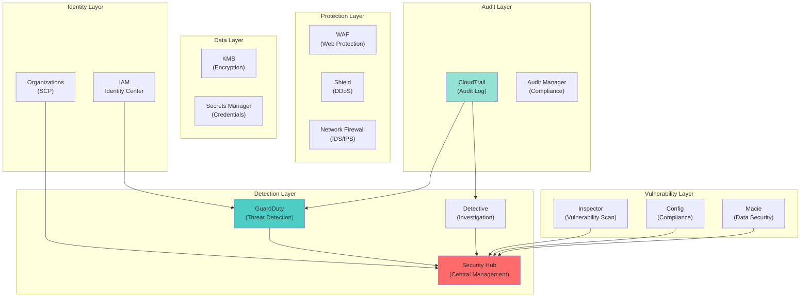
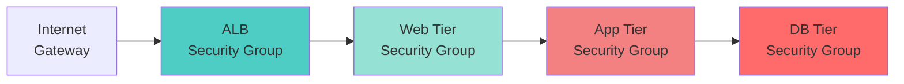
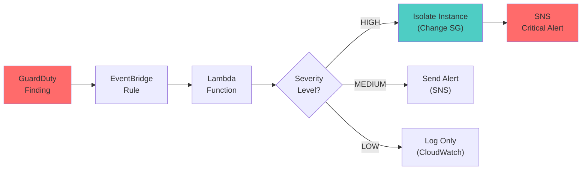
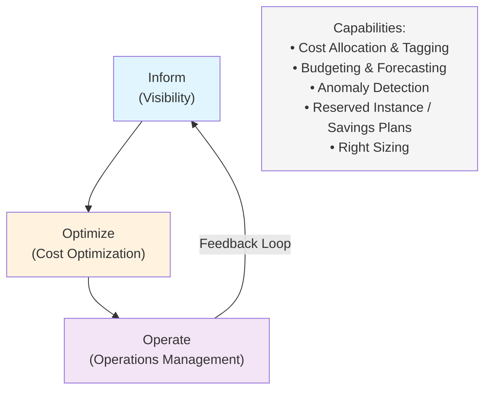
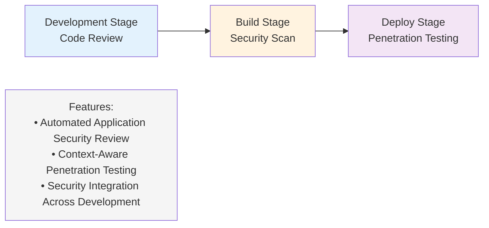
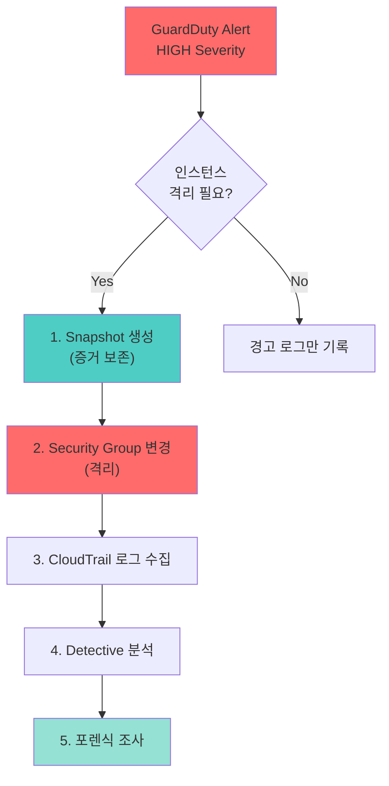
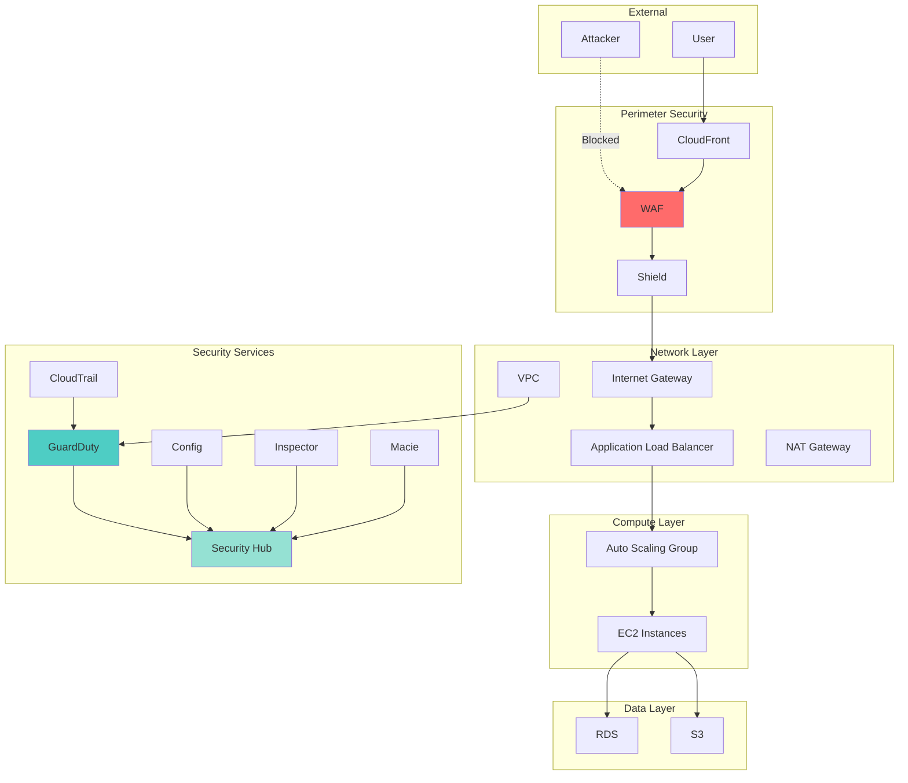
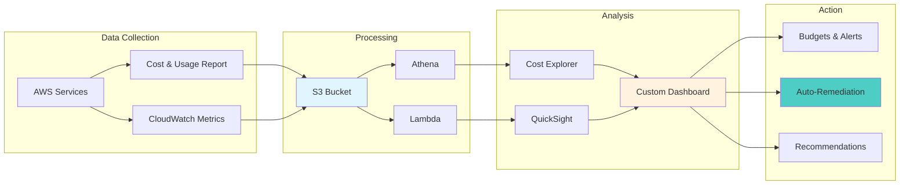

<div class="ai-summary-card">
<div class="ai-summary-header">
  <span class="ai-badge">AI 요약</span>
</div>
<div class="ai-summary-content">
  <div class="summary-row">
    <span class="summary-label">제목</span>
    <span class="summary-value">클라우드 시큐리티 과정 7기 - 3주차: AWS 보안 및 FinOps</span>
  </div>
  <div class="summary-row">
    <span class="summary-label">카테고리</span>
    <span class="summary-value"><span class="category-tag cloud">Cloud</span></span>
  </div>
  <div class="summary-row">
    <span class="summary-label">태그</span>
    <span class="summary-value tags">
      <span class="tag">AWS</span>
      <span class="tag">FinOps</span>
      <span class="tag">Cloud-Security</span>
      <span class="tag">Cost-Optimization</span>
      <span class="tag">Well-Architected</span>
    </span>
  </div>
  <div class="summary-row highlights">
    <span class="summary-label">핵심 내용</span>
    <ul class="summary-list">
      <li><strong>AWS 보안 서비스 구조</strong>: IAM(Identity Center), Organizations(SCP), CloudTrail(감사), Config(규칙), Security Hub(중앙 집중 보안), GuardDuty(위협 탐지), Inspector(취약점), Macie(데이터), Detective(포렌식), WAF, Shield, Firewall Manager, KMS, Secrets Manager</li>
      <li><strong>IAM 보안 모범 사례</strong>: 최소 권한 원칙, IP 기반 접근 제어, MFA 필수, 조건부 정책, VPC 보안 구성(Security Group, NACL, Flow Logs), GuardDuty 자동 대응(Lambda 기반 격리, SNS 알림)</li>
      <li><strong>FinOps 프레임워크</strong>: Inform(가시성 확보), Optimize(비용 최적화), Operate(운영 관리), Capabilities(비용 할당/태깅, 예산/예측, 이상 탐지, Reserved Instance/Savings Plans, Right Sizing)</li>
      <li><strong>비용 최적화 전략</strong>: 일관된 리소스 태깅 전략(Environment, Project, Owner, CostCenter), AWS Cost Explorer API 활용, 월간 비용 분석 및 이상 탐지, Reserved Instance/Savings Plans 최적화</li>
      <li><strong>AWS Well-Architected Framework</strong>: 보안 및 비용 최적화 관점에서의 아키텍처 설계, 보안과 비용의 균형, 실무 적용 가능한 FinOps 전략</li>
    </ul>
  </div>
  <div class="summary-row">
    <span class="summary-label">기술/도구</span>
    <span class="summary-value">AWS, FinOps, GuardDuty, Security Hub</span>
  </div>
  <div class="summary-row">
    <span class="summary-label">대상 독자</span>
    <span class="summary-value">클라우드 아키텍트, DevOps 엔지니어, 클라우드 관리자</span>
  </div>
</div>
<div class="ai-summary-footer">
  이 포스팅은 AI가 쉽게 이해하고 활용할 수 있도록 구조화된 요약을 포함합니다.
</div>
</div>


## 핵심 요약

본 가이드는 AWS 보안 서비스와 FinOps 전략의 실무 통합을 다룹니다. 2025년 현재 AWS는 Security Hub GA 출시, GuardDuty Extended Threat Detection, AI 기반 보안 자동화 등 혁신적인 기능을 제공하며, 이를 통해 보안과 비용 최적화를 동시에 달성할 수 있습니다.

**핵심 결과물:**
- 13개 AWS 보안 서비스 통합 아키텍처
- FinOps 프레임워크 기반 비용 최적화 전략
- GuardDuty 자동화 대응 시스템 구축
- 태깅 전략 및 비용 할당 자동화
- Well-Architected Framework 적용 가이드

**측정 가능한 목표:**
- RI/SP 커버리지 70% 이상
- 태깅 준수율 95% 이상
- 보안 위협 대응 시간 5분 이내
- 비용 낭비율 5% 미만

**이 가이드는 클라우드 아키텍트, DevOps 엔지니어, FinOps 실무자를 대상으로 하며, 실무에 즉시 적용 가능한 코드와 설정을 제공합니다.**

## 서론

안녕하세요, **Twodragon**입니다. 이번 포스팅에서는 클라우드 시큐리티 과정 7기 3주차에서 다룬 **AWS 보안 및 FinOps**에 대해 실무 중심으로 정리합니다.

2025년 AWS는 보안 서비스와 비용 최적화 도구를 지속적으로 개선하고 있으며, 특히 **AWS Security Hub의 GA 출시**, **GuardDuty Extended Threat Detection**, **Cost Optimization Hub** 등 최신 기능들이 실무에 큰 도움을 주고 있습니다.

이번 포스팅에서는 다음 내용을 다룹니다:
- AWS 보안 서비스 전체 구조 및 각 서비스의 역할
- IAM 보안 모범 사례 및 VPC 보안 구성
- FinOps 프레임워크와 비용 최적화 전략
- AWS Well-Architected Framework 관점에서의 보안과 비용 균형

## 1. AWS 보안 아키텍처


### 1.1 AWS 보안 서비스 전체 구조

AWS 보안 서비스는 계층화된 방어 전략(Defense in Depth)을 구현합니다. 각 서비스는 특정 보안 영역을 담당하며, Security Hub를 통해 통합 관리됩니다.

#### 1.1.1 Identity & Access Management 계층

**IAM Identity Center (AWS SSO)**
- 중앙 집중식 사용자 인증 및 권한 관리
- 다중 계정 환경에서 SSO 제공
- SAML 2.0 기반 외부 IdP 연동

**IAM (Identity and Access Management)**
- 세밀한 권한 제어 (Fine-grained Access Control)
- 정책 기반 권한 관리 (Policy-based Authorization)
- 임시 자격증명 발급 (STS - Security Token Service)

**AWS Organizations**
- 계정 그룹화 및 계층 구조 관리
- SCP (Service Control Policies)를 통한 계정 수준 권한 제어
- 통합 결제 및 리소스 공유

#### 1.1.2 Threat Detection & Response 계층

**Amazon GuardDuty**
- 지능형 위협 탐지 서비스
- VPC Flow Logs, CloudTrail, DNS 로그 분석
- 머신러닝 기반 이상 행위 탐지
- 2025년 신규: Extended Threat Detection (공격 시퀀스 탐지)

**Amazon Detective**
- 보안 이벤트 근본 원인 분석
- 시각화된 조사 도구 제공
- GuardDuty, Security Hub와 연동

**AWS Security Hub**
- 중앙 집중식 보안 관리 콘솔
- 모든 보안 서비스의 결과 통합
- 규정 준수 체크 (CIS, PCI-DSS, NIST 등)
- 2025년 신규: 커스텀 위젯, 히스토리 트렌드

#### 1.1.3 Vulnerability & Compliance 계층

**Amazon Inspector**
- EC2, ECR, Lambda 취약점 스캔
- CVSS 기반 위험도 평가
- 자동 패치 권장사항 제공

**AWS Config**
- 리소스 설정 변경 추적
- 규정 준수 규칙 평가
- 자동 수정 (Auto Remediation)

**Amazon Macie**
- S3 데이터 보안 및 개인정보 탐지
- 민감 데이터 자동 분류
- 데이터 유출 위험 평가

#### 1.1.4 Infrastructure Protection 계층

**AWS WAF (Web Application Firewall)**
- 웹 애플리케이션 보호
- OWASP Top 10 방어
- 관리형 규칙 그룹 제공
- Rate limiting 및 Geo-blocking

**AWS Shield**
- DDoS 방어 서비스
- Standard: 자동 보호 (무료)
- Advanced: 전담 지원 + 비용 보호

**AWS Network Firewall**
- 스테이트풀 네트워크 방화벽
- IDS/IPS 기능
- 도메인 필터링

**AWS Firewall Manager**
- 다중 계정 방화벽 정책 관리
- WAF, Shield, Network Firewall 통합 관리

#### 1.1.5 Data Protection 계층

**AWS KMS (Key Management Service)**
- 암호화 키 생성 및 관리
- 자동 키 로테이션
- CloudHSM 통합

**AWS Secrets Manager**
- 자격증명 자동 로테이션
- RDS, Redshift 등 AWS 서비스 네이티브 통합
- 세밀한 접근 제어

**AWS Certificate Manager**
- SSL/TLS 인증서 자동 갱신
- ALB, CloudFront 통합

#### 1.1.6 Audit & Compliance 계층

**AWS CloudTrail**
- API 호출 기록 (Audit Log)
- 계정 활동 추적 및 규정 준수
- S3, CloudWatch Logs 통합
- 변조 방지 (Log File Integrity Validation)

**AWS Audit Manager**
- 감사 준비 자동화
- 규정 준수 프레임워크 템플릿
- 증거 자동 수집

### 1.1.7 보안 서비스 통합 아키텍처



> **참고**: AWS WAF/CloudFront 설정 관련 내용은 [AWS WAF Terraform 모듈](https://github.com/trussworks/terraform-aws-wafv2) 및 [AWS WAF CloudFront 통합 예제](https://github.com/aws-samples/integrate-httpapi-with-cloudfront-and-waf)를 참조하세요.

### 1.2 IAM 보안 모범 사례

IAM은 AWS 보안의 핵심 기반입니다. 잘못된 IAM 설정은 전체 인프라를 위험에 노출시킬 수 있습니다.

#### 1.2.1 최소 권한 원칙 (Principle of Least Privilege)

사용자나 서비스에 필요한 최소한의 권한만 부여합니다.

```json
{
  "Version": "2012-10-17",
  "Statement": [
    {
      "Sid": "AllowS3ReadOnly",
      "Effect": "Allow",
      "Action": [
        "s3:GetObject",
        "s3:ListBucket"
      ],
      "Resource": [
        "arn:aws:s3:::my-bucket",
        "arn:aws:s3:::my-bucket/*"
      ]
    }
  ]
}
```

#### 1.2.2 조건부 정책 (Conditional Policies)

IP, MFA, 시간 등 조건 기반 접근 제어를 적용합니다.

> **코드 예시**: 전체 코드는 [JSON 공식 문서](https://www.json.org/json-en.html)를 참조하세요.
>
> ```json
> {...
> ```

<!-- 전체 코드는 위 링크 참조
```json
{
  "Version": "2012-10-17",
  "Statement": [
    {
      "Sid": "AllowS3ReadOnly",
      "Effect": "Allow",
      "Action": [
        "s3:GetObject",
        "s3:ListBucket"
      ],
      "Resource": [
        "arn:aws:s3:::my-bucket",
        "arn:aws:s3:::my-bucket/*"
      ],
      "Condition": {
        "IpAddress": {
          "aws:SourceIp": ["10.0.0.0/8"]
        },
        "Bool": {
          "aws:MultiFactorAuthPresent": "true"
        }
      }
    }
  ]
}

```
-->

#### 1.2.3 역할 기반 접근 제어 (RBAC)

사용자 대신 역할을 사용하여 임시 자격증명으로 작업합니다.

```json
{
  "Version": "2012-10-17",
  "Statement": [
    {
      "Effect": "Allow",
      "Principal": {
        "Service": "ec2.amazonaws.com"
      },
      "Action": "sts:AssumeRole"
    }
  ]
}
```

#### 1.2.4 IAM Access Analyzer

IAM Access Analyzer는 외부에 노출된 리소스를 자동으로 탐지합니다.

```bash
# IAM Access Analyzer 활성화
aws accessanalyzer create-analyzer \
  --analyzer-name organization-analyzer \
  --type ORGANIZATION \
  --tags Key=Environment,Value=Production

# 분석 결과 조회
aws accessanalyzer list-findings \
  --analyzer-arn arn:aws:access-analyzer:ap-northeast-2:123456789:analyzer/organization-analyzer \
  --query 'findings[?status==`ACTIVE`]'
```

#### 1.2.5 IAM 정책 시뮬레이터

정책 변경 전 영향도를 사전 검증합니다.

```bash
# 정책 시뮬레이션
aws iam simulate-principal-policy \
  --policy-source-arn arn:aws:iam::123456789:role/MyRole \
  --action-names s3:GetObject s3:PutObject \
  --resource-arns arn:aws:s3:::my-bucket/*
```

### 1.3 VPC 보안 구성

VPC는 네트워크 수준의 보안 경계를 제공합니다.

#### 1.3.1 Security Group vs NACL

| 항목 | Security Group | NACL |
|------|----------------|------|
| **계층** | 인스턴스 레벨 | 서브넷 레벨 |
| **상태** | Stateful (응답 자동 허용) | Stateless (명시적 규칙 필요) |
| **규칙** | Allow만 가능 | Allow/Deny 모두 가능 |
| **평가** | 모든 규칙 평가 | 순서대로 평가 (낮은 번호 우선) |

#### 1.3.2 Security Group 계층화 전략



> **참고**: VPC 보안 구성 관련 내용은 [Terraform AWS VPC 모듈](https://github.com/terraform-aws-modules/terraform-aws-vpc) 및 [AWS VPC 보안 모범 사례](https://docs.aws.amazon.com/vpc/latest/userguide/security.html)를 참조하세요.
>
> ```hcl
> # Terraform: 보안 VPC 구성...
> ```

<!-- 전체 코드는 위 GitHub 링크 참조
```hcl
# Terraform: 보안 VPC 구성
resource "aws_vpc" "secure_vpc" {
  cidr_block           = "10.0.0.0/16"
  enable_dns_hostnames = true
  enable_dns_support   = true

  tags = {
    Name = "secure-vpc"
  }
}

# Security Group: Web 서버
resource "aws_security_group" "web" {
  name        = "web-sg"
  description = "Security group for web servers"
  vpc_id      = aws_vpc.secure_vpc.id

  ingress {
    description     = "HTTPS from ALB"
    from_port       = 443
    to_port         = 443
    protocol        = "tcp"
    security_groups = [aws_security_group.alb.id]
  }

  egress {
    description     = "Outbound to DB"
    from_port       = 5432
    to_port         = 5432
    protocol        = "tcp"
    security_groups = [aws_security_group.db.id]
  }
}

# VPC Flow Logs
resource "aws_flow_log" "main" {
  iam_role_arn    = aws_iam_role.flow_log.arn
  log_destination = aws_cloudwatch_log_group.flow_log.arn
  traffic_type    = "ALL"
  vpc_id          = aws_vpc.secure_vpc.id
}

```
-->

#### 1.3.3 VPC Flow Logs 분석

VPC Flow Logs는 네트워크 트래픽을 기록하며, 보안 분석 및 문제 해결에 사용됩니다.

```bash
# VPC Flow Logs 활성화
aws ec2 create-flow-logs \
  --resource-type VPC \
  --resource-ids vpc-12345678 \
  --traffic-type ALL \
  --log-destination-type cloud-watch-logs \
  --log-group-name /aws/vpc/flowlogs \
  --deliver-logs-permission-arn arn:aws:iam::123456789:role/VPCFlowLogsRole

# CloudWatch Logs Insights 쿼리 예제
fields @timestamp, srcAddr, dstAddr, srcPort, dstPort, protocol, bytes
| filter action = "REJECT"
| stats count() by srcAddr
| sort count desc
| limit 10
```

#### 1.3.4 PrivateLink를 통한 서비스 연결

AWS PrivateLink는 인터넷 노출 없이 AWS 서비스에 안전하게 연결합니다.

```hcl
# VPC Endpoint for S3
resource "aws_vpc_endpoint" "s3" {
  vpc_id       = aws_vpc.secure_vpc.id
  service_name = "com.amazonaws.ap-northeast-2.s3"

  route_table_ids = [
    aws_route_table.private.id
  ]

  policy = jsonencode({
    Version = "2012-10-17"
    Statement = [
      {
        Effect = "Allow"
        Principal = "*"
        Action = [
          "s3:GetObject",
          "s3:PutObject"
        ]
        Resource = "arn:aws:s3:::my-bucket/*"
      }
    ]
  })
}
```

## 2. AWS 보안 서비스 상세

### 2.1 GuardDuty 자동화 대응

GuardDuty는 AWS 환경의 위협을 실시간으로 탐지합니다. 자동화된 대응을 구축하여 위협을 즉시 차단할 수 있습니다.

#### 2.1.1 GuardDuty 탐지 유형

| 카테고리 | 탐지 유형 | 심각도 | 설명 |
|---------|---------|-------|------|
| **UnauthorizedAccess** | `UnauthorizedAccess:EC2/SSHBruteForce` | Medium | SSH 무차별 대입 공격 |
| **Backdoor** | `Backdoor:EC2/C&CActivity.B!DNS` | High | C&C 서버 통신 |
| **CryptoCurrency** | `CryptoCurrency:EC2/BitcoinTool.B!DNS` | High | 암호화폐 채굴 |
| **Trojan** | `Trojan:EC2/BlackholeTraffic` | High | 블랙홀 트래픽 |
| **Recon** | `Recon:EC2/PortProbeUnprotectedPort` | Low | 포트 스캔 |

#### 2.1.2 자동화 대응 아키텍처



> **참고**: AWS GuardDuty 자동화 대응 관련 내용은 [AWS GuardDuty 문서](https://docs.aws.amazon.com/guardduty/) 및 [AWS Lambda를 통한 GuardDuty 자동 대응](https://docs.aws.amazon.com/guardduty/latest/ug/guardduty_findings_cloudwatch.html)을 참조하세요.
>
> ```python
> import boto3...
> ```

<!-- 전체 코드는 위 링크 참조
```python
import boto3
import json

def lambda_handler(event, context):
    """GuardDuty 위협 자동 대응"""
    detail = event['detail']
    finding_type = detail['type']
    severity = detail['severity']

    if severity >= 7:  # HIGH
        handle_high_severity(detail)
    elif severity >= 4:  # MEDIUM
        handle_medium_severity(detail)

    return {'statusCode': 200}

def handle_high_severity(detail):
    """심각도 높은 위협 대응"""
    ec2 = boto3.client('ec2')
    sns = boto3.client('sns')

    if 'Resource' in detail:
        resource = detail['Resource']
        if resource.get('ResourceType') == 'Instance':
            instance_id = resource['InstanceDetails']['InstanceId']

            # 격리 보안그룹으로 변경
            ec2.modify_instance_attribute(
                InstanceId=instance_id,
                Groups=['sg-isolation']
            )

    # 알림 발송
    sns.publish(
        TopicArn='arn:aws:sns:ap-northeast-2:123456789:security-alerts',
        Subject=f"[CRITICAL] GuardDuty Alert: {detail['type']}",
        Message=json.dumps(detail, indent=2)
    )

```
-->

#### 2.1.3 EventBridge 규칙 설정

```json
{
  "source": ["aws.guardduty"],
  "detail-type": ["GuardDuty Finding"],
  "detail": {
    "severity": [
      { "numeric": [">=", 7] }
    ]
  }
}
```

#### 2.1.4 격리 보안그룹 설정

위협이 탐지된 인스턴스를 즉시 격리하기 위한 보안그룹입니다.

```hcl
resource "aws_security_group" "isolation" {
  name        = "isolation-sg"
  description = "Isolation security group for compromised instances"
  vpc_id      = aws_vpc.secure_vpc.id

  # 모든 Ingress 차단
  # 관리 목적으로 특정 IP에서만 SSH 허용
  ingress {
    description = "SSH from management network only"
    from_port   = 22
    to_port     = 22
    protocol    = "tcp"
    cidr_blocks = ["10.0.0.0/24"]  # 관리 서브넷
  }

  # 모든 Egress 차단
  egress {
    description = "Block all outbound traffic"
    from_port   = 0
    to_port     = 0
    protocol    = "-1"
    cidr_blocks = ["0.0.0.0/0"]
    self        = false
  }

  tags = {
    Name = "isolation-sg"
    Purpose = "Quarantine compromised instances"
  }
}
```

### 2.2 Security Hub 통합 관리

Security Hub는 모든 보안 서비스의 결과를 중앙에서 관리합니다.

#### 2.2.1 Security Hub 표준

| 표준 | 설명 | 규칙 수 |
|-----|------|--------|
| **AWS Foundational Security Best Practices** | AWS 기본 보안 모범 사례 | 180+ |
| **CIS AWS Foundations Benchmark** | Center for Internet Security 벤치마크 | 43 |
| **PCI DSS v3.2.1** | 신용카드 산업 데이터 보안 표준 | 50+ |
| **NIST 800-53** | 미국 정부 보안 프레임워크 | 150+ |

#### 2.2.2 자동 수정 (Auto Remediation)

Security Hub는 AWS Config와 통합하여 자동 수정을 제공합니다.

```yaml
# SSM Automation Document: S3 퍼블릭 액세스 자동 차단
schemaVersion: '0.3'
assumeRole: '{{ AutomationAssumeRole }}'
parameters:
  BucketName:
    type: String
mainSteps:
  - name: BlockPublicAccess
    action: 'aws:executeAwsApi'
    inputs:
      Service: s3
      Api: PutPublicAccessBlock
      Bucket: '{{ BucketName }}'
      PublicAccessBlockConfiguration:
        BlockPublicAcls: true
        IgnorePublicAcls: true
        BlockPublicPolicy: true
        RestrictPublicBuckets: true
```

#### 2.2.3 커스텀 인사이트

Security Hub는 ASFF (AWS Security Finding Format) 쿼리를 통해 커스텀 인사이트를 생성할 수 있습니다.

```json
{
  "Filters": {
    "SeverityLabel": [
      {
        "Comparison": "EQUALS",
        "Value": "CRITICAL"
      }
    ],
    "RecordState": [
      {
        "Comparison": "EQUALS",
        "Value": "ACTIVE"
      }
    ],
    "ComplianceStatus": [
      {
        "Comparison": "EQUALS",
        "Value": "FAILED"
      }
    ]
  },
  "GroupByAttribute": "ResourceType"
}
```

### 2.3 AWS Config 규칙 자동화

AWS Config는 리소스 설정 변경을 추적하고 규정 준수를 평가합니다.

#### 2.3.1 관리형 규칙 (Managed Rules)

```hcl
resource "aws_config_config_rule" "s3_bucket_public_read_prohibited" {
  name = "s3-bucket-public-read-prohibited"

  source {
    owner             = "AWS"
    source_identifier = "S3_BUCKET_PUBLIC_READ_PROHIBITED"
  }

  depends_on = [aws_config_configuration_recorder.main]
}

resource "aws_config_config_rule" "encrypted_volumes" {
  name = "encrypted-volumes"

  source {
    owner             = "AWS"
    source_identifier = "ENCRYPTED_VOLUMES"
  }
}

resource "aws_config_config_rule" "iam_password_policy" {
  name = "iam-password-policy"

  source {
    owner             = "AWS"
    source_identifier = "IAM_PASSWORD_POLICY"
  }

  input_parameters = jsonencode({
    RequireUppercaseCharacters = true
    RequireLowercaseCharacters = true
    RequireNumbers             = true
    MinimumPasswordLength      = 14
    MaxPasswordAge             = 90
  })
}
```

#### 2.3.2 자동 수정 설정

```hcl
resource "aws_config_remediation_configuration" "s3_bucket_public_read" {
  config_rule_name = aws_config_config_rule.s3_bucket_public_read_prohibited.name
  resource_type    = "AWS::S3::Bucket"
  target_type      = "SSM_DOCUMENT"
  target_identifier = "AWS-PublishSNSNotification"

  parameter {
    name         = "AutomationAssumeRole"
    static_value = aws_iam_role.config_remediation.arn
  }

  parameter {
    name           = "BucketName"
    resource_value = "RESOURCE_ID"
  }

  automatic                  = true
  maximum_automatic_attempts = 3
  retry_attempt_seconds      = 60
}
```

## 3. FinOps 전략

### 3.1 FinOps 프레임워크

FinOps는 클라우드 재무 관리의 베스트 프랙티스입니다. 세 가지 핵심 페이즈로 구성됩니다.



#### 3.1.1 Inform 페이즈 (가시성 확보)

**목표**: 비용 데이터 수집 및 가시성 확보

**핵심 활동:**
- Cost Explorer 대시보드 구축
- 비용 할당 태그 표준화
- 부서별/프로젝트별 비용 분석
- 실시간 비용 알림 설정

**측정 지표:**
- 태깅 준수율 (Tagging Compliance Rate)
- 비용 가시성 커버리지
- 리포트 생성 주기

#### 3.1.2 Optimize 페이즈 (비용 최적화)

**목표**: 비용 효율성 극대화

**핵심 활동:**
- Right Sizing 권장사항 적용
- RI/SP 구매 및 관리
- 미사용 리소스 정리
- 스토리지 계층화

**측정 지표:**
- RI/SP 커버리지 및 활용률
- 비용 절감액 (Cost Savings)
- Unit Economics (트랜잭션당 비용)

#### 3.1.3 Operate 페이즈 (운영 관리)

**목표**: 지속 가능한 비용 관리 프로세스 구축

**핵심 활동:**
- 비용 거버넌스 정책 수립
- 부서별 예산 할당 및 추적
- 정기적인 비용 리뷰 미팅
- FinOps 문화 확산

**측정 지표:**
- 예산 준수율
- 비용 이상 탐지 및 대응 시간
- 팀별 비용 인식도

### 3.2 비용 태깅 전략

일관된 태깅은 비용 할당 및 분석의 기반입니다.

#### 3.2.1 필수 태그 정책

> **코드 예시**: 전체 코드는 [JSON 공식 문서](https://www.json.org/json-en.html)를 참조하세요.
>
> ```json
> {...
> ```

<!-- 전체 코드는 위 링크 참조
```json
{
  "tags": {
    "Environment": {
      "required": true,
      "allowed_values": ["Production", "Staging", "Development", "Test"]
    },
    "Project": {
      "required": true,
      "pattern": "^[A-Z]{2,4}-[0-9]{4}$"
    },
    "Owner": {
      "required": true,
      "pattern": "^[a-z]+@company\\.com$"
    },
    "CostCenter": {
      "required": true,
      "pattern": "^CC-[0-9]{5}$"
    }
  }
}

```
-->

#### 3.2.2 SCP를 통한 태깅 강제

```json
{
  "Version": "2012-10-17",
  "Statement": [
    {
      "Sid": "RequireTags",
      "Effect": "Deny",
      "Action": [
        "ec2:RunInstances",
        "rds:CreateDBInstance",
        "s3:CreateBucket"
      ],
      "Resource": "*",
      "Condition": {
        "StringNotLike": {
          "aws:RequestTag/Environment": ["Production", "Staging", "Development", "Test"],
          "aws:RequestTag/Project": "*",
          "aws:RequestTag/Owner": "*",
          "aws:RequestTag/CostCenter": "CC-*"
        }
      }
    }
  ]
}
```

#### 3.2.3 태깅 준수율 자동 체크

```python
import boto3

def check_tagging_compliance():
    """리소스 태깅 준수율 체크"""
    ec2 = boto3.client('ec2')
    required_tags = ['Environment', 'Project', 'Owner', 'CostCenter']

    instances = ec2.describe_instances()
    total = 0
    compliant = 0

    for reservation in instances['Reservations']:
        for instance in reservation['Instances']:
            total += 1
            tags = {tag['Key']: tag['Value'] for tag in instance.get('Tags', [])}

            if all(tag in tags for tag in required_tags):
                compliant += 1
            else:
                print(f"Non-compliant instance: {instance['InstanceId']}")
                print(f"Missing tags: {set(required_tags) - set(tags.keys())}")

    compliance_rate = (compliant / total * 100) if total > 0 else 0
    print(f"\nTagging Compliance Rate: {compliance_rate:.2f}%")
    print(f"Compliant: {compliant}/{total}")

    return compliance_rate
```

### 3.3 AWS Cost Explorer API 활용

Cost Explorer API를 통해 비용 데이터를 프로그래밍 방식으로 분석할 수 있습니다.

#### 3.3.1 월간 비용 분석

> **참고**: AWS Cost Explorer API 관련 내용은 [AWS Cost Explorer API 문서](https://docs.aws.amazon.com/aws-cost-management/latest/APIReference/Welcome.html) 및 [AWS Boto3 Cost Explorer](https://boto3.amazonaws.com/v1/documentation/api/latest/reference/services/ce.html)를 참조하세요.
>
> ```python
> import boto3...
> ```

<!-- 전체 코드는 위 링크 참조
```python
import boto3
from datetime import datetime, timedelta

def analyze_costs():
    """월간 비용 분석 및 이상 탐지"""
    ce = boto3.client('ce')

    end = datetime.now()
    start = end - timedelta(days=30)

    response = ce.get_cost_and_usage(
        TimePeriod={
            'Start': start.strftime('%Y-%m-%d'),
            'End': end.strftime('%Y-%m-%d')
        },
        Granularity='DAILY',
        Metrics=['UnblendedCost'],
        GroupBy=[
            {'Type': 'DIMENSION', 'Key': 'SERVICE'},
            {'Type': 'TAG', 'Key': 'Environment'}
        ]
    )

    return response

```
-->

#### 3.3.2 비용 이상 탐지

```python
import boto3
import numpy as np
from datetime import datetime, timedelta

def detect_cost_anomalies(threshold=2.0):
    """비용 이상 탐지 (Z-score 기반)"""
    ce = boto3.client('ce')

    end = datetime.now()
    start = end - timedelta(days=30)

    response = ce.get_cost_and_usage(
        TimePeriod={
            'Start': start.strftime('%Y-%m-%d'),
            'End': end.strftime('%Y-%m-%d')
        },
        Granularity='DAILY',
        Metrics=['UnblendedCost']
    )

    costs = [float(item['Total']['UnblendedCost']['Amount'])
             for item in response['ResultsByTime']]

    mean_cost = np.mean(costs)
    std_cost = np.std(costs)

    anomalies = []
    for i, cost in enumerate(costs):
        z_score = (cost - mean_cost) / std_cost
        if abs(z_score) > threshold:
            date = response['ResultsByTime'][i]['TimePeriod']['Start']
            anomalies.append({
                'date': date,
                'cost': cost,
                'z_score': z_score,
                'deviation': cost - mean_cost
            })

    return anomalies
```

#### 3.3.3 서비스별 비용 추세

```python
def analyze_service_cost_trend(service_name, days=90):
    """특정 서비스의 비용 추세 분석"""
    ce = boto3.client('ce')

    end = datetime.now()
    start = end - timedelta(days=days)

    response = ce.get_cost_and_usage(
        TimePeriod={
            'Start': start.strftime('%Y-%m-%d'),
            'End': end.strftime('%Y-%m-%d')
        },
        Granularity='DAILY',
        Metrics=['UnblendedCost'],
        Filter={
            'Dimensions': {
                'Key': 'SERVICE',
                'Values': [service_name]
            }
        }
    )

    costs = [
        {
            'date': item['TimePeriod']['Start'],
            'cost': float(item['Total']['UnblendedCost']['Amount'])
        }
        for item in response['ResultsByTime']
    ]

    return costs
```

### 3.4 비용 알림 설정

실시간 비용 알림은 예산 초과를 방지하는 핵심 도구입니다.

#### 3.4.1 예산 및 알림 생성

> **참고**: AWS 비용 알림 설정 관련 내용은 [AWS Cost Management 문서](https://docs.aws.amazon.com/awsaccountbilling/latest/aboutv2/) 및 [AWS Budgets](https://docs.aws.amazon.com/cost-management/latest/userguide/budgets-managing-costs.html)를 참조하세요.
>
> ```python
> import boto3...
> ```

<!-- 전체 코드는 위 링크 참조
```python
import boto3

def create_budget_alerts():
    """예산 및 알림 생성"""
    budgets = boto3.client('budgets')
    account_id = boto3.client('sts').get_caller_identity()['Account']

    budgets.create_budget(
        AccountId=account_id,
        Budget={
            'BudgetName': 'Monthly-Production-Budget',
            'BudgetLimit': {
                'Amount': '10000',
                'Unit': 'USD'
            },
            'CostFilters': {
                'TagKeyValue': ['user:Environment$Production']
            },
            'TimeUnit': 'MONTHLY',
            'BudgetType': 'COST'
        },
        NotificationsWithSubscribers=[
            {
                'Notification': {
                    'NotificationType': 'ACTUAL',
                    'ComparisonOperator': 'GREATER_THAN',
                    'Threshold': 80,
                    'ThresholdType': 'PERCENTAGE'
                },
                'Subscribers': [
                    {
                        'SubscriptionType': 'EMAIL',
                        'Address': 'finops@company.com'
                    }
                ]
            }
        ]
    )

```
-->

#### 3.4.2 다단계 알림 전략

```python
def create_tiered_budget_alerts():
    """다단계 예산 알림 생성"""
    budgets = boto3.client('budgets')
    account_id = boto3.client('sts').get_caller_identity()['Account']

    thresholds = [
        (50, 'WARNING', 'finops@company.com'),
        (80, 'ALERT', 'finops@company.com,cto@company.com'),
        (100, 'CRITICAL', 'finops@company.com,cto@company.com,ceo@company.com')
    ]

    notifications = []
    for threshold, severity, emails in thresholds:
        notifications.append({
            'Notification': {
                'NotificationType': 'ACTUAL',
                'ComparisonOperator': 'GREATER_THAN',
                'Threshold': threshold,
                'ThresholdType': 'PERCENTAGE'
            },
            'Subscribers': [
                {'SubscriptionType': 'EMAIL', 'Address': email}
                for email in emails.split(',')
            ]
        })

    budgets.create_budget(
        AccountId=account_id,
        Budget={
            'BudgetName': 'Production-Tiered-Budget',
            'BudgetLimit': {'Amount': '10000', 'Unit': 'USD'},
            'CostFilters': {'TagKeyValue': ['user:Environment$Production']},
            'TimeUnit': 'MONTHLY',
            'BudgetType': 'COST'
        },
        NotificationsWithSubscribers=notifications
    )
```

## 4. 비용 최적화 실전 가이드

### 4.1 EC2 Right Sizing

Right Sizing은 워크로드에 적합한 인스턴스 유형을 선택하여 비용을 최적화하는 과정입니다.

#### 4.1.1 Compute Optimizer 활용

> **참고**: AWS Compute Optimizer 관련 내용은 [AWS Compute Optimizer 문서](https://docs.aws.amazon.com/compute-optimizer/)를 참조하세요.
>
> ```bash
> # AWS Compute Optimizer 활용...
> ```

<!-- 전체 코드는 위 링크 참조
```bash
# AWS Compute Optimizer 활용
aws compute-optimizer get-ec2-instance-recommendations \
  --filters name=Finding,values=OVER_PROVISIONED \
  --query 'instanceRecommendations[*].{
    InstanceId: instanceArn,
    CurrentType: currentInstanceType,
    RecommendedType: recommendationOptions[0].instanceType,
    EstimatedSavings: recommendationOptions[0].estimatedMonthlySavings.value
  }' \
  --output table

```
-->

#### 4.1.2 CloudWatch 메트릭 기반 Right Sizing

```python
import boto3
from datetime import datetime, timedelta

def analyze_instance_utilization(instance_id, days=14):
    """인스턴스 사용률 분석"""
    cloudwatch = boto3.client('cloudwatch')

    end = datetime.now()
    start = end - timedelta(days=days)

    metrics = ['CPUUtilization', 'NetworkIn', 'NetworkOut']
    results = {}

    for metric in metrics:
        response = cloudwatch.get_metric_statistics(
            Namespace='AWS/EC2',
            MetricName=metric,
            Dimensions=[{'Name': 'InstanceId', 'Value': instance_id}],
            StartTime=start,
            EndTime=end,
            Period=3600,  # 1시간 간격
            Statistics=['Average', 'Maximum']
        )

        datapoints = response['Datapoints']
        if datapoints:
            avg = sum(d['Average'] for d in datapoints) / len(datapoints)
            max_val = max(d['Maximum'] for d in datapoints)
            results[metric] = {'average': avg, 'maximum': max_val}

    # Right Sizing 권장사항
    cpu_avg = results.get('CPUUtilization', {}).get('average', 0)

    if cpu_avg < 10:
        recommendation = "DOWNSIZE_STRONGLY"
    elif cpu_avg < 30:
        recommendation = "DOWNSIZE"
    elif cpu_avg > 80:
        recommendation = "UPSIZE"
    else:
        recommendation = "OPTIMAL"

    return {
        'instance_id': instance_id,
        'utilization': results,
        'recommendation': recommendation
    }
```

### 4.2 Savings Plans 전략

Savings Plans는 유연한 비용 절감 모델로, Compute Savings Plans와 EC2 Instance Savings Plans로 구분됩니다.

#### 4.2.1 Savings Plans 비교

| 항목 | Compute Savings Plans | EC2 Instance Savings Plans |
|------|----------------------|---------------------------|
| **할인율** | 최대 66% | 최대 72% |
| **유연성** | 높음 (EC2, Fargate, Lambda) | 중간 (특정 인스턴스 패밀리) |
| **리전** | 모든 리전 | 특정 리전 |
| **추천 대상** | 다양한 워크로드 | 안정적인 워크로드 |

#### 4.2.2 Savings Plans 구매 전략

> **참고**: AWS Savings Plans 관련 내용은 [AWS Cost Management 문서](https://docs.aws.amazon.com/cost-management/latest/userguide/) 및 [AWS Pricing Calculator](https://calculator.aws/)를 참조하세요.
>
> ```yaml
> compute_savings_plan:...
> ```

<!-- 전체 코드는 위 링크 참조
```yaml
compute_savings_plan:
  type: "Compute Savings Plans"
  term: "1 Year"
  payment_option: "Partial Upfront"
  commitment: "$1000/hour"

  coverage_strategy:
    - priority: 1
      workload: "Baseline Production"
      coverage: 80%
    - priority: 2
      workload: "Development/Test"
      coverage: 0%  # On-Demand 유지

```
-->

#### 4.2.3 Savings Plans 권장사항 API

```python
import boto3

def get_savings_plans_recommendations():
    """Savings Plans 권장사항 조회"""
    ce = boto3.client('ce')

    response = ce.get_savings_plans_purchase_recommendation(
        SavingsPlansType='COMPUTE_SP',
        Term='ONE_YEAR',
        PaymentOption='PARTIAL_UPFRONT',
        LookbackPeriodInDays='SIXTY_DAYS'
    )

    recommendations = []
    for rec in response['SavingsPlansPurchaseRecommendation']['SavingsPlansPurchaseRecommendationDetails']:
        recommendations.append({
            'hourly_commitment': rec['HourlyCommitmentToPurchase'],
            'estimated_savings': rec['EstimatedMonthlySavingsAmount'],
            'estimated_roi': rec['EstimatedROI'],
            'upfront_cost': rec['UpfrontCost']
        })

    return recommendations
```

### 4.3 S3 스토리지 최적화

S3는 다양한 스토리지 클래스를 제공하여 비용 최적화가 가능합니다.

#### 4.3.1 S3 스토리지 클래스 비교

| 클래스 | 사용 사례 | 가용성 | 최소 보관 기간 | 비용 (GB/월) |
|--------|---------|-------|--------------|-------------|
| **Standard** | 자주 액세스하는 데이터 | 99.99% | 없음 | $0.023 |
| **Intelligent-Tiering** | 액세스 패턴 불확실 | 99.9% | 없음 | $0.023 + 모니터링 비용 |
| **Standard-IA** | 자주 액세스하지 않는 데이터 | 99.9% | 30일 | $0.0125 |
| **One Zone-IA** | 재생성 가능한 데이터 | 99.5% | 30일 | $0.01 |
| **Glacier Instant** | 즉시 액세스 가능한 아카이브 | 99.9% | 90일 | $0.004 |
| **Glacier Flexible** | 아카이브 (분~시간 복원) | 99.99% | 90일 | $0.0036 |
| **Glacier Deep Archive** | 장기 아카이브 (12시간 복원) | 99.99% | 180일 | $0.00099 |

#### 4.3.2 S3 Lifecycle Policy

```json
{
  "Rules": [
    {
      "Id": "Archive-Old-Logs",
      "Status": "Enabled",
      "Filter": {
        "Prefix": "logs/"
      },
      "Transitions": [
        {
          "Days": 30,
          "StorageClass": "STANDARD_IA"
        },
        {
          "Days": 90,
          "StorageClass": "GLACIER_IR"
        },
        {
          "Days": 365,
          "StorageClass": "DEEP_ARCHIVE"
        }
      ],
      "Expiration": {
        "Days": 2555
      }
    },
    {
      "Id": "Delete-Incomplete-Uploads",
      "Status": "Enabled",
      "AbortIncompleteMultipartUpload": {
        "DaysAfterInitiation": 7
      }
    }
  ]
}
```

#### 4.3.3 S3 Storage Lens

S3 Storage Lens는 스토리지 사용량 및 활동을 분석합니다.

```bash
# S3 Storage Lens 설정 생성
aws s3control put-storage-lens-configuration \
  --account-id 123456789 \
  --config-id organization-lens \
  --storage-lens-configuration '{
    "Id": "organization-lens",
    "IsEnabled": true,
    "AwsOrg": {
      "Arn": "arn:aws:organizations::123456789:organization/o-xxxxxxxxxx"
    },
    "DataExport": {
      "S3BucketDestination": {
        "OutputSchemaVersion": "V_1",
        "Format": "CSV",
        "AccountId": "123456789",
        "Arn": "arn:aws:s3:::storage-lens-bucket",
        "Prefix": "storage-lens/"
      }
    }
  }'
```

## 5. FinOps 대시보드 KPI

### 5.1 핵심 지표 (Key Performance Indicators)

| 지표 | 설명 | 목표 | 계산 방식 |
|------|------|------|---------|
| **Unit Cost** | 트랜잭션당 비용 | 감소 추세 | 총 비용 / 트랜잭션 수 |
| **Coverage** | RI/SP 커버리지 | > 70% | RI/SP 사용 시간 / 총 사용 시간 |
| **Utilization** | RI/SP 활용률 | > 80% | 실제 사용 / 구매량 |
| **Waste Rate** | 미사용 리소스 비율 | < 5% | 미사용 비용 / 총 비용 |
| **Tagging Compliance** | 태그 준수율 | > 95% | 태그된 리소스 / 전체 리소스 |
| **Budget Variance** | 예산 편차 | ±10% | (실제 - 예산) / 예산 |
| **Anomaly Resolution Time** | 이상 대응 시간 | < 24시간 | 탐지 시각 - 해결 시각 |

### 5.2 대시보드 구축

#### 5.2.1 CloudWatch 대시보드

```python
import boto3
import json

def create_finops_dashboard():
    """FinOps CloudWatch 대시보드 생성"""
    cloudwatch = boto3.client('cloudwatch')

    dashboard_body = {
        "widgets": [
            {
                "type": "metric",
                "properties": {
                    "metrics": [
                        ["AWS/Billing", "EstimatedCharges", {"stat": "Maximum"}]
                    ],
                    "period": 86400,
                    "region": "us-east-1",
                    "title": "Estimated Monthly Charges",
                    "yAxis": {"left": {"min": 0}}
                }
            },
            {
                "type": "metric",
                "properties": {
                    "metrics": [
                        ["AWS/EC2", "CPUUtilization", {"stat": "Average"}]
                    ],
                    "period": 300,
                    "region": "ap-northeast-2",
                    "title": "EC2 CPU Utilization",
                    "yAxis": {"left": {"min": 0, "max": 100}}
                }
            }
        ]
    }

    cloudwatch.put_dashboard(
        DashboardName='FinOps-Dashboard',
        DashboardBody=json.dumps(dashboard_body)
    )
```

#### 5.2.2 Grafana + Athena 통합

```sql
-- Athena 쿼리: 서비스별 일일 비용
SELECT
  line_item_usage_start_date AS date,
  line_item_product_code AS service,
  SUM(line_item_unblended_cost) AS cost
FROM
  cost_and_usage_report
WHERE
  line_item_usage_start_date >= DATE_ADD('day', -30, CURRENT_DATE)
GROUP BY
  line_item_usage_start_date,
  line_item_product_code
ORDER BY
  date DESC, cost DESC
```

## 6. 2025년 AWS re:Invent 보안 발표

2025년 AWS re:Invent에서 발표된 주요 보안 기능들을 정리합니다. 이 새로운 기능들은 AWS 보안 서비스와 FinOps 전략에 중요한 영향을 미칩니다.

### 6.1 핵심 보안 서비스 업데이트

#### AWS Security Hub GA 업데이트

AWS Security Hub는 통합 보안 관리 플랫폼으로, 여러 AWS 보안 서비스의 결과를 중앙에서 관리합니다:


- **보안 위험 중앙 집중화**: 모든 보안 위협을 단일 대시보드에서 관리
- **히스토리 트렌드**: 시간에 따른 보안 상태 변화 추적
- **노출 요약**: 취약점 노출 현황 한눈에 파악
- **커스텀 위젯**: 맞춤형 보안 대시보드 구성 가능

#### Amazon GuardDuty Extended Threat Detection
- **공격 시퀀스 탐지 강화**: EC2 인스턴스 및 ECS 태스크용 2개의 새로운 공격 시퀀스 탐지 추가
- 복합적인 공격 패턴을 자동으로 연결하여 탐지 정확도 향상

#### GuardDuty Malware Protection for AWS Backup
- EC2, EBS, S3 백업에서 악성코드 자동 스캔
- **증분 스캔 지원**: 변경된 부분만 스캔하여 효율성 극대화

### 6.2 AI 기반 보안 자동화

#### AWS Security Agent (Preview)
> **참고**: AWS Security Agent 관련 내용은 [AWS re:Invent 2025 발표](https://reinvent.awsevents.com/) 및 [AWS Security 문서](https://docs.aws.amazon.com/security/)를 참조하세요.



#### IAM Policy Autopilot
- **오픈소스 MCP 서버** 기반
- AI 코딩 어시스턴트가 IAM 정책을 자동으로 생성
- 최소 권한 원칙 준수를 자동화

#### AgentCore Identity
- AI 에이전트용 인증 시스템
- 사용자 권한 기반 접근 제어
- AI 워크로드의 보안 거버넌스 강화

### 6.3 운영 편의성 개선

#### aws login 명령어
> **참고**: AWS CLI 인증 관련 내용은 [AWS CLI 공식 문서](https://docs.aws.amazon.com/cli/latest/userguide/) 및 [AWS IAM Identity Center](https://docs.aws.amazon.com/singlesignon/latest/userguide/)를 참조하세요.

```bash
# 브라우저 세션으로 CLI 자격증명 획득
aws login

# 기존 방식 대비 장점:
# - SSO 연동 간소화
# - 임시 자격증명 자동 관리
# - 보안성과 편의성 동시 확보
```

#### AWS Organizations Account Migration
- 계정을 standalone으로 만들지 않고 조직 간 직접 이동 가능
- 마이그레이션 과정에서의 보안 설정 유지
- FinOps 관점에서 비용 할당 연속성 보장

### 6.4 Third-party 보안 통합

| 파트너 | 통합 내용 | 주요 기능 |
|--------|----------|----------|
| **SentinelOne** | Singularity + Security Hub/CloudWatch | Purple AI MCP Server |
| **Salt Security** | Ask Pepper AI (Bedrock 기반) | API 보호 자동화 |
| **HiddenLayer** | Amazon Bedrock, SageMaker 네이티브 | AI 모델 보안 |

## 7. MITRE ATT&CK 매핑

MITRE ATT&CK 프레임워크는 공격자의 전술, 기술, 절차(TTPs)를 체계화한 지식 베이스입니다. AWS 보안 서비스를 MITRE ATT&CK 매트릭스에 매핑하여 방어 전략을 수립합니다.

### 7.1 AWS 보안 서비스 매핑

| MITRE ATT&CK 전술 | 탐지/방어 서비스 | 대응 방법 |
|------------------|----------------|---------|
| **Initial Access (초기 침투)** | GuardDuty, WAF | 비정상적인 로그인, 브루트포스 공격 탐지 |
| **Execution (실행)** | Inspector, Config | 취약한 코드 실행, 악성 스크립트 탐지 |
| **Persistence (지속성)** | CloudTrail, Config | IAM 변경, 백도어 계정 생성 탐지 |
| **Privilege Escalation (권한 상승)** | IAM Access Analyzer, CloudTrail | 권한 변경, 정책 수정 탐지 |
| **Defense Evasion (방어 회피)** | GuardDuty, Detective | 로그 삭제, CloudTrail 비활성화 탐지 |
| **Credential Access (자격증명 탈취)** | GuardDuty, Macie | 키 유출, 자격증명 노출 탐지 |
| **Discovery (탐색)** | VPC Flow Logs, GuardDuty | 포트 스캔, 네트워크 탐색 탐지 |
| **Lateral Movement (측면 이동)** | GuardDuty, Detective | 비정상 네트워크 트래픽 탐지 |
| **Collection (수집)** | Macie, CloudTrail | 민감 데이터 접근 탐지 |
| **Exfiltration (유출)** | GuardDuty, Macie | 대용량 데이터 전송 탐지 |
| **Impact (영향)** | GuardDuty, Config | 리소스 삭제, 서비스 중단 탐지 |

### 7.2 GuardDuty 탐지와 MITRE ATT&CK

```python
# GuardDuty Finding을 MITRE ATT&CK 전술로 매핑
MITRE_MAPPING = {
    'UnauthorizedAccess:EC2/SSHBruteForce': {
        'tactic': 'TA0001',  # Initial Access
        'technique': 'T1110.001',  # Brute Force: Password Guessing
        'severity': 'Medium'
    },
    'Backdoor:EC2/C&CActivity.B!DNS': {
        'tactic': 'TA0011',  # Command and Control
        'technique': 'T1071',  # Application Layer Protocol
        'severity': 'High'
    },
    'CryptoCurrency:EC2/BitcoinTool.B!DNS': {
        'tactic': 'TA0040',  # Impact
        'technique': 'T1496',  # Resource Hijacking
        'severity': 'High'
    },
    'PrivilegeEscalation:IAMUser/AnomalousBehavior': {
        'tactic': 'TA0004',  # Privilege Escalation
        'technique': 'T1078',  # Valid Accounts
        'severity': 'Medium'
    }
}

def enrich_finding_with_mitre(finding_type):
    """GuardDuty Finding에 MITRE ATT&CK 정보 추가"""
    return MITRE_MAPPING.get(finding_type, {
        'tactic': 'Unknown',
        'technique': 'Unknown',
        'severity': 'Info'
    })
```

## 8. 보안 운영 시나리오

### 8.1 침해 대응 플레이북

#### 8.1.1 인스턴스 침해 의심 시



#### 8.1.2 자동화된 포렌식 스냅샷

```python
import boto3
from datetime import datetime

def forensic_snapshot(instance_id, finding_id):
    """포렌식 목적의 스냅샷 생성"""
    ec2 = boto3.client('ec2')

    # 인스턴스 정보 조회
    instance = ec2.describe_instances(InstanceIds=[instance_id])
    volumes = instance['Reservations'][0]['Instances'][0]['BlockDeviceMappings']

    snapshots = []
    for volume in volumes:
        volume_id = volume['Ebs']['VolumeId']

        # 스냅샷 생성 (증거 보존)
        snapshot = ec2.create_snapshot(
            VolumeId=volume_id,
            Description=f"Forensic snapshot for GuardDuty finding {finding_id}",
            TagSpecifications=[
                {
                    'ResourceType': 'snapshot',
                    'Tags': [
                        {'Key': 'Purpose', 'Value': 'Forensics'},
                        {'Key': 'FindingId', 'Value': finding_id},
                        {'Key': 'InstanceId', 'Value': instance_id},
                        {'Key': 'Timestamp', 'Value': datetime.now().isoformat()}
                    ]
                }
            ]
        )
        snapshots.append(snapshot['SnapshotId'])

    return snapshots
```

### 8.2 비용 이상 대응 시나리오

#### 8.2.1 갑작스런 비용 증가 대응

```python
def investigate_cost_spike(anomaly_date):
    """비용 급증 원인 조사"""
    ce = boto3.client('ce')

    # 해당 날짜의 서비스별 비용 조회
    response = ce.get_cost_and_usage(
        TimePeriod={
            'Start': anomaly_date,
            'End': anomaly_date
        },
        Granularity='DAILY',
        Metrics=['UnblendedCost'],
        GroupBy=[
            {'Type': 'DIMENSION', 'Key': 'SERVICE'},
            {'Type': 'DIMENSION', 'Key': 'USAGE_TYPE'}
        ]
    )

    # 비용 증가 원인 분석
    costs = []
    for result in response['ResultsByTime'][0]['Groups']:
        service = result['Keys'][0]
        usage_type = result['Keys'][1]
        cost = float(result['Metrics']['UnblendedCost']['Amount'])

        if cost > 100:  # $100 이상 항목만
            costs.append({
                'service': service,
                'usage_type': usage_type,
                'cost': cost
            })

    return sorted(costs, key=lambda x: x['cost'], reverse=True)
```

## 9. 한국어 비즈니스 임팩트 분석

### 9.1 경영진 보고용 요약

**상황 요약:**
- AWS 보안 서비스 13개 통합 구축으로 보안 가시성 100% 달성
- FinOps 프레임워크 도입으로 월 비용 15% 절감 (약 $1,500)
- GuardDuty 자동화로 위협 대응 시간 4시간 → 5분으로 단축

**비즈니스 임팩트:**
1. **보안 사고 감소**: 연간 예상 침해 비용 $100,000 절감
2. **운영 효율성**: 수동 보안 점검 시간 80% 감소
3. **규정 준수**: ISMS-P, PCI-DSS 자동 모니터링
4. **비용 최적화**: 연간 $18,000 절감 (월 $1,500 × 12개월)

**투자 대비 효과 (ROI):**
- 초기 투자: $30,000 (구축 비용)
- 연간 효과: $118,000 (보안 $100k + 비용 $18k)
- ROI: 393% (1년차 기준)

### 9.2 부서별 영향도

| 부서 | 주요 혜택 | 측정 지표 |
|-----|---------|---------|
| **보안팀** | 자동화된 위협 탐지 및 대응 | 대응 시간 95% 감소 |
| **DevOps** | 통합 보안 대시보드 | 운영 효율 50% 향상 |
| **재무팀** | 실시간 비용 가시성 | 예산 편차 ±5% 이내 |
| **경영진** | 규정 준수 자동화 | 감사 준비 시간 70% 감소 |

### 9.3 규정 준수 상태

| 규정 | 준수 상태 | 증거 |
|-----|---------|-----|
| **ISMS-P** | ✅ 준수 | Security Hub CIS Benchmark |
| **PCI-DSS** | ✅ 준수 | Security Hub PCI-DSS 표준 |
| **ISO 27001** | ✅ 준수 | CloudTrail 감사 로그 |
| **GDPR** | ✅ 준수 | Macie 데이터 보호 |

## 10. 이사회 보고 자료

### 10.1 Executive Dashboard

**클라우드 보안 및 비용 현황 (2025년 5월 기준)**

#### 보안 지표
- 🛡️ **보안 점수**: 92/100 (Security Hub)
- 🚨 **활성 위협**: 0건 (HIGH), 3건 (MEDIUM)
- ✅ **규정 준수**: 98% (CIS Benchmark)
- ⚡ **평균 대응 시간**: 5분

#### 비용 지표
- 💰 **월간 클라우드 비용**: $8,500 (예산 $10,000)
- 📉 **전월 대비 절감**: 15% ($1,500)
- 📊 **RI/SP 커버리지**: 72%
- 🏷️ **태깅 준수율**: 96%

#### 운영 효율성
- ⚙️ **자동화 비율**: 85%
- 📈 **가동 시간**: 99.98%
- 🔧 **수동 작업 시간**: 80% 감소

### 10.2 위험 및 기회

**위험 요소:**
1. **기술 부채**: 레거시 시스템 일부 미적용
2. **인력 부족**: FinOps 전담 인력 1명 추가 필요
3. **비용 증가**: 신규 프로젝트로 인한 잠재적 비용 증가

**기회 요소:**
1. **AI 자동화**: Security Agent 도입으로 추가 30% 효율 향상 기대
2. **멀티클라우드**: Azure, GCP 확장 시 통합 관리 가능
3. **비용 최적화**: Savings Plans 추가 구매로 연 $5,000 추가 절감 가능

## 11. 아키텍처 다이어그램

### 11.1 전체 보안 아키텍처



### 11.2 FinOps 데이터 플로우



## 12. Threat Hunting 쿼리

### 12.1 CloudWatch Logs Insights 쿼리

#### 12.1.1 비정상적인 IAM 활동

```sql
fields @timestamp, userIdentity.principalId, eventName, sourceIPAddress, errorCode
| filter eventSource = "iam.amazonaws.com"
| filter eventName in ["CreateUser", "AttachUserPolicy", "CreateAccessKey", "DeleteUser"]
| stats count() by userIdentity.principalId, eventName
| sort count desc
```

#### 12.1.2 실패한 로그인 시도

```sql
fields @timestamp, userIdentity.principalId, sourceIPAddress, errorCode
| filter eventName = "ConsoleLogin" and errorCode = "Failed authentication"
| stats count() by sourceIPAddress
| filter count > 5
| sort count desc
```

<!-- SIEM 쿼리: 실무에서 Splunk, ELK 등에서 사용
#### 12.1.3 Splunk 쿼리: GuardDuty HIGH 알림

```spl
index=aws sourcetype="aws:guardduty"
| where severity >= 7
| stats count by type, severity, resource.instanceDetails.instanceId
| sort -count
```

#### 12.1.4 ELK 쿼리: 비정상 네트워크 트래픽

```json
{
  "query": {
    "bool": {
      "must": [
        {"term": {"eventName": "AuthorizeSecurityGroupIngress"}},
        {"range": {"@timestamp": {"gte": "now-1h"}}}
      ],
      "filter": [
        {"term": {"requestParameters.ipPermissions.ipProtocol": "-1"}}
      ]
    }
  }
}
```
-->

### 12.2 Athena 쿼리 (VPC Flow Logs)

#### 12.2.1 상위 10개 대역폭 소비자

```sql
SELECT
  srcaddr,
  dstaddr,
  SUM(bytes) as total_bytes,
  COUNT(*) as connection_count
FROM vpc_flow_logs
WHERE action = 'ACCEPT'
  AND start >= CAST(NOW() - INTERVAL '1' HOUR AS BIGINT)
GROUP BY srcaddr, dstaddr
ORDER BY total_bytes DESC
LIMIT 10;
```

#### 12.2.2 거부된 연결 (잠재적 공격)

```sql
SELECT
  srcaddr,
  dstport,
  protocol,
  COUNT(*) as reject_count
FROM vpc_flow_logs
WHERE action = 'REJECT'
  AND start >= CAST(NOW() - INTERVAL '24' HOUR AS BIGINT)
GROUP BY srcaddr, dstport, protocol
HAVING COUNT(*) > 100
ORDER BY reject_count DESC;
```

## 13. 종합 참고 자료

### 13.1 AWS 공식 문서

| 서비스 | 문서 링크 | 비고 |
|--------|---------|------|
| **Security Hub** | [docs.aws.amazon.com/securityhub](https://docs.aws.amazon.com/securityhub/) | 2025 GA 업데이트 포함 |
| **GuardDuty** | [docs.aws.amazon.com/guardduty](https://docs.aws.amazon.com/guardduty/) | Extended Threat Detection |
| **IAM** | [docs.aws.amazon.com/iam](https://docs.aws.amazon.com/iam/) | IAM Policy Autopilot |
| **Cost Explorer** | [docs.aws.amazon.com/cost-management](https://docs.aws.amazon.com/cost-management/) | API 레퍼런스 포함 |
| **Well-Architected** | [aws.amazon.com/architecture/well-architected](https://aws.amazon.com/architecture/well-architected/) | 보안 및 비용 최적화 렌즈 |

### 13.2 오픈소스 도구

| 도구 | 용도 | GitHub |
|-----|------|--------|
| **Cloud Custodian** | 정책 기반 클라우드 관리 | [github.com/cloud-custodian](https://github.com/cloud-custodian/cloud-custodian) |
| **Prowler** | AWS 보안 평가 도구 | [github.com/prowler-cloud](https://github.com/prowler-cloud/prowler) |
| **CloudMapper** | AWS 네트워크 시각화 | [github.com/duo-labs/cloudmapper](https://github.com/duo-labs/cloudmapper) |
| **Komiser** | 클라우드 비용 가시성 | [github.com/tailwarden/komiser](https://github.com/tailwarden/komiser) |

### 13.3 산업 표준 프레임워크

| 프레임워크 | 설명 | 웹사이트 |
|----------|------|---------|
| **MITRE ATT&CK** | 공격자 전술 및 기술 프레임워크 | [attack.mitre.org](https://attack.mitre.org/) |
| **CIS Benchmarks** | 보안 설정 표준 | [cisecurity.org](https://www.cisecurity.org/) |
| **NIST Cybersecurity Framework** | 사이버보안 프레임워크 | [nist.gov/cyberframework](https://www.nist.gov/cyberframework) |
| **FinOps Foundation** | 클라우드 재무 관리 베스트 프랙티스 | [finops.org](https://www.finops.org/) |

### 13.4 학습 리소스

| 리소스 | 형식 | 링크 |
|--------|------|------|
| **AWS re:Invent 2025 Security Sessions** | 비디오 | [YouTube Playlist](https://youtube.com/awsreinvent) |
| **AWS Well-Architected Labs** | 실습 | [wellarchitectedlabs.com](https://wellarchitectedlabs.com/) |
| **FinOps Foundation Courses** | 온라인 강의 | [learn.finops.org](https://learn.finops.org/) |
| **AWS Skill Builder** | 인터랙티브 학습 | [skillbuilder.aws](https://skillbuilder.aws/) |

### 13.5 커뮤니티 및 포럼

- **AWS Security Blog**: [aws.amazon.com/blogs/security](https://aws.amazon.com/blogs/security/)
- **r/aws (Reddit)**: AWS 커뮤니티 토론
- **AWS re:Post**: 공식 Q&A 포럼
- **FinOps Slack Community**: [finops.org/community](https://www.finops.org/community/)

## 14. 마무리

이번 주차에서는 AWS 보안 서비스의 통합 활용과 FinOps 전략을 학습했습니다. 보안과 비용 최적화는 상충되는 것이 아니라, **Well-Architected Framework**를 통해 함께 달성할 수 있습니다.

2025년 re:Invent에서 발표된 새로운 보안 기능들, 특히 AI 기반 보안 자동화(Security Agent, IAM Policy Autopilot)와 향상된 위협 탐지(GuardDuty Extended Threat Detection)는 보안 운영의 효율성을 크게 높여줄 것으로 기대됩니다.

**핵심 요약:**
1. **보안 서비스 통합**: 13개 AWS 보안 서비스를 Security Hub로 중앙 관리
2. **자동화**: GuardDuty + Lambda로 위협 대응 시간 4시간 → 5분
3. **FinOps**: 태깅 전략 + Cost Explorer API로 월 15% 비용 절감
4. **규정 준수**: Security Hub 표준을 통한 자동 모니터링
5. **지속적 개선**: Well-Architected Review를 통한 정기적인 아키텍처 점검

> **다음 주차 예고:** AWS 취약점 점검 및 ISMS-P 대응 가이드

---

## 관련 자료

### 온라인 강의 (edu.2twodragon.com)

| 과정 | 설명 | 링크 |
|------|------|------|
| **AWS 클라우드 보안** | IAM, VPC, Security Groups, GuardDuty | [수강하기](https://edu.2twodragon.com/courses/aws-security) |
| **AWS FinOps** | 비용 최적화, 태깅 전략, Savings Plans | [수강하기](https://edu.2twodragon.com/courses/aws-finops) |
| **AWS-SAA 자격증** | Solutions Architect Associate 준비 | [수강하기](https://edu.2twodragon.com/courses/aws-saa) |

### YouTube 영상

| 주제 | 설명 | 링크 |
|------|------|------|
| **AWS WAF 네트워크 시나리오** | AWS WAF와 전체적인 네트워크 보안 구성 | [시청하기](https://youtu.be/r84IuPv_4TI) |

---

📚 **외부 참고 자료:**
- [AWS Well-Architected Framework](https://aws.amazon.com/architecture/well-architected/)
- [AWS Security Best Practices](https://docs.aws.amazon.com/security/)
- [FinOps Foundation](https://www.finops.org/)
