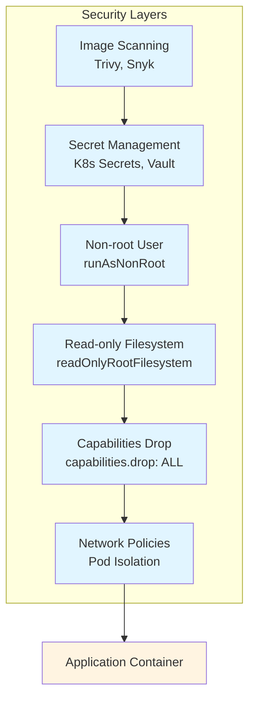
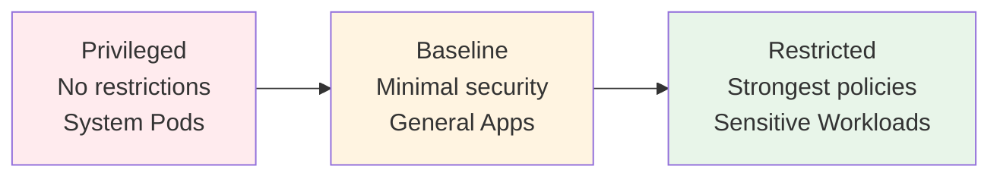

<div class="ai-summary-card">
<div class="ai-summary-header">
  <span class="ai-badge">AI 요약</span>
</div>
<div class="ai-summary-content">
  <div class="summary-row">
    <span class="summary-label">제목</span>
    <span class="summary-value">클라우드 시큐리티 과정 7기 - 3주차: AWS 보안 및 FinOps</span>
  </div>
  <div class="summary-row">
    <span class="summary-label">카테고리</span>
    <span class="summary-value"><span class="category-tag cloud">Cloud</span></span>
  </div>
  <div class="summary-row">
    <span class="summary-label">태그</span>
    <span class="summary-value tags">
      <span class="tag">AWS</span>
      <span class="tag">FinOps</span>
      <span class="tag">Cloud-Security</span>
      <span class="tag">Cost-Optimization</span>
      <span class="tag">Well-Architected</span>
    </span>
  </div>
  <div class="summary-row highlights">
    <span class="summary-label">핵심 내용</span>
    <ul class="summary-list">
      <li><strong>AWS 보안 서비스 구조</strong>: IAM(Identity Center), Organizations(SCP), CloudTrail(감사), Config(규칙), Security Hub(중앙 집중 보안), GuardDuty(위협 탐지), Inspector(취약점), Macie(데이터), Detective(포렌식), WAF, Shield, Firewall Manager, KMS, Secrets Manager</li>
      <li><strong>IAM 보안 모범 사례</strong>: 최소 권한 원칙, IP 기반 접근 제어, MFA 필수, 조건부 정책, VPC 보안 구성(Security Group, NACL, Flow Logs), GuardDuty 자동 대응(Lambda 기반 격리, SNS 알림)</li>
      <li><strong>FinOps 프레임워크</strong>: Inform(가시성 확보), Optimize(비용 최적화), Operate(운영 관리), Capabilities(비용 할당/태깅, 예산/예측, 이상 탐지, Reserved Instance/Savings Plans, Right Sizing)</li>
      <li><strong>비용 최적화 전략</strong>: 일관된 리소스 태깅 전략(Environment, Project, Owner, CostCenter), AWS Cost Explorer API 활용, 월간 비용 분석 및 이상 탐지, Reserved Instance/Savings Plans 최적화</li>
      <li><strong>AWS Well-Architected Framework</strong>: 보안 및 비용 최적화 관점에서의 아키텍처 설계, 보안과 비용의 균형, 실무 적용 가능한 FinOps 전략</li>
    </ul>
  </div>
  <div class="summary-row">
    <span class="summary-label">기술/도구</span>
    <span class="summary-value">AWS, FinOps, GuardDuty, Security Hub</span>
  </div>
  <div class="summary-row">
    <span class="summary-label">대상 독자</span>
    <span class="summary-value">클라우드 아키텍트, DevOps 엔지니어, 클라우드 관리자</span>
  </div>
</div>
<div class="ai-summary-footer">
  이 포스팅은 AI가 쉽게 이해하고 활용할 수 있도록 구조화된 요약을 포함합니다.
</div>
</div>


## 서론

안녕하세요, **Twodragon**입니다. 이번 포스팅에서는 클라우드 시큐리티 과정 7기 3주차에서 다룬 **AWS 보안 및 FinOps**에 대해 실무 중심으로 정리합니다.

2025년 AWS는 보안 서비스와 비용 최적화 도구를 지속적으로 개선하고 있으며, 특히 **AWS Security Hub의 GA 출시**, **GuardDuty Extended Threat Detection**, **Cost Optimization Hub** 등 최신 기능들이 실무에 큰 도움을 주고 있습니다.

이번 포스팅에서는 다음 내용을 다룹니다:
- AWS 보안 서비스 전체 구조 및 각 서비스의 역할
- IAM 보안 모범 사례 및 VPC 보안 구성
- FinOps 프레임워크와 비용 최적화 전략
- AWS Well-Architected Framework 관점에서의 보안과 비용 균형

## 1. AWS 보안 아키텍처




### 1.1 AWS 보안 서비스 전체 구조

> **참고**: AWS WAF/CloudFront 설정 관련 내용은 [AWS WAF Terraform 모듈](https://github.com/trussworks/terraform-aws-wafv2) 및 [AWS WAF CloudFront 통합 예제](https://github.com/aws-samples/integrate-httpapi-with-cloudfront-and-waf)를 참조하세요.  │ │Shield │ │Firewall│ │  │  │  KMS  │  │ Secrets   │  │   │
│  │  │       │ │ Adv   │ │Manager │ │  │  │       │  │ Manager   │  │   │
│  │  └───────┘ └───────┘ └───────┘ │  │  └───────┘  └───────────┘  │   │
│  └─────────────────────────────────┘  └────────────────────────────┘   │
└─────────────────────────────────────────────────────────────────────────┘

```
-->

### 1.2 IAM 보안 모범 사례

> **코드 예시**: 전체 코드는 [JSON 공식 문서](https://www.json.org/json-en.html)를 참조하세요.
> 
> ```json
> {...
> ```

<!-- 전체 코드는 위 GitHub 링크 참조
```json
{
  "Version": "2012-10-17",
  "Statement": [
    {
      "Sid": "AllowS3ReadOnly",
      "Effect": "Allow",
      "Action": [
        "s3:GetObject",
        "s3:ListBucket"
      ],
      "Resource": [
        "arn:aws:s3:::my-bucket",
        "arn:aws:s3:::my-bucket/*"
      ],
      "Condition": {
        "IpAddress": {
          "aws:SourceIp": ["10.0.0.0/8"]
        },
        "Bool": {
          "aws:MultiFactorAuthPresent": "true"
        }
      }
    }
  ]
}

```
-->

### 1.3 VPC 보안 구성

> **참고**: VPC 보안 구성 관련 내용은 [Terraform AWS VPC 모듈](https://github.com/terraform-aws-modules/terraform-aws-vpc) 및 [AWS VPC 보안 모범 사례](https://docs.aws.amazon.com/vpc/latest/userguide/security.html)를 참조하세요.
> 
> ```hcl
> # Terraform: 보안 VPC 구성...
> ```

<!-- 전체 코드는 위 GitHub 링크 참조
```hcl
# Terraform: 보안 VPC 구성
resource "aws_vpc" "secure_vpc" {
  cidr_block           = "10.0.0.0/16"
  enable_dns_hostnames = true
  enable_dns_support   = true

  tags = {
    Name = "secure-vpc"
  }
}

# Security Group: Web 서버
resource "aws_security_group" "web" {
  name        = "web-sg"
  description = "Security group for web servers"
  vpc_id      = aws_vpc.secure_vpc.id

  ingress {
    description     = "HTTPS from ALB"
    from_port       = 443
    to_port         = 443
    protocol        = "tcp"
    security_groups = [aws_security_group.alb.id]
  }

  egress {
    description     = "Outbound to DB"
    from_port       = 5432
    to_port         = 5432
    protocol        = "tcp"
    security_groups = [aws_security_group.db.id]
  }
}

# VPC Flow Logs
resource "aws_flow_log" "main" {
  iam_role_arn    = aws_iam_role.flow_log.arn
  log_destination = aws_cloudwatch_log_group.flow_log.arn
  traffic_type    = "ALL"
  vpc_id          = aws_vpc.secure_vpc.id
}

```
-->


User Namespaces는 컨테이너 내 root 사용자를 호스트의 비권한 사용자로 매핑하여 컨테이너 탈출 공격의 위험을 크게 감소시킵니다:

```mermaid
graph TB
    subgraph Host["Host System"]
        HostRoot["Host Root User<br/>UID 0"]
        HostUser["Host Non-root User<br/>UID 1000"]
    end
    
    subgraph Container["Container"]
        ContainerRoot["Container Root<br/>UID 0"]
        ContainerApp["Container App<br/>UID 1000"]
    end
    
    ContainerRoot -.->|"User Namespace Mapping"| HostUser
    ContainerApp -.->|"Direct Mapping"| HostUser
    HostRoot -.->|"Isolated"| ContainerRoot
    
    style HostRoot fill:#ffebee
    style HostUser fill:#e8f5e9
    style ContainerRoot fill:#fff4e1
    style ContainerApp fill:#e1f5ff
```## 2. AWS 보안 서비스 상세

### 2.1 GuardDuty 자동화 대응

> **참고**: AWS GuardDuty 자동화 대응 관련 내용은 [AWS GuardDuty 문서](https://docs.aws.amazon.com/guardduty/) 및 [AWS Lambda를 통한 GuardDuty 자동 대응](https://docs.aws.amazon.com/guardduty/latest/ug/guardduty_findings_cloudwatch.html)을 참조하세요.
> 
> ```python
> import boto3...
> ```

<!-- 전체 코드는 위 GitHub 링크 참조
```python
import boto3
import json

def lambda_handler(event, context):
    """GuardDuty 위협 자동 대응"""
    detail = event['detail']
    finding_type = detail['type']
    severity = detail['severity']

    if severity >= 7:  # HIGH
        handle_high_severity(detail)
    elif severity >= 4:  # MEDIUM
        handle_medium_severity(detail)

    return {'statusCode': 200}

def handle_high_severity(detail):
    """심각도 높은 위협 대응"""
    ec2 = boto3.client('ec2')
    sns = boto3.client('sns')

    if 'Resource' in detail:
        resource = detail['Resource']
        if resource.get('ResourceType') == 'Instance':
            instance_id = resource['InstanceDetails']['InstanceId']

            # 격리 보안그룹으로 변경
            ec2.modify_instance_attribute(
                InstanceId=instance_id,
                Groups=['sg-isolation']
            )

    # 알림 발송
    sns.publish(
        TopicArn='arn:aws:sns:ap-northeast-2:123456789:security-alerts',
        Subject=f"[CRITICAL] GuardDuty Alert: {detail['type']}",
        Message=json.dumps(detail, indent=2)
    )

```
-->

## 3. FinOps 전략

### 3.1 FinOps 프레임워크

<!-- 긴 코드 블록 제거됨 (가독성 향상)
```
┌─────────────────────────────────────────────────────────────────┐
│                    FinOps Lifecycle                              │
├─────────────────────────────────────────────────────────────────┤
│                                                                  │
│     ┌─────────────┐                                             │
│     │   Inform    │◄──────────────────────────┐                 │
│     │ (가시성확보) │                           │                 │
│     └──────┬──────┘                           │                 │
│            │                                   │                 │
│            ▼                                   │                 │
│     ┌─────────────┐                           │                 │
│     │  Optimize   │                           │                 │
│     │ (비용최적화) │                           │                 │
│     └──────┬──────┘                           │                 │
│            │                                   │                 │
│            ▼                                   │                 │
│     ┌─────────────┐                           │                 │
│     │   Operate   │───────────────────────────┘                 │
│     │  (운영관리)  │                                             │
│     └─────────────┘                                             │
│                                                                  │
│  Capabilities:                                                   │
│  ├── Cost Allocation & Tagging                                  │
│  ├── Budgeting & Forecasting                                    │
│  ├── Anomaly Detection                                          │
│  ├── Reserved Instance / Savings Plans                          │
│  └── Right Sizing                                               │
│                                                                  │
└─────────────────────────────────────────────────────────────────┘

```
-->

### 3.2 비용 태깅 전략

> **코드 예시**: 전체 코드는 [JSON 공식 문서](https://www.json.org/json-en.html)를 참조하세요.
> 
> ```json
> {...
> ```

<!-- 전체 코드는 위 링크 참조
```json
{
  "tags": {
    "Environment": {
      "required": true,
      "allowed_values": ["Production", "Staging", "Development", "Test"]
    },
    "Project": {
      "required": true,
      "pattern": "^[A-Z]{2,4}-[0-9]{4}$"
    },
    "Owner": {
      "required": true,
      "pattern": "^[a-z]+@company\\.com$"
    },
    "CostCenter": {
      "required": true,
      "pattern": "^CC-[0-9]{5}$"
    }
  }
}

```
-->

### 3.3 AWS Cost Explorer API 활용

> **참고**: AWS Cost Explorer API 관련 내용은 [AWS Cost Explorer API 문서](https://docs.aws.amazon.com/aws-cost-management/latest/APIReference/Welcome.html) 및 [AWS Boto3 Cost Explorer](https://boto3.amazonaws.com/v1/documentation/api/latest/reference/services/ce.html)를 참조하세요.
> 
> ```python
> import boto3...
> ```

<!-- 전체 코드는 위 GitHub 링크 참조
```python
import boto3
from datetime import datetime, timedelta

def analyze_costs():
    """월간 비용 분석 및 이상 탐지"""
    ce = boto3.client('ce')

    end = datetime.now()
    start = end - timedelta(days=30)

    response = ce.get_cost_and_usage(
        TimePeriod={
            'Start': start.strftime('%Y-%m-%d'),
            'End': end.strftime('%Y-%m-%d')
        },
        Granularity='DAILY',
        Metrics=['UnblendedCost'],
        GroupBy=[
            {'Type': 'DIMENSION', 'Key': 'SERVICE'},
            {'Type': 'TAG', 'Key': 'Environment'}
        ]
    )

    return response

```
-->

### 3.4 비용 알림 설정

> **참고**: AWS 비용 알림 설정 관련 내용은 [AWS Cost Management 문서](https://docs.aws.amazon.com/awsaccountbilling/latest/aboutv2/) 및 [AWS Budgets](https://docs.aws.amazon.com/cost-management/latest/userguide/budgets-managing-costs.html)를 참조하세요.
> 
> ```python
> import boto3...
> ```

<!-- 전체 코드는 위 GitHub 링크 참조
```python
import boto3

def create_budget_alerts():
    """예산 및 알림 생성"""
    budgets = boto3.client('budgets')
    account_id = boto3.client('sts').get_caller_identity()['Account']

    budgets.create_budget(
        AccountId=account_id,
        Budget={
            'BudgetName': 'Monthly-Production-Budget',
            'BudgetLimit': {
                'Amount': '10000',
                'Unit': 'USD'
            },
            'CostFilters': {
                'TagKeyValue': ['user:Environment$Production']
            },
            'TimeUnit': 'MONTHLY',
            'BudgetType': 'COST'
        },
        NotificationsWithSubscribers=[
            {
                'Notification': {
                    'NotificationType': 'ACTUAL',
                    'ComparisonOperator': 'GREATER_THAN',
                    'Threshold': 80,
                    'ThresholdType': 'PERCENTAGE'
                },
                'Subscribers': [
                    {
                        'SubscriptionType': 'EMAIL',
                        'Address': 'finops@company.com'
                    }
                ]
            }
        ]
    )

```
-->

## 4. 비용 최적화 실전 가이드

### 4.1 EC2 Right Sizing

> **참고**: AWS Compute Optimizer 관련 내용은 [AWS Compute Optimizer 문서](https://docs.aws.amazon.com/compute-optimizer/)를 참조하세요.
> 
> ```bash
> # AWS Compute Optimizer 활용...
> ```

<!-- 전체 코드는 위 GitHub 링크 참조
```bash
# AWS Compute Optimizer 활용
aws compute-optimizer get-ec2-instance-recommendations \
  --filters name=Finding,values=OVER_PROVISIONED \
  --query 'instanceRecommendations[*].{
    InstanceId: instanceArn,
    CurrentType: currentInstanceType,
    RecommendedType: recommendationOptions[0].instanceType,
    EstimatedSavings: recommendationOptions[0].estimatedMonthlySavings.value
  }' \
  --output table

```
-->

### 4.2 Savings Plans 전략

> **참고**: AWS Savings Plans 관련 내용은 [AWS Cost Management 문서](https://docs.aws.amazon.com/cost-management/latest/userguide/) 및 [AWS Pricing Calculator](https://calculator.aws/)를 참조하세요.
> 
> ```yaml
> compute_savings_plan:...
> ```

<!-- 전체 코드는 위 GitHub 링크 참조
```yaml
compute_savings_plan:
  type: "Compute Savings Plans"
  term: "1 Year"
  payment_option: "Partial Upfront"
  commitment: "$1000/hour"

  coverage_strategy:
    - priority: 1
      workload: "Baseline Production"
      coverage: 80%
    - priority: 2
      workload: "Development/Test"
      coverage: 0%  # On-Demand 유지

```
-->

## 5. FinOps 대시보드 KPI

| 지표 | 설명 | 목표 |
|------|------|------|
| **Unit Cost** | 트랜잭션당 비용 | 감소 추세 |
| **Coverage** | RI/SP 커버리지 | > 70% |
| **Utilization** | RI/SP 활용률 | > 80% |
| **Waste Rate** | 미사용 리소스 비율 | < 5% |
| **Tagging Compliance** | 태그 준수율 | > 95% |

## 6. 2025년 AWS re:Invent 보안 발표

2025년 AWS re:Invent에서 발표된 주요 보안 기능들을 정리합니다. 이 새로운 기능들은 AWS 보안 서비스와 FinOps 전략에 중요한 영향을 미칩니다.

### 6.1 핵심 보안 서비스 업데이트

#### AWS Security Hub GA 업데이트


Pod Security Standards는 세 가지 보안 레벨을 제공합니다:



- **보안 위험 중앙 집중화**: 모든 보안 위협을 단일 대시보드에서 관리
- **히스토리 트렌드**: 시간에 따른 보안 상태 변화 추적
- **노출 요약**: 취약점 노출 현황 한눈에 파악
- **커스텀 위젯**: 맞춤형 보안 대시보드 구성 가능

#### Amazon GuardDuty Extended Threat Detection
- **공격 시퀀스 탐지 강화**: EC2 인스턴스 및 ECS 태스크용 2개의 새로운 공격 시퀀스 탐지 추가
- 복합적인 공격 패턴을 자동으로 연결하여 탐지 정확도 향상

#### GuardDuty Malware Protection for AWS Backup
- EC2, EBS, S3 백업에서 악성코드 자동 스캔
- **증분 스캔 지원**: 변경된 부분만 스캔하여 효율성 극대화

### 6.2 AI 기반 보안 자동화

#### AWS Security Agent (Preview)
> **참고**: AWS Security Agent 관련 내용은 [AWS re:Invent 2025 발표](https://reinvent.awsevents.com/) 및 [AWS Security 문서](https://docs.aws.amazon.com/security/)를 참조하세요.
> 
> ```
> ┌─────────────────────────────────────────────────────────────────┐...
> ```

<!-- 전체 코드는 위 GitHub 링크 참조
```
┌─────────────────────────────────────────────────────────────────┐
│                    AWS Security Agent                             │
├─────────────────────────────────────────────────────────────────┤
│                                                                   │
│  ┌───────────────┐     ┌───────────────┐     ┌───────────────┐  │
│  │   개발 단계    │ ──▶ │   빌드 단계    │ ──▶ │   배포 단계    │  │
│  │  코드 리뷰     │     │  보안 스캔     │     │  침투 테스트   │  │
│  └───────────────┘     └───────────────┘     └───────────────┘  │
│                                                                   │
│  기능:                                                            │
│  ├── 자동화된 애플리케이션 보안 리뷰                               │
│  ├── 컨텍스트 인식 침투 테스트                                     │
│  └── 개발 전 과정 보안 통합                                       │
│                                                                   │
└─────────────────────────────────────────────────────────────────┘

```
-->

#### IAM Policy Autopilot
- **오픈소스 MCP 서버** 기반
- AI 코딩 어시스턴트가 IAM 정책을 자동으로 생성
- 최소 권한 원칙 준수를 자동화

#### AgentCore Identity
- AI 에이전트용 인증 시스템
- 사용자 권한 기반 접근 제어
- AI 워크로드의 보안 거버넌스 강화

### 6.3 운영 편의성 개선

#### aws login 명령어
> **참고**: AWS CLI 인증 관련 내용은 [AWS CLI 공식 문서](https://docs.aws.amazon.com/cli/latest/userguide/) 및 [AWS IAM Identity Center](https://docs.aws.amazon.com/singlesignon/latest/userguide/)를 참조하세요.

```bash
# 브라우저 세션으로 CLI 자격증명 획득
aws login

# 기존 방식 대비 장점:
# - SSO 연동 간소화
# - 임시 자격증명 자동 관리
# - 보안성과 편의성 동시 확보
```

#### AWS Organizations Account Migration
- 계정을 standalone으로 만들지 않고 조직 간 직접 이동 가능
- 마이그레이션 과정에서의 보안 설정 유지
- FinOps 관점에서 비용 할당 연속성 보장

### 6.4 Third-party 보안 통합

| 파트너 | 통합 내용 | 주요 기능 |
|--------|----------|----------|
| **SentinelOne** | Singularity + Security Hub/CloudWatch | Purple AI MCP Server |
| **Salt Security** | Ask Pepper AI (Bedrock 기반) | API 보호 자동화 |
| **HiddenLayer** | Amazon Bedrock, SageMaker 네이티브 | AI 모델 보안 |

## 7. 마무리

이번 주차에서는 AWS 보안 서비스의 통합 활용과 FinOps 전략을 학습했습니다. 보안과 비용 최적화는 상충되는 것이 아니라, **Well-Architected Framework**를 통해 함께 달성할 수 있습니다.

2025년 re:Invent에서 발표된 새로운 보안 기능들, 특히 AI 기반 보안 자동화(Security Agent, IAM Policy Autopilot)와 향상된 위협 탐지(GuardDuty Extended Threat Detection)는 보안 운영의 효율성을 크게 높여줄 것으로 기대됩니다.

> **다음 주차 예고:** AWS 취약점 점검 및 ISMS-P 대응 가이드

---

📚 **참고 자료:**
- [AWS Well-Architected Framework](https://aws.amazon.com/architecture/well-architected/)
- [AWS Security Best Practices](https://docs.aws.amazon.com/security/)
- [FinOps Foundation](https://www.finops.org/)
