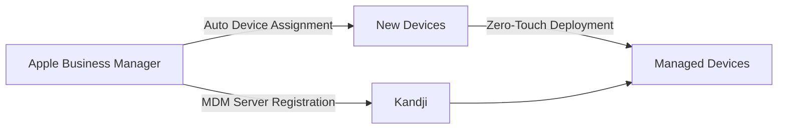

<div class="ai-summary-card">
<div class="ai-summary-header">
  <span class="ai-badge">AI 요약</span>
</div>
<div class="ai-summary-content">
  <div class="summary-row">
    <span class="summary-label">제목</span>
    <span class="summary-value">Kandji로 macOS 완벽 마스터! 셋업부터 보안, 규정 준수까지 올인원 가이드</span>
  </div>
  <div class="summary-row">
    <span class="summary-label">카테고리</span>
    <span class="summary-value"><span class="category-tag security">Security</span></span>
  </div>
  <div class="summary-row">
    <span class="summary-label">태그</span>
    <span class="summary-value tags">
      <span class="tag">Kandji</span>
      <span class="tag">macOS</span>
      <span class="tag">MDM</span>
      <span class="tag">Endpoint-Security</span>
      <span class="tag">Compliance</span>
    </span>
  </div>
  <div class="summary-row highlights">
    <span class="summary-label">핵심 내용</span>
    <ul class="summary-list">
      <li><strong>Kandji UEM 솔루션</strong>: Apple 통합 엔드포인트 관리(macOS/iOS/iPadOS/tvOS), MDM 정책 설정, 앱 배포 자동화, 보안 설정 중앙 관리, 컴플라이언스 모니터링</li>
      <li><strong>보안 및 규정 준수</strong>: 단계별 설정 가이드(MDM 정책, 앱 배포, 보안 설정, 컴플라이언스), 패스키 기반 디바이스 인증, FIDO2/WebAuthn 통합(YubiKey, Touch ID/Face ID), Zero Trust 아키텍처 적용</li>
      <li><strong>2025년 엔드포인트 보안 트렌드</strong>: 패스키 기반 디바이스 인증(제로 터치 배포, 관리자 인증 강화), AI 기반 위협 탐지(이상 행위 탐지, 자동 대응, 예측적 보안), SASE 통합(Zscaler, Netskope)</li>
      <li><strong>실무 적용</strong>: 디바이스 신뢰도 평가, 동적 접근 제어, 컴플라이언스 상태 기반 실시간 접근 제어, 기업 앱 로그인 자동화</li>
    </ul>
  </div>
  <div class="summary-row">
    <span class="summary-label">기술/도구</span>
    <span class="summary-value">Kandji, MDM, Apple UEM</span>
  </div>
  <div class="summary-row">
    <span class="summary-label">대상 독자</span>
    <span class="summary-value">기업 보안 담당자, 보안 엔지니어, CISO</span>
  </div>
</div>
<div class="ai-summary-footer">
  이 포스팅은 AI가 쉽게 이해하고 활용할 수 있도록 구조화된 요약을 포함합니다.
</div>
</div>

## 서론

안녕하세요! macOS 뿐만 아니라 iOS, iPadOS 등 다양한 Apple 기기를 효율적이고 안전하게 관리하고 싶은 IT 관리자 여러분! 오늘은 Apple 통합 엔드포인트 관리(UEM) 솔루션으로 주목받는 Kandji의 강력한 기능들을 어떻게 실제로 활용하는지, 단계별 상세 가이드 형식으로 알려드리겠습니다. Kandji는 복잡한 Apple 기기 전체(macOS, iOS, iPadOS, tvOS) 관리를 간소..

이 글에서는 Kandji로 macOS 완벽 마스터! 셋업부터 보안, 규정 준수까지 올인원 가이드에 대해 실무 중심으로 상세히 다룹니다.


## 1. Kandji 개요

### 1.1 Kandji란?

Kandji는 Apple 기기(macOS, iOS, iPadOS, tvOS) 전용 통합 엔드포인트 관리(UEM) 솔루션입니다. 복잡한 MDM 설정을 간소화하고, 보안 및 규정 준수를 자동화합니다.

| 기능 | 설명 | 장점 |
|------|------|------|
| **자동화된 디바이스 등록** | ABM/ASM 연동 제로터치 배포 | 수동 설정 시간 90% 감소 |
| **컴플라이언스 모니터링** | CIS 벤치마크 기반 자동 검사 | 규정 위반 실시간 탐지 |
| **앱 배포 자동화** | VPP 연동 자동 설치/업데이트 | IT 부담 대폭 감소 |
| **보안 정책 관리** | FileVault, 방화벽, Gatekeeper | 중앙 집중식 보안 관리 |

### 1.2 지원 플랫폼


<details>
<summary>텍스트 버전 (접근성용)</summary>

```
Kandji UEM Supported Platforms:
- macOS (Intel/Apple Silicon)
- iOS (iPhone)
- iPadOS (iPad)
- tvOS (Apple TV)
```

</details>

## 2. Kandji 설정 가이드

### 2.1 초기 설정 체크리스트

Kandji 도입 전 확인 사항:

- [ ] Apple Business Manager(ABM) 또는 Apple School Manager(ASM) 계정
- [ ] APNs(Apple Push Notification service) 인증서
- [ ] 관리 대상 디바이스 목록
- [ ] 보안 정책 요구사항 문서

### 2.2 ABM/ASM 연동



### 2.3 보안 정책 구성

Kandji에서 권장하는 핵심 보안 설정:

| 보안 기능 | 권장 설정 | 컴플라이언스 |
|----------|----------|-------------|
| **FileVault** | 필수 활성화, 복구키 에스크로 | CIS, NIST |
| **방화벽** | 활성화, 스텔스 모드 | CIS, SOC2 |
| **Gatekeeper** | App Store + 확인된 개발자 | CIS, HIPAA |
| **SIP (System Integrity Protection)** | 활성화 유지 | CIS, PCI-DSS |
| **자동 업데이트** | 보안 업데이트 자동 설치 | 모든 프레임워크 |

## 2. 2025년 엔드포인트 보안 및 MDM 트렌드

### 2.1 패스키 기반 디바이스 인증

2025년 Apple 생태계에서 **패스키(Passkey)**가 기본 인증 방식으로 자리잡으면서, MDM 솔루션도 이에 발맞춰 진화하고 있습니다. Kandji를 포함한 주요 MDM 솔루션들은 패스키 기반 인증을 지원하여 더욱 안전한 디바이스 등록 및 관리가 가능해졌습니다.

**MDM에서의 패스키 활용:**
- **제로 터치 배포**: 패스키를 활용한 자동화된 디바이스 등록
- **관리자 인증 강화**: MDM 콘솔 접근 시 패스키 기반 MFA
- **기업 앱 로그인**: 관리 앱에 패스키 자격 증명 자동 배포

### 2.2 AI 기반 위협 탐지

엔드포인트 보안에서 **AI/ML 기반 위협 탐지**가 표준으로 자리잡았습니다. Kandji와 같은 UEM 솔루션들이 실시간 행위 분석을 통해 제로데이 공격과 알려지지 않은 위협을 사전에 탐지합니다.

**AI 기반 보안 기능:**
- **이상 행위 탐지**: 평소와 다른 디바이스 사용 패턴 감지
- **자동 대응**: 위협 탐지 시 자동 격리 및 알림
- **예측적 보안**: 잠재적 취약점 사전 식별

### 2.3 FIDO2/WebAuthn 통합

**FIDO2/WebAuthn**이 피싱 방지 MFA의 업계 표준이 되면서, Apple 디바이스 관리에서도 이를 적극 활용하고 있습니다.

**Kandji와 FIDO2 연동:**
- **하드웨어 보안 키 정책**: YubiKey 등 보안 키 사용 강제
- **플랫폼 인증기 활용**: Touch ID, Face ID를 MFA로 활용
- **조건부 접근 정책**: FIDO2 인증 완료 디바이스만 기업 리소스 접근 허용

### 2.4 Zero Trust 아키텍처와 MDM

2025년 현재 **Zero Trust 보안 모델**이 업계 표준으로 정착하면서, MDM은 Zero Trust 아키텍처의 핵심 구성 요소가 되었습니다.

**MDM의 Zero Trust 역할:**
- **디바이스 신뢰도 평가**: 지속적인 디바이스 상태 검증
- **동적 접근 제어**: 디바이스 컴플라이언스 상태에 따른 실시간 접근 제어
- **SASE 통합**: Zscaler, Netskope 등 SASE 솔루션과의 연동

## 결론

Kandji로 macOS 완벽 마스터! 셋업부터 보안, 규정 준수까지 올인원 가이드에 대해 다루었습니다. 2025년 현재 패스키 채택 확대, AI 기반 위협 탐지, Zero Trust 아키텍처 정착 등 보안 환경이 빠르게 변화하고 있습니다. 올바른 설정과 지속적인 모니터링을 통해 안전하고 효율적인 환경을 구축할 수 있습니다.