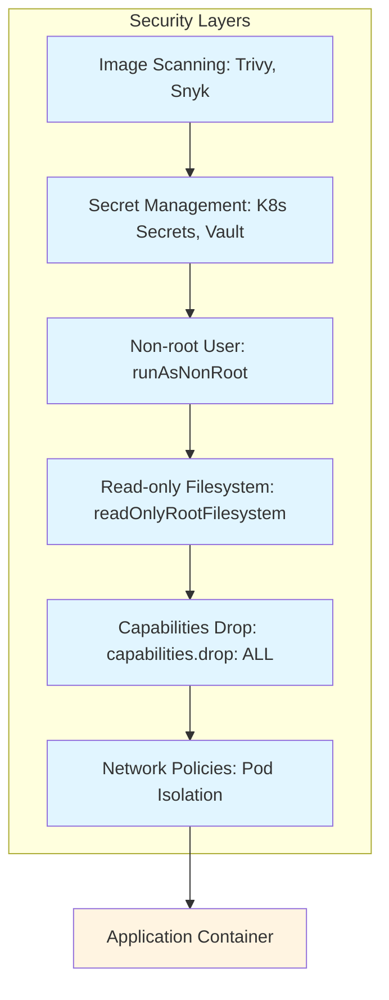

<div class="ai-summary-card">
<div class="ai-summary-header">
  <span class="ai-badge">AI 요약</span>
</div>
<div class="ai-summary-content">
  <div class="summary-row">
    <span class="summary-label">제목</span>
    <span class="summary-value">클라우드 보안 과정 7기 - 4주차 AWS 취약점 점검 및 ISMS 대응 가이드</span>
  </div>
  <div class="summary-row">
    <span class="summary-label">카테고리</span>
    <span class="summary-value"><span class="category-tag cloud">Cloud</span></span>
  </div>
  <div class="summary-row">
    <span class="summary-label">태그</span>
    <span class="summary-value tags">
      <span class="tag">AWS</span>
      <span class="tag">ISMS</span>
      <span class="tag">Vulnerability</span>
      <span class="tag">Compliance</span>
    </span>
  </div>
  <div class="summary-row highlights">
    <span class="summary-label">핵심 내용</span>
    <ul class="summary-list">
      <li><strong>AWS 취약점 점검 도구</strong>: Security Hub(통합 보안 관리), Inspector(EC2/ECR/EC2/Lambda 취약점 스캔), Trusted Advisor(비용/성능/보안 권장사항), GuardDuty(위협 탐지), Config(컴플라이언스 규칙 자동 점검)</li>
      <li><strong>ISMS-P 인증 대응</strong>: 보안 감사 프로세스, 컴플라이언스 대응 전략, AWS Artifact(보안 문서 확보), AWS Config Rules(컴플라이언스 규칙 자동 점검), Security Hub(보안 표준 준수 현황 통합 관리), CloudTrail(감사 로그 수집 및 보관)</li>
      <li><strong>AWS re:Invent 2025 보안 발표</strong>: AWS Security Agent(자동화된 보안 리뷰, 컨텍스트 인식 침투 테스트), GuardDuty Extended Threat Detection(2개 새로운 공격 시퀀스 탐지), GuardDuty Malware Protection for AWS Backup(증분 스캔), Security Hub GA 업데이트(보안 위험 중앙 집중화, 히스토리 트렌드, 노출 요약, 커스텀 위젯), IAM Policy Autopilot(AI 기반 IAM 정책 자동 생성)</li>
      <li><strong>실무 보안 역량 강화</strong>: 20분 강의 + 5분 휴식 루틴, 취약점 스캔 자동화, ISMS 통제항목 매핑, 보안 개선 추이 증빙, 감사 대응 대시보드 구성</li>
      <li><strong>AI 보안 솔루션</strong>: AgentCore Identity(AI 에이전트용 인증), Third-party 보안 통합(SentinelOne, Salt Security, HiddenLayer), aws login 명령어(브라우저 기반 CLI 인증, SSO 연동)</li>
    </ul>
  </div>
  <div class="summary-row">
    <span class="summary-label">기술/도구</span>
    <span class="summary-value">AWS, ISMS-P, Vulnerability Assessment</span>
  </div>
  <div class="summary-row">
    <span class="summary-label">대상 독자</span>
    <span class="summary-value">클라우드 아키텍트, DevOps 엔지니어, 클라우드 관리자</span>
  </div>
</div>
<div class="ai-summary-footer">
  이 포스팅은 AI가 쉽게 이해하고 활용할 수 있도록 구조화된 요약을 포함합니다.
</div>
</div>


## 서론

안녕하세요, Twodragon입니다.이번 4주차에서는 AWS 취약점 점검 및 ISMS-P 인증 대응을 중심으로 실무에 꼭 필요한 보안 역량을 다집니다. 강의는 20분 발표 + 5분 휴식으로 구성되며, 집중력 향상과 피로도 최소화를 목표로 합니다. 10:00 - 10:20 근황 토크 & 과제 피드백 한 주간의 근황 공유 및 토론

이 글에서는 클라우드 보안 과정 7기 - 4주차 AWS 취약점 점검 및 ISMS 대응 가이드에 대해 실무 중심으로 상세히 다룹니다.


컨테이너 보안은 DevSecOps 사이클을 통해 코드로 관리됩니다:

```mermaid
graph LR
    subgraph Dev["Dev Phase"]
        Code["Code: Secure Dockerfile"]
        Build["Build: Image Scanning"]
    end
    
    subgraph Sec["Sec Phase"]
        Scan["Security Scan: Trivy, Snyk"]
        Policy["Policy Check: K8s YAML Validation"]
    end
    
    subgraph Ops["Ops Phase"]
        Deploy["Deploy: Secure Deployment"]
        Monitor["Monitor: Runtime Security"]
    end
    
    Code --> Build
    Build --> Scan
    Scan --> Policy
    Policy --> Deploy
    Deploy --> Monitor
    Monitor --> Code
    
    style Code fill:#e1f5ff
    style Build fill:#fff4e1
    style Scan fill:#ffebee
    style Policy fill:#fff4e1
    style Deploy fill:#e8f5e9
    style Monitor fill:#f3e5f5
```## 1. 개요

### 1.1 배경 및 필요성

안녕하세요, Twodragon입니다.이번 4주차에서는 AWS 취약점 점검 및 ISMS-P 인증 대응을 중심으로 실무에 꼭 필요한 보안 역량을 다집니다. 강의는 20분 발표 + 5분 휴식으로 구성되며, 집중력 향상과 피로도 최소화를 목표로 합니다. 10:00 - 10:20 근황 토크 and 과제 피드백 한 주간의 근황 공유 및 토론...

## 2. 핵심 내용

### 2.1 기본 설정

기본 설정을 시작하기 전에 다음 사항을 확인해야 합니다:

1. **요구사항 분석**: 필요한 기능 및 성능 요구사항 파악
2. **환경 준비**: 필요한 도구 및 리소스 준비
3. **보안 정책**: 보안 정책 및 규정 준수 사항 확인

### 2.2 단계별 구현

#### 단계 1: 초기 설정

초기 설정 단계에서는 기본 구성을 수행합니다.

```bash
# 예시 명령어
# 실제 설정에 맞게 수정 필요
```

#### 단계 2: 보안 구성


컨테이너 보안은 여러 레이어로 구성된 Defense in Depth 전략을 통해 강화됩니다:




보안 설정을 구성합니다:

- 접근 제어 설정
- 암호화 구성
- 모니터링 활성화

## 2. 2025년 AWS re:Invent 보안 발표

2025년 AWS re:Invent에서 발표된 보안 기능들은 취약점 점검 및 ISMS 대응에 직접적인 도움을 줍니다.

### 2.1 취약점 점검 자동화 강화

#### AWS Security Agent (Preview)
개발 전 과정에서 자동화된 보안 리뷰를 수행하는 새로운 에이전트입니다.

**주요 기능:**
- 자동화된 애플리케이션 보안 리뷰
- 컨텍스트 인식 침투 테스트
- ISMS-P 인증 대응에 필요한 취약점 점검 자동화

> **참고**: AWS Security Agent 관련 내용은 [AWS re:Invent 2025 발표](https://reinvent.awsevents.com/) 및 [AWS Security 문서](https://docs.aws.amazon.com/security/)를 참조하세요.
> 
> ```python
> # AWS Security Agent 활용 예시 (개념적 코드)...
> ```

<!-- 전체 코드는 위 링크 참조
```python
# AWS Security Agent 활용 예시 (개념적 코드)
def security_review_pipeline():
    """
    개발 파이프라인에 Security Agent 통합
    - 코드 커밋 시 자동 보안 리뷰
    - 배포 전 침투 테스트 수행
    - ISMS 통제항목 자동 검증
    """
    stages = [
        "코드 보안 분석",
        "의존성 취약점 스캔",
        "컨텍스트 기반 침투 테스트",
        "ISMS 통제항목 매핑"
    ]
    return stages

```
-->

#### GuardDuty Extended Threat Detection
- EC2 인스턴스 및 ECS 태스크용 **2개의 새로운 공격 시퀀스 탐지** 추가
- 복합 공격 패턴 자동 연결로 위협 탐지 정확도 향상

#### GuardDuty Malware Protection for AWS Backup
- EC2, EBS, S3 백업에서 악성코드 자동 스캔
- **증분 스캔**: 변경된 부분만 스캔하여 효율성 극대화
- ISMS 백업 보안 통제항목 대응

### 2.2 보안 중앙 관리 강화

#### AWS Security Hub GA 업데이트

| 기능 | ISMS 대응 효과 |
|------|---------------|
| 보안 위험 중앙 집중화 | 통합 보안 현황 관리 |
| 히스토리 트렌드 | 보안 개선 추이 증빙 |
| 노출 요약 | 취약점 현황 리포트 |
| 커스텀 위젯 | 감사 대응 대시보드 |

### 2.3 IAM 정책 자동화

#### IAM Policy Autopilot
- **오픈소스 MCP 서버** 기반
- AI 코딩 어시스턴트가 IAM 정책을 자동 생성
- 최소 권한 원칙 자동 준수

> **참고**: 관련 예제는 [공식 문서](https://www.json.org/json-en.html)를 참조하세요.

```json
{
  "PolicyName": "AutoPilot-Generated-Policy",
  "Description": "IAM Policy Autopilot이 자동 생성한 최소 권한 정책",
  "Features": [
    "실제 사용 패턴 분석",
    "불필요한 권한 자동 제거",
    "ISMS 접근통제 요구사항 반영"
  ]
}
```

### 2.4 운영 편의성 개선

#### aws login 명령어
> **참고**: AWS CLI 인증 관련 내용은 [AWS CLI 공식 문서](https://docs.aws.amazon.com/cli/latest/userguide/) 및 [AWS IAM Identity Center](https://docs.aws.amazon.com/singlesignon/latest/userguide/)를 참조하세요.

```bash
# 브라우저 기반 CLI 인증
aws login

# ISMS 대응 장점:
# - 자격증명 관리 간소화
# - SSO 연동으로 중앙 인증 관리
# - 감사 로그 통합
```

#### AWS Organizations Account Migration
- 조직 간 계정 직접 이동 (standalone 변환 불필요)
- ISMS 대응 시 조직 구조 변경 용이

### 2.5 AI 보안 솔루션

#### AgentCore Identity
- AI 에이전트용 인증 시스템
- 사용자 권한 기반 접근 제어
- ISMS AI 보안 통제 대응

#### Third-party 보안 통합
- **SentinelOne**: Singularity + Security Hub/CloudWatch 통합, Purple AI MCP Server
- **Salt Security**: Ask Pepper AI (Bedrock 기반 API 보호)
- **HiddenLayer**: Amazon Bedrock, SageMaker 네이티브 지원

## 결론

클라우드 보안 과정 7기 - 4주차 AWS 취약점 점검 및 ISMS 대응 가이드에 대해 다루었습니다. 올바른 설정과 지속적인 모니터링을 통해 안전하고 효율적인 환경을 구축할 수 있습니다.

2025년 re:Invent에서 발표된 새로운 보안 기능들, 특히 **AWS Security Agent**, **IAM Policy Autopilot**, **GuardDuty Extended Threat Detection**은 취약점 점검 자동화와 ISMS-P 인증 대응에 큰 도움이 될 것입니다.