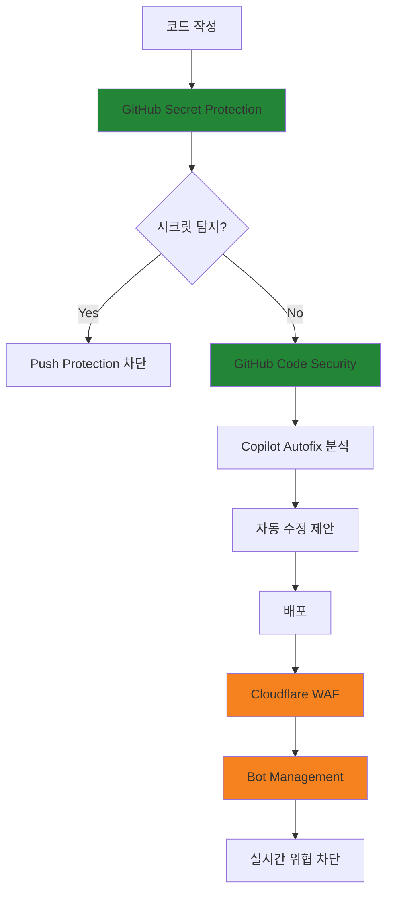

<div class="ai-summary-card">
<div class="ai-summary-header">
  <span class="ai-badge">AI 요약</span>
</div>
<div class="ai-summary-content">
  <div class="summary-row">
    <span class="summary-label">제목</span>
    <span class="summary-value">클라우드 시큐리티 과정 7기 - 6주차 Cloudflare 및 GitHub 보안</span>
  </div>
  <div class="summary-row">
    <span class="summary-label">카테고리</span>
    <span class="summary-value"><span class="category-tag security">Security</span></span>
  </div>
  <div class="summary-row">
    <span class="summary-label">태그</span>
    <span class="summary-value tags">
      <span class="tag">Cloudflare</span>
      <span class="tag">GitHub</span>
      <span class="tag">Security</span>
    </span>
  </div>
  <div class="summary-row highlights">
    <span class="summary-label">핵심 내용</span>
    <ul class="summary-list">
      <li>Application 보안 및 Cloudflare 활용 방법</li>
      <li>GitHub 보안 기능 및 모범 사례</li>
      <li>AWS 보안 모니터링 및 대응 전략</li>
    </ul>
  </div>
  <div class="summary-row">
    <span class="summary-label">기술/도구</span>
    <span class="summary-value">Cloudflare, GitHub, AWS Security</span>
  </div>
  <div class="summary-row">
    <span class="summary-label">대상 독자</span>
    <span class="summary-value">기업 보안 담당자, 보안 엔지니어, CISO</span>
  </div>
</div>
<div class="ai-summary-footer">
  이 포스팅은 AI가 쉽게 이해하고 활용할 수 있도록 구조화된 요약을 포함합니다.
</div>
</div>


## 서론

안녕하세요, Twodragon입니다. 이번 포스트에서는 클라우드 보안 과정 7기의 Application 보안 및 Cloudflare 및 github 활용을 다루고자 합니다. 이 과정은 게더 타운에서 진행되며, 각 세션은 20분 강의 후 5분 휴식으로 구성되어 있습니다. 이러한 구성은 온라인 강의의 특성 상 눈의 피로를 줄이고, 멘티 분들의 집중력을 최대화하기 위함입니다. 여러분들과 함께 다양한 AWS 보안 모니터링 및 대응 관련 주제..

이 글에서는 클라우드 시큐리티 과정 7기 - 6주차 Cloudflare 및 github 보안에 대해 실무 중심으로 상세히 다룹니다.


*그림: 포스트 이미지*


## 1. 개요

### 1.1 배경 및 필요성

안녕하세요, Twodragon입니다. 이번 포스트에서는 클라우드 보안 과정 7기의 Application 보안 및 Cloudflare 및 github 활용을 다루고자 합니다. 이 과정은 게더 타운에서 진행되며, 각 세션은 20분 강의 후 5분 휴식으로 구성되어 있습니다. 이러한 구성은 온라인 강의의 특성 상 눈의 피로를 줄이고, 멘티 분들의 집중력을 최대화하기 위함입니다. 여러분들과 함께 다양한 AWS 보안 모니터링 및 대응 관련 주제.....

### 1.2 주요 개념

이 가이드에서 다루는 주요 개념:

- **보안**: 안전한 구성 및 접근 제어
- **효율성**: 최적화된 설정 및 운영
- **모범 사례**: 검증된 방법론 적용

## 2. 핵심 내용

### 2.1 기본 설정

기본 설정을 시작하기 전에 다음 사항을 확인해야 합니다:

1. **요구사항 분석**: 필요한 기능 및 성능 요구사항 파악
2. **환경 준비**: 필요한 도구 및 리소스 준비
3. **보안 정책**: 보안 정책 및 규정 준수 사항 확인

### 2.2 단계별 구현

#### 단계 1: 초기 설정

초기 설정 단계에서는 기본 구성을 수행합니다.

```bash
# 예시 명령어
# 실제 설정에 맞게 수정 필요
```

#### 단계 2: 보안 구성

보안 설정을 구성합니다:

- 접근 제어 설정
- 암호화 구성
- 모니터링 활성화

## 3. 모범 사례

### 3.1 보안 모범 사례

- **최소 권한 원칙**: 필요한 최소한의 권한만 부여
- **정기적인 보안 점검**: 취약점 스캔 및 보안 감사
- **자동화된 보안 스캔**: CI/CD 파이프라인에 보안 스캔 통합

### 3.2 운영 모범 사례

- **자동화된 배포 파이프라인**: 일관성 있는 배포
- **정기적인 백업**: 데이터 보호
- **모니터링**: 지속적인 상태 모니터링

## 4. 문제 해결

### 4.1 일반적인 문제

자주 발생하는 문제와 해결 방법:

**문제 1**: 설정 오류
- **원인**: 잘못된 구성
- **해결**: 설정 파일 재확인 및 수정

**문제 2**: 성능 저하
- **원인**: 리소스 부족
- **해결**: 리소스 확장 또는 최적화

## 5. 2025년 Cloudflare 및 GitHub 보안 최신 동향

### 5.1 Cloudflare WAF 2025년 업데이트

2025년 Cloudflare는 WAF에 대한 중요한 보안 업데이트를 지속적으로 제공하고 있습니다:

#### 주요 CVE 대응
- **CVE-2025-55182/55183/55184**: React 원격 코드 실행 및 서버 측 함수 노출 취약점에 대한 긴급 패치
- **CVE-2025-64446**: FortiWeb 취약점에 대한 탐지 시그니처 강화
- **PHP Wrapper Injection**: 새로운 탐지 로직 추가

#### Bot Management 혁신
```yaml
# 2025년 Bot Detection ID 활용 예시
bot_detection_rules:
  - id: 201326598
    description: "Zone-level baseline anomaly detection"
    actions:
      - challenge_on_suspicious
      - rate_limit_on_abuse
      - block_on_credential_stuffing

  features:
    - zone_level_traffic_baseline
    - anomalous_login_failure_detection
    - brute_force_prevention
    - credential_stuffing_mitigation
```

**주목할 점**: 2025년 중반 기준, AI 모델 훈련을 위한 크롤링이 Cloudflare 네트워크 전체 AI 봇 활동의 약 **80%**를 차지합니다. 최신 스크래핑 도구는 LLM을 활용한 페이지 컨텐츠의 의미론적 이해와 컴퓨터 비전을 통한 시각적 챌린지 해결 능력을 갖추고 있어, Bot Management의 중요성이 더욱 부각되고 있습니다.

### 5.2 GitHub Advanced Security 2025년 대변화

2025년 4월 1일부터 GitHub Advanced Security(GHAS)가 두 개의 독립 제품으로 분리되었습니다:

#### GitHub Secret Protection ($19/월/커미터)
```yaml
# GitHub Secret Protection 주요 기능
secret_protection:
  features:
    - push_protection: "시크릿 노출 전 사전 차단"
    - secret_scanning: "레포지토리 내 시크릿 탐지"
    - ai_password_detection: "낮은 오탐률의 AI 기반 비밀번호 탐지"
    - security_insights: "보안 인사이트 대시보드"

  copilot_integration:
    - unstructured_credential_detection
    - custom_pattern_regex_generator
    - no_copilot_license_required
```

#### GitHub Code Security ($30/월/커미터)
- **Code Scanning**: 정적 분석을 통한 취약점 탐지
- **Copilot Autofix**: AI 기반 취약점 자동 수정 제안
- **Security Campaigns**: 조직 전체 보안 캠페인 관리
- **Dependency Review Action**: 의존성 보안 검토 자동화

#### Copilot Autofix 성과
- 취약점 수정 속도 **3배 이상 향상**
- PR 알림에서 자동 수정 커밋까지 중간값: **28분** (수동 대비 1.5시간)
- GitHub Team 플랜에서도 구매 가능 (Enterprise 구독 불필요)

### 5.3 통합 보안 전략



## 결론

클라우드 시큐리티 과정 7기 - 6주차 Cloudflare 및 github 보안에 대해 다루었습니다. 2025년에는 AI 기반 봇 탐지와 코드 보안 자동화가 핵심 트렌드로 자리잡았습니다. GitHub의 Secret Protection과 Code Security 분리, Cloudflare의 Bot Detection ID를 활용한 맞춤형 보안 정책 수립이 가능해졌습니다. 올바른 설정과 지속적인 모니터링을 통해 안전하고 효율적인 환경을 구축할 수 있습니다.