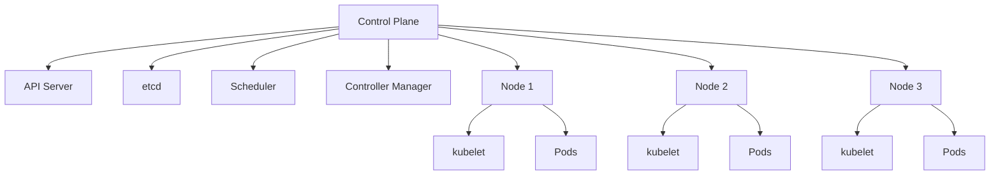
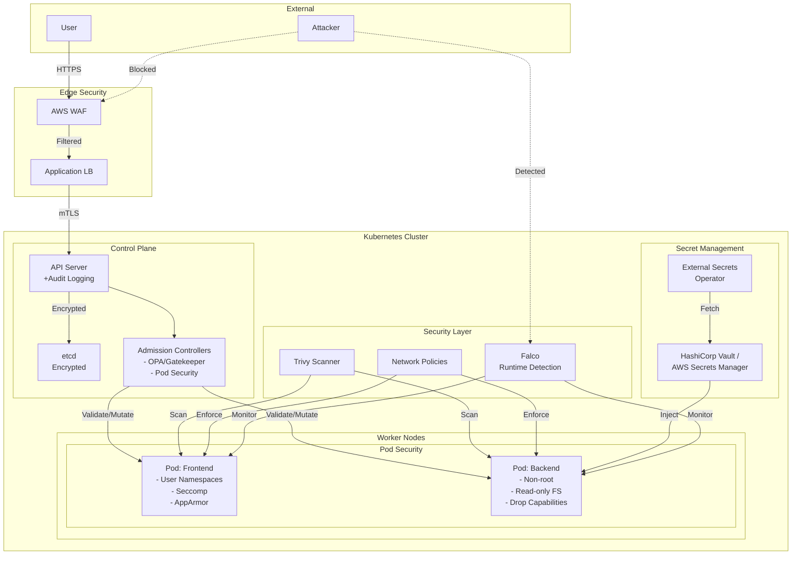
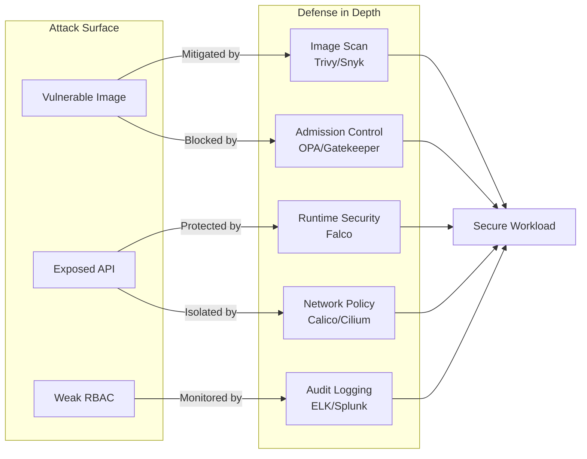

<div class="ai-summary-card">
<div class="ai-summary-header">
  <span class="ai-badge">AI 요약</span>
</div>
<div class="ai-summary-content">
  <div class="summary-row">
    <span class="summary-label">제목</span>
    <span class="summary-value">클라우드 시큐리티 과정 7기 - 7주차: Docker 및 Kubernetes 이해</span>
  </div>
  <div class="summary-row">
    <span class="summary-label">카테고리</span>
    <span class="summary-value"><span class="category-tag devops">Kubernetes</span></span>
  </div>
  <div class="summary-row">
    <span class="summary-label">태그</span>
    <span class="summary-value tags">
      <span class="tag">Docker</span>
      <span class="tag">Kubernetes</span>
      <span class="tag">Container</span>
      <span class="tag">K8s</span>
      <span class="tag">Cloud-Security</span>
      <span class="tag">DevSecOps</span>
    </span>
  </div>
  <div class="summary-row highlights">
    <span class="summary-label">핵심 내용</span>
    <ul class="summary-list">
      <li><strong>Docker 기초</strong>: 이미지/컨테이너/Dockerfile 개념, 기본 Docker 명령어(pull, run, ps, logs, stop, rm), Registry(Docker Hub), 컨테이너 격리 및 실행 환경</li>
      <li><strong>Kubernetes 아키텍처</strong>: Control Plane(API Server, etcd, Scheduler, Controller Manager), Node(kubelet, Pods), 주요 리소스(Pod, Deployment, Service, ConfigMap, Secret, Namespace)</li>
      <li><strong>컨테이너 보안 Best Practices</strong>: 최소 권한 원칙, 이미지 스캔(Trivy, Snyk), Secret 관리(Kubernetes Secrets, External Secrets Operator), 비루트 사용자 실행, 읽기 전용 파일시스템</li>
      <li><strong>런타임 보안</strong>: Trivy 취약점 스캔, Falco 이상 행위 탐지, Pod Security Standards 적용, Network Policy 구현, Minikube/K9s 실습 가이드</li>
    </ul>
  </div>
  <div class="summary-row">
    <span class="summary-label">기술/도구</span>
    <span class="summary-value">Docker, Kubernetes, Minikube, K9s, Trivy</span>
  </div>
  <div class="summary-row">
    <span class="summary-label">대상 독자</span>
    <span class="summary-value">클라우드 보안 전문가, DevOps 엔지니어, 보안 담당자</span>
  </div>
</div>
<div class="ai-summary-footer">
  이 포스팅은 AI가 쉽게 이해하고 활용할 수 있도록 구조화된 요약을 포함합니다.
</div>
</div>


## Executive Summary

컨테이너 기술은 현대 클라우드 인프라의 핵심이며, Docker와 Kubernetes는 가장 널리 사용되는 표준입니다. 본 문서는 컨테이너 보안의 전체 생명주기(Build → Ship → Run)를 다루며, 2025년 최신 보안 업데이트와 실무 적용 방법을 제공합니다.

### 주요 보안 위험

| 위험 | 영향도 | 발생 빈도 | 비즈니스 영향 |
|------|--------|-----------|--------------|
| 취약한 컨테이너 이미지 | 높음 | 매우 높음 | 데이터 유출, 서비스 중단 |
| 과도한 권한 실행 | 높음 | 높음 | 권한 상승, 호스트 침투 |
| 비암호화 Secret 관리 | 높음 | 중간 | 자격 증명 노출, 무단 접근 |
| 네트워크 정책 부재 | 중간 | 높음 | 측면 이동, 내부 정찰 |
| 런타임 모니터링 부족 | 중간 | 높음 | 공격 탐지 지연, 사고 대응 실패 |

### 권장 보안 통제

1. **Build Phase**: 이미지 스캔 자동화, Multi-stage 빌드, Distroless 이미지
2. **Ship Phase**: 이미지 서명 검증, Registry 접근 제어, 취약점 정책 적용
3. **Run Phase**: Pod Security Standards, Network Policy, Runtime 모니터링 (Falco)
4. **Governance**: RBAC, Admission Controller, Audit Logging

### 즉시 적용 가능한 액션 아이템

- [ ] 모든 프로덕션 이미지에 Trivy 스캔 통합
- [ ] Pod Security Standards (Restricted) 적용
- [ ] Network Policy로 기본 Deny-All 구현
- [ ] Falco 런타임 탐지 규칙 배포
- [ ] User Namespaces 활성화 (Kubernetes 1.32+)

## 서론

안녕하세요, **Twodragon**입니다. 이번 포스팅에서는 컨테이너 및 Kubernetes 보안에 대해 실무 중심으로 정리합니다.

2025년 Docker와 Kubernetes는 여전히 클라우드 네이티브 애플리케이션의 핵심 기술이며, 보안은 더욱 중요해지고 있습니다.

이번 포스팅에서는 다음 내용을 다룹니다:
- 클라우드 시큐리티 과정 7기 - 7주차: Docker 및 Kubernetes 이해의 핵심 내용 및 실무 적용 방법
- 2025-2026년 최신 트렌드 및 업데이트 사항
- 실전 사례 및 문제 해결 방법
- 보안 모범 사례 및 권장 사항

## 1. Docker 기초 이해

### 1.1 Docker란?

Docker는 애플리케이션을 **컨테이너**라는 격리된 환경에서 실행할 수 있게 해주는 플랫폼입니다. 컨테이너는 애플리케이션과 그 종속성을 함께 패키징하여 어디서든 일관되게 실행할 수 있습니다.

### 1.2 Docker의 핵심 개념

| 개념 | 설명 |
|------|------|
| **Image** | 컨테이너 실행에 필요한 파일과 설정을 포함한 템플릿 |
| **Container** | 이미지를 기반으로 실행되는 인스턴스 |
| **Dockerfile** | 이미지를 빌드하기 위한 명령어 스크립트 |
| **Registry** | 이미지를 저장하고 공유하는 저장소 (Docker Hub 등) |

### 1.3 기본 Docker 명령어

> **참고**: Docker 기본 명령어 관련 내용은 [Docker 공식 문서](https://docs.docker.com/) 및 [Docker 공식 예제](https://github.com/docker/awesome-compose)를 참조하세요.
>
> ```bash
> # 이미지 다운로드...
> ```

<!-- 전체 코드는 위 GitHub 링크 참조
```bash
# 이미지 다운로드
docker pull nginx:latest

# 컨테이너 실행
docker run -d -p 8080:80 --name my-nginx nginx:latest

# 실행 중인 컨테이너 확인
docker ps

# 컨테이너 로그 확인
docker logs my-nginx

# 컨테이너 중지 및 삭제
docker stop my-nginx && docker rm my-nginx

```
-->

### 1.4 Dockerfile 작성 Best Practices

안전하고 효율적인 Dockerfile 작성 원칙입니다.

#### Multi-stage Build로 이미지 크기 최소화

```dockerfile
# Build stage
FROM golang:1.21 AS builder
WORKDIR /app
COPY go.mod go.sum ./
RUN go mod download
COPY . .
RUN CGO_ENABLED=0 GOOS=linux go build -o app

# Runtime stage (Distroless)
FROM gcr.io/distroless/static-debian11
COPY --from=builder /app/app /app
USER nonroot:nonroot
ENTRYPOINT ["/app"]
```

#### 보안 강화 Dockerfile 예시

```dockerfile
# 최소 베이스 이미지 사용
FROM alpine:3.19

# 보안 패치 적용
RUN apk update && apk upgrade && apk add --no-cache \
    ca-certificates \
    && rm -rf /var/cache/apk/*

# 비특권 사용자 생성
RUN addgroup -S appgroup && adduser -S appuser -G appgroup

# 애플리케이션 디렉토리
WORKDIR /app

# 의존성 먼저 복사 (캐시 활용)
COPY requirements.txt .
RUN pip install --no-cache-dir -r requirements.txt

# 애플리케이션 코드 복사
COPY --chown=appuser:appgroup . .

# 비특권 사용자로 전환
USER appuser

# Health check 추가
HEALTHCHECK --interval=30s --timeout=3s \
  CMD wget --no-verbose --tries=1 --spider http://localhost:8000/health || exit 1

EXPOSE 8000
CMD ["python", "app.py"]
```

### 1.5 Docker 보안 검증 체크리스트

| 항목 | 검증 방법 | 위험도 |
|------|-----------|--------|
| 베이스 이미지 출처 확인 | `docker history <image>` | 높음 |
| 취약점 스캔 | `trivy image <image>` | 높음 |
| 비루트 사용자 실행 | Dockerfile에서 `USER` 확인 | 높음 |
| Secrets 하드코딩 확인 | 코드 리뷰, git-secrets | 매우 높음 |
| 불필요한 패키지 제거 | 이미지 크기 및 레이어 분석 | 중간 |
| Health check 구현 | `HEALTHCHECK` 지시어 확인 | 중간 |

## 2. Kubernetes 핵심 개념

### 2.1 Kubernetes 아키텍처

Kubernetes는 컨테이너화된 워크로드와 서비스를 관리하기 위한 **오케스트레이션 플랫폼**입니다.



### 2.2 Control Plane 구성 요소 상세

#### API Server

모든 Kubernetes 작업의 중앙 관리 포인트입니다.

**주요 기능:**
- RESTful API 제공 (kubectl, 대시보드, CI/CD 도구와 통신)
- 인증 및 인가 처리 (AuthN/AuthZ)
- Admission Control (정책 검증 및 변형)
- etcd와의 유일한 통신 인터페이스

**보안 설정:**

```yaml
apiVersion: v1
kind: Pod
metadata:
  name: kube-apiserver
  namespace: kube-system
spec:
  containers:
  - name: kube-apiserver
    command:
    - kube-apiserver
    - --anonymous-auth=false
    - --authorization-mode=RBAC,Node
    - --enable-admission-plugins=PodSecurityPolicy,NodeRestriction
    - --audit-log-path=/var/log/kubernetes/audit.log
    - --audit-log-maxage=30
    - --tls-min-version=VersionTLS13
```

#### etcd

분산 key-value 저장소로 클러스터의 모든 상태를 저장합니다.

**보안 고려사항:**
- 암호화된 통신만 허용 (mTLS)
- 백업 암호화 필수
- 접근 제어 (API Server만 접근 허용)
- 정기적 백업 및 복구 테스트

**etcd 암호화 설정:**

```yaml
# EncryptionConfiguration
apiVersion: apiserver.config.k8s.io/v1
kind: EncryptionConfiguration
resources:
  - resources:
      - secrets
    providers:
      - aescbc:
          keys:
            - name: key1
              secret: <base64-encoded-32-byte-key>
      - identity: {}
```

#### Scheduler

Pod를 적절한 Node에 배치하는 역할을 합니다.

**스케줄링 전략:**
- Resource 요구사항 (CPU, Memory)
- Affinity/Anti-affinity 규칙
- Taint/Toleration
- Node Selector

#### Controller Manager

클러스터의 desired state를 유지합니다.

**주요 Controller:**
- Deployment Controller: ReplicaSet 관리
- ReplicaSet Controller: Pod 복제본 관리
- Service Controller: LoadBalancer 생성
- Node Controller: 노드 상태 모니터링

### 2.3 주요 Kubernetes 리소스

#### Pod

가장 작은 배포 단위로, 하나 이상의 컨테이너를 포함합니다.

> **참고**: Kubernetes Pod 관련 내용은 [Kubernetes Pod 문서](https://kubernetes.io/docs/concepts/workloads/pods/) 및 [Kubernetes 예제](https://github.com/kubernetes/examples)를 참조하세요.
>
> ```yaml
> apiVersion: v1...
> ```

<!-- 전체 코드는 위 GitHub 링크 참조
```yaml
apiVersion: v1
kind: Pod
metadata:
 name: nginx-pod
 labels:
 app: nginx
spec:
 containers:
 - name: nginx
 image: nginx:1.21
 ports:
 - containerPort: 80

```
-->

#### 프로덕션급 Pod 설정 예시

```yaml
apiVersion: v1
kind: Pod
metadata:
  name: secure-app
  namespace: production
  labels:
    app: secure-app
    tier: backend
spec:
  # Pod Security Context
  securityContext:
    runAsNonRoot: true
    runAsUser: 1000
    fsGroup: 2000
    seccompProfile:
      type: RuntimeDefault

  # Init Container (설정 초기화)
  initContainers:
  - name: init-config
    image: busybox:1.35
    command: ['sh', '-c', 'echo "Initializing..." && sleep 2']

  # Main Container
  containers:
  - name: app
    image: myregistry.io/secure-app:v1.2.3
    imagePullPolicy: Always

    # Container Security Context
    securityContext:
      allowPrivilegeEscalation: false
      readOnlyRootFilesystem: true
      capabilities:
        drop:
        - ALL

    # Resource Limits
    resources:
      requests:
        cpu: "100m"
        memory: "128Mi"
      limits:
        cpu: "500m"
        memory: "512Mi"

    # Health Checks
    livenessProbe:
      httpGet:
        path: /healthz
        port: 8080
      initialDelaySeconds: 15
      periodSeconds: 10
      timeoutSeconds: 3
      failureThreshold: 3

    readinessProbe:
      httpGet:
        path: /ready
        port: 8080
      initialDelaySeconds: 5
      periodSeconds: 5

    # Environment from ConfigMap/Secret
    envFrom:
    - configMapRef:
        name: app-config
    - secretRef:
        name: app-secrets

    # Volume Mounts
    volumeMounts:
    - name: tmp
      mountPath: /tmp
    - name: cache
      mountPath: /app/cache

  # Volumes
  volumes:
  - name: tmp
    emptyDir: {}
  - name: cache
    emptyDir: {}

  # Image Pull Secrets
  imagePullSecrets:
  - name: registry-secret

  # DNS Policy
  dnsPolicy: ClusterFirst

  # Restart Policy
  restartPolicy: Always
```

#### Deployment

Pod의 선언적 업데이트를 제공합니다.

> **참고**: Kubernetes Deployment 관련 내용은 [Kubernetes Deployment 문서](https://kubernetes.io/docs/concepts/workloads/controllers/deployment/) 및 [Kubernetes 예제](https://github.com/kubernetes/examples)를 참조하세요.
>
> ```yaml
> apiVersion: apps/v1...
> ```

<!-- 전체 코드는 위 GitHub 링크 참조
```yaml
apiVersion: apps/v1
kind: Deployment
metadata:
 name: nginx-deployment
spec:
 replicas: 3
 selector:
 matchLabels:
 app: nginx
 template:
 metadata:
 labels:
 app: nginx
 spec:
 containers:
 - name: nginx
 image: nginx:1.21
 ports:
 - containerPort: 80

```
-->

#### 프로덕션급 Deployment 전략

```yaml
apiVersion: apps/v1
kind: Deployment
metadata:
  name: web-app
  namespace: production
  labels:
    app: web-app
    version: v2
spec:
  replicas: 5

  # Rolling Update 전략
  strategy:
    type: RollingUpdate
    rollingUpdate:
      maxSurge: 1        # 동시에 생성 가능한 추가 Pod 수
      maxUnavailable: 0  # 업데이트 중 사용 불가능한 Pod 수

  # Label Selector
  selector:
    matchLabels:
      app: web-app

  # Pod Template
  template:
    metadata:
      labels:
        app: web-app
        version: v2
      annotations:
        prometheus.io/scrape: "true"
        prometheus.io/port: "8080"

    spec:
      # Anti-affinity (다른 노드에 분산)
      affinity:
        podAntiAffinity:
          requiredDuringSchedulingIgnoredDuringExecution:
          - labelSelector:
              matchExpressions:
              - key: app
                operator: In
                values:
                - web-app
            topologyKey: kubernetes.io/hostname

      # Security Context
      securityContext:
        runAsNonRoot: true
        runAsUser: 1000
        fsGroup: 2000

      containers:
      - name: web
        image: myregistry.io/web-app:v2.1.0
        imagePullPolicy: Always

        ports:
        - containerPort: 8080
          protocol: TCP

        resources:
          requests:
            cpu: "200m"
            memory: "256Mi"
          limits:
            cpu: "1000m"
            memory: "1Gi"

        livenessProbe:
          httpGet:
            path: /healthz
            port: 8080
          initialDelaySeconds: 30
          periodSeconds: 10

        readinessProbe:
          httpGet:
            path: /ready
            port: 8080
          initialDelaySeconds: 10
          periodSeconds: 5

        securityContext:
          allowPrivilegeEscalation: false
          readOnlyRootFilesystem: true
          capabilities:
            drop:
            - ALL
```

#### Service

Pod 집합에 대한 네트워크 서비스를 노출합니다.

> **참고**: Kubernetes Service 관련 내용은 [Kubernetes Service 문서](https://kubernetes.io/docs/concepts/services-networking/service/) 및 [Kubernetes 예제](https://github.com/kubernetes/examples)를 참조하세요.
>
> ```yaml
> apiVersion: v1...
> ```

<!-- 전체 코드는 위 GitHub 링크 참조
```yaml
apiVersion: v1
kind: Service
metadata:
 name: nginx-service
spec:
 selector:
 app: nginx
 ports:
 - protocol: TCP
 port: 80
 targetPort: 80
 type: LoadBalancer

```
-->

#### Service 타입별 사용 사례

| Service Type | 사용 사례 | 접근 범위 |
|--------------|-----------|-----------|
| **ClusterIP** (기본) | 클러스터 내부 통신 | 클러스터 내부만 |
| **NodePort** | 개발/테스트 환경 외부 노출 | 모든 노드의 특정 포트 |
| **LoadBalancer** | 프로덕션 외부 노출 (클라우드) | 외부 로드밸런서 |
| **ExternalName** | 외부 서비스 참조 (DNS CNAME) | DNS 기반 리다이렉트 |

#### LoadBalancer Service 예시 (AWS EKS)

```yaml
apiVersion: v1
kind: Service
metadata:
  name: web-app-lb
  namespace: production
  annotations:
    service.beta.kubernetes.io/aws-load-balancer-type: "nlb"  # Network Load Balancer
    service.beta.kubernetes.io/aws-load-balancer-internal: "false"  # 외부 노출
    service.beta.kubernetes.io/aws-load-balancer-cross-zone-load-balancing-enabled: "true"
spec:
  type: LoadBalancer
  selector:
    app: web-app
  ports:
  - name: https
    protocol: TCP
    port: 443
    targetPort: 8080
  sessionAffinity: ClientIP
  sessionAffinityConfig:
    clientIP:
      timeoutSeconds: 3600
```

### 2.4 Namespace와 리소스 격리

Namespace는 논리적 클러스터 분할을 제공합니다.

#### Namespace별 리소스 할당량

```yaml
apiVersion: v1
kind: ResourceQuota
metadata:
  name: compute-quota
  namespace: dev
spec:
  hard:
    requests.cpu: "10"
    requests.memory: "20Gi"
    limits.cpu: "20"
    limits.memory: "40Gi"
    persistentvolumeclaims: "10"
    pods: "50"
```

#### Namespace별 네트워크 격리

```yaml
apiVersion: networking.k8s.io/v1
kind: NetworkPolicy
metadata:
  name: deny-from-other-namespaces
  namespace: production
spec:
  podSelector: {}
  policyTypes:
  - Ingress
  ingress:
  - from:
    - podSelector: {}  # 같은 Namespace 내에서만 허용
```

## 3. 컨테이너 보안 Best Practices

### 3.1 이미지 보안

1. **신뢰할 수 있는 베이스 이미지 사용**
 - 공식 이미지 또는 검증된 이미지 사용
 - 최소한의 베이스 이미지 선택 (Alpine, Distroless)

2. **취약점 스캐닝**
 ```bash
 # Trivy를 사용한 이미지 스캔
 trivy image nginx:latest
 ```

3. **이미지 서명 및 검증**
 - Docker Content Trust 활성화
 - Cosign을 통한 이미지 서명

#### Trivy 통합 CI/CD 파이프라인

```yaml

# GitHub Actions 예시
name: Container Security Scan

on:
  push:
    branches: [main]
  pull_request:
    branches: [main]

jobs:
  scan:
    runs-on: ubuntu-latest
    steps:
      - name: Checkout code
        uses: actions/checkout@v4

      - name: Build Docker image
        run: docker build -t myapp:${{ github.sha }} .

      - name: Run Trivy vulnerability scanner
        uses: aquasecurity/trivy-action@master
        with:
          image-ref: 'myapp:${{ github.sha }}'
          format: 'sarif'
          output: 'trivy-results.sarif'
          severity: 'CRITICAL,HIGH'
          exit-code: '1'  # 취약점 발견 시 실패

      - name: Upload Trivy results to GitHub Security
        uses: github/codeql-action/upload-sarif@v3
        if: always()
        with:
          sarif_file: 'trivy-results.sarif'

```

#### Cosign 이미지 서명 및 검증

```bash
# 1. 키 생성
cosign generate-key-pair

# 2. 이미지 서명
cosign sign --key cosign.key myregistry.io/myapp:v1.0.0

# 3. 서명 검증
cosign verify --key cosign.pub myregistry.io/myapp:v1.0.0

# 4. Kubernetes Admission Controller에서 검증
# Sigstore Policy Controller 사용
kubectl apply -f https://github.com/sigstore/policy-controller/releases/download/v0.9.0/release.yaml
```

### 3.2 런타임 보안

> **참고**: Kubernetes Security Context 관련 내용은 [Kubernetes Security Context 문서](https://kubernetes.io/docs/tasks/configure-pod-container/security-context/) 및 [Kubernetes 예제](https://github.com/kubernetes/examples)를 참조하세요.
>
> ```yaml
> # SecurityContext 설정 예시...
> ```

<!-- 전체 코드는 위 GitHub 링크 참조
```yaml
# SecurityContext 설정 예시
apiVersion: v1
kind: Pod
metadata:
 name: secure-pod
spec:
 securityContext:
 runAsNonRoot: true
 runAsUser: 1000
 fsGroup: 2000
 containers:
 - name: app
 image: myapp:latest
 securityContext:
 allowPrivilegeEscalation: false
 readOnlyRootFilesystem: true
 capabilities:
 drop:
 - ALL

```
-->

#### Pod Security Standards

Kubernetes 1.25+에서 PodSecurityPolicy를 대체하는 표준입니다.

| Level | 설명 | 제약 사항 |
|-------|------|-----------|
| **Privileged** | 제약 없음 | 모든 권한 허용 |
| **Baseline** | 알려진 권한 상승 방지 | privileged, hostNetwork/hostPID 금지 |
| **Restricted** | 강력한 제약 | non-root 실행 강제, 최소 권한 |

#### Namespace별 Pod Security Standards 적용

```yaml
apiVersion: v1
kind: Namespace
metadata:
  name: production
  labels:
    pod-security.kubernetes.io/enforce: restricted
    pod-security.kubernetes.io/audit: restricted
    pod-security.kubernetes.io/warn: restricted
```

#### AppArmor 프로파일 적용

```yaml
apiVersion: v1
kind: Pod
metadata:
  name: apparmor-pod
  annotations:
    container.apparmor.security.beta.kubernetes.io/nginx: runtime/default
spec:
  containers:
  - name: nginx
    image: nginx:1.21
```

#### Seccomp 프로파일 적용

```yaml
apiVersion: v1
kind: Pod
metadata:
  name: seccomp-pod
spec:
  securityContext:
    seccompProfile:
      type: RuntimeDefault  # 또는 Localhost로 커스텀 프로파일 지정
  containers:
  - name: app
    image: myapp:latest
```

### 3.3 네트워크 정책

> **참고**: Kubernetes Network Policy 관련 내용은 [Kubernetes Network Policy 문서](https://kubernetes.io/docs/concepts/services-networking/network-policies/) 및 [Network Policy 예제](https://github.com/kubernetes/examples)를 참조하세요.

```yaml
apiVersion: networking.k8s.io/v1
kind: NetworkPolicy
metadata:
 name: deny-all-ingress
spec:
 podSelector: {}
 policyTypes:
 - Ingress
 ingress: []
```

#### 계층별 네트워크 정책 예시

```yaml
---
# 1. 기본 Deny-All (모든 Namespace에 적용)
apiVersion: networking.k8s.io/v1
kind: NetworkPolicy
metadata:
  name: default-deny-all
  namespace: production
spec:
  podSelector: {}
  policyTypes:
  - Ingress
  - Egress

---
# 2. Frontend → Backend 허용
apiVersion: networking.k8s.io/v1
kind: NetworkPolicy
metadata:
  name: allow-frontend-to-backend
  namespace: production
spec:
  podSelector:
    matchLabels:
      tier: backend
  policyTypes:
  - Ingress
  ingress:
  - from:
    - podSelector:
        matchLabels:
          tier: frontend
    ports:
    - protocol: TCP
      port: 8080

---
# 3. Backend → Database 허용
apiVersion: networking.k8s.io/v1
kind: NetworkPolicy
metadata:
  name: allow-backend-to-db
  namespace: production
spec:
  podSelector:
    matchLabels:
      tier: database
  policyTypes:
  - Ingress
  ingress:
  - from:
    - podSelector:
        matchLabels:
          tier: backend
    ports:
    - protocol: TCP
      port: 5432

---
# 4. 외부 DNS 조회 허용
apiVersion: networking.k8s.io/v1
kind: NetworkPolicy
metadata:
  name: allow-dns-egress
  namespace: production
spec:
  podSelector: {}
  policyTypes:
  - Egress
  egress:
  - to:
    - namespaceSelector:
        matchLabels:
          name: kube-system
    ports:
    - protocol: UDP
      port: 53
```

### 3.4 Secret 관리

#### Kubernetes Native Secrets (암호화 필수)

```bash
# etcd 암호화 확인
kubectl get secrets -n kube-system | grep encryption

# Secret 생성
kubectl create secret generic db-credentials \
  --from-literal=username=admin \
  --from-literal=password='$tr0ng_p@ssw0rd' \
  --namespace=production
```

#### External Secrets Operator

```yaml
apiVersion: external-secrets.io/v1beta1
kind: ExternalSecret
metadata:
  name: aws-secrets
  namespace: production
spec:
  refreshInterval: 1h
  secretStoreRef:
    name: aws-secretsmanager
    kind: SecretStore
  target:
    name: app-secrets
    creationPolicy: Owner
  data:
  - secretKey: db-password
    remoteRef:
      key: prod/db/password
```

#### Sealed Secrets (GitOps 친화적)

```bash
# Sealed Secrets Controller 설치
kubectl apply -f https://github.com/bitnami-labs/sealed-secrets/releases/download/v0.24.0/controller.yaml

# Secret 암호화
kubeseal --format=yaml < secret.yaml > sealed-secret.yaml

# Git에 안전하게 커밋
git add sealed-secret.yaml
git commit -m "Add encrypted secret"
```

## 4. 실습 환경 구성

### 4.1 Minikube 설치

> **참고**: Minikube 설치 관련 내용은 [Minikube 공식 문서](https://minikube.sigs.k8s.io/docs/) 및 [Minikube GitHub 저장소](https://github.com/kubernetes/minikube)를 참조하세요.

```bash
# macOS
brew install minikube

# Linux
curl -LO https://storage.googleapis.com/minikube/releases/latest/minikube-linux-amd64
sudo install minikube-linux-amd64 /usr/local/bin/minikube

# 클러스터 시작
minikube start --driver=docker --cpus=2 --memory=4096
```

### 4.2 K9s로 클러스터 관리

K9s는 터미널 기반 Kubernetes 대시보드입니다.

> **참고**: 관련 예제는 [공식 문서](https://www.gnu.org/software/bash/manual/bash.html)를 참조하세요.

```bash
# 설치
brew install k9s

# 실행
k9s
```

**K9s 주요 단축키:**
- `:pod` - Pod 목록 보기
- `:deploy` - Deployment 목록 보기
- `:svc` - Service 목록 보기
- `l` - 로그 보기
- `s` - Shell 접속
- `d` - Describe 보기

### 4.3 실습용 보안 시나리오 구성

#### 시나리오 1: 취약한 컨테이너 배포 및 공격 시뮬레이션

```bash
# 1. 취약한 애플리케이션 배포
kubectl apply -f - <<EOF
apiVersion: apps/v1
kind: Deployment
metadata:
  name: vulnerable-app
spec:
  replicas: 1
  selector:
    matchLabels:
      app: vulnerable
  template:
    metadata:
      labels:
        app: vulnerable
    spec:
      containers:
      - name: app
        image: vulnerables/web-dvwa:latest
        ports:
        - containerPort: 80
        securityContext:
          privileged: true  # 취약점!
EOF

# 2. Trivy로 스캔
trivy image vulnerables/web-dvwa:latest

# 3. 보안 정책 적용 후 재배포
kubectl delete deployment vulnerable-app

kubectl apply -f - <<EOF
apiVersion: apps/v1
kind: Deployment
metadata:
  name: secure-app
spec:
  replicas: 1
  selector:
    matchLabels:
      app: secure
  template:
    metadata:
      labels:
        app: secure
    spec:
      securityContext:
        runAsNonRoot: true
        runAsUser: 1000
      containers:
      - name: app
        image: myregistry.io/secure-app:v1
        securityContext:
          allowPrivilegeEscalation: false
          readOnlyRootFilesystem: true
          capabilities:
            drop:
            - ALL
EOF
```

## 5. 2025년 Kubernetes 보안 업데이트

### 5.1 Kubernetes 릴리스 현황

Kubernetes는 2025년에도 활발하게 발전하고 있습니다.

| 버전 | 코드네임 | 출시일 | 주요 특징 |
|------|----------|--------|-----------|
| **1.32** | Penelope | 2024년 말 | Kubernetes 첫 10년의 마지막 릴리스 |
| **1.35** | Timbernetes | 2025년 12월 | World Tree Release, 새로운 10년의 시작 |

### 5.2 주요 보안 기능 업데이트

#### Fine-grained Kubelet API Authorization (KEP-2862)

Kubernetes 1.32+에서 `KubeletFineGrainedAuthz` feature gate를 통해 kubelet API에 대한 세밀한 접근 제어가 가능해졌습니다.

> **참고**: Kubelet API 접근 제어 관련 내용은 [Kubernetes Kubelet 문서](https://kubernetes.io/docs/reference/command-line-tools-reference/kubelet/) 및 [Kubernetes RBAC 문서](https://kubernetes.io/docs/reference/access-authn-authz/rbac/)를 참조하세요.

```yaml
# kubelet 설정에서 Fine-grained 인가 활성화
apiVersion: kubelet.config.k8s.io/v1beta1
kind: KubeletConfiguration
featureGates:
  KubeletFineGrainedAuthz: true
authorization:
  mode: Webhook
```

이 기능을 통해:
- Pod별로 kubelet API 접근 권한을 세밀하게 제어
- 특정 노드의 리소스에 대한 접근을 제한
- 최소 권한 원칙을 kubelet 레벨까지 확장

#### Credential Tracking

인증서 서명 기반의 credential ID 생성으로 보안 포렌식이 크게 향상되었습니다.

> **참고**: Kubernetes Audit 및 credential 추적 관련 내용은 [Kubernetes Audit 문서](https://kubernetes.io/docs/tasks/debug/debug-cluster/audit/)를 참조하세요.

```bash
# 인증서 기반 credential 추적 확인
kubectl get certificatesigningrequests -o wide

# Audit 로그에서 credential ID 확인
kubectl logs -n kube-system kube-apiserver-* | grep credentialID
```

**보안 이점:**
- 각 인증 세션에 고유 ID 부여
- 보안 사고 발생 시 추적 용이
- 인증서 갱신 및 폐기 이력 관리

#### User Namespaces Support

User Namespaces는 컨테이너 내 root 사용자를 호스트의 비권한 사용자로 매핑하여 컨테이너 탈출 공격의 위험을 크게 감소시킵니다:


Linux 커널 6.3 이상에서 사용 가능한 User Namespaces가 Kubernetes에서 정식 지원됩니다.

> **참고**: Kubernetes User Namespaces 관련 내용은 [Kubernetes User Namespaces 문서](https://kubernetes.io/docs/concepts/security/user-namespaces/) 및 [Kubernetes 예제](https://github.com/kubernetes/examples)를 참조하세요.
>
> ```yaml
> apiVersion: v1...
> ```

<!-- 전체 코드는 위 GitHub 링크 참조
```yaml
apiVersion: v1
kind: Pod
metadata:
  name: userns-pod
spec:
  hostUsers: false  # User Namespace 활성화
  containers:
  - name: app
    image: myapp:latest
    securityContext:
      runAsUser: 1000
      runAsGroup: 1000

```
-->

**보안 강화 효과:**
- 컨테이너 내 root 사용자가 호스트에서는 비특권 사용자로 매핑
- 컨테이너 탈출 공격 시 피해 최소화
- 워크로드 간 격리 강화

#### Pod Certificates for mTLS (KEP-4317)

kubelet이 Pod용 인증서를 자동으로 요청하고 마운트하는 기능이 추가되었습니다.

> **참고**: Kubernetes Pod Certificates 관련 내용은 [Kubernetes Certificate Signing Requests 문서](https://kubernetes.io/docs/reference/access-authn-authz/certificate-signing-requests/) 및 [Kubernetes 예제](https://github.com/kubernetes/examples)를 참조하세요.
>
> ```yaml
> apiVersion: v1...
> ```

<!-- 전체 코드는 위 GitHub 링크 참조
```yaml
apiVersion: v1
kind: Pod
metadata:
  name: mtls-pod
spec:
  containers:
  - name: app
    image: myapp:latest
    volumeMounts:
    - name: pod-cert
      mountPath: /etc/pod-certs
      readOnly: true
  volumes:
  - name: pod-cert
    projected:
      sources:
      - serviceAccountToken:
          path: token
          expirationSeconds: 3600
      - clusterTrustBundle:
          path: ca.crt
          name: my-cluster-bundle

```
-->

**주요 특징:**
- 자동 인증서 rotation으로 운영 부담 감소
- Pod 간 mTLS 통신 간소화
- 인증서 만료로 인한 서비스 중단 방지

### 5.3 EKS 1.32 Anonymous Authentication 제한

Amazon EKS 1.32에서는 익명 인증이 health check endpoint로 제한됩니다.

> **참고**: Amazon EKS 보안 관련 내용은 [Amazon EKS 문서](https://docs.aws.amazon.com/eks/latest/userguide/) 및 [EKS 보안 모범 사례](https://aws.github.io/aws-eks-best-practices/security/docs/)를 참조하세요.
>
> ```yaml
> # EKS 1.32+ 에서의 익명 인증 설정...
> ```

<!-- 전체 코드는 위 링크 참조
```yaml
# EKS 1.32+ 에서의 익명 인증 설정
# 기존의 익명 접근이 제한됨에 따라 명시적 인증 필요
apiVersion: rbac.authorization.k8s.io/v1
kind: ClusterRole
metadata:
  name: health-check-role
rules:
- nonResourceURLs:
  - "/healthz"
  - "/readyz"
  - "/livez"
  verbs: ["get"]

```
-->

### 5.4 Deprecation 주의사항

> **참고**: Kubernetes Deprecated 기능 관련 내용은 [Kubernetes Deprecation Guide](https://kubernetes.io/docs/reference/using-api/deprecation-guide/)를 참조하세요.
>
> ```yaml
> # Deprecated (사용 자제)...
> ```

<!-- 전체 코드는 위 링크 참조
```yaml
# Deprecated (사용 자제)
apiVersion: v1
kind: ServiceAccount
metadata:
  name: my-sa
  annotations:
    # 이 annotation은 deprecated됨
    kubernetes.io/enforce-mountable-secrets: "true"

# 권장 방식: Pod SecurityContext에서 직접 제어
spec:
  automountServiceAccountToken: false

```
-->

## 6. MITRE ATT&CK 매핑: 컨테이너 공격 기법

### 6.1 Initial Access (초기 침투)

| Technique ID | 기법 | 컨테이너 시나리오 | 대응 방안 |
|--------------|------|-------------------|-----------|
| **T1190** | Exploit Public-Facing Application | 취약한 웹 애플리케이션 컨테이너 공격 | 이미지 스캔, 보안 패치 |
| **T1078** | Valid Accounts | 유출된 Registry 자격 증명 사용 | MFA, Secret 암호화 |

### 6.2 Execution (실행)

| Technique ID | 기법 | 컨테이너 시나리오 | 대응 방안 |
|--------------|------|-------------------|-----------|
| **T1610** | Deploy Container | 악성 컨테이너 배포 | Admission Controller, 이미지 검증 |
| **T1203** | Exploitation for Client Execution | 취약한 라이브러리 악용 | SCA 도구, 의존성 관리 |

### 6.3 Persistence (지속성)

| Technique ID | 기법 | 컨테이너 시나리오 | 대응 방안 |
|--------------|------|-------------------|-----------|
| **T1053.003** | Scheduled Task/Job: Cron | CronJob을 통한 백도어 유지 | CronJob 모니터링, RBAC |
| **T1525** | Implant Internal Image | 악성 이미지를 Registry에 주입 | 이미지 서명 검증 |

### 6.4 Privilege Escalation (권한 상승)

| Technique ID | 기법 | 컨테이너 시나리오 | 대응 방안 |
|--------------|------|-------------------|-----------|
| **T1611** | Escape to Host | 컨테이너 탈출 (CVE-2019-5736 등) | User Namespaces, Seccomp |
| **T1068** | Exploitation for Privilege Escalation | 커널 취약점 악용 | 최신 커널, AppArmor/SELinux |

### 6.5 Defense Evasion (탐지 회피)

| Technique ID | 기법 | 컨테이너 시나리오 | 대응 방안 |
|--------------|------|-------------------|-----------|
| **T1562.001** | Impair Defenses: Disable Tools | Falco 에이전트 종료 | DaemonSet 보호, RBAC |
| **T1070.004** | Indicator Removal: File Deletion | 로그 삭제 | 읽기 전용 루트, 중앙 로깅 |

### 6.6 Credential Access (자격 증명 접근)

| Technique ID | 기법 | 컨테이너 시나리오 | 대응 방안 |
|--------------|------|-------------------|-----------|
| **T1552.007** | Unsecured Credentials: Container API | Docker Socket 노출 | Socket 접근 제한, API 인증 |
| **T1555** | Credentials from Password Stores | Secret을 환경 변수로 노출 | Secret 볼륨, External Secrets |

## 7. 런타임 보안 모니터링

### 7.1 Falco 배포 및 규칙 구성

```bash
# Helm으로 Falco 설치
helm repo add falcosecurity https://falcosecurity.github.io/charts
helm repo update

helm install falco falcosecurity/falco \
  --namespace falco \
  --create-namespace \
  --set driver.kind=modern_ebpf \
  --set tty=true
```

#### Falco 커스텀 규칙 예시

```yaml
# custom-rules.yaml
- rule: Unauthorized Process in Container
  desc: Detect unexpected process execution
  condition: >
    spawned_process and
    container and
    not proc.name in (nginx, node, python, java)
  output: >
    Unexpected process started in container
    (user=%user.name command=%proc.cmdline container=%container.name image=%container.image.repository)
  priority: WARNING
  tags: [container, process]

- rule: Write Below Root
  desc: Detect writes to read-only root filesystem
  condition: >
    open_write and
    container and
    fd.name startswith / and
    not fd.name startswith /tmp and
    not fd.name startswith /var
  output: >
    File write detected in read-only root filesystem
    (user=%user.name file=%fd.name container=%container.name)
  priority: ERROR
  tags: [filesystem, container]

- rule: Contact K8S API Server From Container
  desc: Detect attempts to contact API server from containers
  condition: >
    outbound and
    container and
    fd.sip="10.96.0.1" and  # Cluster IP of kube-apiserver
    not k8s.ns.name in (kube-system)
  output: >
    Container attempting to contact API server
    (container=%container.name namespace=%k8s.ns.name)
  priority: WARNING
  tags: [network, k8s]
```

### 7.2 SIEM 연동 쿼리 (Splunk)

<!--
Splunk Query: Detect Privileged Container Creation
index=kubernetes sourcetype=kube:objects:pods
| spath input=_raw
| search spec.containers{}.securityContext.privileged=true
| table _time, metadata.namespace, metadata.name, spec.containers{}.image
| sort -_time

Splunk Query: Unauthorized Image Registry
index=kubernetes sourcetype=kube:objects:pods
| spath input=_raw path=spec.containers{}.image output=image
| search NOT image="myregistry.io/*" NOT image="docker.io/library/*"
| stats count by metadata.namespace, image
| where count > 0

Splunk Query: Network Policy Violations (from Falco)
index=falco priority=ERROR OR priority=CRITICAL
| search rule="*Network*"
| stats count by rule, container.name, output
| sort -count
-->

### 7.3 CloudWatch Logs Insights 쿼리 (AWS EKS)

<!--
# 1. 컨테이너 재시작 탐지
fields @timestamp, kubernetes.namespace_name, kubernetes.pod_name, kubernetes.container_name
| filter kubernetes.container_status.restart_count > 3
| sort @timestamp desc
| limit 100

# 2. 비정상 종료 코드 탐지
fields @timestamp, kubernetes.namespace_name, kubernetes.pod_name, log
| filter kubernetes.container_status.terminated.exit_code != 0
| stats count() by kubernetes.pod_name, kubernetes.container_status.terminated.exit_code
| sort count desc

# 3. OOMKilled 이벤트 탐지
fields @timestamp, kubernetes.namespace_name, kubernetes.pod_name
| filter kubernetes.container_status.terminated.reason = "OOMKilled"
| stats count() by kubernetes.namespace_name, kubernetes.pod_name
-->

## 8. 한국 기업 환경 영향 분석

### 8.1 컨테이너 보안 사고 비즈니스 영향

| 시나리오 | 직접 비용 | 간접 비용 | 평균 복구 기간 |
|----------|-----------|-----------|----------------|
| **컨테이너 탈출 공격** | 포렌식 비용: 5,000만원 | 브랜드 신뢰도 하락: 2억원 | 2-4주 |
| **Registry 침해** | 인프라 재구축: 3,000만원 | 서비스 중단 손실: 1억원/일 | 1-2주 |
| **Secret 유출** | 규제 과징금: 1억원 | 고객 이탈: 5억원 | 4-8주 |
| **DDoS via Container** | 대응 비용: 2,000만원 | 서비스 중단: 5천만원/일 | 3-7일 |

### 8.2 규제 준수 요구사항

#### 개인정보보호법 (PIPA)

**컨테이너 환경 적용 사항:**
- 개인정보 처리 컨테이너의 접근 로그 보존 (3년)
- 컨테이너 이미지 내 개인정보 암호화 저장
- Secret 관리 시스템 접근 통제 및 감사

**기술적 구현:**

```yaml
# Audit Policy for Personal Data Processing
apiVersion: audit.k8s.io/v1
kind: Policy
rules:
- level: RequestResponse
  namespaces: ["production", "customer-data"]
  verbs: ["get", "list", "create", "update", "patch", "delete"]
  resources:
  - group: ""
    resources: ["pods", "secrets", "configmaps"]
  omitStages: ["RequestReceived"]
```

#### 정보통신망법

**컨테이너 보안 요구사항:**
- 비밀번호 암호화 저장 (Secret 암호화)
- 접근 통제 시스템 (RBAC)
- 침입 탐지 시스템 (Falco)

**침입 탐지 로그 보존 설정:**

```yaml
apiVersion: v1
kind: ConfigMap
metadata:
  name: falco-config
  namespace: falco
data:
  falco.yaml: |
    rules_file:
      - /etc/falco/falco_rules.yaml
      - /etc/falco/custom_rules.yaml

    file_output:
      enabled: true
      keep_alive: false
      filename: /var/log/falco/events.txt

    # S3 장기 보관을 위한 Fluent Bit 연동
    program_output:
      enabled: true
      keep_alive: false
      program: "fluent-bit -c /etc/fluent-bit/fluent-bit.conf"
```

### 8.3 이사회/경영진 보고용 요약

#### 컨테이너 보안 투자 ROI

| 투자 항목 | 연간 비용 | 기대 효과 | ROI |
|-----------|-----------|-----------|-----|
| 이미지 스캔 도구 (Trivy) | 무료 | 취약점 조기 발견: 5천만원 절감 | 무한대 |
| Runtime 보안 (Falco) | 1,500만원 | 침해 사고 예방: 2억원 절감 | 1,233% |
| Secret 관리 (External Secrets) | 3,000만원 | 자격 증명 유출 방지: 3억원 절감 | 900% |
| 보안 교육 | 500만원 | 인적 오류 감소: 1억원 절감 | 1,900% |
| **총계** | **5,000만원** | **6억 5천만원 절감** | **1,200%** |

#### 경영진 핵심 메시지

1. **현재 위험**: 컨테이너 보안 통제가 없으면 연간 최대 10억원의 손실 위험
2. **투자 대비 효과**: 5천만원 투자로 6억 5천만원 절감 (ROI 1,200%)
3. **경쟁력**: 고객 신뢰 확보, 클라우드 네이티브 전환 가속화
4. **규제 대응**: PIPA, 정보통신망법 준수로 과징금 리스크 제거

## 9. 컨테이너 아키텍처 다이어그램

### 9.1 보안 강화 Kubernetes 클러스터 아키텍처



### 9.2 컨테이너 공격 시나리오 및 방어 계층



## 10. Threat Hunting 가이드

### 10.1 컨테이너 탈출 시도 탐지

#### Kubernetes Audit Log 분석

```bash
# 1. Privileged Pod 생성 탐지
kubectl get pods -A -o json | jq -r '
  .items[] |
  select(.spec.containers[]?.securityContext?.privileged == true) |
  "\(.metadata.namespace)/\(.metadata.name)"
'

# 2. hostPath 볼륨 사용 탐지
kubectl get pods -A -o json | jq -r '
  .items[] |
  select(.spec.volumes[]?.hostPath != null) |
  "\(.metadata.namespace)/\(.metadata.name): \(.spec.volumes[] | select(.hostPath) | .hostPath.path)"
'

# 3. hostNetwork 사용 탐지
kubectl get pods -A -o json | jq -r '
  .items[] |
  select(.spec.hostNetwork == true) |
  "\(.metadata.namespace)/\(.metadata.name)"
'
```

#### Falco 이벤트 상관 분석

```bash
# Falco 로그에서 컨테이너 탈출 시도 추출
cat /var/log/falco/events.txt | \
  grep -E "(Container Drift Detected|Write Below Root|Contact K8S API)" | \
  jq -r '[.time, .rule, .output_fields.container_name, .output_fields.proc_cmdline] | @csv'
```

### 10.2 비정상 네트워크 활동 탐지

#### kubectl 기반 네트워크 분석

```bash
# 1. Service 없이 직접 통신하는 Pod 탐지
kubectl get pods -A -o wide | while read ns pod ip node; do
  kubectl logs -n "$ns" "$pod" --tail=100 | \
    grep -oE '\b([0-9]{1,3}\.){3}[0-9]{1,3}\b' | \
    sort -u | \
    while read target_ip; do
      if ! kubectl get svc -A -o json | jq -e ".items[] | select(.spec.clusterIP == \"$target_ip\")" > /dev/null; then
        echo "Direct IP communication: $ns/$pod -> $target_ip"
      fi
    done
done

# 2. 외부 DNS 쿼리 분석 (CoreDNS 로그)
kubectl logs -n kube-system -l k8s-app=kube-dns --tail=1000 | \
  grep -oE '[a-z0-9.-]+\.[a-z]{2,}' | \
  sort | uniq -c | sort -rn | head -20
```

### 10.3 Secret 접근 이상 탐지

```bash
# 1. Secret 접근 Audit Log 분석
kubectl get events -A --field-selector involvedObject.kind=Secret | \
  awk '{print $1, $5, $6, $7}' | \
  sort | uniq -c | sort -rn

# 2. Secret이 환경 변수로 노출되는 Pod 탐지
kubectl get pods -A -o json | jq -r '
  .items[] |
  select(.spec.containers[].env[]?.valueFrom?.secretKeyRef != null) |
  "\(.metadata.namespace)/\(.metadata.name): WARN - Secret in ENV"
'

# 3. 과도한 Secret 권한을 가진 ServiceAccount 탐지
kubectl get rolebindings,clusterrolebindings -A -o json | jq -r '
  .items[] |
  select(.subjects[]?.kind == "ServiceAccount") |
  select(.roleRef.name | test("admin|edit|cluster-admin")) |
  "\(.metadata.namespace // "cluster")/\(.subjects[0].name): \(.roleRef.name)"
'
```

## 11. 실전 트러블슈팅 시나리오

### 11.1 Pod가 CrashLoopBackOff 상태인 경우

#### 진단 절차

```bash
# 1. Pod 상태 확인
kubectl describe pod <pod-name> -n <namespace>

# 2. 최근 로그 확인
kubectl logs <pod-name> -n <namespace> --previous --tail=50

# 3. 이벤트 확인
kubectl get events -n <namespace> --field-selector involvedObject.name=<pod-name> --sort-by='.lastTimestamp'

# 4. 보안 컨텍스트 문제 확인
kubectl get pod <pod-name> -n <namespace> -o jsonpath='{.spec.securityContext}'
kubectl get pod <pod-name> -n <namespace> -o jsonpath='{.spec.containers[*].securityContext}'
```

#### 일반적인 원인과 해결책

| 증상 | 원인 | 해결 방법 |
|------|------|-----------|
| `permission denied` 로그 | runAsNonRoot + 루트 필요 명령어 | Dockerfile에서 권한 조정, chown 사용 |
| `read-only file system` | readOnlyRootFilesystem=true | emptyDir 볼륨 마운트 |
| `operation not permitted` | 필요한 Capability가 drop됨 | 최소 필요 Capability만 추가 |
| `cannot bind to port 80` | 비루트 사용자 + 특권 포트 | 포트 1024 이상 사용 또는 setcap 사용 |

### 11.2 Network Policy 적용 후 통신 불가

#### 진단 절차

```bash
# 1. 현재 적용된 Network Policy 확인
kubectl get networkpolicies -n <namespace>
kubectl describe networkpolicy <policy-name> -n <namespace>

# 2. Pod Label 확인 (Policy Selector와 일치하는지)
kubectl get pods -n <namespace> --show-labels

# 3. Pod 간 통신 테스트
kubectl run test-pod --rm -it --image=nicolaka/netshoot -- /bin/bash
# 컨테이너 내에서:
curl http://<target-service>.<namespace>.svc.cluster.local:<port>

# 4. DNS 해석 확인
nslookup <service-name>.<namespace>.svc.cluster.local
```

#### 해결 체크리스트

- [ ] Network Policy의 `podSelector`가 올바른 Label을 선택하는가?
- [ ] `Ingress` 규칙에서 필요한 Namespace/Pod가 허용되었는가?
- [ ] `Egress` 규칙에서 DNS (kube-system/kube-dns)가 허용되었는가?
- [ ] Network Plugin (Calico/Cilium)이 Network Policy를 지원하는가?

### 11.3 이미지 Pull 실패

```bash
# 1. ImagePullBackOff 이벤트 확인
kubectl describe pod <pod-name> -n <namespace> | grep -A 10 Events

# 2. Secret 확인
kubectl get secret <registry-secret> -n <namespace> -o yaml

# 3. Secret 재생성 (필요 시)
kubectl delete secret <registry-secret> -n <namespace>
kubectl create secret docker-registry <registry-secret> \
  --docker-server=<registry-url> \
  --docker-username=<username> \
  --docker-password=<password> \
  --docker-email=<email> \
  -n <namespace>

# 4. ServiceAccount에 imagePullSecrets 연결
kubectl patch serviceaccount default -n <namespace> \
  -p '{"imagePullSecrets": [{"name": "<registry-secret>"}]}'
```

## 12. 종합 레퍼런스

### 12.1 공식 문서

| 리소스 | URL | 설명 |
|--------|-----|------|
| Kubernetes 공식 문서 | https://kubernetes.io/docs/ | K8s 전체 레퍼런스 |
| Docker 공식 문서 | https://docs.docker.com/ | Docker 엔진 및 Compose |
| CIS Kubernetes Benchmark | https://www.cisecurity.org/benchmark/kubernetes | 보안 베스트 프랙티스 |
| OWASP Kubernetes Top 10 | https://owasp.org/www-project-kubernetes-top-ten/ | 주요 보안 위협 |
| Falco 문서 | https://falco.org/docs/ | 런타임 보안 |
| Trivy 문서 | https://aquasecurity.github.io/trivy/ | 이미지 스캔 |

### 12.2 보안 도구

| 도구 | 용도 | 라이센스 | 추천도 |
|------|------|----------|--------|
| **Trivy** | 이미지/파일시스템 취약점 스캔 | Apache 2.0 | ⭐⭐⭐⭐⭐ |
| **Falco** | 런타임 이상 행위 탐지 | Apache 2.0 | ⭐⭐⭐⭐⭐ |
| **OPA Gatekeeper** | Policy as Code | Apache 2.0 | ⭐⭐⭐⭐ |
| **Kyverno** | Kubernetes Native Policy | Apache 2.0 | ⭐⭐⭐⭐ |
| **Snyk** | 의존성 취약점 스캔 | Freemium | ⭐⭐⭐⭐ |
| **kube-bench** | CIS Benchmark 검사 | Apache 2.0 | ⭐⭐⭐⭐ |
| **kube-hunter** | 클러스터 침투 테스트 | Apache 2.0 | ⭐⭐⭐ |
| **Cosign** | 이미지 서명/검증 | Apache 2.0 | ⭐⭐⭐⭐ |

### 12.3 학습 리소스

#### 온라인 강의 (edu.2twodragon.com)

| 과정 | 설명 | 링크 |
|------|------|------|
| **Docker 보안** | 컨테이너 보안, 이미지 스캔, Secret 관리 | [수강하기](https://edu.2twodragon.com/courses/docker-security) |
| **Kubernetes 보안** | 클러스터 보안, RBAC, Network Policies | [수강하기](https://edu.2twodragon.com/courses/kubernetes-security) |
| **DevSecOps 실전** | DevSecOps 전략, 보안 자동화 | [수강하기](https://edu.2twodragon.com/courses/devsecops) |

#### YouTube 영상

| 주제 | 설명 | 링크 |
|------|------|------|
| **AWS WAF 네트워크 시나리오** | AWS WAF와 전체적인 네트워크 보안 구성 | [시청하기](https://youtu.be/r84IuPv_4TI) |

#### 커뮤니티

- **Kubernetes Slack**: https://slack.k8s.io/
- **CNCF Slack - #falco**: https://cloud-native.slack.com/
- **Reddit - r/kubernetes**: https://www.reddit.com/r/kubernetes/

### 12.4 인증 자격증 가이드

| 자격증 | 난이도 | 준비 기간 | 비용 | 추천 대상 |
|--------|--------|-----------|------|-----------|
| **CKA** (Certified Kubernetes Administrator) | 중상 | 2-3개월 | $395 | K8s 관리자, DevOps 엔지니어 |
| **CKAD** (Certified Kubernetes Application Developer) | 중 | 1-2개월 | $395 | 개발자, 애플리케이션 배포 담당자 |
| **CKS** (Certified Kubernetes Security Specialist) | 상 | 3-4개월 | $395 | 보안 전문가, DevSecOps |
| **Docker Certified Associate** | 중하 | 1개월 | $195 | Docker 초급자 |

**CKS 시험 준비 팁:**
1. CKA 선수 자격증 필수
2. Trivy, Falco, OPA 실습 필수
3. Network Policy 및 RBAC 숙지
4. kube-bench, kube-hunter 도구 활용

## 마무리

이번 주차에서는 Docker와 Kubernetes의 기본 개념부터 보안 모범 사례, 그리고 2025년 최신 Kubernetes 보안 업데이트까지 다뤘습니다. 다음 주차에서는 **CI/CD와 Kubernetes 보안**에 대해 더 깊이 있게 다룰 예정입니다.

> **다음 주차 예고:** CI/CD 파이프라인에서의 보안 통합과 Kubernetes 보안 도구 실습

### 즉시 실행 가능한 액션 아이템

- [ ] **Week 1**: Trivy를 CI/CD 파이프라인에 통합
- [ ] **Week 2**: Falco DaemonSet 배포 및 알림 설정
- [ ] **Week 3**: Network Policy 기본 Deny-All 적용
- [ ] **Week 4**: Pod Security Standards (Restricted) 활성화
- [ ] **Month 2**: User Namespaces 활성화 (Kubernetes 1.32+)
- [ ] **Month 3**: External Secrets Operator 도입

---

## 관련 자료

### 온라인 강의 (edu.2twodragon.com)

| 과정 | 설명 | 링크 |
|------|------|------|
| **Docker 보안** | 컨테이너 보안, 이미지 스캔, Secret 관리 | [수강하기](https://edu.2twodragon.com/courses/docker-security) |
| **Kubernetes 보안** | 클러스터 보안, RBAC, Network Policies | [수강하기](https://edu.2twodragon.com/courses/kubernetes-security) |
| **DevSecOps 실전** | DevSecOps 전략, 보안 자동화 | [수강하기](https://edu.2twodragon.com/courses/devsecops) |

### YouTube 영상

| 주제 | 설명 | 링크 |
|------|------|------|
| **AWS WAF 네트워크 시나리오** | AWS WAF와 전체적인 네트워크 보안 구성 | [시청하기](https://youtu.be/r84IuPv_4TI) |

---

📚 **외부 참고 자료:**
- [Kubernetes 공식 문서](https://kubernetes.io/docs/)
- [Docker 공식 문서](https://docs.docker.com/)
- [CIS Kubernetes Benchmark](https://www.cisecurity.org/benchmark/kubernetes)
- [OWASP Kubernetes Top 10](https://owasp.org/www-project-kubernetes-top-ten/)
- [Falco Runtime Security](https://falco.org/docs/)
- [Aqua Security Trivy](https://aquasecurity.github.io/trivy/)
- [MITRE ATT&CK for Containers](https://attack.mitre.org/matrices/enterprise/containers/)
- [NSA/CISA Kubernetes Hardening Guidance](https://www.nsa.gov/Press-Room/News-Highlights/Article/Article/2716980/nsa-cisa-release-kubernetes-hardening-guidance/)
