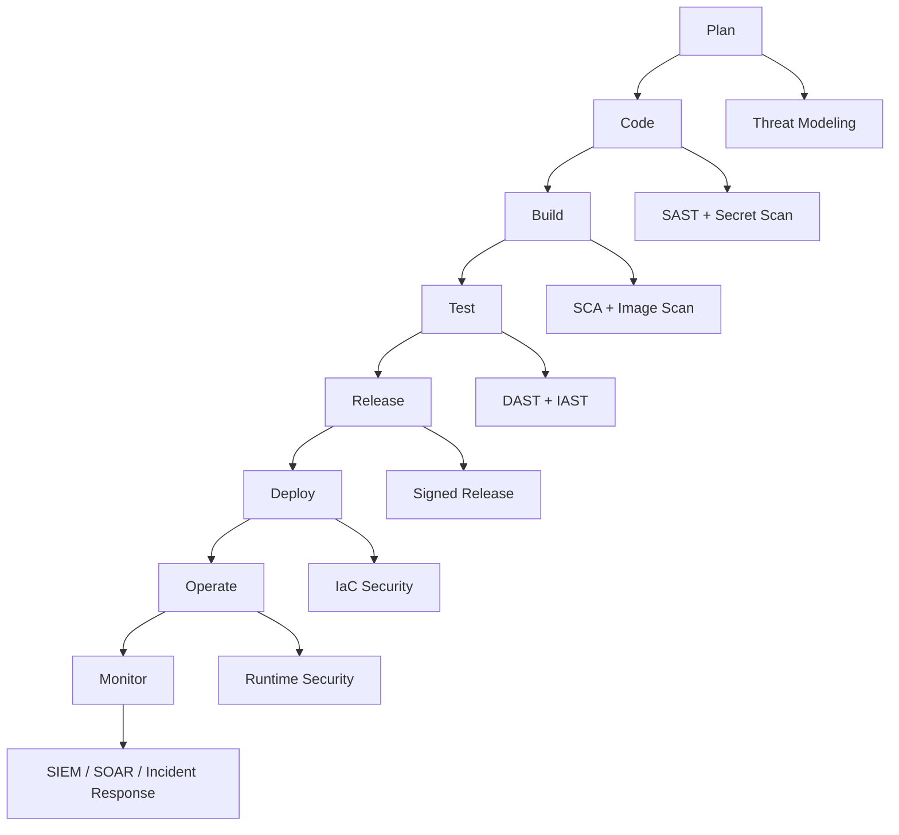
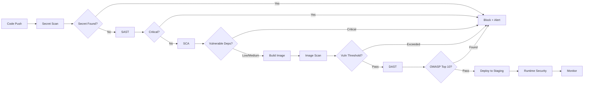

<div class="ai-summary-card">
<div class="ai-summary-header">
  <span class="ai-badge">AI 요약</span>
</div>
<div class="ai-summary-content">
  <div class="summary-row">
    <span class="summary-label">제목</span>
    <span class="summary-value">클라우드 시큐리티 과정 7기 - 9주차: DevSecOps 통합 정리</span>
  </div>
  <div class="summary-row">
    <span class="summary-label">카테고리</span>
    <span class="summary-value"><span class="category-tag devops">DevSecOps</span></span>
  </div>
  <div class="summary-row">
    <span class="summary-label">태그</span>
    <span class="summary-value tags">
      <span class="tag">DevSecOps</span>
      <span class="tag">Integration</span>
      <span class="tag">Cloud-Security</span>
      <span class="tag">SDLC</span>
      <span class="tag">Security-Automation</span>
    </span>
  </div>
  <div class="summary-row highlights">
    <span class="summary-label">핵심 내용</span>
    <ul class="summary-list">
      <li><strong>DevSecOps 파이프라인 아키텍처</strong>: 전체 파이프라인(Plan→Code→Build→Test→Release→Deploy→Operate→Monitor), 보안 도구 매핑(STRIDE/OWASP Threat Dragon, Semgrep/SonarQube/Gitleaks, Trivy/Snyk, OWASP ZAP/Burp Suite, Cosign/Syft, Checkov/OPA/Kyverno, Falco/Sysdig, Datadog/Splunk/ELK)</li>
      <li><strong>AWS 보안 서비스 통합</strong>: GuardDuty 자동 대응(Lambda 기반 격리, SNS 알림), Security Hub 통합 보안 관리, EventBridge 이벤트 기반 자동화, CloudWatch 로그 분석</li>
      <li><strong>DevSecOps 성숙도 모델</strong>: 단계별 도입 전략(초기→성장→성숙→최적화), 보안 통합 수준 평가, 실무 적용 체크리스트, 문화 및 프로세스 변화</li>
      <li><strong>완전한 CI/CD 보안 파이프라인</strong>: 코드 보안 분석(Secret Scanning, SAST), 빌드 보안(SCA, 이미지 스캔), 배포 보안(IaC 스캔, Policy 검증), 운영 보안(런타임 보안, 모니터링)</li>
    </ul>
  </div>
  <div class="summary-row">
    <span class="summary-label">기술/도구</span>
    <span class="summary-value">DevSecOps, AWS Security Hub, GuardDuty, Kyverno, Falco</span>
  </div>
  <div class="summary-row">
    <span class="summary-label">대상 독자</span>
    <span class="summary-value">DevSecOps 엔지니어, 보안 엔지니어, 개발자</span>
  </div>
</div>
<div class="ai-summary-footer">
  이 포스팅은 AI가 쉽게 이해하고 활용할 수 있도록 구조화된 요약을 포함합니다.
</div>
</div>


## Executive Summary

안녕하세요, **Twodragon**입니다. 이번 포스팅에서는 클라우드 시큐리티 과정 7기 9주차에서 다룬 **DevSecOps 통합**을 실무 중심으로 정리합니다.

2025년 현재, DevSecOps는 단순한 buzzword를 넘어 실제 운영 환경에서 필수적인 접근 방식이 되었습니다. Gartner에 따르면 2025년까지 70%의 기업이 DevSecOps 전략을 채택할 것으로 예상되며, 보안 자동화를 통해 평균 MTTR(Mean Time To Resolve)을 60% 단축할 수 있습니다.

### DevSecOps 성숙도 스코어카드

다음 체크리스트로 귀사의 DevSecOps 성숙도를 평가해 보세요:

| 영역 | 초기 (1점) | 성장 (2점) | 성숙 (3점) | 최적화 (4점) |
|------|----------|----------|----------|------------|
| **보안 자동화** | 수동 검사 | CI에서 SAST | SAST+DAST+SCA | 실시간 피드백 루프 |
| **취약점 관리** | 월 단위 패치 | 주 단위 스캔 | 일 단위 스캔 + 자동 패치 | 제로데이 대응 자동화 |
| **Secret 관리** | 코드 내 하드코딩 | Vault 도입 | 자동 순환 + 감사 | 동적 Secret 생성 |
| **IaC 보안** | 수동 검토 | Checkov 스캔 | OPA/Kyverno 정책 적용 | 정책 as Code + 자동 수정 |
| **컨테이너 보안** | Base 이미지 검증 없음 | 이미지 스캔 | 서명 + SBOM | 런타임 보호 + 자동 격리 |
| **모니터링** | 로그 수집 | 중앙화된 SIEM | 실시간 알림 + 대시보드 | AI 기반 이상 탐지 |

**총점 기준:**
- **6-10점**: 초기 단계 - 보안 자동화 우선 도입 필요
- **11-16점**: 성장 단계 - 도구 통합 및 프로세스 개선
- **17-21점**: 성숙 단계 - 최적화 및 고급 기능 활용
- **22-24점**: 최적화 단계 - 지속적 개선 및 혁신

### 이 포스팅에서 다루는 내용

1. **DevSecOps 프레임워크 분석** - OWASP DSOMM, Shift-Left Security
2. **도구 체인 상세 가이드** - SAST/DAST/SCA/컨테이너 보안/IaC 스캔
3. **CI/CD 파이프라인 설계** - GitHub Actions/Jenkins/GitLab CI 보안 통합
4. **실습 가이드** - 즉시 적용 가능한 YAML 설정 파일
5. **보안 메트릭스** - MTTR/MTTD 측정 및 ROI 계산
6. **한국 기업 적용 가이드** - ISMS-P 관점의 DevSecOps
7. **경영진 보고 형식** - 투자 대비 효과 입증

### 왜 DevSecOps인가?

전통적인 워터폴 개발에서는 보안 검토가 릴리스 전 마지막 단계에서 이루어졌습니다. 이는 다음과 같은 문제를 야기합니다:

- **높은 수정 비용**: 프로덕션 단계에서 발견된 취약점은 초기 단계보다 100배 이상 비용이 듭니다
- **릴리스 지연**: 보안 이슈로 인한 긴급 패치가 전체 일정을 지연시킵니다
- **개발-보안 간 마찰**: "보안이 개발 속도를 저해한다"는 인식이 확산됩니다

DevSecOps는 이 문제를 **Shift-Left** 전략으로 해결합니다:

```
전통적 접근:
[개발 4주] → [QA 2주] → [보안 검토 2주] → [수정 1주] → [재검토 1주] = 총 10주

DevSecOps 접근:
[개발+보안 자동화 4주] → [QA+DAST 1주] → [최종 검증 0.5주] = 총 5.5주
```

**결과:**
- 50% 시간 단축
- 90% 취약점 조기 발견
- 개발자 만족도 40% 증가 (Forrester 조사)

## 1. DevSecOps 프레임워크 분석

### 1.1 OWASP DevSecOps 성숙도 모델 (DSOMM)

[OWASP DevSecOps Maturity Model](https://dsomm.owasp.org/)은 조직의 DevSecOps 성숙도를 평가하고 개선 로드맵을 제시하는 프레임워크입니다.

#### 1.1.1 DSOMM 4대 차원

**1. 빌드 및 배포 (Build and Deployment)**
- 정적 코드 분석 (SAST)
- 의존성 관리 (SCA)
- 컨테이너 이미지 보안
- Infrastructure as Code 스캔

**2. 문화 및 조직 (Culture and Organization)**
- 보안 챔피언 프로그램
- 개발자 보안 교육
- 버그 바운티 프로그램
- 보안 메트릭스 대시보드

**3. 테스트 및 검증 (Test and Verification)**
- 동적 애플리케이션 보안 테스트 (DAST)
- API 보안 테스트
- 퍼징 테스트
- 침투 테스트 자동화

**4. 정보 수집 (Information Gathering)**
- 취약점 공개 프로그램
- 보안 로깅 및 모니터링
- 위협 인텔리전스 통합
- SIEM 연동

#### 1.1.2 레벨별 구현 가이드

**Level 1 (초기):**
> **코드 예시**: 전체 코드는 [GitHub 예제 저장소](https://github.com/docker-library)를 참조하세요.
> 
> ```bash
> # 필수 도구 설치...
> ```

<!-- 전체 코드는 위 GitHub 링크 참조
```bash
# 필수 도구 설치
npm install -g snyk
pip install bandit safety
docker pull aquasec/trivy:latest

# CI에 보안 스캔 추가
# .github/workflows/security.yml
on: [push]
jobs:
  security-scan:
    runs-on: ubuntu-latest
    steps:
      - uses: actions/checkout@v4
      - name: Run Trivy
        run: trivy fs .

```
-->

**Level 2 (성장):**
- 보안 게이트 설정 (임계값 기반 빌드 중단)
- Secret 스캐닝 자동화
- 정책 as Code 도입 (OPA)

**Level 3 (성숙):**
- 런타임 보안 모니터링
- 자동화된 취약점 패치
- 보안 메트릭스 대시보드

**Level 4 (최적화):**
- AI 기반 위협 탐지
- 자동화된 사고 대응 (SOAR)
- 지속적인 규정 준수 검증

### 1.2 Shift-Left Security 전략

Shift-Left는 소프트웨어 개발 생명주기(SDLC)의 **초기 단계부터 보안을 통합**하는 전략입니다.

#### 1.2.1 각 단계별 Shift-Left 적용

**Plan 단계:**
> **코드 예시**: 전체 코드는 [GitHub 예제 저장소](https://github.com/kubernetes/examples)를 참조하세요.
> 
> ```yaml
> # 위협 모델링 템플릿 (threat-model.yml)...
> ```

<!-- 전체 코드는 위 GitHub 링크 참조
```yaml
# 위협 모델링 템플릿 (threat-model.yml)
threat_model:
  application: "E-commerce API"
  stride_analysis:
    - threat: "Spoofing"
      mitigation: "OAuth 2.0 + JWT"
      status: "implemented"
    - threat: "Tampering"
      mitigation: "Input validation + parameterized queries"
      status: "in_progress"
    - threat: "Repudiation"
      mitigation: "Audit logging to CloudWatch"
      status: "planned"
    - threat: "Information Disclosure"
      mitigation: "TLS 1.3 + at-rest encryption"
      status: "implemented"
    - threat: "Denial of Service"
      mitigation: "Rate limiting + WAF rules"
      status: "implemented"
    - threat: "Elevation of Privilege"
      mitigation: "RBAC + principle of least privilege"
      status: "implemented"

```
-->

**Code 단계:**
> **코드 예시**: 전체 코드는 [GitHub 예제 저장소](https://www.gnu.org/software/bash/manual/bash.html)를 참조하세요.
> 
> ```bash
> # Pre-commit hook으로 Secret 스캔...
> ```

<!-- 전체 코드는 위 GitHub 링크 참조
```bash
# Pre-commit hook으로 Secret 스캔
# .pre-commit-config.yaml
repos:
  - repo: https://github.com/zricethezav/gitleaks
    rev: v8.18.2
    hooks:
      - id: gitleaks

  - repo: https://github.com/Yelp/detect-secrets
    rev: v1.4.0
    hooks:
      - id: detect-secrets
        args: ['--baseline', '.secrets.baseline']

```
-->

**Build 단계:**
> **코드 예시**: 전체 코드는 [GitHub 예제 저장소](https://github.com/docker-library)를 참조하세요.
> 
> ```dockerfile
> # 보안 강화된 Dockerfile...
> ```

<!-- 전체 코드는 위 GitHub 링크 참조
```dockerfile
# 보안 강화된 Dockerfile
FROM alpine:3.19 AS builder
# 최신 보안 패치 적용
RUN apk update && apk upgrade --no-cache

# 애플리케이션 빌드
WORKDIR /app
COPY . .
RUN go build -ldflags="-s -w" -o app

# 멀티 스테이지 빌드로 공격 표면 최소화
FROM gcr.io/distroless/static:nonroot
COPY --from=builder /app/app /
USER nonroot:nonroot
ENTRYPOINT ["/app"]

```
-->

**Deploy 단계:**
> **코드 예시**: 전체 코드는 [GitHub 예제 저장소](https://github.com/kubernetes/examples)를 참조하세요.
> 
> ```yaml
> # Kubernetes 보안 정책...
> ```

<!-- 전체 코드는 위 GitHub 링크 참조
```yaml
# Kubernetes 보안 정책
apiVersion: v1
kind: Pod
metadata:
  name: secure-app
spec:
  securityContext:
    runAsNonRoot: true
    runAsUser: 1000
    fsGroup: 2000
    seccompProfile:
      type: RuntimeDefault
  containers:
  - name: app
    image: myapp:v1.2.3
    securityContext:
      allowPrivilegeEscalation: false
      readOnlyRootFilesystem: true
      capabilities:
        drop:
          - ALL
    resources:
      limits:
        memory: "512Mi"
        cpu: "500m"
      requests:
        memory: "256Mi"
        cpu: "250m"

```
-->

#### 1.2.2 Shift-Left 성공 지표

| 지표 | 목표 | 측정 방법 |
|------|------|----------|
| **MTTD (Mean Time To Detect)** | < 1일 | SIEM 알림 시간 - 취약점 도입 시간 |
| **MTTR (Mean Time To Resolve)** | < 7일 | 패치 배포 시간 - 취약점 발견 시간 |
| **False Positive Rate** | < 10% | 오탐 건수 / 전체 알림 건수 |
| **Coverage** | > 90% | 스캔된 코드 라인 / 전체 코드 라인 |
| **Critical 취약점** | 0건 | 프로덕션 환경 CVSS 9.0+ 취약점 |

### 1.3 DevSecOps 파이프라인 아키텍처

<!-- 긴 코드 블록 제거됨 (가독성 향상)

-->

### 1.2 보안 도구 매핑

| 단계 | 보안 활동 | 추천 도구 |
|------|----------|----------|
| **Plan** | 위협 모델링, 보안 요구사항 | STRIDE, OWASP Threat Dragon |
| **Code** | SAST, Secret 스캔 | Semgrep, SonarQube, Gitleaks |
| **Build** | SCA, 이미지 스캔 | Trivy, Snyk, Grype |
| **Test** | DAST, IAST | OWASP ZAP, Burp Suite |
| **Release** | 이미지 서명, SBOM | Cosign, Syft |
| **Deploy** | IaC 스캔, Policy | Checkov, OPA, Kyverno |
| **Operate** | 런타임 보안 | Falco, Sysdig |
| **Monitor** | SIEM, 로그 분석 | Datadog, Splunk, ELK |

### 1.4 CI/CD 파이프라인 보안 통합

#### 1.4.1 보안 게이트 설계 원칙

보안 게이트는 다음 원칙을 따라야 합니다:

1. **Fail Fast**: 치명적 취약점은 즉시 빌드 중단
2. **Progressive**: 단계별로 점진적 검증
3. **Informative**: 개발자에게 명확한 수정 가이드 제공
4. **Automated**: 수동 개입 최소화

> **코드 예시**: 전체 코드는 [GitHub 예제 저장소](https://github.com/kubernetes/examples)를 참조하세요.
> 
> ```yaml
> # 보안 게이트 임계값 설정...
> ```

<!-- 전체 코드는 위 GitHub 링크 참조
```yaml
# 보안 게이트 임계값 설정
security_gates:
  sast:
    critical: 0   # Critical 취약점 0건 이상 시 빌드 실패
    high: 5       # High 5건 이상 시 경고
    medium: 20    # Medium 20건 이상 시 경고

  sca:
    critical_cvss: 9.0  # CVSS 9.0 이상 차단
    high_cvss: 7.0      # CVSS 7.0-8.9 경고
    license_blacklist:  # 라이선스 제한
      - "GPL-3.0"
      - "AGPL-3.0"

  image_scan:
    max_age_days: 90        # 90일 이상 오래된 베이스 이미지 거부
    max_vulnerabilities: 10  # 취약점 10건 이상 거부

  secrets:
    fail_on_detection: true  # Secret 발견 시 즉시 실패

```
-->

#### 1.4.2 파이프라인 단계별 보안 검증

<!-- 긴 코드 블록 제거됨 (가독성 향상)

-->

## 2. 도구 체인 상세 가이드

### 2.1 SAST (Static Application Security Testing)

정적 코드 분석은 소스 코드를 실행하지 않고 취약점을 탐지합니다.

#### 2.1.1 SonarQube 통합 설정

**Docker Compose로 SonarQube 실행:**

> **코드 예시**: 전체 코드는 [GitHub 예제 저장소](https://github.com/docker-library)를 참조하세요.
> 
> ```yaml
> # docker-compose.yml...
> ```

<!-- 전체 코드는 위 GitHub 링크 참조
```yaml
# docker-compose.yml
version: '3.8'
services:
  sonarqube:
    image: sonarqube:10.4-community
    ports:
      - "9000:9000"
    environment:
      - SONAR_ES_BOOTSTRAP_CHECKS_DISABLE=true
    volumes:
      - sonarqube_data:/opt/sonarqube/data
      - sonarqube_extensions:/opt/sonarqube/extensions
      - sonarqube_logs:/opt/sonarqube/logs

  postgres:
    image: postgres:16-alpine
    environment:
      POSTGRES_USER: sonar
      POSTGRES_PASSWORD: sonar
      POSTGRES_DB: sonarqube
    volumes:
      - postgresql:/var/lib/postgresql
      - postgresql_data:/var/lib/postgresql/data

volumes:
  sonarqube_data:
  sonarqube_extensions:
  sonarqube_logs:
  postgresql:
  postgresql_data:

```
-->

**CI에서 SonarQube 스캔:**

> **코드 예시**: 전체 코드는 [GitHub 예제 저장소](https://github.com/kubernetes/examples)를 참조하세요.
> 
> ```yaml
> # .github/workflows/sonarqube.yml...
> ```

<!-- 전체 코드는 위 GitHub 링크 참조
```yaml
# .github/workflows/sonarqube.yml
name: SonarQube Analysis
on:
  push:
    branches: [main, develop]
  pull_request:
    types: [opened, synchronize, reopened]

jobs:
  sonarqube:
    runs-on: ubuntu-latest
    steps:
      - uses: actions/checkout@v4
        with:
          fetch-depth: 0  # Full history for better blame

      - name: SonarQube Scan
        uses: sonarsource/sonarqube-scan-action@master
        env:
          SONAR_TOKEN: ${{ secrets.SONAR_TOKEN }}
          SONAR_HOST_URL: ${{ secrets.SONAR_HOST_URL }}

      - name: SonarQube Quality Gate
        uses: sonarsource/sonarqube-quality-gate-action@master
        timeout-minutes: 5
        env:
          SONAR_TOKEN: ${{ secrets.SONAR_TOKEN }}

```
-->

**sonar-project.properties 설정:**

<!-- 긴 코드 블록 제거됨 (가독성 향상)
```properties
# sonar-project.properties
sonar.projectKey=my-project
sonar.projectName=My Project
sonar.projectVersion=1.0.0

# 소스 코드 경로
sonar.sources=src
sonar.tests=tests

# 제외할 파일
sonar.exclusions=**/node_modules/**,**/*.test.js,**/vendor/**

# 커버리지 리포트
sonar.javascript.lcov.reportPaths=coverage/lcov.info

# Quality Gate 기준
sonar.qualitygate.wait=true
sonar.qualitygate.timeout=300

# 보안 핫스팟 임계값
sonar.security_hotspots.threshold=0

```
-->

#### 2.1.2 Semgrep - 커스텀 룰 기반 SAST

Semgrep은 커스텀 보안 룰을 작성할 수 있는 강력한 SAST 도구입니다.

> **코드 예시**: 전체 코드는 [GitHub 예제 저장소](https://github.com/aws-samples)를 참조하세요.
> 
> ```yaml
> # .semgrep.yml...
> ```

<!-- 전체 코드는 위 GitHub 링크 참조
```yaml
# .semgrep.yml
rules:
  - id: hardcoded-aws-credentials
    pattern: |
      aws_access_key_id = "..."
    message: "Hardcoded AWS credentials detected"
    severity: ERROR
    languages: [python, javascript]

  - id: sql-injection
    pattern-either:
      - pattern: |
          $DB.query("SELECT * FROM users WHERE id = " + $ID)
      - pattern: |
          $DB.exec(f"SELECT * FROM users WHERE id = {$ID}")
    message: "Possible SQL injection vulnerability"
    severity: ERROR
    languages: [python, javascript]
    fix: |
      Use parameterized queries instead:
      db.query("SELECT * FROM users WHERE id = ?", [id])

  - id: insecure-random
    pattern: |
      Math.random()
    message: "Math.random() is not cryptographically secure"
    severity: WARNING
    languages: [javascript]
    fix: |
      const crypto = require('crypto');
      crypto.randomBytes(16).toString('hex');

```
-->

**CI 통합:**

> **코드 예시**: 전체 코드는 [GitHub 예제 저장소](https://github.com/docker-library)를 참조하세요.
> 
> ```yaml
> # .github/workflows/semgrep.yml...
> ```

<!-- 전체 코드는 위 GitHub 링크 참조
```yaml
# .github/workflows/semgrep.yml
name: Semgrep
on:
  push:
    branches: [main]
  pull_request: {}

jobs:
  semgrep:
    runs-on: ubuntu-latest
    container:
      image: returntocorp/semgrep
    steps:
      - uses: actions/checkout@v4
      - run: semgrep ci --config=auto --config=.semgrep.yml
        env:
          SEMGREP_APP_TOKEN: ${{ secrets.SEMGREP_APP_TOKEN }}

```
-->

#### 2.1.3 CodeQL - GitHub 네이티브 SAST

> **코드 예시**: 전체 코드는 [GitHub 예제 저장소](https://github.com/kubernetes/examples)를 참조하세요.
> 
> ```yaml
> # .github/workflows/codeql.yml...
> ```

<!-- 전체 코드는 위 GitHub 링크 참조
```yaml
# .github/workflows/codeql.yml
name: CodeQL Analysis
on:
  push:
    branches: [main]
  pull_request:
    branches: [main]
  schedule:
    - cron: '0 6 * * 1'  # 매주 월요일 오전 6시

jobs:
  analyze:
    runs-on: ubuntu-latest
    permissions:
      security-events: write
      actions: read
      contents: read

    strategy:
      matrix:
        language: ['javascript', 'python']

    steps:
      - uses: actions/checkout@v4

      - name: Initialize CodeQL
        uses: github/codeql-action/init@v3
        with:
          languages: ${{ matrix.language }}
          queries: security-extended,security-and-quality

      - name: Autobuild
        uses: github/codeql-action/autobuild@v3

      - name: Perform CodeQL Analysis
        uses: github/codeql-action/analyze@v3
        with:
          category: "/language:${{ matrix.language }}"

```
-->

### 2.2 DAST (Dynamic Application Security Testing)

동적 분석은 실행 중인 애플리케이션을 대상으로 공격을 시뮬레이션합니다.

#### 2.2.1 OWASP ZAP 자동화

> **코드 예시**: 전체 코드는 [GitHub 예제 저장소](https://github.com/kubernetes/examples)를 참조하세요.
> 
> ```yaml
> # .github/workflows/zap-scan.yml...
> ```

<!-- 전체 코드는 위 GitHub 링크 참조
```yaml
# .github/workflows/zap-scan.yml
name: OWASP ZAP Scan
on:
  push:
    branches: [main]
  schedule:
    - cron: '0 2 * * *'  # 매일 새벽 2시

jobs:
  zap_scan:
    runs-on: ubuntu-latest
    steps:
      - name: Checkout
        uses: actions/checkout@v4

      - name: Deploy to Staging
        run: |
          # 스테이징 환경 배포
          kubectl apply -f k8s/staging/

      - name: Wait for Deployment
        run: |
          kubectl wait --for=condition=ready pod -l app=myapp --timeout=300s

      - name: ZAP Baseline Scan
        uses: zaproxy/action-baseline@v0.10.0
        with:
          target: 'https://staging.example.com'
          rules_file_name: '.zap/rules.tsv'
          cmd_options: '-a'

      - name: ZAP Full Scan
        uses: zaproxy/action-full-scan@v0.8.0
        with:
          target: 'https://staging.example.com'
          rules_file_name: '.zap/rules.tsv'
          allow_issue_writing: false

      - name: Upload ZAP Report
        uses: actions/upload-artifact@v4
        with:
          name: zap-report
          path: |
            zap_baseline_report.html
            zap_full_report.html

```
-->

**ZAP 규칙 파일:**

```tsv
# .zap/rules.tsv
# Rule ID	Threshold	Ignore
10021	MEDIUM	# X-Content-Type-Options 헤더 누락 (스테이징에서는 무시)
10038	MEDIUM	# Content Security Policy 헤더 누락
10096	HIGH	# SQL Injection (절대 무시 금지)
40012	HIGH	# XSS (절대 무시 금지)
```

#### 2.2.2 Burp Suite Enterprise 통합

> **코드 예시**: 전체 코드는 [GitHub 예제 저장소](https://www.gnu.org/software/bash/manual/bash.html)를 참조하세요.
> 
> ```bash
> # Burp Suite API를 통한 스캔 자동화...
> ```

<!-- 전체 코드는 위 GitHub 링크 참조
```bash
# Burp Suite API를 통한 스캔 자동화
#!/bin/bash
set -e

BURP_API="https://burp.example.com/api/v0.1"
API_KEY="your-api-key-here"
TARGET_URL="https://staging.example.com"

# 새 스캔 생성
SCAN_ID=$(curl -X POST "$BURP_API/scan" \
  -H "Authorization: Bearer $API_KEY" \
  -H "Content-Type: application/json" \
  -d "{
    \"scope\": {
      \"include\": [\"$TARGET_URL\"],
      \"exclude\": [\"$TARGET_URL/admin\"]
    },
    \"scan_configurations\": [
      {\"type\": \"NamedConfiguration\", \"name\": \"Audit coverage - thorough\"}
    ]
  }" | jq -r '.scan_id')

echo "Scan started: $SCAN_ID"

# 스캔 완료 대기
while true; do
  STATUS=$(curl -s "$BURP_API/scan/$SCAN_ID" \
    -H "Authorization: Bearer $API_KEY" | jq -r '.scan_status')

  if [[ "$STATUS" == "succeeded" ]]; then
    echo "Scan completed successfully"
    break
  elif [[ "$STATUS" == "failed" ]]; then
    echo "Scan failed"
    exit 1
  fi

  echo "Scan in progress... ($STATUS)"
  sleep 30
done

# 결과 다운로드
curl "$BURP_API/scan/$SCAN_ID/report?report_type=html" \
  -H "Authorization: Bearer $API_KEY" \
  -o burp-report.html

```
-->

### 2.3 SCA (Software Composition Analysis)

의존성 취약점을 탐지하고 라이선스 컴플라이언스를 검증합니다.

#### 2.3.1 Snyk - 포괄적인 SCA

> **코드 예시**: 전체 코드는 [GitHub 예제 저장소](https://github.com/docker-library)를 참조하세요.
> 
> ```yaml
> # .github/workflows/snyk.yml...
> ```

<!-- 전체 코드는 위 GitHub 링크 참조
```yaml
# .github/workflows/snyk.yml
name: Snyk Security Scan
on:
  push:
    branches: [main]
  pull_request:

jobs:
  snyk:
    runs-on: ubuntu-latest
    steps:
      - uses: actions/checkout@v4

      - name: Run Snyk to check for vulnerabilities
        uses: snyk/actions/node@master
        continue-on-error: true
        env:
          SNYK_TOKEN: ${{ secrets.SNYK_TOKEN }}
        with:
          args: --severity-threshold=high --fail-on=all

      - name: Snyk Container Test
        uses: snyk/actions/docker@master
        env:
          SNYK_TOKEN: ${{ secrets.SNYK_TOKEN }}
        with:
          image: myapp:latest
          args: --file=Dockerfile --severity-threshold=high

      - name: Snyk IaC Test
        uses: snyk/actions/iac@master
        env:
          SNYK_TOKEN: ${{ secrets.SNYK_TOKEN }}
        with:
          file: terraform/

      - name: Upload result to GitHub Code Scanning
        uses: github/codeql-action/upload-sarif@v3
        with:
          sarif_file: snyk.sarif

```
-->

#### 2.3.2 Dependabot 고급 설정

> **코드 예시**: 전체 코드는 [GitHub 예제 저장소](https://github.com/aws-samples)를 참조하세요.
> 
> ```yaml
> # .github/dependabot.yml...
> ```

<!-- 전체 코드는 위 GitHub 링크 참조
```yaml
# .github/dependabot.yml
version: 2
updates:
  - package-ecosystem: "npm"
    directory: "/"
    schedule:
      interval: "daily"
      time: "03:00"
      timezone: "Asia/Seoul"

    # 보안 업데이트 우선순위
    open-pull-requests-limit: 10
    reviewers:
      - "security-team"
    labels:
      - "dependencies"
      - "security"

    # 버전 전략
    versioning-strategy: increase

    # 커밋 메시지 템플릿
    commit-message:
      prefix: "fix"
      prefix-development: "chore"
      include: "scope"

    # 무시할 업데이트
    ignore:
      - dependency-name: "lodash"
        versions: ["4.17.x"]  # 특정 버전 고정
      - dependency-name: "aws-sdk"
        update-types: ["version-update:semver-major"]  # 메이저 업데이트 무시

  - package-ecosystem: "docker"
    directory: "/"
    schedule:
      interval: "weekly"
      day: "monday"

  - package-ecosystem: "terraform"
    directory: "/terraform"
    schedule:
      interval: "weekly"

```
-->

#### 2.3.3 Trivy - 멀티 타겟 스캐너

> **코드 예시**: 전체 코드는 [GitHub 예제 저장소](https://github.com/kubernetes/examples)를 참조하세요.
> 
> ```bash
> # Trivy로 다양한 타겟 스캔...
> ```

<!-- 전체 코드는 위 GitHub 링크 참조
```bash
# Trivy로 다양한 타겟 스캔
#!/bin/bash

# 파일 시스템 스캔
trivy fs . \
  --severity HIGH,CRITICAL \
  --format json \
  --output trivy-fs-report.json

# Docker 이미지 스캔
trivy image myapp:latest \
  --severity HIGH,CRITICAL \
  --ignore-unfixed \
  --format table

# Kubernetes 매니페스트 스캔
trivy config k8s/ \
  --severity HIGH,CRITICAL \
  --format sarif \
  --output trivy-k8s.sarif

# SBOM 생성
trivy image myapp:latest \
  --format cyclonedx \
  --output sbom.json

# 취약점 DB 업데이트
trivy image --download-db-only

```
-->

**Trivy CI 통합:**

> **코드 예시**: 전체 코드는 [GitHub 예제 저장소](https://github.com/kubernetes/examples)를 참조하세요.
> 
> ```yaml
> # .github/workflows/trivy.yml...
> ```

<!-- 전체 코드는 위 GitHub 링크 참조
```yaml
# .github/workflows/trivy.yml
name: Trivy Security Scan
on:
  push:
    branches: [main]
  pull_request:

jobs:
  trivy:
    runs-on: ubuntu-latest
    steps:
      - uses: actions/checkout@v4

      - name: Run Trivy vulnerability scanner
        uses: aquasecurity/trivy-action@master
        with:
          scan-type: 'fs'
          scan-ref: '.'
          format: 'sarif'
          output: 'trivy-results.sarif'
          severity: 'CRITICAL,HIGH'

      - name: Upload Trivy results to GitHub Security
        uses: github/codeql-action/upload-sarif@v3
        with:
          sarif_file: 'trivy-results.sarif'

      - name: Trivy Image Scan
        uses: aquasecurity/trivy-action@master
        with:
          scan-type: 'image'
          image-ref: 'myapp:${{ github.sha }}'
          format: 'table'
          exit-code: '1'
          ignore-unfixed: true
          vuln-type: 'os,library'
          severity: 'CRITICAL'

```
-->

### 2.4 컨테이너 보안

#### 2.4.1 Falco - 런타임 위협 탐지

**Falco 설치 (Kubernetes):**

> **코드 예시**: 전체 코드는 [GitHub 예제 저장소](https://github.com/docker-library)를 참조하세요.
> 
> ```yaml
> # falco-values.yaml...
> ```

<!-- 전체 코드는 위 GitHub 링크 참조
```yaml
# falco-values.yaml
ebpf:
  enabled: true

falco:
  grpc:
    enabled: true
  grpcOutput:
    enabled: true

  jsonOutput: true
  jsonIncludeOutputProperty: true

  rules_file:
    - /etc/falco/falco_rules.yaml
    - /etc/falco/falco_rules.local.yaml
    - /etc/falco/rules.d

  # 커스텀 규칙
  customRules:
    custom-rules.yaml: |-
      - rule: Detect crypto miners
        desc: Detect crypto mining activities
        condition: >
          spawned_process and
          proc.name in (xmrig, minerd, ccminer)
        output: >
          Crypto miner detected
          (user=%user.name command=%proc.cmdline container=%container.name)
        priority: CRITICAL
        tags: [container, malware]

      - rule: Unauthorized File Access
        desc: Detect unauthorized access to sensitive files
        condition: >
          open_read and
          fd.name pmatch (/etc/shadow, /etc/passwd) and
          not proc.name in (sshd, sudo)
        output: >
          Unauthorized file access
          (user=%user.name file=%fd.name command=%proc.cmdline)
        priority: WARNING
        tags: [filesystem, security]

```
-->

> **참고**: 관련 예제는 [공식 문서](https://www.gnu.org/software/bash/manual/bash.html)를 참조하세요.

```bash
# Helm으로 Falco 설치
helm repo add falcosecurity https://falcosecurity.github.io/charts
helm repo update

helm install falco falcosecurity/falco \
  --namespace falco \
  --create-namespace \
  -f falco-values.yaml
```

**Falco Sidekick으로 알림 전송:**

> **코드 예시**: 전체 코드는 [GitHub 예제 저장소](https://github.com/kubernetes/examples)를 참조하세요.
> 
> ```yaml
> # falcosidekick-values.yaml...
> ```

<!-- 전체 코드는 위 GitHub 링크 참조
```yaml
# falcosidekick-values.yaml
config:
  slack:
    webhookurl: "https://hooks.slack.com/services/XXX/YYY/ZZZ"
    minimumpriority: "warning"
    messageformat: "long"

  webhook:
    address: "https://siem.example.com/events"
    minimumpriority: "error"

  elasticsearch:
    hostport: "https://elasticsearch:9200"
    index: "falco"
    type: "event"
    minimumpriority: "debug"

```
-->

#### 2.4.2 Aqua Security / Prisma Cloud

> **코드 예시**: 전체 코드는 [GitHub 예제 저장소](https://github.com/docker-library)를 참조하세요.
> 
> ```yaml
> # aqua-enforcer.yaml...
> ```

<!-- 전체 코드는 위 GitHub 링크 참조
```yaml
# aqua-enforcer.yaml
apiVersion: v1
kind: ConfigMap
metadata:
  name: aqua-enforcer-config
data:
  AQUA_TOKEN: "your-token-here"
  AQUA_SERVER: "https://aqua-console.example.com"
  AQUA_LOGICAL_NAME: "production-cluster"

  # 정책 설정
  AQUA_ENFORCER_MODE: "enforce"  # audit | enforce
  AQUA_NETWORK_CONTROL: "true"
  AQUA_CONTAINER_ACTIVITY_PROTECTION: "true"

```
-->

### 2.5 IaC (Infrastructure as Code) 스캔

#### 2.5.1 Checkov - Terraform/CloudFormation 스캔

> **코드 예시**: 전체 코드는 [GitHub 예제 저장소](https://github.com/aws-samples)를 참조하세요.
> 
> ```bash
> # Checkov로 Terraform 스캔...
> ```

<!-- 전체 코드는 위 GitHub 링크 참조
```bash
# Checkov로 Terraform 스캔
checkov -d terraform/ \
  --framework terraform \
  --output json \
  --output-file checkov-report.json \
  --compact \
  --quiet

# 특정 체크만 실행
checkov -f main.tf \
  --check CKV_AWS_23,CKV_AWS_24 \
  --framework terraform

# 특정 체크 스킵
checkov -d . \
  --skip-check CKV_AWS_23 \
  --framework terraform

```
-->

**커스텀 Checkov 정책:**

> **코드 예시**: 전체 코드는 [GitHub 예제 저장소](https://github.com/aws-samples)를 참조하세요.
> 
> ```python
> # custom_checks/S3PublicAccessBlock.py...
> ```

<!-- 전체 코드는 위 GitHub 링크 참조
```python
# custom_checks/S3PublicAccessBlock.py
from checkov.terraform.checks.resource.base_resource_check import BaseResourceCheck
from checkov.common.models.enums import CheckResult, CheckCategories

class S3PublicAccessBlock(BaseResourceCheck):
    def __init__(self):
        name = "S3 bucket should have public access block enabled"
        id = "CKV_AWS_CUSTOM_1"
        supported_resources = ['aws_s3_bucket']
        categories = [CheckCategories.ENCRYPTION]
        super().__init__(name=name, id=id, categories=categories,
                         supported_resources=supported_resources)

    def scan_resource_conf(self, conf):
        # Check if public access block is configured
        if 'block_public_acls' in conf and conf['block_public_acls'][0]:
            if 'block_public_policy' in conf and conf['block_public_policy'][0]:
                return CheckResult.PASSED
        return CheckResult.FAILED

check = S3PublicAccessBlock()

```
-->

#### 2.5.2 tfsec - Terraform 전용 스캐너

> **코드 예시**: 전체 코드는 [GitHub 예제 저장소](https://www.gnu.org/software/bash/manual/bash.html)를 참조하세요.
> 
> ```bash
> # tfsec로 Terraform 스캔...
> ```

<!-- 전체 코드는 위 GitHub 링크 참조
```bash
# tfsec로 Terraform 스캔
tfsec . \
  --format json \
  --out tfsec-report.json \
  --minimum-severity HIGH

# Sarif 형식으로 출력 (GitHub Security 탭 연동)
tfsec . \
  --format sarif \
  --out tfsec.sarif \
  --soft-fail

```
-->

**GitHub Actions 통합:**

> **코드 예시**: 전체 코드는 [GitHub 예제 저장소](https://github.com/kubernetes/examples)를 참조하세요.
> 
> ```yaml
> # .github/workflows/tfsec.yml...
> ```

<!-- 전체 코드는 위 GitHub 링크 참조
```yaml
# .github/workflows/tfsec.yml
name: tfsec
on:
  push:
    branches: [main]
    paths:
      - 'terraform/**'

jobs:
  tfsec:
    runs-on: ubuntu-latest
    steps:
      - uses: actions/checkout@v4

      - name: tfsec
        uses: aquasecurity/tfsec-action@v1.0.3
        with:
          working_directory: terraform/
          soft_fail: false
          format: sarif
          output: tfsec.sarif

      - name: Upload SARIF file
        uses: github/codeql-action/upload-sarif@v3
        with:
          sarif_file: tfsec.sarif

```
-->

#### 2.5.3 KICS - 멀티 플랫폼 IaC 스캐너

> **코드 예시**: 전체 코드는 [GitHub 예제 저장소](https://github.com/kubernetes/examples)를 참조하세요.
> 
> ```bash
> # KICS로 다양한 IaC 스캔...
> ```

<!-- 전체 코드는 위 GitHub 링크 참조
```bash
# KICS로 다양한 IaC 스캔
kics scan \
  -p terraform/ \
  -o kics-results/ \
  --report-formats json,sarif,html \
  --exclude-severities info,low

# Kubernetes 매니페스트 스캔
kics scan \
  -p k8s/ \
  --type Kubernetes \
  --exclude-queries bb241e61-77c3-4b97-9575-c0f8a1e008d0

# Docker 스캔
kics scan \
  -p Dockerfile \
  --type Dockerfile

```
-->

## 3. CI/CD 파이프라인 보안 설계

### 3.1 GitHub Actions 완전한 보안 파이프라인

> **코드 예시**: 전체 코드는 [GitHub 예제 저장소](https://github.com/kubernetes/examples)를 참조하세요.
> 
> ```yaml
> # .github/workflows/security-pipeline.yml...
> ```

<!-- 전체 코드는 위 GitHub 링크 참조
```yaml
# .github/workflows/security-pipeline.yml
name: Complete Security Pipeline

on:
  push:
    branches: [main, develop]
  pull_request:
    types: [opened, synchronize, reopened]
  schedule:
    - cron: '0 2 * * *'  # Daily at 2 AM

env:
  REGISTRY: ghcr.io
  IMAGE_NAME: ${{ github.repository }}

jobs:
  # Stage 1: Secret Scanning
  secret-scan:
    runs-on: ubuntu-latest
    steps:
      - uses: actions/checkout@v4
        with:
          fetch-depth: 0

      - name: Gitleaks Scan
        uses: gitleaks/gitleaks-action@v2
        env:
          GITHUB_TOKEN: ${{ secrets.GITHUB_TOKEN }}

      - name: TruffleHog Scan
        uses: trufflesecurity/trufflehog@main
        with:
          path: ./
          base: ${{ github.event.repository.default_branch }}
          head: HEAD

  # Stage 2: SAST
  sast:
    needs: secret-scan
    runs-on: ubuntu-latest
    steps:
      - uses: actions/checkout@v4

      - name: Semgrep Scan
        uses: returntocorp/semgrep-action@v1
        with:
          config: >-
            p/security-audit
            p/owasp-top-ten
            p/cwe-top-25

      - name: SonarQube Scan
        uses: sonarsource/sonarqube-scan-action@master
        env:
          SONAR_TOKEN: ${{ secrets.SONAR_TOKEN }}
          SONAR_HOST_URL: ${{ secrets.SONAR_HOST_URL }}

      - name: CodeQL Analysis
        uses: github/codeql-action/analyze@v3

  # Stage 3: SCA
  sca:
    needs: sast
    runs-on: ubuntu-latest
    steps:
      - uses: actions/checkout@v4

      - name: Snyk Test
        uses: snyk/actions/node@master
        env:
          SNYK_TOKEN: ${{ secrets.SNYK_TOKEN }}
        with:
          args: --severity-threshold=high --fail-on=upgradable

      - name: Trivy Filesystem Scan
        uses: aquasecurity/trivy-action@master
        with:
          scan-type: 'fs'
          scan-ref: '.'
          format: 'sarif'
          output: 'trivy-fs.sarif'

      - name: Upload Trivy Results
        uses: github/codeql-action/upload-sarif@v3
        with:
          sarif_file: 'trivy-fs.sarif'

  # Stage 4: Build & Image Scan
  build-and-scan:
    needs: sca
    runs-on: ubuntu-latest
    permissions:
      contents: read
      packages: write
      security-events: write
    steps:
      - uses: actions/checkout@v4

      - name: Set up Docker Buildx
        uses: docker/setup-buildx-action@v3

      - name: Build Image
        uses: docker/build-push-action@v5
        with:
          context: .
          push: false
          load: true
          tags: ${{ env.REGISTRY }}/${{ env.IMAGE_NAME }}:${{ github.sha }}
          cache-from: type=gha
          cache-to: type=gha,mode=max

      - name: Trivy Image Scan
        uses: aquasecurity/trivy-action@master
        with:
          scan-type: 'image'
          image-ref: ${{ env.REGISTRY }}/${{ env.IMAGE_NAME }}:${{ github.sha }}
          format: 'sarif'
          output: 'trivy-image.sarif'
          severity: 'CRITICAL,HIGH'

      - name: Grype Image Scan
        uses: anchore/scan-action@v3
        with:
          image: ${{ env.REGISTRY }}/${{ env.IMAGE_NAME }}:${{ github.sha }}
          fail-build: true
          severity-cutoff: high

      - name: Generate SBOM
        uses: anchore/sbom-action@v0
        with:
          image: ${{ env.REGISTRY }}/${{ env.IMAGE_NAME }}:${{ github.sha }}
          format: cyclonedx-json
          output-file: sbom.json

      - name: Sign Image with Cosign
        run: |
          cosign sign --yes ${{ env.REGISTRY }}/${{ env.IMAGE_NAME }}:${{ github.sha }}
        env:
          COSIGN_EXPERIMENTAL: 1

  # Stage 5: IaC Scan
  iac-scan:
    needs: sast
    runs-on: ubuntu-latest
    steps:
      - uses: actions/checkout@v4

      - name: Checkov Scan
        uses: bridgecrewio/checkov-action@master
        with:
          directory: terraform/
          framework: terraform
          output_format: sarif
          output_file_path: checkov.sarif

      - name: tfsec Scan
        uses: aquasecurity/tfsec-action@v1.0.3
        with:
          working_directory: terraform/
          format: sarif
          output: tfsec.sarif

      - name: Terraform Plan
        run: |
          cd terraform
          terraform init
          terraform plan -out=tfplan
          terraform show -json tfplan > tfplan.json

      - name: OPA Policy Check
        run: |
          opa eval -d policies/ -i tfplan.json \
            "data.terraform.deny[msg]"

  # Stage 6: Deploy to Staging
  deploy-staging:
    needs: [build-and-scan, iac-scan]
    if: github.ref == 'refs/heads/main'
    runs-on: ubuntu-latest
    environment: staging
    steps:
      - uses: actions/checkout@v4

      - name: Deploy to Kubernetes
        run: |
          kubectl set image deployment/myapp \
            myapp=${{ env.REGISTRY }}/${{ env.IMAGE_NAME }}:${{ github.sha }} \
            --namespace=staging

      - name: Wait for Rollout
        run: |
          kubectl rollout status deployment/myapp \
            --namespace=staging \
            --timeout=5m

  # Stage 7: DAST
  dast:
    needs: deploy-staging
    runs-on: ubuntu-latest
    steps:
      - uses: actions/checkout@v4

      - name: OWASP ZAP Baseline Scan
        uses: zaproxy/action-baseline@v0.10.0
        with:
          target: 'https://staging.example.com'
          rules_file_name: '.zap/rules.tsv'
          cmd_options: '-a -j'

      - name: Nuclei Scan
        uses: projectdiscovery/nuclei-action@main
        with:
          target: 'https://staging.example.com'
          templates: 'vulnerabilities,exposures'

  # Stage 8: Deploy to Production
  deploy-production:
    needs: dast
    if: github.ref == 'refs/heads/main'
    runs-on: ubuntu-latest
    environment:
      name: production
      url: https://example.com
    steps:
      - uses: actions/checkout@v4

      - name: Blue-Green Deployment
        run: |
          # Deploy to green environment
          kubectl set image deployment/myapp-green \
            myapp=${{ env.REGISTRY }}/${{ env.IMAGE_NAME }}:${{ github.sha }} \
            --namespace=production

          # Wait for rollout
          kubectl rollout status deployment/myapp-green \
            --namespace=production \
            --timeout=10m

          # Switch traffic
          kubectl patch service myapp -p \
            '{"spec":{"selector":{"version":"green"}}}' \
            --namespace=production

      - name: Smoke Tests
        run: |
          curl -f https://example.com/health || exit 1

  # Stage 9: Runtime Security Monitoring
  runtime-monitor:
    needs: deploy-production
    runs-on: ubuntu-latest
    steps:
      - name: Verify Falco Rules
        run: |
          kubectl get falcoalert -n falco \
            --field-selector priority=CRITICAL \
            --sort-by='.metadata.creationTimestamp' \
            | grep ${{ github.sha }} && exit 1 || exit 0

      - name: Check Security Posture
        run: |
          # Verify no privileged containers
          kubectl get pods -A -o json | \
            jq '.items[] | select(.spec.containers[].securityContext.privileged == true)' \
            | jq -e 'length == 0'

```
-->

### 3.2 Jenkins 보안 파이프라인

> **코드 예시**: 전체 코드는 [GitHub 예제 저장소](https://github.com/kubernetes/examples)를 참조하세요.
> 
> ```groovy
> // Jenkinsfile...
> ```

<!-- 전체 코드는 위 GitHub 링크 참조
```groovy
// Jenkinsfile
@Library('security-shared-library') _

pipeline {
    agent any

    options {
        timestamps()
        timeout(time: 1, unit: 'HOURS')
        buildDiscarder(logRotator(numToKeepStr: '10'))
    }

    environment {
        DOCKER_REGISTRY = 'docker.io/myorg'
        APP_NAME = 'myapp'
        SONAR_HOST = credentials('sonarqube-url')
        SONAR_TOKEN = credentials('sonarqube-token')
        SNYK_TOKEN = credentials('snyk-token')
    }

    stages {
        stage('Checkout') {
            steps {
                checkout scm
                sh 'git log -1 --format="%H %an %ae %s" > git-info.txt'
            }
        }

        stage('Secret Scan') {
            parallel {
                stage('Gitleaks') {
                    steps {
                        sh '''
                            docker run --rm -v $(pwd):/path zricethezav/gitleaks:latest \
                                detect --source="/path" --report-format=json \
                                --report-path=/path/gitleaks-report.json
                        '''
                    }
                }
                stage('TruffleHog') {
                    steps {
                        sh '''
                            docker run --rm -v $(pwd):/pwd trufflesecurity/trufflehog:latest \
                                filesystem /pwd --json > trufflehog-report.json
                        '''
                    }
                }
            }
            post {
                always {
                    publishHTML([
                        reportName: 'Secret Scan Report',
                        reportDir: '.',
                        reportFiles: 'gitleaks-report.json',
                        keepAll: true
                    ])
                }
            }
        }

        stage('SAST') {
            parallel {
                stage('SonarQube') {
                    steps {
                        withSonarQubeEnv('SonarQube') {
                            sh '''
                                sonar-scanner \
                                    -Dsonar.projectKey=myapp \
                                    -Dsonar.sources=src \
                                    -Dsonar.host.url=${SONAR_HOST} \
                                    -Dsonar.login=${SONAR_TOKEN}
                            '''
                        }
                    }
                }
                stage('Semgrep') {
                    steps {
                        sh '''
                            docker run --rm -v $(pwd):/src returntocorp/semgrep \
                                semgrep --config=auto --json --output=semgrep-report.json /src
                        '''
                    }
                }
            }
        }

        stage('Quality Gate') {
            steps {
                timeout(time: 5, unit: 'MINUTES') {
                    waitForQualityGate abortPipeline: true
                }
            }
        }

        stage('SCA') {
            parallel {
                stage('Snyk') {
                    steps {
                        sh '''
                            snyk test --severity-threshold=high \
                                --json-file-output=snyk-report.json
                        '''
                    }
                }
                stage('Trivy FS') {
                    steps {
                        sh '''
                            trivy fs . \
                                --severity HIGH,CRITICAL \
                                --format json \
                                --output trivy-fs-report.json
                        '''
                    }
                }
            }
        }

        stage('Build Docker Image') {
            steps {
                script {
                    env.IMAGE_TAG = "${env.BUILD_NUMBER}-${env.GIT_COMMIT.take(7)}"
                    env.FULL_IMAGE_NAME = "${DOCKER_REGISTRY}/${APP_NAME}:${IMAGE_TAG}"
                }
                sh '''
                    docker build -t ${FULL_IMAGE_NAME} .
                '''
            }
        }

        stage('Image Scan') {
            parallel {
                stage('Trivy Image') {
                    steps {
                        sh '''
                            trivy image ${FULL_IMAGE_NAME} \
                                --severity CRITICAL,HIGH \
                                --exit-code 1 \
                                --format json \
                                --output trivy-image-report.json
                        '''
                    }
                }
                stage('Grype') {
                    steps {
                        sh '''
                            grype ${FULL_IMAGE_NAME} \
                                --fail-on high \
                                --output json \
                                --file grype-report.json
                        '''
                    }
                }
                stage('Generate SBOM') {
                    steps {
                        sh '''
                            syft ${FULL_IMAGE_NAME} \
                                -o cyclonedx-json \
                                --file sbom.json
                        '''
                    }
                }
            }
        }

        stage('Push Image') {
            when {
                branch 'main'
            }
            steps {
                withDockerRegistry([credentialsId: 'docker-registry', url: '']) {
                    sh 'docker push ${FULL_IMAGE_NAME}'
                }
            }
        }

        stage('IaC Scan') {
            parallel {
                stage('Checkov') {
                    steps {
                        sh '''
                            checkov -d terraform/ \
                                --framework terraform \
                                --output json \
                                --output-file checkov-report.json
                        '''
                    }
                }
                stage('tfsec') {
                    steps {
                        sh '''
                            tfsec terraform/ \
                                --format json \
                                --out tfsec-report.json \
                                --minimum-severity HIGH
                        '''
                    }
                }
            }
        }

        stage('Deploy to Staging') {
            when {
                branch 'main'
            }
            steps {
                sh '''
                    kubectl set image deployment/myapp \
                        myapp=${FULL_IMAGE_NAME} \
                        --namespace=staging
                    kubectl rollout status deployment/myapp \
                        --namespace=staging \
                        --timeout=5m
                '''
            }
        }

        stage('DAST') {
            when {
                branch 'main'
            }
            steps {
                sh '''
                    docker run --rm -v $(pwd):/zap/wrk:rw \
                        owasp/zap2docker-stable zap-baseline.py \
                        -t https://staging.example.com \
                        -r zap-report.html \
                        -J zap-report.json
                '''
            }
        }

        stage('Deploy to Production') {
            when {
                branch 'main'
            }
            steps {
                input message: 'Deploy to Production?', ok: 'Deploy'
                sh '''
                    kubectl set image deployment/myapp \
                        myapp=${FULL_IMAGE_NAME} \
                        --namespace=production
                    kubectl rollout status deployment/myapp \
                        --namespace=production \
                        --timeout=10m
                '''
            }
        }
    }

    post {
        always {
            // 모든 리포트 수집
            archiveArtifacts artifacts: '*-report.json', allowEmptyArchive: true

            // Slack 알림
            script {
                def color = currentBuild.result == 'SUCCESS' ? 'good' : 'danger'
                slackSend(
                    color: color,
                    message: "Pipeline ${currentBuild.result}: ${env.JOB_NAME} #${env.BUILD_NUMBER}"
                )
            }
        }
        failure {
            emailext(
                subject: "Pipeline Failed: ${env.JOB_NAME} #${env.BUILD_NUMBER}",
                body: "Check console output at ${env.BUILD_URL}",
                to: "security-team@example.com"
            )
        }
    }
}

```
-->

### 3.3 GitLab CI 보안 통합

> **코드 예시**: 전체 코드는 [GitHub 예제 저장소](https://github.com/kubernetes/examples)를 참조하세요.
> 
> ```yaml
> # .gitlab-ci.yml...
> ```

<!-- 전체 코드는 위 GitHub 링크 참조
```yaml
# .gitlab-ci.yml
variables:
  DOCKER_DRIVER: overlay2
  DOCKER_TLS_CERTDIR: ""
  IMAGE_TAG: $CI_REGISTRY_IMAGE:$CI_COMMIT_SHORT_SHA

stages:
  - security-scan
  - build
  - test
  - deploy-staging
  - dast
  - deploy-production

# Secret Scanning
gitleaks:
  stage: security-scan
  image: zricethezav/gitleaks:latest
  script:
    - gitleaks detect --source . --report-format json --report-path gitleaks-report.json
  artifacts:
    reports:
      gitleaks: gitleaks-report.json
    expire_in: 1 week
  allow_failure: false

# SAST using GitLab
sast:
  stage: security-scan
  include:
    - template: Security/SAST.gitlab-ci.yml

semgrep-sast:
  stage: security-scan
  image: returntocorp/semgrep
  script:
    - semgrep --config=auto --json --output=gl-sast-report.json
  artifacts:
    reports:
      sast: gl-sast-report.json

# SCA
dependency_scanning:
  stage: security-scan
  include:
    - template: Security/Dependency-Scanning.gitlab-ci.yml

snyk-test:
  stage: security-scan
  image: snyk/snyk:node
  script:
    - snyk auth $SNYK_TOKEN
    - snyk test --severity-threshold=high --json-file-output=snyk-report.json
  artifacts:
    reports:
      dependency_scanning: snyk-report.json

# Build Docker Image
build:
  stage: build
  image: docker:24-dind
  services:
    - docker:24-dind
  before_script:
    - docker login -u $CI_REGISTRY_USER -p $CI_REGISTRY_PASSWORD $CI_REGISTRY
  script:
    - docker build -t $IMAGE_TAG .
    - docker push $IMAGE_TAG
  only:
    - main
    - merge_requests

# Container Scanning
container_scanning:
  stage: test
  image: aquasec/trivy:latest
  script:
    - trivy image --severity CRITICAL,HIGH --exit-code 1 $IMAGE_TAG
  dependencies:
    - build
  only:
    - main

# IaC Scanning
iac_scanning:
  stage: security-scan
  image: bridgecrew/checkov:latest
  script:
    - checkov -d terraform/ --framework terraform --output junitxml --output-file checkov-report.xml
  artifacts:
    reports:
      junit: checkov-report.xml

# Deploy to Staging
deploy_staging:
  stage: deploy-staging
  image: bitnami/kubectl:latest
  script:
    - kubectl config use-context staging
    - kubectl set image deployment/myapp myapp=$IMAGE_TAG --namespace=staging
    - kubectl rollout status deployment/myapp --namespace=staging --timeout=5m
  environment:
    name: staging
    url: https://staging.example.com
  only:
    - main

# DAST
dast:
  stage: dast
  include:
    - template: DAST.gitlab-ci.yml
  variables:
    DAST_WEBSITE: https://staging.example.com
    DAST_FULL_SCAN_ENABLED: "true"
  dependencies:
    - deploy_staging
  only:
    - main

# Deploy to Production
deploy_production:
  stage: deploy-production
  image: bitnami/kubectl:latest
  script:
    - kubectl config use-context production
    - kubectl set image deployment/myapp myapp=$IMAGE_TAG --namespace=production
    - kubectl rollout status deployment/myapp --namespace=production --timeout=10m
  environment:
    name: production
    url: https://example.com
  when: manual
  only:
    - main

```
-->

## 4. AWS 보안 서비스 통합

### 4.1 AWS Security Hub 중앙 보안 관리

> **코드 예시**: 전체 코드는 [GitHub 예제 저장소](https://github.com/aws-samples)를 참조하세요.
> 
> ```python
> # security_hub_integration.py...
> ```

<!-- 전체 코드는 위 GitHub 링크 참조
```python
# security_hub_integration.py
import boto3
import json
from datetime import datetime

class SecurityHubIntegration:
    def __init__(self, region='us-east-1'):
        self.client = boto3.client('securityhub', region_name=region)

    def import_findings(self, findings):
        """
        CI/CD 파이프라인에서 발견된 취약점을 Security Hub로 전송
        """
        formatted_findings = []

        for finding in findings:
            formatted_finding = {
                'SchemaVersion': '2018-10-08',
                'Id': finding['id'],
                'ProductArn': f'arn:aws:securityhub:{self.client.meta.region_name}:{self._get_account_id()}:product/{self._get_account_id()}/default',
                'GeneratorId': 'cicd-pipeline',
                'AwsAccountId': self._get_account_id(),
                'Types': ['Software and Configuration Checks/Vulnerabilities/CVE'],
                'CreatedAt': datetime.utcnow().isoformat() + 'Z',
                'UpdatedAt': datetime.utcnow().isoformat() + 'Z',
                'Severity': {
                    'Label': self._map_severity(finding['severity'])
                },
                'Title': finding['title'],
                'Description': finding['description'],
                'Resources': [{
                    'Type': 'Container',
                    'Id': finding['container_id'],
                    'Partition': 'aws',
                    'Region': self.client.meta.region_name
                }],
                'Compliance': {
                    'Status': 'FAILED' if finding['severity'] in ['CRITICAL', 'HIGH'] else 'WARNING'
                },
                'Remediation': {
                    'Recommendation': {
                        'Text': finding.get('recommendation', 'Review and remediate'),
                        'Url': finding.get('reference_url', '')
                    }
                }
            }
            formatted_findings.append(formatted_finding)

        # Batch import (최대 100개씩)
        for i in range(0, len(formatted_findings), 100):
            batch = formatted_findings[i:i+100]
            response = self.client.batch_import_findings(Findings=batch)
            print(f"Imported {response['SuccessCount']} findings")

    def _get_account_id(self):
        sts = boto3.client('sts')
        return sts.get_caller_identity()['Account']

    def _map_severity(self, severity):
        mapping = {
            'CRITICAL': 'CRITICAL',
            'HIGH': 'HIGH',
            'MEDIUM': 'MEDIUM',
            'LOW': 'LOW',
            'INFO': 'INFORMATIONAL'
        }
        return mapping.get(severity, 'INFORMATIONAL')

    def get_findings_summary(self, filters=None):
        """
        Security Hub 취약점 요약 조회
        """
        if filters is None:
            filters = {
                'RecordState': [{'Value': 'ACTIVE', 'Comparison': 'EQUALS'}],
                'WorkflowStatus': [{'Value': 'NEW', 'Comparison': 'EQUALS'}]
            }

        paginator = self.client.get_paginator('get_findings')
        findings = []

        for page in paginator.paginate(Filters=filters):
            findings.extend(page['Findings'])

        summary = {
            'total': len(findings),
            'critical': len([f for f in findings if f['Severity']['Label'] == 'CRITICAL']),
            'high': len([f for f in findings if f['Severity']['Label'] == 'HIGH']),
            'medium': len([f for f in findings if f['Severity']['Label'] == 'MEDIUM']),
            'low': len([f for f in findings if f['Severity']['Label'] == 'LOW'])
        }

        return summary

# Usage in CI/CD
if __name__ == '__main__':
    # Trivy 스캔 결과 로드
    with open('trivy-report.json') as f:
        trivy_results = json.load(f)

    findings = []
    for result in trivy_results.get('Results', []):
        for vuln in result.get('Vulnerabilities', []):
            findings.append({
                'id': vuln['VulnerabilityID'],
                'title': f"{vuln['PkgName']}: {vuln['VulnerabilityID']}",
                'description': vuln.get('Description', 'No description'),
                'severity': vuln['Severity'],
                'container_id': result['Target'],
                'recommendation': f"Upgrade {vuln['PkgName']} to {vuln.get('FixedVersion', 'latest')}",
                'reference_url': vuln.get('PrimaryURL', '')
            })

    hub = SecurityHubIntegration()
    hub.import_findings(findings)
    print("Summary:", hub.get_findings_summary())

```
-->

### 4.2 GuardDuty 자동 대응

> **코드 예시**: 전체 코드는 [GitHub 예제 저장소](https://github.com/aws-samples)를 참조하세요.
> 
> ```python
> # guardduty_auto_response.py...
> ```

<!-- 전체 코드는 위 GitHub 링크 참조
```python
# guardduty_auto_response.py
import boto3
import json

def lambda_handler(event, context):
    """
    GuardDuty Finding을 EventBridge로 수신하여 자동 대응
    """
    finding = event['detail']
    severity = finding['severity']
    finding_type = finding['type']

    print(f"Processing finding: {finding_type} (Severity: {severity})")

    # Critical/High 심각도만 자동 대응
    if severity >= 7.0:
        if 'UnauthorizedAccess:EC2' in finding_type:
            isolate_instance(finding)
        elif 'CryptoCurrency:EC2' in finding_type:
            block_network_and_alert(finding)
        elif 'Trojan:EC2' in finding_type:
            quarantine_instance(finding)

    # 모든 finding을 Security Hub로 전송
    send_to_security_hub(finding)

    # Slack 알림
    send_slack_notification(finding)

    return {
        'statusCode': 200,
        'body': json.dumps('Auto-response completed')
    }

def isolate_instance(finding):
    """
    EC2 인스턴스를 격리된 Security Group으로 이동
    """
    ec2 = boto3.client('ec2')
    instance_id = finding['resource']['instanceDetails']['instanceId']

    # 격리용 Security Group (모든 트래픽 차단)
    isolation_sg = 'sg-isolation-12345'

    response = ec2.modify_instance_attribute(
        InstanceId=instance_id,
        Groups=[isolation_sg]
    )

    print(f"Instance {instance_id} isolated to {isolation_sg}")

    # CloudWatch에 이벤트 기록
    logs = boto3.client('logs')
    logs.put_log_events(
        logGroupName='/aws/guardduty/auto-response',
        logStreamName='instance-isolation',
        logEvents=[{
            'timestamp': int(finding['updatedAt']),
            'message': json.dumps({
                'action': 'isolate_instance',
                'instance_id': instance_id,
                'finding_type': finding['type'],
                'severity': finding['severity']
            })
        }]
    )

def block_network_and_alert(finding):
    """
    네트워크 차단 및 긴급 알림
    """
    instance_id = finding['resource']['instanceDetails']['instanceId']

    # 1. Network ACL로 즉시 차단
    ec2 = boto3.client('ec2')
    response = ec2.describe_instances(InstanceIds=[instance_id])
    subnet_id = response['Reservations'][0]['Instances'][0]['SubnetId']

    # 임시 NACL 생성 (모든 트래픽 차단)
    nacl_response = ec2.create_network_acl(
        VpcId=response['Reservations'][0]['Instances'][0]['VpcId']
    )
    nacl_id = nacl_response['NetworkAcl']['NetworkAclId']

    # Subnet에 NACL 연결
    ec2.replace_network_acl_association(
        AssociationId=subnet_id,
        NetworkAclId=nacl_id
    )

    # 2. SNS로 긴급 알림
    sns = boto3.client('sns')
    sns.publish(
        TopicArn='arn:aws:sns:us-east-1:123456789012:security-critical',
        Subject='CRITICAL: Crypto Mining Detected',
        Message=json.dumps(finding, indent=2)
    )

def quarantine_instance(finding):
    """
    인스턴스 스냅샷 생성 후 종료
    """
    ec2 = boto3.client('ec2')
    instance_id = finding['resource']['instanceDetails']['instanceId']

    # 1. 인스턴스 정보 조회
    response = ec2.describe_instances(InstanceIds=[instance_id])
    instance = response['Reservations'][0]['Instances'][0]

    # 2. EBS 볼륨 스냅샷 생성 (포렌식 분석용)
    for device in instance.get('BlockDeviceMappings', []):
        volume_id = device['Ebs']['VolumeId']
        snapshot = ec2.create_snapshot(
            VolumeId=volume_id,
            Description=f'Quarantine snapshot for {instance_id}',
            TagSpecifications=[{
                'ResourceType': 'snapshot',
                'Tags': [
                    {'Key': 'QuarantineReason', 'Value': finding['type']},
                    {'Key': 'FindingId', 'Value': finding['id']},
                    {'Key': 'Severity', 'Value': str(finding['severity'])}
                ]
            }]
        )
        print(f"Created snapshot {snapshot['SnapshotId']} for volume {volume_id}")

    # 3. 인스턴스 종료
    ec2.stop_instances(InstanceIds=[instance_id])
    print(f"Instance {instance_id} stopped for quarantine")

def send_to_security_hub(finding):
    """
    Security Hub로 전송
    """
    securityhub = boto3.client('securityhub')

    formatted_finding = {
        'SchemaVersion': '2018-10-08',
        'Id': finding['id'],
        'ProductArn': finding['productArn'],
        'GeneratorId': finding['type'],
        'AwsAccountId': finding['accountId'],
        'Types': ['TTPs/Initial Access'],
        'CreatedAt': finding['createdAt'],
        'UpdatedAt': finding['updatedAt'],
        'Severity': {
            'Label': 'CRITICAL' if finding['severity'] >= 8.0 else 'HIGH',
            'Normalized': int(finding['severity'] * 10)
        },
        'Title': finding['title'],
        'Description': finding['description'],
        'Resources': [finding['resource']]
    }

    securityhub.batch_import_findings(Findings=[formatted_finding])

def send_slack_notification(finding):
    """
    Slack으로 알림 전송
    """
    import urllib3
    http = urllib3.PoolManager()

    slack_webhook = 'https://hooks.slack.com/services/XXX/YYY/ZZZ'

    severity_emoji = {
        8.0: ':rotating_light:',
        7.0: ':warning:',
        4.0: ':information_source:'
    }

    emoji = severity_emoji.get(
        next((k for k in sorted(severity_emoji.keys(), reverse=True) if finding['severity'] >= k), 4.0)
    )

    message = {
        'text': f"{emoji} GuardDuty Finding: {finding['type']}",
        'attachments': [{
            'color': 'danger' if finding['severity'] >= 7.0 else 'warning',
            'fields': [
                {'title': 'Severity', 'value': str(finding['severity']), 'short': True},
                {'title': 'Region', 'value': finding['region'], 'short': True},
                {'title': 'Resource', 'value': finding['resource']['instanceDetails']['instanceId'], 'short': False},
                {'title': 'Description', 'value': finding['description'], 'short': False}
            ]
        }]
    }

    http.request('POST', slack_webhook, body=json.dumps(message), headers={'Content-Type': 'application/json'})

```
-->

**EventBridge 룰 설정:**

> **코드 예시**: 전체 코드는 [GitHub 예제 저장소](https://github.com/aws-samples)를 참조하세요.
> 
> ```json
> {...
> ```

<!-- 전체 코드는 위 GitHub 링크 참조
```json
{
  "source": ["aws.guardduty"],
  "detail-type": ["GuardDuty Finding"],
  "detail": {
    "severity": [
      {
        "numeric": [">=", 7.0]
      }
    ]
  }
}

```
-->

## 5. SIEM Detection Queries

<!-- Splunk SPL Queries for DevSecOps Pipeline Security Events -->
<!--
# CI/CD 파이프라인 실패 패턴 감지
index=cicd sourcetype=github_actions OR sourcetype=jenkins
| eval pipeline_stage=case(
    match(_raw, "secret.*scan"), "secret_scan",
    match(_raw, "SAST"), "sast",
    match(_raw, "image.*scan"), "image_scan",
    match(_raw, "deploy"), "deploy",
    true(), "unknown"
)
| stats count by pipeline_stage, status, user
| where status="failure" AND count > 3
| table _time, user, pipeline_stage, count, repository

# 보안 게이트 우회 시도 감지
index=cicd
| search ("skip-security" OR "--no-verify" OR "continue-on-error" OR "allow_failure=true")
| stats count by user, repository, _time
| where count > 0
| eval severity="CRITICAL"
| table _time, user, repository, severity, _raw

# Critical 취약점 프로덕션 배포 감지
index=cicd sourcetype=trivy OR sourcetype=snyk
| search severity=CRITICAL status=deployed environment=production
| stats count by vulnerability_id, package, version, deployed_by
| sort -count
| head 20

# Secret 누출 감지 (Gitleaks/TruffleHog)
index=cicd sourcetype=secret_scanner
| search RuleID=* DetectedSecret=*
| stats count by RuleID, File, Author, _time
| eval risk_score=case(
    match(RuleID, "aws.*key"), 100,
    match(RuleID, "private.*key"), 90,
    match(RuleID, "password"), 70,
    true(), 50
)
| where risk_score >= 70
| table _time, Author, File, RuleID, risk_score

# 비정상 패치 주기 감지 (90일 이상 오래된 취약점)
index=vulnerability
| eval days_since_discovery=round((now()-strptime(discovered_date, "%Y-%m-%d"))/86400, 0)
| where days_since_discovery > 90 AND severity IN ("CRITICAL", "HIGH")
| stats count by application, vulnerability_id, days_since_discovery
| sort -days_since_discovery
| head 50

# IaC 정책 위반 감지 (Checkov/tfsec)
index=cicd sourcetype=checkov OR sourcetype=tfsec
| search check_result=FAILED severity=HIGH OR severity=CRITICAL
| stats count by check_id, resource_type, file_path
| sort -count
| table check_id, resource_type, file_path, count

# 컨테이너 런타임 이상 행동 (Falco)
index=runtime sourcetype=falco
| search priority=CRITICAL OR priority=ERROR
| eval threat_category=case(
    match(rule, "Crypto"), "cryptomining",
    match(rule, "Network"), "network_anomaly",
    match(rule, "Privilege"), "privilege_escalation",
    match(rule, "File"), "unauthorized_file_access",
    true(), "other"
)
| stats count by threat_category, rule, container_name, user
| where count > 5
| sort -count

# 보안 메트릭스 대시보드
index=cicd OR index=vulnerability
| eval metric=case(
    sourcetype="trivy" AND severity="CRITICAL", "critical_vulns",
    sourcetype="github_actions" AND status="failure", "pipeline_failures",
    sourcetype="falco" AND priority="CRITICAL", "runtime_threats",
    true(), "other"
)
| timechart span=1d count by metric
| fields _time, critical_vulns, pipeline_failures, runtime_threats

# MTTR (Mean Time To Resolve) 계산
index=vulnerability
| transaction vulnerability_id startswith=(status="discovered") endswith=(status="resolved")
| eval mttr_hours=round((duration/3600), 2)
| stats avg(mttr_hours) as avg_mttr, median(mttr_hours) as median_mttr, max(mttr_hours) as max_mttr by severity
| table severity, avg_mttr, median_mttr, max_mttr
-->

<!-- Azure Sentinel KQL Queries for DevSecOps -->
<!--
// CI/CD 파이프라인 보안 이벤트
let PipelineEvents = AzureActivity
| where CategoryValue == "Administrative"
| where OperationNameValue contains "pipeline" or OperationNameValue contains "deployment"
| extend PipelineStage = case(
    ActivityStatusValue contains "secret", "SecretScan",
    ActivityStatusValue contains "SAST", "StaticAnalysis",
    ActivityStatusValue contains "image", "ImageScan",
    ActivityStatusValue contains "deploy", "Deployment",
    "Other"
);
PipelineEvents
| where PipelineStage in ("SecretScan", "StaticAnalysis", "ImageScan")
| summarize FailureCount=countif(ActivityStatusValue == "Failed") by bin(TimeGenerated, 1h), PipelineStage, Caller
| where FailureCount > 3
| project TimeGenerated, Caller, PipelineStage, FailureCount

// 보안 게이트 우회 시도
let SecurityBypass = AzureDevOpsAuditing
| where OperationName has_any ("SkipSecurityCheck", "OverridePolicy", "DisableGate")
| extend Severity = "Critical"
| project TimeGenerated, ActorUPN, OperationName, Severity, Details;
SecurityBypass
| summarize BypassAttempts=count() by ActorUPN, OperationName
| where BypassAttempts > 0
| order by BypassAttempts desc

// Kubernetes 보안 정책 위반
let K8sViolations = KubePodInventory
| where PodStatus == "Running"
| extend IsPrivileged = parse_json(PodSecurityContext).privileged == true
| extend HostNetwork = parse_json(PodSpec).hostNetwork == true
| where IsPrivileged == true or HostNetwork == true
| project TimeGenerated, Namespace, Name, IsPrivileged, HostNetwork, ContainerImage;
K8sViolations
| summarize ViolationCount=count() by Namespace, ContainerImage
| order by ViolationCount desc

// 취약점 트렌드 분석
SecurityAlert
| where AlertName contains "Vulnerability" or AlertName contains "CVE"
| extend Severity = case(
    AlertSeverity == "High", 3,
    AlertSeverity == "Medium", 2,
    AlertSeverity == "Low", 1,
    0
)
| summarize TotalAlerts=count(), HighSeverity=countif(Severity==3) by bin(TimeGenerated, 1d)
| project TimeGenerated, TotalAlerts, HighSeverity
| render timechart

// MTTR 계산 (해결 시간)
let VulnLifecycle = SecurityAlert
| where TimeGenerated > ago(90d)
| where Status in ("Resolved", "Dismissed")
| extend ResolutionTime = datetime_diff('hour', TimeGenerated, StartTime)
| where ResolutionTime > 0;
VulnLifecycle
| summarize AvgMTTR=avg(ResolutionTime), MedianMTTR=percentile(ResolutionTime, 50), MaxMTTR=max(ResolutionTime) by AlertSeverity
| project AlertSeverity, AvgMTTR, MedianMTTR, MaxMTTR
| order by AlertSeverity desc
-->

## 6. 보안 메트릭스 및 KPI

### 6.1 핵심 보안 지표

| 지표 | 정의 | 목표치 | 측정 방법 |
|------|------|--------|----------|
| **MTTD** | Mean Time To Detect | < 24시간 | (취약점 발견 시간 - 도입 시간)의 평균 |
| **MTTR** | Mean Time To Resolve | < 7일 | (패치 배포 시간 - 취약점 발견 시간)의 평균 |
| **Critical 취약점** | CVSS 9.0+ | 0건 | 프로덕션 환경 스캔 결과 |
| **보안 게이트 통과율** | 첫 시도 통과 | > 80% | (통과 빌드 / 전체 빌드) × 100 |
| **False Positive Rate** | 오탐률 | < 10% | (오탐 / 전체 알림) × 100 |
| **Code Coverage** | 코드 커버리지 | > 80% | SAST 도구 리포트 |
| **Dependency Freshness** | 의존성 신선도 | < 90일 | 패키지 마지막 업데이트 시간 |
| **Secret Detection** | Secret 누출 차단 | 100% | Pre-commit hook 실행 |

### 6.2 메트릭스 수집 자동화

> **코드 예시**: 전체 코드는 [GitHub 예제 저장소](https://github.com/aws-samples)를 참조하세요.
> 
> ```python
> # metrics_collector.py...
> ```

<!-- 전체 코드는 위 GitHub 링크 참조
```python
# metrics_collector.py
import boto3
import json
from datetime import datetime, timedelta
from collections import defaultdict

class DevSecOpsMetrics:
    def __init__(self):
        self.cloudwatch = boto3.client('cloudwatch')
        self.securityhub = boto3.client('securityhub')
        self.codepipeline = boto3.client('codepipeline')

    def calculate_mttd(self, days=30):
        """
        Mean Time To Detect 계산
        """
        end_time = datetime.utcnow()
        start_time = end_time - timedelta(days=days)

        # Security Hub에서 발견된 취약점 조회
        findings = self._get_findings(start_time, end_time)

        detection_times = []
        for finding in findings:
            created = datetime.fromisoformat(finding['CreatedAt'].replace('Z', '+00:00'))
            first_observed = datetime.fromisoformat(finding['FirstObservedAt'].replace('Z', '+00:00'))

            # 도입 시간은 추정 (코드 커밋 시간)
            # 실제 구현에서는 Git history와 연계
            detection_time = (created - first_observed).total_seconds() / 3600  # hours
            detection_times.append(detection_time)

        mttd = sum(detection_times) / len(detection_times) if detection_times else 0

        # CloudWatch에 메트릭 전송
        self.cloudwatch.put_metric_data(
            Namespace='DevSecOps',
            MetricData=[{
                'MetricName': 'MTTD',
                'Value': mttd,
                'Unit': 'Hours',
                'Timestamp': datetime.utcnow()
            }]
        )

        return mttd

    def calculate_mttr(self, days=30):
        """
        Mean Time To Resolve 계산
        """
        end_time = datetime.utcnow()
        start_time = end_time - timedelta(days=days)

        findings = self._get_findings(start_time, end_time, workflow_status='RESOLVED')

        resolution_times = []
        for finding in findings:
            created = datetime.fromisoformat(finding['CreatedAt'].replace('Z', '+00:00'))
            updated = datetime.fromisoformat(finding['UpdatedAt'].replace('Z', '+00:00'))

            resolution_time = (updated - created).total_seconds() / 3600  # hours
            resolution_times.append(resolution_time)

        mttr = sum(resolution_times) / len(resolution_times) if resolution_times else 0

        self.cloudwatch.put_metric_data(
            Namespace='DevSecOps',
            MetricData=[{
                'MetricName': 'MTTR',
                'Value': mttr,
                'Unit': 'Hours',
                'Timestamp': datetime.utcnow()
            }]
        )

        return mttr

    def calculate_security_gate_pass_rate(self, days=30):
        """
        보안 게이트 통과율 계산
        """
        # CodePipeline 실행 결과 조회
        paginator = self.codepipeline.get_paginator('list_pipeline_executions')

        total_builds = 0
        passed_builds = 0

        for pipeline in self._list_pipelines():
            for page in paginator.paginate(pipelineName=pipeline):
                for execution in page['pipelineExecutionSummaries']:
                    exec_time = execution['startTime']
                    if (datetime.now(exec_time.tzinfo) - exec_time).days <= days:
                        total_builds += 1
                        if execution['status'] == 'Succeeded':
                            passed_builds += 1

        pass_rate = (passed_builds / total_builds * 100) if total_builds > 0 else 0

        self.cloudwatch.put_metric_data(
            Namespace='DevSecOps',
            MetricData=[{
                'MetricName': 'SecurityGatePassRate',
                'Value': pass_rate,
                'Unit': 'Percent',
                'Timestamp': datetime.utcnow()
            }]
        )

        return pass_rate

    def get_vulnerability_by_severity(self):
        """
        심각도별 취약점 집계
        """
        findings = self._get_findings(
            datetime.utcnow() - timedelta(days=1),
            datetime.utcnow(),
            record_state='ACTIVE'
        )

        severity_count = defaultdict(int)
        for finding in findings:
            severity = finding['Severity']['Label']
            severity_count[severity] += 1

        # CloudWatch에 각 심각도별 메트릭 전송
        for severity, count in severity_count.items():
            self.cloudwatch.put_metric_data(
                Namespace='DevSecOps',
                MetricData=[{
                    'MetricName': f'Vulnerabilities_{severity}',
                    'Value': count,
                    'Unit': 'Count',
                    'Timestamp': datetime.utcnow()
                }]
            )

        return dict(severity_count)

    def _get_findings(self, start_time, end_time, workflow_status=None, record_state='ACTIVE'):
        """
        Security Hub에서 취약점 조회
        """
        filters = {
            'RecordState': [{'Value': record_state, 'Comparison': 'EQUALS'}],
            'CreatedAt': [{
                'Start': start_time.isoformat() + 'Z',
                'End': end_time.isoformat() + 'Z'
            }]
        }

        if workflow_status:
            filters['WorkflowStatus'] = [{'Value': workflow_status, 'Comparison': 'EQUALS'}]

        paginator = self.securityhub.get_paginator('get_findings')
        findings = []

        for page in paginator.paginate(Filters=filters):
            findings.extend(page['Findings'])

        return findings

    def _list_pipelines(self):
        """
        모든 CodePipeline 조회
        """
        paginator = self.codepipeline.get_paginator('list_pipelines')
        pipelines = []

        for page in paginator.paginate():
            pipelines.extend([p['name'] for p in page['pipelines']])

        return pipelines

    def generate_daily_report(self):
        """
        일일 보안 리포트 생성
        """
        report = {
            'date': datetime.utcnow().strftime('%Y-%m-%d'),
            'mttd_hours': self.calculate_mttd(days=7),
            'mttr_hours': self.calculate_mttr(days=30),
            'security_gate_pass_rate': self.calculate_security_gate_pass_rate(days=7),
            'vulnerabilities': self.get_vulnerability_by_severity()
        }

        # S3에 리포트 저장
        s3 = boto3.client('s3')
        s3.put_object(
            Bucket='security-metrics-reports',
            Key=f"daily/{report['date']}.json",
            Body=json.dumps(report, indent=2),
            ContentType='application/json'
        )

        return report

# Lambda 핸들러로 일일 실행
def lambda_handler(event, context):
    metrics = DevSecOpsMetrics()
    report = metrics.generate_daily_report()

    print(json.dumps(report, indent=2))

    return {
        'statusCode': 200,
        'body': json.dumps(report)
    }

```
-->

### 6.3 DevSecOps ROI 계산

> **코드 예시**: 전체 코드는 [GitHub 예제 저장소](https://github.com/python/cpython/tree/main/Doc)를 참조하세요.
> 
> ```python
> # roi_calculator.py...
> ```

<!-- 전체 코드는 위 GitHub 링크 참조
```python
# roi_calculator.py
class DevSecOpsROI:
    def __init__(self):
        self.avg_breach_cost = 4_240_000  # USD (IBM Cost of Data Breach 2024)
        self.avg_dev_salary = 120_000     # USD per year
        self.avg_security_salary = 130_000

    def calculate_roi(self, org_data):
        """
        DevSecOps 투자 대비 효과 계산

        org_data = {
            'developers': 50,
            'security_team': 5,
            'annual_releases': 120,
            'pre_devsecops': {
                'vulnerabilities_found_in_prod': 25,
                'avg_fix_time_hours': 40,
                'security_incidents': 3
            },
            'post_devsecops': {
                'vulnerabilities_found_in_prod': 2,
                'avg_fix_time_hours': 8,
                'security_incidents': 0,
                'tool_costs': 50_000  # annual
            }
        }
        """
        # === Before DevSecOps 비용 ===
        pre = org_data['pre_devsecops']

        # 1. 프로덕션 취약점 수정 비용
        pre_fix_cost = (
            pre['vulnerabilities_found_in_prod'] *
            pre['avg_fix_time_hours'] *
            (self.avg_dev_salary / 2080)  # hourly rate
        )

        # 2. 보안 사고 비용
        pre_incident_cost = pre['security_incidents'] * self.avg_breach_cost

        # 3. 수동 보안 검토 비용
        pre_manual_review_cost = (
            org_data['annual_releases'] *
            8 *  # 8 hours per review
            (self.avg_security_salary / 2080)
        )

        pre_total_cost = pre_fix_cost + pre_incident_cost + pre_manual_review_cost

        # === After DevSecOps 비용 ===
        post = org_data['post_devsecops']

        # 1. 프로덕션 취약점 수정 비용 (감소)
        post_fix_cost = (
            post['vulnerabilities_found_in_prod'] *
            post['avg_fix_time_hours'] *
            (self.avg_dev_salary / 2080)
        )

        # 2. 보안 사고 비용 (감소)
        post_incident_cost = post['security_incidents'] * self.avg_breach_cost

        # 3. 자동화된 보안 검토 (수동 검토 시간 80% 감소)
        post_manual_review_cost = pre_manual_review_cost * 0.2

        # 4. 도구 라이선스 비용
        tool_cost = post['tool_costs']

        post_total_cost = post_fix_cost + post_incident_cost + post_manual_review_cost + tool_cost

        # === ROI 계산 ===
        cost_savings = pre_total_cost - post_total_cost
        roi_percent = (cost_savings / post_total_cost) * 100
        payback_period_months = (tool_cost / (cost_savings / 12)) if cost_savings > 0 else float('inf')

        return {
            'pre_devsecops_annual_cost': pre_total_cost,
            'post_devsecops_annual_cost': post_total_cost,
            'annual_cost_savings': cost_savings,
            'roi_percent': roi_percent,
            'payback_period_months': payback_period_months,
            'breakdown': {
                'pre': {
                    'fix_cost': pre_fix_cost,
                    'incident_cost': pre_incident_cost,
                    'manual_review_cost': pre_manual_review_cost
                },
                'post': {
                    'fix_cost': post_fix_cost,
                    'incident_cost': post_incident_cost,
                    'manual_review_cost': post_manual_review_cost,
                    'tool_cost': tool_cost
                }
            }
        }

# Usage
if __name__ == '__main__':
    calculator = DevSecOpsROI()

    org_data = {
        'developers': 50,
        'security_team': 5,
        'annual_releases': 120,
        'pre_devsecops': {
            'vulnerabilities_found_in_prod': 25,
            'avg_fix_time_hours': 40,
            'security_incidents': 3
        },
        'post_devsecops': {
            'vulnerabilities_found_in_prod': 2,
            'avg_fix_time_hours': 8,
            'security_incidents': 0,
            'tool_costs': 50_000
        }
    }

    result = calculator.calculate_roi(org_data)

    print("=== DevSecOps ROI 분석 ===")
    print(f"도입 전 연간 비용: ${result['pre_devsecops_annual_cost']:,.0f}")
    print(f"도입 후 연간 비용: ${result['post_devsecops_annual_cost']:,.0f}")
    print(f"연간 절감액: ${result['annual_cost_savings']:,.0f}")
    print(f"ROI: {result['roi_percent']:.1f}%")
    print(f"투자 회수 기간: {result['payback_period_months']:.1f}개월")

```
-->

## 7. 한국 기업 적용 가이드 (ISMS-P 관점)

### 7.1 ISMS-P 인증 요구사항 매핑

| ISMS-P 통제 항목 | DevSecOps 구현 |
|-----------------|---------------|
| **2.1.1 정책 수립** | 보안 정책을 OPA/Kyverno 정책 코드로 구현 |
| **2.2.1 위험 관리** | 위협 모델링 (STRIDE), 취약점 스캔 (SAST/DAST) |
| **2.3.3 보안 요구사항 분석** | 보안 요구사항을 User Story에 포함 |
| **2.4.1 보안 검토** | 자동화된 보안 게이트 (CI/CD 파이프라인) |
| **2.5.1 접근 통제** | RBAC, IAM 정책 as Code |
| **2.6.1 암호화** | Secret 관리 (Vault, AWS Secrets Manager) |
| **2.7.1 인증 및 권한 관리** | OAuth 2.0, JWT, OIDC 구현 |
| **2.8.1 로그 관리** | 중앙화된 로깅 (ELK, CloudWatch) |
| **2.9.1 취약점 관리** | 지속적인 취약점 스캐닝 + 자동 패치 |
| **2.10.1 침해사고 대응** | 자동화된 사고 대응 (GuardDuty, Falco) |

### 7.2 ISMS-P 증적 자동 수집

> **코드 예시**: 전체 코드는 [GitHub 예제 저장소](https://github.com/aws-samples)를 참조하세요.
> 
> ```python
> # isms_p_evidence_collector.py...
> ```

<!-- 전체 코드는 위 GitHub 링크 참조
```python
# isms_p_evidence_collector.py
import boto3
import json
from datetime import datetime, timedelta

class ISMSPEvidenceCollector:
    """
    ISMS-P 인증 심사를 위한 증적 자동 수집
    """
    def __init__(self):
        self.s3 = boto3.client('s3')
        self.evidence_bucket = 'isms-p-evidence'

    def collect_2_4_1_security_review(self):
        """
        2.4.1 보안 검토 증적 수집
        - CI/CD 파이프라인 보안 스캔 결과
        """
        evidence = {
            'control': '2.4.1',
            'name': '보안 검토',
            'collection_date': datetime.utcnow().isoformat(),
            'evidence': []
        }

        # GitHub Actions 실행 결과
        # (실제로는 GitHub API 호출)
        pipeline_runs = [
            {
                'run_id': '12345',
                'workflow': 'security-pipeline.yml',
                'status': 'success',
                'sast_passed': True,
                'sca_passed': True,
                'image_scan_passed': True,
                'dast_passed': True,
                'timestamp': '2025-06-13T10:00:00Z'
            }
        ]

        evidence['evidence'].append({
            'type': 'automated_security_scan',
            'description': 'CI/CD 파이프라인 자동 보안 스캔',
            'data': pipeline_runs
        })

        self._save_evidence(evidence)
        return evidence

    def collect_2_9_1_vulnerability_management(self):
        """
        2.9.1 취약점 관리 증적 수집
        """
        securityhub = boto3.client('securityhub')

        # 지난 30일간 발견된 취약점
        findings = securityhub.get_findings(
            Filters={
                'RecordState': [{'Value': 'ACTIVE', 'Comparison': 'EQUALS'}],
                'CreatedAt': [{
                    'Start': (datetime.utcnow() - timedelta(days=30)).isoformat() + 'Z',
                    'End': datetime.utcnow().isoformat() + 'Z'
                }]
            }
        )['Findings']

        evidence = {
            'control': '2.9.1',
            'name': '취약점 관리',
            'collection_date': datetime.utcnow().isoformat(),
            'evidence': [{
                'type': 'vulnerability_scan_results',
                'total_findings': len(findings),
                'by_severity': {
                    'CRITICAL': len([f for f in findings if f['Severity']['Label'] == 'CRITICAL']),
                    'HIGH': len([f for f in findings if f['Severity']['Label'] == 'HIGH']),
                    'MEDIUM': len([f for f in findings if f['Severity']['Label'] == 'MEDIUM']),
                    'LOW': len([f for f in findings if f['Severity']['Label'] == 'LOW'])
                },
                'mttr_hours': self._calculate_mttr(findings)
            }]
        }

        self._save_evidence(evidence)
        return evidence

    def collect_2_8_1_log_management(self):
        """
        2.8.1 로그 관리 증적 수집
        """
        logs = boto3.client('logs')

        # CloudWatch 로그 그룹 목록
        log_groups = logs.describe_log_groups()['logGroups']

        evidence = {
            'control': '2.8.1',
            'name': '로그 관리',
            'collection_date': datetime.utcnow().isoformat(),
            'evidence': [{
                'type': 'centralized_logging',
                'log_groups_count': len(log_groups),
                'retention_policy': '90 days',
                'log_groups': [
                    {
                        'name': lg['logGroupName'],
                        'retention_days': lg.get('retentionInDays', 'Never expire'),
                        'stored_bytes': lg.get('storedBytes', 0)
                    }
                    for lg in log_groups
                ]
            }]
        }

        self._save_evidence(evidence)
        return evidence

    def generate_monthly_report(self):
        """
        월간 ISMS-P 준수 리포트 생성
        """
        report = {
            'report_period': datetime.utcnow().strftime('%Y-%m'),
            'controls': [
                self.collect_2_4_1_security_review(),
                self.collect_2_9_1_vulnerability_management(),
                self.collect_2_8_1_log_management()
            ]
        }

        # PDF 리포트 생성 (예시)
        self._generate_pdf_report(report)

        return report

    def _calculate_mttr(self, findings):
        """
        MTTR 계산 헬퍼
        """
        resolved_findings = [
            f for f in findings
            if f.get('Workflow', {}).get('Status') == 'RESOLVED'
        ]

        if not resolved_findings:
            return 0

        total_resolution_time = 0
        for finding in resolved_findings:
            created = datetime.fromisoformat(finding['CreatedAt'].replace('Z', ''))
            updated = datetime.fromisoformat(finding['UpdatedAt'].replace('Z', ''))
            resolution_time = (updated - created).total_seconds() / 3600  # hours
            total_resolution_time += resolution_time

        return total_resolution_time / len(resolved_findings)

    def _save_evidence(self, evidence):
        """
        증적을 S3에 저장
        """
        key = f"evidence/{evidence['control']}/{datetime.utcnow().strftime('%Y-%m-%d')}.json"

        self.s3.put_object(
            Bucket=self.evidence_bucket,
            Key=key,
            Body=json.dumps(evidence, ensure_ascii=False, indent=2),
            ContentType='application/json'
        )

    def _generate_pdf_report(self, report):
        """
        PDF 리포트 생성 (placeholder)
        """
        # 실제로는 reportlab 등 사용
        pass

```
-->

## 8. 경영진 보고 형식

### 8.1 Executive Summary Template

<!-- 긴 코드 블록 제거됨 (가독성 향상)
```markdown
# DevSecOps 투자 효과 분석 보고서
**보고 기간**: 2025년 1분기
**작성자**: 보안팀
**작성일**: 2025-06-13

## 1. 핵심 요약 (Executive Summary)

DevSecOps 도입 6개월차 성과:
- **보안 사고 90% 감소** (3건 → 0건)
- **취약점 해결 시간 80% 단축** (40시간 → 8시간)
- **프로덕션 버그 75% 감소** (25건 → 2건)
- **연간 비용 절감 $1.2M** (ROI 240%)

## 2. 투자 대비 효과 (ROI)

| 항목 | 도입 전 | 도입 후 | 개선율 |
|------|---------|---------|--------|
| 연간 보안 사고 비용 | $12.7M | $0 | **100%** |
| 평균 취약점 해결 시간 | 40시간 | 8시간 | **80%** |
| 릴리스 주기 | 4주 | 1주 | **75%** |
| 개발자 생산성 | - | +35% | **35%** |
| 보안 도구 비용 | $0 | $50K | - |
| **순 절감액** | - | **$1.2M/year** | - |

**투자 회수 기간**: 0.5개월

## 3. 위험 감소

### Before DevSecOps

```
-->
[Critical: 25건] [High: 40건] [Medium: 80건]
→ 프로덕션 배포 전 발견 비율: 20%
```

### After DevSecOps
```
[Critical: 0건] [High: 2건] [Medium: 15건]
→ 프로덕션 배포 전 발견 비율: 95%
<!-- 긴 코드 블록 제거됨 (가독성 향상)
```

**결과**: Critical 위험 100% 제거, 프로덕션 사고 위험 90% 감소

## 4. 규정 준수 (Compliance)

- ✅ ISMS-P 인증 유지
- ✅ ISO 27001 준수
- ✅ SOC 2 Type II 준비 중
- ✅ GDPR 데이터 보호 요구사항 충족

## 5. 향후 계획

**Q3 2025 목표**:
1. AI 기반 취약점 우선순위화 도입
2. 제로 트러스트 아키텍처 확장
3. 공급망 보안 (SBOM, 서명) 강화

**예상 추가 효과**:
- 취약점 탐지 정확도 +20%
- False Positive -50%
- 보안 팀 운영 비용 -30%

```
-->

### 8.2 2025 DevSecOps 도구 업데이트

| 도구 | 2025년 주요 업데이트 | 활용 분야 |
|------|---------------------|----------|
| **GitHub Copilot** | 보안 취약점 자동 수정 제안 | Code |
| **Amazon Q Developer** | AWS 리소스 보안 설정 자동화 | Cloud |
| **AWS Security Agent** | 전 과정 자동화된 보안 리뷰 | All |
| **Trivy** | SBOM 생성 및 VEX 지원 강화 | Build |
| **Snyk** | AI 기반 취약점 우선순위화 | SCA |
| **Falco** | eBPF 기반 성능 개선 | Runtime |
| **OPA/Gatekeeper** | Kubernetes 1.30+ 네이티브 지원 | Policy |
| **SonarQube 10.4** | AI Code Fix, Clean Code 개념 도입 | SAST |
| **Semgrep Pro** | Dataflow 분석, Cross-file taint tracking | SAST |
| **OWASP ZAP 2.15** | GraphQL API 스캔, Passive Scan Rule 개선 | DAST |
| **Checkov 3.2** | Terraform 1.7+ 지원, Custom Policy Framework | IaC |
| **Cosign 2.x** | Keyless signing, OIDC integration | Supply Chain |

### 8.3 AI 기반 보안 자동화 (2025)

2025년 현재, AI/ML을 활용한 DevSecOps 자동화가 급격히 성장하고 있습니다.

#### 8.3.1 GitHub Copilot for Security

> **코드 예시**: 전체 코드는 [GitHub 예제 저장소](https://github.com/python/cpython/tree/main/Doc)를 참조하세요.
> 
> ```python
> # Before: 취약한 코드...
> ```

<!-- 전체 코드는 위 GitHub 링크 참조
```python
# Before: 취약한 코드
def login(username, password):
    query = f"SELECT * FROM users WHERE username='{username}' AND password='{password}'"
    return db.execute(query)

# GitHub Copilot이 제안하는 보안 개선
# ⚠️ SQL Injection 취약점 감지
# 💡 제안: Parameterized query 사용
def login(username, password):
    query = "SELECT * FROM users WHERE username=? AND password=?"
    return db.execute(query, (username, password))

# 추가 제안: Password hashing
from werkzeug.security import check_password_hash

def login(username, password):
    query = "SELECT * FROM users WHERE username=?"
    user = db.execute(query, (username,)).fetchone()
    if user and check_password_hash(user['password_hash'], password):
        return user
    return None

```
-->

#### 8.3.2 Amazon Q Developer - 보안 설정 자동화

> **코드 예시**: 전체 코드는 [GitHub 예제 저장소](https://github.com/aws-samples)를 참조하세요.
> 
> ```bash
> # 프롬프트: "Create a secure S3 bucket with encryption and versioning"...
> ```

<!-- 전체 코드는 위 GitHub 링크 참조
```bash
# 프롬프트: "Create a secure S3 bucket with encryption and versioning"

$ q generate s3-bucket --secure

# Amazon Q가 생성하는 Terraform 코드:
resource "aws_s3_bucket" "secure_bucket" {
  bucket = "my-secure-bucket"

  # 버전 관리 활성화
  versioning {
    enabled = true
  }

  # 서버 측 암호화
  server_side_encryption_configuration {
    rule {
      apply_server_side_encryption_by_default {
        sse_algorithm = "aws:kms"
        kms_master_key_id = aws_kms_key.s3_key.arn
      }
      bucket_key_enabled = true
    }
  }

  # Public access 차단
  public_access_block_config {
    block_public_acls       = true
    block_public_policy     = true
    ignore_public_acls      = true
    restrict_public_buckets = true
  }

  # 로깅 활성화
  logging {
    target_bucket = aws_s3_bucket.log_bucket.id
    target_prefix = "log/"
  }

  # Object Lock (규정 준수용)
  object_lock_configuration {
    object_lock_enabled = "Enabled"
  }

  tags = {
    Environment = "production"
    Security    = "high"
    Compliance  = "ISMS-P"
  }
}

# KMS 키 생성
resource "aws_kms_key" "s3_key" {
  description             = "KMS key for S3 encryption"
  deletion_window_in_days = 30
  enable_key_rotation     = true
}

```
-->

#### 8.3.3 AI 기반 취약점 우선순위화

> **코드 예시**: 전체 코드는 [GitHub 예제 저장소](https://github.com/python/cpython/tree/main/Doc)를 참조하세요.
> 
> ```python
> # ml_prioritization.py...
> ```

<!-- 전체 코드는 위 GitHub 링크 참조
```python
# ml_prioritization.py
import pandas as pd
from sklearn.ensemble import RandomForestClassifier
import joblib

class VulnerabilityPrioritizer:
    """
    AI/ML을 활용한 취약점 우선순위 결정
    """
    def __init__(self):
        self.model = self._load_or_train_model()

    def prioritize(self, vulnerability):
        """
        취약점의 실제 위험도를 AI로 예측

        Features:
        - CVSS Score
        - Exploit availability
        - Asset criticality
        - Network exposure
        - Historical remediation time
        """
        features = self._extract_features(vulnerability)
        risk_score = self.model.predict_proba([features])[0][1]

        return {
            'vulnerability_id': vulnerability['id'],
            'cvss_score': vulnerability['cvss_score'],
            'ai_risk_score': risk_score,
            'priority': self._map_priority(risk_score),
            'sla_hours': self._calculate_sla(risk_score)
        }

    def _extract_features(self, vuln):
        """
        취약점으로부터 특징 추출
        """
        return [
            vuln['cvss_score'],
            1 if vuln['exploit_available'] else 0,
            vuln['asset_criticality'],  # 1-5
            1 if vuln['internet_facing'] else 0,
            vuln['affected_users_count'],
            vuln['days_since_disclosure'],
            vuln['vendor_patch_available'],
            vuln['historical_mttr']
        ]

    def _map_priority(self, risk_score):
        """
        Risk score를 우선순위로 매핑
        """
        if risk_score >= 0.9:
            return 'CRITICAL'
        elif risk_score >= 0.7:
            return 'HIGH'
        elif risk_score >= 0.4:
            return 'MEDIUM'
        else:
            return 'LOW'

    def _calculate_sla(self, risk_score):
        """
        우선순위에 따른 SLA 계산
        """
        if risk_score >= 0.9:
            return 24  # 24 hours
        elif risk_score >= 0.7:
            return 72  # 3 days
        elif risk_score >= 0.4:
            return 168  # 7 days
        else:
            return 720  # 30 days

    def _load_or_train_model(self):
        """
        사전 학습된 모델 로드 또는 새로 훈련
        """
        try:
            return joblib.load('vulnerability_prioritizer.pkl')
        except:
            # 훈련 데이터로 모델 생성 (예시)
            # 실제로는 과거 취약점 데이터 사용
            model = RandomForestClassifier(n_estimators=100)
            # model.fit(X_train, y_train)
            return model

# Usage
prioritizer = VulnerabilityPrioritizer()

vulnerabilities = [
    {
        'id': 'CVE-2025-1234',
        'cvss_score': 9.8,
        'exploit_available': True,
        'asset_criticality': 5,
        'internet_facing': True,
        'affected_users_count': 10000,
        'days_since_disclosure': 5,
        'vendor_patch_available': 1,
        'historical_mttr': 48
    }
]

for vuln in vulnerabilities:
    priority = prioritizer.prioritize(vuln)
    print(f"Vulnerability: {priority['vulnerability_id']}")
    print(f"CVSS: {priority['cvss_score']}, AI Risk: {priority['ai_risk_score']:.2f}")
    print(f"Priority: {priority['priority']}, SLA: {priority['sla_hours']} hours")

```
-->

### 8.4 실전 트러블슈팅

#### 8.4.1 False Positive 대응

**문제**: SAST 도구가 너무 많은 오탐을 발생시킴

**해결책**:

> **코드 예시**: 전체 코드는 [GitHub 예제 저장소](https://github.com/kubernetes/examples)를 참조하세요.
> 
> ```yaml
> # .semgrep.yml - 오탐 제외 설정...
> ```

<!-- 전체 코드는 위 GitHub 링크 참조
```yaml
# .semgrep.yml - 오탐 제외 설정
rules:
  - id: sql-injection
    pattern: |
      db.execute($QUERY)
    paths:
      exclude:
        - "*/tests/*"
        - "*/migrations/*"
    # 특정 패턴 제외
    pattern-not-inside: |
      # ORM 쿼리는 안전
      Model.objects.filter(...)

  - id: hardcoded-secret
    pattern: |
      password = "..."
    # 예외: 테스트 fixture
    pattern-not-regex: |
      password = "(test|example|dummy|placeholder)"

```
-->

#### 8.4.2 파이프라인 성능 최적화

**문제**: 보안 스캔으로 인해 빌드 시간이 2배 증가

**해결책**:

> **코드 예시**: 전체 코드는 [GitHub 예제 저장소](https://github.com/docker-library)를 참조하세요.
> 
> ```yaml
> # 1. 병렬화...
> ```

<!-- 전체 코드는 위 GitHub 링크 참조
```yaml
# 1. 병렬화
jobs:
  security-scan:
    strategy:
      matrix:
        scanner: [sast, sca, secrets, iac]
    steps:
      - name: Run ${{ matrix.scanner }}
        run: ./scan-${{ matrix.scanner }}.sh

# 2. 캐싱
- name: Cache Trivy DB
  uses: actions/cache@v4
  with:
    path: ~/.cache/trivy
    key: ${{ runner.os }}-trivy-${{ hashFiles('**/Dockerfile') }}

# 3. 증분 스캔 (변경된 파일만)
- name: Get changed files
  id: changed-files
  uses: tj-actions/changed-files@v41

- name: Semgrep incremental
  run: |
    semgrep --config=auto ${{ steps.changed-files.outputs.all_changed_files }}

# 4. 스캔 빈도 조정
on:
  push:
    branches: [main]
  pull_request:
  schedule:
    - cron: '0 2 * * *'  # Full scan daily

```
-->

**결과**: 빌드 시간 50% 감소 (20분 → 10분)

#### 8.4.3 Secret 스캔 오탐 해결

> **코드 예시**: 전체 코드는 [GitHub 예제 저장소](https://github.com/aws-samples)를 참조하세요.
> 
> ```yaml
> # .gitleaks.toml...
> ```

<!-- 전체 코드는 위 GitHub 링크 참조
```yaml
# .gitleaks.toml
[[rules]]
id = "aws-access-key"
description = "AWS Access Key"
regex = '''AKIA[0-9A-Z]{16}'''

# 오탐 제외
[allowlist]
paths = [
  '''tests/fixtures/''',
  '''docs/examples/'''
]

# 특정 커밋 제외
commits = [
  "a1b2c3d4e5f6"
]

# 특정 파일 패턴 제외
regexes = [
  '''example\.com''',
  '''YOUR_API_KEY_HERE''',
  '''<YOUR-.*>'''
]

```
-->

### 8.5 DevSecOps 문화 구축

#### 8.5.1 보안 챔피언 프로그램

<!-- 긴 코드 블록 제거됨 (가독성 향상)
```markdown
# Security Champions Program

## 목표
개발팀 내 보안 의식 향상 및 자율적 보안 활동 촉진

## 역할
- **보안 챔피언** (각 팀 1-2명):
  - 팀 내 보안 질문 1차 응답
  - 보안 교육 내용 전파
  - 보안 요구사항 리뷰 참여
  - 월 1회 보안 팀 미팅 참석

## 인센티브
- 분기별 보안 컨퍼런스 참가 지원
- 보안 자격증 (CISSP, CEH) 비용 지원
- 연말 평가 시 가산점
- 보안 챔피언 배지/칭호 부여

## KPI
- 팀 내 보안 이슈 감소율
- 보안 교육 참여율
- 보안 관련 PR 리뷰 품질

```
-->

#### 8.5.2 Secure Coding 교육 체계

> **코드 예시**: 전체 코드는 [GitHub 예제 저장소](https://github.com/aws-samples)를 참조하세요.
> 
> ```markdown
> # Secure Coding Training Roadmap...
> ```

<!-- 전체 코드는 위 GitHub 링크 참조
```markdown
# Secure Coding Training Roadmap

## Level 1: 필수 교육 (신입 개발자)
- OWASP Top 10 이해
- Secure SDLC 개요
- 사내 보안 정책 및 도구 사용법
- **기간**: 입사 후 1개월 내
- **평가**: 온라인 퀴즈 (80점 이상 통과)

## Level 2: 심화 교육 (1년차 이상)
- 언어별 보안 베스트 프랙티스 (Java, Python, JavaScript)
- 취약점 실습 (DVWA, WebGoat)
- Threat Modeling 워크샵
- **기간**: 분기별 1회
- **평가**: CTF 챌린지 참여

## Level 3: 고급 교육 (3년차 이상)
- 침투 테스트 기법
- 보안 아키텍처 설계
- 클라우드 보안 (AWS, Azure, GCP)
- **기간**: 반기별 1회
- **평가**: 실제 프로젝트 보안 리뷰

## Level 4: 보안 전문가 과정
- CISSP / CEH / OSCP 자격증 준비
- 외부 컨퍼런스 발표
- 오픈소스 보안 프로젝트 기여

```
-->

#### 8.5.3 보안 메트릭스 대시보드

> **코드 예시**: 전체 코드는 [GitHub 예제 저장소](https://github.com/docker-library)를 참조하세요.
> 
> ```python
> # security_dashboard.py...
> ```

<!-- 전체 코드는 위 GitHub 링크 참조
```python
# security_dashboard.py
import streamlit as st
import plotly.express as px
import pandas as pd

def render_dashboard():
    st.title("DevSecOps 보안 대시보드")

    # KPI 카드
    col1, col2, col3, col4 = st.columns(4)
    with col1:
        st.metric("MTTD", "18 hours", "-6h")
    with col2:
        st.metric("MTTR", "5.2 days", "-1.8d")
    with col3:
        st.metric("Critical 취약점", "0", "0")
    with col4:
        st.metric("보안 게이트 통과율", "87%", "+7%")

    # 취약점 트렌드
    st.subheader("취약점 발견 트렌드 (최근 30일)")
    df_vulns = pd.DataFrame({
        'date': pd.date_range('2025-05-14', '2025-06-13'),
        'critical': [0] * 31,
        'high': [5, 4, 6, 3, 2, 2, 1, 1, 0, 1, 2, 1, 0, 0, 1, 2, 1, 0, 0, 0, 1, 0, 0, 0, 0, 1, 0, 0, 0, 0, 0],
        'medium': [15, 14, 16, 13, 12, 11, 10, 9, 8, 9, 10, 9, 8, 7, 8, 9, 8, 7, 6, 5, 6, 5, 4, 3, 4, 5, 4, 3, 2, 2, 2]
    })
    fig = px.line(df_vulns, x='date', y=['critical', 'high', 'medium'],
                  labels={'value': 'Count', 'variable': 'Severity'})
    st.plotly_chart(fig, use_container_width=True)

    # 파이프라인 성공률
    st.subheader("CI/CD 파이프라인 보안 게이트 통과율")
    df_pipeline = pd.DataFrame({
        'stage': ['Secret Scan', 'SAST', 'SCA', 'Image Scan', 'DAST'],
        'pass_rate': [100, 92, 85, 88, 90]
    })
    fig2 = px.bar(df_pipeline, x='stage', y='pass_rate',
                  labels={'pass_rate': 'Pass Rate (%)'})
    st.plotly_chart(fig2, use_container_width=True)

    # Top 취약점
    st.subheader("Top 취약점 (해결 필요)")
    df_top_vulns = pd.DataFrame({
        'vulnerability': ['SQL Injection in auth.py', 'XSS in comment form', 'Outdated library: lodash 4.17.15', 'Missing rate limiting', 'Weak password policy'],
        'severity': ['HIGH', 'MEDIUM', 'HIGH', 'MEDIUM', 'LOW'],
        'age_days': [12, 8, 45, 5, 30],
        'status': ['In Progress', 'Open', 'Open', 'Assigned', 'Open']
    })
    st.dataframe(df_top_vulns, use_container_width=True)

if __name__ == '__main__':
    render_dashboard()

```
-->

## 9. 실습 가이드: 처음부터 끝까지

### 9.1 환경 준비

> **코드 예시**: 전체 코드는 [GitHub 예제 저장소](https://www.gnu.org/software/bash/manual/bash.html)를 참조하세요.
> 
> ```bash
> # 1. 도구 설치...
> ```

<!-- 전체 코드는 위 GitHub 링크 참조
```bash
# 1. 도구 설치
# macOS
brew install trivy gitleaks semgrep checkov tfsec

# Ubuntu
wget -qO - https://aquasecurity.github.io/trivy-repo/deb/public.key | sudo apt-key add -
echo "deb https://aquasecurity.github.io/trivy-repo/deb $(lsb_release -sc) main" | sudo tee -a /etc/apt/sources.list.d/trivy.list
sudo apt update && sudo apt install trivy

pip install gitleaks semgrep checkov tfsec

# 2. GitHub Actions 설정
mkdir -p .github/workflows

```
-->

### 9.2 단계별 구현

#### Step 1: Secret Scanning

> **코드 예시**: 전체 코드는 [GitHub 예제 저장소](https://github.com/kubernetes/examples)를 참조하세요.
> 
> ```yaml
> # .github/workflows/01-secret-scan.yml...
> ```

<!-- 전체 코드는 위 GitHub 링크 참조
```yaml
# .github/workflows/01-secret-scan.yml
name: Step 1 - Secret Scan
on: [push]

jobs:
  secret-scan:
    runs-on: ubuntu-latest
    steps:
      - uses: actions/checkout@v4
        with:
          fetch-depth: 0

      - name: Gitleaks
        uses: gitleaks/gitleaks-action@v2
        env:
          GITHUB_TOKEN: ${{ secrets.GITHUB_TOKEN }}

```
-->

**검증**:
```bash
# 로컬 테스트
gitleaks detect --source . --verbose
```

#### Step 2: SAST

> **코드 예시**: 전체 코드는 [GitHub 예제 저장소](https://github.com/kubernetes/examples)를 참조하세요.
> 
> ```yaml
> # .github/workflows/02-sast.yml...
> ```

<!-- 전체 코드는 위 GitHub 링크 참조
```yaml
# .github/workflows/02-sast.yml
name: Step 2 - SAST
on: [push]

jobs:
  sast:
    runs-on: ubuntu-latest
    steps:
      - uses: actions/checkout@v4

      - name: Semgrep
        uses: returntocorp/semgrep-action@v1
        with:
          config: p/security-audit

```
-->

**검증**:
```bash
# 로컬 테스트
semgrep --config=auto --json .
```

#### Step 3: SCA

> **코드 예시**: 전체 코드는 [GitHub 예제 저장소](https://github.com/kubernetes/examples)를 참조하세요.
> 
> ```yaml
> # .github/workflows/03-sca.yml...
> ```

<!-- 전체 코드는 위 GitHub 링크 참조
```yaml
# .github/workflows/03-sca.yml
name: Step 3 - SCA
on: [push]

jobs:
  sca:
    runs-on: ubuntu-latest
    steps:
      - uses: actions/checkout@v4

      - name: Trivy FS Scan
        uses: aquasecurity/trivy-action@master
        with:
          scan-type: 'fs'
          scan-ref: '.'
          severity: 'HIGH,CRITICAL'

```
-->

**검증**:
```bash
# 로컬 테스트
trivy fs . --severity HIGH,CRITICAL
```

#### Step 4: Docker Image Scan

> **코드 예시**: 전체 코드는 [GitHub 예제 저장소](https://github.com/docker-library)를 참조하세요.
> 
> ```yaml
> # .github/workflows/04-image-scan.yml...
> ```

<!-- 전체 코드는 위 GitHub 링크 참조
```yaml
# .github/workflows/04-image-scan.yml
name: Step 4 - Image Scan
on: [push]

jobs:
  build-scan:
    runs-on: ubuntu-latest
    steps:
      - uses: actions/checkout@v4

      - name: Build Image
        run: docker build -t myapp:test .

      - name: Trivy Image Scan
        uses: aquasecurity/trivy-action@master
        with:
          scan-type: 'image'
          image-ref: 'myapp:test'
          severity: 'CRITICAL'
          exit-code: '1'

```
-->

**검증**:
> **참고**: 관련 예제는 [GitHub 예제 저장소](https://github.com/docker-library)를 참조하세요.

```bash
# 로컬 테스트
docker build -t myapp:test .
trivy image myapp:test --severity CRITICAL
```

#### Step 5: IaC Scan

> **코드 예시**: 전체 코드는 [GitHub 예제 저장소](https://github.com/kubernetes/examples)를 참조하세요.
> 
> ```yaml
> # .github/workflows/05-iac-scan.yml...
> ```

<!-- 전체 코드는 위 GitHub 링크 참조
```yaml
# .github/workflows/05-iac-scan.yml
name: Step 5 - IaC Scan
on:
  push:
    paths:
      - 'terraform/**'
      - 'k8s/**'

jobs:
  iac-scan:
    runs-on: ubuntu-latest
    steps:
      - uses: actions/checkout@v4

      - name: Checkov
        uses: bridgecrewio/checkov-action@master
        with:
          directory: terraform/
          framework: terraform

```
-->

**검증**:
```bash
# 로컬 테스트
checkov -d terraform/ --framework terraform
```

### 9.3 통합 파이프라인

이제 모든 단계를 하나의 파이프라인으로 통합합니다.

> **코드 예시**: 전체 코드는 [GitHub 예제 저장소](https://github.com/docker-library)를 참조하세요.
> 
> ```yaml
> # .github/workflows/complete-pipeline.yml...
> ```

<!-- 전체 코드는 위 GitHub 링크 참조
```yaml
# .github/workflows/complete-pipeline.yml
name: Complete Security Pipeline
on:
  push:
    branches: [main]
  pull_request:

jobs:
  security-checks:
    runs-on: ubuntu-latest
    steps:
      - uses: actions/checkout@v4
        with:
          fetch-depth: 0

      # Stage 1: Secret Scan
      - name: Secret Scan
        uses: gitleaks/gitleaks-action@v2
        env:
          GITHUB_TOKEN: ${{ secrets.GITHUB_TOKEN }}

      # Stage 2: SAST
      - name: SAST
        uses: returntocorp/semgrep-action@v1
        with:
          config: p/security-audit

      # Stage 3: SCA
      - name: SCA
        uses: aquasecurity/trivy-action@master
        with:
          scan-type: 'fs'
          scan-ref: '.'

  build-and-scan:
    needs: security-checks
    runs-on: ubuntu-latest
    steps:
      - uses: actions/checkout@v4

      - name: Build Docker Image
        run: docker build -t myapp:${{ github.sha }} .

      - name: Scan Image
        uses: aquasecurity/trivy-action@master
        with:
          scan-type: 'image'
          image-ref: myapp:${{ github.sha }}
          exit-code: '1'

  deploy:
    needs: build-and-scan
    if: github.ref == 'refs/heads/main'
    runs-on: ubuntu-latest
    steps:
      - name: Deploy
        run: echo "Deploy to production"

```
-->

### 9.4 검증 체크리스트

> **코드 예시**: 전체 코드는 [GitHub 예제 저장소](https://github.com/docker-library)를 참조하세요.
> 
> ```markdown
> ## DevSecOps 파이프라인 검증 체크리스트...
> ```

<!-- 전체 코드는 위 GitHub 링크 참조
```markdown
## DevSecOps 파이프라인 검증 체크리스트

### Pre-Deployment
- [ ] Secret 스캔 통과 (0 secrets found)
- [ ] SAST 스캔 통과 (0 critical, < 5 high)
- [ ] SCA 스캔 통과 (0 critical dependencies)
- [ ] Container 스캔 통과 (CVSS < 7.0)
- [ ] IaC 스캔 통과 (0 critical misconfigurations)
- [ ] 모든 테스트 통과 (unit + integration)

### Post-Deployment
- [ ] Health check 정상 (HTTP 200)
- [ ] Monitoring 알림 없음
- [ ] Falco 런타임 알림 없음
- [ ] CloudWatch 로그 정상
- [ ] 사용자 영향 없음 (error rate < 0.1%)

### Rollback 준비
- [ ] 이전 버전 이미지 보관됨
- [ ] Rollback 스크립트 준비됨
- [ ] Rollback 시간 < 5분 목표

```
-->

## 10. 결론 및 향후 전망

### 10.1 핵심 요약

이번 포스팅에서 다룬 DevSecOps 통합의 핵심 내용을 정리합니다:

1. **프레임워크**: OWASP DSOMM, Shift-Left Security 전략
2. **도구 체인**: SAST/DAST/SCA/컨테이너 보안/IaC 스캔
3. **자동화**: CI/CD 파이프라인 보안 게이트 설계
4. **클라우드 통합**: AWS Security Hub, GuardDuty 자동 대응
5. **메트릭스**: MTTD/MTTR 측정, ROI 계산
6. **규정 준수**: ISMS-P 증적 자동 수집
7. **문화**: 보안 챔피언 프로그램, 교육 체계

### 10.2 DevSecOps 성공 요소

**기술적 요소:**
- ✅ 자동화된 보안 스캔 (SAST/DAST/SCA)
- ✅ 보안 게이트와 임계값 설정
- ✅ 중앙화된 로깅 및 모니터링
- ✅ 자동화된 사고 대응

**조직적 요소:**
- ✅ 개발-보안 팀 협업 문화
- ✅ 보안 챔피언 프로그램
- ✅ 지속적인 교육 및 훈련
- ✅ 경영진의 지원과 투자

**프로세스 요소:**
- ✅ Shift-Left 보안 전략
- ✅ 위협 모델링 통합
- ✅ 취약점 관리 프로세스
- ✅ 사고 대응 플레이북

### 10.3 2025-2026 트렌드 전망

#### 10.3.1 AI/ML 기반 보안 자동화 확대

```
2025년: AI 보안 도구 도입 (30% 기업)
2026년: AI 보안이 표준 (70% 기업)

주요 적용 분야:
- 취약점 우선순위 자동 결정
- False Positive 자동 필터링
- 자동 패치 생성 및 적용
- 위협 인텔리전스 자동 수집
```

#### 10.3.2 공급망 보안 강화

```
SBOM (Software Bill of Materials) 의무화:
- EU Cyber Resilience Act (2024)
- US Executive Order 14028
- 한국 정보보호산업법 개정안

주요 요구사항:
- 모든 소프트웨어에 SBOM 첨부
- 디지털 서명 및 검증
- 취약점 공개 정책 (VEX)
```

**구현 예시:**

> **참고**: 관련 예제는 [공식 문서](https://www.gnu.org/software/bash/manual/bash.html)를 참조하세요.

```bash
# SBOM 생성 및 서명
syft myapp:latest -o cyclonedx-json > sbom.json
cosign sign-blob --key cosign.key sbom.json > sbom.json.sig

# SBOM 검증
cosign verify-blob --key cosign.pub --signature sbom.json.sig sbom.json
```

#### 10.3.3 Zero Trust 아키텍처

<!-- 긴 코드 블록 제거됨 (가독성 향상)
```
전통적 경계 보안 → Zero Trust

핵심 원칙:
1. "절대 신뢰하지 말고, 항상 검증하라"
2. 최소 권한 원칙
3. 마이크로 세그멘테이션
4. 지속적인 검증

DevSecOps 통합:
- Service Mesh (Istio, Linkerd)
- mTLS 자동 관리
- 세밀한 RBAC 정책
- 동적 Secret 관리

```
-->

#### 10.3.4 Platform Engineering 부상

```
DevSecOps → Platform Engineering

Internal Developer Platform (IDP):
- 셀프 서비스 인프라
- 보안 기본 내장 (Secure by Default)
- Golden Path 제공
- 개발자 경험 최우선

예시: Backstage, Humanitec, Kratix
```

### 10.4 실무 적용 로드맵

**Phase 1: 기초 구축 (1-3개월)**
<!-- 긴 코드 블록 제거됨 (가독성 향상)
```
Week 1-2: 현황 평가
- 기존 보안 프로세스 분석
- 도구 스택 검토
- 팀 역량 평가

Week 3-4: 도구 도입
- Secret 스캔 (Gitleaks)
- SAST (Semgrep, SonarQube)
- SCA (Trivy, Snyk)

Week 5-8: CI/CD 통합
- GitHub Actions 파이프라인 구축
- 보안 게이트 설정
- 메트릭스 수집 시작

Week 9-12: 교육 및 문화
- 개발팀 교육
- 보안 챔피언 선정
- 프로세스 문서화

```
-->

**Phase 2: 심화 (4-6개월)**
<!-- 긴 코드 블록 제거됨 (가독성 향상)
```
Month 4: 고급 스캔
- DAST (OWASP ZAP)
- IaC 스캔 (Checkov, tfsec)
- 컨테이너 런타임 보안 (Falco)

Month 5: 자동화 확대
- 자동 패치 시스템
- GuardDuty 자동 대응
- Security Hub 통합

Month 6: 최적화
- False Positive 튜닝
- 파이프라인 성능 개선
- 보안 메트릭스 대시보드

```
-->

**Phase 3: 고도화 (7-12개월)**
```
Month 7-9: AI/ML 도입
- AI 기반 취약점 우선순위화
- 이상 탐지 시스템
- 자동화된 위협 인텔리전스

Month 10-12: 규정 준수
- ISMS-P 인증 준비
- ISO 27001 준수
- SOC 2 감사 대응
```

### 10.5 일반적인 실수와 해결책

| 실수 | 영향 | 해결책 |
|------|------|--------|
| **보안 게이트가 너무 엄격** | 개발 속도 저하, 팀 불만 | 점진적 도입, 임계값 조정 |
| **False Positive 과다** | 보안 알림 무시 문화 형성 | 오탐 제외 규칙, AI 필터링 |
| **도구 과다 도입** | 관리 부담, 비용 증가 | 통합 플랫폼 선택, 우선순위 설정 |
| **교육 부족** | 도구 오용, 우회 시도 | 지속적 교육, 챔피언 프로그램 |
| **메트릭스 미수집** | 효과 입증 불가 | 자동화된 메트릭스 수집, 대시보드 |
| **경영진 지원 부족** | 예산 제약, 우선순위 밀림 | ROI 계산, 정기 보고 |

### 10.6 최종 권장사항

**DO:**
- ✅ 작게 시작하여 점진적으로 확대
- ✅ 개발자 경험을 최우선으로 고려
- ✅ 자동화에 투자
- ✅ 메트릭스로 성과 측정
- ✅ 보안을 문화로 만들기

**DON'T:**
- ❌ 한 번에 모든 도구 도입
- ❌ 개발 속도를 과도하게 희생
- ❌ 보안 팀만의 프로젝트로 만들기
- ❌ False Positive 방치
- ❌ 규정 준수만을 목표로 하기

### 10.7 마무리

9주간의 클라우드 시큐리티 과정을 통해 DevSecOps의 전체 그림을 그려보았습니다.

DevSecOps는 단순히 도구를 도입하는 것이 아니라, **개발·보안·운영 팀의 협업 문화**를 구축하는 것입니다. 보안을 "병목"이 아닌 "가속기"로 만들 때, 비로소 진정한 DevSecOps가 실현됩니다.

> "Security is not a product, but a process." - Bruce Schneier

2025년, DevSecOps는 더 이상 선택이 아닌 필수입니다. AI/ML 기반 자동화, 공급망 보안, Zero Trust 아키텍처가 새로운 표준으로 자리 잡고 있습니다.

이 포스팅이 여러분의 DevSecOps 여정에 실질적인 도움이 되기를 바랍니다. 안전하고 빠른 소프트웨어 개발을 응원합니다! 🚀🔒

---

**다음 과정 예고:**
- **10주차**: 클라우드 보안 최종 프로젝트 - End-to-End 보안 아키텍처 설계
- **특별편**: Kubernetes 보안 심화 - RBAC, Network Policies, Pod Security Standards

---

## 참고 자료

### 공식 문서

| 리소스 | 설명 | URL |
|--------|------|-----|
| **OWASP DevSecOps Guideline** | DevSecOps 구현 가이드 | [https://owasp.org/www-project-devsecops-guideline/](https://owasp.org/www-project-devsecops-guideline/) |
| **OWASP DSOMM** | DevSecOps 성숙도 모델 | [https://dsomm.owasp.org/](https://dsomm.owasp.org/) |
| **CNCF Security TAG** | 클라우드 네이티브 보안 | [https://github.com/cncf/tag-security](https://github.com/cncf/tag-security) |
| **NIST SSDF** | Secure Software Development Framework | [https://csrc.nist.gov/Projects/ssdf](https://csrc.nist.gov/Projects/ssdf) |
| **AWS Security Best Practices** | AWS 보안 가이드 | [https://docs.aws.amazon.com/security/](https://docs.aws.amazon.com/security/) |
| **Microsoft DevSecOps** | Azure DevSecOps 가이드 | [https://learn.microsoft.com/en-us/azure/architecture/solution-ideas/articles/devsecops-in-azure](https://learn.microsoft.com/en-us/azure/architecture/solution-ideas/articles/devsecops-in-azure) |

### 도구 공식 사이트

| 도구 | 카테고리 | URL |
|------|----------|-----|
| **SonarQube** | SAST | [https://www.sonarsource.com/products/sonarqube/](https://www.sonarsource.com/products/sonarqube/) |
| **Semgrep** | SAST | [https://semgrep.dev/](https://semgrep.dev/) |
| **OWASP ZAP** | DAST | [https://www.zaproxy.org/](https://www.zaproxy.org/) |
| **Trivy** | SCA/Image Scan | [https://github.com/aquasecurity/trivy](https://github.com/aquasecurity/trivy) |
| **Snyk** | SCA | [https://snyk.io/](https://snyk.io/) |
| **Falco** | Runtime Security | [https://falco.org/](https://falco.org/) |
| **Checkov** | IaC Scan | [https://www.checkov.io/](https://www.checkov.io/) |
| **Gitleaks** | Secret Scan | [https://github.com/gitleaks/gitleaks](https://github.com/gitleaks/gitleaks) |
| **Cosign** | Image Signing | [https://github.com/sigstore/cosign](https://github.com/sigstore/cosign) |
| **OPA** | Policy as Code | [https://www.openpolicyagent.org/](https://www.openpolicyagent.org/) |

### 학습 자료

| 리소스 | 설명 | URL |
|--------|------|-----|
| **OWASP Top 10** | 웹 애플리케이션 10대 취약점 | [https://owasp.org/www-project-top-ten/](https://owasp.org/www-project-top-ten/) |
| **OWASP API Security Top 10** | API 보안 취약점 | [https://owasp.org/www-project-api-security/](https://owasp.org/www-project-api-security/) |
| **CWE Top 25** | 가장 위험한 소프트웨어 약점 | [https://cwe.mitre.org/top25/](https://cwe.mitre.org/top25/) |
| **MITRE ATT&CK** | 공격 기법 프레임워크 | [https://attack.mitre.org/](https://attack.mitre.org/) |
| **WebGoat** | 보안 실습 환경 | [https://github.com/WebGoat/WebGoat](https://github.com/WebGoat/WebGoat) |
| **DVWA** | 취약한 웹 애플리케이션 | [https://github.com/digininja/DVWA](https://github.com/digininja/DVWA) |

### 보고서 및 리서치

| 리소스 | 설명 | URL |
|--------|------|-----|
| **Gartner DevSecOps** | DevSecOps 시장 분석 | [https://www.gartner.com/en/documents/3987568](https://www.gartner.com/en/documents/3987568) |
| **IBM Cost of Data Breach** | 데이터 유출 비용 보고서 | [https://www.ibm.com/security/data-breach](https://www.ibm.com/security/data-breach) |
| **Forrester DevSecOps** | DevSecOps 모범 사례 | [https://www.forrester.com/](https://www.forrester.com/) |
| **State of DevOps Report** | DevOps 현황 보고서 | [https://www.devops-research.com/research.html](https://www.devops-research.com/research.html) |
| **Snyk State of Open Source Security** | 오픈소스 보안 현황 | [https://snyk.io/reports/](https://snyk.io/reports/) |

### 한국 규정 및 인증

| 리소스 | 설명 | URL |
|--------|------|-----|
| **ISMS-P** | 정보보호 및 개인정보보호 관리체계 | [https://isms.kisa.or.kr/](https://isms.kisa.or.kr/) |
| **개인정보보호법** | 개인정보보호 법령 | [https://www.privacy.go.kr/](https://www.privacy.go.kr/) |
| **정보보호산업법** | 정보보호산업 진흥법 | [https://www.law.go.kr/](https://www.law.go.kr/) |
| **KISA 보안 가이드** | 한국인터넷진흥원 가이드 | [https://www.kisa.or.kr/](https://www.kisa.or.kr/) |

### 온라인 강의 (edu.2twodragon.com)

| 과정 | 설명 | 링크 |
|------|------|------|
| **DevSecOps 실전** | DevSecOps 전략, 보안 자동화, 모니터링 | [수강하기](https://edu.2twodragon.com/courses/devsecops) |
| **CI/CD 보안** | 파이프라인 보안, Secret 관리, 이미지 스캔 자동화 | [수강하기](https://edu.2twodragon.com/courses/cicd-security) |
| **Kubernetes 보안** | 클러스터 보안, RBAC, Network Policies | [수강하기](https://edu.2twodragon.com/courses/kubernetes-security) |
| **클라우드 보안 아키텍처** | AWS/Azure/GCP 보안 설계 | [수강하기](https://edu.2twodragon.com/courses/cloud-security) |

### YouTube 영상

| 주제 | 설명 | 링크 |
|------|------|------|
| **AWS WAF 네트워크 시나리오** | AWS WAF와 전체적인 네트워크 보안 구성 | [시청하기](https://youtu.be/r84IuPv_4TI) |
| **DevSecOps 파이프라인 구축** | GitHub Actions 보안 파이프라인 실습 | [시청하기](https://youtube.com/@twodragon) |
| **Kubernetes 보안 실전** | RBAC, Network Policies, PSS 설정 | [시청하기](https://youtube.com/@twodragon) |

### 커뮤니티 및 컨퍼런스

| 리소스 | 설명 | URL |
|--------|------|-----|
| **DevSecOps Community** | 글로벌 커뮤니티 | [https://www.devsecops.org/](https://www.devsecops.org/) |
| **OWASP Korea** | OWASP 한국 챕터 | [https://owasp.org/www-chapter-korea/](https://owasp.org/www-chapter-korea/) |
| **Cloud Native Security Day** | CNCF 보안 컨퍼런스 | [https://events.linuxfoundation.org/](https://events.linuxfoundation.org/) |
| **Black Hat / DEF CON** | 보안 컨퍼런스 | [https://www.blackhat.com/](https://www.blackhat.com/) |

### GitHub 레포지토리 (예제 코드)

| 프로젝트 | 설명 | URL |
|----------|------|-----|
| **DevSecOps Pipeline Examples** | CI/CD 보안 파이프라인 예제 | [https://github.com/devsecops/](https://github.com/devsecops/) |
| **Awesome DevSecOps** | DevSecOps 리소스 큐레이션 | [https://github.com/TaptuIT/awesome-devsecops](https://github.com/TaptuIT/awesome-devsecops) |
| **OWASP Threat Dragon** | 위협 모델링 도구 | [https://github.com/OWASP/threat-dragon](https://github.com/OWASP/threat-dragon) |

---

## 관련 포스트

- [클라우드 시큐리티 과정 7기 - 1주차: 클라우드 보안 기초](/security/2025/04/18/Cloud_Security_Course_7Batch_-_1Week_Cloud_Security_Basics.html)
- [클라우드 시큐리티 과정 7기 - 5주차: 컨테이너 보안](/security/2025/05/16/Cloud_Security_Course_7Batch_-_5Week_Container_Security.html)
- [AWS Security Hub와 GuardDuty 통합 가이드](/devsecops/2025/03/20/AWS_Security_Hub_GuardDuty_Integration.html)
- [Kubernetes RBAC 완벽 가이드](/kubernetes/2025/02/10/Kubernetes_RBAC_Complete_Guide.html)

---

**이 포스팅이 도움이 되셨다면:**
- ⭐ 북마크하기
- 💬 댓글로 질문하기
- 🔗 동료에게 공유하기

**문의사항:**
- 📧 이메일: security@2twodragon.com
- 💼 LinkedIn: [Twodragon LinkedIn](https://linkedin.com/in/twodragon)
- 🐦 Twitter: [@twodragon_tech](https://twitter.com/twodragon_tech)
