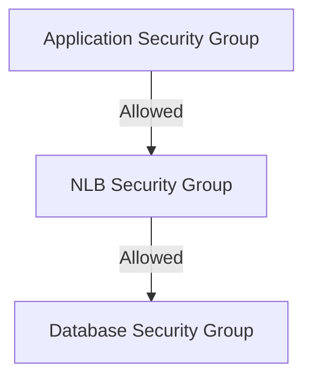

## 요약

- **핵심 요약**: AWS NLB와 Security Group을 활용한 Zero Trust 데이터베이스 게이트웨이 구축.
- **주요 주제**: AWS에서 안전한 데이터베이스 접근 게이트웨이 구축하기: NLB + Security Group 완벽 가이드
- **키워드**: AWS, NLB, Security-Group, Database, Network

---

<div class="ai-summary-card">
<div class="ai-summary-header">
  <span class="ai-badge">AI 요약</span>
</div>
<div class="ai-summary-content">
  <div class="summary-row">
    <span class="summary-label">제목</span>
    <span class="summary-value">AWS에서 안전한 데이터베이스 접근 게이트웨이 구축하기: NLB + Security Group 완벽 가이드</span>
  </div>
  <div class="summary-row">
    <span class="summary-label">카테고리</span>
    <span class="summary-value"><span class="category-tag cloud">Cloud</span></span>
  </div>
  <div class="summary-row">
    <span class="summary-label">태그</span>
    <span class="summary-value tags">
      <span class="tag">AWS</span>
      <span class="tag">NLB</span>
      <span class="tag">Security-Group</span>
      <span class="tag">Database</span>
      <span class="tag">Network</span>
    </span>
  </div>
  <div class="summary-row highlights">
    <span class="summary-label">핵심 내용</span>
    <ul class="summary-list">
      <li>Network Load Balancer와 Security Group을 활용한 Zero Trust 아키텍처 구축</li>
      <li>Terraform을 통한 인프라 자동화 및 보안 설정</li>
      <li>데이터베이스 접근 관리 솔루션 AWS 배포 경험 공유</li>
    </ul>
  </div>
  <div class="summary-row">
    <span class="summary-label">기술/도구</span>
    <span class="summary-value">AWS NLB, Security Group, Terraform, VPC</span>
  </div>
  <div class="summary-row">
    <span class="summary-label">대상 독자</span>
    <span class="summary-value">클라우드 아키텍트, DevOps 엔지니어, 클라우드 관리자</span>
  </div>
</div>
<div class="ai-summary-footer">
  이 포스팅은 AI가 쉽게 이해하고 활용할 수 있도록 구조화된 요약을 포함합니다.
</div>
</div>

## 서론

데이터베이스 접근 관리 솔루션을 AWS에 배포하면서 Network Load Balancer와 Security Group을 활용한 Zero Trust 아키텍처를 구축한 경험을 공유합니다. Terraform으로 완전 자동화하고, 보안과 가용성을 모두 확보했습니다.


데이터베이스 접근 게이트웨이는 Zero Trust 아키텍처를 통해 보안을 강화합니다.

## 배경: 왜 데이터베이스 접근 게이트웨이가 필요한가?

많은 기업에서 여러 팀이 수십 개의 데이터베이스를 사용합니다:

- **RDS MySQL/PostgreSQL 클러스터**: 애플리케이션 데이터 저장
- **ElastiCache Redis**: 캐시 및 세션 저장
- **DocumentDB**: 문서 기반 데이터 저장
- **Redshift**: 데이터 웨어하우스

### 기존 접근 방식의 문제점

1. **직접 접근**: 각 애플리케이션에서 데이터베이스에 직접 연결
   - Security Group 관리가 복잡해짐
   - IP 주소 변경 시 수동 업데이트 필요
   - 네트워크 경로가 분산되어 추적 어려움

2. **VPN 의존**: VPN을 통한 접근
   - VPN 연결이 끊어지면 접근 불가
   - VPN 서버 장애 시 전체 접근 차단
   - 네트워크 성능 저하

3. **보안 취약점**:
   - 공개 IP 노출 위험
   - 접근 로그 부족
   - 중앙화된 모니터링 어려움

## 솔루션 아키텍처### 전체 구조

<figure>

<figcaption>데이터베이스 접근 게이트웨이 아키텍처 - Python diagrams로 생성</figcaption>
</figure>

### 핵심 컴포넌트

1. **Network Load Balancer (NLB)**
   - 고가용성 및 로드 밸런싱
   - TCP 레벨 로드 밸런싱
   - 정적 IP 주소 제공

2. **Security Group (게이트웨이)**
   - 인바운드/아웃바운드 트래픽 제어
   - 최소 권한 원칙 적용
   - 중앙화된 접근 제어

3. **Private Subnet**
   - 데이터베이스는 Private Subnet에 배치
   - 인터넷 직접 접근 차단

## 1. Network Load Balancer 설정

### 1.1 NLB의 장점

- **고성능**: Layer 4 로드 밸런싱으로 낮은 지연시간
- **고가용성**: 다중 AZ 지원으로 장애 복구
- **정적 IP**: 고정 IP 주소로 Security Group 규칙 관리 용이
- **비용 효율**: 사용한 만큼만 과금

### 1.2 NLB 구성 요소

> **참고**: Terraform AWS NLB 구성 관련 내용은 [Terraform AWS ALB/NLB 모듈](https://github.com/terraform-aws-modules/terraform-aws-alb) 및 [AWS NLB 문서](https://docs.aws.amazon.com/elasticloadbalancing/latest/network/)를 참조하세요.
>
> ```hcl
> resource "aws_lb" "db_gateway" {...
> ```


### 1.3 타겟 그룹 설정

> **참고**: Terraform AWS Load Balancer 타겟 그룹 관련 내용은 [Terraform AWS ALB/NLB 모듈](https://github.com/terraform-aws-modules/terraform-aws-alb) 및 [AWS ELB Target Groups 문서](https://docs.aws.amazon.com/elasticloadbalancing/latest/network/target-group-register-targets.html)를 참조하세요.
>
> ```hcl
> resource "aws_lb_target_group" "rds_mysql" {...
> ```


## 2. Security Group 구성

### 2.1 Security Group 계층 구조



### 2.2 NLB Security Group

NLB는 Security Group을 직접 지원하지 않지만, 타겟 그룹의 Security Group을 통해 제어합니다:

> **참고**: Terraform AWS Security Group 관련 내용은 [Terraform AWS Security Group 모듈](https://github.com/terraform-aws-modules/terraform-aws-security-group) 및 [AWS Security Groups 문서](https://docs.aws.amazon.com/vpc/latest/userguide/security-groups.html)를 참조하세요.
>
> ```hcl
> resource "aws_security_group" "nlb" {...
> ```


### 2.3 데이터베이스 Security Group

> **참고**: Terraform AWS Security Group 관련 내용은 [Terraform AWS Security Group 모듈](https://github.com/terraform-aws-modules/terraform-aws-security-group) 및 [AWS RDS 보안 모범 사례](https://docs.aws.amazon.com/AmazonRDS/latest/UserGuide/UsingWithRDS.html)를 참조하세요.
>
> ```hcl
> resource "aws_security_group" "database" {...
> ```


## 3. Zero Trust 아키텍처 구현

### 3.1 Zero Trust 원칙

1. **명시적 검증**: 모든 접근은 검증되어야 함
2. **최소 권한**: 필요한 최소한의 접근만 허용
3. **가정 위반**: 네트워크 내부도 신뢰하지 않음

### 3.2 구현 방법

#### 애플리케이션 레벨 인증

> **참고**: AWS 데이터베이스 접근 보안 관련 내용은 [AWS RDS 보안 모범 사례](https://docs.aws.amazon.com/AmazonRDS/latest/UserGuide/UsingWithRDS.html) 및 [AWS Secrets Manager](https://docs.aws.amazon.com/secretsmanager/)를 참조하세요.
>
> ```python
> # 애플리케이션에서 데이터베이스 접근 시...
> ```


## 모니터링 및 알림

### CloudWatch Dashboard

#### 통합 대시보드 구성

> **참고**: CloudWatch 대시보드 관련 내용은 [AWS CloudWatch 문서](https://docs.aws.amazon.com/AmazonCloudWatch/latest/monitoring/) 및 [Terraform AWS CloudWatch 모듈](https://github.com/terraform-aws-modules/terraform-aws-cloudwatch)을 참조하세요.

> **코드 예시**: 전체 코드는 [GitHub 예제 저장소](https://github.com/terraform-aws-modules)를 참조하세요.
> 
> ```hcl
> resource "aws_cloudwatch_dashboard" "db_gateway" {...
> ```


### Connection Monitoring

#### 연결 수 추적

> **코드 예시**: 전체 코드는 [GitHub 예제 저장소](https://github.com/terraform-aws-modules)를 참조하세요.
> 
> ```hcl
> resource "aws_cloudwatch_metric_alarm" "high_connection_count" {...
> ```


### Alerting

#### SNS 토픽 및 구독

> **코드 예시**: 전체 코드는 [GitHub 예제 저장소](https://github.com/terraform-aws-modules)를 참조하세요.
> 
> ```hcl
> resource "aws_sns_topic" "db_gateway_alerts" {...
> ```


#### Lambda Slack 알림

> **참고**: AWS Lambda 및 SNS 통합 관련 내용은 [AWS Lambda 문서](https://docs.aws.amazon.com/lambda/) 및 [Terraform AWS Lambda 모듈](https://github.com/terraform-aws-modules/terraform-aws-lambda)을 참조하세요.

> **코드 예시**: 전체 코드는 [GitHub 예제 저장소](https://github.com/python/cpython)를 참조하세요.
> 
> ```python
> # lambda/slack_notifier.py...
> ```


### Custom Metrics

#### 애플리케이션 메트릭 수집

> **참고**: AWS WAF/CloudFront 설정 관련 내용은 [AWS WAF Terraform 모듈](https://github.com/trussworks/terraform-aws-wafv2) 및 [AWS WAF CloudFront 통합 예제](https://github.com/aws-samples/integrate-httpapi-with-cloudfront-and-waf)를 참조하세요. 규칙 강화 및 IP 블랙리스트 업데이트

#### 권장 사항

1. **단기 (1개월)**:
   - WAF Rate Limiting 규칙 강화
   - IP 화이트리스트 정기 검토

2. **중기 (3개월)**:
   - VPC Lattice 마이그레이션 검토
   - Post-Quantum TLS 도입 계획 수립

3. **장기 (6개월)**:
   - Database Proxy (RDS Proxy) 도입 검토
   - Multi-Region 고가용성 아키텍처 구축

## 트러블슈팅 가이드

### Connection Timeout 문제

#### 증상

```
ERROR: Connection timed out after 30 seconds
```

#### 원인 및 해결 방법

**1. Security Group 규칙 확인**

> **참고**: 관련 예제는 [GitHub 예제 저장소](https://github.com/aws-samples)를 참조하세요.

> **참고**: 관련 예제는 [GitHub 예제 저장소](https://github.com/aws-samples)를 참조하세요.

> **참고**: 관련 예제는 [GitHub 예제 저장소](https://github.com/aws-samples)를 참조하세요.

> **참고**: 관련 예제는 [GitHub 예제 저장소](https://github.com/aws-samples)를 참조하세요.

> **참고**: 관련 예제는 [GitHub 예제 저장소](https://github.com/aws-samples)를 참조하세요.

> **참고**: 관련 예제는 [GitHub 예제 저장소](https://github.com/aws-samples)를 참조하세요.

```bash
# Security Group 규칙 확인
aws ec2 describe-security-groups \
  --group-ids sg-xxx \
  --query 'SecurityGroups[*].IpPermissions'
```

**해결책**:
- 애플리케이션 Security Group이 NLB Security Group에 접근 허용되어 있는지 확인
- NLB Security Group이 데이터베이스 Security Group에 접근 허용되어 있는지 확인

**2. Target Health Check 실패**

> **참고**: 관련 예제는 [GitHub 예제 저장소](https://github.com/aws-samples)를 참조하세요.

> **참고**: 관련 예제는 [GitHub 예제 저장소](https://github.com/aws-samples)를 참조하세요.

> **참고**: 관련 예제는 [GitHub 예제 저장소](https://github.com/aws-samples)를 참조하세요.

> **참고**: 관련 예제는 [GitHub 예제 저장소](https://github.com/aws-samples)를 참조하세요.

> **참고**: 관련 예제는 [GitHub 예제 저장소](https://github.com/aws-samples)를 참조하세요.

> **참고**: 관련 예제는 [GitHub 예제 저장소](https://github.com/aws-samples)를 참조하세요.

```bash
# Target Health 확인
aws elbv2 describe-target-health \
  --target-group-arn arn:aws:elasticloadbalancing:region:account:targetgroup/xxx
```

**해결책**:
- RDS 인스턴스가 실행 중인지 확인
- Health Check 포트 및 프로토콜이 올바른지 확인
- Security Group이 NLB에서 Health Check 트래픽을 허용하는지 확인

**3. NLB Subnet 라우팅 문제**

> **참고**: 관련 예제는 [GitHub 예제 저장소](https://github.com/aws-samples)를 참조하세요.

> **참고**: 관련 예제는 [GitHub 예제 저장소](https://github.com/aws-samples)를 참조하세요.

> **참고**: 관련 예제는 [GitHub 예제 저장소](https://github.com/aws-samples)를 참조하세요.

> **참고**: 관련 예제는 [GitHub 예제 저장소](https://github.com/aws-samples)를 참조하세요.

> **참고**: 관련 예제는 [GitHub 예제 저장소](https://github.com/aws-samples)를 참조하세요.

> **참고**: 관련 예제는 [GitHub 예제 저장소](https://github.com/aws-samples)를 참조하세요.

```bash
# Route Table 확인
aws ec2 describe-route-tables \
  --filters "Name=association.subnet-id,Values=subnet-xxx"
```

**해결책**:
- Private Subnet의 Route Table에 NAT Gateway 또는 VPC Peering 라우팅이 올바른지 확인

### High Latency 문제

#### 증상

```
Query execution time: 500ms (expected: <50ms)
```

#### 원인 및 해결 방법

**1. Cross-AZ 트래픽**

> **참고**: 관련 예제는 [GitHub 예제 저장소](https://github.com/aws-samples)를 참조하세요.

> **참고**: 관련 예제는 [GitHub 예제 저장소](https://github.com/aws-samples)를 참조하세요.

> **참고**: 관련 예제는 [GitHub 예제 저장소](https://github.com/aws-samples)를 참조하세요.

> **참고**: 관련 예제는 [GitHub 예제 저장소](https://github.com/aws-samples)를 참조하세요.

> **참고**: 관련 예제는 [GitHub 예제 저장소](https://github.com/aws-samples)를 참조하세요.

> **참고**: 관련 예제는 [GitHub 예제 저장소](https://github.com/aws-samples)를 참조하세요.

```bash
# NLB Cross-AZ Load Balancing 확인
aws elbv2 describe-load-balancers \
  --load-balancer-arns arn:aws:elasticloadbalancing:region:account:loadbalancer/net/xxx \
  --query 'LoadBalancers[*].[LoadBalancerArn,CrossZoneLoadBalancingEnabled]'
```

**해결책**:
- Cross-AZ Load Balancing 비활성화 (비용 vs 가용성 트레이드오프)
- 애플리케이션과 데이터베이스를 동일 AZ에 배치

**2. 연결 풀 고갈**

> **참고**: 관련 예제는 [GitHub 예제 저장소](https://github.com/python/cpython)를 참조하세요.

> **참고**: 관련 예제는 [GitHub 예제 저장소](https://docs.python.org/3/)를 참조하세요.

> **참고**: 관련 예제는 [GitHub 예제 저장소](https://docs.python.org/3/)를 참조하세요.

> **참고**: 관련 예제는 [GitHub 예제 저장소](https://docs.python.org/3/)를 참조하세요.

> **참고**: 관련 예제는 [GitHub 예제 저장소](https://docs.python.org/3/)를 참조하세요.

> **참고**: 관련 예제는 [GitHub 예제 저장소](https://docs.python.org/3/)를 참조하세요.

```python
# 연결 풀 모니터링
import psycopg2.pool

pool = psycopg2.pool.SimpleConnectionPool(1, 20, dsn=DATABASE_URL)

print(f"Active connections: {pool._used}")
print(f"Available connections: {pool._pool}")
```

**해결책**:
- RDS Proxy 도입하여 연결 풀링 최적화
- 애플리케이션 레벨 연결 풀 크기 조정

**3. RDS 성능 병목**

> **참고**: 관련 예제는 [GitHub 예제 저장소](https://github.com/aws-samples)를 참조하세요.

> **참고**: 관련 예제는 [GitHub 예제 저장소](https://github.com/aws-samples)를 참조하세요.

> **참고**: 관련 예제는 [GitHub 예제 저장소](https://github.com/aws-samples)를 참조하세요.

> **참고**: 관련 예제는 [GitHub 예제 저장소](https://github.com/aws-samples)를 참조하세요.

> **참고**: 관련 예제는 [GitHub 예제 저장소](https://github.com/aws-samples)를 참조하세요.

> **참고**: 관련 예제는 [GitHub 예제 저장소](https://github.com/aws-samples)를 참조하세요.

```bash
# RDS Performance Insights 확인
aws rds describe-db-instances \
  --db-instance-identifier prod-mysql \
  --query 'DBInstances[*].[PerformanceInsightsEnabled,PerformanceInsightsRetentionPeriod]'
```

**해결책**:
- Performance Insights 활성화하여 병목 쿼리 식별
- Slow Query Log 분석하여 인덱스 최적화

### Unhealthy Target 문제

#### 증상

```
UnHealthyHostCount: 1/2 targets are unhealthy
```

#### 원인 및 해결 방법

**1. RDS 인스턴스 장애**

> **참고**: 관련 예제는 [GitHub 예제 저장소](https://github.com/aws-samples)를 참조하세요.

> **참고**: 관련 예제는 [GitHub 예제 저장소](https://github.com/aws-samples)를 참조하세요.

> **참고**: 관련 예제는 [GitHub 예제 저장소](https://github.com/aws-samples)를 참조하세요.

> **참고**: 관련 예제는 [GitHub 예제 저장소](https://github.com/aws-samples)를 참조하세요.

> **참고**: 관련 예제는 [GitHub 예제 저장소](https://github.com/aws-samples)를 참조하세요.

> **참고**: 관련 예제는 [GitHub 예제 저장소](https://github.com/aws-samples)를 참조하세요.

```bash
# RDS 이벤트 로그 확인
aws rds describe-events \
  --source-identifier prod-mysql \
  --source-type db-instance \
  --duration 60
```

**해결책**:
- RDS 이벤트 로그에서 장애 원인 확인
- Multi-AZ 배포로 고가용성 확보

**2. 잘못된 Health Check 설정**

> **참고**: 관련 예제는 [GitHub 예제 저장소](https://github.com/aws-samples)를 참조하세요.

> **참고**: 관련 예제는 [GitHub 예제 저장소](https://github.com/aws-samples)를 참조하세요.

> **참고**: 관련 예제는 [GitHub 예제 저장소](https://github.com/aws-samples)를 참조하세요.

> **참고**: 관련 예제는 [GitHub 예제 저장소](https://github.com/aws-samples)를 참조하세요.

> **참고**: 관련 예제는 [GitHub 예제 저장소](https://github.com/aws-samples)를 참조하세요.

> **참고**: 관련 예제는 [GitHub 예제 저장소](https://github.com/aws-samples)를 참조하세요.

```bash
# Target Group Health Check 설정 확인
aws elbv2 describe-target-groups \
  --target-group-arns arn:aws:elasticloadbalancing:region:account:targetgroup/xxx \
  --query 'TargetGroups[*].HealthCheckProtocol'
```

**해결책**:
- Health Check Interval 및 Threshold 조정
- Health Check 프로토콜이 올바른지 확인 (TCP for database)

**3. 네트워크 분할 (Network Partition)**

> **참고**: 관련 예제는 [GitHub 예제 저장소](https://github.com/aws-samples)를 참조하세요.

> **참고**: 관련 예제는 [GitHub 예제 저장소](https://github.com/aws-samples)를 참조하세요.

> **참고**: 관련 예제는 [GitHub 예제 저장소](https://github.com/aws-samples)를 참조하세요.

> **참고**: 관련 예제는 [GitHub 예제 저장소](https://github.com/aws-samples)를 참조하세요.

> **참고**: 관련 예제는 [GitHub 예제 저장소](https://github.com/aws-samples)를 참조하세요.

> **참고**: 관련 예제는 [GitHub 예제 저장소](https://github.com/aws-samples)를 참조하세요.

```bash
# VPC Flow Logs에서 네트워크 문제 확인
aws logs filter-log-events \
  --log-group-name /aws/vpc/flowlogs \
  --filter-pattern '[version, account, eni, source, destination, srcport, destport="3306", protocol, packets, bytes, windowstart, windowend, action="REJECT", flowlogstatus]'
```

**해결책**:
- VPC Flow Logs에서 REJECT 패킷 원인 분석
- Security Group 규칙 재검토

### Certificate Issues

#### 증상

```
SSL handshake failed: certificate verify failed
```

#### 원인 및 해결 방법

**1. 인증서 만료**

> **참고**: 관련 예제는 [GitHub 예제 저장소](https://github.com/aws-samples)를 참조하세요.

> **참고**: 관련 예제는 [GitHub 예제 저장소](https://github.com/aws-samples)를 참조하세요.

> **참고**: 관련 예제는 [GitHub 예제 저장소](https://github.com/aws-samples)를 참조하세요.

> **참고**: 관련 예제는 [GitHub 예제 저장소](https://github.com/aws-samples)를 참조하세요.

> **참고**: 관련 예제는 [GitHub 예제 저장소](https://github.com/aws-samples)를 참조하세요.

> **참고**: 관련 예제는 [GitHub 예제 저장소](https://github.com/aws-samples)를 참조하세요.

```bash
# ACM 인증서 유효기간 확인
aws acm describe-certificate \
  --certificate-arn arn:aws:acm:region:account:certificate/xxx \
  --query 'Certificate.[Status,NotAfter]'
```

**해결책**:
- ACM 인증서는 자동 갱신됨 (도메인 검증 필요)
- Route53 CNAME 레코드가 삭제되지 않았는지 확인

**2. 잘못된 인증서 체인**

```bash
# 인증서 체인 확인
openssl s_client -connect db-gateway.internal.company.com:3306 -showcerts
```

**해결책**:
- ACM에서 발급한 인증서는 올바른 체인 포함
- 클라이언트가 AWS Root CA를 신뢰하는지 확인

## 참고 자료

### AWS 공식 문서

1. **Network Load Balancer**
   - [AWS NLB 사용 설명서](https://docs.aws.amazon.com/elasticloadbalancing/latest/network/)
   - [NLB 모범 사례](https://docs.aws.amazon.com/elasticloadbalancing/latest/network/network-load-balancers.html)

2. **Security Groups**
   - [VPC Security Groups](https://docs.aws.amazon.com/vpc/latest/userguide/security-groups.html)
   - [Security Group 규칙](https://docs.aws.amazon.com/vpc/latest/userguide/security-group-rules.html)

3. **RDS Security**
   - [RDS 보안 모범 사례](https://docs.aws.amazon.com/AmazonRDS/latest/UserGuide/UsingWithRDS.html)
   - [RDS IAM 인증](https://docs.aws.amazon.com/AmazonRDS/latest/UserGuide/UsingWithRDS.IAMDBAuth.html)

4. **VPC PrivateLink**
   - [AWS PrivateLink 가이드](https://docs.aws.amazon.com/vpc/latest/privatelink/)
   - [VPC Endpoint Services](https://docs.aws.amazon.com/vpc/latest/privatelink/create-endpoint-service.html)

5. **VPC Lattice**
   - [AWS VPC Lattice 문서](https://docs.aws.amazon.com/vpc-lattice/)
   - [VPC Lattice Resource Gateway](https://docs.aws.amazon.com/vpc-lattice/latest/ug/resource-gateways.html)

6. **Monitoring & Logging**
   - [CloudWatch 메트릭](https://docs.aws.amazon.com/AmazonCloudWatch/latest/monitoring/)
   - [VPC Flow Logs](https://docs.aws.amazon.com/vpc/latest/userguide/flow-logs.html)
   - [CloudTrail 로깅](https://docs.aws.amazon.com/awscloudtrail/latest/userguide/)

### Terraform 리소스

7. **Terraform AWS Provider**
   - [Terraform AWS Provider 문서](https://registry.terraform.io/providers/hashicorp/aws/latest/docs)
   - [Terraform AWS ALB/NLB 모듈](https://github.com/terraform-aws-modules/terraform-aws-alb)

8. **Terraform 모범 사례**
   - [Terraform Best Practices](https://www.terraform-best-practices.com/)
   - [Terraform 모듈 구조](https://developer.hashicorp.com/terraform/language/modules)

### 보안 및 규정 준수

9. **MITRE ATT&CK**
   - [MITRE ATT&CK Framework](https://attack.mitre.org/)
   - [Cloud Attack Techniques](https://attack.mitre.org/matrices/enterprise/cloud/)

10. **NIST Post-Quantum Cryptography**
    - [NIST PQC Project](https://csrc.nist.gov/projects/post-quantum-cryptography)
    - [ML-KEM Standard](https://csrc.nist.gov/pubs/fips/203/final)

11. **ISMS-P**
    - [ISMS-P 인증기준](https://www.kisa.or.kr/isms-p)
    - [개인정보보호법](https://www.law.go.kr/법령/개인정보보호법)

### 데이터베이스 프록시

12. **HAProxy**
    - [HAProxy Documentation](https://www.haproxy.org/documentation.html)
    - [HAProxy MySQL/PostgreSQL Configuration](https://www.haproxy.com/documentation/hapee/latest/traffic-routing/databases/)

13. **PgBouncer**
    - [PgBouncer Documentation](https://www.pgbouncer.org/)
    - [PgBouncer Configuration](https://www.pgbouncer.org/config.html)

14. **ProxySQL**
    - [ProxySQL Documentation](https://proxysql.com/documentation/)
    - [ProxySQL Query Rules](https://proxysql.com/documentation/query-rules/)

15. **AWS RDS Proxy**
    - [RDS Proxy 문서](https://docs.aws.amazon.com/AmazonRDS/latest/UserGuide/rds-proxy.html)
    - [RDS Proxy Best Practices](https://docs.aws.amazon.com/AmazonRDS/latest/UserGuide/rds-proxy-best-practices.html)

### 추가 학습 자료

16. **AWS Well-Architected Framework**
    - [Security Pillar](https://docs.aws.amazon.com/wellarchitected/latest/security-pillar/)
    - [Reliability Pillar](https://docs.aws.amazon.com/wellarchitected/latest/reliability-pillar/)

17. **Community Resources**
    - [AWS Samples GitHub](https://github.com/aws-samples)
    - [Terraform AWS Modules](https://github.com/terraform-aws-modules)

## 결론

Network Load Balancer와 Security Group을 활용한 데이터베이스 접근 게이트웨이는 Zero Trust 아키텍처를 구현하는 효과적인 방법입니다. 2025년에는 Post-Quantum TLS 지원과 VPC Lattice의 성숙으로 더욱 다양한 선택지가 생겼습니다. 이 아키텍처를 통해:

- **보안 강화**: 중앙화된 접근 제어 및 최소 권한 원칙 적용 + 양자 내성 암호화
- **가용성 향상**: 다중 AZ 및 자동 장애 복구
- **관리 용이성**: Terraform을 통한 인프라 자동화, VPC Lattice로 단순화 가능
- **비용 효율**: 사용량 기반 과금으로 비용 최적화
- **미래 대비**: Post-Quantum TLS로 양자 컴퓨터 위협 선제 대응
- **규정 준수**: ISMS-P, 개인정보보호법 등 한국 규제 요구사항 충족

올바른 구성과 지속적인 모니터링을 통해 안전하고 효율적인 데이터베이스 접근 환경을 구축할 수 있습니다. 이 가이드에서 다룬 고급 아키텍처 패턴, Terraform 자동화, 위협 헌팅 쿼리, 그리고 트러블슈팅 방법을 활용하면 엔터프라이즈급 데이터베이스 게이트웨이를 성공적으로 운영할 수 있을 것입니다.

<!-- quality-upgrade:v1 -->
## 경영진 요약
이 문서는 운영자가 즉시 실행할 수 있는 보안 우선 실행 항목과 검증 포인트를 중심으로 재정리했습니다.

### 위험 스코어카드
| 영역 | 현재 위험도 | 영향도 | 우선순위 |
|---|---|---|---|
| 공급망/의존성 | 중간 | 높음 | P1 |
| 구성 오류/권한 | 중간 | 높음 | P1 |
| 탐지/가시성 공백 | 낮음 | 중간 | P2 |

### 운영 개선 지표
| 지표 | 현재 기준 | 목표 | 검증 방법 |
|---|---|---|---|
| 탐지 리드타임 | 주 단위 | 일 단위 | SIEM 알림 추적 |
| 패치 적용 주기 | 월 단위 | 주 단위 | 변경 티켓 감사 |
| 재발 방지율 | 부분 대응 | 표준화 | 회고 액션 추적 |

### 실행 체크리스트
- [ ] 핵심 경고 룰을 P1/P2로 구분하고 온콜 라우팅을 검증한다.
- [ ] 취약점 조치 SLA를 서비스 등급별로 재정의한다.
- [ ] IAM/시크릿/네트워크 변경 이력을 주간 기준으로 리뷰한다.
- [ ] 탐지 공백 시나리오(로그 누락, 파이프라인 실패)를 월 1회 리허설한다.
- [ ] 경영진 보고용 핵심 지표(위험도, 비용, MTTR)를 월간 대시보드로 고정한다.

### 시각 자료


