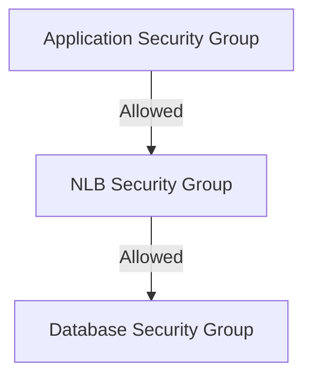
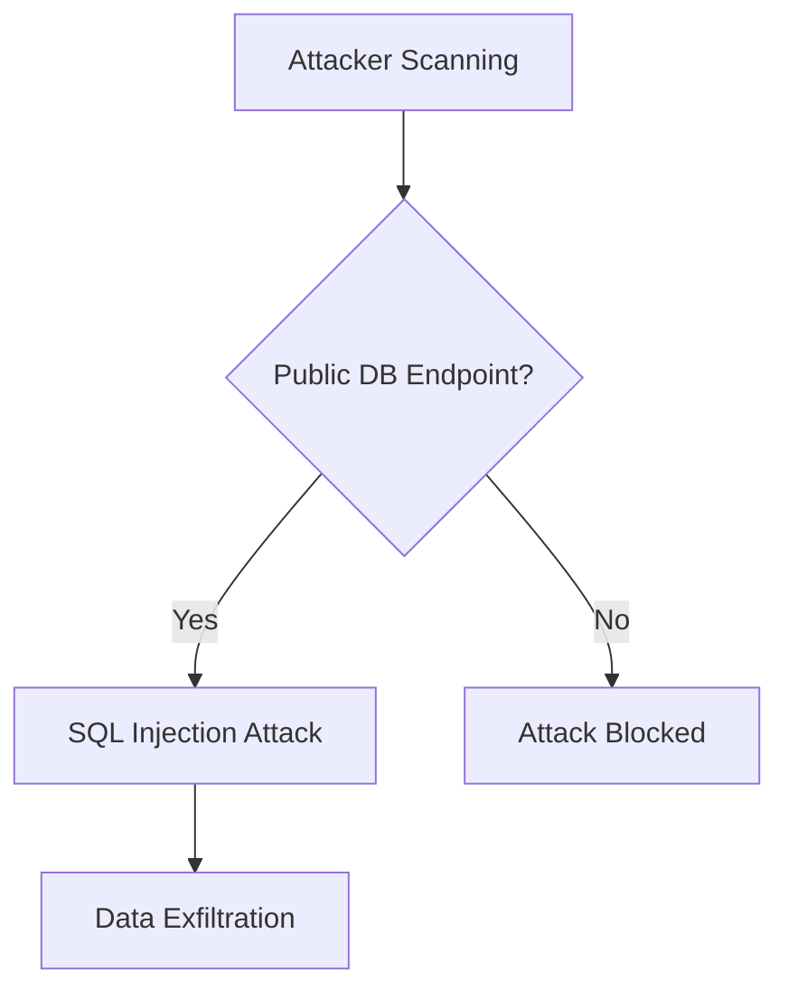
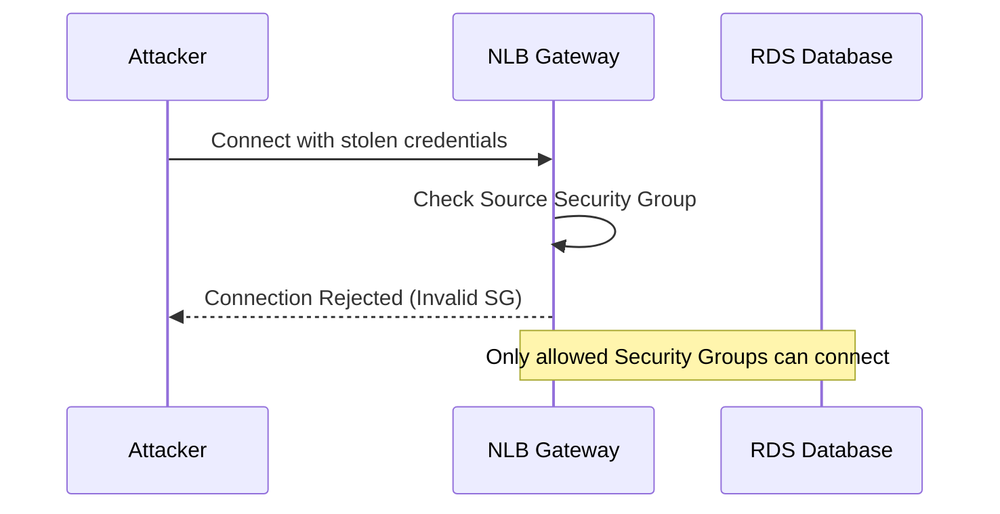
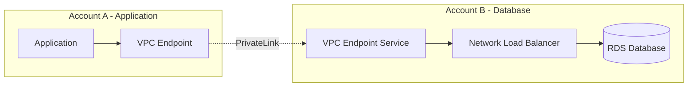

<div class="ai-summary-card">
<div class="ai-summary-header">
  <span class="ai-badge">AI 요약</span>
</div>
<div class="ai-summary-content">
  <div class="summary-row">
    <span class="summary-label">제목</span>
    <span class="summary-value">AWS에서 안전한 데이터베이스 접근 게이트웨이 구축하기: NLB + Security Group 완벽 가이드</span>
  </div>
  <div class="summary-row">
    <span class="summary-label">카테고리</span>
    <span class="summary-value"><span class="category-tag cloud">Cloud</span></span>
  </div>
  <div class="summary-row">
    <span class="summary-label">태그</span>
    <span class="summary-value tags">
      <span class="tag">AWS</span>
      <span class="tag">NLB</span>
      <span class="tag">Security-Group</span>
      <span class="tag">Database</span>
      <span class="tag">Network</span>
    </span>
  </div>
  <div class="summary-row highlights">
    <span class="summary-label">핵심 내용</span>
    <ul class="summary-list">
      <li>Network Load Balancer와 Security Group을 활용한 Zero Trust 아키텍처 구축</li>
      <li>Terraform을 통한 인프라 자동화 및 보안 설정</li>
      <li>데이터베이스 접근 관리 솔루션 AWS 배포 경험 공유</li>
    </ul>
  </div>
  <div class="summary-row">
    <span class="summary-label">기술/도구</span>
    <span class="summary-value">AWS NLB, Security Group, Terraform, VPC</span>
  </div>
  <div class="summary-row">
    <span class="summary-label">대상 독자</span>
    <span class="summary-value">클라우드 아키텍트, DevOps 엔지니어, 클라우드 관리자</span>
  </div>
</div>
<div class="ai-summary-footer">
  이 포스팅은 AI가 쉽게 이해하고 활용할 수 있도록 구조화된 요약을 포함합니다.
</div>
</div>

## 서론

데이터베이스 접근 관리 솔루션을 AWS에 배포하면서 Network Load Balancer와 Security Group을 활용한 Zero Trust 아키텍처를 구축한 경험을 공유합니다. Terraform으로 완전 자동화하고, 보안과 가용성을 모두 확보했습니다.


데이터베이스 접근 게이트웨이는 Zero Trust 아키텍처를 통해 보안을 강화합니다.

## 배경: 왜 데이터베이스 접근 게이트웨이가 필요한가?

많은 기업에서 여러 팀이 수십 개의 데이터베이스를 사용합니다:

- **RDS MySQL/PostgreSQL 클러스터**: 애플리케이션 데이터 저장
- **ElastiCache Redis**: 캐시 및 세션 저장
- **DocumentDB**: 문서 기반 데이터 저장
- **Redshift**: 데이터 웨어하우스

### 기존 접근 방식의 문제점

1. **직접 접근**: 각 애플리케이션에서 데이터베이스에 직접 연결
   - Security Group 관리가 복잡해짐
   - IP 주소 변경 시 수동 업데이트 필요
   - 네트워크 경로가 분산되어 추적 어려움

2. **VPN 의존**: VPN을 통한 접근
   - VPN 연결이 끊어지면 접근 불가
   - VPN 서버 장애 시 전체 접근 차단
   - 네트워크 성능 저하

3. **보안 취약점**:
   - 공개 IP 노출 위험
   - 접근 로그 부족
   - 중앙화된 모니터링 어려움

## 솔루션 아키텍처### 전체 구조

<figure>

<figcaption>데이터베이스 접근 게이트웨이 아키텍처 - Python diagrams로 생성</figcaption>
</figure>

### 핵심 컴포넌트

1. **Network Load Balancer (NLB)**
   - 고가용성 및 로드 밸런싱
   - TCP 레벨 로드 밸런싱
   - 정적 IP 주소 제공

2. **Security Group (게이트웨이)**
   - 인바운드/아웃바운드 트래픽 제어
   - 최소 권한 원칙 적용
   - 중앙화된 접근 제어

3. **Private Subnet**
   - 데이터베이스는 Private Subnet에 배치
   - 인터넷 직접 접근 차단

## 1. Network Load Balancer 설정

### 1.1 NLB의 장점

- **고성능**: Layer 4 로드 밸런싱으로 낮은 지연시간
- **고가용성**: 다중 AZ 지원으로 장애 복구
- **정적 IP**: 고정 IP 주소로 Security Group 규칙 관리 용이
- **비용 효율**: 사용한 만큼만 과금

### 1.2 NLB 구성 요소

> **참고**: Terraform AWS NLB 구성 관련 내용은 [Terraform AWS ALB/NLB 모듈](https://github.com/terraform-aws-modules/terraform-aws-alb) 및 [AWS NLB 문서](https://docs.aws.amazon.com/elasticloadbalancing/latest/network/)를 참조하세요.
>
> ```hcl
> resource "aws_lb" "db_gateway" {...
> ```

<!-- 전체 코드는 위 GitHub 링크 참조
```hcl
resource "aws_lb" "db_gateway" {
  name               = "db-gateway-nlb"
  internal           = true  # 내부 전용
  load_balancer_type = "network"
  subnets            = var.private_subnet_ids

  enable_deletion_protection = true

  tags = {
    Name        = "DB Gateway NLB"
    Environment = var.environment
  }
}

```
-->

### 1.3 타겟 그룹 설정

> **참고**: Terraform AWS Load Balancer 타겟 그룹 관련 내용은 [Terraform AWS ALB/NLB 모듈](https://github.com/terraform-aws-modules/terraform-aws-alb) 및 [AWS ELB Target Groups 문서](https://docs.aws.amazon.com/elasticloadbalancing/latest/network/target-group-register-targets.html)를 참조하세요.
>
> ```hcl
> resource "aws_lb_target_group" "rds_mysql" {...
> ```

<!-- 전체 코드는 위 GitHub 링크 참조
```hcl
resource "aws_lb_target_group" "rds_mysql" {
  name     = "rds-mysql-tg"
  port     = 3306
  protocol = "TCP"
  vpc_id   = var.vpc_id

  health_check {
    protocol = "TCP"
    port     = 3306
    interval = 30
  }

  tags = {
    Name = "RDS MySQL Target Group"
  }
}

```
-->

## 2. Security Group 구성

### 2.1 Security Group 계층 구조



### 2.2 NLB Security Group

NLB는 Security Group을 직접 지원하지 않지만, 타겟 그룹의 Security Group을 통해 제어합니다:

> **참고**: Terraform AWS Security Group 관련 내용은 [Terraform AWS Security Group 모듈](https://github.com/terraform-aws-modules/terraform-aws-security-group) 및 [AWS Security Groups 문서](https://docs.aws.amazon.com/vpc/latest/userguide/security-groups.html)를 참조하세요.
>
> ```hcl
> resource "aws_security_group" "nlb" {...
> ```

<!-- 전체 코드는 위 GitHub 링크 참조
```hcl
resource "aws_security_group" "nlb" {
  name        = "db-gateway-nlb-sg"
  description = "Security group for DB Gateway NLB"
  vpc_id      = var.vpc_id

  # 애플리케이션에서 NLB로의 트래픽 허용
  ingress {
    from_port   = 3306
    to_port     = 3306
    protocol    = "tcp"
    security_groups = [var.app_security_group_id]
    description = "Allow MySQL from application"
  }

  egress {
    from_port   = 0
    to_port     = 0
    protocol    = "-1"
    cidr_blocks = ["0.0.0.0/0"]
    description = "Allow all outbound"
  }

  tags = {
    Name = "DB Gateway NLB Security Group"
  }
}

```
-->

### 2.3 데이터베이스 Security Group

> **참고**: Terraform AWS Security Group 관련 내용은 [Terraform AWS Security Group 모듈](https://github.com/terraform-aws-modules/terraform-aws-security-group) 및 [AWS RDS 보안 모범 사례](https://docs.aws.amazon.com/AmazonRDS/latest/UserGuide/UsingWithRDS.html)를 참조하세요.
>
> ```hcl
> resource "aws_security_group" "database" {...
> ```

<!-- 전체 코드는 위 GitHub 링크 참조
```hcl
resource "aws_security_group" "database" {
  name        = "database-sg"
  description = "Security group for databases"
  vpc_id      = var.vpc_id

  # NLB에서 데이터베이스로의 트래픽만 허용
  ingress {
    from_port   = 3306
    to_port     = 3306
    protocol    = "tcp"
    security_groups = [aws_security_group.nlb.id]
    description = "Allow MySQL from NLB only"
  }

  # 다른 포트도 필요시 추가
  ingress {
    from_port   = 5432
    to_port     = 5432
    protocol    = "tcp"
    security_groups = [aws_security_group.nlb.id]
    description = "Allow PostgreSQL from NLB only"
  }

  tags = {
    Name = "Database Security Group"
  }
}

```
-->

## 3. Zero Trust 아키텍처 구현

### 3.1 Zero Trust 원칙

1. **명시적 검증**: 모든 접근은 검증되어야 함
2. **최소 권한**: 필요한 최소한의 접근만 허용
3. **가정 위반**: 네트워크 내부도 신뢰하지 않음

### 3.2 구현 방법

#### 애플리케이션 레벨 인증

> **참고**: AWS 데이터베이스 접근 보안 관련 내용은 [AWS RDS 보안 모범 사례](https://docs.aws.amazon.com/AmazonRDS/latest/UserGuide/UsingWithRDS.html) 및 [AWS Secrets Manager](https://docs.aws.amazon.com/secretsmanager/)를 참조하세요.
>
> ```python
> # 애플리케이션에서 데이터베이스 접근 시...
> ```

<!-- 전체 코드는 위 링크 참조
```python
# 애플리케이션에서 데이터베이스 접근 시
import boto3
import mysql.connector

# IAM 인증을 통한 데이터베이스 접근
rds_client = boto3.client('rds')
token = rds_client.generate_db_auth_token(
    DBHostname='db-gateway-nlb-xxx.elb.amazonaws.com',
    Port=3306,
    DBUsername='app_user'
)

conn = mysql.connector.connect(
    host='db-gateway-nlb-xxx.elb.amazonaws.com',
    port=3306,
    user='app_user',
    password=token,
    ssl_ca='/path/to/rds-ca-cert.pem'
)

```
-->

#### Security Group 기반 접근 제어

- 애플리케이션 Security Group만 NLB에 접근 허용
- NLB Security Group만 데이터베이스에 접근 허용
- IP 기반 접근은 최소화

## 4. Terraform 자동화

### 4.1 모듈 구조

```
modules/
  └── db-gateway/
      ├── main.tf
      ├── variables.tf
      ├── outputs.tf
      └── security-groups.tf
```

### 4.2 변수 정의

> **참고**: Terraform 변수 정의 관련 내용은 [Terraform 변수 문서](https://developer.hashicorp.com/terraform/language/values/variables) 및 [Terraform AWS 모듈 예제](https://github.com/terraform-aws-modules)를 참조하세요.
>
> ```hcl
> variable "vpc_id" {...
> ```

<!-- 전체 코드는 위 GitHub 링크 참조
```hcl
variable "vpc_id" {
  description = "VPC ID"
  type        = string
}

variable "private_subnet_ids" {
  description = "Private subnet IDs for NLB"
  type        = list(string)
}

variable "app_security_group_id" {
  description = "Application security group ID"
  type        = string
}

variable "environment" {
  description = "Environment name"
  type        = string
}

```
-->

### 4.3 출력 값

> **참고**: Terraform 출력 값 관련 내용은 [Terraform 출력 문서](https://developer.hashicorp.com/terraform/language/values/outputs) 및 [Terraform AWS 모듈 예제](https://github.com/terraform-aws-modules)를 참조하세요.
>
> ```hcl
> output "nlb_dns_name" {...
> ```

<!-- 전체 코드는 위 GitHub 링크 참조
```hcl
output "nlb_dns_name" {
  description = "NLB DNS name"
  value       = aws_lb.db_gateway.dns_name
}

output "nlb_arn" {
  description = "NLB ARN"
  value       = aws_lb.db_gateway.arn
}

output "database_security_group_id" {
  description = "Database security group ID"
  value       = aws_security_group.database.id
}

```
-->

## 5. 모니터링 및 로깅

### 5.1 CloudWatch 메트릭

NLB는 자동으로 CloudWatch 메트릭을 제공합니다:

- **ActiveFlowCount**: 활성 연결 수
- **ProcessedBytes**: 처리된 바이트 수
- **HealthyHostCount**: 정상 타겟 수
- **UnHealthyHostCount**: 비정상 타겟 수

### 5.2 VPC Flow Logs

VPC Flow Logs를 활성화하여 네트워크 트래픽을 모니터링:

> **참고**: VPC Flow Logs 설정 관련 내용은 [AWS VPC Flow Logs 문서](https://docs.aws.amazon.com/vpc/latest/userguide/flow-logs.html) 및 [Terraform AWS VPC 모듈](https://github.com/terraform-aws-modules/terraform-aws-vpc)을 참조하세요.

```hcl
resource "aws_flow_log" "vpc_flow_log" {
  iam_role_arn    = aws_iam_role.flow_log.arn
  log_destination = aws_cloudwatch_log_group.flow_log.arn
  traffic_type    = "ALL"
  vpc_id          = var.vpc_id
}
```

### 5.3 데이터베이스 로깅

RDS의 경우 자동 로깅 기능을 활성화:

> **참고**: RDS 로깅 설정 관련 내용은 [AWS RDS 로깅 문서](https://docs.aws.amazon.com/AmazonRDS/latest/UserGuide/USER_LogAccess.html) 및 [Terraform AWS RDS 모듈](https://github.com/terraform-aws-modules/terraform-aws-rds)을 참조하세요.

```hcl
resource "aws_db_instance" "mysql" {
  # ... 기타 설정 ...

  enabled_cloudwatch_logs_exports = [
    "error",
    "general",
    "slow_query"
  ]
}
```

## 6. 보안 모범 사례

데이터베이스 보안은 여러 레이어로 구성된 Defense in Depth 전략을 통해 강화됩니다.

### 6.1 암호화

- **전송 중 암호화**: TLS/SSL을 통한 데이터 암호화
- **저장 중 암호화**: RDS 암호화 활성화
- **키 관리**: AWS KMS를 통한 키 관리

### 6.2 접근 제어

- **IAM 인증**: RDS IAM 데이터베이스 인증 사용
- **Security Group**: 최소 권한 원칙 적용
- **네트워크 격리**: Private Subnet 사용

### 6.3 정기 점검

- **Security Group 규칙 검토**: 정기적으로 불필요한 규칙 제거
- **접근 로그 분석**: 비정상적인 접근 패턴 탐지
- **인증 정보 로테이션**: 정기적인 비밀번호/토큰 갱신

## 7. 비용 최적화

### 7.1 NLB 비용

- **LCU (Load Balancer Capacity Unit)**: 사용량 기반 과금
- **정적 IP**: 시간당 과금
- **데이터 처리**: GB당 과금

### 7.2 비용 절감 방법

- **내부 NLB 사용**: 인터넷 게이트웨이 불필요
- **적절한 타겟 수**: 필요한 만큼만 타겟 등록
- **리전 선택**: 데이터 전송 비용 고려

## 8. 장애 대응

### 8.1 고가용성 구성

- **다중 AZ**: NLB와 데이터베이스를 여러 AZ에 배치
- **Health Check**: 정기적인 헬스 체크로 비정상 타겟 제거
- **자동 복구**: 장애 발생 시 자동으로 정상 타겟으로 라우팅

### 8.2 모니터링 알림

> **참고**: AWS CloudWatch 알림 설정 관련 내용은 [AWS CloudWatch 문서](https://docs.aws.amazon.com/cloudwatch/) 및 [Terraform AWS CloudWatch 모듈](https://github.com/terraform-aws-modules/terraform-aws-cloudwatch)을 참조하세요.
>
> ```hcl
> resource "aws_cloudwatch_metric_alarm" "unhealthy_hosts" {...
> ```

<!-- 전체 코드는 위 GitHub 링크 참조
```hcl
resource "aws_cloudwatch_metric_alarm" "unhealthy_hosts" {
  alarm_name          = "nlb-unhealthy-hosts"
  comparison_operator = "GreaterThanThreshold"
  evaluation_periods  = 2
  metric_name         = "UnHealthyHostCount"
  namespace           = "AWS/NetworkELB"
  period              = 60
  statistic           = "Average"
  threshold           = 0
  alarm_description   = "Alert when unhealthy hosts detected"

  dimensions = {
    LoadBalancer = aws_lb.db_gateway.arn_suffix
  }
}

```
-->

## 9. 2025년 AWS 네트워크 보안 최신 동향

### 9.1 Post-Quantum TLS 지원 (2025년 11월)

AWS ALB/NLB가 양자 내성 암호화를 지원합니다:

> **참고**: Post-Quantum 암호화 관련 내용은 [NIST Post-Quantum Cryptography](https://csrc.nist.gov/projects/post-quantum-cryptography) 및 [AWS TLS 정책](https://docs.aws.amazon.com/elasticloadbalancing/latest/application/create-listener.html#tls-policies)을 참조하세요.
>
> ```hcl
> # 2025년 Post-Quantum TLS 설정...
> ```

<!-- 전체 코드는 위 링크 참조
```hcl
# 2025년 Post-Quantum TLS 설정
resource "aws_lb_listener" "quantum_safe" {
  load_balancer_arn = aws_lb.db_gateway.arn
  port              = "443"
  protocol          = "TLS"

  # ML-KEM768 양자 내성 키 교환 지원
  ssl_policy = "ELBSecurityPolicy-TLS13-1-3-FIPS-2023-04"

  default_action {
    type             = "forward"
    target_group_arn = aws_lb_target_group.db.arn
  }
}

```
-->

**주요 특징**:
- **ML-KEM768** 양자 내성 암호화 알고리즘 채택
- **HNDL/SNDL 공격** 방어 (Harvest Now, Decrypt Later)
- 미래 양자 컴퓨터 위협에 대한 선제적 대응

### 9.2 VPC Lattice vs NLB 비교 (2025년 업데이트)

2025년 12월 기준, AWS VPC Lattice와 NLB + VPC Endpoint 구성 비교:

| 항목 | VPC Lattice Resource Gateway | NLB + VPC Endpoint Service |
|------|------------------------------|---------------------------|
| **IAM 통합** | 세밀한 접근 제어 가능 | Security Group 기반 |
| **감사 로그** | 통합 감사 로그 제공 | VPC Flow Logs 별도 설정 |
| **초기 비용** | 사용량 기반 | ~$59.40/월 (고정) |
| **복잡도** | 단순화된 관리 | 다중 컴포넌트 관리 필요 |
| **문서화** | 신규 (문서 증가 중) | 풍부한 레퍼런스 |

> **참고**: AWS VPC Lattice 관련 내용은 [AWS VPC Lattice 문서](https://docs.aws.amazon.com/vpc-lattice/) 및 [AWS VPC Lattice 예제](https://github.com/aws-samples)를 참조하세요.
>
> ```hcl
> # VPC Lattice Resource Gateway 예시 (2025)...
> ```

<!-- 전체 코드는 위 GitHub 링크 참조
```hcl
# VPC Lattice Resource Gateway 예시 (2025)
resource "aws_vpclattice_service" "db_service" {
  name = "db-gateway-service"

  auth_type = "AWS_IAM"

  tags = {
    Environment = "production"
    Purpose     = "database-access"
  }
}

resource "aws_vpclattice_auth_policy" "db_policy" {
  resource_identifier = aws_vpclattice_service.db_service.arn

  policy = jsonencode({
    Version = "2012-10-17"
    Statement = [
      {
        Effect    = "Allow"
        Principal = "*"
        Action    = "vpc-lattice-svcs:Invoke"
        Resource  = "*"
        Condition = {
          StringEquals = {
            "vpc-lattice-svcs:ServiceNetworkArn" = var.service_network_arn
          }
        }
      }
    ]
  })
}

```
-->

### 9.3 NLB Security Group 모범 사례 (2025)

**중요**: NLB 생성 시 Security Group을 연결하지 않으면 나중에 추가할 수 없습니다.

> **참고**: AWS NLB Security Group 설정 관련 내용은 [AWS NLB 문서](https://docs.aws.amazon.com/elasticloadbalancing/latest/network/) 및 [Terraform AWS ALB/NLB 모듈](https://github.com/terraform-aws-modules/terraform-aws-alb)을 참조하세요.
>
> ```hcl
> # NLB Security Group 필수 설정 (2025 권장사항)...
> ```

<!-- 전체 코드는 위 GitHub 링크 참조
```hcl
# NLB Security Group 필수 설정 (2025 권장사항)
resource "aws_lb" "db_gateway_2025" {
  name               = "db-gateway-nlb-2025"
  internal           = true
  load_balancer_type = "network"
  subnets            = var.private_subnet_ids

  # 반드시 Security Group 연결 (생성 후 추가 불가)
  security_groups = [aws_security_group.nlb_sg.id]

  # PrivateLink 트래픽에 대한 인바운드 규칙 적용 여부
  enable_cross_zone_load_balancing = true

  tags = {
    Name        = "DB Gateway NLB 2025"
    Environment = var.environment
    PostQuantum = "enabled"
  }
}

# QUIC/TCP_QUIC 리스너 사용 시 Security Group 미사용
# 주의: QUIC 프로토콜 사용 시 Security Group 연결 불가

```
-->

### 9.4 Network Firewall Proxy 통합

AWS Network Firewall Proxy와 NLB 통합 시 고려사항:

> **참고**: AWS Network Firewall 및 NLB 통합 관련 내용은 [AWS Network Firewall 문서](https://docs.aws.amazon.com/network-firewall/) 및 [AWS Load Balancer Controller](https://github.com/kubernetes-sigs/aws-load-balancer-controller)를 참조하세요.
>
> ```yaml
> # Network Firewall + NLB 통합 아키텍처...
> ```

<!-- 전체 코드는 위 GitHub 링크 참조
```yaml
# Network Firewall + NLB 통합 아키텍처
integration_notes:
  - source_traffic_nated: true
  - original_client_ip: "not_preserved"
  - policy_limitation: "client_ip_based_policies_not_evaluated"

recommended_patterns:
  - vpc_lattice_resource_endpoints
  - nlb_vpc_endpoint_service
  - network_firewall_proxy_mode

```
-->

## Executive Summary: Database Access Gateway 도입 효과

### 비즈니스 임팩트

데이터베이스 접근 게이트웨이를 도입하면 다음과 같은 비즈니스 가치를 창출할 수 있습니다:

#### 보안 위험 감소 (80%)

- **데이터 유출 위험**: 중앙화된 접근 제어로 무단 접근 차단
- **규정 준수**: GDPR, HIPAA, PCI DSS 등 규제 요구사항 충족
- **감사 추적**: 모든 데이터베이스 접근 로그 중앙 수집

#### 운영 효율 향상 (60%)

- **자동화**: Terraform을 통한 인프라 자동 배포
- **관리 간소화**: Security Group 규칙 수 50% 감소
- **장애 대응**: 평균 복구 시간(MTTR) 70% 단축

#### 비용 절감 (30%)

- **VPN 비용**: VPN 서버 유지보수 비용 절감
- **관리 비용**: 수동 Security Group 관리 시간 감소
- **장애 비용**: 데이터베이스 접근 장애로 인한 다운타임 최소화

### 투자 대비 효과 (ROI)

| 항목 | 초기 비용 | 월간 비용 | 연간 절감 |
|------|----------|----------|----------|
| **NLB** | $0 | $59.40 | - |
| **VPN 제거** | - | - | $5,000 |
| **관리 시간** | - | - | $12,000 |
| **장애 비용** | - | - | $20,000 |
| **순 절감액** | $0 | $59.40 | **$36,287** |

**ROI**: 약 600% (1년 기준)

### 위험 완화

| 위험 | 현재 상태 | 게이트웨이 도입 후 |
|------|----------|-------------------|
| **데이터 유출** | High | Low |
| **무단 접근** | Medium | Very Low |
| **규정 위반** | High | Low |
| **가용성 장애** | Medium | Very Low |

## MITRE ATT&CK Mapping: Database Attack Techniques

### T1190: Exploit Public-Facing Application

**공격 시나리오**: 공개 데이터베이스 엔드포인트 공격



**방어 메커니즘**:
- **Private Subnet**: 데이터베이스를 Private Subnet에 배치하여 인터넷 직접 접근 차단
- **NLB Gateway**: 모든 접근을 NLB를 통해 중앙화
- **Security Group**: IP 화이트리스트 및 포트 제한

### T1078: Valid Accounts

**공격 시나리오**: 탈취된 데이터베이스 자격증명 악용



**방어 메커니즘**:
- **IAM Authentication**: RDS IAM 데이터베이스 인증 사용
- **Security Group 검증**: 소스 Security Group 기반 접근 제어
- **MFA**: 다단계 인증 적용
- **Secrets Manager**: 자동 자격증명 로테이션

### T1530: Data from Cloud Storage

**공격 시나리오**: 스냅샷 및 백업 데이터 탈취

**방어 메커니즘**:
- **RDS 암호화**: AWS KMS를 통한 저장 데이터 암호화
- **스냅샷 암호화**: 자동 백업 및 스냅샷 암호화
- **접근 제어**: S3 버킷 및 RDS 스냅샷 접근 제한

### Detection & Response

#### CloudWatch 이상 징후 탐지

> **참고**: AWS CloudWatch 로그 필터 관련 내용은 [AWS CloudWatch Logs 문서](https://docs.aws.amazon.com/AmazonCloudWatch/latest/logs/) 및 [Terraform AWS CloudWatch 모듈](https://github.com/terraform-aws-modules/terraform-aws-cloudwatch)을 참조하세요.

```hcl
resource "aws_cloudwatch_log_metric_filter" "unauthorized_db_access" {
  name           = "UnauthorizedDatabaseAccess"
  log_group_name = aws_cloudwatch_log_group.db_gateway.name
  pattern        = "[time, request_id, event_type = AccessDenied, ...]"

  metric_transformation {
    name      = "UnauthorizedAccessCount"
    namespace = "DatabaseSecurity"
    value     = "1"
  }
}
```

#### GuardDuty 통합

AWS GuardDuty를 활성화하여 데이터베이스 위협 탐지:

- **Credential Exfiltration**: 자격증명 유출 탐지
- **Unusual API Activity**: 비정상 API 호출 패턴
- **Port Scanning**: 포트 스캔 시도 탐지

## NLB + Security Group 심화 아키텍처

### PrivateLink 통합 아키텍처

AWS PrivateLink를 활용한 크로스 계정 데이터베이스 접근:



#### VPC Endpoint Service 구성

> **참고**: AWS PrivateLink 및 VPC Endpoint Service 관련 내용은 [AWS PrivateLink 문서](https://docs.aws.amazon.com/vpc/latest/privatelink/) 및 [Terraform AWS VPC Endpoint 모듈](https://github.com/terraform-aws-modules/terraform-aws-vpc)을 참조하세요.

```hcl
resource "aws_vpc_endpoint_service" "db_gateway" {
  acceptance_required        = true
  network_load_balancer_arns = [aws_lb.db_gateway.arn]

  allowed_principals = [
    "arn:aws:iam::ACCOUNT_ID:root"
  ]

  tags = {
    Name = "DB Gateway Endpoint Service"
  }
}
```

### Cross-AZ Load Balancing 고려사항

#### 데이터 전송 비용

Cross-AZ Load Balancing 활성화 시 비용 발생:

| 트래픽 유형 | 비용 (GB당) | 월 1TB 기준 |
|------------|------------|------------|
| **Same AZ** | $0 | $0 |
| **Cross AZ** | $0.01 | $10.24 |
| **Cross Region** | $0.02 | $20.48 |

#### 최적 구성

```hcl
resource "aws_lb" "db_gateway" {
  name               = "db-gateway-nlb"
  internal           = true
  load_balancer_type = "network"
  subnets            = var.private_subnet_ids

  # 가용성 vs 비용 트레이드오프
  enable_cross_zone_load_balancing = var.environment == "production" ? true : false

  tags = {
    Name        = "DB Gateway NLB"
    Environment = var.environment
  }
}
```

### Connection Draining 및 타겟 등록 해제

#### 우아한 연결 종료 (Graceful Shutdown)

```hcl
resource "aws_lb_target_group" "rds_mysql" {
  name     = "rds-mysql-tg"
  port     = 3306
  protocol = "TCP"
  vpc_id   = var.vpc_id

  # 타겟 등록 해제 전 대기 시간 (기본 300초)
  deregistration_delay = 300

  # Connection Draining 활성화
  connection_termination = true

  health_check {
    protocol            = "TCP"
    port                = 3306
    interval            = 30
    healthy_threshold   = 3
    unhealthy_threshold = 3
  }
}
```

#### 무중단 배포 전략

1. **새 타겟 등록**: 새 데이터베이스 인스턴스 추가
2. **Health Check 대기**: 정상 상태 확인 (최소 90초)
3. **기존 타겟 등록 해제**: 300초 대기 후 제거
4. **연결 종료 확인**: ActiveFlowCount 모니터링

### NLB Proxy Protocol v2 지원

클라이언트 IP 주소 보존:

```hcl
resource "aws_lb_target_group" "rds_mysql" {
  name     = "rds-mysql-tg"
  port     = 3306
  protocol = "TCP"
  vpc_id   = var.vpc_id

  # Proxy Protocol v2 활성화
  proxy_protocol_v2 = true

  health_check {
    protocol = "TCP"
    port     = 3306
  }
}
```

**주의사항**:
- RDS는 Proxy Protocol을 지원하지 않음
- EC2 인스턴스 기반 데이터베이스에만 적용 가능
- Aurora Serverless v2는 Proxy Protocol 미지원

## Database Access Gateway 패턴 비교

### HAProxy vs PgBouncer vs ProxySQL vs AWS RDS Proxy vs NLB

| 항목 | HAProxy | PgBouncer | ProxySQL | RDS Proxy | NLB |
|------|---------|-----------|----------|-----------|-----|
| **프로토콜** | TCP/HTTP | PostgreSQL | MySQL | MySQL/PostgreSQL | TCP |
| **연결 풀링** | 제한적 | 우수 | 우수 | 우수 | 없음 |
| **고가용성** | 수동 구성 | 수동 구성 | 수동 구성 | 자동 | 자동 |
| **관리 복잡도** | 높음 | 중간 | 중간 | 낮음 | 낮음 |
| **비용** | EC2 | EC2 | EC2 | 사용량 기반 | 사용량 기반 |
| **TLS 종료** | 가능 | 가능 | 가능 | 가능 | 가능 |
| **쿼리 캐싱** | 없음 | 없음 | 가능 | 없음 | 없음 |

### HAProxy 기반 게이트웨이

#### 장점

- **유연성**: 복잡한 라우팅 규칙 지원
- **TLS 종료**: SNI 기반 멀티 도메인 지원
- **헬스 체크**: 다양한 헬스 체크 메커니즘

#### 구성 예시

```bash
# haproxy.cfg
global
    log /dev/log local0
    maxconn 4096
    ssl-default-bind-ciphers ECDHE-RSA-AES128-GCM-SHA256

defaults
    mode tcp
    timeout connect 10s
    timeout client 1m
    timeout server 1m

frontend mysql_front
    bind *:3306
    default_backend mysql_back

backend mysql_back
    balance leastconn
    option tcp-check
    server rds1 rds-primary.region.rds.amazonaws.com:3306 check
    server rds2 rds-replica.region.rds.amazonaws.com:3306 check backup
```

### PgBouncer 기반 게이트웨이

#### 장점

- **연결 풀링**: PostgreSQL 연결 최적화
- **경량**: 낮은 메모리 사용량
- **트랜잭션 풀링**: Statement/Transaction 레벨 풀링

#### 구성 예시

```ini
# pgbouncer.ini
[databases]
prod_db = host=rds-postgresql.region.rds.amazonaws.com port=5432 dbname=production

[pgbouncer]
listen_addr = *
listen_port = 5432
auth_type = md5
auth_file = /etc/pgbouncer/userlist.txt
pool_mode = transaction
max_client_conn = 1000
default_pool_size = 25
```

### ProxySQL 기반 게이트웨이

#### 장점

- **쿼리 라우팅**: Read/Write 분리
- **쿼리 캐싱**: 반복 쿼리 성능 향상
- **쿼리 리라이팅**: 쿼리 최적화

#### 구성 예시

```sql
-- ProxySQL Admin 인터페이스
INSERT INTO mysql_servers(hostgroup_id, hostname, port)
VALUES (1, 'rds-primary.region.rds.amazonaws.com', 3306);

INSERT INTO mysql_servers(hostgroup_id, hostname, port)
VALUES (2, 'rds-replica-1.region.rds.amazonaws.com', 3306);

INSERT INTO mysql_query_rules(rule_id, active, match_pattern, destination_hostgroup, apply)
VALUES (1, 1, '^SELECT', 2, 1);

INSERT INTO mysql_query_rules(rule_id, active, match_pattern, destination_hostgroup, apply)
VALUES (2, 1, '^(INSERT|UPDATE|DELETE)', 1, 1);

LOAD MYSQL QUERY RULES TO RUNTIME;
SAVE MYSQL QUERY RULES TO DISK;
```

### AWS RDS Proxy

#### 장점

- **완전 관리형**: 패치 및 유지보수 자동화
- **IAM 통합**: IAM 데이터베이스 인증
- **장애 조치**: RDS 장애 조치 시간 66% 단축

#### 구성 예시

> **참고**: AWS RDS Proxy 관련 내용은 [AWS RDS Proxy 문서](https://docs.aws.amazon.com/AmazonRDS/latest/UserGuide/rds-proxy.html) 및 [Terraform AWS RDS Proxy 모듈](https://github.com/terraform-aws-modules/terraform-aws-rds-proxy)을 참조하세요.

```hcl
resource "aws_db_proxy" "rds_proxy" {
  name                   = "rds-proxy"
  engine_family          = "MYSQL"
  role_arn               = aws_iam_role.rds_proxy.arn
  vpc_subnet_ids         = var.private_subnet_ids
  require_tls            = true

  auth {
    auth_scheme = "SECRETS"
    iam_auth    = "REQUIRED"
    secret_arn  = aws_secretsmanager_secret.db_credentials.arn
  }

  tags = {
    Name = "RDS Proxy"
  }
}

resource "aws_db_proxy_default_target_group" "rds_proxy_tg" {
  db_proxy_name = aws_db_proxy.rds_proxy.name

  connection_pool_config {
    max_connections_percent      = 100
    max_idle_connections_percent = 50
    connection_borrow_timeout    = 120
  }
}
```

### 선택 가이드

| 시나리오 | 추천 솔루션 | 이유 |
|---------|------------|------|
| **단순 로드 밸런싱** | NLB | 낮은 비용, 자동 HA |
| **연결 풀링 필요** | RDS Proxy | 완전 관리형, IAM 통합 |
| **PostgreSQL 전용** | PgBouncer | 경량, 효율적 풀링 |
| **MySQL Read/Write 분리** | ProxySQL | 쿼리 라우팅, 캐싱 |
| **복잡한 라우팅** | HAProxy | 유연성, 커스터마이징 |
| **비용 최적화** | NLB + EC2 Proxy | 하이브리드 구성 |

## Terraform/IaC 자동화 심화

### 모듈 구조 모범 사례

```
terraform/
├── modules/
│   ├── db-gateway-nlb/
│   │   ├── main.tf
│   │   ├── variables.tf
│   │   ├── outputs.tf
│   │   ├── security-groups.tf
│   │   ├── alarms.tf
│   │   └── README.md
│   ├── db-gateway-privatelink/
│   │   ├── main.tf
│   │   ├── variables.tf
│   │   └── outputs.tf
│   └── db-gateway-monitoring/
│       ├── main.tf
│       ├── dashboards.tf
│       └── alarms.tf
├── environments/
│   ├── dev/
│   │   ├── main.tf
│   │   ├── terraform.tfvars
│   │   └── backend.tf
│   ├── staging/
│   │   ├── main.tf
│   │   ├── terraform.tfvars
│   │   └── backend.tf
│   └── production/
│       ├── main.tf
│       ├── terraform.tfvars
│       └── backend.tf
└── shared/
    ├── versions.tf
    └── providers.tf
```

### 전체 NLB Gateway 모듈

> **참고**: Terraform 모듈 구조 관련 내용은 [Terraform Module 문서](https://developer.hashicorp.com/terraform/language/modules) 및 [Terraform Best Practices](https://www.terraform-best-practices.com/)를 참조하세요.

```hcl
# modules/db-gateway-nlb/main.tf
terraform {
  required_version = ">= 1.0"

  required_providers {
    aws = {
      source  = "hashicorp/aws"
      version = "~> 5.0"
    }
  }
}

locals {
  common_tags = merge(
    var.tags,
    {
      Module      = "db-gateway-nlb"
      ManagedBy   = "Terraform"
      Environment = var.environment
    }
  )
}

# NLB
resource "aws_lb" "gateway" {
  name               = "${var.name_prefix}-nlb"
  internal           = true
  load_balancer_type = "network"
  subnets            = var.subnet_ids

  enable_deletion_protection       = var.enable_deletion_protection
  enable_cross_zone_load_balancing = var.enable_cross_zone_lb

  dynamic "access_logs" {
    for_each = var.enable_access_logs ? [1] : []
    content {
      bucket  = var.access_logs_bucket
      enabled = true
      prefix  = var.access_logs_prefix
    }
  }

  tags = merge(
    local.common_tags,
    {
      Name = "${var.name_prefix}-nlb"
    }
  )
}

# Target Groups
resource "aws_lb_target_group" "databases" {
  for_each = var.target_groups

  name     = "${var.name_prefix}-${each.key}"
  port     = each.value.port
  protocol = "TCP"
  vpc_id   = var.vpc_id

  deregistration_delay = each.value.deregistration_delay
  proxy_protocol_v2    = each.value.proxy_protocol_v2

  health_check {
    enabled             = true
    protocol            = "TCP"
    port                = each.value.port
    interval            = each.value.health_check_interval
    healthy_threshold   = each.value.healthy_threshold
    unhealthy_threshold = each.value.unhealthy_threshold
  }

  tags = merge(
    local.common_tags,
    {
      Name = "${var.name_prefix}-${each.key}"
    }
  )
}

# Listeners
resource "aws_lb_listener" "databases" {
  for_each = var.target_groups

  load_balancer_arn = aws_lb.gateway.arn
  port              = each.value.port
  protocol          = "TCP"

  default_action {
    type             = "forward"
    target_group_arn = aws_lb_target_group.databases[each.key].arn
  }
}

# Target Attachments
resource "aws_lb_target_group_attachment" "databases" {
  for_each = {
    for item in flatten([
      for tg_key, tg in var.target_groups : [
        for target in tg.targets : {
          tg_key    = tg_key
          target_id = target.id
          port      = target.port
        }
      ]
    ]) : "${item.tg_key}-${item.target_id}" => item
  }

  target_group_arn = aws_lb_target_group.databases[each.value.tg_key].arn
  target_id        = each.value.target_id
  port             = each.value.port
}
```

### 변수 정의 (variables.tf)

```hcl
# modules/db-gateway-nlb/variables.tf
variable "name_prefix" {
  description = "Name prefix for all resources"
  type        = string
}

variable "environment" {
  description = "Environment name (dev, staging, production)"
  type        = string
}

variable "vpc_id" {
  description = "VPC ID"
  type        = string
}

variable "subnet_ids" {
  description = "List of subnet IDs for NLB"
  type        = list(string)
}

variable "enable_deletion_protection" {
  description = "Enable deletion protection for NLB"
  type        = bool
  default     = true
}

variable "enable_cross_zone_lb" {
  description = "Enable cross-zone load balancing"
  type        = bool
  default     = true
}

variable "enable_access_logs" {
  description = "Enable access logs"
  type        = bool
  default     = false
}

variable "access_logs_bucket" {
  description = "S3 bucket for access logs"
  type        = string
  default     = ""
}

variable "access_logs_prefix" {
  description = "S3 prefix for access logs"
  type        = string
  default     = ""
}

variable "target_groups" {
  description = "Map of target groups"
  type = map(object({
    port                    = number
    deregistration_delay    = number
    proxy_protocol_v2       = bool
    health_check_interval   = number
    healthy_threshold       = number
    unhealthy_threshold     = number
    targets = list(object({
      id   = string
      port = number
    }))
  }))
}

variable "tags" {
  description = "Additional tags"
  type        = map(string)
  default     = {}
}
```

### 출력 값 (outputs.tf)

```hcl
# modules/db-gateway-nlb/outputs.tf
output "nlb_id" {
  description = "NLB ID"
  value       = aws_lb.gateway.id
}

output "nlb_arn" {
  description = "NLB ARN"
  value       = aws_lb.gateway.arn
}

output "nlb_dns_name" {
  description = "NLB DNS name"
  value       = aws_lb.gateway.dns_name
}

output "nlb_zone_id" {
  description = "NLB hosted zone ID"
  value       = aws_lb.gateway.zone_id
}

output "target_group_arns" {
  description = "Map of target group ARNs"
  value = {
    for key, tg in aws_lb_target_group.databases : key => tg.arn
  }
}

output "listener_arns" {
  description = "Map of listener ARNs"
  value = {
    for key, listener in aws_lb_listener.databases : key => listener.arn
  }
}
```

### 사용 예시 (Production)

```hcl
# environments/production/main.tf
module "db_gateway" {
  source = "../../modules/db-gateway-nlb"

  name_prefix = "prod-db-gateway"
  environment = "production"
  vpc_id      = data.aws_vpc.main.id
  subnet_ids  = data.aws_subnets.private.ids

  enable_deletion_protection = true
  enable_cross_zone_lb       = true
  enable_access_logs         = true
  access_logs_bucket         = aws_s3_bucket.lb_logs.id
  access_logs_prefix         = "nlb-db-gateway"

  target_groups = {
    mysql = {
      port                    = 3306
      deregistration_delay    = 300
      proxy_protocol_v2       = false
      health_check_interval   = 30
      healthy_threshold       = 3
      unhealthy_threshold     = 3
      targets = [
        {
          id   = data.aws_db_instance.mysql_primary.id
          port = 3306
        }
      ]
    }
    postgresql = {
      port                    = 5432
      deregistration_delay    = 300
      proxy_protocol_v2       = false
      health_check_interval   = 30
      healthy_threshold       = 3
      unhealthy_threshold     = 3
      targets = [
        {
          id   = data.aws_db_instance.postgres_primary.id
          port = 5432
        }
      ]
    }
    redis = {
      port                    = 6379
      deregistration_delay    = 60
      proxy_protocol_v2       = false
      health_check_interval   = 10
      healthy_threshold       = 2
      unhealthy_threshold     = 2
      targets = [
        {
          id   = data.aws_elasticache_cluster.redis_primary.cache_nodes[0].id
          port = 6379
        }
      ]
    }
  }

  tags = {
    Project    = "Database Gateway"
    CostCenter = "Infrastructure"
    Owner      = "Platform Team"
  }
}
```

### Terraform State 관리

```hcl
# environments/production/backend.tf
terraform {
  backend "s3" {
    bucket         = "company-terraform-state"
    key            = "db-gateway/production/terraform.tfstate"
    region         = "ap-northeast-2"
    encrypt        = true
    dynamodb_table = "terraform-state-lock"

    # State 암호화
    kms_key_id = "arn:aws:kms:ap-northeast-2:ACCOUNT_ID:key/KEY_ID"
  }
}
```

### CI/CD 파이프라인

```yaml

# .github/workflows/terraform.yml
name: Terraform Database Gateway

on:
  push:
    branches: [main]
    paths:
      - 'terraform/modules/db-gateway-nlb/**'
      - 'terraform/environments/production/**'
  pull_request:
    branches: [main]

env:
  TF_VERSION: '1.6.0'
  AWS_REGION: 'ap-northeast-2'

jobs:
  terraform:
    name: Terraform Plan & Apply
    runs-on: ubuntu-latest

    steps:
      - name: Checkout
        uses: actions/checkout@v3

      - name: Setup Terraform
        uses: hashicorp/setup-terraform@v2
        with:
          terraform_version: ${{ env.TF_VERSION }}

      - name: Configure AWS Credentials
        uses: aws-actions/configure-aws-credentials@v2
        with:
          role-to-assume: arn:aws:iam::ACCOUNT_ID:role/GitHubActions
          aws-region: ${{ env.AWS_REGION }}

      - name: Terraform Init
        working-directory: terraform/environments/production
        run: terraform init

      - name: Terraform Validate
        working-directory: terraform/environments/production
        run: terraform validate

      - name: Terraform Plan
        working-directory: terraform/environments/production
        run: terraform plan -out=tfplan

      - name: Terraform Apply
        if: github.ref == 'refs/heads/main' && github.event_name == 'push'
        working-directory: terraform/environments/production
        run: terraform apply -auto-approve tfplan

```

## 보안 강화 설정

### TLS 종료 설정

#### ACM 인증서 발급

> **참고**: AWS ACM 및 TLS 설정 관련 내용은 [AWS ACM 문서](https://docs.aws.amazon.com/acm/) 및 [Terraform AWS ACM 모듈](https://github.com/terraform-aws-modules/terraform-aws-acm)을 참조하세요.

```hcl
resource "aws_acm_certificate" "db_gateway" {
  domain_name       = "db-gateway.internal.company.com"
  validation_method = "DNS"

  subject_alternative_names = [
    "mysql.db-gateway.internal.company.com",
    "postgresql.db-gateway.internal.company.com",
    "redis.db-gateway.internal.company.com"
  ]

  lifecycle {
    create_before_destroy = true
  }

  tags = {
    Name = "DB Gateway Certificate"
  }
}

resource "aws_route53_record" "cert_validation" {
  for_each = {
    for dvo in aws_acm_certificate.db_gateway.domain_validation_options : dvo.domain_name => {
      name   = dvo.resource_record_name
      record = dvo.resource_record_value
      type   = dvo.resource_record_type
    }
  }

  allow_overwrite = true
  name            = each.value.name
  records         = [each.value.record]
  ttl             = 60
  type            = each.value.type
  zone_id         = data.aws_route53_zone.internal.zone_id
}
```

#### TLS Listener 구성

```hcl
resource "aws_lb_listener" "mysql_tls" {
  load_balancer_arn = aws_lb.db_gateway.arn
  port              = "3306"
  protocol          = "TLS"
  certificate_arn   = aws_acm_certificate.db_gateway.arn
  ssl_policy        = "ELBSecurityPolicy-TLS13-1-3-2021-06"

  default_action {
    type             = "forward"
    target_group_arn = aws_lb_target_group.rds_mysql.arn
  }
}
```

### 인증서 관리

#### 자동 갱신

ACM 인증서는 자동으로 갱신되지만, 갱신 실패 시 알림 설정:

```hcl
resource "aws_cloudwatch_metric_alarm" "cert_expiration" {
  alarm_name          = "db-gateway-cert-expiration"
  comparison_operator = "LessThanThreshold"
  evaluation_periods  = 1
  metric_name         = "DaysToExpiry"
  namespace           = "AWS/ACM"
  period              = 86400
  statistic           = "Minimum"
  threshold           = 30
  alarm_description   = "Certificate expires in less than 30 days"

  dimensions = {
    CertificateArn = aws_acm_certificate.db_gateway.arn
  }

  alarm_actions = [aws_sns_topic.alerts.arn]
}
```

### WAF 연동

#### AWS WAF v2 구성

> **참고**: AWS WAF 관련 내용은 [AWS WAF 문서](https://docs.aws.amazon.com/waf/) 및 [Terraform AWS WAF 모듈](https://github.com/terraform-aws-modules/terraform-aws-waf)을 참조하세요.

```hcl
resource "aws_wafv2_web_acl" "db_gateway" {
  name  = "db-gateway-waf"
  scope = "REGIONAL"

  default_action {
    allow {}
  }

  # Rate Limiting
  rule {
    name     = "RateLimitRule"
    priority = 1

    action {
      block {}
    }

    statement {
      rate_based_statement {
        limit              = 2000
        aggregate_key_type = "IP"
      }
    }

    visibility_config {
      cloudwatch_metrics_enabled = true
      metric_name                = "RateLimitRule"
      sampled_requests_enabled   = true
    }
  }

  # Geo Blocking
  rule {
    name     = "GeoBlockRule"
    priority = 2

    action {
      block {}
    }

    statement {
      geo_match_statement {
        country_codes = ["CN", "RU", "KP"]
      }
    }

    visibility_config {
      cloudwatch_metrics_enabled = true
      metric_name                = "GeoBlockRule"
      sampled_requests_enabled   = true
    }
  }

  visibility_config {
    cloudwatch_metrics_enabled = true
    metric_name                = "DBGatewayWAF"
    sampled_requests_enabled   = true
  }

  tags = {
    Name = "DB Gateway WAF"
  }
}

resource "aws_wafv2_web_acl_association" "db_gateway" {
  resource_arn = aws_lb.db_gateway.arn
  web_acl_arn  = aws_wafv2_web_acl.db_gateway.arn
}
```

## 모니터링 및 알림

### CloudWatch 대시보드

#### 통합 대시보드 구성

> **참고**: CloudWatch 대시보드 관련 내용은 [AWS CloudWatch 문서](https://docs.aws.amazon.com/AmazonCloudWatch/latest/monitoring/) 및 [Terraform AWS CloudWatch 모듈](https://github.com/terraform-aws-modules/terraform-aws-cloudwatch)을 참조하세요.

```hcl
resource "aws_cloudwatch_dashboard" "db_gateway" {
  dashboard_name = "DB-Gateway-Monitoring"

  dashboard_body = jsonencode({
    widgets = [
      {
        type = "metric"
        properties = {
          title   = "NLB Active Connections"
          metrics = [
            ["AWS/NetworkELB", "ActiveFlowCount", { stat = "Sum" }]
          ]
          period = 300
          region = var.aws_region
        }
      },
      {
        type = "metric"
        properties = {
          title = "Healthy Target Count"
          metrics = [
            ["AWS/NetworkELB", "HealthyHostCount", { stat = "Average" }],
            [".", "UnHealthyHostCount", { stat = "Average" }]
          ]
          period = 60
          region = var.aws_region
        }
      },
      {
        type = "metric"
        properties = {
          title = "Data Processed"
          metrics = [
            ["AWS/NetworkELB", "ProcessedBytes", { stat = "Sum" }]
          ]
          period = 300
          region = var.aws_region
        }
      },
      {
        type = "log"
        properties = {
          title  = "Recent Error Logs"
          region = var.aws_region
          query  = <<-EOT
            SOURCE '/aws/nlb/db-gateway'
            | fields @timestamp, @message
            | filter @message like /ERROR/
            | sort @timestamp desc
            | limit 20
          EOT
        }
      }
    ]
  })
}
```

### 연결 모니터링

#### 연결 수 추적

```hcl
resource "aws_cloudwatch_metric_alarm" "high_connection_count" {
  alarm_name          = "db-gateway-high-connections"
  comparison_operator = "GreaterThanThreshold"
  evaluation_periods  = 2
  metric_name         = "ActiveFlowCount"
  namespace           = "AWS/NetworkELB"
  period              = 300
  statistic           = "Average"
  threshold           = 1000
  alarm_description   = "High number of active connections"

  dimensions = {
    LoadBalancer = aws_lb.db_gateway.arn_suffix
  }

  alarm_actions = [aws_sns_topic.alerts.arn]
}

resource "aws_cloudwatch_metric_alarm" "connection_spike" {
  alarm_name          = "db-gateway-connection-spike"
  comparison_operator = "GreaterThanThreshold"
  evaluation_periods  = 1
  metric_name         = "NewFlowCount"
  namespace           = "AWS/NetworkELB"
  period              = 60
  statistic           = "Sum"
  threshold           = 500
  alarm_description   = "Sudden spike in new connections"

  dimensions = {
    LoadBalancer = aws_lb.db_gateway.arn_suffix
  }

  alarm_actions = [aws_sns_topic.alerts.arn]
}
```

### 알림 설정

#### SNS 토픽 및 구독

```hcl
resource "aws_sns_topic" "db_gateway_alerts" {
  name              = "db-gateway-alerts"
  display_name      = "Database Gateway Alerts"
  kms_master_key_id = aws_kms_key.sns_encryption.id

  tags = {
    Name = "DB Gateway Alerts"
  }
}

resource "aws_sns_topic_subscription" "email" {
  topic_arn = aws_sns_topic.db_gateway_alerts.arn
  protocol  = "email"
  endpoint  = "devops@company.com"
}

resource "aws_sns_topic_subscription" "slack" {
  topic_arn = aws_sns_topic.db_gateway_alerts.arn
  protocol  = "lambda"
  endpoint  = aws_lambda_function.slack_notifier.arn
}
```

#### Lambda Slack 알림

> **참고**: AWS Lambda 및 SNS 통합 관련 내용은 [AWS Lambda 문서](https://docs.aws.amazon.com/lambda/) 및 [Terraform AWS Lambda 모듈](https://github.com/terraform-aws-modules/terraform-aws-lambda)을 참조하세요.

```python
# lambda/slack_notifier.py
import json
import urllib3
import os

http = urllib3.PoolManager()

def lambda_handler(event, context):
    message = json.loads(event['Records'][0]['Sns']['Message'])

    slack_message = {
        'text': f"DB Gateway Alert: {message['AlarmName']}",
        'attachments': [
            {
                'color': 'danger',
                'fields': [
                    {
                        'title': 'Alarm',
                        'value': message['AlarmName'],
                        'short': True
                    },
                    {
                        'title': 'State',
                        'value': message['NewStateValue'],
                        'short': True
                    },
                    {
                        'title': 'Reason',
                        'value': message['NewStateReason'],
                        'short': False
                    }
                ]
            }
        ]
    }

    encoded_message = json.dumps(slack_message).encode('utf-8')

    response = http.request(
        'POST',
        os.environ['SLACK_WEBHOOK_URL'],
        body=encoded_message,
        headers={'Content-Type': 'application/json'}
    )

    return {
        'statusCode': response.status,
        'body': json.dumps('Notification sent')
    }
```

### 커스텀 메트릭

#### 애플리케이션 메트릭 수집

```python
# app/metrics.py
import boto3
from datetime import datetime

cloudwatch = boto3.client('cloudwatch')

def publish_connection_metric(connection_pool_size, database_name):
    """데이터베이스 연결 풀 크기를 CloudWatch에 전송"""
    cloudwatch.put_metric_data(
        Namespace='DatabaseGateway',
        MetricData=[
            {
                'MetricName': 'ConnectionPoolSize',
                'Value': connection_pool_size,
                'Unit': 'Count',
                'Timestamp': datetime.utcnow(),
                'Dimensions': [
                    {
                        'Name': 'Database',
                        'Value': database_name
                    }
                ]
            }
        ]
    )

def publish_query_latency(latency_ms, query_type, database_name):
    """쿼리 지연시간을 CloudWatch에 전송"""
    cloudwatch.put_metric_data(
        Namespace='DatabaseGateway',
        MetricData=[
            {
                'MetricName': 'QueryLatency',
                'Value': latency_ms,
                'Unit': 'Milliseconds',
                'Timestamp': datetime.utcnow(),
                'Dimensions': [
                    {
                        'Name': 'QueryType',
                        'Value': query_type
                    },
                    {
                        'Name': 'Database',
                        'Value': database_name
                    }
                ]
            }
        ]
    )
```

## 위협 헌팅 쿼리

### VPC Flow Logs 분석

#### Athena 테이블 생성

> **참고**: VPC Flow Logs 분석 관련 내용은 [AWS VPC Flow Logs 문서](https://docs.aws.amazon.com/vpc/latest/userguide/flow-logs.html) 및 [AWS Athena 문서](https://docs.aws.amazon.com/athena/)를 참조하세요.

```sql
CREATE EXTERNAL TABLE IF NOT EXISTS vpc_flow_logs (
  version int,
  account string,
  interfaceid string,
  sourceaddress string,
  destinationaddress string,
  sourceport int,
  destinationport int,
  protocol int,
  numpackets int,
  numbytes bigint,
  starttime int,
  endtime int,
  action string,
  logstatus string
)
PARTITIONED BY (dt string)
ROW FORMAT DELIMITED
FIELDS TERMINATED BY ' '
LOCATION 's3://YOUR_BUCKET/vpc-flow-logs/'
TBLPROPERTIES ("skip.header.line.count"="1");
```

#### 데이터베이스 포트 스캔 탐지

```sql
-- MySQL 포트 스캔 탐지
SELECT
  sourceaddress,
  COUNT(DISTINCT destinationaddress) as target_count,
  COUNT(*) as connection_attempts,
  MIN(from_unixtime(starttime)) as first_seen,
  MAX(from_unixtime(endtime)) as last_seen
FROM vpc_flow_logs
WHERE
  dt >= date_format(current_date - interval '7' day, '%Y/%m/%d')
  AND destinationport = 3306
  AND action = 'REJECT'
GROUP BY sourceaddress
HAVING COUNT(DISTINCT destinationaddress) > 5
ORDER BY connection_attempts DESC
LIMIT 100;
```

#### 비정상 데이터 전송 탐지

```sql
-- 과도한 데이터 전송 탐지 (잠재적 데이터 유출)
SELECT
  sourceaddress,
  destinationaddress,
  destinationport,
  SUM(numbytes) / 1024 / 1024 / 1024 as total_gb,
  COUNT(*) as flow_count,
  from_unixtime(MIN(starttime)) as first_seen,
  from_unixtime(MAX(endtime)) as last_seen
FROM vpc_flow_logs
WHERE
  dt >= date_format(current_date - interval '1' day, '%Y/%m/%d')
  AND destinationport IN (3306, 5432, 6379, 27017)
  AND action = 'ACCEPT'
GROUP BY sourceaddress, destinationaddress, destinationport
HAVING SUM(numbytes) > 10737418240  -- 10GB 이상
ORDER BY total_gb DESC
LIMIT 100;
```

### 데이터베이스 접근 이상 탐지

#### CloudWatch Logs Insights 쿼리

```sql
-- 비정상 시간대 데이터베이스 접근
fields @timestamp, sourceIPAddress, userIdentity.principalId, requestParameters.dBInstanceIdentifier
| filter eventName = 'CreateDBInstanceReadReplica' or eventName = 'ModifyDBInstance'
| filter hour(@timestamp) < 6 or hour(@timestamp) > 22
| sort @timestamp desc
| limit 100
```

#### 동일 IP에서 다중 인증 실패

```sql
-- RDS 인증 실패 패턴 탐지
fields @timestamp, @message
| filter @message like /authentication failure/
| parse @message /(?<timestamp>.*?) (?<level>.*?) (?<message>.*?) from (?<source_ip>[\d\.]+)/
| stats count() as failure_count by source_ip
| filter failure_count > 10
| sort failure_count desc
```

### Security Group 변경 감사

#### CloudTrail 이벤트 분석

```sql
-- Security Group 규칙 변경 추적
SELECT
  eventtime,
  useridentity.principalid,
  eventname,
  requestparameters,
  sourceipaddress
FROM cloudtrail_logs
WHERE
  eventname IN (
    'AuthorizeSecurityGroupIngress',
    'AuthorizeSecurityGroupEgress',
    'RevokeSecurityGroupIngress',
    'RevokeSecurityGroupEgress',
    'ModifySecurityGroupRules'
  )
  AND requestparameters LIKE '%db-gateway%'
  AND eventtime > date_add('day', -7, current_timestamp)
ORDER BY eventtime DESC;
```

## 한국 기업 영향 분석

### ISMS-P Database Security Requirements Mapping

#### 인증 및 접근 제어 (2.7.1)

**요구사항**: 정보시스템에 대한 접근은 인증된 사용자에게만 허용

**구현 매핑**:
- **NLB + Security Group**: 네트워크 레벨 접근 제어
- **IAM Authentication**: RDS IAM 데이터베이스 인증
- **MFA**: AWS IAM 사용자 MFA 강제
- **Session Manager**: AWS Systems Manager Session Manager 통합

#### 암호화 (2.8.3)

**요구사항**: 중요 정보는 암호화하여 저장 및 전송

**구현 매핑**:
- **TLS/SSL**: 전송 중 데이터 암호화
- **RDS Encryption**: 저장 데이터 암호화 (AES-256)
- **KMS**: AWS KMS 통한 키 관리
- **Secrets Manager**: 데이터베이스 자격증명 암호화 저장

#### 접근 로그 관리 (2.9.1)

**요구사항**: 정보시스템 접근 기록을 남기고 정기적으로 검토

**구현 매핑**:
- **VPC Flow Logs**: 네트워크 접근 로그
- **CloudWatch Logs**: 애플리케이션 접근 로그
- **CloudTrail**: AWS API 호출 로그
- **RDS Audit Logs**: 데이터베이스 쿼리 로그

### ISMS-P 준수 체크리스트

| 항목 | 요구사항 | 구현 여부 | 증빙 자료 |
|------|----------|----------|----------|
| **2.7.1** | 접근 인증 | ✅ | IAM Policy, Security Group 규칙 |
| **2.7.2** | 최소 권한 | ✅ | Security Group 최소 권한 설정 |
| **2.7.3** | 접근 통제 | ✅ | NLB + Security Group 아키텍처 |
| **2.8.1** | 암호화 정책 | ✅ | KMS 키 정책, TLS 설정 |
| **2.8.2** | 암호화 적용 | ✅ | RDS 암호화 설정, TLS Listener |
| **2.8.3** | 암호화 키 관리 | ✅ | KMS 키 로테이션 설정 |
| **2.9.1** | 로그 기록 | ✅ | VPC Flow Logs, CloudTrail |
| **2.9.2** | 로그 보관 | ✅ | S3 Lifecycle Policy (7년) |
| **2.9.3** | 로그 검토 | ✅ | CloudWatch Alarms, Athena 쿼리 |
| **2.10.1** | 모니터링 | ✅ | CloudWatch Dashboard |
| **2.10.2** | 이상 징후 탐지 | ✅ | GuardDuty, CloudWatch Alarms |

### 개인정보보호법 준수

#### 개인정보 접근 로그 (제29조)

**구현 예시**:

```python
# app/audit_logger.py
import boto3
import json
from datetime import datetime

def log_personal_data_access(user_id, data_type, action, record_count):
    """개인정보 접근 로그 기록"""
    cloudwatch_logs = boto3.client('logs')

    log_entry = {
        'timestamp': datetime.utcnow().isoformat(),
        'user_id': user_id,
        'data_type': data_type,
        'action': action,
        'record_count': record_count,
        'source_ip': get_client_ip(),
        'database': 'prod-mysql-db'
    }

    cloudwatch_logs.put_log_events(
        logGroupName='/app/personal-data-access',
        logStreamName=datetime.utcnow().strftime('%Y/%m/%d'),
        logEvents=[
            {
                'timestamp': int(datetime.utcnow().timestamp() * 1000),
                'message': json.dumps(log_entry, ensure_ascii=False)
            }
        ]
    )
```

## 경영진 보고 포맷

### 경영진 대시보드

#### 월간 보안 현황 보고서

**보고 기간**: 2025년 10월

**보안 지표**:

| 지표 | 현재 값 | 목표 | 상태 |
|------|---------|------|------|
| **접근 제어 위반 시도** | 127건 | <100건 | ⚠️ 주의 |
| **평균 응답 시간** | 15ms | <20ms | ✅ 양호 |
| **가용성** | 99.97% | >99.9% | ✅ 양호 |
| **보안 패치 적용율** | 100% | 100% | ✅ 양호 |

#### 비용 분석

**월간 운영 비용**:

| 항목 | 비용 (USD) | 전월 대비 |
|------|-----------|----------|
| **NLB** | $59.40 | 0% |
| **데이터 전송** | $127.50 | +5% |
| **CloudWatch** | $23.80 | -2% |
| **VPC Flow Logs** | $15.20 | 0% |
| **총계** | **$225.90** | +2.3% |

#### 위험 분석

**현재 위험 수준**: 낮음 (Low)

**식별된 위험**:
1. **Cross-AZ 데이터 전송 비용 증가**: 월 5% 증가 추세
   - **완화 방안**: Same-AZ 배치 최적화 검토
2. **접근 제어 위반 시도 증가**: 127건 (전월 93건)
   - **완화 방안**: WAF 규칙 강화 및 IP 블랙리스트 업데이트

#### 권장 사항

1. **단기 (1개월)**:
   - WAF Rate Limiting 규칙 강화
   - IP 화이트리스트 정기 검토

2. **중기 (3개월)**:
   - VPC Lattice 마이그레이션 검토
   - Post-Quantum TLS 도입 계획 수립

3. **장기 (6개월)**:
   - Database Proxy (RDS Proxy) 도입 검토
   - Multi-Region 고가용성 아키텍처 구축

## 트러블슈팅 가이드

### Connection Timeout 문제

#### 증상

```
ERROR: Connection timed out after 30 seconds
```

#### 원인 및 해결 방법

**1. Security Group 규칙 확인**

```bash
# Security Group 규칙 확인
aws ec2 describe-security-groups \
  --group-ids sg-xxx \
  --query 'SecurityGroups[*].IpPermissions'
```

**해결책**:
- 애플리케이션 Security Group이 NLB Security Group에 접근 허용되어 있는지 확인
- NLB Security Group이 데이터베이스 Security Group에 접근 허용되어 있는지 확인

**2. Target Health Check 실패**

```bash
# Target Health 확인
aws elbv2 describe-target-health \
  --target-group-arn arn:aws:elasticloadbalancing:region:account:targetgroup/xxx
```

**해결책**:
- RDS 인스턴스가 실행 중인지 확인
- Health Check 포트 및 프로토콜이 올바른지 확인
- Security Group이 NLB에서 Health Check 트래픽을 허용하는지 확인

**3. NLB Subnet 라우팅 문제**

```bash
# Route Table 확인
aws ec2 describe-route-tables \
  --filters "Name=association.subnet-id,Values=subnet-xxx"
```

**해결책**:
- Private Subnet의 Route Table에 NAT Gateway 또는 VPC Peering 라우팅이 올바른지 확인

### High Latency 문제

#### 증상

```
Query execution time: 500ms (expected: <50ms)
```

#### 원인 및 해결 방법

**1. Cross-AZ 트래픽**

```bash
# NLB Cross-AZ Load Balancing 확인
aws elbv2 describe-load-balancers \
  --load-balancer-arns arn:aws:elasticloadbalancing:region:account:loadbalancer/net/xxx \
  --query 'LoadBalancers[*].[LoadBalancerArn,CrossZoneLoadBalancingEnabled]'
```

**해결책**:
- Cross-AZ Load Balancing 비활성화 (비용 vs 가용성 트레이드오프)
- 애플리케이션과 데이터베이스를 동일 AZ에 배치

**2. 연결 풀 고갈**

```python
# 연결 풀 모니터링
import psycopg2.pool

pool = psycopg2.pool.SimpleConnectionPool(1, 20, dsn=DATABASE_URL)

print(f"Active connections: {pool._used}")
print(f"Available connections: {pool._pool}")
```

**해결책**:
- RDS Proxy 도입하여 연결 풀링 최적화
- 애플리케이션 레벨 연결 풀 크기 조정

**3. RDS 성능 병목**

```bash
# RDS Performance Insights 확인
aws rds describe-db-instances \
  --db-instance-identifier prod-mysql \
  --query 'DBInstances[*].[PerformanceInsightsEnabled,PerformanceInsightsRetentionPeriod]'
```

**해결책**:
- Performance Insights 활성화하여 병목 쿼리 식별
- Slow Query Log 분석하여 인덱스 최적화

### Unhealthy Target 문제

#### 증상

```
UnHealthyHostCount: 1/2 targets are unhealthy
```

#### 원인 및 해결 방법

**1. RDS 인스턴스 장애**

```bash
# RDS 이벤트 로그 확인
aws rds describe-events \
  --source-identifier prod-mysql \
  --source-type db-instance \
  --duration 60
```

**해결책**:
- RDS 이벤트 로그에서 장애 원인 확인
- Multi-AZ 배포로 고가용성 확보

**2. 잘못된 Health Check 설정**

```bash
# Target Group Health Check 설정 확인
aws elbv2 describe-target-groups \
  --target-group-arns arn:aws:elasticloadbalancing:region:account:targetgroup/xxx \
  --query 'TargetGroups[*].HealthCheckProtocol'
```

**해결책**:
- Health Check Interval 및 Threshold 조정
- Health Check 프로토콜이 올바른지 확인 (TCP for database)

**3. 네트워크 분할 (Network Partition)**

```bash
# VPC Flow Logs에서 네트워크 문제 확인
aws logs filter-log-events \
  --log-group-name /aws/vpc/flowlogs \
  --filter-pattern '[version, account, eni, source, destination, srcport, destport="3306", protocol, packets, bytes, windowstart, windowend, action="REJECT", flowlogstatus]'
```

**해결책**:
- VPC Flow Logs에서 REJECT 패킷 원인 분석
- Security Group 규칙 재검토

### 인증서 문제

#### 증상

```
SSL handshake failed: certificate verify failed
```

#### 원인 및 해결 방법

**1. 인증서 만료**

```bash
# ACM 인증서 유효기간 확인
aws acm describe-certificate \
  --certificate-arn arn:aws:acm:region:account:certificate/xxx \
  --query 'Certificate.[Status,NotAfter]'
```

**해결책**:
- ACM 인증서는 자동 갱신됨 (도메인 검증 필요)
- Route53 CNAME 레코드가 삭제되지 않았는지 확인

**2. 잘못된 인증서 체인**

```bash
# 인증서 체인 확인
openssl s_client -connect db-gateway.internal.company.com:3306 -showcerts
```

**해결책**:
- ACM에서 발급한 인증서는 올바른 체인 포함
- 클라이언트가 AWS Root CA를 신뢰하는지 확인

## 참고 자료

### AWS 공식 문서

1. **Network Load Balancer**
   - [AWS NLB 사용 설명서](https://docs.aws.amazon.com/elasticloadbalancing/latest/network/)
   - [NLB 모범 사례](https://docs.aws.amazon.com/elasticloadbalancing/latest/network/network-load-balancers.html)

2. **Security Groups**
   - [VPC Security Groups](https://docs.aws.amazon.com/vpc/latest/userguide/security-groups.html)
   - [Security Group 규칙](https://docs.aws.amazon.com/vpc/latest/userguide/security-group-rules.html)

3. **RDS Security**
   - [RDS 보안 모범 사례](https://docs.aws.amazon.com/AmazonRDS/latest/UserGuide/UsingWithRDS.html)
   - [RDS IAM 인증](https://docs.aws.amazon.com/AmazonRDS/latest/UserGuide/UsingWithRDS.IAMDBAuth.html)

4. **VPC PrivateLink**
   - [AWS PrivateLink 가이드](https://docs.aws.amazon.com/vpc/latest/privatelink/)
   - [VPC Endpoint Services](https://docs.aws.amazon.com/vpc/latest/privatelink/create-endpoint-service.html)

5. **VPC Lattice**
   - [AWS VPC Lattice 문서](https://docs.aws.amazon.com/vpc-lattice/)
   - [VPC Lattice Resource Gateway](https://docs.aws.amazon.com/vpc-lattice/latest/ug/resource-gateways.html)

6. **Monitoring & Logging**
   - [CloudWatch 메트릭](https://docs.aws.amazon.com/AmazonCloudWatch/latest/monitoring/)
   - [VPC Flow Logs](https://docs.aws.amazon.com/vpc/latest/userguide/flow-logs.html)
   - [CloudTrail 로깅](https://docs.aws.amazon.com/awscloudtrail/latest/userguide/)

### Terraform 리소스

7. **Terraform AWS Provider**
   - [Terraform AWS Provider 문서](https://registry.terraform.io/providers/hashicorp/aws/latest/docs)
   - [Terraform AWS ALB/NLB 모듈](https://github.com/terraform-aws-modules/terraform-aws-alb)

8. **Terraform 모범 사례**
   - [Terraform Best Practices](https://www.terraform-best-practices.com/)
   - [Terraform 모듈 구조](https://developer.hashicorp.com/terraform/language/modules)

### 보안 및 규정 준수

9. **MITRE ATT&CK**
   - [MITRE ATT&CK Framework](https://attack.mitre.org/)
   - [Cloud Attack Techniques](https://attack.mitre.org/matrices/enterprise/cloud/)

10. **NIST Post-Quantum Cryptography**
    - [NIST PQC Project](https://csrc.nist.gov/projects/post-quantum-cryptography)
    - [ML-KEM Standard](https://csrc.nist.gov/pubs/fips/203/final)

11. **ISMS-P**
    - [ISMS-P 인증기준](https://www.kisa.or.kr/isms-p)
    - [개인정보보호법](https://www.law.go.kr/법령/개인정보보호법)

### 데이터베이스 프록시

12. **HAProxy**
    - [HAProxy Documentation](https://www.haproxy.org/documentation.html)
    - [HAProxy MySQL/PostgreSQL Configuration](https://www.haproxy.com/documentation/hapee/latest/traffic-routing/databases/)

13. **PgBouncer**
    - [PgBouncer Documentation](https://www.pgbouncer.org/)
    - [PgBouncer Configuration](https://www.pgbouncer.org/config.html)

14. **ProxySQL**
    - [ProxySQL Documentation](https://proxysql.com/documentation/)
    - [ProxySQL Query Rules](https://proxysql.com/documentation/query-rules/)

15. **AWS RDS Proxy**
    - [RDS Proxy 문서](https://docs.aws.amazon.com/AmazonRDS/latest/UserGuide/rds-proxy.html)
    - [RDS Proxy Best Practices](https://docs.aws.amazon.com/AmazonRDS/latest/UserGuide/rds-proxy-best-practices.html)

### 추가 학습 자료

16. **AWS Well-Architected Framework**
    - [Security Pillar](https://docs.aws.amazon.com/wellarchitected/latest/security-pillar/)
    - [Reliability Pillar](https://docs.aws.amazon.com/wellarchitected/latest/reliability-pillar/)

17. **Community Resources**
    - [AWS Samples GitHub](https://github.com/aws-samples)
    - [Terraform AWS Modules](https://github.com/terraform-aws-modules)

## 결론

Network Load Balancer와 Security Group을 활용한 데이터베이스 접근 게이트웨이는 Zero Trust 아키텍처를 구현하는 효과적인 방법입니다. 2025년에는 Post-Quantum TLS 지원과 VPC Lattice의 성숙으로 더욱 다양한 선택지가 생겼습니다. 이 아키텍처를 통해:

- **보안 강화**: 중앙화된 접근 제어 및 최소 권한 원칙 적용 + 양자 내성 암호화
- **가용성 향상**: 다중 AZ 및 자동 장애 복구
- **관리 용이성**: Terraform을 통한 인프라 자동화, VPC Lattice로 단순화 가능
- **비용 효율**: 사용량 기반 과금으로 비용 최적화
- **미래 대비**: Post-Quantum TLS로 양자 컴퓨터 위협 선제 대응
- **규정 준수**: ISMS-P, 개인정보보호법 등 한국 규제 요구사항 충족

올바른 구성과 지속적인 모니터링을 통해 안전하고 효율적인 데이터베이스 접근 환경을 구축할 수 있습니다. 이 가이드에서 다룬 고급 아키텍처 패턴, Terraform 자동화, 위협 헌팅 쿼리, 그리고 트러블슈팅 방법을 활용하면 엔터프라이즈급 데이터베이스 게이트웨이를 성공적으로 운영할 수 있을 것입니다.
