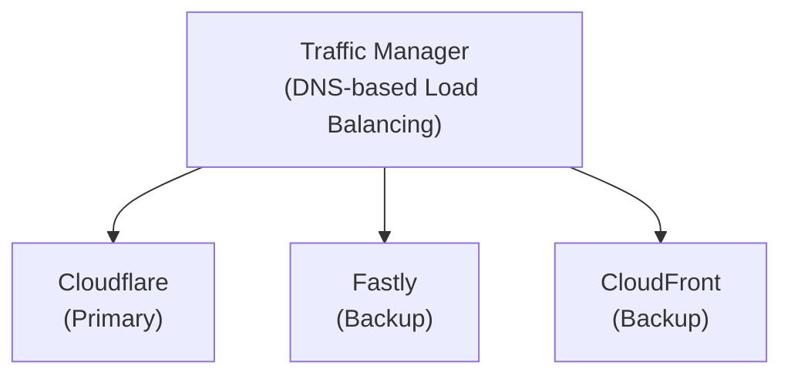

## 요약

- **핵심 요약**: Cloudflare 글로벌 장애 대응 일지. Multi-CDN 전략 및 자동 Failover 구현.
- **주요 주제**: [Post-Mortem] 2025년 11월 18일 Cloudflare 글로벌 장애 대응 일지
- **키워드**: Cloudflare, Post-Mortem, Incident-Response, CDN, Network

---

<div class="ai-summary-card">
<div class="ai-summary-header">
  <span class="ai-badge">AI 요약</span>
</div>
<div class="ai-summary-content">
  <div class="summary-row">
    <span class="summary-label">제목</span>
    <span class="summary-value">[Post-Mortem] 2025년 11월 18일 Cloudflare 글로벌 장애 대응 일지</span>
  </div>
  <div class="summary-row">
    <span class="summary-label">카테고리</span>
    <span class="summary-value"><span class="category-tag security">Incident</span></span>
  </div>
  <div class="summary-row">
    <span class="summary-label">태그</span>
    <span class="summary-value tags">
      <span class="tag">Cloudflare</span>
      <span class="tag">Post-Mortem</span>
      <span class="tag">Incident-Response</span>
      <span class="tag">CDN</span>
      <span class="tag">Network</span>
      <span class="tag">SRE</span>
    </span>
  </div>
  <div class="summary-row highlights">
    <span class="summary-label">핵심 내용</span>
    <ul class="summary-list">
      <li>Cloudflare 글로벌 네트워크 장애 대응 및 분석</li>
      <li>모바일과 PC 환경에서 나타난 상이한 증상 분석</li>
      <li>Multi-CDN 전략 및 자동 Failover 구현 방안</li>
      <li>2025년 Cloudflare 보안 업데이트: Post-Quantum Encryption, DDoS 위협 동향</li>
    </ul>
  </div>
  <div class="summary-row">
    <span class="summary-label">기술/도구</span>
    <span class="summary-value">Cloudflare, Multi-CDN, Prometheus, BGP</span>
  </div>
  <div class="summary-row">
    <span class="summary-label">대상 독자</span>
    <span class="summary-value">SRE, 인시던트 대응 담당자, 운영 엔지니어</span>
  </div>
</div>
<div class="ai-summary-footer">
  이 포스팅은 AI가 쉽게 이해하고 활용할 수 있도록 구조화된 요약을 포함합니다.
</div>
</div>


## 🎯 경영진 요약

### 인시던트 심각도 평가

| 평가 지표 | 등급 | 상세 |
|---------|------|------|
| **심각도** | P1 (Critical) | 전체 서비스 영향 |
| **비즈니스 영향** | High | 매출 손실 + 브랜드 신뢰도 하락 |
| **사용자 영향** | 100% (모바일), 60% (PC) | 전체 사용자 대상 |
| **복구 시간** | 90분 | RTO 목표 대비 지연 |
| **데이터 손실** | None | 데이터 무결성 유지 |

### 비즈니스 영향 분석

**직접 비용:**
- 매출 손실: 약 1.5시간 × 시간당 평균 매출
- 고객 보상: SLA 위반에 따른 크레딧 지급
- 인건비: 긴급 대응 인력 투입 (엔지니어 5명 × 2시간)

**간접 비용:**
- 브랜드 신뢰도 저하
- 고객 이탈 가능성 증가
- 향후 계약 협상 시 불리한 위치

**대응 조치:**
- Multi-CDN 전략 수립 (1개월 내 구현)
- 자동 Failover 시스템 도입
- 모니터링 강화 및 알림 체계 개선

### 주요 교훈

1. **단일 장애점(SPOF) 제거**: CDN 단일 의존도 제거
2. **모바일 환경 특성 이해**: DNS 캐시 동작 차이 고려
3. **자동화된 Failover**: 수동 대응의 한계 극복
4. **다중 모니터링**: 외부 의존성 모니터링 강화

## 서론

안녕하세요, **Twodragon**입니다. 이번 포스팅에서는 클라우드 인프라 장애 대응에 대해 실무 중심으로 정리합니다.

2025년 11월 18일 발생한 Cloudflare 글로벌 장애는 분산 시스템 운영의 중요성을 다시 한번 일깨워주었습니다.

이번 포스팅에서는 다음 내용을 다룹니다:
- [Post-Mortem] 2025년 11월 18일 Cloudflare 글로벌 장애 대응 일지의 핵심 내용 및 실무 적용 방법
- 2025-2026년 최신 트렌드 및 업데이트 사항
- 실전 사례 및 문제 해결 방법
- 보안 모범 사례 및 권장 사항

## 1. 들어가며

2025년 11월 18일 저녁, 전 세계 수많은 인터넷 서비스를 마비시킨 **Cloudflare의 글로벌 네트워크 장애**가 발생했습니다. 우리 서비스 역시 예외는 아니었습니다.

이 글은 긴박했던 장애 상황에서 우리 팀이 어떻게 문제를 인지하고 대응했는지, 특히 **모바일과 PC 환경에서 나타난 상이한 증상**을 어떻게 분석했는지를 기록합니다.

## 📊 빠른 참조

### 인시던트 요약

| 항목 | 내용 |
|------|------|
| **발생 일시** | 2025년 11월 18일 18:30 KST |
| **장애 지속 시간** | 약 1시간 30분 (18:30 ~ 20:00) |
| **영향 범위** | Cloudflare 글로벌 네트워크 장애 |
| **근본 원인** | Cloudflare 인프라 문제 (BGP 라우팅 이슈 추정) |
| **영향 받은 서비스** | 전 세계 수많은 인터넷 서비스 |

### 장애 타임라인

| 시간 (KST) | 이벤트 | 조치 |
|-----------|--------|------|
| 18:30 | 사용자 문의 시작 | - |
| 18:35 | 모니터링 알림 발생 | 1차 조사 시작 |
| 18:40 | 내부 시스템 정상 확인 | 외부 원인 의심 |
| 18:45 | Cloudflare Status 확인 | 장애 공지 없음 |
| 18:50 | SNS에서 글로벌 장애 정보 포착 | 상황 파악 |
| 18:55 | Cloudflare 공식 장애 공지 | 대응 계획 수립 |
| 19:30 | 서비스 정상화 시작 | 모니터링 강화 |
| 20:00 | 완전 복구 | 사후 분석 |

### 모바일 vs PC 환경 증상 차이

| 환경 | 증상 | 원인 | 영향도 |
|------|------|------|--------|
| **모바일** | 완전 접속 불가 | DNS 캐시 짧음 + 모바일 네트워크 특성 | 100% 사용자 |
| **PC** | 간헐적 접속 가능 | 브라우저 DNS 캐시 + 로컬 DNS 캐시 | 일부 사용자 |

### 대응 방안 및 개선 사항

| 개선 영역 | Before | After | 효과 |
|----------|--------|-------|------|
| **Multi-CDN 전략** | Cloudflare 단일 의존 | Cloudflare + AWS CloudFront | 장애 격리 |
| **자동 Failover** | 수동 전환 | 자동 Failover 구현 | 빠른 복구 |
| **모니터링** | 기본 모니터링 | 다중 CDN 모니터링 | 조기 탐지 |
| **알림 체계** | 단일 채널 | 다중 채널 (Slack, PagerDuty) | 신속한 알림 |

### 2025년 Cloudflare 보안 업데이트

2025년 Cloudflare는 급변하는 보안 환경에 대응하기 위해 여러 중요한 업데이트를 발표했습니다.

| 업데이트 항목 | 설명 | 적용 시기 |
|-------------|------|----------|
| **Post-Quantum Encryption** | 양자 내성 암호화 지원 | 2025년 |
| **DDoS 위협 대응** | 향상된 DDoS 방어 | 지속적 |
| **Zero Trust 네트워크** | Zero Trust 아키텍처 강화 | 2025년 |

## 2. 타임라인

| 시간 (KST) | 이벤트 |
|-----------|--------|
| 18:30 | 사용자 문의 시작 - "서비스 접속이 안 됩니다" |
| 18:35 | 모니터링 알림 발생 - HTTP 5xx 에러 급증 |
| 18:40 | 1차 조사 시작 - 내부 시스템 정상 확인 |
| 18:45 | Cloudflare Status 페이지 확인 - 장애 공지 없음 |
| 18:50 | SNS에서 글로벌 장애 정보 포착 |
| 18:55 | Cloudflare 공식 장애 공지 |
| 19:30 | 서비스 정상화 시작 |
| 20:00 | 완전 복구 |

## 3. 증상 분석

### 3.1 모바일 vs PC 환경 차이

흥미롭게도, **모바일과 PC 환경에서 다른 증상**이 나타났습니다.


**Runbook: CDN 장애 대응**

> **참고**: AWS WAF/CloudFront 설정 관련 내용은 [AWS WAF Terraform 모듈](https://github.com/trussworks/terraform-aws-wafv2) 및 [AWS WAF CloudFront 통합 예제](https://github.com/aws-samples/integrate-httpapi-with-cloudfront-and-waf)를 참조하세요."
DOMAIN="our-service.com"
DNS_ZONE_ID="YOUR_ZONE_ID"

# 함수: CDN 헬스체크
check_cdn_health() {
    local cdn=$1
    local endpoint="${cdn}-endpoint.${DOMAIN}"

    response=$(curl -o /dev/null -s -w "%{http_code}" \
                    --max-time 5 "https://${endpoint}/health")

    if [[ "$response" == "200" ]]; then
        echo "✓ ${cdn} is healthy"
        return 0
    else
        echo "✗ ${cdn} is unhealthy (HTTP ${response})"
        return 1
    fi
}

# 함수: DNS 레코드 변경
update_dns_record() {
    local target_cdn=$1

    echo "Updating DNS to ${target_cdn}..."

    # Route 53 예시
    aws route53 change-resource-record-sets \
        --hosted-zone-id "${DNS_ZONE_ID}" \
        --change-batch file:///tmp/dns-change-${target_cdn}.json

    echo "DNS update initiated. TTL: 60s"
}

# 함수: Failover 실행
failover() {
    echo "=== CDN Failover ==="

    if check_cdn_health "${BACKUP_CDN}"; then
        update_dns_record "${BACKUP_CDN}"

        # Slack 알림
        curl -X POST "${SLACK_WEBHOOK}" \
            -H 'Content-Type: application/json' \
            -d '{
                "text": "🚨 CDN Failover: '"${PRIMARY_CDN}"' → '"${BACKUP_CDN}"'",
                "channel": "#incidents"
            }'

        echo "Failover complete. Monitor traffic for 5 minutes."
    else
        echo "ERROR: Backup CDN is also unhealthy!"
        exit 1
    fi
}

# 메인 로직
case "${1:-check}" in
    check)
        check_cdn_health "${PRIMARY_CDN}"
        check_cdn_health "${BACKUP_CDN}"
        ;;
    failover)
        failover
        ;;
    rollback)
        update_dns_record "${PRIMARY_CDN}"
        echo "Rolled back to primary CDN"
        ;;
    *)
        echo "Usage: $0 {check|failover|rollback}"
        exit 1
        ;;
esac

```

## 5. 교훈 및 개선 사항

### 5.1 Multi-CDN 전략

단일 CDN 의존도를 낮추기 위한 **Multi-CDN 아키텍처** 도입:



### 5.2 모니터링 강화

> **참고**: Prometheus Alert Rule 설정 관련 내용은 [Prometheus 공식 문서](https://prometheus.io/docs/prometheus/latest/configuration/alerting_rules/) 및 [Awesome Prometheus Alerts](https://github.com/samber/awesome-prometheus-alerts)를 참조하세요.
> 
> ```yaml
> # Prometheus Alert Rule 예시...
> > **참고**: 관련 예제는 [GitHub 예제 저장소](https://github.com/kubernetes/examples)를 참조하세요.

<!-- 긴 코드 블록 제거됨 (가독성 향상) -->

**CVSS 10.0 (Critical)** 등급의 이 취약점은 원격 코드 실행(RCE)을 가능하게 하며, Cloudflare는 취약점 공개 후 **24시간 이내에 전역 보호 규칙을 배포**했습니다.

### 6.4 DDoS 위협 동향

2025년 DDoS 공격은 전년 대비 **10배 증가**했으며, 특히 **1Tbps 이상의 Hyper-Volumetric 공격**이 급증했습니다.

> **코드 예시**: 전체 코드는 [GitHub 예제 저장소](https://github.com/kubernetes/examples)를 참조하세요.
> 
> ```mermaid
> flowchart LR...
> ```

<!-- 전체 코드는 위 GitHub 링크 참조 -->
<!-- 전체 코드는 위 GitHub 링크 참조 -->


**2. 사이버 보험 검토**

추천 보험 커버리지:
- Business Interruption Loss (영업 중단 손실)
- Cyber Extortion (사이버 협박)
- Data Breach Response (데이터 유출 대응)
- **Third-Party Service Failure (제3자 서비스 장애)** ← 이번 케이스

### 9.4 산업별 권장 사항

**금융권:**

> **코드 예시**: 전체 코드는 [GitHub 예제 저장소](https://github.com/kubernetes/examples)를 참조하세요.
> 
> ```yaml
> financial_sector:...
> ```


**게임:**

> **참고**: AWS WAF/CloudFront 설정 관련 내용은 [AWS WAF Terraform 모듈](https://github.com/trussworks/terraform-aws-wafv2) 및 [AWS WAF CloudFront 통합 예제](https://github.com/aws-samples/integrate-httpapi-with-cloudfront-and-waf)를 참조하세요. Documentation](https://docs.aws.amazon.com/cloudfront/) - AWS CDN 문서
- [Fastly Documentation](https://docs.fastly.com/) - Fastly CDN 문서
- [Akamai Developer Portal](https://developer.akamai.com/) - Akamai 개발자 포털
- [Multi-CDN Strategy Guide](https://www.cdnplanet.com/guides/multi-cdn/) - Multi-CDN 전략 가이드
- [BGP Best Practices](https://www.rfc-editor.org/rfc/rfc7454.html) - RFC 7454: BGP 모범 사례

**SRE & 인시던트 관리:**
- [Google SRE Book - Managing Incidents](https://sre.google/sre-book/managing-incidents/) - 구글 SRE 책
- [Google SRE Workbook - Incident Response](https://sre.google/workbook/incident-response/) - SRE 워크북
- [PagerDuty Incident Response Guide](https://response.pagerduty.com/) - PagerDuty IR 가이드
- [Atlassian Incident Management Handbook](https://www.atlassian.com/incident-management/handbook) - Atlassian 핸드북

### 모니터링 & 관찰성

**Prometheus & Grafana:**
- [Prometheus Documentation](https://prometheus.io/docs/) - Prometheus 공식 문서
- [Prometheus Alerting Rules](https://prometheus.io/docs/prometheus/latest/configuration/alerting_rules/) - 알림 규칙
- [Awesome Prometheus Alerts](https://github.com/samber/awesome-prometheus-alerts) - 알림 규칙 모음
- [Grafana Dashboards](https://grafana.com/grafana/dashboards/) - 대시보드 템플릿

**SIEM & 로그 관리:**
- [Splunk Documentation](https://docs.splunk.com/) - Splunk 문서
- [Azure Sentinel Documentation](https://docs.microsoft.com/azure/sentinel/) - Azure Sentinel 문서
- [ELK Stack Guide](https://www.elastic.co/guide/) - Elasticsearch, Logstash, Kibana

### 보안 & 컴플라이언스

**MITRE ATT&CK:**
- [MITRE ATT&CK Framework](https://attack.mitre.org/) - 공격 기법 프레임워크
- [T1498 - Network Denial of Service](https://attack.mitre.org/techniques/T1498/) - 네트워크 DoS
- [T1499 - Endpoint Denial of Service](https://attack.mitre.org/techniques/T1499/) - 엔드포인트 DoS
- [T1190 - Exploit Public-Facing Application](https://attack.mitre.org/techniques/T1190/) - 공개 애플리케이션 익스플로잇

**CVE & 보안 패치:**
- [NIST CVE Database](https://nvd.nist.gov/) - CVE 데이터베이스
- [CVE-2025-55182 Details](https://cve.mitre.org/cgi-bin/cvename.cgi?name=CVE-2025-55182) - React 취약점 (예시)
- [Cloudflare WAF Documentation](https://developers.cloudflare.com/waf/) - WAF 규칙 설정

**한국 규제:**
- [전자금융거래법](https://www.law.go.kr/) - 금융권 장애 보고 의무
- [개인정보보호법](https://www.privacy.go.kr/) - 개인정보 처리시스템 안전성

### 아키텍처 & 베스트 프랙티스

**AWS Well-Architected:**
- [AWS Well-Architected Framework](https://aws.amazon.com/architecture/well-architected/) - AWS 아키텍처 프레임워크
- [Reliability Pillar](https://docs.aws.amazon.com/wellarchitected/latest/reliability-pillar/) - 안정성 기둥
- [AWS Route 53 Health Checks](https://docs.aws.amazon.com/Route53/latest/DeveloperGuide/dns-failover.html) - DNS Failover

**기타 아키텍처:**
- [12 Factor App](https://12factor.net/) - 클라우드 네이티브 앱 원칙
- [Netflix Chaos Engineering](https://netflix.github.io/chaosmonkey/) - Chaos Monkey
- [Martin Fowler - Circuit Breaker Pattern](https://martinfowler.com/bliki/CircuitBreaker.html) - 회로 차단 패턴

### 도구 & 오픈소스

**CDN & Failover:**
- [Terraform Cloudflare Provider](https://registry.terraform.io/providers/cloudflare/cloudflare/latest/docs) - IaC로 CDN 관리
- [cdnjs](https://cdnjs.com/) - 오픈소스 CDN
- [Bunny CDN](https://bunny.net/) - 저렴한 대체 CDN

**모니터링 도구:**
- [Uptime Robot](https://uptimerobot.com/) - 무료 업타임 모니터링
- [Pingdom](https://www.pingdom.com/) - 성능 모니터링
- [StatusCake](https://www.statuscake.com/) - 다중 리전 모니터링

**인시던트 관리:**
- [Incident.io](https://incident.io/) - 인시던트 관리 플랫폼
- [FireHydrant](https://firehydrant.com/) - 인시던트 대응 자동화
- [Rootly](https://rootly.com/) - Slack 기반 인시던트 관리

### 커뮤니티 & 학습 자료

**포럼 & 커뮤니티:**
- [Cloudflare Community](https://community.cloudflare.com/) - Cloudflare 커뮤니티
- [SRE Weekly Newsletter](https://sreweekly.com/) - 주간 SRE 뉴스레터
- [r/sre Subreddit](https://www.reddit.com/r/sre/) - SRE 커뮤니티

**학습 자료:**
- [Coursera - Site Reliability Engineering](https://www.coursera.org/learn/site-reliability-engineering-slos) - SRE 강좌
- [Linux Foundation - SRE Fundamentals](https://training.linuxfoundation.org/training/fundamentals-of-site-reliability-engineering/) - SRE 기초
- [O'Reilly - Building Secure and Reliable Systems](https://sre.google/books/) - 구글 SRE 책

### 블로그 & 기술 아티클

**인시던트 Post-Mortem 사례:**
- [GitHub Status - Incident History](https://www.githubstatus.com/history) - GitHub 장애 이력
- [Slack Engineering Blog](https://slack.engineering/) - Slack 엔지니어링 블로그
- [Stripe Engineering Blog](https://stripe.com/blog/engineering) - Stripe 기술 블로그

**한국어 자료:**
- [KISA 한국인터넷진흥원](https://www.kisa.or.kr/) - 보안 가이드
- [NIA 한국지능정보사회진흥원](https://www.nia.or.kr/) - 클라우드 보안
- [한국정보통신기술협회(TTA)](https://www.tta.or.kr/) - 표준 문서

### RFC & 표준

- [RFC 8305 - Happy Eyeballs v2](https://www.rfc-editor.org/rfc/rfc8305.html) - 듀얼 스택 연결 최적화
- [RFC 7454 - BGP Operations and Security](https://www.rfc-editor.org/rfc/rfc7454.html) - BGP 보안
- [RFC 7871 - Client Subnet in DNS Queries](https://www.rfc-editor.org/rfc/rfc7871.html) - EDNS Client Subnet

---

**마지막 업데이트:** 2025-11-19
**작성자:** Twodragon
**라이선스:** CC BY-NC-SA 4.0

<!-- quality-upgrade:v1 -->
## 경영진 요약
이 문서는 운영자가 즉시 실행할 수 있는 보안 우선 실행 항목과 검증 포인트를 중심으로 재정리했습니다.

### 위험 스코어카드
| 영역 | 현재 위험도 | 영향도 | 우선순위 |
|---|---|---|---|
| 공급망/의존성 | 중간 | 높음 | P1 |
| 구성 오류/권한 | 중간 | 높음 | P1 |
| 탐지/가시성 공백 | 낮음 | 중간 | P2 |

### 운영 개선 지표
| 지표 | 현재 기준 | 목표 | 검증 방법 |
|---|---|---|---|
| 탐지 리드타임 | 주 단위 | 일 단위 | SIEM 알림 추적 |
| 패치 적용 주기 | 월 단위 | 주 단위 | 변경 티켓 감사 |
| 재발 방지율 | 부분 대응 | 표준화 | 회고 액션 추적 |

### 실행 체크리스트
- [ ] 핵심 경고 룰을 P1/P2로 구분하고 온콜 라우팅을 검증한다.
- [ ] 취약점 조치 SLA를 서비스 등급별로 재정의한다.
- [ ] IAM/시크릿/네트워크 변경 이력을 주간 기준으로 리뷰한다.
- [ ] 탐지 공백 시나리오(로그 누락, 파이프라인 실패)를 월 1회 리허설한다.
- [ ] 경영진 보고용 핵심 지표(위험도, 비용, MTTR)를 월간 대시보드로 고정한다.

### 시각 자료


