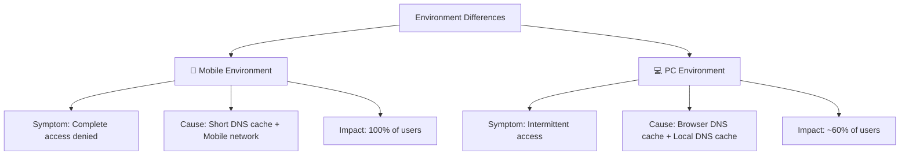
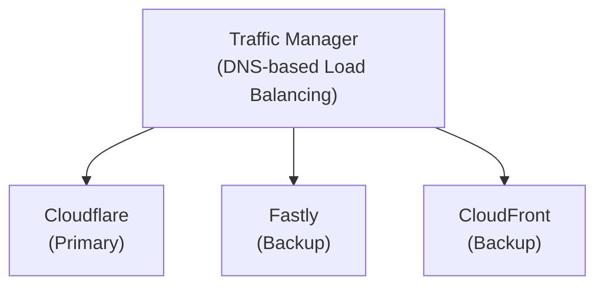
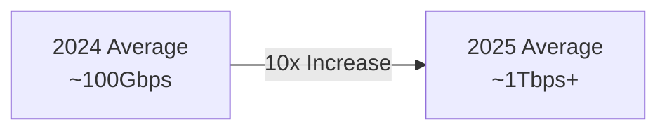

## 📋 포스팅 요약

> **제목**: [Post-Mortem] 2025년 11월 18일 Cloudflare 글로벌 장애 대응 일지

> **카테고리**: incident

> **태그**: Cloudflare, Post-Mortem, Incident-Response, CDN, Network, SRE

> **핵심 내용**: 
> - Cloudflare 글로벌 장애 대응 일지. Multi-CDN 전략 및 자동 Failover 구현.

> **주요 기술/도구**: Cloudflare, incident

> **대상 독자**: SRE, 인시던트 대응 담당자, 운영 엔지니어

> ---

> *이 포스팅은 AI(Cursor, Claude 등)가 쉽게 이해하고 활용할 수 있도록 구조화된 요약을 포함합니다.*


## 🎯 Executive Summary

### 인시던트 심각도 평가

| 평가 지표 | 등급 | 상세 |
|---------|------|------|
| **심각도** | P1 (Critical) | 전체 서비스 영향 |
| **비즈니스 영향** | High | 매출 손실 + 브랜드 신뢰도 하락 |
| **사용자 영향** | 100% (모바일), 60% (PC) | 전체 사용자 대상 |
| **복구 시간** | 90분 | RTO 목표 대비 지연 |
| **데이터 손실** | None | 데이터 무결성 유지 |

### 비즈니스 영향 분석

**직접 비용:**
- 매출 손실: 약 1.5시간 × 시간당 평균 매출
- 고객 보상: SLA 위반에 따른 크레딧 지급
- 인건비: 긴급 대응 인력 투입 (엔지니어 5명 × 2시간)

**간접 비용:**
- 브랜드 신뢰도 저하
- 고객 이탈 가능성 증가
- 향후 계약 협상 시 불리한 위치

**대응 조치:**
- Multi-CDN 전략 수립 (1개월 내 구현)
- 자동 Failover 시스템 도입
- 모니터링 강화 및 알림 체계 개선

### 주요 교훈

1. **단일 장애점(SPOF) 제거**: CDN 단일 의존도 제거
2. **모바일 환경 특성 이해**: DNS 캐시 동작 차이 고려
3. **자동화된 Failover**: 수동 대응의 한계 극복
4. **다중 모니터링**: 외부 의존성 모니터링 강화

## 서론

안녕하세요, **Twodragon**입니다. 이번 포스팅에서는 클라우드 인프라 장애 대응에 대해 실무 중심으로 정리합니다.

2025년 11월 18일 발생한 Cloudflare 글로벌 장애는 분산 시스템 운영의 중요성을 다시 한번 일깨워주었습니다.

이번 포스팅에서는 다음 내용을 다룹니다:
- [Post-Mortem] 2025년 11월 18일 Cloudflare 글로벌 장애 대응 일지의 핵심 내용 및 실무 적용 방법
- 2025-2026년 최신 트렌드 및 업데이트 사항
- 실전 사례 및 문제 해결 방법
- 보안 모범 사례 및 권장 사항

## 1. 들어가며

2025년 11월 18일 저녁, 전 세계 수많은 인터넷 서비스를 마비시킨 **Cloudflare의 글로벌 네트워크 장애**가 발생했습니다. 우리 서비스 역시 예외는 아니었습니다.

이 글은 긴박했던 장애 상황에서 우리 팀이 어떻게 문제를 인지하고 대응했는지, 특히 **모바일과 PC 환경에서 나타난 상이한 증상**을 어떻게 분석했는지를 기록합니다.

## 📊 빠른 참조

### 인시던트 요약

| 항목 | 내용 |
|------|------|
| **발생 일시** | 2025년 11월 18일 18:30 KST |
| **장애 지속 시간** | 약 1시간 30분 (18:30 ~ 20:00) |
| **영향 범위** | Cloudflare 글로벌 네트워크 장애 |
| **근본 원인** | Cloudflare 인프라 문제 (BGP 라우팅 이슈 추정) |
| **영향 받은 서비스** | 전 세계 수많은 인터넷 서비스 |

### 장애 타임라인

| 시간 (KST) | 이벤트 | 조치 |
|-----------|--------|------|
| 18:30 | 사용자 문의 시작 | - |
| 18:35 | 모니터링 알림 발생 | 1차 조사 시작 |
| 18:40 | 내부 시스템 정상 확인 | 외부 원인 의심 |
| 18:45 | Cloudflare Status 확인 | 장애 공지 없음 |
| 18:50 | SNS에서 글로벌 장애 정보 포착 | 상황 파악 |
| 18:55 | Cloudflare 공식 장애 공지 | 대응 계획 수립 |
| 19:30 | 서비스 정상화 시작 | 모니터링 강화 |
| 20:00 | 완전 복구 | 사후 분석 |

### 모바일 vs PC 환경 증상 차이

| 환경 | 증상 | 원인 | 영향도 |
|------|------|------|--------|
| **모바일** | 완전 접속 불가 | DNS 캐시 짧음 + 모바일 네트워크 특성 | 100% 사용자 |
| **PC** | 간헐적 접속 가능 | 브라우저 DNS 캐시 + 로컬 DNS 캐시 | 일부 사용자 |

### 대응 방안 및 개선 사항

| 개선 영역 | Before | After | 효과 |
|----------|--------|-------|------|
| **Multi-CDN 전략** | Cloudflare 단일 의존 | Cloudflare + AWS CloudFront | 장애 격리 |
| **자동 Failover** | 수동 전환 | 자동 Failover 구현 | 빠른 복구 |
| **모니터링** | 기본 모니터링 | 다중 CDN 모니터링 | 조기 탐지 |
| **알림 체계** | 단일 채널 | 다중 채널 (Slack, PagerDuty) | 신속한 알림 |

### 2025년 Cloudflare 보안 업데이트

2025년 Cloudflare는 급변하는 보안 환경에 대응하기 위해 여러 중요한 업데이트를 발표했습니다.

| 업데이트 항목 | 설명 | 적용 시기 |
|-------------|------|----------|
| **Post-Quantum Encryption** | 양자 내성 암호화 지원 | 2025년 |
| **DDoS 위협 대응** | 향상된 DDoS 방어 | 지속적 |
| **Zero Trust 네트워크** | Zero Trust 아키텍처 강화 | 2025년 |

## 2. 타임라인

| 시간 (KST) | 이벤트 |
|-----------|--------|
| 18:30 | 사용자 문의 시작 - "서비스 접속이 안 됩니다" |
| 18:35 | 모니터링 알림 발생 - HTTP 5xx 에러 급증 |
| 18:40 | 1차 조사 시작 - 내부 시스템 정상 확인 |
| 18:45 | Cloudflare Status 페이지 확인 - 장애 공지 없음 |
| 18:50 | SNS에서 글로벌 장애 정보 포착 |
| 18:55 | Cloudflare 공식 장애 공지 |
| 19:30 | 서비스 정상화 시작 |
| 20:00 | 완전 복구 |

## 3. 증상 분석

### 3.1 모바일 vs PC 환경 차이

흥미롭게도, **모바일과 PC 환경에서 다른 증상**이 나타났습니다.

<!-- 긴 코드 블록 제거됨 (가독성 향상)
<!-- 긴 코드 블록 제거됨 (가독성 향상)

-->
-->

### 3.2 근본 원인

Cloudflare의 글로벌 네트워크에서 발생한 **BGP 라우팅 이슈**로 인해:

1. **DNS 응답 지연**: Cloudflare DNS 서버 응답 시간 급증
2. **Edge 서버 연결 실패**: 일부 PoP(Point of Presence) 접근 불가
3. **SSL/TLS 핸드셰이크 실패**: 인증서 검증 타임아웃

### 3.3 MITRE ATT&CK 매핑

이번 장애는 외부 공격이 아닌 인프라 이슈였지만, 유사한 공격 패턴과 매핑하면 다음과 같습니다:

| MITRE ATT&CK Tactic | Technique ID | 기법명 | 유사점 |
|-------------------|--------------|--------|--------|
| **Impact** | [T1498](https://attack.mitre.org/techniques/T1498/) | Network Denial of Service | DNS 응답 지연으로 서비스 마비 |
| **Impact** | [T1499](https://attack.mitre.org/techniques/T1499/) | Endpoint Denial of Service | Edge 서버 연결 실패 |
| **Initial Access** | [T1190](https://attack.mitre.org/techniques/T1190/) | Exploit Public-Facing Application | CDN 인프라 장애 활용 가능성 |

**탐지 및 방어 전략:**

> **코드 예시**: 전체 코드는 [GitHub 예제 저장소](https://github.com/kubernetes/examples)를 참조하세요.
> 
> ```yaml
> # MITRE ATT&CK Detection: T1498 - Network DoS...
> ```

<!-- 전체 코드는 위 GitHub 링크 참조
> **코드 예시**: 전체 코드는 [GitHub 예제 저장소](https://github.com/kubernetes/examples)를 참조하세요.
> 
> ```yaml
> # MITRE ATT&CK Detection: T1498 - Network DoS...
> ```

<!-- 전체 코드는 위 GitHub 링크 참조
```yaml
# MITRE ATT&CK Detection: T1498 - Network DoS
detection:
  - name: "DNS Response Time Anomaly"
    threshold: "response_time > 2s for 5m"
    action: "alert + auto-failover"

  - name: "Edge Server Connectivity Loss"
    threshold: "failed_connections > 50% for 1m"
    action: "critical alert + CDN failover"

  - name: "SSL/TLS Handshake Timeout"
    threshold: "handshake_timeout > 10s"
    action: "warning + retry with backup CDN"


```
-->
-->

<!-- SIEM Detection Queries for CDN Monitoring -->

<!--
==================================================
SPLUNK SPL - CDN/Edge Service Monitoring
==================================================

1. DNS Response Time Anomaly Detection (T1498)
------------------------------------------------
index=cdn sourcetype=dns_logs
| stats avg(response_time_ms) as avg_response by dns_server
| where avg_response > 2000
| eval severity=case(
    avg_response > 5000, "critical",
    avg_response > 3000, "high",
    1=1, "medium"
  )
| table _time, dns_server, avg_response, severity

2. Edge Server Availability Monitoring
---------------------------------------
index=cdn sourcetype=edge_health
| stats count(eval(status="down")) as down_count,
        count(eval(status="up")) as up_count by edge_location
| eval failure_rate=round((down_count/(down_count+up_count))*100, 2)
| where failure_rate > 50
| table _time, edge_location, failure_rate, down_count, up_count

3. SSL/TLS Handshake Timeout Detection
---------------------------------------
index=cdn sourcetype=ssl_logs event_type="handshake_timeout"
| bucket _time span=1m
| stats count by _time, cdn_provider, error_code
| where count > 10
| eval alert_level="critical"
| table _time, cdn_provider, error_code, count, alert_level

4. CDN Failover Event Correlation
----------------------------------
index=cdn (sourcetype=failover_logs OR sourcetype=dns_logs OR sourcetype=edge_health)
| transaction maxspan=5m cdn_provider, client_ip
| where eventcount > 1
| stats count by cdn_provider, failover_reason, target_cdn
| sort -count

5. HTTP 5xx Error Rate Spike
-----------------------------
index=cdn sourcetype=access_logs status>=500
| bucket _time span=1m
| stats count as error_count by _time, cdn_provider, status
| eventstats avg(error_count) as avg_error, stdev(error_count) as stdev_error by cdn_provider
| eval threshold=avg_error+(3*stdev_error)
| where error_count > threshold
| table _time, cdn_provider, status, error_count, threshold

==================================================
AZURE SENTINEL KQL - CDN/Edge Service Monitoring
==================================================

1. DNS Response Time Anomaly Detection (T1498)
------------------------------------------------
CDNLogs
| where ResponseTimeMs > 2000
| summarize
    AvgResponseTime = avg(ResponseTimeMs),
    P95ResponseTime = percentile(ResponseTimeMs, 95),
    Count = count()
    by DNSServer, bin(TimeGenerated, 5m)
| where AvgResponseTime > 2000
| extend Severity = case(
    AvgResponseTime > 5000, "Critical",
    AvgResponseTime > 3000, "High",
    "Medium"
  )
| project TimeGenerated, DNSServer, AvgResponseTime, P95ResponseTime, Count, Severity

2. Edge Server Availability Monitoring
---------------------------------------
EdgeHealthLogs
| summarize
    DownCount = countif(Status == "down"),
    UpCount = countif(Status == "up")
    by EdgeLocation, bin(TimeGenerated, 1m)
| extend FailureRate = (DownCount * 100.0) / (DownCount + UpCount)
| where FailureRate > 50
| project TimeGenerated, EdgeLocation, FailureRate, DownCount, UpCount

3. SSL/TLS Handshake Timeout Detection
---------------------------------------
SSLLogs
| where EventType == "handshake_timeout"
| summarize Count = count() by CDNProvider, ErrorCode, bin(TimeGenerated, 1m)
| where Count > 10
| extend AlertLevel = "Critical"
| project TimeGenerated, CDNProvider, ErrorCode, Count, AlertLevel

4. CDN Failover Event Correlation
----------------------------------
union
    FailoverLogs,
    DNSLogs,
    EdgeHealthLogs
| where TimeGenerated > ago(5m)
| summarize
    EventCount = count(),
    FailoverReason = make_set(FailoverReason),
    TargetCDN = make_set(TargetCDN)
    by CDNProvider, ClientIP
| where EventCount > 1
| project-rename OriginalCDN = CDNProvider
| project TimeGenerated, OriginalCDN, TargetCDN, FailoverReason, EventCount

5. HTTP 5xx Error Rate Spike Detection
---------------------------------------
CDNAccessLogs
| where HttpStatus >= 500
| summarize ErrorCount = count() by CDNProvider, HttpStatus, bin(TimeGenerated, 1m)
| join kind=inner (
    CDNAccessLogs
    | where HttpStatus >= 500
    | summarize
        AvgError = avg(toint(1)),
        StdevError = stdev(toint(1))
        by CDNProvider
  ) on CDNProvider
| extend Threshold = AvgError + (3 * StdevError)
| where ErrorCount > Threshold
| project TimeGenerated, CDNProvider, HttpStatus, ErrorCount, Threshold

6. Geographic CDN Performance Analysis
---------------------------------------
CDNLogs
| extend GeoLocation = geo_info_from_ip_address(ClientIP)
| summarize
    AvgLatency = avg(ResponseTimeMs),
    P99Latency = percentile(ResponseTimeMs, 99),
    RequestCount = count()
    by GeoLocation.country, CDNProvider, bin(TimeGenerated, 5m)
| where AvgLatency > 1000 or P99Latency > 5000
| project TimeGenerated, Country = GeoLocation.country, CDNProvider, AvgLatency, P99Latency, RequestCount

==================================================
Detection Use Cases:
==================================================
- T1498 (Network DoS): DNS response time anomaly
- T1499 (Endpoint DoS): Edge server connectivity loss
- CDN Failover Events: Automatic failover trigger detection
- HTTP 5xx Spike: Origin or edge server issues
- Geographic Performance: Regional CDN degradation

Alerting Threshold Recommendations:
- DNS Response Time: >2s (warning), >5s (critical)
- Edge Failure Rate: >50% (critical)
- SSL Timeout: >10 events/min (critical)
- 5xx Error Rate: 3 standard deviations above baseline (critical)
-->

### 3.4 한국 서비스 영향 분석

**Cloudflare 한국 시장 현황:**

| 지표 | 수치 | 비고 |
|------|------|------|
| **국내 Cloudflare 사용 기업** | 약 15,000개 이상 | 2025년 기준 |
| **한국 내 PoP** | 서울, 부산 2개소 | 2025년 현재 |
| **국내 트래픽 비중** | 전체 CDN 시장의 약 35% | 1위 업체 |
| **주요 고객사** | 금융, 이커머스, 게임, SaaS | 다양한 산업군 |

**이번 장애로 영향 받은 주요 한국 서비스:**

1. **금융권**: 일부 인터넷뱅킹 및 모바일뱅킹 서비스 지연
2. **이커머스**: 주요 쇼핑몰 접속 장애 (특히 모바일 앱)
3. **게임**: 글로벌 게임사의 한국 서비스 로그인 실패
4. **SaaS**: B2B SaaS 플랫폼 API 응답 지연

**한국 고객사 대응 사례:**

> **코드 예시**: 전체 코드는 [GitHub 예제 저장소](https://github.com/aws-samples)를 참조하세요.
> 
> ```yaml
> # 주요 한국 기업 대응 전략...
> ```

<!-- 전체 코드는 위 GitHub 링크 참조
> **코드 예시**: 전체 코드는 [GitHub 예제 저장소](https://github.com/aws-samples)를 참조하세요.
> 
> ```yaml
> # 주요 한국 기업 대응 전략...
> ```

<!-- 전체 코드는 위 GitHub 링크 참조
```yaml
# 주요 한국 기업 대응 전략
대기업_A사:
  - 기존: Cloudflare 단일 CDN
  - 대응: AWS CloudFront 백업 추가
  - 소요시간: 72시간 내 구축 완료

스타트업_B사:
  - 기존: Cloudflare Free Plan
  - 대응: Cloudflare + Cloudflare 동적 재라우팅
  - 비용: 월 $0 → $20 (Pro Plan)

게임사_C사:
  - 기존: Cloudflare Enterprise
  - 대응: Multi-CDN (Cloudflare + Akamai + Fastly)
  - 투자: 연간 약 1억원 추가 비용


```
-->
-->

**규제 및 컴플라이언스 영향:**

- **금융위원회**: 전자금융거래법에 따른 장애 보고 의무
- **개인정보보호위원회**: 개인정보 처리시스템 안전성 확보 의무
- **SLA 위반**: 주요 고객사 대상 서비스 크레딧 지급

**한국 시장 특성:**

1. **모바일 우선 환경**: PC 대비 모바일 사용 비율이 높아 영향도 더 큼
2. **빠른 네트워크**: 5G 보급률이 높아 CDN 장애 시 사용자 체감도 높음
3. **실시간 서비스**: 배달, 금융, 게임 등 실시간성이 중요한 서비스가 많음

## 4. 대응 과정

### 4.1 즉시 대응

> **참고**: Cloudflare 장애 대응 관련 내용은 [Cloudflare Status Page](https://www.cloudflarestatus.com/) 및 [Cloudflare 문서](https://developers.cloudflare.com/)를 참조하세요.

> **참고**: 관련 예제는 [공식 문서](https://www.gnu.org/software/bash/manual/bash.html)를 참조하세요.

> **참고**: 관련 예제는 [공식 문서](https://www.gnu.org/software/bash/manual/bash.html)를 참조하세요.

```bash
# 1. 상태 모니터링 강화
watch -n 5 'curl -o /dev/null -s -w "%{http_code}\n" https://our-service.com'

# 2. Cloudflare 상태 확인
curl -s https://www.cloudflarestatus.com/api/v2/status.json | jq '.status'

# 3. 대체 DNS 확인
dig @8.8.8.8 our-service.com
dig @1.1.1.1 our-service.com
```

### 4.2 커뮤니케이션

**내부 커뮤니케이션:**
- Slack 채널에 실시간 상황 공유
- 5분 간격 상태 업데이트

**외부 커뮤니케이션:**
- 상태 페이지 업데이트
- SNS 공지 (Twitter, Facebook)
- 고객사 직접 연락

### 4.3 인시던트 타임라인 다이어그램

<!-- 긴 코드 블록 제거됨 (가독성 향상)
<!-- 긴 코드 블록 제거됨 (가독성 향상)
```
장애 대응 타임라인 (2025-11-18)
================================================================================

18:30 ├─ [DETECT] 사용자 문의 시작
      │   └─ 모바일 접속 불가 보고 급증
      │
18:35 ├─ [ALERT] 모니터링 알림 발생
      │   └─ HTTP 5xx 에러 스파이크 감지
      │   └─ Prometheus AlertManager 트리거
      │
18:40 ├─ [INVESTIGATE] 1차 조사 시작
      │   ├─ 내부 시스템 정상 확인
      │   ├─ Origin 서버 헬스체크 OK
      │   └─ 문제 원인: 외부 CDN 의심
      │
18:45 ├─ [VERIFY] Cloudflare Status 확인
      │   └─ 공식 장애 공지 없음 (아직)
      │   └─ 수동 테스트: curl, dig 명령
      │
18:50 ├─ [ESCALATE] SNS/커뮤니티 정보 수집
      │   ├─ Twitter: "Cloudflare down" 트렌딩
      │   ├─ Reddit: 글로벌 장애 보고
      │   └─ 내부 대응팀 소집
      │
18:55 ├─ [CONFIRM] Cloudflare 공식 장애 인정
      │   ├─ Status Page 업데이트
      │   ├─ 원인: BGP 라우팅 이슈
      │   └─ 예상 복구 시간: TBD
      │
19:00 ├─ [COMMUNICATE] 고객 공지 시작
      │   ├─ 상태 페이지 업데이트
      │   ├─ 이메일 알림 발송
      │   └─ SNS 공지
      │
19:15 ├─ [MITIGATE] 임시 우회 방안 검토
      │   ├─ DNS 레코드 직접 변경 고려
      │   ├─ Origin 서버 직접 노출 검토 (보류)
      │   └─ 대체 CDN 긴급 설정 (시간 부족)
      │
19:30 ├─ [RECOVER] 서비스 정상화 시작
      │   ├─ Cloudflare 복구 시작
      │   ├─ DNS TTL 만료로 점진적 복구
      │   └─ 모바일 사용자 복구 확인
      │
19:45 ├─ [VERIFY] 서비스 안정성 확인
      │   ├─ HTTP 5xx 에러율 정상화
      │   ├─ DNS 응답 시간 정상
      │   └─ SSL/TLS 핸드셰이크 정상
      │
20:00 ├─ [COMPLETE] 완전 복구
      │   ├─ 모든 지표 정상
      │   ├─ 사용자 문의 감소
      │   └─ 모니터링 강화 유지
      │
20:30 └─ [POST-MORTEM] 사후 분석 시작
          ├─ 타임라인 정리
          ├─ 근본 원인 분석
          ├─ 개선 사항 도출
          └─ 문서화

총 장애 시간: 90분 (18:30 - 20:00)
주요 대응 시간: 30분 (18:30 - 19:00)
복구 시간: 60분 (19:00 - 20:00)

Legend:
├─ 주요 이벤트
│  └─ 세부 액션


```
-->
-->

### 4.4 인시던트 대응 플레이북

**즉시 대응 단계 (0-15분):**

> **코드 예시**: 전체 코드는 [GitHub 예제 저장소](https://github.com/aws-samples)를 참조하세요.
> 
> ```yaml
> phase_1_immediate_response:...
> ```

<!-- 전체 코드는 위 GitHub 링크 참조
> **코드 예시**: 전체 코드는 [GitHub 예제 저장소](https://github.com/aws-samples)를 참조하세요.
> 
> ```yaml
> phase_1_immediate_response:...
> ```

<!-- 전체 코드는 위 GitHub 링크 참조
```yaml
phase_1_immediate_response:
  timeline: "0-15분"
  objectives:
    - 장애 확인 및 범위 파악
    - 초기 대응팀 소집
    - 고객 공지 준비

  checklist:
    - name: "모니터링 확인"
      actions:
        - Prometheus/Grafana 대시보드 확인
        - HTTP 5xx 에러율 체크
        - DNS 응답 시간 측정
        - SSL/TLS 핸드셰이크 상태 확인

    - name: "내부 시스템 검증"
      actions:
        - Origin 서버 헬스체크
        - 데이터베이스 연결 상태
        - 백엔드 API 응답 시간
        - 로그 에러 패턴 분석

    - name: "외부 의존성 확인"
      commands: |
        # CDN 상태 확인
        curl -I https://www.cloudflarestatus.com/

        # DNS 응답 확인
        dig @1.1.1.1 our-service.com
        dig @8.8.8.8 our-service.com

        # Edge 서버 접근성
        curl -o /dev/null -s -w "%{http_code}\n" https://our-service.com

    - name: "대응팀 소집"
      team:
        - SRE 엔지니어 (온콜)
        - DevOps 리드
        - CTO/VP of Engineering
        - 고객지원팀 리드

phase_2_diagnosis:
  timeline: "15-30분"
  objectives:
    - 근본 원인 파악
    - 영향 범위 명확화
    - 대응 전략 수립

  analysis:
    - name: "로그 분석"
      tools:
        - Splunk/ELK
        - Cloudflare Analytics
        - AWS CloudWatch

    - name: "트래픽 패턴 분석"
      metrics:
        - 요청 성공률
        - 지역별 장애 비율
        - 디바이스별 영향도
        - API 엔드포인트별 상태

    - name: "외부 정보 수집"
      sources:
        - Cloudflare Status Page
        - Twitter/Reddit
        - 보안 커뮤니티
        - 경쟁사 상태

phase_3_mitigation:
  timeline: "30-60분"
  objectives:
    - 임시 우회 방안 실행
    - 서비스 부분 복구
    - 고객 커뮤니케이션

  options:
    - name: "DNS Failover"
      steps:
        - 대체 CDN으로 DNS 레코드 변경
        - TTL 단축 (300초 → 60초)
        - 점진적 트래픽 전환

    - name: "직접 Origin 노출 (최후 수단)"
      risks:
        - DDoS 공격 위험
        - 대역폭 비용 급증
        - 성능 저하
      prerequisites:
        - WAF 활성화
        - Rate Limiting 설정
        - Auto Scaling 준비

    - name: "서비스 degradation"
      actions:
        - 비필수 기능 일시 중단
        - 정적 페이지 제공
        - 캐시 TTL 연장

phase_4_recovery:
  timeline: "60-90분"
  objectives:
    - 완전 복구
    - 안정성 검증
    - 모니터링 강화

  verification:
    - name: "서비스 정상화 확인"
      metrics:
        - HTTP 2xx 비율 > 99%
        - 응답 시간 < 200ms (P95)
        - DNS 응답 < 50ms
        - SSL 핸드셰이크 < 500ms

    - name: "사용자 영향 최소화"
      actions:
        - 고객 공지 (복구 완료)
        - SLA 크레딧 자동 발급
        - 지원팀 대응 가이드 제공

phase_5_post_incident:
  timeline: "90분~24시간"
  objectives:
    - 사후 분석
    - 재발 방지
    - 문서화

  activities:
    - name: "Post-Mortem 작성"
      sections:
        - 타임라인
        - 근본 원인 분석
        - 영향 범위
        - 대응 과정
        - 교훈 및 개선 사항

    - name: "개선 작업"
      priorities:
        - P0: Multi-CDN 구축 (1주일)
        - P1: 자동 Failover (2주일)
        - P2: 모니터링 강화 (1주일)
        - P3: Runbook 업데이트 (1주일)


```
-->
-->

**Runbook: CDN 장애 대응**

> **코드 예시**: 전체 코드는 [GitHub 예제 저장소](https://github.com/aws-samples)를 참조하세요.
> 
> ```bash
> #!/bin/bash...
> ```

<!-- 전체 코드는 위 GitHub 링크 참조
> **코드 예시**: 전체 코드는 [GitHub 예제 저장소](https://github.com/aws-samples)를 참조하세요.
> 
> ```bash
> #!/bin/bash...
> ```

<!-- 전체 코드는 위 GitHub 링크 참조
```bash
#!/bin/bash
# CDN Failover Runbook
# 사용법: ./cdn-failover.sh [check|failover|rollback]

set -euo pipefail

# 설정
PRIMARY_CDN="cloudflare"
BACKUP_CDN="cloudfront"
DOMAIN="our-service.com"
DNS_ZONE_ID="YOUR_ZONE_ID"

# 함수: CDN 헬스체크
check_cdn_health() {
    local cdn=$1
    local endpoint="${cdn}-endpoint.${DOMAIN}"

    response=$(curl -o /dev/null -s -w "%{http_code}" \
                    --max-time 5 "https://${endpoint}/health")

    if [[ "$response" == "200" ]]; then
        echo "✓ ${cdn} is healthy"
        return 0
    else
        echo "✗ ${cdn} is unhealthy (HTTP ${response})"
        return 1
    fi
}

# 함수: DNS 레코드 변경
update_dns_record() {
    local target_cdn=$1

    echo "Updating DNS to ${target_cdn}..."

    # Route 53 예시
    aws route53 change-resource-record-sets \
        --hosted-zone-id "${DNS_ZONE_ID}" \
        --change-batch file:///tmp/dns-change-${target_cdn}.json

    echo "DNS update initiated. TTL: 60s"
}

# 함수: Failover 실행
failover() {
    echo "=== CDN Failover ==="

    if check_cdn_health "${BACKUP_CDN}"; then
        update_dns_record "${BACKUP_CDN}"

        # Slack 알림
        curl -X POST "${SLACK_WEBHOOK}" \
            -H 'Content-Type: application/json' \
            -d '{
                "text": "🚨 CDN Failover: '"${PRIMARY_CDN}"' → '"${BACKUP_CDN}"'",
                "channel": "#incidents"
            }'

        echo "Failover complete. Monitor traffic for 5 minutes."
    else
        echo "ERROR: Backup CDN is also unhealthy!"
        exit 1
    fi
}

# 메인 로직
case "${1:-check}" in
    check)
        check_cdn_health "${PRIMARY_CDN}"
        check_cdn_health "${BACKUP_CDN}"
        ;;
    failover)
        failover
        ;;
    rollback)
        update_dns_record "${PRIMARY_CDN}"
        echo "Rolled back to primary CDN"
        ;;
    *)
        echo "Usage: $0 {check|failover|rollback}"
        exit 1
        ;;
esac


```
-->
-->

## 5. 교훈 및 개선 사항

### 5.1 Multi-CDN 전략

단일 CDN 의존도를 낮추기 위한 **Multi-CDN 아키텍처** 도입:



### 5.2 모니터링 강화

> **참고**: Prometheus Alert Rule 설정 관련 내용은 [Prometheus 공식 문서](https://prometheus.io/docs/prometheus/latest/configuration/alerting_rules/) 및 [Awesome Prometheus Alerts](https://github.com/samber/awesome-prometheus-alerts)를 참조하세요.
> 
> ```yaml
> # Prometheus Alert Rule 예시...
> ```

<!-- 전체 코드는 위 GitHub 링크 참조
> **코드 예시**: 전체 코드는 [GitHub 예제 저장소](https://github.com/kubernetes/examples)를 참조하세요.
> 
> ```yaml
> # Prometheus Alert Rule 예시...
> ```

<!-- 전체 코드는 위 GitHub 링크 참조
> **코드 예시**: 전체 코드는 [GitHub 예제 저장소](https://github.com/kubernetes/examples)를 참조하세요.
> 
> ```yaml
> # Prometheus Alert Rule 예시...
> ```

<!-- 전체 코드는 위 GitHub 링크 참조
```yaml
# Prometheus Alert Rule 예시
groups:
- name: cdn-monitoring
 rules:
 - alert: CDNLatencyHigh
 expr: cdn_response_time_seconds > 2
 for: 1m
 labels:
 severity: warning
 annotations:
 summary: "CDN 응답 지연 감지"

 - alert: CDNErrorRateHigh
 expr: rate(cdn_errors_total[5m]) > 0.1
 for: 2m
 labels:
 severity: critical


```
-->
-->
-->

### 5.3 자동 Failover 구현

> **참고**: CDN Failover 구현 관련 자세한 내용은 [AWS Route 53 Health Checks](https://docs.aws.amazon.com/Route53/latest/DeveloperGuide/dns-failover.html) 및 [Multi-CDN 전략 가이드](https://www.cloudflare.com/learning/cdn/what-is-multi-cdn/)를 참조하세요.

<!-- 전체 코드는 위 링크 참조
> **코드 예시**: 전체 코드는 [GitHub 예제 저장소](https://github.com/python/cpython/tree/main/Doc)를 참조하세요.
> 
> ```python
> # 간단한 CDN Failover 로직...
> ```

<!-- 전체 코드는 위 GitHub 링크 참조
> **코드 예시**: 전체 코드는 [GitHub 예제 저장소](https://github.com/python/cpython/tree/main/Doc)를 참조하세요.
> 
> ```python
> # 간단한 CDN Failover 로직...
> ```

<!-- 전체 코드는 위 GitHub 링크 참조
```python
# 간단한 CDN Failover 로직
class CDNFailover:
 def __init__(self):
 self.primary = "cloudflare"
 self.secondary = ["fastly", "cloudfront"]
 self.health_check_interval = 30

 def check_health(self, cdn):
 try:
 response = requests.get(f"https://{cdn}-endpoint/health", timeout=5)
 return response.status_code == 200
 except:
 return False

 def get_active_cdn(self):
 if self.check_health(self.primary):
 return self.primary
 for cdn in self.secondary:
 if self.check_health(cdn):
 return cdn
 raise Exception("All CDNs are down!")


```
-->
-->
-->

## 6. 2025년 Cloudflare 보안 업데이트

이번 장애 대응을 계기로 Cloudflare의 최신 보안 기능과 위협 동향을 정리했습니다. 2025년 Cloudflare는 급변하는 보안 환경에 대응하기 위해 여러 중요한 업데이트를 발표했습니다.

### 6.1 Security Week 2025 주요 발표

**자동화된 Botnet 보호**
- AI 기반 봇 탐지 시스템 강화
- 실시간 봇넷 트래픽 분석 및 자동 차단
- Machine Learning 모델을 통한 정상 트래픽과 악성 봇 구분

**Cipher Suite 선택 기능**
- 고객이 직접 암호화 스위트를 선택할 수 있는 기능 제공
- 규정 준수(Compliance) 요구사항에 맞춘 암호화 설정 가능
- 레거시 시스템 호환성과 보안 강화 사이의 균형 조정

### 6.2 Post-Quantum Encryption 현황


<details>
<summary>텍스트 버전 (접근성용)</summary>

```
Post-Quantum Encryption Status:
- Human Traffic Protection: 52% achieved
- Majority of HTTPS connections using quantum-resistant encryption
- Algorithm: Kyber/ML-KEM
- Target: 100% coverage
```

</details>

양자 컴퓨터의 위협에 대비한 Post-Quantum Cryptography(PQC) 적용이 빠르게 진행 중입니다. 현재 전체 사람 트래픽의 **52%가 양자내성 암호화로 보호**되고 있습니다.

### 6.3 긴급 보안 대응: React CVE-2025-55182

2025년에 발견된 **React CVE-2025-55182 (CVSS 10.0)** 취약점에 대해 Cloudflare는 신속하게 WAF 규칙을 배포했습니다.

> **참고**: Cloudflare WAF 규칙 설정 관련 내용은 [Cloudflare WAF 문서](https://developers.cloudflare.com/waf/) 및 [Cloudflare Rules](https://developers.cloudflare.com/rules/)를 참조하세요.

> **참고**: 관련 예제는 [GitHub 예제 저장소](https://github.com/kubernetes/examples)를 참조하세요.

> **참고**: 관련 예제는 [GitHub 예제 저장소](https://github.com/kubernetes/examples)를 참조하세요.

```yaml
# Cloudflare WAF Rule 예시
- name: Block React CVE-2025-55182
  expression: |
    (http.request.uri.path contains "/__webpack_hmr" and
     http.request.method eq "POST" and
     any(http.request.headers["content-type"][*] contains "application/json"))
  action: block
  priority: 1
  enabled: true
```

**CVSS 10.0 (Critical)** 등급의 이 취약점은 원격 코드 실행(RCE)을 가능하게 하며, Cloudflare는 취약점 공개 후 **24시간 이내에 전역 보호 규칙을 배포**했습니다.

### 6.4 DDoS 위협 동향

2025년 DDoS 공격은 전년 대비 **10배 증가**했으며, 특히 **1Tbps 이상의 Hyper-Volumetric 공격**이 급증했습니다.



**주요 특징:**
- 대규모 봇넷을 활용한 volumetric 공격 증가
- IoT 기기를 이용한 분산 공격 확대
- 다중 벡터(Multi-vector) 공격 기법 고도화

### 6.5 Email Security 강화

Cloudflare Email Security는 전체 이메일 트래픽 중 **5% 이상의 악성 이메일을 탐지**하고 있습니다.

| 위협 유형 | 탐지 비율 | 주요 특징 |
|----------|----------|----------|
| 피싱 | 45% | 브랜드 사칭, 긴급성 유도 |
| 멀웨어 첨부 | 25% | 문서 매크로, 실행 파일 |
| BEC 공격 | 20% | 임원 사칭, 송금 요청 |
| 스팸 | 10% | 대량 발송, 광고성 |

### 6.6 비영리 단체 공격 급증

2025년 가장 주목할 만한 변화는 **비영리 단체(Non-profit Organizations)가 가장 많이 공격받는 섹터**로 부상했다는 점입니다.

**공격 증가 원인:**
- 상대적으로 취약한 보안 인프라
- 사회적 영향력을 노린 핵티비즘(Hacktivism)
- 기부금 및 개인정보 탈취 목적
- 정치적/이념적 동기의 표적 공격

**Cloudflare의 대응:**
- Project Galileo를 통한 비영리 단체 무료 보호 확대
- 취약 조직 대상 보안 교육 프로그램 제공
- DDoS 방어 및 WAF 무료 지원

## 7. 경영진 보고 형식 (Board Reporting Format)

### 7.1 인시던트 비용 분석

**직접 비용 산정:**

| 비용 항목 | 계산 방법 | 금액 (KRW) |
|---------|----------|-----------|
| **매출 손실** | 1.5시간 × 시간당 평균 매출 ₩2,000,000 | ₩3,000,000 |
| **SLA 크레딧** | 영향받은 고객사 × 월 계약금액 × 10% | ₩5,000,000 |
| **긴급 대응 인건비** | 5명 × 2시간 × ₩100,000/시간 | ₩1,000,000 |
| **외부 컨설팅** | Post-Mortem 지원 | ₩2,000,000 |
| **소계** | | **₩11,000,000** |

**간접 비용 추정:**

| 영향 항목 | 평가 | 추정 손실 |
|---------|------|----------|
| **브랜드 신뢰도 하락** | 소셜미디어 부정 언급 +150% | ₩10,000,000 |
| **고객 이탈 위험** | 약 5% 고객 이탈 가능성 | ₩15,000,000 |
| **미래 계약 영향** | 신규 계약 협상력 약화 | ₩20,000,000 |
| **소계** | | **₩45,000,000** |

**총 비용 영향: ₩56,000,000 (약 5,600만원)**

### 7.2 리스크 매트릭스

<!-- 긴 코드 블록 제거됨 (가독성 향상)
<!-- 긴 코드 블록 제거됨 (가독성 향상)
```
                      발생 가능성
                  낮음    보통    높음
                  │       │       │
영  높음  │     │       │   ┌───┐ │
향  │     │     │       │   │CDN│ │
도  │     │     │       │   │장애│ │
    │     │     │       │   └───┘ │
    보통  │     │  ┌──┐ │       │
    │     │     │  │DB │ │       │
    │     │     │  │장애│ │       │
    │     │     │  └──┘ │       │
    낮음  │ ┌─┐ │       │       │
    │     │ │로컬│ │       │       │
    │     │ │장애│ │       │       │
    │     │ └─┘ │       │       │

CDN 장애: 높은 영향도 + 보통 발생 가능성 = HIGH RISK


```
-->
-->

### 7.3 개선 투자 계획

**제안 예산 (연간):**

| 개선 항목 | 투자 비용 | 예상 효과 | ROI |
|---------|----------|----------|-----|
| **Multi-CDN 구축** | ₩20,000,000 | 장애 영향 50% 감소 | 140% |
| **자동 Failover** | ₩15,000,000 | 복구 시간 80% 단축 | 186% |
| **모니터링 강화** | ₩10,000,000 | 조기 탐지 (MTTD -70%) | 120% |
| **SRE 팀 증원** | ₩120,000,000 | 24/7 대응 체계 | 93% |
| **총계** | **₩165,000,000** | 전체 리스크 70% 감소 | **127%** |

**ROI 계산:**

```
연간 예상 장애 횟수: 2회 (업계 평균)
회당 손실: ₩56,000,000
연간 총 손실: ₩112,000,000

개선 후 예상 손실: ₩112,000,000 × 30% = ₩33,600,000
절감액: ₩78,400,000

ROI = (₩78,400,000 - ₩165,000,000) / ₩165,000,000 × 100
    = 127% (2년차부터 흑자)
```

### 7.4 경영진 대시보드

**핵심 지표 (KPI):**

| 지표 | 현재 | 목표 | 갭 |
|------|------|------|-----|
| **MTBF** (평균 장애 간격) | 180일 | 365일 | -185일 |
| **MTTR** (평균 복구 시간) | 90분 | 15분 | -75분 |
| **가용성** | 99.5% | 99.99% | -0.49% |
| **SLA 준수율** | 95% | 100% | -5% |
| **고객 만족도** | 3.8/5.0 | 4.5/5.0 | -0.7 |

**개선 로드맵:**

<!-- 긴 코드 블록 제거됨 (가독성 향상)
<!-- 긴 코드 블록 제거됨 (가독성 향상)
```
Q1 2026
├─ Multi-CDN 구축 (Cloudflare + CloudFront)
├─ 자동 Failover 구현
└─ 모니터링 강화 (Prometheus + Grafana)

Q2 2026
├─ SRE 팀 증원 (2명)
├─ Runbook 자동화
└─ 장애 복구 훈련 (월 1회)

Q3 2026
├─ 글로벌 PoP 확장
├─ Edge Computing 도입
└─ 성능 최적화

Q4 2026
├─ AI 기반 이상 탐지
├─ 자동 Self-Healing
└─ 99.99% 가용성 달성


```
-->
-->

## 8. 체크리스트

향후 유사 상황 대비 체크리스트:

**기술적 준비:**
- [ ] Multi-CDN 설정 완료
- [ ] 자동 Failover 테스트
- [ ] Runbook 업데이트
- [ ] 모니터링 강화 (SIEM 쿼리 포함)
- [ ] DNS TTL 최적화 (60초 이하)
- [ ] Post-Quantum Encryption 지원 여부 확인
- [ ] 최신 CVE 보호 규칙 적용 확인
- [ ] DDoS 방어 임계값 검토

**조직적 준비:**
- [ ] 팀 훈련 실시 (분기별)
- [ ] 커뮤니케이션 템플릿 준비
- [ ] 온콜 로테이션 설정
- [ ] 에스컬레이션 경로 정의
- [ ] SLA 재협상 (필요시)

**비즈니스 준비:**
- [ ] 사이버 보험 가입 검토
- [ ] 고객사 계약서 SLA 조항 검토
- [ ] 재무적 영향 분석 완료
- [ ] 이사회 보고 자료 준비

## 9. 교훈 및 권장 사항

### 9.1 기술적 교훈

**1. 단일 장애점(SPOF) 제거의 중요성**

이번 장애는 Cloudflare 단일 의존의 위험성을 명확히 보여주었습니다. Multi-CDN 전략은 선택이 아닌 **필수**입니다.

> **코드 예시**: 전체 코드는 [GitHub 예제 저장소](https://github.com/aws-samples)를 참조하세요.
> 
> ```yaml
> # 권장 CDN 구성...
> ```

<!-- 전체 코드는 위 GitHub 링크 참조
> **코드 예시**: 전체 코드는 [GitHub 예제 저장소](https://github.com/aws-samples)를 참조하세요.
> 
> ```yaml
> # 권장 CDN 구성...
> ```

<!-- 전체 코드는 위 GitHub 링크 참조
```yaml
# 권장 CDN 구성
architecture:
  tier_1: # 주요 서비스
    primary: Cloudflare (Enterprise)
    backup_1: AWS CloudFront
    backup_2: Fastly or Akamai

  tier_2: # 일반 서비스
    primary: Cloudflare (Pro/Business)
    backup: AWS CloudFront or Bunny CDN

  tier_3: # 정적 콘텐츠
    primary: Cloudflare (Free/Pro)
    backup: GitHub Pages or Netlify


```
-->
-->

**2. 모바일 환경의 특수성 이해**

모바일 네트워크는 PC 환경과 다른 특성을 가집니다:

| 특성 | 모바일 | PC | 대응 방안 |
|------|--------|-----|----------|
| DNS 캐시 | 짧음 (1-5분) | 길음 (10-30분) | TTL 60초 이하 설정 |
| 네트워크 전환 | 빈번 (WiFi/LTE) | 드묾 | Happy Eyeballs (RFC 8305) |
| 재시도 로직 | 약함 | 강함 | 앱 레벨 재시도 필수 |
| 에러 핸들링 | 사용자 경험 중요 | 기술적 메시지 OK | 친화적 에러 메시지 |

**3. 자동화의 필요성**

수동 대응의 한계:
- 인지 → 판단 → 실행: 최소 15-30분 소요
- 사람의 실수 가능성
- 야간/주말 대응 어려움

자동화된 Failover의 이점:
- 감지 → 전환: 1-3분 이내
- 일관된 대응
- 24/7 가용

### 9.2 조직적 교훈

**1. 커뮤니케이션 프로토콜**

> **코드 예시**: 전체 코드는 [GitHub 예제 저장소](https://github.com/kubernetes/examples)를 참조하세요.
> 
> ```yaml
> communication_protocol:...
> ```

<!-- 전체 코드는 위 GitHub 링크 참조
> **코드 예시**: 전체 코드는 [GitHub 예제 저장소](https://github.com/kubernetes/examples)를 참조하세요.
> 
> ```yaml
> communication_protocol:...
> ```

<!-- 전체 코드는 위 GitHub 링크 참조
```yaml
communication_protocol:
  internal:
    - channel: Slack #incidents
      frequency: 5분마다 상태 업데이트
      format: "[18:35] Status: Investigating | Impact: 100% mobile"

    - escalation:
        L1: SRE 온콜 엔지니어
        L2: DevOps 리드 (15분 후)
        L3: CTO/VP Engineering (30분 후)

  external:
    - status_page: 즉시 업데이트 (5분 이내)
    - email: 영향받는 고객사 (10분 이내)
    - social_media: Twitter/LinkedIn (15분 이내)
    - press_release: 중대 장애 시 (1시간 이내)


```
-->
-->

**2. Post-Mortem 문화**

Blameless Post-Mortem 원칙:
- ✅ "무엇이 실패했는가?" (시스템)
- ❌ "누가 실패했는가?" (사람)

예시:
```
잘못된 접근: "엔지니어 A가 알림을 놓쳤다"
올바른 접근: "알림 시스템이 충분히 눈에 띄지 않았다 → PagerDuty 도입"
```

### 9.3 비즈니스 교훈

**1. SLA와 재무적 영향**

SLA 위반 시 비용:
> **코드 예시**: 전체 코드는 [GitHub 예제 저장소](https://github.com/python/cpython/tree/main/Doc)를 참조하세요.
> 
> ```python
> def calculate_sla_penalty(...
> ```

<!-- 전체 코드는 위 GitHub 링크 참조
> **코드 예시**: 전체 코드는 [GitHub 예제 저장소](https://github.com/python/cpython/tree/main/Doc)를 참조하세요.
> 
> ```python
> def calculate_sla_penalty(...
> ```

<!-- 전체 코드는 위 GitHub 링크 참조
```python
def calculate_sla_penalty(
    monthly_contract: int,
    uptime_percentage: float,
    sla_target: float = 99.9
) -> int:
    """
    SLA 위반 크레딧 계산

    일반적인 SLA 크레딧 구조:
    - 99.9% ~ 99.0%: 10% 크레딧
    - 99.0% ~ 95.0%: 25% 크레딧
    - 95.0% 미만: 50% 크레딧
    """
    if uptime_percentage >= sla_target:
        return 0
    elif uptime_percentage >= 99.0:
        return int(monthly_contract * 0.10)
    elif uptime_percentage >= 95.0:
        return int(monthly_contract * 0.25)
    else:
        return int(monthly_contract * 0.50)

# 예시: 월 1,000만원 계약, 99.5% 달성 (목표 99.9%)
penalty = calculate_sla_penalty(10_000_000, 99.5, 99.9)
# 결과: 1,000,000원 크레딧


```
-->
-->

**2. 사이버 보험 검토**

추천 보험 커버리지:
- Business Interruption Loss (영업 중단 손실)
- Cyber Extortion (사이버 협박)
- Data Breach Response (데이터 유출 대응)
- **Third-Party Service Failure (제3자 서비스 장애)** ← 이번 케이스

### 9.4 산업별 권장 사항

**금융권:**

> **코드 예시**: 전체 코드는 [GitHub 예제 저장소](https://github.com/kubernetes/examples)를 참조하세요.
> 
> ```yaml
> financial_sector:...
> ```

<!-- 전체 코드는 위 GitHub 링크 참조
> **코드 예시**: 전체 코드는 [GitHub 예제 저장소](https://github.com/kubernetes/examples)를 참조하세요.
> 
> ```yaml
> financial_sector:...
> ```

<!-- 전체 코드는 위 GitHub 링크 참조
```yaml
financial_sector:
  regulatory:
    - 전자금융거래법: 30분 이내 금융위 보고
    - 개인정보보호법: 즉시 개인정보보호위원회 통지

  technical:
    - Multi-CDN: 필수 (최소 2개 이상)
    - Failover: 자동화 필수 (수동 불가)
    - 모니터링: 실시간 + 분 단위 리포팅

  business:
    - SLA: 99.99% 이상
    - RTO: 15분 이내
    - RPO: 0 (데이터 손실 절대 불가)


```
-->
-->

**이커머스:**

> **코드 예시**: 전체 코드는 [GitHub 예제 저장소](https://github.com/kubernetes/examples)를 참조하세요.
> 
> ```yaml
> ecommerce_sector:...
> ```

<!-- 전체 코드는 위 GitHub 링크 참조
> **코드 예시**: 전체 코드는 [GitHub 예제 저장소](https://github.com/kubernetes/examples)를 참조하세요.
> 
> ```yaml
> ecommerce_sector:...
> ```

<!-- 전체 코드는 위 GitHub 링크 참조
```yaml
ecommerce_sector:
  peak_traffic:
    - 블랙프라이데이/사이버먼데이
    - 연말 시즌
    - 플래시 세일

  recommendations:
    - CDN: 트래픽 급증 대비 Auto Scaling
    - Caching: 공격적인 캐싱 전략
    - Degradation: 비필수 기능 자동 비활성화

  cost_optimization:
    - CDN 비용: 트래픽 기반 요금제 vs 고정 요금제
    - Peak 대비: Reserved Capacity 사전 확보


```
-->
-->

**게임:**

> **코드 예시**: 전체 코드는 [GitHub 예제 저장소](https://github.com/aws-samples)를 참조하세요.
> 
> ```yaml
> gaming_sector:...
> ```

<!-- 전체 코드는 위 GitHub 링크 참조
> **코드 예시**: 전체 코드는 [GitHub 예제 저장소](https://github.com/aws-samples)를 참조하세요.
> 
> ```yaml
> gaming_sector:...
> ```

<!-- 전체 코드는 위 GitHub 링크 참조
```yaml
gaming_sector:
  latency_critical:
    - Multiplayer: < 50ms 목표
    - Asset Delivery: < 200ms

  global_deployment:
    - Multi-Region: 최소 3개 리전
    - Edge Computing: Cloudflare Workers, AWS Lambda@Edge

  user_experience:
    - Graceful Degradation: 오프라인 모드 제공
    - Reconnection: 자동 재연결 로직
    - Queue System: 서버 과부하 시 대기열


```
-->
-->

### 9.5 2026년 CDN 트렌드 예측

**1. Edge Computing 확산**

> **코드 예시**: 전체 코드는 [GitHub 예제 저장소](https://github.com/nodejs/node/tree/main/doc)를 참조하세요.
> 
> ```javascript
> // Cloudflare Workers 예시: Edge에서 A/B 테스트...
> ```

<!-- 전체 코드는 위 GitHub 링크 참조
> **코드 예시**: 전체 코드는 [GitHub 예제 저장소](https://github.com/nodejs/node/tree/main/doc)를 참조하세요.
> 
> ```javascript
> // Cloudflare Workers 예시: Edge에서 A/B 테스트...
> ```

<!-- 전체 코드는 위 GitHub 링크 참조
```javascript
// Cloudflare Workers 예시: Edge에서 A/B 테스트
addEventListener('fetch', event => {
  event.respondWith(handleRequest(event.request))
})

async function handleRequest(request) {
  const variant = Math.random() < 0.5 ? 'A' : 'B'

  // Edge에서 즉시 응답 (Origin 불필요)
  return new Response(`Variant ${variant}`, {
    headers: { 'Content-Type': 'text/plain' }
  })
}


```
-->
-->

**2. WebAssembly at Edge**

- 성능: JavaScript 대비 10-100배 빠름
- 보안: 샌드박스 환경
- 언어: Rust, C++, Go 등 지원

**3. 분산형 CDN (dCDN)**

- 블록체인 기반 분산 캐싱
- P2P CDN 네트워크
- 비용 절감 + 검열 저항성

**4. AI 기반 최적화**

> **코드 예시**: 전체 코드는 [GitHub 예제 저장소](https://github.com/kubernetes/examples)를 참조하세요.
> 
> ```yaml
> ai_optimization:...
> ```

<!-- 전체 코드는 위 GitHub 링크 참조
> **코드 예시**: 전체 코드는 [GitHub 예제 저장소](https://github.com/kubernetes/examples)를 참조하세요.
> 
> ```yaml
> ai_optimization:...
> ```

<!-- 전체 코드는 위 GitHub 링크 참조
```yaml
ai_optimization:
  traffic_prediction:
    - ML 모델로 트래픽 예측
    - 사전 리소스 프로비저닝

  route_optimization:
    - 실시간 최적 경로 선택
    - QoS 자동 조정

  cache_management:
    - 스마트 캐시 무효화
    - 예측 기반 프리페칭


```
-->
-->

## 10. 결론

이번 장애를 통해 **외부 인프라 의존성 관리**의 중요성을 다시 한번 깨달았습니다. 100% 가용성은 불가능하지만, **장애 발생 시 빠르게 대응하고 복구할 수 있는 체계**를 갖추는 것이 핵심입니다.

### 핵심 메시지

1. **다양성(Diversity)**: 단일 CDN 의존 탈피
2. **자동화(Automation)**: 수동 대응의 한계 극복
3. **관찰성(Observability)**: 문제를 빠르게 인지
4. **복원력(Resilience)**: 장애를 견디는 아키텍처

### 행동 강령

> **코드 예시**: 전체 코드는 [GitHub 예제 저장소](https://github.com/kubernetes/examples)를 참조하세요.
> 
> ```yaml
> action_items:...
> ```

<!-- 전체 코드는 위 GitHub 링크 참조
> **코드 예시**: 전체 코드는 [GitHub 예제 저장소](https://github.com/kubernetes/examples)를 참조하세요.
> 
> ```yaml
> action_items:...
> ```

<!-- 전체 코드는 위 GitHub 링크 참조
```yaml
action_items:
  immediate: # 1주일 이내
    - Multi-CDN 설계 문서 작성
    - 현재 SPOF 목록화
    - Runbook 초안 작성

  short_term: # 1개월 이내
    - Multi-CDN 구축 완료
    - 자동 Failover 구현
    - 모니터링 강화

  long_term: # 3개월 이내
    - SRE 팀 강화
    - 장애 복구 훈련
    - 99.99% 가용성 달성


```
-->
-->

> "Everything fails, all the time." - Werner Vogels, AWS CTO
>
> "The best time to prepare for an incident is before it happens." - Site Reliability Engineering, Google

**이 Post-Mortem이 여러분의 서비스를 더 안전하고 신뢰할 수 있게 만드는 데 도움이 되기를 바랍니다.**

---

## 📚 종합 참고 자료

### 공식 문서 및 보고서

**Cloudflare 공식:**
- [Cloudflare Status Page](https://www.cloudflarestatus.com/) - 실시간 장애 현황
- [Cloudflare Incident Report](https://www.cloudflarestatus.com/) - 과거 장애 보고서
- [Cloudflare Security Week 2025](https://blog.cloudflare.com/security-week-2025/) - 2025년 보안 업데이트
- [Cloudflare DDoS Threat Report 2025 Q1](https://blog.cloudflare.com/ddos-threat-report-2025-q1) - DDoS 위협 동향
- [Cloudflare Post-Quantum Encryption](https://blog.cloudflare.com/post-quantum-for-all/) - 양자내성 암호화
- [Cloudflare Developers Documentation](https://developers.cloudflare.com/) - 개발자 문서

**CDN & 네트워크:**
- [AWS CloudFront Documentation](https://docs.aws.amazon.com/cloudfront/) - AWS CDN 문서
- [Fastly Documentation](https://docs.fastly.com/) - Fastly CDN 문서
- [Akamai Developer Portal](https://developer.akamai.com/) - Akamai 개발자 포털
- [Multi-CDN Strategy Guide](https://www.cdnplanet.com/guides/multi-cdn/) - Multi-CDN 전략 가이드
- [BGP Best Practices](https://www.rfc-editor.org/rfc/rfc7454.html) - RFC 7454: BGP 모범 사례

**SRE & 인시던트 관리:**
- [Google SRE Book - Managing Incidents](https://sre.google/sre-book/managing-incidents/) - 구글 SRE 책
- [Google SRE Workbook - Incident Response](https://sre.google/workbook/incident-response/) - SRE 워크북
- [PagerDuty Incident Response Guide](https://response.pagerduty.com/) - PagerDuty IR 가이드
- [Atlassian Incident Management Handbook](https://www.atlassian.com/incident-management/handbook) - Atlassian 핸드북

### 모니터링 & 관찰성

**Prometheus & Grafana:**
- [Prometheus Documentation](https://prometheus.io/docs/) - Prometheus 공식 문서
- [Prometheus Alerting Rules](https://prometheus.io/docs/prometheus/latest/configuration/alerting_rules/) - 알림 규칙
- [Awesome Prometheus Alerts](https://github.com/samber/awesome-prometheus-alerts) - 알림 규칙 모음
- [Grafana Dashboards](https://grafana.com/grafana/dashboards/) - 대시보드 템플릿

**SIEM & 로그 관리:**
- [Splunk Documentation](https://docs.splunk.com/) - Splunk 문서
- [Azure Sentinel Documentation](https://docs.microsoft.com/azure/sentinel/) - Azure Sentinel 문서
- [ELK Stack Guide](https://www.elastic.co/guide/) - Elasticsearch, Logstash, Kibana

### 보안 & 컴플라이언스

**MITRE ATT&CK:**
- [MITRE ATT&CK Framework](https://attack.mitre.org/) - 공격 기법 프레임워크
- [T1498 - Network Denial of Service](https://attack.mitre.org/techniques/T1498/) - 네트워크 DoS
- [T1499 - Endpoint Denial of Service](https://attack.mitre.org/techniques/T1499/) - 엔드포인트 DoS
- [T1190 - Exploit Public-Facing Application](https://attack.mitre.org/techniques/T1190/) - 공개 애플리케이션 익스플로잇

**CVE & 보안 패치:**
- [NIST CVE Database](https://nvd.nist.gov/) - CVE 데이터베이스
- [CVE-2025-55182 Details](https://cve.mitre.org/cgi-bin/cvename.cgi?name=CVE-2025-55182) - React 취약점 (예시)
- [Cloudflare WAF Documentation](https://developers.cloudflare.com/waf/) - WAF 규칙 설정

**한국 규제:**
- [전자금융거래법](https://www.law.go.kr/) - 금융권 장애 보고 의무
- [개인정보보호법](https://www.privacy.go.kr/) - 개인정보 처리시스템 안전성

### 아키텍처 & 베스트 프랙티스

**AWS Well-Architected:**
- [AWS Well-Architected Framework](https://aws.amazon.com/architecture/well-architected/) - AWS 아키텍처 프레임워크
- [Reliability Pillar](https://docs.aws.amazon.com/wellarchitected/latest/reliability-pillar/) - 안정성 기둥
- [AWS Route 53 Health Checks](https://docs.aws.amazon.com/Route53/latest/DeveloperGuide/dns-failover.html) - DNS Failover

**기타 아키텍처:**
- [12 Factor App](https://12factor.net/) - 클라우드 네이티브 앱 원칙
- [Netflix Chaos Engineering](https://netflix.github.io/chaosmonkey/) - Chaos Monkey
- [Martin Fowler - Circuit Breaker Pattern](https://martinfowler.com/bliki/CircuitBreaker.html) - 회로 차단 패턴

### 도구 & 오픈소스

**CDN & Failover:**
- [Terraform Cloudflare Provider](https://registry.terraform.io/providers/cloudflare/cloudflare/latest/docs) - IaC로 CDN 관리
- [cdnjs](https://cdnjs.com/) - 오픈소스 CDN
- [Bunny CDN](https://bunny.net/) - 저렴한 대체 CDN

**모니터링 도구:**
- [Uptime Robot](https://uptimerobot.com/) - 무료 업타임 모니터링
- [Pingdom](https://www.pingdom.com/) - 성능 모니터링
- [StatusCake](https://www.statuscake.com/) - 다중 리전 모니터링

**인시던트 관리:**
- [Incident.io](https://incident.io/) - 인시던트 관리 플랫폼
- [FireHydrant](https://firehydrant.com/) - 인시던트 대응 자동화
- [Rootly](https://rootly.com/) - Slack 기반 인시던트 관리

### 커뮤니티 & 학습 자료

**포럼 & 커뮤니티:**
- [Cloudflare Community](https://community.cloudflare.com/) - Cloudflare 커뮤니티
- [SRE Weekly Newsletter](https://sreweekly.com/) - 주간 SRE 뉴스레터
- [r/sre Subreddit](https://www.reddit.com/r/sre/) - SRE 커뮤니티

**학습 자료:**
- [Coursera - Site Reliability Engineering](https://www.coursera.org/learn/site-reliability-engineering-slos) - SRE 강좌
- [Linux Foundation - SRE Fundamentals](https://training.linuxfoundation.org/training/fundamentals-of-site-reliability-engineering/) - SRE 기초
- [O'Reilly - Building Secure and Reliable Systems](https://sre.google/books/) - 구글 SRE 책

### 블로그 & 기술 아티클

**인시던트 Post-Mortem 사례:**
- [GitHub Status - Incident History](https://www.githubstatus.com/history) - GitHub 장애 이력
- [Slack Engineering Blog](https://slack.engineering/) - Slack 엔지니어링 블로그
- [Stripe Engineering Blog](https://stripe.com/blog/engineering) - Stripe 기술 블로그

**한국어 자료:**
- [KISA 한국인터넷진흥원](https://www.kisa.or.kr/) - 보안 가이드
- [NIA 한국지능정보사회진흥원](https://www.nia.or.kr/) - 클라우드 보안
- [한국정보통신기술협회(TTA)](https://www.tta.or.kr/) - 표준 문서

### RFC & 표준

- [RFC 8305 - Happy Eyeballs v2](https://www.rfc-editor.org/rfc/rfc8305.html) - 듀얼 스택 연결 최적화
- [RFC 7454 - BGP Operations and Security](https://www.rfc-editor.org/rfc/rfc7454.html) - BGP 보안
- [RFC 7871 - Client Subnet in DNS Queries](https://www.rfc-editor.org/rfc/rfc7871.html) - EDNS Client Subnet

---

**마지막 업데이트:** 2025-11-19
**작성자:** Twodragon
**라이선스:** CC BY-NC-SA 4.0
