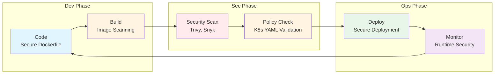
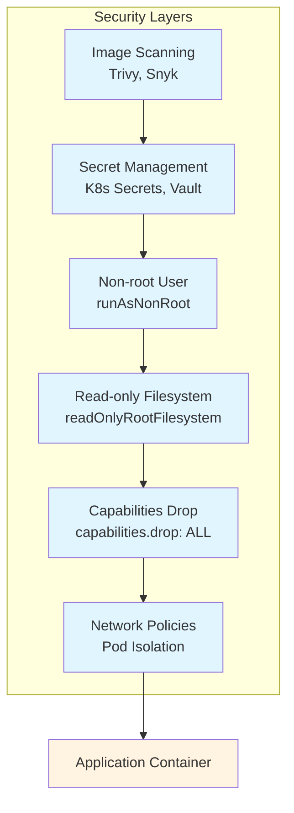
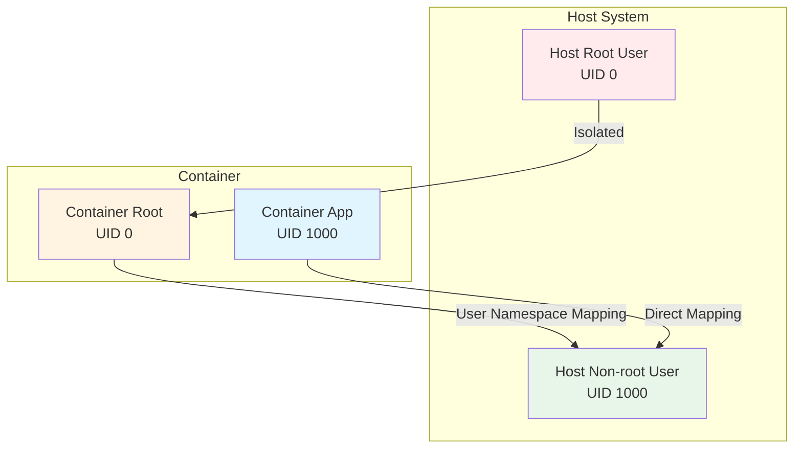

  AI 요약

  

    제목
    클라우드 시큐리티 8기 1주차: 인프라의 본질부터 보안의 미래까지
  

  

    카테고리
    Cloud
  

  

    태그
    
      Infrastructure
      Cloud-Security
      AWS
    
  

  

    핵심 내용
    <ul class="summary-list">
      <li>클라우드 인프라의 본질: 네트워크, 컴퓨팅, 스토리지의 보안 관점</li>
      <li>2025년 클라우드 보안 트렌드: AI 보안, Zero Trust, 클라우드 네이티브 보안</li>
      <li>실무 인프라 보안 이슈 및 대응 방안</li>
    </ul>
  

  

    기술/도구
    AWS, Cloud Infrastructure, Security
  

  

    대상 독자
    클라우드 아키텍트, DevOps 엔지니어, 클라우드 관리자
  

  이 포스팅은 AI가 쉽게 이해하고 활용할 수 있도록 구조화된 요약을 포함합니다.

## 서론

안녕하세요, Twodragon입니다. 드디어 기다리던 클라우드 시큐리티 과정 8기가 힘차게 닻을 올렸습니다! 이번 8기는 온라인미팅에서, '20분 강의 + 5분 휴식'이라는 뇌과학적으로 가장 효율적인 학습 루틴으로 진행됩니다. 단순한 이론 주입식 교육이 아닌, 실무의 고민을 함께 나누는 시간이었습니다. 1주차 핵심 내용을 블로그를 통해 정리해 드립니다.

이 글에서는 클라우드 시큐리티 8기 1주차: 인프라의 본질부터 보안의 미래까지에 대해 실무 중심으로 상세히 다룹니다.

<figure>

<figcaption>AWS 보안 서비스 개요 - Python diagrams로 생성</figcaption>
</figure>

컨테이너 보안은 DevSecOps 사이클을 통해 코드로 관리됩니다:

## 1. 클라우드 인프라의 본질

### 1.1 인프라의 기본 구성 요소

클라우드 보안을 이해하기 위해서는 먼저 클라우드 인프라의 본질을 파악해야 합니다. 클라우드 인프라는 크게 세 가지 핵심 요소로 구성됩니다:

#### 네트워크 (Network)
- **가상 네트워크**: VPC, 서브넷, 라우팅 테이블을 통한 논리적 네트워크 분리
- **네트워크 보안**: Security Group, NACL, 방화벽을 통한 트래픽 제어
- **연결성**: 인터넷 게이트웨이, NAT 게이트웨이, VPN, Direct Connect

#### 컴퓨팅 (Compute)
- **가상 서버**: EC2, Lambda, 컨테이너 등 다양한 컴퓨팅 옵션
- **리소스 관리**: 오토스케일링, 로드 밸런싱을 통한 가용성 확보
- **보안**: IAM 역할, 인스턴스 프로파일을 통한 접근 제어

#### 스토리지 (Storage)
- **데이터 저장**: S3, EBS, EFS 등 다양한 스토리지 옵션
- **데이터 보호**: 암호화, 버전 관리, 백업 및 복구
- **접근 제어**: 버킷 정책, 객체 ACL을 통한 세밀한 권한 관리

### 1.2 보안 관점에서 본 인프라

보안은 인프라의 모든 계층에 걸쳐 적용되어야 합니다:

**방어의 깊이 (Defense in Depth)**
- 네트워크 계층: 네트워크 분리 및 트래픽 필터링
- 애플리케이션 계층: WAF, API 게이트웨이 보안
- 데이터 계층: 암호화, 접근 제어, 데이터 분류

**최소 권한 원칙 (Principle of Least Privilege)**
- 사용자 및 서비스에 필요한 최소한의 권한만 부여
- 정기적인 권한 검토 및 정리
- IAM 정책을 통한 세밀한 접근 제어

**모니터링 및 감사 (Monitoring & Auditing)**
- CloudTrail을 통한 API 호출 로깅
- CloudWatch를 통한 리소스 모니터링
- GuardDuty를 통한 위협 탐지

### 1.3 실무에서 자주 발생하는 인프라 보안 이슈

| 보안 영역 | 주요 이슈 | 위험도 | 대응 방안 |
|----------|---------|-------|----------|
| **네트워크 보안** | Public 서브넷에 데이터베이스 배치 | 높음 | Private 서브넷으로 이동, Security Group 최소 권한 원칙 |
| | 과도하게 개방된 Security Group 규칙 | 높음 | 필요한 포트만 개방, 정기적 검토 |
| | 인터넷 게이트웨이를 통한 불필요한 외부 접근 | 중간 | VPC Endpoint 활용, NAT Gateway 최적화 |
| **접근 제어** | 루트 계정의 일상적 사용 | 높음 | IAM 사용자/역할 사용, 루트 계정 MFA 강제 |
| | 과도한 권한을 가진 IAM 사용자/역할 | 높음 | 최소 권한 원칙 적용, IAM Policy Autopilot 활용 |
| | 하드코딩된 자격 증명 | 높음 | Secrets Manager, 환경 변수 활용 |
| **데이터 보호** | 암호화되지 않은 민감 데이터 저장 | 높음 | S3, EBS 기본 암호화 활성화 |
| | Public 버킷에 민감 정보 노출 | 높음 | Public Access Block 활성화, 버킷 정책 검토 |
| | 백업 및 복구 계획 부재 | 중간 | AWS Backup 자동화, 정기적 복구 테스트 |

## 2. 2025년 클라우드 보안의 핵심 트렌드

### 2.1 AI 보안 위협과 대응

2025년 클라우드 보안에서 AI는 양날의 검이 되었습니다:

#### AI 기반 보안 위협

| 위협 유형 | 설명 | 위험도 | 대응 방안 |
|----------|------|-------|----------|
| **Shadow AI** | 승인되지 않은 AI 도구 사용 | 높음 | AI 사용 정책 수립, 네트워크 트래픽 모니터링, 승인된 AI 도구 화이트리스트 |
| **Deepfakes** | AI 생성 가짜 콘텐츠를 통한 사기 | 높음 | 다중 인증, 대역 외 확인, 음성/영상 인증 강화 |
| **AI 기반 공격** | AI를 활용한 자동화된 공격 | 높음 | 행위 기반 탐지, Rate Limiting, 이상 탐지 시스템 |
| | 지능형 자격 증명 스터핑 | 중간 | 다중 인증, CAPTCHA, 로그인 시도 제한 |
| | 적응형 피싱 | 높음 | AI 탐지 도구, 사용자 교육, 이메일 필터링 강화 |
| | 자율적 취약점 악용 | 높음 | 취약점 스캔 자동화, 패치 관리, 위협 인텔리전스 |

> **참고**: AI 보안 위협 관련 내용은 [OWASP Top 10 for LLM Applications](https://owasp.org/www-project-top-10-for-large-language-model-applications/) 및 [MITRE ATLAS](https://atlas.mitre.org/)를 참조하세요.

#### AI 기반 보안 방어

| 방어 도구 | 설명 | 활용 시나리오 |
|----------|------|-------------|
| **AWS Security Agent (Preview)** | AI 기반 보안 자동화 | 개발 전 과정 보안 자동화 |
| **Amazon GuardDuty Extended Threat Detection** | 공격 시퀀스 탐지 | 복합 공격 패턴 자동 연결 |
| **Copilot Autofix** | 코드 취약점 자동 수정 | 개발 단계 취약점 자동 수정 |
| **IAM Policy Autopilot** | AI 기반 IAM 정책 자동 생성 | 최소 권한 정책 자동 생성 |

### 2.2 Zero Trust 아키텍처 진화

2025년 Zero Trust는 단순한 네트워크 분할을 넘어섰습니다:

**Zero Trust 인증 및 접근 제어 프로세스**:

| 단계 | 프로세스 | 설명 | 결과 |
|------|---------|------|------|
| 1 | 사용자 요청 | 사용자가 리소스 접근 요청 | - |
| 2 | Identity Verification | 사용자 신원 확인 | 인증 성공/실패 |
| 3 | Device Trust Assessment | 디바이스 신뢰성 평가 | 디바이스 상태 확인 |
| 4 | Context Analysis | 컨텍스트 분석 (위치, 시간, 행동 패턴) | 위험도 평가 |
| 5 | Risk Score 계산 | 종합 위험도 점수 계산 | Low/Medium/High |
| 6 | 접근 제어 결정 | 위험도에 따른 접근 권한 부여 | Full/Limited/Block |

**위험도별 접근 제어 정책**:

| 위험도 | 접근 권한 | 추가 조치 | 설명 |
|--------|----------|----------|------|
| **Low** | Full Access | 없음 | 신뢰할 수 있는 사용자/디바이스 |
| **Medium** | Limited Access | MFA 필수 | 부분적 신뢰, 제한적 접근 |
| **High** | Block + Alert | 보안 팀 알림 | 의심스러운 활동, 접근 차단 |

**지속적 모니터링**:

| 모니터링 대상 | 설명 | 목적 |
|-------------|------|------|
| **Identity Verification** | 사용자 인증 상태 지속 확인 | 세션 하이재킹 방지 |
| **Device Trust Assessment** | 디바이스 상태 실시간 모니터링 | 디바이스 변조 탐지 |
| **Context Analysis** | 사용자 행동 패턴 분석 | 이상 행위 탐지 |

#### Zero Trust 2025 핵심 원칙
1. **지속적 검증**: 세션 내 지속적인 신뢰도 평가
2. **최소 권한의 동적 적용**: 상황에 따른 권한 조정
3. **마이크로 세그멘테이션**: 워크로드 수준의 네트워크 분리
4. **AI 기반 이상 탐지**: 행동 분석을 통한 위협 식별

### 2.3 클라우드 네이티브 보안

#### 컨테이너 보안컨테이너 보안은 여러 레이어로 구성된 Defense in Depth 전략을 통해 강화됩니다:

| 보안 영역 | 기능 | 설명 |
|----------|------|------|
| **이미지 스캔** | 빌드 시점 취약점 탐지 | CI/CD 파이프라인에 이미지 스캔 통합 |
| **런타임 보호** | 컨테이너 런타임 보안 | Falco, Aqua Security 등 런타임 보안 도구 |
| **네트워크 정책** | Pod 간 통신 제어 | Kubernetes Network Policies를 통한 마이크로 세그멘테이션 |

#### Kubernetes 보안 (1.32+)| 기능 | 설명 | 보안 이점 |
|------|------|----------|
| **Fine-grained Kubelet API Authorization** | Kubelet API에 대한 세밀한 권한 제어 | 최소 권한 원칙 적용 |
| **Credential Tracking** | 자격 증명 추적 및 관리 | 자격 증명 유출 탐지 |
| **User Namespaces** | Pod 사용자 네임스페이스 격리 | 컨테이너 탈출 위험 감소 |

User Namespaces는 컨테이너 내 root 사용자를 호스트의 비권한 사용자로 매핑하여 컨테이너 탈출 공격의 위험을 크게 감소시킵니다:

| **Pod Certificates for mTLS** | Pod 간 상호 TLS 인증 | 네트워크 트래픽 암호화 |

#### 서버리스 보안

| 보안 기능 | 설명 | 구현 방법 |
|----------|------|----------|
| **Function Permission Boundaries** | Lambda 함수 권한 경계 설정 | 최소 권한 원칙 적용 |
| **Event Source Validation** | 이벤트 소스 검증 | 무단 이벤트 차단 |
| **Execution Environment Isolation** | 실행 환경 격리 | 함수 간 격리 강화 |

> **참고**: 클라우드 네이티브 보안 관련 내용은 [CNCF Security Whitepaper](https://github.com/cncf/tag-security) 및 [Kubernetes 보안 모범 사례](https://kubernetes.io/docs/concepts/security/best-practices/)를 참조하세요.

### 2.4 규제 및 컴플라이언스 동향

2025년 주요 규제 변화:

| 규제 | 주요 변경사항 | 대응 방안 |
|------|--------------|----------|
| **ISMS-P** | AI 보안 요구사항 강화 | AI 거버넌스 프레임워크 수립 |
| **개인정보보호법** | 국외 이전 규정 강화 | 데이터 지역화 검토 |
| **금융보안** | 클라우드 보안 가이드 개정 | 망분리 예외 요건 확인 |
| **EU AI Act** | 고위험 AI 시스템 규제 | AI 리스크 평가 체계 구축 |

### 2.5 FinOps와 보안의 융합

#### 비용 인식 보안 (Cost-Aware Security)

| 전략 | 설명 | 실무 적용 |
|------|------|----------|
| **보안 도구 비용 최적화** | 보안 도구의 비용 효율성 고려 | Security Hub, GuardDuty 비용 모니터링 |
| **리스크 기반 리소스 할당** | 위험도에 따른 보안 투자 우선순위 설정 | 중요도 높은 리소스에 우선 투자 |
| **컴플라이언스 비용 추적** | 규정 준수 비용 관리 | ISMS-P 등 인증 유지 비용 추적 |

#### 보안 인식 FinOps (Security-Aware FinOps)

| 전략 | 설명 | 실무 적용 |
|------|------|----------|
| **데이터 분류 기반 티어링** | 데이터 중요도에 따른 스토리지 티어 선택 | 민감 데이터는 고성능 티어 사용 |
| **암호화 오버헤드 계획** | 암호화로 인한 성능 및 비용 영향 고려 | 암호화 방식 선택 시 비용 고려 |
| **보안 사고 비용 영향** | 보안 사고로 인한 비용 영향 분석 | 사고 대응 비용 추적 및 예산 계획 |

#### 공유 메트릭

| 메트릭 | 설명 | 활용 방법 |
|--------|------|----------|
| **Cost per Protected Asset** | 보호된 자산당 비용 | 보안 투자 효율성 측정 |
| **Security Investment ROI** | 보안 투자 ROI | 보안 투자의 비즈니스 가치 정량화 |
| **Compliance Cost Efficiency** | 컴플라이언스 비용 효율성 | 규정 준수 비용 최적화 |

> **참고**: FinOps와 보안 통합 관련 내용은 [FinOps Foundation](https://www.finops.org/) 및 [AWS Cost Management](https://docs.aws.amazon.com/awsaccountbilling/latest/aboutv2/)를 참조하세요.

## 결론

클라우드 시큐리티 8기 1주차에서는 **인프라의 본질부터 보안의 미래까지** 다뤘습니다.

**인프라의 본질**에서는 클라우드 인프라의 핵심 구성 요소(네트워크, 컴퓨팅, 스토리지)와 보안 관점에서의 인프라 설계 원칙을 살펴봤습니다. 방어의 깊이, 최소 권한 원칙, 모니터링 및 감사가 클라우드 보안의 기초가 됩니다.

**보안의 미래**에서는 2025년 클라우드 보안의 핵심 트렌드를 다뤘습니다:

| 트렌드 | 주요 내용 | 실무 적용 포인트 |
|--------|----------|----------------|
| **AI 보안** | AI 기반 위협과 방어 도구의 진화 | Shadow AI 모니터링, AI 탐지 도구 도입 |
| **Zero Trust** | 지속적 검증과 동적 권한 관리 | 위험도 기반 접근 제어, 지속적 모니터링 |
| **클라우드 네이티브 보안** | 컨테이너와 Kubernetes 보안의 고도화 | 이미지 스캔, 네트워크 정책, 런타임 보호 |
| **규제 및 컴플라이언스** | AI Act, ISMS-P 등 새로운 규제 대응 | AI 거버넌스 프레임워크, 데이터 지역화 검토 |
| **FinOps와 보안의 융합** | 비용 효율적인 보안 운영 | 보안 투자 ROI 측정, 비용 인식 보안 |

**실무에서 자주 발생하는 인프라 보안 이슈**에서는 네트워크 보안, 접근 제어, 데이터 보호 영역의 주요 이슈와 대응 방안을 표 형식으로 정리했습니다. 이러한 이슈들을 사전에 인지하고 대응하는 것이 중요합니다.

클라우드 보안은 단순한 기술 구현이 아닌, 인프라의 본질을 이해하고 미래 트렌드를 선제적으로 대응하는 전략적 접근이 필요합니다. 올바른 인프라 설계와 지속적인 보안 모니터링을 통해 안전하고 효율적인 클라우드 환경을 구축할 수 있습니다. 특히 2025년에는 AI 보안과 Zero Trust 아키텍처가 핵심 트렌드로 부상했으며, 이러한 트렌드를 선제적으로 대응하는 것이 핵심입니다.

---

**원본 포스트**: [클라우드 시큐리티 8기 1주차: 인프라의 본질부터 보안의 미래까지](https://twodragon.tistory.com/701)