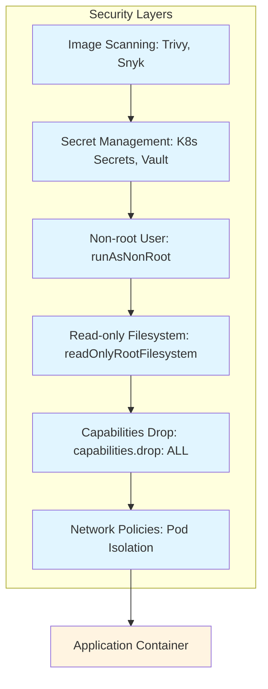
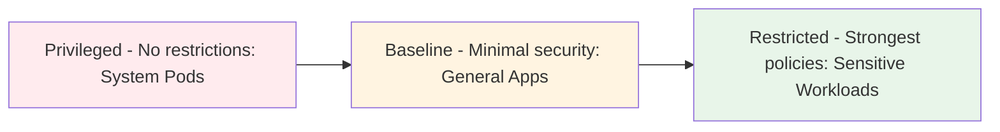
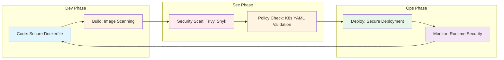

<div class="ai-summary-card">
<div class="ai-summary-header">
  <span class="ai-badge">AI 요약</span>
</div>
<div class="ai-summary-content">
  <div class="summary-row">
    <span class="summary-label">제목</span>
    <span class="summary-value">클라우드 시큐리티 8기 4주차: 통합 보안 취약점 점검 및 ISMS-P 인증 대응 실무</span>
  </div>
  <div class="summary-row">
    <span class="summary-label">카테고리</span>
    <span class="summary-value"><span class="category-tag security">Security</span></span>
  </div>
  <div class="summary-row">
    <span class="summary-label">태그</span>
    <span class="summary-value tags">
      <span class="tag">Vulnerability</span>
      <span class="tag">ISMS-P</span>
      <span class="tag">Compliance</span>
      <span class="tag">Security-Audit</span>
    </span>
  </div>
  <div class="summary-row highlights">
    <span class="summary-label">핵심 내용</span>
    <ul class="summary-list">
      <li>통합 보안 취약점 점검 자동화 도구 활용</li>
      <li>ISMS-P 인증 대응을 위한 실무 가이드</li>
      <li>보안 감사 프로세스 및 컴플라이언스 대응</li>
    </ul>
  </div>
  <div class="summary-row">
    <span class="summary-label">기술/도구</span>
    <span class="summary-value">ISMS-P, Vulnerability Scanner, Compliance Tools</span>
  </div>
  <div class="summary-row">
    <span class="summary-label">대상 독자</span>
    <span class="summary-value">기업 보안 담당자, 보안 엔지니어, CISO</span>
  </div>
</div>
<div class="ai-summary-footer">
  이 포스팅은 AI가 쉽게 이해하고 활용할 수 있도록 구조화된 요약을 포함합니다.
</div>
</div>


## 서론

안녕하세요, Twodragon입니다. 이번 클라우드 시큐리티 과정 8기 4주차에서는 **통합 보안 취약점 점검** 및 **ISMS-P 인증 대응**을 중심으로, 실무에서 즉시 활용 가능한 필수 보안 역량을 다졌습니다. 강의는 집중력 향상과 피로도 최소화를 위해 20분 발표 + 5분 휴식 사이클로 진행되었으며, 이론뿐만 아니라 실질적인 자동화 도구와 가이드를 활용한 실습이 포함되었습니다.

특히 이번 주차에서는 **보안 취약점 점검의 자동화**와 **ISMS-P 인증 대응 실무**에 중점을 두었으며, 2025년 FinOps 트렌드와 보안의 연계, AWS 비용 관리 도구와 보안 통합까지 다뤘습니다.

본 포스팅에서는 통합 보안 취약점 점검 자동화 도구 활용 방법, ISMS-P 인증 대응을 위한 실무 가이드, 보안 감사 프로세스 및 컴플라이언스 대응 전략을 실무 중심으로 상세히 다룹니다.


> **📌 핵심 요약**
> 
> - **통합 보안 취약점 점검**: 자동화 도구를 활용한 지속적인 취약점 모니터링 및 대응
> - **ISMS-P 인증 대응**: 클라우드 환경에서의 ISMS-P 인증 준비 전략 및 실무 가이드
> - **FinOps와 보안 연계**: 비용 최적화와 보안의 균형을 고려한 통합 접근법
> - **AWS 보안 도구 통합**: Cost Optimization Hub, Compute Optimizer와 보안 통합 활용## 1. 통합 보안 취약점 점검 개요


컨테이너 보안은 여러 레이어로 구성된 Defense in Depth 전략을 통해 강화됩니다:




### 1.1 보안 취약점 점검의 중요성

보안 취약점 점검은 조직의 보안 상태를 지속적으로 모니터링하고 개선하기 위한 핵심 프로세스입니다. 특히 클라우드 환경에서는 다음과 같은 이유로 통합적인 접근이 필요합니다:

| 필요성 | 설명 | 영향 |
|--------|------|------|
| **다층적 보안 위협** | 네트워크, 애플리케이션, 데이터 등 다양한 계층의 취약점 존재 | 포괄적 보안 관리 필요 |
| **빠른 변화** | 클라우드 리소스의 동적 생성 및 변경 | 실시간 모니터링 필수 |
| **규정 준수** | ISMS-P, PCI-DSS 등 규정 준수 요구 | 정기적인 취약점 점검 의무 |
| **비용 효율성** | 조기 발견 시 대응 비용 절감 | 예방적 보안 투자 ROI |

### 1.2 통합 보안 취약점 점검 프로세스

| 단계 | 프로세스 | 설명 | 산출물 |
|------|---------|------|--------|
| 1 | **자동 스캔** | 다양한 도구를 통한 자동 취약점 스캔 | 스캔 리포트 |
| 2 | **취약점 분석** | 발견된 취약점의 위험도 평가 및 분류 | 위험도 매트릭스 |
| 3 | **우선순위 설정** | 비즈니스 영향도 기반 우선순위 결정 | 우선순위 목록 |
| 4 | **대응 조치** | 취약점 패치 및 보안 강화 조치 | 대응 계획서 |
| 5 | **검증** | 대응 조치 효과 검증 및 재스캔 | 검증 리포트 |

### 1.3 주요 보안 취약점 유형

| 취약점 유형 | 설명 | 주요 도구 |
|------------|------|----------|
| **인프라 취약점** | VPC 설정, Security Group, IAM 정책 등 | AWS Security Hub, AWS Config |
| **애플리케이션 취약점** | 코드 취약점, 의존성 취약점 등 | SAST, DAST, 의존성 스캔 |
| **데이터 보안 취약점** | 암호화 미적용, 접근 제어 오류 등 | 데이터 분류 도구, 접근 로그 분석 |
| **컴플라이언스 취약점** | 규정 미준수, 정책 위반 등 | 컴플라이언스 스캔 도구 |

## 2. 통합 보안 취약점 점검 자동화 도구

### 2.1 AWS 보안 도구 통합 활용

AWS 환경에서 통합 보안 취약점 점검을 위해 활용할 수 있는 주요 도구들을 정리합니다.

#### AWS Security Hub


Pod Security Standards는 세 가지 보안 레벨을 제공합니다:




**Security Hub**는 AWS 계정의 보안 상태를 중앙에서 통합 관리하는 서비스입니다.

| 기능 | 설명 | 활용 사례 |
|------|------|----------|
| **통합 대시보드** | 모든 AWS 보안 서비스의 결과를 한 곳에서 확인 | 보안 상태 일목요연하게 파악 |
| **자동화된 컴플라이언스 체크** | CIS, PCI-DSS 등 표준 준수 상태 자동 확인 | 규정 준수 자동화 |
| **보안 점수** | 보안 상태를 점수로 시각화 | 보안 개선 우선순위 설정 |
| **인사이트 및 권장사항** | 보안 강화를 위한 구체적인 권장사항 제공 | 실무 적용 가이드 |

#### AWS Config Rules

**Config Rules**는 AWS 리소스 설정을 지속적으로 모니터링하고 평가합니다.

| 규칙 유형 | 설명 | 예시 |
|----------|------|------|
| **관리형 규칙** | AWS가 제공하는 사전 정의된 규칙 | S3 버킷 Public Access 차단 |
| **커스텀 규칙** | 조직의 요구사항에 맞게 정의한 규칙 | 특정 태그 필수 요구 |
| **규칙 평가** | 리소스 변경 시 자동 평가 | 실시간 컴플라이언스 확인 |

> **참고**: AWS Config Rules 설정 관련 자세한 내용은 [AWS Config 공식 문서](https://docs.aws.amazon.com/config/) 및 [AWS Config Rules 예제](https://docs.aws.amazon.com/config/latest/developerguide/managed-rules-by-aws-config.html)를 참조하세요.

#### AWS GuardDuty

**GuardDuty**는 위협 탐지 서비스로, 취약점과 함께 악의적 활동을 탐지합니다.

| 탐지 영역 | 설명 | 주요 기능 |
|---------|------|----------|
| **네트워크 트래픽 분석** | VPC Flow Logs 분석을 통한 이상 트래픽 탐지 | C2 통신, 포트 스캔 탐지 |
| **DNS 쿼리 분석** | DNS 로그 분석을 통한 악성 도메인 접근 탐지 | 데이터 유출, C2 통신 탐지 |
| **클라우드 트레일 분석** | CloudTrail 로그 분석을 통한 권한 남용 탐지 | 권한 에스컬레이션 탐지 |

### 2.2 애플리케이션 보안 스캔 도구

#### 정적 분석 (SAST)

| 도구 | 설명 | 통합 방법 |
|------|------|----------|
| **GitHub CodeQL** | 코드 취약점 정적 분석 | GitHub Actions 통합 |
| **SonarQube** | 코드 품질 및 보안 분석 | CI/CD 파이프라인 통합 |
| **AWS CodeGuru** | ML 기반 코드 리뷰 및 보안 분석 | AWS CodePipeline 통합 |

#### 동적 분석 (DAST)

| 도구 | 설명 | 활용 시나리오 |
|------|------|-------------|
| **OWASP ZAP** | 오픈소스 웹 애플리케이션 보안 스캐너 | 개발 환경 테스트 |
| **Burp Suite** | 상용 웹 보안 테스트 도구 | 프로덕션 전 테스트 |
| **AWS WAF** | 웹 애플리케이션 방화벽 | 실시간 보호 |

#### 의존성 취약점 스캔

| 도구 | 설명 | 통합 방법 |
|------|------|----------|
| **Dependabot** | GitHub 통합 의존성 취약점 스캔 | GitHub Actions 자동화 |
| **npm audit** | npm 패키지 취약점 스캔 | CI/CD 파이프라인 통합 |
| **Snyk** | 종합 의존성 취약점 관리 | 멀티 플랫폼 지원 |

> **참고**: Dependabot 설정 관련 자세한 내용은 [GitHub Dependabot 문서](https://docs.github.com/en/code-security/dependabot) 및 [GitHub Actions 예제](https://docs.github.com/en/actions)를 참조하세요.

### 2.3 통합 보안 스캔 파이프라인 구축

#### CI/CD 파이프라인 통합 예시


컨테이너 보안은 DevSecOps 사이클을 통해 코드로 관리됩니다:




```yaml
# GitHub Actions 예시 (간단한 구조)
name: Security Scan Pipeline

on: [push, pull_request]

jobs:
  security-scan:
    runs-on: ubuntu-latest
    steps:
      - uses: actions/checkout@v3
      
      # 의존성 취약점 스캔
      - name: Dependency Scan
        run: npm audit --audit-level=high
      
      # 정적 분석
      - name: CodeQL Analysis
        uses: github/codeql-action/analyze@v2
      
      # 동적 분석 (스테이징 환경)
      - name: DAST Scan
        if: github.ref == 'refs/heads/main'
        run: |
          # OWASP ZAP 또는 유사 도구 실행
          zap-baseline.py -t https://staging.example.com
      
      # 보안 스캔 결과 검토
      - name: Review Security Findings
        if: failure()
        run: echo "Security issues found. Please review."
```

> **참고**: 전체 CI/CD 보안 파이프라인 설정은 [GitHub Actions 보안 가이드](https://docs.github.com/en/actions/security-guides) 및 [CodeQL 문서](https://docs.github.com/en/code-security/code-scanning/using-codeql-code-scanning-with-your-ci)를 참조하세요.

## 3. ISMS-P 인증 대응 실무 가이드

### 3.1 ISMS-P 인증 개요

ISMS-P(정보보호 및 개인정보보호 관리체계)는 조직의 정보보호 및 개인정보보호 관리 체계를 평가하는 국내 인증 제도입니다.

| 항목 | 내용 |
|------|------|
| **인증 범위** | 정보보호 관리체계(ISMS) + 개인정보보호 관리체계 |
| **인증 의무 대상** | 정보통신서비스 제공자, 집적정보통신시설 사업자 등 |
| **갱신 주기** | 3년 (연간 사후심사) |
| **주요 통제 항목** | 총 114개 통제 항목 (2025년 기준) |

### 3.2 클라우드 환경 ISMS-P 주요 점검 항목

클라우드 환경에서 특히 중요한 ISMS-P 통제 항목을 정리합니다.

| 통제 영역 | 주요 항목 | AWS 대응 방안 |
|----------|---------|--------------|
| **2.5 인증 및 권한관리** | IAM 정책, MFA 적용, 권한 최소화 | AWS IAM, MFA 강제, IAM Policy Autopilot |
| **2.6 접근통제** | VPC 네트워크 분리, Security Group 관리 | VPC 설계, Security Group 최소 권한 원칙 |
| **2.9 시스템 및 서비스 보안관리** | 보안 패치, 취약점 점검 | AWS Systems Manager Patch Manager, Security Hub |
| **2.10 시스템 및 서비스 운영관리** | 로깅, 모니터링, 백업 | CloudTrail, CloudWatch, AWS Backup |
| **2.11 암호화** | 데이터 암호화, 키 관리 | AWS KMS, S3 암호화, EBS 암호화 |
| **2.12 개인정보보호** | 개인정보 처리, 보관, 파기 | 데이터 분류, 접근 제어, 보관 기간 관리 |

### 3.3 ISMS-P 인증 준비 프로세스

| 단계 | 프로세스 | 설명 | 산출물 |
|------|---------|------|--------|
| 1 | **준비 단계** | 인증 범위 결정, 팀 구성, 일정 수립 | 인증 계획서 |
| 2 | **문서화** | 보안 정책, 절차서, 매뉴얼 작성 | 보안 관리 문서 |
| 3 | **구현** | 보안 통제 항목 구현 및 운영 | 구현 증빙 자료 |
| 4 | **내부 심사** | 자체 보안 감사 수행 | 내부 심사 보고서 |
| 5 | **인증 신청** | 인증 기관에 인증 신청 | 인증 신청서 |
| 6 | **현장 심사** | 인증 기관의 현장 심사 대응 | 심사 대응 자료 |
| 7 | **인증 획득** | 인증서 발급 및 유지 관리 | 인증서 |

### 3.4 AWS 기반 ISMS-P 대응 전략

#### AWS Artifact 활용

**AWS Artifact**는 AWS의 컴플라이언스 문서를 제공하는 서비스입니다.

| 문서 유형 | 설명 | 활용 방법 |
|----------|------|----------|
| **컴플라이언스 보고서** | SOC, PCI-DSS 등 인증 보고서 | ISMS-P 심사 시 증빙 자료로 제출 |
| **합의 평가 보고서** | AWS 서비스의 보안 평가 결과 | 클라우드 서비스 보안 수준 증명 |
| **계약 문서** | AWS 서비스 이용 약관 | 계약 관리 체계 증빙 |

#### AWS Config Rules를 통한 자동 컴플라이언스 확인

| Config Rule | ISMS-P 항목 | 설명 |
|------------|-----------|------|
| **s3-bucket-public-read-prohibited** | 2.6 접근통제 | S3 버킷 Public 읽기 차단 |
| **iam-password-policy** | 2.5 인증 및 권한관리 | IAM 비밀번호 정책 준수 |
| **encrypted-volumes** | 2.11 암호화 | EBS 볼륨 암호화 확인 |
| **cloud-trail-enabled** | 2.10 시스템 운영관리 | CloudTrail 활성화 확인 |

> **💡 실무 팁**
> 
> ISMS-P 인증 준비 시 주의사항:
> - **조기 준비**: 인증 신청 전 최소 6개월 이상 준비 기간 확보
> - **문서화**: 모든 보안 활동을 문서화하여 증빙 자료 준비
> - **지속적 개선**: 인증 획득 후에도 지속적인 보안 개선 활동 수행
> - **팀 구성**: 보안, 개발, 운영 등 다양한 역할의 팀 구성

## 4. 2025년 FinOps 트렌드와 보안 연계

### 4.1 비용 최적화와 보안의 균형

2025년 클라우드 환경에서는 **비용 최적화와 보안**을 동시에 고려해야 합니다. FinOps와 보안은 상호 보완적인 관계입니다.

#### AI/ML 비용 최적화와 보안

GenAI 워크로드의 급증으로 AI 인프라 비용 관리가 핵심 과제로 부상했습니다.

| 항목 | 보안 고려사항 | 비용 최적화 방안 |
|------|------------|--------------|
| **GPU 인스턴스 보안** | AI 학습 환경의 데이터 보호 및 접근 통제 | Spot Instance 활용 (최대 90% 절감) |
| **모델 보안과 비용** | 모델 보안 강화 시 컴퓨팅 비용 최적화 고려 | 모델 경량화, 배치 처리 |
| **Spot Instance 보안** | 중단 가능한 워크로드의 데이터 무결성 보장 | 체크포인트 저장, 자동 재시작 |

#### FinOps + GreenOps + Security 통합

탄소 발자국 추적, 비용 최적화, 보안을 통합 관리하는 **Triple Bottom Line** 접근법이 확산되고 있습니다.

| 영역 | 통합 전략 | 효과 |
|------|---------|------|
| **지속 가능한 보안 아키텍처** | 에너지 효율적인 보안 솔루션 선택 | 비용 절감 + 환경 보호 |
| **보안 로그 최적화** | 필요한 로그만 장기 보관하여 비용 절감 | 스토리지 비용 절감 + 보안 유지 |
| **그린 리전 선택** | 재생 에너지 비율이 높은 리전 우선 사용 | 환경 영향 감소 + 비용 최적화 |

### 4.2 AWS 비용 관리 도구와 보안 통합

#### AWS Cost Optimization Hub

권장 사항을 중앙에서 관리하며, 보안 설정과 비용 최적화를 함께 검토할 수 있습니다.

| 기능 | 설명 | 보안 연계 |
|------|------|----------|
| **통합 대시보드** | 비용 최적화와 보안 권장 사항 통합 관리 | 보안과 비용의 균형 고려 |
| **우선순위 기반 접근** | 비용 절감과 보안 강화 균형 | 보안 우선순위 반영 |
| **실행 추적** | 최적화 실행 현황 모니터링 | 보안 영향도 모니터링 |

#### AWS Compute Optimizer

AI 기반 right-sizing 권장으로 **적정 규모의 보안 인프라** 구성을 지원합니다.

| 최적화 대상 | 보안 고려사항 | 비용 절감 효과 |
|------------|------------|-------------|
| **보안 도구 인스턴스** | SIEM, IDS/IPS 등 보안 솔루션 right-sizing | 보안 성능 유지하며 비용 절감 |
| **암호화 오버헤드** | 암호화 성능과 비용의 균형 | 적정 암호화 수준 유지 |
| **로그 저장소** | 보안 로그 보관 기간과 비용 최적화 | 필요 기간만 보관하여 비용 절감 |

#### Real-time Cost Visibility와 보안

실시간 비용 모니터링은 **보안 이상 징후 탐지**에도 활용됩니다.

| 기능 | 설명 | 보안 활용 |
|------|------|----------|
| **AWS Cost Anomaly Detection** | 비정상 비용 발생 시 보안 침해 가능성 검토 | 암호화폐 채굴 등 악성 행위 탐지 |
| **비용 기반 위협 탐지** | 비용 이상 패턴을 통한 보안 위협 식별 | 비정상적인 리소스 사용 탐지 |
| **예산 알림** | 예산 초과 전 선제적 알림 | 보안 사고로 인한 비용 급증 조기 발견 |

### 4.3 Unit Economics와 보안 투자

비즈니스 메트릭과 클라우드 비용을 연계하여 **보안 투자 ROI**를 측정합니다.

| 메트릭 | 설명 | 활용 방법 |
|--------|------|----------|
| **Cost per Secured Transaction** | 보안이 적용된 트랜잭션당 비용 | 보안 투자 효율성 측정 |
| **보안 비용 대비 리스크 감소** | 보안 투자의 비즈니스 가치 정량화 | 보안 ROI 계산 |
| **컴플라이언스 비용 추적** | ISMS-P 등 인증 유지 비용 관리 | 컴플라이언스 비용 최적화 |

## 5. 보안 감사 프로세스 및 컴플라이언스 대응

### 5.1 보안 감사 프로세스

보안 감사는 조직의 보안 상태를 정기적으로 평가하고 개선하기 위한 핵심 프로세스입니다.

#### 감사 유형

| 감사 유형 | 설명 | 주기 | 담당자 |
|----------|------|------|--------|
| **내부 감사** | 조직 내부에서 수행하는 자체 보안 감사 | 분기별 | 보안 팀 |
| **외부 감사** | 외부 전문 기관이 수행하는 보안 감사 | 연간 | 인증 기관 |
| **컴플라이언스 감사** | 규정 준수 여부를 확인하는 감사 | 규정별 상이 | 컴플라이언스 팀 |
| **기술 감사** | 기술적 취약점을 중심으로 하는 감사 | 월간 | 보안 엔지니어 |

#### 감사 프로세스

| 단계 | 프로세스 | 설명 | 산출물 |
|------|---------|------|--------|
| 1 | **감사 계획** | 감사 범위, 일정, 방법 수립 | 감사 계획서 |
| 2 | **감사 수행** | 보안 상태 점검 및 평가 | 감사 체크리스트 |
| 3 | **결과 분석** | 발견된 문제점 분석 및 우선순위 설정 | 감사 결과 보고서 |
| 4 | **개선 조치** | 문제점 개선 및 보완 조치 | 개선 계획서 |
| 5 | **후속 조치** | 개선 조치 효과 검증 및 재감사 | 후속 조치 보고서 |

### 5.2 컴플라이언스 대응 전략

#### 주요 컴플라이언스 요구사항

| 규정/표준 | 주요 요구사항 | AWS 대응 방안 |
|----------|------------|--------------|
| **ISMS-P** | 정보보호 및 개인정보보호 관리체계 | Security Hub, Config Rules, CloudTrail |
| **PCI-DSS** | 결제 카드 산업 데이터 보안 표준 | AWS PCI-DSS 컴플라이언스 패키지 |
| **GDPR** | 유럽 일반 데이터 보호 규정 | 데이터 분류, 접근 제어, 암호화 |
| **HIPAA** | 미국 의료 정보 보호법 | AWS BAA(Business Associate Agreement) |
| **SOC 2** | 서비스 조직 통제 보고서 | AWS Artifact SOC 보고서 활용 |

#### 컴플라이언스 자동화

| 자동화 영역 | 도구 | 설명 |
|------------|------|------|
| **컴플라이언스 체크** | AWS Config Rules | 규정 준수 상태 자동 확인 |
| **보고서 생성** | AWS Security Hub | 컴플라이언스 현황 자동 보고 |
| **증빙 자료 수집** | AWS Artifact | 컴플라이언스 문서 자동 수집 |
| **알림 및 대응** | CloudWatch Alarms | 규정 위반 시 자동 알림 |

> **💡 실무 팁**
> 
> 컴플라이언스 대응 시 주의사항:
> - **조기 준비**: 규정 변경 시 즉시 대응 계획 수립
> - **자동화 우선**: 수동 작업은 최소화하고 자동화 도구 활용
> - **지속적 모니터링**: 컴플라이언스 상태를 지속적으로 모니터링
> - **문서화**: 모든 컴플라이언스 활동을 문서화하여 증빙 자료 준비

## 6. 실무 적용 방안

### 6.1 즉시 적용 가능한 조치 (1개월 이내)

| 조치 항목 | 적용 방법 | 예상 효과 | 우선순위 |
|----------|---------|----------|---------|
| **Security Hub 활성화** | 모든 AWS 계정에서 Security Hub 활성화 | 통합 보안 관리 시작 | 높음 |
| **Config Rules 설정** | 주요 컴플라이언스 규칙 활성화 | 자동 컴플라이언스 확인 | 높음 |
| **의존성 스캔 자동화** | CI/CD 파이프라인에 의존성 스캔 통합 | 취약점 조기 발견 | 높음 |
| **보안 로그 중앙화** | CloudTrail, VPC Flow Logs 중앙 수집 | 보안 가시성 향상 | 중간 |
| **보안 정책 문서화** | 보안 정책 및 절차 문서화 | ISMS-P 준비 시작 | 중간 |

### 6.2 단기 개선 방향 (3-6개월)

| 개선 항목 | 적용 방법 | 예상 효과 | 투자 규모 |
|----------|---------|----------|----------|
| **통합 보안 대시보드** | Security Hub, GuardDuty 통합 대시보드 구축 | 보안 상태 일목요연하게 파악 | 중간 |
| **자동화된 대응 플레이북** | Security Hub와 Lambda를 통한 자동 대응 | 대응 시간 단축 | 중간 |
| **ISMS-P 인증 준비** | 인증 준비 프로세스 시작, 문서화 체계 구축 | 인증 준비 진행 | 높음 |
| **보안 교육 프로그램** | 개발자 및 운영자 보안 교육 실시 | 보안 인식 제고 | 낮음 |

### 6.3 중장기 개선 방향 (6-12개월)

| 개선 항목 | 적용 방법 | 예상 효과 | 투자 규모 |
|----------|---------|----------|----------|
| **ISMS-P 인증 획득** | 인증 신청 및 현장 심사 대응 | 규정 준수 증명 | 높음 |
| **보안 문화 구축** | 보안 챔피언 프로그램, 보안 메트릭 통합 | 조직 전반 보안 인식 제고 | 중간 |
| **고급 위협 탐지** | ML 기반 이상 탐지, 행위 분석 | 고급 위협 조기 발견 | 높음 |
| **FinOps와 보안 통합** | 비용 최적화와 보안의 균형 관리 | 비용 효율적인 보안 운영 | 중간 |

## 7. 모범 사례 및 주의사항

### 7.1 보안 모범 사례

| 모범 사례 | 설명 | 실무 적용 |
|----------|------|----------|
| **정기적인 보안 점검** | 취약점 스캔 및 보안 감사 정기 수행 | 월간 자동 스캔, 분기별 보안 감사 |
| **자동화된 보안 스캔** | CI/CD 파이프라인에 보안 스캔 통합 | 모든 배포 전 자동 보안 검사 |
| **최소 권한 원칙** | 필요한 최소한의 권한만 부여 | IAM Policy Autopilot 활용 |
| **심층 방어 전략** | 여러 레이어의 보안 통제 적용 | 네트워크, 애플리케이션, 데이터 계층 보안 |
| **보안 by Design** | 설계 단계부터 보안 고려 | Shift-Left Security 적용 |

### 7.2 운영 모범 사례

| 모범 사례 | 설명 | 실무 적용 |
|----------|------|----------|
| **변경 관리** | 모든 변경사항 문서화 및 승인 | 변경 요청 프로세스 수립 |
| **백업 및 복구** | 정기적인 백업 및 복구 테스트 | AWS Backup 자동화, 월간 복구 테스트 |
| **문서화** | 보안 정책 및 절차 문서화 | Confluence, Notion 등 활용 |
| **지속적 모니터링** | 실시간 보안 모니터링 및 알림 | CloudWatch, Security Hub 통합 |
| **사고 대응** | 보안 사고 대응 프로세스 수립 | IR(Incident Response) 플레이북 준비 |

### 7.3 주의사항

> **⚠️ 보안 주의사항**
> 
> 통합 보안 취약점 점검 및 ISMS-P 인증 대응 시 주의사항:
> 
> - **과도한 자동화**: 자동화 도구의 False Positive를 고려하여 알림 규칙 최적화 필요
> - **비용 관리**: 보안 도구 사용량 모니터링 및 비용 최적화 필요
> - **인증 준비 시간**: ISMS-P 인증 준비에는 최소 6개월 이상의 시간 필요
> - **지속적 개선**: 인증 획득 후에도 지속적인 보안 개선 활동 필수
> - **팀 역량**: 보안 전문 인력 확보 및 교육 필요

## 결론

클라우드 시큐리티 8기 4주차에서는 **통합 보안 취약점 점검** 및 **ISMS-P 인증 대응 실무**를 중심으로 다뤘습니다.

**통합 보안 취약점 점검**에서는 AWS Security Hub, Config Rules, GuardDuty 등 AWS 보안 도구를 활용한 자동화된 취약점 점검 방법을 살펴봤습니다. SAST, DAST, 의존성 스캔 등 다양한 보안 스캔 도구를 CI/CD 파이프라인에 통합하여 개발 단계에서부터 보안을 강화하는 방법을 다뤘습니다.

**ISMS-P 인증 대응**에서는 클라우드 환경에서의 ISMS-P 인증 준비 전략을 다뤘습니다. AWS Artifact, Config Rules, Security Hub 등을 활용한 컴플라이언스 대응 방법과 인증 준비 프로세스를 실무 중심으로 정리했습니다.

**2025년 FinOps 트렌드와 보안 연계**에서는 비용 최적화와 보안의 균형을 고려한 통합 접근법을 다뤘습니다. Cost Optimization Hub, Compute Optimizer 등 AWS 비용 관리 도구와 보안의 통합 활용 방법을 살펴봤습니다.

**보안 감사 프로세스 및 컴플라이언스 대응**에서는 보안 감사의 유형과 프로세스, 주요 컴플라이언스 요구사항 대응 전략을 정리했습니다.

보안은 한 번 설정하고 끝나는 것이 아니라 지속적인 관리와 개선이 필요합니다. 통합 보안 취약점 점검과 ISMS-P 인증 대응을 통해 안전하고 규정을 준수하는 클라우드 환경을 구축할 수 있습니다.

---

**원본 포스트**: [클라우드 시큐리티 8기 4주차: 통합 보안 취약점 점검 및 ISMS-P 인증 대응 실무](https://twodragon.tistory.com/705)