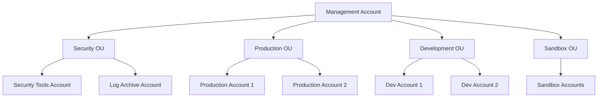
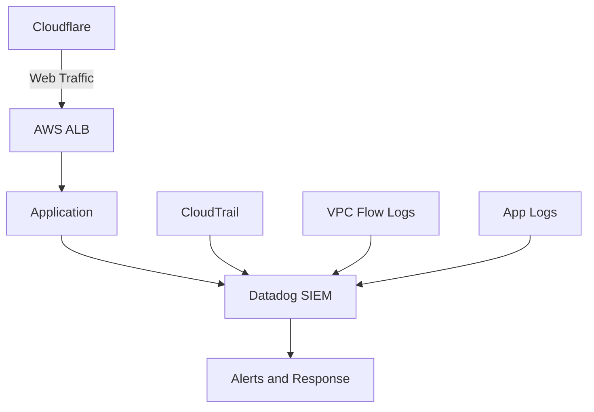
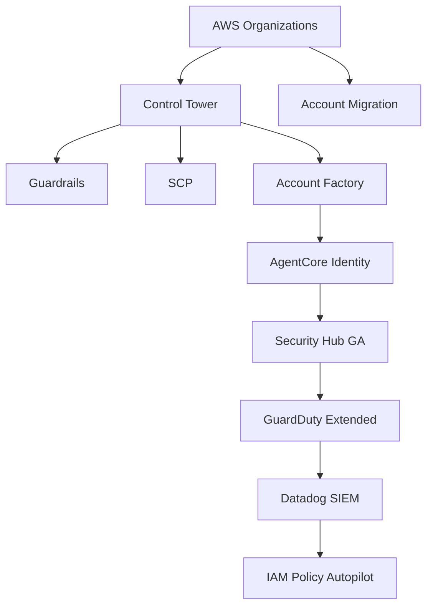

<div class="ai-summary-card">
<div class="ai-summary-header">
  <span class="ai-badge">AI 요약</span>
</div>
<div class="ai-summary-content">
  <div class="summary-row">
    <span class="summary-label">제목</span>
    <span class="summary-value">클라우드 시큐리티 과정 8기 5주차: AWS Control Tower/SCP 기반 거버넌스 및 Datadog SIEM, Cloudflare 보안</span>
  </div>
  <div class="summary-row">
    <span class="summary-label">카테고리</span>
    <span class="summary-value"><span class="category-tag cloud">Cloud</span></span>
  </div>
  <div class="summary-row">
    <span class="summary-label">태그</span>
    <span class="summary-value tags">
      <span class="tag">AWS</span>
      <span class="tag">Control-Tower</span>
      <span class="tag">SCP</span>
      <span class="tag">Datadog</span>
      <span class="tag">Cloudflare</span>
      <span class="tag">SIEM</span>
    </span>
  </div>
  <div class="summary-row highlights">
    <span class="summary-label">핵심 내용</span>
    <ul class="summary-list">
      <li><strong>AWS 멀티 계정 거버넌스</strong>: AWS Control Tower를 통한 Landing Zone 자동 설정, Guardrails(필수/강력 권장/선택적 정책) 기반 보안 및 컴플라이언스 정책 자동 적용, Service Control Policies (SCP)를 통한 계정/OU 레벨 권한 제어</li>
      <li><strong>통합 보안 모니터링</strong>: Datadog SIEM을 통한 보안 이벤트 수집 및 상관관계 분석, CloudTrail/VPC Flow Logs/애플리케이션 로그 통합, 머신러닝 기반 이상 행위 탐지 및 커스텀 탐지 규칙</li>
      <li><strong>웹 보안 강화</strong>: Cloudflare DDoS 방어(레이어 3/4/7 자동 완화), WAF(OWASP Top 10 보호, 커스텀 규칙), SSL/TLS 관리(TLS 1.3, 자동 인증서), AWS Route 53 연동</li>
      <li><strong>2025년 AWS 거버넌스 업데이트</strong>: Organizations 계정 직접 이동 지원, AgentCore Identity(AI 에이전트 접근 제어), IAM Policy Autopilot(정책 자동 생성), Security Hub GA(멀티 계정 보안 통합 관리), GuardDuty Extended Threat Detection(EC2/ECS 위협 시퀀스 탐지)</li>
      <li><strong>실무 적용 가이드</strong>: Control Tower 설정 및 Guardrails 적용, SCP 작성 및 OU 적용, Datadog SIEM AWS 통합 설정, Cloudflare와 AWS 통합, 통합 보안 아키텍처 구성</li>
    </ul>
  </div>
  <div class="summary-row">
    <span class="summary-label">기술/도구</span>
    <span class="summary-value">AWS Control Tower, AWS Organizations, Service Control Policies (SCP), Datadog SIEM, Cloudflare, AWS Security Hub, GuardDuty, IAM Policy Autopilot, AgentCore Identity</span>
  </div>
  <div class="summary-row">
    <span class="summary-label">대상 독자</span>
    <span class="summary-value">클라우드 아키텍트, 보안 엔지니어, DevOps 엔지니어, 클라우드 관리자</span>
  </div>
</div>
<div class="ai-summary-footer">
  이 포스팅은 AI가 쉽게 이해하고 활용할 수 있도록 구조화된 요약을 포함합니다.
</div>
</div>


## 서론

안녕하세요, Twodragon입니다. 이번 포스트에서는 클라우드 보안 과정 8기 5주차에서 다룰 AWS 멀티 계정 거버넌스 및 통합 보안 모니터링에 관련된 내용을 소개하고자 합니다.

이번 과정 역시 게더 타운(Gather Town)에서 진행되며, 온라인 환경에서의 집중력 유지를 위해 20분 강의 후 5분 휴식 패턴으로 구성되어 있습니다. 특히 이번 주차에서는 AWS의 강력한 통제 기능을 제공하는 Control Tower와 SCP, 그리고 통합 보안 모니터링을 위한 Datadog SIEM, 웹 보안을 위한 Cloudflare에 대해 다룹니다.


## 1. AWS 멀티 계정 전략

### 1.1 왜 멀티 계정이 필요한가?

대규모 조직에서는 여러 계정을 사용하는 것이 권장됩니다:

- **격리**: 환경별, 팀별 리소스 격리
- **보안 경계**: 계정 단위 보안 경계 설정
- **비용 관리**: 계정별 비용 추적 및 관리
- **컴플라이언스**: 규제 요구사항별 계정 분리

### 1.2 계정 구조 예시



## 2. AWS Control Tower

### 2.1 Control Tower란?

AWS Control Tower는 멀티 계정 AWS 환경을 설정하고 지속적으로 거버넌스를 제공하는 서비스입니다. Organizations를 기반으로 구축되어 있으며, 다음과 같은 기능을 제공합니다:

- **Landing Zone 설정**: 멀티 계정 환경 자동 설정
- **Guardrails**: 보안 및 컴플라이언스 정책 자동 적용
- **계정 팩토리**: 새 계정 자동 생성 및 설정
- **대시보드**: 전체 환경 상태 모니터링

### 2.2 Landing Zone 구성

Control Tower는 다음을 자동으로 설정합니다:

- **AWS Organizations**: 계정 및 OU 구조
- **공유 서비스**: 로깅, 보안 도구 등
- **네트워크**: VPC, Transit Gateway 등
- **IAM 역할**: 크로스 계정 액세스 역할

### 2.3 Guardrails

Guardrails는 보안 및 컴플라이언스 정책을 자동으로 적용합니다:

#### 필수 Guardrails (Mandatory)

- **Disallow Public Read Access to S3**: S3 공개 읽기 차단
- **Disallow Public Write Access to S3**: S3 공개 쓰기 차단
- **Enable CloudTrail**: CloudTrail 활성화 필수

#### 강력 권장 Guardrails (Strongly Recommended)

- **Encrypt S3 Buckets**: S3 버킷 암호화
- **Enable MFA**: MFA 활성화
- **Disallow Root Account**: Root 계정 사용 차단

#### 선택적 Guardrails (Elective)

- **Disallow Unrestricted Inbound Traffic**: 무제한 인바운드 트래픽 차단
- **Disallow Unrestricted Outbound Traffic**: 무제한 아웃바운드 트래픽 차단

## 3. Service Control Policies (SCP)

### 3.1 SCP란?

Service Control Policies는 Organizations의 정책 타입으로, 계정이나 OU에 적용하여 사용 가능한 AWS 서비스와 작업을 제어합니다. IAM 정책과 유사하지만 계정 레벨에서 작동합니다.

### 3.2 SCP vs IAM Policy

| 특징 | SCP | IAM Policy |
|------|-----|------------|
| 적용 범위 | 계정/OU 전체 | 사용자/역할 |
| 권한 제한 | 최대 권한 설정 | 실제 권한 부여 |
| 우선순위 | SCP가 우선 | IAM이 우선 |

### 3.3 SCP 예시

#### 개발 계정에서 프로덕션 리소스 접근 차단

> **참고**: SCP 정책 작성 관련 자세한 내용은 [AWS Organizations SCP 문서](https://docs.aws.amazon.com/organizations/latest/userguide/orgs_manage_policies_scps.html)를 참조하세요.

```json
{
  "Version": "2012-10-17",
  "Statement": [
    {
      "Sid": "DenyProductionResourceAccess",
      "Effect": "Deny",
      "Action": [
        "rds:*",
        "ec2:*"
      ],
      "Resource": "*",
      "Condition": {
        "StringEquals": {
          "aws:RequestTag/Environment": "Production"
        }
      }
    }
  ]
}
```

#### 특정 리전만 허용

> **참고**: 리전 제한 SCP 정책 관련 내용은 [AWS Organizations SCP 예제](https://docs.aws.amazon.com/organizations/latest/userguide/orgs_manage_policies_scps_examples.html)를 참조하세요.

```json
{
  "Version": "2012-10-17",
  "Statement": [
    {
      "Sid": "DenyNonApprovedRegions",
      "Effect": "Deny",
      "NotAction": [
        "cloudwatch:*",
        "logs:*"
      ],
      "Resource": "*",
      "Condition": {
        "StringNotEquals": {
          "aws:RequestedRegion": [
            "ap-northeast-2",
            "us-east-1"
          ]
        }
      }
    }
  ]
}
```

#### Root 계정 사용 차단

> **참고**: Root 계정 차단 SCP 정책 관련 내용은 [AWS Organizations SCP 보안 모범 사례](https://docs.aws.amazon.com/organizations/latest/userguide/orgs_best-practices.html)를 참조하세요.

```json
{
  "Version": "2012-10-17",
  "Statement": [
    {
      "Sid": "DenyRootAccount",
      "Effect": "Deny",
      "Action": "*",
      "Resource": "*",
      "Condition": {
        "StringLike": {
          "aws:PrincipalArn": "arn:aws:iam::*:root"
        }
      }
    }
  ]
}
```

## 4. Datadog SIEM

### 4.1 Datadog SIEM이란?

Datadog SIEM(Security Information and Event Management)은 보안 이벤트를 수집, 분석, 상관관계 분석하여 위협을 탐지하고 대응하는 플랫폼입니다.

### 4.2 주요 기능

#### 로그 수집 및 분석

- **AWS CloudTrail 통합**: 모든 API 호출 로그 수집
- **VPC Flow Logs**: 네트워크 트래픽 분석
- **애플리케이션 로그**: 앱 레벨 보안 이벤트

#### 위협 탐지

- **이상 행위 탐지**: 머신러닝 기반 이상 패턴 탐지
- **규칙 기반 탐지**: 미리 정의된 규칙 기반 탐지
- **커스텀 탐지**: 조직별 맞춤 탐지 규칙

#### 대시보드 및 알림

- **보안 대시보드**: 실시간 보안 상태 모니터링
- **알림 통합**: Slack, PagerDuty 등과 통합
- **리포트**: 정기적인 보안 리포트 생성

### 4.3 Datadog AWS 통합 설정

#### CloudTrail 통합

1. **Datadog AWS 통합 활성화**
2. **IAM 역할 생성**: Datadog이 CloudTrail 로그를 읽을 수 있는 권한
3. **로그 수집 시작**: 자동으로 CloudTrail 로그 수집

#### 커스텀 탐지 규칙

> **참고**: Datadog 커스텀 탐지 규칙 관련 내용은 [Datadog Security Monitoring](https://docs.datadoghq.com/security/) 및 [CloudTrail 통합](https://docs.datadoghq.com/integrations/amazon_cloudtrail/)을 참조하세요.

```yaml
# 예시: 비정상적인 리전에서의 API 호출 탐지
detection_rule:
  name: "Unusual Region API Call"
  query: |
    source:cloudtrail
    @region != "ap-northeast-2"
    @eventName:*
  threshold:
    count: 5
    timeframe: 1h
  notification:
    - slack
```

## 5. Cloudflare 보안

Cloudflare는 웹 애플리케이션 보안을 강화하는 엣지 보안 플랫폼입니다.

### 5.1 Cloudflare란?

Cloudflare는 전 세계에 분산된 CDN 및 보안 서비스를 제공하는 플랫폼입니다. 웹 애플리케이션 보안을 강화하는 다양한 기능을 제공합니다.

### 5.2 주요 보안 기능

#### DDoS 방어

- **자동 DDoS 완화**: 레이어 3, 4, 7 DDoS 공격 자동 차단
- **Rate Limiting**: 요청 속도 제한
- **Bot Management**: 봇 트래픽 식별 및 차단

#### Web Application Firewall (WAF)

- **OWASP Top 10 보호**: 일반적인 웹 취약점 보호
- **커스텀 규칙**: 조직별 맞춤 보안 규칙
- **실시간 차단**: 악성 요청 즉시 차단

#### SSL/TLS 관리

- **자동 인증서**: Let's Encrypt 통합
- **TLS 1.3**: 최신 암호화 프로토콜
- **Universal SSL**: 모든 도메인 자동 암호화

### 5.3 Cloudflare와 AWS 통합

#### Route 53 연동

1. **Cloudflare에 도메인 추가**
2. **Route 53에서 DNS 레코드 업데이트**
3. **Cloudflare 프록시 활성화**

#### AWS WAF와의 비교

| 기능 | Cloudflare | AWS WAF |
|------|------------|---------|
| DDoS 방어 | 자동, 무료 | 추가 비용 |
| 글로벌 네트워크 | 200+ 도시 | 리전별 |
| 설정 복잡도 | 낮음 | 높음 |
| 비용 | 플랜별 | 사용량 기반 |

## 6. 통합 보안 아키텍처

### 6.1 전체 아키텍처

> **참고**: AWS 보안 아키텍처 관련 내용은 [AWS Well-Architected Framework](https://aws.amazon.com/architecture/well-architected/) 및 [AWS Security Reference Architecture](https://aws.amazon.com/architecture/security-identity-compliance/)를 참조하세요.



### 6.2 보안 레이어

1. **엣지 보안**: Cloudflare (DDoS, WAF)
2. **네트워크 보안**: VPC, Security Groups, NACLs
3. **계정 보안**: Control Tower, SCP
4. **모니터링**: Datadog SIEM

## 7. 실습 가이드

### 7.1 Control Tower 설정

1. **Control Tower 활성화**
   - AWS 콘솔에서 Control Tower 접근
   - Landing Zone 설정 시작
   - 계정 및 OU 구조 정의

2. **Guardrails 적용**
   - 필수 Guardrails 자동 적용
   - 강력 권장 Guardrails 검토 및 적용
   - 선택적 Guardrails 필요시 적용

3. **계정 팩토리 설정**
   - 새 계정 생성 워크플로우 정의
   - 자동 설정 템플릿 구성

### 7.2 SCP 작성 및 적용

1. **SCP 정책 작성**
   - JSON 형식으로 정책 작성
   - 테스트 계정에서 먼저 검증

2. **OU에 적용**
   - 적절한 OU 선택
   - SCP 연결

3. **효과 검증**
   - 정책이 의도대로 작동하는지 확인
   - 필요시 조정

### 7.3 Datadog SIEM 설정

1. **AWS 통합 활성화**
   - Datadog에서 AWS 통합 추가
   - IAM 역할 생성 및 권한 부여

2. **로그 수집 설정**
   - CloudTrail 로그 수집 활성화
   - VPC Flow Logs 수집 설정

3. **탐지 규칙 구성**
   - 기본 탐지 규칙 활성화
   - 커스텀 규칙 추가

## 8. 모범 사례

### 8.1 Control Tower

- **단계적 적용**: 처음에는 필수 Guardrails만 적용
- **정기적 검토**: Guardrails 효과 정기적으로 검토
- **문서화**: 계정 구조 및 정책 문서화

### 8.2 SCP

- **최소 권한**: 필요한 최소한의 제한만 적용
- **테스트 우선**: 프로덕션 적용 전 테스트
- **예외 처리**: 필요한 경우 예외 계정 설정

### 8.3 Datadog SIEM

- **로그 보존**: 충분한 로그 보존 기간 설정
- **알림 최적화**: 중요한 이벤트만 알림
- **정기적 검토**: 탐지 규칙 효과 정기적으로 검토

### 8.4 Cloudflare

- **WAF 규칙 최적화**: False Positive 최소화
- **Rate Limiting 조정**: 정상 트래픽에 영향 최소화
- **캐싱 전략**: 성능과 보안의 균형

## 9. 2025년 AWS 거버넌스 업데이트

2025년에 발표된 AWS 거버넌스 관련 주요 업데이트를 정리합니다. 이 업데이트들은 Control Tower 및 SCP 기반 거버넌스를 더욱 강화합니다.

### 9.1 AWS Organizations 계정 마이그레이션 개선

기존에는 AWS 계정을 다른 조직으로 이동하려면 먼저 standalone 계정으로 분리한 후 다시 새 조직에 가입해야 했습니다. **2025년 업데이트로 이제 계정을 standalone으로 분리하지 않고도 조직 간 직접 이동이 가능**해졌습니다.

**주요 이점:**
- 계정 이동 과정 단순화
- 다운타임 최소화
- M&A 또는 조직 재구성 시 효율성 향상

**Control Tower와의 연계:**
- Control Tower로 관리되는 계정도 직접 이동 가능
- 이동 시 기존 Guardrails 및 SCP 자동 재적용 옵션

### 9.2 AgentCore Identity - AI 에이전트 접근 제어

AI/ML 워크로드가 증가함에 따라 AWS는 **AgentCore Identity**를 도입하여 AI 에이전트에 대한 세밀한 접근 제어를 제공합니다.

**주요 기능:**
- AI 에이전트별 IAM 역할 및 정책 할당
- 에이전트 행위 감사 및 추적
- 최소 권한 원칙을 AI 워크로드에 적용
- Control Tower와 통합하여 멀티 계정 환경에서 AI 거버넌스 관리

**SCP 적용 예시 - AI 에이전트 리전 제한:**

> **참고**: AI 에이전트 접근 제어 SCP 정책 관련 내용은 [AWS Organizations SCP 문서](https://docs.aws.amazon.com/organizations/latest/userguide/orgs_manage_policies_scps.html) 및 [AgentCore Identity 문서](https://docs.aws.amazon.com/IAM/latest/UserGuide/id_roles.html)를 참조하세요.

```json
{
  "Version": "2012-10-17",
  "Statement": [
    {
      "Sid": "DenyAIAgentNonApprovedRegions",
      "Effect": "Deny",
      "Action": [
        "bedrock:*",
        "sagemaker:*"
      ],
      "Resource": "*",
      "Condition": {
        "StringNotEquals": {
          "aws:RequestedRegion": ["ap-northeast-2", "us-east-1"]
        },
        "StringLike": {
          "aws:PrincipalTag/AgentType": "AI-*"
        }
      }
    }
  ]
}
```

### 9.3 IAM Policy Autopilot

**IAM Policy Autopilot**은 오픈소스 도구로, 애플리케이션 코드를 분석하여 IAM 정책을 자동으로 생성합니다.

**동작 방식:**
1. 애플리케이션 소스 코드 분석
2. AWS SDK 호출 패턴 식별
3. 필요한 최소 권한 IAM 정책 자동 생성
4. 기존 정책과의 차이 분석 및 권장 사항 제공

**사용 예시:**

> **참고**: IAM Policy Autopilot 사용 관련 자세한 내용은 [IAM Policy Autopilot GitHub 저장소](https://github.com/aws/iam-policy-autopilot) 및 [AWS IAM Policy Autopilot 문서](https://docs.aws.amazon.com/IAM/latest/UserGuide/access_policies_manage.html)를 참조하세요.

```bash
# IAM Policy Autopilot 실행
iam-policy-autopilot analyze --source ./my-app --output policy.json

# 기존 정책과 비교
iam-policy-autopilot diff --current current-policy.json --recommended policy.json
```

**SCP와의 연계:**
- Autopilot이 생성한 정책이 SCP와 충돌하는지 자동 검증
- Control Tower Guardrails와의 호환성 검사

### 9.4 보안 모니터링 강화

#### AWS Security Hub GA

AWS Security Hub가 GA(General Availability)로 출시되어 **멀티 계정 보안 현황을 통합 관리**할 수 있게 되었습니다.

**주요 기능:**
- Control Tower와 자동 통합
- 모든 멤버 계정의 보안 상태 중앙 집중 관리
- 자동화된 보안 점수 산정
- 규정 준수 상태 대시보드

**Datadog SIEM과의 통합:**
> **참고**: Datadog SIEM 통합 관련 내용은 [Datadog Security Monitoring](https://docs.datadoghq.com/security/) 및 [Datadog AWS Security Hub 통합](https://docs.datadoghq.com/integrations/amazon_security_hub/)을 참조하세요.

```yaml
# Datadog에서 Security Hub 데이터 수집 설정
security_hub_integration:
  enabled: true
  accounts:
    - management_account
    - security_tooling_account
  findings_filter:
    severity: ["CRITICAL", "HIGH", "MEDIUM"]
  sync_interval: 5m
```

#### GuardDuty Extended Threat Detection

GuardDuty가 **Extended Threat Detection** 기능을 추가하여 EC2 및 ECS 환경에서의 위협 시퀀스를 탐지합니다.

**탐지 가능한 위협:**
- 다단계 공격 시퀀스 식별
- EC2 인스턴스 내 악성 행위 패턴
- ECS 컨테이너 런타임 위협
- 내부자 위협 및 측면 이동 탐지

**Datadog SIEM 연동 탐지 규칙:**
> **참고**: Datadog SIEM 탐지 규칙 관련 내용은 [Datadog Security Monitoring](https://docs.datadoghq.com/security/) 및 [Datadog CloudTrail 통합](https://docs.datadoghq.com/integrations/amazon_cloudtrail/)을 참조하세요.

```yaml
detection_rule:
  name: "GuardDuty Extended Threat - Multi-stage Attack"
  query: |
    source:aws.guardduty
    @threat.type:extended_threat_detection
    @severity:(high OR critical)
  threshold:
    count: 1
    timeframe: 5m
  notification:
    - slack
    - pagerduty
```

### 9.5 통합 거버넌스 아키텍처 (2025년 업데이트 반영)

> **참고**: AWS 통합 거버넌스 아키텍처 관련 내용은 [AWS Control Tower 문서](https://docs.aws.amazon.com/controltower/) 및 [AWS Organizations](https://docs.aws.amazon.com/organizations/)를 참조하세요.



### 9.6 2025년 업데이트 적용 권장 사항

| 업데이트 | 적용 대상 | 우선순위 | 예상 효과 |
|---------|----------|---------|----------|
| 계정 직접 이동 | 조직 재구성 계획 있는 경우 | 중 | 마이그레이션 시간 50% 단축 |
| AgentCore Identity | AI/ML 워크로드 운영 중인 경우 | 상 | AI 거버넌스 체계 확립 |
| IAM Policy Autopilot | 모든 환경 | 상 | 과도한 권한 80% 이상 감소 |
| Security Hub GA | Control Tower 사용 환경 | 상 | 보안 가시성 향상 |
| GuardDuty Extended | EC2/ECS 운영 환경 | 상 | 고급 위협 탐지 능력 향상 |

## 결론

AWS Control Tower와 SCP를 통한 거버넌스, Datadog SIEM을 통한 보안 모니터링, Cloudflare를 통한 웹 보안은 현대적인 클라우드 보안 아키텍처의 핵심 요소입니다.

2025년에 발표된 AWS 거버넌스 업데이트(Organizations 계정 직접 이동, AgentCore Identity, IAM Policy Autopilot, Security Hub GA, GuardDuty Extended Threat Detection)를 통해 더욱 효율적인 멀티 계정 관리와 강화된 보안 모니터링이 가능해졌습니다.

이러한 도구들을 올바르게 구성하고 운영하면 멀티 계정 환경에서도 일관된 보안과 컴플라이언스를 유지할 수 있으며, 위협을 신속하게 탐지하고 대응할 수 있습니다.

---

## 관련 자료

### 온라인 강의 (edu.2twodragon.com)

| 과정 | 설명 | 링크 |
|------|------|------|
| **AWS Control Tower** | 멀티 계정 거버넌스, SCP, Guardrails 설정 | [수강하기](https://edu.2twodragon.com/courses/aws-control-tower) |
| **Datadog SIEM** | Security Monitoring, Log Management, 알림 설정 | [수강하기](https://edu.2twodragon.com/courses/datadog-siem) |
| **Cloudflare 보안** | WAF, DDoS 방어, Zero Trust 설정 | [수강하기](https://edu.2twodragon.com/courses/cloudflare-security) |
| **AWS 클라우드 보안** | IAM, VPC, Security Groups, GuardDuty | [수강하기](https://edu.2twodragon.com/courses/aws-security) |

### YouTube 영상

| 주제 | 설명 | 링크 |
|------|------|------|
| **AWS WAF 네트워크 시나리오** | AWS WAF와 전체적인 네트워크 보안 구성 | [시청하기](https://youtu.be/r84IuPv_4TI) |