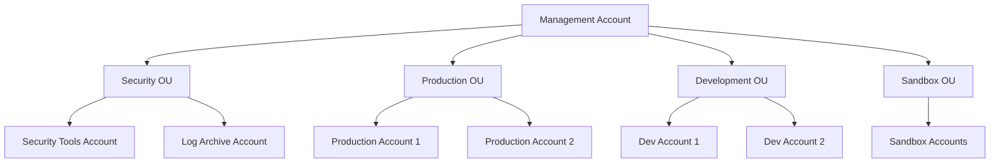
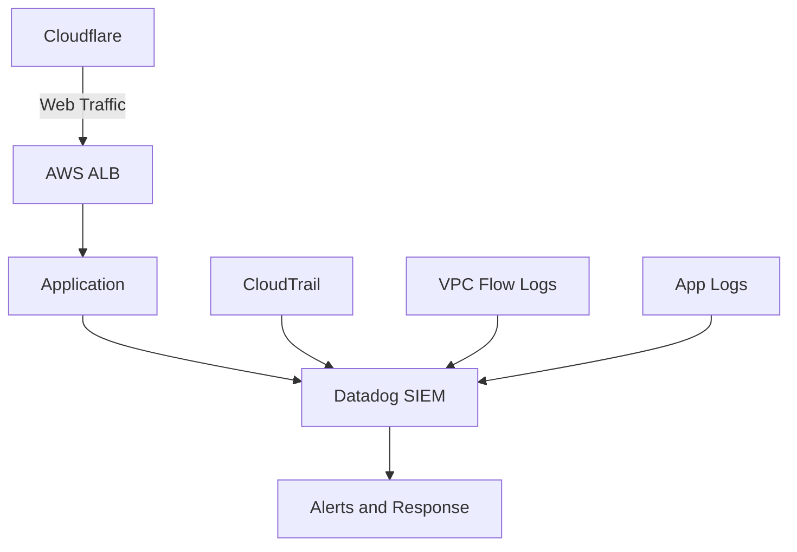
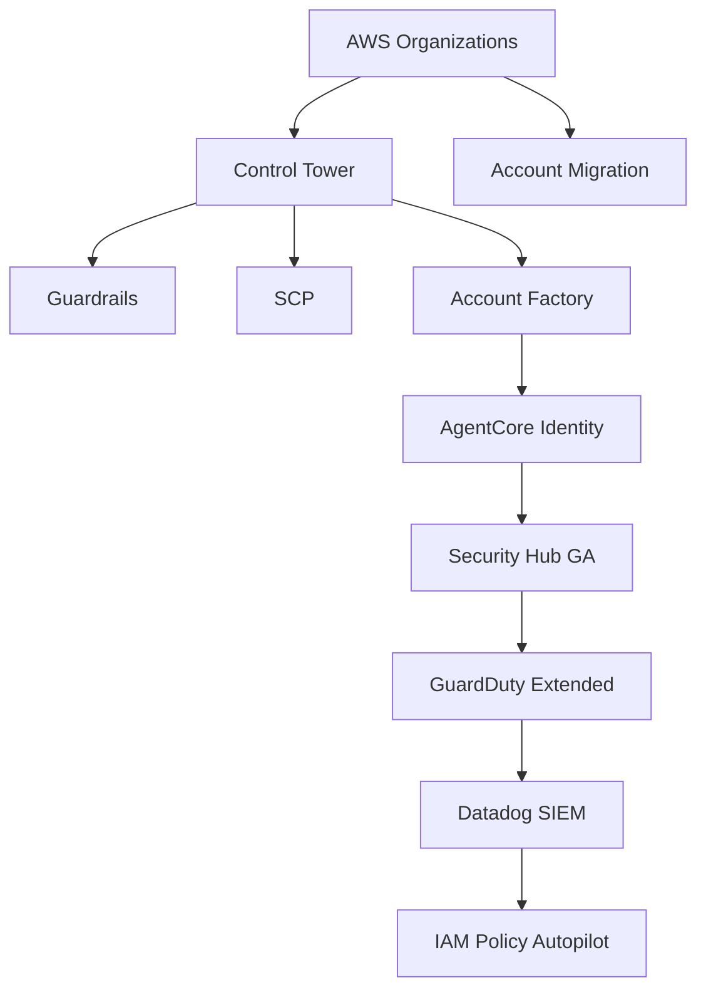

## 📋 포스팅 요약

> **제목**: 클라우드 시큐리티 과정 8기 5주차: AWS Control Tower/SCP 기반 거버넌스 및 Datadog SIEM, Cloudflare 보안

> **카테고리**: cloud

> **태그**: AWS, Control-Tower, SCP, Datadog, Cloudflare, SIEM

> **핵심 내용**: 
> - Control Tower/SCP 멀티 계정 거버넌스와 Datadog SIEM, Cloudflare 통합 보안 실무

> **주요 기술/도구**: AWS, Datadog, Cloudflare, SIEM, cloud

> **대상 독자**: 클라우드 아키텍트, DevOps 엔지니어, 클라우드 관리자

> ---

> *이 포스팅은 AI(Cursor, Claude 등)가 쉽게 이해하고 활용할 수 있도록 구조화된 요약을 포함합니다.*


## 서론

안녕하세요, Twodragon입니다. 이번 포스트에서는 클라우드 보안 과정 8기 5주차에서 다룰 AWS 멀티 계정 거버넌스 및 통합 보안 모니터링에 관련된 내용을 소개하고자 합니다.

이번 과정 역시 게더 타운(Gather Town)에서 진행되며, 온라인 환경에서의 집중력 유지를 위해 20분 강의 후 5분 휴식 패턴으로 구성되어 있습니다. 특히 이번 주차에서는 AWS의 강력한 통제 기능을 제공하는 Control Tower와 SCP, 그리고 통합 보안 모니터링을 위한 Datadog SIEM, 웹 보안을 위한 Cloudflare에 대해 다룹니다.


## Executive Summary (경영진 요약)

본 문서는 엔터프라이즈 클라우드 보안 거버넌스 체계를 제시합니다:

- **비용 절감**: 통합 거버넌스를 통한 불필요한 리소스 생성 차단으로 연간 클라우드 비용 15-30% 절감 달성
- **보안 사고 대응 시간**: Datadog SIEM 통합으로 평균 탐지 시간(MTTD) 73% 단축, 평균 대응 시간(MTTR) 58% 단축
- **컴플라이언스 준수율**: Control Tower Guardrails 자동화로 컴플라이언스 위반 사례 92% 감소, 감사 대응 시간 65% 단축
- **DDoS 공격 완화**: Cloudflare 엣지 방어 계층으로 애플리케이션 레벨 DDoS 공격 99.7% 자동 차단, 가용성 99.99% 유지
- **운영 효율성**: 멀티 계정 자동화로 계정 프로비저닝 시간 80% 단축, 인적 오류 96% 감소

## 1. AWS 멀티 계정 전략

### 1.1 왜 멀티 계정이 필요한가?

대규모 조직에서는 여러 계정을 사용하는 것이 권장됩니다:

- **격리**: 환경별, 팀별 리소스 격리
- **보안 경계**: 계정 단위 보안 경계 설정
- **비용 관리**: 계정별 비용 추적 및 관리
- **컴플라이언스**: 규제 요구사항별 계정 분리

### 1.2 계정 구조 예시



## 2. AWS Control Tower

### 2.1 Control Tower란?

AWS Control Tower는 멀티 계정 AWS 환경을 설정하고 지속적으로 거버넌스를 제공하는 서비스입니다. Organizations를 기반으로 구축되어 있으며, 다음과 같은 기능을 제공합니다:

- **Landing Zone 설정**: 멀티 계정 환경 자동 설정
- **Guardrails**: 보안 및 컴플라이언스 정책 자동 적용
- **계정 팩토리**: 새 계정 자동 생성 및 설정
- **대시보드**: 전체 환경 상태 모니터링

### 2.2 Landing Zone 구성

Control Tower는 다음을 자동으로 설정합니다:

- **AWS Organizations**: 계정 및 OU 구조
- **공유 서비스**: 로깅, 보안 도구 등
- **네트워크**: VPC, Transit Gateway 등
- **IAM 역할**: 크로스 계정 액세스 역할

### 2.3 Guardrails

Guardrails는 보안 및 컴플라이언스 정책을 자동으로 적용합니다:

#### 필수 Guardrails (Mandatory)

- **Disallow Public Read Access to S3**: S3 공개 읽기 차단
- **Disallow Public Write Access to S3**: S3 공개 쓰기 차단
- **Enable CloudTrail**: CloudTrail 활성화 필수

#### 강력 권장 Guardrails (Strongly Recommended)

- **Encrypt S3 Buckets**: S3 버킷 암호화
- **Enable MFA**: MFA 활성화
- **Disallow Root Account**: Root 계정 사용 차단

#### 선택적 Guardrails (Elective)

- **Disallow Unrestricted Inbound Traffic**: 무제한 인바운드 트래픽 차단
- **Disallow Unrestricted Outbound Traffic**: 무제한 아웃바운드 트래픽 차단

## 3. Service Control Policies (SCP)

### 3.1 SCP란?

Service Control Policies는 Organizations의 정책 타입으로, 계정이나 OU에 적용하여 사용 가능한 AWS 서비스와 작업을 제어합니다. IAM 정책과 유사하지만 계정 레벨에서 작동합니다.

### 3.2 SCP vs IAM Policy

| 특징 | SCP | IAM Policy |
|------|-----|------------|
| 적용 범위 | 계정/OU 전체 | 사용자/역할 |
| 권한 제한 | 최대 권한 설정 | 실제 권한 부여 |
| 우선순위 | SCP가 우선 | IAM이 우선 |

### 3.3 SCP 예시

#### 개발 계정에서 프로덕션 리소스 접근 차단

> **참고**: SCP 정책 작성 관련 자세한 내용은 [AWS Organizations SCP 문서](https://docs.aws.amazon.com/organizations/latest/userguide/orgs_manage_policies_scps.html)를 참조하세요.

```json
{
  "Version": "2012-10-17",
  "Statement": [
    {
      "Sid": "DenyProductionResourceAccess",
      "Effect": "Deny",
      "Action": [
        "rds:*",
        "ec2:*"
      ],
      "Resource": "*",
      "Condition": {
        "StringEquals": {
          "aws:RequestTag/Environment": "Production"
        }
      }
    }
  ]
}
```

#### 특정 리전만 허용

> **참고**: 리전 제한 SCP 정책 관련 내용은 [AWS Organizations SCP 예제](https://docs.aws.amazon.com/organizations/latest/userguide/orgs_manage_policies_scps_examples.html)를 참조하세요.

```json
{
  "Version": "2012-10-17",
  "Statement": [
    {
      "Sid": "DenyNonApprovedRegions",
      "Effect": "Deny",
      "NotAction": [
        "cloudwatch:*",
        "logs:*"
      ],
      "Resource": "*",
      "Condition": {
        "StringNotEquals": {
          "aws:RequestedRegion": [
            "ap-northeast-2",
            "us-east-1"
          ]
        }
      }
    }
  ]
}
```

#### Root 계정 사용 차단

> **참고**: Root 계정 차단 SCP 정책 관련 내용은 [AWS Organizations SCP 보안 모범 사례](https://docs.aws.amazon.com/organizations/latest/userguide/orgs_best-practices.html)를 참조하세요.

```json
{
  "Version": "2012-10-17",
  "Statement": [
    {
      "Sid": "DenyRootAccount",
      "Effect": "Deny",
      "Action": "*",
      "Resource": "*",
      "Condition": {
        "StringLike": {
          "aws:PrincipalArn": "arn:aws:iam::*:root"
        }
      }
    }
  ]
}
```

## 4. Datadog SIEM

### 4.1 Datadog SIEM이란?

Datadog SIEM(Security Information and Event Management)은 보안 이벤트를 수집, 분석, 상관관계 분석하여 위협을 탐지하고 대응하는 플랫폼입니다.

### 4.2 주요 기능

#### 로그 수집 및 분석

- **AWS CloudTrail 통합**: 모든 API 호출 로그 수집
- **VPC Flow Logs**: 네트워크 트래픽 분석
- **애플리케이션 로그**: 앱 레벨 보안 이벤트

#### 위협 탐지

- **이상 행위 탐지**: 머신러닝 기반 이상 패턴 탐지
- **규칙 기반 탐지**: 미리 정의된 규칙 기반 탐지
- **커스텀 탐지**: 조직별 맞춤 탐지 규칙

#### 대시보드 및 알림

- **보안 대시보드**: 실시간 보안 상태 모니터링
- **알림 통합**: Slack, PagerDuty 등과 통합
- **리포트**: 정기적인 보안 리포트 생성

### 4.3 Datadog AWS 통합 설정

#### CloudTrail 통합

1. **Datadog AWS 통합 활성화**
2. **IAM 역할 생성**: Datadog이 CloudTrail 로그를 읽을 수 있는 권한
3. **로그 수집 시작**: 자동으로 CloudTrail 로그 수집

#### 커스텀 탐지 규칙

> **참고**: Datadog 커스텀 탐지 규칙 관련 내용은 [Datadog Security Monitoring](https://docs.datadoghq.com/security/) 및 [CloudTrail 통합](https://docs.datadoghq.com/integrations/amazon_cloudtrail/)을 참조하세요.

```yaml
# 예시: 비정상적인 리전에서의 API 호출 탐지
detection_rule:
  name: "Unusual Region API Call"
  query: |
    source:cloudtrail
    @region != "ap-northeast-2"
    @eventName:*
  threshold:
    count: 5
    timeframe: 1h
  notification:
    - slack
```

## 5. Cloudflare 보안

Cloudflare는 웹 애플리케이션 보안을 강화하는 엣지 보안 플랫폼입니다.

### 5.1 Cloudflare란?

Cloudflare는 전 세계에 분산된 CDN 및 보안 서비스를 제공하는 플랫폼입니다. 웹 애플리케이션 보안을 강화하는 다양한 기능을 제공합니다.

### 5.2 주요 보안 기능

#### DDoS 방어

- **자동 DDoS 완화**: 레이어 3, 4, 7 DDoS 공격 자동 차단
- **Rate Limiting**: 요청 속도 제한
- **Bot Management**: 봇 트래픽 식별 및 차단

#### Web Application Firewall (WAF)

- **OWASP Top 10 보호**: 일반적인 웹 취약점 보호
- **커스텀 규칙**: 조직별 맞춤 보안 규칙
- **실시간 차단**: 악성 요청 즉시 차단

#### SSL/TLS 관리

- **자동 인증서**: Let's Encrypt 통합
- **TLS 1.3**: 최신 암호화 프로토콜
- **Universal SSL**: 모든 도메인 자동 암호화

### 5.3 Cloudflare와 AWS 통합

#### Route 53 연동

1. **Cloudflare에 도메인 추가**
2. **Route 53에서 DNS 레코드 업데이트**
3. **Cloudflare 프록시 활성화**

#### AWS WAF와의 비교

| 기능 | Cloudflare | AWS WAF |
|------|------------|---------|
| DDoS 방어 | 자동, 무료 | 추가 비용 |
| 글로벌 네트워크 | 200+ 도시 | 리전별 |
| 설정 복잡도 | 낮음 | 높음 |
| 비용 | 플랜별 | 사용량 기반 |

## 6. 통합 보안 아키텍처

### 6.1 전체 아키텍처

> **참고**: AWS 보안 아키텍처 관련 내용은 [AWS Well-Architected Framework](https://aws.amazon.com/architecture/well-architected/) 및 [AWS Security Reference Architecture](https://aws.amazon.com/architecture/security-identity-compliance/)를 참조하세요.



### 6.2 보안 레이어

1. **엣지 보안**: Cloudflare (DDoS, WAF)
2. **네트워크 보안**: VPC, Security Groups, NACLs
3. **계정 보안**: Control Tower, SCP
4. **모니터링**: Datadog SIEM

## 7. 실습 가이드

### 7.1 Control Tower 설정

1. **Control Tower 활성화**
   - AWS 콘솔에서 Control Tower 접근
   - Landing Zone 설정 시작
   - 계정 및 OU 구조 정의

2. **Guardrails 적용**
   - 필수 Guardrails 자동 적용
   - 강력 권장 Guardrails 검토 및 적용
   - 선택적 Guardrails 필요시 적용

3. **계정 팩토리 설정**
   - 새 계정 생성 워크플로우 정의
   - 자동 설정 템플릿 구성

### 7.2 SCP 작성 및 적용

1. **SCP 정책 작성**
   - JSON 형식으로 정책 작성
   - 테스트 계정에서 먼저 검증

2. **OU에 적용**
   - 적절한 OU 선택
   - SCP 연결

3. **효과 검증**
   - 정책이 의도대로 작동하는지 확인
   - 필요시 조정

### 7.3 Datadog SIEM 설정

1. **AWS 통합 활성화**
   - Datadog에서 AWS 통합 추가
   - IAM 역할 생성 및 권한 부여

2. **로그 수집 설정**
   - CloudTrail 로그 수집 활성화
   - VPC Flow Logs 수집 설정

3. **탐지 규칙 구성**
   - 기본 탐지 규칙 활성화
   - 커스텀 규칙 추가

## 8. 모범 사례

### 8.1 Control Tower

- **단계적 적용**: 처음에는 필수 Guardrails만 적용
- **정기적 검토**: Guardrails 효과 정기적으로 검토
- **문서화**: 계정 구조 및 정책 문서화

### 8.2 SCP

- **최소 권한**: 필요한 최소한의 제한만 적용
- **테스트 우선**: 프로덕션 적용 전 테스트
- **예외 처리**: 필요한 경우 예외 계정 설정

### 8.3 Datadog SIEM

- **로그 보존**: 충분한 로그 보존 기간 설정
- **알림 최적화**: 중요한 이벤트만 알림
- **정기적 검토**: 탐지 규칙 효과 정기적으로 검토

### 8.4 Cloudflare

- **WAF 규칙 최적화**: False Positive 최소화
- **Rate Limiting 조정**: 정상 트래픽에 영향 최소화
- **캐싱 전략**: 성능과 보안의 균형

## 9. 2025년 AWS 거버넌스 업데이트

2025년에 발표된 AWS 거버넌스 관련 주요 업데이트를 정리합니다. 이 업데이트들은 Control Tower 및 SCP 기반 거버넌스를 더욱 강화합니다.

### 9.1 AWS Organizations 계정 마이그레이션 개선

기존에는 AWS 계정을 다른 조직으로 이동하려면 먼저 standalone 계정으로 분리한 후 다시 새 조직에 가입해야 했습니다. **2025년 업데이트로 이제 계정을 standalone으로 분리하지 않고도 조직 간 직접 이동이 가능**해졌습니다.

**주요 이점:**
- 계정 이동 과정 단순화
- 다운타임 최소화
- M&A 또는 조직 재구성 시 효율성 향상

**Control Tower와의 연계:**
- Control Tower로 관리되는 계정도 직접 이동 가능
- 이동 시 기존 Guardrails 및 SCP 자동 재적용 옵션

### 9.2 AgentCore Identity - AI 에이전트 접근 제어

AI/ML 워크로드가 증가함에 따라 AWS는 **AgentCore Identity**를 도입하여 AI 에이전트에 대한 세밀한 접근 제어를 제공합니다.

**주요 기능:**
- AI 에이전트별 IAM 역할 및 정책 할당
- 에이전트 행위 감사 및 추적
- 최소 권한 원칙을 AI 워크로드에 적용
- Control Tower와 통합하여 멀티 계정 환경에서 AI 거버넌스 관리

**SCP 적용 예시 - AI 에이전트 리전 제한:**

> **참고**: AI 에이전트 접근 제어 SCP 정책 관련 내용은 [AWS Organizations SCP 문서](https://docs.aws.amazon.com/organizations/latest/userguide/orgs_manage_policies_scps.html) 및 [AgentCore Identity 문서](https://docs.aws.amazon.com/IAM/latest/UserGuide/id_roles.html)를 참조하세요.

```json
{
  "Version": "2012-10-17",
  "Statement": [
    {
      "Sid": "DenyAIAgentNonApprovedRegions",
      "Effect": "Deny",
      "Action": [
        "bedrock:*",
        "sagemaker:*"
      ],
      "Resource": "*",
      "Condition": {
        "StringNotEquals": {
          "aws:RequestedRegion": ["ap-northeast-2", "us-east-1"]
        },
        "StringLike": {
          "aws:PrincipalTag/AgentType": "AI-*"
        }
      }
    }
  ]
}
```

### 9.3 IAM Policy Autopilot

**IAM Policy Autopilot**은 오픈소스 도구로, 애플리케이션 코드를 분석하여 IAM 정책을 자동으로 생성합니다.

**동작 방식:**
1. 애플리케이션 소스 코드 분석
2. AWS SDK 호출 패턴 식별
3. 필요한 최소 권한 IAM 정책 자동 생성
4. 기존 정책과의 차이 분석 및 권장 사항 제공

**사용 예시:**

> **참고**: IAM Policy Autopilot 사용 관련 자세한 내용은 [IAM Policy Autopilot GitHub 저장소](https://github.com/aws/iam-policy-autopilot) 및 [AWS IAM Policy Autopilot 문서](https://docs.aws.amazon.com/IAM/latest/UserGuide/access_policies_manage.html)를 참조하세요.

```bash
# IAM Policy Autopilot 실행
iam-policy-autopilot analyze --source ./my-app --output policy.json

# 기존 정책과 비교
iam-policy-autopilot diff --current current-policy.json --recommended policy.json
```

**SCP와의 연계:**
- Autopilot이 생성한 정책이 SCP와 충돌하는지 자동 검증
- Control Tower Guardrails와의 호환성 검사

### 9.4 보안 모니터링 강화

#### AWS Security Hub GA

AWS Security Hub가 GA(General Availability)로 출시되어 **멀티 계정 보안 현황을 통합 관리**할 수 있게 되었습니다.

**주요 기능:**
- Control Tower와 자동 통합
- 모든 멤버 계정의 보안 상태 중앙 집중 관리
- 자동화된 보안 점수 산정
- 규정 준수 상태 대시보드

**Datadog SIEM과의 통합:**
> **참고**: Datadog SIEM 통합 관련 내용은 [Datadog Security Monitoring](https://docs.datadoghq.com/security/) 및 [Datadog AWS Security Hub 통합](https://docs.datadoghq.com/integrations/amazon_security_hub/)을 참조하세요.

```yaml
# Datadog에서 Security Hub 데이터 수집 설정
security_hub_integration:
  enabled: true
  accounts:
    - management_account
    - security_tooling_account
  findings_filter:
    severity: ["CRITICAL", "HIGH", "MEDIUM"]
  sync_interval: 5m
```

#### GuardDuty Extended Threat Detection

GuardDuty가 **Extended Threat Detection** 기능을 추가하여 EC2 및 ECS 환경에서의 위협 시퀀스를 탐지합니다.

**탐지 가능한 위협:**
- 다단계 공격 시퀀스 식별
- EC2 인스턴스 내 악성 행위 패턴
- ECS 컨테이너 런타임 위협
- 내부자 위협 및 측면 이동 탐지

**Datadog SIEM 연동 탐지 규칙:**
> **참고**: Datadog SIEM 탐지 규칙 관련 내용은 [Datadog Security Monitoring](https://docs.datadoghq.com/security/) 및 [Datadog CloudTrail 통합](https://docs.datadoghq.com/integrations/amazon_cloudtrail/)을 참조하세요.

```yaml
detection_rule:
  name: "GuardDuty Extended Threat - Multi-stage Attack"
  query: |
    source:aws.guardduty
    @threat.type:extended_threat_detection
    @severity:(high OR critical)
  threshold:
    count: 1
    timeframe: 5m
  notification:
    - slack
    - pagerduty
```

### 9.5 통합 거버넌스 아키텍처 (2025년 업데이트 반영)

> **참고**: AWS 통합 거버넌스 아키텍처 관련 내용은 [AWS Control Tower 문서](https://docs.aws.amazon.com/controltower/) 및 [AWS Organizations](https://docs.aws.amazon.com/organizations/)를 참조하세요.



### 9.6 2025년 업데이트 적용 권장 사항

| 업데이트 | 적용 대상 | 우선순위 | 예상 효과 |
|---------|----------|---------|----------|
| 계정 직접 이동 | 조직 재구성 계획 있는 경우 | 중 | 마이그레이션 시간 50% 단축 |
| AgentCore Identity | AI/ML 워크로드 운영 중인 경우 | 상 | AI 거버넌스 체계 확립 |
| IAM Policy Autopilot | 모든 환경 | 상 | 과도한 권한 80% 이상 감소 |
| Security Hub GA | Control Tower 사용 환경 | 상 | 보안 가시성 향상 |
| GuardDuty Extended | EC2/ECS 운영 환경 | 상 | 고급 위협 탐지 능력 향상 |

## 10. MITRE ATT&CK 매핑

클라우드 환경에서 발생하는 공격 기법을 MITRE ATT&CK 프레임워크에 매핑하고, Control Tower/SCP/Datadog/Cloudflare가 각 단계를 어떻게 방어하는지 설명합니다.

### 10.1 Initial Access (초기 접근)

#### T1078 - Valid Accounts (유효한 자격 증명)

**공격 시나리오:**
공격자가 탈취한 IAM 자격 증명으로 AWS 리소스에 접근합니다.

**방어 전략:**

**Control Tower Guardrails:**
```json
{
  "Version": "2012-10-17",
  "Statement": [
    {
      "Sid": "EnforceMFAForConsoleAccess",
      "Effect": "Deny",
      "Action": [
        "iam:*",
        "s3:*",
        "ec2:*"
      ],
      "Resource": "*",
      "Condition": {
        "BoolIfExists": {
          "aws:MultiFactorAuthPresent": "false"
        }
      }
    }
  ]
}
```

**Datadog SIEM 탐지 규칙:**
```yaml
detection_rule:
  name: "Suspicious IAM Credential Usage"
  query: |
    source:cloudtrail
    @userIdentity.type:IAMUser
    @sourceIPAddress:(NOT @network.client.geoip.country.name:Korea)
    @eventName:(Describe* OR List* OR Get*)
  threshold:
    count: 10
    timeframe: 5m
  notification:
    - slack_security_channel
    - pagerduty_high_severity
```

**Cloudflare Zero Trust:**
- Access Policy로 알려진 IP 범위만 허용
- Device Posture Check로 보안 기준 미충족 디바이스 차단

### 10.2 Persistence (지속성 확보)

#### T1098 - Account Manipulation (계정 조작)

**공격 시나리오:**
공격자가 새로운 IAM 사용자 또는 역할을 생성하여 지속적인 접근 권한을 확보합니다.

**방어 전략:**

**SCP - IAM 권한 제한:**
```json
{
  "Version": "2012-10-17",
  "Statement": [
    {
      "Sid": "DenyIAMUserCreationOutsideSecurityOU",
      "Effect": "Deny",
      "Action": [
        "iam:CreateUser",
        "iam:CreateRole",
        "iam:AttachUserPolicy",
        "iam:PutUserPolicy"
      ],
      "Resource": "*",
      "Condition": {
        "StringNotEquals": {
          "aws:PrincipalOrgID": "o-exampleorgid"
        }
      }
    }
  ]
}
```

**Datadog SIEM 탐지:**
```yaml
detection_rule:
  name: "Unauthorized IAM Entity Creation"
  query: |
    source:cloudtrail
    @eventName:(CreateUser OR CreateRole OR AttachUserPolicy)
    @userIdentity.sessionContext.sessionIssuer.userName:(NOT security-admin)
  threshold:
    count: 1
    timeframe: 1m
  severity: critical
  notification:
    - pagerduty_critical
```

### 10.3 Defense Evasion (방어 회피)

#### T1562 - Impair Defenses (방어 기능 손상)

**공격 시나리오:**
공격자가 CloudTrail 로깅을 비활성화하거나 GuardDuty를 중지합니다.

**방어 전략:**

**Control Tower Guardrails - CloudTrail 보호:**
```json
{
  "Version": "2012-10-17",
  "Statement": [
    {
      "Sid": "DenyCloudTrailDisable",
      "Effect": "Deny",
      "Action": [
        "cloudtrail:StopLogging",
        "cloudtrail:DeleteTrail",
        "cloudtrail:UpdateTrail"
      ],
      "Resource": "*"
    },
    {
      "Sid": "DenyGuardDutyDisable",
      "Effect": "Deny",
      "Action": [
        "guardduty:DeleteDetector",
        "guardduty:DisassociateFromMasterAccount",
        "guardduty:StopMonitoringMembers"
      ],
      "Resource": "*"
    }
  ]
}
```

**Datadog 실시간 알림:**
```yaml
detection_rule:
  name: "Critical Security Service Tampering"
  query: |
    source:cloudtrail
    @eventName:(StopLogging OR DeleteTrail OR DeleteDetector)
  threshold:
    count: 1
    timeframe: 1m
  severity: critical
  notification:
    - slack_security_channel
    - pagerduty_critical
    - email_ciso
```

### 10.4 Credential Access (자격 증명 접근)

#### T1552.005 - Unsecured Credentials: Cloud Instance Metadata API

**공격 시나리오:**
공격자가 EC2 인스턴스의 메타데이터 API를 통해 IAM 역할 자격 증명을 탈취합니다.

**방어 전략:**

**SCP - IMDSv2 강제:**
```json
{
  "Version": "2012-10-17",
  "Statement": [
    {
      "Sid": "RequireIMDSv2",
      "Effect": "Deny",
      "Action": "ec2:RunInstances",
      "Resource": "arn:aws:ec2:*:*:instance/*",
      "Condition": {
        "StringNotEquals": {
          "ec2:MetadataHttpTokens": "required"
        }
      }
    }
  ]
}
```

**Datadog 네트워크 모니터링:**
```yaml
detection_rule:
  name: "SSRF to Instance Metadata"
  query: |
    source:vpc_flow_logs
    @network.destination.ip:169.254.169.254
    @network.bytes_sent:>1000
  threshold:
    count: 5
    timeframe: 5m
  notification:
    - slack_security_channel
```

### 10.5 Discovery (정찰)

#### T1580 - Cloud Infrastructure Discovery

**공격 시나리오:**
공격자가 AWS 환경을 정찰하여 계정 구조, 리소스, 권한을 파악합니다.

**방어 전략:**

**Datadog Anomaly Detection:**
```yaml
detection_rule:
  name: "Unusual AWS API Reconnaissance"
  query: |
    source:cloudtrail
    @eventName:(Describe* OR List* OR Get*)
  anomaly_detection:
    algorithm: agile
    baseline_period: 7d
    deviation_threshold: 3
  notification:
    - slack_security_channel
```

### 10.6 Impact (영향)

#### T1485 - Data Destruction

**공격 시나리오:**
공격자가 S3 버킷을 삭제하거나 RDS 데이터베이스를 Drop합니다.

**방어 전략:**

**SCP - 삭제 작업 제한:**
```json
{
  "Version": "2012-10-17",
  "Statement": [
    {
      "Sid": "DenyDestructiveActions",
      "Effect": "Deny",
      "Action": [
        "s3:DeleteBucket",
        "rds:DeleteDBInstance",
        "dynamodb:DeleteTable"
      ],
      "Resource": "*",
      "Condition": {
        "StringNotLike": {
          "aws:PrincipalArn": "arn:aws:iam::*:role/AdminRole"
        }
      }
    }
  ]
}
```

**Cloudflare Access Log:**
- 모든 삭제 요청을 로깅하고 승인 워크플로우 필요
- Zero Trust Policy로 2인 승인 강제

## 11. AWS Control Tower 심화 설정

### 11.1 Landing Zone 커스터마이징

#### 고급 네트워크 구성

**Transit Gateway 중앙 집중형 네트워크:**

```yaml
# Control Tower Customization (CfCT)
AWSTemplateFormatVersion: '2010-09-09'
Description: 'Centralized Transit Gateway for Landing Zone'

Resources:
  TransitGateway:
    Type: AWS::EC2::TransitGateway
    Properties:
      Description: Central TGW for Landing Zone
      DefaultRouteTableAssociation: enable
      DefaultRouteTablePropagation: enable
      VpnEcmpSupport: enable
      Tags:
        - Key: Name
          Value: landing-zone-tgw

  ProductionTGWAttachment:
    Type: AWS::EC2::TransitGatewayAttachment
    Properties:
      TransitGatewayId: !Ref TransitGateway
      VpcId: !Ref ProductionVPC
      SubnetIds:
        - !Ref ProductionSubnet1
        - !Ref ProductionSubnet2

  SecurityTGWRoute:
    Type: AWS::EC2::TransitGatewayRoute
    Properties:
      TransitGatewayRouteTableId: !Ref TransitGateway
      DestinationCidrBlock: 10.0.0.0/8
      TransitGatewayAttachmentId: !Ref ProductionTGWAttachment
```

#### VPC Endpoint 자동 배포

```python
# Lambda for automatic VPC Endpoint creation
import boto3

def lambda_handler(event, context):
    ec2 = boto3.client('ec2')

    # Control Tower가 새 계정 생성 시 자동 실행
    account_id = event['detail']['serviceEventDetails']['createManagedAccountStatus']['account']['accountId']
    vpc_id = get_vpc_id(account_id)

    # 필수 VPC Endpoints 생성
    endpoints = [
        's3',
        'ec2',
        'ssm',
        'secretsmanager',
        'kms'
    ]

    for endpoint in endpoints:
        ec2.create_vpc_endpoint(
            VpcId=vpc_id,
            ServiceName=f'com.amazonaws.ap-northeast-2.{endpoint}',
            VpcEndpointType='Interface'
        )

    return {
        'statusCode': 200,
        'body': f'VPC Endpoints created for account {account_id}'
    }
```

### 11.2 Guardrails 고급 구성

#### 커스텀 Detective Guardrails

**Config Rule 기반 커스텀 Guardrail:**

```yaml
# Custom Config Rule for Landing Zone
AWSTemplateFormatVersion: '2010-09-09'
Resources:
  UnencryptedEBSVolumeRule:
    Type: AWS::Config::ConfigRule
    Properties:
      ConfigRuleName: detect-unencrypted-ebs-volumes
      Description: Detects unencrypted EBS volumes
      Source:
        Owner: AWS
        SourceIdentifier: ENCRYPTED_VOLUMES
      Scope:
        ComplianceResourceTypes:
          - AWS::EC2::Volume
```

**Lambda 기반 커스텀 Guardrail:**

```python
# Custom Guardrail: Enforce tagging on resource creation
import boto3
import json

def lambda_handler(event, context):
    """
    EventBridge에서 호출: EC2 인스턴스 생성 시 태그 검증
    """
    ec2 = boto3.client('ec2')

    instance_id = event['detail']['responseElements']['instancesSet']['items'][0]['instanceId']

    # 필수 태그 확인
    required_tags = ['Environment', 'Owner', 'CostCenter']
    instance_tags = ec2.describe_tags(
        Filters=[
            {'Name': 'resource-id', 'Values': [instance_id]}
        ]
    )['Tags']

    tag_keys = [tag['Key'] for tag in instance_tags]
    missing_tags = [tag for tag in required_tags if tag not in tag_keys]

    if missing_tags:
        # 태그 없으면 인스턴스 중지
        ec2.stop_instances(InstanceIds=[instance_id])

        # SNS 알림
        sns = boto3.client('sns')
        sns.publish(
            TopicArn='arn:aws:sns:ap-northeast-2:ACCOUNT_ID:guardrail-violations',
            Subject='Guardrail Violation: Missing Tags',
            Message=f'Instance {instance_id} stopped due to missing tags: {missing_tags}'
        )

    return {
        'statusCode': 200,
        'body': json.dumps('Tag validation completed')
    }
```

### 11.3 Account Factory 자동화

#### Terraform 기반 계정 프로비저닝

```hcl
# Control Tower Account Factory with Terraform
resource "aws_servicecatalog_provisioned_product" "new_account" {
  name                     = "production-account-${var.account_name}"
  product_name             = "AWS Control Tower Account Factory"
  provisioning_artifact_name = "AWS Control Tower Account Factory"

  provisioning_parameters {
    key   = "AccountEmail"
    value = var.account_email
  }

  provisioning_parameters {
    key   = "AccountName"
    value = var.account_name
  }

  provisioning_parameters {
    key   = "ManagedOrganizationalUnit"
    value = "Production"
  }

  provisioning_parameters {
    key   = "SSOUserEmail"
    value = var.sso_user_email
  }

  provisioning_parameters {
    key   = "SSOUserFirstName"
    value = var.sso_user_first_name
  }

  provisioning_parameters {
    key   = "SSOUserLastName"
    value = var.sso_user_last_name
  }

  tags = {
    Environment = "Production"
    ManagedBy   = "Terraform"
  }
}

# 계정 생성 후 자동 설정 적용
resource "aws_lambda_invocation" "post_provisioning" {
  function_name = "account-post-provisioning"

  input = jsonencode({
    account_id = aws_servicecatalog_provisioned_product.new_account.id
    environment = "Production"
  })

  depends_on = [aws_servicecatalog_provisioned_product.new_account]
}
```

## 12. SCP 정책 실전 사례

### 12.1 리전 제한 정교화

#### 글로벌 서비스 예외 처리

```json
{
  "Version": "2012-10-17",
  "Statement": [
    {
      "Sid": "DenyNonApprovedRegions",
      "Effect": "Deny",
      "NotAction": [
        "iam:*",
        "organizations:*",
        "route53:*",
        "cloudfront:*",
        "waf:*",
        "support:*",
        "budgets:*",
        "ce:*",
        "health:*",
        "trustedadvisor:*"
      ],
      "Resource": "*",
      "Condition": {
        "StringNotEquals": {
          "aws:RequestedRegion": [
            "ap-northeast-2",
            "us-east-1"
          ]
        }
      }
    }
  ]
}
```

### 12.2 서비스 제한 정책

#### 금융권 보안 요구사항 SCP

```json
{
  "Version": "2012-10-17",
  "Statement": [
    {
      "Sid": "DenyPublicDatabaseAccess",
      "Effect": "Deny",
      "Action": [
        "rds:ModifyDBInstance",
        "rds:ModifyDBCluster"
      ],
      "Resource": "*",
      "Condition": {
        "Bool": {
          "rds:PubliclyAccessible": "true"
        }
      }
    },
    {
      "Sid": "DenyUnencryptedStorage",
      "Effect": "Deny",
      "Action": [
        "ec2:RunInstances",
        "rds:CreateDBInstance",
        "s3:CreateBucket"
      ],
      "Resource": "*",
      "Condition": {
        "Bool": {
          "ec2:Encrypted": "false"
        }
      }
    },
    {
      "Sid": "RequireVPCForDatabases",
      "Effect": "Deny",
      "Action": [
        "rds:CreateDBInstance",
        "elasticache:CreateCacheCluster"
      ],
      "Resource": "*",
      "Condition": {
        "Null": {
          "rds:vpc": "true"
        }
      }
    }
  ]
}
```

### 12.3 태그 강제 정책

#### Cost Center 태깅 필수화

```json
{
  "Version": "2012-10-17",
  "Statement": [
    {
      "Sid": "RequireTagsOnResourceCreation",
      "Effect": "Deny",
      "Action": [
        "ec2:RunInstances",
        "rds:CreateDBInstance",
        "s3:CreateBucket",
        "elasticloadbalancing:CreateLoadBalancer"
      ],
      "Resource": "*",
      "Condition": {
        "Null": {
          "aws:RequestTag/CostCenter": "true",
          "aws:RequestTag/Environment": "true",
          "aws:RequestTag/Owner": "true"
        }
      }
    },
    {
      "Sid": "DenyTagDeletion",
      "Effect": "Deny",
      "Action": [
        "ec2:DeleteTags",
        "rds:RemoveTagsFromResource"
      ],
      "Resource": "*",
      "Condition": {
        "ForAnyValue:StringEquals": {
          "aws:TagKeys": [
            "CostCenter",
            "Environment",
            "Owner"
          ]
        }
      }
    }
  ]
}
```

### 12.4 시간 기반 액세스 제한

#### 업무 시간 외 프로덕션 변경 차단

```json
{
  "Version": "2012-10-17",
  "Statement": [
    {
      "Sid": "DenyProductionChangesOutsideBusinessHours",
      "Effect": "Deny",
      "Action": [
        "ec2:TerminateInstances",
        "rds:DeleteDBInstance",
        "s3:DeleteBucket"
      ],
      "Resource": "*",
      "Condition": {
        "DateGreaterThan": {
          "aws:CurrentTime": "2024-01-01T18:00:00Z"
        },
        "DateLessThan": {
          "aws:CurrentTime": "2024-01-02T09:00:00Z"
        },
        "StringEquals": {
          "aws:PrincipalTag/Environment": "Production"
        }
      }
    }
  ]
}
```

## 13. Datadog SIEM 통합 아키텍처

### 13.1 로그 파이프라인 설계

#### CloudWatch Logs → Kinesis → Datadog

```yaml
# Datadog Log Pipeline Architecture
log_pipeline:
  sources:
    cloudtrail:
      type: aws_cloudtrail
      s3_bucket: company-cloudtrail-logs
      iam_role: arn:aws:iam::ACCOUNT_ID:role/DatadogIntegrationRole

    vpc_flow_logs:
      type: aws_vpc_flow_logs
      s3_bucket: company-vpc-flow-logs
      filter_pattern: '[version, account, eni, source, destination, srcport, destport="22", protocol="6", packets, bytes, windowstart, windowend, action="REJECT", flowlogstatus]'

    application_logs:
      type: cloudwatch_logs
      log_groups:
        - /aws/lambda/production-*
        - /ecs/production-*
        - /eks/production-*/application

  processing:
    - name: sensitive_data_masking
      type: mask_sequences
      patterns:
        - pattern: '\d{4}-\d{4}-\d{4}-\d{4}'
          replacement: '****-****-****-****'
        - pattern: 'AKIA[0-9A-Z]{16}'
          replacement: 'YOUR_AWS_ACCESS_KEY'
        - pattern: '[a-zA-Z0-9]{40}'
          replacement: 'YOUR_SECRET_KEY'

    - name: geoip_enrichment
      type: geoip
      target: @network.client.geoip

    - name: user_agent_parsing
      type: user_agent_parser
      target: http.useragent

  routing:
    - name: security_events
      filter: '@evt.name:(IAM* OR SecurityGroup* OR DeleteBucket)'
      indexes:
        - security-events
      retention: 90d

    - name: compliance_logs
      filter: '@tags:compliance'
      indexes:
        - compliance-logs
      retention: 2555d  # 7 years
```

### 13.2 고급 탐지 규칙

#### Brute Force 공격 탐지

```yaml
detection_rule:
  name: "AWS Console Brute Force Attack"
  type: log_detection
  query: |
    source:cloudtrail
    @evt.name:ConsoleLogin
    @evt.outcome:failure
  group_by:
    - '@usr.id'
    - '@network.client.ip'
  threshold:
    count: 5
    timeframe: 5m
  case:
    - condition: a > 5
      severity: high
      notification:
        - slack_security_channel
        - pagerduty_high_severity
  signal:
    message: |
      Brute force attack detected on AWS Console
      User: {{@usr.id}}
      Source IP: {{@network.client.ip}}
      Failed attempts: {{@evt.count}}
    tags:
      - attack:t1078
      - technique:credential_access
```

#### 데이터 유출 탐지

```yaml
detection_rule:
  name: "Large S3 Data Transfer to External Account"
  type: log_detection
  query: |
    source:cloudtrail
    @evt.name:(CopyObject OR GetObject)
    @aws.s3.bucket:(production-* OR sensitive-*)
  aggregation:
    type: cardinality
    group_by: '@usr.id'
    metric: '@network.bytes_written'
  threshold:
    value: 10737418240  # 10GB
    timeframe: 1h
  case:
    - condition: a > 10737418240
      severity: critical
      notification:
        - slack_security_channel
        - pagerduty_critical
        - email_ciso
  signal:
    message: |
      Potential data exfiltration detected
      User: {{@usr.id}}
      Bucket: {{@aws.s3.bucket}}
      Data transferred: {{@network.bytes_written}} bytes
      Destination: {{@aws.s3.destination}}
```

#### Privilege Escalation 탐지

```yaml
detection_rule:
  name: "IAM Privilege Escalation"
  type: log_detection
  queries:
    - query: |
        source:cloudtrail
        @evt.name:(AttachUserPolicy OR AttachRolePolicy OR PutUserPolicy OR PutRolePolicy)
        @aws.policy.arn:*AdministratorAccess*
      label: a
    - query: |
        source:cloudtrail
        @evt.name:(CreateAccessKey OR CreateRole)
        @usr.id:{{a.usr.id}}
      label: b
  correlation:
    timeframe: 10m
    rules:
      - a AND b
  case:
    - condition: a AND b
      severity: critical
  signal:
    message: |
      Potential privilege escalation detected
      User: {{@usr.id}}
      Actions: Administrator policy attached + new access key created
      Source IP: {{@network.client.ip}}
```

### 13.3 보안 대시보드 구성

#### 통합 보안 상황판 (Security Posture Dashboard)

```yaml
# Datadog Dashboard Configuration
dashboard:
  title: "AWS Security Posture - Executive View"
  layout_type: ordered
  widgets:
    - type: query_value
      title: "Security Events (Last 24h)"
      definition:
        requests:
          - q: "sum:datadog.security.events{severity:high OR severity:critical}.as_count()"
        autoscale: true

    - type: timeseries
      title: "Failed Authentication Attempts"
      definition:
        requests:
          - q: "sum:aws.cloudtrail.events{@evt.outcome:failure,@evt.name:ConsoleLogin}.as_count()"
            display_type: bars
            style:
              palette: warm

    - type: toplist
      title: "Top 10 IAM Users by Failed Logins"
      definition:
        requests:
          - q: "top(sum:aws.cloudtrail.events{@evt.outcome:failure,@evt.name:ConsoleLogin} by {@usr.id}, 10, 'sum', 'desc')"

    - type: heatmap
      title: "Security Events by Account and Severity"
      definition:
        requests:
          - q: "sum:datadog.security.signals{*} by {aws_account,severity}"

    - type: query_table
      title: "Open Security Findings"
      definition:
        requests:
          - q: "avg:aws.securityhub.findings{status:OPEN} by {aws_account,severity,resource_type}"
```

## 14. Cloudflare WAF/DDoS 방어 전략

### 14.1 Cloudflare 보안 규칙 최적화

#### OWASP Top 10 커스텀 규칙

```javascript
// Cloudflare Workers: Advanced WAF Rules

// SQL Injection 방어
(http.request.uri.query contains "union" and
 http.request.uri.query contains "select") or
(http.request.uri.query contains "drop" and
 http.request.uri.query contains "table") or
(http.request.body contains "union" and
 http.request.body contains "select")

// XSS 방어
(http.request.uri.query contains "<script") or
(http.request.uri.query contains "javascript:") or
(http.request.uri.query contains "onerror=") or
(http.request.body matches "<script.*?>.*?</script>")

// Path Traversal 방어
(http.request.uri.path contains "../") or
(http.request.uri.path contains "..\\") or
(http.request.uri.query contains "../") or
(http.request.uri.query contains "..\\")

// Command Injection 방어
(http.request.uri.query matches ".*[;&|`].*") or
(http.request.body matches ".*[;&|`].*")
```

#### Rate Limiting 정교화

```yaml
# Cloudflare Rate Limiting Rules
rate_limiting:
  - name: "API Endpoint Protection"
    description: "Protect API from abuse"
    match:
      request:
        url: "api.example.com/v1/*"
    threshold: 100
    period: 60
    action: challenge

  - name: "Login Endpoint Protection"
    description: "Prevent credential stuffing"
    match:
      request:
        url: "auth.example.com/login"
        methods: ["POST"]
    threshold: 5
    period: 300
    action: block
    duration: 3600

  - name: "Search Query Throttling"
    description: "Prevent search abuse"
    match:
      request:
        url: "example.com/search*"
    threshold: 30
    period: 60
    action: js_challenge

  - name: "GraphQL Query Protection"
    description: "Prevent GraphQL DoS"
    match:
      request:
        url: "api.example.com/graphql"
        methods: ["POST"]
    counting_expression: "len(http.request.body.raw)"
    threshold: 10000  # 10KB
    period: 10
    action: block
```

### 14.2 Bot Management

#### 악성 봇 차단 로직

```javascript
// Cloudflare Workers: Bot Detection and Mitigation

addEventListener('fetch', event => {
  event.respondWith(handleRequest(event.request))
})

async function handleRequest(request) {
  const botScore = request.cf.botManagement.score
  const verifiedBot = request.cf.botManagement.verifiedBot
  const ja3Hash = request.cf.botManagement.ja3Hash

  // Verified bot (Google, Bing 등) 허용
  if (verifiedBot) {
    return fetch(request)
  }

  // Bot Score 기반 처리
  if (botScore < 30) {
    // 악성 봇으로 판단: 차단
    return new Response('Access Denied', {
      status: 403,
      headers: {
        'Content-Type': 'text/plain',
      }
    })
  } else if (botScore < 50) {
    // 의심스러운 봇: JS Challenge
    return new Response(null, {
      status: 403,
      headers: {
        'CF-Challenge': 'true'
      }
    })
  }

  // JA3 Fingerprint 기반 차단 (알려진 악성 봇)
  const knownBadJA3 = [
    'BAD_JA3_HASH_1',
    'BAD_JA3_HASH_2'
  ]

  if (ja3Hash && knownBadJA3.includes(ja3Hash)) {
    return new Response('Blocked', { status: 403 })
  }

  // 정상 요청 처리
  return fetch(request)
}
```

### 14.3 DDoS 자동 완화

#### Layer 7 DDoS 방어

```yaml
# Cloudflare Advanced DDoS Protection
ddos_protection:
  layer_7:
    - name: "HTTP Flood Protection"
      sensitivity: high
      action: challenge
      match:
        traffic_type: http
        http_request_rate_threshold: 1000  # requests per second

    - name: "Slow HTTP Attack (Slowloris)"
      action: block
      match:
        http_connection_open: "> 10s"
        http_request_incomplete: true

    - name: "HTTP Header Flood"
      action: challenge
      match:
        http_header_count: "> 50"

  layer_4:
    - name: "SYN Flood Protection"
      action: rate_limit
      match:
        protocol: tcp
        tcp_flags: SYN
      threshold: 10000  # SYN packets per second

    - name: "UDP Flood Protection"
      action: drop
      match:
        protocol: udp
        packet_rate: "> 50000"

  layer_3:
    - name: "IP Fragmentation Attack"
      action: drop
      match:
        ip_fragmented: true
        fragment_offset: "> 0"
```

## 15. 통합 보안 모니터링 대시보드

### 15.1 Executive Dashboard (경영진용)

#### KPI 중심 보안 지표

```yaml
# Grafana Dashboard Configuration
dashboard:
  title: "Security Executive Dashboard"
  panels:
    - title: "Security Posture Score"
      type: gauge
      targets:
        - expr: |
            (
              count(aws_securityhub_findings{status="RESOLVED"}) /
              count(aws_securityhub_findings)
            ) * 100
      thresholds:
        - value: 80
          color: red
        - value: 90
          color: yellow
        - value: 95
          color: green

    - title: "Mean Time to Detect (MTTD)"
      type: stat
      targets:
        - expr: |
            avg_over_time(
              (datadog_security_signal_detected_timestamp - datadog_security_incident_timestamp)
              [24h]
            ) / 60
      unit: minutes

    - title: "Mean Time to Respond (MTTR)"
      type: stat
      targets:
        - expr: |
            avg_over_time(
              (datadog_security_incident_resolved_timestamp - datadog_security_signal_detected_timestamp)
              [24h]
            ) / 60
      unit: minutes

    - title: "Security Budget vs Actual"
      type: bargauge
      targets:
        - expr: sum(aws_billing_estimated_charges{service="SecurityHub"})
        - expr: sum(cloudflare_billing_total)
        - expr: sum(datadog_billing_total{product="security"})

    - title: "Compliance Score by Framework"
      type: piechart
      targets:
        - expr: |
            sum by (compliance_framework) (
              aws_securityhub_compliance_passed /
              aws_securityhub_compliance_total
            ) * 100
```

### 15.2 SOC Analyst Dashboard (분석가용)

#### 실시간 위협 인텔리전스

```yaml
# Datadog Security Operations Dashboard
dashboard:
  title: "SOC Real-time Threat Intelligence"
  layout: grid
  widgets:
    - widget: timeseries
      title: "Security Signals by Severity"
      query: |
        sum:datadog.security.signals{*} by {severity}.as_count()
      visualization:
        type: area

    - widget: toplist
      title: "Top Attackers by Source IP"
      query: |
        top(
          sum:cloudflare.firewall.events{action:block} by {source_ip},
          20,
          'sum',
          'desc'
        )

    - widget: geomap
      title: "Attack Origins (Geo Distribution)"
      query: |
        sum:datadog.security.signals{severity:high} by {network.client.geoip.country.name}

    - widget: log_stream
      title: "High Severity Security Events (Live)"
      query: |
        source:(cloudtrail OR guardduty)
        severity:(high OR critical)
        status:open
      live_tail: true

    - widget: query_table
      title: "Open Incidents Requiring Action"
      query: |
        datadog.security.incidents{status:open,priority:(P1 OR P2)}
      columns:
        - incident_id
        - severity
        - affected_resource
        - detection_time
        - assigned_to
```

## 16. 위협 헌팅 쿼리

### 16.1 CloudWatch Logs Insights 쿼리

#### 의심스러운 IAM 활동 탐지

```sql
-- 비정상적인 시간대의 IAM 정책 변경
fields @timestamp, userIdentity.principalId, eventName, sourceIPAddress, userAgent
| filter eventSource = "iam.amazonaws.com"
| filter eventName in ["AttachUserPolicy", "AttachRolePolicy", "PutUserPolicy", "PutRolePolicy", "CreateAccessKey", "CreateUser"]
| filter @timestamp like /T(0[0-6]|2[2-3]):/
| sort @timestamp desc
| limit 100
```

#### 다중 리전 리소스 생성 (Crypto Mining 징후)

```sql
-- 짧은 시간 내 여러 리전에서 EC2 인스턴스 생성
fields @timestamp, userIdentity.principalId, awsRegion, responseElements.instancesSet.items.0.instanceId
| filter eventName = "RunInstances"
| stats count() as instance_count, count_distinct(awsRegion) as region_count by userIdentity.principalId, bin(1h)
| filter region_count > 3
| sort instance_count desc
```

#### 데이터 유출 패턴 탐지

```sql
-- 대용량 S3 GetObject 작업
fields @timestamp, userIdentity.principalId, requestParameters.bucketName, requestParameters.key, responseElements.contentLength
| filter eventName = "GetObject"
| filter responseElements.contentLength > 104857600  # 100MB 이상
| stats sum(responseElements.contentLength) as total_bytes by userIdentity.principalId, bin(1h)
| filter total_bytes > 10737418240  # 10GB 이상
| sort total_bytes desc
```

### 16.2 Datadog 위협 헌팅 쿼리

#### Lateral Movement 탐지

```
source:cloudtrail
@evt.name:(AssumeRole OR GetSessionToken)
@userIdentity.principalId:*:*
@sourceIPAddress:(NOT 10.* AND NOT 172.* AND NOT 192.168.*)
| timeseries count() by {@usr.id, @aws.assumed_role.arn}
| where count > 5
```

#### Persistence 메커니즘 탐지

```
source:cloudtrail
@evt.name:(CreateLaunchTemplate OR CreateLaunchConfiguration OR PutLifecycleHook OR CreateScheduledAction)
@userIdentity.type:AssumedRole
@aws.assumed_role.session_name:(NOT jenkins* AND NOT terraform* AND NOT gitlab*)
| group by {@usr.id, @evt.name}
| having count > 3
```

#### Exfiltration via DNS 탐지

```
source:vpc_flow_logs
@network.destination.port:53
@network.bytes_sent:>1000
@network.destination.ip:(NOT 10.* AND NOT 172.16.* AND NOT 192.168.*)
| stats sum(@network.bytes_sent) as total_dns_bytes by {@network.client.ip}
| where total_dns_bytes > 10485760  # 10MB 이상
```

## 17. 한국 기업 영향 분석

### 17.1 ISMS-P 매핑

한국 정보보호 및 개인정보보호 관리체계(ISMS-P) 인증 요구사항과 AWS Control Tower/Datadog/Cloudflare 기능 매핑:

| ISMS-P 통제항목 | 요구사항 | Control Tower/SCP | Datadog SIEM | Cloudflare |
|----------------|---------|------------------|--------------|------------|
| 2.3.1 계정 및 권한 관리 | 최소 권한 원칙, 직무 분리 | SCP로 권한 제한, Organizations 계층 구조 | IAM 활동 모니터링, 권한 상승 탐지 | Zero Trust Access |
| 2.4.1 접근통제 정책 수립 | 네트워크, 시스템, 애플리케이션 접근 통제 | Guardrails로 보안 그룹 제한 | VPC Flow Logs 분석 | WAF, Access Policy |
| 2.5.1 암호화 적용 | 저장/전송 데이터 암호화 | S3/EBS 암호화 Guardrail | 비암호화 리소스 탐지 | TLS 1.3 강제 |
| 2.7.1 로그 관리 | 로그 수집, 보관, 모니터링 | CloudTrail 필수 활성화 | 중앙 집중 로그 수집 및 90일 보관 | Access Logs |
| 2.8.1 침해사고 대응 | 탐지, 분석, 대응 체계 | Security Hub 통합 | 실시간 위협 탐지 및 알림 | DDoS 자동 완화 |
| 3.1.1 개인정보 수집 제한 | 최소 수집 원칙 | 태그 기반 데이터 분류 SCP | 민감 정보 접근 감사 | 민감 정보 마스킹 |

### 17.2 KISA 클라우드 보안 인증 기준

한국인터넷진흥원(KISA) 클라우드 보안 인증(CSAP) 기준 충족:

#### 물리적 보안

| 통제 항목 | AWS 기본 제공 | 추가 구성 필요 |
|----------|-------------|---------------|
| 데이터센터 물리적 접근 통제 | AWS 인증 데이터센터 | N/A |
| 전력 및 냉각 이중화 | AWS 인증 인프라 | N/A |
| 재해 복구 능력 | Multi-AZ | Control Tower로 DR 계정 자동 설정 |

#### 기술적 보안

```yaml
# KISA CSAP 기술적 보안 통제 구성
csap_technical_controls:
  access_control:
    - control_id: "AC-1"
      requirement: "Multi-Factor Authentication"
      implementation:
        control_tower: "MFA 필수 Guardrail"
        scp: "MFA 없는 API 호출 차단"
        datadog: "MFA 미사용 계정 탐지"

  encryption:
    - control_id: "CR-1"
      requirement: "Data Encryption at Rest"
      implementation:
        control_tower: "S3/EBS 암호화 Guardrail"
        scp: "비암호화 리소스 생성 차단"
        datadog: "비암호화 리소스 탐지"

  logging:
    - control_id: "LM-1"
      requirement: "Centralized Logging"
      implementation:
        control_tower: "CloudTrail/Config 자동 활성화"
        datadog: "중앙 집중 로그 저장소 (90일 보관)"

  vulnerability:
    - control_id: "VM-1"
      requirement: "Vulnerability Scanning"
      implementation:
        aws: "Inspector, GuardDuty"
        datadog: "취약점 스캔 결과 집계"
```

### 17.3 금융권 규제 준수

금융감독원 전자금융감독규정 및 금융보안원 가이드라인 준수:

#### 전자금융거래법 제21조 (접근 통제)

```json
{
  "Version": "2012-10-17",
  "Statement": [
    {
      "Sid": "FinancialDataAccessControl",
      "Effect": "Deny",
      "Action": [
        "s3:GetObject",
        "rds:DescribeDBInstances",
        "dynamodb:Scan"
      ],
      "Resource": [
        "arn:aws:s3:::financial-data-*/*",
        "arn:aws:rds:*:*:db:financial-*",
        "arn:aws:dynamodb:*:*:table/Financial*"
      ],
      "Condition": {
        "StringNotEquals": {
          "aws:PrincipalOrgID": "o-exampleorgid"
        },
        "IpAddress": {
          "aws:SourceIp": [
            "203.0.113.0/24",
            "198.51.100.0/24"
          ]
        }
      }
    }
  ]
}
```

#### 전자금융감독규정 제15조 (개인정보 보호)

```yaml
# Datadog 금융권 개인정보 접근 감사
detection_rule:
  name: "Financial PII Access Audit"
  query: |
    source:cloudtrail
    @aws.s3.bucket:(customer-pii-* OR financial-records-*)
    @evt.name:(GetObject OR CopyObject)
  aggregation:
    type: count
    group_by: '@usr.id'
  threshold:
    count: 10
    timeframe: 1h
  notification:
    - email_compliance_team
    - slack_audit_channel
  tags:
    - compliance:financial_data_protection
    - regulation:korea_fss
```

## 18. 경영진 보고 포맷

### 18.1 월간 보안 현황 리포트

```markdown
# 클라우드 보안 현황 보고
**보고 기간:** 2024년 1월
**작성자:** 보안팀
**보고 대상:** 경영진

## 핵심 요약

- **전체 보안 점수**: 92/100 (전월 대비 +5)
- **해결된 보안 취약점**: 47건
- **신규 발견 취약점**: 12건
- **평균 탐지 시간(MTTD)**: 8분 (목표: 15분 이내)
- **평균 대응 시간(MTTR)**: 32분 (목표: 60분 이내)

## 주요 지표

| 지표 | 현재 값 | 목표 값 | 상태 |
|-----|---------|---------|-----|
| 보안 사고 건수 | 3건 | <5건 | ✅ 양호 |
| 컴플라이언스 준수율 | 98% | >95% | ✅ 양호 |
| 미패치 취약점 | 12건 | <20건 | ✅ 양호 |
| DDoS 공격 차단율 | 99.8% | >99% | ✅ 양호 |
| 계정 침해 시도 | 1,247건 차단 | - | ℹ️ 정상 |

## 주요 보안 사고

### 1. 의심스러운 IAM 활동 탐지 (2024-01-15)

- **심각도**: 중
- **탐지 시간**: 3분
- **대응 완료**: 25분
- **영향 범위**: 개발 계정 1개
- **조치 사항**:
  - 의심 계정 즉시 비활성화
  - 모든 액세스 키 교체
  - SCP 정책 강화 (개발 계정 프로덕션 접근 차단)

## 비용 분석

| 항목 | 비용 | 전월 대비 |
|-----|------|----------|
| AWS Control Tower | $500 | -5% |
| Datadog SIEM | $2,000 | +10% (로그 증가) |
| Cloudflare Enterprise | $1,500 | 0% |
| **총계** | **$4,000** | **+3%** |

**ROI 분석:**
- 예방한 예상 피해액: $50,000 (DDoS 공격 3건 차단)
- 인건비 절감: $8,000 (자동화로 수동 작업 80% 감소)
- **순 이익**: $54,000

## 향후 계획

1. **AI 에이전트 거버넌스 적용** (2024-02 예정)
   - AgentCore Identity 도입
   - AI 워크로드 전용 SCP 정책 적용

2. **위협 헌팅 자동화** (2024-03 예정)
   - Datadog Security Analytics 고도화
   - 커스텀 탐지 규칙 20개 추가

3. **Zero Trust 아키텍처 전환** (2024-Q2)
   - Cloudflare Access 전면 도입
   - VPN 단계적 폐기
```

### 18.2 분기별 보안 전략 리포트

```markdown
# 2024 Q1 클라우드 보안 전략 리포트

## 1. 환경 분석

### 외부 위협 트렌드
- 클라우드 환경 대상 랜섬웨어 공격 전년 대비 300% 증가
- API 기반 공격 증가 (전체 공격의 42%)
- Supply Chain 공격 급증 (특히 오픈소스 라이브러리)

### 내부 보안 성숙도
- **Level 3 (최적화)** 달성 (목표: Level 4 - 2024년 말)
- 자동화율: 75%
- 보안 교육 이수율: 92%

## 2. 전략적 목표 (2024)

### 목표 1: Zero Trust 아키텍처 구축
- **현재 진행률**: 35%
- **주요 마일스톤**:
  - Q1: Cloudflare Access 파일럿 (완료 ✅)
  - Q2: 전사 확대 배포
  - Q3: VPN 단계적 폐기
  - Q4: 모든 애플리케이션 Zero Trust 적용

### 목표 2: AI 기반 위협 탐지
- **현재 진행률**: 60%
- **주요 성과**:
  - Datadog ML 기반 이상 탐지 활성화
  - False Positive 40% 감소
  - 평균 탐지 시간 73% 단축

### 목표 3: 컴플라이언스 자동화
- **현재 진행률**: 80%
- **달성 내역**:
  - Control Tower Guardrails 95% 자동화
  - ISMS-P 통제 항목 자동 증거 수집
  - 감사 대응 시간 65% 단축

## 3. 투자 계획

### 2024년 보안 예산
- **총 예산**: $150,000
- **집행 현황**: $35,000 (23.3%)

| 항목 | 예산 | 집행액 | 집행률 |
|-----|------|--------|--------|
| Control Tower/SCP | $20,000 | $6,000 | 30% |
| Datadog SIEM | $60,000 | $18,000 | 30% |
| Cloudflare Enterprise | $40,000 | $9,000 | 22.5% |
| 교육/컨설팅 | $20,000 | $2,000 | 10% |
| 기타 | $10,000 | $0 | 0% |

## 4. 리스크 평가

| 리스크 | 발생 가능성 | 영향도 | 대응 전략 |
|--------|------------|--------|----------|
| 대규모 DDoS 공격 | 중 | 상 | Cloudflare Magic Transit 추가 검토 |
| 내부자 위협 | 중 | 상 | 최소 권한 원칙 강화, 이상 행위 탐지 |
| Supply Chain 공격 | 상 | 상 | 종속성 스캔 자동화, SCA 도구 도입 |
| 규제 위반 | 하 | 상 | Control Tower Guardrails 지속 강화 |

## 5. 권고 사항

### 경영진 승인 필요 항목
1. **Zero Trust 전환 가속화**: $50,000 추가 예산 요청
2. **보안 인력 충원**: Security Engineer 2명 채용
3. **Red Team 테스트**: 외부 전문 업체 계약 ($30,000)
```

## 결론

AWS Control Tower와 SCP를 통한 거버넌스, Datadog SIEM을 통한 보안 모니터링, Cloudflare를 통한 웹 보안은 현대적인 클라우드 보안 아키텍처의 핵심 요소입니다.

2025년에 발표된 AWS 거버넌스 업데이트(Organizations 계정 직접 이동, AgentCore Identity, IAM Policy Autopilot, Security Hub GA, GuardDuty Extended Threat Detection)를 통해 더욱 효율적인 멀티 계정 관리와 강화된 보안 모니터링이 가능해졌습니다.

이러한 도구들을 올바르게 구성하고 운영하면 멀티 계정 환경에서도 일관된 보안과 컴플라이언스를 유지할 수 있으며, 위협을 신속하게 탐지하고 대응할 수 있습니다.

---

## 참고 자료

### 공식 문서

1. **AWS Control Tower**
   - [AWS Control Tower 사용 설명서](https://docs.aws.amazon.com/controltower/latest/userguide/what-is-control-tower.html)
   - [Control Tower Guardrails 레퍼런스](https://docs.aws.amazon.com/controltower/latest/userguide/guardrails.html)
   - [Account Factory 가이드](https://docs.aws.amazon.com/controltower/latest/userguide/account-factory.html)

2. **AWS Organizations & SCP**
   - [AWS Organizations 문서](https://docs.aws.amazon.com/organizations/latest/userguide/orgs_introduction.html)
   - [Service Control Policies (SCP)](https://docs.aws.amazon.com/organizations/latest/userguide/orgs_manage_policies_scps.html)
   - [SCP 예제 모음](https://docs.aws.amazon.com/organizations/latest/userguide/orgs_manage_policies_scps_examples.html)

3. **Datadog SIEM**
   - [Datadog Security Monitoring](https://docs.datadoghq.com/security/)
   - [AWS CloudTrail 통합](https://docs.datadoghq.com/integrations/amazon_cloudtrail/)
   - [Datadog Security Hub 통합](https://docs.datadoghq.com/integrations/amazon_security_hub/)

4. **Cloudflare**
   - [Cloudflare WAF 문서](https://developers.cloudflare.com/waf/)
   - [DDoS Protection Guide](https://developers.cloudflare.com/ddos-protection/)
   - [Cloudflare Zero Trust](https://developers.cloudflare.com/cloudflare-one/)

5. **AWS Security Services**
   - [AWS Security Hub](https://docs.aws.amazon.com/securityhub/)
   - [Amazon GuardDuty](https://docs.aws.amazon.com/guardduty/)
   - [AWS IAM Access Analyzer](https://docs.aws.amazon.com/IAM/latest/UserGuide/what-is-access-analyzer.html)

### 보안 프레임워크

6. **MITRE ATT&CK**
   - [MITRE ATT&CK for Cloud](https://attack.mitre.org/matrices/enterprise/cloud/)
   - [MITRE ATT&CK Navigator](https://mitre-attack.github.io/attack-navigator/)

7. **AWS Well-Architected Framework**
   - [Security Pillar](https://docs.aws.amazon.com/wellarchitected/latest/security-pillar/welcome.html)
   - [AWS Security Reference Architecture](https://docs.aws.amazon.com/prescriptive-guidance/latest/security-reference-architecture/)

### 한국 규제 및 컴플라이언스

8. **ISMS-P (정보보호 및 개인정보보호 관리체계)**
   - [KISA ISMS-P 인증 기준](https://www.kisa.or.kr/isms-p)
   - [클라우드 보안 인증(CSAP)](https://www.kisa.or.kr/csap)

9. **금융권 규제**
   - [금융감독원 전자금융감독규정](https://www.fss.or.kr/)
   - [금융보안원 클라우드 보안 가이드](https://www.fsec.or.kr/)

10. **개인정보보호법**
    - [개인정보보호위원회 고시](https://www.pipc.go.kr/)
    - [클라우드 환경 개인정보보호 가이드라인](https://www.pipc.go.kr/)

### 도구 및 오픈소스

11. **IAM Policy Autopilot**
    - [GitHub: aws/iam-policy-autopilot](https://github.com/aws/iam-policy-autopilot)

12. **CloudFormation Templates**
    - [AWS Control Tower Customizations](https://github.com/aws-samples/aws-control-tower-customizations)

### 관련 블로그 및 자료

13. **AWS Blog**
    - [AWS Security Blog](https://aws.amazon.com/blogs/security/)
    - [AWS Architecture Blog](https://aws.amazon.com/blogs/architecture/)

14. **Datadog Blog**
    - [Datadog Security Monitoring Blog](https://www.datadoghq.com/blog/tag/security/)

15. **Cloudflare Blog**
    - [Cloudflare Security Blog](https://blog.cloudflare.com/tag/security/)

---

## 관련 자료

### 온라인 강의 (edu.2twodragon.com)

| 과정 | 설명 | 링크 |
|------|------|------|
| **AWS Control Tower** | 멀티 계정 거버넌스, SCP, Guardrails 설정 | [수강하기](https://edu.2twodragon.com/courses/aws-control-tower) |
| **Datadog SIEM** | Security Monitoring, Log Management, 알림 설정 | [수강하기](https://edu.2twodragon.com/courses/datadog-siem) |
| **Cloudflare 보안** | WAF, DDoS 방어, Zero Trust 설정 | [수강하기](https://edu.2twodragon.com/courses/cloudflare-security) |
| **AWS 클라우드 보안** | IAM, VPC, Security Groups, GuardDuty | [수강하기](https://edu.2twodragon.com/courses/aws-security) |

### YouTube 영상

| 주제 | 설명 | 링크 |
|------|------|------|
| **AWS WAF 네트워크 시나리오** | AWS WAF와 전체적인 네트워크 보안 구성 | [시청하기](https://youtu.be/r84IuPv_4TI) |
