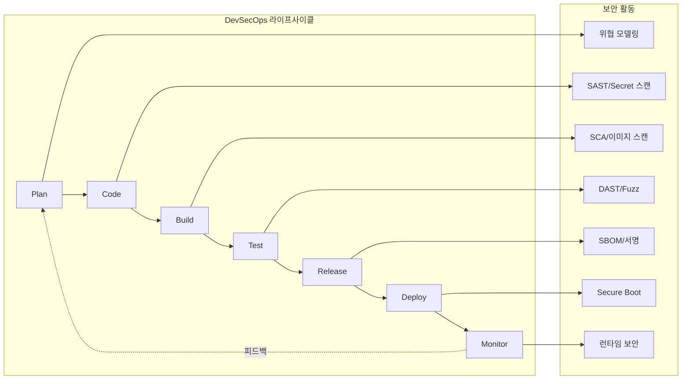

<div class="ai-summary-card">
<div class="ai-summary-header">
  <span class="ai-badge">AI 요약</span>
</div>
<div class="ai-summary-content">
  <div class="summary-row">
    <span class="summary-label">제목</span>
    <span class="summary-value">DevSecOps가 바라보는 자동차 보안 완벽 가이드: 커넥티드 카 시대의 보안 전략</span>
  </div>
  <div class="summary-row">
    <span class="summary-label">카테고리</span>
    <span class="summary-value"><span class="category-tag devsecops">DevSecOps</span> <span class="category-tag security">Security</span></span>
  </div>
  <div class="summary-row">
    <span class="summary-label">태그</span>
    <span class="summary-value tags">
      <span class="tag">DevSecOps</span>
      <span class="tag">Automotive-Security</span>
      <span class="tag">Connected-Car</span>
      <span class="tag">SAST</span>
      <span class="tag">DAST</span>
      <span class="tag">SBOM</span>
      <span class="tag">Supply-Chain-Security</span>
    </span>
  </div>
  <div class="summary-row highlights">
    <span class="summary-label">핵심 내용</span>
    <ul class="summary-list">
      <li><strong>SDV(Software Defined Vehicle) 시대 보안</strong>: 중앙 집중식 컴퓨팅 플랫폼, 서비스 지향 아키텍처(SOA), OTA 업데이트 의존성, Zero Trust 내부 통신, HSM 통합, Secure Boot 체인</li>
      <li><strong>자동차 보안 위협 분석</strong>: 네트워크 공격(Wi-Fi/Bluetooth/4G/5G, V2X, OTA), 물리적 공격(OBD-II, ECU 탬퍼링), 소프트웨어 취약점(메모리/암호화/인증), 공급망 공격(악성 코드 삽입, 의존성 취약점)</li>
      <li><strong>DevSecOps 라이프사이클 통합</strong>: Plan(위협 모델링 STRIDE/TARA), Code(SAST, Secret 스캔), Build(SCA, 이미지 스캔), Test(DAST/IAST, Fuzz), Release(SBOM, 서명/암호화), Deploy(Secure Boot), Monitor(런타임 보안, 침입 탐지)</li>
      <li><strong>규제 및 컴플라이언스</strong>: ISO 21434(자동차 사이버 보안), UN R155/R156(2025년 글로벌 확대 적용), V2X 보안 표준화(IEEE 1609.2, SCMS), GDPR/개인정보보호법</li>
      <li><strong>실무 보안 도구 스택</strong>: SAST(SonarQube, Semgrep, Clang Static Analyzer), Secret 스캔(Gitleaks, GitGuardian), SCA(Trivy, Snyk, Grype), DAST(OWASP ZAP, Burp Suite), Fuzz(AFL, LibFuzzer), SBOM(Syft, SPDX), 런타임 보안(Falco, Sysdig)</li>
    </ul>
  </div>
  <div class="summary-row">
    <span class="summary-label">기술/도구</span>
    <span class="summary-value">SAST, DAST, IAST, SCA, SBOM, SonarQube, Semgrep, Gitleaks, GitGuardian, Trivy, Snyk, OWASP ZAP, Burp Suite, AFL, LibFuzzer, Syft, SPDX, Falco, Sysdig, Secure Boot, TEE, HSM, ISO 21434, UN R155/R156, AUTOSAR Adaptive</span>
  </div>
  <div class="summary-row">
    <span class="summary-label">대상 독자</span>
    <span class="summary-value">자동차 소프트웨어 개발자, DevSecOps 엔지니어, 보안 담당자, 자동차 제조사 보안 팀</span>
  </div>
</div>
<div class="ai-summary-footer">
  이 포스팅은 AI가 쉽게 이해하고 활용할 수 있도록 구조화된 요약을 포함합니다.
</div>
</div>


## 서론

자동차 산업은 급속한 디지털 전환을 겪고 있습니다. **커넥티드 카(Connected Car)**, **자율주행(Autonomous Driving)**, **전기차(EV)** 기술의 발전으로 현대 자동차는 수억 줄의 코드와 수백 개의 ECU(Electronic Control Unit)로 구성된 복잡한 소프트웨어 시스템이 되었습니다.

> **⚠️ 보안 주의사항**
> 
> 자동차 보안은 **생명 안전(Life Safety)**과 직결됩니다. 한 번의 보안 취약점으로 인해 차량 제어권 탈취, 개인정보 유출, 심지어 인명 피해까지 발생할 수 있습니다. 따라서 자동차 보안은 전통적인 IT 보안보다 더 엄격한 기준이 요구됩니다.

**2024년 기준, 자동차 한 대당 평균 1억 5천만 줄 이상의 코드**가 포함되어 있으며, 이는 Windows 운영체제보다도 많은 양입니다. 이러한 복잡성은 보안 취약점의 증가로 이어지며, 실제로 **2023년 한 해 동안 자동차 관련 보안 취약점이 전년 대비 30% 이상 증가**했습니다.

전통적인 소프트웨어 개발 방식에서는 보안이 개발의 마지막 단계에서 고려되었지만, 이는 빠르게 변화하는 자동차 기술 환경에서 효과적이지 않습니다. **DevSecOps**는 개발 초기 단계부터 보안을 통합하여 보안 취약점을 조기에 발견하고 해결함으로써, 안전한 소프트웨어를 신속하게 제공할 수 있도록 합니다.

이 가이드에서는 **DevSecOps 관점에서 자동차 보안을 접근**하는 방법을 실무 중심으로 종합적으로 다룹니다. 특히 SAST, DAST, SBOM, 공급망 보안 등 자동차 업계에서 필수적인 보안 도구와 프로세스에 중점을 둡니다.

## 📊 빠른 참조

### 자동차 보안 통계

| 항목 | 내용 |
|------|------|
| **평균 코드 라인 수** | 1억 5천만 줄 이상 (자동차 1대당) |
| **보안 취약점 증가율** | 전년 대비 30% 이상 증가 (2023년) |
| **ECU 개수** | 수백 개의 ECU (Electronic Control Unit) |
| **오픈소스 의존성** | 자동차 소프트웨어의 60% 이상 |

### 자동차 보안 위협 유형

| 위협 유형 | 공격 방법 | 영향도 | 대응 방안 |
|----------|----------|--------|----------|
| **네트워크 공격** | Wi-Fi, Bluetooth, 4G/5G, V2X | 높음 | 네트워크 분할, 암호화 |
| **물리적 공격** | OBD-II 포트, ECU 탬퍼링 | 중간~높음 | 물리적 보안, 접근 제어 |
| **소프트웨어 취약점** | 메모리 취약점, 암호화 취약점 | 매우 높음 | SAST, DAST, 코드 검토 |
| **공급망 공격** | 악성 코드 삽입, 의존성 취약점 | 매우 높음 | SBOM, 의존성 스캔 |

### 규제 및 컴플라이언스

| 규제/표준 | 설명 | 적용 시기 | 필수 여부 |
|----------|------|----------|----------|
| **ISO 21434** | 자동차 사이버 보안 표준 | 2021년 발표 | 필수 |
| **UN R155** | 사이버 보안 규정 | 2025년 글로벌 확대 | 필수 |
| **UN R156** | 소프트웨어 업데이트 규정 | 2025년 글로벌 확대 | 필수 |
| **GDPR** | 개인정보보호법 | EU 지역 | 필수 |

### DevSecOps 라이프사이클 통합

| 단계 | 보안 활동 | 도구 예시 |
|------|----------|----------|
| **Plan** | 위협 모델링 (STRIDE, TARA) | Microsoft Threat Modeling Tool |
| **Code** | SAST, Secret 스캔 | SonarQube, Gitleaks |
| **Build** | SCA, 이미지 스캔 | Trivy, Snyk |
| **Test** | DAST/IAST, Fuzz 테스트 | OWASP ZAP, AFL |
| **Release** | SBOM, 서명/암호화 | Syft, SPDX |
| **Deploy** | Secure Boot, 무결성 검증 | TEE, HSM |
| **Monitor** | 런타임 보안, 침입 탐지 | Falco, Sysdig |

### 실무 보안 도구 스택

| 도구 유형 | 도구명 | 용도 |
|----------|--------|------|
| **SAST** | SonarQube, Semgrep, Clang Static Analyzer | 정적 코드 분석 |
| **Secret 스캔** | Gitleaks, GitGuardian | 민감 정보 탐지 |
| **SCA** | Trivy, Snyk, Grype | 의존성 취약점 스캔 |
| **DAST** | OWASP ZAP, Burp Suite | 동적 보안 테스트 |
| **Fuzz** | AFL, LibFuzzer | 자동화된 테스트 |
| **SBOM** | Syft, SPDX | 소프트웨어 구성 요소 관리 |
| **런타임 보안** | Falco, Sysdig | 실시간 보안 모니터링 |

### SDV 보안 아키텍처 핵심 요소

| 보안 영역 | 보안 항목 | 필수 여부 |
|----------|----------|----------|
| **아키텍처** | 중앙 집중식 보안 정책 | 필수 |
| | Zero Trust 내부 통신 | 권장 |
| | HSM 통합 | 필수 |
| **소프트웨어** | Secure Boot 체인 | 필수 |
| | 런타임 무결성 검증 | 권장 |
| | 보안 OTA 업데이트 | 필수 |
| **모니터링** | 실시간 위협 탐지 | 필수 |
| | 보안 이벤트 로깅 | 필수 |
| | ML 기반 이상 탐지 | 권장 |

## 1. 자동차 보안 위협 개요

### 1.1 자동차 보안의 특수성

자동차 보안은 전통적인 IT 보안과는 다른 특수성을 가지고 있습니다:

| 특수성 분류 | 주요 특징 | 설명 |
|------------|----------|------|
| **생명 안전과 직결** | 차량 제어권 탈취 | 공격자가 브레이크, 조향, 가속 등을 제어할 수 있음 |
| | 실시간 시스템 | 지연 없는 응답이 필수적이며, 보안 검사로 인한 성능 저하가 치명적일 수 있음 |
| | 장기 운영 | 자동차는 10년 이상 사용되며, 장기간 보안 업데이트가 필요 |
| **복잡한 공급망** | 다층 공급망 | OEM → Tier 1 → Tier 2 → Tier 3 등 복잡한 공급망 구조 |
| | 오픈소스 의존성 | 자동차 소프트웨어의 60% 이상이 오픈소스 기반 |
| | 다양한 벤더 | 수백 개의 서로 다른 벤더에서 제공하는 부품과 소프트웨어 |
| **규제 및 컴플라이언스** | ISO 21434 | 자동차 사이버 보안 표준 |
| | UN R155/R156 | 자동차 사이버 보안 및 소프트웨어 업데이트 규정 (2025년 글로벌 확대 적용) |
| | GDPR, 개인정보보호법 | 차량 내 개인정보 처리 규정 |

> **2025년 업데이트: UN R155/R156 글로벌 확대 적용**
>
> 2025년부터 UN R155(사이버 보안)와 R156(소프트웨어 업데이트) 규정이 글로벌로 확대 적용되었습니다. 이제 신규 출시되는 모든 차량은 이 규정을 준수해야 하며, 기존 판매 중인 차량도 단계적으로 적용됩니다. 이는 전 세계 자동차 제조사들이 사이버 보안 관리 시스템(CSMS)을 의무적으로 구축해야 함을 의미합니다.

### 1.2 주요 보안 위협 유형

자동차 보안 위협은 다음과 같이 분류할 수 있습니다:

| 위협 유형 | 공격 방법 | 설명 | 영향도 |
|----------|----------|------|--------|
| **네트워크 공격** | 무선 공격 | Wi-Fi, Bluetooth, 4G/5G 네트워크를 통한 침입 | 높음 |
| | V2X 공격 | Vehicle-to-Everything 통신을 통한 공격 | 높음 |
| | OTA 업데이트 공격 | 무선 업데이트 프로세스 악용 | 매우 높음 |
| **물리적 공격** | OBD-II 포트 공격 | 진단 포트를 통한 차량 제어 시스템 접근 | 중간 |
| | ECU 탬퍼링 | 물리적 접근을 통한 ECU 조작 | 높음 |
| | 키 복제 | 무선 키 시스템의 취약점 악용 | 중간 |
| **소프트웨어 취약점** | 메모리 취약점 | Buffer Overflow, Use-After-Free 등 | 매우 높음 |
| | 암호화 취약점 | 약한 암호화 알고리즘, 하드코딩된 키 | 매우 높음 |
| | 인증/인가 취약점 | 취약한 인증 메커니즘 | 높음 |
| **공급망 공격** | 악성 코드 삽입 | 공급망을 통한 악성 코드 유입 | 매우 높음 |
| | 의존성 취약점 | 오픈소스 라이브러리의 알려진 취약점 | 높음 |
| | 펌웨어 조작 | 부품 제조 단계에서의 악성 펌웨어 삽입 | 매우 높음 |

> **2025년 업데이트: V2X 통신 보안 표준화**
>
> 2025년부터 V2X(Vehicle-to-Everything) 통신 보안 표준화가 본격적으로 진행되고 있습니다. IEEE 1609.2 기반의 보안 인증서 관리 시스템(SCMS)이 글로벌 표준으로 자리잡고 있으며, C-V2X(Cellular V2X)와 DSRC(Dedicated Short-Range Communications) 모두에서 PKI 기반 인증이 의무화되고 있습니다. 이는 차량 간 통신(V2V), 차량-인프라 통신(V2I), 차량-보행자 통신(V2P) 등 모든 V2X 시나리오에 적용됩니다.

## 2. SDV(Software Defined Vehicle) 시대의 보안 과제 (2025년 업데이트)

2025년 현재, 자동차 산업은 SDV(Software Defined Vehicle) 시대로 전환 중입니다. SDV는 하드웨어 중심에서 소프트웨어 중심으로 차량 기능이 정의되는 패러다임 변화를 의미합니다.

### 2.1 SDV 보안의 핵심 과제

#### 소프트웨어 중심 아키텍처
- **중앙 집중식 컴퓨팅**: 기존 분산된 ECU에서 중앙 컴퓨팅 플랫폼으로 전환
- **서비스 지향 아키텍처(SOA)**: 차량 기능이 소프트웨어 서비스로 제공
- **OTA 업데이트 의존성**: 지속적인 기능 업데이트 및 보안 패치 필수

#### SDV 보안 아키텍처 구조 (2025)

**SDV 보안 아키텍처 계층 구조**:

| 계층 | 구성 요소 | 설명 | 보안 기능 |
|------|----------|------|----------|
| **애플리케이션 도메인** | ADAS Domain | 자율주행 보조 시스템 | 도메인 격리, 접근 제어 |
| | Infotainment | 인포테인먼트 시스템 | 샌드박싱, 앱 검증 |
| | Body Control | 차체 제어 시스템 | 권한 분리, 안전 검증 |
| | Powertrain Control | 파워트레인 제어 | 실시간 보안, 무결성 검증 |
| **보안 미들웨어** | Access Control | 접근 제어 | 역할 기반 접근 제어 (RBAC) |
| | Encryption | 암호화 | 전송/저장 데이터 암호화 |
| | Secure Boot | 보안 부팅 | 부팅 체인 무결성 검증 |
| **보안 게이트웨이** | Secure Gateway | 보안 게이트웨이 | 네트워크 분할, 트래픽 검사 |
| **외부 연결** | V2X Module | 차량 간 통신 | PKI 인증, 메시지 무결성 |
| | Cloud Backend | 클라우드 백엔드 | TLS 1.3, 인증서 고정 |
| | OTA Server | OTA 업데이트 서버 | 서명 검증, 롤백 메커니즘 |

**데이터 흐름 및 보안 검증**:

| 데이터 흐름 경로 | 보안 검증 단계 | 설명 |
|----------------|--------------|------|
| **도메인 → 보안 미들웨어** | 인증 및 인가 | 각 도메인에서 보안 미들웨어로 요청 시 인증/인가 검증 |
| **보안 미들웨어 → 게이트웨이** | 암호화 및 무결성 | 모든 통신은 암호화되고 무결성 검증 |
| **게이트웨이 → 외부 연결** | 네트워크 분할 | V2X, Cloud, OTA 각각 독립적인 보안 정책 적용 |

| 보안 고려사항 | 설명 | 적용 영역 |
|-------------|------|----------|
| **API 보안** | 내부 서비스 간 통신 보안 | Central Computing Platform 내부 서비스 간 통신 |
| **컨테이너 보안** | 차량용 컨테이너 런타임 보안 | 소프트웨어 서비스 실행 환경 |
| **실시간 보안 모니터링** | 차량 내 보안 이벤트 실시간 탐지 | 전체 시스템 전반 |

### 2.2 SDV 보안 모범 사례

| 보안 영역 | 보안 항목 | 설명 | 필수 여부 |
|----------|----------|------|----------|
| **아키텍처** | 중앙 집중식 보안 정책 | 중앙에서 보안 정책 관리 및 적용 | 필수 |
| | Zero Trust 내부 통신 | 내부 서비스 간 통신도 신뢰하지 않고 검증 | 권장 |
| | 하드웨어 보안 모듈 통합 | HSM을 통한 키 관리 및 암호화 | 필수 |
| **소프트웨어** | Secure Boot 체인 | 부팅 과정 전체의 무결성 검증 | 필수 |
| | 런타임 무결성 검증 | 실행 중 소프트웨어 무결성 검증 | 권장 |
| | 보안 OTA 업데이트 메커니즘 | 안전한 무선 업데이트 프로세스 | 필수 |
| **모니터링** | 실시간 위협 탐지 | 실시간 보안 이벤트 탐지 및 대응 | 필수 |
| | 보안 이벤트 로깅 | 모든 보안 이벤트 기록 및 추적 | 필수 |
| | ML 기반 이상 탐지 | 머신러닝을 활용한 이상 행위 탐지 | 권장 |
| **컴플라이언스** | UN R155/R156 준수 | UN 규정 준수 | 필수 |
| | ISO 21434 인증 | ISO 21434 표준 준수 | 필수 |
| | AUTOSAR Adaptive 보안 | AUTOSAR Adaptive 보안 표준 준수 | 권장 |

## 3. DevSecOps를 통한 자동차 보안 통합

### 3.1 DevSecOps의 핵심 원칙

자동차 업계에서 DevSecOps를 성공적으로 구현하기 위한 핵심 원칙:

| 핵심 원칙 | 주요 활동 | 효과 |
|----------|----------|------|
| **Shift Left (왼쪽으로 이동)** | 개발 초기 단계부터 보안 통합 (설계 단계에서부터 보안 요구사항 정의) | 취약점 조기 발견 및 수정 비용 최소화 |
| | 자동화된 보안 검사 (코드 작성과 동시에 보안 취약점 탐지) | 실시간 보안 피드백 |
| | 조기 발견 및 수정 (개발 단계에서 취약점 발견 시 즉시 수정) | 보안 품질 향상 |
| **자동화 (Automation)** | CI/CD 파이프라인 통합 (모든 코드 변경에 대한 자동 보안 검사) | 일관된 보안 검사 |
| | 정적/동적 분석 자동화 (SAST, DAST 도구를 파이프라인에 통합) | 자동화된 취약점 탐지 |
| | 의존성 검사 자동화 (오픈소스 라이브러리의 취약점 자동 검사) | 공급망 보안 강화 |
| **협업 (Collaboration)** | 개발자, 보안 팀, 운영 팀 간 협업 (보안을 모든 팀의 책임으로) | 조직 전체 보안 문화 구축 |
| | 보안 교육 (개발자 대상 보안 인식 교육 및 모범 사례 공유) | 보안 역량 강화 |
| | 투명한 커뮤니케이션 (보안 이슈에 대한 명확한 보고 및 대응 프로세스) | 신속한 보안 대응 |

### 2.2 자동차 소프트웨어 개발 라이프사이클에 보안 통합



각 단계별 보안 활동:

| 단계 | 보안 활동 | 주요 도구 | 검증 항목 |
|------|----------|----------|----------|
| **Plan** | 위협 모델링, 보안 요구사항 정의 | STRIDE, OWASP Threat Dragon, TARA | 위협 모델, 보안 요구사항 문서 |
| **Code** | SAST, Secret 스캔, 코드 리뷰 | SonarQube, Semgrep, Gitleaks, GitGuardian | 취약점 리포트, Secret 탐지 리포트 |
| **Build** | SCA, 컨테이너/펌웨어 이미지 스캔 | Trivy, Snyk, Grype, Black Duck | 의존성 취약점 리포트, 이미지 스캔 리포트 |
| **Test** | DAST, IAST, Fuzz 테스트 | OWASP ZAP, Burp Suite, AFL, LibFuzzer | 동적 분석 리포트, Fuzz 테스트 리포트 |
| **Release** | SBOM 생성, 펌웨어 서명, 암호화 | Syft, SPDX, Cosign, TPM | SBOM 문서, 서명 검증 결과 |
| **Deploy** | 펌웨어 검증, 보안 부팅 | Secure Boot, TEE, HSM | 부팅 검증 로그, 펌웨어 무결성 검증 |
| **Monitor** | 런타임 보안, 침입 탐지 | Falco, Sysdig, SIEM | 보안 이벤트 로그, 이상 탐지 리포트 |

## 3. 코드 보안: SAST 및 Secret 스캔

### 3.1 정적 애플리케이션 보안 테스트 (SAST)

SAST는 소스 코드를 분석하여 보안 취약점을 탐지하는 정적 분석 도구입니다.

#### 자동차 소프트웨어에서의 SAST 중요성

| SAST 검증 영역 | 설명 | 중요도 |
|--------------|------|--------|
| **메모리 안전성** | C/C++ 기반 ECU 소프트웨어의 메모리 취약점 탐지 | 매우 높음 |
| **암호화 구현 검증** | 암호화 알고리즘 및 키 관리 검증 | 매우 높음 |
| **인증/인가 로직 검증** | 차량 제어 시스템의 접근 제어 검증 | 매우 높음 |

#### SAST 도구 통합 예시

> **참고**: GitHub Actions 워크플로우 관련 내용은 [GitHub Actions 문서](https://docs.github.com/en/actions) 및 [보안 가이드](https://docs.github.com/en/actions/security-guides/security-hardening-for-github-actions)를 참조하세요./automotive-sast.yml...
> ```

<!-- 전체 코드는 위 GitHub 링크 참조
```yaml
# .github/workflows/automotive-sast.yml
name: Automotive SAST Pipeline

on:
  push:
    branches: [main, develop]
  pull_request:
    branches: [main]

jobs:
  sast-analysis:
    runs-on: ubuntu-latest
    steps:
      - uses: actions/checkout@v4
      
      - name: Setup C/C++ Build Tools
        run: |
          sudo apt-get update
          sudo apt-get install -y build-essential clang
      
      # SonarQube를 통한 정적 분석
      - name: Run SonarQube Analysis
        uses: sonarsource/sonarqube-scan-action@master
        env:
          SONAR_TOKEN: ${{ secrets.SONAR_TOKEN }}
          SONAR_HOST_URL: ${{ secrets.SONAR_HOST_URL }}
      
      # Semgrep를 통한 패턴 기반 검사
      - name: Run Semgrep
        uses: returntocorp/semgrep-action@v1
        with:
          config: >-
            p/owasp-top-ten
            p/cwe-top-25
            p/autonomous-vehicle
      
      # Clang Static Analyzer
      - name: Run Clang Static Analyzer
        run: |
          scan-build make
      
      # 결과 리포트 생성
      - name: Upload SAST Reports
        uses: actions/upload-artifact@v3
        with:
          name: sast-reports
          path: |
            sonar-report.json
            semgrep-report.json

-->

### 3.2 Secret 스캔

하드코딩된 비밀번호, API 키, 인증서 등 민감한 정보를 탐지합니다.

> **⚠️ 보안 주의사항**
> 
> 자동차 소프트웨어에서 하드코딩된 비밀키는 **치명적인 보안 취약점**입니다. 공격자가 펌웨어를 역공학하여 비밀키를 추출할 수 있으며, 이를 통해 차량 제어권을 탈취할 수 있습니다.

#### Secret 스캔 도구 통합

> **참고**: CodeQL 분석 설정 관련 내용은 [GitHub CodeQL 문서](https://docs.github.com/en/code-security/code-scanning/using-codeql-code-scanning-with-your-ci) 및 [CodeQL Action](https://github.com/github/codeql-action)을 참조하세요.-action/upload-sarif@v2
  with:
    sarif_file: 'trivy-results.sarif'

-->

#### 의존성 취약점 대응 프로세스

| 단계 | 활동 | 담당자 | 기간 |
|------|------|--------|------|
| **1. 취약점 탐지** | SCA 도구를 통한 자동 탐지 | DevSecOps 팀 | 실시간 |
| **2. 위험도 평가** | CVSS 점수 및 자동차 환경에서의 영향도 평가 | 보안 팀 | 1-2일 |
| **3. 패치 적용** | 보안 패치가 있는 경우 즉시 적용 | 개발 팀 | 3-7일 |
| **4. 대체 솔루션 검토** | 패치가 없는 경우 대체 라이브러리 검토 | 아키텍처 팀 | 5-14일 |
| **5. 컴플라이언스 확인** | ISO 21434, UN R155 등 규정 준수 확인 | 컴플라이언스 팀 | 1-3일 |

### 4.2 소프트웨어 재료 목록 (SBOM)

SBOM은 소프트웨어에 포함된 모든 구성 요소를 문서화한 목록입니다. 자동차 업계에서는 **UN R155 규정 준수**를 위해 SBOM이 필수적입니다.

#### SBOM 생성 및 관리

> **참고**: 자동차 보안 스캔 관련 내용은 [GitHub Actions 보안 가이드](https://docs.github.com/en/actions/security-guides/security-hardening-for-github-actions) 및 [SonarQube](https://github.com/SonarSource/sonarqube)를 참조하세요. 테스트: DAST 및 Fuzz 테스트

### 5.1 동적 애플리케이션 보안 테스트 (DAST)

DAST는 실행 중인 애플리케이션을 테스트하여 런타임 취약점을 탐지합니다.

#### 자동차 환경에서의 DAST

> **코드 예시**: 전체 코드는 [GitHub 예제 저장소](https://github.com/docker-library)를 참조하세요.
> 
> ```yaml
> # DAST 테스트 단계...
> ```

<!-- 전체 코드는 위 GitHub 링크 참조
```yaml
# DAST 테스트 단계
- name: Run OWASP ZAP Baseline Scan
  uses: zaproxy/action-baseline@v0.7.0
  with:
    target: 'http://vehicle-gateway:8080'
    rules_file_name: '.zap/rules.tsv'
    cmd_options: '-a'

- name: Run Burp Suite Scan
  run: |
    docker run --rm -v $(pwd):/results \
      burpsuite/community-edition \
      burpsuite --project-file=/results/burp-project.burp \
      --scan /results/scan-config.json

-->

### 5.2 Fuzz 테스트

Fuzz 테스트는 무작위 입력을 생성하여 프로그램의 예외 상황을 테스트합니다. 자동차 소프트웨어에서는 **CAN 버스 메시지**, **네트워크 프로토콜**, **파일 파싱** 등에 Fuzz 테스트를 적용합니다.

#### Fuzz 테스트 예시

> **코드 예시**: 전체 코드는 [GitHub 예제 저장소](https://github.com/torvalds/linux/tree/master/Documentation)를 참조하세요.
> 
> ```c
> // AFL (American Fuzzy Lop)를 사용한 Fuzz 테스트...
> ```

<!-- 전체 코드는 위 GitHub 링크 참조
```c
// AFL (American Fuzzy Lop)를 사용한 Fuzz 테스트
#include <stdio.h>
#include <stdlib.h>
#include <string.h>

// CAN 메시지 파싱 함수 (Fuzz 테스트 대상)
int parse_can_message(uint8_t *data, size_t len) {
    if (len < 8) return -1;  // CAN 메시지는 최소 8바이트
    
    uint32_t id = (data[0] << 24) | (data[1] << 16) | (data[2] << 8) | data[3];
    uint8_t dlc = data[4];
    uint8_t *payload = &data[5];
    
    // 메시지 ID 검증
    if (id > 0x7FF) return -1;  // 표준 CAN ID 범위 초과
    
    // DLC 검증
    if (dlc > 8) return -1;
    
    // 페이로드 처리
    // ... (실제 로직)
    
    return 0;
}

// Fuzz 테스트 진입점
int main(int argc, char **argv) {
    FILE *fp = fopen(argv[1], "rb");
    if (!fp) return 1;
    
    uint8_t buffer[256];
    size_t len = fread(buffer, 1, sizeof(buffer), fp);
    fclose(fp);
    
    return parse_can_message(buffer, len);
}

-->

> **참고**: 관련 예제는 [공식 문서](https://www.gnu.org/software/bash/manual/bash.html)를 참조하세요.

```bash
# AFL Fuzz 테스트 실행
afl-gcc -o parse_can_message parse_can_message.c
afl-fuzz -i testcases/ -o findings/ ./parse_can_message @@
```

## 6. 공급망 보안

### 6.1 공급망 보안의 중요성

자동차 제조사는 수백 개의 서로 다른 벤더에서 부품과 소프트웨어를 공급받습니다. 이러한 복잡한 공급망은 보안 위협의 주요 경로가 됩니다.

#### 공급망 보안 위협

| 위협 유형 | 설명 | 영향 범위 | 대응 난이도 |
|----------|------|----------|------------|
| **악성 코드 삽입** | 공급업체를 통한 악성 코드 유입 | 전체 차량 시스템 | 높음 |
| **의존성 취약점** | 공급업체가 사용하는 오픈소스 라이브러리의 취약점 | 특정 기능 모듈 | 중간 |
| **펌웨어 조작** | 제조 단계에서의 악성 펌웨어 삽입 | 특정 ECU/부품 | 높음 |
| **하드웨어 백도어** | 하드웨어 레벨의 백도어 설치 | 하드웨어 전체 | 매우 높음 |

### 6.2 공급망 보안 강화 전략

#### 공급업체 보안 요구사항

| 요구사항 분류 | 세부 항목 | 요구 기준 |
|-------------|----------|----------|
| **코드 보안** | SAST 스캔 필수 | SonarQube, Semgrep 사용 |
| | 최소 보안 점수 | A 등급 이상 |
| **의존성 관리** | SCA 스캔 필수 | Snyk, Trivy 사용 |
| | 취약점 대응 정책 | Critical/High 취약점은 30일 이내 패치 |
| **SBOM 요구사항** | SBOM 형식 | SPDX 형식 |
| | SBOM 제공 시점 | 모든 소프트웨어 릴리스 시 |
| | SBOM 검증 | 디지털 서명 필수 |
| **보안 테스트** | DAST 필수 | OWASP ZAP, Burp Suite 등 |
| | 침투 테스트 | 연 1회 수행 |
| | 보안 인증 | ISO 21434, UN R155 준수 |

#### 공급업체 소프트웨어 검증 프로세스

| 단계 | 활동 | 검증 항목 | 산출물 |
|------|------|----------|--------|
| **1. 사전 검증** | 공급업체 선정 시 보안 역량 평가 | 보안 인증, 보안 프로세스, 보안 팀 구성 | 보안 역량 평가서 |
| **2. 계약 단계** | 보안 요구사항을 계약에 명시 | SAST/SCA/DAST 요구사항, SBOM 제공, 보안 인증 | 보안 요구사항 계약서 |
| **3. 개발 단계** | 정기적인 보안 검사 및 리뷰 | SAST 리포트, SCA 리포트, 코드 리뷰 | 정기 보안 검사 리포트 |
| **4. 납품 단계** | SBOM, 보안 검사 리포트, 디지털 서명 검증 | SBOM 검증, 보안 리포트 검토, 서명 검증 | 검증 완료 증명서 |
| **5. 운영 단계** | 지속적인 모니터링 및 취약점 대응 | 취약점 모니터링, 패치 관리, 보안 업데이트 | 운영 보안 모니터링 리포트 |

## 7. 펌웨어 보안: 서명 및 검증

### 7.1 펌웨어 서명

펌웨어 서명을 통해 펌웨어의 무결성과 출처를 보장합니다.

#### 펌웨어 서명 프로세스

> **코드 예시**: 전체 코드는 [Bash 공식 문서](https://www.gnu.org/software/bash/manual/bash.html)를 참조하세요.
> 
> ```bash
> # Cosign을 사용한 펌웨어 서명...
> ```

<!-- 전체 코드는 위 링크 참조
```bash
# Cosign을 사용한 펌웨어 서명
# 1. 키 쌍 생성 (HSM 또는 안전한 환경에서)
cosign generate-key-pair --kms azurekms://vault-name/key-name

# 2. 펌웨어 서명
cosign sign-blob --key cosign.key firmware.bin \
  --output-signature firmware.bin.sig \
  --output-certificate firmware.bin.crt

# 3. 서명 검증
cosign verify-blob --key cosign.pub \
  --signature firmware.bin.sig \
  --certificate firmware.bin.crt \
  firmware.bin

-->

### 7.2 Secure Boot

Secure Boot는 부팅 과정에서 펌웨어의 무결성을 검증합니다.

> **코드 예시**: 전체 코드는 [GitHub 예제 저장소](https://github.com/torvalds/linux/tree/master/Documentation)를 참조하세요.
> 
> ```c
> // Secure Boot 검증 예시 (의사 코드)...
> ```

<!-- 전체 코드는 위 GitHub 링크 참조
```c
// Secure Boot 검증 예시 (의사 코드)
int verify_firmware_signature(uint8_t *firmware, size_t len, uint8_t *signature) {
    // 1. 공개키 로드 (하드웨어 보호된 저장소에서)
    public_key_t *pub_key = load_public_key_from_hsm();
    
    // 2. 펌웨어 해시 계산
    uint8_t hash[SHA256_DIGEST_SIZE];
    sha256(firmware, len, hash);
    
    // 3. 서명 검증
    if (verify_signature(hash, signature, pub_key) != 0) {
        return -1;  // 서명 검증 실패
    }
    
    // 4. 펌웨어 실행 허용
    return 0;
}

-->

## 8. 런타임 보안 및 모니터링

### 8.1 런타임 보안 모니터링

차량 운영 중 보안 이벤트를 실시간으로 모니터링하고 대응합니다.

#### 런타임 보안 도구

> **참고**: 자동차 보안 스캔 관련 내용은 [GitHub Actions 보안 가이드](https://docs.github.com/en/actions/security-guides/security-hardening-for-github-actions) 및 [SonarQube](https://github.com/SonarSource/sonarqube)를 참조하세요. 모니터링...
> ```

<!-- 전체 코드는 위 GitHub 링크 참조
```yaml
# Falco를 사용한 런타임 보안 모니터링
- name: Deploy Falco Runtime Security
  run: |
    helm repo add falcosecurity https://falcosecurity.github.io/charts
    helm install falco falcosecurity/falco \
      --set falco.grpc.enabled=true \
      --set falco.grpcOutput.enabled=true

# Falco 규칙 예시 (자동차 특화)
- rule: Unauthorized CAN Message
  desc: Detect unauthorized CAN bus messages
  condition: >
    can_message.id not in (allowed_can_ids) and
    can_message.source != "authorized_ecu"
  output: >
    Unauthorized CAN message detected
    (id=%can_message.id, source=%can_message.source)
  priority: CRITICAL

-->

### 8.2 침입 탐지 시스템 (IDS)

차량 내부 네트워크에서 비정상적인 트래픽을 탐지합니다.

> **코드 예시**: 전체 코드는 [GitHub 예제 저장소](https://github.com/python/cpython/tree/main/Doc)를 참조하세요.
> 
> ```python
> # 간단한 CAN 버스 IDS 예시...
> ```

<!-- 전체 코드는 위 GitHub 링크 참조
```python
# 간단한 CAN 버스 IDS 예시
import can

class CanBusIDS:
    def __init__(self):
        self.allowed_ids = set([0x100, 0x200, 0x300])  # 허용된 CAN ID
        self.message_frequency = {}  # 메시지 빈도 추적
    
    def monitor_can_bus(self, bus):
        while True:
            msg = bus.recv()
            
            # 1. 허용되지 않은 CAN ID 탐지
            if msg.arbitration_id not in self.allowed_ids:
                self.alert(f"Unauthorized CAN ID: {hex(msg.arbitration_id)}")
            
            # 2. 비정상적인 메시지 빈도 탐지
            if self.detect_anomaly(msg):
                self.alert(f"Anomalous message pattern: {hex(msg.arbitration_id)}")
            
            # 3. 메시지 내용 분석
            if self.detect_malicious_payload(msg):
                self.alert(f"Malicious payload detected: {msg.data.hex()}")
    
    def detect_anomaly(self, msg):
        msg_id = msg.arbitration_id
        current_time = time.time()
        
        if msg_id not in self.message_frequency:
            self.message_frequency[msg_id] = []
        
        self.message_frequency[msg_id].append(current_time)
        
        # 최근 1초 동안의 메시지 수 확인
        recent_messages = [
            t for t in self.message_frequency[msg_id]
            if current_time - t < 1.0
        ]
        
        # 정상적인 빈도보다 10배 이상 높으면 이상 탐지
        if len(recent_messages) > 100:  # 예시 임계값
            return True
        
        return False
    
    def alert(self, message):
        print(f"[ALERT] {message}")
        # 실제 환경에서는 SIEM으로 전송

-->

## 9. 자동차 업계 DevSecOps 모범 사례

### 9.1 초기 단계 보안 통합

개발 초기 단계부터 자동화된 보안 제어 및 테스트를 포함하여 보안 취약점을 조기에 식별하고 수정합니다.

#### 위협 모델링

**자산**: Vehicle Gateway ECU

| 위협 ID | 위협 설명 | 공격 벡터 | 영향도 | 발생 가능성 | 위험 수준 | 대응 방안 |
|---------|----------|----------|--------|------------|----------|----------|
| **T1** | Unauthorized access to vehicle gateway | Network attack via OBD-II port | CRITICAL | MEDIUM | HIGH | • 보안 인증 구현<br>• OBD-II 통신 암호화<br>• 침입 탐지 시스템 구현 |
| **T2** | Malicious firmware update | OTA update process compromise | CRITICAL | LOW | MEDIUM | • 펌웨어 서명 구현<br>• 업데이트 서버 인증서 검증<br>• 롤백 메커니즘 구현 |

### 9.2 소프트웨어 수명주기 전반의 보안 계획

업그레이드, 패치, 취약점 테스트 등을 고려하여 소프트웨어 수명주기 전체에 걸쳐 보안 계획을 수립합니다.

#### 보안 패치 관리 프로세스

| 단계 | 활동 | 담당자 | 기간 | 산출물 |
|------|------|--------|------|--------|
| **1. 취약점 발견** | 내부 테스트 또는 외부 보고를 통한 취약점 발견 | 보안 팀, 외부 연구자 | 즉시 | 취약점 보고서 |
| **2. 위험도 평가** | CVSS 점수 및 자동차 환경에서의 영향도 평가 | 보안 팀, 제품 팀 | 1-3일 | 위험도 평가서 |
| **3. 패치 개발** | 보안 패치 개발 및 테스트 | 개발 팀, QA 팀 | 7-30일 | 보안 패치 |
| **4. 검증** | 보안 패치의 효과성 및 부작용 검증 | QA 팀, 보안 팀 | 3-7일 | 검증 리포트 |
| **5. 배포** | OTA 또는 서비스 센터를 통한 패치 배포 | 운영 팀 | 1-7일 | 배포 완료 보고서 |
| **6. 모니터링** | 패치 배포 후 모니터링 및 검증 | 운영 팀, 보안 팀 | 지속적 | 모니터링 리포트 |

### 9.3 정적 및 동적 보안 테스트 적용

정적 애플리케이션 보안 테스트(SAST)와 동적 애플리케이션 보안 테스트(DAST)를 통해 코드의 보안 결함을 확인하고 시스템 내 침입을 시뮬레이션합니다.

#### 통합 보안 테스트 파이프라인

> **참고**: 자동차 보안 스캔 관련 내용은 [GitHub Actions 보안 가이드](https://docs.github.com/en/actions/security-guides/security-hardening-for-github-actions) 및 [SonarQube](https://github.com/SonarSource/sonarqube)를 참조하세요.-scan:
    runs-on: ubuntu-latest
    steps:
      - uses: actions/checkout@v4
      
      # 1. SAST
      - name: SAST Analysis
        run: |
          sonar-scanner
          semgrep --config=auto .
      
      # 2. Secret Scan
      - name: Secret Scanning
        run: |
          gitleaks detect --verbose
          ggshield secret scan .
      
      # 3. SCA
      - name: Dependency Scanning
        run: |
          trivy fs --severity CRITICAL,HIGH .
          snyk test --severity-threshold=high
      
      # 4. SBOM Generation
      - name: Generate SBOM
        run: |
          syft packages . -o spdx-json > sbom.spdx.json
      
      # 5. DAST
      - name: DAST Testing
        run: |
          zap-baseline.py -t http://target:8080
      
      # 6. Fuzz Testing
      - name: Fuzz Testing
        run: |
          afl-fuzz -i testcases/ -o findings/ ./target @@
      
      # 7. Upload Reports
      - name: Upload Security Reports
        uses: actions/upload-artifact@v3
        with:
          name: security-reports
          path: |
            sonar-report.json
            trivy-report.json
            sbom.spdx.json

-->

## 10. 규정 준수: ISO 21434 및 UN R155

### 10.1 ISO 21434 (자동차 사이버 보안)

ISO 21434은 자동차 사이버 보안을 위한 국제 표준입니다.

#### 주요 요구사항

| 요구사항 | 설명 | 적용 단계 |
|----------|------|----------|
| **위협 분석 및 위험 평가 (TARA)** | 체계적인 위협 분석 및 위험 평가 | 설계 단계 |
| **보안 요구사항** | 보안 기능 및 보안 수준 요구사항 정의 | 요구사항 정의 단계 |
| **보안 설계** | 보안을 고려한 시스템 설계 | 설계 단계 |
| **보안 검증** | 보안 요구사항 충족 여부 검증 | 검증 단계 |
| **보안 테스트** | 보안 기능 및 취약점 테스트 | 테스트 단계 |
| **사고 대응** | 사이버 보안 사고 대응 계획 및 프로세스 | 운영 단계 |

### 10.2 UN R155/R156 (자동차 사이버 보안 및 소프트웨어 업데이트 규정)

UN R155는 유엔 자동차 규정으로, 2024년부터 한국을 포함한 여러 국가에서 시행되었으며, **2025년부터 글로벌 확대 적용**되고 있습니다.

#### 주요 요구사항

| 요구사항 | 설명 | 적용 시점 | 검증 방법 |
|----------|------|----------|----------|
| **CSMS (Cyber Security Management System)** | 사이버 보안 관리 시스템 구축 | 차량 개발 전 | CSMS 인증 (3년 유효) |
| **VTA (Vehicle Type Approval)** | 차량 형식 승인 시 보안 요구사항 충족 | 차량 형식 승인 시 | VTA 검증 |
| **SBOM 제공** | 소프트웨어 재료 목록 제공 | 모든 소프트웨어 릴리스 시 | SBOM 검증 |
| **취약점 대응** | 취약점 발견 시 대응 계획 수립 및 실행 | 취약점 발견 시 | 대응 계획 검증 |
| **보안 업데이트** | 보안 업데이트 메커니즘 제공 | 차량 운영 중 | SUMS (Software Update Management System) 검증 |

> **2025년 업데이트: UN R155/R156 글로벌 확대**
>
> **UN R155 (사이버 보안)**
> - 2025년 7월부터 모든 신규 차량 형식에 의무 적용
> - 기존 판매 차량도 2027년까지 단계적 적용
> - CSMS 인증 유효기간 3년, 갱신 필수
>
> **UN R156 (소프트웨어 업데이트)**
> - 소프트웨어 업데이트 관리 시스템(SUMS) 구축 의무화
> - OTA 업데이트 시 사용자 동의 및 롤백 메커니즘 필수
> - 업데이트 이력 및 버전 관리 추적 가능해야 함
>
> **V2X 보안 표준화**
> - IEEE 1609.2 기반 SCMS(Security Credential Management System) 표준화
> - C-V2X 및 DSRC 모두에서 PKI 기반 인증 의무화
> - 메시지 무결성 및 출처 검증 필수

## 11. 실무 사례 및 체크리스트

### 11.1 자동차 DevSecOps 구현 체크리스트

| 단계 | 체크리스트 항목 | 도구/방법 | 우선순위 |
|------|---------------|----------|----------|
| **개발 단계** | 위협 모델링 수행 | TARA | 높음 |
| | 보안 요구사항 정의 | 보안 요구사항 문서 | 높음 |
| | SAST 도구 통합 | SonarQube, Semgrep | 매우 높음 |
| | Secret 스캔 도구 통합 | Gitleaks, GitGuardian | 매우 높음 |
| | 코드 리뷰 프로세스 수립 | Pull Request 리뷰 | 높음 |
| | 보안 코딩 가이드라인 준수 | OWASP, CWE 가이드라인 | 중간 |
| **빌드 단계** | SCA 도구 통합 | Trivy, Snyk | 매우 높음 |
| | 컨테이너/펌웨어 이미지 스캔 | Trivy, Grype | 높음 |
| | SBOM 생성 자동화 | Syft, SPDX | 높음 |
| | 의존성 취약점 대응 프로세스 | 취약점 대응 프로세스 문서 | 높음 |
| **테스트 단계** | DAST 도구 통합 | OWASP ZAP, Burp Suite | 높음 |
| | Fuzz 테스트 수행 | AFL, LibFuzzer | 중간 |
| | 침투 테스트 수행 | 연 1회 수행 | 중간 |
| | 보안 테스트 결과 검토 및 대응 | 보안 테스트 리포트 | 높음 |
| **배포 단계** | 펌웨어 서명 및 검증 | Cosign, TPM | 매우 높음 |
| | Secure Boot 구현 | Secure Boot, TEE | 매우 높음 |
| | OTA 업데이트 보안 검증 | OTA 보안 검증 프로세스 | 매우 높음 |
| | 배포 전 최종 보안 검사 | 보안 체크리스트 | 높음 |
| **운영 단계** | 런타임 보안 모니터링 | Falco, Sysdig | 높음 |
| | 침입 탐지 시스템 (IDS) 구축 | CAN Bus IDS, 네트워크 IDS | 높음 |
| | 보안 사고 대응 계획 수립 | 사고 대응 계획서 | 높음 |
| | 정기적인 보안 감사 | 연 1회 이상 | 중간 |

### 11.2 공급업체 보안 요구사항 체크리스트

| 요구사항 | 설명 | 제공 시점 | 검증 방법 |
|----------|------|----------|----------|
| SAST 스캔 결과 제공 | 정적 분석 결과 리포트 | 소프트웨어 릴리스 시 | 보안 점수 A 등급 이상 |
| SCA 스캔 결과 제공 | 의존성 취약점 분석 리포트 | 소프트웨어 릴리스 시 | Critical/High 취약점 없음 |
| SBOM 제공 | SPDX 형식의 소프트웨어 재료 목록 | 모든 소프트웨어 릴리스 시 | SBOM 형식 및 내용 검증 |
| 보안 테스트 리포트 제공 | DAST, 침투 테스트 결과 | 연 1회 이상 | 보안 테스트 결과 검토 |
| 펌웨어 디지털 서명 | 디지털 서명된 펌웨어 | 펌웨어 납품 시 | 서명 검증 |
| ISO 21434 준수 증명 | ISO 21434 인증서 또는 준수 증명서 | 계약 체결 시, 연 1회 | 인증서 검증 |
| 정기적인 보안 감사 | 보안 감사 리포트 | 연 1회 이상 | 감사 결과 검토 |

## 결론

자동차 산업의 디지털 전환과 함께 보안의 중요성이 더욱 부각되고 있습니다. **DevSecOps를 통해 개발 초기 단계부터 보안을 통합하고, 자동화된 보안 검사를 통해 취약점을 조기에 발견하고 대응할 수 있습니다.**

### 핵심 요약

| 핵심 전략 | 설명 | 주요 효과 |
|----------|------|----------|
| **1. Shift Left 전략** | 개발 초기 단계부터 보안 통합으로 취약점 조기 발견 및 수정 비용 절감 | 취약점 수정 비용 최소화, 보안 품질 향상 |
| **2. 자동화된 보안 검사** | SAST, DAST, SCA, Secret 스캔 등을 CI/CD 파이프라인에 통합하여 지속적인 보안 관리 | 일관된 보안 검사, 자동화된 취약점 탐지 |
| **3. 공급망 보안** | 복잡한 자동차 공급망에서의 보안 위협 대응 및 공급업체 보안 요구사항 관리 | 공급망 보안 강화, 위협 조기 탐지 |
| **4. SBOM 및 규정 준수** | UN R155, ISO 21434 등 규정 준수를 위한 SBOM 생성 및 보안 관리 시스템 구축 | 법적 요구사항 충족, 공급망 투명성 확보 |
| **5. 런타임 보안** | 차량 운영 중 실시간 보안 모니터링 및 침입 탐지를 통한 지속적인 보안 강화 | 실시간 위협 탐지, 신속한 대응 |

### 다음 단계

| 단계 | 활동 | 우선순위 | 예상 기간 |
|------|------|----------|----------|
| **1. DevSecOps 통합** | 자동차 소프트웨어 개발 프로세스에 DevSecOps 통합 | 높음 | 3-6개월 |
| **2. 보안 도구 도입** | SAST, DAST, SCA 도구 도입 및 CI/CD 파이프라인 통합 | 매우 높음 | 1-3개월 |
| **3. SBOM 프로세스** | SBOM 생성 및 관리 프로세스 수립 | 높음 | 1-2개월 |
| **4. 공급업체 관리** | 공급업체 보안 요구사항 정의 및 검증 프로세스 구축 | 높음 | 2-4개월 |
| **5. 규정 준수** | ISO 21434, UN R155 규정 준수 체계 구축 | 매우 높음 | 6-12개월 |
| **6. 런타임 모니터링** | 런타임 보안 모니터링 시스템 구축 | 중간 | 3-6개월 |

> **💡 실무 팁**
> 
> 자동차 보안은 **한 번의 실수로도 생명 안전에 직결**될 수 있습니다. 따라서 보수적인 접근이 필요하며, 충분한 보안 검사와 검증 없이는 차량에 배포하지 않는 것이 중요합니다. 또한, 자동차는 10년 이상 사용되므로 장기적인 보안 업데이트 계획도 함께 수립해야 합니다.

자동차 기술이 계속 발전하고 확장됨에 따라, 보안도 함께 발전해야 합니다. 새로운 위협에 대비하고, 최신 보안 도구와 기법을 학습하며, 업계와 협력하여 더 안전한 자동차 생태계를 구축해 나가야 합니다.

---

## 참고 자료

| 자료명 | 설명 | 제공 기관 | 링크 |
|--------|------|----------|------|
| **KISA 자동차 사이버 보안 가이드** | 한국 자동차 사이버 보안 가이드라인 | KISA (한국인터넷진흥원) | [링크](https://www.kisa.or.kr/skin/doc.html?fn=20260106_145911_728.pdf&rs=/result/2026-01/) |
| **ISO 21434:2021** | Road vehicles — Cybersecurity engineering | ISO | [링크](https://www.iso.org/standard/70918.html) |
| **UN Regulation No. 155** | Cyber security and cyber security management system | UNECE | [링크](https://unece.org/transport/documents/2021/01/standards/un-regulation-no-155-cyber-security-and-cyber-security) |
| **OWASP Top 10 for Automotive** | 자동차 보안 취약점 Top 10 | OWASP | [링크](https://owasp.org/www-project-top-10-for-automotive/) |
| **SAE J3061** | Cybersecurity Guidebook for Cyber-Physical Vehicle Systems | SAE International | [링크](https://www.sae.org/standards/content/j3061_201601/) |
