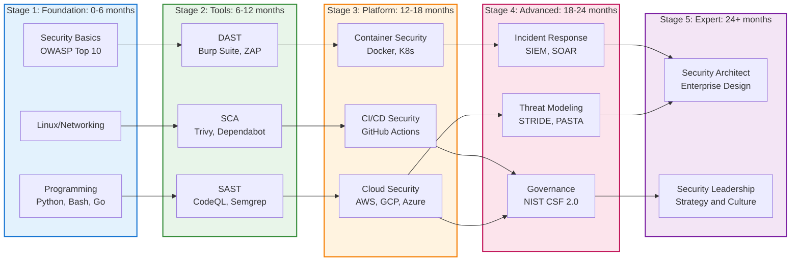
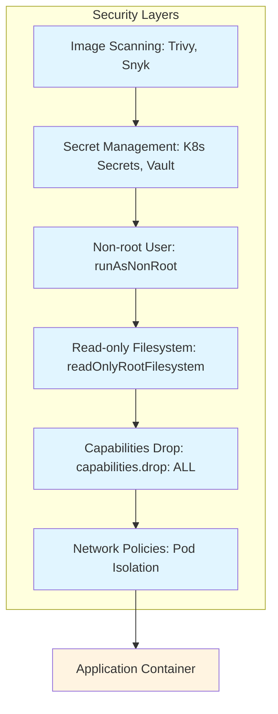
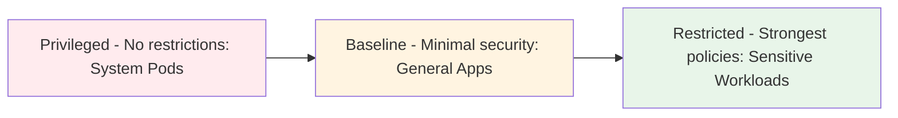

  AI 요약

  

    제목
    2026년 DevSecOps 로드맵 완벽 가이드: roadmap.sh 분석
  

  

    카테고리
    DevSecOps
  

  

    태그
    
      DevSecOps
      로드맵
      보안
      학습-경로
      roadmap.sh
      2026
    
  

  

    핵심 내용
    <ul class="summary-list">
      <li><strong>93개 학습 항목 완벽 분석</strong>: 기초 학습(프로그래밍, 보안 기초), 위협 관리(STRIDE, PASTA), 보안 아키텍처(Defense in Depth, Zero Trust), 거버넌스(NIST CSF 2.0, ISO 27001), 도구 자동화(SAST/DAST/IAST, SIEM, SOAR)</li>
      <li><strong>2024-2025 최신 트렌드 반영</strong>: OWASP Top 10:2025 (공급망 보안 강조), NIST CSF 2.0, GitHub Advanced Security 최신 기능, AI/ML 기반 보안 자동화, Secret Scanning 통계</li>
      <li><strong>단계별 학습 경로</strong>: 초급(0-6개월) 프로그래밍/보안 기초, 중급(6-12개월) 위협 모델링/컨테이너 보안, 고급(12-24개월) 엔터프라이즈 아키텍처/거버넌스, 전문가(24개월+) 전략 수립</li>
      <li><strong>실무 보안 도구 스택 (2024-2025)</strong>: SAST(CodeQL Rust 지원, Semgrep), DAST(Burp Suite, OWASP ZAP), IAST(Contrast Security), SCA(Trivy, Dependabot), 컨테이너 보안, SIEM/SOAR, SBOM(CycloneDX, Syft)</li>
      <li><strong>공급망 보안 심화</strong>: SBOM 생성/검증/표준화, 의존성 리스크 관리(함수 호출 분석), 빌드 파이프라인 강화, NIST SP 800-204D, CISA SBOM 가이드, Secret Scanning (3,900만 개 이상 탐지)</li>
      <li><strong>인시던트 대응 체계</strong>: IR 라이프사이클(준비→탐지→격리→근절→복구), 포렌식(디지털/메모리/네트워크), SOAR 자동화, EDR 솔루션, AI 기반 자동 대응</li>
    </ul>
  

  

    기술/도구
    roadmap.sh, Python/Go/JavaScript, Bash/PowerShell, STRIDE/PASTA, OWASP Top 10:2025, CodeQL (Rust 지원), SonarQube, Semgrep, Burp Suite, OWASP ZAP, Contrast Security, Trivy, Dependabot, GitHub Advanced Security, Docker, Kubernetes, SIEM, SOAR, EDR, SBOM (CycloneDX, Syft), NIST CSF 2.0, NIST SP 800-204D, ISO 27001, SOC 2, CISA SBOM 가이드
  

  

    대상 독자
    DevSecOps 엔지니어, 보안 엔지니어, 개발자, 보안 전문가 지망생
  

  이 포스팅은 AI가 쉽게 이해하고 활용할 수 있도록 구조화된 요약을 포함합니다.

## 서론

안녕하세요, Twodragon입니다. 

2026년을 맞이하며, DevSecOps 분야에서 전문가로 성장하기 위한 체계적인 학습 경로가 더욱 중요해졌습니다. [roadmap.sh](https://roadmap.sh/devsecops)는 개발자 커뮤니티에서 가장 신뢰받는 학습 로드맵 플랫폼 중 하나로, 2026년 DevSecOps 로드맵을 새롭게 업데이트했습니다.

이 포스팅에서는 roadmap.sh의 2026년 DevSecOps 로드맵을 완벽 분석하여, 총 **93개의 학습 항목**을 단계별로 정리하고 실무 중심의 학습 경로를 제시합니다. 또한 **2024-2025년 최신 트렌드와 동향**을 반영하여 다음과 같은 최신 정보를 포함합니다:

- **OWASP Top 10:2025** (2025년 11월 발표): 공급망 보안이 별도 카테고리로 추가
- **NIST Cybersecurity Framework 2.0** (2024년 2월): Govern 함수 추가
- **GitHub Advanced Security 최신 기능**: CodeQL Rust 지원, 증분 분석, Dependabot 개선
- **AI/ML 기반 보안 자동화**: ZeroFalse, AutoGuard 등 최신 연구
- **공급망 보안 강화**: NIST SP 800-204D, CISA SBOM 가이드, Secret Scanning 통계
- **최신 보안 도구**: Semgrep, Trivy, Contrast Security 등 2024-2025 도구 업데이트

기초 프로그래밍부터 고급 거버넌스까지, DevSecOps 전문가가 되기 위한 완벽한 가이드를 제공합니다.

*DevSecOps 학습 로드맵 2026*

## 📊 빠른 참조

### 로드맵 개요

| 항목 | 내용 |
|------|------|
| **총 학습 항목** | 93개 |
| **주요 섹션** | 5개 (기초 학습, 위협 관리, 보안 아키텍처, 거버넌스, 도구 자동화) |
| **학습 단계** | 초급 → 중급 → 고급 → 전문가 |
| **예상 기간** | 초급(0-6개월), 중급(6-12개월), 고급(12-24개월), 전문가(24개월+) |

### 필수 프로그래밍 언어

| 언어 | 용도 | 우선순위 |
|------|------|----------|
| **Python** | 보안 스크립팅, 자동화 | ⭐⭐⭐ 필수 |
| **Bash** | 리눅스/유닉스 자동화 | ⭐⭐⭐ 필수 |
| **Go** | 고성능 보안 도구 | ⭐⭐ 권장 |
| **JavaScript/Node.js** | 웹 애플리케이션 보안 | ⭐⭐ 권장 |
| **PowerShell** | Windows 환경 자동화 | ⭐ 선택 |

### 보안 도구 스택 (2024-2025 최신)

| 도구 유형 | 도구명 | 용도 | 2024-2025 주요 업데이트 |
|----------|--------|------|----------------------|
| **SAST** | CodeQL, SonarQube, Semgrep | 정적 코드 분석 | CodeQL: Rust 지원, 증분 분석 (20% 속도 향상) Semgrep: 실시간 보안 검사, 커스터마이징 규칙 |
| **DAST** | Burp Suite, OWASP ZAP | 동적 보안 테스트 | OWASP ZAP: AI 기반 스캔 개선 Burp Suite: 인증 스캔, RBAC 지원 강화 |
| **IAST** | Contrast Security, Synopsys Seeker | 런타임 보안 테스트 | 실시간 취약점 탐지, 코드 실행 경로 분석 |
| **SCA** | Trivy, Sonatype Nexus, Dependabot | 소프트웨어 구성 요소 분석 | Trivy: 컨테이너, IaC 템플릿 스캔 Dependabot: Rust 툴체인 자동 업데이트, 커스텀 자동 분류 규칙 |
| **취약점 스캔** | Nessus, Nmap, OpenVAS | 취약점 탐지 | AI 기반 위협 탐지 통합 |
| **네트워크 분석** | Wireshark, tcpdump | 패킷 분석 | 향상된 프로토콜 디코딩 |
| **컨테이너 보안** | Docker, Kubernetes, Trivy | 컨테이너 보안 | Kubernetes 보안 강화, 이미지 스캔 자동화 |
| **SIEM/SOAR** | Splunk, ELK, Cortex XSOAR | 보안 모니터링 및 자동화 | AI 기반 이상 탐지, 자동 대응 워크플로우 |
| **SBOM** | CycloneDX, Syft, SPDX | 소프트웨어 구성 요소 관리 | 디지털 서명, 해싱, 검증 기능 강화 |
| **Secret Scanning** | GitHub Secret Scanning, GitGuardian | 시크릿 탐지 | 2024년 GitHub에서 3,900만 개 이상의 시크릿 탐지 |

### 학습 단계별 로드맵

| 단계 | 기간 | 주요 학습 내용 | 목표 |
|------|------|--------------|------|
| **초급** | 0-6개월 | 프로그래밍 기초, 보안 개념, 기본 도구 | 보안 기초 이해 |
| **중급** | 6-12개월 | 위협 모델링, 컨테이너 보안, 취약점 관리 | 보안 도구 활용 |
| **고급** | 12-24개월 | 엔터프라이즈 아키텍처, 거버넌스, 인시던트 대응 | 보안 아키텍처 설계 |
| **전문가** | 24개월+ | 전략 수립, 리더십, 엔터프라이즈 운영 | 보안 전략가 |

### 위협 모델링 방법론

| 방법론 | 설명 | 적용 시기 |
|--------|------|----------|
| **STRIDE** | 6가지 위협 분류 (Spoofing, Tampering, Repudiation, Information Disclosure, Denial of Service, Elevation of Privilege) | 설계 단계 |
| **PASTA** | 7단계 위협 분석 프로세스, 비즈니스 영향도 기반 | 엔터프라이즈 |

### 컴플라이언스 프레임워크

| 프레임워크 | 버전 | 설명 | 주요 구성 요소 | 적용 분야 |
|-----------|------|------|--------------|----------|
| **NIST CSF** | **2.0 (2024년 2월)** | 사이버 보안 프레임워크 | **6개 함수**: Govern, Identify, Protect, Detect, Respond, Recover 22개 카테고리, 168개 하위 카테고리 | 미국 정부/기업 |
| **ISO 27001** | 2022 | 정보 보안 관리 시스템 (ISMS) | 93개 통제 항목, 위험 관리 기반 | 글로벌 기업 |
| **SOC 2** | Type I/II | 서비스 조직 통제 보고서 | 5개 신뢰 서비스 기준 (TSC) | 클라우드 서비스 |
| **NIST SSDF** | 최신 | Secure Software Development Framework | 4개 실무 관행, 19개 태스크 | 소프트웨어 개발 |
| **CISA SBOM 가이드** | 2024-2025 | Software Bill of Materials 소비 가이드 | SBOM 생성, 검증, 관리 모범 사례 | 공급망 보안 |

> **📌 NIST CSF 2.0 주요 변화**
> 
> - **Govern 함수 추가**: 거버넌스와 리더십 강조
> - **구조 간소화**: 6개 함수, 22개 카테고리로 재구성
> - **실행 가능성 향상**: 더 구체적인 하위 카테고리 제공

## 1. DevSecOps 로드맵 개요

### 1.1 로드맵 구조

roadmap.sh의 2026년 DevSecOps 로드맵은 총 **93개의 학습 항목**으로 구성되어 있으며, 다음과 같은 5개의 주요 섹션으로 나뉩니다:

1. **기초 학습 (Learn the Foundations)**: 프로그래밍, 스크립팅, 보안 기초
2. **위협 및 리스크 관리 (Managing Threats & Risks)**: 위협 모델링, 취약점 관리
3. **보안 아키텍처 (Secure Architecture)**: Defense in Depth, Zero Trust, API 보안
4. **거버넌스 (Governance)**: 컴플라이언스, 감사, 리스크 정량화
5. **도구 및 자동화 (DevSecOps Tools)**: 보안 도구, 취약점 스캔, 자동화

### 1.2 학습 단계별 분류

로드맵은 학습 난이도와 우선순위에 따라 다음과 같이 분류됩니다:

- **초급 (Beginner)**: 프로그래밍 기초, 보안 개념 이해
- **중급 (Intermediate)**: 보안 도구 활용, 위협 모델링
- **고급 (Advanced)**: 엔터프라이즈 보안, 거버넌스, 자동화

*그림 1: DevSecOps 로드맵 전체 구조*

## 2. 기초 학습 (Learn the Foundations)

### 2.1 프로그래밍 언어 및 스크립팅

DevSecOps 엔지니어는 다양한 프로그래밍 언어와 스크립팅 지식이 필요합니다.

#### 필수 프로그래밍 언어

- **Python**: 보안 스크립팅, 자동화, 보안 도구 개발
- **Go**: 고성능 보안 도구, 클라우드 네이티브 보안
- **JavaScript/Node.js**: 웹 애플리케이션 보안, Node.js 보안
- **Rust**: 메모리 안전성, 시스템 프로그래밍 보안
- **Ruby**: 보안 스크립팅, 레거시 시스템 지원

#### 필수 스크립팅 언어

- **Bash**: 리눅스/유닉스 환경 자동화, 보안 스크립트
- **PowerShell**: Windows 환경 보안 자동화, Active Directory 보안

#### 에디터

- **Vim / Nano / Emacs**: 서버 환경에서의 빠른 편집 및 스크립팅

> **💡 실무 팁**
> 
> Python과 Bash는 DevSecOps 엔지니어에게 가장 필수적인 언어입니다. 대부분의 보안 도구와 자동화 스크립트가 이 두 언어로 작성됩니다.

### 2.2 보안 기초 개념

#### CIA Triad

- **Confidentiality (기밀성)**: 정보의 비공개성 보장
- **Integrity (무결성)**: 정보의 정확성 및 신뢰성 보장
- **Availability (가용성)**: 정보 및 시스템의 접근 가능성 보장

#### 인증 및 인가 (Authentication & Authorization)

- **Authentication**: 사용자 신원 확인
- **Authorization**: 접근 권한 부여
- **IAM (Identity and Access Management)**: 통합 인증 및 접근 관리
- **Role Based Access Control (RBAC)**: 역할 기반 접근 제어
- **Least Privilege**: 최소 권한 원칙

#### 암호화 (Encryption)

- **Symmetric Encryption**: 대칭 암호화 (AES, DES)
- **Asymmetric Encryption**: 비대칭 암호화 (RSA, ECC)
- **Cryptographic Hashing**: 암호화 해싱 (SHA-256, bcrypt)
- **Key Management Service**: 키 관리 서비스

### 2.3 네트워크 보안 기초

#### 네트워크 기본 개념

- **HTTP/HTTPS**: 웹 프로토콜 보안
- **TLS (Transport Layer Security)**: 전송 계층 보안
- **DNS**: 도메인 이름 시스템 보안
- **Firewalls**: 방화벽 기본 개념
- **ACLs (Access Control Lists)**: 접근 제어 목록
- **VLANs**: 가상 LAN 보안
- **Network Segmentation**: 네트워크 분할

### 2.4 애플리케이션 보안 기초

#### OWASP Top 10:2025

2025년 11월에 발표된 OWASP Top 10:2025는 이전 버전과 비교하여 중요한 변화를 포함합니다:

| 순위 | 위험 항목 | 설명 | 주요 변화 |
|------|----------|------|----------|
| **A01:2025** | Broken Access Control | 인증되지 않은 접근, 권한 우회 | **SSRF 통합**: Server-Side Request Forgery가 이 카테고리로 통합됨 |
| **A02:2025** | Cryptographic Failures | 암호화 실패, 민감 데이터 노출 | 이전 A02와 동일 |
| **A03:2025** | Software Supply Chain Failures | **신규**: 의존성, 빌드 시스템, 배포 인프라 취약점 | **확장**: 단순히 오래된 컴포넌트가 아닌 전체 공급망 위험 포함 |
| **A04:2025** | Injection | SQL, NoSQL, Command Injection | 이전 A03과 동일 |
| **A05:2025** | Insecure Design | 보안 설계 결함 | 이전 A04와 동일 |
| **A06:2025** | Security Misconfiguration | 보안 설정 오류 | 이전 A05와 동일 |
| **A07:2025** | Vulnerable and Outdated Components | 취약한 오래된 컴포넌트 | 이전 A06과 유사하나 A03과 구분 |
| **A08:2025** | Authentication and Session Management Failures | 인증 및 세션 관리 실패 | 이전 A07과 동일 |
| **A09:2025** | Software and Data Integrity Failures | 소프트웨어 및 데이터 무결성 실패 | 이전 A08과 동일 |
| **A10:2025** | Mishandling of Exceptional Conditions | **신규**: 예외 조건 처리 오류 | **신규**: 부적절한 오류 처리로 인한 정보 노출 및 DoS 공격 |

> **💡 주요 변화 요약**
> 
> - **A03:2025 Software Supply Chain Failures**: 공급망 보안이 별도 카테고리로 강조됨
> - **A10:2025 Mishandling of Exceptional Conditions**: 예외 처리 실패가 새로운 위험으로 추가됨
> - **SSRF 통합**: A01에 통합되어 접근 제어 문제로 재분류됨

#### 주요 공격 방어

- **SQL Injection Prevention**: SQL 인젝션 방어
- **XSS Prevention**: 크로스 사이트 스크립팅 방어
- **Input Validation Patterns**: 입력 검증 패턴

*그림 2: DevSecOps 학습 경로 단계별 흐름도*

## 3. 위협 및 리스크 관리 (Managing Threats & Risks)

### 3.1 위협 모델링 (Threat Modeling)

위협 모델링은 시스템의 보안 위협을 사전에 식별하고 대응하는 핵심 프로세스입니다.

#### 위협 모델링 방법론

- **STRIDE**: 
  - **S**poofing (스푸핑)
  - **T**ampering (변조)
  - **R**epudiation (부인)
  - **I**nformation Disclosure (정보 유출)
  - **D**enial of Service (서비스 거부)
  - **E**levation of Privilege (권한 상승)

- **PASTA** (Process for Attack Simulation and Threat Analysis):
  - 7단계 위협 분석 프로세스
  - 비즈니스 영향도 기반 위협 평가

#### 위협 모델링 워크플로우

1. 시스템 아키텍처 분석
2. 데이터 흐름 다이어그램 작성
3. 위협 식별 및 분류
4. 위협 우선순위 결정
5. 대응 방안 수립
6. 검증 및 모니터링

### 3.2 취약점 관리

#### 취약점 스캔 도구

- **Nessus**: 종합 취약점 스캐너
- **Nmap**: 네트워크 탐지 및 보안 스캔
- **OpenVAS**: 오픈소스 취약점 스캐너
- **Qualys**: 클라우드 기반 취약점 관리

#### 취약점 관리 프로세스

1. **자동 스캔**: 정기적인 취약점 스캔
2. **수동 검증**: 자동 스캔 결과 검증
3. **위험도 평가**: CVSS 점수 기반 평가
4. **패치 관리**: 우선순위 기반 패치 적용
5. **재검증**: 패치 후 재스캔

### 3.3 공급망 보안 (Supply Chain Security)

공급망 보안은 2024-2025년 DevSecOps의 최우선 과제로 부상했습니다. OWASP Top 10:2025에서 **A03:2025 Software Supply Chain Failures**가 별도 카테고리로 추가되었으며, NIST와 CISA에서도 관련 가이드라인을 발표했습니다.

#### SBOM (Software Bill of Materials) - 2024-2025 모범 사례

| SBOM 구성 요소 | 설명 | 2024-2025 주요 개선사항 |
|--------------|------|----------------------|
| **정확한 생성** | Lock 파일 및 패키지 매니저 활용 | 표준화된 형식 (CycloneDX, SPDX) 강제 |
| **표준화** | 프로젝트 전반의 통일된 SBOM 형식 | 파이프라인 정책을 통한 표준 강제 |
| **검증** | 디지털 서명, 해싱, 증명서 | SBOM 무결성 및 진위성 검증 강화 |
| **지속적 모니터링** | CVE 피드 및 SBOM 실시간 모니터링 | 공개 CVE 피드와 연동한 자동 알림 |

#### 의존성 리스크 관리 (Dependency Risk Management)

| 관리 영역 | 전략 | 도구 및 방법 |
|----------|------|------------|
| **자동 스캔** | CI/CD 파이프라인 통합 | Dependabot, Snyk, Trivy |
| **함수 호출 분석** | 도달 가능한 코드의 취약점에 집중 | False Positive 감소, 실제 공격 가능성 평가 |
| **의존성 업데이트** | 자동 패치 및 알림 | Rust 툴체인 자동 업데이트 (Dependabot) |
| **의존성 검증** | 신뢰할 수 있는 소스 확인 | 서명 검증, 출처 확인 |

#### 빌드 파이프라인 강화 (Build Pipeline Hardening)

| 강화 영역 | 보안 조치 | NIST SSDF 연계 |
|----------|----------|--------------|
| **소스 코드 검증** | 코드 서명 및 검증 | PO.3: Protect all forms of code |
| **빌드 환경 격리** | 안전한 빌드 환경 구축 | PO.4: Secure build environment |
| **아티팩트 검증** | 빌드 산출물 무결성 검증 | PO.5: Archive and protect each release |
| **Zero-Trust 원칙** | 제3자 시스템에 대한 신뢰 검증 | ID 확인, 디바이스 상태 평가, 행동 기반 접근 제어 |

> **📌 NIST SP 800-204D (2024년 2월)**
> 
> "Strategies for the Integration of Software Supply Chain Security in DevSecOps CI/CD Pipelines" 문서에서 공급망 보안을 CI/CD 파이프라인에 통합하는 구체적인 방법을 제시합니다.

## 4. 보안 아키텍처 (Secure Architecture)

### 4.1 Defense in Depth (다층 방어)

Defense in Depth는 여러 보안 레이어를 중첩하여 보안을 강화하는 전략입니다.

#### 보안 레이어 구성

1. **네트워크 레이어**: 방화벽, 네트워크 분할
2. **애플리케이션 레이어**: WAF, 입력 검증
3. **데이터 레이어**: 암호화, 접근 제어
4. **모니터링 레이어**: 로그 분석, 이상 탐지

### 4.2 Zero Trust 아키텍처

Zero Trust는 "신뢰하되 검증하라(Trust but Verify)" 원칙을 기반으로 합니다.

#### Zero Trust 핵심 원칙

- **Never Trust, Always Verify**: 항상 검증
- **Least Privilege Access**: 최소 권한 접근
- **Assume Breach**: 침해 가정
- **Micro-segmentation**: 마이크로 세그멘테이션

#### Zero Trust 구현 요소

- **Identity Verification**: 강력한 인증
- **Device Trust**: 디바이스 신뢰성 검증
- **Network Segmentation**: 네트워크 분할
- **Application Security**: 애플리케이션 보안
- **Data Protection**: 데이터 보호

### 4.3 보안 API 설계 (Secure API Design)

#### API 보안 모범 사례

- **인증 및 인가**: OAuth 2.0, JWT
- **Rate Limiting**: API 남용 방지
- **입력 검증**: 모든 입력 데이터 검증
- **출력 인코딩**: 응답 데이터 인코딩
- **로깅 및 모니터링**: API 활동 추적

### 4.4 클라우드 보안 (Cloud Security)

#### 클라우드 보안 서비스

- **CSPM (Cloud Security Posture Management)**: 클라우드 보안 상태 관리
- **Key Management Service**: 키 관리 서비스
- **IAM**: 클라우드 IAM 설정 및 관리

#### 클라우드 보안 모범 사례

- **멀티 리전 보안 계획**: 재해 복구 및 가용성
- **대규모 아이덴티티 전략**: 엔터프라이즈 아이덴티티 관리
- **인증서 라이프사이클 관리**: SSL/TLS 인증서 자동 갱신
- **PKI 설계 및 장애 조치**: 공개키 인프라 설계

### 4.5 컨테이너 보안 (Container Security)

컨테이너 보안은 여러 레이어로 구성된 Defense in Depth 전략을 통해 강화됩니다:

#### 컨테이너 보안 요소

- **Docker**: 컨테이너 기본 보안
- **Kubernetes**: 쿠버네티스 보안 모범 사례
- **Image Scanning**: 컨테이너 이미지 취약점 스캔
- **네트워크 보안 구역화**: 컨테이너 네트워크 분할

#### 컨테이너 보안 체크리스트

- [ ] 베이스 이미지 취약점 스캔
- [ ] 최소 권한 원칙 적용
- [ ] 시크릿 관리 (Secrets Management)
- [ ] 네트워크 정책 설정
- [ ] 런타임 보안 모니터링

*그림 3: DevSecOps 보안 도구 및 기술 스택 비교*

## 5. 모니터링 및 인시던트 대응

### 5.1 로그 분석 및 모니터링

#### 로그 분석 (Log Analysis)

- **중앙 집중식 로깅**: 모든 로그 수집 및 저장
- **로그 정규화**: 표준화된 로그 형식
- **로그 보존 정책**: 규정 준수를 위한 보존 기간 설정

#### 알림 유형 (Alert Types)

- **Critical**: 즉시 대응 필요
- **High**: 우선순위 높음
- **Medium**: 일반적인 모니터링
- **Low**: 정보성 알림

### 5.2 SIEM (Security Information and Event Management)

SIEM은 보안 이벤트를 수집, 분석, 상관관계 분석하는 시스템입니다.

#### SIEM 주요 기능

- **이벤트 수집**: 다양한 소스에서 로그 수집
- **상관관계 분석**: 여러 이벤트 간 패턴 분석
- **위협 탐지**: 이상 행위 및 공격 탐지
- **인시던트 대응**: 자동화된 대응 워크플로우

### 5.3 인시던트 대응 (Incident Response)

#### IR 라이프사이클 (IR Lifecycle)

1. **준비 (Preparation)**: 대응 계획 수립, 팀 구성
2. **탐지 및 분석 (Detection & Analysis)**: 인시던트 식별 및 분석
3. **격리 (Containment)**: 위협 확산 방지
4. **근절 (Eradication)**: 위협 제거
5. **복구 (Recovery)**: 시스템 정상화
6. **사후 활동 (Post-Incident Activity)**: 교훈 학습 및 개선

#### 포렌식 (Forensics)

- **디지털 포렌식**: 증거 수집 및 분석
- **메모리 포렌식**: 메모리 덤프 분석
- **네트워크 포렌식**: 네트워크 트래픽 분석
- **디스크 포렌식**: 디스크 이미징 및 분석

#### 근본 원인 분석 (Root Cause Analysis)

- **5 Whys**: 반복적인 질문을 통한 원인 파악
- **Fishbone Diagram**: 원인 분석 다이어그램
- **Timeline Analysis**: 시간 순서 분석

### 5.4 SOAR (Security Orchestration, Automation and Response)

#### SOAR 개념

- **Orchestration**: 여러 보안 도구 통합
- **Automation**: 반복 작업 자동화
- **Response**: 인시던트 대응 자동화

#### SOAR 자동화 예시

- **자동 패치 (Automated Patching)**: 취약점 자동 패치
- **자동 격리**: 악성 활동 자동 격리
- **자동 알림**: 인시던트 자동 알림

### 5.5 엔드포인트 탐지 및 대응 (Endpoint Detection and Response)

- **EDR 솔루션**: 엔드포인트 보안 모니터링
- **행위 기반 탐지**: 이상 행위 탐지
- **자동 대응**: 위협 자동 차단

## 6. 거버넌스 및 컴플라이언스 (Governance)

### 6.1 사이버 보안 프레임워크 (2024-2025 최신)

#### 주요 프레임워크

**NIST Cybersecurity Framework 2.0 (2024년 2월 발표)**

| 함수 | 설명 | 주요 변화 |
|------|------|----------|
| **Govern** | **신규**: 거버넌스 및 리더십 | 조직의 사이버 보안 전략, 정책, 문화 강조 |
| **Identify** | 식별 | 자산, 비즈니스 환경, 위험 관리 |
| **Protect** | 보호 | 보안 제어, 데이터 보안, 접근 제어 |
| **Detect** | 탐지 | 이상 탐지, 보안 모니터링 |
| **Respond** | 대응 | 인시던트 대응, 커뮤니케이션 |
| **Recover** | 복구 | 복구 계획, 개선 |

**구조**: 6개 함수, 22개 카테고리, 168개 하위 카테고리

**기타 주요 프레임워크**

- **ISO 27001 (2022)**: 정보 보안 관리 시스템 (ISMS), 93개 통제 항목
- **SOC 2 Type I/II**: 서비스 조직 통제 보고서, 5개 신뢰 서비스 기준 (TSC)
- **NIST SSDF**: Secure Software Development Framework, 4개 실무 관행, 19개 태스크
- **CISA SBOM 가이드**: SBOM 소비 모범 사례 (2024-2025)

### 6.2 감사 및 컴플라이언스 매핑 (Audit & Compliance Mapping)

#### 감사 프로세스

1. **준비**: 감사 계획 수립
2. **실행**: 감사 수행
3. **보고**: 감사 결과 보고
4. **개선**: 발견된 문제점 개선

#### 컴플라이언스 매핑

- **규정 요구사항 분석**: 적용 가능한 규정 식별
- **컨트롤 매핑**: 보안 컨트롤과 규정 요구사항 매핑
- **갭 분석**: 현재 상태와 요구사항 간 차이 분석
- **개선 계획**: 갭 해소를 위한 계획 수립

### 6.3 리스크 정량화 (Risk Quantification)

#### 리스크 평가 방법

- **정성적 평가**: High/Medium/Low 분류
- **정량적 평가**: 재무적 영향도 계산
- **FAIR (Factor Analysis of Information Risk)**: 정보 리스크 요인 분석

#### 리스크 관리

- **리스크 등록부**: 리스크 목록 관리
- **리스크 우선순위**: 영향도 및 가능성 기반 우선순위
- **리스크 완화**: 리스크 감소 전략 수립

### 6.4 엔터프라이즈 운영 (Enterprise Operations)

#### 대규모 보안 운영

- **멀티 리전 보안 계획**: 글로벌 보안 전략
- **대규모 아이덴티티 전략**: 엔터프라이즈 아이덴티티 관리
- **인증서 라이프사이클 관리**: 자동화된 인증서 관리
- **PKI 설계 및 장애 조치**: 고가용성 PKI 인프라

## 7. 보안 도구 및 자동화 (DevSecOps Tools)

### 7.1 보안 테스트 도구 (2024-2025 최신)

#### 정적 분석 도구 (SAST)

| 도구 | 주요 기능 | 2024-2025 업데이트 | GitHub 링크 |
|------|----------|------------------|------------|
| **CodeQL** | 다중 언어 코드 분석, 쿼리 기반 탐지 | Rust 지원 (2025), 증분 분석 (20% 속도 향상), Kotlin 2.2.2x 지원 | [GitHub CodeQL](https://github.com/github/codeql) |
| **SonarQube** | 코드 품질 및 보안 분석, 30+ 언어 지원 | AI 기반 코드 리뷰, 보안 핫스팟 강화 | [SonarQube](https://www.sonarqube.org/) |
| **Semgrep** | 경량 다중 언어 정적 분석, 커스터마이징 규칙 | 실시간 보안 검사, 개발자 친화적 인터페이스 | [Semgrep](https://semgrep.dev/) |

#### 동적 분석 도구 (DAST)

| 도구 | 주요 기능 | 2024-2025 업데이트 | GitHub 링크 |
|------|----------|------------------|------------|
| **Burp Suite** | 웹 애플리케이션 보안 테스트, 수동/자동 스캔 | 인증 스캔 강화, RBAC 지원, 상세 보고서 | [Burp Suite](https://portswigger.net/burp) |
| **OWASP ZAP** | 오픈소스 웹 보안 스캐너, 프록시 기능 | AI 기반 스캔 개선, 패시브/액티브 스캔 | [OWASP ZAP](https://www.zaproxy.org/) |

#### 인터랙티브 분석 도구 (IAST)

| 도구 | 주요 기능 | 2024-2025 특징 |
|------|----------|--------------|
| **Contrast Security** | 런타임 취약점 탐지, 코드 실행 경로 분석 | 실시간 보안 모니터링, 자동화된 보호 |
| **Synopsys Seeker** | SAST/DAST 결합, 에이전트 기반 분석 | 자동화/수동 테스트 중 애플리케이션 동작 분석 |

#### 네트워크 분석 도구

- **Wireshark**: 네트워크 패킷 분석
- **Nmap**: 네트워크 탐지 및 보안 스캔
- **tcpdump**: 명령줄 패킷 캡처

### 7.2 GitHub Advanced Security (2024-2025 최신 기능)

GitHub Advanced Security는 2024-2025년 동안 상당한 개선을 이루었습니다.

#### CodeQL 최신 기능 (2024-2025)

| 기능 | 설명 | 출시 시기 |
|------|------|----------|
| **Rust 지원** | Rust 코드베이스 스캔 지원 | 2025년 후반 |
| **증분 분석** | PR 스캔 속도 20% 향상, 변경된 코드만 분석 | 2025년 중반 |
| **Kotlin 2.2.2x 지원** | Kotlin 최신 버전 지원 강화 | 2024년 9월 |
| **React 지원 강화** | React 애플리케이션 보안 분석 개선 | 2024년 9월 |
| **자동 CodeQL 설치** | Self-hosted 에이전트 자동 설치 | 2024년 |

#### Dependabot 최신 기능 (2024-2025)

| 기능 | 설명 | 출시 시기 |
|------|------|----------|
| **서브디렉토리 제외** | Monorepo에서 특정 서브디렉토리 제외 | 2024년 9월 |
| **Rust 툴체인 자동 업데이트** | `rust-toolchain.toml` 자동 업데이트 | 2024년 9월 |
| **커스텀 자동 분류 규칙** | 조직 소유자/보안 관리자가 규칙 생성 | 2025년 |
| **고급 필터** | 리포지토리별 보안 기능 상태 필터링 | 2024년 9월 |

#### Secret Scanning 통계 및 개선

- **2024년 탐지**: GitHub에서 3,900만 개 이상의 시크릿 탐지
- **해킹 침해의 40%**: 도난당한 자격 증명이 원인
- **API 개선**: Secret Asset Metadata API를 통한 풍부한 컨텍스트 제공 (2025년)

> **💡 GitHub Advanced Security 활용 팁**
> 
> - CodeQL 증분 분석을 활용하여 PR 리뷰 시간 단축
> - Dependabot 커스텀 규칙으로 조직 정책에 맞는 자동 분류 설정
> - Secret Scanning을 CI/CD 파이프라인에 통합하여 실시간 탐지

### 7.3 DDoS 완화 전략 (DDoS Mitigation Strategy)

#### DDoS 공격 유형

- **Volumetric Attacks**: 대역폭 소진 공격
- **Protocol Attacks**: 프로토콜 레벨 공격
- **Application Layer Attacks**: 애플리케이션 레벨 공격

#### DDoS 완화 방법

- **Rate Limiting**: 트래픽 제한
- **CDN 활용**: 분산 네트워크를 통한 공격 분산
- **WAF**: 웹 애플리케이션 방화벽
- **DDoS 보호 서비스**: 클라우드 기반 DDoS 보호

### 7.4 IDS (Intrusion Detection System)

#### IDS 유형

- **Network-based IDS (NIDS)**: 네트워크 트래픽 모니터링
- **Host-based IDS (HIDS)**: 호스트 레벨 모니터링
- **Signature-based**: 알려진 공격 패턴 탐지
- **Anomaly-based**: 이상 행위 탐지

#### IPS (Intrusion Prevention System)

- **자동 차단**: 공격 자동 차단
- **실시간 보호**: 실시간 위협 대응

## 8. 실무 학습 경로 제안

### 8.1 초급 단계 (0-6개월)

**목표**: 보안 기초 개념 이해 및 기본 도구 활용

1. **프로그래밍 기초**
   - Python 또는 Go 언어 학습
   - Bash 스크립팅 기초

2. **보안 기초 개념**
   - CIA Triad 이해
   - 인증 및 인가 기본 개념
   - OWASP Top 10 학습

3. **네트워크 보안 기초**
   - HTTP/HTTPS, TLS 이해
   - 방화벽 기본 개념
   - 네트워크 분할 이해

4. **기본 보안 도구**
   - Nmap 기초 사용법
   - Wireshark 기초 사용법
   - Burp Suite 기초 사용법

### 8.2 중급 단계 (6-12개월)

**목표**: 위협 모델링 및 보안 아키텍처 설계

1. **위협 모델링**
   - STRIDE 방법론 학습
   - PASTA 프로세스 이해
   - 위협 모델링 도구 활용

2. **애플리케이션 보안**
   - SQL Injection, XSS 방어
   - 입력 검증 패턴
   - 보안 코딩 모범 사례

3. **컨테이너 보안**
   - Docker 보안 모범 사례
   - Kubernetes 보안 설정
   - 컨테이너 이미지 스캔

4. **취약점 관리**
   - 취약점 스캔 도구 활용
   - 취약점 평가 및 우선순위 결정
   - 패치 관리 프로세스

### 8.3 고급 단계 (12-24개월)

**목표**: 엔터프라이즈 보안 아키텍처 및 거버넌스

1. **보안 아키텍처**
   - Defense in Depth 설계
   - Zero Trust 아키텍처 구현
   - 보안 API 설계

2. **클라우드 보안**
   - CSPM 도구 활용
   - 클라우드 IAM 설계
   - 멀티 리전 보안 계획

3. **인시던트 대응**
   - IR 라이프사이클 이해
   - 포렌식 기초
   - SOAR 자동화

4. **거버넌스**
   - NIST, ISO 27001 프레임워크 이해
   - 컴플라이언스 매핑
   - 리스크 정량화

### 8.4 전문가 단계 (24개월 이상)

**목표**: 엔터프라이즈 보안 전략 수립 및 리더십

1. **엔터프라이즈 보안 운영**
   - 대규모 보안 전략 수립
   - 보안 조직 구축
   - 보안 문화 조성

2. **공급망 보안**
   - SBOM 관리
   - 의존성 리스크 관리
   - 빌드 파이프라인 강화

3. **고급 위협 대응**
   - APT (Advanced Persistent Threat) 대응
   - 사고 대응 고도화
   - 위협 인텔리전스

## 9. 2024-2026년 DevSecOps 트렌드 및 최신 동향

### 9.1 AI/ML 기반 보안 자동화

2024-2025년 AI/ML이 DevSecOps에 본격적으로 통합되기 시작했습니다.

| AI/ML 활용 영역 | 기술 및 도구 | 주요 특징 |
|---------------|------------|----------|
| **위협 탐지** | ML 기반 이상 탐지, 패턴 인식 | Git 커밋 패턴, 빌드 출력, SBOM 통계적 이상 탐지 |
| **자동 대응** | AI 기반 인시던트 자동 대응 | AutoGuard: 강화 학습 기반 자가 치유 보안 프레임워크 |
| **보안 분석** | LLM 기반 로그 분석, 코드 리뷰 | ZeroFalse: SAST와 LLM 통합으로 False Positive 감소 |
| **자동 수정** | 취약점 자동 수정, 정책 템플릿 생성 | AI 기반 자동 패치, 보안 설정 자동화 |

> **💡 주요 AI 보안 프로젝트**
> 
> - **DevSecOps MCP Server**: SAST, DAST, IAST, SCA 통합 AI 서버
> - **Awesome AI4DevSecOps**: AI 기반 DevSecOps 솔루션 연구 및 도구 모음
> - **OWASP GenAI Security Project**: AI 보안 가이드 및 도구 (2025년 8월 웹사이트 런칭)

### 9.2 공급망 보안 강화 (2024-2025 핵심 트렌드)

공급망 보안은 2024-2025년 가장 중요한 보안 우선순위로 부상했습니다.

| 보안 영역 | 2024-2025 주요 변화 | 규제 및 표준 |
|----------|------------------|------------|
| **SBOM 의무화** | EU Cyber Resilience Act, NIS2/DORA | CISA SBOM 가이드 (2024-2025) |
| **의존성 보안** | 오픈소스 의존성 보안 강화, 자동 스캔 | NIST SP 800-204D (2024년 2월) |
| **빌드 보안** | CI/CD 파이프라인 보안 강화, 서명 검증 | NIST SSDF, SLSA (Supply-chain Levels for Software Artifacts) |
| **Secret 관리** | GitHub에서 3,900만 개 이상 시크릿 탐지 (2024) | Secret Scanning 자동화, 자격 증명 도난 방지 |

#### Secret Scanning 통계 (2024)

- **탐지된 시크릿**: 3,900만 개 이상 (GitHub 리포지토리)
- **해킹 침해의 40%**: 도난당한 자격 증명이 원인
- **대응 전략**: 자동 Secret Scanning, CI/CD 통합, 실시간 알림

### 9.3 Zero Trust 확산

| Zero Trust 영역 | 구현 요소 | 2024-2025 특징 |
|---------------|----------|--------------|
| **네트워크** | 마이크로 세그멘테이션, 네트워크 분할 | SD-WAN, SASE 통합 |
| **애플리케이션** | 강력한 인증, 최소 권한 접근 | OAuth 2.0, JWT 강화 |
| **데이터** | 데이터 암호화, 접근 제어 | 데이터 분류 및 레이블링 자동화 |
| **제3자 시스템** | ID 확인, 디바이스 상태 평가, 행동 기반 접근 제어 | 공급망에 Zero Trust 확장 |

### 9.4 클라우드 네이티브 보안

| 보안 영역 | 2024-2025 주요 발전 | 도구 및 프레임워크 |
|----------|------------------|-----------------|
| **컨테이너 보안** | Kubernetes 보안 강화, 이미지 스캔 자동화 | Trivy, Falco, Kubernetes Pod Security Standards |

Pod Security Standards는 세 가지 보안 레벨을 제공합니다:

| **서버리스 보안** | 서버리스 아키텍처 보안, 함수 레벨 보안 | AWS Lambda Layers, Azure Functions 보안 |
| **멀티 클라우드 보안** | 여러 클라우드 환경 통합 보안, CSPM | AWS Security Hub, Azure Security Center, GCP Security Command Center |
| **IaC 보안** | Infrastructure as Code 보안 스캔 | Checkov, tfsec, Terrascan |

### 9.5 통합 DevSecOps 플랫폼

| 플랫폼 유형 | 주요 솔루션 | 특징 |
|-----------|----------|------|
| **통합 도구체인** | Jit Security, GitLab Ultimate | 단일 인터페이스에서 여러 보안 도구 관리, 빠른 배포 |
| **GitHub Advanced Security** | CodeQL, Dependabot, Secret Scanning | 증분 분석, Rust 지원, 커스텀 자동 분류 규칙 |
| **클라우드 네이티브 보안** | AWS Security Hub, Azure Security Center | 클라우드 환경 통합 보안 모니터링 |

### 9.6 규제 및 컴플라이언스 강화

| 규제/표준 | 발표 시기 | 주요 내용 |
|----------|---------|----------|
| **EU Cyber Resilience Act** | 2024-2025 | 소프트웨어 제품의 사이버 보안 요구사항 |
| **NIS2/DORA** | 2024-2025 | 네트워크 및 정보 시스템 보안, 금융 서비스 디지털 운영 복원력 |
| **NIST CSF 2.0** | 2024년 2월 | Govern 함수 추가, 구조 간소화 |
| **NIST SP 800-204D** | 2024년 2월 | DevSecOps CI/CD 파이프라인에 공급망 보안 통합 전략 |
| **CISA SBOM 가이드** | 2024-2025 | SBOM 소비 모범 사례, 공급업체 위험 평가 도구 |

## 결론

roadmap.sh의 2026년 DevSecOps 로드맵은 총 93개의 학습 항목으로 구성되어 있으며, 기초부터 고급까지 체계적인 학습 경로를 제시합니다.

### 핵심 요약

1. **기초 학습**: 프로그래밍, 보안 개념, 네트워크 보안 기초가 필수입니다.

2. **위협 관리**: 위협 모델링, 취약점 관리, **공급망 보안이 2024-2025년 최우선 과제**입니다.

3. **보안 아키텍처**: Defense in Depth, Zero Trust, 보안 API 설계가 실무에서 중요합니다.

4. **모니터링 및 대응**: SIEM, 인시던트 대응, SOAR 자동화, **AI 기반 자동 대응**이 필수입니다.

5. **거버넌스**: **NIST CSF 2.0**, ISO 27001, 컴플라이언스, 리스크 관리, 엔터프라이즈 운영이 전문가로 성장하는 데 필요합니다.

6. **2024-2025 최신 동향**: OWASP Top 10:2025 (공급망 보안 강조), GitHub Advanced Security 최신 기능, AI/ML 기반 보안 자동화, Secret Scanning 강화

### 학습 권장사항

- **단계별 학습**: 기초부터 차근차근 학습하세요.
- **실무 적용**: 학습한 내용을 실제 프로젝트에 적용해보세요.
- **커뮤니티 참여**: DevSecOps 커뮤니티에 참여하여 지식을 공유하세요.
- **지속적 학습**: 보안 분야는 빠르게 변화하므로 지속적인 학습이 필요합니다.

### 다음 단계

이 로드맵을 기반으로 자신만의 학습 계획을 수립하고, 단계별로 목표를 설정하여 DevSecOps 전문가로 성장해 나가시기 바랍니다.

추가적인 질문이나 도움이 필요하시면 언제든지 댓글로 남겨주세요. 함께 성장하는 DevSecOps 커뮤니티를 만들어 나갑시다!

---

**참고 자료**:

### 공식 문서 및 가이드

- [roadmap.sh DevSecOps Roadmap](https://roadmap.sh/devsecops) - 2026년 최신 DevSecOps 로드맵
- [OWASP Top 10:2025](https://owasp.org/Top10/2025/) - 2025년 11월 발표된 최신 OWASP Top 10
- [OWASP DevSecOps Guideline (DSOGL)](https://devsecops.owasp.org/) - DevSecOps 모범 사례 가이드
- [OWASP DevSecOps Maturity Model (DSOMM)](https://devsecops.owasp.org/) - DevSecOps 성숙도 모델
- [NIST Cybersecurity Framework 2.0](https://www.nist.gov/cyberframework) - 2024년 2월 발표된 CSF 2.0
- [NIST SP 800-204D](https://www.nist.gov/publications/strategies-integration-software-supply-chain-security-devsecops-cicd-pipelines) - DevSecOps CI/CD 파이프라인 공급망 보안 통합 전략 (2024년 2월)
- [NIST SP 1800-44](https://www.nccoe.nist.gov/news-insights/new-software-supply-chain-and-devops-security-practices-publication-released-and) - Secure Software Development, Security, and Operations (DevSecOps) Practices (2025년 8월 초안)
- [CISA SBOM 소비 가이드](https://www.cisa.gov/news-events/alerts/2023/11/09/cisa-nsa-and-partners-release-new-guidance-securing-software-supply-chain) - SBOM 모범 사례 (2023년 11월)
- [CISA 소프트웨어 획득 가이드](https://www.cisa.gov/news-events/news/cisa-releases-software-acquisition-guide-government-enterprise-consumers-software-assurance-cyber) - 정부 기업 소비자용 소프트웨어 획득 가이드 (2024년 8월)

### GitHub 및 도구

- [GitHub Advanced Security](https://docs.github.com/en/enterprise-cloud@latest/admin/advanced-security) - CodeQL, Dependabot, Secret Scanning
- [CodeQL GitHub](https://github.com/github/codeql) - GitHub의 정적 코드 분석 도구
- [OWASP ZAP](https://www.zaproxy.org/) - 오픈소스 웹 보안 스캐너
- [Semgrep](https://semgrep.dev/) - 경량 다중 언어 정적 분석 도구
- [Trivy](https://github.com/aquasecurity/trivy) - 컨테이너, Git 리포지토리, IaC 취약점 스캐너
- [DevSecOps MCP Server](https://github.com/jmstar85/DevSecOps-MCP) - AI 기반 DevSecOps 도구 통합 서버
- [Awesome AI4DevSecOps](https://github.com/awsm-research/Awesome-AI4DevSecOps) - AI 기반 DevSecOps 솔루션 연구 및 도구 모음

### 연구 및 트렌드

- [ZeroFalse: SAST와 LLM 통합으로 False Positive 감소](https://arxiv.org/abs/2510.02534) - 2024년 연구 논문
- [AutoGuard: 강화 학습 기반 자가 치유 보안 프레임워크](https://arxiv.org/abs/2512.04368) - 2024년 연구 논문
- [공급망 보안 연구: SBOM 생성 및 검증](https://arxiv.org/abs/2511.20313) - 2024년 연구 논문
