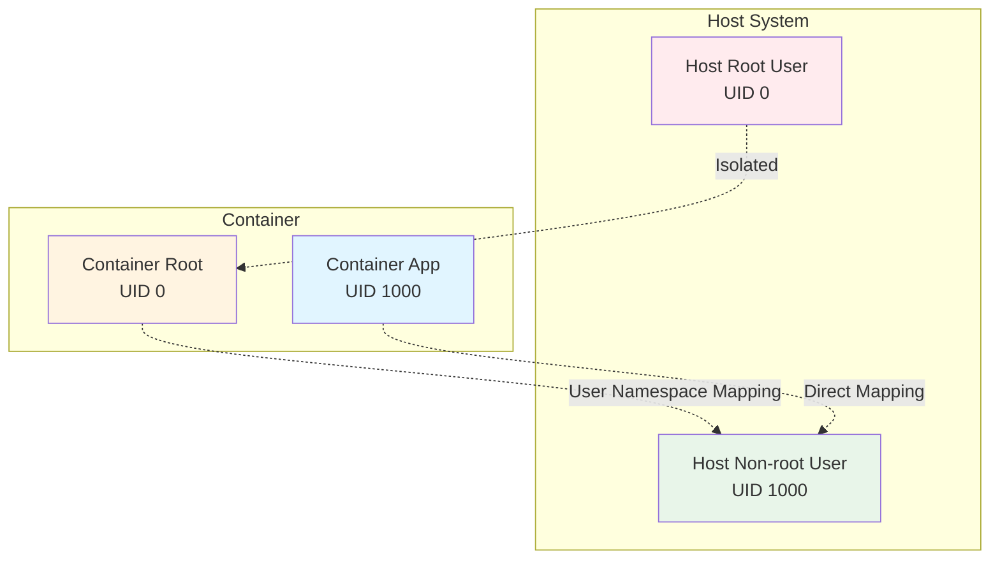
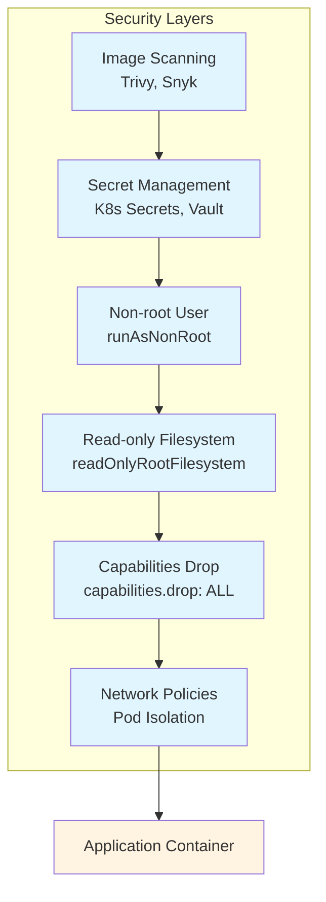
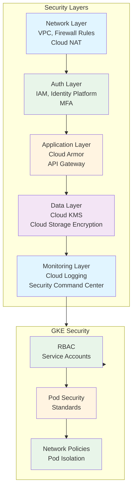
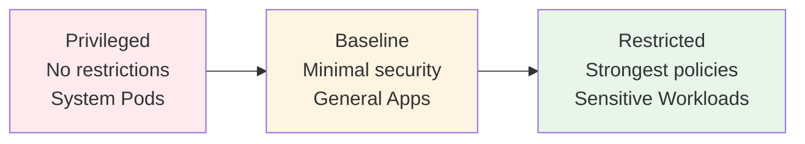

<div class="ai-summary-card">
<div class="ai-summary-header">
  <span class="ai-badge">AI 요약</span>
</div>
<div class="ai-summary-content">
  <div class="summary-row">
    <span class="summary-label">제목</span>
    <span class="summary-value">GCP 클라우드 보안 완벽 가이드: IAM부터 GKE까지 실무 중심 보안 아키텍처</span>
  </div>
  <div class="summary-row">
    <span class="summary-label">카테고리</span>
    <span class="summary-value"><span class="category-tag security">Security</span> <span class="category-tag cloud">Cloud</span></span>
  </div>
  <div class="summary-row">
    <span class="summary-label">태그</span>
    <span class="summary-value tags">
      <span class="tag">GCP</span>
      <span class="tag">Security</span>
      <span class="tag">IAM</span>
      <span class="tag">Cloud-SQL</span>
      <span class="tag">Cloud-Storage</span>
      <span class="tag">GKE</span>
      <span class="tag">Cloud-Monitoring</span>
      <span class="tag">Cloud-Logging</span>
    </span>
  </div>
  <div class="summary-row highlights">
    <span class="summary-label">핵심 내용</span>
    <ul class="summary-list">
      <li><strong>GCP 보안 아키텍처 개요</strong>: Defense in Depth 전략, 다층 보안 방어, GCP 서비스별 보안 레이어, 방화벽 규칙, IAM 통합</li>
      <li><strong>IAM 보안</strong>: IAM 정책 작성, 서비스 계정 관리, Identity Platform, 최소 권한 원칙, MFA 설정</li>
      <li><strong>VPC Network 보안</strong>: VPC 아키텍처 설계, Subnet 구성, Cloud NAT 설정, 방화벽 규칙, 네트워크 분리</li>
      <li><strong>Cloud Storage 보안</strong>: 버킷 정책, 암호화 설정 (CMEK, 기본 암호화), 접근 제어, 버전 관리</li>
      <li><strong>Cloud SQL 보안</strong>: 데이터베이스 암호화, 연결 암호화 (SSL/TLS), 백업, 보안 그룹 구성</li>
      <li><strong>GKE 보안</strong>: Pod Security Standards, Network Policy, RBAC, 컨테이너 이미지 보안, 시크릿 관리</li>
      <li><strong>모니터링 및 감사</strong>: Cloud Monitoring 설정, Cloud Logging 로그 수집 및 분석, Security Command Center 통합</li>
    </ul>
  </div>
  <div class="summary-row">
    <span class="summary-label">기술/도구</span>
    <span class="summary-value">GCP (IAM, Cloud SQL, Cloud Storage, GKE, Cloud Monitoring, Cloud Logging, Security Command Center, KMS, VPC), Defense in Depth, RBAC, TLS/SSL, Encryption</span>
  </div>
  <div class="summary-row">
    <span class="summary-label">대상 독자</span>
    <span class="summary-value">GCP 보안 엔지니어, 클라우드 아키텍트, DevOps 엔지니어, 보안 전문가</span>
  </div>
</div>
<div class="ai-summary-footer">
  이 포스팅은 AI가 쉽게 이해하고 활용할 수 있도록 구조화된 요약을 포함합니다.
</div>
</div>

## 서론

안녕하세요, **Twodragon**입니다.

GCP 클라우드 환경에서 보안을 강화하기 위해서는 IAM부터 GKE까지 모든 서비스 계층에서 Defense in Depth 전략을 적용해야 합니다. 이 포스팅은 **SK Shieldus의 2024년 GCP 클라우드 보안 가이드**를 기반으로, 실무에서 즉시 활용 가능한 GCP 보안 아키텍처 설계 및 구현 가이드를 제공합니다.

주요 GCP 서비스별 보안 모범 사례와 코드 예제, 보안 체크리스트를 포함하여 실무 중심의 보안 구축 방법을 제시합니다.User Namespaces는 컨테이너 내 root 사용자를 호스트의 비권한 사용자로 매핑하여 컨테이너 탈출 공격의 위험을 크게 감소시킵니다:



## 📊 빠른 참조

### GCP 보안 서비스 개요


컨테이너 보안은 여러 레이어로 구성된 Defense in Depth 전략을 통해 강화됩니다:




| 서비스 | 용도 | 주요 기능 |
|--------|------|----------|
| **IAM** | 접근 제어 | 사용자, 역할, 서비스 계정 관리 |
| **VPC Network** | 네트워크 보안 | 네트워크 격리, 접근 제어 |
| **Security Command Center** | 통합 보안 관리 | 보안 상태 통합 대시보드 |
| **Cloud Logging** | 감사 및 컴플라이언스 | 활동 로깅 |
| **Cloud Monitoring** | 모니터링 | 메트릭, 로그, 알람 |
| **Cloud KMS** | 암호화 | 키 관리 서비스 |
| **Cloud Asset Inventory** | 자산 관리 | 리소스 설정 모니터링 |

---

## 1. GCP 보안 아키텍처 개요

### GCP 보안 아키텍처 (Defense in Depth)

GCP 클라우드 환경에서의 다층 보안 방어 구조:



### 1.1 Defense in Depth 전략

#### 다층 보안 방어 구조

| 레이어 | GCP 서비스 | 보안 기능 |
|--------|-----------|----------|
| **네트워크 레이어** | VPC, 방화벽 규칙, Cloud NAT | 네트워크 분리, 트래픽 필터링 |
| **인증/인가 레이어** | IAM, Identity Platform, MFA | 사용자 인증, 권한 관리 |
| **애플리케이션 레이어** | Cloud Armor, API Gateway | 웹 애플리케이션 보호 |
| **데이터 레이어** | Cloud KMS, Cloud Storage, Cloud SQL | 데이터 암호화 |
| **모니터링 레이어** | Cloud Logging, Cloud Monitoring, Security Command Center | 로깅, 모니터링, 위협 탐지 |

### 1.2 보안 모범 사례

| 원칙 | 설명 | GCP 구현 |
|------|------|---------|
| **최소 권한 원칙** | 필요한 최소한의 권한만 부여 | IAM 정책, 방화벽 규칙 |
| **암호화** | 전송 중/저장 데이터 암호화 | TLS/SSL, Cloud KMS |
| **로그 관리** | 모든 활동 로깅 및 모니터링 | Cloud Logging, Cloud Monitoring |
| **정기적 검토** | 보안 설정 정기적 검토 및 개선 | Security Command Center |

---

## 2. IAM 보안

### 2.1 IAM 정책 작성

#### 최소 권한 원칙 적용

```yaml
# IAM 정책 예시: 최소 권한 원칙
bindings:
  - members:
      - serviceAccount:app-service-account@project-id.iam.gserviceaccount.com
    role: roles/storage.objectViewer
    condition:
      expression: resource.name.startsWith('projects/_/buckets/secure-bucket')
      title: Secure bucket access only
```

#### 서비스 계정 관리

```yaml
# 서비스 계정 예시
resources:
  - name: app-service-account
    type: iam.v1.serviceAccount
    properties:
      accountId: app-service-account
      displayName: Application Service Account
      description: Service account for application
```

> **참고**: 전체 IAM 정책 예시는 [GCP IAM 모범 사례](https://cloud.google.com/iam/docs/using-iam-securely) 및 [GCP 보안 모범 사례](https://cloud.google.com/security/best-practices)를 참조하세요.

### 2.2 Identity Platform

| 기능 | 설명 | 사용 사례 |
|------|------|----------|
| **OAuth 2.0** | 표준 인증 프로토콜 | 외부 사용자 인증 |
| **SAML 2.0** | 엔터프라이즈 SSO | 기업 사용자 인증 |
| **MFA** | 다중 인증 | 관리자 계정 보호 |

### 2.3 IAM 보안 체크리스트

| 체크리스트 항목 | 설명 | GCP 도구 |
|---------------|------|---------|
| **MFA 활성화** | 모든 사용자에 MFA 활성화 | IAM Console |
| **최소 권한 원칙** | 필요한 권한만 부여 | IAM Recommender |
| **서비스 계정 관리** | 서비스 계정 키 로테이션 | Service Account Key Rotation |
| **사용하지 않는 권한 제거** | 오래된 권한 정리 | IAM Recommender |
| **조직 정책 설정** | 조직 레벨 보안 정책 | Organization Policies |

---

## 3. VPC Network 보안

### 3.1 VPC 아키텍처 설계

#### Subnet 구성

```yaml
# VPC 아키텍처 예시
resources:
  - name: secure-vpc
    type: compute.v1.network
    properties:
      name: secure-vpc
      autoCreateSubnetworks: false
  
  - name: public-subnet
    type: compute.v1.subnetwork
    properties:
      name: public-subnet
      network: $(ref.secure-vpc.selfLink)
      ipCidrRange: 10.0.1.0/24
      region: asia-northeast3
      privateIpGoogleAccess: false
  
  - name: private-subnet
    type: compute.v1.subnetwork
    properties:
      name: private-subnet
      network: $(ref.secure-vpc.selfLink)
      ipCidrRange: 10.0.2.0/24
      region: asia-northeast3
      privateIpGoogleAccess: true
```

#### Cloud NAT 설정

```yaml
# Cloud NAT 예시
resources:
  - name: secure-nat
    type: compute.v1.router
    properties:
      name: secure-nat
      network: $(ref.secure-vpc.selfLink)
      region: asia-northeast3
      nats:
        - name: secure-nat-config
          natIpAllocateOption: AUTO_ONLY
          sourceSubnetworks:
            - $(ref.private-subnet.selfLink)
```

### 3.2 방화벽 규칙

```yaml
# GCP 방화벽 규칙 예시
# ISMS-P 요구사항: 네트워크 접근 제어
resources:
  - name: allow-https
    type: compute.v1.firewall
    properties:
      name: allow-https
      network: projects/PROJECT_ID/global/networks/default
      direction: INGRESS
      priority: 1000
      allowed:
        - IPProtocol: tcp
          ports:
            - '443'
      sourceRanges:
        - '0.0.0.0/0'
      targetTags:
        - web-server
      description: Allow HTTPS traffic from internet
```

> **참고**: 전체 GCP 방화벽 규칙 예시는 [GCP 방화벽 규칙 모범 사례](https://cloud.google.com/vpc/docs/firewalls) 및 [GCP 보안 모범 사례](https://cloud.google.com/security/best-practices)를 참조하세요.

### 3.3 VPC 보안 체크리스트

| 체크리스트 항목 | 설명 | GCP 도구 |
|---------------|------|---------|
| **Private Subnet 활용** | 데이터베이스는 Private Subnet에 배치 | VPC Console |
| **방화벽 규칙 최소화** | 필요한 포트만 허용 | Firewall Rules Console |
| **Cloud NAT 설정** | 아웃바운드 트래픽 제어 | Cloud NAT Console |
| **VPC Flow Logs 활성화** | 네트워크 트래픽 로깅 | VPC Flow Logs |
| **VPC Peering 보안** | VPC Peering 시 방화벽 규칙 확인 | VPC Peering Console |

---

## 4. Cloud Storage 보안

### 4.1 버킷 정책

```yaml
# Cloud Storage 버킷 정책 예시
# ISMS-P 요구사항: 접근 통제 및 암호화
resources:
  - name: secure-bucket
    type: storage.v1.bucket
    properties:
      name: secure-data-bucket
      location: ASIA-NORTHEAST3
      storageClass: STANDARD
      encryption:
        defaultKmsKeyName: projects/PROJECT_ID/locations/asia-northeast3/keyRings/keyring/cryptoKeys/key
      versioning:
        enabled: true
      iamConfiguration:
        uniformBucketLevelAccess:
          enabled: true
      lifecycle:
        rule:
          - action:
              type: Delete
            condition:
              age: 90
              matchesStorageClass:
                - STANDARD
```

### 4.2 Cloud Storage 보안 체크리스트

| 체크리스트 항목 | 설명 | GCP 도구 |
|---------------|------|---------|
| **버킷 정책 설정** | 접근 권한 명확히 정의 | Cloud Storage IAM |
| **암호화 활성화** | CMEK 또는 기본 암호화 | Cloud KMS |
| **버전 관리 활성화** | 데이터 복구 가능하도록 | Cloud Storage Versioning |
| **Public Access 차단** | Public Access 제한 | Cloud Storage IAM |
| **접근 로그 활성화** | 버킷 접근 로그 수집 | Cloud Logging |

---

## 5. Cloud SQL 보안

### 5.1 데이터베이스 암호화

```yaml
# Cloud SQL 암호화 설정 예시
resources:
  - name: secure-database
    type: sqladmin.v1beta4.instance
    properties:
      name: secure-db
      databaseVersion: MYSQL_8_0
      region: asia-northeast3
      settings:
        tier: db-n1-standard-1
        backupConfiguration:
          enabled: true
          startTime: '03:00'
          binaryLogEnabled: true
        ipConfiguration:
          ipv4Enabled: false
          privateNetwork: projects/PROJECT_ID/global/networks/secure-vpc
        databaseFlags:
          - name: require_ssl
            value: 'on'
        diskEncryptionConfiguration:
          kmsKeyName: projects/PROJECT_ID/locations/asia-northeast3/keyRings/keyring/cryptoKeys/db-key
```

### 5.2 Cloud SQL 보안 체크리스트

| 체크리스트 항목 | 설명 | GCP 도구 |
|---------------|------|---------|
| **암호화 활성화** | 저장 데이터 암호화 | Cloud KMS |
| **SSL/TLS 연결** | 연결 암호화 필수 | Cloud SQL SSL/TLS |
| **자동 백업 활성화** | 정기적인 백업 설정 | Cloud SQL Automated Backups |
| **Private IP 사용** | Public IP 비활성화 | Cloud SQL Private IP |
| **방화벽 규칙 설정** | 데이터베이스 접근 제한 | Cloud SQL Authorized Networks |

---

## 6. GKE 보안

### 6.1 Pod Security Standards

```yaml
# Pod Security Policy 예시
apiVersion: v1
kind: Namespace
metadata:
  name: secure-namespace
  labels:
    pod-security.kubernetes.io/enforce: restricted
    pod-security.kubernetes.io/audit: restricted
    pod-security.kubernetes.io/warn: restricted
---
apiVersion: v1
kind: Pod
metadata:
  name: secure-pod
  namespace: secure-namespace
spec:
  securityContext:
    runAsNonRoot: true
    runAsUser: 1000
    fsGroup: 2000
  containers:
    - name: app
      image: gcr.io/project-id/app:latest
      securityContext:
        allowPrivilegeEscalation: false
        capabilities:
          drop:
            - ALL
```

### 6.2 Network Policy

```yaml
# Network Policy 예시
apiVersion: networking.k8s.io/v1
kind: NetworkPolicy
metadata:
  name: secure-network-policy
  namespace: secure-namespace
spec:
  podSelector:
    matchLabels:
      app: secure-app
  policyTypes:
    - Ingress
    - Egress
  ingress:
    - from:
        - podSelector:
            matchLabels:
              app: allowed-app
      ports:
        - protocol: TCP
          port: 8080
  egress:
    - to:
        - podSelector:
            matchLabels:
              app: database
      ports:
        - protocol: TCP
          port: 3306
```

### 6.3 GKE 보안 체크리스트

| 체크리스트 항목 | 설명 | GCP 도구 |
|---------------|------|---------|
| **Pod Security Standards** | Pod Security Policy 적용 | GKE Pod Security |
| **Network Policy** | 네트워크 트래픽 제어 | Kubernetes Network Policy |
| **RBAC 설정** | 역할 기반 접근 제어 | Kubernetes RBAC |
| **컨테이너 이미지 보안** | 취약점 스캔 및 검증 | Container Analysis API |
| **시크릿 관리** | Secret Manager 통합 | GKE Secret Manager |

---

## 7. 모니터링 및 감사

### 7.1 Cloud Logging

```yaml
# Cloud Logging 설정 예시
resources:
  - name: audit-log-sink
    type: logging.v2.sink
    properties:
      name: audit-log-sink
      destination: storage.googleapis.com/audit-logs-bucket
      filter: |
        resource.type="gce_instance"
        OR resource.type="gcs_bucket"
        OR resource.type="cloudsql_database"
```

### 7.2 Cloud Monitoring

| 모니터링 항목 | Cloud Monitoring 메트릭 | 알람 임계값 |
|-------------|----------------------|------------|
| **비정상 API 호출** | API 호출 수 | 평균 대비 200% 증가 |
| **권한 변경** | IAM 권한 변경 이벤트 | 즉시 알람 |
| **네트워크 이상** | VPC Flow Logs 분석 | 의심스러운 트래픽 패턴 |
| **암호화 미적용** | Cloud Storage 암호화 상태 | 암호화 미적용 객체 발견 |

### 7.3 Security Command Center 통합

```yaml
# Security Command Center 설정 예시
resources:
  - name: security-command-center
    type: securitycenter.v1.organizationSettings
    properties:
      name: organizations/ORGANIZATION_ID/organizationSettings
      enableAssetDiscovery: true
      assetDiscoveryConfig:
        projectIds:
          - PROJECT_ID
```

---

## 8. 2025년 이후 최신 업데이트

### 8.1 IAM 보안 강화

#### IAM Recommender 개선

2025년, GCP IAM Recommender는 보안 강화를 위한 권장사항을 더욱 정확하게 제공합니다.

**주요 기능:**
- 사용하지 않는 권한 자동 탐지
- 과도한 권한 부여 감지
- 최소 권한 원칙 기반 권장사항 제공

### 8.2 Cloud SQL 보안 강화

#### 자동 백업 및 복구 개선

2025년, Cloud SQL은 자동 백업 및 복구 기능을 강화하여 데이터 보호를 향상시켰습니다.

**주요 기능:**
- Point-in-time 복구 (PITR) 개선
- 자동 백업 스케줄링 최적화
- 암호화된 백업 지원 강화

### 8.3 Cloud Storage 보안 강화

#### 객체 라이프사이클 정책 개선

2025년, Cloud Storage는 객체 라이프사이클 정책을 개선하여 보안 및 비용 최적화를 강화했습니다.

**주요 기능:**
- 자동 암호화 전환
- 보안 정책 기반 자동 삭제
- 접근 빈도 기반 스토리지 클래스 자동 전환

### 8.4 GKE 보안 강화

#### Pod Security Standards 강화


Pod Security Standards는 세 가지 보안 레벨을 제공합니다:




2025년, GKE는 Pod Security Standards를 강화하여 컨테이너 보안을 향상시켰습니다.

**주요 기능:**
- Restricted 모드 기본 적용
- Security Context 자동 검증
- 네트워크 정책 자동 적용

#### Anthos 통합 강화

2025년, GKE는 Anthos와의 통합을 강화하여 멀티클라우드 및 하이브리드 환경에서의 보안 관리를 개선했습니다.

**주요 기능:**
- 서비스 메쉬 보안 정책 통합
- 구성 관리 및 정책 통합
- 중앙화된 보안 관리

### 8.5 Security Command Center 개선

#### 자동 위협 탐지 강화

2025년, Security Command Center는 AI 기반 자동 위협 탐지 기능을 강화했습니다.

**주요 기능:**
- 이상 활동 자동 탐지
- 보안 이벤트 자동 분석
- 위협 인텔리전스 통합

---

## 결론

GCP 클라우드 환경에서 보안을 강화하기 위해서는 IAM부터 GKE까지 모든 서비스 계층에서 Defense in Depth 전략을 적용해야 합니다.

주요 보안 원칙:

1. **최소 권한 원칙**: 필요한 최소한의 권한만 부여
2. **암호화**: 전송 중/저장 데이터 암호화
3. **로그 관리**: 모든 활동 로깅 및 모니터링
4. **정기적 검토**: 보안 설정 정기적 검토 및 개선

이 가이드를 참고하여 GCP 환경에서 강력한 보안 아키텍처를 구축하시기 바랍니다.

### 관련 자료

- [ISMS-P 인증 페이지](/certifications/isms-p/)
- [SK Shieldus 2024년 GCP 클라우드 보안 가이드](https://www.skshieldus.com/download/files/download.do?o_fname=2024%20%ED%81%AC%EB%9D%BC%EC%9A%B0%EB%93%9C%20%EB%B3%B4%EC%95%88%EA%B0%80%EC%9D%B4%EB%93%9C(GCP).pdf&r_fname=20240703112823626.pdf)
- [GCP 보안 모범 사례](https://cloud.google.com/security/best-practices)

---

**마지막 업데이트**: 2026-01-14
**작성 기준**: SK Shieldus 2024년 GCP 클라우드 보안 가이드
