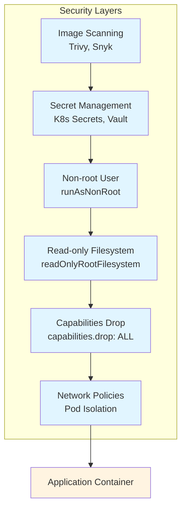
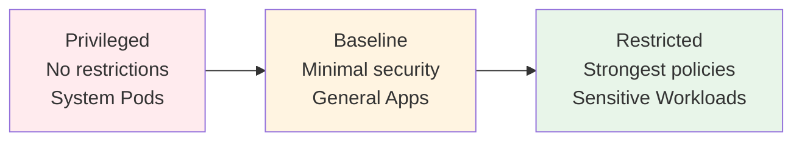
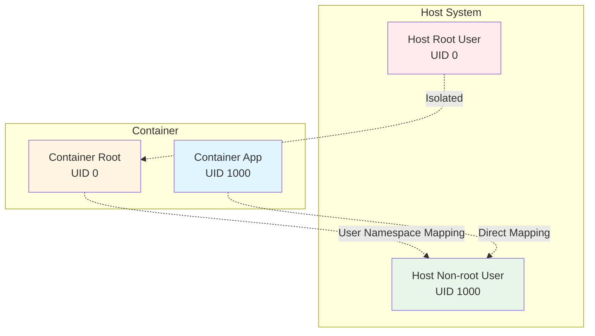
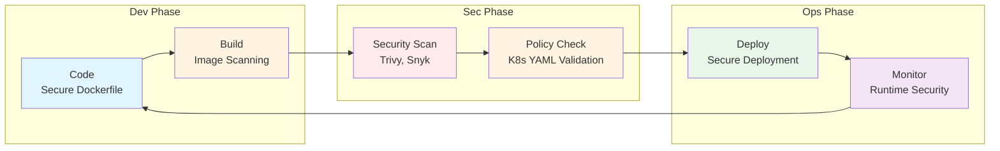

<div class="ai-summary-card">
<div class="ai-summary-header">
  <span class="ai-badge">AI 요약</span>
</div>
<div class="ai-summary-content">
  <div class="summary-row">
    <span class="summary-label">제목</span>
    <span class="summary-value">🚀 클라우드 보안 과정 8기 7주차: Docker & Kubernetes 보안 실전 가이드</span>
  </div>
  <div class="summary-row">
    <span class="summary-label">카테고리</span>
    <span class="summary-value"><span class="category-tag security">Security</span> <span class="category-tag devsecops">DevSecOps</span> <span class="category-tag kubernetes">Kubernetes</span></span>
  </div>
  <div class="summary-row">
    <span class="summary-label">태그</span>
    <span class="summary-value tags">
      <span class="tag">Docker</span>
      <span class="tag">Kubernetes</span>
      <span class="tag">Container-Security</span>
      <span class="tag">K8s</span>
      <span class="tag">Cloud-Security</span>
      <span class="tag">DevSecOps</span>
      <span class="tag">Minikube</span>
      <span class="tag">K9s</span>
      <span class="tag">Pod-Security-Standards</span>
      <span class="tag">User-Namespaces</span>
    </span>
  </div>
  <div class="summary-row highlights">
    <span class="summary-label">핵심 내용</span>
    <ul class="summary-list">
      <li><strong>컨테이너 보안 Best Practices</strong>: 이미지 스캔(Trivy, Snyk), Secret 관리(Kubernetes Secrets, External Secrets Operator), 비루트 사용자 실행, 읽기 전용 파일시스템, 최소 권한 원칙</li>
      <li><strong>Kubernetes 보안 아키텍처</strong>: Pod Security Standards(PSS), User Namespaces(Kubernetes 1.33+), Network Policies, RBAC 최소 권한, Bound Service Account Tokens</li>
      <li><strong>Kubernetes 보안 Best Practices</strong>: 이미지 서명 및 검증(Cosign, Docker Content Trust), 런타임 보안 모니터링(Falco, Sysdig), 자동화된 보안 검증(CI/CD 통합), 정기적인 보안 감사</li>
      <li><strong>최신 보안 기능 (2024-2026)</strong>: Kubernetes 1.32-1.35 보안 강화(User Namespaces Beta-by-Default, mTLS Pod Certificates), Kubernetes 1.36+ 예상 기능, Minikube 1.37.0+ 기능, K9s 보안 모범 사례</li>
      <li><strong>Docker/Container/Kubernetes 기본 이해</strong>: Docker 이미지/컨테이너 개념, VM vs Container 비교, Kubernetes 핵심 리소스(Pod, Deployment, Service, Namespace), 컨테이너 격리 원리</li>
    </ul>
  </div>
  <div class="summary-row">
    <span class="summary-label">기술/도구</span>
    <span class="summary-value">Docker, Kubernetes, Minikube, K9s, Trivy, Snyk, Falco, External Secrets Operator</span>
  </div>
  <div class="summary-row">
    <span class="summary-label">대상 독자</span>
    <span class="summary-value">보안 엔지니어, 클라우드 보안 전문가, DevOps 엔지니어, 컨테이너 보안 담당자</span>
  </div>
</div>
<div class="ai-summary-footer">
  이 포스팅은 AI가 쉽게 이해하고 활용할 수 있도록 구조화된 요약을 포함합니다.
</div>
</div>

## 서론

안녕하세요, **Twodragon**입니다.

지난 6주차에서는 AWS WAF/CloudFront 보안 아키텍처와 GitHub DevSecOps 실전을 다루었습니다. 이번 **클라우드 보안 과정 8기 7주차**에서는 **Docker & Kubernetes 보안 실전 가이드**를 통해 컨테이너 보안부터 클러스터 보안까지 실무 중심으로 다루고자 합니다.

특히 이번 주에는 **2024-2026년 최신 Kubernetes 보안 기능**과 **실전 보안 사례**를 결합하여, DevSecOps 관점에서 컨테이너 보안을 강화하는 방법을 깊이 있게 다뤄보겠습니다.

본 과정은 **온라인 미팅**으로 진행되며, **'20분 강의 + 5분 휴식'** 사이클로 멘티분들의 집중력을 최대로 유지하며 진행됩니다.

---

### **📅 7주차 타임테이블 (Agenda)**

| 시간 | 주제 | 내용 |
|------|------|------|
| **10:00 - 10:20** | **근황 토크 & 과제 피드백** | 한 주간의 보안 이슈 공유 및 Q&A |
| **10:25 - 10:50** | **Docker/Container/Kubernetes 기본 이해** | Docker 이미지/컨테이너 개념, VM vs Container, Kubernetes 핵심 리소스 |
| **11:00 - 11:25** | **컨테이너 보안 Best Practices** | Docker 이미지 보안, Secret 관리, 비루트 실행, 이미지 스캔(Trivy, Snyk) |
| **11:30 - 11:50** | **Kubernetes 보안 아키텍처 & Best Practices** | Pod Security Standards, User Namespaces, Network Policies, RBAC, 보안 모범 사례 |
| **11:55 - 12:00** | **실습 및 Q&A** | Minikube 보안 환경 구성, 실전 보안 강화 사례 |

---

### **🌐 1. Docker/Container/Kubernetes 기본 이해**

컨테이너와 Kubernetes를 이해하기 전에 기본 개념을 명확히 하는 것이 중요합니다.

#### **1.1 Docker 기본 개념**

##### **Docker의 핵심 구성 요소**

| 개념 | 설명 | 비유 |
|------|------|------|
| **Image** | 컨테이너 실행에 필요한 파일과 설정을 포함한 템플릿 | 빵을 만드는 레시피 |
| **Container** | 이미지를 기반으로 실행되는 인스턴스 | 레시피로 만든 빵 |
| **Dockerfile** | 이미지를 빌드하기 위한 명령어 스크립트 | 레시피 작성 방법 |
| **Registry** | 이미지를 저장하고 공유하는 저장소 (Docker Hub 등) | 빵 레시피 도서관 |

##### **기본 Docker 명령어**

> **참고**: Docker 기본 명령어는 [Docker 공식 문서](https://docs.docker.com/) 및 [Docker GitHub 저장소](https://github.com/docker-library)를 참조하세요.

```bash
# 이미지 다운로드
docker pull nginx:latest

# 컨테이너 실행
docker run -d -p 8080:80 --name my-nginx nginx:latest

# 실행 중인 컨테이너 확인
docker ps

# 컨테이너 로그 확인
docker logs my-nginx

# 컨테이너 중지
docker stop my-nginx

# 컨테이너 삭제
docker rm my-nginx
```

#### **1.2 Container 이해**

##### **VM vs Container 비교**

| 항목 | 가상머신(VM) | 컨테이너 |
|------|------------|---------|
| **실행 단위** | 전체 OS 포함 | 앱 + 라이브러리 |
| **성능** | 무겁고 느림 | 경량, 빠름 |
| **실행 환경** | 독립적 커널 | 호스트 커널 공유 |
| **사용 목적** | 레거시 시스템, 완전 격리 | 마이크로서비스, DevOps |
| **리소스 사용** | 높음 (GB 단위) | 낮음 (MB 단위) |
| **시작 시간** | 느림 (분 단위) | 빠름 (초 단위) |

##### **컨테이너 격리 원리**

컨테이너는 Linux 커널의 다음 기능을 활용하여 격리를 제공합니다:

| Linux 기능 | 설명 | 격리 효과 |
|-----------|------|----------|
| **Namespaces** | 프로세스, 네트워크, 파일시스템 격리 | 각 컨테이너가 독립적인 환경을 가짐 |
| **Cgroups** | CPU, 메모리, I/O 리소스 제한 | 리소스 사용량 제어 |
| **Union File Systems** | 레이어드 파일시스템 | 이미지 효율적 관리 |

#### **1.3 Kubernetes 기본 개념**

##### **Kubernetes 핵심 리소스**

| 리소스 | 설명 | 비유 |
|--------|------|------|
| **Pod** | 하나 이상의 컨테이너로 구성된 최소 배포 단위 | 컨테이너를 담는 상자 |
| **Deployment** | Pod의 배포, 업데이트, 스케일링을 관리 | Pod를 관리하는 관리자 |
| **Service** | Pod에 대한 안정적인 네트워크 엔드포인트 제공 | Pod를 찾는 전화번호부 |
| **Namespace** | 리소스를 논리적으로 분리하는 가상 클러스터 | 아파트의 층 구분 |
| **ConfigMap** | 설정 데이터를 저장하는 리소스 | 설정 파일 저장소 |
| **Secret** | 민감한 데이터를 저장하는 리소스 | 비밀 정보 저장소 |

##### **Kubernetes 아키텍처**

| 구성 요소 | 설명 | 역할 |
|----------|------|------|
| **Control Plane** | 클러스터 관리 및 제어 | API Server, etcd, Scheduler, Controller Manager |
| **Node** | 실제 워크로드가 실행되는 서버 | kubelet, kube-proxy, 컨테이너 런타임 |
| **API Server** | Kubernetes API를 제공하는 중앙 엔드포인트 | 모든 요청의 진입점 |
| **etcd** | 클러스터 상태를 저장하는 분산 키-값 저장소 | 클러스터의 데이터베이스 |
| **Scheduler** | Pod를 적절한 Node에 배치 | 리소스 할당 결정 |
| **kubelet** | Node에서 Pod를 관리하는 에이전트 | Pod 생명주기 관리 |

> **참고**: Kubernetes 기본 개념은 [Kubernetes 공식 문서](https://kubernetes.io/docs/concepts/) 및 [Kubernetes GitHub 저장소](https://github.com/kubernetes/kubernetes)를 참조하세요.

##### **기본 Kubernetes 명령어**

```bash
# 클러스터 정보 확인
kubectl cluster-info

# Node 목록 확인
kubectl get nodes

# Pod 목록 확인
kubectl get pods

# Namespace 목록 확인
kubectl get namespaces

# Deployment 생성
kubectl create deployment nginx --image=nginx:latest

# Deployment 확인
kubectl get deployments

# Pod 상세 정보 확인
kubectl describe pod <pod-name>

# Pod 로그 확인
kubectl logs <pod-name>

# Pod 삭제
kubectl delete pod <pod-name>
```

---

### **🌐 2. 컨테이너 보안 Best Practices**

컨테이너 보안은 DevSecOps의 핵심입니다. 이미지 빌드 단계부터 런타임까지 전 과정에서 보안을 고려해야 합니다.

#### **2.1 Docker 이미지 보안**

##### **컨테이너 보안 레이어 (Defense in Depth)**

컨테이너 보안은 여러 레이어로 구성된 Defense in Depth 전략을 통해 강화됩니다:




##### **최소 권한 원칙 적용**

| 보안 항목 | 취약한 예시 | 보안 강화 예시 | 설명 |
|----------|-----------|--------------|------|
| **사용자 권한** | `USER root` | `USER 1000:1000` | 비루트 사용자로 실행 |
| **파일시스템** | 읽기/쓰기 가능 | `readOnlyRootFilesystem: true` | 읽기 전용 파일시스템 |
| **Capabilities** | 모든 권한 | `capabilities.drop: ALL` | 불필요한 권한 제거 |
| **환경 변수** | 평문 Secret | Kubernetes Secrets | Secret 관리 도구 사용 |

> **참고**: Docker 보안 모범 사례는 [Docker 보안 문서](https://docs.docker.com/engine/security/) 및 [OWASP Docker 보안 체크리스트](https://cheatsheetseries.owasp.org/cheatsheets/Docker_Security_Cheat_Sheet.html)를 참조하세요.

```dockerfile
# 보안 강화 Dockerfile 예시
FROM node:18-alpine AS builder
WORKDIR /app
COPY package*.json ./
RUN npm ci --only=production

FROM node:18-alpine
# 비루트 사용자 생성 및 사용
RUN addgroup -g 1000 -S nodejs && \
    adduser -S nodejs -u 1000
USER nodejs
WORKDIR /app
COPY --from=builder --chown=nodejs:nodejs /app/node_modules ./node_modules
COPY --chown=nodejs:nodejs . .
# 읽기 전용 파일시스템 설정 (런타임에서)
CMD ["node", "server.js"]
```

##### **이미지 스캔 자동화**

| 도구 | 설명 | CI/CD 통합 | 특징 |
|------|------|-----------|------|
| **Trivy** | 오픈소스 취약점 스캐너 | GitHub Actions, GitLab CI | 빠른 스캔, 다양한 포맷 지원 |
| **Snyk** | 상용/오픈소스 스캐너 | GitHub, GitLab, Jenkins | 상세한 취약점 정보, 수정 가이드 |
| **Clair** | Quay.io의 오픈소스 스캐너 | Kubernetes Operator | 컨테이너 레지스트리 통합 |

```yaml
# GitHub Actions에서 Trivy 스캔 예시
name: Security Scan
on: [push, pull_request]
jobs:
  scan:
    runs-on: ubuntu-latest
    steps:
      - uses: actions/checkout@v4
      - name: Run Trivy vulnerability scanner
        uses: aquasecurity/trivy-action@master
        with:
          image-ref: 'myapp:latest'
          format: 'table'
          exit-code: '1'
          severity: 'CRITICAL,HIGH'
```

#### **2.2 Secret 관리**

##### **Kubernetes Secrets vs External Secrets Operator**

| 방식 | 설명 | 장점 | 단점 |
|------|------|------|------|
| **Kubernetes Secrets** | 네이티브 Secret 리소스 | 간단한 설정 | Base64 인코딩(암호화 아님) |
| **External Secrets Operator** | 외부 Secret Store 통합 | 중앙 관리, 자동 동기화 | 추가 Operator 필요 |
| **Sealed Secrets** | 암호화된 Secret | Git에 안전하게 저장 가능 | 추가 도구 필요 |

> **참고**: External Secrets Operator 설정은 [External Secrets Operator 문서](https://external-secrets.io/) 및 [AWS Secrets Manager 통합](https://external-secrets.io/latest/provider/aws-secrets-manager/)을 참조하세요.

```yaml
# External Secrets Operator 예시 (AWS Secrets Manager)
apiVersion: external-secrets.io/v1beta1
kind: ExternalSecret
metadata:
  name: app-secrets
spec:
  refreshInterval: 1h
  secretStoreRef:
    name: aws-secrets-manager
    kind: SecretStore
  target:
    name: app-secrets
    creationPolicy: Owner
  data:
    - secretKey: database-password
      remoteRef:
        key: production/database
        property: password
```

#### **2.3 비루트 사용자 실행**

##### **Security Context 설정**

| 설정 항목 | 설명 | 보안 효과 |
|----------|------|----------|
| `runAsNonRoot: true` | 루트 사용자 실행 방지 | 권한 상승 공격 방어 |
| `runAsUser: 1000` | 특정 사용자 ID 지정 | 최소 권한 원칙 적용 |
| `allowPrivilegeEscalation: false` | 권한 상승 방지 | 컨테이너 탈출 위험 감소 |
| `capabilities.drop: ALL` | 모든 Capabilities 제거 | 공격 표면 최소화 |

```yaml
# 보안 강화 Pod 예시
apiVersion: v1
kind: Pod
metadata:
  name: secure-app
spec:
  securityContext:
    runAsNonRoot: true
    runAsUser: 1000
    runAsGroup: 1000
    fsGroup: 1000
  containers:
  - name: app
    image: myapp:latest
    securityContext:
      allowPrivilegeEscalation: false
      readOnlyRootFilesystem: true
      capabilities:
        drop:
        - ALL
    volumeMounts:
    - name: tmp
      mountPath: /tmp
  volumes:
  - name: tmp
    emptyDir: {}
```

---

### **🤖 3. Kubernetes 보안 아키텍처**

Kubernetes 클러스터 보안은 다층 방어 전략으로 접근해야 합니다.

#### **3.1 Pod Security Standards (PSS)**

##### **PSS 레벨별 정책**

Pod Security Standards는 세 가지 보안 레벨을 제공합니다:




| 레벨 | 설명 | 적용 예시 |
|------|------|----------|
| **Privileged** | 제한 없음 | 시스템 Pod, 특수 워크로드 |
| **Baseline** | 최소 보안 요구사항 | 일반 애플리케이션 |
| **Restricted** | 강력한 보안 정책 | 민감한 워크로드 |

```yaml
# Namespace에 PSS 적용
apiVersion: v1
kind: Namespace
metadata:
  name: production
  labels:
    pod-security.kubernetes.io/enforce: restricted
    pod-security.kubernetes.io/audit: restricted
    pod-security.kubernetes.io/warn: restricted
---
apiVersion: apps/v1
kind: Deployment
metadata:
  name: app
  namespace: production
spec:
  template:
    spec:
      securityContext:
        runAsNonRoot: true
        runAsUser: 1000
      containers:
      - name: app
        image: myapp:latest
        securityContext:
          allowPrivilegeEscalation: false
          capabilities:
            drop: ["ALL"]
          readOnlyRootFilesystem: true
```

#### **3.2 User Namespaces (Kubernetes 1.33+)**

##### **컨테이너 격리 강화**

User Namespaces는 컨테이너 내 root 사용자를 호스트의 비권한 사용자로 매핑하여 컨테이너 탈출 공격의 위험을 크게 감소시킵니다:




User Namespaces는 컨테이너 내 root 사용자를 호스트의 비권한 사용자로 매핑하여 컨테이너 탈출 공격의 위험을 크게 감소시킵니다.

| 공격 시나리오 | 기존 | User Namespaces 적용 |
|--------------|------|---------------------|
| 컨테이너 탈출 후 root 권한 | 호스트 root 획득 가능 | 비특권 사용자로 제한 |
| `/proc`, `/sys` 접근 | 민감 정보 노출 | 접근 권한 격리 |
| 호스트 파일시스템 접근 | 전체 파일시스템 접근 가능 | 격리된 파일시스템만 접근 |

> **참고**: User Namespaces 설정은 [Kubernetes 공식 문서 - User Namespaces](https://kubernetes.io/docs/concepts/security/pod-security-standards/) 및 [Kubernetes GitHub 저장소](https://github.com/kubernetes/kubernetes)를 참조하세요.

```yaml
# User Namespace 활성화 Pod 예시 (Kubernetes 1.33+)
apiVersion: v1
kind: Pod
metadata:
  name: isolated-pod
spec:
  hostUsers: false  # User Namespace 활성화 (핵심 설정)
  securityContext:
    runAsNonRoot: true
    runAsUser: 1000
    runAsGroup: 1000
    fsGroup: 1000
  containers:
  - name: app
    image: myapp:latest
    securityContext:
      allowPrivilegeEscalation: false
      capabilities:
        drop:
        - ALL
      readOnlyRootFilesystem: true
```

**User Namespace 보안 효과:**

| 보안 항목 | 효과 |
|----------|------|
| **컨테이너 격리** | 컨테이너 내 root가 호스트에서는 비권한 사용자로 매핑 |
| **공격 표면 감소** | 컨테이너 탈출 공격 시 피해 최소화 |
| **워크로드 격리** | Pod 간 격리 강화 |

#### **3.3 Network Policies**

##### **네트워크 트래픽 제어**

Network Policies를 통해 Pod 간 통신을 제어하여 방어 깊이를 강화합니다.

| 정책 유형 | 설명 | 적용 예시 |
|----------|------|----------|
| **Ingress** | 들어오는 트래픽 제어 | 특정 네임스페이스에서만 접근 허용 |
| **Egress** | 나가는 트래픽 제어 | 특정 서비스로만 통신 허용 |
| **Default Deny** | 기본 거부 정책 | 명시적으로 허용된 트래픽만 통신 |

```yaml
# Network Policy 예시
apiVersion: networking.k8s.io/v1
kind: NetworkPolicy
metadata:
  name: app-network-policy
  namespace: production
spec:
  podSelector:
    matchLabels:
      app: myapp
  policyTypes:
  - Ingress
  - Egress
  ingress:
  - from:
    - namespaceSelector:
        matchLabels:
          name: frontend
    - podSelector:
        matchLabels:
          app: frontend
    ports:
    - protocol: TCP
      port: 8080
  egress:
  - to:
    - namespaceSelector:
        matchLabels:
          name: database
    ports:
    - protocol: TCP
      port: 5432
```

#### **3.4 RBAC 최소 권한 원칙**

##### **역할 기반 접근 제어**

| 역할 | 권한 | 설명 |
|------|------|------|
| **Developer** | Deployment 생성/수정 | 애플리케이션 배포만 가능 |
| **Operator** | Pod 로그 조회, 리소스 모니터링 | 운영 작업만 가능 |
| **Security** | NetworkPolicy, PodSecurityPolicy 관리 | 보안 정책 관리 |

```yaml
# RBAC 예시
apiVersion: rbac.authorization.k8s.io/v1
kind: Role
metadata:
  name: developer
  namespace: production
rules:
- apiGroups: ["apps"]
  resources: ["deployments"]
  verbs: ["get", "list", "create", "update", "patch"]
- apiGroups: [""]
  resources: ["pods"]
  verbs: ["get", "list"]
---
apiVersion: rbac.authorization.k8s.io/v1
kind: RoleBinding
metadata:
  name: developer-binding
  namespace: production
subjects:
- kind: User
  name: developer-user
  apiGroup: rbac.authorization.k8s.io
roleRef:
  kind: Role
  name: developer
  apiGroup: rbac.authorization.k8s.io
```

---

### **📋 4. Kubernetes 보안 Best Practices (2024-2026)**

2024-2026년 최신 보안 모범 사례를 반영한 Kubernetes 보안 강화 전략입니다.

#### **4.1 이미지 서명 및 검증**

| 보안 항목 | 설명 | 도구 | 적용 방법 |
|----------|------|------|----------|
| **이미지 서명** | 컨테이너 이미지 무결성 보장 | Docker Content Trust (DCT), Notary, Cosign | CI/CD 파이프라인에 통합 |
| **이미지 검증** | 배포 전 서명 검증 | Admission Controller | Kubernetes에서 자동 검증 |
| **신뢰할 수 있는 레지스트리** | 공식/검증된 레지스트리만 사용 | ImagePolicyWebhook | 정책 기반 이미지 허용 |

> **참고**: 이미지 서명 및 검증은 [Docker Content Trust 문서](https://docs.docker.com/engine/security/trust/) 및 [Cosign GitHub 저장소](https://github.com/sigstore/cosign)를 참조하세요.

```yaml
# Cosign을 사용한 이미지 서명 예시
# 이미지 서명
cosign sign --key cosign.key myregistry.io/myapp:v1.0.0

# 이미지 검증
cosign verify --key cosign.pub myregistry.io/myapp:v1.0.0
```

#### **4.2 최소 권한 이미지 사용**

| 원칙 | 설명 | 적용 방법 |
|------|------|----------|
| **최소 베이스 이미지** | Alpine, Distroless 등 경량 이미지 사용 | Dockerfile에서 경량 베이스 이미지 선택 |
| **신뢰할 수 있는 소스** | 공식 레지스트리 및 검증된 이미지만 사용 | 이미지 정책 설정 |
| **정기 업데이트** | 취약점 패치를 위한 정기적 이미지 업데이트 | 자동화된 이미지 스캔 및 업데이트 |

```dockerfile
# 최소 권한 이미지 예시 (Distroless)
FROM gcr.io/distroless/nodejs18-debian11
WORKDIR /app
COPY --chown=nonroot:nonroot . .
USER nonroot:nonroot
CMD ["server.js"]
```

#### **4.3 런타임 보안 모니터링**

| 도구 | 설명 | 주요 기능 | 적용 방법 |
|------|------|----------|----------|
| **Falco** | 오픈소스 런타임 보안 모니터링 | 이상 행위 탐지, 실시간 알림 | Kubernetes Operator로 배포 |
| **Sysdig Secure** | 상용 런타임 보안 플랫폼 | 포괄적인 보안 모니터링 | 클라우드 서비스 통합 |
| **Aqua Security** | 컨테이너 보안 플랫폼 | 이미지 스캔, 런타임 보호 | Kubernetes 통합 |

> **참고**: Falco 설정은 [Falco 공식 문서](https://falco.org/docs/) 및 [Falco Kubernetes Operator](https://github.com/falcosecurity/falco-operator)를 참조하세요.

```yaml
# Falco Kubernetes Operator 설치 예시
apiVersion: v1
kind: Namespace
metadata:
  name: falco
---
apiVersion: apps/v1
kind: DaemonSet
metadata:
  name: falco
  namespace: falco
spec:
  template:
    spec:
      containers:
      - name: falco
        image: docker.io/falcosecurity/falco:latest
        securityContext:
          privileged: true
        volumeMounts:
        - name: host-proc
          mountPath: /host/proc
          readOnly: true
      volumes:
      - name: host-proc
        hostPath:
          path: /proc
```

#### **4.4 네트워크 세분화 및 정책 적용**

| 정책 유형 | 설명 | 적용 예시 |
|----------|------|----------|
| **기본 거부 정책** | 모든 트래픽 기본 차단 | Default Deny Network Policy 적용 |
| **네임스페이스 격리** | 네임스페이스별 네트워크 격리 | 네임스페이스별 Network Policy |
| **서비스 메시 통합** | Istio, Linkerd 등 서비스 메시 활용 | mTLS, 트래픽 제어 |

#### **4.5 정기적인 보안 감사 및 로깅**

| 항목 | 설명 | 도구 | 적용 방법 |
|------|------|------|----------|
| **Audit 로깅** | Kubernetes API 서버 감사 로그 활성화 | Kubernetes Audit | API 서버 설정 |
| **컨테이너 로그 수집** | Pod 로그 중앙 수집 및 분석 | ELK Stack, Loki | 로그 수집 파이프라인 |
| **보안 이벤트 모니터링** | 보안 관련 이벤트 실시간 모니터링 | Prometheus, Grafana | 메트릭 수집 및 알림 |

```yaml
# Kubernetes Audit Policy 예시
apiVersion: audit.k8s.io/v1
kind: Policy
rules:
- level: Metadata
  namespaces: ["production"]
  resources:
  - group: ""
    resources: ["secrets", "configmaps"]
- level: RequestResponse
  users: ["system:serviceaccount:*:*"]
  resources:
  - group: ""
    resources: ["pods", "deployments"]
```

#### **4.6 자동화된 보안 검증 (CI/CD 통합)**

| 단계 | 보안 검증 항목 | 도구 | 적용 방법 |
|------|--------------|------|----------|
| **빌드 단계** | 이미지 스캔, Dockerfile 검증 | Trivy, Hadolint | CI 파이프라인 통합 |
| **배포 전** | Kubernetes 매니페스트 검증 | Polaris, Kube-score | Pre-commit hook |
| **배포 후** | 런타임 보안 모니터링 | Falco, Sysdig | Kubernetes Operator |

#### **4.7 최신 Kubernetes 보안 기능 (2024-2026)**

##### **Kubernetes 1.32-1.35 보안 강화 (2024-2025)**

| 버전 | 릴리스 | 주요 보안 기능 | 설명 |
|------|--------|--------------|------|
| **1.32** | 2024.12 | Bound Service Account Tokens (Stable) | 토큰을 특정 Pod에 바인딩하여 보안 강화 |
| **1.33** | 2025.04 | User Namespaces in Pods (Beta-by-Default) | 컨테이너 격리 강화, 기본 활성화 |
| **1.34** | 2025.09 | Dynamic Resource Allocation (Stable) | 리소스 할당 보안 강화 |
| **1.35** | 2025.12 | User Namespaces (Beta-by-Default), mTLS Pod Certificates (Beta) | 기본 활성화, Pod 간 mTLS 지원 |

##### **Kubernetes 1.36+ 예상 기능 (2026)**

| 기능 | 상태 | 설명 |
|------|------|------|
| **User Namespaces (Stable)** | 예상 | User Namespaces 안정화 |
| **mTLS Pod Certificates (Stable)** | 예상 | Pod 간 mTLS 안정화 |
| **Enhanced Pod Security** | 예상 | 추가 보안 기능 강화 |

> **참고**: Kubernetes 최신 릴리스 정보는 [Kubernetes 릴리스 노트](https://github.com/kubernetes/kubernetes/blob/master/CHANGELOG/) 및 [Kubernetes 공식 문서](https://kubernetes.io/docs/)를 참조하세요.

##### **Minikube 1.37.0+ 보안 기능 (2025-2026)**

| 기능 | 설명 | 보안 효과 |
|------|------|----------|
| **containerd 기본 런타임** | Docker에서 containerd로 변경 | 더 가벼운 런타임, 보안 강화 |
| **krunkit 드라이버** | macOS AI 워크로드 지원 | 격리된 환경에서 AI 워크로드 실행 |
| **Podman 드라이버 안정화** | Rootless 컨테이너 지원 | 비루트 실행 환경 강화 |
| **kubetail addon** | Pod 로그 추적 개선 | 보안 모니터링 강화 |

##### **K9s 보안 모범 사례 (2025-2026)**

| 항목 | 설명 | 보안 효과 |
|------|------|----------|
| **읽기 전용 모드** | 변경 작업 제한 | 실수로 인한 설정 변경 방지 |
| **RBAC 통합** | 사용자 권한 기반 접근 제어 | 최소 권한 원칙 적용 |
| **네임스페이스 기반 관리** | 네임스페이스별 리소스 관리 | 리소스 격리 강화 |
| **성능 최적화** | 대규모 클러스터 대응 | 효율적인 보안 모니터링 |

---

### **📝 5. 실전 보안 강화 사례**

보안 엔지니어에게 실전 경험은 이론보다 중요합니다. 이번 주에는 실제 프로젝트에서 적용한 보안 강화 사례를 공유합니다.

#### **💡 멘토의 관점: 컨테이너 보안도 '코드'로 관리됩니다.**

##### **DevSecOps 워크플로우**

컨테이너 보안은 DevSecOps 사이클을 통해 코드로 관리됩니다:




많은 분들이 컨테이너 보안을 단순히 설정 파일로 관리하지만, DevSecOps 관점에서는 **코드로 관리되는 보안 정책**이어야 합니다. 저는 이번 보안 강화 작업을 통해 다음과 같이 DevSecOps 사이클을 적용했습니다.

| **단계** | **적용 항목 (Action Item)** | **멘토의 코멘트 (Why?)** |
|---------|---------------------------|----------------------|
| **Dev (개발)** | **보안 강화 Dockerfile 작성**<br>• 비루트 사용자 실행<br>• 읽기 전용 파일시스템<br>• 최소 Capabilities | 코드 단계에서부터 보안을 고려하면 런타임 보안 이슈를 사전에 방지할 수 있습니다. |
| **Sec (보안)** | **이미지 스캔 자동화**<br>• Trivy 기반 취약점 스캔<br>• Kubernetes YAML 보안 검증<br>• Secret 노출 탐지 | 정적 분석을 통해 배포 전 보안 취약점을 발견하고 수정할 수 있습니다. |
| **Ops (운영)** | **자동화된 보안 스캔**<br>• CI/CD 파이프라인에 Trivy 통합<br>• 이미지 스캔 자동화<br>• 보안 정책 자동 적용 | 배포 프로세스에 보안 검증을 통합하여 안전한 배포를 보장합니다. |

#### **🔐 실전 사례: 컨테이너 보안 취약점을 어떻게 찾고 고쳤을까?**

프로덕션 환경에 배포하기 전, Dockerfile과 Kubernetes 매니페스트를 **Trivy**로 점검했습니다. 그 결과 **High Severity(고위험)** 취약점 8건이 발견되었고, 이를 해결한 과정을 상세히 공유합니다.

**1. 루트 사용자 실행 (Privilege Escalation 위험)**

| **구분** | **수정 전 (Before)** | **수정 후 (After)** |
|---------|-------------------|-------------------|
| **Dockerfile** | `USER root`<br>_(루트 권한으로 실행)_ | `RUN adduser -D appuser && USER appuser`<br>_(비루트 사용자 생성 및 사용)_ |
| **위협 요소** | 컨테이너 탈출 시 호스트 root 권한 획득 가능 | 비특권 사용자로 실행되어 공격 피해 최소화 |

**2. Secret 평문 노출 (Sensitive Data Exposure)**

| **구분** | **내용** |
|---------|---------|
| **발견된 문제** | Dockerfile에 `ENV DB_PASSWORD=secret123` 형태로 평문 저장 |
| **해결 방안** | **Kubernetes Secrets + External Secrets Operator** 사용:<br>• Dockerfile에서 Secret 제거<br>• Kubernetes Secret으로 관리<br>• AWS Secrets Manager 통합 |

```yaml
# 수정 전 (취약)
# Dockerfile
ENV DB_PASSWORD=secret123

# 수정 후 (보안 강화)
# Kubernetes Secret
apiVersion: v1
kind: Secret
metadata:
  name: db-secret
type: Opaque
stringData:
  password: secret123  # 실제 운영에서는 External Secrets Operator 사용
---
# Deployment에서 Secret 사용
apiVersion: apps/v1
kind: Deployment
spec:
  template:
    spec:
      containers:
      - name: app
        env:
        - name: DB_PASSWORD
          valueFrom:
            secretKeyRef:
              name: db-secret
              key: password
```

**3. 불필요한 Capabilities 허용**

| **구분** | **수정 전 (Before)** | **수정 후 (After)** |
|---------|-------------------|-------------------|
| **Security Context** | Capabilities 설정 없음<br>_(기본 Capabilities 모두 허용)_ | `capabilities.drop: ["ALL"]`<br>_(모든 Capabilities 제거)_ |
| **위협 요소** | NET_ADMIN, SYS_ADMIN 등 위험한 Capabilities 사용 가능 | 필요한 Capabilities만 명시적으로 추가 |

> 👨‍🏫 멘토의 조언 (Takeaway)
> 
> 컨테이너 보안은 한 번의 설정으로 끝나는 것이 아닙니다. 지속적인 모니터링과 자동화된 보안 검증을 통해 보안 상태를 유지해야 합니다. 이번 주 실습을 통해 여러분의 컨테이너 환경도 점검해 보세요.
> 
> 👉 **Kubernetes 보안 Best Practices 및 실습 가이드 보러가기**

---

### **🔧 6. 실습: Minikube 보안 환경 구성**

#### **6.1 Minikube 설치 및 보안 설정**

```bash
# Minikube 최신 버전 설치
brew install minikube  # macOS
# 또는
curl -LO https://storage.googleapis.com/minikube/releases/latest/minikube-linux-amd64
sudo install minikube-linux-amd64 /usr/local/bin/minikube

# 보안 강화 설정으로 시작
minikube start \
  --kubernetes-version=stable \
  --container-runtime=containerd \
  --memory=4096 \
  --cpus=2

# 클러스터 상태 확인
kubectl cluster-info
kubectl get nodes
```

#### **6.2 Pod Security Standards 적용**

```bash
# Namespace 생성 및 PSS 적용
kubectl create namespace production
kubectl label namespace production \
  pod-security.kubernetes.io/enforce=restricted \
  pod-security.kubernetes.io/audit=restricted \
  pod-security.kubernetes.io/warn=restricted

# 보안 강화 Pod 배포
kubectl apply -f - <<EOF
apiVersion: v1
kind: Pod
metadata:
  name: secure-app
  namespace: production
spec:
  hostUsers: false  # User Namespace 활성화
  securityContext:
    runAsNonRoot: true
    runAsUser: 1000
    runAsGroup: 1000
    fsGroup: 1000
  containers:
  - name: app
    image: nginx:1.25-alpine
    securityContext:
      allowPrivilegeEscalation: false
      readOnlyRootFilesystem: true
      capabilities:
        drop:
        - ALL
    volumeMounts:
    - name: tmp
      mountPath: /tmp
  volumes:
  - name: tmp
    emptyDir: {}
EOF

# Pod 상태 확인
kubectl get pod secure-app -n production
kubectl describe pod secure-app -n production
```

#### **6.3 이미지 스캔 자동화**

```bash
# Trivy 설치
brew install trivy  # macOS
# 또는
wget https://github.com/aquasecurity/trivy/releases/latest/download/trivy_0.49.0_Linux-64bit.tar.gz
tar -xzf trivy_0.49.0_Linux-64bit.tar.gz
sudo mv trivy /usr/local/bin/

# 이미지 스캔 실행
trivy image nginx:1.25-alpine

# Kubernetes 클러스터 스캔
trivy k8s cluster --severity HIGH,CRITICAL
```

---

### **✅ 보안 체크리스트**

| 보안 영역 | 체크리스트 항목 | 설명 |
|----------|---------------|------|
| **Docker 이미지** | 비루트 사용자 실행 | `USER` 지시어로 비루트 사용자 지정 |
| | 읽기 전용 파일시스템 | `readOnlyRootFilesystem: true` 설정 |
| | 최소 Capabilities | `capabilities.drop: ["ALL"]` 설정 |
| | 이미지 스캔 자동화 | CI/CD 파이프라인에 Trivy/Snyk 통합 |
| **Kubernetes 보안** | Pod Security Standards 적용 | Namespace에 PSS 레벨 설정 |
| | User Namespaces 활성화 | `hostUsers: false` 설정 (Kubernetes 1.33+) |
| | Network Policies 적용 | Pod 간 통신 제어 정책 설정 |
| | RBAC 최소 권한 원칙 | 필요한 권한만 부여 |
| | Secret 관리 | Kubernetes Secrets 또는 External Secrets Operator 사용 |
| **모니터링** | 런타임 보안 모니터링 | Falco 등 런타임 보안 도구 통합 |
| | 취약점 스캔 정기 실행 | 주기적인 이미지 및 클러스터 스캔 |

---

## 결론

Docker & Kubernetes 보안은 DevSecOps의 핵심입니다. 컨테이너 보안부터 클러스터 보안까지 전 과정에서 보안을 고려해야 합니다.

주요 포인트:

1. **Docker/Container/Kubernetes 기본 이해**: 이미지, 컨테이너, Pod 개념 이해, VM vs Container 비교
2. **컨테이너 보안 Best Practices**: 비루트 실행, 읽기 전용 파일시스템, 최소 Capabilities, 이미지 스캔, Secret 관리
3. **Kubernetes 보안 아키텍처**: Pod Security Standards, User Namespaces, Network Policies, RBAC
4. **Kubernetes 보안 Best Practices (2024-2026)**: 이미지 서명 및 검증, 런타임 모니터링, 자동화된 보안 검증, 최신 Kubernetes 보안 기능(Kubernetes 1.32-1.35+, Minikube 1.37.0+, K9s)
5. **실전 보안 강화 사례**: DevSecOps 관점에서의 보안 강화 워크플로우, 취약점 발견 및 수정 사례
6. **실습**: Minikube 보안 환경 구성, Pod Security Standards 적용, 이미지 스캔 자동화

이 가이드를 참고하여 여러분의 컨테이너 환경 보안을 강화하시기 바랍니다.

### 관련 자료

- [Kubernetes 공식 문서](https://kubernetes.io/docs/)
- [Kubernetes 보안 Best Practices](https://kubernetes.io/docs/concepts/security/best-practices/)
- [Pod Security Standards](https://kubernetes.io/docs/concepts/security/pod-security-standards/)
- [Minikube 공식 문서](https://minikube.sigs.k8s.io/docs/)
- [K9s 공식 문서](https://k9scli.io/)
- [Trivy GitHub 저장소](https://github.com/aquasecurity/trivy)
- [External Secrets Operator 문서](https://external-secrets.io/)

---

**마지막 업데이트**: 2026-01-15  
**작성 기준**: 클라우드 보안 과정 8기 7주차 강의 자료
