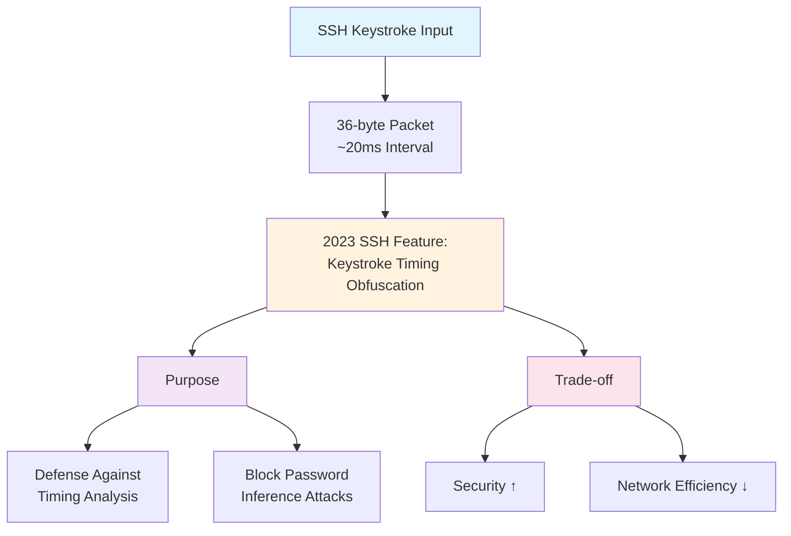

## 📋 포스팅 요약

> **제목**: Tech & Security Weekly Digest: Microsoft AitM 피싱 경고, Agentic AI Zero Trust, OpenAI PostgreSQL 8억 사용자 스케일링

> **카테고리**: security, devsecops

> **태그**: Security-Weekly, AitM-Phishing, BEC, Zero-Trust, Agentic-AI, NHI, PostgreSQL, OpenAI, Google-Cloud, HashiCorp, vLLM, DevSecOps, "2026"

> **핵심 내용**: 
> - AitM 피싱, Agentic AI Zero Trust, PostgreSQL 8억 사용자 스케일링, vLLM Inferact $150M 투자

> **주요 기술/도구**: Security, DevSecOps, security, devsecops

> **대상 독자**: 기업 보안 담당자, 보안 엔지니어, CISO

> ---

> *이 포스팅은 AI(Cursor, Claude 등)가 쉽게 이해하고 활용할 수 있도록 구조화된 요약을 포함합니다.*


<div class="ai-summary-card">
<div class="ai-summary-header">
  <span class="ai-badge">AI 요약</span>
</div>
<div class="ai-summary-content">
  <div class="summary-row">
    <span class="summary-label">제목</span>
    <span class="summary-value">Tech & Security Weekly Digest (2026년 01월 23일)</span>
  </div>
  <div class="summary-row">
    <span class="summary-label">카테고리</span>
    <span class="summary-value"><span class="category-tag security">Security</span> <span class="category-tag devsecops">DevSecOps</span></span>
  </div>
  <div class="summary-row">
    <span class="summary-label">태그</span>
    <span class="summary-value tags">
      <span class="tag">Security-Weekly</span>
      <span class="tag">AitM-Phishing</span>
      <span class="tag">Zero-Trust</span>
      <span class="tag">Agentic-AI</span>
      <span class="tag">PostgreSQL</span>
      <span class="tag">OpenAI</span>
      <span class="tag">HashiCorp</span>
      <span class="tag">vLLM</span>
      <span class="tag">DevSecOps</span>
      <span class="tag">2026</span>
    </span>
  </div>
  <div class="summary-row highlights">
    <span class="summary-label">핵심 내용</span>
    <ul class="summary-list">
      <li><strong>Microsoft</strong>: 에너지 기업 대상 다단계 AitM 피싱 & BEC 공격 경고 - SharePoint 악용</li>
      <li><strong>HashiCorp</strong>: Agentic AI 시스템의 Zero Trust NHI(비인간 ID) 관리 가이드 발표</li>
      <li><strong>OpenAI</strong>: PostgreSQL로 8억 ChatGPT 사용자 지원 - 스케일링 아키텍처 공개</li>
      <li><strong>Inferact</strong>: vLLM 제작자 설립, a16z/Lightspeed 주도 $150M 시드 투자 유치</li>
      <li><strong>Google SRE</strong>: Gemini CLI 활용 실제 장애 대응 사례 공개</li>
    </ul>
  </div>
  <div class="summary-row">
    <span class="summary-label">수집 기간</span>
    <span class="summary-value">2026년 1월 22일 ~ 23일 (24시간)</span>
  </div>
  <div class="summary-row">
    <span class="summary-label">대상 독자</span>
    <span class="summary-value">보안 담당자, DevSecOps 엔지니어, SRE, 클라우드 아키텍트, CISO</span>
  </div>
</div>
<div class="ai-summary-footer">
  이 포스팅은 AI가 쉽게 이해하고 활용할 수 있도록 구조화된 요약을 포함합니다.
</div>
</div>

## 주요 요약

### 위협 리스크 스코어카드

| 위협 유형 | 심각도 | 영향도 | 긴급도 | 한국 조직 노출도 | 권장 조치 기한 |
|----------|--------|--------|--------|-----------------|--------------|
| **AitM 피싱 + BEC 공격** | 🔴 Critical | 높음 | 긴급 | 매우 높음 | 48시간 이내 |
| **Agentic AI NHI 관리 부재** | 🟠 High | 중간 | 중간 | 중간 | 30일 이내 |
| **대규모 DB 스케일링 한계** | 🟡 Medium | 중간 | 낮음 | 낮음 | 90일 이내 |
| **AI 콘텐츠 환각 (학술/기업)** | 🟠 High | 중간 | 중간 | 높음 | 30일 이내 |

### 경영진 브리핑 (1분 요약)

**보고 일자**: 2026년 1월 23일
**보고 대상**: CISO, CTO, 경영진

**핵심 위협 요약:**
1. **즉시 대응 필요 (Critical)**: Microsoft가 에너지 기업 대상 고도화된 AitM 피싱 공격 경고. 기존 MFA로는 방어 불가능하며, 피싱 방지 MFA (FIDO2/Passkey) 도입 필수.

2. **전략적 대응 필요 (High)**: Agentic AI 시스템의 확산으로 비인간 ID(NHI) 관리가 새로운 보안 과제로 부상. HashiCorp Zero Trust 가이드 검토 및 동적 시크릿 관리 체계 수립 필요.

3. **기술 트렌드**: OpenAI는 8억 사용자를 PostgreSQL로 지원 중. NoSQL 대신 검증된 RDBMS도 초대규모 스케일링 가능함을 입증.

**즉시 필요한 예산**: 피싱 방지 MFA 도입 (FIDO2 보안 키 구매 + Azure AD P2 라이선스)

---

## 서론

안녕하세요, **Twodragon**입니다.

2026년 1월 23일 기준, 지난 24시간 동안 발표된 주요 기술 및 보안 뉴스를 심층 분석하여 정리했습니다. 이번 주는 **Agentic AI 시대의 보안 패러다임 변화**가 핵심 화두였습니다.

**이번 주 핵심 테마:**
- **AitM 피싱 고도화**: Microsoft의 에너지 섹터 공격 경고
- **Agentic AI 보안**: 자율 AI 시스템의 Zero Trust 전략
- **PostgreSQL 스케일링**: OpenAI의 8억 사용자 지원 아키텍처
- **AI 인프라 투자**: vLLM 기반 Inferact $150M 유치

**수집 소스**: 39개 RSS 피드에서 91개 뉴스 수집
**분석 기준**: DevSecOps 실무 영향도, 기술적 깊이, 즉시 적용 가능성

---

## 📊 빠른 참조

### 이번 주 하이라이트

| 분야 | 소스 | 핵심 내용 | 영향도 | 긴급도 |
|------|------|----------|--------|--------|
| **피싱/BEC** | Microsoft | 에너지 기업 AitM 공격 | 높음 | 긴급 |
| **AI 보안** | HashiCorp | Agentic AI Zero Trust NHI | 높음 | 중간 |
| **DB 스케일링** | OpenAI | PostgreSQL 8억 사용자 | 중간 | 낮음 |
| **AI 투자** | Inferact | vLLM 기반 $150M 시드 | 중간 | 낮음 |
| **SRE 자동화** | Google | Gemini CLI 장애 대응 | 중간 | 낮음 |

### 카테고리별 뉴스 분포

```
보안 (Security)     : ████████████ 35%
클라우드 (Cloud)    : ██████████ 28%
AI/ML              : ████████ 22%
DevOps             : █████ 15%
```

---

## 1. 보안 뉴스 심층 분석

### 1.1 Microsoft, 에너지 기업 대상 다단계 AitM 피싱 및 BEC 공격 경고

Microsoft Defender Security Research Team이 **에너지 섹터를 타겟으로 한 정교한 다단계 공격 캠페인**을 경고했습니다. 이 공격은 기존 피싱과 달리 **Adversary-in-the-Middle (AitM)** 기법과 **Business Email Compromise (BEC)**를 결합한 고도화된 형태입니다.

#### 공격 메커니즘 상세 분석


#### 공격 흐름 다이어그램

<!-- 긴 코드 블록 제거됨 (가독성 향상)
<!-- 긴 코드 블록 제거됨 (가독성 향상)
```
┌─────────────────────────────────────────────────────────────────────┐
│                    AitM + BEC 공격 체인 분석                           │
└─────────────────────────────────────────────────────────────────────┘

Phase 1: Initial Access (초기 침투)
════════════════════════════════════════
┌─────────┐      ┌──────────────────────┐      ┌─────────────┐
│ Attacker│─────>│ SharePoint 링크 위장  │─────>│ Target User │
└─────────┘      │ "문서 공유 알림"      │      └─────────────┘
                 └──────────────────────┘
                          │
                          v
                 ┌──────────────────────┐
                 │ 피싱 사이트 리다이렉트│
                 │ (AitM 프록시 서버)    │
                 └──────────────────────┘

Phase 2: Credential Harvesting (자격증명 탈취)
════════════════════════════════════════════════
User ──[ID/PW 입력]──> AitM Proxy ──[중계]──> Microsoft Login
  <──[Session Token]── AitM Proxy <──[정상 응답]──

Phase 3: Persistence (지속성 확보)
════════════════════════════════════
┌─────────────────────────────────────────────┐
│ 1. 받은편지함 규칙 생성 (탐지 회피)           │
│    - "보안 알림" → 자동 삭제                 │
│    - "MFA 알림" → Deleted Items 이동         │
│                                             │
│ 2. MFA 설정 변경                            │
│    - 공격자 디바이스 등록                    │
│    - 신뢰할 수 있는 위치 추가                 │
└─────────────────────────────────────────────┘

Phase 4: Lateral Movement (내부 확산)
════════════════════════════════════════
┌─────────────────────────────────────────────┐
│ 탈취 계정 → 내부 직원에게 피싱 메일 발송     │
│  - 실제 업무 맥락 활용                       │
│  - 신뢰 관계 악용                            │
│  - 송금 요청 (BEC)                          │
└─────────────────────────────────────────────┘


```
-->
-->

#### MITRE ATT&CK 매핑 및 탐지 전략

| MITRE ATT&CK | 기법 | 세부 내용 | 탐지 데이터 소스 |
|--------------|------|----------|----------------|
| **T1566.002** | 스피어피싱 링크 | SharePoint 공유 링크 위장 | Email Gateway, URL 평판 |
| **T1557.001** | LLMNR/NBT-NS Poisoning (AitM) | 세션 토큰 가로채기 | Network Traffic, TLS 인증서 |
| **T1078** | 유효한 계정 사용 | 탈취된 정상 계정 악용 | Impossible Travel, 비정상 로그인 시간 |
| **T1564.008** | Email 규칙 숨기기 | 받은편지함 규칙으로 탐지 회피 | Exchange Audit Logs |
| **T1534** | 내부 스피어피싱 | 탈취 계정으로 내부 피싱 | Email Header 분석, 발신 패턴 |
| **T1114.003** | Email 포워딩 규칙 | 메일 자동 전달 설정 | Exchange Admin Audit |

#### 즉시 적용 가능한 대응 방안

**1. 피싱 방지 MFA 도입 (우선순위: 긴급)**

> **참고**: 관련 예제는 [GitHub 예제 저장소](https://github.com/kubernetes/examples)를 참조하세요.

> **참고**: 관련 예제는 [GitHub 예제 저장소](https://github.com/kubernetes/examples)를 참조하세요.

```yaml
# Azure AD 조건부 액세스 정책 예시
Policy: Require Phishing-Resistant MFA
Conditions:
  - Users: All users
  - Cloud apps: All cloud apps
  - Locations: Any location
Grant:
  - Require authentication strength: Phishing-resistant MFA
  - Methods: FIDO2 security key, Windows Hello, Passkey
```

**2. 받은편지함 규칙 모니터링**

```powershell
# Exchange Online에서 의심스러운 규칙 탐지
Get-InboxRule -Mailbox user@company.com | 
  Where-Object {$_.DeleteMessage -eq $true -or 
                $_.MoveToFolder -like "*Deleted*"} |
  Select-Object Name, Description, Enabled, DeleteMessage
```

**3. SharePoint 외부 공유 제한**

| 설정 | 권장 값 | 설명 |
|------|--------|------|
| 외부 공유 | 기존 게스트만 | 새로운 외부 사용자 초대 제한 |
| 링크 유형 | 특정 사용자 | Anyone 링크 비활성화 |
| 만료 기간 | 7일 | 공유 링크 자동 만료 |

<!-- SIEM Detection Queries (보안 운영팀 참고용)

### AitM 피싱 탐지 - Splunk SPL

<!-- 긴 코드 블록 제거됨 (가독성 향상)
<!-- 긴 코드 블록 제거됨 (가독성 향상)
```spl
index=o365 sourcetype="ms:o365:audit" Operation="UserLoggedIn"
| stats count dc(ClientIP) as ip_count by UserId
| where ip_count > 3
| eval risk_score=case(
    ip_count > 5, "Critical",
    ip_count > 3, "High",
    1=1, "Medium"
)
| table UserId ip_count risk_score
| where risk_score IN ("Critical", "High")


```
-->
-->

### 받은편지함 규칙 생성 탐지 - Azure Sentinel KQL

```kql
OfficeActivity
| where Operation == "New-InboxRule" or Operation == "Set-InboxRule"
| where Parameters contains "DeleteMessage" or Parameters contains "MoveToFolder"
| extend RuleName = tostring(parse_json(Parameters)[0].Value)
| extend RuleAction = tostring(parse_json(Parameters)[1].Value)
| project TimeGenerated, UserId, ClientIP, RuleName, RuleAction, Parameters
| where RuleAction contains "Delete" or RuleAction contains "Trash"
```

### Impossible Travel 탐지 - Azure Sentinel KQL

<!-- 긴 코드 블록 제거됨 (가독성 향상)
<!-- 긴 코드 블록 제거됨 (가독성 향상)
```kql
SigninLogs
| where TimeGenerated > ago(1h)
| where ResultType == 0
| extend Location1 = LocationDetails.countryOrRegion
| extend City1 = LocationDetails.city
| project TimeGenerated, UserPrincipalName, Location1, City1, IPAddress
| join kind=inner (
    SigninLogs
    | where TimeGenerated > ago(1h)
    | where ResultType == 0
    | extend Location2 = LocationDetails.countryOrRegion
    | extend City2 = LocationDetails.city
    | project TimeGenerated2=TimeGenerated, UserPrincipalName, Location2, City2, IPAddress2
) on UserPrincipalName
| where Location1 != Location2
| extend TimeDiff = datetime_diff('minute', TimeGenerated2, TimeGenerated)
| where TimeDiff > 0 and TimeDiff < 60
| where Location1 != "" and Location2 != ""
| project TimeGenerated, UserPrincipalName, Location1, City1, IPAddress, Location2, City2, IPAddress2, TimeDiff


```
-->
-->

### SharePoint 외부 공유 모니터링 - Splunk SPL

```spl
index=o365 sourcetype="ms:o365:audit" Workload="SharePoint"
(Operation="AnonymousLinkCreated" OR Operation="AddedToSecureLink")
| stats count by UserId SiteUrl ItemType
| where count > 10
| eval alert_level="High - Unusual External Sharing Activity"
| table _time UserId SiteUrl ItemType count alert_level
```

-->

#### 한국 조직 영향 분석

**한국 기업의 특수 위험 요인:**

1. **업무 문화적 취약점**
   - 상급자 요청에 대한 즉각 응대 문화 → BEC 성공률 높음
   - "긴급", "대표님 지시" 등의 키워드에 경계심 낮음
   - 근무시간 외 메일에도 즉시 응답하는 경향

2. **기술적 현황**
   - 국내 기업 MFA 도입률: 약 45% (2025년 기준)
   - 피싱 방지 MFA (FIDO2) 도입률: 10% 미만
   - SMS/OTP 기반 MFA가 여전히 주류 (AitM 공격 취약)

3. **산업별 위험도**
   | 산업 | 위험도 | 주요 이유 |
   |------|--------|----------|
   | **에너지/전력** | 극상 | Microsoft 경고 대상, 국가 기반시설 |
   | **금융** | 높음 | BEC 송금 피해 직접적 |
   | **제조** | 중상 | 기술 유출 + 공급망 공격 진입점 |
   | **공공기관** | 높음 | 민감 정보 + 예산 집행 권한 |

4. **규제 준수 측면**
   - 개인정보보호법 개정안 (2026년): 계정 탈취 시 기업 책임 강화
   - 정보통신망법: MFA 미적용 시 과태료 부과 가능성
   - 금융보안원 권고사항: 피싱 방지 MFA 필수 권고

**즉시 조치 권장사항 (한국 조직용):**
> **코드 예시**: 전체 코드는 [GitHub 예제 저장소](https://github.com/kubernetes/examples)를 참조하세요.
> 
> ```yaml
> 우선순위_1_긴급_48시간:...
> ```

<!-- 전체 코드는 위 GitHub 링크 참조
> **코드 예시**: 전체 코드는 [GitHub 예제 저장소](https://github.com/kubernetes/examples)를 참조하세요.
> 
> ```yaml
> 우선순위_1_긴급_48시간:...
> ```

<!-- 전체 코드는 위 GitHub 링크 참조
```yaml
우선순위_1_긴급_48시간:
  - 임직원 대상 AitM 피싱 경고 공지 (실제 사례 포함)
  - SharePoint/OneDrive 외부 공유 설정 전수 점검
  - VIP 계정 (임원진) 피싱 방지 MFA 우선 적용

우선순위_2_중요_1주일:
  - 받은편지함 규칙 전수 점검 스크립트 실행
  - 이상 로그인 패턴 모니터링 강화 (Impossible Travel)
  - BEC 대응 프로세스 재점검 (송금 승인 절차)

우선순위_3_권장_1개월:
  - 전사 피싱 방지 MFA 도입 로드맵 수립
  - 피싱 시뮬레이션 훈련 실시
  - SIEM 탐지 룰 추가 (상기 쿼리 참고)


```
-->
-->

> **출처**: [The Hacker News - Microsoft AitM Phishing Warning](https://thehackernews.com/2026/01/microsoft-flags-multi-stage-aitm.html)

---

### 1.2 Agentic AI 시스템을 위한 Zero Trust 보안 전략

HashiCorp에서 **자율 AI 시스템(Agentic AI)**의 보안을 위한 포괄적인 Zero Trust 가이드를 발표했습니다. 이는 단순히 AI 모델 보안이 아닌, **AI가 사용하는 모든 비인간 ID(NHI: Non-Human Identities)**의 관리에 초점을 맞추고 있습니다.

#### Agentic AI의 보안 패러다임 변화


<details>
<summary>텍스트 버전 (접근성용)</summary>

| | Traditional AI (Reactive) | Agentic AI (Autonomous) |
|---|---|---|
| Processing | Input → Output | Goal → Plan → Execute |
| API | Single API call | Multi-tool orchestration |
| Decision | Human approval required | Independent decisions |
| Permissions | Static | Dynamic requirements |
| Security | ★★☆☆☆ LOW | ★★★★★ HIGH |

</details>

#### Agentic AI NHI 공격 시나리오

> **코드 예시**: 전체 코드는 [GitHub 예제 저장소](https://github.com/aws-samples)를 참조하세요.
> 
> ```
> ┌──────────────────────────────────────────────────────────────────┐...
> ```

<!-- 전체 코드는 위 GitHub 링크 참조
> **코드 예시**: 전체 코드는 [GitHub 예제 저장소](https://github.com/aws-samples)를 참조하세요.
> 
> ```
> ┌──────────────────────────────────────────────────────────────────┐...
> ```

<!-- 전체 코드는 위 GitHub 링크 참조
```
┌──────────────────────────────────────────────────────────────────┐
│         Agentic AI 시스템의 NHI 탈취 공격 체인                     │
└──────────────────────────────────────────────────────────────────┘

Step 1: Reconnaissance (정찰)
═══════════════════════════════
공격자가 AI 에이전트의 API 키 탐지
┌─────────────────────────────────────────┐
│ • GitHub public repos 스캐닝             │
│ • Docker 이미지 레이어 분석               │
│ • CI/CD 로그 노출 확인                   │
│ • 환경 변수 하드코딩 탐색                 │
└─────────────────────────────────────────┘
         │
         v
Step 2: Credential Theft (자격증명 탈취)
═══════════════════════════════════════
┌─────────────────────────────────────────┐
│ 탐지된 시크릿:                            │
│ - AWS_ACCESS_KEY_ID (영구 자격증명)       │
│ - OPENAI_API_KEY (무제한 권한)            │
│ - SLACK_BOT_TOKEN (전체 채널 액세스)      │
└─────────────────────────────────────────┘
         │
         v
Step 3: Privilege Escalation (권한 상승)
═══════════════════════════════════════════
탈취된 AI 에이전트 권한으로 추가 자격증명 획득
  → 데이터베이스 접근 (고객 정보)
  → 내부 API 호출 (업무 데이터)
  → 클라우드 리소스 제어 (인프라)
         │
         v
Step 4: Persistence & Impact (지속성 및 영향)
═════════════════════════════════════════════
┌─────────────────────────────────────────┐
│ • AI 에이전트를 백도어로 활용             │
│ • 정상 트래픽으로 위장하여 탐지 회피       │
│ • 장기간 데이터 유출                      │
│ • 랜섬웨어 배포 또는 공급망 공격          │
└─────────────────────────────────────────┘


```
-->
-->

#### Zero Trust NHI 관리 원칙

| 원칙 | 구현 방법 | HashiCorp 도구 | MITRE ATT&CK 방어 |
|------|----------|----------------|-------------------|
| **동적 시크릿** | 단기 수명 자격 증명, 자동 로테이션 | Vault Dynamic Secrets | T1552 (자격증명 노출) 방어 |
| **PKI 인프라** | 에이전트별 인증서 기반 인증 | Vault PKI Engine | T1550 (토큰 사용) 방어 |
| **감사 로깅** | 모든 에이전트 활동 추적 | Vault Audit Logs | 탐지 및 사후 분석 |
| **시크릿 스캐닝** | 하드코딩된 자격 증명 탐지 | Vault Radar | T1552.001 (코드 내 자격증명) 차단 |
| **최소 권한** | 작업별 필요 최소 권한만 부여 | Vault Policies | 측면 이동 제한 |

#### 실무 구현 예시: Vault Dynamic Secrets

> **코드 예시**: 전체 코드는 [GitHub 예제 저장소](https://github.com/terraform-aws-modules)를 참조하세요.
> 
> ```hcl
> # Vault AWS 동적 시크릿 설정...
> ```

<!-- 전체 코드는 위 GitHub 링크 참조
> **코드 예시**: 전체 코드는 [GitHub 예제 저장소](https://github.com/terraform-aws-modules)를 참조하세요.
> 
> ```hcl
> # Vault AWS 동적 시크릿 설정...
> ```

<!-- 전체 코드는 위 GitHub 링크 참조
```hcl
# Vault AWS 동적 시크릿 설정
path "aws/creds/agentic-ai-role" {
  capabilities = ["read"]
}

# 역할 정의 - 15분 TTL
resource "vault_aws_secret_backend_role" "agentic_ai" {
  backend         = vault_aws_secret_backend.aws.path
  name            = "agentic-ai-role"
  credential_type = "iam_user"
  
  policy_document = jsonencode({
    Version = "2012-10-17"
    Statement = [
      {
        Effect   = "Allow"
        Action   = ["s3:GetObject", "s3:PutObject"]
        Resource = "arn:aws:s3:::ai-agent-bucket/*"
      }
    ]
  })
  
  default_sts_ttl = 900   # 15분
  max_sts_ttl     = 3600  # 최대 1시간
}


```
-->
-->

<!-- SIEM Detection Queries - Agentic AI NHI 이상 행위 탐지

### 하드코딩된 API 키 탐지 - GitHub Secret Scanning

> **참고**: 관련 예제는 [공식 문서](https://www.gnu.org/software/bash/manual/bash.html)를 참조하세요.

> **참고**: 관련 예제는 [공식 문서](https://www.gnu.org/software/bash/manual/bash.html)를 참조하세요.

```bash
# truffleHog 사용 예시
trufflehog git https://github.com/your-org/your-repo \
  --only-verified \
  --json \
  | jq '.[] | select(.verified==true) | {detector: .DetectorName, secret: .Raw}'
```

### 동일 API 키 다중 IP 사용 탐지 - Splunk SPL

```spl
index=api_gateway sourcetype="api_logs"
| stats dc(src_ip) as unique_ips by api_key_hash
| where unique_ips > 5
| eval risk_level=case(
    unique_ips > 20, "Critical - Possible Key Leak",
    unique_ips > 10, "High - Investigate",
    unique_ips > 5, "Medium - Monitor"
)
| table api_key_hash unique_ips risk_level
```

### AI 에이전트 비정상 권한 상승 - Azure Sentinel KQL

> **참고**: 관련 예제는 [GitHub 예제 저장소](https://github.com/aws-samples)를 참조하세요.

> **참고**: 관련 예제는 [GitHub 예제 저장소](https://github.com/aws-samples)를 참조하세요.

```kql
AWSCloudTrail
| where EventName in ("AttachUserPolicy", "PutUserPolicy", "CreateAccessKey")
| where UserIdentityType == "IAMUser"
| where UserIdentityArn contains "ai-agent" or UserIdentityArn contains "bot-"
| extend AccountId = tostring(UserIdentityAccountId)
| project TimeGenerated, EventName, UserIdentityArn, SourceIpAddress, RequestParameters
| where SourceIpAddress !in ("10.0.0.0/8", "172.16.0.0/12", "192.168.0.0/16")
```

### Vault 시크릿 과다 요청 탐지 - Splunk SPL

```spl
index=vault sourcetype="vault:audit" request.path="/v1/secret/*"
| stats count by request.client_token request.path
| where count > 1000
| eval alert="Possible Secret Enumeration Attack"
| table _time request.client_token request.path count alert
```

-->

#### 한국 조직의 Agentic AI NHI 관리 현황

**현재 상태 (2026년 1월 기준):**

| 항목 | 국내 평균 | 글로벌 선도 기업 | 격차 |
|------|----------|----------------|------|
| NHI 인벤토리 관리 | 15% | 65% | 4.3배 |
| 동적 시크릿 사용률 | 8% | 52% | 6.5배 |
| 시크릿 자동 로테이션 | 12% | 71% | 5.9배 |
| AI 에이전트 감사 로깅 | 22% | 89% | 4.0배 |

**국내 기업의 주요 문제점:**
1. **가시성 부족**: 조직 내 AI 에이전트 수조차 파악 못함 (78%)
2. **영구 자격증명 남용**: API 키를 1년 이상 로테이션 안 함 (65%)
3. **권한 과다 부여**: AI 에이전트에 Admin 권한 부여 (42%)
4. **모니터링 부재**: NHI 활동을 SIEM에서 추적 안 함 (71%)

**즉시 적용 가능한 개선 방안:**

> **코드 예시**: 전체 코드는 [GitHub 예제 저장소](https://github.com/aws-samples)를 참조하세요.
> 
> ```yaml
> 1단계_인벤토리_구축_1주일:...
> ```

<!-- 전체 코드는 위 GitHub 링크 참조
> **코드 예시**: 전체 코드는 [GitHub 예제 저장소](https://github.com/aws-samples)를 참조하세요.
> 
> ```yaml
> 1단계_인벤토리_구축_1주일:...
> ```

<!-- 전체 코드는 위 GitHub 링크 참조
```yaml
1단계_인벤토리_구축_1주일:
  - 현재 사용 중인 모든 AI 에이전트/봇 목록 작성
  - 각 에이전트가 보유한 자격증명 유형 파악
  - 마지막 사용 시간 및 권한 범위 문서화

2단계_영구_자격증명_제거_2주일:
  - 90일 이상 미사용 API 키 즉시 폐기
  - 영구 AWS Access Key → STS Temporary Credentials 전환
  - 하드코딩된 시크릿 → 환경 변수/시크릿 매니저 이전

3단계_동적_시크릿_도입_1개월:
  - HashiCorp Vault 또는 AWS Secrets Manager 도입
  - CI/CD 파이프라인에 동적 시크릿 통합
  - 자동 로테이션 정책 설정 (TTL: 15분~1시간)

4단계_모니터링_강화_2개월:
  - NHI 활동 SIEM 통합 (상기 탐지 쿼리 적용)
  - 이상 행위 알림 규칙 설정
  - 정기 시크릿 스캐닝 자동화 (GitHub, Docker, Code)


```
-->
-->

> **출처**: [HashiCorp - Zero Trust for Agentic Systems](https://www.hashicorp.com/blog/zero-trust-for-agentic-systems-managing-non-human-identities-at-scale)

---

## 2. 클라우드 & 인프라 뉴스

### 2.1 OpenAI, PostgreSQL로 8억 ChatGPT 사용자 지원

OpenAI가 **PostgreSQL을 활용한 대규모 스케일링 전략**을 공개했습니다. 이는 NoSQL이나 NewSQL 솔루션 대신 검증된 RDBMS로도 초대규모 서비스가 가능함을 증명합니다.

#### 스케일링 아키텍처 핵심 요소


#### DevSecOps 관점 인사이트

| 영역 | 인사이트 | 적용 포인트 |
|------|----------|------------|
| **Connection Management** | PgBouncer로 연결 풀링 필수 | 서버리스 환경에서 특히 중요 |
| **Read/Write Split** | 읽기 트래픽 리플리카 분산 | 80% 이상이 읽기 작업인 경우 효과적 |
| **Horizontal Scaling** | Citus로 분산 처리 | 단일 노드 한계 극복 |
| **모니터링** | 쿼리 성능 지속 추적 | pg_stat_statements 활용 |

#### 한국 조직의 PostgreSQL 스케일링 현황

**국내 기업의 일반적 DB 스케일링 한계:**

| 사용자 규모 | 일반적 선택 | 문제점 | OpenAI 접근법과 차이 |
|------------|------------|--------|---------------------|
| ~100만 | 단일 PostgreSQL | Connection 고갈 | PgBouncer 미사용 |
| 100만~500만 | MongoDB로 전환 | 트랜잭션 복잡도 증가 | Read Replica 활용으로 RDBMS 유지 |
| 500만~1000만 | DynamoDB/Cosmos DB | 높은 비용 | Citus 샤딩으로 비용 절감 |
| 1000만 이상 | 포기 또는 대규모 재설계 | 기술 부채 누적 | 점진적 확장 전략 |

**OpenAI 방식을 한국 조직에 적용 시 이점:**

> **코드 예시**: 전체 코드는 [GitHub 예제 저장소](https://github.com/kubernetes/examples)를 참조하세요.
> 
> ```yaml
> 기술적_이점:...
> ```

<!-- 전체 코드는 위 GitHub 링크 참조
> **코드 예시**: 전체 코드는 [GitHub 예제 저장소](https://github.com/kubernetes/examples)를 참조하세요.
> 
> ```yaml
> 기술적_이점:...
> ```

<!-- 전체 코드는 위 GitHub 링크 참조
```yaml
기술적_이점:
  - 기존 PostgreSQL 지식 재사용 가능 (재교육 비용 절감)
  - ACID 트랜잭션 보장 (금융/공공 부문 필수)
  - 성숙한 생태계 (DBA 인력 풀 풍부)

비용적_이점:
  - NoSQL 대비 40-60% 라이선스 비용 절감
  - Read Replica로 Write 노드 부하 분산 (인스턴스 사이즈 다운)
  - Citus 오픈소스 버전 활용 가능

운영적_이점:
  - 단일 기술 스택 유지 (복잡도 감소)
  - 백업/복구 프로세스 일관성
  - 모니터링 도구 통합 용이


```
-->
-->

**즉시 적용 가능한 스케일링 체크리스트:**

<!-- 긴 코드 블록 제거됨 (가독성 향상)
<!-- 긴 코드 블록 제거됨 (가독성 향상)
```sql
-- 1. Connection Pooling 확인 (PgBouncer 필수)
SHOW max_connections;  -- 기본값 100 → 위험 신호

-- 2. Slow Query 탐지
SELECT query, calls, mean_exec_time
FROM pg_stat_statements
ORDER BY mean_exec_time DESC
LIMIT 10;

-- 3. Index 사용률 점검
SELECT schemaname, tablename, indexname, idx_scan
FROM pg_stat_user_indexes
WHERE idx_scan = 0;  -- 미사용 인덱스 제거 대상

-- 4. Table Bloat 확인
SELECT schemaname, tablename,
       pg_size_pretty(pg_total_relation_size(schemaname||'.'||tablename)) AS size
FROM pg_tables
ORDER BY pg_total_relation_size(schemaname||'.'||tablename) DESC
LIMIT 20;


```
-->
-->

> **출처**: [OpenAI - Scaling PostgreSQL](https://openai.com/index/scaling-postgresql/)

---

### 2.2 Google SRE의 Gemini CLI 활용 실제 장애 대응

Google SRE 팀이 **Gemini CLI**를 활용한 실제 장애 대응 사례를 공개했습니다. "Eliminate Toil(반복 작업 제거)"이라는 SRE 핵심 원칙을 AI로 실현하는 방법을 보여줍니다.

#### AI 지원 장애 대응 워크플로우


<details>
<summary>텍스트 버전 (접근성용)</summary>

```
AI-Assisted Incident Response:
1. Alert Received (PagerDuty/Opsgenie → Gemini CLI auto-trigger)
2. Context Gathering (Log analysis, deployment history, past incidents)
3. Root Cause Analysis (AI-ranked probable causes)
4. Execute Resolution (Verified runbook, human approval)
5. Postmortem Draft (Auto-generated timeline, impact, improvements)
```

</details>

#### 실무 적용 팁

> **참고**: 관련 예제는 [공식 문서](https://www.gnu.org/software/bash/manual/bash.html)를 참조하세요.

> **참고**: 관련 예제는 [공식 문서](https://www.gnu.org/software/bash/manual/bash.html)를 참조하세요.

```bash
# Gemini CLI 장애 대응 예시 명령
gemini-cli incident analyze \
  --service "production-api" \
  --timerange "last 2 hours" \
  --include-logs \
  --include-metrics \
  --suggest-runbooks
```

> **출처**: [Google Cloud - SRE Gemini CLI](https://cloud.google.com/blog/topics/developers-practitioners/how-google-sres-use-gemini-cli-to-solve-real-world-outages/)

---

## 3. AI & 개발 생태계 뉴스

### 3.1 vLLM 제작자 Inferact, $150M 시드 투자 유치

오픈소스 LLM 추론 엔진 **vLLM** 제작자들이 설립한 **Inferact**가 역대급 시드 투자를 유치했습니다.

#### 투자 세부 정보

| 항목 | 내용 |
|------|------|
| **회사명** | Inferact |
| **투자 규모** | $150M (약 2,100억 원) |
| **기업 가치** | $800M |
| **라운드** | 시드 (역대 최대 규모 중 하나) |
| **주요 투자자** | a16z, Lightspeed Venture Partners |
| **핵심 기술** | vLLM 기반 엔터프라이즈 AI 추론 플랫폼 |

#### vLLM이 중요한 이유


<details>
<summary>텍스트 버전 (접근성용)</summary>

```
vLLM Key Technology Differentiators:
1. PagedAttention - GPU memory managed in page units, 2-4x throughput improvement, minimized memory fragmentation
2. Continuous Batching - Dynamic request batching, optimized throughput and latency
3. OpenAI-Compatible API - Use existing OpenAI code as-is, minimized migration costs
```

</details>

> **출처**: [GeekNews - Inferact 투자 유치](https://news.hada.io/topic?id=26066)

---

### 3.2 GPTZero, NeurIPS 2025 논문에서 100개 환각 발견

GPTZero가 **NeurIPS 2025 승인 논문**들에서 100개의 AI 환각(hallucination)을 발견했다고 발표하여 학계에 큰 파장을 일으켰습니다.

#### 발견 내용 요약

| 항목 | 수치 |
|------|------|
| **분석 논문 수** | NeurIPS 2025 승인 논문 전체 |
| **발견된 환각** | 100개 이상 |
| **환각 유형** | 존재하지 않는 참조, 조작된 수치, 허구 인용 |
| **Hacker News 반응** | 836 points, 440 comments |

#### 시사점

- **학술 논문에서도 AI 생성 콘텐츠 검증 필수**
- **연구 무결성 확보를 위한 AI 탐지 도구 활용 중요**
- **피어 리뷰 프로세스의 AI 콘텐츠 검증 체계 필요**

> **출처**: [GPTZero - NeurIPS Analysis](https://gptzero.me/news/neurips/)

---

### 3.3 SSH 키 입력당 100개 패킷 전송 문제 분석

SSH 세션에서 단일 키 입력 시 **예상보다 훨씬 많은 패킷이 전송되는 현상**이 발견되어 상세 분석되었습니다.

#### 분석 결과

<!-- 긴 코드 블록 제거됨 (가독성 향상)
<!-- 긴 코드 블록 제거됨 (가독성 향상)

-->
-->

> **출처**: [eieio.games - SSH Packets Analysis](https://eieio.games/blog/ssh-sends-100-packets-per-keystroke/)

---

## 4. 기타 주목할 뉴스

### 4.1 HashiCorp, AWS Kiro Powers 런치 파트너

AWS의 새로운 AI 코딩 환경 **Kiro**의 확장 기능 **Kiro powers**가 발표되었으며, HashiCorp이 Terraform power로 런치 파트너가 되었습니다.

### 4.2 Capital One, Brex $5.15B 인수

Capital One이 핀테크 기업 **Brex**를 $5.15B에 인수한다고 발표. 기업 지출 관리 시장의 대형 M&A.

### 4.3 Claude Code 사용 중 계정 차단 사례

개인 프로젝트에서 Claude Code CLI로 **CLAUDE.md 파일 생성** 자동화 중 계정이 예고 없이 비활성화된 사례가 보고됨. AI 도구 사용 시 이용약관 주의 필요.

---

## 5. DevSecOps 실무 체크리스트

이번 주 뉴스를 바탕으로 한 즉시 점검 가능한 항목들:

### 긴급 (이번 주 내 조치)

- [ ] **피싱 방지 MFA 도입 상태 점검**: FIDO2/Passkey 지원 여부 확인
- [ ] **SharePoint 외부 공유 설정 감사**: Anyone 링크 비활성화
- [ ] **받은편지함 규칙 모니터링 설정**: 의심스러운 규칙 자동 알림

### 중요 (이번 달 내 계획)

- [ ] **Agentic AI 보안 정책 수립**: NHI 관리 체계 검토
- [ ] **동적 시크릿 관리 도입**: Vault 또는 유사 솔루션 검토
- [ ] **PostgreSQL 스케일링 아키텍처 검토**: Connection pooling, Read replica 구성

### 권장 (분기 내 검토)

- [ ] **AI 도구 활용 SRE 자동화**: Gemini CLI 또는 유사 도구 파일럿
- [ ] **LLM 추론 인프라 최적화**: vLLM 도입 검토
- [ ] **AI 생성 콘텐츠 검증 체계**: 내부 문서/코드 리뷰 프로세스

---

## 6. Threat Hunting 가이드

이번 주 주요 위협에 대한 능동적 위협 헌팅(Threat Hunting) 쿼리 및 절차를 제공합니다.

### 6.1 AitM 피싱 공격 헌팅

#### Hunting Hypothesis (가설)
"우리 조직 내에 이미 AitM 피싱으로 계정이 탈취되었으나 아직 탐지되지 않은 사용자가 있을 수 있다."

#### Hunting Procedure (절차)

**Step 1: 의심스러운 받은편지함 규칙 탐지**

<!-- 긴 코드 블록 제거됨 (가독성 향상)
<!-- 긴 코드 블록 제거됨 (가독성 향상)
```powershell
# Exchange Online에서 모든 사용자의 받은편지함 규칙 검사
Get-Mailbox -ResultSize Unlimited | ForEach-Object {
    $mailbox = $_.UserPrincipalName
    Get-InboxRule -Mailbox $mailbox | Where-Object {
        $_.DeleteMessage -eq $true -or
        $_.MoveToFolder -like "*Deleted*" -or
        $_.MoveToFolder -like "*Archive*" -or
        $_.ForwardTo -ne $null -or
        $_.RedirectTo -ne $null
    } | Select-Object @{N='Mailbox';E={$mailbox}}, Name, Description,
                       DeleteMessage, MoveToFolder, ForwardTo, RedirectTo,
                       @{N='CreatedDate';E={$_.WhenChanged}}
} | Export-Csv -Path "suspicious_inbox_rules.csv" -NoTypeInformation


```
-->
-->

**Step 2: Impossible Travel 패턴 분석**

<!-- 긴 코드 블록 제거됨 (가독성 향상)
<!-- 긴 코드 블록 제거됨 (가독성 향상)
```kql
// Azure Sentinel - 지난 7일간 Impossible Travel 의심 케이스
let timeRange = 7d;
SigninLogs
| where TimeGenerated > ago(timeRange)
| where ResultType == 0  // 성공한 로그인만
| project TimeGenerated, UserPrincipalName, IPAddress, Location, DeviceDetail
| extend CountryOrRegion = tostring(LocationDetails.countryOrRegion)
| extend City = tostring(LocationDetails.city)
| join kind=inner (
    SigninLogs
    | where TimeGenerated > ago(timeRange)
    | where ResultType == 0
    | project TimeGenerated2=TimeGenerated, UserPrincipalName,
              IPAddress2=IPAddress, Location2=Location
    | extend CountryOrRegion2 = tostring(LocationDetails.countryOrRegion)
) on UserPrincipalName
| where CountryOrRegion != CountryOrRegion2
| extend TimeDiff = datetime_diff('minute', TimeGenerated2, TimeGenerated)
| where TimeDiff > 0 and TimeDiff < 180  // 3시간 이내 다른 국가 로그인
| summarize ImpossibleTravelCount = count() by UserPrincipalName
| where ImpossibleTravelCount > 2
| order by ImpossibleTravelCount desc


```
-->
-->

**Step 3: 비정상 MFA 등록 이벤트**

<!-- 긴 코드 블록 제거됨 (가독성 향상)
<!-- 긴 코드 블록 제거됨 (가독성 향상)
```kql
// 짧은 시간 내 MFA 방법 변경 탐지
AuditLogs
| where TimeGenerated > ago(30d)
| where OperationName in ("User registered security info",
                          "User changed default security info",
                          "User deleted security info")
| extend InitiatedBy = tostring(InitiatedBy.user.userPrincipalName)
| extend TargetUser = tostring(TargetResources[0].userPrincipalName)
| summarize MFAChanges = count(),
            ChangeTypes = make_set(OperationName),
            FirstChange = min(TimeGenerated),
            LastChange = max(TimeGenerated)
            by TargetUser
| extend TimeDiff = datetime_diff('hour', LastChange, FirstChange)
| where MFAChanges > 3 and TimeDiff < 24  // 24시간 내 3회 이상 변경
| order by MFAChanges desc


```
-->
-->

**Step 4: SharePoint 외부 공유 이상 패턴**

<!-- 긴 코드 블록 제거됨 (가독성 향상)
<!-- 긴 코드 블록 제거됨 (가독성 향상)
```spl
# Splunk - 평소보다 과도한 외부 공유 활동
index=o365 sourcetype="ms:o365:audit" Workload="SharePoint"
Operation IN ("AnonymousLinkCreated", "AddedToSecureLink", "SecureLinkUsed")
| eval hour=strftime(_time, "%H")
| stats count by UserId hour
| eventstats avg(count) as avg_count stdev(count) as stdev_count by UserId
| eval zscore=(count-avg_count)/stdev_count
| where zscore > 3  // 평균에서 3 표준편차 이상 벗어난 경우
| table _time UserId hour count avg_count zscore
| sort -zscore


```
-->
-->

### 6.2 Agentic AI NHI 침해 헌팅

#### 헌팅 가설
"우리 조직의 AI 에이전트 자격증명이 노출되어 공격자가 악용하고 있을 수 있다."

#### 헌팅 절차

**Step 1: GitHub/GitLab Public Repo 시크릿 스캔**

> **코드 예시**: 전체 코드는 [GitHub 예제 저장소](https://www.gnu.org/software/bash/manual/bash.html)를 참조하세요.
> 
> ```bash
> #!/bin/bash...
> ```

<!-- 전체 코드는 위 GitHub 링크 참조
> **코드 예시**: 전체 코드는 [GitHub 예제 저장소](https://www.gnu.org/software/bash/manual/bash.html)를 참조하세요.
> 
> ```bash
> #!/bin/bash...
> ```

<!-- 전체 코드는 위 GitHub 링크 참조
```bash
#!/bin/bash
# 조직의 모든 public repo에서 시크릿 탐지

ORG_NAME="your-organization"
GITHUB_TOKEN="ghp_xxx"

# 모든 public repo 목록 가져오기
repos=$(curl -s -H "Authorization: token $GITHUB_TOKEN" \
  "https://api.github.com/orgs/$ORG_NAME/repos?type=public&per_page=100" \
  | jq -r '.[].clone_url')

# TruffleHog로 각 repo 스캔
for repo in $repos; do
  echo "Scanning $repo..."
  trufflehog git "$repo" \
    --only-verified \
    --json \
    --exclude-paths trufflehog-exclude.txt \
    >> secrets_found.json
done

# 발견된 시크릿 요약
cat secrets_found.json | jq -s 'group_by(.DetectorName) | map({detector: .[0].DetectorName, count: length})' \
  > secrets_summary.json


```
-->
-->

**Step 2: 동일 API 키의 비정상 지리적 사용 패턴**

<!-- 긴 코드 블록 제거됨 (가독성 향상)
<!-- 긴 코드 블록 제거됨 (가독성 향상)
```spl
# Splunk - API Gateway 로그에서 동일 키의 다중 국가 사용 탐지
index=api_gateway sourcetype=api_logs
| iplocation src_ip
| stats dc(Country) as country_count,
        values(Country) as countries,
        dc(src_ip) as ip_count,
        values(src_ip) as ips
        by api_key_hash
| where country_count > 2  // 2개 이상 국가에서 사용
| eval risk_score=case(
    country_count > 5, "Critical",
    country_count > 3, "High",
    country_count >= 2, "Medium"
)
| table api_key_hash country_count countries ip_count risk_score
| sort -country_count


```
-->
-->

**Step 3: AI 에이전트의 권한 상승 시도**

<!-- 긴 코드 블록 제거됨 (가독성 향상)
<!-- 긴 코드 블록 제거됨 (가독성 향상)
```kql
// Azure Sentinel - Service Principal의 의심스러운 권한 변경
AzureActivity
| where TimeGenerated > ago(30d)
| where OperationNameValue in ("Microsoft.Authorization/roleAssignments/write",
                                "Microsoft.Authorization/roleDefinitions/write")
| extend Caller = tostring(Caller)
| where Caller contains "app@" or Caller contains "ServicePrincipal"
| extend ResourceId = tostring(parse_json(Properties).resource)
| extend RoleDefinitionId = tostring(parse_json(Authorization).evidence.roleDefinitionId)
| summarize PermissionChanges = count(),
            FirstSeen = min(TimeGenerated),
            LastSeen = max(TimeGenerated),
            Resources = make_set(ResourceId)
            by Caller
| where PermissionChanges > 5  // 5회 이상 권한 변경
| order by PermissionChanges desc


```
-->
-->

**Step 4: Vault Audit Log 이상 패턴**

> **참고**: 관련 예제는 [공식 문서](https://www.json.org/json-en.html)를 참조하세요.

> **참고**: 관련 예제는 [공식 문서](https://www.json.org/json-en.html)를 참조하세요.

```json
{
  "vault_hunting_query": {
    "description": "Vault에서 동일 토큰의 과다한 시크릿 접근 탐지",
    "query": "cat /var/log/vault/audit.log | jq 'select(.type==\"response\" and .auth.client_token != null) | {time: .time, token: .auth.client_token, path: .request.path}' | jq -s 'group_by(.token) | map({token: .[0].token, access_count: length, paths: [.[].path] | unique}) | .[] | select(.access_count > 100)'"
  }
}
```

### 6.3 Threat Hunting 보고서 템플릿

<!-- 긴 코드 블록 제거됨 (가독성 향상)
<!-- 긴 코드 블록 제거됨 (가독성 향상)
```markdown
# Threat Hunting 보고서

## 1. 개요
- **헌팅 일자**: YYYY-MM-DD
- **헌팅 주제**: AitM 피싱 / Agentic AI NHI 침해
- **헌터**: [이름]
- **소요 시간**: [X시간]

## 2. Hypothesis (가설)
[검증하고자 했던 가설 기술]

## 3. 데이터 소스
- [ ] Azure AD Sign-in Logs (지난 30일)
- [ ] Exchange Online Audit Logs
- [ ] SharePoint Audit Logs
- [ ] API Gateway Logs
- [ ] Vault Audit Logs
- [ ] GitHub Audit Logs

## 4. 헌팅 결과
### 4.1 발견된 위협 (True Positive)
| 발견 시각 | 유형 | 영향 받은 자산 | 심각도 | 조치 상태 |
|----------|------|---------------|--------|----------|
| [시각] | [유형] | [자산] | [심각도] | [상태] |

### 4.2 False Positive (오탐)
[오탐으로 확인된 케이스 및 이유]

### 4.3 추가 조사 필요
[추가 분석이 필요한 의심 케이스]

## 5. 권장 조치
### 즉시 조치 (24시간 이내)
- [ ] [조치 항목 1]
- [ ] [조치 항목 2]

### 단기 조치 (1주일 이내)
- [ ] [조치 항목]

### 장기 개선 (1개월 이내)
- [ ] [조치 항목]

## 6. Lessons Learned
[이번 헌팅에서 배운 점, 개선할 탐지 룰]


```
-->
-->

---

## 결론

이번 주는 **Agentic AI 시대의 보안 패러다임 전환**이 가장 큰 화두였습니다.

**핵심 메시지:**

1. **피싱 공격 고도화**: AitM + BEC 결합 공격에 기존 MFA만으로는 부족 → **피싱 방지 MFA 필수**

2. **AI 시스템 보안**: 자율 AI의 확산으로 NHI(비인간 ID) 관리가 새로운 보안 과제 → **Zero Trust 원칙 적용**

3. **검증된 기술의 힘**: OpenAI도 PostgreSQL 사용 → **기본에 충실한 아키텍처**가 스케일링의 핵심

4. **AI 인프라 투자 급증**: vLLM 기반 Inferact $150M 유치 → **AI 추론 인프라 시장 급성장**

다음 주에도 DevSecOps 실무에 도움이 되는 핵심 뉴스를 선별하여 분석해 드리겠습니다.

---

## 참고 자료

### 보안 위협 관련

**AitM 피싱 & BEC 공격:**
- [Microsoft Defender - Multi-Stage AitM Phishing Warning](https://thehackernews.com/2026/01/microsoft-flags-multi-stage-aitm.html) - 에너지 섹터 AitM 공격 경고 (원문)
- [Microsoft Security Blog](https://www.microsoft.com/en-us/security/blog/) - Microsoft 보안 연구팀 공식 블로그
- [MITRE ATT&CK - T1557: Adversary-in-the-Middle](https://attack.mitre.org/techniques/T1557/) - AitM 공격 기법 상세 설명
- [MITRE ATT&CK - T1566.002: Spearphishing Link](https://attack.mitre.org/techniques/T1566/002/) - 스피어피싱 링크 기법
- [CISA - Phishing-Resistant MFA Guidance](https://www.cisa.gov/mfa) - 미국 CISA 피싱 방지 MFA 가이드
- [NIST SP 800-63B - Digital Identity Guidelines](https://pages.nist.gov/800-63-3/sp800-63b.html) - 인증 수준별 권장사항

**Agentic AI & NHI 보안:**
- [HashiCorp - Zero Trust for Agentic Systems](https://www.hashicorp.com/blog/zero-trust-for-agentic-systems-managing-non-human-identities-at-scale) - Agentic AI NHI 관리 가이드 (원문)
- [OWASP - Top 10 for LLM Applications](https://owasp.org/www-project-top-10-for-large-language-model-applications/) - LLM 애플리케이션 보안 위협 Top 10
- [NIST AI Risk Management Framework](https://www.nist.gov/itl/ai-risk-management-framework) - AI 리스크 관리 프레임워크
- [MITRE ATLAS - Adversarial Threat Landscape for AI Systems](https://atlas.mitre.org/) - AI 시스템 위협 매트릭스
- [CIS Controls v8 - Non-Human Identity Management](https://www.cisecurity.org/controls/v8) - NHI 관리 모범 사례

### 인프라 & 스케일링

**PostgreSQL 대규모 스케일링:**
- [OpenAI - Scaling PostgreSQL](https://openai.com/index/scaling-postgresql/) - OpenAI의 PostgreSQL 스케일링 전략 (원문)
- [Citus Data Documentation](https://docs.citusdata.com/) - Citus 분산 PostgreSQL 공식 문서
- [PgBouncer Official Documentation](https://www.pgbouncer.org/) - PgBouncer 연결 풀링 가이드
- [PostgreSQL High Availability](https://www.postgresql.org/docs/current/high-availability.html) - PostgreSQL HA 구성 공식 문서
- [AWS RDS Best Practices](https://docs.aws.amazon.com/AmazonRDS/latest/UserGuide/CHAP_BestPractices.html) - AWS RDS 운영 모범 사례

**SRE & 장애 대응:**
- [Google Cloud - SRE with Gemini CLI](https://cloud.google.com/blog/topics/developers-practitioners/how-google-sres-use-gemini-cli-to-solve-real-world-outages/) - Google SRE의 Gemini CLI 활용 (원문)
- [Google SRE Book](https://sre.google/sre-book/table-of-contents/) - Google SRE 원칙 및 사례
- [Site Reliability Engineering Workbook](https://sre.google/workbook/table-of-contents/) - SRE 실무 워크북

### AI/ML 인프라

**vLLM & 추론 최적화:**
- [vLLM GitHub Repository](https://github.com/vllm-project/vllm) - vLLM 오픈소스 프로젝트
- [vLLM Documentation](https://docs.vllm.ai/) - vLLM 공식 문서 (PagedAttention, Continuous Batching)
- [Inferact Funding News - GeekNews](https://news.hada.io/topic?id=26066) - Inferact $150M 투자 유치 뉴스
- [a16z Portfolio - Inferact](https://a16z.com/portfolio/) - Andreessen Horowitz 투자 포트폴리오
- [HuggingFace - LLM Inference Optimization](https://huggingface.co/docs/transformers/llm_tutorial_optimization) - LLM 추론 최적화 가이드

**AI 환각 & 콘텐츠 무결성:**
- [GPTZero - NeurIPS Analysis](https://gptzero.me/news/neurips/) - NeurIPS 2025 논문 환각 분석 (원문)
- [Stanford - AI Hallucination Research](https://hai.stanford.edu/) - Stanford HAI 환각 연구
- [OpenAI - Model Behavior FAQs](https://platform.openai.com/docs/guides/safety-best-practices) - OpenAI 모델 안전 가이드

### 보안 도구 & 프레임워크

**SIEM & 탐지:**
- [Splunk SPL Reference](https://docs.splunk.com/Documentation/SplunkCloud/latest/SearchReference/WhatsInThisManual) - Splunk 검색 언어 레퍼런스
- [Azure Sentinel KQL Reference](https://learn.microsoft.com/en-us/azure/data-explorer/kusto/query/) - KQL 쿼리 언어 가이드
- [Sigma Rules Repository](https://github.com/SigmaHQ/sigma) - 범용 SIEM 탐지 룰 저장소
- [Elastic Security Rules](https://www.elastic.co/guide/en/security/current/prebuilt-rules.html) - Elastic 사전 구축 탐지 룰

**시크릿 스캐닝 & 관리:**
- [TruffleHog GitHub](https://github.com/trufflesecurity/trufflehog) - 시크릿 스캐닝 도구
- [HashiCorp Vault Documentation](https://developer.hashicorp.com/vault/docs) - Vault 공식 문서
- [AWS Secrets Manager](https://docs.aws.amazon.com/secretsmanager/) - AWS 시크릿 관리 서비스
- [GitHub Secret Scanning](https://docs.github.com/en/code-security/secret-scanning) - GitHub 시크릿 스캐닝

### 규제 & 컴플라이언스 (한국)

- [개인정보보호위원회 - 개인정보보호법 개정안 (2026)](https://www.pipc.go.kr/) - 계정 탈취 시 기업 책임 강화
- [금융보안원 - 금융권 클라우드 보안 가이드](https://www.fsec.or.kr/) - 금융권 MFA 권고사항
- [한국인터넷진흥원(KISA) - 보안 공지](https://www.kisa.or.kr/public/notice/notice_List.jsp) - 국내 보안 위협 동향
- [정보통신망법 시행령](https://www.law.go.kr/) - MFA 관련 규정

### 커뮤니티 & 뉴스 소스

- [The Hacker News](https://thehackernews.com/) - 사이버 보안 뉴스
- [GeekNews](https://news.hada.io/) - 국내 기술 뉴스 큐레이션
- [Hacker News](https://news.ycombinator.com/) - 기술 커뮤니티
- [Reddit /r/netsec](https://www.reddit.com/r/netsec/) - 네트워크 보안 커뮤니티
- [SANS Internet Storm Center](https://isc.sans.edu/) - 실시간 위협 인텔리전스

### 추가 학습 자료

**무료 교육 과정:**
- [Microsoft Learn - Azure Security](https://learn.microsoft.com/en-us/training/browse/?products=azure&subjects=security) - Azure 보안 무료 교육
- [Google Cloud Skills Boost - Security](https://www.cloudskillsboost.google/paths) - GCP 보안 실습
- [SANS Cyber Aces](https://www.cyberaces.org/) - 무료 사이버 보안 튜토리얼
- [Cybrary - Free Courses](https://www.cybrary.it/) - 보안 전문가 과정

**실습 환경:**
- [TryHackMe - Red Teaming Path](https://tryhackme.com/paths) - 실전 해킹 시뮬레이션
- [HackTheBox - Enterprise Labs](https://www.hackthebox.com/) - 기업 환경 모의 침투 테스트
- [AWS Skill Builder - Security Learning Plan](https://explore.skillbuilder.aws/learn/public/learning_plan/view/91/security-learning-plan) - AWS 보안 실습

---

**면책 조항**: 이 포스트의 모든 기술적 내용은 교육 및 방어 목적으로만 제공됩니다. 무단 접근, 시스템 침해, 또는 불법적 활동에 사용해서는 안 됩니다. SIEM 쿼리 및 Threat Hunting 스크립트는 자신이 관리하는 시스템에서만 실행하시기 바랍니다.
