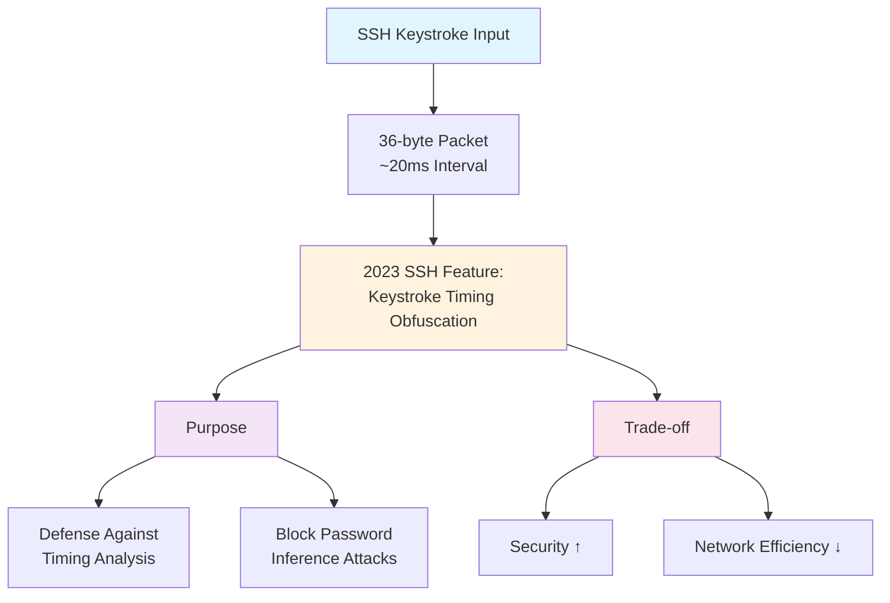

<div class="ai-summary-card">
<div class="ai-summary-header">
  <span class="ai-badge">AI 요약</span>
</div>
<div class="ai-summary-content">
  <div class="summary-row">
    <span class="summary-label">제목</span>
    <span class="summary-value">Tech & Security Weekly Digest (2026년 01월 23일)</span>
  </div>
  <div class="summary-row">
    <span class="summary-label">카테고리</span>
    <span class="summary-value"><span class="category-tag security">Security</span> <span class="category-tag devsecops">DevSecOps</span></span>
  </div>
  <div class="summary-row">
    <span class="summary-label">태그</span>
    <span class="summary-value tags">
      <span class="tag">Security-Weekly</span>
      <span class="tag">AitM-Phishing</span>
      <span class="tag">Zero-Trust</span>
      <span class="tag">Agentic-AI</span>
      <span class="tag">PostgreSQL</span>
      <span class="tag">OpenAI</span>
      <span class="tag">HashiCorp</span>
      <span class="tag">vLLM</span>
      <span class="tag">DevSecOps</span>
      <span class="tag">2026</span>
    </span>
  </div>
  <div class="summary-row highlights">
    <span class="summary-label">핵심 내용</span>
    <ul class="summary-list">
      <li><strong>Microsoft</strong>: 에너지 기업 대상 다단계 AitM 피싱 & BEC 공격 경고 - SharePoint 악용</li>
      <li><strong>HashiCorp</strong>: Agentic AI 시스템의 Zero Trust NHI(비인간 ID) 관리 가이드 발표</li>
      <li><strong>OpenAI</strong>: PostgreSQL로 8억 ChatGPT 사용자 지원 - 스케일링 아키텍처 공개</li>
      <li><strong>Inferact</strong>: vLLM 제작자 설립, a16z/Lightspeed 주도 $150M 시드 투자 유치</li>
      <li><strong>Google SRE</strong>: Gemini CLI 활용 실제 장애 대응 사례 공개</li>
    </ul>
  </div>
  <div class="summary-row">
    <span class="summary-label">수집 기간</span>
    <span class="summary-value">2026년 1월 22일 ~ 23일 (24시간)</span>
  </div>
  <div class="summary-row">
    <span class="summary-label">대상 독자</span>
    <span class="summary-value">보안 담당자, DevSecOps 엔지니어, SRE, 클라우드 아키텍트, CISO</span>
  </div>
</div>
<div class="ai-summary-footer">
  이 포스팅은 AI가 쉽게 이해하고 활용할 수 있도록 구조화된 요약을 포함합니다.
</div>
</div>

## 서론

안녕하세요, **Twodragon**입니다.

2026년 1월 23일 기준, 지난 24시간 동안 발표된 주요 기술 및 보안 뉴스를 심층 분석하여 정리했습니다. 이번 주는 **Agentic AI 시대의 보안 패러다임 변화**가 핵심 화두였습니다.

**이번 주 핵심 테마:**
- **AitM 피싱 고도화**: Microsoft의 에너지 섹터 공격 경고
- **Agentic AI 보안**: 자율 AI 시스템의 Zero Trust 전략
- **PostgreSQL 스케일링**: OpenAI의 8억 사용자 지원 아키텍처
- **AI 인프라 투자**: vLLM 기반 Inferact $150M 유치

**수집 소스**: 39개 RSS 피드에서 91개 뉴스 수집
**분석 기준**: DevSecOps 실무 영향도, 기술적 깊이, 즉시 적용 가능성

---

## 📊 빠른 참조

### 이번 주 하이라이트

| 분야 | 소스 | 핵심 내용 | 영향도 | 긴급도 |
|------|------|----------|--------|--------|
| **피싱/BEC** | Microsoft | 에너지 기업 AitM 공격 | 높음 | 긴급 |
| **AI 보안** | HashiCorp | Agentic AI Zero Trust NHI | 높음 | 중간 |
| **DB 스케일링** | OpenAI | PostgreSQL 8억 사용자 | 중간 | 낮음 |
| **AI 투자** | Inferact | vLLM 기반 $150M 시드 | 중간 | 낮음 |
| **SRE 자동화** | Google | Gemini CLI 장애 대응 | 중간 | 낮음 |

### 카테고리별 뉴스 분포

```
보안 (Security)     : ████████████ 35%
클라우드 (Cloud)    : ██████████ 28%
AI/ML              : ████████ 22%
DevOps             : █████ 15%
```

---

## 1. 보안 뉴스 심층 분석

### 1.1 Microsoft, 에너지 기업 대상 다단계 AitM 피싱 및 BEC 공격 경고

Microsoft Defender Security Research Team이 **에너지 섹터를 타겟으로 한 정교한 다단계 공격 캠페인**을 경고했습니다. 이 공격은 기존 피싱과 달리 **Adversary-in-the-Middle (AitM)** 기법과 **Business Email Compromise (BEC)**를 결합한 고도화된 형태입니다.

#### 공격 메커니즘 상세 분석


#### 공격 특징 및 TTP (Tactics, Techniques, Procedures)

| MITRE ATT&CK | 기법 | 세부 내용 |
|--------------|------|----------|
| **T1566.002** | 스피어피싱 링크 | SharePoint 공유 링크 위장 |
| **T1557** | Adversary-in-the-Middle | 세션 토큰 가로채기 |
| **T1564.008** | Email 규칙 숨기기 | 받은편지함 규칙으로 탐지 회피 |
| **T1534** | 내부 스피어피싱 | 탈취 계정으로 내부 피싱 |

#### 즉시 적용 가능한 대응 방안

**1. 피싱 방지 MFA 도입 (우선순위: 긴급)**

```yaml
# Azure AD 조건부 액세스 정책 예시
Policy: Require Phishing-Resistant MFA
Conditions:
  - Users: All users
  - Cloud apps: All cloud apps
  - Locations: Any location
Grant:
  - Require authentication strength: Phishing-resistant MFA
  - Methods: FIDO2 security key, Windows Hello, Passkey
```

**2. 받은편지함 규칙 모니터링**

```powershell
# Exchange Online에서 의심스러운 규칙 탐지
Get-InboxRule -Mailbox user@company.com | 
  Where-Object {$_.DeleteMessage -eq $true -or 
                $_.MoveToFolder -like "*Deleted*"} |
  Select-Object Name, Description, Enabled, DeleteMessage
```

**3. SharePoint 외부 공유 제한**

| 설정 | 권장 값 | 설명 |
|------|--------|------|
| 외부 공유 | 기존 게스트만 | 새로운 외부 사용자 초대 제한 |
| 링크 유형 | 특정 사용자 | Anyone 링크 비활성화 |
| 만료 기간 | 7일 | 공유 링크 자동 만료 |

> **출처**: [The Hacker News - Microsoft AitM Phishing Warning](https://thehackernews.com/2026/01/microsoft-flags-multi-stage-aitm.html)

---

### 1.2 Agentic AI 시스템을 위한 Zero Trust 보안 전략

HashiCorp에서 **자율 AI 시스템(Agentic AI)**의 보안을 위한 포괄적인 Zero Trust 가이드를 발표했습니다. 이는 단순히 AI 모델 보안이 아닌, **AI가 사용하는 모든 비인간 ID(NHI: Non-Human Identities)**의 관리에 초점을 맞추고 있습니다.

#### Agentic AI의 보안 패러다임 변화


<details>
<summary>텍스트 버전 (접근성용)</summary>

| | Traditional AI (Reactive) | Agentic AI (Autonomous) |
|---|---|---|
| Processing | Input → Output | Goal → Plan → Execute |
| API | Single API call | Multi-tool orchestration |
| Decision | Human approval required | Independent decisions |
| Permissions | Static | Dynamic requirements |
| Security | ★★☆☆☆ LOW | ★★★★★ HIGH |

</details>

#### Zero Trust NHI 관리 원칙

| 원칙 | 구현 방법 | HashiCorp 도구 |
|------|----------|----------------|
| **동적 시크릿** | 단기 수명 자격 증명, 자동 로테이션 | Vault Dynamic Secrets |
| **PKI 인프라** | 에이전트별 인증서 기반 인증 | Vault PKI Engine |
| **감사 로깅** | 모든 에이전트 활동 추적 | Vault Audit Logs |
| **시크릿 스캐닝** | 하드코딩된 자격 증명 탐지 | Vault Radar |
| **최소 권한** | 작업별 필요 최소 권한만 부여 | Vault Policies |

#### 실무 구현 예시: Vault Dynamic Secrets

```hcl
# Vault AWS 동적 시크릿 설정
path "aws/creds/agentic-ai-role" {
  capabilities = ["read"]
}

# 역할 정의 - 15분 TTL
resource "vault_aws_secret_backend_role" "agentic_ai" {
  backend         = vault_aws_secret_backend.aws.path
  name            = "agentic-ai-role"
  credential_type = "iam_user"
  
  policy_document = jsonencode({
    Version = "2012-10-17"
    Statement = [
      {
        Effect   = "Allow"
        Action   = ["s3:GetObject", "s3:PutObject"]
        Resource = "arn:aws:s3:::ai-agent-bucket/*"
      }
    ]
  })
  
  default_sts_ttl = 900   # 15분
  max_sts_ttl     = 3600  # 최대 1시간
}
```

> **출처**: [HashiCorp - Zero Trust for Agentic Systems](https://www.hashicorp.com/blog/zero-trust-for-agentic-systems-managing-non-human-identities-at-scale)

---

## 2. 클라우드 & 인프라 뉴스

### 2.1 OpenAI, PostgreSQL로 8억 ChatGPT 사용자 지원

OpenAI가 **PostgreSQL을 활용한 대규모 스케일링 전략**을 공개했습니다. 이는 NoSQL이나 NewSQL 솔루션 대신 검증된 RDBMS로도 초대규모 서비스가 가능함을 증명합니다.

#### 스케일링 아키텍처 핵심 요소


#### DevSecOps 관점 인사이트

| 영역 | 인사이트 | 적용 포인트 |
|------|----------|------------|
| **Connection Management** | PgBouncer로 연결 풀링 필수 | 서버리스 환경에서 특히 중요 |
| **Read/Write Split** | 읽기 트래픽 리플리카 분산 | 80% 이상이 읽기 작업인 경우 효과적 |
| **Horizontal Scaling** | Citus로 분산 처리 | 단일 노드 한계 극복 |
| **모니터링** | 쿼리 성능 지속 추적 | pg_stat_statements 활용 |

> **출처**: [OpenAI - Scaling PostgreSQL](https://openai.com/index/scaling-postgresql/)

---

### 2.2 Google SRE의 Gemini CLI 활용 실제 장애 대응

Google SRE 팀이 **Gemini CLI**를 활용한 실제 장애 대응 사례를 공개했습니다. "Eliminate Toil(반복 작업 제거)"이라는 SRE 핵심 원칙을 AI로 실현하는 방법을 보여줍니다.

#### AI 지원 장애 대응 워크플로우


<details>
<summary>텍스트 버전 (접근성용)</summary>

```
AI-Assisted Incident Response:
1. Alert Received (PagerDuty/Opsgenie → Gemini CLI auto-trigger)
2. Context Gathering (Log analysis, deployment history, past incidents)
3. Root Cause Analysis (AI-ranked probable causes)
4. Execute Resolution (Verified runbook, human approval)
5. Postmortem Draft (Auto-generated timeline, impact, improvements)
```

</details>

#### 실무 적용 팁

```bash
# Gemini CLI 장애 대응 예시 명령
gemini-cli incident analyze \
  --service "production-api" \
  --timerange "last 2 hours" \
  --include-logs \
  --include-metrics \
  --suggest-runbooks
```

> **출처**: [Google Cloud - SRE Gemini CLI](https://cloud.google.com/blog/topics/developers-practitioners/how-google-sres-use-gemini-cli-to-solve-real-world-outages/)

---

## 3. AI & 개발 생태계 뉴스

### 3.1 vLLM 제작자 Inferact, $150M 시드 투자 유치

오픈소스 LLM 추론 엔진 **vLLM** 제작자들이 설립한 **Inferact**가 역대급 시드 투자를 유치했습니다.

#### 투자 세부 정보

| 항목 | 내용 |
|------|------|
| **회사명** | Inferact |
| **투자 규모** | $150M (약 2,100억 원) |
| **기업 가치** | $800M |
| **라운드** | 시드 (역대 최대 규모 중 하나) |
| **주요 투자자** | a16z, Lightspeed Venture Partners |
| **핵심 기술** | vLLM 기반 엔터프라이즈 AI 추론 플랫폼 |

#### vLLM이 중요한 이유


<details>
<summary>텍스트 버전 (접근성용)</summary>

```
vLLM Key Technology Differentiators:
1. PagedAttention - GPU memory managed in page units, 2-4x throughput improvement, minimized memory fragmentation
2. Continuous Batching - Dynamic request batching, optimized throughput and latency
3. OpenAI-Compatible API - Use existing OpenAI code as-is, minimized migration costs
```

</details>

> **출처**: [GeekNews - Inferact 투자 유치](https://news.hada.io/topic?id=26066)

---

### 3.2 GPTZero, NeurIPS 2025 논문에서 100개 환각 발견

GPTZero가 **NeurIPS 2025 승인 논문**들에서 100개의 AI 환각(hallucination)을 발견했다고 발표하여 학계에 큰 파장을 일으켰습니다.

#### 발견 내용 요약

| 항목 | 수치 |
|------|------|
| **분석 논문 수** | NeurIPS 2025 승인 논문 전체 |
| **발견된 환각** | 100개 이상 |
| **환각 유형** | 존재하지 않는 참조, 조작된 수치, 허구 인용 |
| **Hacker News 반응** | 836 points, 440 comments |

#### 시사점

- **학술 논문에서도 AI 생성 콘텐츠 검증 필수**
- **연구 무결성 확보를 위한 AI 탐지 도구 활용 중요**
- **피어 리뷰 프로세스의 AI 콘텐츠 검증 체계 필요**

> **출처**: [GPTZero - NeurIPS Analysis](https://gptzero.me/news/neurips/)

---

### 3.3 SSH 키 입력당 100개 패킷 전송 문제 분석

SSH 세션에서 단일 키 입력 시 **예상보다 훨씬 많은 패킷이 전송되는 현상**이 발견되어 상세 분석되었습니다.

#### 분석 결과



> **출처**: [eieio.games - SSH Packets Analysis](https://eieio.games/blog/ssh-sends-100-packets-per-keystroke/)

---

## 4. 기타 주목할 뉴스

### 4.1 HashiCorp, AWS Kiro Powers 런치 파트너

AWS의 새로운 AI 코딩 환경 **Kiro**의 확장 기능 **Kiro powers**가 발표되었으며, HashiCorp이 Terraform power로 런치 파트너가 되었습니다.

### 4.2 Capital One, Brex $5.15B 인수

Capital One이 핀테크 기업 **Brex**를 $5.15B에 인수한다고 발표. 기업 지출 관리 시장의 대형 M&A.

### 4.3 Claude Code 사용 중 계정 차단 사례

개인 프로젝트에서 Claude Code CLI로 **CLAUDE.md 파일 생성** 자동화 중 계정이 예고 없이 비활성화된 사례가 보고됨. AI 도구 사용 시 이용약관 주의 필요.

---

## 5. DevSecOps 실무 체크리스트

이번 주 뉴스를 바탕으로 한 즉시 점검 가능한 항목들:

### 긴급 (이번 주 내 조치)

- [ ] **피싱 방지 MFA 도입 상태 점검**: FIDO2/Passkey 지원 여부 확인
- [ ] **SharePoint 외부 공유 설정 감사**: Anyone 링크 비활성화
- [ ] **받은편지함 규칙 모니터링 설정**: 의심스러운 규칙 자동 알림

### 중요 (이번 달 내 계획)

- [ ] **Agentic AI 보안 정책 수립**: NHI 관리 체계 검토
- [ ] **동적 시크릿 관리 도입**: Vault 또는 유사 솔루션 검토
- [ ] **PostgreSQL 스케일링 아키텍처 검토**: Connection pooling, Read replica 구성

### 권장 (분기 내 검토)

- [ ] **AI 도구 활용 SRE 자동화**: Gemini CLI 또는 유사 도구 파일럿
- [ ] **LLM 추론 인프라 최적화**: vLLM 도입 검토
- [ ] **AI 생성 콘텐츠 검증 체계**: 내부 문서/코드 리뷰 프로세스

---

## 결론

이번 주는 **Agentic AI 시대의 보안 패러다임 전환**이 가장 큰 화두였습니다.

**핵심 메시지:**

1. **피싱 공격 고도화**: AitM + BEC 결합 공격에 기존 MFA만으로는 부족 → **피싱 방지 MFA 필수**

2. **AI 시스템 보안**: 자율 AI의 확산으로 NHI(비인간 ID) 관리가 새로운 보안 과제 → **Zero Trust 원칙 적용**

3. **검증된 기술의 힘**: OpenAI도 PostgreSQL 사용 → **기본에 충실한 아키텍처**가 스케일링의 핵심

4. **AI 인프라 투자 급증**: vLLM 기반 Inferact $150M 유치 → **AI 추론 인프라 시장 급성장**

다음 주에도 DevSecOps 실무에 도움이 되는 핵심 뉴스를 선별하여 분석해 드리겠습니다.

---

**참고 자료:**
- [Microsoft Defender Security Research Team](https://www.microsoft.com/en-us/security/blog/)
- [HashiCorp Blog](https://www.hashicorp.com/blog/)
- [OpenAI Blog](https://openai.com/blog/)
- [Google Cloud Blog](https://cloud.google.com/blog/)
- [The Hacker News](https://thehackernews.com/)
- [GeekNews](https://news.hada.io/)
- [Hacker News](https://news.ycombinator.com/)
