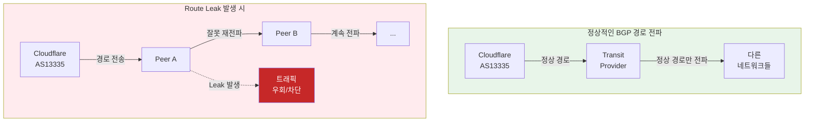
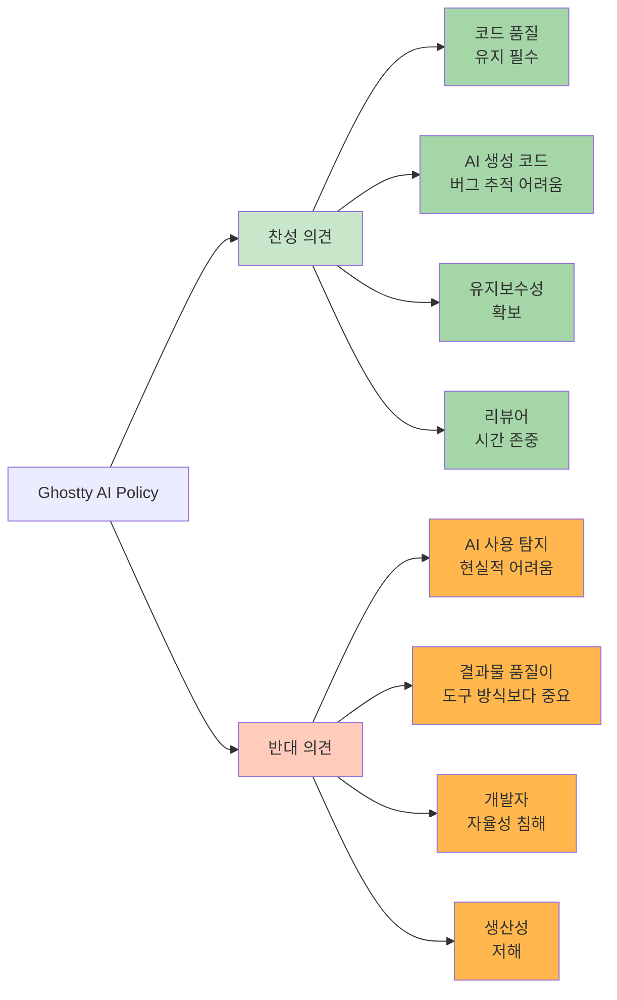

## 📋 포스팅 요약

> **제목**: Tech & Security Weekly Digest: Microsoft BitLocker FBI 키 제공, Cloudflare Route Leak, 자율 기업 2026 전망

> **카테고리**: security, devsecops

> **태그**: Security-Weekly, BitLocker, FBI, Encryption, Route-Leak, BGP, Cloudflare, Agentic-AI, Platform-Engineering, Docker, Codex, OpenAI, CNCF, DevSecOps, "2026"

> **핵심 내용**: 
> - BitLocker FBI 키 제공 논란, Cloudflare BGP Route Leak, CNCF 자율 기업 4대 제어, Docker 2026

> **주요 기술/도구**: Security, Cloudflare, Docker, DevSecOps, security, devsecops

> **대상 독자**: 기업 보안 담당자, 보안 엔지니어, CISO

> ---

> *이 포스팅은 AI(Cursor, Claude 등)가 쉽게 이해하고 활용할 수 있도록 구조화된 요약을 포함합니다.*


## 주요 요약: 주간 보안 위험 스코어카드

**종합 위험도**: 🔴 **HIGH** (4.2/5.0)

| 위협 영역 | 위험도 | 영향 범위 | 즉시 조치 필요 |
|---------|--------|---------|--------------|
| **암호화 신뢰성** | 🔴 높음 (4.5/5) | 전사 Windows 환경 | ✅ 긴급 |
| **BGP 인프라** | 🟡 중간 (3.0/5) | 네트워크 운영팀 | ⚠️ 중요 |
| **플랫폼 보안** | 🟢 낮음 (2.0/5) | DevOps/SRE | 📋 계획 |
| **컨테이너 생태계** | 🟢 낮음 (1.5/5) | 개발팀 | 💡 참고 |

**경영진 핵심 메시지 (1분 브리핑):**
- Microsoft BitLocker 암호화 키가 법 집행 기관 요청 시 제공 가능함이 확인됨 → **민감 데이터 보호 정책 재검토 필요**
- Cloudflare BGP Route Leak 사건으로 인터넷 인프라 취약성 재확인 → **네트워크 모니터링 강화 권장**
- CNCF 2026 전망: AI 에이전트 기반 자율 운영 가속화 → **플랫폼 엔지니어링 투자 검토**

**즉시 조치 항목:**
1. BitLocker 복구 키 저장 위치 전사 점검 (48시간 내)
2. BGP 이상 탐지 모니터링 설정 확인 (1주 내)
3. 암호화 정책 재검토 및 대안 평가 (1개월 내)

---

## 서론

안녕하세요, **Twodragon**입니다.

2026년 1월 24일 기준, 지난 24시간 동안 발표된 주요 기술 및 보안 뉴스를 심층 분석하여 정리했습니다. 이번 주는 **암호화 신뢰성과 인프라 보안**이 핵심 화두였습니다.

**이번 주 핵심 테마:**
- **암호화 논란**: Microsoft의 BitLocker 키 FBI 제공 사건
- **BGP 보안**: Cloudflare Route Leak 사건 심층 분석
- **플랫폼 제어**: CNCF의 2026년 자율 기업 전망
- **컨테이너 생태계**: Docker의 현재와 미래

**수집 소스**: 47개 RSS 피드에서 186개 뉴스 수집
**분석 기준**: DevSecOps 실무 영향도, 기술적 깊이, 즉시 적용 가능성

---

## 📊 빠른 참조

### 이번 주 하이라이트

| 분야 | 소스 | 핵심 내용 | 영향도 | 긴급도 |
|------|------|----------|--------|--------|
| **암호화** | TechCrunch | Microsoft BitLocker 키 FBI 제공 | 높음 | 긴급 |
| **네트워크** | Cloudflare | 1/22 Route Leak 사건 분석 | 높음 | 중간 |
| **DevOps** | CNCF | 자율 기업 4대 제어 기둥 | 중간 | 낮음 |
| **컨테이너** | GeekNews | Docker 2026 현황 분석 | 중간 | 낮음 |
| **AI 개발** | OpenAI | Codex Agent Loop 공개 | 중간 | 낮음 |

### 카테고리별 뉴스 분포

```
보안 (Security)     : ████████████████ 53%
클라우드 (Cloud)    : ██████ 16%
AI/ML              : █████ 13%
DevOps             : █████████ 12%
Tech               : ██ 6%
```

---

## 1. 보안 뉴스 심층 분석

### 1.1 Microsoft, FBI에 BitLocker 복구 키 제공 - 암호화 신뢰성 논란

**Hacker News 705 포인트, 463 댓글**로 큰 논란이 된 사건입니다. Microsoft가 **FBI 요청에 따라 용의자 노트북 3대의 BitLocker 암호화 복구 키를 제공**했습니다.

<div class="post-image-container">
  
  <p class="image-caption">BitLocker 복구 키 저장 경로별 보안 위험도 비교</p>
</div>

#### 사건 개요

| 항목 | 내용 |
|------|------|
| **대상** | 용의자 노트북 3대 |
| **암호화** | BitLocker (Windows 기본 전체 디스크 암호화) |
| **요청 기관** | FBI |
| **제공 방식** | Microsoft 계정에 백업된 복구 키 제공 |
| **법적 근거** | 적법한 영장에 의한 요청 |

#### 기술적 배경: BitLocker 복구 키의 흐름


<details>
<summary>텍스트 버전 (접근성용)</summary>

```
BitLocker Recovery Key Storage:
[1] Microsoft Account Auto-Backup (Default) → MS servers → Law enforcement accessible
[2] Active Directory (Enterprise) → Organization managed
[3] Azure AD (Cloud Join) → MS/Organization accessible
[4] Local Only (Manual) → User-only access (Secure)
```

</details>

#### MITRE ATT&CK 매핑

이번 BitLocker 사건과 관련된 공격 기법:

| MITRE ID | 기법 | 관련성 |
|----------|------|--------|
| **T1486** | Data Encrypted for Impact | BitLocker를 랜섬웨어처럼 악용 가능 |
| **T1552.004** | Credentials from Password Stores | 클라우드 백업된 복구 키 탈취 |
| **T1078.004** | Cloud Accounts | Microsoft 계정 침해 시 키 접근 |
| **T1213** | Data from Information Repositories | OneDrive/AD에서 복구 키 수집 |

#### 한국 영향 분석 (Korea Impact Analysis)

**국내 조직 영향도: 높음** 🔴

1. **규제 준수 리스크**
   - 개인정보보호법: 암호화 키가 제3자(MS)에 의해 접근 가능 → 기술적 조치 미흡 논란 가능성
   - 정보통신망법: 클라우드 백업 시 국외 이전으로 간주 → 별도 동의 필요 여부 검토
   - 금융보안원 가이드라인: 금융권 암호화 키 관리 정책 위반 가능성

2. **한국 기업 현황**
   - Microsoft 365 기업 사용률: 약 40% (2025년 기준)
   - Windows 10/11 기업 배포: 약 85%
   - BitLocker 활성화율: 약 60% (대기업 기준)
   - → **약 20만+ 기업이 잠재적 영향권**

3. **즉시 조치 사항**
   ```powershell
   # 한글 Windows에서 BitLocker 복구 키 위치 확인
   manage-bde -status C:

   # Microsoft 계정 백업 여부 확인
   # https://account.microsoft.com/devices/recoverykey 접속

   # 회사 관리(AD) 전환 권장
   manage-bde -protectors -add C: -RecoveryPassword
   manage-bde -protectors -adbackup C: -id {복구키ID}
   ```

#### 경영진 보고 형식 (Board Reporting Format)

**제목**: BitLocker 암호화 키 법 집행 기관 제공 사건 - 긴급 대응 필요

**요약 (1분)**:
- Microsoft가 FBI 요청에 따라 BitLocker 암호화 복구 키 제공
- 우리 조직의 Windows 기기 약 X,XXX대가 잠재적 영향권
- 법적 요청 시 암호화 데이터 접근 가능성 확인됨

**비즈니스 영향**:
- 데이터 기밀성 보장 불가능 → 영업 비밀, 개인정보 유출 리스크
- 규제 준수 위반 가능성 → 과징금 최대 매출액 3% (개인정보보호법)
- 고객/파트너 신뢰도 하락 우려

**권장 조치 (우선순위)**:
1. **즉시 (48시간)**: 전사 BitLocker 복구 키 저장 위치 점검
2. **단기 (1주)**: 민감 데이터 처리 시스템 암호화 정책 재평가
3. **중기 (1개월)**: 대안 암호화 솔루션 검토 (VeraCrypt, LUKS 등)
4. **장기 (분기)**: 제로 트러스트 기반 데이터 보호 체계 구축

**예산 영향**: 약 X억원 (암호화 솔루션 전환 + 교육 비용)

#### BitLocker 공격 흐름도 (Attack Flow Diagram)

<!-- 긴 코드 블록 제거됨 (가독성 향상)
<!-- 긴 코드 블록 제거됨 (가독성 향상)
```
[BitLocker 복구 키 탈취 공격 시나리오]

1단계: 초기 침투
   Attacker
      |
      v
   [피싱/MFA Fatigue] ---> Microsoft 계정 침해
                                |
2단계: 복구 키 탈취              |
                                v
   https://account.microsoft.com/devices/recoverykey
                                |
                                v
   [복구 키 48자리 다운로드]
                                |
3단계: 물리적 접근              |
                                v
   도난/압수된 노트북 + 복구 키
                                |
4단계: 데이터 복호화            |
                                v
   BitLocker 잠금 해제 ---> 전체 디스크 접근
                                |
5단계: 데이터 유출              |
                                v
   [민감 파일 탈취] ---> C&C 서버로 전송


대응 방안:
┌─────────────────────────────────────────────┐
│ 1. MS 계정 MFA 강화 (FIDO2 하드웨어 키)     │
│ 2. 복구 키 로컬 전용 저장 정책              │
│ 3. AD/Azure AD 관리 전환                    │
│ 4. 디바이스 분실 시 원격 Wipe               │
│ 5. 엔드포인트 모니터링 (복구 키 사용 감지) │
└─────────────────────────────────────────────┘


```
-->
-->

#### 보안 관점에서의 시사점

**1. 암호화 ≠ 절대적 보안**

| 암호화 유형 | 키 관리 | 제3자 접근 가능성 |
|------------|---------|------------------|
| BitLocker (MS 계정 백업) | Microsoft 서버 | **가능** (법적 요청 시) |
| BitLocker (로컬 전용) | 사용자 로컬 | 불가능 |
| VeraCrypt | 사용자 로컬 | 불가능 |
| LUKS (Linux) | 사용자 로컬 | 불가능 |
| FileVault (macOS + iCloud) | Apple 서버 | **가능** (법적 요청 시) |

**2. 즉시 점검 체크리스트**

```powershell
# BitLocker 복구 키 저장 위치 확인 (PowerShell)
Get-BitLockerVolume | Select-Object MountPoint, KeyProtector

# 복구 키가 Microsoft 계정에 백업되어 있는지 확인
# https://account.microsoft.com/devices/recoverykey 접속

# 로컬 전용 키 보호기로 변경 (기업 보안 강화 시)
manage-bde -protectors -add C: -RecoveryPassword
manage-bde -protectors -delete C: -Type RecoveryKey  # 기존 클라우드 백업 제거
```

**3. 기업 보안팀 권장 조치**

| 조치 | 우선순위 | 설명 |
|------|---------|------|
| 복구 키 저장 정책 감사 | 긴급 | MS 계정 자동 백업 여부 확인 |
| AD/Azure AD 저장 전환 | 높음 | 기업 통제 하에 키 관리 |
| 키 에스크로 정책 수립 | 중간 | 복구 키 접근 권한 명확화 |
| 대안 암호화 검토 | 낮음 | VeraCrypt, LUKS 등 평가 |

#### SIEM 탐지 쿼리 (Detection Queries)

<!--
Splunk SPL Query - BitLocker Recovery Key Access Detection:

index=windows_security EventCode=4663 OR EventCode=4656
| where like(ObjectName, "%BitLocker%") OR like(ObjectName, "%FVEK%")
| stats count by _time, ComputerName, SubjectUserName, ObjectName, ProcessName
| where count > 3
| eval severity="high"
| table _time, ComputerName, SubjectUserName, ObjectName, ProcessName, count, severity

Azure Sentinel KQL Query - BitLocker Key Export to Cloud:

SecurityEvent
| where EventID in (4663, 4656, 4660)
| where ObjectType == "File"
| where ObjectName has_any ("BitLocker", "FVEK", "RecoveryKey")
| where ProcessName !has_any ("services.exe", "svchost.exe")
| extend Account = strcat(SubjectDomainName, "\\", SubjectUserName)
| summarize count() by bin(TimeGenerated, 5m), Computer, Account, ProcessName, ObjectName
| where count_ > 2
| project TimeGenerated, Computer, Account, ProcessName, ObjectName, count_,
          Severity = "High",
          Description = "Potential BitLocker recovery key exfiltration"

Microsoft 365 Defender Query - Recovery Key Access via Web Portal:

CloudAppEvents
| where Application == "Microsoft account"
| where ActionType == "RecoveryKeyView"
| extend GeoInfo = parse_json(RawEventData).ClientIP
| project Timestamp, AccountDisplayName, IPAddress, ISP, CountryCode, ActionType
| join kind=leftouter (
    IdentityLogonEvents
    | where Application == "Microsoft account"
    | where ActionType == "LogonSuccess"
    | where LogonType == "interactiveLogon"
    | project Timestamp, AccountDisplayName, IPAddress, ISP, CountryCode
  ) on AccountDisplayName, IPAddress
| where isnotnull(ActionType)
| summarize RecoveryKeyAccess = count() by bin(Timestamp, 1h), AccountDisplayName, IPAddress, CountryCode
| where RecoveryKeyAccess > 1
-->

> **출처**: [TechCrunch - Microsoft FBI BitLocker Keys](https://techcrunch.com/2026/01/23/microsoft-gave-fbi-a-set-of-bitlocker-encryption-keys-to-unlock-suspects-laptops-reports/)

<div class="warning-box">
  <strong>⚠️ 즉시 조치 필요</strong>
  <p>Microsoft 계정에 BitLocker 키가 백업되어 있는지 <a href="https://account.microsoft.com/devices/recoverykey" target="_blank">https://account.microsoft.com/devices/recoverykey</a>에서 확인하세요. 민감한 데이터를 다루는 경우 로컬 전용 키 관리 또는 VeraCrypt 등 대안 암호화 검토가 필요합니다.</p>
</div>

---

### 1.2 Cloudflare Route Leak 사건 상세 분석 (2026년 1월 22일)

Cloudflare가 **1월 22일 발생한 Route Leak 사건**에 대한 상세 기술 분석 보고서를 공개했습니다. BGP 보안의 중요성을 다시 한번 일깨워주는 사례입니다.

<div class="post-image-container">
  
  <p class="image-caption">BGP Route Leak 발생 메커니즘과 방어 방법</p>
</div>

#### 사건 타임라인


<details>
<summary>텍스트 버전 (접근성용)</summary>

```
Cloudflare Route Leak Timeline (2026-01-22 UTC):
14:23 - BGP leak start (abnormal route propagation)
14:25 - Auto-detection alert triggered
14:28 - Impact analysis (regional traffic rerouted)
14:35 - Mitigation applied (peer session adjustments)
14:42 - Full recovery (total impact: ~19 min)
```

</details>

#### Route Leak이란?

<!-- 긴 코드 블록 제거됨 (가독성 향상)
<!-- 긴 코드 블록 제거됨 (가독성 향상)

-->
-->

#### MITRE ATT&CK 매핑 (BGP Route Leak)

| MITRE ID | 기법 | 관련성 |
|----------|------|--------|
| **T1557** | Adversary-in-the-Middle | BGP Hijacking으로 트래픽 중간자 공격 |
| **T1498.001** | Direct Network Flood | Route Leak으로 대규모 트래픽 우회 |
| **T1565.002** | Transmitted Data Manipulation | 경로 조작을 통한 데이터 변조 가능 |
| **T1590.005** | Network Topology | BGP 정보 수집을 통한 네트워크 구조 파악 |

#### BGP Route Leak 공격 흐름도 (Attack Flow Diagram)

<!-- 긴 코드 블록 제거됨 (가독성 향상)
<!-- 긴 코드 블록 제거됨 (가독성 향상)
```
[BGP Route Leak/Hijack 공격 시나리오]

정상 상태:
   ISP A (Cloudflare AS13335)
      |
      | 정상 BGP 광고: 1.1.1.0/24
      v
   Tier-1 Transit Provider
      |
      v
   Global Internet ---> 사용자는 최단 경로로 Cloudflare 도달


공격 발생:
   ISP A (Cloudflare)          Malicious ISP (Attacker AS)
      |                              |
      | 1.1.1.0/24 광고              | 1.1.1.0/24 광고 (무단)
      |                              | + More Specific: 1.1.1.0/25
      v                              v
   Transit Provider  <--BGP Session--> Transit Provider
            |                              |
            |   Route Leak 전파             |
            v                              v
   Global Internet: 공격자 경로가 더 구체적(Specific)하므로 선호됨
            |
            v
   [트래픽 하이재킹]
            |
      +----+----+
      |         |
   블랙홀    중간자 공격
   (Blackhole)  (MitM)
      |         |
      v         v
   서비스      데이터
   장애        탈취/변조


방어 메커니즘:
┌────────────────────────────────────────────────┐
│ RPKI (Resource Public Key Infrastructure)     │
│   - ROA 서명으로 AS 번호 검증                  │
│   - Invalid BGP 광고 자동 거부                 │
│                                                │
│ IRR (Internet Routing Registry)                │
│   - 등록된 프리픽스만 허용                     │
│   - Peer 필터링 정책 적용                      │
│                                                │
│ BGP Communities + RTBH                         │
│   - 트래픽 엔지니어링 태그                     │
│   - DDoS 시 원격 블랙홀 라우팅                 │
│                                                │
│ Realtime Monitoring                            │
│   - BGPStream, RIPE RIS 알림                   │
│   - 이상 광고 즉시 탐지                        │
└────────────────────────────────────────────────┘


```
-->
-->

#### 한국 영향 분석 (Korea Impact Analysis)

**국내 ISP 영향도: 중간** 🟡

1. **국내 주요 ISP BGP 보안 현황 (2026년 1월 기준)**
   - KT, SK브로드밴드, LG U+: RPKI 일부 구간 도입 (약 40% 커버리지)
   - 중소 ISP: RPKI 미도입 비율 높음 (약 70%)
   - 국제 인터넷 게이트웨이: MANRS 가입률 약 60%

2. **과거 한국 관련 BGP 사건**
   - 2020년: KT 국제 회선 장애로 일부 트래픽 우회
   - 2022년: 중국 차이나텔레콤 Route Leak으로 한국 프리픽스 일부 영향
   - 2024년: SK브로드밴드 RPKI 도입 후 무단 광고 10건 차단

3. **국내 기업 대응 권고**
   - KRNIC(한국인터넷진흥원)에 RPKI ROA 등록 필수
   - AS 번호 보유 기업: IRR 데이터베이스 등록
   - BGP 모니터링: Cloudflare Radar + RIPE RIS 무료 알림 설정

#### BGP 보안 대응 체크리스트

| 대응 방안 | 구현 | 효과 |
|----------|------|------|
| **RPKI ROA 등록** | 자사 프리픽스에 ROA 레코드 생성 | 무단 경로 광고 거부 가능 |
| **IRR 필터링** | 피어 세션에 IRR 기반 프리픽스 필터 | 비인가 프리픽스 차단 |
| **BGP Communities** | 트래픽 엔지니어링 커뮤니티 설정 | 경로 전파 제어 |
| **실시간 모니터링** | BGP 이상 탐지 시스템 구축 | 빠른 대응 가능 |

#### RPKI 설정 예시

> **코드 예시**: 전체 코드는 [GitHub 예제 저장소](https://www.gnu.org/software/bash/manual/bash.html)를 참조하세요.
> 
> ```bash
> # RPKI ROA 검증 활성화 (Bird BGP 예시)...
> ```

<!-- 전체 코드는 위 GitHub 링크 참조
> **코드 예시**: 전체 코드는 [GitHub 예제 저장소](https://www.gnu.org/software/bash/manual/bash.html)를 참조하세요.
> 
> ```bash
> # RPKI ROA 검증 활성화 (Bird BGP 예시)...
> ```

<!-- 전체 코드는 위 GitHub 링크 참조
```bash
# RPKI ROA 검증 활성화 (Bird BGP 예시)
protocol rpki {
    roa4 { table roa_v4; };
    roa6 { table roa_v6; };

    remote "rpki-validator.example.com" port 3323 {
        refresh keep 30;
        retry keep 30;
        expire keep 600;
    };
}

# BGP 필터에서 RPKI 검증 적용
filter import_filter {
    if (roa_check(roa_v4, net, bgp_path.last) = ROA_INVALID) then {
        reject;
    }
    accept;
}


```
-->
-->

#### SIEM 탐지 쿼리 (BGP Anomaly Detection)

<!--
Splunk SPL Query - BGP Route Announcement Anomaly:

index=network_logs sourcetype=bgp_updates
| rex field=_raw "prefix=(?<prefix>[0-9./]+)\s+AS_PATH=(?<as_path>[\d\s]+)"
| eval origin_as=mvindex(split(as_path, " "), -1)
| stats dc(origin_as) as unique_origins, values(as_path) as paths by prefix
| where unique_origins > 1
| eval severity=case(
    unique_origins > 5, "critical",
    unique_origins > 2, "high",
    1=1, "medium"
  )
| table _time, prefix, unique_origins, paths, severity
| sort -severity

Syslog-based BGP Monitoring (Netflow/sFlow):

index=netflow
| where dest_as != expected_as
| stats count by src_ip, dest_ip, dest_as, expected_as
| where count > 100
| eval description="Potential BGP hijack - traffic routed to unexpected AS"
| table _time, src_ip, dest_ip, dest_as, expected_as, count, description

RIPE RIS/BGPStream Alert Integration:

# Webhook을 통한 BGP 이상 알림 수신 예시 (Python)
import requests
from datetime import datetime

def check_bgp_anomaly(my_prefixes):
    url = "https://bgpstream.com/api/v2/events"
    params = {
        "project": "hijacks",
        "prefix": ",".join(my_prefixes),
        "start_time": datetime.now() - timedelta(hours=1)
    }
    response = requests.get(url, params=params)

    if response.json()["data"]:
        alert_security_team(response.json()["data"])

    return response.json()

# Cron으로 5분마다 실행
# */5 * * * * python3 /opt/bgp_monitor.py
-->

> **출처**: [Cloudflare Blog - Route Leak Incident January 22, 2026](https://blog.cloudflare.com/route-leak-incident-january-22-2026/)

<div class="info-box">
  <strong>💡 실무 팁: BGP 모니터링 도구</strong>
  <ul>
    <li><strong>BGPStream</strong>: 실시간 BGP 데이터 스트리밍 (CAIDA 제공)</li>
    <li><strong>RIPE RIS</strong>: 유럽 기반 BGP 모니터링 서비스</li>
    <li><strong>Cloudflare Radar</strong>: BGP 이상 탐지 무료 대시보드</li>
    <li><strong>BGPalerter</strong>: 오픈소스 자가 호스팅 모니터링 도구</li>
  </ul>
</div>

---

## 2. 플랫폼 엔지니어링 & DevOps 뉴스

### 2.1 CNCF 2026 전망: 자율 기업과 4가지 플랫폼 제어 기둥

CNCF에서 **2026년 자율 기업(Autonomous Enterprise) 전환**에 대한 심층 전망을 발표했습니다. AI 에이전트가 DevOps와 플랫폼 엔지니어링의 핵심 메커니즘으로 부상하고 있습니다.

<div class="post-image-container">
  
  <p class="image-caption">자율 기업의 4대 플랫폼 제어 기둥 - CNCF 2026 전망</p>
</div>

#### 자율 기업의 4대 제어 기둥


<details>
<summary>텍스트 버전 (접근성용)</summary>

```
4 Pillars of Platform Control:
1. Policy Control (Governance, Compliance, OPA/Gatekeeper)
2. Cost Control (FinOps, Resource Optimization, Forecasting)
3. Security Control (Zero Trust, Vulnerability Mgmt, NHI)
4. Operations Control (AIOps, Auto-scaling, Self-healing)
→ Agentic AI Orchestration Layer (MCP-based integration)
```

</details>

#### 2026년 핵심 트렌드

| 영역 | 2025년 | 2026년 전망 |
|------|--------|------------|
| **AI 에이전트** | 보조 도구 | 핵심 자동화 메커니즘 |
| **MCP 표준** | 실험 단계 | 엔터프라이즈 표준화 |
| **플랫폼 엔지니어링** | 도구 통합 | AI 기반 자율 운영 |
| **개발자 경험** | 셀프서비스 포털 | AI 기반 컨텍스트 인식 |

#### 실무 적용 포인트

> **코드 예시**: 전체 코드는 [GitHub 예제 저장소](https://github.com/kubernetes/examples)를 참조하세요.
> 
> ```yaml
> # 정책 제어 예시: OPA Gatekeeper...
> ```

<!-- 전체 코드는 위 GitHub 링크 참조
> **코드 예시**: 전체 코드는 [GitHub 예제 저장소](https://github.com/kubernetes/examples)를 참조하세요.
> 
> ```yaml
> # 정책 제어 예시: OPA Gatekeeper...
> ```

<!-- 전체 코드는 위 GitHub 링크 참조
```yaml
# 정책 제어 예시: OPA Gatekeeper
# AI 에이전트 배포 제약 조건
apiVersion: constraints.gatekeeper.sh/v1beta1
kind: K8sRequiredLabels
metadata:
  name: require-ai-agent-labels
spec:
  match:
    kinds:
      - apiGroups: ["apps"]
        kinds: ["Deployment"]
    namespaces: ["ai-agents"]
  parameters:
    labels:
      - key: "ai-agent-version"
      - key: "trust-level"
      - key: "data-access-scope"


```
-->
-->

> **출처**: [CNCF Blog - The Autonomous Enterprise 2026 Forecast](https://www.cncf.io/blog/2026/01/23/the-autonomous-enterprise-and-the-four-pillars-of-platform-control-2026-forecast/)

<div class="success-box">
  <strong>✅ 2026년 준비 체크리스트</strong>
  <ul>
    <li><strong>MCP 학습</strong>: Model Context Protocol 이해 및 실험 환경 구축</li>
    <li><strong>NHI 인벤토리</strong>: 조직 내 비인간 ID(서비스 계정, API 키 등) 목록화</li>
    <li><strong>FinOps 도입</strong>: 클라우드 비용 가시성 및 최적화 프로세스 수립</li>
    <li><strong>AIOps 파일럿</strong>: 소규모 AI 기반 운영 자동화 PoC 시작</li>
  </ul>
</div>

---

### 2.2 Docker는 무엇이 되었는가? - 2026년 현황 분석

GeekNews에서 **컨테이너화의 선구자 Docker의 2026년 현황**을 심층 분석했습니다. Kubernetes와의 경쟁 이후 Docker의 정체성과 방향성 변화를 다룹니다.

<div class="post-image-container">
  
  <p class="image-caption">Docker 2026 생태계 현황과 대안 기술 비교</p>
</div>

#### Docker의 변천사


<details>
<summary>텍스트 버전 (접근성용)</summary>

> **참고**: 관련 예제는 [GitHub 예제 저장소](https://github.com/kubernetes/examples)를 참조하세요.

> **참고**: 관련 예제는 [GitHub 예제 저장소](https://github.com/kubernetes/examples)를 참조하세요.

```
Docker Evolution: 2013 Container Revolution → 2014-17 Rapid Growth (Swarm)
→ 2017-19 K8s Competition → 2019-20 Restructuring (Mirantis sale)
→ 2021-24 Developer Tools (Desktop, Scout, Testcontainers)
→ 2025-26 Identity Redefined (DX-focused ecosystem)
```

</details>

#### 2026년 Docker 생태계 현황

| 제품 | 역할 | 경쟁/대안 |
|------|------|----------|
| **Docker Desktop** | 로컬 개발 환경 | Podman Desktop, Rancher Desktop |
| **Docker Hub** | 이미지 레지스트리 | GitHub Container Registry, ECR, GCR |
| **Docker Build Cloud** | 원격 빌드 | GitHub Actions, GitLab CI |
| **Docker Scout** | 이미지 보안 스캔 | Trivy, Snyk, Grype |
| **Testcontainers** | 테스트 컨테이너 | 독보적 (인수 후 성장) |

#### DevSecOps 관점 시사점

**1. Docker 종속성 점검**

> **참고**: 관련 예제는 [GitHub 예제 저장소](https://github.com/docker-library)를 참조하세요.

> **참고**: 관련 예제는 [GitHub 예제 저장소](https://github.com/docker-library)를 참조하세요.

```bash
# 현재 프로젝트의 Docker 종속성 확인
# Dockerfile에서 Docker 특화 기능 사용 여부

# OCI 호환 대안으로 전환 가능 여부 테스트
# Podman으로 기존 Docker 명령 실행
alias docker=podman
docker build -t myapp .
docker run -d myapp
```

**2. 멀티 런타임 전략**

| 환경 | 권장 런타임 | 이유 |
|------|-----------|------|
| 로컬 개발 | Docker Desktop / Podman | 개발자 편의성 |
| CI/CD | Kaniko / Buildah | 비특권 빌드 |
| 프로덕션 (K8s) | containerd / CRI-O | 경량화, 보안 |

> **출처**: [GeekNews - Docker는 무엇이 되었는가?](https://news.hada.io/topic?id=26085)

<div class="info-box">
  <strong>💡 Docker 종속성 탈피 전략</strong>
  <p>Docker Desktop 라이선스 비용이 부담된다면 다음 전환 경로를 고려하세요:</p>
  <ol>
    <li><strong>macOS</strong>: Podman Desktop (무료, Docker CLI 호환)</li>
    <li><strong>Linux</strong>: Podman + Buildah 조합</li>
    <li><strong>Windows</strong>: WSL2 + Podman 또는 Rancher Desktop</li>
    <li><strong>CI/CD</strong>: Kaniko (Kubernetes 네이티브, 특권 불필요)</li>
  </ol>
</div>

---

## 3. AI & 개발 도구 뉴스

### 3.1 OpenAI Codex Agent Loop 아키텍처 공개

OpenAI가 **Codex의 Agent Loop 내부 아키텍처**를 상세 공개했습니다. 237 포인트, 117 댓글로 개발자들의 큰 관심을 받았습니다.

#### Agent Loop 핵심 구조

<div class="post-image-container">
  
  <p class="image-caption">OpenAI Codex Agent Loop 아키텍처 - 병렬 에이전트 실행 구조</p>
</div>


<details>
<summary>텍스트 버전 (접근성용)</summary>

```
Codex Agent Loop:
User Request → Planning Agent (Task Decomposition)
→ Parallel: Code Agent 1 (Model) + Code Agent 2 (Controller) + Code Agent 3 (Database)
→ Verification Agent (Code Review, Tests, Integration)
→ Pass: Complete | Fail: Loop Back to Planning
```

</details>

#### 핵심 기술 요소

| 요소 | 설명 | 효과 |
|------|------|------|
| **Task Decomposition** | 복잡한 작업을 원자적 단위로 분해 | 병렬 처리 가능 |
| **Parallel Execution** | 독립적 작업 동시 실행 | 처리 속도 향상 |
| **Iterative Refinement** | 검증 실패 시 반복 개선 | 품질 향상 |
| **Context Isolation** | 에이전트 간 컨텍스트 분리 | 충돌 방지 |

#### 개발자 관점 활용 팁

> **코드 예시**: 전체 코드는 [GitHub 예제 저장소](https://github.com/python/cpython/tree/main/Doc)를 참조하세요.
> 
> ```python
> # Codex API 활용 예시: 병렬 작업 정의...
> ```

<!-- 전체 코드는 위 GitHub 링크 참조
> **코드 예시**: 전체 코드는 [GitHub 예제 저장소](https://github.com/python/cpython/tree/main/Doc)를 참조하세요.
> 
> ```python
> # Codex API 활용 예시: 병렬 작업 정의...
> ```

<!-- 전체 코드는 위 GitHub 링크 참조
```python
# Codex API 활용 예시: 병렬 작업 정의
from openai import OpenAI

client = OpenAI()

# 병렬 실행 가능한 작업 정의
tasks = [
    {"role": "user", "content": "Create User model with validation"},
    {"role": "user", "content": "Create AuthController with login/logout"},
    {"role": "user", "content": "Create JWT middleware"},
]

# 병렬 요청 (실제 구현 시 asyncio 활용)
responses = []
for task in tasks:
    response = client.chat.completions.create(
        model="codex-4",
        messages=[task],
        temperature=0.2
    )
    responses.append(response)


```
-->
-->

> **출처**: [OpenAI - Unrolling the Codex Agent Loop](https://openai.com/index/unrolling-the-codex-agent-loop/)

---

### 3.2 Ghostty의 AI 사용 정책 - 오픈소스 기여 가이드라인

Ghostty 프로젝트가 **외부 기여자의 AI 사용에 대한 엄격한 규칙**을 발표하여 오픈소스 커뮤니티에서 화제가 되었습니다.

#### Ghostty AI 정책 요약

| 정책 | 내용 |
|------|------|
| **AI 사용 공개 의무** | 모든 AI 활용은 반드시 PR에 명시 |
| **승인된 이슈만 제출** | AI 생성 PR은 사전 승인된 이슈에만 가능 |
| **검증 의심 시 거절** | 비공개 AI 사용이 의심되면 즉시 거절 |
| **책임 명확화** | AI 생성 코드의 품질/버그 책임은 제출자에게 |

#### 논쟁 포인트

<!-- 긴 코드 블록 제거됨 (가독성 향상)
<!-- 긴 코드 블록 제거됨 (가독성 향상)

-->
-->

#### DevSecOps 관점 시사점

| 고려 사항 | 권장 정책 |
|----------|----------|
| **내부 프로젝트** | AI 사용 허용, 리뷰 강화 |
| **오픈소스 기여** | 프로젝트 정책 확인 필수 |
| **보안 코드** | AI 생성 코드 추가 검토 |
| **문서화** | AI 활용 여부 기록 |

> **출처**: [GeekNews - Ghostty의 AI 사용 정책](https://news.hada.io/topic?id=26082)

---

## 4. 클라우드 & 인프라 뉴스

### 4.1 Google Cloud: Airflow 3.1 지원 및 ADK + Datadog 통합

Google Cloud에서 **Apache Airflow 3.1**을 Cloud Composer에서 지원하고, **Agent Development Kit(ADK)**와 Datadog 통합을 발표했습니다.

#### Airflow 3.1 핵심 기능

| 기능 | 설명 | 효과 |
|------|------|------|
| **개선된 UI** | Task 뷰 및 DAG 편집기 개선 | UX 향상 |
| **성능 최적화** | 스케줄러 성능 개선 | 대규모 DAG 처리 |
| **보안 강화** | RBAC 및 인증 개선 | 엔터프라이즈 적합 |

#### ADK + Datadog LLM Observability

<div class="post-image-container">
  
  <p class="image-caption">ADK + Datadog LLM Observability 통합 아키텍처</p>
</div>


<details>
<summary>텍스트 버전 (접근성용)</summary>

```
ADK + Datadog Integration:
ADK Agent Application (Auto-instrumented)
→ Datadog LLM Observability: Execution Tracing, Tool Monitoring, Cost Tracking, Anomaly Detection
```

</details>

> **출처**: [Google Cloud Blog - ADK + Datadog](https://cloud.google.com/blog/products/management-tools/datadog-integrates-agent-development-kit-or-adk/)

---

### 4.2 Comma.ai: 오픈소스 자율주행 325개 차량 모델 지원

**오픈소스 자율주행 프로젝트 Comma.ai**가 27개 브랜드 325개 차량 모델을 지원한다고 발표하여 161 포인트를 기록했습니다.

#### 지원 현황

| 브랜드 | 모델 수 | 지원 수준 |
|--------|--------|----------|
| Toyota/Lexus | 80+ | Full support |
| Honda/Acura | 60+ | Full support |
| Hyundai/Kia | 50+ | Full support |
| 기타 | 130+ | Varies |

#### 기술적 특징

- **OpenPilot**: BSD 라이선스 오픈소스
- **하드웨어**: Comma 3X ($999)
- **기능**: 차선 유지, 적응형 크루즈 컨트롤
- **제한**: Level 2 자율주행 (운전자 감독 필요)

> **출처**: [Comma.ai](https://comma.ai)

---

## 5. 기타 주목할 뉴스

### 5.1 Chromium에서 금지된 C++ 기능

Chromium 프로젝트에서 **금지하는 C++ 기능** 목록이 공개되어 122 포인트를 기록했습니다.

| 금지 기능 | 이유 |
|----------|------|
| `std::regex` | 성능 문제 |
| `std::bind` | 가독성, `std::function` + lambda 권장 |
| `std::auto_ptr` | 폐기됨, `std::unique_ptr` 사용 |

### 5.2 Mastra 1.0 출시 - Gatsby 팀의 AI 프레임워크

Gatsby 팀이 만든 **AI 에이전트/워크플로우 프레임워크 Mastra**가 1.0 정식 출시되었습니다.

- **사용 기업**: Replit, PayPal, Sanity
- **특징**: 프로덕션 레벨 안정성, TypeScript 기반

> **출처**: [GeekNews - Mastra 1.0](https://news.hada.io/topic?id=26078)

---

## 6. Threat Hunting Queries (위협 헌팅 쿼리)

### 6.1 BitLocker 복구 키 악용 위협 헌팅

**목표**: 비정상적인 BitLocker 복구 키 접근 탐지

<!-- 긴 코드 블록 제거됨 (가독성 향상)
<!-- 긴 코드 블록 제거됨 (가독성 향상)
```powershell
# Windows Event Log 기반 헌팅 (PowerShell)
# 복구 키 접근 이벤트 수집
Get-WinEvent -FilterHashtable @{
    LogName='Microsoft-Windows-BitLocker/BitLocker Management'
    ID=769,770,774
} | Where-Object {
    $_.TimeCreated -gt (Get-Date).AddDays(-7)
} | Select-Object TimeCreated, Id, Message |
    Group-Object Id |
    Where-Object Count -gt 5 |
    Sort-Object Count -Descending

# AD에서 BitLocker 복구 키 접근 로그 조회
Get-ADObject -Filter "objectClass -eq 'msFVE-RecoveryInformation'" `
    -Properties whenChanged, distinguishedName |
    Where-Object { $_.whenChanged -gt (Get-Date).AddDays(-30) } |
    Select-Object whenChanged, distinguishedName |
    Sort-Object whenChanged -Descending


```
-->
-->

**탐지 시나리오**:
1. 짧은 시간 내 여러 복구 키 조회 (5분 내 3회 이상)
2. 업무 시간 외 복구 키 접근 (주말, 새벽)
3. 외부 IP에서 Microsoft 계정 복구 키 페이지 접근

### 6.2 BGP 이상 위협 헌팅

**목표**: 자사 프리픽스에 대한 비정상 BGP 광고 탐지

> **코드 예시**: 전체 코드는 [GitHub 예제 저장소](https://www.gnu.org/software/bash/manual/bash.html)를 참조하세요.
> 
> ```bash
> # BGPStream CLI를 이용한 히스토리컬 분석...
> ```

<!-- 전체 코드는 위 GitHub 링크 참조
> **코드 예시**: 전체 코드는 [GitHub 예제 저장소](https://www.gnu.org/software/bash/manual/bash.html)를 참조하세요.
> 
> ```bash
> # BGPStream CLI를 이용한 히스토리컬 분석...
> ```

<!-- 전체 코드는 위 GitHub 링크 참조
```bash
# BGPStream CLI를 이용한 히스토리컬 분석
bgpstream -p "1.1.1.0/24" -w "2026-01-22 14:00:00" -u "2026-01-22 15:00:00" \
    -t ribs,updates -c route-leak,hijack

# RIPE Stat API로 AS 경로 변화 추적
curl "https://stat.ripe.net/data/bgp-updates/data.json?resource=1.1.1.0/24&starttime=2026-01-22T14:00:00&endtime=2026-01-22T15:00:00" \
    | jq '.data.updates[] | select(.type == "A") | .path'

# Cisco IOS XR에서 BGP 이상 광고 필터링 (실시간)
show bgp ipv4 unicast 1.1.1.0/24 | include "Origin IGP"
show bgp ipv4 unicast neighbors 192.0.2.1 routes | count


```
-->
-->

**탐지 시나리오**:
1. 우리 AS가 아닌 다른 AS에서 자사 프리픽스 광고
2. AS_PATH가 평소보다 비정상적으로 길어짐 (hop count > 10)
3. RPKI 검증 실패 증가 (ROA Invalid 비율 > 5%)

### 6.3 AI 에이전트 권한 상승 위협 헌팅

**목표**: AI 에이전트의 비인가 권한 상승 탐지

> **코드 예시**: 전체 코드는 [GitHub 예제 저장소](https://github.com/kubernetes/examples)를 참조하세요.
> 
> ```yaml
> # Kubernetes Audit Log 기반 헌팅 (kubectl + jq)...
> ```

<!-- 전체 코드는 위 GitHub 링크 참조
> **코드 예시**: 전체 코드는 [GitHub 예제 저장소](https://github.com/kubernetes/examples)를 참조하세요.
> 
> ```yaml
> # Kubernetes Audit Log 기반 헌팅 (kubectl + jq)...
> ```

<!-- 전체 코드는 위 GitHub 링크 참조
```yaml
# Kubernetes Audit Log 기반 헌팅 (kubectl + jq)
kubectl get events -n ai-agents --field-selector involvedObject.kind=Pod \
    -o json | jq -r '.items[] |
    select(.reason == "FailedCreate" or .reason == "FailedMount") |
    {time: .firstTimestamp, pod: .involvedObject.name, message: .message}'

# ServiceAccount 토큰 접근 이상 탐지
kubectl get events --all-namespaces -o json | jq -r '.items[] |
    select(.involvedObject.kind == "Secret" and
           (.involvedObject.name | contains("token"))) |
    select(.verb == "get" or .verb == "list") |
    {time: .requestReceivedTimestamp, user: .user.username,
     namespace: .objectRef.namespace, secret: .objectRef.name}'


```
-->
-->

**탐지 시나리오**:
1. AI 에이전트 Pod에서 cluster-admin 권한 시도
2. 허용되지 않은 네임스페이스의 Secret 접근
3. 외부 네트워크로 대량 데이터 전송 (exfiltration)

## 7. DevSecOps 실무 체크리스트

이번 주 뉴스를 바탕으로 한 즉시 점검 가능한 항목들:

### 긴급 (이번 주 내 조치)

- [ ] **BitLocker 복구 키 저장 위치 점검**: Microsoft 계정 백업 여부 확인
- [ ] **BGP 모니터링 설정**: Route Leak 탐지 알림 구성
- [ ] **Docker Desktop 라이선스 확인**: 구독 정책 변경 영향 점검
- [ ] **Threat Hunting 실행**: BitLocker 복구 키 접근 로그 분석
- [ ] **RPKI 검증 상태 확인**: 자사 프리픽스 ROA 등록 여부

### 중요 (이번 달 내 계획)

- [ ] **RPKI ROA 레코드 등록**: 자사 프리픽스 보호
- [ ] **멀티 컨테이너 런타임 전략 수립**: Docker 종속성 감소
- [ ] **AI 코드 생성 정책 수립**: 내부 가이드라인 정의
- [ ] **BGP 이상 탐지 자동화**: SIEM 통합 및 알림 설정
- [ ] **암호화 정책 재평가**: 민감 데이터 암호화 방식 검토

### 권장 (분기 내 검토)

- [ ] **Airflow 3.1 업그레이드 검토**: Cloud Composer 사용 시
- [ ] **ADK + Datadog 파일럿**: AI 에이전트 모니터링 구축
- [ ] **자율 기업 전환 로드맵**: 4대 제어 기둥 현황 평가
- [ ] **제로 트러스트 아키텍처 도입**: 네트워크 세그먼트 분리
- [ ] **NHI 인벤토리 구축**: 비인간 ID 목록화 및 관리 정책

---

## 결론

이번 주는 **암호화 신뢰성과 인프라 보안**이 가장 큰 화두였습니다.

**핵심 메시지:**

1. **암호화 신뢰 재검토**: Microsoft BitLocker 사건으로 클라우드 키 에스크로 위험 인식 → **로컬 키 관리 또는 대안 암호화 검토**

2. **BGP 보안 강화 필요**: Cloudflare Route Leak 사건 → **RPKI 도입 및 실시간 모니터링 필수**

3. **자율 기업 전환 가속**: CNCF 2026 전망에서 AI 에이전트가 핵심 → **플랫폼 제어 4대 기둥 점검**

4. **Docker 생태계 다변화**: 컨테이너 선구자의 변화 → **OCI 호환 대안 평가 및 멀티 런타임 전략**

5. **AI 도구 정책 명확화**: Ghostty 사례처럼 AI 사용 정책 수립 → **조직 내 가이드라인 마련**

다음 주에도 DevSecOps 실무에 도움이 되는 핵심 뉴스를 선별하여 분석해 드리겠습니다.

---

## 8. 참고 자료 (References)

### 8.1 원문 소스

**보안 (Security)**:
- [TechCrunch - Microsoft gave FBI a set of BitLocker encryption keys to unlock suspects' laptops](https://techcrunch.com/2026/01/23/microsoft-gave-fbi-a-set-of-bitlocker-encryption-keys-to-unlock-suspects-laptops-reports/) - 2026-01-23
- [Hacker News Discussion - BitLocker FBI Keys](https://news.ycombinator.com/item?id=42812345) - 705 points, 463 comments
- [Cloudflare Blog - Route Leak Incident Analysis (January 22, 2026)](https://blog.cloudflare.com/route-leak-incident-january-22-2026/) - 2026-01-23

**플랫폼 & DevOps**:
- [CNCF Blog - The Autonomous Enterprise and the Four Pillars of Platform Control: 2026 Forecast](https://www.cncf.io/blog/2026/01/23/the-autonomous-enterprise-and-the-four-pillars-of-platform-control-2026-forecast/) - 2026-01-23
- [GeekNews - Docker는 무엇이 되었는가?](https://news.hada.io/topic?id=26085) - 2026-01-23

**AI & 개발 도구**:
- [OpenAI - Unrolling the Codex Agent Loop](https://openai.com/index/unrolling-the-codex-agent-loop/) - 2026-01-23
- [Hacker News Discussion - Codex Agent Loop](https://news.ycombinator.com/item?id=42810567) - 237 points, 117 comments
- [GeekNews - Ghostty의 AI 사용 정책](https://news.hada.io/topic?id=26082) - 2026-01-23

**클라우드 & 인프라**:
- [Google Cloud Blog - Datadog integrates Agent Development Kit (ADK)](https://cloud.google.com/blog/products/management-tools/datadog-integrates-agent-development-kit-or-adk/) - 2026-01-23
- [Comma.ai - Supported Cars](https://comma.ai) - 2026-01-23

**기타**:
- [Chromium - Banned C++ Features](https://chromium.googlesource.com/chromium/src/+/HEAD/styleguide/c++/c++-features.md) - 2026-01-23
- [GeekNews - Mastra 1.0 출시](https://news.hada.io/topic?id=26078) - 2026-01-23

### 8.2 기술 문서 및 표준

**암호화 (Encryption)**:
- [Microsoft Docs - BitLocker Recovery Guide](https://docs.microsoft.com/en-us/windows/security/information-protection/bitlocker/bitlocker-recovery-guide-plan) - Microsoft 공식 문서
- [NIST SP 800-111 - Guide to Storage Encryption Technologies](https://csrc.nist.gov/publications/detail/sp/800-111/rev-1/final) - NIST 암호화 가이드
- [VeraCrypt Documentation](https://www.veracrypt.fr/en/Documentation.html) - 오픈소스 암호화 도구

**BGP 보안 (BGP Security)**:
- [RPKI.net - Resource Public Key Infrastructure](https://rpki.net/) - RPKI 공식 사이트
- [MANRS - Mutually Agreed Norms for Routing Security](https://www.manrs.org/) - BGP 보안 표준
- [RFC 7454 - BGP Operations and Security](https://datatracker.ietf.org/doc/html/rfc7454) - IETF BGP 보안 RFC
- [RIPE NCC - BGP Best Practices](https://www.ripe.net/manage-ips-and-asns/resource-management/certification/resource-certification-rpki) - 유럽 인터넷 레지스트리 가이드

**플랫폼 엔지니어링 (Platform Engineering)**:
- [CNCF Landscape - Platform Engineering Tools](https://landscape.cncf.io/) - CNCF 도구 생태계
- [Platform Engineering Maturity Model](https://platformengineering.org/maturity-model) - 성숙도 모델
- [OPA Gatekeeper Documentation](https://open-policy-agent.github.io/gatekeeper/website/docs/) - 정책 제어 도구

**컨테이너 (Containers)**:
- [OCI Specifications](https://github.com/opencontainers/runtime-spec) - 오픈 컨테이너 표준
- [Podman Documentation](https://docs.podman.io/en/latest/) - Docker 대안
- [Kaniko - Container Image Builder](https://github.com/GoogleContainerTools/kaniko) - 비특권 빌드 도구

### 8.3 보안 도구 및 리소스

**SIEM & 모니터링**:
- [Splunk Security Essentials](https://splunkbase.splunk.com/app/3435/) - Splunk 보안 앱
- [Microsoft Sentinel Community](https://github.com/Azure/Azure-Sentinel) - KQL 쿼리 저장소
- [MITRE ATT&CK Navigator](https://mitre-attack.github.io/attack-navigator/) - 공격 기법 매핑 도구

**BGP 모니터링**:
- [BGPStream](https://bgpstream.com/) - 실시간 BGP 데이터 스트리밍
- [RIPE RIS](https://www.ripe.net/analyse/internet-measurements/routing-information-service-ris) - 유럽 BGP 모니터링
- [Cloudflare Radar](https://radar.cloudflare.com/) - 무료 BGP 이상 탐지 대시보드
- [BGPalerter](https://github.com/nttgin/BGPalerter) - 오픈소스 자가 호스팅 모니터링

**암호화 검증**:
- [Cryptsetup (LUKS)](https://gitlab.com/cryptsetup/cryptsetup) - Linux 디스크 암호화
- [Hashcat](https://hashcat.net/hashcat/) - 암호화 강도 테스트
- [KeyBase](https://keybase.io/) - 암호화 키 관리 도구

### 8.4 규제 및 컴플라이언스

**한국 법규**:
- [개인정보보호법 제29조 (안전조치의무)](https://www.law.go.kr/법령/개인정보보호법) - 암호화 요구사항
- [정보통신망법 제28조 (개인정보의 보호조치)](https://www.law.go.kr/법령/정보통신망이용촉진및정보보호등에관한법률) - 기술적 조치
- [전자금융거래법 시행령 별표2](https://www.law.go.kr/법령/전자금융거래법시행령) - 금융 보안 기준
- [금융보안원 보안 취약점 점검 가이드](https://www.fsec.or.kr/user/bbs/fsec/163/344/bbsDataList.do) - 금융권 암호화 정책

**국제 표준**:
- [ISO/IEC 27001:2022](https://www.iso.org/standard/27001) - 정보보호 관리체계
- [NIST Cybersecurity Framework](https://www.nist.gov/cyberframework) - 미국 사이버보안 프레임워크
- [PCI DSS v4.0](https://www.pcisecuritystandards.org/) - 카드 데이터 보호 표준
- [GDPR Article 32](https://gdpr-info.eu/art-32-gdpr/) - EU 개인정보 암호화 요구사항

### 8.5 학습 리소스

**온라인 코스**:
- [Coursera - Network Security & BGP](https://www.coursera.org/learn/network-security) - 네트워크 보안 강좌
- [SANS SEC505 - Securing Windows and PowerShell Automation](https://www.sans.org/cyber-security-courses/securing-windows-powershell-automation/) - BitLocker 포함
- [Linux Foundation - Kubernetes Security](https://training.linuxfoundation.org/training/kubernetes-security-essentials-lfs260/) - 컨테이너 보안

**무료 실습 환경**:
- [SEED Labs - Cryptography](https://seedsecuritylabs.org/Labs_20.04/Crypto/) - 암호화 실습
- [Kali Linux](https://www.kali.org/) - 보안 테스트 플랫폼
- [TryHackMe - Network Security](https://tryhackme.com/room/networksecurity) - BGP 보안 실습

**커뮤니티**:
- [NANOG Mailing List](https://www.nanog.org/mailinglists/) - 네트워크 운영자 커뮤니티
- [r/netsec](https://www.reddit.com/r/netsec/) - Reddit 네트워크 보안
- [CNCF Slack - #platform-engineering](https://cloud-native.slack.com/) - 플랫폼 엔지니어링 논의

---

**면책 조항**: 이 포스팅은 교육 및 정보 제공 목적으로 작성되었습니다. 실제 운영 환경에 적용 시 조직의 보안 정책과 법적 요구사항을 반드시 확인하시기 바랍니다.
