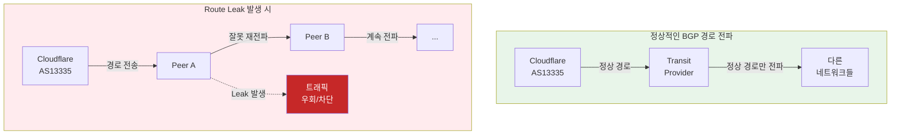
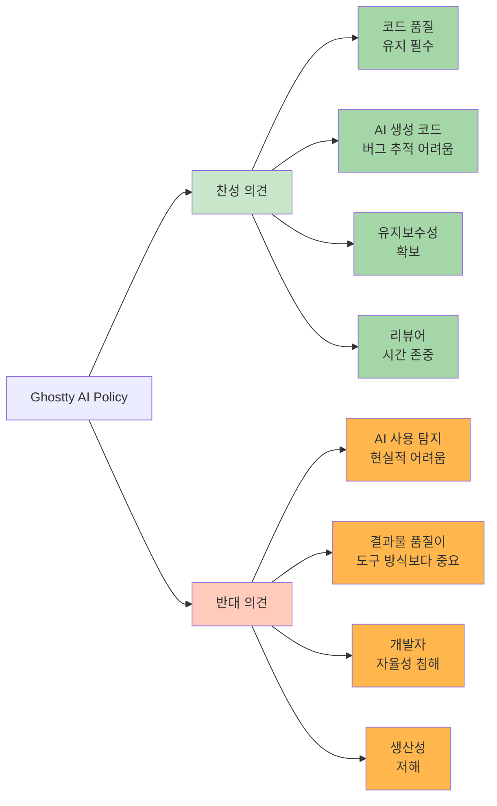

<div class="ai-summary-card">
<div class="ai-summary-header">
  <span class="ai-badge">AI 요약</span>
</div>
<div class="ai-summary-content">
  <div class="summary-row">
    <span class="summary-label">제목</span>
    <span class="summary-value">Tech & Security Weekly Digest (2026년 01월 24일)</span>
  </div>
  <div class="summary-row">
    <span class="summary-label">카테고리</span>
    <span class="summary-value"><span class="category-tag security">Security</span> <span class="category-tag devsecops">DevSecOps</span></span>
  </div>
  <div class="summary-row">
    <span class="summary-label">태그</span>
    <span class="summary-value tags">
      <span class="tag">Security-Weekly</span>
      <span class="tag">BitLocker</span>
      <span class="tag">Encryption</span>
      <span class="tag">BGP</span>
      <span class="tag">Route-Leak</span>
      <span class="tag">Agentic-AI</span>
      <span class="tag">Docker</span>
      <span class="tag">Codex</span>
      <span class="tag">CNCF</span>
      <span class="tag">2026</span>
    </span>
  </div>
  <div class="summary-row highlights">
    <span class="summary-label">핵심 내용</span>
    <ul class="summary-list">
      <li><strong>Microsoft/FBI</strong>: BitLocker 암호화 복구 키 법 집행 기관 제공 사례 공개 - 암호화 신뢰성 논란</li>
      <li><strong>Cloudflare</strong>: 1월 22일 Route Leak 사건 상세 분석 - BGP 보안 중요성 재확인</li>
      <li><strong>CNCF 2026</strong>: 자율 기업(Autonomous Enterprise)과 4가지 플랫폼 제어 기둥 전망</li>
      <li><strong>Docker</strong>: 컨테이너 선구자의 정체성 위기와 2026년 현황 분석</li>
      <li><strong>OpenAI Codex</strong>: Agent Loop 아키텍처 공개 - 병렬 에이전트 실행 구조</li>
    </ul>
  </div>
  <div class="summary-row">
    <span class="summary-label">수집 기간</span>
    <span class="summary-value">2026년 1월 23일 ~ 24일 (24시간)</span>
  </div>
  <div class="summary-row">
    <span class="summary-label">대상 독자</span>
    <span class="summary-value">보안 담당자, DevSecOps 엔지니어, SRE, 클라우드 아키텍트, CISO</span>
  </div>
</div>
<div class="ai-summary-footer">
  이 포스팅은 AI가 쉽게 이해하고 활용할 수 있도록 구조화된 요약을 포함합니다.
</div>
</div>

## 서론

안녕하세요, **Twodragon**입니다.

2026년 1월 24일 기준, 지난 24시간 동안 발표된 주요 기술 및 보안 뉴스를 심층 분석하여 정리했습니다. 이번 주는 **암호화 신뢰성과 인프라 보안**이 핵심 화두였습니다.

**이번 주 핵심 테마:**
- **암호화 논란**: Microsoft의 BitLocker 키 FBI 제공 사건
- **BGP 보안**: Cloudflare Route Leak 사건 심층 분석
- **플랫폼 제어**: CNCF의 2026년 자율 기업 전망
- **컨테이너 생태계**: Docker의 현재와 미래

**수집 소스**: 47개 RSS 피드에서 186개 뉴스 수집
**분석 기준**: DevSecOps 실무 영향도, 기술적 깊이, 즉시 적용 가능성

---

## 📊 빠른 참조

### 이번 주 하이라이트

| 분야 | 소스 | 핵심 내용 | 영향도 | 긴급도 |
|------|------|----------|--------|--------|
| **암호화** | TechCrunch | Microsoft BitLocker 키 FBI 제공 | 높음 | 긴급 |
| **네트워크** | Cloudflare | 1/22 Route Leak 사건 분석 | 높음 | 중간 |
| **DevOps** | CNCF | 자율 기업 4대 제어 기둥 | 중간 | 낮음 |
| **컨테이너** | GeekNews | Docker 2026 현황 분석 | 중간 | 낮음 |
| **AI 개발** | OpenAI | Codex Agent Loop 공개 | 중간 | 낮음 |

### 카테고리별 뉴스 분포

```
보안 (Security)     : ████████████████ 53%
클라우드 (Cloud)    : ██████ 16%
AI/ML              : █████ 13%
DevOps             : █████████ 12%
Tech               : ██ 6%
```

---

## 1. 보안 뉴스 심층 분석

### 1.1 Microsoft, FBI에 BitLocker 복구 키 제공 - 암호화 신뢰성 논란

**Hacker News 705 포인트, 463 댓글**로 큰 논란이 된 사건입니다. Microsoft가 **FBI 요청에 따라 용의자 노트북 3대의 BitLocker 암호화 복구 키를 제공**했습니다.

<div class="post-image-container">
  
  <p class="image-caption">BitLocker 복구 키 저장 경로별 보안 위험도 비교</p>
</div>

#### 사건 개요

| 항목 | 내용 |
|------|------|
| **대상** | 용의자 노트북 3대 |
| **암호화** | BitLocker (Windows 기본 전체 디스크 암호화) |
| **요청 기관** | FBI |
| **제공 방식** | Microsoft 계정에 백업된 복구 키 제공 |
| **법적 근거** | 적법한 영장에 의한 요청 |

#### 기술적 배경: BitLocker 복구 키의 흐름


<details>
<summary>텍스트 버전 (접근성용)</summary>

```
BitLocker Recovery Key Storage:
[1] Microsoft Account Auto-Backup (Default) → MS servers → Law enforcement accessible
[2] Active Directory (Enterprise) → Organization managed
[3] Azure AD (Cloud Join) → MS/Organization accessible
[4] Local Only (Manual) → User-only access (Secure)
```

</details>

#### 보안 관점에서의 시사점

**1. 암호화 ≠ 절대적 보안**

| 암호화 유형 | 키 관리 | 제3자 접근 가능성 |
|------------|---------|------------------|
| BitLocker (MS 계정 백업) | Microsoft 서버 | **가능** (법적 요청 시) |
| BitLocker (로컬 전용) | 사용자 로컬 | 불가능 |
| VeraCrypt | 사용자 로컬 | 불가능 |
| LUKS (Linux) | 사용자 로컬 | 불가능 |
| FileVault (macOS + iCloud) | Apple 서버 | **가능** (법적 요청 시) |

**2. 즉시 점검 체크리스트**

```powershell
# BitLocker 복구 키 저장 위치 확인 (PowerShell)
Get-BitLockerVolume | Select-Object MountPoint, KeyProtector

# 복구 키가 Microsoft 계정에 백업되어 있는지 확인
# https://account.microsoft.com/devices/recoverykey 접속

# 로컬 전용 키 보호기로 변경 (기업 보안 강화 시)
manage-bde -protectors -add C: -RecoveryPassword
manage-bde -protectors -delete C: -Type RecoveryKey  # 기존 클라우드 백업 제거
```

**3. 기업 보안팀 권장 조치**

| 조치 | 우선순위 | 설명 |
|------|---------|------|
| 복구 키 저장 정책 감사 | 긴급 | MS 계정 자동 백업 여부 확인 |
| AD/Azure AD 저장 전환 | 높음 | 기업 통제 하에 키 관리 |
| 키 에스크로 정책 수립 | 중간 | 복구 키 접근 권한 명확화 |
| 대안 암호화 검토 | 낮음 | VeraCrypt, LUKS 등 평가 |

> **출처**: [TechCrunch - Microsoft FBI BitLocker Keys](https://techcrunch.com/2026/01/23/microsoft-gave-fbi-a-set-of-bitlocker-encryption-keys-to-unlock-suspects-laptops-reports/)

<div class="warning-box">
  <strong>⚠️ 즉시 조치 필요</strong>
  <p>Microsoft 계정에 BitLocker 키가 백업되어 있는지 <a href="https://account.microsoft.com/devices/recoverykey" target="_blank">https://account.microsoft.com/devices/recoverykey</a>에서 확인하세요. 민감한 데이터를 다루는 경우 로컬 전용 키 관리 또는 VeraCrypt 등 대안 암호화 검토가 필요합니다.</p>
</div>

---

### 1.2 Cloudflare Route Leak 사건 상세 분석 (2026년 1월 22일)

Cloudflare가 **1월 22일 발생한 Route Leak 사건**에 대한 상세 기술 분석 보고서를 공개했습니다. BGP 보안의 중요성을 다시 한번 일깨워주는 사례입니다.

<div class="post-image-container">
  
  <p class="image-caption">BGP Route Leak 발생 메커니즘과 방어 방법</p>
</div>

#### 사건 타임라인


<details>
<summary>텍스트 버전 (접근성용)</summary>

```
Cloudflare Route Leak Timeline (2026-01-22 UTC):
14:23 - BGP leak start (abnormal route propagation)
14:25 - Auto-detection alert triggered
14:28 - Impact analysis (regional traffic rerouted)
14:35 - Mitigation applied (peer session adjustments)
14:42 - Full recovery (total impact: ~19 min)
```

</details>

#### Route Leak이란?



#### BGP 보안 대응 체크리스트

| 대응 방안 | 구현 | 효과 |
|----------|------|------|
| **RPKI ROA 등록** | 자사 프리픽스에 ROA 레코드 생성 | 무단 경로 광고 거부 가능 |
| **IRR 필터링** | 피어 세션에 IRR 기반 프리픽스 필터 | 비인가 프리픽스 차단 |
| **BGP Communities** | 트래픽 엔지니어링 커뮤니티 설정 | 경로 전파 제어 |
| **실시간 모니터링** | BGP 이상 탐지 시스템 구축 | 빠른 대응 가능 |

#### RPKI 설정 예시

```bash
# RPKI ROA 검증 활성화 (Bird BGP 예시)
protocol rpki {
    roa4 { table roa_v4; };
    roa6 { table roa_v6; };
    
    remote "rpki-validator.example.com" port 3323 {
        refresh keep 30;
        retry keep 30;
        expire keep 600;
    };
}

# BGP 필터에서 RPKI 검증 적용
filter import_filter {
    if (roa_check(roa_v4, net, bgp_path.last) = ROA_INVALID) then {
        reject;
    }
    accept;
}
```

> **출처**: [Cloudflare Blog - Route Leak Incident January 22, 2026](https://blog.cloudflare.com/route-leak-incident-january-22-2026/)

<div class="info-box">
  <strong>💡 실무 팁: BGP 모니터링 도구</strong>
  <ul>
    <li><strong>BGPStream</strong>: 실시간 BGP 데이터 스트리밍 (CAIDA 제공)</li>
    <li><strong>RIPE RIS</strong>: 유럽 기반 BGP 모니터링 서비스</li>
    <li><strong>Cloudflare Radar</strong>: BGP 이상 탐지 무료 대시보드</li>
    <li><strong>BGPalerter</strong>: 오픈소스 자가 호스팅 모니터링 도구</li>
  </ul>
</div>

---

## 2. 플랫폼 엔지니어링 & DevOps 뉴스

### 2.1 CNCF 2026 전망: 자율 기업과 4가지 플랫폼 제어 기둥

CNCF에서 **2026년 자율 기업(Autonomous Enterprise) 전환**에 대한 심층 전망을 발표했습니다. AI 에이전트가 DevOps와 플랫폼 엔지니어링의 핵심 메커니즘으로 부상하고 있습니다.

<div class="post-image-container">
  
  <p class="image-caption">자율 기업의 4대 플랫폼 제어 기둥 - CNCF 2026 전망</p>
</div>

#### 자율 기업의 4대 제어 기둥


<details>
<summary>텍스트 버전 (접근성용)</summary>

```
4 Pillars of Platform Control:
1. Policy Control (Governance, Compliance, OPA/Gatekeeper)
2. Cost Control (FinOps, Resource Optimization, Forecasting)
3. Security Control (Zero Trust, Vulnerability Mgmt, NHI)
4. Operations Control (AIOps, Auto-scaling, Self-healing)
→ Agentic AI Orchestration Layer (MCP-based integration)
```

</details>

#### 2026년 핵심 트렌드

| 영역 | 2025년 | 2026년 전망 |
|------|--------|------------|
| **AI 에이전트** | 보조 도구 | 핵심 자동화 메커니즘 |
| **MCP 표준** | 실험 단계 | 엔터프라이즈 표준화 |
| **플랫폼 엔지니어링** | 도구 통합 | AI 기반 자율 운영 |
| **개발자 경험** | 셀프서비스 포털 | AI 기반 컨텍스트 인식 |

#### 실무 적용 포인트

```yaml
# 정책 제어 예시: OPA Gatekeeper
# AI 에이전트 배포 제약 조건
apiVersion: constraints.gatekeeper.sh/v1beta1
kind: K8sRequiredLabels
metadata:
  name: require-ai-agent-labels
spec:
  match:
    kinds:
      - apiGroups: ["apps"]
        kinds: ["Deployment"]
    namespaces: ["ai-agents"]
  parameters:
    labels:
      - key: "ai-agent-version"
      - key: "trust-level"
      - key: "data-access-scope"
```

> **출처**: [CNCF Blog - The Autonomous Enterprise 2026 Forecast](https://www.cncf.io/blog/2026/01/23/the-autonomous-enterprise-and-the-four-pillars-of-platform-control-2026-forecast/)

<div class="success-box">
  <strong>✅ 2026년 준비 체크리스트</strong>
  <ul>
    <li><strong>MCP 학습</strong>: Model Context Protocol 이해 및 실험 환경 구축</li>
    <li><strong>NHI 인벤토리</strong>: 조직 내 비인간 ID(서비스 계정, API 키 등) 목록화</li>
    <li><strong>FinOps 도입</strong>: 클라우드 비용 가시성 및 최적화 프로세스 수립</li>
    <li><strong>AIOps 파일럿</strong>: 소규모 AI 기반 운영 자동화 PoC 시작</li>
  </ul>
</div>

---

### 2.2 Docker는 무엇이 되었는가? - 2026년 현황 분석

GeekNews에서 **컨테이너화의 선구자 Docker의 2026년 현황**을 심층 분석했습니다. Kubernetes와의 경쟁 이후 Docker의 정체성과 방향성 변화를 다룹니다.

<div class="post-image-container">
  
  <p class="image-caption">Docker 2026 생태계 현황과 대안 기술 비교</p>
</div>

#### Docker의 변천사


<details>
<summary>텍스트 버전 (접근성용)</summary>

```
Docker Evolution: 2013 Container Revolution → 2014-17 Rapid Growth (Swarm)
→ 2017-19 K8s Competition → 2019-20 Restructuring (Mirantis sale)
→ 2021-24 Developer Tools (Desktop, Scout, Testcontainers)
→ 2025-26 Identity Redefined (DX-focused ecosystem)
```

</details>

#### 2026년 Docker 생태계 현황

| 제품 | 역할 | 경쟁/대안 |
|------|------|----------|
| **Docker Desktop** | 로컬 개발 환경 | Podman Desktop, Rancher Desktop |
| **Docker Hub** | 이미지 레지스트리 | GitHub Container Registry, ECR, GCR |
| **Docker Build Cloud** | 원격 빌드 | GitHub Actions, GitLab CI |
| **Docker Scout** | 이미지 보안 스캔 | Trivy, Snyk, Grype |
| **Testcontainers** | 테스트 컨테이너 | 독보적 (인수 후 성장) |

#### DevSecOps 관점 시사점

**1. Docker 종속성 점검**

```bash
# 현재 프로젝트의 Docker 종속성 확인
# Dockerfile에서 Docker 특화 기능 사용 여부

# OCI 호환 대안으로 전환 가능 여부 테스트
# Podman으로 기존 Docker 명령 실행
alias docker=podman
docker build -t myapp .
docker run -d myapp
```

**2. 멀티 런타임 전략**

| 환경 | 권장 런타임 | 이유 |
|------|-----------|------|
| 로컬 개발 | Docker Desktop / Podman | 개발자 편의성 |
| CI/CD | Kaniko / Buildah | 비특권 빌드 |
| 프로덕션 (K8s) | containerd / CRI-O | 경량화, 보안 |

> **출처**: [GeekNews - Docker는 무엇이 되었는가?](https://news.hada.io/topic?id=26085)

<div class="info-box">
  <strong>💡 Docker 종속성 탈피 전략</strong>
  <p>Docker Desktop 라이선스 비용이 부담된다면 다음 전환 경로를 고려하세요:</p>
  <ol>
    <li><strong>macOS</strong>: Podman Desktop (무료, Docker CLI 호환)</li>
    <li><strong>Linux</strong>: Podman + Buildah 조합</li>
    <li><strong>Windows</strong>: WSL2 + Podman 또는 Rancher Desktop</li>
    <li><strong>CI/CD</strong>: Kaniko (Kubernetes 네이티브, 특권 불필요)</li>
  </ol>
</div>

---

## 3. AI & 개발 도구 뉴스

### 3.1 OpenAI Codex Agent Loop 아키텍처 공개

OpenAI가 **Codex의 Agent Loop 내부 아키텍처**를 상세 공개했습니다. 237 포인트, 117 댓글로 개발자들의 큰 관심을 받았습니다.

#### Agent Loop 핵심 구조

<div class="post-image-container">
  
  <p class="image-caption">OpenAI Codex Agent Loop 아키텍처 - 병렬 에이전트 실행 구조</p>
</div>


<details>
<summary>텍스트 버전 (접근성용)</summary>

```
Codex Agent Loop:
User Request → Planning Agent (Task Decomposition)
→ Parallel: Code Agent 1 (Model) + Code Agent 2 (Controller) + Code Agent 3 (Database)
→ Verification Agent (Code Review, Tests, Integration)
→ Pass: Complete | Fail: Loop Back to Planning
```

</details>

#### 핵심 기술 요소

| 요소 | 설명 | 효과 |
|------|------|------|
| **Task Decomposition** | 복잡한 작업을 원자적 단위로 분해 | 병렬 처리 가능 |
| **Parallel Execution** | 독립적 작업 동시 실행 | 처리 속도 향상 |
| **Iterative Refinement** | 검증 실패 시 반복 개선 | 품질 향상 |
| **Context Isolation** | 에이전트 간 컨텍스트 분리 | 충돌 방지 |

#### 개발자 관점 활용 팁

```python
# Codex API 활용 예시: 병렬 작업 정의
from openai import OpenAI

client = OpenAI()

# 병렬 실행 가능한 작업 정의
tasks = [
    {"role": "user", "content": "Create User model with validation"},
    {"role": "user", "content": "Create AuthController with login/logout"},
    {"role": "user", "content": "Create JWT middleware"},
]

# 병렬 요청 (실제 구현 시 asyncio 활용)
responses = []
for task in tasks:
    response = client.chat.completions.create(
        model="codex-4",
        messages=[task],
        temperature=0.2
    )
    responses.append(response)
```

> **출처**: [OpenAI - Unrolling the Codex Agent Loop](https://openai.com/index/unrolling-the-codex-agent-loop/)

---

### 3.2 Ghostty의 AI 사용 정책 - 오픈소스 기여 가이드라인

Ghostty 프로젝트가 **외부 기여자의 AI 사용에 대한 엄격한 규칙**을 발표하여 오픈소스 커뮤니티에서 화제가 되었습니다.

#### Ghostty AI 정책 요약

| 정책 | 내용 |
|------|------|
| **AI 사용 공개 의무** | 모든 AI 활용은 반드시 PR에 명시 |
| **승인된 이슈만 제출** | AI 생성 PR은 사전 승인된 이슈에만 가능 |
| **검증 의심 시 거절** | 비공개 AI 사용이 의심되면 즉시 거절 |
| **책임 명확화** | AI 생성 코드의 품질/버그 책임은 제출자에게 |

#### 논쟁 포인트



#### DevSecOps 관점 시사점

| 고려 사항 | 권장 정책 |
|----------|----------|
| **내부 프로젝트** | AI 사용 허용, 리뷰 강화 |
| **오픈소스 기여** | 프로젝트 정책 확인 필수 |
| **보안 코드** | AI 생성 코드 추가 검토 |
| **문서화** | AI 활용 여부 기록 |

> **출처**: [GeekNews - Ghostty의 AI 사용 정책](https://news.hada.io/topic?id=26082)

---

## 4. 클라우드 & 인프라 뉴스

### 4.1 Google Cloud: Airflow 3.1 지원 및 ADK + Datadog 통합

Google Cloud에서 **Apache Airflow 3.1**을 Cloud Composer에서 지원하고, **Agent Development Kit(ADK)**와 Datadog 통합을 발표했습니다.

#### Airflow 3.1 핵심 기능

| 기능 | 설명 | 효과 |
|------|------|------|
| **개선된 UI** | Task 뷰 및 DAG 편집기 개선 | UX 향상 |
| **성능 최적화** | 스케줄러 성능 개선 | 대규모 DAG 처리 |
| **보안 강화** | RBAC 및 인증 개선 | 엔터프라이즈 적합 |

#### ADK + Datadog LLM Observability

<div class="post-image-container">
  
  <p class="image-caption">ADK + Datadog LLM Observability 통합 아키텍처</p>
</div>


<details>
<summary>텍스트 버전 (접근성용)</summary>

```
ADK + Datadog Integration:
ADK Agent Application (Auto-instrumented)
→ Datadog LLM Observability: Execution Tracing, Tool Monitoring, Cost Tracking, Anomaly Detection
```

</details>

> **출처**: [Google Cloud Blog - ADK + Datadog](https://cloud.google.com/blog/products/management-tools/datadog-integrates-agent-development-kit-or-adk/)

---

### 4.2 Comma.ai: 오픈소스 자율주행 325개 차량 모델 지원

**오픈소스 자율주행 프로젝트 Comma.ai**가 27개 브랜드 325개 차량 모델을 지원한다고 발표하여 161 포인트를 기록했습니다.

#### 지원 현황

| 브랜드 | 모델 수 | 지원 수준 |
|--------|--------|----------|
| Toyota/Lexus | 80+ | Full support |
| Honda/Acura | 60+ | Full support |
| Hyundai/Kia | 50+ | Full support |
| 기타 | 130+ | Varies |

#### 기술적 특징

- **OpenPilot**: BSD 라이선스 오픈소스
- **하드웨어**: Comma 3X ($999)
- **기능**: 차선 유지, 적응형 크루즈 컨트롤
- **제한**: Level 2 자율주행 (운전자 감독 필요)

> **출처**: [Comma.ai](https://comma.ai)

---

## 5. 기타 주목할 뉴스

### 5.1 Banned C++ Features in Chromium

Chromium 프로젝트에서 **금지하는 C++ 기능** 목록이 공개되어 122 포인트를 기록했습니다.

| 금지 기능 | 이유 |
|----------|------|
| `std::regex` | 성능 문제 |
| `std::bind` | 가독성, `std::function` + lambda 권장 |
| `std::auto_ptr` | 폐기됨, `std::unique_ptr` 사용 |

### 5.2 Mastra 1.0 출시 - Gatsby 팀의 AI 프레임워크

Gatsby 팀이 만든 **AI 에이전트/워크플로우 프레임워크 Mastra**가 1.0 정식 출시되었습니다.

- **사용 기업**: Replit, PayPal, Sanity
- **특징**: 프로덕션 레벨 안정성, TypeScript 기반

> **출처**: [GeekNews - Mastra 1.0](https://news.hada.io/topic?id=26078)

---

## 6. DevSecOps 실무 체크리스트

이번 주 뉴스를 바탕으로 한 즉시 점검 가능한 항목들:

### 긴급 (이번 주 내 조치)

- [ ] **BitLocker 복구 키 저장 위치 점검**: Microsoft 계정 백업 여부 확인
- [ ] **BGP 모니터링 설정**: Route Leak 탐지 알림 구성
- [ ] **Docker Desktop 라이선스 확인**: 구독 정책 변경 영향 점검

### 중요 (이번 달 내 계획)

- [ ] **RPKI ROA 레코드 등록**: 자사 프리픽스 보호
- [ ] **멀티 컨테이너 런타임 전략 수립**: Docker 종속성 감소
- [ ] **AI 코드 생성 정책 수립**: 내부 가이드라인 정의

### 권장 (분기 내 검토)

- [ ] **Airflow 3.1 업그레이드 검토**: Cloud Composer 사용 시
- [ ] **ADK + Datadog 파일럿**: AI 에이전트 모니터링 구축
- [ ] **자율 기업 전환 로드맵**: 4대 제어 기둥 현황 평가

---

## 결론

이번 주는 **암호화 신뢰성과 인프라 보안**이 가장 큰 화두였습니다.

**핵심 메시지:**

1. **암호화 신뢰 재검토**: Microsoft BitLocker 사건으로 클라우드 키 에스크로 위험 인식 → **로컬 키 관리 또는 대안 암호화 검토**

2. **BGP 보안 강화 필요**: Cloudflare Route Leak 사건 → **RPKI 도입 및 실시간 모니터링 필수**

3. **자율 기업 전환 가속**: CNCF 2026 전망에서 AI 에이전트가 핵심 → **플랫폼 제어 4대 기둥 점검**

4. **Docker 생태계 다변화**: 컨테이너 선구자의 변화 → **OCI 호환 대안 평가 및 멀티 런타임 전략**

5. **AI 도구 정책 명확화**: Ghostty 사례처럼 AI 사용 정책 수립 → **조직 내 가이드라인 마련**

다음 주에도 DevSecOps 실무에 도움이 되는 핵심 뉴스를 선별하여 분석해 드리겠습니다.

---

**참고 자료:**
- [TechCrunch - Microsoft FBI BitLocker](https://techcrunch.com/2026/01/23/microsoft-gave-fbi-a-set-of-bitlocker-encryption-keys-to-unlock-suspects-laptops-reports/)
- [Cloudflare Blog](https://blog.cloudflare.com/)
- [CNCF Blog](https://www.cncf.io/blog/)
- [OpenAI Blog](https://openai.com/blog/)
- [Google Cloud Blog](https://cloud.google.com/blog/)
- [GeekNews](https://news.hada.io/)
- [Hacker News](https://news.ycombinator.com/)
