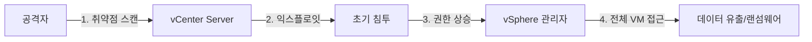
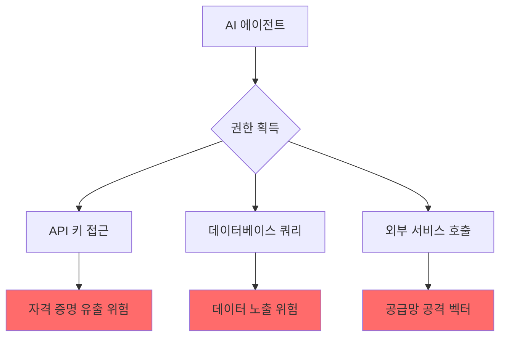

<div class="ai-summary-card">
<div class="ai-summary-header">
  <span class="ai-badge">AI 요약</span>
</div>
<div class="ai-summary-content">
  <div class="summary-row">
    <span class="summary-label">제목</span>
    <span class="summary-value">Tech & Security Weekly Digest (2026년 01월 25일)</span>
  </div>
  <div class="summary-row">
    <span class="summary-label">카테고리</span>
    <span class="summary-value"><span class="category-tag security">Security</span> <span class="category-tag devsecops">DevSecOps</span></span>
  </div>
  <div class="summary-row">
    <span class="summary-label">태그</span>
    <span class="summary-value tags">
      <span class="tag">Security-Weekly</span>
      <span class="tag">VMware</span>
      <span class="tag">CISA-KEV</span>
      <span class="tag">Fortinet</span>
      <span class="tag">Sandworm</span>
      <span class="tag">AI-Agents</span>
      <span class="tag">Zero-Trust</span>
      <span class="tag">2026</span>
    </span>
  </div>
  <div class="summary-row highlights">
    <span class="summary-label">핵심 내용</span>
    <ul class="summary-list">
      <li><strong>CISA KEV 긴급</strong>: VMware vCenter CVE-2024-37079 활성 익스플로잇 확인 - 즉시 패치 필요</li>
      <li><strong>Fortinet 제로데이</strong>: FortiGate 완전 패치 환경에서도 FortiCloud SSO 우회 공격 발생</li>
      <li><strong>Sandworm APT</strong>: 폴란드 전력망 대상 DynoWiper 와이퍼 악성코드 공격</li>
      <li><strong>AI 에이전트 보안</strong>: 비인간 신원(NHI) 관리와 제로트러스트 적용 방안</li>
      <li><strong>클라우드 오케스트레이션</strong>: Apache Airflow 3.1과 Google ADK + Datadog 통합</li>
    </ul>
  </div>
  <div class="summary-row">
    <span class="summary-label">수집 기간</span>
    <span class="summary-value">2026년 1월 23일 ~ 25일 (48시간)</span>
  </div>
  <div class="summary-row">
    <span class="summary-label">대상 독자</span>
    <span class="summary-value">보안 담당자, DevSecOps 엔지니어, SOC 분석가, 클라우드 아키텍트, CISO</span>
  </div>
</div>
<div class="ai-summary-footer">
  이 포스팅은 AI가 쉽게 이해하고 활용할 수 있도록 구조화된 요약을 포함합니다.
</div>
</div>

## 서론

안녕하세요, **Twodragon**입니다.

2026년 1월 25일 기준, 지난 48시간 동안 발표된 주요 기술 및 보안 뉴스를 심층 분석하여 정리했습니다. 이번 주는 **국가급 APT 공격과 인프라 취약점**이 핵심 화두였습니다.

**이번 주 핵심 테마:**
- **KEV 긴급 패치**: VMware vCenter 취약점이 CISA KEV에 추가
- **제로데이 공격**: Fortinet FortiGate SSO 우회
- **APT 위협**: Sandworm의 폴란드 전력망 공격
- **AI 거버넌스**: 에이전트 시대의 접근 제어와 책임

**수집 소스**: 47개 RSS 피드에서 166개 뉴스 수집  
**분석 기준**: DevSecOps 실무 영향도, 기술적 깊이, 즉시 적용 가능성

---

## 빠른 참조

### 이번 주 하이라이트

| 분야 | 소스 | 핵심 내용 | 영향도 | 긴급도 |
|------|------|----------|--------|--------|
| **취약점** | CISA/VMware | vCenter CVE-2024-37079 KEV 추가 | 높음 | **긴급** |
| **제로데이** | Fortinet | FortiGate SSO 우회 공격 | 높음 | **긴급** |
| **APT 공격** | The Hacker News | Sandworm DynoWiper 폴란드 공격 | 높음 | 중간 |
| **AI 보안** | HashiCorp | 에이전틱 시스템 제로트러스트 | 중간 | 중간 |
| **클라우드** | Google Cloud | Airflow 3.1 + ADK Datadog 통합 | 중간 | 낮음 |

### 카테고리별 뉴스 분포

```
보안 (Security)     : ████████████████████ 54%
AI/ML              : ██████ 13%
DevOps/Cloud       : █████ 13%
기술 일반 (Tech)    : █████████ 18%
```

---

## 1. 긴급: CISA KEV - VMware vCenter 취약점 (CVE-2024-37079)

### 개요

**CISA가 VMware vCenter Server 취약점을 Known Exploited Vulnerabilities(KEV) 카탈로그에 추가했습니다.** 이는 실제 공격에서 활발히 악용되고 있음을 의미합니다.

> **출처**: [CISA Adds Actively Exploited VMware vCenter Flaw CVE-2024-37079 to KEV Catalog](https://thehackernews.com/2026/01/cisa-adds-actively-exploited-vmware.html)

### 취약점 상세

| 항목 | 내용 |
|------|------|
| **CVE ID** | CVE-2024-37079 |
| **영향 제품** | VMware vCenter Server |
| **공격 벡터** | 네트워크 기반 원격 공격 |
| **심각도** | Critical (CVSS 9.8+) |
| **익스플로잇 상태** | 활성 공격 중 (In-the-Wild) |
| **CISA 패치 기한** | 2026년 2월 14일 |

### 공격 시나리오



### 즉시 조치 사항

- [ ] **패치 상태 확인**: vCenter Server 버전 확인 및 최신 패치 적용
- [ ] **네트워크 격리**: vCenter 관리 인터페이스 외부 노출 차단
- [ ] **로그 분석**: 비정상 API 호출 및 인증 시도 모니터링
- [ ] **백업 검증**: 스냅샷 및 백업 무결성 확인

### 실무 체크리스트

```bash
# vCenter 버전 확인 (SSH 접속 후)
cat /etc/vmware-vami/vamicli.properties | grep version

# 네트워크 접근 제한 확인
iptables -L -n | grep 443

# 최근 인증 실패 로그 확인
grep -i "failed" /var/log/vmware/vpxd/vpxd.log | tail -20
```

---

## 2. 긴급: Fortinet FortiGate SSO 우회 공격

### 개요

**Fortinet은 완전히 패치된 FortiGate 방화벽에서도 FortiCloud SSO 인증 우회 공격이 발생하고 있음을 확인했습니다.** 이는 기존 패치로는 방어할 수 없는 새로운 공격 벡터입니다.

> **출처**: [Fortinet Confirms Active FortiCloud SSO Bypass on Fully Patched FortiGate Firewalls](https://thehackernews.com/2026/01/fortinet-confirms-active-forticloud-sso.html)

### 위협 분석

| 항목 | 내용 |
|------|------|
| **공격 대상** | FortiGate 방화벽 (FortiCloud SSO 사용 환경) |
| **공격 방식** | SSO 토큰 조작 또는 인증 우회 |
| **영향 범위** | 완전 패치 환경에서도 취약 |
| **공격 목적** | 방화벽 관리 접근 권한 획득 |

### 공격 흐름

```
┌─────────────────┐      ┌─────────────────┐      ┌─────────────────┐
│  공격자         │ ──▶  │ FortiCloud SSO  │ ──▶  │ FortiGate Admin │
│                 │      │ 인증 우회       │      │ 접근 권한 획득   │
└─────────────────┘      └─────────────────┘      └─────────────────┘
         │                                                  │
         │                                                  ▼
         │                                         ┌─────────────────┐
         └────────────────────────────────────────▶│ 정책 변경/비활성화 │
                                                   │ 백도어 설치      │
                                                   └─────────────────┘
```

### 권장 대응 방안

| 우선순위 | 조치 사항 | 상세 내용 |
|----------|----------|----------|
| 1 | FortiCloud SSO 일시 비활성화 | 로컬 인증으로 전환 |
| 2 | 관리 인터페이스 접근 제한 | 신뢰할 수 있는 IP만 허용 |
| 3 | MFA 활성화 | 로컬 관리자 계정에 MFA 적용 |
| 4 | 감사 로그 모니터링 | 비정상 로그인 시도 탐지 |
| 5 | Fortinet 보안 권고 확인 | 최신 업데이트 및 IOC 확인 |

### 즉시 실행 명령

```bash
# FortiGate CLI에서 SSO 상태 확인
config system global
    show full-configuration | grep sso

# 관리 접근 IP 제한 설정
config system admin
    edit "admin"
        set trusthost1 10.0.0.0/24
    next
end

# 최근 로그인 시도 확인
diagnose debug authd fsso list
```

---

## 3. APT 위협: Sandworm의 DynoWiper 폴란드 전력망 공격

### 개요

러시아 국가 지원 APT 그룹 **Sandworm**이 폴란드 전력 부문을 대상으로 새로운 와이퍼 악성코드 **DynoWiper**를 사용한 공격을 시도했습니다.

> **출처**: [New DynoWiper Malware Used in Attempted Sandworm Attack on Polish Power Sector](https://thehackernews.com/2026/01/new-dynowiper-malware-used-in-attempted.html)

### 위협 인텔리전스

| 항목 | 내용 |
|------|------|
| **위협 행위자** | Sandworm (APT44, Voodoo Bear) |
| **국가 연계** | 러시아 GRU Unit 74455 |
| **대상 산업** | 전력/에너지 (Critical Infrastructure) |
| **대상 국가** | 폴란드 (NATO 동맹국) |
| **악성코드** | DynoWiper (신규 와이퍼 변종) |
| **공격 목적** | 시스템 파괴 및 운영 중단 |

### DynoWiper 악성코드 분석

```
┌──────────────────────────────────────────────────────────────┐
│                    DynoWiper 공격 체인                       │
├──────────────────────────────────────────────────────────────┤
│  Phase 1: 초기 침투                                          │
│  ├─ 스피어피싱 이메일                                        │
│  └─ 공급망 공격 (소프트웨어 업데이트 위장)                    │
│                                                              │
│  Phase 2: 지속성 확보                                        │
│  ├─ 서비스 등록 (svchost 위장)                               │
│  └─ 스케줄 작업 생성                                         │
│                                                              │
│  Phase 3: 내부 확산                                          │
│  ├─ 네트워크 스캔 (SMB, RDP)                                 │
│  └─ 자격 증명 수집 (Mimikatz 변종)                           │
│                                                              │
│  Phase 4: 와이핑 실행                                        │
│  ├─ MBR/GPT 덮어쓰기                                         │
│  ├─ 파일 시스템 파괴                                         │
│  └─ 이벤트 로그 삭제                                         │
└──────────────────────────────────────────────────────────────┘
```

### IOC (Indicators of Compromise)

| 유형 | 값 | 설명 |
|------|----|----|
| File Hash (SHA256) | TBD | DynoWiper 실행 파일 |
| C2 Domain | TBD | 명령제어 서버 |
| Registry Key | `HKLM\SOFTWARE\Microsoft\DynoSvc` | 지속성 레지스트리 |
| Service Name | `DynoService` | 위장 서비스 |

### 방어 권장 사항

| 영역 | 조치 |
|------|------|
| **탐지** | EDR/XDR에서 MBR 접근 모니터링 활성화 |
| **예방** | 중요 시스템 오프라인 백업 주기 단축 |
| **대응** | ICS/SCADA 네트워크 분리 강화 |
| **복구** | 골든 이미지 기반 신속 복구 계획 수립 |

---

## 4. AI 에이전트 보안: 비인간 신원(NHI) 관리

### 개요

AI 에이전트가 기업 환경에서 자율적으로 작업을 수행함에 따라, **비인간 신원(Non-Human Identity, NHI)** 관리와 제로트러스트 적용이 새로운 보안 과제로 부상했습니다.

> **출처**: 
> - [Who Approved This Agent? Rethinking Access, Accountability, and Risk in the Age of AI Agents](https://thehackernews.com/2026/01/who-approved-this-agent-rethinking.html)
> - [Zero trust for agentic systems: Managing non-human identities at scale](https://www.hashicorp.com/blog/zero-trust-for-agentic-systems-managing-non-human-identities-at-scale)

### AI 에이전트 보안 위험



### 제로트러스트 적용 프레임워크

| 원칙 | AI 에이전트 적용 방안 |
|------|---------------------|
| **최소 권한** | 작업별 동적 권한 부여, 시간 제한 토큰 |
| **명시적 검증** | 모든 에이전트 요청에 대한 인증/인가 |
| **침해 가정** | 에이전트 행위 모니터링, 이상 탐지 |
| **마이크로 세그멘테이션** | 에이전트별 네트워크/데이터 격리 |

### 에이전트 거버넌스 체크리스트

- [ ] **신원 관리**: 모든 AI 에이전트에 고유 ID 부여
- [ ] **권한 목록**: 에이전트별 접근 가능 리소스 문서화
- [ ] **감사 로그**: 에이전트 행위 전체 추적
- [ ] **승인 워크플로우**: 새 에이전트 배포 시 보안 검토
- [ ] **자동 폐기**: 비활성 에이전트 자격 증명 만료

### 실무 구현 예시 (Vault + Kubernetes)

```yaml
# Vault Agent Injector 설정
apiVersion: v1
kind: ConfigMap
metadata:
  name: agent-vault-config
data:
  config.hcl: |
    auto_auth {
      method "kubernetes" {
        mount_path = "auth/kubernetes"
        config = {
          role = "ai-agent-role"
        }
      }
    }
    
    template {
      source      = "/vault/templates/secrets.ctmpl"
      destination = "/vault/secrets/api-key"
      # 15분마다 자격 증명 갱신
      ttl         = "15m"
    }
```

---

## 5. 클라우드 오케스트레이션: Apache Airflow 3.1 & Google ADK

### Apache Airflow 3.1 in Cloud Composer

Google Cloud Composer가 Apache Airflow 3.1을 지원하기 시작했습니다. 이는 하이퍼스케일러 최초입니다.

> **출처**: [Improving workflow orchestration with Apache Airflow 3.1 in Cloud Composer](https://cloud.google.com/blog/products/data-analytics/cloud-composer-supports-apache-airflow-31/)

#### 주요 개선 사항

| 기능 | 설명 | 활용 사례 |
|------|------|----------|
| **Asset-Centric DAGs** | 데이터 중심 워크플로우 정의 | 데이터 레이크 파이프라인 |
| **Event-Driven** | 이벤트 기반 DAG 트리거 | 실시간 데이터 처리 |
| **UI 개선** | 대시보드 사용성 향상 | 운영 모니터링 |
| **Performance** | 스케줄러 성능 최적화 | 대규모 DAG 환경 |

### Google ADK + Datadog LLM Observability

Google Agent Development Kit(ADK)와 Datadog의 LLM Observability 통합으로 에이전틱 시스템 모니터링이 가능해졌습니다.

> **출처**: [Monitoring Google ADK agentic applications with Datadog LLM Observability](https://cloud.google.com/blog/products/management-tools/datadog-integrates-agent-development-kit-or-adk/)

#### 모니터링 아키텍처

```
┌─────────────────────────────────────────────────────────────────┐
│                    Google ADK Application                       │
├─────────────────────────────────────────────────────────────────┤
│  ┌──────────┐    ┌──────────┐    ┌──────────┐                  │
│  │ Agent 1  │───▶│ Agent 2  │───▶│ Agent 3  │                  │
│  │ (Plan)   │    │ (Execute)│    │ (Verify) │                  │
│  └──────────┘    └──────────┘    └──────────┘                  │
│       │               │               │                         │
│       └───────────────┼───────────────┘                         │
│                       ▼                                         │
│              ┌────────────────┐                                 │
│              │ Datadog Agent  │                                 │
│              │ (Auto-Instr.)  │                                 │
│              └────────────────┘                                 │
└─────────────────────────────────────────────────────────────────┘
                        │
                        ▼
┌─────────────────────────────────────────────────────────────────┐
│                 Datadog LLM Observability                       │
├─────────────────────────────────────────────────────────────────┤
│  ✓ Token Usage & Cost Tracking                                 │
│  ✓ Latency Distribution                                        │
│  ✓ Error Rate & Root Cause                                     │
│  ✓ Agent Decision Path Tracing                                 │
└─────────────────────────────────────────────────────────────────┘
```

---

## 6. 추가 보안 뉴스 요약

### 피싱 & 악성코드

| 제목 | 핵심 내용 |
|------|----------|
| **Amnesia RAT 다단계 피싱** | 러시아 대상 다단계 피싱 캠페인, 랜섬웨어 병행 |
| **LogMeIn RMM 피싱** | 훔친 자격 증명으로 원격 관리 도구 설치 |

### 제로트러스트 시리즈 (SK쉴더스)

| 월 | 주제 | 핵심 내용 |
|----|------|----------|
| 9월 | 애플리케이션 & 워크로드 | 앱 계층 제로트러스트 구현 |
| 11월 | 데이터 | 데이터 중심 보안 전략 |
| 12월 | 가시성 & 분석 | 보안 모니터링 및 분석 |

### 플랫폼 엔지니어링 2026 전망 (CNCF)

> **출처**: [The autonomous enterprise and the four pillars of platform control: 2026 forecast](https://www.cncf.io/blog/2026/01/23/the-autonomous-enterprise-and-the-four-pillars-of-platform-control-2026-forecast/)

#### 4가지 플랫폼 제어 기둥

1. **정책 제어 (Policy Control)**: IaC 정책 자동화
2. **보안 제어 (Security Control)**: DevSecOps 통합
3. **비용 제어 (Cost Control)**: FinOps 자동화
4. **품질 제어 (Quality Control)**: SRE 자동화

---

## 실무 액션 아이템

### 이번 주 필수 조치

| 우선순위 | 항목 | 담당 | 기한 |
|----------|------|------|------|
| **P0** | VMware vCenter 패치 적용 | 인프라팀 | 즉시 |
| **P0** | Fortinet SSO 비활성화 검토 | 보안팀 | 즉시 |
| **P1** | ICS/SCADA 네트워크 분리 점검 | OT보안팀 | 1주 |
| **P2** | AI 에이전트 인벤토리 작성 | 개발팀 | 2주 |
| **P3** | Airflow 3.1 마이그레이션 계획 | 데이터팀 | 1개월 |

### 보안 모니터링 강화

```yaml
# SIEM 룰 예시: vCenter 의심 활동
- rule:
    name: "vCenter Suspicious API Call"
    condition: |
      source.product == "vmware_vcenter" AND
      (event.action contains "CreateUser" OR
       event.action contains "ModifyPermission") AND
      source.ip NOT IN trusted_admin_ips
    severity: high
    tags: [cve-2024-37079, vcenter, privilege-escalation]
```

---

## 참고 자료

### 공식 보안 권고

- [CISA KEV Catalog](https://www.cisa.gov/known-exploited-vulnerabilities-catalog)
- [VMware Security Advisories](https://www.vmware.com/security/advisories.html)
- [Fortinet PSIRT Advisories](https://www.fortiguard.com/psirt)

### 위협 인텔리전스

- [Mandiant Threat Intelligence](https://www.mandiant.com/resources/insights)
- [CrowdStrike Threat Reports](https://www.crowdstrike.com/resources/)
- [SK쉴더스 EQST](https://www.skshieldus.com/)

### 클라우드 보안

- [Google Cloud Security Best Practices](https://cloud.google.com/security/best-practices)
- [HashiCorp Zero Trust](https://www.hashicorp.com/solutions/zero-trust-security)

---

## 마무리

이번 주는 **국가급 APT 공격**과 **인프라 취약점**이 동시에 주목받은 한 주였습니다. 특히:

1. **즉각적인 패치**가 필요한 VMware vCenter 취약점
2. **패치만으로 해결되지 않는** Fortinet SSO 우회
3. **전력망 등 핵심 인프라**를 노리는 와이퍼 공격
4. **AI 에이전트 시대**의 새로운 보안 패러다임

보안 담당자분들은 위의 액션 아이템을 참고하여 즉각적인 대응을 권장합니다.

다음 주에도 유익한 보안/기술 소식으로 찾아뵙겠습니다.

---

**작성자**: Twodragon  
**작성일**: 2026-01-25  
**수집 소스**: 47개 RSS 피드 (166개 뉴스)  
**분석 방법론**: DevSecOps 실무 영향도 기반 우선순위화
