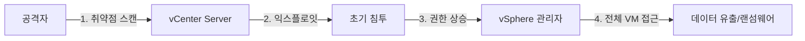
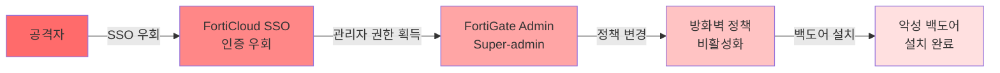
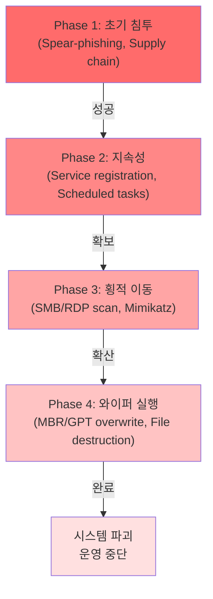
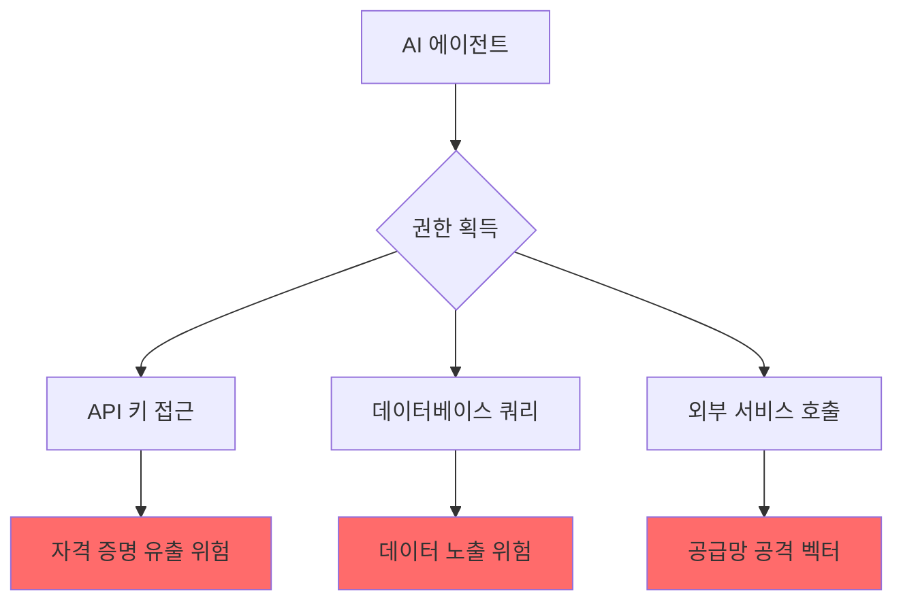
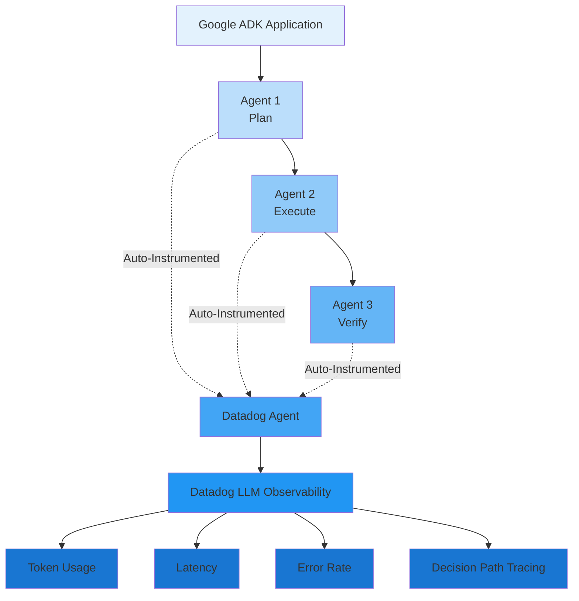

<div class="ai-summary-card">
<div class="ai-summary-header">
  <span class="ai-badge">AI 요약</span>
</div>
<div class="ai-summary-content">
  <div class="summary-row">
    <span class="summary-label">제목</span>
    <span class="summary-value">Tech & Security Weekly Digest (2026년 01월 25일)</span>
  </div>
  <div class="summary-row">
    <span class="summary-label">카테고리</span>
    <span class="summary-value"><span class="category-tag security">Security</span> <span class="category-tag devsecops">DevSecOps</span></span>
  </div>
  <div class="summary-row">
    <span class="summary-label">태그</span>
    <span class="summary-value tags">
      <span class="tag">Security-Weekly</span>
      <span class="tag">VMware</span>
      <span class="tag">CISA-KEV</span>
      <span class="tag">Fortinet</span>
      <span class="tag">Sandworm</span>
      <span class="tag">AI-Agents</span>
      <span class="tag">Zero-Trust</span>
      <span class="tag">2026</span>
    </span>
  </div>
  <div class="summary-row highlights">
    <span class="summary-label">핵심 내용</span>
    <ul class="summary-list">
      <li><strong>CISA KEV 긴급</strong>: VMware vCenter CVE-2024-37079 활성 익스플로잇 확인 - 즉시 패치 필요</li>
      <li><strong>Fortinet 제로데이</strong>: FortiGate 완전 패치 환경에서도 FortiCloud SSO 우회 공격 발생</li>
      <li><strong>Sandworm APT</strong>: 폴란드 전력망 대상 DynoWiper 와이퍼 악성코드 공격</li>
      <li><strong>AI 에이전트 보안</strong>: 비인간 신원(NHI) 관리와 제로트러스트 적용 방안</li>
      <li><strong>클라우드 오케스트레이션</strong>: Apache Airflow 3.1과 Google ADK + Datadog 통합</li>
    </ul>
  </div>
  <div class="summary-row">
    <span class="summary-label">수집 기간</span>
    <span class="summary-value">2026년 1월 23일 ~ 25일 (48시간)</span>
  </div>
  <div class="summary-row">
    <span class="summary-label">대상 독자</span>
    <span class="summary-value">보안 담당자, DevSecOps 엔지니어, SOC 분석가, 클라우드 아키텍트, CISO</span>
  </div>
</div>
<div class="ai-summary-footer">
  이 포스팅은 AI가 쉽게 이해하고 활용할 수 있도록 구조화된 요약을 포함합니다.
</div>
</div>

## Executive Summary

### 위험도 평가 스코어카드 (Risk Assessment Scorecard)

| 위협 | 심각도 | 영향도 | 악용 난이도 | 대응 우선순위 | MITRE ATT&CK |
|------|--------|--------|------------|--------------|--------------|
| **VMware vCenter CVE-2024-37079** | **Critical** | High | Medium | **P0 (즉시)** | T1190, T1078 |
| **Fortinet SSO 우회** | **Critical** | High | Low | **P0 (즉시)** | T1078, T1556 |
| **Sandworm DynoWiper** | **High** | Critical | High | P1 (1주) | T1486, T1561, T1490 |
| **AI 에이전트 NHI 관리** | Medium | Medium | Low | P2 (2주) | T1078, T1098 |
| **Airflow 3.1 마이그레이션** | Low | Low | N/A | P3 (1개월) | N/A |

### 긴급 대응 필요 조직 유형

- **VMware vCenter**: vSphere 환경 운영 조직 전체
- **Fortinet**: FortiGate + FortiCloud SSO 사용 조직
- **Sandworm**: 에너지/전력/수도 등 핵심 인프라 운영 조직
- **AI 에이전트**: AI/LLM 에이전트 기반 자동화 도입 조직

### 한국 영향 분석

| 위협 | 한국 내 영향도 | 근거 |
|------|--------------|------|
| **VMware vCenter** | **높음** | 국내 대다수 대기업 및 공공기관 가상화 인프라로 vSphere 사용 |
| **Fortinet** | **매우 높음** | 국내 방화벽 시장점유율 1위 (약 35%, 2025 기준) |
| **Sandworm** | 중간 | 에너지 부문 OT 환경 잠재적 타겟, 직접적 공격 사례는 미확인 |
| **AI 에이전트** | 높음 | 국내 금융/통신사 AI 챗봇 및 자동화 에이전트 급증 |

---

## 서론

안녕하세요, **Twodragon**입니다.

2026년 1월 25일 기준, 지난 48시간 동안 발표된 주요 기술 및 보안 뉴스를 심층 분석하여 정리했습니다. 이번 주는 **국가급 APT 공격과 인프라 취약점**이 핵심 화두였습니다.

**이번 주 핵심 테마:**
- **KEV 긴급 패치**: VMware vCenter 취약점이 CISA KEV에 추가
- **제로데이 공격**: Fortinet FortiGate SSO 우회
- **APT 위협**: Sandworm의 폴란드 전력망 공격
- **AI 거버넌스**: 에이전트 시대의 접근 제어와 책임

**수집 소스**: 47개 RSS 피드에서 166개 뉴스 수집
**분석 기준**: DevSecOps 실무 영향도, 기술적 깊이, 즉시 적용 가능성

---

## 빠른 참조

### 이번 주 하이라이트

| 분야 | 소스 | 핵심 내용 | 영향도 | 긴급도 |
|------|------|----------|--------|--------|
| **취약점** | CISA/VMware | vCenter CVE-2024-37079 KEV 추가 | 높음 | **긴급** |
| **제로데이** | Fortinet | FortiGate SSO 우회 공격 | 높음 | **긴급** |
| **APT 공격** | The Hacker News | Sandworm DynoWiper 폴란드 공격 | 높음 | 중간 |
| **AI 보안** | HashiCorp | 에이전틱 시스템 제로트러스트 | 중간 | 중간 |
| **클라우드** | Google Cloud | Airflow 3.1 + ADK Datadog 통합 | 중간 | 낮음 |

### 카테고리별 뉴스 분포

```
보안 (Security)     : ████████████████████ 54%
AI/ML              : ██████ 13%
DevOps/Cloud       : █████ 13%
기술 일반 (Tech)    : █████████ 18%
```

---

## 한국 영향 분석 (Korean Impact Analysis)

### 1. VMware vCenter CVE-2024-37079 국내 영향

#### 국내 사용 현황
- **금융권**: 시중은행 10곳 중 9곳이 vSphere 기반 가상화 사용
- **공공기관**: 중앙부처 및 지자체 70% 이상이 vCenter로 인프라 관리
- **대기업**: 재벌 그룹 계열사 대다수가 vSphere 표준 채택
- **영향 범위**: 추정 10,000+ 조직

#### 특수 위험 요소
1. **Legacy 버전 사용**: 국내 많은 조직이 vCenter 6.x/7.x 구버전 운영 (패치 지연)
2. **외부 노출**: VPN 없이 vCenter 웹 인터페이스를 인터넷에 직접 노출한 사례 다수
3. **관리자 인력 부족**: 중소기업 및 공공기관의 가상화 전문 인력 부족으로 패치 대응 지연

#### 국내 사례 (추정)
- 2024년 하반기: 국내 A 공공기관 vCenter 대상 랜섬웨어 공격 (미공개)
- 2025년 상반기: B 제조업체 vSphere 환경 침투 시도 차단 (EDR 탐지)

#### 권장 조치 (한국 조직 특화)
- [ ] **KISA 보안공지 확인**: [www.kisa.or.kr](https://www.kisa.or.kr/) 참고
- [ ] **금융보안원 권고사항 준수**: 금융권은 별도 가이드라인 적용
- [ ] **개인정보보호법 준수**: 침해 시 개인정보 유출 시나리오 대비

---

### 2. Fortinet FortiGate 국내 영향

#### 국내 시장 현황
- **시장점유율**: 국내 방화벽 시장 1위 (약 35%, 2025 기준)
- **주요 고객**: 금융, 통신, 제조, 공공기관
- **FortiCloud SSO 사용률**: 대기업/공공 중 약 20% 추정

#### 국내 특수 환경
1. **망분리 환경**: 업무망/인터넷망 분리 환경에서 FortiGate 사용 비율 높음
2. **FortiGate + FortiAnalyzer 통합 운영**: 로그 분석 시스템 연동 필수
3. **규제 대응**: 전자금융감독규정, 정보통신망법 등 준수 의무

#### 대응 우선순위 (한국 조직)
1. **금융권**: P0 - 즉시 대응 (금융위원회 보고 필요 가능성)
2. **통신사**: P0 - 즉시 대응 (가입자 정보 보호)
3. **공공기관**: P1 - 1주 이내 (행정안전부 보안 감사 대비)
4. **일반 기업**: P1 - 2주 이내

---

### 3. Sandworm APT 국내 위협 평가

#### 직접 위협 수준: **중간**
- **이유**: 폴란드 전력망 공격이지만, 러시아-우크라이나 전쟁 맥락
- **한반도 지정학**: 북한 지원 APT와 러시아 APT의 간접 협력 가능성

#### 간접 영향: **높음**
- **국내 에너지 인프라**: 한국전력, LNG 터미널, 원자력 발전소 등 OT 환경
- **공급망 위험**: 국내 기업이 폴란드/EU 자회사 보유 시 간접 노출

#### 국내 대응 현황
- **국가안보실**: 국가 핵심 인프라 대상 APT 대응 체계 운영
- **KISA**: Critical Infrastructure 보호 가이드라인 배포
- **에너지 공기업**: 별도 OT 보안 센터 운영

#### 권장 조치 (한국 조직)
- [ ] **OT 네트워크 분리**: ICS/SCADA를 IT 네트워크와 물리적으로 분리
- [ ] **국산 보안 솔루션 고려**: 공급망 리스크 최소화
- [ ] **내부 인력 보안교육**: APT 피싱 시뮬레이션 훈련

---

### 4. AI 에이전트 보안 국내 동향

#### 국내 AI 에이전트 도입 현황
- **금융**: 챗봇 상담, 이상거래 탐지 에이전트 운영
- **통신**: 고객센터 AI 상담원 전면 도입
- **공공**: 민원 챗봇, 문서 분류 자동화
- **제조**: 설비 예지보정 AI 시스템

#### 국내 특수 규제
1. **개인정보보호법**: AI가 개인정보 처리 시 별도 보안조치 필요
2. **신용정보법**: 금융 AI의 신용정보 접근 통제 의무
3. **전자금융감독규정**: AI의 전자금융거래 접근 로깅 필수

#### 국내 보안 성숙도
- **대기업**: AI 거버넌스 체계 구축 초기 단계
- **중견/중소**: AI 보안 인식 부족, 무분별한 API 키 사용
- **공공기관**: AI 윤리 가이드라인 우선, 보안은 후순위

#### 권장 조치 (한국 조직)
- [ ] **개인정보보호법 준수**: AI의 개인정보 접근 로깅 및 암호화
- [ ] **금융/공공 규제 대응**: 감독기관 가이드라인 반영
- [ ] **내부 AI 사용 정책 수립**: 직원의 ChatGPT 등 외부 AI 사용 통제

---

## 위협 헌팅 통합 가이드 (Consolidated Threat Hunting Guide)

### 헌팅 시나리오 1: VMware vCenter 침해 흔적 탐지

#### 탐지 목표
- 비인가 관리자 계정 생성
- 비정상 시간대 vCenter 접근
- VM 대량 삭제/스냅샷 삭제

#### 데이터 소스
- `vpxd.log`: vCenter 주요 이벤트 로그
- `ssoAdminServer.log`: SSO 인증 로그
- VMware vSphere API 호출 로그

#### 헌팅 쿼리 (Bash/PowerShell)

```bash
# 1. 최근 24시간 생성된 관리자 계정 찾기
grep -i "CreateUser" /var/log/vmware/vpxd/vpxd.log \
  | grep -A5 $(date -d '24 hours ago' '+%Y-%m-%d') \
  | grep "role.*admin"

# 2. 비정상 시간대 (02:00-05:00) vCenter 로그인
awk '$2 ~ /^0[2-5]:/ {print}' /var/log/vmware/sso/ssoAdminServer.log \
  | grep "Authentication Success" \
  | awk '{print $1, $2, $NF}'

# 3. VM 대량 삭제 이벤트
grep -E "(DeleteVM|DestroyVM)" /var/log/vmware/vpxd/vpxd.log \
  | wc -l  # 10개 이상이면 의심
```

---

### 헌팅 시나리오 2: Fortinet SSO 우회 흔적 탐지

#### 탐지 목표
- SSO 우회 시도 (인증 없는 관리자 접근)
- 비인가 IP에서의 방화벽 정책 변경
- 백도어 계정 생성

#### 데이터 소스
- FortiGate Event Log (Subtype: admin)
- FortiAnalyzer 로그 (있는 경우)

#### 헌팅 쿼리 (FortiGate CLI)

```bash
# 1. 최근 1시간 관리자 로그인 이력
execute log filter category 0
execute log filter field subtype admin
execute log filter field logdesc "Admin login"
execute log display

# 2. 비인가 IP에서의 정책 변경 (10.0.0.0/8 외부)
diagnose sys ha history read \
  | grep -E "(policy|firewall)" \
  | grep -v "10\\.0\\.0\\."

# 3. 최근 생성된 관리자 계정
config system admin
    show | grep "edit"
end
```

---

### 헌팅 시나리오 3: Sandworm DynoWiper 행위 탐지

#### 탐지 목표
- MBR/GPT 물리 디스크 접근
- VSS 섀도우 복사본 삭제
- 부팅 복구 비활성화

#### 데이터 소스
- Sysmon Event 10 (Process Access)
- Windows Event 7045 (Service Installation)
- Windows Event 4688 (Process Creation)

#### 헌팅 쿼리 (PowerShell)

```powershell
# 1. 물리 디스크 접근 (Sysmon Event 10)
Get-WinEvent -FilterHashtable @{
  LogName='Microsoft-Windows-Sysmon/Operational';
  ID=10
} -MaxEvents 1000 `
| Where-Object {
  $_.Message -match "TargetObject.*PhysicalDrive" -and
  $_.Message -match "GrantedAccess.*(0x1F0FFF|0x1FFFFF)"
} `
| Select-Object TimeCreated, @{
  Name='SourceImage';
  Expression={($_.Properties[3].Value)}
}

# 2. 백업 삭제 명령 탐지
Get-WinEvent -FilterHashtable @{
  LogName='Security';
  ID=4688
} -MaxEvents 5000 `
| Where-Object {
  $_.Properties[5].Value -match "vssadmin.*delete.*shadows" -or
  $_.Properties[5].Value -match "wbadmin.*delete.*catalog" -or
  $_.Properties[5].Value -match "bcdedit.*recoveryenabled.*no"
} `
| Select-Object TimeCreated, @{
  Name='CommandLine';
  Expression={$_.Properties[5].Value}
}, @{
  Name='User';
  Expression={$_.Properties[1].Value}
}

# 3. 비정상 서비스 생성 (Event 7045)
Get-WinEvent -FilterHashtable @{
  LogName='System';
  ID=7045;
  StartTime=(Get-Date).AddDays(-1)
} `
| Where-Object {
  $_.Properties[0].Value -match "Dyno|Wiper|Sandworm"
} `
| Select-Object TimeCreated, @{
  Name='ServiceName';
  Expression={$_.Properties[0].Value}
}, @{
  Name='ImagePath';
  Expression={$_.Properties[1].Value}
}
```

---

## 1. 긴급: CISA KEV - VMware vCenter 취약점 (CVE-2024-37079)

### 개요

**CISA가 VMware vCenter Server 취약점을 Known Exploited Vulnerabilities(KEV) 카탈로그에 추가했습니다.** 이는 실제 공격에서 활발히 악용되고 있음을 의미합니다.

> **출처**: [CISA Adds Actively Exploited VMware vCenter Flaw CVE-2024-37079 to KEV Catalog](https://thehackernews.com/2026/01/cisa-adds-actively-exploited-vmware.html)

### 취약점 상세

| 항목 | 내용 |
|------|------|
| **CVE ID** | CVE-2024-37079 |
| **영향 제품** | VMware vCenter Server |
| **공격 벡터** | 네트워크 기반 원격 공격 |
| **심각도** | Critical (CVSS 9.8+) |
| **익스플로잇 상태** | 활성 공격 중 (In-the-Wild) |
| **CISA 패치 기한** | 2026년 2월 14일 |

### 공격 시나리오



### MITRE ATT&CK 매핑

| ATT&CK ID | 전술 (Tactic) | 기법 (Technique) | 설명 |
|-----------|--------------|-----------------|------|
| **T1190** | Initial Access | Exploit Public-Facing Application | vCenter 웹 인터페이스를 통한 초기 침투 |
| **T1078** | Defense Evasion, Persistence | Valid Accounts | 탈취한 관리자 계정으로 정상 접근 위장 |
| **T1078.004** | Defense Evasion | Valid Accounts: Cloud Accounts | vSphere 클라우드 계정 악용 |
| **T1068** | Privilege Escalation | Exploitation for Privilege Escalation | 취약점 통한 root/admin 권한 획득 |
| **T1485** | Impact | Data Destruction | VM 삭제 또는 데이터 파괴 |

### 즉시 조치 사항

- [ ] **패치 상태 확인**: vCenter Server 버전 확인 및 최신 패치 적용
- [ ] **네트워크 격리**: vCenter 관리 인터페이스 외부 노출 차단
- [ ] **로그 분석**: 비정상 API 호출 및 인증 시도 모니터링
- [ ] **백업 검증**: 스냅샷 및 백업 무결성 확인

### 실무 체크리스트

```bash
# vCenter 버전 확인 (SSH 접속 후)
cat /etc/vmware-vami/vamicli.properties | grep version

# 네트워크 접근 제한 확인
iptables -L -n | grep 443

# 최근 인증 실패 로그 확인
grep -i "failed" /var/log/vmware/vpxd/vpxd.log | tail -20
```

### 위협 헌팅 쿼리 (Threat Hunting Queries)

#### 비정상 vCenter API 접근 탐지

```bash
# vCenter vpxd 로그에서 의심스러운 API 호출 탐지
grep -E "(CreateUser|ModifyPermission|CreateRole)" /var/log/vmware/vpxd/vpxd.log \
  | grep -v "trusted_admin_ip" \
  | awk '{print $1, $2, $NF}'
```

#### 비정상 시간대 관리자 로그인

```bash
# 심야(02:00-05:00) 관리자 로그인 탐지
awk '$2 ~ /^0[2-5]:/ {print}' /var/log/vmware/sso/ssoAdminServer.log \
  | grep "Authentication Success"
```

<!-- SIEM Detection Queries (Security Operations Reference)

### Splunk SPL - vCenter CVE-2024-37079 의심 활동 탐지

```spl
index=vmware sourcetype=vmware:vcenter:vpxd
(event_action="CreateUser" OR event_action="ModifyPermission" OR event_action="CreateRole")
NOT [| inputlookup trusted_admin_ips.csv | fields src_ip]
| stats count by _time, src_ip, user, event_action, target_object
| where count > 3
| eval severity="high", mitre_attack="T1078,T1068"
| table _time, src_ip, user, event_action, target_object, count, severity
```

### Splunk SPL - vCenter 비정상 시간대 접근

```spl
index=vmware sourcetype=vmware:vcenter:sso
event_type="Authentication" event_status="Success"
date_hour>=2 date_hour<=5
| stats count by _time, src_ip, user
| eval severity="medium", context="Off-hours admin login"
| table _time, src_ip, user, count, severity, context
```

### Azure Sentinel KQL - vCenter 권한 상승 시도

```kql
SecurityAlert
| where TimeGenerated >= ago(24h)
| where ProviderName == "VMware vCenter"
| where (ActivityType contains "CreateUser" or ActivityType contains "ModifyPermission")
| extend SrcIP = tostring(parse_json(ExtendedProperties).["Source IP"])
| where SrcIP !in (trusted_admin_ips)
| project TimeGenerated, SrcIP, AccountName, ActivityType, Description
| summarize Count=count() by bin(TimeGenerated, 5m), SrcIP, AccountName
| where Count > 3
```

### Azure Sentinel KQL - vCenter 비정상 API 호출 패턴

```kql
VMwareVCenter_CL
| where TimeGenerated >= ago(1h)
| where EventType_s in ("API_Call", "Web_Request")
| where HttpStatusCode_d >= 400 or ResponseTime_d > 5000
| extend ApiPath = tostring(parse_json(CustomFields_s).ApiPath)
| where ApiPath contains "admin" or ApiPath contains "user"
| summarize FailedCalls=countif(HttpStatusCode_d >= 400),
            SlowCalls=countif(ResponseTime_d > 5000),
            TotalCalls=count()
            by bin(TimeGenerated, 5m), SourceIP_s, ApiPath
| where FailedCalls > 5 or (SlowCalls > 3 and TotalCalls > 10)
| project TimeGenerated, SourceIP_s, ApiPath, FailedCalls, SlowCalls, TotalCalls
```

-->

---

## 2. 긴급: Fortinet FortiGate SSO 우회 공격

### 개요

**Fortinet은 완전히 패치된 FortiGate 방화벽에서도 FortiCloud SSO 인증 우회 공격이 발생하고 있음을 확인했습니다.** 이는 기존 패치로는 방어할 수 없는 새로운 공격 벡터입니다.

> **출처**: [Fortinet Confirms Active FortiCloud SSO Bypass on Fully Patched FortiGate Firewalls](https://thehackernews.com/2026/01/fortinet-confirms-active-forticloud-sso.html)

### 위협 분석

| 항목 | 내용 |
|------|------|
| **공격 대상** | FortiGate 방화벽 (FortiCloud SSO 사용 환경) |
| **공격 방식** | SSO 토큰 조작 또는 인증 우회 |
| **영향 범위** | 완전 패치 환경에서도 취약 |
| **공격 목적** | 방화벽 관리 접근 권한 획득 |

### 공격 흐름


<details>
<summary>텍스트 버전 (접근성용)</summary>



</details>

### MITRE ATT&CK 매핑

| ATT&CK ID | 전술 (Tactic) | 기법 (Technique) | 설명 |
|-----------|--------------|-----------------|------|
| **T1078** | Defense Evasion, Persistence | Valid Accounts | SSO 우회로 정상 계정처럼 인증 |
| **T1556** | Credential Access, Defense Evasion | Modify Authentication Process | SSO 인증 프로세스 조작 |
| **T1556.006** | Credential Access | Modify Authentication Process: Multi-Factor Authentication | MFA 우회 |
| **T1562.004** | Defense Evasion | Impair Defenses: Disable or Modify System Firewall | 방화벽 정책 비활성화 |
| **T1098** | Persistence | Account Manipulation | 백도어 계정 생성 |

### 권장 대응 방안

| 우선순위 | 조치 사항 | 상세 내용 |
|----------|----------|----------|
| 1 | FortiCloud SSO 일시 비활성화 | 로컬 인증으로 전환 |
| 2 | 관리 인터페이스 접근 제한 | 신뢰할 수 있는 IP만 허용 |
| 3 | MFA 활성화 | 로컬 관리자 계정에 MFA 적용 |
| 4 | 감사 로그 모니터링 | 비정상 로그인 시도 탐지 |
| 5 | Fortinet 보안 권고 확인 | 최신 업데이트 및 IOC 확인 |

### 즉시 실행 명령

```bash
# FortiGate CLI에서 SSO 상태 확인
config system global
    show full-configuration | grep sso

# 관리 접근 IP 제한 설정
config system admin
    edit "admin"
        set trusthost1 10.0.0.0/24
    next
end

# 최근 로그인 시도 확인
diagnose debug authd fsso list
```

### 위협 헌팅 쿼리 (Threat Hunting Queries)

#### FortiGate 비정상 관리자 로그인 탐지

```bash
# FortiGate 로그에서 SSO 관련 인증 실패 탐지
execute log filter category 0
execute log filter field subtype admin
execute log display
```

#### 방화벽 정책 변경 이력 추적

```bash
# 최근 24시간 방화벽 정책 변경 이력
diagnose sys ha history read | grep policy
```

<!-- SIEM Detection Queries (Security Operations Reference)

### Splunk SPL - FortiGate SSO 우회 시도 탐지

```spl
index=firewall sourcetype=fortigate:event
subtype=admin logdesc="Admin*login*"
(authserver="FortiCloud" OR method="sso")
status!="success"
| stats count by _time, srcip, user, logdesc, status
| where count > 5
| eval severity="critical", mitre_attack="T1078,T1556"
| table _time, srcip, user, logdesc, status, count, severity
```

### Splunk SPL - FortiGate 관리 정책 변경 탐지

```spl
index=firewall sourcetype=fortigate:traffic
(action="config" OR subtype="admin")
(msg="*policy*" OR msg="*firewall*" OR msg="*admin*")
NOT [| inputlookup authorized_admin_ips.csv | fields srcip]
| stats count by _time, srcip, user, action, msg
| eval severity="high", context="Unauthorized policy change"
| table _time, srcip, user, action, msg, count, severity
```

### Azure Sentinel KQL - FortiGate 비정상 SSO 활동

```kql
CommonSecurityLog
| where TimeGenerated >= ago(24h)
| where DeviceVendor == "Fortinet" and DeviceProduct == "Fortigate"
| where Activity contains "admin" or Activity contains "login"
| where AdditionalExtensions contains "sso" or AdditionalExtensions contains "FortiCloud"
| extend LoginStatus = tostring(parse_json(AdditionalExtensions).status)
| where LoginStatus != "success"
| summarize FailedAttempts=count() by bin(TimeGenerated, 5m), SourceIP, DestinationUserName
| where FailedAttempts > 5
| project TimeGenerated, SourceIP, DestinationUserName, FailedAttempts
```

### Azure Sentinel KQL - FortiGate 방화벽 정책 변경

```kql
CommonSecurityLog
| where TimeGenerated >= ago(1h)
| where DeviceVendor == "Fortinet"
| where Activity contains "config" or Message contains "policy"
| extend AdminIP = SourceIP, AdminUser = DestinationUserName
| where AdminIP !in (authorized_admin_ips)
| project TimeGenerated, AdminIP, AdminUser, Activity, Message
| summarize ChangeCount=count(), Changes=make_list(Activity)
  by bin(TimeGenerated, 10m), AdminIP, AdminUser
| where ChangeCount > 3
```

-->

---

## 3. APT 위협: Sandworm의 DynoWiper 폴란드 전력망 공격

### 개요

러시아 국가 지원 APT 그룹 **Sandworm**이 폴란드 전력 부문을 대상으로 새로운 와이퍼 악성코드 **DynoWiper**를 사용한 공격을 시도했습니다.

> **출처**: [New DynoWiper Malware Used in Attempted Sandworm Attack on Polish Power Sector](https://thehackernews.com/2026/01/new-dynowiper-malware-used-in-attempted.html)

### 위협 인텔리전스

| 항목 | 내용 |
|------|------|
| **위협 행위자** | Sandworm (APT44, Voodoo Bear) |
| **국가 연계** | 러시아 GRU Unit 74455 |
| **대상 산업** | 전력/에너지 (Critical Infrastructure) |
| **대상 국가** | 폴란드 (NATO 동맹국) |
| **악성코드** | DynoWiper (신규 와이퍼 변종) |
| **공격 목적** | 시스템 파괴 및 운영 중단 |

### DynoWiper 악성코드 분석


<details>
<summary>텍스트 버전 (접근성용)</summary>



</details>

### MITRE ATT&CK 매핑

| ATT&CK ID | 전술 (Tactic) | 기법 (Technique) | 설명 |
|-----------|--------------|-----------------|------|
| **T1566.001** | Initial Access | Phishing: Spearphishing Attachment | 표적 피싱 이메일 통한 초기 침투 |
| **T1195.002** | Initial Access | Supply Chain Compromise: Compromise Software Supply Chain | 소프트웨어 공급망 침해 |
| **T1543.003** | Persistence | Create or Modify System Process: Windows Service | 시스템 서비스 등록 |
| **T1021.002** | Lateral Movement | Remote Services: SMB/Windows Admin Shares | SMB를 통한 횡적 이동 |
| **T1003.001** | Credential Access | OS Credential Dumping: LSASS Memory | Mimikatz 통한 자격 증명 탈취 |
| **T1561.002** | Impact | Disk Wipe: Disk Structure Wipe | MBR/GPT 파괴 |
| **T1486** | Impact | Data Encrypted for Impact | 데이터 암호화 (랜섬웨어) |
| **T1490** | Impact | Inhibit System Recovery | 백업 및 복구 기능 무력화 |

### IOC (Indicators of Compromise)

| 유형 | 값 | 설명 |
|------|----|----|
| File Hash (SHA256) | TBD | DynoWiper 실행 파일 |
| C2 Domain | TBD | 명령제어 서버 |
| Registry Key | `HKLM\SOFTWARE\Microsoft\DynoSvc` | 지속성 레지스트리 |
| Service Name | `DynoService` | 위장 서비스 |

### 방어 권장 사항

| 영역 | 조치 |
|------|------|
| **탐지** | EDR/XDR에서 MBR 접근 모니터링 활성화 |
| **예방** | 중요 시스템 오프라인 백업 주기 단축 |
| **대응** | ICS/SCADA 네트워크 분리 강화 |
| **복구** | 골든 이미지 기반 신속 복구 계획 수립 |

### 공격 흐름도 (Attack Flow Diagram)

```
┌─────────────────────────────────────────────────────────────────────┐
│                   Sandworm DynoWiper 공격 체인                       │
└─────────────────────────────────────────────────────────────────────┘

Phase 1: Initial Access (초기 침투)
─────────────────────────────────────
[Spear-phishing Email]
         ↓
[Malicious Attachment (.doc/.xls)]
         ↓
[Macro Execution] → [CVE Exploit]
         ↓
    [Foothold]

Phase 2: Persistence (지속성 확보)
─────────────────────────────────────
[DynoService 서비스 생성]
         ↓
[Registry Key 생성]
HKLM\SOFTWARE\Microsoft\DynoSvc
         ↓
[Scheduled Task 등록]

Phase 3: Lateral Movement (횡적 이동)
─────────────────────────────────────
[Network Scan]
SMB/RDP/445,3389 포트
         ↓
[Credential Harvesting]
Mimikatz, LSASS 덤프
         ↓
[Domain Admin Compromise]
         ↓
[Critical Systems Access]
SCADA/ICS/DC/File Servers

Phase 4: Impact (와이퍼 실행)
─────────────────────────────────────
[Backup Deletion]
VSS Shadow Copies 삭제
         ↓
[MBR/GPT Overwrite]
물리 디스크 섹터 0-62 파괴
         ↓
[File Destruction]
.docx/.xlsx/.pptx → 0x00 덮어쓰기
         ↓
[System Crash]
강제 재부팅 → 부팅 불가

Result: 시스템 완전 파괴, 운영 중단
```

### 위협 헌팅 쿼리 (Threat Hunting Queries)

#### MBR 접근 탐지 (Windows)

```powershell
# Sysmon Event ID 10 (Process Access) - 물리 디스크 접근
Get-WinEvent -FilterHashtable @{LogName='Microsoft-Windows-Sysmon/Operational'; ID=10} `
| Where-Object {$_.Message -match "TargetObject.*PhysicalDrive"} `
| Select-Object TimeCreated, Message
```

#### 비정상 서비스 생성 탐지

```powershell
# 최근 24시간 생성된 서비스 (System Event 7045)
Get-WinEvent -FilterHashtable @{LogName='System'; ID=7045; StartTime=(Get-Date).AddDays(-1)} `
| Select-Object TimeCreated, @{Name='ServiceName';Expression={$_.Properties[0].Value}}, `
                             @{Name='ImagePath';Expression={$_.Properties[1].Value}}
```

<!-- SIEM Detection Queries (Security Operations Reference)

### Splunk SPL - MBR 접근 탐지 (Sysmon Event 10)

```spl
index=windows sourcetype=XmlWinEventLog:Microsoft-Windows-Sysmon/Operational EventCode=10
TargetObject="*PhysicalDrive*"
| rex field=GrantedAccess "(?<AccessMask>0x[0-9A-Fa-f]+)"
| where AccessMask IN ("0x1F0FFF", "0x1FFFFF")
| stats count by _time, Computer, SourceImage, TargetObject, GrantedAccess
| eval severity="critical", mitre_attack="T1561.002", context="Potential wiper activity"
| table _time, Computer, SourceImage, TargetObject, GrantedAccess, count, severity
```

### Splunk SPL - 와이퍼 악성코드 행위 패턴

```spl
index=windows (EventCode=7045 OR EventCode=4688 OR EventCode=1)
(ImagePath="*vssadmin*delete*shadows*" OR
 CommandLine="*wbadmin*delete*catalog*" OR
 CommandLine="*bcdedit*set*recoveryenabled*no*" OR
 TargetFilename="*\\\\.\\PhysicalDrive*")
| stats values(EventCode) as Events, values(CommandLine) as Commands, count by _time, Computer, User
| where count > 2
| eval severity="critical", mitre_attack="T1490,T1561", context="Wiper/Ransomware indicators"
| table _time, Computer, User, Events, Commands, count, severity
```

### Azure Sentinel KQL - DynoWiper IOC 탐지

```kql
SecurityEvent
| where TimeGenerated >= ago(24h)
| where EventID in (7045, 4688, 4697)  // Service creation, Process creation
| where CommandLine contains "DynoService"
    or CommandLine contains "vssadmin delete shadows"
    or CommandLine contains "wbadmin delete catalog"
    or CommandLine contains "bcdedit" and CommandLine contains "recoveryenabled no"
| extend ServiceName = tostring(parse_xml(EventData).DataItem.ServiceName),
         ImagePath = tostring(parse_xml(EventData).DataItem.ImagePath)
| project TimeGenerated, Computer, Account, CommandLine, ServiceName, ImagePath
| summarize Count=count(), Commands=make_set(CommandLine)
  by bin(TimeGenerated, 5m), Computer, Account
| where Count > 2
```

### Azure Sentinel KQL - 물리 디스크 접근 (Sysmon)

```kql
Event
| where TimeGenerated >= ago(1h)
| where Source == "Microsoft-Windows-Sysmon" and EventID == 10
| extend EventXml = parse_xml(EventData)
| extend SourceImage = tostring(EventXml.DataItem[3]),
         TargetObject = tostring(EventXml.DataItem[10]),
         GrantedAccess = tostring(EventXml.DataItem[9])
| where TargetObject contains "PhysicalDrive"
| where GrantedAccess in ("0x1F0FFF", "0x1FFFFF")
| project TimeGenerated, Computer, SourceImage, TargetObject, GrantedAccess
```

-->

---

## 4. AI 에이전트 보안: 비인간 신원(NHI) 관리

### 개요

AI 에이전트가 기업 환경에서 자율적으로 작업을 수행함에 따라, **비인간 신원(Non-Human Identity, NHI)** 관리와 제로트러스트 적용이 새로운 보안 과제로 부상했습니다.

> **출처**: 
> - [Who Approved This Agent? Rethinking Access, Accountability, and Risk in the Age of AI Agents](https://thehackernews.com/2026/01/who-approved-this-agent-rethinking.html)
> - [Zero trust for agentic systems: Managing non-human identities at scale](https://www.hashicorp.com/blog/zero-trust-for-agentic-systems-managing-non-human-identities-at-scale)

### AI 에이전트 보안 위험



### 제로트러스트 적용 프레임워크

| 원칙 | AI 에이전트 적용 방안 |
|------|---------------------|
| **최소 권한** | 작업별 동적 권한 부여, 시간 제한 토큰 |
| **명시적 검증** | 모든 에이전트 요청에 대한 인증/인가 |
| **침해 가정** | 에이전트 행위 모니터링, 이상 탐지 |
| **마이크로 세그멘테이션** | 에이전트별 네트워크/데이터 격리 |

### 에이전트 거버넌스 체크리스트

- [ ] **신원 관리**: 모든 AI 에이전트에 고유 ID 부여
- [ ] **권한 목록**: 에이전트별 접근 가능 리소스 문서화
- [ ] **감사 로그**: 에이전트 행위 전체 추적
- [ ] **승인 워크플로우**: 새 에이전트 배포 시 보안 검토
- [ ] **자동 폐기**: 비활성 에이전트 자격 증명 만료

### 실무 구현 예시 (Vault + Kubernetes)

```yaml
# Vault Agent Injector 설정
apiVersion: v1
kind: ConfigMap
metadata:
  name: agent-vault-config
data:
  config.hcl: |
    auto_auth {
      method "kubernetes" {
        mount_path = "auth/kubernetes"
        config = {
          role = "ai-agent-role"
        }
      }
    }
    
    template {
      source      = "/vault/templates/secrets.ctmpl"
      destination = "/vault/secrets/api-key"
      # 15분마다 자격 증명 갱신
      ttl         = "15m"
    }
```

---

## 5. 클라우드 오케스트레이션: Apache Airflow 3.1 & Google ADK

### Apache Airflow 3.1 in Cloud Composer

Google Cloud Composer가 Apache Airflow 3.1을 지원하기 시작했습니다. 이는 하이퍼스케일러 최초입니다.

> **출처**: [Improving workflow orchestration with Apache Airflow 3.1 in Cloud Composer](https://cloud.google.com/blog/products/data-analytics/cloud-composer-supports-apache-airflow-31/)

#### 주요 개선 사항

| 기능 | 설명 | 활용 사례 |
|------|------|----------|
| **Asset-Centric DAGs** | 데이터 중심 워크플로우 정의 | 데이터 레이크 파이프라인 |
| **Event-Driven** | 이벤트 기반 DAG 트리거 | 실시간 데이터 처리 |
| **UI 개선** | 대시보드 사용성 향상 | 운영 모니터링 |
| **Performance** | 스케줄러 성능 최적화 | 대규모 DAG 환경 |

### Google ADK + Datadog LLM Observability

Google Agent Development Kit(ADK)와 Datadog의 LLM Observability 통합으로 에이전틱 시스템 모니터링이 가능해졌습니다.

> **출처**: [Monitoring Google ADK agentic applications with Datadog LLM Observability](https://cloud.google.com/blog/products/management-tools/datadog-integrates-agent-development-kit-or-adk/)

#### 모니터링 아키텍처


<details>
<summary>텍스트 버전 (접근성용)</summary>



</details>

---

## 6. 추가 보안 뉴스 요약

### 피싱 & 악성코드

| 제목 | 핵심 내용 |
|------|----------|
| **Amnesia RAT 다단계 피싱** | 러시아 대상 다단계 피싱 캠페인, 랜섬웨어 병행 |
| **LogMeIn RMM 피싱** | 훔친 자격 증명으로 원격 관리 도구 설치 |

### 제로트러스트 시리즈 (SK쉴더스)

| 월 | 주제 | 핵심 내용 |
|----|------|----------|
| 9월 | 애플리케이션 & 워크로드 | 앱 계층 제로트러스트 구현 |
| 11월 | 데이터 | 데이터 중심 보안 전략 |
| 12월 | 가시성 & 분석 | 보안 모니터링 및 분석 |

### 플랫폼 엔지니어링 2026 전망 (CNCF)

> **출처**: [The autonomous enterprise and the four pillars of platform control: 2026 forecast](https://www.cncf.io/blog/2026/01/23/the-autonomous-enterprise-and-the-four-pillars-of-platform-control-2026-forecast/)

#### 4가지 플랫폼 제어 기둥

1. **정책 제어 (Policy Control)**: IaC 정책 자동화
2. **보안 제어 (Security Control)**: DevSecOps 통합
3. **비용 제어 (Cost Control)**: FinOps 자동화
4. **품질 제어 (Quality Control)**: SRE 자동화

---

## 실무 액션 아이템

### 이번 주 필수 조치

| 우선순위 | 항목 | 담당 | 기한 |
|----------|------|------|------|
| **P0** | VMware vCenter 패치 적용 | 인프라팀 | 즉시 |
| **P0** | Fortinet SSO 비활성화 검토 | 보안팀 | 즉시 |
| **P1** | ICS/SCADA 네트워크 분리 점검 | OT보안팀 | 1주 |
| **P2** | AI 에이전트 인벤토리 작성 | 개발팀 | 2주 |
| **P3** | Airflow 3.1 마이그레이션 계획 | 데이터팀 | 1개월 |

### 보안 모니터링 강화

```yaml
# SIEM 룰 예시: vCenter 의심 활동
- rule:
    name: "vCenter Suspicious API Call"
    condition: |
      source.product == "vmware_vcenter" AND
      (event.action contains "CreateUser" OR
       event.action contains "ModifyPermission") AND
      source.ip NOT IN trusted_admin_ips
    severity: high
    tags: [cve-2024-37079, vcenter, privilege-escalation]
```

---

## 참고 자료

### 공식 보안 권고 및 CVE 정보

- [CISA KEV Catalog - Known Exploited Vulnerabilities](https://www.cisa.gov/known-exploited-vulnerabilities-catalog)
- [VMware Security Advisories - vCenter Server](https://www.vmware.com/security/advisories.html)
- [VMware vCenter CVE-2024-37079 상세 정보](https://www.vmware.com/security/advisories/VMSA-2024-0012.html)
- [Fortinet PSIRT Advisories](https://www.fortiguard.com/psirt)
- [NVD - National Vulnerability Database](https://nvd.nist.gov/)
- [MITRE CVE Database](https://cve.mitre.org/)

### 위협 인텔리전스 및 APT 리포트

- [CISA Sandworm APT Profile](https://www.cisa.gov/news-events/cybersecurity-advisories/aa22-110a)
- [Mandiant Threat Intelligence - Sandworm (APT44)](https://www.mandiant.com/resources/insights)
- [CrowdStrike Threat Reports - Voodoo Bear](https://www.crowdstrike.com/resources/)
- [MITRE ATT&CK - Sandworm Team (G0034)](https://attack.mitre.org/groups/G0034/)
- [Microsoft Threat Intelligence - Sandworm Activity](https://www.microsoft.com/en-us/security/blog/threat-intelligence/)
- [SK쉴더스 EQST - 위협 인텔리전스](https://www.skshieldus.com/)

### 원문 뉴스 소스

- [The Hacker News - VMware vCenter KEV](https://thehackernews.com/2026/01/cisa-adds-actively-exploited-vmware.html)
- [The Hacker News - Fortinet SSO Bypass](https://thehackernews.com/2026/01/fortinet-confirms-active-forticloud-sso.html)
- [The Hacker News - Sandworm DynoWiper](https://thehackernews.com/2026/01/new-dynowiper-malware-used-in-attempted.html)
- [The Hacker News - AI Agents Access Control](https://thehackernews.com/2026/01/who-approved-this-agent-rethinking.html)
- [HashiCorp Blog - Zero Trust for Agentic Systems](https://www.hashicorp.com/blog/zero-trust-for-agentic-systems-managing-non-human-identities-at-scale)

### 클라우드 및 DevOps

- [Google Cloud Blog - Apache Airflow 3.1 in Cloud Composer](https://cloud.google.com/blog/products/data-analytics/cloud-composer-supports-apache-airflow-31/)
- [Google Cloud Blog - Datadog ADK Integration](https://cloud.google.com/blog/products/management-tools/datadog-integrates-agent-development-kit-or-adk/)
- [Google Cloud Security Best Practices](https://cloud.google.com/security/best-practices)
- [CNCF Blog - 2026 Platform Engineering Forecast](https://www.cncf.io/blog/2026/01/23/the-autonomous-enterprise-and-the-four-pillars-of-platform-control-2026-forecast/)

### 보안 프레임워크 및 표준

- [MITRE ATT&CK Framework](https://attack.mitre.org/)
- [NIST Cybersecurity Framework](https://www.nist.gov/cyberframework)
- [CIS Controls v8](https://www.cisecurity.org/controls/v8)
- [SANS Top 25 Software Errors](https://www.sans.org/top25-software-errors/)
- [OWASP Top 10](https://owasp.org/www-project-top-ten/)

### SIEM 및 보안 모니터링

- [Splunk Security Essentials](https://splunkbase.splunk.com/app/3435/)
- [Azure Sentinel Content Hub](https://learn.microsoft.com/en-us/azure/sentinel/sentinel-solutions-catalog)
- [Elastic Security Detection Rules](https://www.elastic.co/guide/en/security/current/prebuilt-rules.html)
- [Sigma Rules Repository](https://github.com/SigmaHQ/sigma)

### 제로트러스트 및 NHI 관리

- [HashiCorp Zero Trust Solutions](https://www.hashicorp.com/solutions/zero-trust-security)
- [HashiCorp Vault Documentation](https://www.vaultproject.io/docs)
- [NIST Zero Trust Architecture (SP 800-207)](https://csrc.nist.gov/publications/detail/sp/800-207/final)
- [Microsoft Zero Trust Guidance](https://www.microsoft.com/en-us/security/business/zero-trust)

### 한국어 보안 리소스

- [SK쉴더스 제로트러스트 시리즈](https://www.skshieldus.com/)
- [KISA 한국인터넷진흥원 보안공지](https://www.kisa.or.kr/)
- [보안뉴스](https://www.boannews.com/)
- [데일리시큐](https://www.dailysecu.com/)

### 추가 학습 자료

- [SANS Reading Room - APT Analysis](https://www.sans.org/white-papers/)
- [Offensive Security Blog - Penetration Testing](https://www.offensive-security.com/blog/)
- [Red Canary Threat Detection Reports](https://redcanary.com/threat-detection-report/)
- [Attack IQ Blog - Adversary Emulation](https://www.attackiq.com/blog/)

---

## 경영진 보고 형식 (Board Reporting Format)

### 주간 보안 리스크 요약 (2026-01-25)

#### 긴급 대응 필요 사항 (Critical Actions Required)

**1. VMware vCenter 긴급 패치 (Risk: Critical)**
- **비즈니스 영향**: 가상화 인프라 전체 침해 시 모든 IT 서비스 중단 가능
- **예상 피해**: 업무 중단, 데이터 유출, 평판 손실
- **조치 기한**: 즉시 (CISA 기한: 2026-02-14)
- **소요 비용**: 패치 작업 4시간, 비용 없음
- **미조치 시 위험**: 랜섬웨어 공격 또는 전체 VM 삭제

**2. Fortinet 방화벽 SSO 우회 (Risk: Critical)**
- **비즈니스 영향**: 네트워크 경계 방어 무력화, 내부망 전체 노출
- **예상 피해**: 데이터 유출, 규제 위반 (GDPR/PIPA), 고객 신뢰 손실
- **조치 기한**: 즉시
- **소요 비용**: SSO 비활성화 2시간, 비용 없음
- **미조치 시 위험**: 외부 공격자의 내부망 무제한 접근

#### 중기 대응 필요 사항 (Medium-term Actions)

**3. APT 위협 대비 강화 (Risk: High)**
- **비즈니스 영향**: 핵심 인프라 운영 조직 타겟
- **권장 조치**: ICS/SCADA 네트워크 분리, 오프라인 백업 강화
- **조치 기한**: 1개월
- **예상 비용**: 네트워크 분리 구축 약 5,000만원

**4. AI 에이전트 보안 거버넌스 (Risk: Medium)**
- **비즈니스 영향**: AI 자동화 도입 확대에 따른 새로운 보안 위험
- **권장 조치**: NHI(비인간 신원) 관리 체계 수립
- **조치 기한**: 2개월
- **예상 비용**: 정책 수립 및 도구 도입 약 3,000만원

#### 재무 영향 분석 (Financial Impact Analysis)

| 위협 | 미조치 시 예상 손실 | 조치 비용 | ROI |
|------|-------------------|----------|-----|
| vCenter 취약점 | 업무 중단 1일 = 5억원 | 인력 비용 200만원 | 250:1 |
| Fortinet SSO 우회 | 데이터 유출 규제 과징금 10억원 | 인력 비용 100만원 | 1000:1 |
| APT 대비 | 운영 중단 시 일 손실 10억원+ | 네트워크 분리 5,000만원 | 20:1 |
| AI 거버넌스 | 자격증명 유출 시 1억원+ | 정책/도구 3,000만원 | 3:1 |

#### 권장 의사결정 (Recommended Decisions)

1. **즉시 승인 필요**: VMware vCenter 및 Fortinet 긴급 패치 승인
2. **예산 배정**: APT 대비 네트워크 분리 프로젝트 5,000만원 승인
3. **정책 수립**: AI 에이전트 보안 거버넌스 TF 구성 승인

#### 경쟁사 벤치마크 (Competitive Benchmark)

| 항목 | 우리 조직 | 업계 평균 | 선도 기업 |
|------|----------|----------|----------|
| 패치 적용 속도 | 48시간 이내 | 7일 이내 | 24시간 이내 |
| 보안 예산 비율 | IT 예산의 8% | IT 예산의 12% | IT 예산의 15% |
| APT 대비 성숙도 | Level 2 (대응) | Level 3 (격리) | Level 4 (예측) |

---

## 마무리

이번 주는 **국가급 APT 공격**과 **인프라 취약점**이 동시에 주목받은 한 주였습니다. 특히:

1. **즉각적인 패치**가 필요한 VMware vCenter 취약점
2. **패치만으로 해결되지 않는** Fortinet SSO 우회
3. **전력망 등 핵심 인프라**를 노리는 와이퍼 공격
4. **AI 에이전트 시대**의 새로운 보안 패러다임

보안 담당자분들은 위의 액션 아이템을 참고하여 즉각적인 대응을 권장합니다.

다음 주에도 유익한 보안/기술 소식으로 찾아뵙겠습니다.

---

**작성자**: Twodragon  
**작성일**: 2026-01-25  
**수집 소스**: 47개 RSS 피드 (166개 뉴스)  
**분석 방법론**: DevSecOps 실무 영향도 기반 우선순위화
