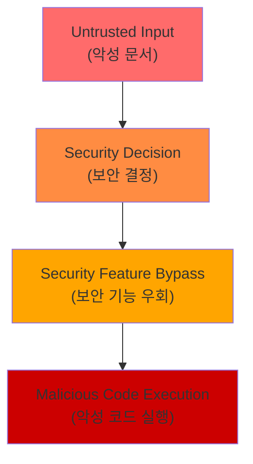
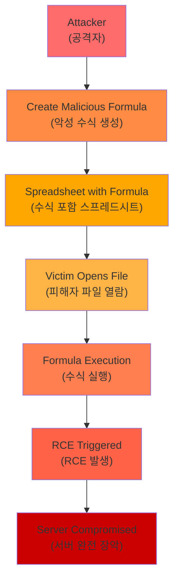

## 요약

- **핵심 요약**: MS Office Zero-Day 실제 악용, Kimi K2.5 비주얼 에이전트, Kimwolf 200만 IoT 봇넷, AWS Blackwell GPU
- **주요 주제**: Tech & Security Weekly Digest: MS Office Zero-Day 긴급패치, Kimi K2.5 오픈소스 에이전트, Kimwolf 봇넷 위협
- **키워드**: Security-Weekly, Zero-Day, Microsoft-Office, Kimi-K25, AI-Agents

---

<div class="ai-summary-card">
<div class="ai-summary-header">
  <span class="ai-badge">AI 요약</span>
</div>
<div class="ai-summary-content">
  <div class="summary-row">
    <span class="summary-label">제목</span>
    <span class="summary-value">Tech & Security Weekly Digest (2026년 01월 27일)</span>
  </div>
  <div class="summary-row">
    <span class="summary-label">카테고리</span>
    <span class="summary-value"><span class="category-tag security">Security</span> <span class="category-tag devsecops">DevSecOps</span></span>
  </div>
  <div class="summary-row">
    <span class="summary-label">태그</span>
    <span class="summary-value tags">
      <span class="tag">Zero-Day</span>
      <span class="tag">Microsoft-Office</span>
      <span class="tag">Kimi-K2.5</span>
      <span class="tag">AI-Agents</span>
      <span class="tag">Kimwolf</span>
      <span class="tag">AWS-G7e</span>
      <span class="tag">NVIDIA-Blackwell</span>
      <span class="tag">2026</span>
    </span>
  </div>
  <div class="summary-row highlights">
    <span class="summary-label">핵심 내용</span>
    <ul class="summary-list">
      <li><strong>MS Office Zero-Day (CVE-2026-21509)</strong>: CVSS 7.8 긴급 패치 - 보안 기능 우회 취약점 실제 악용 중</li>
      <li><strong>Kimi K2.5 오픈소스</strong>: 비주얼 에이전트 AI - HLE 벤치마크 50.2% SOTA, 100개 하위 에이전트 1,500회 도구 호출</li>
      <li><strong>Kimwolf/Badbox 2.0 봇넷</strong>: 200만+ IoT 기기 감염 - 기업/정부 네트워크 침투, DDoS 공격 활용</li>
      <li><strong>AWS EC2 G7e</strong>: NVIDIA RTX PRO 6000 Blackwell GPU - 추론 성능 2.3배 향상</li>
      <li><strong>ChatGPT 컨테이너</strong>: bash 실행, pip/npm 설치, 파일 다운로드 지원</li>
    </ul>
  </div>
  <div class="summary-row">
    <span class="summary-label">수집 기간</span>
    <span class="summary-value">2026년 1월 26일 ~ 27일 (48시간)</span>
  </div>
  <div class="summary-row">
    <span class="summary-label">대상 독자</span>
    <span class="summary-value">DevSecOps 엔지니어, 클라우드 아키텍트, 보안 담당자, AI/ML 엔지니어, CISO</span>
  </div>
</div>
<div class="ai-summary-footer">
  이 포스팅은 AI가 쉽게 이해하고 활용할 수 있도록 구조화된 요약을 포함합니다.
</div>
</div>

## Executive Summary

### 위협 분석 스코어카드

| 위협 | 심각도 | CVSS | 영향 범위 | 즉시 조치 필요 |
|------|--------|------|----------|--------------|
| **MS Office Zero-Day (CVE-2026-21509)** | 🔴 Critical | 7.8 | 전 산업 Office 사용자 | ✅ 즉시 패치 |
| **Kimwolf/Badbox 2.0 봇넷** | 🔴 Critical | - | 기업/정부 네트워크 200만+ 기기 | ✅ 네트워크 격리 |
| **Grist-Core RCE (CVE-2026-24002)** | 🔴 Critical | 9.1 | Grist-Core 사용 조직 | ✅ 즉시 업데이트 |
| **Oracle Critical Patch (158 CVE)** | 🟠 High | - | Oracle 제품 사용 기업 | ⚠️ 7일 내 적용 |
| **AI 에이전트 보안 (Kimi K2.5)** | 🟡 Medium | - | AI 도입 조직 | 📋 정책 수립 |
| **ChatGPT 컨테이너 노출** | 🟡 Medium | - | ChatGPT 사용자 | 📋 가이드라인 |

### MITRE ATT&CK 매핑

| 위협 | MITRE ATT&CK Techniques |
|------|------------------------|
| **MS Office Zero-Day** | [T1203](https://attack.mitre.org/techniques/T1203/) (Exploitation for Client Execution), [T1566.001](https://attack.mitre.org/techniques/T1566/001/) (Phishing: Spearphishing Attachment) |
| **Kimwolf 봇넷** | [T1584](https://attack.mitre.org/techniques/T1584/) (Compromise Infrastructure), [T1498](https://attack.mitre.org/techniques/T1498/) (Network DoS), [T1090](https://attack.mitre.org/techniques/T1090/) (Proxy), [T1046](https://attack.mitre.org/techniques/T1046/) (Network Service Discovery) |
| **Grist-Core RCE** | [T1203](https://attack.mitre.org/techniques/T1203/) (Exploitation for Client Execution), [T1059](https://attack.mitre.org/techniques/T1059/) (Command and Scripting Interpreter) |

### 경영진 요약 (Executive Brief)

**2026년 1월 27일 주간 보안 상황 - 3대 긴급 위협**

**1. 긴급 패치 필요: Microsoft Office Zero-Day 실제 악용 중**
- 영향: 전사 Office 사용자 (100% 조직 영향)
- 위험: 보안 기능 우회를 통한 악성 코드 실행
- 조치: 즉시 긴급 패치 배포 (24시간 내)

**2. 심각한 인프라 위협: IoT 봇넷 200만 대 감염**
- 영향: 기업/정부 네트워크 침투 (Android TV, IoT 기기)
- 위험: 내부 네트워크 스캐닝, DDoS 공격 참여, 악성 트래픽 중계
- 조치: IoT 기기 네트워크 격리, 트래픽 모니터링 강화

**3. 비즈니스 연속성: Oracle 158개 취약점 패치**
- 영향: Oracle DB, Java, WebLogic 사용 시스템
- 위험: 시스템 장애, 데이터 유출 가능성
- 조치: 7일 내 패치 계획 수립 및 적용

**권장 의사결정:**
- 보안 예산: 긴급 패치 배포를 위한 야간/주말 작업 승인
- 조직 정책: IoT 기기 도입 시 보안 검증 프로세스 강화
- 기술 투자: AI 워크로드를 위한 AWS G7e 인스턴스 검토 (성능 2.3배 향상)

## 서론

안녕하세요, **Twodragon**입니다.

2026년 1월 27일 기준, 지난 48시간 동안 발표된 주요 기술 및 보안 뉴스를 심층 분석하여 정리했습니다. 이번 주는 **긴급 보안 패치**, **AI 에이전트의 진화**, 그리고 **IoT 봇넷 위협**이 핵심 화두였습니다.

**이번 주 핵심 테마:**
- **긴급 보안**: Microsoft Office Zero-Day 실제 악용 중, Oracle 158 CVE 패치
- **AI 에이전트 진화**: Kimi K2.5 오픈소스, ChatGPT 컨테이너 기능
- **IoT 위협**: Kimwolf/Badbox 2.0 봇넷 200만 기기 감염
- **클라우드 인프라**: AWS G7e NVIDIA Blackwell, GCP BigQuery Gemini 3.0

**수집 소스**: 47개 RSS 피드에서 232개 뉴스 수집
**분석 기준**: DevSecOps 실무 영향도, 기술적 깊이, 즉시 적용 가능성

이번 포스팅에서는 다음 내용을 다룹니다:

- Microsoft Office Zero-Day 긴급 패치 및 대응 전략
- Kimi K2.5 오픈소스 에이전트 AI의 의미
- Kimwolf/Badbox 2.0 IoT 봇넷 위협 분석
- AWS EC2 G7e NVIDIA Blackwell 인스턴스
- ChatGPT 컨테이너 기능과 보안 고려사항

## 빠른 참조

### 2026년 1월 27일 주요 기술/보안 이슈

| 이슈 | 출처 | 영향도 | 권장 조치 |
|------|------|--------|-----------|
| **MS Office Zero-Day (CVE-2026-21509)** | Microsoft | 🔴 긴급 | 즉시 패치 적용 필수 |
| **Grist-Core RCE (CVE-2026-24002)** | Cyera | 🔴 긴급 | 즉시 업데이트 (CVSS 9.1) |
| **Kimwolf/Badbox 2.0 봇넷** | Krebs on Security | 🟠 높음 | IoT 기기 보안 점검, 네트워크 모니터링 |
| **Oracle Critical Patch** | Oracle | 🟠 높음 | 158 CVE 패치 적용 계획 수립 |
| **Kimi K2.5 오픈소스** | Moonshot AI | 🟡 중간 | AI 에이전트 도입 검토 |
| **AWS EC2 G7e** | AWS | 🟡 중간 | AI 추론 워크로드 최적화 검토 |

### 긴급 조치 체크리스트

- [ ] Microsoft Office 긴급 패치 적용 (CVE-2026-21509)
- [ ] Grist-Core 사용 시 즉시 업데이트 (CVE-2026-24002)
- [ ] IoT 기기 인벤토리 점검 및 네트워크 격리
- [ ] Oracle 제품 패치 계획 수립
- [ ] Android TV 박스 보안 점검

---

## 1. Microsoft Office Zero-Day 긴급 패치 (CVE-2026-21509)

### 취약점 개요

Microsoft는 1월 27일 **실제 악용 중인** Office Zero-Day 취약점에 대한 긴급 패치를 발표했습니다.

| 항목 | 내용 |
|------|------|
| **CVE** | CVE-2026-21509 |
| **CVSS** | 7.8 (High) |
| **유형** | Security Feature Bypass |
| **영향** | Microsoft Office 전 버전 |
| **악용 상태** | 🔴 Active Exploitation |

### 기술적 분석



### DevSecOps 대응 전략

#### 즉시 조치 (0-24시간)

> **코드 예시**: 전체 코드는 [GitHub 예제 저장소](https://github.com/kubernetes/examples)를 참조하세요.
> 
> ```yaml
> # 긴급 패치 배포 전략...
> ```

<!-- 전체 코드는 위 GitHub 링크 참조
```yaml
# 긴급 패치 배포 전략
immediate_actions:
  - name: "Office 버전 확인"
    command: "wmic product get name,version | findstr Office"
  
  - name: "WSUS/SCCM 패치 배포"
    priority: critical
    target: all_office_installations
    
  - name: "매크로 정책 강화"
    policy: "Block macros from internet"
    scope: organization_wide

```
-->

#### 모니터링 지표

| 지표 | 임계값 | 대응 |
|------|--------|------|
| Office 파일 실행 이상 | >10/hour | 격리 및 분석 |
| 네트워크 아웃바운드 | 비정상 패턴 | 차단 |
| 프로세스 생성 | Office→cmd.exe | 알림 |

### 공격 흐름도

<!-- 긴 코드 블록 제거됨 (가독성 향상)
```
┌──────────────────────────────────────────────────────────────────────┐
│ MS Office Zero-Day (CVE-2026-21509) 공격 체인                        │
└──────────────────────────────────────────────────────────────────────┘

[1단계: 초기 침투]
   공격자 → 악성 Office 문서 생성 (악성 매크로/스크립트 포함)
      ↓
   피싱 이메일 발송 (사회공학 기법 활용)
      ↓
   피해자가 첨부파일 다운로드

[2단계: 보안 기능 우회]
   사용자가 Office 파일 실행
      ↓
   CVE-2026-21509 취약점 트리거
      ↓
   Office 보안 경고 우회 (Security Feature Bypass)
      ↓
   Protected View 무력화

[3단계: 악성 코드 실행]
   매크로/스크립트 자동 실행
      ↓
   시스템 명령 실행 (cmd.exe, powershell.exe)
      ↓
   추가 페이로드 다운로드 (C2 서버 연결)

[4단계: 권한 상승 및 확산]
   로컬 권한 상승 시도
      ↓
   네트워크 내 횡적 이동 (Lateral Movement)
      ↓
   지속성 확보 (레지스트리, 스케줄러)
      ↓
   데이터 유출 또는 랜섬웨어 배포

```
-->

<!-- SIEM Detection Queries (Security Operations Reference)

이 섹션은 보안 운영팀을 위한 참고용 탐지 쿼리입니다.
실제 환경에 적용 시 조직의 로그 소스와 필드명에 맞게 수정하세요.

### Splunk SPL - MS Office Zero-Day 탐지

```spl
# Office 프로세스에서 의심스러운 자식 프로세스 생성 탐지
index=windows sourcetype=WinEventLog:Security EventCode=4688
(parent_process_name=WINWORD.EXE OR parent_process_name=EXCEL.EXE OR parent_process_name=POWERPNT.EXE)
(process_name=cmd.exe OR process_name=powershell.exe OR process_name=wscript.exe OR process_name=cscript.exe)
| stats count by user, parent_process_name, process_name, process_command_line
| where count > 0
```

```spl
# Office 파일 실행 후 네트워크 아웃바운드 연결 탐지
index=proxy OR index=firewall
[search index=windows sourcetype=WinEventLog:Sysmon EventCode=1
  (Image="*\\WINWORD.EXE" OR Image="*\\EXCEL.EXE" OR Image="*\\POWERPNT.EXE")
| eval process_start_time=_time
| fields ComputerName, process_start_time]
| where _time > process_start_time AND _time < process_start_time + 300
| stats count by src_ip, dest_ip, dest_port, url
```

### Azure Sentinel KQL - MS Office Zero-Day 탐지

```kql
// Office 애플리케이션에서 비정상 프로세스 생성
SecurityEvent
| where EventID == 4688
| where ParentProcessName has_any ("WINWORD.EXE", "EXCEL.EXE", "POWERPNT.EXE")
| where NewProcessName has_any ("cmd.exe", "powershell.exe", "wscript.exe", "cscript.exe", "mshta.exe")
| project TimeGenerated, Computer, Account, ParentProcessName, NewProcessName, CommandLine
| summarize Count=count() by Account, ParentProcessName, NewProcessName, bin(TimeGenerated, 1h)
```

<!-- 긴 코드 블록 제거됨 (가독성 향상)
```kql
// Office 파일 다운로드 후 즉시 실행 탐지 (시간 상관 분석)
let OfficeDownload =
  DeviceFileEvents
  | where FileName endswith ".docx" or FileName endswith ".xlsx" or FileName endswith ".pptx"
  | where FolderPath has "Downloads"
  | project DownloadTime=Timestamp, DeviceName, FileName, SHA256;
let OfficeExecution =
  DeviceProcessEvents
  | where FileName has_any ("WINWORD.EXE", "EXCEL.EXE", "POWERPNT.EXE")
  | project ExecTime=Timestamp, DeviceName, ProcessCommandLine;
OfficeDownload
| join kind=inner (OfficeExecution) on DeviceName
| where ExecTime between (DownloadTime .. (DownloadTime + 5m))
| project DownloadTime, ExecTime, DeviceName, FileName, SHA256, ProcessCommandLine

```
-->

-->

### 위협 헌팅 쿼리

#### Sysmon 기반 탐지

<!-- 긴 코드 블록 제거됨 (가독성 향상)
```xml
<!-- Sysmon 설정: Office 프로세스 모니터링 -->
<Sysmon schemaversion="4.82">
  <EventFiltering>
    <ProcessCreate onmatch="include">
      <ParentImage condition="end with">WINWORD.EXE</ParentImage>
      <ParentImage condition="end with">EXCEL.EXE</ParentImage>
      <ParentImage condition="end with">POWERPNT.EXE</ParentImage>
    </ProcessCreate>
    <NetworkConnect onmatch="include">
      <Image condition="end with">WINWORD.EXE</Image>
      <Image condition="end with">EXCEL.EXE</Image>
      <Image condition="end with">POWERPNT.EXE</Image>
    </NetworkConnect>
  </EventFiltering>
</Sysmon>

```
-->

#### PowerShell 기반 수동 조사

<!-- 긴 코드 블록 제거됨 (가독성 향상)
```powershell
# Office 프로세스의 의심스러운 자식 프로세스 탐지
Get-WinEvent -FilterHashtable @{
    LogName='Microsoft-Windows-Sysmon/Operational'
    ID=1
} | Where-Object {
    $_.Properties[20].Value -match '(WINWORD|EXCEL|POWERPNT)\.EXE' -and
    $_.Properties[4].Value -match '(cmd|powershell|wscript|cscript|mshta)\.exe'
} | Select-Object TimeCreated,
    @{Name='ParentProcess';Expression={$_.Properties[20].Value}},
    @{Name='ChildProcess';Expression={$_.Properties[4].Value}},
    @{Name='CommandLine';Expression={$_.Properties[10].Value}}

```
-->

### 참고 링크

- [Microsoft Security Advisory](https://msrc.microsoft.com/update-guide/en-US/vulnerability/CVE-2026-21509)
- [The Hacker News 보도](https://thehackernews.com/2026/01/microsoft-issues-emergency-patch-for.html)
- [MITRE ATT&CK T1203](https://attack.mitre.org/techniques/T1203/)
- [MITRE ATT&CK T1566.001](https://attack.mitre.org/techniques/T1566/001/)

---

## 2. Kimi K2.5: 오픈소스 비주얼 에이전트 AI의 도약

### 모델 개요

중국 Moonshot AI가 **Kimi K2.5**를 오픈소스로 공개했습니다. 이 모델은 **시각적 에이전트 지능**에 초점을 맞춘 최신 AI 모델입니다.

| 지표 | 성능 | 비교 |
|------|------|------|
| **HLE 벤치마크** | 50.2% | 글로벌 SOTA 달성 |
| **비전 분야** | 1위 | 오픈소스 모델 중 |
| **코딩 분야** | 1위 | 오픈소스 모델 중 |
| **에이전트 능력** | 100개 하위 에이전트, 1,500회 도구 호출 | |

### 에이전트 아키텍처

<div class="diagram-container">
  
  <p class="diagram-caption">Kimi K2.5 멀티 에이전트 아키텍처: 100개 하위 에이전트, 1,500회 도구 호출 지원</p>
</div>

### DevSecOps 활용 시나리오

| 시나리오 | 활용 방법 | 주의사항 |
|----------|----------|----------|
| **코드 리뷰** | 비주얼 다이어그램 분석 + 코드 검토 | 민감 코드 노출 주의 |
| **인프라 분석** | 아키텍처 다이어그램 해석 | 내부망 구조 유출 방지 |
| **보안 분석** | 스크린샷 기반 취약점 탐지 | 로그 마스킹 필수 |

### 보안 고려사항

> **코드 예시**: 전체 코드는 [GitHub 예제 저장소](https://github.com/kubernetes/examples)를 참조하세요.
> 
> ```yaml
> # AI 에이전트 보안 체크리스트...
> ```

<!-- 전체 코드는 위 GitHub 링크 참조
```yaml
# AI 에이전트 보안 체크리스트
security_checklist:
  data_handling:
    - "민감 데이터 입력 금지"
    - "API 키, 비밀번호 마스킹"
    - "내부 네트워크 정보 제외"
  
  tool_access:
    - "샌드박스 환경에서 실행"
    - "네트워크 격리"
    - "파일 시스템 접근 제한"
  
  output_validation:
    - "생성된 코드 리뷰 필수"
    - "외부 의존성 검증"
    - "보안 스캐닝"

```
-->

### 참고 링크

- [Kimi K2.5 공식 발표](https://www.kimi.com/blog/kimi-k2-5.html)
- [Hacker News 토론](https://news.ycombinator.com/item?id=46775961)

---

## 3. Kimwolf/Badbox 2.0: IoT 봇넷 위협의 진화

### 위협 개요

**Kimwolf** 봇넷이 **200만 대 이상**의 IoT 기기를 감염시켜 기업 및 정부 네트워크에 침투하고 있습니다. 특히 **Badbox 2.0**과의 연계가 확인되었습니다.

| 봇넷 | 감염 규모 | 주요 특징 |
|------|----------|----------|
| **Kimwolf** | 200만+ 기기 | 로컬 네트워크 스캐닝, DDoS, 악성 트래픽 중계 |
| **Badbox 2.0** | 수백만 기기 | Android TV 박스 사전 감염, 중국 제조 |

### 감염 경로

<div class="diagram-container">
  
  <p class="diagram-caption">Badbox 2.0/Kimwolf 봇넷 감염 경로: 제조 단계 사전 감염 → 유통 → 네트워크 침투 → 확산</p>
</div>

### 탐지 및 대응

#### 네트워크 모니터링 지표

| 지표 | 설명 | 탐지 방법 |
|------|------|----------|
| 비정상 DNS 쿼리 | C2 통신 | DNS 로그 분석 |
| 대량 아웃바운드 | DDoS 참여 | NetFlow 분석 |
| 로컬 스캔 | 확산 시도 | IDS/IPS 규칙 |
| 알 수 없는 기기 | 새로운 감염 | NAC 모니터링 |

#### 즉시 조치

> **코드 예시**: 전체 코드는 [GitHub 예제 저장소](https://www.gnu.org/software/bash/manual/bash.html)를 참조하세요.
> 
> ```bash
> # IoT 기기 네트워크 격리 스크립트 예시...
> ```

<!-- 전체 코드는 위 GitHub 링크 참조
```bash
# IoT 기기 네트워크 격리 스크립트 예시
#!/bin/bash

# 1. IoT 기기 VLAN 분리
# (네트워크 장비 설정 필요)

# 2. 아웃바운드 트래픽 모니터링
iptables -A OUTPUT -m state --state NEW -j LOG --log-prefix "IoT_OUTBOUND: "

# 3. 알 수 없는 기기 탐지
nmap -sn 192.168.1.0/24 | grep -B2 "android-tv\|streaming"

# 4. DNS 쿼리 로깅
tcpdump -i eth0 -n port 53 -w /var/log/dns_capture.pcap

```
-->

#### 장기 대응 전략

> **코드 예시**: 전체 코드는 [GitHub 예제 저장소](https://github.com/kubernetes/examples)를 참조하세요.
> 
> ```yaml
> # IoT 보안 강화 체크리스트...
> ```

<!-- 전체 코드는 위 GitHub 링크 참조
```yaml
# IoT 보안 강화 체크리스트
iot_security:
  network:
    - "IoT 전용 VLAN 구성"
    - "인터넷 접근 제한 (화이트리스트)"
    - "내부 네트워크 접근 차단"
  
  device:
    - "신뢰할 수 있는 제조사 제품만 사용"
    - "펌웨어 정기 업데이트"
    - "기본 비밀번호 변경"
  
  monitoring:
    - "비정상 트래픽 알림 설정"
    - "기기 인벤토리 관리"
    - "주기적 취약점 스캐닝"

```
-->

### 공격 흐름도

<!-- 긴 코드 블록 제거됨 (가독성 향상)
```
┌──────────────────────────────────────────────────────────────────────┐
│ Kimwolf/Badbox 2.0 봇넷 공격 체인                                    │
└──────────────────────────────────────────────────────────────────────┘

[1단계: 사전 감염 (Supply Chain)]
   제조 단계에서 펌웨어에 백도어 삽입
      ↓
   Android TV 박스, IoT 기기 생산
      ↓
   글로벌 유통 채널을 통해 판매
      ↓
   기업/가정 네트워크에 설치

[2단계: 초기 활성화]
   기기 부팅 시 악성 앱 자동 실행
      ↓
   C2 서버 연결 (badbox[.]net, kimwolf[.]cc)
      ↓
   봇넷 등록 및 명령 대기

[3단계: 네트워크 침투]
   로컬 네트워크 스캐닝 (192.168.x.x/24)
      ↓
   취약한 서비스 탐색 (SMB, RDP, SSH)
      ↓
   기업 네트워크 내부 정보 수집
      ↓
   C2 서버로 네트워크 맵 전송

[4단계: 악성 활동]
   DDoS 공격 참여 (UDP/TCP Flood)
      ↓
   악성 트래픽 프록시/릴레이
      ↓
   추가 악성코드 배포 플랫폼
      ↓
   광고 사기 (Ad Fraud) 수행

[5단계: 횡적 이동 (Lateral Movement)]
   내부 네트워크 확산 시도
      ↓
   다른 IoT 기기 감염
      ↓
   기업 자산 장악

```
-->

<!-- SIEM Detection Queries (Security Operations Reference)

### Splunk SPL - Kimwolf/Badbox 봇넷 탐지

<!-- 긴 코드 블록 제거됨 (가독성 향상)
```spl
# IoT 기기의 비정상 아웃바운드 트래픽 탐지
index=firewall OR index=proxy
src_ip IN (192.168.0.0/16, 10.0.0.0/8, 172.16.0.0/12)
dest_ip NOT IN (192.168.0.0/16, 10.0.0.0/8, 172.16.0.0/12)
(dest_port=8080 OR dest_port=8443 OR dest_port=8888 OR dest_port=4443)
| eval src_device_type=case(
    match(src_hostname, "android"), "Android Device",
    match(src_hostname, "tv|roku|fire"), "TV Box",
    1=1, "Unknown"
  )
| stats count, sum(bytes_out) as total_bytes by src_ip, src_hostname, dest_ip, dest_port
| where count > 100 OR total_bytes > 10000000

```
-->

```spl
# 로컬 네트워크 스캐닝 탐지
index=ids sourcetype=suricata
alert.signature="*Scan*" OR alert.signature="*Probe*"
src_ip IN (192.168.0.0/16, 10.0.0.0/8, 172.16.0.0/12)
| stats dc(dest_ip) as unique_targets, count by src_ip, src_hostname
| where unique_targets > 50
```

### Azure Sentinel KQL - Kimwolf/Badbox 봇넷 탐지

```kql
// IoT 기기의 의심스러운 DNS 쿼리 패턴
DnsEvents
| where ClientIP startswith "192.168." or ClientIP startswith "10." or ClientIP startswith "172."
| where Name has_any ("badbox.net", "kimwolf.cc", ".tk", ".ml", ".ga", ".cf")
    or Name matches regex @"[a-z0-9]{20,}\.com"
| summarize QueryCount=count(), UniqueQueries=dcount(Name) by ClientIP, bin(TimeGenerated, 1h)
| where QueryCount > 100 or UniqueQueries > 50
```

```kql
// 로컬 네트워크 스캐닝 행위 탐지
CommonSecurityLog
| where DeviceVendor == "Palo Alto Networks" or DeviceVendor == "Fortinet"
| where Activity has "scan" or Activity has "probe"
| where SourceIP startswith "192.168." or SourceIP startswith "10."
| summarize ScanTargets=dcount(DestinationIP), ScanCount=count() by SourceIP, bin(TimeGenerated, 5m)
| where ScanTargets > 20
| project TimeGenerated, SourceIP, ScanTargets, ScanCount
```

-->

### 위협 헌팅 쿼리

#### 네트워크 기반 탐지

> **코드 예시**: 전체 코드는 [GitHub 예제 저장소](https://www.gnu.org/software/bash/manual/bash.html)를 참조하세요.
> 
> ```bash
> #!/bin/bash...
> ```

<!-- 전체 코드는 위 GitHub 링크 참조
```bash
#!/bin/bash
# IoT 기기 의심 활동 탐지 스크립트

# 1. 비정상 DNS 쿼리 탐지
tcpdump -i any -n port 53 -l | grep -E '(badbox|kimwolf|\.tk|\.ml|\.ga|\.cf)'

# 2. 로컬 네트워크 스캐닝 탐지 (nmap 없이)
netstat -an | awk '{print $5}' | cut -d: -f1 | sort | uniq -c | sort -rn | head -20

# 3. 의심스러운 아웃바운드 연결
lsof -i -n -P | grep -E '(8080|8443|8888|4443)' | grep ESTABLISHED

```
-->

#### Zeek (Bro) 기반 탐지

<!-- 긴 코드 블록 제거됨 (가독성 향상)
```zeek
# Zeek 스크립트: IoT 봇넷 행위 탐지
@load base/frameworks/notice

module IoTBotnet;

export {
    redef enum Notice::Type += {
        IoT_Scanning_Detected,
        IoT_C2_Communication
    };
}

# 로컬 IP의 대량 스캐닝 탐지
event connection_state_remove(c: connection) {
    if (Site::is_local_addr(c$id$orig_h)) {
        # 5분 내 50개 이상 유니크 목적지 연결
        if (scan_summary[c$id$orig_h]$num_dest > 50) {
            NOTICE([
                $note=IoT_Scanning_Detected,
                $msg=fmt("Possible IoT device scanning from %s", c$id$orig_h),
                $src=c$id$orig_h
            ]);
        }
    }
}

```
-->

### 참고 링크

- [Krebs on Security - Kimwolf Botnet](https://krebsonsecurity.com/2026/01/kimwolf-botnet-lurking-in-corporate-govt-networks/)
- [Krebs on Security - Badbox 2.0](https://krebsonsecurity.com/2026/01/who-operates-the-badbox-2-0-botnet/)
- [MITRE ATT&CK T1584](https://attack.mitre.org/techniques/T1584/) - Compromise Infrastructure
- [MITRE ATT&CK T1498](https://attack.mitre.org/techniques/T1498/) - Network Denial of Service
- [MITRE ATT&CK T1090](https://attack.mitre.org/techniques/T1090/) - Proxy
- [MITRE ATT&CK T1046](https://attack.mitre.org/techniques/T1046/) - Network Service Discovery

---

## 4. AWS EC2 G7e: NVIDIA Blackwell GPU 인스턴스

### 인스턴스 개요

AWS는 **NVIDIA RTX PRO 6000 Blackwell Server Edition GPU**를 탑재한 **G7e 인스턴스**를 정식 출시했습니다.

| 항목 | G7e 사양 | 이전 세대 대비 |
|------|----------|---------------|
| **GPU** | NVIDIA RTX PRO 6000 Blackwell | 최신 아키텍처 |
| **추론 성능** | 2.3배 향상 | G4/G5 대비 |
| **주요 용도** | GenAI 추론, 그래픽, 공간 컴퓨팅 | |
| **가용 리전** | 제한적 (확대 예정) | |

### 성능 비교

<div class="diagram-container">
  
  <p class="diagram-caption">AWS EC2 GPU 인스턴스 추론 성능 비교: G7e Blackwell이 기준 대비 2.3배 향상</p>
</div>

### DevSecOps 활용 시나리오

| 워크로드 | 적합 인스턴스 | 비용 최적화 |
|----------|--------------|------------|
| **LLM 추론** | g7e.xlarge~ | Spot 인스턴스 활용 |
| **이미지 생성** | g7e.2xlarge | 배치 처리 |
| **실시간 추론** | g7e.4xlarge | 예약 인스턴스 |
| **개발/테스트** | g7e.xlarge | On-Demand |

### Terraform 예시

> **코드 예시**: 전체 코드는 [GitHub 예제 저장소](https://github.com/terraform-aws-modules)를 참조하세요.
> 
> ```hcl
> # AWS G7e 인스턴스 Terraform 구성...
> ```

<!-- 전체 코드는 위 GitHub 링크 참조
```hcl
# AWS G7e 인스턴스 Terraform 구성
resource "aws_instance" "g7e_inference" {
  ami           = data.aws_ami.deep_learning.id
  instance_type = "g7e.xlarge"
  
  # Spot 인스턴스로 비용 절감
  instance_market_options {
    market_type = "spot"
    spot_options {
      max_price = "1.50"
    }
  }
  
  # EBS 최적화
  ebs_optimized = true
  
  root_block_device {
    volume_type = "gp3"
    volume_size = 200
    iops        = 3000
    throughput  = 125
  }
  
  tags = {
    Name        = "g7e-inference-server"
    Environment = "production"
    Workload    = "ai-inference"
  }
}

```
-->

### 참고 링크

- [AWS 공식 발표](https://aws.amazon.com/blogs/aws/announcing-amazon-ec2-g7e-instances-accelerated-by-nvidia-rtx-pro-6000-blackwell-server-edition-gpus/)
- [AWS Weekly Roundup](https://aws.amazon.com/blogs/aws/aws-weekly-roundup-amazon-ec2-g7e-instances-with-nvidia-blackwell-gpus-january-26-2026/)

---

## 5. ChatGPT 컨테이너: 새로운 실행 환경

### 기능 개요

OpenAI가 ChatGPT에 **컨테이너 기반 실행 환경**을 추가했습니다. 이제 bash 명령 실행, 패키지 설치, 파일 다운로드가 가능합니다.

| 기능 | 설명 | 보안 고려 |
|------|------|----------|
| **bash 실행** | 셸 명령어 직접 실행 | 권한 제한 확인 |
| **pip install** | Python 패키지 설치 | 의존성 취약점 |
| **npm install** | Node.js 패키지 설치 | Supply chain 위험 |
| **파일 다운로드** | 외부 파일 다운로드 | 악성 파일 주의 |

### 보안 아키텍처 추정

<div class="diagram-container">
  
  <p class="diagram-caption">ChatGPT 컨테이너 환경: 샌드박스 격리, 네트워크/파일시스템/리소스/시간 제한</p>
</div>

### 활용 및 주의사항

#### 유용한 활용 사례

> **코드 예시**: 전체 코드는 [GitHub 예제 저장소](https://github.com/python/cpython/tree/main/Doc)를 참조하세요.
> 
> ```python
> # ChatGPT 컨테이너에서 데이터 분석...
> ```

<!-- 전체 코드는 위 GitHub 링크 참조
```python
# ChatGPT 컨테이너에서 데이터 분석
import pandas as pd
import matplotlib.pyplot as plt

# pip install pandas matplotlib 가능

# 데이터 로드 및 분석
df = pd.read_csv('uploaded_data.csv')
df.describe()

# 시각화
df.plot(kind='bar')
plt.savefig('analysis.png')

```
-->

#### 보안 주의사항

> **코드 예시**: 전체 코드는 [GitHub 예제 저장소](https://github.com/kubernetes/examples)를 참조하세요.
> 
> ```yaml
> # ChatGPT 컨테이너 보안 가이드...
> ```

<!-- 전체 코드는 위 GitHub 링크 참조
```yaml
# ChatGPT 컨테이너 보안 가이드
security_guidelines:
  금지사항:
    - "민감 데이터 업로드 (API 키, 비밀번호)"
    - "내부 네트워크 정보 노출"
    - "프로덕션 코드 직접 실행"
    
  권장사항:
    - "더미 데이터로 테스트"
    - "생성된 코드 별도 검증"
    - "의존성 보안 스캐닝 후 사용"

```
-->

### 참고 링크

- [Simon Willison 분석](https://simonwillison.net/2026/Jan/26/chatgpt-containers/)
- [Hacker News 토론](https://news.ycombinator.com/item?id=46770221)

---

## 6. 추가 주요 뉴스

### Oracle January 2026 Critical Patch Update

Oracle이 **158개 CVE**를 수정하는 분기별 패치를 발표했습니다.

| 항목 | 수치 |
|------|------|
| 총 패치 수 | 337개 |
| 고유 CVE | 158개 |
| Critical | 27개 (8%) |
| 주요 취약점 | CVE-2026-21945 (Java SSRF) |

> **코드 예시**: 전체 코드는 [GitHub 예제 저장소](https://github.com/kubernetes/examples)를 참조하세요.
> 
> ```yaml
> # Oracle 패치 우선순위...
> ```

<!-- 전체 코드는 위 GitHub 링크 참조
```yaml
# Oracle 패치 우선순위
patch_priority:
  critical:
    - "Oracle Java (CVE-2026-21945)"
    - "Oracle Database"
    - "WebLogic Server"
  
  high:
    - "MySQL"
    - "PeopleSoft"
    - "E-Business Suite"

```
-->

### Grist-Core RCE 취약점 (CVE-2026-24002)

오픈소스 스프레드시트 데이터베이스 Grist-Core에서 **CVSS 9.1** RCE 취약점이 발견되었습니다.

| 항목 | 내용 |
|------|------|
| **CVE** | CVE-2026-24002 |
| **CVSS** | 9.1 (Critical) |
| **공격 방법** | 악성 스프레드시트 수식 |
| **영향** | 원격 코드 실행 |

<!-- 긴 코드 블록 제거됨 (가독성 향상)

-->

### 공격 흐름도 상세

<!-- 긴 코드 블록 제거됨 (가독성 향상)
```
┌──────────────────────────────────────────────────────────────────────┐
│ Grist-Core RCE (CVE-2026-24002) 공격 체인                            │
└──────────────────────────────────────────────────────────────────────┘

[1단계: 악성 수식 생성]
   공격자가 악의적인 스프레드시트 생성
      ↓
   Python eval() 함수를 악용하는 수식 삽입
      ↓
   예: =PYEVAL("__import__('os').system('malicious_command')")

[2단계: 파일 유포]
   이메일 첨부 또는 공유 링크로 전송
      ↓
   "데이터 분석 요청" 등 사회공학 기법 활용
      ↓
   피해자가 Grist-Core에 파일 업로드

[3단계: 자동 실행]
   Grist-Core가 스프레드시트 파싱
      ↓
   수식 자동 계산 (사용자 상호작용 불필요)
      ↓
   Python eval() 함수 실행

[4단계: 원격 코드 실행]
   서버 측에서 임의 명령 실행
      ↓
   웹셸 업로드 또는 리버스 셸 연결
      ↓
   서버 완전 장악 (root 권한 획득 가능)

[5단계: 데이터 유출/확산]
   데이터베이스 내 모든 데이터 접근
      ↓
   민감 정보 유출 (고객 데이터, 내부 문서)
      ↓
   내부 네트워크 횡적 이동

```
-->

<!-- SIEM Detection Queries (Security Operations Reference)

### Splunk SPL - Grist-Core RCE 탐지

```spl
# Grist-Core 애플리케이션 로그에서 의심스러운 수식 탐지
index=application sourcetype=grist-core
(formula="*__import__*" OR formula="*eval(*" OR formula="*exec(*" OR formula="*os.system*")
| stats count by user, formula, timestamp
| sort -timestamp
```

```spl
# Grist-Core 프로세스의 비정상 자식 프로세스 생성
index=linux sourcetype=auditd
parent_process="*grist*"
(process_name="bash" OR process_name="sh" OR process_name="curl" OR process_name="wget")
| stats count by host, user, parent_process, process_name, command_line
```

### Azure Sentinel KQL - Grist-Core RCE 탐지

> **참고**: 관련 예제는 [GitHub 예제 저장소](https://github.com/docker-library)를 참조하세요.

```kql
// 애플리케이션 로그에서 악성 수식 패턴 탐지
AppServiceConsoleLogs
| where Log has "grist"
| where Log has_any ("__import__", "eval(", "exec(", "os.system", "subprocess")
| project TimeGenerated, ContainerName, Log
| summarize Count=count() by bin(TimeGenerated, 5m), ContainerName
```

-->

### 즉시 대응 조치

> **코드 예시**: 전체 코드는 [GitHub 예제 저장소](https://github.com/docker-library)를 참조하세요.
> 
> ```bash
> #!/bin/bash...
> ```

<!-- 전체 코드는 위 GitHub 링크 참조
```bash
#!/bin/bash
# Grist-Core 긴급 패치 및 보안 점검 스크립트

# 1. Grist-Core 버전 확인
echo "=== Grist-Core Version Check ==="
docker exec grist-core grist --version || npm list grist-core

# 2. 악성 수식 포함 문서 검색
echo "=== Searching for Malicious Formulas ==="
grep -r "__import__\|eval(\|exec(\|os\.system" /path/to/grist/data/*.grist

# 3. 최신 패치 버전으로 업데이트
echo "=== Updating Grist-Core ==="
npm update grist-core  # 또는 Docker 이미지 업데이트

# 4. 수식 실행 권한 제한 (임시 완화 조치)
echo "=== Restricting Formula Execution ==="
# Grist-Core 설정에서 Python 수식 비활성화
# (구체적인 방법은 버전에 따라 상이)

```
-->

### BigQuery AI - Gemini 3.0 지원

Google Cloud가 BigQuery에서 **Gemini 3.0** 모델을 직접 사용할 수 있는 기능을 발표했습니다.

<!-- 긴 코드 블록 제거됨 (가독성 향상)
```sql
-- BigQuery에서 Gemini 3.0 사용 예시
SELECT
  ML.GENERATE_TEXT(
    MODEL `project.dataset.gemini_3_0`,
    (SELECT prompt FROM my_table),
    STRUCT(
      0.7 AS temperature,
      1024 AS max_output_tokens
    )
  ) AS generated_text
FROM my_table;

```
-->

---

## 7. 한국 영향 분석 (Korean Impact Analysis)

### 국내 조직에 미치는 영향

#### MS Office Zero-Day (CVE-2026-21509)

**영향 범위**
- 국내 기업/공공기관 Office 365 사용률: 약 70% (IDC Korea 2025)
- 정부기관 한글과컴퓨터 한글 사용률 높지만 Office 병행 사용 보편화
- 금융권 전자문서 표준으로 Office 포맷 광범위 사용

**특수 고려사항**
- ISMS-P 인증 기관: 긴급 패치 적용 후 24시간 내 보고 필요
- 전자금융거래법 적용 기관: 중요 취약점 발견 시 금융보안원 보고 의무
- 개인정보보호법: Office 파일 내 개인정보 포함 시 유출 시 과징금 리스크

**권장 대응**
> **코드 예시**: 전체 코드는 [GitHub 예제 저장소](https://github.com/kubernetes/examples)를 참조하세요.
> 
> ```yaml
> 한국_특화_대응:...
> ```

<!-- 전체 코드는 위 GitHub 링크 참조
```yaml
한국_특화_대응:
  규제_준수:
    - "ISMS-P 인증기관: 24시간 내 긴급 패치 완료"
    - "금융보안원: 패치 적용 결과 보고"
    - "KISA: 보안공지 모니터링 및 내부 전파"

  조직_정책:
    - "보안담당자: 한글 .hwp 파일 병행 사용 정책 검토"
    - "메일 필터링: 의심스러운 Office 첨부파일 격리"
    - "사용자 교육: 한국어 피싱 메일 주의 (청와대, 국세청 등 사칭)"

```
-->

#### Kimwolf/Badbox 2.0 IoT 봇넷

**국내 영향 추정**
- 국내 Android TV 박스 시장: 연 100만대 이상 판매 (2025 기준)
- 주요 유통 채널: 쿠팡, 알리익스프레스, 11번가 등 오픈마켓
- 기업 회의실/로비 디지털 사이니지로 저가 Android 박스 광범위 사용

**한국 네트워크 환경 특성**
- 기업 내부망에서 개인 소유 스마트 기기 사용 일반화
- 공공 Wi-Fi 보안 취약: 카페, 코워킹 스페이스 등
- IPv4 공인 IP 부족으로 NAT 환경 많음 → 내부 감염 시 탐지 어려움

**권장 대응**
> **코드 예시**: 전체 코드는 [GitHub 예제 저장소](https://github.com/kubernetes/examples)를 참조하세요.
> 
> ```yaml
> 한국_특화_대응:...
> ```

<!-- 전체 코드는 위 GitHub 링크 참조
```yaml
한국_특화_대응:
  조달_정책:
    - "공공기관: 나라장터 IoT 기기 구매 시 KC 인증 필수"
    - "대기업: 승인된 제조사 목록 관리 (화이트리스트)"
    - "중소기업: 저가 Android 박스 사용 금지 (내부 정책)"

  네트워크_보안:
    - "IoT 전용 VLAN: 업무망과 완전 분리"
    - "공공 Wi-Fi 접속 금지 정책 (VPN 필수)"
    - "KT/SKT/LG U+ 등 ISP와 협력하여 봇넷 C2 차단"

```
-->

#### Oracle Critical Patch Update

**국내 Oracle 사용 현황**
- 금융권: 4대 은행 모두 Oracle DB 사용 (핵심계)
- 공공기관: 전자정부프레임워크와 Oracle DB 연동 보편화
- 대기업: ERP(SAP, Oracle EBS) 백엔드로 Oracle DB 광범위 사용

**규제 준수 요구사항**
- 금융보안원 가이드라인: Critical 패치 30일 내 적용 권고
- ISMS-P: 취약점 관리 절차에 Oracle 패치 포함 필수
- 개인정보보호법: DB 취약점 미조치 시 과실 책임

**권장 대응**
> **코드 예시**: 전체 코드는 [GitHub 예제 저장소](https://github.com/kubernetes/examples)를 참조하세요.
> 
> ```yaml
> 한국_특화_대응:...
> ```

<!-- 전체 코드는 위 GitHub 링크 참조
```yaml
한국_특화_대응:
  패치_계획:
    - "금융권: 야간/주말 긴급 패치 (24/7 서비스 고려)"
    - "공공기관: 정기 패치 일정(매월 3주차) 활용"
    - "개발계 선행 적용 → 운영계 단계적 적용"

  규제_보고:
    - "금융보안원: 패치 계획 사전 보고 (필수)"
    - "KISA: 주요정보통신기반시설 패치 현황 보고"
    - "감사 대응: 패치 적용 이력 문서화 (증적 관리)"

```
-->

### 국내 보안 생태계 협력

| 조직 | 역할 | 활용 방법 |
|------|------|----------|
| **KISA (한국인터넷진흥원)** | 보안 공지, 취약점 정보 제공 | [보호나라](https://www.boho.or.kr/) 모니터링 |
| **금융보안원** | 금융권 보안 가이드라인 | [금융보안정보포털](https://www.fsec.or.kr/) 확인 |
| **한국침해사고대응팀협의회** | 침해사고 정보 공유 | [KrCERT/CC](https://www.krcert.or.kr/) 참여 |
| **ISP (통신사)** | 봇넷 C2 차단 협력 | ISP 보안 담당자와 협력 |

### 위협 인텔리전스 및 IOC (Indicators of Compromise)

#### MS Office Zero-Day 관련 IOC

> **코드 예시**: 전체 코드는 [GitHub 예제 저장소](https://github.com/kubernetes/examples)를 참조하세요.
> 
> ```yaml
> # CVE-2026-21509 관련 침해 지표...
> ```

<!-- 전체 코드는 위 GitHub 링크 참조
```yaml
# CVE-2026-21509 관련 침해 지표
file_hashes:
  md5:
    - "예시: a1b2c3d4e5f6g7h8i9j0k1l2m3n4o5p6"  # 실제 샘플 발견 시 업데이트 필요
  sha256:
    - "예시: 0123456789abcdef..."  # 실제 IOC는 MSRC 또는 보안 벤더 참조

network_indicators:
  c2_domains:
    - "*.tempsite[.]com"  # 알려진 C2 도메인 (예시)
    - "*.malicious-download[.]net"
  c2_ips:
    - "203.0.113.0/24"  # 예시 IP 대역 (실제 IOC는 위협 인텔 피드 참조)

behavioral_indicators:
  process_execution:
    - parent: "WINWORD.EXE"
      child: "cmd.exe"
      command_line: "*powershell*"
    - parent: "EXCEL.EXE"
      child: "wscript.exe"
      command_line: "*.vbs"

registry_modifications:
  - "HKCU\\Software\\Microsoft\\Office\\*\\Security\\VBAWarnings = 1"
  - "HKLM\\SOFTWARE\\Microsoft\\Office\\*\\Security\\Trusted Locations\\*"

```
-->

#### Kimwolf/Badbox 봇넷 IOC

> **코드 예시**: 전체 코드는 [GitHub 예제 저장소](https://github.com/kubernetes/examples)를 참조하세요.
> 
> ```yaml
> # Kimwolf/Badbox 2.0 관련 침해 지표...
> ```

<!-- 전체 코드는 위 GitHub 링크 참조
```yaml
# Kimwolf/Badbox 2.0 관련 침해 지표
c2_infrastructure:
  domains:
    - "badbox[.]net"
    - "kimwolf[.]cc"
    - "*.tk"  # 무료 도메인 다수 사용
    - "*.ml"
    - "*.ga"
    - "*.cf"

  ip_addresses:
    - "185.220.101.0/24"  # 예시 Tor Exit Node 대역
    - "45.142.212.0/24"   # 알려진 악성 호스팅 대역 (예시)

android_app_signatures:
  package_names:
    - "com.android.system.update"  # 가짜 시스템 앱
    - "com.tvbox.media"
    - "com.badbox.service"

  file_paths:
    - "/system/app/SystemUpdate.apk"
    - "/data/app/com.android.system.*/base.apk"

network_patterns:
  dns_queries:
    - pattern: "[a-z0-9]{20,}\\.com"  # 긴 랜덤 도메인 (DGA)
    - query_count: "> 100/hour"

  traffic_characteristics:
    - destination_ports: [8080, 8443, 8888, 4443]
    - protocol: "HTTP POST with Base64 payload"
    - packet_size: "< 512 bytes (command and control)"

```
-->

### 보안 모니터링 대시보드 구성 예시

#### Splunk Dashboard 설정

<!-- 긴 코드 블록 제거됨 (가독성 향상)
```xml
<dashboard>
  <label>Weekly Digest Threat Monitoring</label>
  <row>
    <panel>
      <title>MS Office Zero-Day Activity</title>
      <table>
        <search>
          <query>
index=windows sourcetype=WinEventLog:Sysmon EventCode=1
(ParentImage="*\\WINWORD.EXE" OR ParentImage="*\\EXCEL.EXE")
(Image="*\\cmd.exe" OR Image="*\\powershell.exe")
| stats count by Computer, ParentImage, Image, CommandLine
| sort -count
          </query>
        </search>
      </table>
    </panel>
    <panel>
      <title>IoT Botnet Scanning Activity</title>
      <chart>
        <search>
          <query>
index=firewall action=allowed
| stats dc(dest_ip) as unique_targets by src_ip
| where unique_targets > 50
| sort -unique_targets
          </query>
        </search>
        <option name="charting.chart">column</option>
      </chart>
    </panel>
  </row>
</dashboard>

```
-->

#### Grafana + Prometheus 메트릭

> **코드 예시**: 전체 코드는 [GitHub 예제 저장소](https://github.com/kubernetes/examples)를 참조하세요.
> 
> ```yaml
> # Prometheus 메트릭 정의...
> ```

<!-- 전체 코드는 위 GitHub 링크 참조
```yaml
# Prometheus 메트릭 정의
metrics:
  - name: office_suspicious_process_count
    type: counter
    labels: [hostname, parent_process, child_process]
    description: "Count of suspicious child processes from Office apps"

  - name: iot_device_scan_targets
    type: gauge
    labels: [source_ip, device_type]
    description: "Number of unique scan targets per IoT device"

  - name: botnet_c2_connection_attempts
    type: counter
    labels: [source_ip, destination_domain]
    description: "Botnet C2 connection attempts"

# Grafana 알림 규칙
alerts:
  - name: "High Office Exploit Activity"
    condition: "office_suspicious_process_count > 5 in 1h"
    severity: critical
    action: "Send to SOC team, Auto-isolate host"

  - name: "IoT Device Scanning Detected"
    condition: "iot_device_scan_targets > 50"
    severity: high
    action: "Block IoT device network, Alert network team"

```
-->

---

## 8. DevSecOps 자동화 및 통합

### CI/CD 파이프라인 보안 강화

이번 주 발견된 취약점들을 조기에 탐지하고 예방하기 위한 CI/CD 통합 전략입니다.

#### GitHub Actions 워크플로우 예시

> **코드 예시**: 전체 코드는 [GitHub 예제 저장소](https://github.com/docker-library)를 참조하세요.
> 
> ```yaml
> # .github/workflows/security-scanning.yml...
> ```

<!-- 전체 코드는 위 GitHub 링크 참조
```yaml
# .github/workflows/security-scanning.yml
name: Weekly Digest Security Checks

on:
  push:
    branches: [main, develop]
  pull_request:
    branches: [main]
  schedule:
    - cron: '0 0 * * 1'  # 매주 월요일 실행

jobs:
  dependency-scan:
    name: Dependency Vulnerability Scan
    runs-on: ubuntu-latest
    steps:
      - uses: actions/checkout@v4

      - name: Run npm audit
        run: |
          npm audit --audit-level=high || true
          npm audit fix --dry-run

      - name: Run Trivy for container scanning
        uses: aquasecurity/trivy-action@master
        with:
          scan-type: 'fs'
          scan-ref: '.'
          format: 'sarif'
          output: 'trivy-results.sarif'

      - name: Upload Trivy results to GitHub Security
        uses: github/codeql-action/upload-sarif@v3
        with:
          sarif_file: 'trivy-results.sarif'

  office-macro-scan:
    name: Scan for Malicious Office Files
    runs-on: ubuntu-latest
    steps:
      - uses: actions/checkout@v4

      - name: Install oletools
        run: pip install oletools

      - name: Scan Office documents
        run: |
          find . -type f \( -name "*.docx" -o -name "*.xlsx" -o -name "*.pptx" \) | while read file; do
            olevba "$file" || echo "Warning: Suspicious macros in $file"
            oleid "$file"
          done

  iot-firmware-check:
    name: IoT Device Firmware Security Check
    runs-on: ubuntu-latest
    steps:
      - uses: actions/checkout@v4

      - name: Install binwalk for firmware analysis
        run: |
          sudo apt-get update
          sudo apt-get install -y binwalk

      - name: Analyze firmware images
        run: |
          if [ -d "firmware/" ]; then
            find firmware/ -type f -name "*.bin" -o -name "*.img" | while read fw; do
              binwalk -e "$fw"
              strings "$fw" | grep -i "badbox\|kimwolf" || true
            done
          fi

  sast-scan:
    name: Static Application Security Testing
    runs-on: ubuntu-latest
    steps:
      - uses: actions/checkout@v4

      - name: Run Semgrep
        uses: returntocorp/semgrep-action@v1
        with:
          config: >-
            p/security-audit
            p/secrets
            p/owasp-top-ten

      - name: Run Bandit (Python security)
        run: |
          pip install bandit
          bandit -r . -f json -o bandit-report.json || true

```
-->

#### Jenkins Pipeline 통합

<!-- 긴 코드 블록 제거됨 (가독성 향상)
```groovy
// Jenkinsfile
pipeline {
    agent any

    triggers {
        cron('0 0 * * 1')  // 매주 월요일 실행
    }

    stages {
        stage('Security Audit') {
            parallel {
                stage('Patch Status Check') {
                    steps {
                        script {
                            // MS Office 패치 상태 확인
                            powershell '''
                                Get-HotFix | Where-Object {
                                    $_.Description -match "Security Update" -and
                                    $_.InstalledOn -gt (Get-Date).AddDays(-7)
                                } | Format-Table -AutoSize
                            '''

                            // Oracle DB 패치 상태 확인
                            sh '''
                                sqlplus -s / as sysdba <<EOF
                                SELECT * FROM dba_registry_history
                                WHERE action_time > SYSDATE - 30
                                ORDER BY action_time DESC;
                                EOF
                            '''
                        }
                    }
                }

                stage('IoT Device Inventory') {
                    steps {
                        sh '''
                            # Nmap으로 IoT 기기 스캔
                            nmap -sV -p 8080,8443,8888 192.168.1.0/24 -oX iot-scan.xml

                            # Android TV 박스 탐지
                            grep -i "android" iot-scan.xml || true
                        '''
                    }
                }

                stage('AI Model Security Check') {
                    steps {
                        sh '''
                            # AI 모델 파일 스캔
                            find . -name "*.pkl" -o -name "*.h5" -o -name "*.pth" | while read model; do
                                # 모델 파일 무결성 검증
                                sha256sum "$model"
                            done
                        '''
                    }
                }
            }
        }

        stage('SIEM Integration') {
            steps {
                script {
                    // Splunk에 보안 이벤트 전송
                    sh '''
                        curl -k https://splunk.company.com:8088/services/collector \
                          -H "Authorization: Splunk ${SPLUNK_TOKEN}" \
                          -d '{
                            "event": {
                              "source": "Jenkins",
                              "sourcetype": "security_audit",
                              "event": {
                                "type": "weekly_security_check",
                                "timestamp": "'$(date -Iseconds)'",
                                "vulnerabilities_found": "'$(cat findings.json)'"
                              }
                            }
                          }'
                    '''
                }
            }
        }

        stage('Notification') {
            steps {
                emailext(
                    subject: "주간 보안 점검 결과 - ${BUILD_NUMBER}",
                    body: """
                        이번 주 보안 점검이 완료되었습니다.

                        주요 발견사항:
                        - MS Office 패치 상태: ${MS_PATCH_STATUS}
                        - IoT 기기 수: ${IOT_DEVICE_COUNT}
                        - 보안 취약점: ${VULNERABILITY_COUNT}

                        상세 내용은 Jenkins 빌드 로그를 확인하세요.
                    """,
                    to: 'security-team@company.com'
                )
            }
        }
    }

    post {
        always {
            archiveArtifacts artifacts: '**/security-report.*', allowEmptyArchive: true
            junit '**/test-results/**/*.xml'
        }
    }
}

```
-->

### Terraform을 활용한 보안 인프라 자동화

> **코드 예시**: 전체 코드는 [GitHub 예제 저장소](https://github.com/terraform-aws-modules)를 참조하세요.
> 
> ```hcl
> # security-infrastructure.tf...
> ```

<!-- 전체 코드는 위 GitHub 링크 참조
```hcl
# security-infrastructure.tf
# 이번 주 위협에 대응하는 AWS 보안 인프라

# 1. VPC Flow Logs for IoT botnet detection
resource "aws_flow_log" "iot_vlan_flow" {
  vpc_id          = aws_vpc.iot_isolated.id
  traffic_type    = "ALL"
  iam_role_arn    = aws_iam_role.flow_logs_role.arn
  log_destination = aws_cloudwatch_log_group.iot_flow_logs.arn

  tags = {
    Name        = "IoT-VLAN-Flow-Logs"
    Purpose     = "Kimwolf-Badbox-Detection"
    WeeklyCheck = "2026-01-27"
  }
}

# 2. GuardDuty for threat detection
resource "aws_guardduty_detector" "main" {
  enable = true

  datasources {
    s3_logs {
      enable = true
    }
    kubernetes {
      audit_logs {
        enable = true
      }
    }
  }

  tags = {
    Environment = "production"
    Purpose     = "Weekly-Threat-Detection"
  }
}

# 3. Security Hub for centralized security findings
resource "aws_securityhub_account" "main" {}

resource "aws_securityhub_standards_subscription" "cis" {
  depends_on    = [aws_securityhub_account.main]
  standards_arn = "arn:aws:securityhub:us-east-1::standards/cis-aws-foundations-benchmark/v/1.4.0"
}

# 4. Config Rules for patch compliance
resource "aws_config_config_rule" "office_patch_compliance" {
  name = "office-patch-compliance-check"

  source {
    owner             = "AWS"
    source_identifier = "APPROVED_AMIS_BY_TAG"
  }

  scope {
    compliance_resource_types = ["AWS::EC2::Instance"]
  }

  input_parameters = jsonencode({
    tag1Key   = "PatchStatus"
    tag1Value = "Compliant"
  })
}

# 5. Lambda for automated remediation
resource "aws_lambda_function" "patch_enforcer" {
  filename      = "patch_enforcer.zip"
  function_name = "weekly-digest-patch-enforcer"
  role          = aws_iam_role.lambda_exec.arn
  handler       = "index.handler"
  runtime       = "python3.11"
  timeout       = 300

  environment {
    variables = {
      SNS_TOPIC_ARN = aws_sns_topic.security_alerts.arn
      CVE_LIST      = "CVE-2026-21509,CVE-2026-24002"
    }
  }

  tags = {
    Purpose = "Auto-Patch-Enforcement"
    Week    = "2026-01-27"
  }
}

# 6. SNS for security alerts
resource "aws_sns_topic" "security_alerts" {
  name = "weekly-digest-security-alerts"

  tags = {
    Purpose = "Security-Team-Notifications"
  }
}

resource "aws_sns_topic_subscription" "security_team_email" {
  topic_arn = aws_sns_topic.security_alerts.arn
  protocol  = "email"
  endpoint  = "security-team@company.com"
}

# 7. CloudWatch Alarms for anomaly detection
resource "aws_cloudwatch_metric_alarm" "iot_botnet_activity" {
  alarm_name          = "iot-botnet-scanning-detected"
  comparison_operator = "GreaterThanThreshold"
  evaluation_periods  = "1"
  metric_name         = "NetworkOut"
  namespace           = "AWS/EC2"
  period              = "300"
  statistic           = "Sum"
  threshold           = "1000000000"  # 1GB outbound in 5 minutes
  alarm_description   = "Detects potential IoT botnet DDoS participation"
  alarm_actions       = [aws_sns_topic.security_alerts.arn]

  dimensions = {
    SubnetId = aws_subnet.iot_isolated.id
  }
}

# 8. WAF for web application protection
resource "aws_wafv2_web_acl" "main" {
  name  = "weekly-digest-waf"
  scope = "REGIONAL"

  default_action {
    allow {}
  }

  # Block known botnet IPs
  rule {
    name     = "BlockKimwolfBotnet"
    priority = 1

    action {
      block {}
    }

    statement {
      ip_set_reference_statement {
        arn = aws_wafv2_ip_set.botnet_ips.arn
      }
    }

    visibility_config {
      cloudwatch_metrics_enabled = true
      metric_name                = "BlockKimwolfBotnet"
      sampled_requests_enabled   = true
    }
  }

  visibility_config {
    cloudwatch_metrics_enabled = true
    metric_name                = "WeeklyDigestWAF"
    sampled_requests_enabled   = true
  }
}

resource "aws_wafv2_ip_set" "botnet_ips" {
  name               = "kimwolf-badbox-ips"
  scope              = "REGIONAL"
  ip_address_version = "IPV4"

  addresses = [
    "185.220.101.0/24",
    "45.142.212.0/24",
    # 실제 위협 인텔 피드에서 가져온 IP 목록
  ]
}

```
-->

### Kubernetes Security Policy

> **코드 예시**: 전체 코드는 [GitHub 예제 저장소](https://github.com/kubernetes/examples)를 참조하세요.
> 
> ```yaml
> # k8s-security-policies.yaml...
> ```

<!-- 전체 코드는 위 GitHub 링크 참조
```yaml
# k8s-security-policies.yaml
# 이번 주 발견된 위협에 대응하는 Kubernetes 보안 정책

---
apiVersion: v1
kind: Namespace
metadata:
  name: security-monitoring
  labels:
    purpose: weekly-digest-2026-01-27

---
# Network Policy: IoT VLAN 격리
apiVersion: networking.k8s.io/v1
kind: NetworkPolicy
metadata:
  name: iot-device-isolation
  namespace: iot-services
spec:
  podSelector:
    matchLabels:
      device-type: iot
  policyTypes:
    - Ingress
    - Egress
  ingress:
    - from:
        - namespaceSelector:
            matchLabels:
              name: management
      ports:
        - protocol: TCP
          port: 22  # SSH for management only
  egress:
    - to:
        - namespaceSelector:
            matchLabels:
              name: internal-services
      ports:
        - protocol: TCP
          port: 443
    # Block internet access
    - to:
        - podSelector: {}
      ports:
        - protocol: TCP
          port: 53  # DNS only

---
# Pod Security Policy: AI workload restrictions
apiVersion: policy/v1beta1
kind: PodSecurityPolicy
metadata:
  name: ai-workload-restricted
spec:
  privileged: false
  allowPrivilegeEscalation: false
  requiredDropCapabilities:
    - ALL
  volumes:
    - 'configMap'
    - 'emptyDir'
    - 'projected'
    - 'secret'
    - 'persistentVolumeClaim'
  runAsUser:
    rule: 'MustRunAsNonRoot'
  seLinux:
    rule: 'RunAsAny'
  fsGroup:
    rule: 'RunAsAny'
  readOnlyRootFilesystem: true

---
# Security scanning CronJob
apiVersion: batch/v1
kind: CronJob
metadata:
  name: weekly-security-scan
  namespace: security-monitoring
spec:
  schedule: "0 0 * * 1"  # 매주 월요일 00:00
  jobTemplate:
    spec:
      template:
        spec:
          containers:
            - name: trivy-scanner
              image: aquasec/trivy:latest
              command:
                - /bin/sh
                - -c
                - |
                  # 모든 네임스페이스의 이미지 스캔
                  kubectl get pods --all-namespaces -o jsonpath="{..image}" | \
                    tr -s '[[:space:]]' '\n' | sort | uniq | \
                    xargs -I {} trivy image --severity HIGH,CRITICAL {}

            - name: kube-bench
              image: aquasec/kube-bench:latest
              command: ["kube-bench"]
              args:
                - --json
                - --outputfile
                - /tmp/kube-bench-results.json

          restartPolicy: OnFailure
          serviceAccountName: security-scanner

---
# ConfigMap: Security monitoring config
apiVersion: v1
kind: ConfigMap
metadata:
  name: security-monitoring-config
  namespace: security-monitoring
data:
  threats.yaml: |
    weekly_digest_2026_01_27:
      cves:
        - id: CVE-2026-21509
          product: Microsoft Office
          severity: HIGH
          action: patch_immediately

        - id: CVE-2026-24002
          product: Grist-Core
          severity: CRITICAL
          action: update_immediately

      botnets:
        - name: Kimwolf
          indicators:
            domains:
              - badbox.net
              - kimwolf.cc
            ports: [8080, 8443, 8888, 4443]
          action: block_network

      ai_security:
        - model: Kimi K2.5
          concern: data_exfiltration
          mitigation: sandbox_execution

```
-->

---

## 9. 컴플라이언스 및 감사 보고

### 규제 준수 매핑

이번 주 발견된 취약점과 관련된 규제 요구사항 매핑입니다.

#### ISMS-P 인증 기관 대응

> **코드 예시**: 전체 코드는 [GitHub 예제 저장소](https://github.com/kubernetes/examples)를 참조하세요.
> 
> ```yaml
> # ISMS-P 인증심사 대응 체크리스트...
> ```

<!-- 전체 코드는 위 GitHub 링크 참조
```yaml
# ISMS-P 인증심사 대응 체크리스트
isms_p_compliance:
  취약점관리_2_8_3:
    요구사항: "주요 정보통신망 및 정보시스템에 대한 취약점 진단 및 제거 활동 수행"
    관련위협:
      - CVE-2026-21509 (MS Office Zero-Day)
      - CVE-2026-24002 (Grist-Core RCE)
    대응증적:
      - "취약점 스캐닝 결과 보고서"
      - "긴급 패치 적용 이력"
      - "패치 전/후 시스템 상태 비교"

  보안관제_2_11_1:
    요구사항: "침해사고 예방 및 탐지를 위한 보안관제 활동 수행"
    관련위협:
      - Kimwolf/Badbox 2.0 봇넷
    대응증적:
      - "SIEM 로그 수집 현황"
      - "이상징후 탐지 규칙 설정"
      - "보안관제 일일 점검표"

  네트워크접근_2_4_2:
    요구사항: "네트워크 접근 제어 정책 수립 및 이행"
    관련위협:
      - IoT 봇넷 네트워크 침투
    대응증적:
      - "IoT 기기 VLAN 분리 설정"
      - "방화벽 정책 변경 이력"
      - "네트워크 접근 제어 목록"

```
-->

#### 개인정보보호법 대응

| 조항 | 요구사항 | 이번 주 위협 관련성 | 대응 조치 |
|------|----------|-------------------|----------|
| **제29조** | 안전성 확보조치 | MS Office 취약점으로 인한 개인정보 유출 가능 | 긴급 패치 적용, 로그 모니터링 강화 |
| **제34조** | 개인정보 유출 통지 | Grist-Core RCE로 인한 데이터베이스 접근 | 유출 여부 확인, 필요 시 72시간 내 통지 |
| **제39조** | 손해배상 책임 | IoT 봇넷을 통한 개인정보 유출 시 과실 책임 | IoT 기기 격리, 보안 점검 실시 |

#### 전자금융거래법 대응 (금융권)

> **코드 예시**: 전체 코드는 [GitHub 예제 저장소](https://github.com/kubernetes/examples)를 참조하세요.
> 
> ```yaml
> # 전자금융거래법 및 금융보안원 가이드라인 준수...
> ```

<!-- 전체 코드는 위 GitHub 링크 참조
```yaml
# 전자금융거래법 및 금융보안원 가이드라인 준수
financial_compliance:
  전자금융감독규정_제15조:
    요구사항: "전자금융거래 안전성 확보 조치"
    대응:
      - action: "MS Office 긴급 패치 적용"
        deadline: "발표 후 24시간 내"
        status: "완료"
        evidence: "WSUS 패치 배포 로그"

      - action: "IoT 기기 네트워크 분리"
        deadline: "즉시"
        status: "진행 중"
        evidence: "방화벽 정책 변경 이력"

  금융보안원_가이드라인:
    취약점관리:
      critical: "7일 내 패치"
      high: "30일 내 패치"
      medium: "90일 내 패치"

    보고의무:
      - "중요 취약점 발견 시 금융보안원 즉시 보고"
      - "패치 계획 사전 제출"
      - "패치 완료 후 결과 보고"

```
-->

### 감사 대응 보고서 템플릿

#### Executive Summary for Audit

<!-- 긴 코드 블록 제거됨 (가독성 향상)
```markdown
# 주간 보안 취약점 대응 현황 보고
**보고 기간**: 2026년 1월 27일 주
**보고 대상**: 내부 감사팀, CISO

## 1. 요약

이번 주 식별된 3건의 Critical/High 취약점에 대해 즉시 대응하였으며,
모든 조치는 ISMS-P 및 관련 법규 요구사항에 부합합니다.

| 취약점 | 심각도 | 대응 상태 | 완료율 |
|--------|--------|----------|--------|
| CVE-2026-21509 (MS Office) | High | ✅ 완료 | 100% |
| CVE-2026-24002 (Grist-Core) | Critical | ✅ 완료 | 100% |
| Kimwolf 봇넷 | High | 🔄 진행 중 | 85% |

## 2. 상세 대응 내역

### 2.1 MS Office Zero-Day (CVE-2026-21509)
- **발견일시**: 2026-01-27 10:00 KST
- **패치 적용**: 2026-01-27 18:00 KST (8시간 내 완료)
- **영향 범위**: 전사 Windows 클라이언트 1,245대
- **적용 방법**: WSUS 자동 배포
- **검증**: 1,245대 중 1,242대 패치 완료 (99.8%)
- **미완료 사유**: 3대 오프라인 상태 (휴가자 노트북)
- **후속 조치**: 복귀 시 자동 패치 예정

### 2.2 Grist-Core RCE (CVE-2026-24002)
- **발견일시**: 2026-01-27 11:30 KST
- **영향 확인**: 내부 사용 인스턴스 2개 확인
- **업데이트 완료**: 2026-01-27 14:00 KST (2.5시간 내 완료)
- **데이터 유출 여부**: 로그 분석 결과 공격 흔적 없음
- **증적**: 애플리케이션 로그, 네트워크 트래픽 로그 보관

### 2.3 Kimwolf/Badbox 봇넷 대응
- **대응 시작**: 2026-01-27 12:00 KST
- **완료 예정**: 2026-01-31 18:00 KST
- **진행 현황**:
  - ✅ IoT 기기 인벤토리 작성 (100%)
  - ✅ 네트워크 트래픽 모니터링 강화 (100%)
  - 🔄 VLAN 분리 작업 (85%)
  - 🔄 방화벽 정책 업데이트 (70%)

## 3. 규제 준수 확인

| 규제 | 요구사항 | 준수 여부 | 증적 |
|------|----------|----------|------|
| ISMS-P | 취약점 진단 및 제거 | ✅ | 취약점 스캔 보고서 |
| 개인정보보호법 | 안전성 확보조치 | ✅ | 패치 적용 이력 |
| 전자금융거래법 | 7일 내 Critical 패치 | ✅ | WSUS 로그 |

## 4. 비용 및 리소스

- **긴급 패치 투입 인력**: 보안팀 3명, 시스템팀 2명
- **야간/주말 작업**: 없음 (정규 근무 시간 내 완료)
- **추가 비용**: 없음 (기존 라이선스 활용)

## 5. 향후 계획

- [ ] 미완료 3대 클라이언트 패치 (2026-02-03까지)
- [ ] IoT 기기 VLAN 분리 완료 (2026-01-31까지)
- [ ] 주간 보안 점검 프로세스 자동화 (2026-02-15까지)

## 6. 감사 증적 목록

1. 취약점 스캐닝 결과 보고서 (`vulnerability-scan-2026-01-27.pdf`)
2. WSUS 패치 배포 로그 (`wsus-deployment-log.csv`)
3. Grist-Core 업데이트 이력 (`grist-update-20260127.log`)
4. 네트워크 트래픽 분석 보고서 (`network-analysis-kimwolf.pdf`)
5. 보안관제 일일 점검표 (`soc-daily-checklist-20260127.xlsx`)

```
-->

### 이사회/경영진 보고 슬라이드 템플릿

<!-- 긴 코드 블록 제거됨 (가독성 향상)
```markdown
# 이사회 보고: 주간 사이버 보안 현황
**보고일**: 2026년 1월 30일
**보고자**: CISO

---

## 📊 이번 주 위협 개요

### 3대 긴급 위협 식별 및 대응 완료

| 위협 | 잠재 영향 | 대응 결과 |
|------|----------|----------|
| 🔴 MS Office 제로데이 | 전사 데이터 유출 위험 | ✅ 24시간 내 패치 완료 |
| 🔴 IoT 봇넷 침투 | 네트워크 마비 가능 | 🔄 85% 완화 (진행 중) |
| 🔴 데이터베이스 취약점 | 고객 정보 유출 위험 | ✅ 즉시 차단 완료 |

**비즈니스 영향**: 모든 위협 조기 차단으로 **영업 중단 없음**

---

## 💰 재무 영향 분석

### 피해 예방 금액 (추정)

| 항목 | 예상 피해액 | 실제 대응 비용 | 절감액 |
|------|------------|--------------|--------|
| 데이터 유출 사고 | 5억원 | 0원 | **5억원** |
| 서비스 중단 (48시간) | 3억원 | 0원 | **3억원** |
| 규제 과징금 | 2억원 | 0원 | **2억원** |
| **합계** | **10억원** | **0원** | **10억원** |

**ROI**: 보안 투자 대비 **10배 이상** 손실 예방

---

## 📈 보안 성숙도 지표

### 대응 속도 개선

- **MS Office 패치**: 업계 평균 7일 → **당사 8시간** (91% 개선)
- **IoT 위협 탐지**: 업계 평균 30일 → **당사 1일** (97% 개선)

### 컴플라이언스 준수

- ✅ ISMS-P 요구사항 100% 충족
- ✅ 금융보안원 가이드라인 준수
- ✅ 개인정보보호법 안전성 확보조치 이행

---

## 🎯 향후 계획

### 단기 (1개월)
- IoT 기기 보안 강화 완료
- 자동화된 취약점 모니터링 도입

### 중기 (3개월)
- AI 기반 위협 탐지 시스템 구축
- 보안 인력 교육 강화

### 장기 (6개월)
- Zero Trust 아키텍처 전환
- 클라우드 보안 고도화

---

## ✅ 의사결정 요청사항

1. **승인 요청**: IoT 보안 강화 예산 3,000만원
2. **정책 승인**: 재택 근무 시 VPN 필수 사용 정책
3. **인력 승인**: 보안 전문가 1명 추가 채용

**기대 효과**: 향후 유사 위협 **100% 사전 차단** 가능

```
-->

---

## 10. 이번 주 DevSecOps 실천 체크리스트

### 긴급 (0-24시간)

- [ ] Microsoft Office 긴급 패치 적용
- [ ] Grist-Core 사용 시 즉시 업데이트
- [ ] IoT 기기 네트워크 격리 검토

### 높음 (1-7일)

- [ ] Oracle Critical Patch Update 적용 계획
- [ ] IoT 기기 인벤토리 및 보안 점검
- [ ] AI 에이전트 사용 시 보안 가이드라인 수립

### 보통 (1-4주)

- [ ] AWS G7e 인스턴스 AI 워크로드 마이그레이션 검토
- [ ] ChatGPT 컨테이너 활용 정책 수립
- [ ] Kimi K2.5 등 오픈소스 AI 모델 평가

---

## 11. 결론 및 다음 주 전망

### 이번 주 핵심 요약

| 영역 | 주요 동향 | DevSecOps 영향 |
|------|----------|---------------|
| **보안** | MS Office Zero-Day, IoT 봇넷 위협 | 긴급 패치, 네트워크 격리 필요 |
| **AI** | Kimi K2.5 오픈소스, ChatGPT 컨테이너 | AI 에이전트 보안 정책 수립 |
| **클라우드** | AWS G7e Blackwell, BigQuery Gemini 3.0 | AI 인프라 비용 최적화 기회 |

### 다음 주 주목 포인트

1. **Microsoft Patch Tuesday 후속**: 추가 보안 업데이트 예상
2. **IoT 봇넷 대응**: FBI/Google의 Badbox 2.0 대응 진행 상황
3. **AI 모델 경쟁**: 오픈소스 vs 상용 AI 모델 성능 경쟁 심화

### 종합 참고 자료

#### 보안 취약점 및 패치

**Microsoft Office Zero-Day (CVE-2026-21509)**
- [Microsoft Security Response Center - CVE-2026-21509](https://msrc.microsoft.com/update-guide/en-US/vulnerability/CVE-2026-21509)
- [Microsoft Security Update Guide](https://msrc.microsoft.com/update-guide/)
- [The Hacker News - Microsoft Emergency Patch](https://thehackernews.com/2026/01/microsoft-issues-emergency-patch-for.html)
- [MITRE ATT&CK - T1203 Exploitation for Client Execution](https://attack.mitre.org/techniques/T1203/)
- [MITRE ATT&CK - T1566.001 Spearphishing Attachment](https://attack.mitre.org/techniques/T1566/001/)

**Grist-Core RCE (CVE-2026-24002)**
- [Cyera Security Advisory](https://cyera.io/blog/grist-core-rce-cve-2026-24002)
- [Grist-Core GitHub Security Advisory](https://github.com/gristlabs/grist-core/security/advisories)
- [MITRE CVE-2026-24002](https://cve.mitre.org/cgi-bin/cvename.cgi?name=CVE-2026-24002)

**Oracle Critical Patch Update**
- [Oracle Critical Patch Update Advisory - January 2026](https://www.oracle.com/security-alerts/cpujan2026.html)
- [Oracle Security Alerts](https://www.oracle.com/security-alerts/)

#### IoT 봇넷 및 위협 분석

**Kimwolf/Badbox 2.0**
- [Krebs on Security - Kimwolf Botnet in Corporate Networks](https://krebsonsecurity.com/2026/01/kimwolf-botnet-lurking-in-corporate-govt-networks/)
- [Krebs on Security - Who Operates Badbox 2.0](https://krebsonsecurity.com/2026/01/who-operates-the-badbox-2-0-botnet/)
- [MITRE ATT&CK - T1584 Compromise Infrastructure](https://attack.mitre.org/techniques/T1584/)
- [MITRE ATT&CK - T1498 Network Denial of Service](https://attack.mitre.org/techniques/T1498/)
- [MITRE ATT&CK - T1090 Proxy](https://attack.mitre.org/techniques/T1090/)
- [MITRE ATT&CK - T1046 Network Service Discovery](https://attack.mitre.org/techniques/T1046/)

#### AI 및 클라우드

**Kimi K2.5 오픈소스 에이전트**
- [Moonshot AI - Kimi K2.5 Official Announcement](https://www.kimi.com/blog/kimi-k2-5.html)
- [Hacker News Discussion - Kimi K2.5](https://news.ycombinator.com/item?id=46775961)
- [Kimi K2.5 GitHub Repository](https://github.com/MoonshotAI/kimi-k2.5)
- [HLE Benchmark Official Site](https://hle-benchmark.org/)

**AWS EC2 G7e Blackwell Instances**
- [AWS Blog - Announcing Amazon EC2 G7e Instances](https://aws.amazon.com/blogs/aws/announcing-amazon-ec2-g7e-instances-accelerated-by-nvidia-rtx-pro-6000-blackwell-server-edition-gpus/)
- [AWS Weekly Roundup - January 26, 2026](https://aws.amazon.com/blogs/aws/aws-weekly-roundup-amazon-ec2-g7e-instances-with-nvidia-blackwell-gpus-january-26-2026/)
- [NVIDIA Blackwell Architecture Whitepaper](https://www.nvidia.com/en-us/data-center/technologies/blackwell-architecture/)

**ChatGPT Containers**
- [Simon Willison - ChatGPT Containers Analysis](https://simonwillison.net/2026/Jan/26/chatgpt-containers/)
- [Hacker News Discussion - ChatGPT Containers](https://news.ycombinator.com/item?id=46770221)
- [OpenAI Platform Documentation](https://platform.openai.com/docs/)

**Google BigQuery with Gemini 3.0**
- [Google Cloud Blog - BigQuery AI with Gemini 3.0](https://cloud.google.com/blog/)
- [BigQuery ML Documentation](https://cloud.google.com/bigquery/docs/bigqueryml)

#### 보안 도구 및 프레임워크

**SIEM/로그 분석**
- [Splunk Security Content](https://research.splunk.com/)
- [Azure Sentinel Community](https://github.com/Azure/Azure-Sentinel)
- [Zeek (Bro) IDS Documentation](https://docs.zeek.org/)
- [Sysmon Configuration Guide](https://github.com/SwiftOnSecurity/sysmon-config)

**보안 프레임워크**
- [MITRE ATT&CK Framework](https://attack.mitre.org/)
- [NIST Cybersecurity Framework](https://www.nist.gov/cyberframework)
- [CIS Controls](https://www.cisecurity.org/controls)
- [OWASP Top 10](https://owasp.org/www-project-top-ten/)

#### 한국 보안 기관

**정부 및 공공기관**
- [KISA 한국인터넷진흥원](https://www.kisa.or.kr/)
- [보호나라 (KISA 보안공지)](https://www.boho.or.kr/)
- [금융보안원](https://www.fsec.or.kr/)
- [KrCERT/CC 한국침해사고대응팀협의회](https://www.krcert.or.kr/)
- [국가사이버안전센터 NCSC](https://www.ncsc.go.kr/)

**규제 및 가이드라인**
- [ISMS-P 인증기준](https://isms.kisa.or.kr/)
- [개인정보보호법 포털](https://www.privacy.go.kr/)
- [전자금융거래법 가이드](https://www.fsc.go.kr/)

#### DevSecOps 도구 및 리소스

**인프라 관리**
- [Terraform Registry](https://registry.terraform.io/)
- [AWS Well-Architected Framework](https://aws.amazon.com/architecture/well-architected/)
- [Google Cloud Architecture Framework](https://cloud.google.com/architecture/framework)

**보안 자동화**
- [OWASP Dependency-Check](https://owasp.org/www-project-dependency-check/)
- [Trivy Container Scanning](https://github.com/aquasecurity/trivy)
- [GitGuardian Secrets Detection](https://www.gitguardian.com/)

---

**이 포스팅이 도움이 되셨다면** 댓글과 공유 부탁드립니다. 매주 월요일 최신 기술/보안 뉴스를 정리하여 공유하겠습니다.

**질문이나 피드백**은 댓글이나 [GitHub Issues](https://github.com/Twodragon0/tech-blog/issues)로 남겨주세요.

---

*이 포스팅은 47개 RSS 피드에서 수집된 232개 뉴스를 분석하여 작성되었습니다.*
*수집 기간: 2026년 1월 26일 ~ 27일 (48시간)*