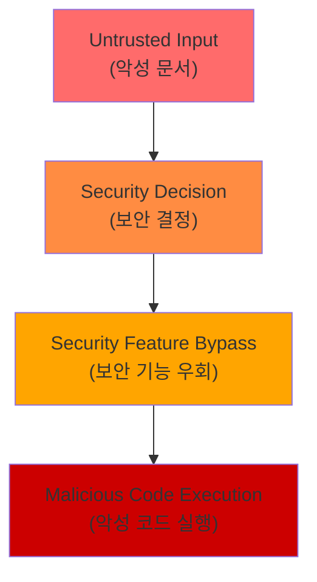
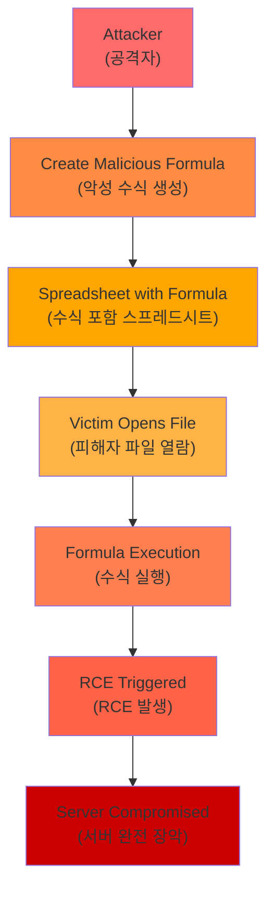

<div class="ai-summary-card">
<div class="ai-summary-header">
  <span class="ai-badge">AI 요약</span>
</div>
<div class="ai-summary-content">
  <div class="summary-row">
    <span class="summary-label">제목</span>
    <span class="summary-value">Tech & Security Weekly Digest (2026년 01월 27일)</span>
  </div>
  <div class="summary-row">
    <span class="summary-label">카테고리</span>
    <span class="summary-value"><span class="category-tag security">Security</span> <span class="category-tag devsecops">DevSecOps</span></span>
  </div>
  <div class="summary-row">
    <span class="summary-label">태그</span>
    <span class="summary-value tags">
      <span class="tag">Zero-Day</span>
      <span class="tag">Microsoft-Office</span>
      <span class="tag">Kimi-K2.5</span>
      <span class="tag">AI-Agents</span>
      <span class="tag">Kimwolf</span>
      <span class="tag">AWS-G7e</span>
      <span class="tag">NVIDIA-Blackwell</span>
      <span class="tag">2026</span>
    </span>
  </div>
  <div class="summary-row highlights">
    <span class="summary-label">핵심 내용</span>
    <ul class="summary-list">
      <li><strong>MS Office Zero-Day (CVE-2026-21509)</strong>: CVSS 7.8 긴급 패치 - 보안 기능 우회 취약점 실제 악용 중</li>
      <li><strong>Kimi K2.5 오픈소스</strong>: 비주얼 에이전트 AI - HLE 벤치마크 50.2% SOTA, 100개 하위 에이전트 1,500회 도구 호출</li>
      <li><strong>Kimwolf/Badbox 2.0 봇넷</strong>: 200만+ IoT 기기 감염 - 기업/정부 네트워크 침투, DDoS 공격 활용</li>
      <li><strong>AWS EC2 G7e</strong>: NVIDIA RTX PRO 6000 Blackwell GPU - 추론 성능 2.3배 향상</li>
      <li><strong>ChatGPT 컨테이너</strong>: bash 실행, pip/npm 설치, 파일 다운로드 지원</li>
    </ul>
  </div>
  <div class="summary-row">
    <span class="summary-label">수집 기간</span>
    <span class="summary-value">2026년 1월 26일 ~ 27일 (48시간)</span>
  </div>
  <div class="summary-row">
    <span class="summary-label">대상 독자</span>
    <span class="summary-value">DevSecOps 엔지니어, 클라우드 아키텍트, 보안 담당자, AI/ML 엔지니어, CISO</span>
  </div>
</div>
<div class="ai-summary-footer">
  이 포스팅은 AI가 쉽게 이해하고 활용할 수 있도록 구조화된 요약을 포함합니다.
</div>
</div>

## 서론

안녕하세요, **Twodragon**입니다.

2026년 1월 27일 기준, 지난 48시간 동안 발표된 주요 기술 및 보안 뉴스를 심층 분석하여 정리했습니다. 이번 주는 **긴급 보안 패치**, **AI 에이전트의 진화**, 그리고 **IoT 봇넷 위협**이 핵심 화두였습니다.

**이번 주 핵심 테마:**
- **긴급 보안**: Microsoft Office Zero-Day 실제 악용 중, Oracle 158 CVE 패치
- **AI 에이전트 진화**: Kimi K2.5 오픈소스, ChatGPT 컨테이너 기능
- **IoT 위협**: Kimwolf/Badbox 2.0 봇넷 200만 기기 감염
- **클라우드 인프라**: AWS G7e NVIDIA Blackwell, GCP BigQuery Gemini 3.0

**수집 소스**: 47개 RSS 피드에서 232개 뉴스 수집  
**분석 기준**: DevSecOps 실무 영향도, 기술적 깊이, 즉시 적용 가능성

이번 포스팅에서는 다음 내용을 다룹니다:

- Microsoft Office Zero-Day 긴급 패치 및 대응 전략
- Kimi K2.5 오픈소스 에이전트 AI의 의미
- Kimwolf/Badbox 2.0 IoT 봇넷 위협 분석
- AWS EC2 G7e NVIDIA Blackwell 인스턴스
- ChatGPT 컨테이너 기능과 보안 고려사항

## 빠른 참조

### 2026년 1월 27일 주요 기술/보안 이슈

| 이슈 | 출처 | 영향도 | 권장 조치 |
|------|------|--------|-----------|
| **MS Office Zero-Day (CVE-2026-21509)** | Microsoft | 🔴 긴급 | 즉시 패치 적용 필수 |
| **Grist-Core RCE (CVE-2026-24002)** | Cyera | 🔴 긴급 | 즉시 업데이트 (CVSS 9.1) |
| **Kimwolf/Badbox 2.0 봇넷** | Krebs on Security | 🟠 높음 | IoT 기기 보안 점검, 네트워크 모니터링 |
| **Oracle Critical Patch** | Oracle | 🟠 높음 | 158 CVE 패치 적용 계획 수립 |
| **Kimi K2.5 오픈소스** | Moonshot AI | 🟡 중간 | AI 에이전트 도입 검토 |
| **AWS EC2 G7e** | AWS | 🟡 중간 | AI 추론 워크로드 최적화 검토 |

### 긴급 조치 체크리스트

- [ ] Microsoft Office 긴급 패치 적용 (CVE-2026-21509)
- [ ] Grist-Core 사용 시 즉시 업데이트 (CVE-2026-24002)
- [ ] IoT 기기 인벤토리 점검 및 네트워크 격리
- [ ] Oracle 제품 패치 계획 수립
- [ ] Android TV 박스 보안 점검

---

## 1. Microsoft Office Zero-Day 긴급 패치 (CVE-2026-21509)

### 취약점 개요

Microsoft는 1월 27일 **실제 악용 중인** Office Zero-Day 취약점에 대한 긴급 패치를 발표했습니다.

| 항목 | 내용 |
|------|------|
| **CVE** | CVE-2026-21509 |
| **CVSS** | 7.8 (High) |
| **유형** | Security Feature Bypass |
| **영향** | Microsoft Office 전 버전 |
| **악용 상태** | 🔴 Active Exploitation |

### 기술적 분석



### DevSecOps 대응 전략

#### 즉시 조치 (0-24시간)

```yaml
# 긴급 패치 배포 전략
immediate_actions:
  - name: "Office 버전 확인"
    command: "wmic product get name,version | findstr Office"
  
  - name: "WSUS/SCCM 패치 배포"
    priority: critical
    target: all_office_installations
    
  - name: "매크로 정책 강화"
    policy: "Block macros from internet"
    scope: organization_wide
```

#### 모니터링 지표

| 지표 | 임계값 | 대응 |
|------|--------|------|
| Office 파일 실행 이상 | >10/hour | 격리 및 분석 |
| 네트워크 아웃바운드 | 비정상 패턴 | 차단 |
| 프로세스 생성 | Office→cmd.exe | 알림 |

### 참고 링크

- [Microsoft Security Advisory](https://msrc.microsoft.com/update-guide/en-US/vulnerability/CVE-2026-21509)
- [The Hacker News 보도](https://thehackernews.com/2026/01/microsoft-issues-emergency-patch-for.html)

---

## 2. Kimi K2.5: 오픈소스 비주얼 에이전트 AI의 도약

### 모델 개요

중국 Moonshot AI가 **Kimi K2.5**를 오픈소스로 공개했습니다. 이 모델은 **시각적 에이전트 지능**에 초점을 맞춘 최신 AI 모델입니다.

| 지표 | 성능 | 비교 |
|------|------|------|
| **HLE 벤치마크** | 50.2% | 글로벌 SOTA 달성 |
| **비전 분야** | 1위 | 오픈소스 모델 중 |
| **코딩 분야** | 1위 | 오픈소스 모델 중 |
| **에이전트 능력** | 100개 하위 에이전트, 1,500회 도구 호출 | |

### 에이전트 아키텍처

<div class="diagram-container">
  
  <p class="diagram-caption">Kimi K2.5 멀티 에이전트 아키텍처: 100개 하위 에이전트, 1,500회 도구 호출 지원</p>
</div>

### DevSecOps 활용 시나리오

| 시나리오 | 활용 방법 | 주의사항 |
|----------|----------|----------|
| **코드 리뷰** | 비주얼 다이어그램 분석 + 코드 검토 | 민감 코드 노출 주의 |
| **인프라 분석** | 아키텍처 다이어그램 해석 | 내부망 구조 유출 방지 |
| **보안 분석** | 스크린샷 기반 취약점 탐지 | 로그 마스킹 필수 |

### 보안 고려사항

```yaml
# AI 에이전트 보안 체크리스트
security_checklist:
  data_handling:
    - "민감 데이터 입력 금지"
    - "API 키, 비밀번호 마스킹"
    - "내부 네트워크 정보 제외"
  
  tool_access:
    - "샌드박스 환경에서 실행"
    - "네트워크 격리"
    - "파일 시스템 접근 제한"
  
  output_validation:
    - "생성된 코드 리뷰 필수"
    - "외부 의존성 검증"
    - "보안 스캐닝"
```

### 참고 링크

- [Kimi K2.5 공식 발표](https://www.kimi.com/blog/kimi-k2-5.html)
- [Hacker News 토론](https://news.ycombinator.com/item?id=46775961)

---

## 3. Kimwolf/Badbox 2.0: IoT 봇넷 위협의 진화

### 위협 개요

**Kimwolf** 봇넷이 **200만 대 이상**의 IoT 기기를 감염시켜 기업 및 정부 네트워크에 침투하고 있습니다. 특히 **Badbox 2.0**과의 연계가 확인되었습니다.

| 봇넷 | 감염 규모 | 주요 특징 |
|------|----------|----------|
| **Kimwolf** | 200만+ 기기 | 로컬 네트워크 스캐닝, DDoS, 악성 트래픽 중계 |
| **Badbox 2.0** | 수백만 기기 | Android TV 박스 사전 감염, 중국 제조 |

### 감염 경로

<div class="diagram-container">
  
  <p class="diagram-caption">Badbox 2.0/Kimwolf 봇넷 감염 경로: 제조 단계 사전 감염 → 유통 → 네트워크 침투 → 확산</p>
</div>

### 탐지 및 대응

#### 네트워크 모니터링 지표

| 지표 | 설명 | 탐지 방법 |
|------|------|----------|
| 비정상 DNS 쿼리 | C2 통신 | DNS 로그 분석 |
| 대량 아웃바운드 | DDoS 참여 | NetFlow 분석 |
| 로컬 스캔 | 확산 시도 | IDS/IPS 규칙 |
| 알 수 없는 기기 | 새로운 감염 | NAC 모니터링 |

#### 즉시 조치

```bash
# IoT 기기 네트워크 격리 스크립트 예시
#!/bin/bash

# 1. IoT 기기 VLAN 분리
# (네트워크 장비 설정 필요)

# 2. 아웃바운드 트래픽 모니터링
iptables -A OUTPUT -m state --state NEW -j LOG --log-prefix "IoT_OUTBOUND: "

# 3. 알 수 없는 기기 탐지
nmap -sn 192.168.1.0/24 | grep -B2 "android-tv\|streaming"

# 4. DNS 쿼리 로깅
tcpdump -i eth0 -n port 53 -w /var/log/dns_capture.pcap
```

#### 장기 대응 전략

```yaml
# IoT 보안 강화 체크리스트
iot_security:
  network:
    - "IoT 전용 VLAN 구성"
    - "인터넷 접근 제한 (화이트리스트)"
    - "내부 네트워크 접근 차단"
  
  device:
    - "신뢰할 수 있는 제조사 제품만 사용"
    - "펌웨어 정기 업데이트"
    - "기본 비밀번호 변경"
  
  monitoring:
    - "비정상 트래픽 알림 설정"
    - "기기 인벤토리 관리"
    - "주기적 취약점 스캐닝"
```

### 참고 링크

- [Krebs on Security - Kimwolf Botnet](https://krebsonsecurity.com/2026/01/kimwolf-botnet-lurking-in-corporate-govt-networks/)
- [Krebs on Security - Badbox 2.0](https://krebsonsecurity.com/2026/01/who-operates-the-badbox-2-0-botnet/)

---

## 4. AWS EC2 G7e: NVIDIA Blackwell GPU 인스턴스

### 인스턴스 개요

AWS는 **NVIDIA RTX PRO 6000 Blackwell Server Edition GPU**를 탑재한 **G7e 인스턴스**를 정식 출시했습니다.

| 항목 | G7e 사양 | 이전 세대 대비 |
|------|----------|---------------|
| **GPU** | NVIDIA RTX PRO 6000 Blackwell | 최신 아키텍처 |
| **추론 성능** | 2.3배 향상 | G4/G5 대비 |
| **주요 용도** | GenAI 추론, 그래픽, 공간 컴퓨팅 | |
| **가용 리전** | 제한적 (확대 예정) | |

### 성능 비교

<div class="diagram-container">
  
  <p class="diagram-caption">AWS EC2 GPU 인스턴스 추론 성능 비교: G7e Blackwell이 기준 대비 2.3배 향상</p>
</div>

### DevSecOps 활용 시나리오

| 워크로드 | 적합 인스턴스 | 비용 최적화 |
|----------|--------------|------------|
| **LLM 추론** | g7e.xlarge~ | Spot 인스턴스 활용 |
| **이미지 생성** | g7e.2xlarge | 배치 처리 |
| **실시간 추론** | g7e.4xlarge | 예약 인스턴스 |
| **개발/테스트** | g7e.xlarge | On-Demand |

### Terraform 예시

```hcl
# AWS G7e 인스턴스 Terraform 구성
resource "aws_instance" "g7e_inference" {
  ami           = data.aws_ami.deep_learning.id
  instance_type = "g7e.xlarge"
  
  # Spot 인스턴스로 비용 절감
  instance_market_options {
    market_type = "spot"
    spot_options {
      max_price = "1.50"
    }
  }
  
  # EBS 최적화
  ebs_optimized = true
  
  root_block_device {
    volume_type = "gp3"
    volume_size = 200
    iops        = 3000
    throughput  = 125
  }
  
  tags = {
    Name        = "g7e-inference-server"
    Environment = "production"
    Workload    = "ai-inference"
  }
}
```

### 참고 링크

- [AWS 공식 발표](https://aws.amazon.com/blogs/aws/announcing-amazon-ec2-g7e-instances-accelerated-by-nvidia-rtx-pro-6000-blackwell-server-edition-gpus/)
- [AWS Weekly Roundup](https://aws.amazon.com/blogs/aws/aws-weekly-roundup-amazon-ec2-g7e-instances-with-nvidia-blackwell-gpus-january-26-2026/)

---

## 5. ChatGPT 컨테이너: 새로운 실행 환경

### 기능 개요

OpenAI가 ChatGPT에 **컨테이너 기반 실행 환경**을 추가했습니다. 이제 bash 명령 실행, 패키지 설치, 파일 다운로드가 가능합니다.

| 기능 | 설명 | 보안 고려 |
|------|------|----------|
| **bash 실행** | 셸 명령어 직접 실행 | 권한 제한 확인 |
| **pip install** | Python 패키지 설치 | 의존성 취약점 |
| **npm install** | Node.js 패키지 설치 | Supply chain 위험 |
| **파일 다운로드** | 외부 파일 다운로드 | 악성 파일 주의 |

### 보안 아키텍처 추정

<div class="diagram-container">
  
  <p class="diagram-caption">ChatGPT 컨테이너 환경: 샌드박스 격리, 네트워크/파일시스템/리소스/시간 제한</p>
</div>

### 활용 및 주의사항

#### 유용한 활용 사례

```python
# ChatGPT 컨테이너에서 데이터 분석
import pandas as pd
import matplotlib.pyplot as plt

# pip install pandas matplotlib 가능

# 데이터 로드 및 분석
df = pd.read_csv('uploaded_data.csv')
df.describe()

# 시각화
df.plot(kind='bar')
plt.savefig('analysis.png')
```

#### 보안 주의사항

```yaml
# ChatGPT 컨테이너 보안 가이드
security_guidelines:
  금지사항:
    - "민감 데이터 업로드 (API 키, 비밀번호)"
    - "내부 네트워크 정보 노출"
    - "프로덕션 코드 직접 실행"
    
  권장사항:
    - "더미 데이터로 테스트"
    - "생성된 코드 별도 검증"
    - "의존성 보안 스캐닝 후 사용"
```

### 참고 링크

- [Simon Willison 분석](https://simonwillison.net/2026/Jan/26/chatgpt-containers/)
- [Hacker News 토론](https://news.ycombinator.com/item?id=46770221)

---

## 6. 추가 주요 뉴스

### Oracle January 2026 Critical Patch Update

Oracle이 **158개 CVE**를 수정하는 분기별 패치를 발표했습니다.

| 항목 | 수치 |
|------|------|
| 총 패치 수 | 337개 |
| 고유 CVE | 158개 |
| Critical | 27개 (8%) |
| 주요 취약점 | CVE-2026-21945 (Java SSRF) |

```yaml
# Oracle 패치 우선순위
patch_priority:
  critical:
    - "Oracle Java (CVE-2026-21945)"
    - "Oracle Database"
    - "WebLogic Server"
  
  high:
    - "MySQL"
    - "PeopleSoft"
    - "E-Business Suite"
```

### Grist-Core RCE 취약점 (CVE-2026-24002)

오픈소스 스프레드시트 데이터베이스 Grist-Core에서 **CVSS 9.1** RCE 취약점이 발견되었습니다.

| 항목 | 내용 |
|------|------|
| **CVE** | CVE-2026-24002 |
| **CVSS** | 9.1 (Critical) |
| **공격 방법** | 악성 스프레드시트 수식 |
| **영향** | 원격 코드 실행 |



### BigQuery AI - Gemini 3.0 지원

Google Cloud가 BigQuery에서 **Gemini 3.0** 모델을 직접 사용할 수 있는 기능을 발표했습니다.

```sql
-- BigQuery에서 Gemini 3.0 사용 예시
SELECT
  ML.GENERATE_TEXT(
    MODEL `project.dataset.gemini_3_0`,
    (SELECT prompt FROM my_table),
    STRUCT(
      0.7 AS temperature,
      1024 AS max_output_tokens
    )
  ) AS generated_text
FROM my_table;
```

---

## 7. 이번 주 DevSecOps 실천 체크리스트

### 긴급 (0-24시간)

- [ ] Microsoft Office 긴급 패치 적용
- [ ] Grist-Core 사용 시 즉시 업데이트
- [ ] IoT 기기 네트워크 격리 검토

### 높음 (1-7일)

- [ ] Oracle Critical Patch Update 적용 계획
- [ ] IoT 기기 인벤토리 및 보안 점검
- [ ] AI 에이전트 사용 시 보안 가이드라인 수립

### 보통 (1-4주)

- [ ] AWS G7e 인스턴스 AI 워크로드 마이그레이션 검토
- [ ] ChatGPT 컨테이너 활용 정책 수립
- [ ] Kimi K2.5 등 오픈소스 AI 모델 평가

---

## 8. 결론 및 다음 주 전망

### 이번 주 핵심 요약

| 영역 | 주요 동향 | DevSecOps 영향 |
|------|----------|---------------|
| **보안** | MS Office Zero-Day, IoT 봇넷 위협 | 긴급 패치, 네트워크 격리 필요 |
| **AI** | Kimi K2.5 오픈소스, ChatGPT 컨테이너 | AI 에이전트 보안 정책 수립 |
| **클라우드** | AWS G7e Blackwell, BigQuery Gemini 3.0 | AI 인프라 비용 최적화 기회 |

### 다음 주 주목 포인트

1. **Microsoft Patch Tuesday 후속**: 추가 보안 업데이트 예상
2. **IoT 봇넷 대응**: FBI/Google의 Badbox 2.0 대응 진행 상황
3. **AI 모델 경쟁**: 오픈소스 vs 상용 AI 모델 성능 경쟁 심화

### 참고 자료

- [Microsoft Security Response Center](https://msrc.microsoft.com/)
- [Krebs on Security](https://krebsonsecurity.com/)
- [AWS Blog](https://aws.amazon.com/blogs/aws/)
- [Google Cloud Blog](https://cloud.google.com/blog/)
- [The Hacker News](https://thehackernews.com/)

---

**이 포스팅이 도움이 되셨다면** 댓글과 공유 부탁드립니다. 매주 월요일 최신 기술/보안 뉴스를 정리하여 공유하겠습니다.

**질문이나 피드백**은 댓글이나 [GitHub Issues](https://github.com/Twodragon0/tech-blog/issues)로 남겨주세요.

---

*이 포스팅은 47개 RSS 피드에서 수집된 232개 뉴스를 분석하여 작성되었습니다.*
*수집 기간: 2026년 1월 26일 ~ 27일 (48시간)*
