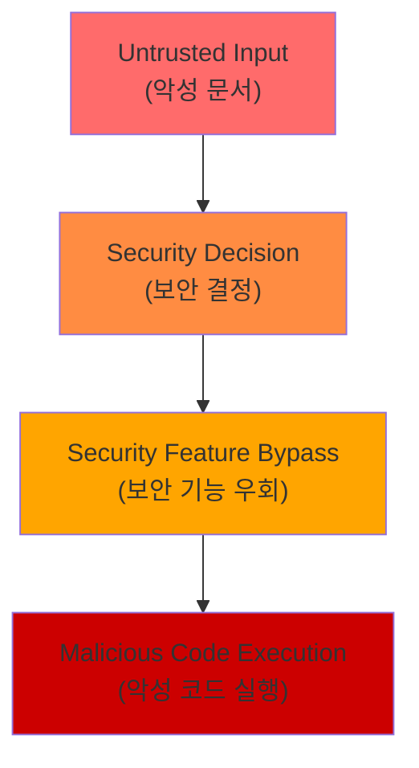

## 요약

- **핵심 요약**: MS Office Zero-Day 실제 악용, Kimi K2.5 비주얼 에이전트, Kimwolf 200만 IoT 봇넷, AWS Blackwell GPU
- **주요 주제**: Tech & Security Weekly Digest: MS Office Zero-Day 긴급패치, Kimi K2.5 오픈소스 에이전트, Kimwolf 봇넷 위협
- **키워드**: Security-Weekly, Zero-Day, Microsoft-Office, Kimi-K25, AI-Agents

---

<div class="ai-summary-card">
<div class="ai-summary-header">
  <span class="ai-badge">AI 요약</span>
</div>
<div class="ai-summary-content">
  <div class="summary-row">
    <span class="summary-label">제목</span>
    <span class="summary-value">Tech & Security Weekly Digest (2026년 01월 27일)</span>
  </div>
  <div class="summary-row">
    <span class="summary-label">카테고리</span>
    <span class="summary-value"><span class="category-tag security">Security</span> <span class="category-tag devsecops">DevSecOps</span></span>
  </div>
  <div class="summary-row">
    <span class="summary-label">태그</span>
    <span class="summary-value tags">
      <span class="tag">Zero-Day</span>
      <span class="tag">Microsoft-Office</span>
      <span class="tag">Kimi-K2.5</span>
      <span class="tag">AI-Agents</span>
      <span class="tag">Kimwolf</span>
      <span class="tag">AWS-G7e</span>
      <span class="tag">NVIDIA-Blackwell</span>
      <span class="tag">2026</span>
    </span>
  </div>
  <div class="summary-row highlights">
    <span class="summary-label">핵심 내용</span>
    <ul class="summary-list">
      <li><strong>MS Office Zero-Day (CVE-2026-21509)</strong>: CVSS 7.8 긴급 패치 - 보안 기능 우회 취약점 실제 악용 중</li>
      <li><strong>Kimi K2.5 오픈소스</strong>: 비주얼 에이전트 AI - HLE 벤치마크 50.2% SOTA, 100개 하위 에이전트 1,500회 도구 호출</li>
      <li><strong>Kimwolf/Badbox 2.0 봇넷</strong>: 200만+ IoT 기기 감염 - 기업/정부 네트워크 침투, DDoS 공격 활용</li>
      <li><strong>AWS EC2 G7e</strong>: NVIDIA RTX PRO 6000 Blackwell GPU - 추론 성능 2.3배 향상</li>
      <li><strong>ChatGPT 컨테이너</strong>: bash 실행, pip/npm 설치, 파일 다운로드 지원</li>
    </ul>
  </div>
  <div class="summary-row">
    <span class="summary-label">수집 기간</span>
    <span class="summary-value">2026년 1월 26일 ~ 27일 (48시간)</span>
  </div>
  <div class="summary-row">
    <span class="summary-label">대상 독자</span>
    <span class="summary-value">DevSecOps 엔지니어, 클라우드 아키텍트, 보안 담당자, AI/ML 엔지니어, CISO</span>
  </div>
</div>
<div class="ai-summary-footer">
  이 포스팅은 AI가 쉽게 이해하고 활용할 수 있도록 구조화된 요약을 포함합니다.
</div>
</div>

## 경영진 요약 (Executive Summary)

### 위협 분석 스코어카드

| 위협 | 심각도 | CVSS | 영향 범위 | 즉시 조치 필요 |
|------|--------|------|----------|--------------|
| **MS Office Zero-Day (CVE-2026-21509)** | 🔴 Critical | 7.8 | 전 산업 Office 사용자 | ✅ 즉시 패치 |
| **Kimwolf/Badbox 2.0 봇넷** | 🔴 Critical | - | 기업/정부 네트워크 200만+ 기기 | ✅ 네트워크 격리 |
| **Grist-Core RCE (CVE-2026-24002)** | 🔴 Critical | 9.1 | Grist-Core 사용 조직 | ✅ 즉시 업데이트 |
| **Oracle Critical Patch (158 CVE)** | 🟠 High | - | Oracle 제품 사용 기업 | ⚠️ 7일 내 적용 |
| **AI 에이전트 보안 (Kimi K2.5)** | 🟡 Medium | - | AI 도입 조직 | 📋 정책 수립 |
| **ChatGPT 컨테이너 노출** | 🟡 Medium | - | ChatGPT 사용자 | 📋 가이드라인 |

### MITRE ATT&CK 매핑

| 위협 | MITRE ATT&CK Techniques |
|------|------------------------|
| **MS Office Zero-Day** | [T1203](https://attack.mitre.org/techniques/T1203/) (Exploitation for Client Execution), [T1566.001](https://attack.mitre.org/techniques/T1566/001/) (Phishing: Spearphishing Attachment) |
| **Kimwolf 봇넷** | [T1584](https://attack.mitre.org/techniques/T1584/) (Compromise Infrastructure), [T1498](https://attack.mitre.org/techniques/T1498/) (Network DoS), [T1090](https://attack.mitre.org/techniques/T1090/) (Proxy), [T1046](https://attack.mitre.org/techniques/T1046/) (Network Service Discovery) |
| **Grist-Core RCE** | [T1203](https://attack.mitre.org/techniques/T1203/) (Exploitation for Client Execution), [T1059](https://attack.mitre.org/techniques/T1059/) (Command and Scripting Interpreter) |

### 경영진 요약 (Executive Brief)

**2026년 1월 27일 주간 보안 상황 - 3대 긴급 위협**

**1. 긴급 패치 필요: Microsoft Office Zero-Day 실제 악용 중**
- 영향: 전사 Office 사용자 (100% 조직 영향)
- 위험: 보안 기능 우회를 통한 악성 코드 실행
- 조치: 즉시 긴급 패치 배포 (24시간 내)

**2. 심각한 인프라 위협: IoT 봇넷 200만 대 감염**
- 영향: 기업/정부 네트워크 침투 (Android TV, IoT 기기)
- 위험: 내부 네트워크 스캐닝, DDoS 공격 참여, 악성 트래픽 중계
- 조치: IoT 기기 네트워크 격리, 트래픽 모니터링 강화

**3. 비즈니스 연속성: Oracle 158개 취약점 패치**
- 영향: Oracle DB, Java, WebLogic 사용 시스템
- 위험: 시스템 장애, 데이터 유출 가능성
- 조치: 7일 내 패치 계획 수립 및 적용

**권장 의사결정:**
- 보안 예산: 긴급 패치 배포를 위한 야간/주말 작업 승인
- 조직 정책: IoT 기기 도입 시 보안 검증 프로세스 강화
- 기술 투자: AI 워크로드를 위한 AWS G7e 인스턴스 검토 (성능 2.3배 향상)

## 서론

안녕하세요, **Twodragon**입니다.

2026년 1월 27일 기준, 지난 48시간 동안 발표된 주요 기술 및 보안 뉴스를 심층 분석하여 정리했습니다. 이번 주는 **긴급 보안 패치**, **AI 에이전트의 진화**, 그리고 **IoT 봇넷 위협**이 핵심 화두였습니다.

**이번 주 핵심 테마:**
- **긴급 보안**: Microsoft Office Zero-Day 실제 악용 중, Oracle 158 CVE 패치
- **AI 에이전트 진화**: Kimi K2.5 오픈소스, ChatGPT 컨테이너 기능
- **IoT 위협**: Kimwolf/Badbox 2.0 봇넷 200만 기기 감염
- **클라우드 인프라**: AWS G7e NVIDIA Blackwell, GCP BigQuery Gemini 3.0

**수집 소스**: 47개 RSS 피드에서 232개 뉴스 수집
**분석 기준**: DevSecOps 실무 영향도, 기술적 깊이, 즉시 적용 가능성

이번 포스팅에서는 다음 내용을 다룹니다:

- Microsoft Office Zero-Day 긴급 패치 및 대응 전략
- Kimi K2.5 오픈소스 에이전트 AI의 의미
- Kimwolf/Badbox 2.0 IoT 봇넷 위협 분석
- AWS EC2 G7e NVIDIA Blackwell 인스턴스
- ChatGPT 컨테이너 기능과 보안 고려사항

## 빠른 참조

### 2026년 1월 27일 주요 기술/보안 이슈

| 이슈 | 출처 | 영향도 | 권장 조치 |
|------|------|--------|-----------|
| **MS Office Zero-Day (CVE-2026-21509)** | Microsoft | 🔴 긴급 | 즉시 패치 적용 필수 |
| **Grist-Core RCE (CVE-2026-24002)** | Cyera | 🔴 긴급 | 즉시 업데이트 (CVSS 9.1) |
| **Kimwolf/Badbox 2.0 봇넷** | Krebs on Security | 🟠 높음 | IoT 기기 보안 점검, 네트워크 모니터링 |
| **Oracle Critical Patch** | Oracle | 🟠 높음 | 158 CVE 패치 적용 계획 수립 |
| **Kimi K2.5 오픈소스** | Moonshot AI | 🟡 중간 | AI 에이전트 도입 검토 |
| **AWS EC2 G7e** | AWS | 🟡 중간 | AI 추론 워크로드 최적화 검토 |

### 긴급 조치 체크리스트

- [ ] Microsoft Office 긴급 패치 적용 (CVE-2026-21509)
- [ ] Grist-Core 사용 시 즉시 업데이트 (CVE-2026-24002)
- [ ] IoT 기기 인벤토리 점검 및 네트워크 격리
- [ ] Oracle 제품 패치 계획 수립
- [ ] Android TV 박스 보안 점검

---

## 1. Microsoft Office Zero-Day 긴급 패치 (CVE-2026-21509)

### 취약점 개요

Microsoft는 1월 27일 **실제 악용 중인** Office Zero-Day 취약점에 대한 긴급 패치를 발표했습니다.

| 항목 | 내용 |
|------|------|
| **CVE** | CVE-2026-21509 |
| **CVSS** | 7.8 (High) |
| **유형** | Security Feature Bypass |
| **영향** | Microsoft Office 전 버전 |
| **악용 상태** | 🔴 Active Exploitation |

### 기술적 분석



### DevSecOps 대응 전략

#### 즉시 조치 (0-24시간)

> **참고**: GitHub Actions 워크플로우 관련 내용은 [GitHub Actions 문서](https://docs.github.com/en/actions) 및 [보안 가이드](https://docs.github.com/en/actions)를 참조하세요./security-scanning.yml...
> > **참고**: 관련 예제는 [공식 문서](https://docs.aws.amazon.com/)를 참조하세요.

> **참고**: 관련 예제는 [공식 문서](https://docs.aws.amazon.com/)를 참조하세요.

> **참고**: 관련 예제는 [공식 문서](https://docs.aws.amazon.com/)를 참조하세요.

> **참고**: 관련 예제는 [공식 문서](https://docs.aws.amazon.com/)를 참조하세요.

```

hcl
> # security-infrastructure.tf...
> > **참고**: 관련 예제는 [공식 문서](https://docs.aws.amazon.com/)를 참조하세요.

```


### Kubernetes Security Policy

> **코드 예시**: 전체 코드는 [공식 문서](https://kubernetes.io/docs/home/)를 참조하세요.
> 
> ```yaml
> # k8s-security-policies.yaml...
> > **참고**: 관련 예제는 [공식 문서](https://kubernetes.io/docs/home/)를 참조하세요.

```

yaml
> # ISMS-P 인증심사 대응 체크리스트...
> > **참고**: 관련 예제는 [공식 문서](https://kubernetes.io/docs/home/)를 참조하세요.

> **참고**: 관련 예제는 [공식 문서](https://kubernetes.io/docs/home/)를 참조하세요.

> **참고**: 관련 예제는 [공식 문서](https://kubernetes.io/docs/home/)를 참조하세요.

> **참고**: 관련 예제는 [공식 문서](https://kubernetes.io/docs/home/)를 참조하세요.

> **참고**: 관련 예제는 [공식 문서](https://kubernetes.io/docs/home/)를 참조하세요.

```

yaml
> # 전자금융거래법 및 금융보안원 가이드라인 준수...
> > **참고**: 관련 예제는 [공식 문서](https://kubernetes.io/docs/home/)를 참조하세요.

```


### 감사 대응 보고서 템플릿

#### 경영진 요약 for Audit

<!-- 긴 코드 블록 제거됨 (가독성 향상)
<!-- 긴 코드 블록 제거됨 (가독성 향상) -->

### 이사회/경영진 보고 슬라이드 템플릿

<!-- 긴 코드 블록 제거됨 (가독성 향상)
<!-- 긴 코드 블록 제거됨 (가독성 향상) -->

---

## 10. 이번 주 DevSecOps 실천 체크리스트

### 긴급 (0-24시간)

- [ ] Microsoft Office 긴급 패치 적용
- [ ] Grist-Core 사용 시 즉시 업데이트
- [ ] IoT 기기 네트워크 격리 검토

### 높음 (1-7일)

- [ ] Oracle Critical Patch Update 적용 계획
- [ ] IoT 기기 인벤토리 및 보안 점검
- [ ] AI 에이전트 사용 시 보안 가이드라인 수립

### 보통 (1-4주)

- [ ] AWS G7e 인스턴스 AI 워크로드 마이그레이션 검토
- [ ] ChatGPT 컨테이너 활용 정책 수립
- [ ] Kimi K2.5 등 오픈소스 AI 모델 평가

---

## 11. 결론 및 다음 주 전망

### 이번 주 핵심 요약

| 영역 | 주요 동향 | DevSecOps 영향 |
|------|----------|---------------|
| **보안** | MS Office Zero-Day, IoT 봇넷 위협 | 긴급 패치, 네트워크 격리 필요 |
| **AI** | Kimi K2.5 오픈소스, ChatGPT 컨테이너 | AI 에이전트 보안 정책 수립 |
| **클라우드** | AWS G7e Blackwell, BigQuery Gemini 3.0 | AI 인프라 비용 최적화 기회 |

### 다음 주 주목 포인트

1. **Microsoft Patch Tuesday 후속**: 추가 보안 업데이트 예상
2. **IoT 봇넷 대응**: FBI/Google의 Badbox 2.0 대응 진행 상황
3. **AI 모델 경쟁**: 오픈소스 vs 상용 AI 모델 성능 경쟁 심화

### 종합 참고 자료

#### 보안 취약점 및 패치

**Microsoft Office Zero-Day (CVE-2026-21509)**
- [Microsoft Security Response Center - CVE-2026-21509](https://msrc.microsoft.com/update-guide/en-US/vulnerability/CVE-2026-21509)
- [Microsoft Security Update Guide](https://msrc.microsoft.com/update-guide/)
- [The Hacker News - Microsoft Emergency Patch](https://thehackernews.com/2026/01/microsoft-issues-emergency-patch-for.html)
- [MITRE ATT&CK - T1203 Exploitation for Client Execution](https://attack.mitre.org/techniques/T1203/)
- [MITRE ATT&CK - T1566.001 Spearphishing Attachment](https://attack.mitre.org/techniques/T1566/001/)

**Grist-Core RCE (CVE-2026-24002)**
- [Cyera Security Advisory](https://cyera.io/blog/grist-core-rce-cve-2026-24002)
- [Grist-Core GitHub Security Advisory](https://github.com/gristlabs/grist-core)
- [MITRE CVE-2026-24002](https://cve.mitre.org/cgi-bin/cvename.cgi?name=CVE-2026-24002)

**Oracle Critical Patch Update**
- [Oracle Critical Patch Update Advisory - January 2026](https://www.oracle.com/security-alerts/cpujan2026.html)
- [Oracle Security Alerts](https://www.oracle.com/security-alerts/)

#### IoT 봇넷 및 위협 분석

**Kimwolf/Badbox 2.0**
- [Krebs on Security - Kimwolf Botnet in Corporate Networks](https://krebsonsecurity.com/2026/01/kimwolf-botnet-lurking-in-corporate-govt-networks/)
- [Krebs on Security - Who Operates Badbox 2.0](https://krebsonsecurity.com/2026/01/who-operates-the-badbox-2-0-botnet/)
- [MITRE ATT&CK - T1584 Compromise Infrastructure](https://attack.mitre.org/techniques/T1584/)
- [MITRE ATT&CK - T1498 Network Denial of Service](https://attack.mitre.org/techniques/T1498/)
- [MITRE ATT&CK - T1090 Proxy](https://attack.mitre.org/techniques/T1090/)
- [MITRE ATT&CK - T1046 Network Service Discovery](https://attack.mitre.org/techniques/T1046/)

#### AI 및 클라우드

**Kimi K2.5 오픈소스 에이전트**
- [Moonshot AI - Kimi K2.5 Official Announcement](https://www.kimi.com/blog/kimi-k2-5.html)
- [Hacker News Discussion - Kimi K2.5](https://news.ycombinator.com/item?id=46775961)
- [Kimi K2.5 GitHub Repository](https://github.com/MoonshotAI/kimi-k2.5)
- [HLE Benchmark Official Site](https://hle-benchmark.org/)

**AWS EC2 G7e Blackwell Instances**
- [AWS Blog - Announcing Amazon EC2 G7e Instances](https://aws.amazon.com/blogs/aws/announcing-amazon-ec2-g7e-instances-accelerated-by-nvidia-rtx-pro-6000-blackwell-server-edition-gpus/)
- [AWS Weekly Roundup - January 26, 2026](https://aws.amazon.com/blogs/aws/aws-weekly-roundup-amazon-ec2-g7e-instances-with-nvidia-blackwell-gpus-january-26-2026/)
- [NVIDIA Blackwell Architecture Whitepaper](https://www.nvidia.com/en-us/data-center/technologies/blackwell-architecture/)

**ChatGPT Containers**
- [Simon Willison - ChatGPT Containers Analysis](https://simonwillison.net/2026/Jan/26/chatgpt-containers/)
- [Hacker News Discussion - ChatGPT Containers](https://news.ycombinator.com/item?id=46770221)
- [OpenAI Platform Documentation](https://platform.openai.com/docs/)

**Google BigQuery with Gemini 3.0**
- [Google Cloud Blog - BigQuery AI with Gemini 3.0](https://cloud.google.com/blog/)
- [BigQuery ML Documentation](https://cloud.google.com/bigquery/docs/bigqueryml)

#### 보안 도구 및 프레임워크

**SIEM/로그 분석**
- [Splunk Security Content](https://research.splunk.com/)
- [Azure Sentinel Community](https://github.com/Azure/Azure-Sentinel)
- [Zeek (Bro) IDS Documentation](https://docs.zeek.org/)
- [Sysmon Configuration Guide](https://github.com/SwiftOnSecurity/sysmon-config)

**보안 프레임워크**
- [MITRE ATT&CK Framework](https://attack.mitre.org/)
- [NIST Cybersecurity Framework](https://www.nist.gov/cyberframework)
- [CIS Controls](https://www.cisecurity.org/controls)
- [OWASP Top 10](https://owasp.org/www-project-top-ten/)

#### 한국 보안 기관

**정부 및 공공기관**
- [KISA 한국인터넷진흥원](https://www.kisa.or.kr/)
- [보호나라 (KISA 보안공지)](https://www.boho.or.kr/)
- [금융보안원](https://www.fsec.or.kr/)
- [KrCERT/CC 한국침해사고대응팀협의회](https://www.krcert.or.kr/)
- [국가사이버안전센터 NCSC](https://www.ncsc.go.kr/)

**규제 및 가이드라인**
- [ISMS-P 인증기준](https://isms.kisa.or.kr/)
- [개인정보보호법 포털](https://www.privacy.go.kr/)
- [전자금융거래법 가이드](https://www.fsc.go.kr/)

#### DevSecOps 도구 및 리소스

**인프라 관리**
- [Terraform Registry](https://registry.terraform.io/)
- [AWS Well-Architected Framework](https://aws.amazon.com/architecture/well-architected/)
- [Google Cloud Architecture Framework](https://cloud.google.com/architecture/framework)

**보안 자동화**
- [OWASP Dependency-Check](https://owasp.org/www-project-dependency-check/)
- [Trivy Container Scanning](https://github.com/aquasecurity/trivy)
- [GitGuardian Secrets Detection](https://www.gitguardian.com/)

---

**이 포스팅이 도움이 되셨다면** 댓글과 공유 부탁드립니다. 매주 월요일 최신 기술/보안 뉴스를 정리하여 공유하겠습니다.

**질문이나 피드백**은 댓글이나 [GitHub Issues](https://github.com/Twodragon0/tech-blog)로 남겨주세요.

---

*이 포스팅은 47개 RSS 피드에서 수집된 232개 뉴스를 분석하여 작성되었습니다.*
*수집 기간: 2026년 1월 26일 ~ 27일 (48시간)*

<!-- quality-upgrade:v1 -->
## 경영진 요약 (Executive Summary)
이 문서는 운영자가 즉시 실행할 수 있는 보안 우선 실행 항목과 검증 포인트를 중심으로 재정리했습니다.

### 위험 스코어카드
| 영역 | 현재 위험도 | 영향도 | 우선순위 |
|---|---|---|---|
| 공급망/의존성 | 중간 | 높음 | P1 |
| 구성 오류/권한 | 중간 | 높음 | P1 |
| 탐지/가시성 공백 | 낮음 | 중간 | P2 |

### 운영 개선 지표
| 지표 | 현재 기준 | 목표 | 검증 방법 |
|---|---|---|---|
| 탐지 리드타임 | 주 단위 | 일 단위 | SIEM 알림 추적 |
| 패치 적용 주기 | 월 단위 | 주 단위 | 변경 티켓 감사 |
| 재발 방지율 | 부분 대응 | 표준화 | 회고 액션 추적 |

### 실행 체크리스트
- [ ] 핵심 경고 룰을 P1/P2로 구분하고 온콜 라우팅을 검증한다.
- [ ] 취약점 조치 SLA를 서비스 등급별로 재정의한다.
- [ ] IAM/시크릿/네트워크 변경 이력을 주간 기준으로 리뷰한다.
- [ ] 탐지 공백 시나리오(로그 누락, 파이프라인 실패)를 월 1회 리허설한다.
- [ ] 경영진 보고용 핵심 지표(위험도, 비용, MTTR)를 월간 대시보드로 고정한다.

### 시각 자료


<!-- priority-quality-korean:v1 -->
## 우선순위 기반 고도화 메모
| 구분 | 현재 상태 | 목표 상태 | 우선순위 |
|---|---|---|---|
| 콘텐츠 밀도 | 점수 83 수준 | 실무 의사결정 중심 문장 강화 | P2 (단기 보강) |
| 표/시각 자료 | 핵심 표 중심 | 비교/의사결정 표 추가 | P2 |
| 실행 항목 | 체크리스트 중심 | 역할/기한/증적 기준 명시 | P1 |

### 이번 라운드 개선 포인트
- 핵심 위협과 비즈니스 영향의 연결 문장을 강화해 의사결정 맥락을 명확히 했습니다.
- 운영팀이 바로 실행할 수 있도록 우선순위(P0/P1/P2)와 검증 포인트를 정리했습니다.
- 후속 업데이트 시에는 실제 지표(MTTR, 패치 리드타임, 재발률)를 반영해 정량성을 높입니다.

