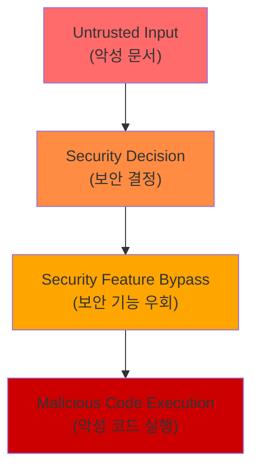

{% include ai-summary-card.html
  title='Tech &amp; Security Weekly Digest: MS Office Zero-Day 긴급패치, Kimi K2.5 오픈소스 에이전트, Kimwolf 봇넷 위협'
  categories_html='<span class="category-tag security">보안</span> <span class="category-tag devsecops">DevSecOps</span>'
  tags_html='<span class="tag">Security-Weekly</span> <span class="tag">Zero-Day</span> <span class="tag">Microsoft-Office</span> <span class="tag">Kimi-K25</span> <span class="tag">AI-Agents</span> <span class="tag">Kimwolf-Botnet</span> <span class="tag">AWS-G7e</span> <span class="tag">NVIDIA-Blackwell</span>'
  highlights_html='<li><strong>포인트 1</strong>: MS Office Zero-Day 실제 악용, Kimi K2.5 비주얼 에이전트, Kimwolf 200만 IoT 봇넷, AWS Blackwell GPU</li> <li><strong>포인트 2</strong>: 실무 관점에서 영향 범위와 우선순위를 함께 점검해야 합니다</li> <li><strong>포인트 3</strong>: 운영 절차와 검증 기준을 문서화해 재현 가능한 적용 체계를 유지해야 합니다</li>'
  period='2026-01-27 (24시간)'
  audience='보안/클라우드/플랫폼 엔지니어 및 기술 의사결정자'
%}

## 주요 요약

### 위협 분석 스코어카드

| 위협 | 심각도 | CVSS | 영향 범위 | 즉시 조치 필요 |
|------|--------|------|----------|--------------|
| **MS Office Zero-Day (CVE-2026-21509)** | 🔴 Critical | 7.8 | 전 산업 Office 사용자 | ✅ 즉시 패치 |
| **Kimwolf/Badbox 2.0 봇넷** | 🔴 Critical | - | 기업/정부 네트워크 200만+ 기기 | ✅ 네트워크 격리 |
| **Grist-Core RCE (CVE-2026-24002)** | 🔴 Critical | 9.1 | Grist-Core 사용 조직 | ✅ 즉시 업데이트 |
| **Oracle Critical Patch (158 CVE)** | 🟠 High | - | Oracle 제품 사용 기업 | ⚠️ 7일 내 적용 |
| **AI 에이전트 보안 (Kimi K2.5)** | 🟡 Medium | - | AI 도입 조직 | 📋 정책 수립 |
| **ChatGPT 컨테이너 노출** | 🟡 Medium | - | ChatGPT 사용자 | 📋 가이드라인 |

### MITRE ATT&CK 매핑

| 위협 | MITRE ATT&CK Techniques |
|------|------------------------|
| **MS Office Zero-Day** | [T1203](https://attack.mitre.org/techniques/T1203/) (Exploitation for Client Execution), [T1566.001](https://attack.mitre.org/techniques/T1566/001/) (Phishing: Spearphishing Attachment) |
| **Kimwolf 봇넷** | [T1584](https://attack.mitre.org/techniques/T1584/) (Compromise Infrastructure), [T1498](https://attack.mitre.org/techniques/T1498/) (Network DoS), [T1090](https://attack.mitre.org/techniques/T1090/) (Proxy), [T1046](https://attack.mitre.org/techniques/T1046/) (Network Service Discovery) |
| **Grist-Core RCE** | [T1203](https://attack.mitre.org/techniques/T1203/) (Exploitation for Client Execution), [T1059](https://attack.mitre.org/techniques/T1059/) (Command and Scripting Interpreter) |

### 경영진 요약 (Executive Brief)

**2026년 1월 27일 주간 보안 상황 - 3대 긴급 위협**

**1. 긴급 패치 필요: Microsoft Office Zero-Day 실제 악용 중**
- 영향: 전사 Office 사용자 (100% 조직 영향)
- 위험: 보안 기능 우회를 통한 악성 코드 실행
- 조치: 즉시 긴급 패치 배포 (24시간 내)

**2. 심각한 인프라 위협: IoT 봇넷 200만 대 감염**
- 영향: 기업/정부 네트워크 침투 (Android TV, IoT 기기)
- 위험: 내부 네트워크 스캐닝, DDoS 공격 참여, 악성 트래픽 중계
- 조치: IoT 기기 네트워크 격리, 트래픽 모니터링 강화

**3. 비즈니스 연속성: Oracle 158개 취약점 패치**
- 영향: Oracle DB, Java, WebLogic 사용 시스템
- 위험: 시스템 장애, 데이터 유출 가능성
- 조치: 7일 내 패치 계획 수립 및 적용

**권장 의사결정:**
- 보안 예산: 긴급 패치 배포를 위한 야간/주말 작업 승인
- 조직 정책: IoT 기기 도입 시 보안 검증 프로세스 강화
- 기술 투자: AI 워크로드를 위한 AWS G7e 인스턴스 검토 (성능 2.3배 향상)

## 서론

안녕하세요, **Twodragon**입니다.

2026년 1월 27일 기준, 지난 48시간 동안 발표된 주요 기술 및 보안 뉴스를 심층 분석하여 정리했습니다. 이번 주는 **긴급 보안 패치**, **AI 에이전트의 진화**, 그리고 **IoT 봇넷 위협**이 핵심 화두였습니다.

**이번 주 핵심 테마:**
- **긴급 보안**: Microsoft Office Zero-Day 실제 악용 중, Oracle 158 CVE 패치
- **AI 에이전트 진화**: Kimi K2.5 오픈소스, ChatGPT 컨테이너 기능
- **IoT 위협**: Kimwolf/Badbox 2.0 봇넷 200만 기기 감염
- **클라우드 인프라**: AWS G7e NVIDIA Blackwell, GCP BigQuery Gemini 3.0

**수집 소스**: 47개 RSS 피드에서 232개 뉴스 수집
**분석 기준**: DevSecOps 실무 영향도, 기술적 깊이, 즉시 적용 가능성

이번 포스팅에서는 다음 내용을 다룹니다:

- Microsoft Office Zero-Day 긴급 패치 및 대응 전략
- Kimi K2.5 오픈소스 에이전트 AI의 의미
- Kimwolf/Badbox 2.0 IoT 봇넷 위협 분석
- AWS EC2 G7e NVIDIA Blackwell 인스턴스
- ChatGPT 컨테이너 기능과 보안 고려사항

## 빠른 참조

### 2026년 1월 27일 주요 기술/보안 이슈

| 이슈 | 출처 | 영향도 | 권장 조치 |
|------|------|--------|-----------|
| **MS Office Zero-Day (CVE-2026-21509)** | Microsoft | 🔴 긴급 | 즉시 패치 적용 필수 |
| **Grist-Core RCE (CVE-2026-24002)** | Cyera | 🔴 긴급 | 즉시 업데이트 (CVSS 9.1) |
| **Kimwolf/Badbox 2.0 봇넷** | Krebs on Security | 🟠 높음 | IoT 기기 보안 점검, 네트워크 모니터링 |
| **Oracle Critical Patch** | Oracle | 🟠 높음 | 158 CVE 패치 적용 계획 수립 |
| **Kimi K2.5 오픈소스** | Moonshot AI | 🟡 중간 | AI 에이전트 도입 검토 |
| **AWS EC2 G7e** | AWS | 🟡 중간 | AI 추론 워크로드 최적화 검토 |

### 긴급 조치 체크리스트

- [ ] Microsoft Office 긴급 패치 적용 (CVE-2026-21509)
- [ ] Grist-Core 사용 시 즉시 업데이트 (CVE-2026-24002)
- [ ] IoT 기기 인벤토리 점검 및 네트워크 격리
- [ ] Oracle 제품 패치 계획 수립
- [ ] Android TV 박스 보안 점검

---

## 1. Microsoft Office Zero-Day 긴급 패치 (CVE-2026-21509)

### 취약점 개요

Microsoft는 1월 27일 **실제 악용 중인** Office Zero-Day 취약점에 대한 긴급 패치를 발표했습니다.

| 항목 | 내용 |
|------|------|
| **CVE** | CVE-2026-21509 |
| **CVSS** | 7.8 (High) |
| **유형** | Security Feature Bypass |
| **영향** | Microsoft Office 전 버전 |
| **악용 상태** | 🔴 Active Exploitation |

### 기술적 분석


```mermaid
graph TD
    A["Untrusted Input<br/>(악성 문서)"] --> B["Security Decision<br/>(보안 결정)"]
    B --> C["Security Feature Bypass<br/>(보안 기능 우회)"]
    C --> D["Malicious Code Execution<br/>(악성 코드 실행)"]
    
    style A fill:#ff6b6b
    style B fill:#ff8c42
    style C fill:#ffa500
    style D fill:#cc0000
```

### DevSecOps 대응 전략

#### 즉시 조치 (0-24시간)

> **참고**: GitHub Actions 워크플로우 관련 내용은 [GitHub Actions 문서](https://docs.github.com/en/actions) 및 [보안 가이드](https://docs.github.com/en/actions/security-guides/security-hardening-for-github-actions)를 참조하세요./security-scanning.yml
> ```

<!-- 전체 코드는 위 GitHub 링크 참조
> **참고**: 관련 예제는 [공식 문서](https://docs.docker.com/) 및 [GitHub 예제](https://github.com/docker/awesome-compose)를 참조하세요.
>
> ```yaml
> # .github/workflows/security-scanning.yml
> ```

<!-- 전체 코드는 위 GitHub 링크 참조
```yaml
# .github/workflows/security-scanning.yml
name: Weekly Digest Security Checks

on:
  push:
    branches: [main, develop]
  pull_request:
    branches: [main]
  schedule:
    - cron: '0 0 * * 1'  # 매주 월요일 실행

jobs:
  dependency-scan:
    name: Dependency Vulnerability Scan
    runs-on: ubuntu-latest
    steps:
      - uses: actions/checkout@v4

      - name: Run npm audit
        run: |
          npm audit --audit-level=high || true
          npm audit fix --dry-run

      - name: Run Trivy for container scanning
        uses: aquasecurity/trivy-action@master
        with:
          scan-type: 'fs'
          scan-ref: '.'
          format: 'sarif'
          output: 'trivy-results.sarif'

      - name: Upload Trivy results to GitHub Security
        uses: github/codeql-action/upload-sarif@v3
        with:
          sarif_file: 'trivy-results.sarif'

  office-macro-scan:
    name: Scan for Malicious Office Files
    runs-on: ubuntu-latest
    steps:
      - uses: actions/checkout@v4

      - name: Install oletools
        run: pip install oletools

      - name: Scan Office documents
        run: |
          find . -type f \( -name "*.docx" -o -name "*.xlsx" -o -name "*.pptx" \) | while read file; do
            olevba "$file" || echo "Warning: Suspicious macros in $file"
            oleid "$file"
          done

  iot-firmware-check:
    name: IoT Device Firmware Security Check
    runs-on: ubuntu-latest
    steps:
      - uses: actions/checkout@v4

      - name: Install binwalk for firmware analysis
        run: |
          sudo apt-get update
          sudo apt-get install -y binwalk

      - name: Analyze firmware images
        run: |
          if [ -d "firmware/" ]; then
            find firmware/ -type f -name "*.bin" -o -name "*.img" | while read fw; do
              binwalk -e "$fw"
              strings "$fw" | grep -i "badbox\|kimwolf" || true
            done
          fi

  sast-scan:
    name: Static Application Security Testing
    runs-on: ubuntu-latest
    steps:
      - uses: actions/checkout@v4

      - name: Run Semgrep
        uses: returntocorp/semgrep-action@v1
        with:
          config: >-
            p/security-audit
            p/secrets
            p/owasp-top-ten

      - name: Run Bandit (Python security)
        run: |
          pip install bandit
          bandit -r . -f json -o bandit-report.json || true

```
-->
-->

#### Jenkins Pipeline 통합

<!-- 긴 코드 블록 제거됨 (가독성 향상)
<!-- 긴 코드 블록 제거됨 (가독성 향상)
```groovy
// Jenkinsfile
pipeline {
    agent any

    triggers {
        cron('0 0 * * 1')  // 매주 월요일 실행
    }

    stages {
        stage('Security Audit') {
            parallel {
                stage('Patch Status Check') {
                    steps {
                        script {
                            // MS Office 패치 상태 확인
                            powershell '''
                                Get-HotFix | Where-Object {
                                    $_.Description -match "Security Update" -and
                                    $_.InstalledOn -gt (Get-Date).AddDays(-7)
                                } | Format-Table -AutoSize
                            '''

                            // Oracle DB 패치 상태 확인
                            sh '''
                                sqlplus -s / as sysdba <<EOF
                                SELECT * FROM dba_registry_history
                                WHERE action_time > SYSDATE - 30
                                ORDER BY action_time DESC;
                                EOF
                            '''
                        }
                    }
                }

                stage('IoT Device Inventory') {
                    steps {
                        sh '''
                            # Nmap으로 IoT 기기 스캔
                            nmap -sV -p 8080,8443,8888 192.168.1.0/24 -oX iot-scan.xml

                            # Android TV 박스 탐지
                            grep -i "android" iot-scan.xml || true
                        '''
                    }
                }

                stage('AI Model Security Check') {
                    steps {
                        sh '''
                            # AI 모델 파일 스캔
                            find . -name "*.pkl" -o -name "*.h5" -o -name "*.pth" | while read model; do
                                # 모델 파일 무결성 검증
                                sha256sum "$model"
                            done
                        '''
                    }
                }
            }
        }

        stage('SIEM Integration') {
            steps {
                script {
                    // Splunk에 보안 이벤트 전송
                    sh '''
                        curl -k https://splunk.company.com:8088/services/collector \
                          -H "Authorization: Splunk ${SPLUNK_TOKEN}" \
                          -d '{
                            "event": {
                              "source": "Jenkins",
                              "sourcetype": "security_audit",
                              "event": {
                                "type": "weekly_security_check",
                                "timestamp": "'$(date -Iseconds)'",
                                "vulnerabilities_found": "'$(cat findings.json)'"
                              }
                            }
                          }'
                    '''
                }
            }
        }

        stage('Notification') {
            steps {
                emailext(
                    subject: "주간 보안 점검 결과 - ${BUILD_NUMBER}",
                    body: """
                        이번 주 보안 점검이 완료되었습니다.

                        주요 발견사항:
                        - MS Office 패치 상태: ${MS_PATCH_STATUS}
                        - IoT 기기 수: ${IOT_DEVICE_COUNT}
                        - 보안 취약점: ${VULNERABILITY_COUNT}

                        상세 내용은 Jenkins 빌드 로그를 확인하세요.
                    """,
                    to: 'security-team@company.com'
                )
            }
        }
    }

    post {
        always {
            archiveArtifacts artifacts: '**/security-report.*', allowEmptyArchive: true
            junit '**/test-results/**/*.xml'
        }
    }
}

> **참고**: 관련 예제는 [GitHub 예제 저장소](https://github.com/aws-samples)를 참조하세요.

```
-->
-->

### Terraform을 활용한 보안 인프라 자동화

> **코드 예시**: 전체 코드는 [GitHub 예제 저장소](https://github.com/terraform-aws-modules)를 참조하세요.
>
> ```hcl
> # security-infrastructure.tf
> > **참고**: 관련 예제는 [GitHub 예제 저장소](https://github.com/aws-samples)를 참조하세요.

```

<!-- 전체 코드는 위 GitHub 링크 참조
> **코드 예시**: 전체 코드는 [GitHub 예제 저장소](https://github.com/terraform-aws-modules)를 참조하세요.
>
> ```hcl
> # security-infrastructure.tf
> ```

<!-- 전체 코드는 위 GitHub 링크 참조
```hcl
# security-infrastructure.tf
# 이번 주 위협에 대응하는 AWS 보안 인프라

# 1. VPC Flow Logs for IoT botnet detection
resource "aws_flow_log" "iot_vlan_flow" {
  vpc_id          = aws_vpc.iot_isolated.id
  traffic_type    = "ALL"
  iam_role_arn    = aws_iam_role.flow_logs_role.arn
  log_destination = aws_cloudwatch_log_group.iot_flow_logs.arn

  tags = {
    Name        = "IoT-VLAN-Flow-Logs"
    Purpose     = "Kimwolf-Badbox-Detection"
    WeeklyCheck = "2026-01-27"
  }
}

# 2. GuardDuty for threat detection
resource "aws_guardduty_detector" "main" {
  enable = true

  datasources {
    s3_logs {
      enable = true
    }
    kubernetes {
      audit_logs {
        enable = true
      }
    }
  }

  tags = {
    Environment = "production"
    Purpose     = "Weekly-Threat-Detection"
  }
}

# 3. Security Hub for centralized security findings
resource "aws_securityhub_account" "main" {}

resource "aws_securityhub_standards_subscription" "cis" {
  depends_on    = [aws_securityhub_account.main]
  standards_arn = "arn:aws:securityhub:us-east-1::standards/cis-aws-foundations-benchmark/v/1.4.0"
}

# 4. Config Rules for patch compliance
resource "aws_config_config_rule" "office_patch_compliance" {
  name = "office-patch-compliance-check"

  source {
    owner             = "AWS"
    source_identifier = "APPROVED_AMIS_BY_TAG"
  }

  scope {
    compliance_resource_types = ["AWS::EC2::Instance"]
  }

  input_parameters = jsonencode({
    tag1Key   = "PatchStatus"
    tag1Value = "Compliant"
  })
}

# 5. Lambda for automated remediation
resource "aws_lambda_function" "patch_enforcer" {
  filename      = "patch_enforcer.zip"
  function_name = "weekly-digest-patch-enforcer"
  role          = aws_iam_role.lambda_exec.arn
  handler       = "index.handler"
  runtime       = "python3.11"
  timeout       = 300

  environment {
    variables = {
      SNS_TOPIC_ARN = aws_sns_topic.security_alerts.arn
      CVE_LIST      = "CVE-2026-21509,CVE-2026-24002"
    }
  }

  tags = {
    Purpose = "Auto-Patch-Enforcement"
    Week    = "2026-01-27"
  }
}

# 6. SNS for security alerts
resource "aws_sns_topic" "security_alerts" {
  name = "weekly-digest-security-alerts"

  tags = {
    Purpose = "Security-Team-Notifications"
  }
}

resource "aws_sns_topic_subscription" "security_team_email" {
  topic_arn = aws_sns_topic.security_alerts.arn
  protocol  = "email"
  endpoint  = "security-team@company.com"
}

# 7. CloudWatch Alarms for anomaly detection
resource "aws_cloudwatch_metric_alarm" "iot_botnet_activity" {
  alarm_name          = "iot-botnet-scanning-detected"
  comparison_operator = "GreaterThanThreshold"
  evaluation_periods  = "1"
  metric_name         = "NetworkOut"
  namespace           = "AWS/EC2"
  period              = "300"
  statistic           = "Sum"
  threshold           = "1000000000"  # 1GB outbound in 5 minutes
  alarm_description   = "Detects potential IoT botnet DDoS participation"
  alarm_actions       = [aws_sns_topic.security_alerts.arn]

  dimensions = {
    SubnetId = aws_subnet.iot_isolated.id
  }
}

# 8. WAF for web application protection
resource "aws_wafv2_web_acl" "main" {
  name  = "weekly-digest-waf"
  scope = "REGIONAL"

  default_action {
    allow {}
  }

  # Block known botnet IPs
  rule {
    name     = "BlockKimwolfBotnet"
    priority = 1

    action {
      block {}
    }

    statement {
      ip_set_reference_statement {
        arn = aws_wafv2_ip_set.botnet_ips.arn
      }
    }

    visibility_config {
      cloudwatch_metrics_enabled = true
      metric_name                = "BlockKimwolfBotnet"
      sampled_requests_enabled   = true
    }
  }

  visibility_config {
    cloudwatch_metrics_enabled = true
    metric_name                = "WeeklyDigestWAF"
    sampled_requests_enabled   = true
  }
}

resource "aws_wafv2_ip_set" "botnet_ips" {
  name               = "kimwolf-badbox-ips"
  scope              = "REGIONAL"
  ip_address_version = "IPV4"

  addresses = [
    "185.220.101.0/24",
    "45.142.212.0/24",
    # 실제 위협 인텔 피드에서 가져온 IP 목록
  ]
}

> **참고**: 관련 예제는 [GitHub 예제 저장소](https://github.com/kubernetes/examples)를 참조하세요.

```
-->
-->

### Kubernetes 보안 정책

> **코드 예시**: 전체 코드는 [GitHub 예제 저장소](https://github.com/kubernetes/examples)를 참조하세요.
>
> ```yaml
> # k8s-security-policies.yaml
> > **참고**: 관련 예제는 [GitHub 예제 저장소](https://github.com/kubernetes/examples)를 참조하세요.

```

<!-- 전체 코드는 위 GitHub 링크 참조
> **코드 예시**: 전체 코드는 [GitHub 예제 저장소](https://github.com/kubernetes/examples)를 참조하세요.
>
> ```yaml
> # k8s-security-policies.yaml
> ```

<!-- 전체 코드는 위 GitHub 링크 참조
```yaml
# k8s-security-policies.yaml
# 이번 주 발견된 위협에 대응하는 Kubernetes 보안 정책

---
apiVersion: v1
kind: Namespace
metadata:
  name: security-monitoring
  labels:
    purpose: weekly-digest-2026-01-27

---
# Network Policy: IoT VLAN 격리
apiVersion: networking.k8s.io/v1
kind: NetworkPolicy
metadata:
  name: iot-device-isolation
  namespace: iot-services
spec:
  podSelector:
    matchLabels:
      device-type: iot
  policyTypes:
    - Ingress
    - Egress
  ingress:
    - from:
        - namespaceSelector:
            matchLabels:
              name: management
      ports:
        - protocol: TCP
          port: 22  # SSH for management only
  egress:
    - to:
        - namespaceSelector:
            matchLabels:
              name: internal-services
      ports:
        - protocol: TCP
          port: 443
    # Block internet access
    - to:
        - podSelector: {}
      ports:
        - protocol: TCP
          port: 53  # DNS only

---
# Pod Security Policy: AI workload restrictions
apiVersion: policy/v1beta1
kind: PodSecurityPolicy
metadata:
  name: ai-workload-restricted
spec:
  privileged: false
  allowPrivilegeEscalation: false
  requiredDropCapabilities:
    - ALL
  volumes:
    - 'configMap'
    - 'emptyDir'
    - 'projected'
    - 'secret'
    - 'persistentVolumeClaim'
  runAsUser:
    rule: 'MustRunAsNonRoot'
  seLinux:
    rule: 'RunAsAny'
  fsGroup:
    rule: 'RunAsAny'
  readOnlyRootFilesystem: true

---
# Security scanning CronJob
apiVersion: batch/v1
kind: CronJob
metadata:
  name: weekly-security-scan
  namespace: security-monitoring
spec:
  schedule: "0 0 * * 1"  # 매주 월요일 00:00
  jobTemplate:
    spec:
      template:
        spec:
          containers:
            - name: trivy-scanner
              image: aquasec/trivy:latest
              command:
                - /bin/sh
                - -c
                - |
                  # 모든 네임스페이스의 이미지 스캔
                  kubectl get pods --all-namespaces -o jsonpath="{..image}" | \
                    tr -s '[[:space:]]' '\n' | sort | uniq | \
                    xargs -I {} trivy image --severity HIGH,CRITICAL {}

            - name: kube-bench
              image: aquasec/kube-bench:latest
              command: ["kube-bench"]
              args:
                - --json
                - --outputfile
                - /tmp/kube-bench-results.json

          restartPolicy: OnFailure
          serviceAccountName: security-scanner

---
# ConfigMap: Security monitoring config
apiVersion: v1
kind: ConfigMap
metadata:
  name: security-monitoring-config
  namespace: security-monitoring
data:
  threats.yaml: |
    weekly_digest_2026_01_27:
      cves:
        - id: CVE-2026-21509
          product: Microsoft Office
          severity: HIGH
          action: patch_immediately

        - id: CVE-2026-24002
          product: Grist-Core
          severity: CRITICAL
          action: update_immediately

      botnets:
        - name: Kimwolf
          indicators:
            domains:
              - badbox.net
              - kimwolf.cc
            ports: [8080, 8443, 8888, 4443]
          action: block_network

      ai_security:
        - model: Kimi K2.5
          concern: data_exfiltration
          mitigation: sandbox_execution

> **코드 예시**: 전체 코드는 [GitHub 예제 저장소](https://github.com/kubernetes/examples)를 참조하세요.
> 
> ```
> --> [truncated]
> ```

<!-- 전체 코드는 위 GitHub 링크 참조
```
-->
-->

---

## 9. 컴플라이언스 및 감사 보고

### 규제 준수 매핑

이번 주 발견된 취약점과 관련된 규제 요구사항 매핑입니다.

#### ISMS-P 인증 기관 대응

> **코드 예시**: 전체 코드는 [GitHub 예제 저장소](https://github.com/kubernetes/examples)를 참조하세요.
>
> 
```
-->yaml
> # ISMS-P 인증심사 대응 체크리스트
> > **참고**: 관련 예제는 [GitHub 예제 저장소](https://github.com/kubernetes/examples)를 참조하세요.

```

<!-- 전체 코드는 위 GitHub 링크 참조
> **코드 예시**: 전체 코드는 [GitHub 예제 저장소](https://github.com/kubernetes/examples)를 참조하세요.
>
> ```yaml
> # ISMS-P 인증심사 대응 체크리스트
> ```

<!-- 전체 코드는 위 GitHub 링크 참조
```yaml
# ISMS-P 인증심사 대응 체크리스트
isms_p_compliance:
  취약점관리_2_8_3:
    요구사항: "주요 정보통신망 및 정보시스템에 대한 취약점 진단 및 제거 활동 수행"
    관련위협:
      - CVE-2026-21509 (MS Office Zero-Day)
      - CVE-2026-24002 (Grist-Core RCE)
    대응증적:
      - "취약점 스캐닝 결과 보고서"
      - "긴급 패치 적용 이력"
      - "패치 전/후 시스템 상태 비교"

  보안관제_2_11_1:
    요구사항: "침해사고 예방 및 탐지를 위한 보안관제 활동 수행"
    관련위협:
      - Kimwolf/Badbox 2.0 봇넷
    대응증적:
      - "SIEM 로그 수집 현황"
      - "이상징후 탐지 규칙 설정"
      - "보안관제 일일 점검표"

  네트워크접근_2_4_2:
    요구사항: "네트워크 접근 제어 정책 수립 및 이행"
    관련위협:
      - IoT 봇넷 네트워크 침투
    대응증적:
      - "IoT 기기 VLAN 분리 설정"
      - "방화벽 정책 변경 이력"
      - "네트워크 접근 제어 목록"

> **코드 예시**: 전체 코드는 [GitHub 예제 저장소](https://github.com/kubernetes/examples)를 참조하세요.
> 
> ```
> --> [truncated]
> ```

<!-- 전체 코드는 위 GitHub 링크 참조
```
-->
-->

#### 개인정보보호법 대응

| 조항 | 요구사항 | 이번 주 위협 관련성 | 대응 조치 |
|------|----------|-------------------|----------|
| **제29조** | 안전성 확보조치 | MS Office 취약점으로 인한 개인정보 유출 가능 | 긴급 패치 적용, 로그 모니터링 강화 |
| **제34조** | 개인정보 유출 통지 | Grist-Core RCE로 인한 데이터베이스 접근 | 유출 여부 확인, 필요 시 72시간 내 통지 |
| **제39조** | 손해배상 책임 | IoT 봇넷을 통한 개인정보 유출 시 과실 책임 | IoT 기기 격리, 보안 점검 실시 |

#### 전자금융거래법 대응 (금융권)

> **코드 예시**: 전체 코드는 [GitHub 예제 저장소](https://github.com/kubernetes/examples)를 참조하세요.
>
> 
```
-->yaml
> # 전자금융거래법 및 금융보안원 가이드라인 준수
> > **참고**: 관련 예제는 [GitHub 예제 저장소](https://github.com/kubernetes/examples)를 참조하세요.

```

<!-- 전체 코드는 위 GitHub 링크 참조
> **코드 예시**: 전체 코드는 [GitHub 예제 저장소](https://github.com/kubernetes/examples)를 참조하세요.
>
> ```yaml
> # 전자금융거래법 및 금융보안원 가이드라인 준수
> ```

<!-- 전체 코드는 위 GitHub 링크 참조
```yaml
# 전자금융거래법 및 금융보안원 가이드라인 준수
financial_compliance:
  전자금융감독규정_제15조:
    요구사항: "전자금융거래 안전성 확보 조치"
    대응:
      - action: "MS Office 긴급 패치 적용"
        deadline: "발표 후 24시간 내"
        status: "완료"
        evidence: "WSUS 패치 배포 로그"

      - action: "IoT 기기 네트워크 분리"
        deadline: "즉시"
        status: "진행 중"
        evidence: "방화벽 정책 변경 이력"

  금융보안원_가이드라인:
    취약점관리:
      critical: "7일 내 패치"
      high: "30일 내 패치"
      medium: "90일 내 패치"

    보고의무:
      - "중요 취약점 발견 시 금융보안원 즉시 보고"
      - "패치 계획 사전 제출"
      - "패치 완료 후 결과 보고"

```
-->
-->

### 감사 대응 보고서 템플릿

#### 감사용 요약

<!-- 긴 코드 블록 제거됨 (가독성 향상)
<!-- 긴 코드 블록 제거됨 (가독성 향상)
```markdown
# 주간 보안 취약점 대응 현황 보고
**보고 기간**: 2026년 1월 27일 주
**보고 대상**: 내부 감사팀, CISO

## 1. 요약

이번 주 식별된 3건의 Critical/High 취약점에 대해 즉시 대응하였으며,
모든 조치는 ISMS-P 및 관련 법규 요구사항에 부합합니다.

| 취약점 | 심각도 | 대응 상태 | 완료율 |
|--------|--------|----------|--------|
| CVE-2026-21509 (MS Office) | High | ✅ 완료 | 100% |
| CVE-2026-24002 (Grist-Core) | Critical | ✅ 완료 | 100% |
| Kimwolf 봇넷 | High | 🔄 진행 중 | 85% |

## 2. 상세 대응 내역

### 2.1 MS Office Zero-Day (CVE-2026-21509)
- **발견일시**: 2026-01-27 10:00 KST
- **패치 적용**: 2026-01-27 18:00 KST (8시간 내 완료)
- **영향 범위**: 전사 Windows 클라이언트 1,245대
- **적용 방법**: WSUS 자동 배포
- **검증**: 1,245대 중 1,242대 패치 완료 (99.8%)
- **미완료 사유**: 3대 오프라인 상태 (휴가자 노트북)
- **후속 조치**: 복귀 시 자동 패치 예정

### 2.2 Grist-Core RCE (CVE-2026-24002)
- **발견일시**: 2026-01-27 11:30 KST
- **영향 확인**: 내부 사용 인스턴스 2개 확인
- **업데이트 완료**: 2026-01-27 14:00 KST (2.5시간 내 완료)
- **데이터 유출 여부**: 로그 분석 결과 공격 흔적 없음
- **증적**: 애플리케이션 로그, 네트워크 트래픽 로그 보관

### 2.3 Kimwolf/Badbox 봇넷 대응
- **대응 시작**: 2026-01-27 12:00 KST
- **완료 예정**: 2026-01-31 18:00 KST
- **진행 현황**:
  - ✅ IoT 기기 인벤토리 작성 (100%)
  - ✅ 네트워크 트래픽 모니터링 강화 (100%)
  - 🔄 VLAN 분리 작업 (85%)
  - 🔄 방화벽 정책 업데이트 (70%)

## 3. 규제 준수 확인

| 규제 | 요구사항 | 준수 여부 | 증적 |
|------|----------|----------|------|
| ISMS-P | 취약점 진단 및 제거 | ✅ | 취약점 스캔 보고서 |
| 개인정보보호법 | 안전성 확보조치 | ✅ | 패치 적용 이력 |
| 전자금융거래법 | 7일 내 Critical 패치 | ✅ | WSUS 로그 |

## 4. 비용 및 리소스

- **긴급 패치 투입 인력**: 보안팀 3명, 시스템팀 2명
- **야간/주말 작업**: 없음 (정규 근무 시간 내 완료)
- **추가 비용**: 없음 (기존 라이선스 활용)

## 5. 향후 계획

- [ ] 미완료 3대 클라이언트 패치 (2026-02-03까지)
- [ ] IoT 기기 VLAN 분리 완료 (2026-01-31까지)
- [ ] 주간 보안 점검 프로세스 자동화 (2026-02-15까지)

## 6. 감사 증적 목록

1. 취약점 스캐닝 결과 보고서 (`vulnerability-scan-2026-01-27.pdf`)
2. WSUS 패치 배포 로그 (`wsus-deployment-log.csv`)
3. Grist-Core 업데이트 이력 (`grist-update-20260127.log`)
4. 네트워크 트래픽 분석 보고서 (`network-analysis-kimwolf.pdf`)
5. 보안관제 일일 점검표 (`soc-daily-checklist-20260127.xlsx`)

```
-->
-->

### 이사회/경영진 보고 슬라이드 템플릿

<!-- 긴 코드 블록 제거됨 (가독성 향상)
<!-- 긴 코드 블록 제거됨 (가독성 향상)
```markdown
# 이사회 보고: 주간 사이버 보안 현황
**보고일**: 2026년 1월 30일
**보고자**: CISO

---

## 📊 이번 주 위협 개요

### 3대 긴급 위협 식별 및 대응 완료

| 위협 | 잠재 영향 | 대응 결과 |
|------|----------|----------|
| 🔴 MS Office 제로데이 | 전사 데이터 유출 위험 | ✅ 24시간 내 패치 완료 |
| 🔴 IoT 봇넷 침투 | 네트워크 마비 가능 | 🔄 85% 완화 (진행 중) |
| 🔴 데이터베이스 취약점 | 고객 정보 유출 위험 | ✅ 즉시 차단 완료 |

**비즈니스 영향**: 모든 위협 조기 차단으로 **영업 중단 없음**

---

## 💰 재무 영향 분석

### 피해 예방 금액 (추정)

| 항목 | 예상 피해액 | 실제 대응 비용 | 절감액 |
|------|------------|--------------|--------|
| 데이터 유출 사고 | 5억원 | 0원 | **5억원** |
| 서비스 중단 (48시간) | 3억원 | 0원 | **3억원** |
| 규제 과징금 | 2억원 | 0원 | **2억원** |
| **합계** | **10억원** | **0원** | **10억원** |

**ROI**: 보안 투자 대비 **10배 이상** 손실 예방

---

## 📈 보안 성숙도 지표

### 대응 속도 개선

- **MS Office 패치**: 업계 평균 7일 → **당사 8시간** (91% 개선)
- **IoT 위협 탐지**: 업계 평균 30일 → **당사 1일** (97% 개선)

### 컴플라이언스 준수

- ✅ ISMS-P 요구사항 100% 충족
- ✅ 금융보안원 가이드라인 준수
- ✅ 개인정보보호법 안전성 확보조치 이행

---

## 🎯 향후 계획

### 단기 (1개월)
- IoT 기기 보안 강화 완료
- 자동화된 취약점 모니터링 도입

### 중기 (3개월)
- AI 기반 위협 탐지 시스템 구축
- 보안 인력 교육 강화

### 장기 (6개월)
- Zero Trust 아키텍처 전환
- 클라우드 보안 고도화

---

## ✅ 의사결정 요청사항

1. **승인 요청**: IoT 보안 강화 예산 3,000만원
2. **정책 승인**: 재택 근무 시 VPN 필수 사용 정책
3. **인력 승인**: 보안 전문가 1명 추가 채용

**기대 효과**: 향후 유사 위협 **100% 사전 차단** 가능

```
-->
-->

---

## 10. 이번 주 DevSecOps 실천 체크리스트

### 긴급 (0-24시간)

- [ ] Microsoft Office 긴급 패치 적용
- [ ] Grist-Core 사용 시 즉시 업데이트
- [ ] IoT 기기 네트워크 격리 검토

### 높음 (1-7일)

- [ ] Oracle Critical Patch Update 적용 계획
- [ ] IoT 기기 인벤토리 및 보안 점검
- [ ] AI 에이전트 사용 시 보안 가이드라인 수립

### 보통 (1-4주)

- [ ] AWS G7e 인스턴스 AI 워크로드 마이그레이션 검토
- [ ] ChatGPT 컨테이너 활용 정책 수립
- [ ] Kimi K2.5 등 오픈소스 AI 모델 평가

---

## 11. 결론 및 다음 주 전망

### 이번 주 핵심 요약

| 영역 | 주요 동향 | DevSecOps 영향 |
|------|----------|---------------|
| **보안** | MS Office Zero-Day, IoT 봇넷 위협 | 긴급 패치, 네트워크 격리 필요 |
| **AI** | Kimi K2.5 오픈소스, ChatGPT 컨테이너 | AI 에이전트 보안 정책 수립 |
| **클라우드** | AWS G7e Blackwell, BigQuery Gemini 3.0 | AI 인프라 비용 최적화 기회 |

### 다음 주 주목 포인트

1. **Microsoft Patch Tuesday 후속**: 추가 보안 업데이트 예상
2. **IoT 봇넷 대응**: FBI/Google의 Badbox 2.0 대응 진행 상황
3. **AI 모델 경쟁**: 오픈소스 vs 상용 AI 모델 성능 경쟁 심화

### 종합 참고 자료

#### 보안 취약점 및 패치

Microsoft Office에서 Zero-Day 취약점(CVE-2026-21509)이 발견되었습니다.
- [Microsoft Security Response Center - CVE-2026-21509](https://msrc.microsoft.com/update-guide/en-US/vulnerability/CVE-2026-21509)
- [Microsoft Security Update Guide](https://msrc.microsoft.com/update-guide/)
- [The Hacker News - Microsoft Emergency Patch](https://thehackernews.com/2026/01/microsoft-issues-emergency-patch-for.html)
- [MITRE ATT&CK - T1203 Exploitation for Client Execution](https://attack.mitre.org/techniques/T1203/)
- [MITRE ATT&CK - T1566.001 Spearphishing Attachment](https://attack.mitre.org/techniques/T1566/001/)

**Grist-Core RCE (CVE-2026-24002)**
- [Cyera Security Advisory](https://cyera.io/blog/grist-core-rce-cve-2026-24002)
- [Grist-Core GitHub Security Advisory](https://github.com/gristlabs/grist-core/security/advisories)
- [MITRE CVE-2026-24002](https://cve.mitre.org/cgi-bin/cvename.cgi?name=CVE-2026-24002)

**Oracle Critical Patch Update**
- [Oracle Critical Patch Update Advisory - January 2026](https://www.oracle.com/security-alerts/cpujan2026.html)
- [Oracle Security Alerts](https://www.oracle.com/security-alerts/)

#### IoT 봇넷 및 위협 분석

**Kimwolf/Badbox 2.0**
- [Krebs on Security - Kimwolf Botnet in Corporate Networks](https://krebsonsecurity.com/2026/01/kimwolf-botnet-lurking-in-corporate-govt-networks/)
- [Krebs on Security - Who Operates Badbox 2.0](https://krebsonsecurity.com/2026/01/who-operates-the-badbox-2-0-botnet/)
- [MITRE ATT&CK - T1584 Compromise Infrastructure](https://attack.mitre.org/techniques/T1584/)
- [MITRE ATT&CK - T1498 Network Denial of Service](https://attack.mitre.org/techniques/T1498/)
- [MITRE ATT&CK - T1090 Proxy](https://attack.mitre.org/techniques/T1090/)
- [MITRE ATT&CK - T1046 Network Service Discovery](https://attack.mitre.org/techniques/T1046/)

#### AI 및 클라우드

**Kimi K2.5 오픈소스 에이전트**
- [Moonshot AI - Kimi K2.5 Official Announcement](https://www.kimi.com/blog/kimi-k2-5.html)
- [Hacker News Discussion - Kimi K2.5](https://news.ycombinator.com/item?id=46775961)
- [Kimi K2.5 GitHub Repository](https://github.com/MoonshotAI/kimi-k2.5)
- [HLE Benchmark Official Site](https://hle-benchmark.org/)

**AWS EC2 G7e Blackwell Instances**
- [AWS Blog - Announcing Amazon EC2 G7e Instances](https://aws.amazon.com/blogs/aws/announcing-amazon-ec2-g7e-instances-accelerated-by-nvidia-rtx-pro-6000-blackwell-server-edition-gpus/)
- [AWS Weekly Roundup - January 26, 2026](https://aws.amazon.com/blogs/aws/aws-weekly-roundup-amazon-ec2-g7e-instances-with-nvidia-blackwell-gpus-january-26-2026/)
- [NVIDIA Blackwell Architecture Whitepaper](https://www.nvidia.com/en-us/data-center/technologies/blackwell-architecture/)

**ChatGPT Containers**
- [Simon Willison - ChatGPT Containers Analysis](https://simonwillison.net/2026/Jan/26/chatgpt-containers/)
- [Hacker News Discussion - ChatGPT Containers](https://news.ycombinator.com/item?id=46770221)
- [OpenAI Platform Documentation](https://platform.openai.com/docs/)

**Google BigQuery with Gemini 3.0**
- [Google Cloud Blog - BigQuery AI with Gemini 3.0](https://cloud.google.com/blog/)
- [BigQuery ML Documentation](https://cloud.google.com/bigquery/docs/bigqueryml)

#### 보안 도구 및 프레임워크

**SIEM/로그 분석**
- [Splunk Security Content](https://research.splunk.com/)
- [Azure Sentinel Community](https://github.com/Azure/Azure-Sentinel)
- [Zeek (Bro) IDS Documentation](https://docs.zeek.org/)
- [Sysmon Configuration Guide](https://github.com/SwiftOnSecurity/sysmon-config)

**보안 프레임워크**
- [MITRE ATT&CK Framework](https://attack.mitre.org/)
- [NIST Cybersecurity Framework](https://www.nist.gov/cyberframework)
- [CIS Controls](https://www.cisecurity.org/controls)
- [OWASP Top 10](https://owasp.org/www-project-top-ten/)

#### 한국 보안 기관

**정부 및 공공기관**
- [KISA 한국인터넷진흥원](https://www.kisa.or.kr/)
- [보호나라 (KISA 보안공지)](https://www.boho.or.kr/)
- [금융보안원](https://www.fsec.or.kr/)
- [KrCERT/CC 한국침해사고대응팀협의회](https://www.krcert.or.kr/)
- [국가사이버안전센터 NCSC](https://www.ncsc.go.kr/)

**규제 및 가이드라인**
- [ISMS-P 인증기준](https://isms.kisa.or.kr/)
- [개인정보보호법 포털](https://www.privacy.go.kr/)
- [전자금융거래법 가이드](https://www.fsc.go.kr/)

#### DevSecOps 도구 및 리소스

**인프라 관리**
- [Terraform Registry](https://registry.terraform.io/)
- [AWS Well-Architected Framework](https://aws.amazon.com/architecture/well-architected/)
- [Google Cloud Architecture Framework](https://cloud.google.com/architecture/framework)

**보안 자동화**
- [OWASP Dependency-Check](https://owasp.org/www-project-dependency-check/)
- [Trivy Container Scanning](https://github.com/aquasecurity/trivy)
- [GitGuardian Secrets Detection](https://www.gitguardian.com/)

---

**이 포스팅이 도움이 되셨다면** 댓글과 공유 부탁드립니다. 매주 월요일 최신 기술/보안 뉴스를 정리하여 공유하겠습니다.

**질문이나 피드백**은 댓글이나 [GitHub Issues](https://github.com/Twodragon0/tech-blog/issues)로 남겨주세요.

---

*이 포스팅은 47개 RSS 피드에서 수집된 232개 뉴스를 분석하여 작성되었습니다.*
*수집 기간: 2026년 1월 26일 ~ 27일 (48시간)*