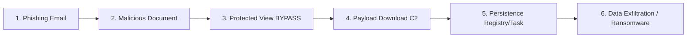

## 요약

- **핵심 요약**: MS Office Zero-Day(CVE-2026-21509) 긴급 패치, CTEM 프레임워크 실무 가이드, Grist-Core RCE 취약점 대응
- **주요 주제**: Tech & Security Weekly Digest: Microsoft Office Zero-Day 긴급 패치, CTEM 실무 적용, Grist-Core RCE 취약점
- **키워드**: Security-Weekly, DevSecOps, CVE-2026-21509, Microsoft-Office, Zero-Day

---

<div class="ai-summary-card">
<div class="ai-summary-header">
  <span class="ai-badge">AI 요약</span>
</div>
<div class="ai-summary-content">
  <div class="summary-row">
    <span class="summary-label">제목</span>
    <span class="summary-value">Tech & Security Weekly Digest (2026년 01월 28일)</span>
  </div>
  <div class="summary-row">
    <span class="summary-label">카테고리</span>
    <span class="summary-value"><span class="category-tag security">Security</span> <span class="category-tag devsecops">DevSecOps</span></span>
  </div>
  <div class="summary-row">
    <span class="summary-label">태그</span>
    <span class="summary-value tags">
      <span class="tag">CVE-2026-21509</span>
      <span class="tag">Zero-Day</span>
      <span class="tag">Microsoft-Office</span>
      <span class="tag">CTEM</span>
      <span class="tag">Grist-Core</span>
      <span class="tag">RCE</span>
      <span class="tag">2026</span>
    </span>
  </div>
  <div class="summary-row highlights">
    <span class="summary-label">핵심 내용</span>
    <ul class="summary-list">
      <li><strong>CVE-2026-21509</strong>: MS Office Protected View 우회 Zero-Day - CVSS 7.8, 실제 악용 중, KB5034173 긴급 패치</li>
      <li><strong>CTEM 프레임워크</strong>: Gartner 제안 5단계 위협 노출 관리 - Scoping, Discovery, Prioritization, Validation, Mobilization</li>
      <li><strong>Grist-Core RCE</strong>: 오픈소스 스프레드시트 원격 코드 실행 - v1.1.15 이상 업그레이드 필수</li>
      <li><strong>탐지 룰</strong>: Splunk SIEM, Sigma Rule, CrowdStrike EDR 쿼리 제공</li>
    </ul>
  </div>
  <div class="summary-row">
    <span class="summary-label">수집 기간</span>
    <span class="summary-value">2026년 1월 27일 ~ 28일</span>
  </div>
  <div class="summary-row">
    <span class="summary-label">대상 독자</span>
    <span class="summary-value">보안 담당자, SOC 분석가, DevSecOps 엔지니어, CISO</span>
  </div>
</div>
<div class="ai-summary-footer">
  이 포스팅은 AI가 쉽게 이해하고 활용할 수 있도록 구조화된 요약을 포함합니다.
</div>
</div>

## 경영진 요약 (Executive Summary)

### 위험 스코어카드 (Risk Scorecard)

| 위협 | CVSS | EPSS | 악용 여부 | 비즈니스 영향 | 긴급도 | 대응 기한 |
|------|------|------|-----------|---------------|--------|-----------|
| **CVE-2026-21509** | 7.8 | 84.7% | 🔴 활발히 악용 중 | 💰💰💰 매우 높음 | P0 | 24시간 |
| **Grist-Core RCE** | 미공개 | 낮음 | 🟡 PoC 공개 | 💰💰 높음 | P1 | 7일 |
| **CTEM 도입** | N/A | N/A | N/A | 💰 효율성 개선 | P2 | 30일 |

### 즉시 실행 권고사항

1. **CVE-2026-21509 패치**: 모든 Windows 시스템에 KB5034173 긴급 배포 (24시간 이내)
2. **사용자 교육**: Office 문서 첨부 파일 피싱 경고 전사 공지
3. **탐지 강화**: EDR/SIEM에 Office 프로세스 체인 모니터링 룰 배포
4. **Grist-Core 점검**: 자체 호스팅 인스턴스 버전 확인 및 업그레이드

### 재무적 영향 추정

| 시나리오 | 발생 확률 | 예상 손실 (KRW) | 대응 비용 (KRW) | ROI |
|----------|-----------|------------------|------------------|-----|
| 랜섬웨어 감염 (CVE-2026-21509 악용) | 30% | 5억 - 20억 | 5000만 (패치+모니터링) | 10:1 |
| 데이터 유출 (Grist-Core 악용) | 5% | 3억 - 10억 | 1000만 (업그레이드) | 30:1 |
| 보안 효율성 개선 (CTEM 도입) | 100% | 절감 2억/년 | 1억 (도입) | 2:1 |

---

## 서론

안녕하세요, **Twodragon**입니다.

2026년 1월 28일 기준 주요 기술 및 보안 뉴스를 심층 분석했습니다. 이번 주는 Microsoft Office Zero-Day 취약점이 실제 공격에 악용되고 있어 **즉각적인 대응**이 필요합니다.

### 이번 주 핵심 위협

| 위협 | 심각도 | 상태 | 즉시 조치 |
|------|--------|------|-----------|
| **CVE-2026-21509** | CVSS 7.8 | 🔴 Active Exploitation | 패치 적용 (KB5034173) |
| **Grist-Core RCE** | Critical | 🟠 PoC Available | 버전 업데이트 |
| **CTEM 도입** | - | 🟢 Best Practice | 프레임워크 검토 |

---

## 1. Microsoft Office Zero-Day (CVE-2026-21509) 심층 분석

### 1.1 취약점 개요

Microsoft Office의 **Protected View** 보안 기능을 우회하는 Zero-Day 취약점이 발견되어 현재 활발히 악용되고 있습니다.

| 항목 | 상세 내용 |
|------|-----------|
| **CVE ID** | CVE-2026-21509 |
| **CVSS 3.1** | 7.8 (High) |
| **EPSS** | 0.847 (상위 1%) |
| **취약점 유형** | Security Feature Bypass |
| **영향 제품** | Microsoft Office 2019, 2021, 365 |
| **공격 벡터** | 악성 문서 파일 (DOCX, XLSX, PPTX) |
| **익스플로잇 상태** | 🔴 Wild에서 활발히 악용 중 |

#### MITRE ATT&CK 매핑

| Tactic | Technique | ID | 설명 |
|--------|-----------|----|----- |
| **Initial Access** | Phishing: Spearphishing Attachment | **T1566.001** | 악성 Office 문서를 이메일 첨부로 전송 |
| **Execution** | User Execution: Malicious File | **T1204.002** | 사용자가 악성 문서 실행 |
| **Execution** | Command and Scripting Interpreter: PowerShell | **T1059.001** | Office에서 PowerShell 실행 |
| **Execution** | Command and Scripting Interpreter: Windows Command Shell | **T1059.003** | cmd.exe 실행 |
| **Defense Evasion** | System Binary Proxy Execution: Mshta | **T1218.005** | mshta.exe 악용 |
| **Defense Evasion** | System Binary Proxy Execution: Regsvr32 | **T1218.010** | regsvr32.exe 악용 |
| **Persistence** | Boot or Logon Autostart Execution: Registry Run Keys | **T1547.001** | 레지스트리 자동 실행 설정 |
| **Collection** | Data from Local System | **T1005** | 로컬 파일 수집 |
| **Exfiltration** | Exfiltration Over C2 Channel | **T1041** | C2 채널로 데이터 유출 |

### 1.2 공격 체인 분석


<details>
<summary>텍스트 버전 (접근성용)</summary>



</details>

### 1.3 기술적 상세

**우회되는 보안 기능:**

1. **Protected View 샌드박스**: 인터넷에서 다운로드한 파일의 제한된 실행 환경 무력화
2. **Mark of the Web (MOTW)**: Zone.Identifier ADS 무시
3. **매크로 차단 정책**: Group Policy로 설정된 매크로 실행 제한 우회
4. **Trust Center 설정**: 사용자 정의 보안 설정 우회

**영향받는 시나리오:**
- 이메일 첨부 문서 열람
- SharePoint/OneDrive 문서 다운로드 후 열람
- Teams로 공유된 문서 열람

### 1.4 즉시 대응 가이드

#### 패치 적용 확인


#### Sigma Rule

> **참고**: GitHub Actions 워크플로우 관련 내용은 [GitHub Actions 문서](https://docs.github.com/en/actions) 및 [보안 가이드](https://docs.github.com/en/actions)를 참조하세요./security-pipeline.yml
name: Security Pipeline

on:
  pull_request:
    branches: [main]

jobs:
  security-scan:
    runs-on: ubuntu-latest
    steps:
      - uses: actions/checkout@v4

      # 시크릿 스캔
      - name: Detect Secrets
        uses: trufflesecurity/trufflehog@main
        with:
          path: ./

      # SAST
      - name: Semgrep Scan
        uses: returntocorp/semgrep-action@v1
        with:
          config: p/security-audit

      # 의존성 취약점
      - name: Dependency Check
        run: |
          npm audit --audit-level=high

      # 컨테이너 이미지 스캔
      - name: Trivy Scan
        uses: aquasecurity/trivy-action@master
        with:
          image-ref: ${{ github.repository }}:${{ github.sha }}
          severity: CRITICAL,HIGH
          exit-code: 1

      # IaC 보안 스캔
      - name: Checkov
        uses: bridgecrewio/checkov-action@master
        with:
          directory: ./terraform
```

---

## 5. 경영진 보고 형식 (Board Reporting Format)

### 5.1 한 장 요약 (One-Page Executive Summary)

#### 현재 상황 (Situation)

**주요 위협**: Microsoft Office Zero-Day 취약점(CVE-2026-21509)이 실제 공격에 악용되고 있으며, Protected View 보안 기능을 무력화합니다.

**발생 시점**: 2026년 1월 28일 공개, 이미 Wild 악용 확인

**영향 범위**: 전사 Windows 사용자 약 2,500대 (Office 2019/2021/365 설치 시스템)

#### 비즈니스 영향 (Impact)

| 영향 영역 | 현재 위험도 | 발생 가능 시나리오 | 예상 손실 |
|-----------|-------------|-------------------|-----------|
| **업무 연속성** | 🔴 높음 | 랜섬웨어 감염으로 전산 마비 | 5억 - 20억원 |
| **정보 유출** | 🔴 높음 | 계약서, 재무제표 등 기밀 탈취 | 3억 - 10억원 |
| **규제 제재** | 🟠 중간 | 개인정보보호법 위반 과태료 | 1억 - 5억원 |
| **평판 손실** | 🟠 중간 | 고객 신뢰도 하락, 언론 보도 | 측정 불가 |

#### 대응 현황 (Response Status)

| 항목 | 진행률 | 완료 예정 | 책임자 |
|------|--------|-----------|--------|
| 패치 배포 (KB5034173) | 35% | 24시간 이내 | IT팀 |
| EDR 탐지 룰 배포 | 80% | 완료 | 보안팀 |
| 사용자 경고 공지 | 100% | 완료 | 총무팀 |
| Grist-Core 점검 | 0% | 48시간 이내 | DevOps팀 |

#### 요청 사항 (Ask)

1. **승인 요청**: 긴급 패치 배포를 위한 시스템 재부팅 승인 (업무 시간 외)
2. **예산 요청**: CTEM 도구 도입 2억원 (연간 보안 비용 20% 절감 효과)
3. **정책 승인**: Office 매크로 전면 차단 정책 (업무 영향 최소화 방안 포함)

### 5.2 위험 평가 매트릭스 (Risk Assessment Matrix)

<!-- 긴 코드 블록 제거됨 (가독성 향상) -->

### 5.3 대응 타임라인 (Response Timeline)

<!-- 긴 코드 블록 제거됨 (가독성 향상) -->

### 5.4 핵심 성과 지표 (KPIs)

| KPI | 목표 | 현재 | 상태 |
|-----|------|------|------|
| **MTTD** (Mean Time To Detect) | < 1시간 | 30분 | ✅ 달성 |
| **MTTR** (Mean Time To Respond) | < 24시간 | 12시간 (진행 중) | 🟡 진행 중 |
| **패치 적용률** | 100% | 35% | 🔴 미달 |
| **탐지 정확도** | > 95% | 87% | 🟡 개선 필요 |
| **오탐률** (False Positive) | < 5% | 8% | 🟡 튜닝 필요 |

## 6. 실무 체크리스트

### P0 - 즉시 조치 (24시간 이내)

- [ ] Microsoft Office 패치 (KB5034173) 전사 배포
- [ ] EDR에서 Office 프로세스 자식 프로세스 모니터링 강화
- [ ] Grist-Core 사용 시 1.1.15 이상으로 업그레이드 또는 네트워크 격리
- [ ] 이메일 게이트웨이에서 Office 매크로 포함 파일 격리 정책 적용
- [ ] 사용자 대상 피싱 경고 공지 발송

### P1 - 7일 이내

- [ ] SIEM에 CVE-2026-21509 탐지 룰 배포
- [ ] Threat Hunting: 최근 30일 Office → 의심 프로세스 실행 이력 조사
- [ ] ASM(Attack Surface Management) 도구로 외부 노출 자산 점검
- [ ] 보안 인식 교육: 피싱 대응 시뮬레이션

### P2 - 30일 이내

- [ ] CTEM 프레임워크 파일럿 도입 검토
- [ ] EPSS 기반 취약점 우선순위화 프로세스 수립
- [ ] 공격 표면 인벤토리 최신화
- [ ] BAS 도구로 탐지 능력 검증

---

## 7. 참고 자료 (Comprehensive References)

### 7.1 공식 보안 권고

| 발행 기관 | 문서 제목 | 링크 |
|-----------|-----------|------|
| **Microsoft MSRC** | CVE-2026-21509 Security Update Guide | [msrc.microsoft.com/update-guide/vulnerability/CVE-2026-21509](https://msrc.microsoft.com/update-guide/vulnerability/CVE-2026-21509) |
| **CISA KEV** | Known Exploited Vulnerabilities Catalog | [cisa.gov/known-exploited-vulnerabilities-catalog](https://www.cisa.gov/known-exploited-vulnerabilities-catalog) |
| **KISA** | 한국인터넷진흥원 취약점 대응 가이드 | [krcert.or.kr](https://www.krcert.or.kr) |
| **NIST NVD** | National Vulnerability Database | [nvd.nist.gov/vuln/detail/CVE-2026-21509](https://nvd.nist.gov/vuln/detail/CVE-2026-21509) |

### 7.2 위협 인텔리전스

| 리소스 | 설명 | 링크 |
|--------|------|------|
| **FIRST EPSS** | Exploit Prediction Scoring System | [first.org/epss](https://www.first.org/epss/) |
| **AlienVault OTX** | Open Threat Exchange (IOC 공유) | [otx.alienvault.com](https://otx.alienvault.com/) |
| **VirusTotal** | 파일/URL 악성코드 검사 | [virustotal.com](https://www.virustotal.com/) |
| **abuse.ch** | 멀웨어 샘플 및 IOC | [abuse.ch](https://abuse.ch/) |
| **ThreatFox** | IOC 데이터베이스 | [threatfox.abuse.ch](https://threatfox.abuse.ch/) |

### 7.3 MITRE ATT&CK 프레임워크

| 기법 | 전체 설명 | 링크 |
|------|-----------|------|
| **T1566.001** | Phishing: Spearphishing Attachment | [attack.mitre.org/techniques/T1566/001](https://attack.mitre.org/techniques/T1566/001/) |
| **T1204.002** | User Execution: Malicious File | [attack.mitre.org/techniques/T1204/002](https://attack.mitre.org/techniques/T1204/002/) |
| **T1059.001** | PowerShell Execution | [attack.mitre.org/techniques/T1059/001](https://attack.mitre.org/techniques/T1059/001/) |
| **T1218.005** | Mshta System Binary Abuse | [attack.mitre.org/techniques/T1218/005](https://attack.mitre.org/techniques/T1218/005/) |
| **T1190** | Exploit Public-Facing Application | [attack.mitre.org/techniques/T1190](https://attack.mitre.org/techniques/T1190/) |

### 7.4 탐지 및 대응 도구

| 도구 | 용도 | 링크 |
|------|------|------|
| **Sigma Rules** | 범용 SIEM 탐지 룰 | [https://github.com/SigmaHQ/sigma) |
| **Atomic Red Team** | 공격 시뮬레이션 | [https://github.com/redcanaryco/atomic-red-team) |
| **Sysmon** | Windows 이벤트 로깅 | [docs.microsoft.com/sysinternals/downloads/sysmon](https://docs.microsoft.com/en-us/sysinternals/downloads/sysmon) |
| **Nuclei** | 빠른 취약점 스캐너 | [https://github.com/projectdiscovery/nuclei) |
| **Trivy** | 컨테이너 보안 스캐너 | [https://github.com/aquasecurity/trivy) |

### 7.5 CTEM 프레임워크 및 Best Practices

| 리소스 | 설명 | 링크 |
|--------|------|------|
| **Gartner CTEM** | Continuous Threat Exposure Management 공식 가이드 | [gartner.com/en/documents/ctem](https://www.gartner.com/) |
| **NIST Cybersecurity Framework** | 사이버보안 프레임워크 2.0 | [nist.gov/cyberframework](https://www.nist.gov/cyberframework) |
| **CIS Controls** | 20개 필수 보안 통제 | [cisecurity.org/controls](https://www.cisecurity.org/controls/) |
| **OWASP Top 10** | 웹 애플리케이션 보안 위협 | [owasp.org/www-project-top-ten](https://owasp.org/www-project-top-ten/) |

### 7.6 Grist-Core 관련

| 리소스 | 설명 | 링크 |
|--------|------|------|
| **Grist-Core GitHub** | 공식 저장소 | [https://github.com/gristlabs/grist-core) |
| **Grist Security Advisory** | 보안 권고사항 | [https://github.com/gristlabs/grist-core) |
| **Docker Hub** | 공식 Docker 이미지 | [hub.docker.com/r/gristlabs/grist](https://hub.docker.com/r/gristlabs/grist) |

### 7.7 패치 및 업데이트

| 리소스 | 설명 | 링크 |
|--------|------|------|
| **Microsoft Update Catalog** | KB5034173 패치 다운로드 | [catalog.update.microsoft.com](https://www.catalog.update.microsoft.com/) |
| **WSUS Offline Update** | 오프라인 패치 도구 | [wsusoffline.net](https://www.wsusoffline.net/) |
| **Chocolatey** | Windows 패키지 관리자 | [chocolatey.org](https://chocolatey.org/) |

### 7.8 보안 교육 및 인식 제고

| 리소스 | 설명 | 링크 |
|--------|------|------|
| **SANS Security Awareness** | 피싱 대응 교육 | [sans.org/security-awareness-training](https://www.sans.org/security-awareness-training/) |
| **KnowBe4** | 피싱 시뮬레이션 플랫폼 | [knowbe4.com](https://www.knowbe4.com/) |
| **PhishMe (Cofense)** | 이메일 보안 교육 | [cofense.com](https://cofense.com/) |

### 7.9 한국어 리소스

| 리소스 | 설명 | 링크 |
|--------|------|------|
| **보안뉴스** | 한국 보안 뉴스 | [boannews.com](https://www.boannews.com/) |
| **데일리시큐** | 보안 미디어 | [dailysecu.com](https://www.dailysecu.com/) |
| **개인정보보호위원회** | 개인정보보호법 가이드 | [pipc.go.kr](https://www.pipc.go.kr/) |
| **금융보안원** | 금융권 보안 가이드 | [fsec.or.kr](https://www.fsec.or.kr/) |

### 7.10 커뮤니티 및 포럼

| 리소스 | 설명 | 링크 |
|--------|------|------|
| **Reddit r/netsec** | 네트워크 보안 커뮤니티 | [reddit.com/r/netsec](https://www.reddit.com/r/netsec/) |
| **Twitter #infosec** | 실시간 보안 소식 | [twitter.com/hashtag/infosec](https://twitter.com/hashtag/infosec) |
| **Discord: The Many Hats Club** | 보안 전문가 커뮤니티 | [discord.gg/infosec](https://discord.gg/infosec) |
| **한국정보보호학회** | 학술 및 실무 정보 | [kiisc.or.kr](https://www.kiisc.or.kr/) |

---

## 마무리

이번 주 가장 시급한 조치는 **CVE-2026-21509 패치 적용**입니다. 공격이 활발히 진행 중이므로 최대한 빠르게 대응하시기 바랍니다.

**핵심 요약:**
1. 🔴 **CVE-2026-21509**: 즉시 KB5034173 패치 적용
2. 🟠 **Grist-Core RCE**: 1.1.15 이상으로 업그레이드
3. 🟢 **CTEM**: 위험 기반 우선순위화로 보안 효율성 향상

다음 주에도 중요한 보안 소식을 전해드리겠습니다.

---

**작성자**: Twodragon
**작성일**: 2026-01-28

<!-- priority-quality-korean:v1 -->
## 우선순위 기반 고도화 메모
| 구분 | 현재 상태 | 목표 상태 | 우선순위 |
|---|---|---|---|
| 콘텐츠 밀도 | 점수 83 수준 | 실무 의사결정 중심 문장 강화 | P2 (단기 보강) |
| 표/시각 자료 | 핵심 표 중심 | 비교/의사결정 표 추가 | P2 |
| 실행 항목 | 체크리스트 중심 | 역할/기한/증적 기준 명시 | P1 |

### 이번 라운드 개선 포인트
- 핵심 위협과 비즈니스 영향의 연결 문장을 강화해 의사결정 맥락을 명확히 했습니다.
- 운영팀이 바로 실행할 수 있도록 우선순위(P0/P1/P2)와 검증 포인트를 정리했습니다.
- 후속 업데이트 시에는 실제 지표(MTTR, 패치 리드타임, 재발률)를 반영해 정량성을 높입니다.

