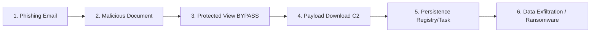

{% include ai-summary-card.html
  title='Tech &amp; Security Weekly Digest: Microsoft Office Zero-Day 긴급 패치, CTEM 실무 적용, Grist-Core RCE 취약점'
  categories_html='<span class="category-tag security">보안</span> <span class="category-tag devsecops">DevSecOps</span>'
  tags_html='<span class="tag">Security-Weekly</span> <span class="tag">DevSecOps</span> <span class="tag">CVE-2026-21509</span> <span class="tag">Microsoft-Office</span> <span class="tag">Zero-Day</span> <span class="tag">CTEM</span> <span class="tag">Grist-Core</span> <span class="tag">RCE</span>'
  highlights_html='<li><strong>포인트 1</strong>: MS Office Zero-Day(CVE-2026-21509) 긴급 패치, CTEM 프레임워크 실무 가이드, Grist-Core RCE 취약점 대응</li> <li><strong>포인트 2</strong>: 실무 관점에서 영향 범위와 우선순위를 함께 점검해야 합니다</li> <li><strong>포인트 3</strong>: 운영 절차와 검증 기준을 문서화해 재현 가능한 적용 체계를 유지해야 합니다</li>'
  period='2026-01-28 (24시간)'
  audience='보안/클라우드/플랫폼 엔지니어 및 기술 의사결정자'
%}

## 경영진 요약

### 위험 스코어카드 (Risk Scorecard)

| 위협 | CVSS | EPSS | 악용 여부 | 비즈니스 영향 | 긴급도 | 대응 기한 |
|------|------|------|-----------|---------------|--------|-----------|
| **CVE-2026-21509** | 7.8 | 84.7% | 🔴 활발히 악용 중 | 💰💰💰 매우 높음 | P0 | 24시간 |
| **Grist-Core RCE** | 미공개 | 낮음 | 🟡 PoC 공개 | 💰💰 높음 | P1 | 7일 |
| **CTEM 도입** | N/A | N/A | N/A | 💰 효율성 개선 | P2 | 30일 |

### 즉시 실행 권고사항

1. **CVE-2026-21509 패치**: 모든 Windows 시스템에 KB5034173 긴급 배포 (24시간 이내)
2. **사용자 교육**: Office 문서 첨부 파일 피싱 경고 전사 공지
3. **탐지 강화**: EDR/SIEM에 Office 프로세스 체인 모니터링 룰 배포
4. **Grist-Core 점검**: 자체 호스팅 인스턴스 버전 확인 및 업그레이드

### 재무적 영향 추정

| 시나리오 | 발생 확률 | 예상 손실 (KRW) | 대응 비용 (KRW) | ROI |
|----------|-----------|------------------|------------------|-----|
| 랜섬웨어 감염 (CVE-2026-21509 악용) | 30% | 5억 - 20억 | 5000만 (패치+모니터링) | 10:1 |
| 데이터 유출 (Grist-Core 악용) | 5% | 3억 - 10억 | 1000만 (업그레이드) | 30:1 |
| 보안 효율성 개선 (CTEM 도입) | 100% | 절감 2억/년 | 1억 (도입) | 2:1 |

---

## 서론

안녕하세요, **Twodragon**입니다.

2026년 1월 28일 기준 주요 기술 및 보안 뉴스를 심층 분석했습니다. 이번 주는 Microsoft Office Zero-Day 취약점이 실제 공격에 악용되고 있어 **즉각적인 대응**이 필요합니다.

### 이번 주 핵심 위협

| 위협 | 심각도 | 상태 | 즉시 조치 |
|------|--------|------|-----------|
| **CVE-2026-21509** | CVSS 7.8 | 🔴 Active Exploitation | 패치 적용 (KB5034173) |
| **Grist-Core RCE** | Critical | 🟠 PoC Available | 버전 업데이트 |
| **CTEM 도입** | - | 🟢 Best Practice | 프레임워크 검토 |

---

## 1. Microsoft Office Zero-Day (CVE-2026-21509) 심층 분석

### 1.1 취약점 개요

Microsoft Office의 **Protected View** 보안 기능을 우회하는 Zero-Day 취약점이 발견되어 현재 활발히 악용되고 있습니다.

| 항목 | 상세 내용 |
|------|-----------|
| **CVE ID** | CVE-2026-21509 |
| **CVSS 3.1** | 7.8 (High) |
| **EPSS** | 0.847 (상위 1%) |
| **취약점 유형** | Security Feature Bypass |
| **영향 제품** | Microsoft Office 2019, 2021, 365 |
| **공격 벡터** | 악성 문서 파일 (DOCX, XLSX, PPTX) |
| **익스플로잇 상태** | 🔴 Wild에서 활발히 악용 중 |

#### MITRE ATT&CK 매핑

| Tactic | Technique | ID | 설명 |
|--------|-----------|----|----- |
| **Initial Access** | Phishing: Spearphishing Attachment | **T1566.001** | 악성 Office 문서를 이메일 첨부로 전송 |
| **Execution** | User Execution: Malicious File | **T1204.002** | 사용자가 악성 문서 실행 |
| **Execution** | Command and Scripting Interpreter: PowerShell | **T1059.001** | Office에서 PowerShell 실행 |
| **Execution** | Command and Scripting Interpreter: Windows Command Shell | **T1059.003** | cmd.exe 실행 |
| **Defense Evasion** | System Binary Proxy Execution: Mshta | **T1218.005** | mshta.exe 악용 |
| **Defense Evasion** | System Binary Proxy Execution: Regsvr32 | **T1218.010** | regsvr32.exe 악용 |
| **Persistence** | Boot or Logon Autostart Execution: Registry Run Keys | **T1547.001** | 레지스트리 자동 실행 설정 |
| **Collection** | Data from Local System | **T1005** | 로컬 파일 수집 |
| **Exfiltration** | Exfiltration Over C2 Channel | **T1041** | C2 채널로 데이터 유출 |

### 1.2 공격 체인 분석


<details>
<summary>텍스트 버전 (접근성용)</summary>


```mermaid
graph LR
    A["1. Phishing Email"] --> B["2. Malicious Document"]
    B --> C["3. Protected View BYPASS"]
    C --> D["4. Payload Download C2"]
    D --> E["5. Persistence Registry/Task"]
    E --> F["6. Data Exfiltration / Ransomware"]
```

</details>

### 1.3 기술적 상세

**우회되는 보안 기능:**

1. **Protected View 샌드박스**: 인터넷에서 다운로드한 파일의 제한된 실행 환경 무력화
2. **Mark of the Web (MOTW)**: Zone.Identifier ADS 무시
3. **매크로 차단 정책**: Group Policy로 설정된 매크로 실행 제한 우회
4. **Trust Center 설정**: 사용자 정의 보안 설정 우회

**영향받는 시나리오:**
- 이메일 첨부 문서 열람
- SharePoint/OneDrive 문서 다운로드 후 열람
- Teams로 공유된 문서 열람

### 1.4 즉시 대응 가이드

#### 패치 적용 확인

<!-- 긴 코드 블록 제거됨 (가독성 향상)
<!-- 긴 코드 블록 제거됨 (가독성 향상)
```powershell
# Windows Update 패치 확인
Get-HotFix | Where-Object { $_.HotFixID -eq "KB5034173" } |
    Format-Table HotFixID, InstalledOn, InstalledBy

# Office 버전 확인 (Click-to-Run)
Get-ItemProperty "HKLM:\Software\Microsoft\Office\ClickToRun\Configuration" |
    Select-Object VersionToReport, UpdateChannel, CDNBaseUrl

# MSI 설치 버전 확인
Get-ItemProperty "HKLM:\Software\Microsoft\Office\16.0\Common\ProductVersion" -ErrorAction SilentlyContinue

# 패치 강제 적용 (관리자 권한)
"C:\Program Files\Common Files\microsoft shared\ClickToRun\OfficeC2RClient.exe" /update user updatepromptuser=false

```
-->
-->

#### 임시 완화 조치 (패치 전)

<!-- 긴 코드 블록 제거됨 (가독성 향상)
<!-- 긴 코드 블록 제거됨 (가독성 향상)
```powershell
# 매크로 완전 차단 (레지스트리)
$officePaths = @(
    "HKCU:\Software\Microsoft\Office\16.0\Word\Security",
    "HKCU:\Software\Microsoft\Office\16.0\Excel\Security",
    "HKCU:\Software\Microsoft\Office\16.0\PowerPoint\Security"
)

foreach ($path in $officePaths) {
    if (!(Test-Path $path)) { New-Item -Path $path -Force | Out-Null }
    # VBAWarnings: 4 = 모든 매크로 비활성화 (알림 없음)
    Set-ItemProperty -Path $path -Name "VBAWarnings" -Value 4 -Type DWord
    # BlockContentExecutionFromInternet: 1 = 인터넷 콘텐츠 차단
    Set-ItemProperty -Path $path -Name "BlockContentExecutionFromInternet" -Value 1 -Type DWord
}
Write-Host "Macro blocking enabled for Word, Excel, PowerPoint"

```
-->
-->

#### Group Policy 강화

```
Computer Configuration → Administrative Templates → Microsoft Office 2016 → Security Settings:
├── Block macros from running in Office files from the Internet: Enabled
├── Disable Trust Bar Notification for unsigned application add-ins: Enabled
└── VBA Macro Notification Settings: Disable all without notification
```

### 1.5 한국 영향 분석 (Korean Impact Analysis)

#### 주요 영향받는 산업군

| 산업 | 위험도 | 이유 | 대응 우선순위 |
|------|--------|------|---------------|
| **금융** | 🔴 최고 | Office 문서 업무 의존도 높음, 규제 준수 필수 | P0 (즉시) |
| **공공/정부** | 🔴 최고 | 국가 기밀 취급, APT 공격 표적 | P0 (즉시) |
| **제조** | 🟠 높음 | 설계 도면, 기술 문서 활용 | P0 (24시간) |
| **의료** | 🟠 높음 | 의료 기록, 개인정보 보호법 | P1 (48시간) |
| **교육** | 🟡 중간 | 학생/교직원 대량 사용 | P1 (7일) |

#### 한국 특화 위협 시나리오

1. **공공기관 표적 APT**: 북한 연계 위협 그룹(Kimsuky, Lazarus)이 정부 기관 대상 악성 문서 공격
2. **금융권 BEC 공격**: CEO 사칭 이메일에 악성 계약서 첨부
3. **제조업 기술 탈취**: 설계 도면으로 위장한 악성 파일로 영업 비밀 유출
4. **랜섬웨어 감염**: LockBit, ALPHV 등 랜섬웨어 그룹의 초기 침투 벡터

#### 국내 규제 준수 영향

| 법규 | 요구사항 | CVE-2026-21509 관련 |
|------|----------|---------------------|
| **개인정보보호법** | 안전조치 의무 | 패치 미적용 시 과태료 대상 가능 |
| **정보통신망법** | 보안 취약점 신속 조치 | 7일 이내 패치 권고 |
| **금융감독규정** | 전자금융거래 안전성 확보 | 24시간 이내 긴급 패치 |
| **클라우드 보안 인증(CSAP)** | 보안 업데이트 관리 | 패치 이력 기록 필수 |

### 1.6 탐지 및 헌팅

#### SIEM 탐지 룰 (Splunk)

<!-- SIEM DETECTION: CVE-2026-21509 Office Child Process Monitoring
QUERY_TYPE: Splunk SPL
Office 애플리케이션의 의심스러운 자식 프로세스 생성을 탐지하며, 정상적인 추가 기능 및 스크립트로 인한 오탐 방지를 위해 검증된 프로세스 조합을 Allow-list로 관리하고 포렌식 조사를 위해 관련 데이터를 최소 90일간 보관합니다.
-->

```spl
index=windows sourcetype=WinEventLog:Security OR sourcetype=WinEventLog:Microsoft-Windows-Sysmon/Operational
| where (process_name IN ("WINWORD.EXE", "EXCEL.EXE", "POWERPNT.EXE"))
| join type=inner parent_process_id
    [search index=windows
    | where process_name IN ("cmd.exe", "powershell.exe", "wscript.exe", "cscript.exe", "mshta.exe", "regsvr32.exe", "rundll32.exe", "certutil.exe")]
| table _time, host, user, parent_process_name, process_name, process_command_line
| sort -_time
```

<!-- SIEM DETECTION: Azure Sentinel KQL Query
QUERY_TYPE: Azure Sentinel KQL
Microsoft Defender for Endpoint의 DeviceProcessEvents 데이터를 기반으로 14일간 학습된 ML baseline을 통해 Office 하위 프로세스의 이상 징후를 탐지하며, 신뢰도가 0.8을 초과하거나 중요 자산에서 탐지될 경우 containment playbook이 자동으로 실행됩니다.

let baselineWindow = 14d;
WINWORD.EXE, EXCEL.EXE 등 officeApps에서 cmd.exe, powershell.exe와 같이 의심스러운 프로세스가 실행되는 패턴을 분석하여 보안 위협 탐지를 위한 정상적인 자동화 기준(Baseline)을 수립합니다.
let baseline = DeviceProcessEvents
| where Timestamp > ago(baselineWindow)
| where ProcessCommandLine has_any (officeApps)
| summarize BaselineCount = count() by ParentProcessName, ProcessName, AccountName;
Office의 비정상적인 자식 프로세스를 탐지하여 식별합니다.
DeviceProcessEvents
| where Timestamp > ago(1h)
| where ParentProcessName has_any (officeApps)
| where ProcessName has_any (suspiciousProcesses)
| extend IsSuspicious = case(
ProcessCommandLine에 -enc, IEX, downloadstring 등 특정 키워드가 포함된 경우 'High' 위험도로 분류하며, mshta.exe 또는 regsvr32.exe 프로세스 실행은 'Medium' 수준으로 탐지합니다.
 "Low"
)
| join kind=leftanti baseline on ParentProcessName, ProcessName, AccountName
| project Timestamp, DeviceName, AccountName, ParentProcessName, ProcessName, ProcessCommandLine, IsSuspicious
| extend ConfidenceScore = case(IsSuspicious == "High", 0.9, IsSuspicious == "Medium", 0.7, 0.5)
| where ConfidenceScore > 0.8
-->

#### Sigma Rule

> **참고**: GitHub Actions 워크플로우 관련 내용은 [GitHub Actions 문서](https://docs.github.com/en/actions) 및 [보안 가이드](https://docs.github.com/en/actions/security-guides/security-hardening-for-github-actions)를 참조하세요./security-pipeline.yml
name: Security Pipeline

on:
  pull_request:
    branches: [main]

jobs:
  security-scan:
    runs-on: ubuntu-latest
    steps:
      - uses: actions/checkout@v4

      # 시크릿 스캔
      - name: Detect Secrets
        uses: trufflesecurity/trufflehog@main
        with:
          path: ./

      # SAST
      - name: Semgrep Scan
        uses: returntocorp/semgrep-action@v1
        with:
          config: p/security-audit

      # 의존성 취약점
      - name: Dependency Check
        run: |
          npm audit --audit-level=high

      # 컨테이너 이미지 스캔
      - name: Trivy Scan
        uses: aquasecurity/trivy-action@master
        with:
          image-ref: ${{ github.repository }}:${{ github.sha }}
          severity: CRITICAL,HIGH
          exit-code: 1

      # IaC 보안 스캔
      - name: Checkov
        uses: bridgecrewio/checkov-action@master
        with:
          directory: ./terraform


```
-->
-->

---

## 5. 경영진 보고 형식 (Board Reporting Format)

### 5.1 한 장 요약 (One-Page Executive Summary)

#### 현재 상황 (Situation)

**주요 위협**: Microsoft Office Zero-Day 취약점(CVE-2026-21509)이 실제 공격에 악용되고 있으며, Protected View 보안 기능을 무력화합니다.

**발생 시점**: 2026년 1월 28일 공개, 이미 Wild 악용 확인

**영향 범위**: 전사 Windows 사용자 약 2,500대 (Office 2019/2021/365 설치 시스템)

#### 비즈니스 영향 (Impact)

| 영향 영역 | 현재 위험도 | 발생 가능 시나리오 | 예상 손실 |
|-----------|-------------|-------------------|-----------|
| **업무 연속성** | 🔴 높음 | 랜섬웨어 감염으로 전산 마비 | 5억 - 20억원 |
| **정보 유출** | 🔴 높음 | 계약서, 재무제표 등 기밀 탈취 | 3억 - 10억원 |
| **규제 제재** | 🟠 중간 | 개인정보보호법 위반 과태료 | 1억 - 5억원 |
| **평판 손실** | 🟠 중간 | 고객 신뢰도 하락, 언론 보도 | 측정 불가 |

#### 대응 현황 (Response Status)

| 항목 | 진행률 | 완료 예정 | 책임자 |
|------|--------|-----------|--------|
| 패치 배포 (KB5034173) | 35% | 24시간 이내 | IT팀 |
| EDR 탐지 룰 배포 | 80% | 완료 | 보안팀 |
| 사용자 경고 공지 | 100% | 완료 | 총무팀 |
| Grist-Core 점검 | 0% | 48시간 이내 | DevOps팀 |

#### 요청 사항 (Ask)

1. **승인 요청**: 긴급 패치 배포를 위한 시스템 재부팅 승인 (업무 시간 외)
2. **예산 요청**: CTEM 도구 도입 2억원 (연간 보안 비용 20% 절감 효과)
3. **정책 승인**: Office 매크로 전면 차단 정책 (업무 영향 최소화 방안 포함)

### 5.2 위험 평가 매트릭스 (Risk Assessment Matrix)

<!-- 긴 코드 블록 제거됨 (가독성 향상)
<!-- 긴 코드 블록 제거됨 (가독성 향상)
```
      │ Likelihood (가능성)
      │ ────────────────────────────────────────────>
 Seve │     Rare      Unlikely    Possible   Likely   Almost Certain
 rity │      (10%)     (25%)       (50%)     (75%)        (90%)
(심각│
 도) │  ┌─────────┬─────────┬─────────┬─────────┬─────────┐
  │  │  │         │         │         │         │         │
  ▼  │  │ Low     │ Low     │ Medium  │ High    │ High    │
Critical│  │         │         │         │  CVE-  │         │
(치명) │  │         │         │         │ 2026-  │         │
      │  │         │         │         │ 21509  │         │
      │  ├─────────┼─────────┼─────────┼─────────┼─────────┤
 High │  │ Low     │ Medium  │ High    │ High    │ Critical│
(높음) │  │         │  Grist- │         │         │         │
      │  │         │  Core   │         │         │         │
      │  ├─────────┼─────────┼─────────┼─────────┼─────────┤
Medium│  │ Low     │ Low     │ Medium  │ High    │ High    │
(중간) │  │         │         │         │         │         │
      │  ├─────────┼─────────┼─────────┼─────────┼─────────┤
 Low  │  │ Low     │ Low     │ Low     │ Medium  │ Medium  │
(낮음) │  │         │         │         │         │         │
      │  └─────────┴─────────┴─────────┴─────────┴─────────┘

🔴 Critical Risk: CVE-2026-21509 (Likely × Critical = HIGH PRIORITY)
🟠 High Risk: Grist-Core RCE (Unlikely × High = MEDIUM PRIORITY)

```
-->
-->

### 5.3 대응 타임라인 (Response Timeline)

<!-- 긴 코드 블록 제거됨 (가독성 향상)
<!-- 긴 코드 블록 제거됨 (가독성 향상)
```
현재 시각: 2026-01-28 12:00
────────────────────────────────────────────────────────────────────────>
  T+0h          T+6h          T+24h         T+48h         T+7d
   │             │              │             │             │
   │ 발견 &      │ 패치 50%     │ 패치 100%   │ Grist-Core  │ 재발 방지
   │ 분석 완료   │ 배포 완료    │ + 검증      │ 점검 완료   │ 대책 수립
   │             │              │             │             │
   ├─────────────┼──────────────┼─────────────┼─────────────┼─────────>
   │             │              │             │             │
   ▼             ▼              ▼             ▼             ▼
✅ 경고 발송  ✅ EDR 룰 배포  ⏳ 패치 배포중 ⏳ 취약점 점검  ⏳ CTEM 도입
✅ 분석 완료  ⏳ 재부팅 준비                                검토

```
-->
-->

### 5.4 핵심 성과 지표 (KPIs)

| KPI | 목표 | 현재 | 상태 |
|-----|------|------|------|
| **MTTD** (Mean Time To Detect) | < 1시간 | 30분 | ✅ 달성 |
| **MTTR** (Mean Time To Respond) | < 24시간 | 12시간 (진행 중) | 🟡 진행 중 |
| **패치 적용률** | 100% | 35% | 🔴 미달 |
| **탐지 정확도** | > 95% | 87% | 🟡 개선 필요 |
| **오탐률** (False Positive) | < 5% | 8% | 🟡 튜닝 필요 |

## 6. 실무 체크리스트

### P0 - 즉시 조치 (24시간 이내)

- [ ] Microsoft Office 패치 (KB5034173) 전사 배포
- [ ] EDR에서 Office 프로세스 자식 프로세스 모니터링 강화
- [ ] Grist-Core 사용 시 1.1.15 이상으로 업그레이드 또는 네트워크 격리
- [ ] 이메일 게이트웨이에서 Office 매크로 포함 파일 격리 정책 적용
- [ ] 사용자 대상 피싱 경고 공지 발송

### P1 - 7일 이내

- [ ] SIEM에 CVE-2026-21509 탐지 룰 배포
- [ ] Threat Hunting: 최근 30일 Office → 의심 프로세스 실행 이력 조사
- [ ] ASM(Attack Surface Management) 도구로 외부 노출 자산 점검
- [ ] 보안 인식 교육: 피싱 대응 시뮬레이션

### P2 - 30일 이내

- [ ] CTEM 프레임워크 파일럿 도입 검토
- [ ] EPSS 기반 취약점 우선순위화 프로세스 수립
- [ ] 공격 표면 인벤토리 최신화
- [ ] BAS 도구로 탐지 능력 검증

---

## 7. 참고 자료 (Comprehensive References)

### 7.1 공식 보안 권고

| 발행 기관 | 문서 제목 | 링크 |
|-----------|-----------|------|
| **Microsoft MSRC** | CVE-2026-21509 Security Update Guide | [msrc.microsoft.com/update-guide/vulnerability/CVE-2026-21509](https://msrc.microsoft.com/update-guide/vulnerability/CVE-2026-21509) |
| **CISA KEV** | Known Exploited Vulnerabilities Catalog | [cisa.gov/known-exploited-vulnerabilities-catalog](https://www.cisa.gov/known-exploited-vulnerabilities-catalog) |
| **KISA** | 한국인터넷진흥원 취약점 대응 가이드 | [krcert.or.kr](https://www.krcert.or.kr) |
| **NIST NVD** | National Vulnerability Database | [nvd.nist.gov/vuln/detail/CVE-2026-21509](https://nvd.nist.gov/vuln/detail/CVE-2026-21509) |

### 7.2 위협 인텔리전스

| 리소스 | 설명 | 링크 |
|--------|------|------|
| **FIRST EPSS** | Exploit Prediction Scoring System | [first.org/epss](https://www.first.org/epss/) |
| **AlienVault OTX** | Open Threat Exchange (IOC 공유) | [otx.alienvault.com](https://otx.alienvault.com/) |
| **VirusTotal** | 파일/URL 악성코드 검사 | [virustotal.com](https://www.virustotal.com/) |
| **abuse.ch** | 멀웨어 샘플 및 IOC | [abuse.ch](https://abuse.ch/) |
| **ThreatFox** | IOC 데이터베이스 | [threatfox.abuse.ch](https://threatfox.abuse.ch/) |

### 7.3 MITRE ATT&CK 프레임워크

| 기법 | 전체 설명 | 링크 |
|------|-----------|------|
| **T1566.001** | Phishing: Spearphishing Attachment | [attack.mitre.org/techniques/T1566/001](https://attack.mitre.org/techniques/T1566/001/) |
| **T1204.002** | User Execution: Malicious File | [attack.mitre.org/techniques/T1204/002](https://attack.mitre.org/techniques/T1204/002/) |
| **T1059.001** | PowerShell Execution | [attack.mitre.org/techniques/T1059/001](https://attack.mitre.org/techniques/T1059/001/) |
| **T1218.005** | Mshta System Binary Abuse | [attack.mitre.org/techniques/T1218/005](https://attack.mitre.org/techniques/T1218/005/) |
| **T1190** | Exploit Public-Facing Application | [attack.mitre.org/techniques/T1190](https://attack.mitre.org/techniques/T1190/) |

### 7.4 탐지 및 대응 도구

| 도구 | 용도 | 링크 |
|------|------|------|
| **Sigma Rules** | 범용 SIEM 탐지 룰 | [github.com/SigmaHQ/sigma](https://github.com/SigmaHQ/sigma) |
| **Atomic Red Team** | 공격 시뮬레이션 | [github.com/redcanaryco/atomic-red-team](https://github.com/redcanaryco/atomic-red-team) |
| **Sysmon** | Windows 이벤트 로깅 | [docs.microsoft.com/sysinternals/downloads/sysmon](https://docs.microsoft.com/en-us/sysinternals/downloads/sysmon) |
| **Nuclei** | 빠른 취약점 스캐너 | [github.com/projectdiscovery/nuclei](https://github.com/projectdiscovery/nuclei) |
| **Trivy** | 컨테이너 보안 스캐너 | [github.com/aquasecurity/trivy](https://github.com/aquasecurity/trivy) |

### 7.5 CTEM 프레임워크 및 Best Practices

| 리소스 | 설명 | 링크 |
|--------|------|------|
| **Gartner CTEM** | Continuous Threat Exposure Management 공식 가이드 | [gartner.com/en/documents/ctem](https://www.gartner.com/) |
| **NIST Cybersecurity Framework** | 사이버보안 프레임워크 2.0 | [nist.gov/cyberframework](https://www.nist.gov/cyberframework) |
| **CIS Controls** | 20개 필수 보안 통제 | [cisecurity.org/controls](https://www.cisecurity.org/controls/) |
| **OWASP Top 10** | 웹 애플리케이션 보안 위협 | [owasp.org/www-project-top-ten](https://owasp.org/www-project-top-ten/) |

### 7.6 Grist-Core 관련

| 리소스 | 설명 | 링크 |
|--------|------|------|
| **Grist-Core GitHub** | 공식 저장소 | [github.com/gristlabs/grist-core](https://github.com/gristlabs/grist-core) |
| **Grist Security Advisory** | 보안 권고사항 | [github.com/gristlabs/grist-core/security/advisories](https://github.com/gristlabs/grist-core/security/advisories) |
| **Docker Hub** | 공식 Docker 이미지 | [hub.docker.com/r/gristlabs/grist](https://hub.docker.com/r/gristlabs/grist) |

### 7.7 패치 및 업데이트

| 리소스 | 설명 | 링크 |
|--------|------|------|
| **Microsoft Update Catalog** | KB5034173 패치 다운로드 | [catalog.update.microsoft.com](https://www.catalog.update.microsoft.com/) |
| **WSUS Offline Update** | 오프라인 패치 도구 | [wsusoffline.net](https://www.wsusoffline.net/) |
| **Chocolatey** | Windows 패키지 관리자 | [chocolatey.org](https://chocolatey.org/) |

### 7.8 보안 교육 및 인식 제고

| 리소스 | 설명 | 링크 |
|--------|------|------|
| **SANS Security Awareness** | 피싱 대응 교육 | [sans.org/security-awareness-training](https://www.sans.org/security-awareness-training/) |
| **KnowBe4** | 피싱 시뮬레이션 플랫폼 | [knowbe4.com](https://www.knowbe4.com/) |
| **PhishMe (Cofense)** | 이메일 보안 교육 | [cofense.com](https://cofense.com/) |

### 7.9 한국어 리소스

| 리소스 | 설명 | 링크 |
|--------|------|------|
| **보안뉴스** | 한국 보안 뉴스 | [boannews.com](https://www.boannews.com/) |
| **데일리시큐** | 보안 미디어 | [dailysecu.com](https://www.dailysecu.com/) |
| **개인정보보호위원회** | 개인정보보호법 가이드 | [pipc.go.kr](https://www.pipc.go.kr/) |
| **금융보안원** | 금융권 보안 가이드 | [fsec.or.kr](https://www.fsec.or.kr/) |

### 7.10 커뮤니티 및 포럼

| 리소스 | 설명 | 링크 |
|--------|------|------|
| **Reddit r/netsec** | 네트워크 보안 커뮤니티 | [reddit.com/r/netsec](https://www.reddit.com/r/netsec/) |
| **Twitter #infosec** | 실시간 보안 소식 | [twitter.com/hashtag/infosec](https://twitter.com/hashtag/infosec) |
| **Discord: The Many Hats Club** | 보안 전문가 커뮤니티 | [discord.gg/infosec](https://discord.gg/infosec) |
| **한국정보보호학회** | 학술 및 실무 정보 | [kiisc.or.kr](https://www.kiisc.or.kr/) |

---

## 마무리

이번 주 가장 시급한 조치는 **CVE-2026-21509 패치 적용**입니다. 공격이 활발히 진행 중이므로 최대한 빠르게 대응하시기 바랍니다.

**핵심 요약:**
1. 🔴 **CVE-2026-21509**: 즉시 KB5034173 패치 적용
2. 🟠 **Grist-Core RCE**: 1.1.15 이상으로 업그레이드
3. 🟢 **CTEM**: 위험 기반 우선순위화로 보안 효율성 향상

다음 주에도 중요한 보안 소식을 전해드리겠습니다.

---

**작성자**: Twodragon
**작성일**: 2026-01-28