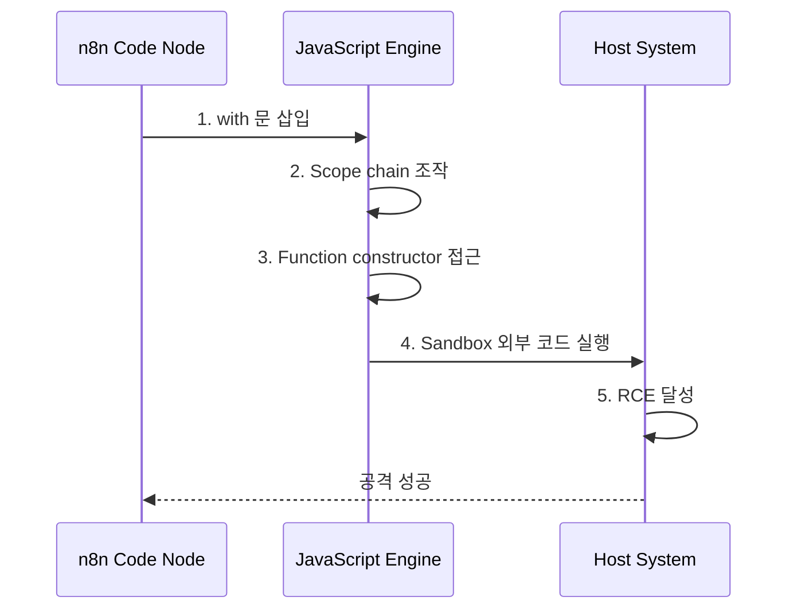
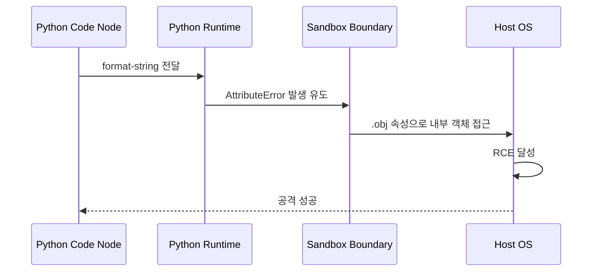
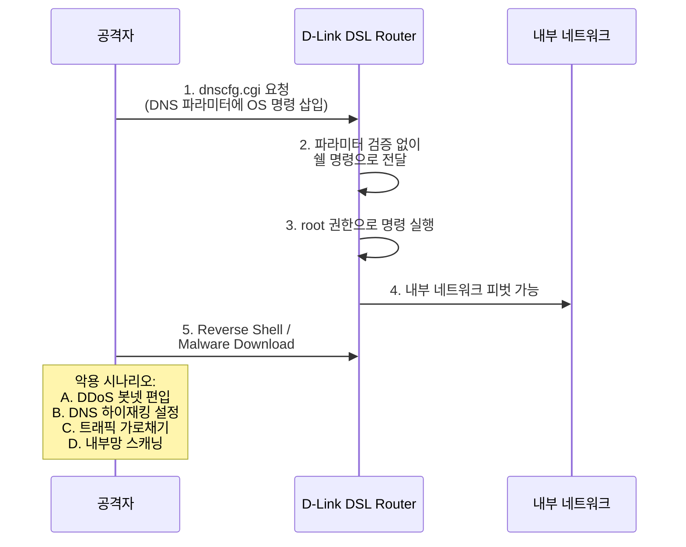
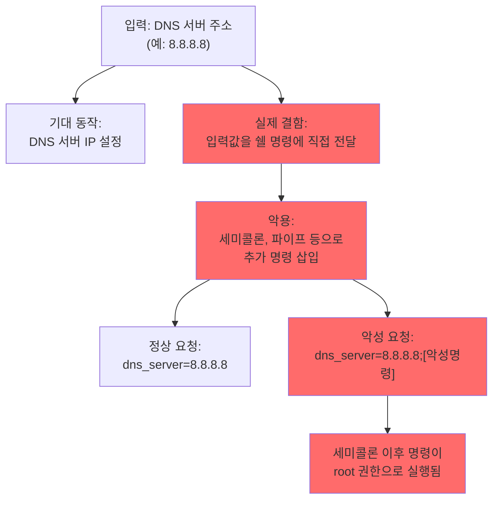
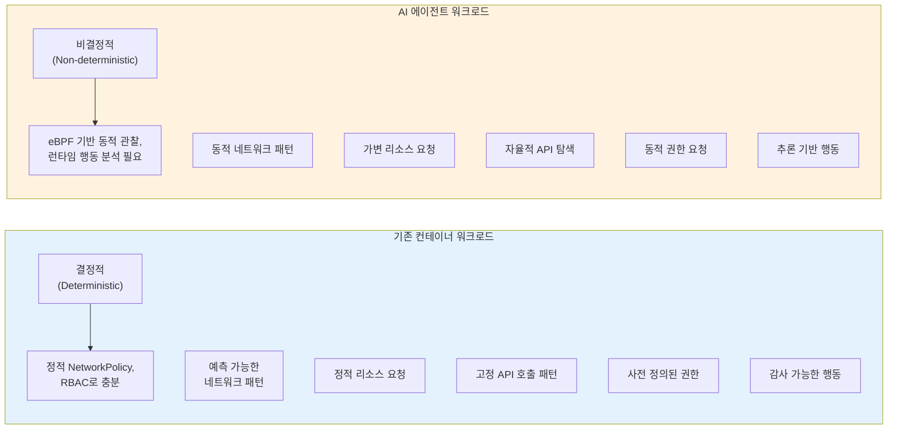
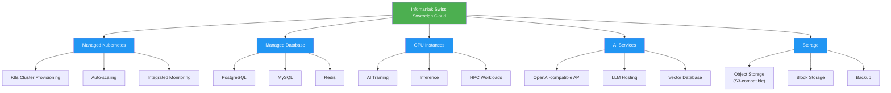
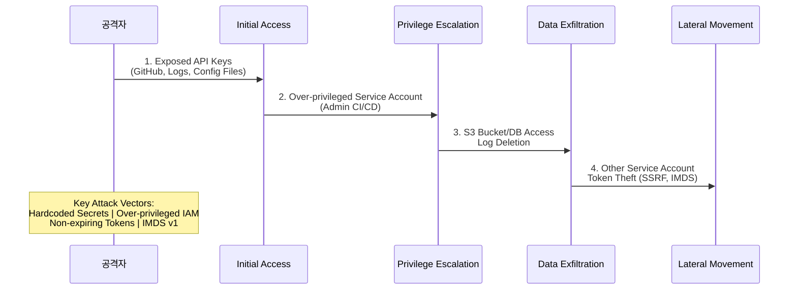

## 📋 포스팅 요약

> **제목**: Tech & Security Weekly Digest: n8n Critical RCE, D-Link 단종 장비 Zero-Day, Kubernetes AI 에이전트 보안

> **카테고리**: security, devsecops

> **태그**: Security-Weekly, n8n, RCE, CVE-2026-1470, D-Link, Zero-Day, CVE-2026-0625, Kubernetes, AI-Agent, eBPF, Sovereign-Cloud, NHI, DevSecOps, "2026"

> **핵심 내용**: 
> - n8n RCE(CVE-2026-1470 CVSS 9.9), D-Link Zero-Day, K8s AI 에이전트 보안 과제, Swiss Sovereign Cloud

> **주요 기술/도구**: Security, Kubernetes, DevSecOps, security, devsecops

> **대상 독자**: 기업 보안 담당자, 보안 엔지니어, CISO

> ---

> *이 포스팅은 AI(Cursor, Claude 등)가 쉽게 이해하고 활용할 수 있도록 구조화된 요약을 포함합니다.*


<div class="ai-summary-card">
<div class="ai-summary-header">
  <span class="ai-badge">AI 요약</span>
</div>
<div class="ai-summary-content">
  <div class="summary-row">
    <span class="summary-label">제목</span>
    <span class="summary-value">Tech & Security Weekly Digest (2026년 01월 29일)</span>
  </div>
  <div class="summary-row">
    <span class="summary-label">카테고리</span>
    <span class="summary-value"><span class="category-tag security">Security</span> <span class="category-tag devsecops">DevSecOps</span></span>
  </div>
  <div class="summary-row">
    <span class="summary-label">태그</span>
    <span class="summary-value tags">
      <span class="tag">n8n</span>
      <span class="tag">CVE-2026-1470</span>
      <span class="tag">RCE</span>
      <span class="tag">D-Link</span>
      <span class="tag">CVE-2026-0625</span>
      <span class="tag">Kubernetes</span>
      <span class="tag">AI-Agent</span>
      <span class="tag">eBPF</span>
      <span class="tag">NHI</span>
      <span class="tag">2026</span>
    </span>
  </div>
  <div class="summary-row highlights">
    <span class="summary-label">핵심 내용</span>
    <ul class="summary-list">
      <li><strong>n8n Critical RCE (CVE-2026-1470)</strong>: CVSS 9.9 - JavaScript AST sandbox escape, Function constructor bypass로 원격 코드 실행</li>
      <li><strong>D-Link Zero-Day (CVE-2026-0625)</strong>: CVSS 9.3 - 단종 장비 DNS 커맨드 인젝션, 패치 불가, 즉시 교체 필요</li>
      <li><strong>Kubernetes AI 에이전트 보안</strong>: 비결정적 AI 에이전트 운영 시 eBPF 기반 보안, API 거버넌스, 런타임 모니터링 필수</li>
      <li><strong>Infomaniak Swiss Sovereign Cloud</strong>: GDPR 준수, OpenAI 호환 API, 100% 재생 에너지 유럽 클라우드</li>
      <li><strong>NHI 클라우드 침해 벡터</strong>: 비인간 ID가 2026년 클라우드 침해 주요 경로로 부상, 자동 remediation 필요</li>
    </ul>
  </div>
  <div class="summary-row">
    <span class="summary-label">수집 기간</span>
    <span class="summary-value">2026년 1월 28일 ~ 29일 (48시간)</span>
  </div>
  <div class="summary-row">
    <span class="summary-label">대상 독자</span>
    <span class="summary-value">DevSecOps 엔지니어, 클라우드 아키텍트, 보안 담당자, SRE, CISO</span>
  </div>
</div>
<div class="ai-summary-footer">
  이 포스팅은 AI가 쉽게 이해하고 활용할 수 있도록 구조화된 요약을 포함합니다.
</div>
</div>

## 서론

안녕하세요, **Twodragon**입니다.

2026년 1월 29일 기준, 지난 48시간 동안 발표된 주요 기술 및 보안 뉴스를 심층 분석하여 정리했습니다. 이번 주는 **워크플로우 자동화 플랫폼의 Critical 취약점**, **단종 장비의 Zero-Day 위협**, 그리고 **Kubernetes 환경에서 AI 에이전트 보안 과제**가 핵심 화두였습니다.

> **긴급 알림**: n8n 자체 호스팅 인스턴스 운영 중이라면 **CVSS 9.9 RCE 취약점**(CVE-2026-1470)이 공개되었습니다. 즉시 1.123.17+ / 2.4.5+ / 2.5.1+로 업데이트하세요. D-Link DSL-2740R/2640B/2780B/526B 사용 중이라면 **패치 불가 Zero-Day**(CVE-2026-0625)가 활발히 악용 중이므로 즉시 교체가 필요합니다.

**이번 주 핵심 테마:**
- **Critical RCE**: n8n 워크플로우 자동화 플랫폼 CVSS 9.9 - JavaScript/Python sandbox escape
- **Zero-Day 위협**: D-Link 단종 장비 커맨드 인젝션, 패치 불가, 실제 악용 중
- **AI 보안 과제**: Kubernetes 클러스터 내 AI 에이전트 비결정적 행동 → eBPF 기반 대응
- **데이터 주권**: Infomaniak Swiss Sovereign Cloud - K8s/GPU/AI 관리형 서비스
- **클라우드 침해**: 비인간 ID(NHI)가 2026년 주요 침해 벡터로 부상

**수집 소스**: 47개 RSS 피드에서 218개 뉴스 수집
**분석 기준**: DevSecOps 실무 영향도, 기술적 깊이, 즉시 적용 가능성
**참고**: 이전 보안 다이제스트는 [2026-01-28 Microsoft Office Zero-Day 분석](/posts/2026/01/28/Tech_Security_Weekly_Digest_MS_Office_Zero_Day_CTEM_Grist_Core_RCE/)에서 확인하세요.

이번 포스팅에서는 다음 내용을 다룹니다:

- n8n 워크플로우 플랫폼 Critical RCE 취약점 심층 분석 및 대응
- D-Link 단종 장비 Zero-Day 위협과 네트워크 보안 점검
- Kubernetes AI 에이전트 보안 과제와 eBPF 기반 대응 전략
- Infomaniak Swiss Sovereign Cloud와 데이터 주권 동향
- 비인간 ID(NHI) 클라우드 침해 벡터 분석 및 방어 전략

## 빠른 참조

### 2026년 1월 29일 주요 기술/보안 이슈

| 이슈 | 출처 | 영향도 | 권장 조치 |
|------|------|--------|-----------|
| **n8n RCE (CVE-2026-1470)** | JFrog | 🔴 긴급 | 자체 호스팅 인스턴스 즉시 패치 (1.123.17+, 2.4.5+, 2.5.1+) |
| **n8n Python RCE (CVE-2026-0863)** | JFrog | 🔴 긴급 | 동일 패치 적용, Python 코드 노드 비활성화 검토 |
| **D-Link Zero-Day (CVE-2026-0625)** | Shadowserver | 🔴 긴급 | 단종 장비 즉시 교체, 네트워크 격리 |
| **K8s AI 에이전트 보안** | Tigera | 🟠 높음 | eBPF 기반 보안 도구 도입, API 거버넌스 수립 |
| **NHI 클라우드 침해** | Tenable | 🟠 높음 | 비인간 ID 인벤토리 점검, 자동 remediation 구축 |
| **Swiss Sovereign Cloud** | Infomaniak | 🟡 중간 | 유럽 데이터 주권 요구사항 시 도입 검토 |

### 긴급 조치 체크리스트

- [ ] n8n 자체 호스팅 인스턴스 버전 확인 및 패치 적용 (1.123.17+, 2.4.5+, 2.5.1+)
- [ ] D-Link DSL-2740R/2640B/2780B/526B 사용 여부 확인 및 즉시 교체
- [ ] 네트워크 내 단종 장비 인벤토리 점검
- [ ] Kubernetes 클러스터 내 AI 에이전트 권한 감사
- [ ] 비인간 ID(서비스 계정, API 키, 토큰) 인벤토리 및 권한 검토

---

## 1. n8n 워크플로우 자동화 플랫폼 Critical RCE

### 취약점 개요

JFrog 보안 연구팀이 n8n 워크플로우 자동화 플랫폼에서 **다수의 Critical RCE 취약점**을 발견했습니다. n8n은 GitHub Star 60K+ 이상의 인기 오픈소스 자동화 도구로, 자체 호스팅 인스턴스가 **60,000개 이상** 운영 중입니다.

| 항목 | CVE-2026-1470 | CVE-2026-0863 | CVE-2026-21858 (Ni8mare) |
|------|---------------|---------------|--------------------------|
| **CVSS** | 9.9 (Critical) | 8.5 (High) | 10.0 (Critical) |
| **유형** | JavaScript AST Sandbox Escape | Python AST Sandbox Escape | 비인증 RCE |
| **공격 벡터** | `with` 문 + Function constructor | format-string + AttributeError.obj | 인증 없이 원격 실행 |
| **인증 필요** | 인증된 사용자 (Low Privilege) | 인증된 사용자 (Low Privilege) | 인증 불필요 |
| **영향 범위** | 자체 호스팅 인스턴스 | 자체 호스팅 인스턴스 | 자체 호스팅 인스턴스 |
| **패치 버전** | 1.123.17, 2.4.5, 2.5.1 | 1.123.17, 2.4.5, 2.5.1 | 1.123.17, 2.4.5, 2.5.1 |

### 기술적 심층 분석

#### CVE-2026-1470: JavaScript AST Sandbox Escape (CVSS 9.9)

n8n의 Code Node는 사용자 정의 JavaScript 코드를 실행할 수 있지만, vm2 기반 sandbox 내에서 격리되어야 합니다. 이 취약점은 **JavaScript `with` 문**을 악용하여 sandbox를 탈출합니다.

**공격 원리:**


<!-- 긴 코드 블록 제거됨 (가독성 향상)
<!-- 긴 코드 블록 제거됨 (가독성 향상)

-->
-->

**공격 메커니즘 상세:**

1. **`with` 문 악용**: JavaScript의 `with` 문은 scope chain을 조작합니다. 공격자는 이를 통해 sandbox 내부에서 외부 스코프에 접근합니다.
2. **Function constructor bypass**: `with` 문으로 조작된 스코프에서 `Function` constructor에 접근하여 sandbox 바깥의 전역 컨텍스트에서 임의 코드를 실행합니다.
3. **호스트 시스템 장악**: sandbox를 탈출한 코드는 n8n 프로세스의 권한으로 호스트 시스템에서 실행되어 완전한 RCE를 달성합니다.

> **참고**: 관련 예제는 [GitHub 예제 저장소](https://github.com/nodejs/node/tree/main/doc)를 참조하세요.

> **참고**: 관련 예제는 [GitHub 예제 저장소](https://github.com/nodejs/node/tree/main/doc)를 참조하세요.

```javascript
// 개념적 공격 흐름 (실제 PoC가 아닌 교육용 의사 코드)
// Step 1: with 문으로 scope chain 조작
// with (malicious_proxy) { ... }

// Step 2: Function constructor에 접근
// const fn = scope.Function;

// Step 3: sandbox 외부에서 코드 실행
// fn('return process')().mainModule.require('child_process').execSync('id');
```

#### CVE-2026-0863: Python AST Sandbox Escape (CVSS 8.5)

Python Code Node에서 format-string과 `AttributeError.obj` 속성을 결합한 sandbox escape입니다.

**공격 메커니즘:**

<!-- 긴 코드 블록 제거됨 (가독성 향상)
<!-- 긴 코드 블록 제거됨 (가독성 향상)

-->
-->

1. **format-string 트리거**: 의도적으로 `AttributeError`를 발생시키는 format string 구성
2. **`.obj` 속성 악용**: Python의 `AttributeError` 예외 객체는 `.obj` 속성을 통해 원래 객체에 대한 참조를 유지합니다. 이를 통해 sandbox 내부 객체 트리를 순회합니다.
3. **내장 함수 접근**: 객체 트리를 따라 `__builtins__`에 접근하여 `exec()`, `eval()` 등 위험 함수 호출

### 탐지 및 대응

#### 버전 확인 스크립트

> **코드 예시**: 전체 코드는 [GitHub 예제 저장소](https://github.com/docker-library)를 참조하세요.
> 
> ```bash
> ...
> ```

<!-- 전체 코드는 위 GitHub 링크 참조
> **코드 예시**: 전체 코드는 [GitHub 예제 저장소](https://github.com/docker-library)를 참조하세요.
> 
> ```bash
> ...
> ```

<!-- 전체 코드는 위 GitHub 링크 참조
```bash

#!/bin/bash
# n8n 버전 확인 및 취약 여부 판단

echo "=== n8n 취약점 점검 스크립트 ==="

# Docker 환경
if command -v docker &> /dev/null; then
    echo "[*] Docker 컨테이너 확인..."
    docker ps --filter "ancestor=n8nio/n8n" --format "{{.Names}}: {{.Image}}" 2>/dev/null
    N8N_VERSION=$(docker exec $(docker ps -q --filter "ancestor=n8nio/n8n" 2>/dev/null | head -1) n8n --version 2>/dev/null)
fi

# 직접 설치 환경
if command -v n8n &> /dev/null; then
    N8N_VERSION=$(n8n --version 2>/dev/null)
fi

if [ -n "$N8N_VERSION" ]; then
    echo "[*] 설치된 n8n 버전: $N8N_VERSION"

    # 안전한 버전 확인 (1.123.17+, 2.4.5+, 2.5.1+)
    MAJOR=$(echo "$N8N_VERSION" | cut -d. -f1)
    MINOR=$(echo "$N8N_VERSION" | cut -d. -f2)
    PATCH=$(echo "$N8N_VERSION" | cut -d. -f3)

    VULNERABLE=false
    if [ "$MAJOR" -eq 1 ] && [ "$MINOR" -le 123 ] && [ "$PATCH" -lt 17 ]; then
        VULNERABLE=true
    elif [ "$MAJOR" -eq 2 ] && [ "$MINOR" -lt 4 ]; then
        VULNERABLE=true
    elif [ "$MAJOR" -eq 2 ] && [ "$MINOR" -eq 4 ] && [ "$PATCH" -lt 5 ]; then
        VULNERABLE=true
    fi

    if [ "$VULNERABLE" = true ]; then
        echo "[!] 경고: 취약한 버전입니다. 즉시 업데이트 필요!"
        echo "[!] CVE-2026-1470 (CVSS 9.9), CVE-2026-0863 (CVSS 8.5)"
        echo "[*] 패치 버전: 1.123.17, 2.4.5, 2.5.1"
    else
        echo "[+] 안전한 버전입니다."
    fi
else
    echo "[-] n8n이 설치되지 않았거나 확인할 수 없습니다."
fi



```
-->
-->

#### Splunk SIEM 탐지 룰

<!-- 긴 코드 블록 제거됨 (가독성 향상)
<!-- 긴 코드 블록 제거됨 (가독성 향상)
```spl
# n8n Code Node 비정상 실행 탐지
index=webserver sourcetype=n8n:execution
| where (node_type="n8n-nodes-base.code" OR node_type="n8n-nodes-base.pythonCode")
| eval suspicious=case(
    match(code_content, "(?i)(with\s*\(|Function\s*\(|constructor|__builtins__|__import__|exec\s*\(|eval\s*\()"), "high",
    match(code_content, "(?i)(child_process|require\s*\(|process\.mainModule|format.*AttributeError)"), "high",
    match(code_content, "(?i)(os\.system|subprocess|socket\.connect)"), "medium",
    1=1, "low"
)
| where suspicious IN ("high", "medium")
| stats count by user, workflow_id, node_type, suspicious, _time
| where count > 3
| sort -count


```
-->
-->

#### Sigma Rule

> **코드 예시**: 전체 코드는 [GitHub 예제 저장소](https://github.com/kubernetes/examples)를 참조하세요.
> 
> ```yaml
> # sigma/rules/application/n8n_sandbox_escape_attempt.yml...
> ```

<!-- 전체 코드는 위 GitHub 링크 참조
> **코드 예시**: 전체 코드는 [GitHub 예제 저장소](https://github.com/kubernetes/examples)를 참조하세요.
> 
> ```yaml
> # sigma/rules/application/n8n_sandbox_escape_attempt.yml...
> ```

<!-- 전체 코드는 위 GitHub 링크 참조
```yaml
# sigma/rules/application/n8n_sandbox_escape_attempt.yml
title: n8n Code Node Sandbox Escape Attempt
id: a7c3e1f2-9b4d-4e6a-8f1c-2d5e7a9b3c4f
status: experimental
description: Detects potential sandbox escape attempts in n8n Code Node execution
author: Twodragon
date: 2026/01/29
references:
  - https://jfrog.com/blog/n8n-rce-cve-2026-1470/
tags:
  - attack.execution
  - attack.t1059
  - cve.2026.1470
  - cve.2026.0863
logsource:
  product: n8n
  service: execution
detection:
  selection_js:
    node_type: "n8n-nodes-base.code"
    code_content|contains:
      - "with ("
      - "Function("
      - "constructor"
      - "child_process"
      - "process.mainModule"
  selection_python:
    node_type: "n8n-nodes-base.pythonCode"
    code_content|contains:
      - "__builtins__"
      - "__import__"
      - "AttributeError"
      - "format("
      - "exec("
  condition: selection_js or selection_python
level: critical
falsepositives:
  - Legitimate advanced n8n workflows using complex code patterns


```
-->
-->

#### 긴급 패치 적용

> **코드 예시**: 전체 코드는 [GitHub 예제 저장소](https://github.com/docker-library)를 참조하세요.
> 
> ```bash
> #!/bin/bash...
> ```

<!-- 전체 코드는 위 GitHub 링크 참조
> **코드 예시**: 전체 코드는 [GitHub 예제 저장소](https://github.com/docker-library)를 참조하세요.
> 
> ```bash
> #!/bin/bash...
> ```

<!-- 전체 코드는 위 GitHub 링크 참조
```bash
#!/bin/bash
# n8n 긴급 패치 적용 스크립트

echo "=== n8n 긴급 패치 적용 ==="

# Docker Compose 환경
if [ -f "docker-compose.yml" ]; then
    echo "[*] Docker Compose 환경 감지..."

    # 이미지 업데이트
    docker pull n8nio/n8n:latest

    # 서비스 재시작
    docker compose down
    docker compose up -d

    echo "[+] Docker 환경 패치 완료"
fi

# npm 글로벌 설치 환경
if command -v n8n &> /dev/null; then
    echo "[*] npm 환경 감지..."
    npm update -g n8n

    # 서비스 재시작 (systemd 사용 시)
    if systemctl is-active --quiet n8n; then
        sudo systemctl restart n8n
    fi

    echo "[+] npm 환경 패치 완료"
fi

# 패치 확인
echo "[*] 패치 후 버전 확인..."
n8n --version 2>/dev/null || docker exec $(docker ps -q --filter "ancestor=n8nio/n8n" | head -1) n8n --version 2>/dev/null


```
-->
-->

### 임시 완화 조치 (즉시 패치 불가 시)

> **코드 예시**: 전체 코드는 [GitHub 예제 저장소](https://github.com/docker-library)를 참조하세요.
> 
> ```yaml
> # n8n 보안 강화 설정...
> ```

<!-- 전체 코드는 위 GitHub 링크 참조
> **코드 예시**: 전체 코드는 [GitHub 예제 저장소](https://github.com/docker-library)를 참조하세요.
> 
> ```yaml
> # n8n 보안 강화 설정...
> ```

<!-- 전체 코드는 위 GitHub 링크 참조
```yaml
# n8n 보안 강화 설정
# docker-compose.yml 또는 환경 변수

environment:
  # Code Node 비활성화 (워크플로우 영향도 검토 후 적용)
  N8N_NODES_EXCLUDE: "n8n-nodes-base.code,n8n-nodes-base.pythonCode"

  # 네트워크 접근 제한
  N8N_LISTEN_ADDRESS: "127.0.0.1"

  # 인증 강화
  N8N_BASIC_AUTH_ACTIVE: "true"
  N8N_BASIC_AUTH_USER: "${N8N_USER}"
  N8N_BASIC_AUTH_PASSWORD: "${N8N_PASSWORD}"

  # 실행 제한
  N8N_EXECUTIONS_TIMEOUT: "300"
  N8N_EXECUTIONS_TIMEOUT_MAX: "600"


```
-->
-->

### 참고 링크

- [JFrog 보안 리서치: n8n RCE 분석](https://jfrog.com/blog/n8n-rce-cve-2026-1470/)
- [n8n 보안 권고](https://github.com/n8n-io/n8n/security/advisories)
- [NIST NVD: CVE-2026-1470](https://nvd.nist.gov/vuln/detail/CVE-2026-1470)

---

## 2. D-Link 단종 장비 Zero-Day (CVE-2026-0625)

### 취약점 개요

D-Link의 **단종된(End-of-Life)** DSL 모뎀/라우터에서 **패치 불가능한** Zero-Day 취약점이 실제 악용 중입니다. Shadowserver Foundation이 2025년 11월 27일 최초 악용을 탐지했습니다.

| 항목 | 내용 |
|------|------|
| **CVE** | CVE-2026-0625 |
| **CVSS** | 9.3 (Critical) |
| **유형** | OS Command Injection |
| **공격 벡터** | `dnscfg.cgi` DNS 파라미터 미검증 |
| **영향 장비** | DSL-2740R, DSL-2640B, DSL-2780B, DSL-526B |
| **단종 시기** | 2020년 |
| **패치 가능 여부** | 불가 (단종) |
| **악용 상태** | Active Exploitation (Shadowserver 탐지) |

### 기술적 분석

#### 공격 체인


<!-- 긴 코드 블록 제거됨 (가독성 향상)
<!-- 긴 코드 블록 제거됨 (가독성 향상)

-->
-->

#### 공격 원리 상세

`dnscfg.cgi` CGI 스크립트는 DNS 서버 설정을 처리하는데, DNS 파라미터 값을 **검증 없이** 시스템 쉘 명령에 직접 전달합니다.

<!-- 긴 코드 블록 제거됨 (가독성 향상)
<!-- 긴 코드 블록 제거됨 (가독성 향상)

-->
-->

### 영향 분석

#### 악용 시나리오별 위협

| 악용 유형 | 위험도 | 설명 |
|-----------|--------|------|
| **DDoS 봇넷** | 🔴 높음 | 장비를 DDoS 공격 인프라로 활용 |
| **DNS 하이재킹** | 🔴 높음 | DNS 응답 조작으로 피싱/악성코드 유포 |
| **트래픽 가로채기** | 🔴 높음 | Man-in-the-Middle 공격 수행 |
| **내부망 피벗** | 🟠 높음 | 라우터를 거점으로 내부 네트워크 침투 |
| **크립토마이닝** | 🟡 중간 | 장비 리소스를 암호화폐 채굴에 악용 |

#### 전 세계 노출 현황

Shadowserver 데이터에 따르면, 해당 단종 장비가 여전히 인터넷에 직접 노출된 상태로 운영되고 있습니다. 특히 **ISP 수준에서 제공된 장비**가 교체되지 않은 채 방치된 경우가 많습니다.

### 탐지 및 대응

#### 취약 장비 스캐닝

> **코드 예시**: 전체 코드는 [GitHub 예제 저장소](https://www.gnu.org/software/bash/manual/bash.html)를 참조하세요.
> 
> ```bash
> #!/bin/bash...
> ```

<!-- 전체 코드는 위 GitHub 링크 참조
> **코드 예시**: 전체 코드는 [GitHub 예제 저장소](https://www.gnu.org/software/bash/manual/bash.html)를 참조하세요.
> 
> ```bash
> #!/bin/bash...
> ```

<!-- 전체 코드는 위 GitHub 링크 참조
```bash
#!/bin/bash
# D-Link 취약 장비 네트워크 스캔

echo "=== D-Link 단종 장비 탐지 스크립트 ==="

# 네트워크 대역 설정 (사내 네트워크에 맞게 수정)
NETWORK="192.168.0.0/24"

echo "[*] 네트워크 스캐닝: $NETWORK"

# HTTP 서비스가 열린 장비 탐지
nmap -sV -p 80,443,8080 "$NETWORK" \
  --script http-title \
  -oN /tmp/dlink_scan.txt 2>/dev/null

# D-Link 장비 필터링
echo "[*] D-Link 장비 검색 결과:"
grep -i "d-link\|dsl-2740\|dsl-2640\|dsl-2780\|dsl-526" /tmp/dlink_scan.txt

# dnscfg.cgi 엔드포인트 존재 확인 (취약점 확인)
echo "[*] 취약 엔드포인트 확인..."
while IFS= read -r ip; do
    HTTP_CODE=$(curl -s -o /dev/null -w "%{http_code}" \
      --connect-timeout 3 "http://$ip/dnscfg.cgi" 2>/dev/null)
    if [ "$HTTP_CODE" = "200" ] || [ "$HTTP_CODE" = "401" ]; then
        echo "[!] 잠재적 취약 장비 발견: $ip (HTTP $HTTP_CODE)"
    fi
done < <(grep "Nmap scan report" /tmp/dlink_scan.txt | awk '{print $NF}')

echo "[*] 스캔 완료. 결과: /tmp/dlink_scan.txt"


```
-->
-->

#### Snort/Suricata IDS 룰

> **코드 예시**: 전체 코드는 [GitHub 예제 저장소](https://github.com/kubernetes/examples)를 참조하세요.
> 
> ```yaml
> # D-Link dnscfg.cgi 커맨드 인젝션 탐지 룰...
> ```

<!-- 전체 코드는 위 GitHub 링크 참조
> **코드 예시**: 전체 코드는 [GitHub 예제 저장소](https://github.com/kubernetes/examples)를 참조하세요.
> 
> ```yaml
> # D-Link dnscfg.cgi 커맨드 인젝션 탐지 룰...
> ```

<!-- 전체 코드는 위 GitHub 링크 참조
```yaml
# D-Link dnscfg.cgi 커맨드 인젝션 탐지 룰
# /etc/suricata/rules/dlink-cve-2026-0625.rules

alert http $EXTERNAL_NET any -> $HOME_NET any (
  msg:"ET EXPLOIT D-Link dnscfg.cgi Command Injection (CVE-2026-0625)";
  flow:to_server,established;
  http.uri;
  content:"/dnscfg.cgi";
  http.request_body;
  pcre:"/dns[_\-]?server=[^&]*[;|`$()]/i";
  classtype:web-application-attack;
  sid:2026062501;
  rev:1;
  metadata:cve CVE-2026-0625, severity critical;
)

alert http $EXTERNAL_NET any -> $HOME_NET any (
  msg:"ET EXPLOIT D-Link dnscfg.cgi Reverse Shell Attempt (CVE-2026-0625)";
  flow:to_server,established;
  http.uri;
  content:"/dnscfg.cgi";
  http.request_body;
  pcre:"/(nc|ncat|bash|wget|curl|tftp)\s/i";
  classtype:web-application-attack;
  sid:2026062502;
  rev:1;
  metadata:cve CVE-2026-0625, severity critical;
)


```
-->
-->

#### Splunk 탐지 쿼리

<!-- 긴 코드 블록 제거됨 (가독성 향상)
<!-- 긴 코드 블록 제거됨 (가독성 향상)
```spl
# D-Link dnscfg.cgi 악용 시도 탐지
index=firewall OR index=webproxy
| where match(url, "(?i)dnscfg\.cgi")
  AND (match(url, "[;|`\$\(\)]") OR match(request_body, "[;|`\$\(\)]"))
| eval severity=case(
    match(url, "(?i)(nc |ncat |bash |wget |curl )"), "critical",
    match(url, "(?i)(;|`|\$\()"), "high",
    1=1, "medium"
)
| stats count by src_ip, dest_ip, severity, url
| sort -severity, -count


```
-->
-->

#### 장비 교체 계획 (패치 불가 대응)

> **코드 예시**: 전체 코드는 [GitHub 예제 저장소](https://github.com/kubernetes/examples)를 참조하세요.
> 
> ```yaml
> # D-Link 단종 장비 교체 로드맵...
> ```

<!-- 전체 코드는 위 GitHub 링크 참조
> **코드 예시**: 전체 코드는 [GitHub 예제 저장소](https://github.com/kubernetes/examples)를 참조하세요.
> 
> ```yaml
> # D-Link 단종 장비 교체 로드맵...
> ```

<!-- 전체 코드는 위 GitHub 링크 참조
```yaml
# D-Link 단종 장비 교체 로드맵
eol_device_replacement:
  phase_1_immediate:
    action: "네트워크 격리"
    timeline: "0-24시간"
    steps:
      - "취약 장비 외부 접근 차단 (ACL/방화벽)"
      - "관리 인터페이스 접근 IP 제한"
      - "불필요한 서비스 비활성화"
      - "DNS 설정 변경 차단"

  phase_2_short_term:
    action: "모니터링 강화"
    timeline: "1-7일"
    steps:
      - "IDS/IPS 룰 적용 (위 Suricata 룰 참조)"
      - "비정상 DNS 트래픽 모니터링"
      - "장비 로그 중앙 수집"
      - "아웃바운드 트래픽 베이스라인 설정"

  phase_3_replacement:
    action: "장비 교체"
    timeline: "1-4주"
    steps:
      - "대체 장비 선정 (보안 업데이트 지원 확인)"
      - "설정 백업 및 마이그레이션 계획"
      - "단계적 교체 실행"
      - "교체 후 취약점 스캔 재실행"

  recommended_alternatives:
    - name: "TP-Link Archer AX series"
      note: "활성 보안 업데이트 지원"
    - name: "ASUS RT series"
      note: "정기 펌웨어 업데이트"
    - name: "pfSense/OPNsense"
      note: "오픈소스, 커뮤니티 지원"


```
-->
-->

### 참고 링크

- [Shadowserver Foundation Advisory](https://www.shadowserver.org/news/cve-2026-0625-d-link-dsl-command-injection/)
- [D-Link 단종 제품 공지](https://supportannouncement.us.dlink.com/security/publication.aspx?name=SAP10432)
- [NIST NVD: CVE-2026-0625](https://nvd.nist.gov/vuln/detail/CVE-2026-0625)

---

## 3. Kubernetes AI 에이전트 보안 과제 (2026 전망)

### 배경

Tigera CEO Ratan Tipirneni가 2026년 Kubernetes 보안 전망에서 **AI 에이전트의 K8s 클러스터 내 직접 운영**에 따른 보안 과제를 경고했습니다. AI 에이전트의 **비결정적(non-deterministic) 행동**은 기존 정적 보안 모델로는 대응이 불가능합니다.

| 지표 | 수치 | 출처 |
|------|------|------|
| 보안 인시던트 경험 조직 | 90% | 2025 K8s Security Report |
| 취약점 증가율 (YoY) | 440% | Red Hat |
| eBPF 도구 도입 계획 | 67% | CNCF Survey 2025 |
| StackRox 오픈소스 부활 | 2026년 1월 | Red Hat |

### AI 에이전트가 K8s에 미치는 보안 영향


<!-- 긴 코드 블록 제거됨 (가독성 향상)
<!-- 긴 코드 블록 제거됨 (가독성 향상)

-->
-->

### eBPF 기반 보안 도구 생태계

2026년 Kubernetes 보안에서 **eBPF(Extended Berkeley Packet Filter)**는 핵심 기술로 자리잡았습니다. 커널 레벨에서 시스템콜, 네트워크 패킷, 파일 접근을 투명하게 관찰합니다.

| 도구 | 역할 | 주요 기능 | AI 에이전트 대응 |
|------|------|----------|-----------------|
| **Cilium** | 네트워크 보안 | L3/L4/L7 정책, 서비스 메시 | 동적 API 호출 관찰 |
| **Tetragon** | 런타임 보안 | 시스템콜 모니터링, 프로세스 추적 | 비정상 프로세스 실행 탐지 |
| **Kubescape** | 컴플라이언스 | CIS 벤치마크, RBAC 분석 | AI 에이전트 권한 감사 |
| **Falco** | 위협 탐지 | 런타임 규칙 기반 알림 | 예상치 못한 행동 알림 |
| **StackRox** | 통합 보안 | 취약점, 컴플라이언스, 런타임 | 전체 라이프사이클 보안 |

### eBPF 기반 AI 에이전트 보안 구현

#### Cilium NetworkPolicy (AI 에이전트 제한)

> **코드 예시**: 전체 코드는 [GitHub 예제 저장소](https://github.com/kubernetes/examples)를 참조하세요.
> 
> ```yaml
> # cilium-ai-agent-policy.yaml...
> ```

<!-- 전체 코드는 위 GitHub 링크 참조
> **코드 예시**: 전체 코드는 [GitHub 예제 저장소](https://github.com/kubernetes/examples)를 참조하세요.
> 
> ```yaml
> # cilium-ai-agent-policy.yaml...
> ```

<!-- 전체 코드는 위 GitHub 링크 참조
```yaml
# cilium-ai-agent-policy.yaml
# AI 에이전트 Pod의 네트워크 접근을 최소 권한으로 제한
apiVersion: cilium.io/v2
kind: CiliumNetworkPolicy
metadata:
  name: ai-agent-restrict
  namespace: ai-workloads
spec:
  endpointSelector:
    matchLabels:
      app: ai-agent
      tier: inference
  ingress:
    - fromEndpoints:
        - matchLabels:
            app: api-gateway
      toPorts:
        - ports:
            - port: "8080"
              protocol: TCP
          rules:
            http:
              - method: "POST"
                path: "/v1/inference"
              - method: "GET"
                path: "/healthz"
  egress:
    # AI 모델 서빙 엔드포인트만 허용
    - toEndpoints:
        - matchLabels:
            app: model-server
      toPorts:
        - ports:
            - port: "8501"
              protocol: TCP
    # 외부 API 호출 제한 (화이트리스트)
    - toFQDNs:
        - matchName: "api.openai.com"
        - matchName: "models.example.com"
      toPorts:
        - ports:
            - port: "443"
              protocol: TCP
    # DNS 허용
    - toEndpoints:
        - matchLabels:
            k8s:io.kubernetes.pod.namespace: kube-system
            k8s-app: kube-dns
      toPorts:
        - ports:
            - port: "53"
              protocol: UDP


```
-->
-->

#### Tetragon 런타임 모니터링 (AI 에이전트 행동 감시)

> **코드 예시**: 전체 코드는 [GitHub 예제 저장소](https://github.com/kubernetes/examples)를 참조하세요.
> 
> ```yaml
> # tetragon-ai-agent-tracing.yaml...
> ```

<!-- 전체 코드는 위 GitHub 링크 참조
> **코드 예시**: 전체 코드는 [GitHub 예제 저장소](https://github.com/kubernetes/examples)를 참조하세요.
> 
> ```yaml
> # tetragon-ai-agent-tracing.yaml...
> ```

<!-- 전체 코드는 위 GitHub 링크 참조
```yaml
# tetragon-ai-agent-tracing.yaml
# AI 에이전트의 비정상 시스템콜 및 파일 접근 탐지
apiVersion: cilium.io/v1alpha1
kind: TracingPolicy
metadata:
  name: ai-agent-runtime-monitor
spec:
  kprobes:
    # 파일 시스템 접근 감시
    - call: "sys_openat"
      syscall: true
      args:
        - index: 0
          type: int
        - index: 1
          type: "string"
      selectors:
        - matchPIDs:
            - operator: NotIn
              followForks: true
              values:
                - 0
                - 1
          matchNamespaces:
            - namespace: Mnt
              operator: NotIn
              values:
                - "host_mnt_ns"
          matchArgs:
            - index: 1
              operator: "Prefix"
              values:
                - "/etc/shadow"
                - "/etc/passwd"
                - "/proc/self"
                - "/var/run/secrets/kubernetes.io"
          matchActions:
            - action: Sigkill  # 즉시 프로세스 종료
            - action: NotifyEnforcer

    # 네트워크 연결 감시
    - call: "sys_connect"
      syscall: true
      args:
        - index: 0
          type: "int"
        - index: 1
          type: "sockaddr"
      selectors:
        - matchArgs:
            - index: 1
              operator: "NotDAddr"
              values:
                - "10.0.0.0/8"      # 허용 대역
                - "172.16.0.0/12"   # 허용 대역
          matchNamespaces:
            - namespace: Mnt
              operator: NotIn
              values:
                - "host_mnt_ns"
          matchActions:
            - action: Post  # 로깅 (차단 전 관찰 모드)


```
-->
-->

#### Falco 규칙 (AI 에이전트 이상 행동 탐지)

> **코드 예시**: 전체 코드는 [GitHub 예제 저장소](https://github.com/kubernetes/examples)를 참조하세요.
> 
> ```yaml
> # falco-ai-agent-rules.yaml...
> ```

<!-- 전체 코드는 위 GitHub 링크 참조
> **코드 예시**: 전체 코드는 [GitHub 예제 저장소](https://github.com/kubernetes/examples)를 참조하세요.
> 
> ```yaml
> # falco-ai-agent-rules.yaml...
> ```

<!-- 전체 코드는 위 GitHub 링크 참조
```yaml
# falco-ai-agent-rules.yaml
- rule: AI Agent Unexpected Process Execution
  desc: Detect unexpected process execution by AI agent containers
  condition: >
    spawned_process
    and container
    and k8s.ns.name = "ai-workloads"
    and not proc.name in (python, python3, node, java, dotnet)
    and not proc.name in (sh, bash)
  output: >
    Unexpected process in AI agent container
    (user=%user.name command=%proc.cmdline container=%container.name
     namespace=%k8s.ns.name pod=%k8s.pod.name image=%container.image.repository)
  priority: WARNING
  tags: [ai-agent, process, anomaly]

- rule: AI Agent Sensitive File Access
  desc: AI agent attempting to access sensitive files
  condition: >
    open_read
    and container
    and k8s.ns.name = "ai-workloads"
    and (fd.name startswith /etc/shadow
         or fd.name startswith /var/run/secrets
         or fd.name startswith /root/.kube
         or fd.name startswith /proc/self/environ)
  output: >
    AI agent reading sensitive file
    (file=%fd.name user=%user.name container=%container.name
     namespace=%k8s.ns.name pod=%k8s.pod.name)
  priority: CRITICAL
  tags: [ai-agent, filesystem, credential-access]

- rule: AI Agent Excessive API Calls
  desc: AI agent making unusually high volume of K8s API calls
  condition: >
    outbound
    and container
    and k8s.ns.name = "ai-workloads"
    and fd.sip = "kubernetes.default.svc"
  output: >
    AI agent K8s API call detected
    (container=%container.name namespace=%k8s.ns.name
     pod=%k8s.pod.name connection=%fd.name)
  priority: NOTICE
  tags: [ai-agent, api, monitoring]


```
-->
-->

### RBAC 최소 권한 설계 (AI 에이전트용)

> **코드 예시**: 전체 코드는 [GitHub 예제 저장소](https://github.com/kubernetes/examples)를 참조하세요.
> 
> ```yaml
> # ai-agent-rbac.yaml...
> ```

<!-- 전체 코드는 위 GitHub 링크 참조
> **코드 예시**: 전체 코드는 [GitHub 예제 저장소](https://github.com/kubernetes/examples)를 참조하세요.
> 
> ```yaml
> # ai-agent-rbac.yaml...
> ```

<!-- 전체 코드는 위 GitHub 링크 참조
```yaml
# ai-agent-rbac.yaml
# AI 에이전트에 최소 권한만 부여

# ServiceAccount
apiVersion: v1
kind: ServiceAccount
metadata:
  name: ai-agent-sa
  namespace: ai-workloads
  annotations:
    description: "AI Agent - Minimum Privilege Service Account"
---
# Role: 최소 권한
apiVersion: rbac.authorization.k8s.io/v1
kind: Role
metadata:
  name: ai-agent-role
  namespace: ai-workloads
rules:
  # ConfigMap 읽기만 허용 (모델 설정)
  - apiGroups: [""]
    resources: ["configmaps"]
    verbs: ["get", "list"]
    resourceNames: ["ai-model-config", "ai-agent-config"]
  # 자신의 Pod 상태만 확인
  - apiGroups: [""]
    resources: ["pods"]
    verbs: ["get"]
  # Secret 접근 불가 (명시적 제외)
  # Events 생성만 허용
  - apiGroups: [""]
    resources: ["events"]
    verbs: ["create"]
---
# RoleBinding
apiVersion: rbac.authorization.k8s.io/v1
kind: RoleBinding
metadata:
  name: ai-agent-binding
  namespace: ai-workloads
subjects:
  - kind: ServiceAccount
    name: ai-agent-sa
    namespace: ai-workloads
roleRef:
  kind: Role
  name: ai-agent-role
  apiGroup: rbac.authorization.k8s.io


```
-->
-->

### API 거버넌스 체크리스트

| 항목 | 설명 | 도구 |
|------|------|------|
| API 인벤토리 | 모든 API 엔드포인트 카탈로그화 | Kubescape, API Gateway |
| 인증/인가 | mTLS + RBAC + OPA 정책 | Istio, Cilium, OPA |
| Rate Limiting | AI 에이전트별 API 호출 제한 | Envoy, Kong |
| 감사 로깅 | 모든 API 호출 기록 | Falco, Tetragon |
| 이상 탐지 | 비정상 API 패턴 알림 | Prometheus + ML |
| 데이터 분류 | 민감 데이터 접근 제어 | OPA, Kyverno |

### 참고 링크

- [Tigera: 2026 Kubernetes Security Predictions](https://www.tigera.io/blog/2026-kubernetes-security-predictions/)
- [CNCF eBPF Landscape](https://ebpf.io/applications/)
- [Red Hat Advanced Cluster Security for Kubernetes](https://www.redhat.com/en/technologies/cloud-computing/openshift/advanced-cluster-security-kubernetes)
- [Cilium Documentation](https://docs.cilium.io/)

---

## 4. Infomaniak Swiss Sovereign Cloud

### 서비스 개요

Infomaniak이 2026년 1월 28일 **Swiss Sovereign Cloud**를 공식 출시했습니다. 유럽의 데이터 주권 요구사항에 대응하는 GDPR 완전 준수 클라우드 플랫폼입니다.

| 항목 | 내용 |
|------|------|
| **출시일** | 2026-01-28 |
| **위치** | 스위스 데이터센터 |
| **규정 준수** | GDPR, Swiss FADP, ISO 27001 |
| **에너지** | 100% 재생 에너지 |
| **AI API** | OpenAI 호환 API |

### 주요 서비스 구성

> **코드 예시**: 전체 코드는 [GitHub 예제 저장소](https://github.com/kubernetes/examples)를 참조하세요.
> 
> ```mermaid
> graph TD...
> ```

<!-- 전체 코드는 위 GitHub 링크 참조
> **코드 예시**: 전체 코드는 [GitHub 예제 저장소](https://github.com/kubernetes/examples)를 참조하세요.
> 
> ```mermaid
> graph TD...
> ```

<!-- 전체 코드는 위 GitHub 링크 참조

-->
-->

### 데이터 주권 비교

| 기준 | AWS/GCP/Azure | Infomaniak Swiss Cloud |
|------|---------------|------------------------|
| 데이터 위치 | 글로벌 (리전 선택) | 스위스 내 고정 |
| 법적 관할 | US CLOUD Act 적용 | 스위스 FADP만 적용 |
| GDPR 준수 | 부분적 (DPA 필요) | 완전 준수 |
| 에너지 | 일부 리전 재생 에너지 | 100% 재생 에너지 |
| AI API | 자체 API | OpenAI 호환 (데이터 미전송) |
| 비용 | 유연한 가격 | 프리미엄 (주권 비용) |

### DevSecOps 활용 시나리오

> **코드 예시**: 전체 코드는 [GitHub 예제 저장소](https://github.com/kubernetes/examples)를 참조하세요.
> 
> ```yaml
> # 데이터 주권 요구사항 평가 체크리스트...
> ```

<!-- 전체 코드는 위 GitHub 링크 참조
> **코드 예시**: 전체 코드는 [GitHub 예제 저장소](https://github.com/kubernetes/examples)를 참조하세요.
> 
> ```yaml
> # 데이터 주권 요구사항 평가 체크리스트...
> ```

<!-- 전체 코드는 위 GitHub 링크 참조
```yaml
# 데이터 주권 요구사항 평가 체크리스트
sovereignty_assessment:
  필수_요구사항:
    - "GDPR Article 45 적정성 결정 대상 국가인가?"
    - "US CLOUD Act 적용 범위에서 제외되어야 하는가?"
    - "산업 규제(금융, 의료, 공공)에서 데이터 위치 제한이 있는가?"
    - "개인정보 처리 동의에 데이터 위치가 명시되어 있는가?"

  도입_검토_시나리오:
    - scenario: "유럽 금융 서비스"
      recommendation: "적극 검토"
      reason: "PSD2, DORA 규정 준수 필요"

    - scenario: "유럽 공공기관"
      recommendation: "적극 검토"
      reason: "Schrems II 판결 이후 데이터 주권 요구 강화"

    - scenario: "일반 SaaS 서비스"
      recommendation: "비용 대비 검토"
      reason: "프리미엄 비용 정당화 필요"

    - scenario: "AI/ML 워크로드"
      recommendation: "GPU 인스턴스 성능 비교 후 결정"
      reason: "OpenAI 호환 API 활용 가능"


```
-->
-->

### 참고 링크

- [Infomaniak Sovereign Cloud 공식](https://www.infomaniak.com/en/hosting/sovereign-cloud)
- [Swiss FADP Overview](https://www.fedlex.admin.ch/eli/cc/2022/491/en)

---

## 5. 비인간 ID(NHI) 클라우드 침해 벡터

### 위협 개요

Tenable의 2026년 보안 예측에서 **비인간 ID(Non-Human Identity, NHI)**가 클라우드 침해의 **주요 벡터**로 부상할 것으로 경고했습니다. NHI는 서비스 계정, API 키, 토큰, 봇, IAM 역할 등 사람이 아닌 엔터티의 자격 증명을 의미합니다.

| 항목 | 수치 |
|------|------|
| NHI 대 인간 ID 비율 | 45:1 (평균) |
| NHI 관련 침해 비율 | 68% (2025년 클라우드 침해) |
| 평균 NHI 수명 | 293일 (교체 주기) |
| 과도 권한 NHI 비율 | 73% |

### 공격 체인


<details>
<summary>텍스트 버전 (접근성용)</summary>

<!-- 긴 코드 블록 제거됨 (가독성 향상)
<!-- 긴 코드 블록 제거됨 (가독성 향상)

-->
-->

</details>

### NHI 보안 강화 전략

#### NHI 인벤토리 자동화

> **코드 예시**: 전체 코드는 [GitHub 예제 저장소](https://github.com/aws-samples)를 참조하세요.
> 
> ```python
> #!/usr/bin/env python3...
> ```

<!-- 전체 코드는 위 GitHub 링크 참조
> **코드 예시**: 전체 코드는 [GitHub 예제 저장소](https://github.com/aws-samples)를 참조하세요.
> 
> ```python
> #!/usr/bin/env python3...
> ```

<!-- 전체 코드는 위 GitHub 링크 참조
```python
#!/usr/bin/env python3
"""
NHI (Non-Human Identity) 인벤토리 감사 스크립트
AWS 환경에서 서비스 계정, 액세스 키, IAM 역할을 점검합니다.
"""

import json
import os
from datetime import datetime, timezone, timedelta

# boto3 import (실행 환경에서 설치 필요)
# import boto3

def audit_nhi_inventory():
    """NHI 인벤토리 감사 수행"""

    findings = {
        "scan_time": datetime.now(timezone.utc).isoformat(),
        "critical": [],
        "high": [],
        "medium": [],
        "summary": {}
    }

    # === 1. IAM 사용자 액세스 키 점검 ===
    # 실제 환경에서는 boto3 사용
    # iam = boto3.client('iam')
    # users = iam.list_users()

    print("[*] IAM 액세스 키 감사 시작...")

    # 점검 항목:
    # - 90일 이상 미사용 액세스 키
    # - 180일 이상 미교체 키
    # - 비활성 사용자의 활성 키

    ACCESS_KEY_MAX_AGE = 90  # days
    ROTATION_MAX_AGE = 180   # days

    # === 2. IAM 역할 과도 권한 점검 ===
    print("[*] IAM 역할 권한 감사 시작...")

    # 위험 패턴:
    DANGEROUS_POLICIES = [
        "arn:aws:iam::aws:policy/AdministratorAccess",
        "arn:aws:iam::aws:policy/PowerUserAccess",
        "arn:aws:iam::aws:policy/IAMFullAccess",
    ]

    DANGEROUS_ACTIONS = [
        "iam:*",
        "sts:AssumeRole",
        "*:*",
        "s3:*",
        "ec2:*",
    ]

    # === 3. 서비스 계정 토큰 점검 ===
    print("[*] 서비스 계정 토큰 감사 시작...")

    # 점검 항목:
    # - 만료 없는 장기 토큰
    # - 사용되지 않는 서비스 계정
    # - 교차 계정 역할 체인

    # === 4. 시크릿 노출 점검 ===
    print("[*] 시크릿 노출 점검 시작...")

    # 점검 대상:
    # - 환경 변수 내 하드코딩 시크릿
    # - CloudFormation/Terraform 출력값
    # - Lambda 환경 변수
    # - ECS Task Definition

    print("[+] NHI 인벤토리 감사 완료")
    print(json.dumps(findings, indent=2, ensure_ascii=False))

    return findings


def generate_remediation_plan(findings):
    """발견 사항 기반 자동 remediation 계획 생성"""

    plan = {
        "immediate_actions": [
            "과도 권한 IAM 역할 권한 축소",
            "90일+ 미사용 액세스 키 비활성화",
            "하드코딩된 시크릿 Secrets Manager 마이그레이션",
        ],
        "short_term_actions": [
            "모든 NHI에 자동 키 교체 정책 적용",
            "서비스 계정 최소 권한 원칙 적용",
            "IMDS v2 강제 적용",
        ],
        "long_term_actions": [
            "NHI 거버넌스 프레임워크 수립",
            "자동 remediation 파이프라인 구축",
            "지속적 NHI 모니터링/알림 체계",
        ]
    }

    return plan


if __name__ == "__main__":
    findings = audit_nhi_inventory()
    plan = generate_remediation_plan(findings)
    print("\n=== Remediation Plan ===")
    print(json.dumps(plan, indent=2, ensure_ascii=False))


```
-->
-->

#### AWS NHI 보안 정책

> **코드 예시**: 전체 코드는 [GitHub 예제 저장소](https://github.com/aws-samples)를 참조하세요.
> 
> ```yaml
> # nhi-security-policies.yaml...
> ```

<!-- 전체 코드는 위 GitHub 링크 참조
> **코드 예시**: 전체 코드는 [GitHub 예제 저장소](https://github.com/aws-samples)를 참조하세요.
> 
> ```yaml
> # nhi-security-policies.yaml...
> ```

<!-- 전체 코드는 위 GitHub 링크 참조
```yaml
# nhi-security-policies.yaml
# AWS 환경 NHI 보안 강화 정책

# 1. IAM 액세스 키 자동 교체 정책
access_key_rotation:
  max_age_days: 90
  warning_days: 75
  auto_disable: true
  notification:
    - type: "slack"
      channel: "#security-alerts"
    - type: "email"
      recipients: ["security-team@example.com"]

# 2. 서비스 계정 권한 가드레일
service_account_guardrails:
  prohibited_policies:
    - "arn:aws:iam::aws:policy/AdministratorAccess"
    - "arn:aws:iam::aws:policy/PowerUserAccess"

  required_conditions:
    - key: "aws:SourceVpc"
      description: "VPC 내부에서만 접근 허용"
    - key: "aws:PrincipalOrgID"
      description: "조직 내 접근만 허용"

  max_session_duration: 3600  # 1시간

# 3. IMDS v2 강제 적용
imds_enforcement:
  http_tokens: "required"  # IMDSv2 강제
  http_put_response_hop_limit: 1
  instance_metadata_tags: "disabled"

# 4. 시크릿 관리 정책
secret_management:
  rotation_interval_days: 30
  encryption: "aws/secretsmanager"
  access_logging: true
  cross_account_access: false


```
-->
-->

#### Splunk NHI 이상 행동 탐지

> **코드 예시**: 전체 코드는 [GitHub 예제 저장소](https://github.com/aws-samples)를 참조하세요.
> 
> ```spl
> # NHI 비정상 행동 탐지 대시보드...
> ```

<!-- 전체 코드는 위 GitHub 링크 참조
> **코드 예시**: 전체 코드는 [GitHub 예제 저장소](https://github.com/aws-samples)를 참조하세요.
> 
> ```spl
> # NHI 비정상 행동 탐지 대시보드...
> ```

<!-- 전체 코드는 위 GitHub 링크 참조
```spl
# NHI 비정상 행동 탐지 대시보드

# 1. 비정상 시간대 API 호출 (서비스 계정)
index=cloudtrail sourcetype=aws:cloudtrail
  userIdentity.type="AssumedRole"
  NOT userIdentity.arn="*:user/*"
| eval hour=strftime(_time, "%H")
| where hour < 6 OR hour > 22
| stats count by userIdentity.arn, eventName, sourceIPAddress
| where count > 5
| sort -count

# 2. 과도 권한 사용 탐지
index=cloudtrail sourcetype=aws:cloudtrail
  userIdentity.type IN ("AssumedRole", "AWSService")
  eventName IN ("CreateAccessKey", "AttachRolePolicy",
                "PutRolePolicy", "CreateRole", "AssumeRole")
| stats count by userIdentity.arn, eventName, errorCode
| where isnull(errorCode)
| sort -count

# 3. 미사용 서비스 계정 탐지 (90일)
index=cloudtrail sourcetype=aws:cloudtrail
  userIdentity.type="AssumedRole"
| stats latest(_time) as last_activity by userIdentity.arn
| eval days_inactive=round((now()-last_activity)/86400)
| where days_inactive > 90
| sort -days_inactive


```
-->
-->

### 참고 링크

- [Tenable: 2026 Cloud Security Predictions](https://www.tenable.com/blog/2026-cloud-security-predictions-nhi)
- [OWASP Non-Human Identity Top 10](https://owasp.org/www-project-non-human-identity-top-10/)
- [AWS IAM Best Practices](https://docs.aws.amazon.com/IAM/latest/UserGuide/best-practices.html)

---

## 6. DevSecOps 실무 체크리스트

### P0 - 긴급 (0-24시간)

- [ ] **n8n 패치 적용**: 자체 호스팅 인스턴스 버전 확인, 1.123.17+ / 2.4.5+ / 2.5.1+ 업데이트
- [ ] **n8n 임시 완화**: 즉시 패치 불가 시 Code Node 비활성화, 네트워크 접근 제한
- [ ] **D-Link 장비 격리**: DSL-2740R/2640B/2780B/526B 외부 접근 즉시 차단
- [ ] **IDS/IPS 룰 적용**: dnscfg.cgi 커맨드 인젝션 탐지 룰 배포

### P1 - 높음 (1-7일)

- [ ] **단종 장비 인벤토리**: 네트워크 내 모든 EOL 장비 목록화 및 교체 계획 수립
- [ ] **NHI 감사**: 서비스 계정, API 키, 토큰 인벤토리 점검 및 과도 권한 식별
- [ ] **K8s AI 에이전트 보안**: eBPF 기반 보안 도구(Cilium, Tetragon) 도입 검토
- [ ] **RBAC 검토**: AI 에이전트 Pod에 최소 권한 원칙 적용

### P2 - 보통 (1-4주)

- [ ] **NHI 거버넌스**: 비인간 ID 라이프사이클 관리 프레임워크 수립
- [ ] **자동 키 교체**: 서비스 계정 키 90일 자동 교체 정책 구현
- [ ] **데이터 주권 평가**: Sovereign Cloud 도입 필요성 평가 (유럽 사업 시)
- [ ] **eBPF 모니터링**: Kubernetes 런타임 보안 모니터링 파이프라인 구축
- [ ] **API 거버넌스**: AI 에이전트 API 호출 인벤토리 및 Rate Limiting 적용

---

## 7. 참고 자료

| 분류 | 자료 | URL |
|------|------|-----|
| **n8n 취약점** | JFrog Security Research | [jfrog.com/blog](https://jfrog.com/blog/n8n-rce-cve-2026-1470/) |
| **n8n 보안 권고** | n8n GitHub Security | [github.com/n8n-io](https://github.com/n8n-io/n8n/security/advisories) |
| **D-Link CVE** | NIST NVD | [nvd.nist.gov](https://nvd.nist.gov/vuln/detail/CVE-2026-0625) |
| **D-Link 공지** | D-Link Support | [supportannouncement.us.dlink.com](https://supportannouncement.us.dlink.com/security/publication.aspx?name=SAP10432) |
| **Shadowserver** | D-Link 악용 탐지 | [shadowserver.org](https://www.shadowserver.org/) |
| **K8s 보안 전망** | Tigera Blog | [tigera.io/blog](https://www.tigera.io/blog/) |
| **eBPF 생태계** | CNCF eBPF Landscape | [ebpf.io](https://ebpf.io/applications/) |
| **StackRox** | Red Hat Blog | [redhat.com/blog](https://www.redhat.com/en/blog/stackrox-open-source-2026) |
| **Swiss Cloud** | Infomaniak | [infomaniak.com](https://www.infomaniak.com/en/hosting/public-cloud) |
| **NHI 보안** | Tenable Blog | [tenable.com/blog](https://www.tenable.com/blog/2026-cloud-security-predictions-nhi) |
| **NHI Top 10** | OWASP | [owasp.org](https://owasp.org/www-project-non-human-identity-top-10/) |
| **AWS IAM** | AWS Documentation | [docs.aws.amazon.com](https://docs.aws.amazon.com/IAM/latest/UserGuide/best-practices.html) |
| **Cilium** | Cilium Docs | [docs.cilium.io](https://docs.cilium.io/) |
| **Tetragon** | Tetragon Docs | [tetragon.io](https://tetragon.io/docs/) |

---

## 마무리

이번 주 보안 뉴스에서 가장 주목할 점은 **자동화 도구와 레거시 장비의 보안 위협**입니다.

### 핵심 요약

| 순위 | 위협 | 심각도 | 즉시 조치 |
|------|------|--------|-----------|
| 1 | **n8n RCE** (CVE-2026-1470) | CVSS 9.9 | 자체 호스팅 인스턴스 즉시 패치 |
| 2 | **D-Link Zero-Day** (CVE-2026-0625) | CVSS 9.3 | 단종 장비 즉시 교체 또는 격리 |
| 3 | **K8s AI 에이전트 보안** | - | eBPF 도구 도입 및 RBAC 강화 |
| 4 | **NHI 클라우드 침해** | - | 서비스 계정/API 키 인벤토리 점검 |

**n8n CVSS 9.9 RCE**는 워크플로우 자동화 도구가 공격 표면이 될 수 있음을 보여줍니다. JavaScript/Python sandbox escape가 모두 가능하므로, 자체 호스팅 인스턴스를 운영하는 조직은 **즉시 패치를 적용**하거나 Code Node를 비활성화해야 합니다. **D-Link Zero-Day**는 단종 장비의 위험성을 다시 한번 상기시킵니다. 2020년에 EOL된 장비가 여전히 인터넷에 노출되어 있으며, 패치가 불가능하므로 **교체만이 유일한 해결책**입니다.

**Kubernetes 환경에서 AI 에이전트 보안**은 2026년 가장 중요한 과제 중 하나입니다. AI 에이전트의 비결정적 행동은 기존 정적 보안 모델로 대응할 수 없으므로, **eBPF 기반 도구(Cilium, Tetragon, Falco)**를 통한 런타임 관찰이 필수적입니다. **비인간 ID(NHI)**가 클라우드 침해의 주요 벡터로 부상함에 따라, 서비스 계정과 API 키에 대한 **체계적 거버넌스와 자동 교체 정책**이 필요합니다.

### 관련 포스팅

- [CLAUDE.md 보안 가이드: AI 에이전트 시대의 프로젝트 보안 설계](/posts/2026/01/28/Claude_MD_Security_Guide/) - AI 에이전트 보안 가이드라인
- [2026-01-28 Microsoft Office Zero-Day 분석](/posts/2026/01/28/Tech_Security_Weekly_Digest_MS_Office_Zero_Day_CTEM_Grist_Core_RCE/) - CVE-2026-21509 심층 분석
- [OWASP 2025 최신 업데이트 완벽 가이드](/posts/2026/01/03/OWASP_2025_Latest_Update_Complete_Guide_Top_10_Agentic_AI_Security/) - 에이전틱 AI 보안 위협

### 다음 주 주목 포인트

1. **n8n 후속 패치**: 추가 sandbox escape 벡터 발견 가능성, 60K+ 인스턴스 패치 현황
2. **D-Link ISP 대응**: 단종 장비 교체 프로그램 진행 상황
3. **KubeCon 보안 트랙**: eBPF 기반 보안 도구 신규 발표 예상
4. **NHI 표준화**: OWASP Non-Human Identity Top 10 업데이트

---

**질문이나 피드백**은 댓글이나 [GitHub Issues](https://github.com/Twodragon0/tech-blog/issues)로 남겨주세요.

---

*이 포스팅은 47개 RSS 피드에서 수집된 218개 뉴스를 분석하여 작성되었습니다.*
*수집 기간: 2026년 1월 28일 ~ 29일 (48시간)*
