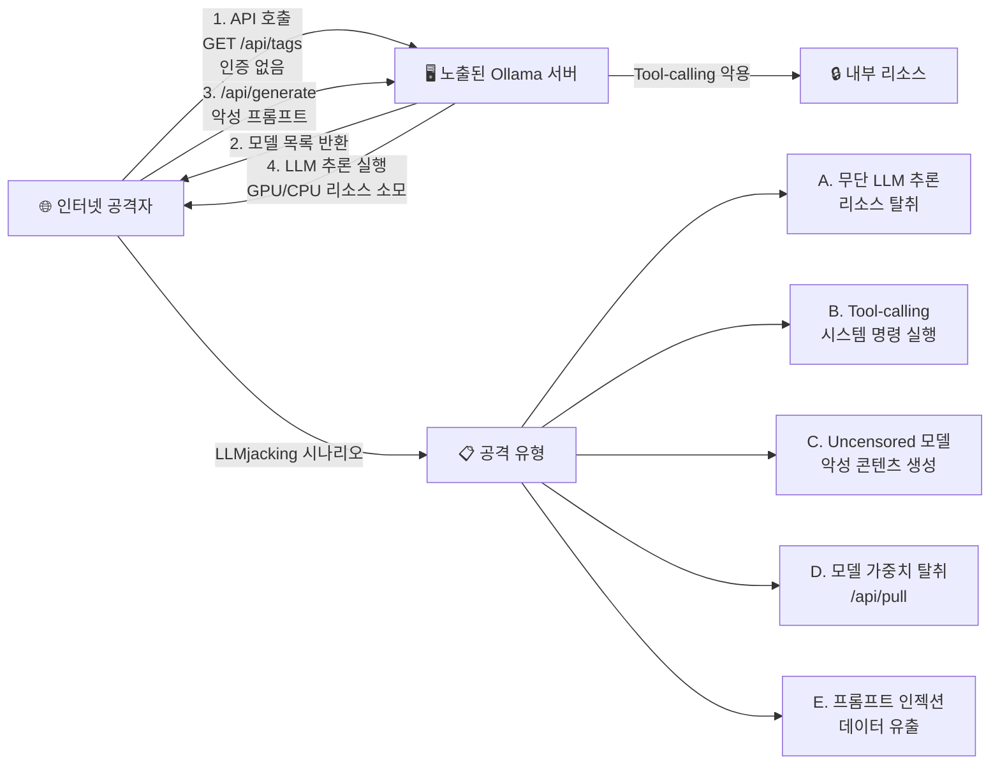
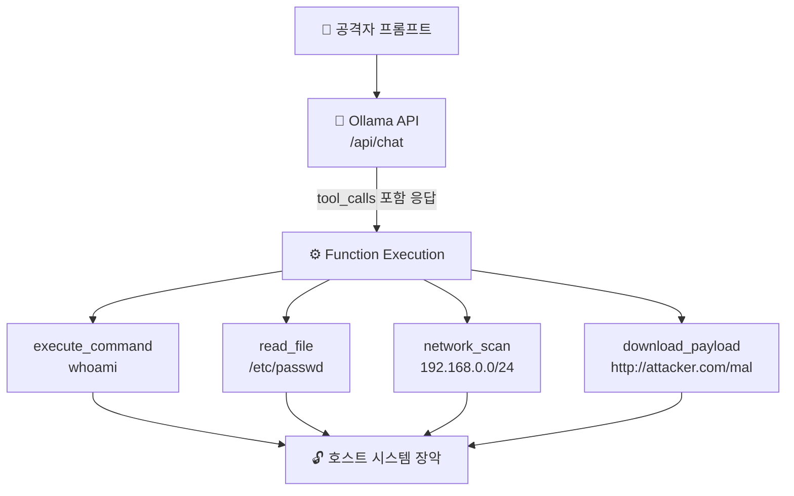
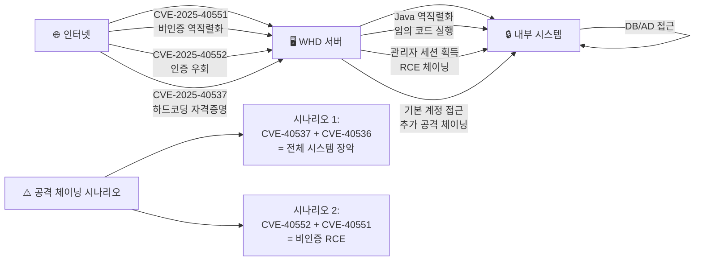
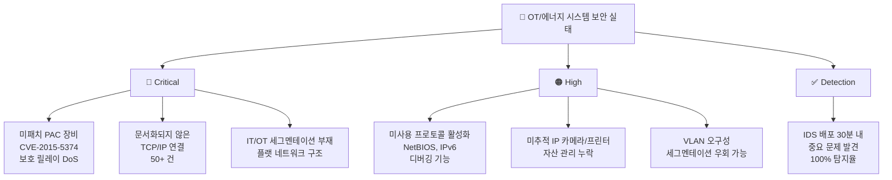
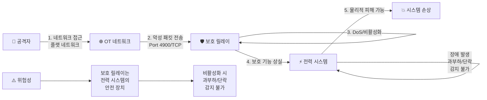

<div class="ai-summary-card">
<div class="ai-summary-header">
  <span class="ai-badge">AI 요약</span>
</div>
<div class="ai-summary-content">
  <div class="summary-row">
    <span class="summary-label">제목</span>
    <span class="summary-value">Tech & Security Weekly Digest (2026년 01월 30일)</span>
  </div>
  <div class="summary-row">
    <span class="summary-label">카테고리</span>
    <span class="summary-value"><span class="category-tag security">Security</span> <span class="category-tag devsecops">DevSecOps</span></span>
  </div>
  <div class="summary-row">
    <span class="summary-label">태그</span>
    <span class="summary-value tags">
      <span class="tag">Ollama</span>
      <span class="tag">LLMjacking</span>
      <span class="tag">SolarWinds</span>
      <span class="tag">CVE-2025-40551</span>
      <span class="tag">IPIDEA</span>
      <span class="tag">Microsoft-AI</span>
      <span class="tag">OT-Security</span>
      <span class="tag">ICS</span>
      <span class="tag">2026</span>
    </span>
  </div>
  <div class="summary-row highlights">
    <span class="summary-label">핵심 내용</span>
    <ul class="summary-list">
      <li><strong>Ollama AI 서버 175K 노출</strong>: 130개국 175,000대 인증 없이 공개 노출, LLMjacking 캠페인 활발 악용 중</li>
      <li><strong>SolarWinds WHD Critical RCE</strong>: CVSS 9.8 4건 포함 6건 CVE - 비인증 역직렬화 RCE, 인증 우회</li>
      <li><strong>Google IPIDEA 프록시 차단</strong>: GTIG가 6.1M IP 레지덴셜 프록시 네트워크 해체, 550+ 위협 그룹 인프라</li>
      <li><strong>Microsoft AI 위협 탐지</strong>: TTP 추출에서 탐지 규칙 생성까지 AI 자동화 워크플로우 공개</li>
      <li><strong>OT/에너지 보안 실태</strong>: 100+ 에너지 시설 조사, IDS 배포 30분 내 중요 문제 발견</li>
    </ul>
  </div>
  <div class="summary-row">
    <span class="summary-label">수집 기간</span>
    <span class="summary-value">2026년 1월 29일 ~ 30일 (48시간)</span>
  </div>
  <div class="summary-row">
    <span class="summary-label">대상 독자</span>
    <span class="summary-value">DevSecOps 엔지니어, 클라우드 아키텍트, 보안 담당자, SRE, CISO</span>
  </div>
</div>
<div class="ai-summary-footer">
  이 포스팅은 AI가 쉽게 이해하고 활용할 수 있도록 구조화된 요약을 포함합니다.
</div>
</div>

## 서론

안녕하세요, **Twodragon**입니다.

2026년 1월 30일 기준, 지난 48시간 동안 발표된 주요 기술 및 보안 뉴스를 심층 분석하여 정리했습니다. 이번 주는 **AI 인프라의 대규모 인터넷 노출 위협**, **엔터프라이즈 IT 관리 도구의 연쇄 Critical 취약점**, 그리고 **국가급 레지덴셜 프록시 네트워크 해체**가 핵심 화두였습니다.

> **긴급 알림**: SolarWinds Web Help Desk를 운영 중이라면 **CVSS 9.8 Critical 취약점 4건**이 공개되었습니다. 즉시 WHD 2026.1로 업데이트하세요. Ollama를 자체 호스팅하고 있다면 **인증 없이 인터넷에 노출된 인스턴스**가 LLMjacking 캠페인의 표적이 되고 있으므로 즉시 접근 제어를 확인하세요.

**이번 주 핵심 테마:**
- **AI 인프라 노출**: 175,000대 Ollama 서버가 인증 없이 공개, LLMjacking 캠페인 활발 악용
- **연쇄 Critical RCE**: SolarWinds WHD에서 CVSS 9.8 4건 포함 총 6건 CVE 패치
- **위협 인프라 해체**: Google GTIG가 6.1M IP IPIDEA 레지덴셜 프록시 네트워크 차단
- **AI 보안 자동화**: Microsoft의 위협 보고서를 탐지 규칙으로 변환하는 AI 워크플로우
- **OT/ICS 보안 실태**: 100+ 에너지 시설 조사에서 드러난 치명적 보안 격차

**수집 소스**: 47개 RSS 피드에서 224개 뉴스 수집
**분석 기준**: DevSecOps 실무 영향도, 기술적 깊이, 즉시 적용 가능성
**참고**: 이전 보안 다이제스트는 [2026-01-29 n8n RCE, D-Link Zero-Day 분석](/posts/2026/01/Tech_Security_Weekly_Digest/)에서 확인하세요.

이번 포스팅에서는 다음 내용을 다룹니다:

- Ollama AI 서버 175,000대 공개 노출과 LLMjacking 위협 분석
- SolarWinds Web Help Desk Critical RCE 6건 심층 분석 및 대응
- Google GTIG의 IPIDEA 레지덴셜 프록시 네트워크 해체 전말
- Microsoft AI 기반 위협 탐지 자동화 워크플로우
- OT/에너지 시스템 사이버보안 실태와 방어 전략

## 빠른 참조

### 2026년 1월 30일 주요 기술/보안 이슈

| 이슈 | 출처 | 영향도 | 권장 조치 |
|------|------|--------|-----------|
| **Ollama 175K 서버 노출** | SentinelOne / Censys | 🔴 긴급 | 인터넷 노출 Ollama 인스턴스 접근 제어 즉시 적용 |
| **SolarWinds WHD RCE (CVE-2025-40551)** | SolarWinds | 🔴 긴급 | WHD 2026.1 즉시 패치, 비인증 역직렬화 RCE |
| **SolarWinds WHD Auth Bypass (CVE-2025-40552)** | SolarWinds | 🔴 긴급 | 동일 패치, 인증 우회 후 RCE 가능 |
| **Google IPIDEA 차단** | Google GTIG | 🟠 높음 | IoC 기반 내부 감염 장비 점검, Play Protect 활성화 |
| **Microsoft AI 위협 탐지** | Microsoft | 🟡 중간 | AI 기반 TTP 추출/탐지 워크플로우 도입 검토 |
| **OT/에너지 보안 격차** | OMICRON | 🟠 높음 | IDS 배포, IT/OT 세그멘테이션, 자산 인벤토리 |

### 긴급 조치 체크리스트

- [ ] SolarWinds Web Help Desk 버전 확인 및 WHD 2026.1 패치 적용
- [ ] 인터넷 노출 Ollama 인스턴스 확인 및 인증/네트워크 제어 적용
- [ ] 내부 네트워크에서 IPIDEA 관련 IoC(프록시 SDK, C2 통신) 탐지 스캔
- [ ] Android 장비 Google Play Protect 활성화 확인
- [ ] OT/ICS 네트워크 IT/OT 세그멘테이션 상태 점검

---

## 1. Ollama AI 서버 175,000대 인터넷 노출

### 위협 개요

SentinelOne SentinelLABS와 Censys의 공동 연구에서 **175,000대의 Ollama 호스트**가 인증 없이 인터넷에 공개 노출되어 있음을 발견했습니다. Ollama는 로컬 LLM 실행을 위한 인기 오픈소스 프레임워크로, 기본 설정에서 **인증 메커니즘이 없어** 외부에서 직접 API 호출이 가능합니다.

| 항목 | 내용 |
|------|------|
| **노출 호스트** | 175,000대 (130개국) |
| **최대 노출 국가** | 중국 (30%+) |
| **Tool-calling 지원** | 약 48% |
| **Uncensored 프롬프트 템플릿** | 201대 |
| **악용 캠페인** | Operation Bizarre Bazaar (위협 행위자 "Hecker") |
| **인증 메커니즘** | 기본 미제공 |
| **프록시 마켓 연계** | 6.1M IP (IPIDEA 등 범죄 마켓) |
| **연구 주체** | SentinelOne SentinelLABS + Censys |

### 기술적 심층 분석

#### Ollama 기본 아키텍처와 노출 경로

<div class="post-image-container">
  
</div>



#### LLMjacking 공격 상세

"LLMjacking"은 노출된 LLM 엔드포인트를 무단으로 사용하는 공격 유형으로, 클라우드 리소스 탈취의 AI 시대 변종입니다. **Operation Bizarre Bazaar**는 위협 행위자 "Hecker"가 주도하는 캠페인으로, 다음과 같이 운영됩니다:

| 공격 단계 | 설명 | 기술 지표 |
|-----------|------|----------|
| **정찰** | Censys/Shodan으로 Ollama 인스턴스 스캔 | Port 11434 스캔, `/api/tags` 응답 |
| **접근** | 인증 없는 API 직접 호출 | HTTP 200 on `/api/generate` |
| **악용** | GPU 리소스 탈취, 악성 콘텐츠 생성 | 높은 GPU 사용률, 비정상 API 호출 패턴 |
| **Tool-calling** | 48%의 인스턴스에서 코드 실행 가능 | Function call을 통한 시스템 명령 |
| **판매** | 범죄 마켓에서 접근 권한 거래 | 다크웹 포럼 판매 게시물 |

#### Tool-calling의 위험성

Ollama의 tool-calling 기능은 LLM이 외부 함수를 호출할 수 있게 합니다. 노출된 인스턴스의 **약 48%**가 이 기능을 지원하며, 이는 단순 프롬프트 악용을 넘어 **원격 코드 실행(RCE)**으로 이어질 수 있습니다:



### 탐지 및 대응

#### Ollama 인스턴스 노출 점검 스크립트

```bash
#!/bin/bash
# Ollama 인스턴스 인터넷 노출 점검 스크립트

echo "=== Ollama 인스턴스 보안 점검 ==="

# 1. 로컬 Ollama 프로세스 확인
echo "[*] Ollama 프로세스 확인..."
OLLAMA_PID=$(pgrep -f "ollama serve" 2>/dev/null)

if [ -n "$OLLAMA_PID" ]; then
    echo "[+] Ollama 실행 중 (PID: $OLLAMA_PID)"

    # 리스닝 주소 확인
    LISTEN_ADDR=$(ss -tlnp | grep "$OLLAMA_PID" | awk '{print $4}')
    echo "[*] 리스닝 주소: $LISTEN_ADDR"

    # 0.0.0.0 바인딩 여부 확인 (위험)
    if echo "$LISTEN_ADDR" | grep -q "0.0.0.0\|\*:"; then
        echo "[!] 경고: 모든 인터페이스에서 접근 가능 (0.0.0.0)"
        echo "[!] 즉시 OLLAMA_HOST=127.0.0.1:11434로 변경 필요"
    else
        echo "[+] 로컬호스트 바인딩 확인됨"
    fi

    # 2. 외부에서 접근 가능한지 확인
    echo "[*] 외부 접근 가능성 확인..."
    EXTERNAL_IP=$(curl -s ifconfig.me 2>/dev/null)

    if [ -n "$EXTERNAL_IP" ]; then
        HTTP_CODE=$(curl -s -o /dev/null -w "%{http_code}" \
            --connect-timeout 5 \
            "http://${EXTERNAL_IP}:11434/api/tags" 2>/dev/null)

        if [ "$HTTP_CODE" = "200" ]; then
            echo "[!] 긴급: 외부에서 Ollama API 접근 가능!"
            echo "[!] IP: $EXTERNAL_IP:11434"
            echo "[!] 즉시 방화벽 규칙 추가 또는 바인딩 주소 변경 필요"
        else
            echo "[+] 외부 접근 차단됨 (방화벽/NAT)"
        fi
    fi

    # 3. 로드된 모델 확인
    echo "[*] 로드된 모델 확인..."
    MODELS=$(curl -s http://localhost:11434/api/tags 2>/dev/null | \
        python3 -c "import sys,json; data=json.load(sys.stdin); \
        [print(f'  - {m[\"name\"]}') for m in data.get('models',[])]" \
        2>/dev/null)

    if [ -n "$MODELS" ]; then
        echo "[*] 설치된 모델:"
        echo "$MODELS"
    fi

    # 4. Uncensored 모델 점검
    echo "[*] Uncensored 모델 점검..."
    UNCENSORED=$(curl -s http://localhost:11434/api/tags 2>/dev/null | \
        python3 -c "import sys,json; data=json.load(sys.stdin); \
        uncensored=[m['name'] for m in data.get('models',[]) \
        if 'uncensored' in m['name'].lower()]; \
        print('\n'.join(uncensored) if uncensored else '')" \
        2>/dev/null)

    if [ -n "$UNCENSORED" ]; then
        echo "[!] 경고: Uncensored 모델 발견:"
        echo "$UNCENSORED"
        echo "[!] 외부 노출 시 악성 콘텐츠 생성에 악용 가능"
    else
        echo "[+] Uncensored 모델 없음"
    fi
else
    echo "[-] Ollama가 실행되고 있지 않습니다."
fi

echo ""
echo "=== 권장 보안 설정 ==="
echo "1. OLLAMA_HOST=127.0.0.1:11434 (로컬 바인딩)"
echo "2. 리버스 프록시(nginx) + 인증 적용"
echo "3. 방화벽에서 11434 포트 외부 차단"
echo "4. Uncensored 모델 제거 검토"
echo "5. API 접근 로깅 활성화"
```

#### Ollama 보안 강화 설정

```yaml
# docker-compose.yml - Ollama 보안 배포 구성
version: "3.8"

services:
  ollama:
    image: ollama/ollama:latest
    container_name: ollama-secure
    environment:
      # 로컬 바인딩만 허용
      OLLAMA_HOST: "127.0.0.1:11434"
      # 모델 디렉토리 지정
      OLLAMA_MODELS: "/models"
      # 동시 요청 제한
      OLLAMA_NUM_PARALLEL: "2"
      # 최대 로드 모델 수
      OLLAMA_MAX_LOADED_MODELS: "1"
    volumes:
      - ollama_models:/models
    # 네트워크 격리
    networks:
      - ollama-internal
    # 리소스 제한
    deploy:
      resources:
        limits:
          cpus: "4.0"
          memory: "16G"
    # 보안 옵션
    security_opt:
      - no-new-privileges:true
    read_only: true
    tmpfs:
      - /tmp

  # 인증 프록시
  nginx-auth:
    image: nginx:alpine
    container_name: ollama-proxy
    ports:
      - "11434:11434"
    volumes:
      - ./nginx-ollama.conf:/etc/nginx/conf.d/default.conf:ro
      - ./htpasswd:/etc/nginx/.htpasswd:ro
    networks:
      - ollama-internal
    depends_on:
      - ollama

networks:
  ollama-internal:
    internal: true

volumes:
  ollama_models:
```

```nginx
# nginx-ollama.conf - Ollama 인증 프록시 설정
server {
    listen 11434;

    # 기본 인증 적용
    auth_basic "Ollama API Authentication";
    auth_basic_user_file /etc/nginx/.htpasswd;

    # Rate limiting
    limit_req_zone $binary_remote_addr zone=ollama:10m rate=10r/m;

    location / {
        limit_req zone=ollama burst=5 nodelay;

        proxy_pass http://ollama:11434;
        proxy_set_header Host $host;
        proxy_set_header X-Real-IP $remote_addr;

        # 타임아웃 설정
        proxy_read_timeout 300s;
        proxy_connect_timeout 10s;

        # 요청 크기 제한
        client_max_body_size 10m;

        # 로깅
        access_log /var/log/nginx/ollama-access.log;
        error_log /var/log/nginx/ollama-error.log;
    }

    # /api/pull 엔드포인트 차단 (모델 다운로드 방지)
    location /api/pull {
        deny all;
        return 403;
    }

    # /api/push 엔드포인트 차단
    location /api/push {
        deny all;
        return 403;
    }

    # /api/delete 엔드포인트 차단
    location /api/delete {
        deny all;
        return 403;
    }
}
```

#### Splunk 탐지 쿼리

```spl
# Ollama API 비정상 접근 탐지
index=webserver sourcetype=nginx:access
  uri_path="/api/*"
  dest_port=11434
| eval endpoint=case(
    match(uri_path, "/api/generate"), "generate",
    match(uri_path, "/api/chat"), "chat",
    match(uri_path, "/api/tags"), "tags",
    match(uri_path, "/api/pull"), "pull",
    match(uri_path, "/api/push"), "push",
    1=1, "other"
)
| eval suspicious=case(
    endpoint="pull" AND status=200, "critical",
    endpoint="push", "critical",
    match(src_ip, "^(10\.|172\.(1[6-9]|2|3[0-1])\.|192\.168\.)") AND endpoint="generate", "low",
    NOT match(src_ip, "^(10\.|172\.(1[6-9]|2|3[0-1])\.|192\.168\.)"), "high",
    1=1, "medium"
)
| stats count by src_ip, endpoint, suspicious, status
| where suspicious IN ("high", "critical") OR count > 50
| sort -suspicious, -count
```

#### Sigma Rule

```yaml
# sigma/rules/application/ollama_unauthorized_access.yml
title: Ollama API Unauthorized External Access
id: b8d4f2a1-7c3e-4a5b-9d2f-1e6c8b3a5d7f
status: experimental
description: Detects unauthorized external access to Ollama AI inference API
author: Twodragon
date: 2026/01/30
references:
  - https://thehackernews.com/2026/01/researchers-find-175000-publicly.html
  - https://www.sentinelone.com/labs/ollama-exposure-research/
tags:
  - attack.initial_access
  - attack.t1190
  - attack.resource_hijacking
  - attack.t1496
logsource:
  product: webserver
  service: access
detection:
  selection_endpoint:
    uri_path|contains:
      - "/api/generate"
      - "/api/chat"
      - "/api/tags"
      - "/api/pull"
    dest_port: 11434
  filter_internal:
    src_ip|cidr:
      - "10.0.0.0/8"
      - "172.16.0.0/12"
      - "192.168.0.0/16"
      - "127.0.0.0/8"
  condition: selection_endpoint and not filter_internal
level: high
falsepositives:
  - Legitimate external access via VPN or authorized proxy
```

### 참고 링크

- [SentinelOne SentinelLABS: Ollama Exposure Research](https://www.sentinelone.com/labs/ollama-exposure-research/)
- [The Hacker News: 175,000 Publicly Exposed Ollama Hosts](https://thehackernews.com/2026/01/researchers-find-175000-publicly.html)
- [Censys: Ollama Internet Scan](https://censys.io/)
- [Ollama GitHub Repository](https://github.com/ollama/ollama#security)

---

## 2. SolarWinds Web Help Desk Critical RCE (6 CVEs)

### 취약점 개요

SolarWinds가 Web Help Desk(WHD)에서 발견된 **6건의 보안 취약점**을 패치했습니다. 이 중 **4건은 CVSS 9.8 Critical**로, 비인증 원격 코드 실행(RCE)과 인증 우회를 포함합니다. WHD는 IT 서비스 관리(ITSM) 도구로 전 세계 수천 조직에서 사용 중이며, 과거에도 CISA KEV에 등재된 이력이 있습니다.

| CVE | CVSS | 유형 | 인증 필요 | 발견자 |
|-----|------|------|----------|--------|
| **CVE-2025-40551** | 9.8 (Critical) | 역직렬화 RCE | 불필요 | Jimi Sebree (Horizon3.ai) |
| **CVE-2025-40552** | 9.8 (Critical) | 인증 우회 + RCE | 불필요 | Piotr Bazydlo (watchTowr) |
| **CVE-2025-40553** | 9.8 (Critical) | 역직렬화 RCE | 불필요 | Jimi Sebree (Horizon3.ai) |
| **CVE-2025-40554** | 9.8 (Critical) | 인증 우회 + RCE | 불필요 | Piotr Bazydlo (watchTowr) |
| **CVE-2025-40536** | 8.1 (High) | 보안 제어 우회 | 필요 | - |
| **CVE-2025-40537** | 7.5 (High) | 하드코딩된 자격증명 | 불필요 | - |

### 기술적 심층 분석

#### 취약점 아키텍처 매핑

<div class="post-image-container">
  
</div>



#### CVE-2025-40551 / CVE-2025-40553: Java 역직렬화 RCE

SolarWinds WHD는 Java 기반 웹 애플리케이션으로, 역직렬화 처리 과정에서 입력 데이터를 검증하지 않습니다. 공격자는 악의적으로 조작된 직렬화 객체를 전송하여 서버에서 임의 코드를 실행할 수 있습니다.

**역직렬화 공격 원리:**


<details>
<summary>텍스트 버전 (접근성용)</summary>

```
SolarWinds WHD Deserialization Attack:
1. Attacker crafts Serialized Java Object (Gadget Chain + Runtime.exec payload)
2. HTTP POST to /helpdesk/WebObjects/Helpdesk.woa
3. Server deserializes → Gadget Chain → Runtime.exec() → SYSTEM execution
```

</details>

#### CVE-2025-40552 / CVE-2025-40554: 인증 우회

인증 로직의 결함으로 인해 공격자가 유효한 인증 없이 관리자 수준의 세션을 획득할 수 있습니다. 이를 통해 관리 기능에 접근하고, 추가 취약점을 체이닝하여 RCE까지 달성합니다.

#### CVE-2025-40537: 하드코딩된 자격증명

WHD 내부에 **하드코딩된 자격증명**이 존재하여, 해당 계정으로 인증 없이 시스템에 접근할 수 있습니다. SolarWinds WHD는 이전에도 하드코딩 자격증명 취약점(CVE-2024-28987, CISA KEV 등재)이 발견된 바 있어 **반복적 패턴**입니다.

### 탐지 및 대응

#### WHD 버전 확인 및 패치 스크립트

```bash
#!/bin/bash
# SolarWinds Web Help Desk 취약점 점검 스크립트

echo "=== SolarWinds WHD 취약점 점검 ==="

# WHD 설치 경로 확인 (기본 경로)
WHD_PATHS=(
    "/usr/local/webhelpdesk"
    "/opt/webhelpdesk"
    "C:/Program Files/WebHelpDesk"
)

WHD_FOUND=false
for path in "${WHD_PATHS[@]}"; do
    if [ -d "$path" ] 2>/dev/null; then
        echo "[+] WHD 설치 경로: $path"
        WHD_FOUND=true
        WHD_PATH="$path"
        break
    fi
done

if [ "$WHD_FOUND" = false ]; then
    echo "[-] WHD 설치 경로를 찾을 수 없습니다."
    echo "[*] WHD가 Docker/원격 환경에서 실행 중일 수 있습니다."
fi

# WHD 버전 확인 (웹 인터페이스)
echo "[*] WHD 웹 인터페이스 버전 확인..."
WHD_URL="${1:-http://localhost:8081}"

VERSION_RESP=$(curl -s --connect-timeout 5 \
    "${WHD_URL}/helpdesk/WebObjects/Helpdesk.woa" 2>/dev/null)

if [ -n "$VERSION_RESP" ]; then
    echo "[+] WHD 접근 가능: $WHD_URL"

    # 버전 추출 시도
    VERSION=$(echo "$VERSION_RESP" | grep -oP 'version["\s:]+[\d.]+' | head -1)
    echo "[*] 감지된 버전 정보: ${VERSION:-확인 불가}"

    echo ""
    echo "[!] 취약 대상 CVE 목록:"
    echo "  - CVE-2025-40551 (CVSS 9.8): 비인증 역직렬화 RCE"
    echo "  - CVE-2025-40552 (CVSS 9.8): 인증 우회 + RCE"
    echo "  - CVE-2025-40553 (CVSS 9.8): 비인증 역직렬화 RCE"
    echo "  - CVE-2025-40554 (CVSS 9.8): 인증 우회 + RCE"
    echo "  - CVE-2025-40536 (CVSS 8.1): 보안 제어 우회"
    echo "  - CVE-2025-40537 (CVSS 7.5): 하드코딩된 자격증명"
    echo ""
    echo "[*] 패치 버전: WHD 2026.1"
    echo "[*] 즉시 업데이트: https://www.solarwinds.com/web-help-desk"
else
    echo "[-] WHD 웹 인터페이스에 접근할 수 없습니다."
fi

# 네트워크 노출 확인
echo ""
echo "[*] WHD 네트워크 노출 확인..."
EXPOSED_PORTS=$(ss -tlnp 2>/dev/null | grep -E ":(8081|8443)" | awk '{print $4}')

if [ -n "$EXPOSED_PORTS" ]; then
    echo "[*] WHD 리스닝 주소:"
    echo "$EXPOSED_PORTS"

    if echo "$EXPOSED_PORTS" | grep -q "0.0.0.0\|\*:"; then
        echo "[!] 경고: WHD가 모든 인터페이스에 바인딩되어 있습니다."
        echo "[!] 패치 적용 전까지 내부 네트워크만 접근 허용 권장"
    fi
fi
```

#### 네트워크 탐지 규칙 (Suricata)

```yaml
# SolarWinds WHD 역직렬화 공격 탐지
# /etc/suricata/rules/solarwinds-whd-cve-2025.rules

# CVE-2025-40551/40553: Java 역직렬화 시도
alert http $EXTERNAL_NET any -> $HOME_NET any (
  msg:"ET EXPLOIT SolarWinds WHD Java Deserialization (CVE-2025-40551)";
  flow:to_server,established;
  http.uri;
  content:"/helpdesk/WebObjects/";
  http.header;
  content:"application/x-java-serialized-object";
  content:|ac ed 00 05|;
  classtype:web-application-attack;
  sid:2025405510;
  rev:1;
  metadata:cve CVE-2025-40551, severity critical;
)

# CVE-2025-40552/40554: 인증 우회 시도
alert http $EXTERNAL_NET any -> $HOME_NET any (
  msg:"ET EXPLOIT SolarWinds WHD Authentication Bypass (CVE-2025-40552)";
  flow:to_server,established;
  http.uri;
  content:"/helpdesk/WebObjects/Helpdesk.woa";
  http.method;
  content:"POST";
  http.header;
  content:!"Authorization";
  http.header;
  content:!"Cookie";
  classtype:web-application-attack;
  sid:2025405520;
  rev:1;
  metadata:cve CVE-2025-40552, severity critical;
)

# CVE-2025-40537: 하드코딩 자격증명 접근 시도
alert http any any -> $HOME_NET any (
  msg:"ET EXPLOIT SolarWinds WHD Hardcoded Credential Access (CVE-2025-40537)";
  flow:to_server,established;
  http.uri;
  content:"/helpdesk/";
  http.header;
  content:"Authorization: Basic";
  classtype:web-application-attack;
  sid:2025405370;
  rev:1;
  metadata:cve CVE-2025-40537, severity high;
)
```

#### Splunk 탐지 쿼리

```spl
# SolarWinds WHD 공격 시도 탐지
index=webserver sourcetype=access_combined
  uri_path="*helpdesk/WebObjects*"
| eval attack_type=case(
    match(content_type, "java-serialized-object"), "deserialization_rce",
    status=200 AND NOT isnotnull(cookie) AND method="POST", "auth_bypass",
    match(authorization, "Basic"), "credential_bruteforce",
    1=1, "reconnaissance"
)
| eval severity=case(
    attack_type="deserialization_rce", "critical",
    attack_type="auth_bypass", "critical",
    attack_type="credential_bruteforce", "high",
    1=1, "medium"
)
| stats count by src_ip, attack_type, severity, status, uri_path
| where severity IN ("critical", "high")
| sort -severity, -count
```

#### 임시 완화 조치

```yaml
# SolarWinds WHD 긴급 보안 강화 조치
# 즉시 패치 불가 시 적용

immediate_mitigations:
  # 1. 네트워크 접근 제한
  network_restrictions:
    - action: "방화벽에서 WHD 포트(8081/8443) 외부 접근 차단"
      priority: "P0"
      command: |
        # iptables 예시
        iptables -A INPUT -p tcp --dport 8081 -s 10.0.0.0/8 -j ACCEPT
        iptables -A INPUT -p tcp --dport 8081 -j DROP
        iptables -A INPUT -p tcp --dport 8443 -s 10.0.0.0/8 -j ACCEPT
        iptables -A INPUT -p tcp --dport 8443 -j DROP

  # 2. WAF 규칙 적용
  waf_rules:
    - action: "Java 역직렬화 패턴 차단"
      pattern: "Content-Type: application/x-java-serialized-object"
      action_type: "BLOCK"
    - action: "비인증 POST 요청 모니터링"
      pattern: "POST /helpdesk/WebObjects/* without valid session"
      action_type: "LOG_AND_ALERT"

  # 3. 로깅 강화
  enhanced_logging:
    - "WHD 접근 로그 SIEM 전송 활성화"
    - "비인증 접근 시도 알림 설정"
    - "관리자 세션 생성 이벤트 모니터링"

  # 4. 백업 및 스냅샷
  backup:
    - "WHD 서버 전체 백업 수행"
    - "데이터베이스 스냅샷 생성"
    - "패치 적용 후 롤백 계획 수립"
```

### 참고 링크

- [The Hacker News: SolarWinds WHD Critical Vulnerabilities](https://thehackernews.com/2026/01/solarwinds-fixes-four-critical-web-help.html)
- [SolarWinds Security Advisory](https://www.solarwinds.com/trust-center/security-advisories)
- [Horizon3.ai Research](https://www.horizon3.ai/research/)
- [watchTowr Labs](https://labs.watchtowr.com/)

---

## 3. Google GTIG, IPIDEA 레지덴셜 프록시 네트워크 해체

### 위협 개요

Google Threat Intelligence Group(GTIG)이 세계 최대 규모의 레지덴셜 프록시 네트워크 중 하나인 **IPIDEA**를 해체했습니다. IPIDEA는 악성코드에 감염된 장비를 프록시 노드로 변환하여 **매일 6.1M개의 IP 주소**를 운영하며, **550개 이상의 위협 그룹**에 인프라를 제공해왔습니다.

| 항목 | 내용 |
|------|------|
| **일일 활성 IP** | 6,100,000+ |
| **일일 신규 IP** | 69,000+ |
| **이용 위협 그룹** | 550+ |
| **Tier 2 C2 서버** | 7,400대 |
| **Windows 악성 바이너리** | 3,075종 |
| **감염 Android 앱** | 600+ |
| **주도** | Google Threat Intelligence Group (GTIG) |

### 기술적 심층 분석

#### IPIDEA 인프라 아키텍처

<div class="post-image-container">
  
</div>


<details>
<summary>텍스트 버전 (접근성용)</summary>

```
IPIDEA Residential Proxy Network:
Infection Vectors: Android TV Boxes, Fake Earning Apps, SDK-Embedded Apps, Windows Trojans, Play Store Apps (600+)
→ IPIDEA Proxy Network: 6.1M IPs Daily, 69K New IPs/Day, 7,400 C2 Servers
→ Abuse: Ad Fraud, Credential Stuffing, DDoS, Spam, Account Takeover (550+ Threat Groups)
```

</details>

#### 감염 벡터 상세 분석

| 감염 경로 | 플랫폼 | 규모 | SDK/악성코드 |
|-----------|--------|------|-------------|
| **사전 설치 악성코드** | Android TV 박스 | 대규모 | 제조 단계 임플란트 |
| **가짜 수익화 앱** | Android | 중규모 | Earn, Hex 브랜드 |
| **SDK 임베딩** | Android/iOS | 대규모 | Castar SDK, Packet SDK |
| **Windows 트로이목마** | Windows | 3,075종 | 가짜 OneDrive/Windows Update |
| **Play Store 앱** | Android | 600+ 앱 | 정상 앱에 프록시 코드 삽입 |

#### 감염 SDK 동작 원리


<details>
<summary>텍스트 버전 (접근성용)</summary>

```
SDK-Based Proxy Infection Process:
1. Legitimate App Developer → 2. SDK Integration (Castar/Packet) → 3. App Build
→ 4. Google Play Distribution → 5. User Device Installation
→ 6. SDK Malicious Behavior (C2, SOCKS5 Proxy, Traffic Relay)
→ 7. Registered in IPIDEA Proxy Pool (6.1M IPs)
```

</details>

### 탐지 및 대응

#### 내부 네트워크 감염 탐지 스크립트

```python
#!/usr/bin/env python3
"""
IPIDEA 프록시 네트워크 감염 탐지 스크립트
네트워크 트래픽에서 IPIDEA 관련 IoC를 검사합니다.
"""

import json
import os
from datetime import datetime, timezone

# Known IPIDEA-related indicators
IPIDEA_INDICATORS = {
    "domains": [
        "api.ipidea.net",
        "proxy.ipidea.net",
        "node.ipidea.net",
        "update.ipidea.net",
        "cdn.ipidea.net",
        "ws.ipidea.net",
    ],
    "sdk_package_names": [
        "com.castar.sdk",
        "com.packet.sdk",
        "com.earn.proxy",
        "com.hex.network",
        "io.ipidea.sdk",
    ],
    "windows_process_names": [
        "OneDriveUpdate.exe",
        "WindowsUpdateHelper.exe",
        "SystemOptimizer.exe",
        "NetworkBooster.exe",
    ],
    "network_patterns": [
        # SOCKS5 proxy handshake pattern
        "\\x05\\x01\\x00",
        # Common C2 beacon intervals (300s, 600s)
    ],
    "user_agents": [
        "IPIDEA-SDK/",
        "Castar-Proxy/",
        "PacketSDK/",
    ],
}


def check_dns_logs(log_file):
    """DNS 로그에서 IPIDEA 도메인 조회 탐지"""
    findings = []

    if not os.path.exists(log_file):
        print(f"[-] DNS log file not found: {log_file}")
        return findings

    print(f"[*] DNS log scanning: {log_file}")

    with open(log_file, "r") as f:
        for line_num, line in enumerate(f, 1):
            for domain in IPIDEA_INDICATORS["domains"]:
                if domain in line.lower():
                    findings.append({
                        "type": "dns_query",
                        "indicator": domain,
                        "line": line_num,
                        "severity": "critical",
                        "raw": line.strip(),
                    })

    return findings


def check_installed_apps(apk_list_file):
    """Android 장비 설치 앱에서 IPIDEA SDK 탐지"""
    findings = []

    if not os.path.exists(apk_list_file):
        print(f"[-] APK list file not found: {apk_list_file}")
        return findings

    print(f"[*] Installed app scanning: {apk_list_file}")

    with open(apk_list_file, "r") as f:
        for line in f:
            package = line.strip()
            for sdk_name in IPIDEA_INDICATORS["sdk_package_names"]:
                if sdk_name in package:
                    findings.append({
                        "type": "malicious_sdk",
                        "indicator": sdk_name,
                        "package": package,
                        "severity": "critical",
                    })

    return findings


def check_windows_processes(process_list_file):
    """Windows 프로세스 목록에서 IPIDEA 트로이목마 탐지"""
    findings = []

    if not os.path.exists(process_list_file):
        print(f"[-] Process list file not found: {process_list_file}")
        return findings

    print(f"[*] Windows process scanning: {process_list_file}")

    with open(process_list_file, "r") as f:
        for line in f:
            for proc_name in IPIDEA_INDICATORS["windows_process_names"]:
                if proc_name.lower() in line.lower():
                    findings.append({
                        "type": "malicious_process",
                        "indicator": proc_name,
                        "severity": "critical",
                        "raw": line.strip(),
                    })

    return findings


def generate_report(all_findings):
    """탐지 결과 보고서 생성"""
    report = {
        "scan_time": datetime.now(timezone.utc).isoformat(),
        "total_findings": len(all_findings),
        "critical": [f for f in all_findings if f["severity"] == "critical"],
        "high": [f for f in all_findings if f["severity"] == "high"],
        "recommendations": [],
    }

    if report["critical"]:
        report["recommendations"].extend([
            "IPIDEA 관련 도메인 즉시 차단 (방화벽/DNS)",
            "감염 장비 네트워크 격리",
            "Google Play Protect 강제 활성화",
            "Android TV 박스 펌웨어 검증",
            "의심 Windows 프로세스 분석 및 제거",
        ])

    return report


if __name__ == "__main__":
    print("=== IPIDEA 프록시 네트워크 감염 탐지 ===")
    print(f"[*] 스캔 시작: {datetime.now(timezone.utc).isoformat()}")
    print("")

    all_findings = []

    # DNS log check (adjust path to your environment)
    dns_findings = check_dns_logs("/var/log/dns/queries.log")
    all_findings.extend(dns_findings)

    # Android app check
    app_findings = check_installed_apps("/tmp/installed_apps.txt")
    all_findings.extend(app_findings)

    # Windows process check
    proc_findings = check_windows_processes("/tmp/process_list.txt")
    all_findings.extend(proc_findings)

    # Generate report
    report = generate_report(all_findings)

    print("")
    print("=== 탐지 결과 ===")
    print(json.dumps(report, indent=2, ensure_ascii=False))

    if report["critical"]:
        print("")
        print("[!] 긴급: IPIDEA 감염 지표 발견!")
        print("[!] 즉시 네트워크 격리 및 포렌식 분석 필요")
```

#### DNS 기반 차단 정책

```yaml
# IPIDEA 프록시 네트워크 DNS 차단 정책
# Pi-hole / AdGuard Home / Bind RPZ 적용

dns_blocklist:
  # IPIDEA C2 도메인
  domains:
    - "api.ipidea.net"
    - "proxy.ipidea.net"
    - "node.ipidea.net"
    - "update.ipidea.net"
    - "cdn.ipidea.net"
    - "ws.ipidea.net"
    - "*.ipidea.net"
    - "*.ipidea.io"

  # 알려진 SDK C2 도메인
  sdk_domains:
    - "*.castar-sdk.com"
    - "*.packet-proxy.com"

  # 적용 방법
  pihole:
    command: |
      # Pi-hole에 블랙리스트 추가
      pihole -b api.ipidea.net proxy.ipidea.net node.ipidea.net
      pihole -b update.ipidea.net cdn.ipidea.net ws.ipidea.net

  bind_rpz:
    zone_file: |
      ; IPIDEA RPZ Zone
      $TTL 300
      ipidea.net CNAME .
      *.ipidea.net CNAME .
      ipidea.io CNAME .
      *.ipidea.io CNAME .
```

#### Splunk 탐지 쿼리

```spl
# IPIDEA 레지덴셜 프록시 감염 탐지
# 1. DNS 쿼리 기반 탐지
index=dns sourcetype=dns
| where match(query, "(?i)(ipidea\.(net|io)|castar-sdk|packet-proxy)")
| stats count by src_ip, query, record_type
| sort -count

# 2. SOCKS5 프록시 트래픽 탐지
index=firewall sourcetype=firewall
  dest_port IN (1080, 1081, 10800, 10801)
  action="allowed"
| eval suspicious=case(
    bytes_out > bytes_in * 10, "high_relay_ratio",
    duration > 3600, "long_session",
    1=1, "normal"
)
| where suspicious != "normal"
| stats count dc(dest_ip) as unique_dests by src_ip, suspicious
| where unique_dests > 20 OR count > 100
| sort -unique_dests

# 3. Android TV 박스 비정상 외부 연결 탐지
index=firewall sourcetype=firewall
  src_ip="10.0.50.*"
  NOT dest_port IN (80, 443, 53, 123)
| stats count dc(dest_ip) as unique_dests by src_ip, dest_port
| where unique_dests > 50
| sort -unique_dests
```

### Google Play Protect 조치

Google은 IPIDEA 네트워크 해체와 함께 다음 보호 조치를 적용했습니다:

| 조치 | 내용 |
|------|------|
| **Play Protect 경고** | IPIDEA SDK 포함 앱 설치 시 경고 표시 |
| **자동 제거** | 감염 앱 자동 비활성화/제거 |
| **SDK 탐지** | Castar, Packet, Earn, Hex SDK 시그니처 업데이트 |
| **TV 박스 검증** | Android TV Certified 장비 검증 강화 |

### 참고 링크

- [The Hacker News: Google Disrupts IPIDEA](https://thehackernews.com/2026/01/google-disrupts-ipidea-one-of-worlds.html)
- [Google Threat Intelligence Group Blog](https://blog.google/threat-analysis-group/)
- [Google Play Protect Documentation](https://developers.google.com/android/play-protect)

---

## 4. Microsoft AI 기반 위협 탐지 자동화 워크플로우

### 개요

Microsoft Security 팀이 **위협 보고서를 탐지 규칙으로 자동 변환**하는 AI 워크플로우를 공개했습니다. 기존에 수일이 걸리던 TTP(전술, 기법, 절차) 분석 및 탐지 규칙 작성을 **수 분 내에 자동화**하는 시스템입니다. 동시에 **Microsoft Data Security Index 2026** 보고서를 통해 안전한 AI 도입 전략도 발표했습니다.

| 항목 | 내용 |
|------|------|
| **워크플로우** | AI-Assisted Threat Report to Detection Pipeline |
| **핵심 기능** | TTP 추출, 탐지 커버리지 매핑, 갭 분석 |
| **시간 절약** | 수일 -> 수 분 |
| **작성자** | Herain Oberoi (VP, Data & AI Security) |
| **추가 발표** | Microsoft Data Security Index 2026 |

### AI 위협 탐지 워크플로우 아키텍처


<details>
<summary>텍스트 버전 (접근성용)</summary>

```
Microsoft AI Threat Detection Pipeline:
INPUT: Threat Reports, Existing Detection Rules, MITRE ATT&CK Matrix
→ AI PROCESSING: 1. TTP Extraction Engine, 2. Coverage Mapping, 3. Gap Analysis
→ OUTPUT: Detection Rules (KQL/Sigma/YARA), Coverage Gap Report (Prioritized)
```

</details>

### 3대 핵심 기능

#### 1. TTP 추출 (Tactic, Technique, Procedure Extraction)

AI 엔진이 비정형 위협 보고서에서 MITRE ATT&CK 프레임워크에 매핑되는 TTP를 자동 추출합니다.


**입력 예시 (위협 보고서):**
> "The threat actor used spear-phishing emails with malicious Excel attachments containing macros. After initial access, they deployed Cobalt Strike beacons via PowerShell and established persistence through scheduled tasks."

<details>
<summary>텍스트 버전 (접근성용)</summary>

| Tactic | Technique | Sub-technique |
|--------|-----------|---------------|
| Initial Access | T1566.001 | Spear-phishing Attachment |
| Execution | T1059.001 | PowerShell |
| Persistence | T1053.005 | Scheduled Task |
| Command & Control | T1071.001 | Web Protocols (Cobalt Strike) |

</details>

#### 2. 탐지 커버리지 매핑

추출된 TTP를 기존 탐지 규칙과 자동 매핑하여 현재 커버리지 수준을 평가합니다.

#### 3. 갭 식별 및 우선순위화

탐지가 없는 TTP를 식별하고, 위협 수준과 조직 환경에 맞게 우선순위를 부여합니다.

### 실무 적용: 자체 AI 위협 분석 파이프라인 구현

```python
#!/usr/bin/env python3
"""
AI 기반 위협 보고서 TTP 추출 파이프라인 (간소화 버전)
Microsoft 워크플로우 컨셉을 자체 환경에 적용하는 예시입니다.
"""

import json
import re
from datetime import datetime, timezone

# MITRE ATT&CK TTP 매핑 데이터베이스 (간소화)
MITRE_PATTERNS = {
    "T1566.001": {
        "name": "Phishing: Spear-phishing Attachment",
        "tactic": "Initial Access",
        "keywords": [
            "spear-phishing", "phishing attachment", "malicious email",
            "weaponized document", "macro-enabled"
        ],
    },
    "T1059.001": {
        "name": "PowerShell",
        "tactic": "Execution",
        "keywords": [
            "powershell", "pwsh", "invoke-expression",
            "iex", "downloadstring", "encodedcommand"
        ],
    },
    "T1053.005": {
        "name": "Scheduled Task",
        "tactic": "Persistence",
        "keywords": [
            "scheduled task", "schtasks", "task scheduler",
            "cron job", "at command"
        ],
    },
    "T1071.001": {
        "name": "Web Protocols",
        "tactic": "Command and Control",
        "keywords": [
            "http beacon", "https c2", "cobalt strike",
            "web protocol", "http tunnel"
        ],
    },
    "T1190": {
        "name": "Exploit Public-Facing Application",
        "tactic": "Initial Access",
        "keywords": [
            "exploit", "rce", "remote code execution",
            "deserialization", "command injection", "sql injection"
        ],
    },
    "T1496": {
        "name": "Resource Hijacking",
        "tactic": "Impact",
        "keywords": [
            "cryptomining", "resource hijacking", "llmjacking",
            "compute theft", "gpu hijacking"
        ],
    },
}


def extract_ttps(report_text):
    """위협 보고서에서 TTP 자동 추출"""
    found_ttps = []
    report_lower = report_text.lower()

    for technique_id, data in MITRE_PATTERNS.items():
        for keyword in data["keywords"]:
            if keyword in report_lower:
                found_ttps.append({
                    "technique_id": technique_id,
                    "name": data["name"],
                    "tactic": data["tactic"],
                    "matched_keyword": keyword,
                    "confidence": "high" if len(keyword) > 10 else "medium",
                })
                break  # Avoid duplicate matches

    return found_ttps


def map_detection_coverage(ttps, existing_rules):
    """TTP별 탐지 규칙 커버리지 매핑"""
    coverage = []

    for ttp in ttps:
        covered = ttp["technique_id"] in existing_rules
        coverage.append({
            "technique_id": ttp["technique_id"],
            "name": ttp["name"],
            "tactic": ttp["tactic"],
            "detection_exists": covered,
            "rule_id": existing_rules.get(ttp["technique_id"], None),
        })

    return coverage


def identify_gaps(coverage):
    """탐지 갭 식별 및 우선순위화"""
    gaps = [c for c in coverage if not c["detection_exists"]]

    # Priority scoring
    tactic_priority = {
        "Initial Access": 9,
        "Execution": 8,
        "Persistence": 7,
        "Command and Control": 8,
        "Impact": 9,
        "Defense Evasion": 7,
    }

    for gap in gaps:
        gap["priority_score"] = tactic_priority.get(gap["tactic"], 5)

    gaps.sort(key=lambda x: x["priority_score"], reverse=True)
    return gaps


def generate_sigma_rule(ttp):
    """TTP에 대한 Sigma 탐지 규칙 자동 생성"""
    template = {
        "title": f"Detect {ttp['name']} ({ttp['technique_id']})",
        "id": f"auto-{ttp['technique_id'].lower()}-{datetime.now().strftime('%Y%m%d')}",
        "status": "experimental",
        "description": f"Auto-generated detection for MITRE ATT&CK {ttp['technique_id']}",
        "author": "AI Pipeline (review required)",
        "date": datetime.now(timezone.utc).strftime("%Y/%m/%d"),
        "tags": [
            f"attack.{ttp['tactic'].lower().replace(' ', '_')}",
            f"attack.{ttp['technique_id'].lower()}",
        ],
        "level": "medium",
        "note": "AI-generated rule - manual review required before deployment",
    }

    return template


if __name__ == "__main__":
    # Example threat report
    sample_report = """
    SentinelOne researchers discovered 175,000 publicly exposed Ollama
    hosts. Threat actor 'Hecker' conducts LLMjacking campaigns exploiting
    these endpoints for resource hijacking and remote code execution
    through tool-calling capabilities. The exposed instances lack
    authentication, enabling direct API access for compute theft.
    """

    print("=== AI TTP Extraction Pipeline ===")
    print(f"[*] Analysis time: {datetime.now(timezone.utc).isoformat()}")

    # Step 1: Extract TTPs
    ttps = extract_ttps(sample_report)
    print(f"\n[+] Extracted {len(ttps)} TTPs:")
    for ttp in ttps:
        print(f"  - {ttp['technique_id']}: {ttp['name']} "
              f"({ttp['tactic']}) [confidence: {ttp['confidence']}]")

    # Step 2: Map coverage
    existing_rules = {"T1059.001": "RULE-PS-001", "T1566.001": "RULE-PHISH-001"}
    coverage = map_detection_coverage(ttps, existing_rules)

    # Step 3: Identify gaps
    gaps = identify_gaps(coverage)
    print(f"\n[!] Detection gaps found: {len(gaps)}")
    for gap in gaps:
        print(f"  - {gap['technique_id']}: {gap['name']} "
              f"(Priority: {gap['priority_score']}/10)")

    # Step 4: Generate rules for gaps
    print(f"\n[*] Auto-generated Sigma rules:")
    for gap in gaps:
        rule = generate_sigma_rule(gap)
        print(json.dumps(rule, indent=2))
```

### Microsoft Data Security Index 2026

동시에 발표된 **Data Security Index 2026** 보고서는 안전한 AI 도입을 위한 핵심 지표를 제시합니다:

| 영역 | 핵심 발견 |
|------|----------|
| **AI 데이터 보안** | 민감 데이터의 AI 학습 유입 방지가 최우선 과제 |
| **프롬프트 보안** | 프롬프트 인젝션 방어 체계 구축 필요 |
| **출력 필터링** | AI 출력물의 민감 정보 유출 탐지 |
| **거버넌스** | AI 모델 접근 제어 및 감사 로깅 |

### 참고 링크

- [Microsoft Security Blog: AI Threat Detection Workflow](https://www.microsoft.com/en-us/security/blog/2026/01/29/turning-threat-reports-detection-insights-ai/)
- [Microsoft Data Security Index 2026](https://www.microsoft.com/en-us/security/blog/2026/01/29/new-microsoft-data-security-index-report-explores-secure-ai-adoption-to-protect-sensitive-data/)
- [MITRE ATT&CK Framework](https://attack.mitre.org/)

---

## 5. OT/에너지 시스템 사이버보안 실태 (OMICRON 조사)

### 조사 개요

OMICRON이 **100곳 이상의 에너지 시설**(변전소, 발전소, 제어 센터)을 대상으로 2018년부터 진행한 사이버보안 조사 결과를 발표했습니다. IDS(침입 탐지 시스템) 배포 **30분 이내에 치명적 보안 문제**가 발견되는 등 OT/ICS 환경의 심각한 보안 격차가 드러났습니다.

| 항목 | 내용 |
|------|------|
| **조사 대상** | 100+ 에너지 시설 |
| **시설 유형** | 변전소, 발전소, 제어 센터 |
| **데이터 수집 기간** | 2018년~ |
| **핵심 발견** | IDS 배포 30분 내 중요 문제 발견 |
| **가장 빈번한 문제** | VLAN 오구성 |
| **미패치 취약점 예시** | CVE-2015-5374 (보호 릴레이 DoS) |

### 주요 발견 사항

<div class="post-image-container">
  
</div>



### 기술적 심층 분석

#### CVE-2015-5374: 보호 릴레이 DoS

**11년 된 취약점**이 에너지 시설의 보호 릴레이에서 여전히 패치되지 않은 상태로 발견되었습니다. 이 취약점은 Siemens SIPROTEC 4 및 SIPROTEC Compact 장비에 영향을 미치며, 특수 조작된 패킷으로 보호 릴레이를 비활성화할 수 있습니다.



#### 문서화되지 않은 외부 연결

조사에서 **50건 이상의 지속적인 TCP/IP 연결**이 외부 주소로 유지되고 있음이 발견되었으며, 이 연결들은 **네트워크 문서에 기록되어 있지 않았습니다**.

| 연결 유형 | 위험 수준 | 예시 |
|-----------|----------|------|
| 벤더 원격 접속 | 🟠 높음 | 유지보수용 VPN 상시 연결 |
| 클라우드 텔레메트리 | 🟡 중간 | IoT 센서 데이터 전송 |
| 미식별 연결 | 🔴 심각 | 출처/목적 불명 연결 |
| 레거시 시스템 통신 | 🟠 높음 | 구형 SCADA 프로토콜 |

### 탐지 및 대응

#### OT 네트워크 보안 점검 스크립트

```bash
#!/bin/bash
# OT/ICS 네트워크 기본 보안 점검 스크립트
# 주의: OT 환경에서는 사전 승인 후 비업무 시간에 실행

echo "=== OT/ICS 네트워크 보안 점검 ==="
echo "[!] 주의: OT 환경에서 실행 시 사전 승인 필수"
echo ""

# 1. 네트워크 세그멘테이션 확인
echo "[1/5] 네트워크 세그멘테이션 점검..."
echo "      IT/OT 분리 상태 확인"

# VLAN 구성 확인 (관리 스위치에서)
# show vlan brief (Cisco)
# display vlan (Huawei)

# 2. 미사용 프로토콜 탐지
echo "[2/5] 미사용 프로토콜 탐지..."

OT_NETWORK="${1:-192.168.100.0/24}"

# NetBIOS 활성화 장비
echo "  [*] NetBIOS 활성화 장비 스캔..."
nmap -sU -p 137,138,139 "$OT_NETWORK" \
    --open -oN /tmp/ot_netbios.txt 2>/dev/null
NETBIOS_COUNT=$(grep -c "open" /tmp/ot_netbios.txt 2>/dev/null || echo "0")
echo "  [*] NetBIOS 활성화 장비: $NETBIOS_COUNT"

if [ "$NETBIOS_COUNT" -gt 0 ]; then
    echo "  [!] 경고: OT 환경에서 NetBIOS 불필요 - 비활성화 권장"
fi

# IPv6 활성화 장비
echo "  [*] IPv6 활성화 장비 스캔..."
nmap -6 -sn "$OT_NETWORK" \
    -oN /tmp/ot_ipv6.txt 2>/dev/null
echo "  [*] IPv6 결과: /tmp/ot_ipv6.txt"

# 3. 외부 연결 모니터링
echo "[3/5] 외부 연결 모니터링..."
echo "      문서화되지 않은 외부 TCP/IP 연결 탐지"

# tcpdump로 외부 연결 캡처 (10분)
# tcpdump -i eth0 'not src net 10.0.0.0/8 and not src net 172.16.0.0/12
#   and not src net 192.168.0.0/16' -w /tmp/ot_external.pcap -c 10000

# 4. 알려진 OT 취약점 스캔
echo "[4/5] 알려진 OT 취약점 점검..."

# CVE-2015-5374 (Siemens SIPROTEC) 포트 스캔
echo "  [*] CVE-2015-5374 대상 포트(4900) 스캔..."
nmap -p 4900 "$OT_NETWORK" \
    --open -oN /tmp/ot_siprotec.txt 2>/dev/null
SIPROTEC_COUNT=$(grep -c "open" /tmp/ot_siprotec.txt 2>/dev/null || echo "0")

if [ "$SIPROTEC_COUNT" -gt 0 ]; then
    echo "  [!] 긴급: 포트 4900 열림 - SIPROTEC 장비 발견"
    echo "  [!] CVE-2015-5374 패치 상태 확인 필요"
fi

# 5. 자산 인벤토리 대조
echo "[5/5] 자산 인벤토리 대조..."
echo "      네트워크에서 발견된 IP와 자산 목록 비교"

# 네트워크 스캔 결과와 CMDB 대조
DISCOVERED_IPS=$(nmap -sn "$OT_NETWORK" 2>/dev/null | \
    grep "Nmap scan report" | wc -l)
echo "  [*] 네트워크에서 발견된 활성 IP: $DISCOVERED_IPS"
echo "  [*] 자산 관리 시스템(CMDB)와 대조하여 미등록 장비 확인 필요"

echo ""
echo "=== 점검 완료 ==="
echo ""
echo "권장 조치:"
echo "1. IT/OT 세그멘테이션 강화 (VLAN/방화벽 분리)"
echo "2. 미사용 프로토콜(NetBIOS, IPv6) 비활성화"
echo "3. 외부 연결 문서화 및 불필요 연결 차단"
echo "4. 미패치 장비(CVE-2015-5374 등) 업데이트 또는 격리"
echo "5. 네트워크 IDS 배포 (30분 내 가시성 확보)"
echo "6. 자산 인벤토리 최신화 (미등록 장비 제거)"
```

#### OT IDS 배포 구성 (Suricata)

```yaml
# OT/ICS 환경 IDS 배포 설정
# /etc/suricata/suricata-ot.yaml (핵심 설정)

vars:
  address-groups:
    OT_NETWORK: "[192.168.100.0/24, 10.10.0.0/16]"
    IT_NETWORK: "[192.168.1.0/24, 10.0.0.0/16]"
    SCADA_SERVERS: "[192.168.100.10, 192.168.100.11]"

  port-groups:
    MODBUS_PORTS: "[502]"
    DNP3_PORTS: "[20000]"
    IEC104_PORTS: "[2404]"
    OPC_UA_PORTS: "[4840]"
    SIPROTEC_PORTS: "[4900]"

# OT 프로토콜 탐지 규칙
rule-files:
  - ot-protocols.rules
  - ics-vulnerabilities.rules
  - ot-anomaly.rules

# ICS 프로토콜 파서 활성화
app-layer:
  protocols:
    modbus:
      enabled: yes
    dnp3:
      enabled: yes
    enip:
      enabled: yes
```

#### OT 전용 Suricata 규칙

```yaml
# /etc/suricata/rules/ot-protocols.rules

# CVE-2015-5374: Siemens SIPROTEC DoS
alert tcp any any -> $OT_NETWORK 4900 (
  msg:"ICS EXPLOIT Siemens SIPROTEC DoS Attempt (CVE-2015-5374)";
  flow:to_server,established;
  content:|11 49 00 00 00 00 00 00 00 00 00 00 00 00 00 00|;
  classtype:attempted-dos;
  sid:3015001;
  rev:1;
  metadata:cve CVE-2015-5374, severity critical;
)

# IT->OT 크로스 세그먼트 트래픽 탐지
alert ip $IT_NETWORK any -> $OT_NETWORK any (
  msg:"POLICY IT-to-OT Cross-Segment Traffic Detected";
  classtype:policy-violation;
  sid:3015002;
  rev:1;
  metadata:severity high;
)

# OT->외부 비인가 통신
alert ip $OT_NETWORK any -> ![$OT_NETWORK,$IT_NETWORK] any (
  msg:"POLICY OT External Communication Detected";
  classtype:policy-violation;
  sid:3015003;
  rev:1;
  metadata:severity critical;
)

# Modbus 비정상 함수 코드 탐지
alert tcp any any -> $OT_NETWORK $MODBUS_PORTS (
  msg:"ICS Modbus Unauthorized Write Command";
  flow:to_server,established;
  content:|00 00|;
  offset:0;
  depth:2;
  byte_test:1,>,5,7;
  classtype:attempted-admin;
  sid:3015004;
  rev:1;
  metadata:severity critical;
)
```

### IT/OT 세그멘테이션 아키텍처 권장


<details>
<summary>텍스트 버전 (접근성용)</summary>

```
IT/OT Segmentation Architecture (Purdue Model):
Internet → [Firewall L1] → IT Network (VLAN 10-30)
→ [Firewall L2 / DMZ] → IT/OT DMZ Level 3.5 (Historian, Patch Mgmt, Jump Server)
→ [Firewall L3 / Unidirectional Gateway] → OT Network Level 2-3 (SCADA, HMI, IDS)
→ [Firewall L4] → Control Network Level 0-1 (PLC, RTU, IED - Fully Isolated VLAN 200)
```

</details>

### 참고 링크

- [The Hacker News: Survey of 100+ Energy Systems](https://thehackernews.com/2026/01/survey-of-100-energy-systems-reveals.html)
- [OMICRON Energy Security Research](https://www.omicronenergy.com/)
- [NIST SP 800-82 Guide to ICS Security](https://www.nist.gov/publications/guide-operational-technology-ot-security)
- [IEC 62351 Power Systems Security](https://www.iec.ch/smartgrid/standards/)
- [CISA ICS-CERT Advisories](https://www.cisa.gov/uscert/ics)

---

## 6. 추가 뉴스

### SK Shieldus 1월 보고서

SK Shieldus에서 2026년 1월 다수의 보안 분석 보고서를 발표했습니다:

| 보고서 | 핵심 내용 |
|--------|----------|
| **Red Team 사이버 면역 전략** | 공격자 관점의 선제적 보안 테스트, 면역 체계 구축 방법론 |
| **Sinobi 랜섬웨어 분석** | Sinobi 랜섬웨어와 Lynx 그룹의 연관성 분석, TTPs 매핑 |
| **JWT 서명 키 유출 위험** | JWT 서명 키 노출 시 인증 체계 완전 무력화 위험 |

### HashiCorp 보안 업데이트

| 제품 | 내용 |
|------|------|
| **Boundary 0.21** | 원격 접근 보안 강화 - RDP 지원, 비밀번호 없는 접근, 세션 기록 |
| **VSO (Vault Secrets Operator)** | K8s Pod에 시크릿 전달 시 etcd 저장 없이 직접 주입 |

### AWS AI 업데이트

AWS에서 Bedrock 기반 **에이전틱 AI**를 활용한 대화형 대기질/기후 예측 서비스를 공개했습니다. 자연어 질의로 환경 데이터를 분석하고 예측할 수 있으며, 다중 에이전트 워크플로우로 복잡한 분석을 자동화합니다.

### CISA 수장 기밀문서 ChatGPT 업로드 의혹

GeekNews 보도에 따르면, CISA 임시 국장이 **민감한 정부 문서를 ChatGPT에 업로드**한 것으로 의심되는 사건이 발생했습니다. AI 도구의 업무 활용 시 데이터 분류 및 접근 통제의 중요성을 재확인하는 사례입니다.

### Mozilla "AI 반독점 연합"

Mozilla가 AI 독점에 반대하는 **"AI Rebel Alliance"**를 결성했습니다. 오픈소스 AI 모델 생태계 보호, AI 투명성 확보, 시장 독점 방지를 목표로 다양한 기업 및 단체와 협력합니다.

---

## 7. DevSecOps 실무 가이드

### P0 - 긴급 (0-24시간)

- [ ] **SolarWinds WHD 패치**: WHD 2026.1 즉시 적용 (CVSS 9.8 x4건)
- [ ] **SolarWinds WHD 격리**: 패치 불가 시 외부 접근 즉시 차단, WAF 규칙 적용
- [ ] **Ollama 접근 제어**: 인터넷 노출 인스턴스 확인 및 인증/방화벽 적용
- [ ] **IPIDEA IoC 스캔**: 내부 네트워크에서 IPIDEA 관련 도메인/프로세스 탐지

### P1 - 높음 (1-7일)

- [ ] **Ollama 보안 강화**: 리버스 프록시 + 인증, rate limiting, 불필요 API 엔드포인트 차단
- [ ] **IPIDEA 감염 장비**: Android TV 박스 및 모바일 장비 점검, Play Protect 강제 활성화
- [ ] **OT/ICS IDS 배포**: 에너지 시설 네트워크 IDS 배포 (30분 내 가시성 확보)
- [ ] **IT/OT 세그멘테이션**: 플랫 네트워크 구조 세그멘테이션 계획 수립

### P2 - 보통 (1-4주)

- [ ] **AI 위협 탐지 파이프라인**: Microsoft 워크플로우 참고하여 자체 TTP 추출 자동화 구축
- [ ] **OT 자산 인벤토리**: 미등록 장비(IP 카메라, 프린터) 발굴 및 관리 체계 수립
- [ ] **OT 취약점 패치**: CVE-2015-5374 등 미패치 장비 업데이트 또는 보상 통제 적용
- [ ] **AI 도구 데이터 정책**: CISA 사례 참고, AI 도구에 민감 데이터 업로드 금지 정책 수립
- [ ] **JWT 보안 점검**: JWT 서명 키 관리 상태 점검 및 키 교체 정책 수립

---

## 8. 참고 자료

| 분류 | 자료 | URL |
|------|------|-----|
| **Ollama 노출** | SentinelOne SentinelLABS | [sentinelone.com](https://www.sentinelone.com/labs/ollama-exposure-research/) |
| **Ollama 노출** | The Hacker News | [thehackernews.com](https://thehackernews.com/2026/01/researchers-find-175000-publicly.html) |
| **Ollama 보안** | Ollama GitHub | [github.com/ollama](https://github.com/ollama/ollama#security) |
| **SolarWinds WHD** | The Hacker News | [thehackernews.com](https://thehackernews.com/2026/01/solarwinds-fixes-four-critical-web-help.html) |
| **SolarWinds 보안** | SolarWinds Trust Center | [solarwinds.com](https://www.solarwinds.com/trust-center/security-advisories) |
| **Horizon3.ai** | WHD 취약점 연구 | [horizon3.ai](https://www.horizon3.ai/research/) |
| **watchTowr** | WHD 취약점 연구 | [labs.watchtowr.com](https://labs.watchtowr.com/) |
| **Google IPIDEA** | The Hacker News | [thehackernews.com](https://thehackernews.com/2026/01/google-disrupts-ipidea-one-of-worlds.html) |
| **Google GTIG** | Threat Intelligence Group | [blog.google](https://blog.google/threat-analysis-group/) |
| **Play Protect** | Google Developers | [developers.google.com](https://developers.google.com/android/play-protect) |
| **MS AI 탐지** | Microsoft Security Blog | [microsoft.com](https://www.microsoft.com/en-us/security/blog/2026/01/29/turning-threat-reports-detection-insights-ai/) |
| **MS Data Security** | Microsoft Security Blog | [microsoft.com](https://www.microsoft.com/en-us/security/blog/2026/01/29/new-microsoft-data-security-index-report-explores-secure-ai-adoption-to-protect-sensitive-data/) |
| **MITRE ATT&CK** | MITRE | [attack.mitre.org](https://attack.mitre.org/) |
| **OT/에너지 보안** | The Hacker News | [thehackernews.com](https://thehackernews.com/2026/01/survey-of-100-energy-systems-reveals.html) |
| **OMICRON** | Energy Security | [omicronenergy.com](https://www.omicronenergy.com/) |
| **ICS 보안** | NIST SP 800-82 | [nist.gov](https://www.nist.gov/publications/guide-operational-technology-ot-security) |
| **CISA ICS** | ICS-CERT | [cisa.gov](https://www.cisa.gov/uscert/ics) |

---

## 마무리

이번 주 보안 뉴스에서 가장 주목할 점은 **AI 인프라의 보안 사각지대**와 **엔터프라이즈/OT 환경의 반복되는 취약점 패턴**입니다.

### 핵심 요약

| 순위 | 위협 | 심각도 | 즉시 조치 |
|------|------|--------|-----------|
| 1 | **SolarWinds WHD RCE** (CVE-2025-40551 외 5건) | CVSS 9.8 x4 | WHD 2026.1 즉시 패치 |
| 2 | **Ollama 175K 서버 노출** | Critical | 인증/접근 제어 즉시 적용 |
| 3 | **Google IPIDEA 차단** | High | 내부 감염 장비 IoC 스캔 |
| 4 | **OT/에너지 보안 격차** | Critical | IDS 배포 및 세그멘테이션 |

**Ollama 175,000대 공개 노출**은 AI 인프라가 새로운 공격 표면으로 부상했음을 보여줍니다. 기본 인증이 없는 AI 추론 서버가 인터넷에 직접 노출되면, 리소스 탈취(LLMjacking)부터 tool-calling을 통한 원격 코드 실행까지 다양한 공격에 활용됩니다. **SolarWinds WHD 6건의 CVE**는 IT 관리 도구 자체가 공격 경로가 되는 패턴의 반복이며, 과거 SolarWinds 공급망 공격의 교훈이 여전히 유효함을 상기시킵니다.

**Google의 IPIDEA 해체**는 6.1M IP 규모의 레지덴셜 프록시 네트워크가 얼마나 광범위하게 악용되었는지를 보여주는 사례입니다. 600개 이상의 Android 앱에 프록시 SDK가 삽입되어 있었으며, 사전 설치 악성코드가 포함된 Android TV 박스도 감염 경로로 확인되었습니다. **OT/에너지 시설 조사**에서 IDS 배포 30분 만에 치명적 문제가 발견된다는 사실은, OT 환경의 보안 가시성이 얼마나 부족한지를 단적으로 보여줍니다. 11년 된 CVE-2015-5374가 여전히 패치되지 않은 보호 릴레이에 존재한다는 점은 OT 보안의 구조적 문제를 드러냅니다.

### 관련 포스팅

- [2026-01-29 n8n RCE, D-Link Zero-Day, K8s AI 에이전트 보안](/posts/2026/01/Tech_Security_Weekly_Digest/) - 전일 보안 다이제스트
- [CLAUDE.md 보안 가이드: AI 에이전트 시대의 프로젝트 보안 설계](/posts/2026/01/Claude_MD_Security_Guide/) - AI 에이전트 보안 가이드라인
- [OWASP 2025 최신 업데이트 완벽 가이드](/posts/2026/01/OWASP_2025_Latest_Update_Complete_Guide_Top_10_Agentic_AI_Security/) - 에이전틱 AI 보안 위협

### 다음 주 주목 포인트

1. **SolarWinds WHD 후속**: PoC 공개 여부 및 실제 악용 탐지 현황
2. **Ollama 보안 업데이트**: 기본 인증 메커니즘 도입 여부
3. **IPIDEA 후속 조치**: 감염 장비 정리 현황 및 유사 네트워크 탐지
4. **OT/ICS 규제 동향**: 에너지 시설 사이버보안 의무화 진행 상황
5. **AI 데이터 보안**: CISA 사건 후속 및 정부 기관 AI 사용 정책 변화

---

**질문이나 피드백**은 댓글이나 [GitHub Issues](https://github.com/Twodragon0/tech-blog/issues)로 남겨주세요.

---

*이 포스팅은 47개 RSS 피드에서 수집된 224개 뉴스를 분석하여 작성되었습니다.*
*수집 기간: 2026년 1월 29일 ~ 30일 (48시간)*
