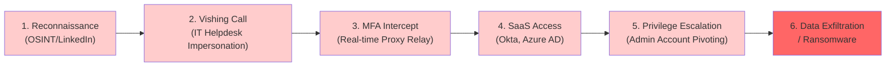
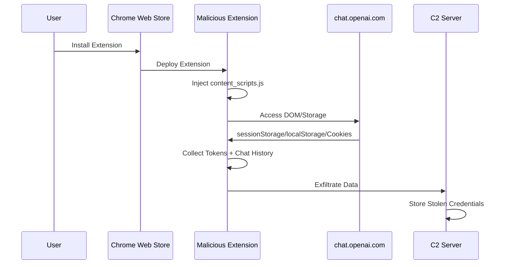
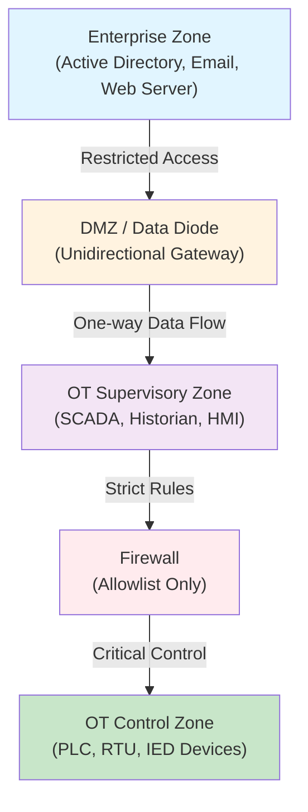

<div class="ai-summary-card">
<div class="ai-summary-header">
  <span class="ai-badge">AI 요약</span>
</div>
<div class="ai-summary-content">
  <div class="summary-row">
    <span class="summary-label">제목</span>
    <span class="summary-value">Tech & Security Weekly Digest (2026년 01월 31일)</span>
  </div>
  <div class="summary-row">
    <span class="summary-label">카테고리</span>
    <span class="summary-value"><span class="category-tag security">Security</span> <span class="category-tag devsecops">DevSecOps</span></span>
  </div>
  <div class="summary-row">
    <span class="summary-label">태그</span>
    <span class="summary-value tags">
      <span class="tag">ShinyHunters</span>
      <span class="tag">Vishing</span>
      <span class="tag">MFA-Bypass</span>
      <span class="tag">Chrome-Extension</span>
      <span class="tag">ChatGPT</span>
      <span class="tag">OT-Security</span>
      <span class="tag">ICS</span>
      <span class="tag">2026</span>
    </span>
  </div>
  <div class="summary-row highlights">
    <span class="summary-label">핵심 내용</span>
    <ul class="summary-list">
      <li><strong>ShinyHunters Vishing</strong>: Mandiant 발표 - SaaS 플랫폼 대상 비싱 공격으로 MFA 우회, 자격증명 탈취 확산</li>
      <li><strong>Chrome 확장 프로그램</strong>: 악성 확장이 어필리에이트 링크 하이재킹 및 ChatGPT 인증 토큰 수집</li>
      <li><strong>폴란드 에너지 OT 공격</strong>: CERT Polska 보고 - 30+ 풍력/태양광 발전소 대상 협조적 사이버 공격</li>
      <li><strong>CISO 2026 우선순위</strong>: Google Cloud CISO 관점 - AI 보안, 클라우드 거버넌스, 규제 대응</li>
    </ul>
  </div>
  <div class="summary-row">
    <span class="summary-label">수집 기간</span>
    <span class="summary-value">2026년 1월 30일 ~ 31일</span>
  </div>
  <div class="summary-row">
    <span class="summary-label">대상 독자</span>
    <span class="summary-value">보안 담당자, SOC 분석가, DevSecOps 엔지니어, CISO</span>
  </div>
</div>
<div class="ai-summary-footer">
  이 포스팅은 AI가 쉽게 이해하고 활용할 수 있도록 구조화된 요약을 포함합니다.
</div>
</div>

## 서론

안녕하세요, **Twodragon**입니다.

2026년 1월 31일 기준 주요 기술 및 보안 뉴스를 심층 분석했습니다. 이번 주는 ShinyHunters 그룹의 고도화된 비싱(Voice Phishing) 공격과 악성 Chrome 확장 프로그램을 통한 AI 서비스 토큰 탈취, 폴란드 에너지 인프라 대상 OT 공격이 핵심 이슈입니다.

### 이번 주 핵심 위협

| 위협 | 심각도 | 상태 | 즉시 조치 |
|------|--------|------|-----------|
| **ShinyHunters Vishing** | High | 활발한 공격 중 | 피싱 방지 MFA(FIDO2) 전환 |
| **악성 Chrome 확장** | High | PoC 확인 | 확장 프로그램 감사 및 정책 적용 |
| **폴란드 OT 공격** | Critical | 공격 완료/분석 중 | OT 네트워크 세그멘테이션 점검 |
| **CISO 2026 우선순위** | - | Best Practice | AI 보안 거버넌스 검토 |

---

## 1. ShinyHunters Vishing 공격: SaaS MFA 우회 심층 분석

### 1.1 개요

Google 산하 **Mandiant**가 금전적 동기의 해킹 그룹 **ShinyHunters** (UNC3944, Scattered Spider와 기법 유사)의 확장된 위협 활동을 식별했습니다. 이 그룹은 고급 **비싱(Voice Phishing)** 기법과 위조된 자격증명 수집 사이트를 활용하여 SaaS 플랫폼에 대한 무단 접근을 확보합니다.

| 항목 | 상세 내용 |
|------|-----------|
| **위협 그룹** | ShinyHunters (UNC3944 관련) |
| **공격 유형** | Voice Phishing + Credential Harvesting |
| **대상** | SaaS 플랫폼 사용 기업 |
| **목표** | MFA 우회 → 자격증명 탈취 → 데이터 갈취 |
| **활동 상태** | 활발히 진행 중 |

> **출처**: [The Hacker News](https://thehackernews.com/2026/01/mandiant-finds-shinyhunters-using.html)

### 1.2 공격 체인 분석


<details>
<summary>텍스트 버전 (접근성용)</summary>



</details>

### 1.3 비싱 공격의 기술적 상세

**1단계: 타겟 정찰**
- LinkedIn에서 IT 헬프데스크 직원, 보안팀 연락처 수집
- 대상 기업의 SSO 포털 URL 및 MFA 정책 사전 조사
- 공격에 사용할 전화번호 스푸핑 (발신자 위조)

**2단계: 비싱 콜 실행**
- IT 헬프데스크로 위장하여 직원에게 전화
- "보안 점검", "계정 잠금 해제" 등의 시나리오 활용
- 실시간으로 위조 로그인 페이지 URL 전달

**3단계: MFA 리얼타임 릴레이**
- 피해자가 입력하는 MFA 코드를 실시간으로 가로채기
- **EvilGinx2** 스타일의 리버스 프록시 활용
- 세션 토큰 직접 캡처하여 MFA 완전 우회

### 1.4 방어 전략: 피싱 방지 MFA

#### FIDO2/WebAuthn 전환 가이드

```powershell
# Azure AD에서 FIDO2 보안 키 정책 활성화 확인
Connect-MgGraph -Scopes "Policy.Read.All"

# FIDO2 인증 메서드 정책 조회
Get-MgPolicyAuthenticationMethodPolicyAuthenticationMethodConfiguration `
    -AuthenticationMethodConfigurationId "fido2" | 
    Select-Object State, Id

# 조건부 접근 정책: MFA 강도 요구 사항 설정
# Authentication Strength → Phishing-resistant MFA 선택
# 포함 방법: FIDO2 Security Key, Windows Hello for Business, Certificate-based
```

#### Okta에서 WebAuthn 강제 적용

```bash
# Okta API로 WebAuthn 팩터 등록 현황 조회
curl -s -H "Authorization: SSWS ${OKTA_API_TOKEN}" \
    -H "Content-Type: application/json" \
    "https://${OKTA_DOMAIN}/api/v1/users?filter=status%20eq%20%22ACTIVE%22&limit=200" | \
    jq -r '.[] | "\(.profile.email) \(.id)"' | \
    while read email uid; do
        webauthn=$(curl -s -H "Authorization: SSWS ${OKTA_API_TOKEN}" \
            "https://${OKTA_DOMAIN}/api/v1/users/${uid}/factors" | \
            jq '[.[] | select(.factorType == "webauthn")] | length')
        if [ "$webauthn" -eq 0 ]; then
            echo "WARNING: No WebAuthn factor - ${email}"
        fi
    done
```

### 1.5 탐지 및 헌팅

#### SIEM 탐지 룰 (Splunk)

```spl
index=okta sourcetype=OktaIM2:log
| where eventType IN ("user.session.start", "user.authentication.auth_via_mfa")
| eval is_suspicious=case(
    like(client.ipAddress, "10.%") AND client.geographicalContext.country!="KR", 1,
    match(client.userAgent.rawUserAgent, "(?i)(python|curl|httpie|postman)"), 1,
    1=1, 0)
| where is_suspicious=1
| eval mfa_type=mvindex(split(debugContext.debugData.factor, ";"), 0)
| stats count dc(client.ipAddress) as unique_ips values(mfa_type) as mfa_types 
    by actor.displayName, actor.alternateId
| where count > 3 OR unique_ips > 2
| table actor.displayName, actor.alternateId, count, unique_ips, mfa_types
```

#### Sigma Rule

```yaml
title: Suspicious MFA Authentication Pattern - Potential Vishing (ShinyHunters)
id: b7d3e1a9-5678-4321-abcd-112233445566
status: stable
description: Detects unusual MFA authentication patterns potentially indicating vishing-assisted credential theft
author: Twodragon
date: 2026/01/31
references:
    - https://thehackernews.com/2026/01/mandiant-finds-shinyhunters-using.html
    - https://attack.mitre.org/techniques/T1566/004/
logsource:
    product: okta
    service: okta
detection:
    selection_event:
        eventType:
            - 'user.session.start'
            - 'user.authentication.auth_via_mfa'
    selection_suspicious:
        outcome.result: 'SUCCESS'
        debugContext.debugData.factor|contains:
            - 'OTP'
            - 'SMS'
            - 'CALL'
    filter_webauthn:
        debugContext.debugData.factor|contains:
            - 'FIDO'
            - 'webauthn'
    timeframe: 5m
    condition: selection_event and selection_suspicious and not filter_webauthn | count() by actor.alternateId > 3
falsepositives:
    - Legitimate help desk password resets
    - Automated service accounts
level: high
tags:
    - attack.initial_access
    - attack.t1566.004
    - attack.t1078
    - attack.t1539
```

### 1.6 MITRE ATT&CK 매핑

```yaml
mitre_attack:
  initial_access:
    - T1566.004  # Phishing: Voice Phishing (Vishing)
    - T1078      # Valid Accounts
  credential_access:
    - T1539      # Steal Web Session Cookie
    - T1557      # Adversary-in-the-Middle
    - T1111      # Multi-Factor Authentication Interception
  persistence:
    - T1098      # Account Manipulation
  impact:
    - T1657      # Financial Theft
    - T1486      # Data Encrypted for Impact
```

---

## 2. 악성 Chrome 확장: ChatGPT 토큰 탈취 분석

### 2.1 개요

보안 연구원들이 **어필리에이트 링크 하이재킹**, 데이터 탈취, **OpenAI ChatGPT 인증 토큰 수집** 기능을 갖춘 악성 Google Chrome 확장 프로그램을 발견했습니다. "Amazon Ads Blocker" (ID: pnpchphmplpdimbllknjoiopmfphellj)를 포함한 여러 확장이 Chrome Web Store에 등록되어 있었습니다.

| 항목 | 상세 |
|------|------|
| **공격 유형** | 브라우저 확장 프로그램 공급망 공격 |
| **영향** | 어필리에이트 수익 탈취 + ChatGPT 세션 토큰 수집 |
| **대상** | Chrome 사용자, 특히 AI 도구 활용 기업 사용자 |
| **탐지 상태** | Chrome Web Store에서 제거됨 |

> **출처**: [The Hacker News](https://thehackernews.com/2026/01/researchers-uncover-chrome-extensions.html)

### 2.2 공격 메커니즘

**ChatGPT 토큰 탈취 흐름:**


<details>
<summary>텍스트 버전 (접근성용)</summary>



</details>

**탈취되는 데이터:**
1. **OpenAI 세션 토큰** (`__Secure-next-auth.session-token`)
2. **API 키** (localStorage에 저장된 경우)
3. **대화 기록** (기업 기밀 정보 포함 가능)
4. **어필리에이트 링크** (Amazon, 기타 e-commerce 사이트)

### 2.3 기업 환경 브라우저 보안

#### Chrome 확장 프로그램 관리 정책 (GPO)

```
Computer Configuration → Administrative Templates → Google Chrome → Extensions:
├── Configure allowed extension types: component, hosted_app
├── Configure extension installation allowlist: [승인된 확장 ID만]
├── Configure extension installation blocklist: * (전체 차단, 허용 목록만 예외)
├── Block external extensions: Enabled
└── Extension settings:
    └── Force-install specific extensions from CWS
```

#### 확장 프로그램 감사 스크립트 (PowerShell)

```powershell
# Chrome 확장 프로그램 전수 조사
$users = Get-ChildItem "C:\Users" -Directory
$suspiciousPerms = @("cookies", "webRequest", "webRequestBlocking", "storage", "tabs", "<all_urls>")

foreach ($user in $users) {
    $extPath = Join-Path $user.FullName "AppData\Local\Google\Chrome\User Data\Default\Extensions"
    if (Test-Path $extPath) {
        Get-ChildItem $extPath -Directory | ForEach-Object {
            $manifestFiles = Get-ChildItem $_.FullName -Recurse -Filter "manifest.json"
            foreach ($mf in $manifestFiles) {
                try {
                    $manifest = Get-Content $mf.FullName -Raw | ConvertFrom-Json
                    $perms = @($manifest.permissions) + @($manifest.host_permissions) | Where-Object { $_ }
                    $hasRisk = $perms | Where-Object { $_ -in $suspiciousPerms -or $_ -match "^\*|<all_urls>" }

                    if ($hasRisk) {
                        [PSCustomObject]@{
                            User        = $user.Name
                            Extension   = $manifest.name
                            Version     = $manifest.version
                            Permissions = ($hasRisk -join ", ")
                            Path        = $mf.DirectoryName
                        }
                    }
                } catch { }
            }
        }
    }
} | Format-Table -AutoSize
```

#### Linux/macOS 환경 감사 스크립트

```bash
#!/bin/bash
# Chrome 확장 프로그램 보안 감사
CHROME_EXT_DIR="${HOME}/.config/google-chrome/Default/Extensions"
[ "$(uname)" = "Darwin" ] && CHROME_EXT_DIR="${HOME}/Library/Application Support/Google/Chrome/Default/Extensions"

echo "=== Chrome Extension Security Audit ==="
echo "Date: $(date -u +%Y-%m-%dT%H:%M:%SZ)"
echo "Host: $(hostname)"
echo ""

RISKY_PERMS=("cookies" "webRequest" "webRequestBlocking" "<all_urls>" "debugger" "nativeMessaging")

find "$CHROME_EXT_DIR" -name "manifest.json" 2>/dev/null | while read -r manifest; do
    name=$(jq -r '.name // "Unknown"' "$manifest" 2>/dev/null)
    version=$(jq -r '.version // "?"' "$manifest" 2>/dev/null)
    perms=$(jq -r '(.permissions // []) + (.host_permissions // []) | .[]' "$manifest" 2>/dev/null)

    risk_found=false
    for perm in "${RISKY_PERMS[@]}"; do
        if echo "$perms" | grep -q "$perm"; then
            risk_found=true
            break
        fi
    done

    if $risk_found; then
        echo "RISK: ${name} v${version}"
        echo "  Path: $(dirname "$manifest")"
        echo "  Risky Permissions: $(echo "$perms" | tr '\n' ', ')"
        echo ""
    fi
done

echo "=== Audit Complete ==="
```

### 2.4 MITRE ATT&CK 매핑

```yaml
mitre_attack:
  initial_access:
    - T1189      # Drive-by Compromise (Extension Install)
  collection:
    - T1185      # Browser Session Hijacking
    - T1539      # Steal Web Session Cookie
    - T1005      # Data from Local System
  credential_access:
    - T1528      # Steal Application Access Token
  command_and_control:
    - T1071.001  # Web Protocols (HTTPS to C2)
```

---

## 3. 폴란드 에너지 인프라 OT 공격: CERT Polska 분석

### 3.1 개요

**CERT Polska**가 2025년 12월 29일에 발생한 대규모 협조적 사이버 공격을 상세 보고했습니다. 30개 이상의 풍력 및 태양광 발전소, 제조 기업, 약 50만 고객에게 난방을 공급하는 대규모 열병합발전소(CHP)가 공격 대상이었습니다.

| 항목 | 상세 |
|------|------|
| **공격 일시** | 2025년 12월 29일 |
| **공격 유형** | 다중 대상 협조적 사이버 공격 |
| **피해 시설** | 풍력/태양광 30+, 제조 1, 열병합 1 |
| **영향 인구** | 약 500,000명 (난방 서비스) |
| **보고 기관** | CERT Polska |

> **출처**: [The Hacker News](https://thehackernews.com/2026/01/poland-attributes-december-cyber.html)

### 3.2 OT/ICS 공격 트렌드

**에너지 섹터 사이버 공격 증가 추세:**

| 연도 | 주요 사건 | 영향 |
|------|-----------|------|
| 2015 | 우크라이나 전력망 공격 (BlackEnergy) | 23만 가구 정전 |
| 2021 | Colonial Pipeline | 미 동부 연료 공급 중단 |
| 2023 | 덴마크 에너지 섹터 공격 | 22개 에너지 기업 침해 |
| 2025 | 폴란드 에너지 인프라 | 30+ 발전소, 50만명 영향 |

### 3.3 OT 네트워크 방어 가이드

#### IT/OT 네트워크 세그멘테이션


<details>
<summary>텍스트 버전 (접근성용)</summary>



</details>

#### OT 환경 보안 점검 스크립트

```bash
#!/bin/bash
# OT 네트워크 기본 보안 점검 스크립트
echo "=== OT Network Security Quick Check ==="
echo "Date: $(date -u +%Y-%m-%dT%H:%M:%SZ)"

# 1. 인터넷 연결 가능 여부 확인 (OT 존은 차단 필수)
echo ""
echo "[1] Internet Connectivity Check (should FAIL in OT zone)"
if curl -s --connect-timeout 5 https://www.google.com > /dev/null 2>&1; then
    echo "  CRITICAL: Internet accessible from OT network!"
else
    echo "  OK: No internet access"
fi

# 2. 알려진 OT 프로토콜 포트 리스닝 확인
echo ""
echo "[2] OT Protocol Ports Listening"
OT_PORTS=("502:Modbus" "2222:EtherNet/IP" "44818:EtherNet/IP" "20000:DNP3" "4840:OPC-UA" "102:S7comm")
for entry in "${OT_PORTS[@]}"; do
    port="${entry%%:*}"
    proto="${entry##*:}"
    if ss -tlnp 2>/dev/null | grep -q ":${port}"; then
        echo "  ACTIVE: Port ${port} (${proto})"
    fi
done

# 3. 비인가 SSH/RDP 세션 확인
echo ""
echo "[3] Remote Access Sessions"
echo "  SSH sessions: $(who | grep -c pts 2>/dev/null || echo 0)"
echo "  Active connections on port 22: $(ss -tn state established '( dport = :22 or sport = :22 )' 2>/dev/null | wc -l)"
echo "  Active connections on port 3389: $(ss -tn state established '( dport = :3389 or sport = :3389 )' 2>/dev/null | wc -l)"

# 4. 최근 24시간 로그인 실패
echo ""
echo "[4] Failed Login Attempts (last 24h)"
journalctl --since "24 hours ago" 2>/dev/null | grep -ci "failed\|failure\|invalid" || echo "  Log check unavailable"

echo ""
echo "=== Check Complete ==="
```

### 3.4 IEC 62443 프레임워크 적용

**에너지 시설 보안을 위한 IEC 62443 핵심 요구사항:**

| 보안 수준 | 요구사항 | 적용 |
|-----------|---------|------|
| **SL 1** | 비의도적 위반 방지 | 기본 접근 제어, 사용자 인증 |
| **SL 2** | 의도적 위반 방지 (일반) | 역할 기반 접근 제어, 암호화 통신 |
| **SL 3** | 고도화된 공격 방지 | 네트워크 세그멘테이션, IDS, 무결성 모니터링 |
| **SL 4** | 국가 수준 공격 방지 | 데이터 다이오드, 물리적 격리, 24/7 SOC |

### 3.5 MITRE ATT&CK for ICS 매핑

```yaml
mitre_attack_ics:
  initial_access:
    - T0817      # Drive-by Compromise
    - T0886      # Remote Services
  execution:
    - T0807      # Command-Line Interface
  persistence:
    - T0889      # Modify Program
  impact:
    - T0826      # Loss of Availability
    - T0827      # Loss of Control
    - T0831      # Manipulation of Control
```

---

## 4. Cloud CISO Perspectives: 2026 우선순위

### 4.1 개요

Google Cloud의 **Taylor Lehmann** (Healthcare & Life Sciences Director, Office of the CISO)이 2026년 CISO가 우선시해야 할 5가지 핵심 영역을 발표했습니다.

> **출처**: [Google Cloud Blog](https://cloud.google.com/blog/products/identity-security/cloud-ciso-perspectives-5-top-ciso-priorities-in-2026/)

### 4.2 2026 CISO 5대 우선순위

| 순위 | 우선순위 | 핵심 포인트 |
|------|---------|-------------|
| 1 | **AI 보안 거버넌스** | LLM 위협 모델링, AI 공급망 보안, 프롬프트 인젝션 방어 |
| 2 | **클라우드 네이티브 보안** | 컨테이너 런타임 보호, 서비스 메시 보안, 워크로드 아이덴티티 |
| 3 | **규제 대응** | NIS2, DORA, AI Act 등 글로벌 규제 컴플라이언스 |
| 4 | **공급망 보안** | SBOM 관리, 서드파티 위험 평가, 개발자 보안 도구 통합 |
| 5 | **보안 자동화** | SOAR 고도화, AI 기반 위협 탐지, 자동 대응 파이프라인 |

---

## 5. 추가 주요 뉴스

### 5.1 HashiCorp Boundary 0.21: 원격 접근 보안 강화

**Boundary 0.21**에서 RDP 연결에 대한 비밀번호 없는 접근과 개선된 UX를 제공합니다.

| 기능 | 설명 | 보안 이점 |
|------|------|-----------|
| **Passwordless RDP** | 인증서 기반 RDP 접근 | 자격증명 탈취 위험 감소 |
| **세션 기록** | 모든 원격 세션 감사 기록 | 컴플라이언스 충족 |
| **동적 자격증명** | 일회용 자격증명 발급 | 지속적 접근 방지 |

> **출처**: [HashiCorp Blog](https://www.hashicorp.com/blog/boundary-0-21-improves-remote-access-security-and-ux-for-rdp-connections)

### 5.2 AWS Directory Service 스케일링

AWS Directory Service for Microsoft Active Directory를 기본 Active Directory 포레스트로 사용하는 아키텍처의 스케일링 옵션이 공개되었습니다. 하이브리드 환경에서의 아이덴티티 관리 확장성을 강화합니다.

> **출처**: [AWS Security Blog](https://aws.amazon.com/blogs/security/explore-scaling-options-for-aws-directory-service-for-microsoft-active-directory/)

### 5.3 국가은행의 셀프서비스 AI 인프라 구축 교훈

HashiCorp이 **호주 국립은행(NAB)**의 레거시 기술 환경에서 셀프서비스 및 AI 기반 인프라를 구축한 5가지 교훈을 공유했습니다.

> **출처**: [HashiCorp Blog](https://www.hashicorp.com/blog/5-lessons-for-enabling-self-service-and-ai-driven-infrastructure-despite-legacy-tech-at-a-national-bank)

### 5.4 기타 주목할 뉴스

| 제목 | 출처 | 핵심 내용 |
|------|------|----------|
| [AI 지원이 코딩 기술 형성에 미치는 영향](https://news.hada.io/topic?id=26275) | GeekNews | Anthropic 연구: AI 코딩 도우미의 개발자 학습/숙련도 영향 실험적 검증 |
| [토스 프론트엔드 챕터 140명 조직 운영 경험](https://news.hada.io/topic?id=26274) | GeekNews | 대규모 프론트엔드 조직 운영 방법론과 시스템 구축 경험 |

---

## 6. DevSecOps 실무 가이드

### 6.1 비싱/피싱 방어 CI/CD 통합

```yaml
# .github/workflows/security-awareness.yml
name: Security Awareness Check

on:
  pull_request:
    branches: [main]

jobs:
  check-secrets:
    runs-on: ubuntu-latest
    steps:
      - uses: actions/checkout@v4

      # API 키/토큰 하드코딩 탐지
      - name: Detect Hardcoded Secrets
        uses: trufflesecurity/trufflehog@main
        with:
          path: ./
          
      # ChatGPT/OpenAI 토큰 노출 검사
      - name: Check AI Service Token Exposure
        run: |
          if grep -rn "sk-[a-zA-Z0-9]\{48\}" --include="*.{js,ts,py,json,yaml,yml,env}" .; then
            echo "::error::OpenAI API key found in source code!"
            exit 1
          fi
          if grep -rn "sess-[a-zA-Z0-9]\{40\}" --include="*.{js,ts,py,json}" .; then
            echo "::error::OpenAI session token found in source code!"
            exit 1
          fi
          echo "No AI service tokens found in code."
```

### 6.2 브라우저 확장 보안 정책 (MDM)

```json
{
  "ExtensionInstallBlocklist": ["*"],
  "ExtensionInstallAllowlist": [
    "cjpalhdlnbpafiamejdnhcphjbkeiagm",
    "aapbdbdomjkkjkaonfhkkikfgjllcleb"
  ],
  "ExtensionSettings": {
    "*": {
      "blocked_permissions": [
        "cookies",
        "webRequest",
        "webRequestBlocking",
        "debugger",
        "nativeMessaging"
      ],
      "runtime_blocked_hosts": [
        "https://chat.openai.com/*",
        "https://platform.openai.com/*",
        "https://claude.ai/*"
      ]
    }
  }
}
```

---

## 7. 실무 체크리스트

### P0 - 즉시 조치 (24시간 이내)

- [ ] **비싱 경고**: 전사 피싱/비싱 경보 발령 - IT 헬프데스크 사칭 공격 주의
- [ ] **Chrome 확장 감사**: 전사 Chrome 확장 프로그램 인벤토리 수집 및 미승인 확장 제거
- [ ] **ChatGPT 세션 토큰 로테이션**: OpenAI 서비스 사용자의 세션 재인증 강제
- [ ] **OT 네트워크 점검**: 에너지/제조 환경의 IT-OT 경계 방화벽 룰 긴급 점검

### P1 - 7일 이내

- [ ] **FIDO2 MFA 전환 계획**: SMS/OTP MFA → 피싱 방지 MFA(FIDO2, WebAuthn) 전환 로드맵 수립
- [ ] **브라우저 정책 배포**: Chrome Enterprise 관리 정책으로 확장 프로그램 허용 목록 적용
- [ ] **SIEM 탐지 룰 배포**: ShinyHunters 비싱 패턴 및 비정상 MFA 인증 탐지 룰 적용
- [ ] **OT IDS 모니터링**: OT 네트워크 IDS/IPS 룰 업데이트 및 모니터링 강화

### P2 - 30일 이내

- [ ] **CISO 2026 우선순위 검토**: AI 보안 거버넌스, 공급망 보안, 규제 대응 계획 수립
- [ ] **IEC 62443 Gap 분석**: OT 환경 보안 수준 평가 및 개선 계획
- [ ] **API 토큰 관리 체계**: AI 서비스(ChatGPT, Claude, Gemini) API 키 중앙화 관리 및 로테이션 정책
- [ ] **비싱 시뮬레이션**: 보안 인식 교육에 비싱 시나리오 추가

---

## 8. 참고 자료

| 분류 | 자료 | URL |
|------|------|-----|
| **ShinyHunters** | Mandiant Research | [thehackernews.com](https://thehackernews.com/2026/01/mandiant-finds-shinyhunters-using.html) |
| **Chrome 확장** | The Hacker News | [thehackernews.com](https://thehackernews.com/2026/01/researchers-uncover-chrome-extensions.html) |
| **CERT Polska** | 에너지 OT 공격 | [thehackernews.com](https://thehackernews.com/2026/01/poland-attributes-december-cyber.html) |
| **CISO 2026** | Google Cloud Blog | [cloud.google.com](https://cloud.google.com/blog/products/identity-security/cloud-ciso-perspectives-5-top-ciso-priorities-in-2026/) |
| **Boundary 0.21** | HashiCorp | [hashicorp.com](https://www.hashicorp.com/blog/boundary-0-21-improves-remote-access-security-and-ux-for-rdp-connections) |
| **AWS AD** | AWS Security Blog | [aws.amazon.com](https://aws.amazon.com/blogs/security/explore-scaling-options-for-aws-directory-service-for-microsoft-active-directory/) |
| **FIDO2** | FIDO Alliance | [fidoalliance.org](https://fidoalliance.org/fido2/) |
| **IEC 62443** | ISA Standards | [isa.org](https://www.isa.org/standards-and-publications/isa-standards/isa-iec-62443-series-of-standards) |
| **MITRE ATT&CK** | MITRE | [attack.mitre.org](https://attack.mitre.org/) |
| **MITRE ICS** | MITRE ATT&CK for ICS | [attack.mitre.org](https://attack.mitre.org/techniques/ics/) |
| **Chrome 보안** | Chrome Extensions | [developer.chrome.com](https://developer.chrome.com/docs/extensions/develop/migrate/improve-security) |
| **CISA KEV** | 익스플로잇 취약점 | [cisa.gov](https://www.cisa.gov/known-exploited-vulnerabilities-catalog) |
| **FIRST EPSS** | 익스플로잇 예측 | [first.org](https://www.first.org/epss/) |

---

## 마무리

이번 주 가장 시급한 대응은 **비싱 공격 경보 발령과 피싱 방지 MFA 전환**입니다. ShinyHunters의 비싱 기법은 기존 SMS/OTP 기반 MFA를 무력화하므로, FIDO2/WebAuthn으로의 전환이 근본적 해결책입니다.

### 핵심 요약

| 순위 | 위협 | 심각도 | 즉시 조치 |
|------|------|--------|-----------|
| 1 | **ShinyHunters Vishing** | High | 비싱 경보 + FIDO2 MFA 전환 |
| 2 | **Chrome 확장 ChatGPT 탈취** | High | 확장 감사 + AI 토큰 로테이션 |
| 3 | **폴란드 OT 공격** | Critical | IT/OT 세그멘테이션 긴급 점검 |

다음 주에도 중요한 보안 소식을 전해드리겠습니다.

---

**작성자**: Twodragon
**작성일**: 2026-01-31
