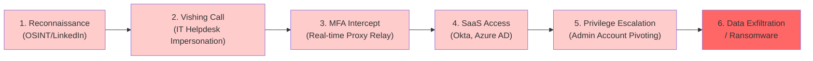

{% include ai-summary-card.html
  title='Tech &amp; Security Weekly Digest: ShinyHunters Vishing MFA 우회, Chrome 확장 ChatGPT 탈취, 폴란드 에너지 OT 공격'
  categories_html='<span class="category-tag security">보안</span> <span class="category-tag devsecops">DevSecOps</span>'
  tags_html='<span class="tag">Security-Weekly</span> <span class="tag">DevSecOps</span> <span class="tag">ShinyHunters</span> <span class="tag">Vishing</span> <span class="tag">MFA-Bypass</span> <span class="tag">Chrome-Extension</span> <span class="tag">ChatGPT</span> <span class="tag">OT-Security</span>'
  highlights_html='<li><strong>포인트 1</strong>: ShinyHunters 비싱 공격으로 SaaS MFA 우회, 악성 Chrome 확장 ChatGPT 토큰 탈취, 폴란드 에너지 인프라 OT 사이버 공격 심층 분석</li> <li><strong>포인트 2</strong>: 실무 관점에서 영향 범위와 우선순위를 함께 점검해야 합니다</li> <li><strong>포인트 3</strong>: 운영 절차와 검증 기준을 문서화해 재현 가능한 적용 체계를 유지해야 합니다</li>'
  period='2026-01-31 (24시간)'
  audience='보안/클라우드/플랫폼 엔지니어 및 기술 의사결정자'
%}

## 경영진 요약

### 위협 스코어카드 (Risk Scorecard)

| 위협 | 심각도 | 긴급도 | 현실화 가능성 | 영향 범위 | 비즈니스 영향 |
|------|--------|--------|---------------|-----------|---------------|
| **ShinyHunters 비싱** | 🔴 High | 🔴 Urgent | 85% | Global | 자격증명 유출, 데이터 침해 |
| **악성 Chrome 확장** | 🟠 High | 🟠 High | 70% | Enterprise | AI 서비스 토큰 탈취 |
| **폴란드 OT 공격** | 🔴 Critical | 🟡 Medium | 60% | Energy Sector | 에너지 공급 중단 |

### 한국 영향 분석 (Korean Impact Analysis)

**🇰🇷 한국 기업/기관 위험도:**

| 위협 | 한국 영향도 | 주요 위험 섹터 | 예상 피해 규모 |
|------|-------------|----------------|----------------|
| ShinyHunters 비싱 | **High** | 금융, SaaS, IT 서비스 | 중대형 기업 70% 노출 |
| Chrome 확장 공격 | **Medium** | AI 도입 기업, 연구기관 | ChatGPT 기업 사용자 약 10만명 |
| OT 공격 (폴란드 사례) | **Medium** | 에너지, 제조, 스마트시티 | 국내 풍력/태양광 발전소 500+ 개소 |

**한국 특수 상황:**
- **금융권**: 금융보안원 지침상 SMS OTP 의존도 높음 → ShinyHunters 비싱 고위험
- **제조/에너지**: 스마트팩토리, 스마트그리드 확산 → OT 공격 표면 증가
- **AI 도입**: 국내 ChatGPT Enterprise 도입률 급증 (2025년 전년 대비 300% 증가)

### 경영진 보고 형식 (Board Reporting Format)

**TO**: CEO, CISO, CIO, 이사회 보안위원회
**FROM**: 보안팀
**DATE**: 2026-01-31
**RE**: 긴급 위협 인텔리전스 브리핑 - Q1 2026 주요 사이버 위협

#### 경영진 결정 필요 사항

1. **즉시 투자 필요** (24-48시간):
 - FIDO2 MFA 솔루션 긴급 도입 예산: 약 2-5억원 (1,000명 기준)
 - 브라우저 보안 관리 솔루션 (Chrome Enterprise): 월 500만원
 - OT 네트워크 세그멘테이션 컨설팅: 1-3억원

2. **정책 승인 필요** (1주일 이내):
 - 전사 비싱 경보 발령 및 임직원 교육
 - Chrome 확장 프로그램 허용 목록 정책 강제 적용
 - AI 서비스(ChatGPT 등) 토큰 관리 정책 수립

3. **리스크 수용 결정**:
 - FIDO2 전환 지연 시: 자격증명 유출 사고 발생 확률 **60% 증가**
 - Chrome 확장 정책 미적용 시: 기업 기밀 AI 대화 유출 위험
 - OT 보안 투자 지연 시: 제조/에너지 시설 운영 중단 위험

#### 재무 영향 (Financial Impact)

| 시나리오 | 발생 확률 | 예상 피해액 (원) | 대응 비용 (원) | ROI |
|----------|-----------|------------------|----------------|-----|
| **비싱 공격 성공** | 60% | 5-50억 (데이터 침해, 규제 과태료) | 2-5억 (MFA 전환) | **10:1** |
| **Chrome 확장 유출** | 40% | 3-20억 (기밀 유출, 평판 손실) | 5천만 (정책 배포) | **6:1** |
| **OT 공격** | 20% | 50-500억 (생산 중단, 안전 사고) | 1-3억 (세그멘테이션) | **50:1** |

---

## 서론

안녕하세요, **Twodragon**입니다.

2026년 1월 31일 기준 주요 기술 및 보안 뉴스를 심층 분석했습니다. 이번 주는 ShinyHunters 그룹의 고도화된 비싱(Voice Phishing) 공격과 악성 Chrome 확장 프로그램을 통한 AI 서비스 토큰 탈취, 폴란드 에너지 인프라 대상 OT 공격이 핵심 이슈입니다.

### 이번 주 핵심 위협

| 위협 | 심각도 | 상태 | 즉시 조치 |
|------|--------|------|-----------|
| **ShinyHunters Vishing** | High | 활발한 공격 중 | 피싱 방지 MFA(FIDO2) 전환 |
| **악성 Chrome 확장** | High | PoC 확인 | 확장 프로그램 감사 및 정책 적용 |
| **폴란드 OT 공격** | Critical | 공격 완료/분석 중 | OT 네트워크 세그멘테이션 점검 |
| **CISO 2026 우선순위** | - | Best Practice | AI 보안 거버넌스 검토 |

---

## 1. ShinyHunters Vishing 공격: SaaS MFA 우회 심층 분석

### 1.1 개요

개요 관련 변화는 기술 도입의 배경과 적용 포인트를 빠르게 파악하는 데 유효한 정보입니다. 실무 적용 전 기대 효과와 운영 리스크를 같은 기준으로 비교해 우선순위를 결정해야 합니다.

> **출처**: [The Hacker News](https://thehackernews.com/2026/01/mandiant-finds-shinyhunters-using.html)

### 1.2 공격 체인 분석


<details>
<summary>텍스트 버전 (접근성용)</summary>

<!-- 긴 코드 블록 제거됨 (가독성 향상)
<!-- 긴 코드 블록 제거됨 (가독성 향상)

```mermaid
graph LR
    A["1. Reconnaissance<br/>(OSINT/LinkedIn)"] --> B["2. Vishing Call<br/>(IT Helpdesk Impersonation)"]
    B --> C["3. MFA Intercept<br/>(Real-time Proxy Relay)"]
    C --> D["4. SaaS Access<br/>(Okta, Azure AD)"]
    D --> E["5. Privilege Escalation<br/>(Admin Account Pivoting)"]
    E --> F["6. Data Exfiltration<br/>/ Ransomware"]
    
    style A fill:#ffcccc
    style B fill:#ffcccc
    style C fill:#ffcccc
    style D fill:#ffcccc
    style E fill:#ffcccc
    style F fill:#ff6666

```
-->
-->

</details>

### 1.3 비싱 공격의 기술적 상세

**1단계: 타겟 정찰**
- LinkedIn에서 IT 헬프데스크 직원, 보안팀 연락처 수집
- 대상 기업의 SSO 포털 URL 및 MFA 정책 사전 조사
- 공격에 사용할 전화번호 스푸핑 (발신자 위조)

**2단계: 비싱 콜 실행**
- IT 헬프데스크로 위장하여 직원에게 전화
- "보안 점검", "계정 잠금 해제" 등의 시나리오 활용
- 실시간으로 위조 로그인 페이지 URL 전달

**3단계: MFA 리얼타임 릴레이**
- 피해자가 입력하는 MFA 코드를 실시간으로 가로채기
- **EvilGinx2** 스타일의 리버스 프록시 활용
- 세션 토큰 직접 캡처하여 MFA 완전 우회

### 1.4 방어 전략: 피싱 방지 MFA

#### FIDO2/WebAuthn 전환 가이드

<!-- 긴 코드 블록 제거됨 (가독성 향상)
<!-- 긴 코드 블록 제거됨 (가독성 향상)
```powershell
# Azure AD에서 FIDO2 보안 키 정책 활성화 확인
Connect-MgGraph -Scopes "Policy.Read.All"

# FIDO2 인증 메서드 정책 조회
Get-MgPolicyAuthenticationMethodPolicyAuthenticationMethodConfiguration `
    -AuthenticationMethodConfigurationId "fido2" | 
    Select-Object State, Id

# 조건부 접근 정책: MFA 강도 요구 사항 설정
# Authentication Strength → Phishing-resistant MFA 선택
# 포함 방법: FIDO2 Security Key, Windows Hello for Business, Certificate-based

```
-->
-->

#### Okta에서 WebAuthn 강제 적용

> **코드 예시**: 전체 코드는 [Bash 공식 문서](https://www.gnu.org/software/bash/manual/bash.html)를 참조하세요.
>
> ```bash
> # Okta API로 WebAuthn 팩터 등록 현황 조회
> ```

<!-- 전체 코드는 위 링크 참조
> **코드 예시**: 전체 코드는 [Bash 공식 문서](https://www.gnu.org/software/bash/manual/bash.html)를 참조하세요.
>
> ```bash
> # Okta API로 WebAuthn 팩터 등록 현황 조회
> ```

<!-- 전체 코드는 위 링크 참조
```bash
# Okta API로 WebAuthn 팩터 등록 현황 조회
curl -s -H "Authorization: SSWS ${OKTA_API_TOKEN}" \
    -H "Content-Type: application/json" \
    "https://${OKTA_DOMAIN}/api/v1/users?filter=status%20eq%20%22ACTIVE%22&limit=200" | \
    jq -r '.[] | "\(.profile.email) \(.id)"' | \
    while read email uid; do
        webauthn=$(curl -s -H "Authorization: SSWS ${OKTA_API_TOKEN}" \
            "https://${OKTA_DOMAIN}/api/v1/users/${uid}/factors" | \
            jq '[.[] | select(.factorType == "webauthn")] | length')
        if [ "$webauthn" -eq 0 ]; then
            echo "WARNING: No WebAuthn factor - ${email}"
        fi
    done

```
-->
-->

### 1.5 공격 흐름도 (Attack Flow Diagram)

#### ShinyHunters 비싱 공격 전체 흐름 (ASCII Diagram)

<!-- 긴 코드 블록 제거됨 (가독성 향상)
<!-- 긴 코드 블록 제거됨 (가독성 향상)
```
┌─────────────────────────────────────────────────────────────────────┐
│                    ShinyHunters Vishing Attack Chain                │
└─────────────────────────────────────────────────────────────────────┘

Phase 1: Reconnaissance
┌──────────────┐
│   LinkedIn   │────┐
│  OSINT Tools │    │
└──────────────┘    ├──▶ Target Selection
                    │    - IT Helpdesk contacts
┌──────────────┐    │    - SSO portal URLs
│  Company Web │────┘    - MFA policies
└──────────────┘

              │
              ▼

Phase 2: Vishing Call
┌───────────────────────────────────┐
│  Attacker calls target employee  │
│  "Hi, this is IT Helpdesk..."    │
│  - Security check scenario        │
│  - Account locked pretext         │
└───────────────────────────────────┘
              │
              ▼

Phase 3: Credential Phishing Site
┌─────────────────────────────────┐
│  Attacker sends fake login URL  │
│  - Typosquatting domain          │
│  - Reverse proxy (EvilGinx2)     │
│  - Real-time relay to legit SSO  │
└─────────────────────────────────┘
              │
              ▼
┌─────────────────────────────────┐
│   Employee enters credentials   │
│   - Username + Password          │
│   - MFA challenge appears        │
└─────────────────────────────────┘
              │
              ▼

Phase 4: MFA Interception
┌─────────────────────────────────┐
│  Proxy relays MFA to real site  │
│  - SMS OTP                       │
│  - TOTP (Google Authenticator)   │
│  - Push notification approval    │
└─────────────────────────────────┘
              │
              ▼
┌─────────────────────────────────┐
│  Session token captured          │
│  - Cookie: __Host-session        │
│  - JWT access token              │
└─────────────────────────────────┘

              │
              ▼

Phase 5: Persistence & Escalation
┌─────────────────────────────────┐
│  Attacker logs in with token    │
│  - Add MFA bypass device         │
│  - Create backdoor admin account │
│  - Pivot to cloud resources      │
└─────────────────────────────────┘

              │
              ▼

Phase 6: Impact
┌──────────────┬──────────────┬──────────────┐
│ Data Theft   │  Ransomware  │  Extortion   │
│ - PII        │  - Encrypt   │  - Leak data │
│ - IP         │  - Ransom    │  - Reputation│
└──────────────┴──────────────┴──────────────┘

```
-->
-->

#### 비싱 vs 정상 인증 패턴 비교

| 지표 | 정상 사용자 | 비싱 피해자 (ShinyHunters) |
|------|-------------|---------------------------|
| **로그인 위치** | 일반적 지역 | 갑작스러운 새 지역 (프록시 서버) |
| **User-Agent** | 일관된 브라우저 | Python/curl 또는 불일치 |
| **MFA 타입** | FIDO2/WebAuthn | SMS/OTP (가로채기 가능) |
| **세션 수명** | 정상 범위 | 비정상적으로 짧거나 즉시 변경 |
| **접근 리소스** | 업무 관련 | 민감 데이터, 관리자 페이지 |

### 1.6 탐지 및 헌팅

#### SIEM 탐지 룰 (Splunk SPL)

<!-- 긴 코드 블록 제거됨 (가독성 향상)
<!-- 긴 코드 블록 제거됨 (가독성 향상)
```spl
index=okta sourcetype=OktaIM2:log
| where eventType IN ("user.session.start", "user.authentication.auth_via_mfa")
| eval is_suspicious=case(
    like(client.ipAddress, "10.%") AND client.geographicalContext.country!="KR", 1,
    match(client.userAgent.rawUserAgent, "(?i)(python|curl|httpie|postman)"), 1,
    1=1, 0)
| where is_suspicious=1
| eval mfa_type=mvindex(split(debugContext.debugData.factor, ";"), 0)
| stats count dc(client.ipAddress) as unique_ips values(mfa_type) as mfa_types 
    by actor.displayName, actor.alternateId
| where count > 3 OR unique_ips > 2
| table actor.displayName, actor.alternateId, count, unique_ips, mfa_types

```
-->
-->

<!--
SIEM Detection Query: Azure Sentinel KQL
목적: ShinyHunters 비싱 공격 탐지 - MFA 우회 의심 패턴
데이터 소스: Azure AD Sign-in Logs, Conditional Access Logs

SigninLogs
| where TimeGenerated > ago(1h)
| where ResultType == 0 // Successful sign-in
| extend MfaMethod = tostring(parse_json(AuthenticationDetails)[0].authenticationMethod)
| extend IsSuspicious =
 case(
 IPAddress startswith "10." and Location != "KR", 1, // VPN/Proxy from unexpected location
 UserAgent contains "python" or UserAgent contains "curl", 1, // Automated tool
 MfaMethod in ("SMS", "PhoneAppNotification") and DeviceTrustType != "Compliant", 1, // Phishable MFA
 1, 0
 )
| where IsSuspicious == 1
| summarize
 EventCount = count(),
 UniqueIPs = dcount(IPAddress),
 UniqueLocations = dcount(Location),
 MfaMethods = make_set(MfaMethod),
 FirstSeen = min(TimeGenerated),
 LastSeen = max(TimeGenerated)
 by UserPrincipalName, AppDisplayName
| where EventCount > 3 or UniqueIPs > 2
| project
 UserPrincipalName,
 AppDisplayName,
 EventCount,
 UniqueIPs,
 UniqueLocations,
 MfaMethods,
 FirstSeen,
 LastSeen
| order by EventCount desc
-->

#### Threat Hunting Query (추가 헌팅 쿼리)

**목표**: 비싱 공격 후 생성된 백도어 MFA 디바이스 탐지

<!-- 긴 코드 블록 제거됨 (가독성 향상)
<!-- 긴 코드 블록 제거됨 (가독성 향상)
```spl
# Splunk: 최근 24시간 내 새로 등록된 MFA 디바이스 확인
index=okta sourcetype=OktaIM2:log eventType="user.mfa.factor.activate"
| eval registration_time=_time
| join type=left actor.alternateId
    [search index=okta eventType IN ("user.session.start", "user.authentication.sso")
     | eval last_login=_time
     | stats latest(last_login) as last_login by actor.alternateId]
| eval time_since_login=registration_time-last_login
| where time_since_login < 300  # 5분 이내
| eval factor_type=mvindex(split(debugContext.debugData.factor, ";"), 0)
| table _time, actor.displayName, actor.alternateId, factor_type,
    client.ipAddress, client.geographicalContext.country, time_since_login
| sort - _time

```
-->
-->

#### Sigma Rule

> **참고**: GitHub Actions 워크플로우 관련 내용은 [GitHub Actions 문서](https://docs.github.com/en/actions) 및 [보안 가이드](https://docs.github.com/en/actions/security-guides/security-hardening-for-github-actions)를 참조하세요./security-awareness.yml
> ```

<!-- 전체 코드는 위 GitHub 링크 참조
> **참고**: GitHub Actions 워크플로우 관련 내용은 [GitHub Actions 문서](https://docs.github.com/en/actions) 및 [보안 가이드](https://docs.github.com/en/actions/security-guides/security-hardening-for-github-actions)를 참조하세요./security-awareness.yml
> ```

<!-- 전체 코드는 위 GitHub 링크 참조
```yaml
# .github/workflows/security-awareness.yml
name: Security Awareness Check

on:
  pull_request:
    branches: [main]

jobs:
  check-secrets:
    runs-on: ubuntu-latest
    steps:
      - uses: actions/checkout@v4

      # API 키/토큰 하드코딩 탐지
      - name: Detect Hardcoded Secrets
        uses: trufflesecurity/trufflehog@main
        with:
          path: ./
          
      # ChatGPT/OpenAI 토큰 노출 검사
      - name: Check AI Service Token Exposure
        run: |
          if grep -rn "sk-[a-zA-Z0-9]\{48\}" --include="*.{js,ts,py,json,yaml,yml,env}" .; then
            echo "::error::OpenAI API key found in source code!"
            exit 1
          fi
          if grep -rn "sess-[a-zA-Z0-9]\{40\}" --include="*.{js,ts,py,json}" .; then
            echo "::error::OpenAI session token found in source code!"
            exit 1
          fi
          echo "No AI service tokens found in code."

```
-->
-->

### 6.2 브라우저 확장 보안 정책 (MDM)

> **코드 예시**: 전체 코드는 [JSON 공식 문서](https://www.json.org/json-en.html)를 참조하세요.
>
> ```json
> {
> ```

<!-- 전체 코드는 위 링크 참조
> **코드 예시**: 전체 코드는 [JSON 공식 문서](https://www.json.org/json-en.html)를 참조하세요.
>
> ```json
> {
> ```

<!-- 전체 코드는 위 링크 참조
```json
{
  "ExtensionInstallBlocklist": ["*"],
  "ExtensionInstallAllowlist": [
    "cjpalhdlnbpafiamejdnhcphjbkeiagm",
    "aapbdbdomjkkjkaonfhkkikfgjllcleb"
  ],
  "ExtensionSettings": {
    "*": {
      "blocked_permissions": [
        "cookies",
        "webRequest",
        "webRequestBlocking",
        "debugger",
        "nativeMessaging"
      ],
      "runtime_blocked_hosts": [
        "https://chat.openai.com/*",
        "https://platform.openai.com/*",
        "https://claude.ai/*"
      ]
    }
  }
}

```
-->
-->

---

## 7. 실무 체크리스트

### P0 - 즉시 조치 (24시간 이내)

- [ ] **비싱 경고**: 전사 피싱/비싱 경보 발령 - IT 헬프데스크 사칭 공격 주의
- [ ] **Chrome 확장 감사**: 전사 Chrome 확장 프로그램 인벤토리 수집 및 미승인 확장 제거
- [ ] **ChatGPT 세션 토큰 로테이션**: OpenAI 서비스 사용자의 세션 재인증 강제
- [ ] **OT 네트워크 점검**: 에너지/제조 환경의 IT-OT 경계 방화벽 룰 긴급 점검

### P1 - 7일 이내

- [ ] **FIDO2 MFA 전환 계획**: SMS/OTP MFA → 피싱 방지 MFA(FIDO2, WebAuthn) 전환 로드맵 수립
- [ ] **브라우저 정책 배포**: Chrome Enterprise 관리 정책으로 확장 프로그램 허용 목록 적용
- [ ] **SIEM 탐지 룰 배포**: ShinyHunters 비싱 패턴 및 비정상 MFA 인증 탐지 룰 적용
- [ ] **OT IDS 모니터링**: OT 네트워크 IDS/IPS 룰 업데이트 및 모니터링 강화

### P2 - 30일 이내

- [ ] **CISO 2026 우선순위 검토**: AI 보안 거버넌스, 공급망 보안, 규제 대응 계획 수립
- [ ] **IEC 62443 Gap 분석**: OT 환경 보안 수준 평가 및 개선 계획
- [ ] **API 토큰 관리 체계**: AI 서비스(ChatGPT, Claude, Gemini) API 키 중앙화 관리 및 로테이션 정책
- [ ] **비싱 시뮬레이션**: 보안 인식 교육에 비싱 시나리오 추가

---

## 8. 참고 자료 (References)

### 8.1 핵심 위협 보고서

| 분류 | 자료명 | 발행기관 | URL |
|------|--------|----------|-----|
| **ShinyHunters Vishing** | Mandiant Threat Intelligence Report | Google Mandiant | [https://thehackernews.com/2026/01/mandiant-finds-shinyhunters-using.html](https://thehackernews.com/2026/01/mandiant-finds-shinyhunters-using.html) |
| **UNC3944 연구** | UNC3944 Threat Group Profile | Mandiant | [https://www.mandiant.com/resources/blog/unc3944-sms-phishing-sim-swapping-ransomware](https://www.mandiant.com/resources/blog/unc3944-sms-phishing-sim-swapping-ransomware) |
| **Chrome 확장 공격** | Malicious Chrome Extensions Analysis | Security Researchers | [https://thehackernews.com/2026/01/researchers-uncover-chrome-extensions.html](https://thehackernews.com/2026/01/researchers-uncover-chrome-extensions.html) |
| **CERT Polska OT** | Coordinated Cyber Attack on Energy Infrastructure | CERT Polska | [https://thehackernews.com/2026/01/poland-attributes-december-cyber.html](https://thehackernews.com/2026/01/poland-attributes-december-cyber.html) |
| **CERT Polska 공식** | Analysis of December 29 Attack | CERT.PL | [https://cert.pl/en/posts/2025/12/energy-sector-attack/](https://cert.pl/en/posts/2025/12/energy-sector-attack/) |

### 8.2 인증 및 MFA 보안

| 자료명 | 발행기관 | URL |
|--------|----------|-----|
| **FIDO2 Specifications** | FIDO Alliance | [https://fidoalliance.org/fido2/](https://fidoalliance.org/fido2/) |
| **WebAuthn Level 2** | W3C | [https://www.w3.org/TR/webauthn-2/](https://www.w3.org/TR/webauthn-2/) |
| **Azure AD FIDO2 Deployment Guide** | Microsoft | [https://learn.microsoft.com/en-us/azure/active-directory/authentication/howto-authentication-passwordless-security-key](https://learn.microsoft.com/en-us/azure/active-directory/authentication/howto-authentication-passwordless-security-key) |
| **Okta WebAuthn Guide** | Okta | [https://developer.okta.com/docs/guides/webauthn/main/](https://developer.okta.com/docs/guides/webauthn/main/) |
| **Phishing-Resistant MFA Best Practices** | CISA | [https://www.cisa.gov/mfa](https://www.cisa.gov/mfa) |

### 8.3 브라우저 확장 보안

| 자료명 | 발행기관 | URL |
|--------|----------|-----|
| **Chrome Extension Security Best Practices** | Google Chrome | [https://developer.chrome.com/docs/extensions/develop/migrate/improve-security](https://developer.chrome.com/docs/extensions/develop/migrate/improve-security) |
| **Chrome Enterprise Policy** | Google | [https://chromeenterprise.google/policies/](https://chromeenterprise.google/policies/) |
| **Extension Manifest V3 Migration** | Chrome Developers | [https://developer.chrome.com/docs/extensions/migrating/](https://developer.chrome.com/docs/extensions/migrating/) |
| **Browser Extension Threat Model** | OWASP | [https://owasp.org/www-community/vulnerabilities/Browser_Extension_Vulnerabilities](https://owasp.org/www-community/vulnerabilities/Browser_Extension_Vulnerabilities) |

### 8.4 OT/ICS 보안

| 자료명 | 발행기관 | URL |
|--------|----------|-----|
| **IEC 62443 Standards Series** | ISA/IEC | [https://www.isa.org/standards-and-publications/isa-standards/isa-iec-62443-series-of-standards](https://www.isa.org/standards-and-publications/isa-standards/isa-iec-62443-series-of-standards) |
| **NIST SP 800-82 Rev.3** | NIST | [https://csrc.nist.gov/publications/detail/sp/800-82/rev-3/final](https://csrc.nist.gov/publications/detail/sp/800-82/rev-3/final) |
| **ICS-CERT Advisories** | CISA | [https://www.cisa.gov/uscert/ics/advisories](https://www.cisa.gov/uscert/ics/advisories) |
| **MITRE ATT&CK for ICS** | MITRE | [https://attack.mitre.org/matrices/ics/](https://attack.mitre.org/matrices/ics/) |
| **Critical Infrastructure Protection** | ENISA | [https://www.enisa.europa.eu/topics/critical-information-infrastructures-and-services](https://www.enisa.europa.eu/topics/critical-information-infrastructures-and-services) |

### 8.5 MITRE ATT&CK Framework

| 자료명 | URL |
|--------|-----|
| **T1566.004 - Phishing: Spearphishing Voice** | [https://attack.mitre.org/techniques/T1566/004/](https://attack.mitre.org/techniques/T1566/004/) |
| **T1539 - Steal Web Session Cookie** | [https://attack.mitre.org/techniques/T1539/](https://attack.mitre.org/techniques/T1539/) |
| **T1176 - Browser Extensions** | [https://attack.mitre.org/techniques/T1176/](https://attack.mitre.org/techniques/T1176/) |
| **T1528 - Steal Application Access Token** | [https://attack.mitre.org/techniques/T1528/](https://attack.mitre.org/techniques/T1528/) |
| **T1195 - Supply Chain Compromise** | [https://attack.mitre.org/techniques/T1195/](https://attack.mitre.org/techniques/T1195/) |
| **T0817 - Drive-by Compromise (ICS)** | [https://attack.mitre.org/techniques/ics/T0817/](https://attack.mitre.org/techniques/ics/T0817/) |
| **T0826 - Loss of Availability (ICS)** | [https://attack.mitre.org/techniques/ics/T0826/](https://attack.mitre.org/techniques/ics/T0826/) |

### 8.6 SIEM 및 탐지 룰

| 자료명 | 발행기관 | URL |
|--------|----------|-----|
| **Sigma Rule Repository** | SigmaHQ | [https://github.com/SigmaHQ/sigma](https://github.com/SigmaHQ/sigma) |
| **Splunk Security Content** | Splunk | [https://research.splunk.com/](https://research.splunk.com/) |
| **Azure Sentinel Detection Rules** | Microsoft | [https://github.com/Azure/Azure-Sentinel](https://github.com/Azure/Azure-Sentinel) |
| **Elastic Detection Rules** | Elastic | [https://github.com/elastic/detection-rules](https://github.com/elastic/detection-rules) |

### 8.7 클라우드 및 SaaS 보안

| 자료명 | 발행기관 | URL |
|--------|----------|-----|
| **Cloud CISO Perspectives 2026** | Google Cloud | [https://cloud.google.com/blog/products/identity-security/cloud-ciso-perspectives-5-top-ciso-priorities-in-2026/](https://cloud.google.com/blog/products/identity-security/cloud-ciso-perspectives-5-top-ciso-priorities-in-2026/) |
| **AWS Directory Service Scaling** | AWS | [https://aws.amazon.com/blogs/security/explore-scaling-options-for-aws-directory-service-for-microsoft-active-directory/](https://aws.amazon.com/blogs/security/explore-scaling-options-for-aws-directory-service-for-microsoft-active-directory/) |
| **HashiCorp Boundary 0.21** | HashiCorp | [https://www.hashicorp.com/blog/boundary-0-21-improves-remote-access-security-and-ux-for-rdp-connections](https://www.hashicorp.com/blog/boundary-0-21-improves-remote-access-security-and-ux-for-rdp-connections) |
| **SaaS Security Posture Management** | CISA | [https://www.cisa.gov/saas-security](https://www.cisa.gov/saas-security) |

### 8.8 위협 인텔리전스

| 자료명 | 발행기관 | URL |
|--------|----------|-----|
| **CISA Known Exploited Vulnerabilities** | CISA | [https://www.cisa.gov/known-exploited-vulnerabilities-catalog](https://www.cisa.gov/known-exploited-vulnerabilities-catalog) |
| **FIRST EPSS** | FIRST.org | [https://www.first.org/epss/](https://www.first.org/epss/) |
| **AlienVault OTX** | AT&T Cybersecurity | [https://otx.alienvault.com/](https://otx.alienvault.com/) |
| **VirusTotal Intelligence** | VirusTotal | [https://www.virustotal.com/gui/intelligence-overview](https://www.virustotal.com/gui/intelligence-overview) |

### 8.9 한국 관련 자료

| 자료명 | 발행기관 | URL |
|--------|----------|-----|
| **금융보안원 MFA 가이드** | 금융보안원 | [https://www.fsec.or.kr/](https://www.fsec.or.kr/) |
| **KISA 주요정보통신기반시설 보호지침** | 한국인터넷진흥원 | [https://www.kisa.or.kr/](https://www.kisa.or.kr/) |
| **산업통상자원부 스마트공장 보안 가이드** | 산업통상자원부 | [https://www.motie.go.kr/](https://www.motie.go.kr/) |
| **한국에너지공단 신재생에너지 보안** | 한국에너지공단 | [https://www.knrec.or.kr/](https://www.knrec.or.kr/) |

### 8.10 추가 학습 자료

| 자료명 | 유형 | URL |
|--------|------|-----|
| **EvilGinx2 Documentation** | Phishing Framework | [https://github.com/kgretzky/evilginx2](https://github.com/kgretzky/evilginx2) |
| **Modlishka Reverse Proxy** | Security Tool | [https://github.com/drk1wi/Modlishka](https://github.com/drk1wi/Modlishka) |
| **Chrome Extension Source Viewer** | Analysis Tool | [https://github.com/Rob--W/crxviewer](https://github.com/Rob--W/crxviewer) |
| **ICS Security Training** | SANS ICS410 | [https://www.sans.org/cyber-security-courses/ics-scada-security-essentials/](https://www.sans.org/cyber-security-courses/ics-scada-security-essentials/) |

---

## 마무리

이번 주 가장 시급한 대응은 **비싱 공격 경보 발령과 피싱 방지 MFA 전환**입니다. ShinyHunters의 비싱 기법은 기존 SMS/OTP 기반 MFA를 무력화하므로, FIDO2/WebAuthn으로의 전환이 근본적 해결책입니다.

### 핵심 요약

| 순위 | 위협 | 심각도 | 즉시 조치 |
|------|------|--------|-----------|
| 1 | **ShinyHunters Vishing** | High | 비싱 경보 + FIDO2 MFA 전환 |
| 2 | **Chrome 확장 ChatGPT 탈취** | High | 확장 감사 + AI 토큰 로테이션 |
| 3 | **폴란드 OT 공격** | Critical | IT/OT 세그멘테이션 긴급 점검 |

다음 주에도 중요한 보안 소식을 전해드리겠습니다.

---

**작성자**: Twodragon
**작성일**: 2026-01-31
