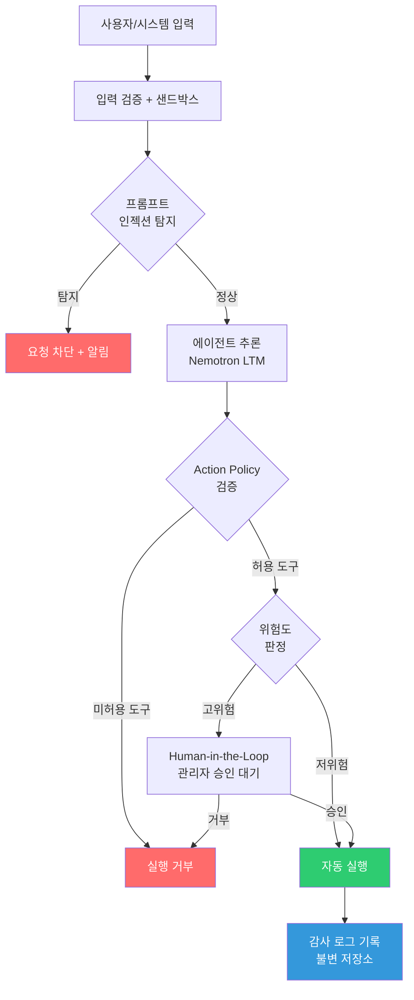

{% include ai-summary-card.html
  title='기술·보안 주간 다이제스트 (2026년 03월 01일)'
  categories_html='보안 DevSecOps'
  tags_html='Security-Weekly
      DevSecOps
      Cloud-Security
      AI-Security
      Zero-Trust
      2026'
  highlights_html='<li><strong>Gentlemen 랜섬웨어</strong>: 이중 협박 + 표적형 공격 — MITRE ATT&CK T1486/T1041 매핑 및 SIEM 탐지 쿼리 포함</li>
      <li><strong>OT 보안 위협</strong>: IT/OT 경계 붕괴로 Purdue 모델 기반 재설계 시급 — 제조 환경 스피어피싱 → PLC 장악 공격 벡터 분석</li>
      <li><strong>NVIDIA Agentic AI</strong>: 30B 파라미터 Nemotron LTM 통신 자율화 — 에이전트 권한 남용 신규 공격 표면 대두</li>
      <li><strong>AWS MCP Registry</strong>: 에이전트 도구 통합 관리 아키텍처 — AgentCore Gateway IAM 설계 패턴 실무 적용</li>'
  period='2026년 03월 01일 (24시간)'
  audience='보안 담당자, DevSecOps 엔지니어, SRE, 클라우드 아키텍트'
%}

---

## 서론

안녕하세요, **Twodragon**입니다.

2026년 03월 01일 기준, 지난 24시간 동안 발표된 주요 기술 및 보안 뉴스를 심층 분석하여 정리했습니다.

**수집 통계:**
- **총 뉴스 수**: 17개
- **보안 뉴스**: 4개
- **AI/ML 뉴스**: 2개
- **클라우드 뉴스**: 1개
- **DevOps 뉴스**: 0개
- **블록체인 뉴스**: 5개

---

## 📊 빠른 참조

### 이번 주 하이라이트

| 분야 | 소스 | 핵심 내용 | 영향도 |
|------|------|----------|--------|
| 🔒 **Security** | SK쉴더스 | 제조사 OT 보안 동향 및 Gentlemen 랜섬웨어 위협 분석 | 🟠 High |
| 🤖 **AI/ML** | NVIDIA | Agentic AI 기반 통신 자율 네트워크 + AI-RAN 상용화 실증 | 🟠 High |
| ☁️ **Cloud** | AWS Korea | Agentic AI 플랫폼: MCP Registry로 에이전트 도구 통합 관리 | 🟡 Medium |
| ⛓️ **Blockchain** | Cointelegraph | 토큰화 금, 주말 가격 발견 100% 주도 / BTC $68K 회복 | 🟡 Medium |
| 💻 **Tech** | GeekNews | AI 코딩 시대의 ‘인지 부채’ - 속도가 이해를 초과할 때 | 🟡 Medium |

---

## 1. 보안 뉴스

### 1.1 SK쉴더스 보안 리포트: OT 보안 동향 및 Gentlemen 랜섬웨어

SK쉴더스에서 발행한 최신 보안 리포트 2건입니다. 제조 분야 OT 보안과 랜섬웨어 위협을 각각 다룹니다.

#### HeadLine 12월호 - 제조사 OT 보안 동향

> 🟠 **영향도**: High — 스마트 팩토리 전환 환경의 모든 제조 기업 해당

제조업 환경의 OT(Operational Technology) 보안 위협이 증가하고 있습니다. 스마트 팩토리 전환이 가속화되면서 IT/OT 네트워크 경계가 모호해지고, 이를 노린 공격이 확산되는 추세입니다.

**IT/OT 수렴 환경의 주요 공격 벡터**

IT 네트워크와 OT 네트워크가 연결되는 지점에서 다음 경로로 침투가 이루어집니다:

1. **스피어피싱 → 엔지니어링 워크스테이션 장악**: IT 망의 EWS(Engineering Workstation)를 통해 PLC/SCADA 제어권 획득
2. **Remote Access 취약점 악용**: VPN·RDP 기반 원격 유지보수 채널을 통한 횡적 이동
3. **공급망 침투**: 장비 제조사 또는 시스템 통합(SI) 업체를 통한 공급망 공격
4. **무선 프로토콜 취약점**: Wi-Fi, Zigbee, Modbus TCP 등 OT 환경 특화 프로토콜 취약점 악용

**Purdue 모델 기반 OT 네트워크 세그멘테이션 권고**

Purdue Enterprise Reference Architecture는 IT와 OT를 5개 레벨로 분리하며, 레벨 간 엄격한 트래픽 통제가 핵심입니다:

| 레벨 | 구성 | 보안 원칙 |
|------|------|----------|
| L4/L5 (Enterprise) | ERP, 기업 IT 망 | 인터넷 노출 최소화, Zero Trust 적용 |
| L3.5 (DMZ) | IT/OT 경계 DMZ | 단방향 데이터 다이오드 권고, 허용 목록 기반 방화벽 |
| L3 (Site Operations) | MES, 이력관리 시스템 | 불필요한 포트 차단, 패치 주기 단축 |
| L2 (Control) | SCADA, DCS, HMI | 외부 연결 원천 차단, 변경 관리 강화 |
| L1/L0 (Field) | PLC, RTU, 센서 | 물리적 접근 통제, 네트워크 에어갭 유지 |

**네트워크 세그멘테이션 실무 권고사항**

- L3.5 DMZ에 **단방향 데이터 다이오드** 또는 화이트리스트 기반 방화벽 배치
- OT 자산에 대한 **OT 특화 자산 인벤토리** 수립 (Claroty, Dragos, Nozomi Networks 등 활용)
- 원격 접속은 **OT 전용 Jump Server**를 경유하도록 강제하고 세션 녹화 적용
- OT 환경의 변경 관리(Change Management)를 IT와 분리 운영

> **다운로드**: [HeadLine 12월호 비즈니스를 위한 제조사 OT 보안 동향](https://www.skshieldus.com/download/files/download.do?o_fname=HeadLine_12%EC%9B%94%ED%98%B8_%EB%B9%84%EC%A6%88%EB%8B%88%EC%8A%A4%EB%A5%BC%20%EC%9C%84%ED%95%9C%20%EC%A0%9C%EC%A1%B0%EC%82%AC%20OT%20%EB%B3%B4%EC%95%88%20%EB%8F%99%ED%96%A5.pdf&r_fname=20251222173946275.pdf)

---

#### Keep up with Ransomware 12월호 - Gentlemen 랜섬웨어 위협

> 🟠 **심각도**: High — 표적형 이중 협박 랜섬웨어, 국내 제조·의료 분야 타겟 확인

신규 랜섬웨어 그룹 **Gentlemen**의 활동이 확산되고 있습니다. 기존 광범위 스팸 방식과 달리 표적형 공격에 집중하며, 데이터 탈취 후 이중 협박(Double Extortion) 전략을 사용하는 것이 특징입니다.

**MITRE ATT&CK 전술 매핑**

| 단계 | ATT&CK ID | 기술 | Gentlemen 구현 방식 |
|------|-----------|------|---------------------|
| Initial Access | **T1566.001** | Spearphishing Attachment | 업계 특화 미끼 문서(세금계산서, 납품확인서 등) |
| Execution | **T1059.001** | PowerShell | 난독화 PowerShell 다운로더 실행 |
| Defense Evasion | **T1027** | Obfuscated Files | Base64 인코딩 + 다단계 드롭퍼 |
| Lateral Movement | **T1021.001** | Remote Desktop Protocol | 탈취한 자격증명으로 RDP 횡이동 |
| Collection | **T1005** | Data from Local System | 파일 확장자 기반 고가치 문서 선별 수집 |
| Exfiltration | **T1041** | Exfiltration Over C2 Channel | 암호화 C2 채널을 통한 데이터 외부 전송 |
| Impact | **T1486** | Data Encrypted for Impact | AES-256 + RSA-2048 이중 암호화 |

**이중 협박(Double Extortion) 공격 흐름**

1. **침투**: 스피어피싱 이메일로 초기 발판 확보 (평균 잠복 기간: 14~21일)
2. **정찰**: 내부망 스캔, AD 구조 파악, 고가치 데이터 식별
3. **탈취**: 회사 기밀, 고객 데이터, 재무 정보 외부 유출
4. **암호화**: 전사 서버 및 백업 시스템 동시 암호화
5. **협박**: 복호화 키 제공 + 탈취 데이터 비공개 조건으로 이중 몸값 요구

**SIEM 탐지 쿼리 (Splunk)**

| 탐지 단계 | Splunk 로직 | 설명 |
|----------|-----------|------|
| 프로세스 필터 | EventCode=4688, PowerShell | 프로세스 생성 이벤트에서 PowerShell 실행 추출 |
| 인코딩 탐지 | `-enc` / `-EncodedCommand` 패턴 매칭 | 난독화된 명령어 실행 탐지 |
| C2 통신 연계 | proxy 로그 JOIN, 내부 IP 제외 | 외부 C2 서버와의 통신 연결 확인 |
| 결과 | host, user, CommandLine, dest_ip | 감염 호스트/사용자/C2 IP 식별 |

**대량 파일 암호화 탐지 (랜섬웨어 조기 경보)**

| 단계 | 로직 | 설명 |
|------|------|------|
| 데이터 소스 | `EventCode=4663` (파일 접근) | 엔드포인트 파일 접근 이벤트 수집 |
| 집계 | 호스트/사용자별 1분 단위 집계 | 파일 조작 빈도 측정 |
| 임계값 | 1분간 500건 초과 시 알림 | 정상 업무 대비 비정상 대량 조작 탐지 |
| 심각도 | 2,000건 초과 CRITICAL / 500건 초과 HIGH | 암호화 속도에 따른 단계별 대응 |

**주요 IoC 패턴 (참고용)**

랜섬웨어 조직은 C2 인프라를 주기적으로 교체하므로, 정적 IoC보다 **행위 기반 탐지**가 효과적입니다:

- **파일 확장자 변경 패턴**: `.gentlemen`, `.gent` 등 신규 확장자 대량 생성 모니터링
- **볼륨 섀도 삭제**: `vssadmin delete shadows /all /quiet` 또는 WMI 기반 섀도 삭제 이벤트 (EventCode 4688)
- **백업 서비스 중지**: Windows Backup, VSS 관련 서비스 강제 중지 (EventCode 7036)
- **Tor/SOCKS 프록시 연결 시도**: 알려지지 않은 외부 443/80 포트 연결 급증

> **다운로드**: [Keep up with Ransomware 12월호 확산되는 Gentlemen 랜섬웨어 위협](https://www.skshieldus.com/download/files/download.do?o_fname=Keep%20up%20with%20Ransomware%2012%EC%9B%94%ED%98%B8%20%ED%99%95%EC%82%B0%EB%90%98%EB%8A%94%20Gentlemen%20%EB%9E%9C%EC%84%AC%EC%9B%A8%EC%96%B4%20%EC%9C%84%ED%98%91.pdf&r_fname=20251222174049086.pdf)

#### 실무 적용 포인트

- OT 네트워크 세그멘테이션 현황 점검 및 Purdue 모델 기반 IT/OT 경계 방화벽 규칙 재검토
- 위 SIEM 쿼리를 SIEM/SOAR에 등록하여 Gentlemen 랜섬웨어 행위 기반 탐지 체계 구축
- 랜섬웨어 대응 플레이북 갱신 — 이중 협박 대응 시나리오(데이터 유출 대응 포함) 추가
- 오프라인 백업 정책 검토 및 복원 테스트 정기화 (3-2-1 백업 원칙 준수)

---

## 2. AI/ML 뉴스

### 2.1 NVIDIA, Agentic AI 기반 통신 자율 네트워크 추진

#### 개요

NVIDIA가 통신 사업자를 위한 Agentic AI 자율 네트워크 솔루션을 공개했습니다. 핵심은 300억 파라미터 규모의 오픈소스 **Nemotron LTM(Large Telco Model)**으로, 통신 전문 용어와 추론 워크플로를 이해하도록 파인튜닝된 모델입니다. 통신사가 자체 데이터로 온프레미스 배포할 수 있어, AI 에이전트가 네트워크 장애 진단·트래픽 최적화 등 복잡한 의사결정을 자동화합니다.

Cassava Technologies(자율 네트워크 플랫폼), NTT DATA(트래픽 제어), Telenor(5G 강화) 등 글로벌 파트너가 이미 도입을 시작했습니다.

> **출처**: [NVIDIA AI Blog](https://blogs.nvidia.com/blog/nvidia-agentic-ai-blueprints-telco-reasoning-models/)

#### 보안 관점 심층 분석

Agentic AI가 네트워크 인프라에 자율 제어권을 가지면서 새로운 공격 표면이 형성됩니다:

| 위협 시나리오 | 설명 | 대응 방안 |
|--------------|------|-----------|
| **에이전트 권한 남용** | 과도한 도구 호출 권한으로 네트워크 설정 무단 변경 | 최소 권한 원칙(Least Privilege) + 화이트리스트 기반 Action Policy |
| **프롬프트 인젝션** | 악의적 입력으로 에이전트를 조작해 의도치 않은 트래픽 우회 실행 | 입력 검증 레이어 + 에이전트 출력 샌드박스 적용 |
| **모델 공급망 공격** | 파인튜닝된 Nemotron LTM에 백도어 삽입 | 모델 체크섬 검증 + 배포 파이프라인 서명 적용 |
| **로깅 우회** | 자율 결정 과정의 감사 추적 누락 | 모든 에이전트 액션을 불변 로그(immutable log)에 기록 |

**에이전트 도입 시 보안 아키텍처 체크포인트**

#### 실무 적용 포인트

- AI 에이전트 도구 호출 권한 및 접근 범위 최소화 설계 (Least Privilege 원칙)
- 에이전트 행동 로깅 및 감사 파이프라인 구축 — 자율 의사결정에 대한 추적성 확보
- 에이전트 출력에 대한 Human-in-the-Loop 검증 체계 설계 (고위험 네트워크 변경 작업 필수)
- 모델 파인튜닝 파이프라인의 공급망 보안 강화 — 체크섬 검증 및 배포 서명 적용

---

### 2.2 NVIDIA, 소프트웨어 정의 AI-RAN 상용화 실증 성공

#### 개요

NVIDIA와 T-Mobile, SoftBank, Indosat 등 글로벌 통신사가 **소프트웨어 정의 AI-RAN**을 실증에서 상용 배포 단계로 전환하는 데 성공했습니다. MWC에서 20건 이상의 시연을 통해, GPU 기반 소프트웨어 방식이 기존 하드웨어 의존 방식을 대체할 수 있음을 증명했습니다.

주요 성과로 SynaXG가 단일 서버에서 다중 주파수 대역 동시 처리로 **36Gbps 처리량, 10ms 미만 지연시간**을 달성했으며, DeepSig의 AI 기반 신호 처리는 기존 대비 **약 2배의 처리량** 향상을 보여줬습니다.

> **출처**: [NVIDIA AI Blog](https://blogs.nvidia.com/blog/software-defined-ai-ran/)

#### 실무 적용 포인트

- 5G/6G 인프라 관리 환경에서 AI-RAN 도입 가능성 및 보안 영향 평가
- 소프트웨어 정의 네트워크(SDN) 환경의 새로운 공격 표면 분석 필요
- 팀 내 AI-RAN 기술 동향 공유 및 도입 로드맵 논의

---

## 3. 클라우드 & 인프라 뉴스

### 3.1 AWS: Agentic AI 플랫폼 Part 2 — AgentCore Gateway와 MCP Registry 구현

#### 개요

AWS Korea Blog의 시리즈 2편으로, 2명의 Solutions Architect가 7주 만에 구축한 **Agentic AI 플랫폼**의 핵심 인프라를 다룹니다. 이번 글의 주제는 엔터프라이즈급 에이전트 시스템의 세 가지 핵심 구성요소입니다:

- **AgentCore Gateway**: AI 에이전트 요청의 진입점. API 라우팅, 부하 분산, 인증 처리를 담당
- **Identity**: 에이전트 및 사용자의 인증/인가 시스템. IAM 기반 접근 제어
- **MCP Registry**: Model Context Protocol 기반 도구·리소스 등록 및 관리. 에이전트가 사용 가능한 도구를 표준화된 프로토콜로 탐색

Amazon Bedrock의 에이전트 기능과 통합되며, Kiro, Claude Code, Linear 등 개발 도구를 활용한 AI-DLC(AI Development Life Cycle) 방법론을 적용했습니다.

> **출처**: [AWS Korea Blog](https://aws.amazon.com/ko/blogs/tech/agentic-ai-platform-part2-agentcore-gateway-identity-making-mcp-registry/)

#### 실무 적용 포인트

- MCP Registry 패턴을 참고하여 사내 AI 에이전트 도구 관리 체계 설계 검토
- AgentCore Gateway의 인증/인가 아키텍처를 자사 IAM 정책과 비교 분석
- 멀티 에이전트 환경의 보안 경계(Security Boundary) 설계 시 참고 자료로 활용

---

## 4. 블록체인 뉴스

### 4.1 토큰화 금(Tokenized Gold), 주말 가격 발견의 100%를 주도

#### 개요

PAX Gold(PAXG)와 Tether Gold(XAUt) 등 토큰화 금 자산이 CME 선물 시장이 마감되는 주말(금요일 17시~일요일 18시 ET) 동안 **사실상 100%의 가격 발견(Price Discovery)** 역할을 수행하고 있습니다. 기존 선물 참여자들이 주말에 포지션 조정이 불가능한 반면, 토큰화 금은 지정학적 이벤트 발생 시 즉각적인 리밸런싱이 가능합니다.

토큰화 금 시장 규모는 지난 1년간 $16억에서 **$44억으로 성장**했으며, 2025년 거래량은 $1,780억을 기록해 SPDR Gold Shares에 이어 두 번째로 큰 금 투자 상품이 되었습니다.

#### 보안 및 실무 함의

토큰화 금의 급성장은 기회와 함께 새로운 보안 위험을 동반합니다:

| 위험 유형 | 구체적 위험 | 대응 방안 |
|----------|------------|----------|
| **스마트 컨트랙트 취약점** | PAXG/XAUt 컨트랙트의 업그레이드 로직 악용, 관리자 키 탈취 | 정기 외부 감사(Audit) + 멀티시그 관리자 키 |
| **오라클 조작** | 금 현물가 오라클 피드 조작으로 청산 유발 | Chainlink 등 분산 오라클 + 서킷 브레이커 |
| **플래시 론 공격** | DeFi 프로토콜의 금 토큰 담보 비율 순간 조작 | Timelock 기반 대출 실행 + LTV 보수적 설정 |
| **유동성 리스크** | 주말 갑작스러운 지정학 이벤트 시 급격한 슬리피지 | 가격 괴리(basis) 모니터링 + 슬리피지 한도 설정 |

> **출처**: [Cointelegraph](https://cointelegraph.com/news/tokenized-gold-weekend-price-discovery-cme-closed?utm_source=rss_feed&utm_medium=rss&utm_campaign=rss_partner_inbound)

#### 실무 적용 포인트

- 토큰화 자산의 24/7 거래 특성을 감안한 리스크 관리 체계 재설계 필요 (주말 온콜 체계 포함)
- DeFi 프로토콜의 금 토큰 담보 활용 시 스마트 컨트랙트 감사 강화 + 멀티시그 관리 키 적용
- 전통 금융과 토큰화 자산 간 가격 괴리(basis) 모니터링 체계 구축 및 자동 알림 설정

---

### 4.2 Polymarket 거래자 6명, 미-이란 공습 예측으로 $1M 수익 — 내부자 거래 의혹

#### 개요

신규 생성된 Polymarket 지갑 6개가 테헤란 폭발 보도 수 시간 전에 미국의 이란 공습 예측 계약을 약 $0.10에 매수하여 총 **약 100만 달러의 수익**을 올렸습니다. 의심스러운 거래 타이밍으로 인해 내부자 거래 조사가 촉발되었으며, 미국 의회에서는 정부 관계자의 비공개 정보를 이용한 예측 시장 거래를 제한하는 법안을 검토 중입니다.

> **출처**: [Cointelegraph](https://cointelegraph.com/news/polymarket-traders-1m-us-iran-strike-insider-trading-concerns?utm_source=rss_feed&utm_medium=rss&utm_campaign=rss_partner_inbound)

#### 실무 적용 포인트

- 예측 시장 플랫폼의 이상 거래 탐지 시스템 설계 시 온체인 분석 통합 필요
- 비공개 정보 기반 거래 방지를 위한 규제 컴플라이언스 모니터링
- 신규 지갑 생성 패턴과 대량 매수 타이밍 상관관계 분석 자동화

---

### 4.3 비트코인, 이란 최고지도자 사망 후 $68K로 회복

#### 개요

이란 최고지도자 하메네이가 미-이스라엘 공습으로 사망한 후, 비트코인은 $63,000 저점에서 24시간 내에 **$68,200까지 $5,000 반등**했습니다. 시장은 하메네이 사망을 미-이란 긴장 완화 신호로 해석했습니다. 다만 비트코인은 2월 한 달간 약 15% 하락하여 역대 세 번째로 나쁜 2월 성적을 기록했으며, 연초 대비 약 23% 하락해 2018년 이후 최악의 1분기를 향하고 있습니다.

> **출처**: [Cointelegraph](https://cointelegraph.com/news/bitcoin-recovers-to-68k-following-reported-death-of-iranian-supreme-leader?utm_source=rss_feed&utm_medium=rss&utm_campaign=rss_partner_inbound)

#### 실무 적용 포인트

- 지정학적 이벤트에 따른 암호화폐 시장 변동성 대응 시나리오 수립
- 포트폴리오 리밸런싱 자동화 시 뉴스 기반 트리거 설계 검토
- 거시경제 이벤트와 암호화폐 가격 상관관계 분석 대시보드 구축

---

## 5. 기타 주목할 뉴스

| 제목 | 출처 | 핵심 내용 |
|------|------|----------|
| [Tech Monitor - 실시간 AI & Tech 산업 대시보드](https://tech.worldmonitor.app/?lat=20.0000&lon=0.0000&zoom=1.00&view=global&timeRange=7d&layers=cables%2Cweather%2Ceconomic%2Coutages%2Cdatacenters%2Cnatural%2CstartupHubs%2CcloudRegions%2CtechHQs%2CtechEvents) | Tech World Monitor | 글로벌 기술 기업, 클라우드 인프라, 서비스 장애, 스타트업 생태계를 실시간 지도 기반으로 통합 추적하는 대시보드 |
| [Guido van Rossum이 전하는 Python의 구술 역사](https://news.hada.io/topic?id=27107) | GeekNews | Python 창시자 Guido van Rossum이 Thomas Wouters와의 인터뷰에서 Python의 탄생 배경과 설계 철학, 언어 발전 과정을 회고 |
| [인지 부채: 속도가 이해를 초과할 때](https://news.hada.io/topic?id=27106) | GeekNews | AI 보조 코딩이 코드 생산 속도를 인간의 이해 속도보다 빠르게 만들면서 ‘인지 부채(Cognitive Debt)’가 축적됨. 코드가 동작하고 테스트를 통과하더라도 개발자가 구조와 이유를 파악하지 못하는 위험 |

---

## 6. 트렌드 분석

| 트렌드 | 관련 뉴스 수 | 주요 키워드 |
|--------|-------------|------------|
| **Agentic AI** | 3건 | 자율 네트워크, MCP Registry, AI 에이전트 플랫폼 |
| **Ransomware** | 1건 | Gentlemen 그룹, 이중 협박, OT 보안 |
| **토큰화 자산** | 3건 | 토큰화 금, 가격 발견, 예측 시장 |

이번 주기의 핵심 트렌드는 **Agentic AI**입니다. NVIDIA의 통신 자율 네트워크와 AWS의 MCP Registry 기반 에이전트 플랫폼까지, AI 에이전트가 인프라 운영에 본격 투입되는 흐름이 뚜렷합니다. 보안 관점에서는 에이전트의 권한 관리와 행동 감사가 새로운 과제로 부상하고 있습니다. **Gentlemen 랜섬웨어**의 확산도 주시해야 하며, 특히 OT 환경의 IT/OT 경계 보안이 중요합니다.

---

## 실무 체크리스트

### P0 (즉시)

- [ ] **Gentlemen 랜섬웨어 행위 기반 탐지 규칙 등록**: 본문 SIEM 쿼리(PowerShell 인코딩 탐지, 대량 파일 암호화 조기 경보)를 SIEM/SOAR에 즉시 배포
- [ ] **볼륨 섀도 삭제 시도 알림 설정**: Windows EventCode 4688 기반 `vssadmin delete shadows` 명령 탐지 규칙 활성화
- [ ] **IT/OT 경계 방화벽 규칙 긴급 검토**: 불필요한 IT→OT 인바운드 규칙 비활성화 및 허용 포트 최소화

### P1 (7일 내)

- [ ] **Purdue 모델 기반 OT 자산 인벤토리 갱신**: L0~L3 레벨별 자산 목록 최신화, 레벨 간 통신 허용 목록 검증
- [ ] **랜섬웨어 이중 협박 대응 플레이북 업데이트**: 데이터 유출 탐지 → 법무·PR 연계 → 협박 대응 시나리오 포함하여 갱신
- [ ] **AI 에이전트 Action Policy 정의**: 에이전트가 호출 가능한 도구 목록(화이트리스트)과 고위험 작업의 Human-in-the-Loop 게이트 설계
- [ ] **AWS MCP Registry 아키텍처 검토**: AgentCore Gateway의 IAM 역할 분리 및 에이전트별 최소 권한 정책 검토

### P2 (30일 내)

- [ ] **3-2-1 백업 정책 검증**: 오프라인/오프사이트 백업 복원 테스트 수행, 복원 목표 시간(RTO) 측정
- [ ] **OT 원격 접속 보안 강화**: OT 전용 Jump Server 배포 또는 세션 녹화 기능이 있는 PAM(Privileged Access Management) 솔루션 도입 검토
- [ ] **Agentic AI 도입 보안 영향평가**: 통신·제조 환경의 AI 에이전트 도입 시 프롬프트 인젝션·공급망 공격 위협 모델링 수행

---

## 참고 자료

| 리소스 | 링크 |
|--------|------|
| CISA KEV | [cisa.gov/known-exploited-vulnerabilities-catalog](https://www.cisa.gov/known-exploited-vulnerabilities-catalog) |
| MITRE ATT&CK | [attack.mitre.org](https://attack.mitre.org/) |
| FIRST EPSS | [first.org/epss](https://www.first.org/epss/) |

---

**작성자**: Twodragon
