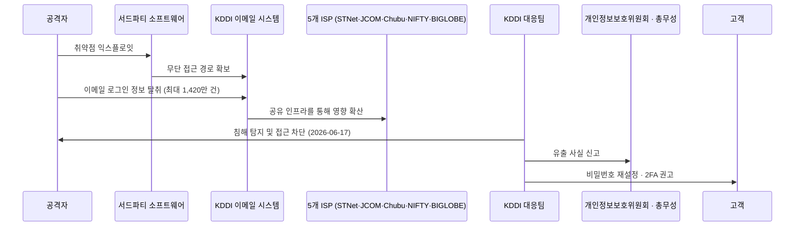



---

## 서론

안녕하세요, **Twodragon**입니다.

2026년 06월 29일 기준, 지난 24시간 동안 발표된 주요 기술 및 보안 뉴스를 심층 분석하여 정리했습니다.

**수집 통계:**
- **총 뉴스 수**: 12개
- **보안 뉴스**: 1개
- **AI/ML 뉴스**: 1개
- **블록체인 뉴스**: 5개
- **기타 뉴스**: 5개

---

## 📊 빠른 참조

### 이번 주 하이라이트

| 분류 | 핵심 이슈 | 심각도 | 출처 |
|------|----------|--------|------|
| 🔒 **Security** | 데이터 유출로 6개 ISP의 최대 1420만 개 이메일 로그인 정보 노출 | 🔴 Critical | BleepingComputer |
| 🤖 **AI/ML** | HP Inc., OpenAI와 Frontier 전략적 파트너십 체결 | 🟡 Medium | OpenAI Blog |
| ⛓️ **Blockchain** | Binance, EU에서 퇴출되고 EthLabs가 Ethereum 구원에 나서다: Hodler's Digest 6월 14-28일 | 🟡 Medium | Cointelegraph |
| ⛓️ **Blockchain** | BIS, 스테이블코인이 글로벌 금융시스템 분열 위험 경고 | 🟡 Medium | Cointelegraph |
| ⛓️ **Blockchain** | EU 감독기관 EBA, 주요 암호화폐 벌금 세부사항 공개…획기적 법안 시행 | 🟡 Medium | Cointelegraph |
| 💻 **Tech** | Show GN: 아이디어부터 앱스토어까지 — Flutter/Flame 게임 출시 하네스 (Claude Code 플러그인) | 🟡 Medium | GeekNews (긱뉴스) |
| 💻 **Tech** | AI 슬롭과 온라인 소음에 대한 최고의 답은 Robin Williams에게서 나온다 | 🟡 Medium | GeekNews (긱뉴스) |
| 💻 **Tech** | 아시아 AI 스타트업들, Anthropic Mythos 대체 모델 출시 | 🟡 Medium | GeekNews (긱뉴스) |

---

## 경영진 브리핑

- **긴급 대응 필요**: 데이터 유출로 6개 ISP의 최대 1420만 개 이메일 로그인 정보 노출 등 Critical 등급 위협 1건이 확인되었습니다.

## 위험 스코어카드

| 영역 | 현재 위험도 | 즉시 조치 |
|------|-------------|-----------|
| 위협 대응 | High | 인터넷 노출 자산 점검 및 고위험 항목 우선 패치 |
| 탐지/모니터링 | High | SIEM/EDR 경보 우선순위 및 룰 업데이트 |
| 클라우드 보안 | Medium | 클라우드 자산 구성 드리프트 점검 및 권한 검토 |
| AI/ML 보안 | Medium | AI 서비스 접근 제어 및 프롬프트 인젝션 방어 점검 |

## 1. 보안 뉴스

### 1.1 데이터 유출로 6개 ISP의 최대 1420만 개 이메일 로그인 정보 노출



# DevSecOps 실무자 관점에서 본 KDDI 데이터 유출 사고 분석

## 1. 기술적 배경 및 위협 분석

KDDI 사고는 일본 6개 ISP의 이메일 시스템이 단일 침해 지점(SPOF)으로 작용한 전형적인 공급망 공격 사례입니다. 공격자는 KDDI의 이메일 인프라에 침투하여 최대 1,420만 건의 로그인 자격증명(이메일 주소+비밀번호)을 탈취했습니다. 특히 이 시스템이 5개 ISP에 공유된 멀티테넌트 환경이었다는 점이 핵심입니다.

**위협 분석:**
- **자격증명 재사용 공격(Credential Stuffing)** 에 취약: 유출된 이메일/비밀번호 조합이 다른 서비스에서 재사용될 가능성 높음
- **이메일 기반 피싱/사회공학 공격** 증가: 공격자는 내부자처럼 위장하여 추가 침투 시도 가능
- **공급망 리스크**: KDDI의 단일 보안 취약점이 6개 ISP, 더 나아가 각 ISP의 고객 기업까지 연쇄적으로 위협

**침해 경로 (공개된 사실 기준):**

## 2. 실무 영향 분석

DevSecOps 관점에서 이 사고는 다음을 시사합니다:

- **CI/CD 파이프라인 내 자격증명 관리 실패**: 이메일 시스템이 내부 인증에 사용되었다면, 해당 자격증명이 CI/CD 시스템(예: Jenkins, GitLab)에 하드코딩되었을 가능성
- **멀티테넌트 환경의 격리 실패**: ISP 간 네트워크 분리(Network Segmentation)와 접근 제어(IAM)가 미흡했음
- **모니터링/로깅 부재**: 1,420만 건의 대규모 데이터 유출이 탐지되기까지 시간이 걸렸다면, SIEM/SOAR 체계가 미비했음
- **암호화 부재**: 저장 데이터(Data at Rest)가 평문으로 저장되었거나 취약한 암호화 사용 의심

## 3. 대응 체크리스트

- [ ] **자격증명 순환(Credential Rotation)**: 유출된 이메일 시스템과 연동된 모든 서비스 계정(API 키, 서비스 계정, 데이터베이스 비밀번호)을 즉시 변경하고, HashiCorp Vault 등 중앙 비밀 관리 도구 도입 검토
- [ ] **멀티테넌트 격리 강화**: Kubernetes 네임스페이스 또는 VPC 피어링 수준에서 테넌트별 네트워크 정책(NetworkPolicy)을 적용하고, Istio/Envoy 기반 서비스 메시로 마이크로서비스 간 인증 강화
- [ ] **이상 징후 탐지 규칙 업데이트**: SIEM에 "대량 이메일 로그인 시도", "비정상 시간대 자격증명 조회" 등의 탐지 룰을 추가하고, Falco나 Sysdig로 컨테이너 런타임 보안 강화
- [ ] **공급망 보안 평가**: 사용 중인 모든 외부 서비스(ISP, 클라우드, SaaS)에 대해 보안 설문지와 침투 테스트 보고서를 요청하고, SBOM(Software Bill of Materials) 기반 취약점 스캐닝 도입

---

## 2. AI/ML 뉴스

### 2.1 HP Inc., OpenAI와 Frontier 전략적 파트너십 체결



#### 요약

HP Inc.가 OpenAI와의 Frontier 전략적 파트너십을 확장하여 고객 경험, 소프트웨어 개발, 기업 운영 전반에 AI를 도입할 계획이다.

---

## 3. 블록체인 뉴스

### 3.1 Binance, EU에서 퇴출되고 EthLabs가 Ethereum 구원에 나서다: Hodler's Digest 6월 14-28일



#### 요약

Binance가 유럽에서 라이선스를 확보하지 못해 서비스를 중단했습니다. 한편, BitMine과 Joe Lubin이 후원하는 새로운 비영리 단체 EthLabs가 Ethereum의 채택을 촉진하기 위해 설립되었습니다.

---

### 3.2 BIS, 스테이블코인이 글로벌 금융시스템 분열 위험 경고

{% include news-card.html
  title="BIS, 스테이블코인이 글로벌 금융시스템 분열 위험 경고"
  url="https://cointelegraph.com/news/bis-warns-stablecoins-risk-fragmenting-global-financial-system?utm_source=rss_feed&utm_medium=rss&utm_campaign=rss_partner_inbound"
  image="https://s3-images.ctmedia.io/media/article-covers/hi-world-bank-initiatives-bis.jpg"
  summary="BIS는 스테이블코인이 글로벌 금융 시스템을 분열시킬 위험이 있다고 경고하며, 민간 디지털 토큰이 건전한 화폐 요건을 충족하지 못한다고 지적했습니다. 이에 BIS는 정책 입안자들에게 중앙은행 및 상업은행 화폐의 토큰화 작업을 가속화할 것을 촉구했습니다."
  source="Cointelegraph"
  severity="Medium"
%}

#### 요약

BIS는 스테이블코인이 글로벌 금융 시스템을 분열시킬 위험이 있다고 경고하며, 민간 디지털 토큰이 건전한 화폐 요건을 충족하지 못한다고 지적했습니다. 이에 BIS는 정책 입안자들에게 중앙은행 및 상업은행 화폐의 토큰화 작업을 가속화할 것을 촉구했습니다.

---

### 3.3 EU 감독기관 EBA, 주요 암호화폐 벌금 세부사항 공개…획기적 법안 시행

{% include news-card.html
  title="EU 감독기관 EBA, 주요 암호화폐 벌금 세부사항 공개…획기적 법안 시행"
  url="https://cointelegraph.com/news/eu-watchdog-eba-details-big-crypto-fines-as-landmark-laws-bite?utm_source=rss_feed&utm_medium=rss&utm_campaign=rss_partner_inbound"
  image="https://s3-images.ctmedia.io/media/article-covers/hi-patent-approve-crypto-eu-binance.png"
  summary="EU의 금융감독기관 EBA가 주요 토큰 발행자에 대해 연간 수익의 최대 12.5%까지 벌금을 부과할 수 있는 제재 체계를 제안했습니다. 이는 유럽연합의 획기적인 암호화폐 규제법이 본격적으로 시행됨에 따른 조치입니다."
  source="Cointelegraph"
  severity="Medium"
%}

#### 요약

EU의 금융감독기관 EBA가 주요 토큰 발행자에 대해 연간 수익의 최대 12.5%까지 벌금을 부과할 수 있는 제재 체계를 제안했습니다. 이는 유럽연합의 획기적인 암호화폐 규제법이 본격적으로 시행됨에 따른 조치입니다.

---

## 4. 기타 주목할 뉴스

| 제목 | 출처 | 핵심 내용 |
|------|------|----------|
| [Show GN: 아이디어부터 앱스토어까지 — Flutter/Flame 게임 출시 하네스 (Claude Code 플러그인)](https://news.hada.io/topic?id=30918) | GeekNews (긱뉴스) | Flutter/Flame 게임을 "아이디어 → 기획 → 개발 → QA → 스토어 제출"까지 끌고 가는 Claude Code 플러그인을 오픈소스로 공개합니다. Flame 게임을 직접 여러 개 만들어 스토어에 올리면서, 매번 반복하던 절차와 매번 다시 밟던 함정을 하네스로 코드화했습니다 |
| [AI 슬롭과 온라인 소음에 대한 최고의 답은 Robin Williams에게서 나온다](https://news.hada.io/topic?id=30917) | GeekNews (긱뉴스) | Good Will Hunting 의 벤치 장면은 책으로 아는 지식 과 직접 살아낸 경험의 차이를 통해 AI 슬롭·무한 조언·온라인 소음이 놓치는 것을 보여줌 AI는 인터넷을 읽었지만 상황을 읽거나 삶을 살아본 적이 없고 , 지식은 있어도 감정과 경험은 없다는 대비가 중 |
| [아시아 AI 스타트업들, Anthropic Mythos 대체 모델 출시](https://news.hada.io/topic?id=30915) | GeekNews (긱뉴스) | 미국 정부의 Mythos·Fable 5 접근 제한 이 길어지면서, 일본 Sakana AI와 중국 360이 각각 Fugu와 Tulongfeng/Yitianzhen으로 생긴 공백을 겨냥함 Sakana AI의 Fugu 는 Fable 5·Mythos Preview와 경쟁 가능한 모델로 소개되며, 여러 모델 API를 조율하는 에이전트용 |

---

## 5. 트렌드 분석

| 트렌드 | 관련 뉴스 수 | 주요 키워드 |
|--------|-------------|------------|
| **기타** | 10건 | 기타 주제 |
| **AI/ML** | 2건 | AI 슬롭과 온라인 소음에 대한 최고의 답은 Robin Williams에, 아시아 AI 스타트업들 |

이번 주기의 핵심 트렌드는 **기타**(10건)입니다. **AI/ML** 분야에서는 AI 슬롭과 온라인 소음에 대한 최고의 답은 Robin Williams에, 아시아 AI 스타트업들 관련 동향에 주목할 필요가 있습니다.

---

## 실무 체크리스트

### P0 (즉시)

- [ ] **데이터 유출로 6개 ISP의 최대 1420만 개 이메일 로그인 정보 노출** 관련 긴급 패치 및 영향도 확인

### P1 (7일 내)

- [ ] 보안 뉴스 기반 SIEM/EDR 탐지 룰 업데이트

### P2 (30일 내)

- [ ] **HP Inc., OpenAI와 Frontier 전략적 파트너십 체결** 관련 AI 보안 정책 검토
- [ ] 암호화폐/블록체인 관련 컴플라이언스 점검
## 참고 자료

| 리소스 | 링크 |
|--------|------|
| CISA KEV | [cisa.gov/known-exploited-vulnerabilities-catalog](https://www.cisa.gov/known-exploited-vulnerabilities-catalog) |
| MITRE ATT&CK | [attack.mitre.org](https://attack.mitre.org/) |
| FIRST EPSS | [first.org/epss](https://www.first.org/epss/) |

---

**작성자**: Twodragon
