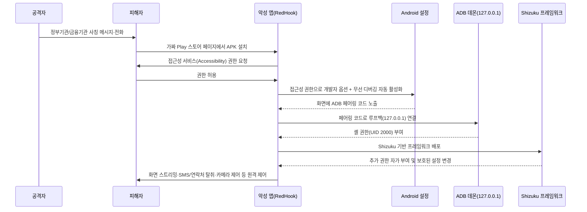



---

## 서론

안녕하세요, **Twodragon**입니다.

2026년 07월 13일 기준, 지난 24시간 동안 발표된 주요 기술 및 보안 뉴스를 심층 분석하여 정리했습니다.

**수집 통계:**
- **총 뉴스 수**: 13개
- **보안 뉴스**: 3개
- **블록체인 뉴스**: 5개
- **기타 뉴스**: 5개

---

## 📊 빠른 참조

#### 이번 주 하이라이트

| 분류 | 핵심 이슈 | 심각도 | 출처 |
|------|----------|--------|------|
| 🔒 **Security** | OpenAI, GPT-5.6 Sol 사용 제한을 일시적으로 완화 | 🟡 Medium | BleepingComputer |
| 🔒 **Security** | Claude Fable 5, 유료 사용자에게 7월 19일까지 무료 유지…Anthropic, 시간 더 벌어 | 🟡 Medium | BleepingComputer |
| 🔒 **Security** | RedHook Android 악성코드, 셸 접근을 위해 Wireless ADB 사용 | 🟠 High | BleepingComputer |
| ⛓️ **Blockchain** | Robinhood L2가 ETH 낙관론에 불을 지피고, Saylor는 '물을 흐렸다' - Hodler's Digest, 2026년 7월 5일~12일 | 🟡 Medium | Cointelegraph |
| ⛓️ **Blockchain** | Strategy의 Saylor, 투자자 설득 위해 BTC 전환 메시지에 명확성 필요: StanChart | 🟡 Medium | Cointelegraph |
| ⛓️ **Blockchain** | 파키스탄 암호화폐 책임자, 학자가 암호화폐 결제 반대 의견을 밝힌 후 대화 모색 | 🟡 Medium | Cointelegraph |
| 💻 **Tech** | [AI 해커톤 후기] AI 시대의 해커톤과 인간의 역할: AI의 계획과 사람의 전략 | 🟡 Medium | 네이버 D2 |
| 💻 **Tech** | 고객 이탈을 막는법 : 10년간 내가 배운 모든 것 | 🟡 Medium | GeekNews (긱뉴스) |
| 💻 **Tech** | Postgres 19의 프로퍼티 그래프 이해하기 | 🟡 Medium | GeekNews (긱뉴스) |

---

## 경영진 브리핑

- **주요 모니터링 대상**: RedHook Android 악성코드, 셸 접근을 위해 Wireless ADB 사용 등 High 등급 위협 1건에 대한 탐지 강화가 필요합니다.

## 위험 스코어카드

| 영역 | 현재 위험도 | 즉시 조치 |
|------|-------------|-----------|
| 위협 대응 | Medium | 인터넷 노출 자산 점검 및 고위험 항목 우선 패치 |
| 탐지/모니터링 | High | SIEM/EDR 경보 우선순위 및 룰 업데이트 |
| AI/ML 보안 | Medium | AI 서비스 접근 제어 및 프롬프트 인젝션 방어 점검 |

## 1. 보안 뉴스

### 1.1 OpenAI, GPT-5.6 Sol 사용 제한을 일시적으로 완화



#### DevSecOps 관점에서 본 OpenAI GPT-5.6 Sol 사용량 제한 완화 분석

#### 기술적 배경 및 위협 분석

OpenAI가 GPT-5.6 Sol의 사용량 제한을 일시적으로 완화한 것은, 대규모 언어 모델(LLM) 수요 폭증에 따른 **인프라 확장성 문제**와 **서비스 안정성 간 트레이드오프**를 시사합니다. DevSecOps 관점에서 주요 위협은 다음과 같습니다:

- **API Rate Limit 변동성**: 갑작스러운 제한 완화로 인해 기존에 설정된 자동화 파이프라인(CI/CD, 보안 스캐닝 등)의 API 호출 패턴이 예상치 못한 속도로 증가, **서비스 거부(DoS) 유사 현상** 또는 비용 폭증 유발 가능
- **데이터 유출 위험 증가**: LLM 사용량 증가로 민감 코드/데이터가 모델 학습에 포함될 위험(OpenAI API 정책상 데이터 사용 옵션 확인 필요)
- **모델 행동 불확실성**: 제한 완화로 인해 갑자기 많은 요청이 처리되면서 모델 응답의 일관성 저하나 **프롬프트 인젝션** 공격 성공률이 높아질 수 있음

#### 실무 영향 분석

DevSecOps 실무자에게 가장 직접적인 영향은 **CI/CD 파이프라인 내 LLM 통합 지점**입니다:

- **코드 리뷰 자동화**: GPT-5.6 Sol을 코드 리뷰/취약점 분석에 사용 중이라면, 제한 완화로 인해 처리량은 증가하지만 응답 품질이 일시적으로 저하될 수 있어 **결과 검증 프로세스 강화** 필요
- **비용 관리**: 사용량 제한 완화는 예산 초과 위험을 수반하므로, **비용 임계치 알람** 및 **사용량 쿼터 자동 차단** 로직 사전 설정 필수
- **규정 준수**: 금융/의료 등 규제 산업에서는 일시적 정책 변경이 내부 보안 정책과 충돌할 수 있으므로, **변경 사항 모니터링** 및 **사용 승인 프로세스** 재검토 필요

---

### 1.2 Claude Fable 5, 유료 사용자에게 7월 19일까지 무료 유지…Anthropic, 시간 더 벌어



#### DevSecOps 실무자 관점에서 본 Claude Fable 5 접근 연장 분석

#### 기술적 배경 및 위협 분석

Anthropic이 Claude Fable 5(가칭)의 유료 사용자 접근을 7월 19일까지 연장한 것은, AI 모델의 안정화 및 보안 패치를 위한 시간 확보로 해석된다. DevSecOps 관점에서 주요 위협은 다음과 같다:

- **모델 탈옥(Jailbreaking) 위험**: 고성능 모델일수록 프롬프트 인젝션, 탈옥 공격에 취약할 가능성이 높아짐. 연장 기간 동안 Anthropic이 보안 경계를 강화 중일 수 있음.
- **데이터 유출 리스크**: 유료 사용자가 Claude Fable 5를 통해 민감 코드나 내부 데이터를 처리할 경우, 모델의 학습 데이터에 포함되거나 API 로그를 통해 유출될 위험이 존재.
- **의존성 증가**: 특정 AI 모델에 과도하게 의존하는 CI/CD 파이프라인 구축 시, 모델 접근이 중단되면 빌드/배포 프로세스에 장애 발생 가능.

#### 실무 영향 분석

- **CI/CD 파이프라인 내 AI 통합 지연**: 팀이 Claude Fable 5를 코드 리뷰, 취약점 분석, 문서 생성에 활용 중이라면, 7월 19일 이후 접근 제한 시 대체 모델(Claude 4, GPT-4 등)로 전환해야 함.
- **보안 정책 재수립 필요**: AI 모델 사용에 대한 접근 제어(API 키 관리, 사용량 모니터링, 데이터 마스킹)를 강화해야 하는 시점.
- **비용-보안 트레이드오프**: 무료 사용 기간 연장은 비용 절감이지만, 보안 패치가 완료되지 않은 모델을 계속 사용하는 위험을 감수해야 함.

---

### 1.3 RedHook Android 악성코드, 셸 접근을 위해 Wireless ADB 사용



#### RedHook Android Malware의 Wireless ADB 악용 분석 (DevSecOps 관점)

#### 기술적 배경 및 위협 분석

RedHook 악성코드는 Android Wireless Debugging (Wireless ADB) 메커니즘을 악용하여 컴퓨터 연결 없이 셸 수준의 권한을 획득합니다. Wireless ADB는 Android 11부터 도입된 기능으로, 개발자가 USB 케이블 없이 TCP/IP를 통해 디버깅을 수행할 수 있도록 합니다. 기본적으로 5555번 포트를 사용하며, ADB 인증이 필요하지만, RedHook은 다음과 같은 방식으로 우회합니다:

- **접근성 서비스 권한 악용**: 사용자가 정부기관·금융기관을 사칭한 메시지에 속아 가짜 Play 스토어 페이지에서 악성 APK를 설치하면, 해당 앱이 Accessibility Service(접근성) 권한을 요청·획득하여 개발자 옵션과 무선 디버깅(Wireless Debugging)을 사용자 개입 없이 자동으로 활성화합니다.
- **루프백 인터페이스를 통한 ADB 페어링**: 별도의 네트워크 스캔이나 무차별 대입 공격 없이, 화면에 표시된 ADB 페어링 코드를 직접 탈취해 로컬 루프백(127.0.0.1)으로 스스로 페어링·연결합니다.
- **Shizuku 프레임워크를 통한 권한 확장 및 지속성 확보**: 셸(UID 2000) 권한을 획득한 뒤 Shizuku 기반 프레임워크를 배포해 추가 권한을 자가 부여하고 보호된 설정을 변조하며, 무음 오디오 재생·WakeLock·워치독 알람·부팅 지속성 등으로 재부팅 후에도 상주합니다.

이는 기존의 USB ADB 기반 공격과 달리, 물리적 접촉 없이도 원격에서 디바이스 전체를 제어할 수 있다는 점에서 위험도가 높습니다. 특히 기업용 MDM(모바일 디바이스 관리) 환경에서 Wireless ADB가 활성화된 기기를 표적으로 삼을 가능성이 큽니다.

#### 공격 흐름 (Wireless ADB 셸 접근 체인)

#### 실무 영향 분석

DevSecOps 실무자 관점에서 이 위협은 다음과 같은 영향을 미칩니다:

- **CI/CD 파이프라인 위험**: 모바일 앱 빌드/테스트 환경에서 Wireless ADB가 활성화된 에뮬레이터 또는 실제 디바이스가 사용될 경우, RedHook이 파이프라인에 침투하여 소스 코드, API 키, 인증서를 유출할 수 있습니다.
- **사내 디바이스 관리 취약점**: 개발자나 QA 팀이 Wireless ADB를 상시 활성화한 상태로 업무용 디바이스를 사용하면, 동일 네트워크 상의 다른 기기로 전파될 위험이 있습니다.
- **규정 준수 위반**: GDPR, HIPAA 등 규제 대상 데이터(예: 의료 앱의 환자 정보)가 포함된 디바이스가 감염되면, 데이터 유출로 인한 법적 책임이 발생할 수 있습니다.
- **모니터링 사각지대**: Wireless ADB 연결은 일반적인 네트워크 트래픽과 구분이 어려워, 기존 보안 솔루션(EDR, NDR)이 탐지하지 못할 가능성이 있습니다.

---

## 2. 블록체인 뉴스

### 2.1 Robinhood L2가 ETH 낙관론에 불을 지피고, Saylor는 '물을 흐렸다' - Hodler's Digest, 2026년 7월 5일~12일

{% include news-card.html
  title="Robinhood L2가 ETH 낙관론에 불을 지피고, Saylor는 '물을 흐렸다' - Hodler's Digest, 2026년 7월 5일~12일"
  url="https://cointelegraph.com/features/ethereum-climbs-as-robinhood-l2-takes-off?utm_source=rss_feed&utm_medium=rss&utm_campaign=rss_partner_inbound"
  image="https://s3-images.ctmedia.io/media/article-covers/11-july.jpg"
  summary="Robinhood의 L2 체인 출시가 ETH에 긍정적이라는 전망이 나온 가운데, Michael Saylor의 발언이 논란을 불러일으켰습니다. 또한 Nigel Farage와 Donald Trump가 암호화폐 관련 스캔들에 연루되었습니다."
  source="Cointelegraph"
  severity="Medium"
%}

#### 요약

Robinhood의 L2 체인 출시가 ETH에 긍정적이라는 전망이 나온 가운데, Michael Saylor의 발언이 논란을 불러일으켰습니다. 또한 Nigel Farage와 Donald Trump가 암호화폐 관련 스캔들에 연루되었습니다.

---

### 2.2 Strategy의 Saylor, 투자자 설득 위해 BTC 전환 메시지에 명확성 필요: StanChart

{% include news-card.html
  title="Strategy의 Saylor, 투자자 설득 위해 BTC 전환 메시지에 명확성 필요: StanChart"
  url="https://cointelegraph.com/news/strategys-saylor-needs-clarity-in-btc-pivot-message-to-convince-investors-stanchart?utm_source=rss_feed&utm_medium=rss&utm_campaign=rss_partner_inbound"
  image="https://s3-images.ctmedia.io/media/article-covers/michael-saylors-big-bet-institutional-investments-role-in-bitcoins-price.png"
  summary="Standard Chartered는 Strategy의 Michael Saylor CEO가 Bitcoin 전환 메시지에서 명확성을 보여야 투자자들을 설득할 수 있다고 지적했습니다. 이 은행은 최대 디지털 자산 재무 회사인 Strategy의 커뮤니케이션 문제가 단기적으로 Bitcoin에 대한 혼란을 야기하고 있다고 평가했습니다."
  source="Cointelegraph"
  severity="Medium"
%}

#### 요약

Standard Chartered는 Strategy의 Michael Saylor CEO가 Bitcoin 전환 메시지에서 명확성을 보여야 투자자들을 설득할 수 있다고 지적했습니다. 이 은행은 최대 디지털 자산 재무 회사인 Strategy의 커뮤니케이션 문제가 단기적으로 Bitcoin에 대한 혼란을 야기하고 있다고 평가했습니다.

---

### 2.3 파키스탄 암호화폐 책임자, 학자가 암호화폐 결제 반대 의견을 밝힌 후 대화 모색



#### 요약

파키스탄 가상자산 규제기관이 암호화폐 결제를 금지하는 이슬람 학자의 판결 이후 디지털 자산 처리에 대한 지속적인 대화를 촉구했습니다.

---

## 3. 기타 주목할 뉴스

| 제목 | 출처 | 핵심 내용 |
|------|------|----------|
| [[AI 해커톤 후기] AI 시대의 해커톤과 인간의 역할: AI의 계획과 사람의 전략](https://d2.naver.com/helloworld/1883072) | 네이버 D2 | 모두가 같은 주제로, 같은 수준의 AI 도구를 들고 시작한 해커톤. 그런데 결과물은 팀마다 전혀 달랐습니다 |
| [고객 이탈을 막는법 : 10년간 내가 배운 모든 것](https://news.hada.io/topic?id=31384) | GeekNews (긱뉴스) | 구독 비즈니스의 고객 이탈률(churn) 은 제품 품질만이 아니라 시장·고객군·사용 빈도에 크게 좌우되며, 오래 남는 고객을 찾아 그들에게 맞춰 제품을 만들고 같은 유형을 더 확보해야 함 월 이탈률이 8%를 넘으면 규모 확장이 어려워지고 , 10%라면 매년 사용자 기 |
| [Postgres 19의 프로퍼티 그래프 이해하기](https://news.hada.io/topic?id=31383) | GeekNews (긱뉴스) | Postgres 19의 프로퍼티 그래프 는 기존 테이블을 정점과 간선으로 선언하고 MATCH 로 고정된 관계 패턴을 검색하는 SQL/PGQ 기능으로, 데이터를 복사하거나 별도 그래프 실행 엔진을 만들지 않음 그래프 패턴은 관계형 조인으로 컴파일 되어 기존 옵티마 |

---

## 4. 트렌드 분석

| 트렌드 | 관련 뉴스 수 | 주요 키워드 |
|--------|-------------|------------|
| **기타** | 10건 | 기타 주제 |
| **AI/ML** | 3건 | BleepingComputer 관련 동향, AI 시대의 해커톤과 인간의 역할, AI 토큰은 데이터센터를 어떻게 여행하는가 |

이번 주기의 핵심 트렌드는 **기타**(10건)입니다. **AI/ML** 분야에서는 BleepingComputer 관련 동향, AI 시대의 해커톤과 인간의 역할 관련 동향에 주목할 필요가 있습니다.

---

## 실무 체크리스트

### P0 (즉시)

- [ ] **OpenAI, GPT-5.6 Sol 사용 제한을 일시적으로 완화** 관련 보안 영향도 분석 및 모니터링 강화

### P1 (7일 내)

- [ ] **RedHook Android 악성코드, 셸 접근을 위해 Wireless ADB 사용** 관련 보안 검토 및 모니터링

### P2 (30일 내)

- [ ] 암호화폐/블록체인 관련 컴플라이언스 점검
## 참고 자료

| 리소스 | 링크 |
|--------|------|
| CISA KEV | [cisa.gov/known-exploited-vulnerabilities-catalog](https://www.cisa.gov/known-exploited-vulnerabilities-catalog) |
| MITRE ATT&CK | [attack.mitre.org](https://attack.mitre.org/) |
| FIRST EPSS | [first.org/epss](https://www.first.org/epss/) |

---

**작성자**: Twodragon
