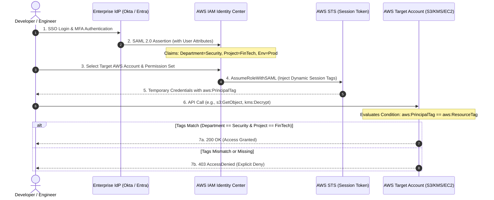



---

## 1. 개요: 역할 폭발(Role Explosion)과 전통적 RBAC의 한계

엔터프라이즈 규모의 클라우드 환경이 수십~수백 개의 AWS 계정(Multi-Account)과 수천 명의 엔지니어로 확장될 때, 가장 먼저 직면하는 보안 및 운영 병목은 **역할 폭발(Role Explosion)**입니다.

전통적인 **역할 기반 접근 제어(RBAC)** 방식에서는 다음과 같은 심각한 문제가 발생합니다:
1. **역할 및 정책의 기하급수적 증가**: 새로운 프로젝트나 팀이 생성될 때마다 `ProjectA-Dev-DeveloperRole`, `ProjectB-Prod-AdminRole` 등 계정마다 수많은 IAM 역할을 수동 생성하고 관리해야 합니다.
2. **권한 상승(Privilege Escalation) 위험**: 역할 수가 과도하게 늘어나면 사용하지 않는 레거시 역할이 방치되고, 권한 리뷰와 최소 권한(Least Privilege) 검증이 불가능해집니다.
3. **온보딩/오프보딩 지연**: 개발자가 프로젝트를 이동하거나 새로운 리소스에 접근할 때마다 IAM 정책 업데이트 티켓을 발행해야 하므로 배포 민첩성이 저하됩니다.

이러한 문제를 근본적으로 해결하는 표준 엔터프라이즈 아키텍처가 바로 **AWS IAM Identity Center(구 AWS SSO)**와 **속성 기반 접근 제어(ABAC: Attribute-Based Access Control)**의 결합입니다.

사용자의 신원 속성(부서, 프로젝트, 환경 등)을 **동적 세션 태그(`aws:PrincipalTag`)**로 전달하고, AWS 리소스에 부여된 태그(`aws:ResourceTag`)와 일치할 때만 접근을 허용하는 단일 범용 정책을 배포함으로써 수백 개의 정적 역할을 단 하나로 통합할 수 있습니다.

---

## 2. 엔터프라이즈 제로 트러스트 아키텍처 및 인증 흐름

외부 IdP(Okta, Microsoft Entra ID 등)에서 인증된 사용자의 속성이 AWS 계정 리소스까지 전달되어 평가되는 엔드투엔드 시퀀스입니다.



---

## 3. 핵심 거버넌스 정책 레시피 (Production Policy Recipes)

### 레시피 1: IAM Identity Center 세션 태그 기반 범용 ABAC 정책

IAM Identity Center의 **Permission Set**에 단 한 번만 등록하여 모든 계정의 데이터 및 암호화 키에 적용하는 단일 범용 정책입니다.

```json
// https://docs.aws.amazon.com/IAM/latest/UserGuide/reference_policies_elements_condition.html
{
  "Version": "2012-10-17",
  "Statement": [
    {
      "Sid": "AllowResourceAccessIfTagsMatch",
      "Effect": "Allow",
      "Action": ["s3:GetObject", "s3:PutObject", "secretsmanager:GetSecretValue", "kms:Decrypt"],
      "Resource": "*",
      "Condition": {
        "StringEquals": {
          "aws:ResourceTag/Department": "${aws:PrincipalTag/Department}",
          "aws:ResourceTag/Project": "${aws:PrincipalTag/Project}",
          "aws:ResourceTag/Environment": "${aws:PrincipalTag/Environment}"
        }
      }
    }
  ]
}
```

### 레시피 2: AWS Organizations SCP를 통한 리소스 태그 변조 방지 가드레일

개발자가 임의로 프로덕션 리소스의 태그를 변경하여 접근 통제를 우회하는 것을 원천 차단하는 **서비스 제어 정책(SCP)**입니다.

```json
// https://docs.aws.amazon.com/organizations/latest/userguide/orgs_manage_policies_scps_examples.html
{
  "Version": "2012-10-17",
  "Statement": [
    {
      "Sid": "DenyModifyingGovernanceTags",
      "Effect": "Deny",
      "Action": ["tag:UntagResources", "tag:TagResources", "s3:PutBucketTagging"],
      "Resource": "*",
      "Condition": {
        "ForAnyValue:StringEquals": {
          "aws:TagKeys": ["Department", "Project", "Environment", "DataClassification"]
        },
        "ArnNotLike": {
          "aws:PrincipalARN": ["arn:aws:iam::*:role/AWSControlTowerExecution"]
        }
      }
    }
  ]
}
```

### 레시피 3: Permission Boundary를 활용한 개발팀 권한 상승 차단

개발자가 CI/CD 파이프라인이나 Lambda 실행용 IAM 역할을 생성할 때, 관리자 권한(`AdministratorAccess`)을 부여하는 것을 방지하고 반드시 사내 보안 경계선(Boundary)을 첨부하도록 강제합니다.

```json
{
  "Version": "2012-10-17",
  "Statement": [
    {
      "Sid": "RequirePermissionBoundaryOnRoleCreation",
      "Effect": "Deny",
      "Action": [
        "iam:CreateRole",
        "iam:PutRolePermissionsBoundary"
      ],
      "Resource": "*",
      "Condition": {
        "StringNotEquals": {
          "iam:PermissionsBoundary": "arn:aws:iam::*:policy/EnterpriseDevSecOpsBoundary"
        }
      }
    }
  ]
}
```

---

## 4. 아키텍처 비교 분석: RBAC vs ABAC

| 비교 기준 | 전통적인 역할 기반 접근 제어 (RBAC) | 속성 기반 접근 제어 (ABAC) |
|---|---|---|
| **역할 관리 수** | 팀/프로젝트/환경마다 신규 생성 (수백~수천 개) | **단일 범용 역할/Permission Set 유지 (1~3개)** |
| **신규 프로젝트 온보딩** | IAM 정책 수정 및 배포 티켓 필수 (수일 소요) | **리소스에 태그만 부여하면 즉시 적용 (0초)** |
| **운영 복잡도** | 레거시 역할 누적 및 권한 폭발(Role Explosion) | **중앙 집중식 신원 속성 관리로 매우 단순** |
| **최소 권한 준수도** | 와일드카드(`*`) 남용 위험 높음 | **동적 태그 일치 조건으로 정밀 통제** |
| **감사 용이성** | 수많은 역할 추적으로 인한 감사 난이도 증가 | **CloudTrail에 사용자 신원 태그가 자동 기록됨** |

---

## 5. CloudTrail Lake를 활용한 실시간 권한 및 이상 행위 감사

ABAC 환경에서는 CloudTrail Lake의 이벤트 데이터 스토어를 통해 사용자의 신원 속성과 리소스 태그 간의 불일치로 발생한 접근 거부(`AccessDenied`) 이벤트를 SQL로 즉시 분석할 수 있습니다.

```sql
SELECT
    eventTime,
    userIdentity.sessionContext.sessionIssuer.userName AS AssumedRole,
    userIdentity.principalId AS PrincipalUser,
    recipientAccountId AS AWSAccount,
    eventName AS AttemptedAction,
    errorCode,
    errorMessage
FROM
    "12345678-abcd-1234-abcd-123456789012"
WHERE
    errorCode = 'AccessDenied'
    AND eventTime >= '2026-08-30 00:00:00'
ORDER BY
    eventTime DESC
LIMIT 50;
```

---

## 6. 실무 적용 및 운영 체크리스트 (Actionable Checklist)

- [ ] **IdP 속성 동기화**: SCIM 또는 SAML 어설션을 통해 `Department`, `Project`, `Environment` 속성이 IAM Identity Center로 정확히 전달되는지 검증합니다.
- [ ] **세션 태그 활성화**: IAM Identity Center의 **Attributes for access control** 설정에서 `PrincipalTag` 매핑을 활성화합니다.
- [ ] **표준 태그 정책(Tag Policy) 강제**: AWS Organizations Tag Policy를 배포하여 리소스 생성 시 필수 거버넌스 태그 누락을 차단합니다.
- [ ] **SCP 태그 변조 방지 배포**: 운영 계정에 SCP를 적용하여 승인된 자동화 파이프라인 외에는 거버넌스 태그를 수정할 수 없도록 격리합니다.
- [ ] **Permission Boundary 적용**: 개발팀에게 IAM 역할 생성 권한을 위임할 때 사내 권한 경계선을 필수로 강제합니다.
- [ ] **CloudTrail Lake 쿼리 자동화**: 주간 `AccessDenied` 급증 및 태그 불일치 접근 시도를 자동 집계하여 알림을 구성합니다.
