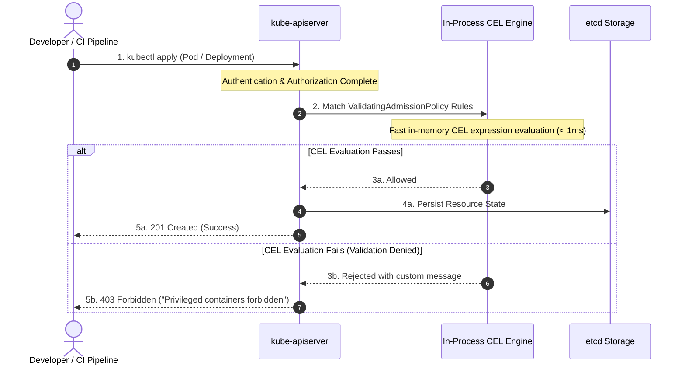



---

## Executive Summary

- **배경 및 과제**: Kubernetes 클러스터 보안 정책 강제를 위해 사용되던 기존 동적 웹훅(OPA Gatekeeper, Kyverno)은 외부 Pod 네트워크 통신 왕복으로 인한 지연(Latency)과 웹훅 장애 시 클러스터 전체가 멈추는 단일 장애점(SPOF) 문제를 안고 있었습니다.
- **핵심 아키텍처 전략**: Kubernetes v1.30 GA로 정식 표준화된 `ValidatingAdmissionPolicy(VAP)`와 Google의 초경량 표현식 언어인 CEL(Common Expression Language)을 도입하여, `kube-apiserver` 메모리 내부에서 1ms 미만의 속도로 리소스를 직접 검증합니다.
- **도입 기대 효과**: 외부 웹훅 컨트롤러 관리 부담 및 mTLS 인증서 갱신 리스크를 100% 제거하고, 특권 컨테이너(`privileged`) 차단 및 승인된 레지스트리 강제 거버넌스를 완벽히 구현합니다.

---

## 위험 스코어카드 (Threat & Risk Scorecard)

| 위협 카테고리 | 위험도 수준 | 영향도(Impact) | 발생 가능성 | 주요 완화 전략 |
|---|---|---|---|---|
| **웹훅 SPOF로 인한 클러스터 마비** | **Critical (치명적)** | 전체 네임스페이스 리소스 생성/배포 중단 | 중간 (Medium) | In-Process 내장 VAP로 전환하여 외부 통신 의존성 제거 |
| **특권 컨테이너 탈옥 (Escape)** | **Critical (치명적)** | 노드 호스트 루트 권한 탈취 및 침해 확산 | 높음 (High) | `hostPID`, `hostNetwork`, `privileged: true` 차단 CEL 강제 |
| **비인가 레지스트리 공급망 오염** | **High (높음)** | 백도어 포함 퍼블릭 이미지 배포 | 높음 (High) | 사내 ECR/GCR 레지스트리 URL 및 태그 불변성 검증 |
| **루트 파일시스템 쓰기 기반 지속성** | **Medium (중간)** | 악성 스크립트 다운로드 및 메모리 상주 | 높음 (High) | `readOnlyRootFilesystem: true` 및 임시 디렉터리 제한 |
| **웹훅 인증서 만료 인시던트** | **High (높음)** | cert-manager 갱신 실패 시 전사 장애 | 중간 (Medium) | 쿠버네티스 네이티브 API 객체 활용으로 mTLS 오버헤드 제거 |

---

## 1. 개요: 웹훅 없는 내장 어드미션 컨트롤의 시대

### 1.1 동적 어드미션 웹훅의 구조적 한계
Kubernetes 클러스터에서 보안 거버넌스와 리소스 검증을 구현할 때 오랫동안 표준으로 사용되던 방식은 **동적 어드미션 웹훅(Dynamic Admission Webhooks)**이었습니다. OPA Gatekeeper나 Kyverno와 같은 서드파티 컨트롤러는 뛰어난 정책 표현력을 제공했지만, 실제 프로덕션 환경에서는 다음과 같은 운영상의 치명적인 약점들을 안고 있었습니다:

1. **네트워크 지연 및 리소스 오버헤드**: 모든 API 요청이 외부 웹훅 Pod로 왕복(Roundtrip) 통신을 거쳐야 하므로 API 서버 처리 속도가 저하됩니다.
2. **단일 장애점(SPOF) 위험**: 웹훅 Pod가 OOMKilled되거나 네트워크 파티션이 발생할 경우, `failurePolicy: Fail` 설정으로 인해 클러스터 전체 리소스 생성이 마비되는 장애가 빈번히 발생했습니다.
3. **TLS 인증서 수명 주기 관리 부담**: API 서버와 웹훅 간의 mTLS 인증서 자동 갱신(cert-manager 등) 실패로 인한 인시던트가 빈번했습니다.

### 1.2 In-Tree CEL 기반 VAP(ValidatingAdmissionPolicy)의 탄생
이러한 문제를 해결하기 위해 Kubernetes v1.26에서 알파로 도입되고 **v1.30에서 정식 일반 제공(GA)**된 기능이 바로 **ValidatingAdmissionPolicy (VAP)**입니다.

Google이 개발한 선언적 평가 엔진인 **Common Expression Language(CEL)**를 `kube-apiserver` 바이너리 내부에 직접 내장함으로써, 외부 웹훅 없이 메모리 내부에서 1ms 미만의 지연 시간으로 강력한 보안 가드레일을 강제할 수 있게 되었습니다.

---

## 2. 아키텍처 및 동작 원리



### 2.1 VAP의 핵심 리소스 분리
`ValidatingAdmissionPolicy`는 두 가지 핵심 리소스로 구성됩니다:
- **`ValidatingAdmissionPolicy`**: 어떤 리소스를 대상으로 어떤 CEL 규칙을 검증할지 선언하는 **정책 정의(Definition)**.
- **`ValidatingAdmissionPolicyBinding`**: 정의된 정책을 특정 네임스페이스, 환경, 사용자에게 매핑하고 위반 시 동작(Deny/Warn/Audit)을 지정하는 **바인딩(Binding)**.

### 2.2 CEL 정책의 주요 내장 변수
CEL 평가 시 `kube-apiserver`가 제공하는 컨텍스트 변수는 다음과 같습니다:
- `object`: 생성/수정 요청된 최신 리소스 객체 (v1.Pod 등)
- `oldObject`: 수정(UPDATE) 시점의 기존 리소스 객체 (삭제/생성 시 null)
- `request`: 사용자, 네임스페이스, 작업 유형(CREATE/UPDATE) 등의 메타데이터
- `params`: 정책 바인딩과 연동된 파라미터 리소스 객체

---

## 3. 실무 핵심 보안 정책 레시피 (Production Policy Recipes)

### 3.1 레시피 1: 특권 컨테이너(Privileged) 및 호스트 네임스페이스 차단
컨테이너 탈옥(Container Escape)의 가장 대표적인 통로인 `privileged: true`, `hostPID`, `hostNetwork`를 원천 차단하는 정책 정의입니다.

```yaml
# https://kubernetes.io/docs/reference/access-authn-authz/validating-admission-policy/
apiVersion: admissionregistration.k8s.io/v1
kind: ValidatingAdmissionPolicy
metadata:
  name: "disallow-privileged"
spec:
  failurePolicy: Fail
  matchConstraints:
    resourceRules:
      - apiGroups: [""]
        apiVersions: ["v1"]
        operations: ["CREATE", "UPDATE"]
        resources: ["pods"]
  validations:
    - expression: "!has(object.spec.hostNetwork) || object.spec.hostNetwork == false"
      message: "hostNetwork access is prohibited."
```

### 3.2 레시피 2: 사내 승인된 프라이빗 레지스트리 강제
외부 퍼블릭 레지스트리 이미지의 직접 다운로드를 막고 사내 보안 검증을 통과한 ECR/GCR 레지스트리만 허용합니다.

```yaml
# https://kubernetes.io/docs/reference/access-authn-authz/validating-admission-policy/
apiVersion: admissionregistration.k8s.io/v1
kind: ValidatingAdmissionPolicy
metadata:
  name: "enforce-trusted-registry"
spec:
  failurePolicy: Fail
  matchConstraints:
    resourceRules:
      - apiGroups: [""]
        apiVersions: ["v1"]
        operations: ["CREATE", "UPDATE"]
        resources: ["pods"]
  validations:
    - expression: "object.spec.containers.all(c, c.image.startsWith('123456789012.dkr.ecr.ap-northeast-2.amazonaws.com/'))"
      message: "Untrusted registry is prohibited."
```

### 3.3 레시피 3: 정책 바인딩(Binding) 및 단계적 배포 (Warn -> Deny)
갑작스러운 차단으로 인한 장애를 방지하기 위해 먼저 경고(Warn) 모드로 운영한 후 차단(Deny)으로 승격합니다.

```yaml
# https://kubernetes.io/docs/reference/access-authn-authz/validating-admission-policy/
apiVersion: admissionregistration.k8s.io/v1
kind: ValidatingAdmissionPolicyBinding
metadata:
  name: "enforce-trusted-registry-binding"
spec:
  policyName: "enforce-trusted-registry"
  validationActions: [Warn, Audit]
  matchResources:
    namespaceSelector:
      matchLabels:
        environment: "production"
```

---

## 4. 어드미션 제어 기술 비교: Webhook vs Kyverno vs VAP

### 4.1 3대 어드미션 기술 종합 비교

| 비교 항목 | OPA Gatekeeper (Webhook) | Kyverno (Webhook) | Kubernetes VAP (In-Tree CEL) | 엔터프라이즈 권장 |
|---|---|---|---|---|
| **실행 위치** | 외부 웹훅 파드 (Out-of-Process) | 외부 웹훅 파드 (Out-of-Process) | **kube-apiserver 내부 (In-Process)** | VAP 기본 채택 |
| **평가 지연시간** | 10ms ~ 50ms (네트워크 왕복) | 5ms ~ 30ms (네트워크 왕복) | **< 1ms (메모리 직접 실행)** | VAP 압도적 우위 |
| **단일장애점(SPOF)** | 파드 다운 시 클러스터 마비 위험 | 파드 다운 시 클러스터 마비 위험 | **SPOF 위험 전무 (API Server와 수명 일치)** | VAP 무장애 달성 |
| **TLS 인증서 관리** | 필수 (cert-manager 의존) | 필수 (자체 관리 또는 cert-manager) | **불필요 (외부 통신 없음)** | VAP 유지보수 제로 |
| **정책 언어** | Rego (학습 곡선 높음) | YAML 기반 DSL (선언적) | **CEL (초경량 구문, 빠른 습득)** | CEL 표준화 권장 |
| **변이(Mutation) 지원** | 지원 (MutatingWebhook) | 지원 (MutatingWebhook/Generate) | 미지원 (v1.32+ MutatingAdmissionPolicy 진행 중)| 복잡 변이는 Kyverno 보완 |

### 4.2 인프로세스 VAP로 마이그레이션 가이드
1. **단순 검증 규칙**: Kyverno/Gatekeeper의 파드 보안 표준(PSS) 규칙을 VAP로 1:1 마이그레이션.
2. **복잡한 외부 데이터 조회**: 외부 DB 조회가 필요한 극소수 정책만 웹훅으로 격리 유지.
3. **단계적 전환**: `validationActions: [Warn]`으로 배포하여 모니터링 후 `Deny`로 점진적 전환.

---

## 5. 프로덕션 운영 체크리스트 (Actionable Checklist)

### 5.1 정책 구현 및 검증 체크리스트
- [ ] **Kubernetes 버전 점검**: 클러스터가 v1.30 이상인지 확인 (`kubectl version`).
- [ ] **VAP 피처 게이트 확인**: v1.30+ 기본 활성화 확인 (`ValidatingAdmissionPolicy=true`).
- [ ] **기본 보안 정책 세트 정의**: 특권 파드 차단, HostPath 볼륨 금지, 불변 태그 강제 정책 작성.
- [ ] **단계적 바인딩 전략 수립**: 개발 환경은 `Audit/Warn`, 운영 환경은 `Deny` 단계적 구성.
- [ ] **API 서버 메트릭 모니터링**: `apiserver_admission_policy_admission_duration_seconds` 대시보드 연동.

### 5.2 지속적 거버넌스 및 감사 파이프라인
CI 파이프라인(`kubeconform`, `cel-evaluator`)에 CEL 정적 검증 단계를 추가하여 클러스터 배포 전 사전 차단 체계를 구축합니다.

---

## 6. 관련 포스트 및 참고 자료 (Cross References)

- AI 에이전트 MCP 보안 아키텍처: 
- 클라우드 제로 트러스트 거버넌스: 
